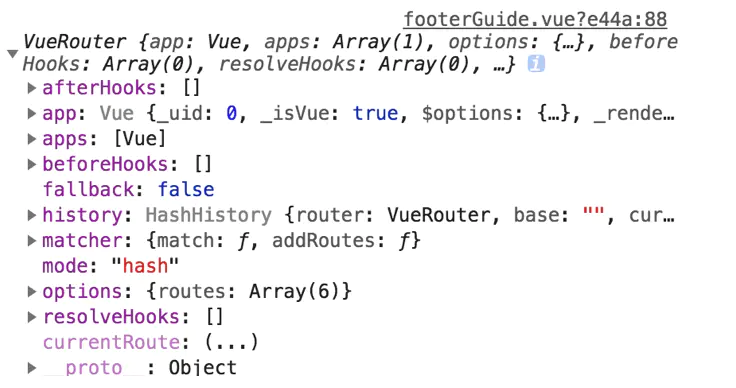

# -----------------------==(VUE柒)==-------------------------

# 路由=>day8_15

## 一、回顾与技术栈梳理

>  1.node-路由
>
>  ​    指向当前应用的某个具体资源的路径
>
>  2.express
>
>     两层路由
>
>  ​    app.js 具体的某个router文件
>
>  3. sequelize orm的框架
>
>  ​      持久层 特别容易特别方便
>
>  ​      model 创建是手动的
>
>  ​      sequelize-auto 快捷工具 model全自动生成
>
>  ​        持久层只剩下调用api
>
>  4. 升级pxpress成koa2
>
>  ​      ctx 
>
>  ​      单层路由,允许在单层路由里定义多级路由
>
>  ​	5.一阶段a标签定位到页面的某个位置
>
>  ​      Bootstrap

## 二、前端路由的概念

>​    vue 当作是页面显示的工具
>
>1. 锚点
>
>​      \#xxxx -->称为hash值
>
>2. 服务端的路由
>
>​      定位服务端的唯一的资源
>
>3. 前端的路由
>
>​      页面并没有跳转也不会刷新.知识基于url+#hash
>
>​        定位到页面上的唯一的一个资源
>
>​        ==>vue里头其实就是定位到某个具体的组件
>
>​        ==>vue-router
>
>  (3.1)  hash值不一样,只会定义到页面上某个具体的内容(a标签)
>
>   (3.2) 大前提: vue环境下,hash值变了,会让某个具体的组件显示出来,而且
>
>​        同时会隐藏掉当前的组件

## 三、vue中router与router与route区别

### 1.$route对象

$route对象表示当前的路由信息，包含了当前 URL 解析得到的信息。包含当前的路径，参数，query对象等。

>1.$route.path**   字符串，对应当前路由的路径，总是解析为绝对路径，如"/foo/bar"。
>
>2.$route.params**   一个 key/value 对象，包含了 动态片段 和 全匹配片段，   如果没有路由参数，就是一个空对象。
>
>3.$route.query**   一个 key/value 对象，表示 URL 查询参数。   例如，对于路径 /foo?user=1，则有$route.query.user == 1，   如果没有查询参数，则是个空对象。
>
>4.$route.hash**   当前路由的hash值 (不带#) ，如果没有 hash 值，则为空字符串。锚点*
>
>5.$route.fullPath**   完成解析后的 URL，包含查询参数和hash的完整路径。
>
>6.$route.matched**   数组，包含当前匹配的路径中所包含的所有片段所对应的配置参数对象。
>
>7.$route.name  当前路径名字
>
>8.$route.meta 路由元信息
>
>\```
>
>route object 出现在多个地方:
>
>组件内的 this.route和route和route watcher 回调（监测变化处理）;
>
>router.match(location) 的返回值
>
>scrollBehavior 方法的参数
>
>导航钩子的参数：
>
>router.beforeEach((to,from, next)=>{//to 和from都是 路由信息对象,后面使用路由的钩子函数就容易理解了})


### 2.$router对象

> $router对象是全局路由的实例，是router构造方法的实例。

##### (2.1)push

```js
1.字符串this.$router.push('home')

\2. 对象this.$router.push({path:'home'})

\3. 命名的路由this.$router.push({name:'user',params:{userId:123}})

4.带查询参数，变成 /register?plan=123this.$router.push({path:'register',query:{plan:'123'}})

push方法其实和<router-link :to="...">是等同的。
注意：push方法的跳转会向 history 栈添加一个新的记录，当我们点击浏览器的返回按钮时可以看到之前的页面。
```

##### (2.2)go

```js
 页面路由跳转 
前进或者后退this.$router.go(-1) // 后退
```

##### (2.3)replace

```js
push方法会向 history 栈添加一个新的记录，而replace方法是替换当前的页面，
不会向 history 栈添加一个新的记录
// 一般使用replace来做404页面
this.$router.replace('/')
配置路由时path有时候会加 '/' 有时候不加,以'/'开头的会被当作根路径，就不会一直嵌套之前的路径。
```



### 3.区别

>#### $router
>
>$router是去全局的一个路由实例(全局变量),
>
>1. `this.$router.push({path: '/login'}); // 路由跳转, 向 history 中增加一条记录`
>2. `this.$router.go(-1); // 路由前进(正数)或者后退(负数), 0刷新当前页面`
>3. `this.$router.replace({path: '/login'}); // 在 history记录中替换当前路径, 不记录.`
>
>#### $route
>
>\$router是一个跳转的路由对象(局部变量), 每一个路由都有自己的route, route中记录了当前路由的跳转的name, path, params, query;
>	获取的时候, `this.$route.path, this.$route.query`$router

## 四、路由(vue-router)使用

##### (4.1)引包并使用

```js
 引包 import VueRouter from '../lib/vue-router-3.0.1' 
 Vue.use(VueRouter)
```

##### (4.2)配置routes

>1. path  2.component 3.redirect 4.挂载路由 5.创建组件占位符(html) router-view
>2. 代码示例见后面

## 五、router-link的使用

>1. 默认会被渲染成a标签的锚点形式:可以更改路由-hash
>
>  可以通过指定tag属性,更改router-link渲染城的标签的格式
>
>  此时router-link可以更改hash,是基于编程式导航(js)
>
> 2.编程式导航:
>
>​     是比router-link更常用的一种改变路由地址的方式
>
>3. $router 路由对象
>
>1. 前进 forward(n)  2.后退 back(n)  3.go(n) 4.n>0后退  5. 跳转
>
>4. $route hash对象

##### (5.1)代码示例

```html
   <div>  <!-- 使用路由 tag可以渲染成变得标签格式,实际上是帮我们绑定事件 -->
          <router-link tag="div" to="/login" >登录</router-link>
          <router-link to="/res" >注册</router-link>
          <router-link to="/xxx" >异常演示</router-link>
          <!-- 直接使用a标签要加#  -->
          <a href="#/login"> 是</a>
        </div>
```

## 六、路由带参

#### (6.1)怎么传?

##### a.restful风格 以占位符的形式

```js
  当路由变为xxx的时候要显示的式xx组件,同时要给这个组件传n个参数
​    1)restful风格 以占位符的形式,但是每个占位符参与路由筛选的过程
​       http://localhost/#/1/2/3  
​       /1/2/3  即是参数也是路由规则
​       path:"/:a/:b" 就必须完全匹配才能找到的
```

##### b.查询字符串的方式

```js
  2)查询字符串的方式,跟传统的url地址传参的形式一样,参数包括
​      问号在内的字符串式不参与路由筛选的过程
​    http://localhost/login?x=1
​    其中?x=1不属于路由配置path ,只有login是path要筛选的
```

#### (6.2)怎么取?

##### a.\$route --> 以$开头的组件与实例通用

```js
   查询字符串 
       http://localhost/hongjilin.html?a=11#/login/1/2?a=111
        fullPath: "/login/1/2?a=111"
        hash: ""
        matched: [{…}]
        meta: {}
        name: undefined
        params: {0: "/login/1/2"}
         path: "/login/1/2"
        query: {a: "111"}
//vm.$route.query....
```

##### (6.3)具体代码示例

###### 1.query方式传参数

```js
this.$router.push({path: '/user', query: {id: '27001'}});
// 获取参数方式:
this.is = this.$route.query.id;

```

###### 2.params 方式传递参数

```js
this.$router.push({name: 'user', params: {id: '27001'}});
// 获取参数方式
this.id = this.$route.params.id;
-------------------------------------------------------------------------------------------------
需要注意的是使用params传参的时候, 路由配置必须按照以下方式来配置, name属性必须有, path后面必须写上传递的参数名, 这样才能保证刷新页面的时候, 参数不会被丢失.
{
	path:'/user/:id',
	name: 'user',
	component: (resolve) => { require(['../components/user/index.vue'], resolve)}
},
```

## 七、路由器嵌套

##### 1.前端template代码示例

```html
 <transition mode='out-in'>
        <router-view>

        </router-view>
      </transition>
---------------------------------------------------------------------
<!-- template最好不要在容器里面 -->
<template id="father">
        <div style="background-color: aquamarine;">
           <h1>我是父亲</h1>
           <router-view></router-view>   
        </div>
    </template>
```

##### 2.js端代码示例以及注意事项

```js
   {
            path:'/father',
            component:fater,
            children:[
                {//如果加了/ 代表不能是father/regist 而是直接根目录到regist
                    path:'regist', //father(只显示父亲) //father/regist(在显示父亲的之后再显示儿子)
                    //定义的组件
                    component:res,
                }
            ]
        },
```

## 八、全部代码示例

### 1.前端html

```html
  <div id="app">
      <transition mode='out-in'>
        <router-view>
        </router-view>
      </transition>
        <div>
          <!-- 使用路由 -->
          <router-link tag="div" to="/login" >登录</router-link>
          <router-link to="/res" >注册</router-link>
          <router-link to="/xxx" >异常演示</router-link>
          <!-- 直接使用a标签要加#  -->
          <a href="#/login"> 是</a>
        </div>
     </div>
 <div>--------------------------------------------------------</div>

<!-- template最好不要在容器里面 -->
<template id="father">
        <div style="background-color: aquamarine;">
           <h1>我是父亲</h1>
           <router-view></router-view>   
        </div>
    </template>

    <template id="login">
        <div>
          <!-- 绑定 -->
          <h1 @click="$emit('hong',1,2,3,4)">login</h1>
          <h1 @click="$emit('dier',1,2,3,4)">惦记我调用第二份父亲方法</h1>
        </div>
    </template>
    <template id="login1">
        <div>
          <h1 @click="$emit('hong',1,2,3,4)">login</h1>
          <h1 @click="$emit('dier',1,2,3,4)">sss</h1>
        </div>
    </template>


    <template id="regist">
        <div>
          <h1>注册</h1>
          <h1>zzz</h1>
        </div>
    </template>

    <!-- template最好不要在容器里面 -->
    <template id="error">
      <!--template的根容器只能有一个  -->
        <div>
          <!-- <h1 v-text="msg" @click="say()"></h1> -->
          <h1>错误找不到</h1>
          <h1>zzz</h1>
        </div>
    </template>
```

### 2.路由代码示例

```js
import Vue from '../lib/vue-2.4.0' 
import './index.scss'
import VueRouter from '../lib/vue-router-3.0.1' 
//通过import需要通过use进行挂载
Vue.use(VueRouter)

const login={
    template:'#login',
    data() {  return {   msg:222  } },
    methods:{ say(){alert("我是xxx") }}
}
const res={
        template:'#regist'
}
const fater={
        template:'#father'
}
const error={
    template:"#error"
}

//使用路由的时候将所有组件注册放出来定义
//必须在实例的作用域内
const  router = new VueRouter({
    //路由匹配从上到下,匹配到一个不匹配
    routes:[
        {
            path:'/',
            //重定向到/login
            redirect:'/login'
        },
        {
            path:'/login',
            //定义的组件
            component:login,
        },
        {//这是嵌套组件
            path:'/father',
            component:fater,
            children:[
                {//如果加了/ 代表不能是father/regist 而是直接根目录到regist
                    path:'regist', //father(只显示父亲) //father/regist(在显示父亲的之后再显示儿子)
                    //定义的组件
                    component:res,
                }
            ]
        },
        
        {   //最后找不到的
            path:'*',
            component:error
        }
    ]

})


window.vm=new Vue({
    el:'#app',
    data:{
        msg:"hello world",
        list:[
            1,2,3,4,5
        ],
        flag:false,
        jilin:'login'
    },
    //将定义的路由挂载上来,key与value相同可以缺省
    router,
    methods: {
        del(index){
            this.list.splice(index,1)
        },
        fater(...son){
            alert("我是父亲"+son);
        },
        fater2(...son){
            alert("我是第二份父亲"+son);
        },
    },
    components:{
        // res
      //再外面定义后可以直接引入
    }

})
```

