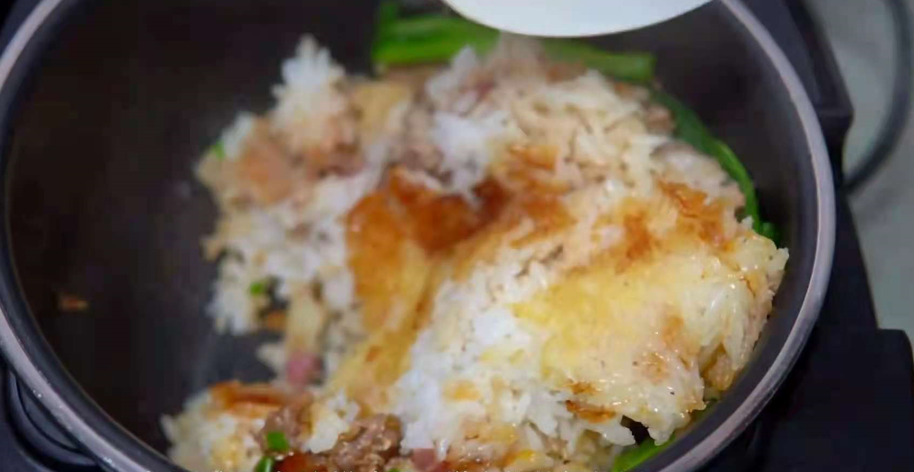
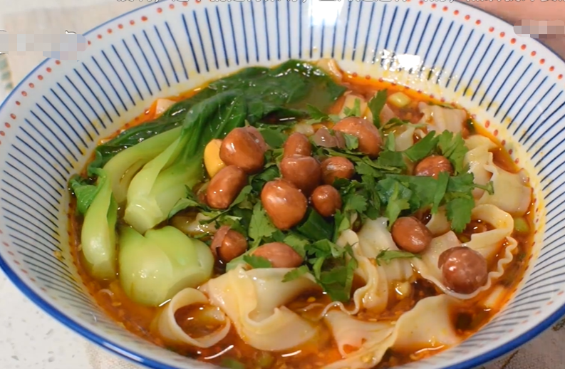

# #说明

> 打工人总要会点厨艺
>
> 正常来讲,主食类都是懒得炒菜或者是想要节省做饭时间以及成本,所以此笔记中记录的都会是本人觉得相对简单且便捷的做法  

# 一、炒饭类

## Ⅰ-私房虾仁炒饭

>1. 需要提前准备的食材
>
>     1. 打匀几颗蛋(视个人口味,本人2颗)
>     2. 虾仁,虾头(虾头用来煎油,比较好吃,没有也可)
>     3. 提前调好料汁:生抽三勺、老抽一勺、耗油一勺、黑胡椒一勺、白糖半勺.调好后先下锅中小火煮至冒泡倒出备用
>
>2. 炒菜步骤:
>
>     1. 倒油至油温6成热时下入蛋液(此处油可多点,会比较香),煎熟(或者有朋友喜欢焦黄色看个人喜好)导出备用
>     2. 下油,再放入葱段炸葱油(这一步会更香,没有也可)、捞出葱渣再放入虾头煎出虾油捞出虾头倒掉,再放入虾仁煎至金黄捞出
>     3. 下葱蒜丁、萝卜丁、少许油炒香,炒至萝卜丁出红油.这时放入`隔夜饭`炒散
>     4. 倒入之前提前备用的料汁炒匀,最后放入刚才备用的虾仁以及蛋.
>     5. 炒至冒锅气,加入葱花,再乘出(锅气就是锅底会冒白烟,但不是炒焦的那种)
>
>3. 上成品图
>
>  

# 二、煲仔饭类

> 一道好的煲仔饭,一定要做到米饭粒粒分明,底部要有脆脆的锅巴,肉菜要在不失肉新鲜本味的基础上嫩滑入味,青菜要颜色青绿、入口脆爽,酱汁要酱香味浓郁但不咸不腻,最好用`砂锅`做(更好吃),但是贫穷的我只能用`电饭煲做饭`,所以以下菜谱适用于电饭煲

## Ⅰ-腊味滑鸡煲仔饭

>学自B站**一家之煮黄子宸**UP的教学视频
>
>1. 需要预处理的食材:
>
>     1. 首先准备鸡腿,然后将鸡肉剔下来(很简单,百度一些很多教程),然后需要将带鸡油部分的鸡皮去掉(防止腥腻,也减少油脂摄入-这不就相当于减肥了?!!!!).随后将鸡肉顺着鸡肉纹理纵向切成竖条(通俗讲就是不要横着切`手动滑稽`),口感会比较好.然后每条差不多这么大(略比食指粗),这样的鸡块处理完就像一条条田鸡腿
>     2. 腌制鸡腿块:a) 葱白2小段、姜片2片、鲜酱油2勺、料酒1.5勺、耗油1勺、盐0.5勺、十三香粉0.5勺、黄冰糖粉1勺子(可以换白糖,这个黄冰糖的口感比较柔和,好吃) b) 所有调料放好后抓匀、顺时针旋转过程加入2~3勺水,确定肉将水吃完后再加入(抓起后不会滴水),如此反复3次 c),再加入1勺`生粉`(一斤鸡腿肉加1勺),抓匀后最后加一点油--``每勺等于10克/15ml`,腌制40分钟
>     3. 香菇干泡发切成宽条,切点腊肠(宽度建议0.5厘米左右口感好)
>     4. 煲仔饭的米最好选用:籼米、丝苗米、泰国香米这几种,淘米次数不要过多,2~3次即可 --挑米小技巧:`米粒没有腹白的品质更高`
>     5. 买点`芥兰`,将其根部皮削掉防止太老,其他青菜也行
>
>2. 开始煮饭:
>
>     1. 水跟米比例`1:1.1`,大差不差就行了,但是尽量煮的硬一点,煲仔饭如果饭软的话不好吃,没锅巴.(喜欢吃软饭的同学当我没说,手动滑稽)
>     2. 将腊肠与香菇排在米饭上面,用电饭锅开始蒸
>     3. 调一份简单鼓油汁:白糖1勺、酱油1勺、耗油1勺、老抽0.3勺、蒸鱼鼓油1勺 --``每勺等于10克/15ml`
>     4. 在差不多电饭锅煮熟米饭的最后15~20分钟左右打开,将腌制的鸡腿放入(此时放入鸡腿才不会烂,饭也不会串味),再沿着``锅边``淋入两勺油(这样锅巴容易出且不粘锅)
>     5. 到电饭锅定时结束自动保温时,再继续蒸五分钟(重新点开关),这是锅巴能不能生成的关键
>     6. 这时候可以烫一下青菜,然后将烫青菜的水舀两小勺加入刚刚的鼓油汁(也可以不加,只是不加酱汁太少等会搅匀的时候不好弄均匀)
>     7. 时间到后将青菜码上饭面,淋上之前调好的鼓油汁,收工可以吃了
>
>3. 效果图
>
>  

# 三、面类

## Ⅰ-简单酸汤面

>学自B站UP**屋里小姿**的美食视频
>
>1. 需要预处理的食材:
>
>     1. 首先小葱、大蒜、香菜(看个人口味决定放不放)切碎备用
>
>     2. 调汁:
>
>       1) 一勺蒜末、一勺葱花、一勺辣椒面、一勺白芝麻(看口味),`淋上热油(很重要)`激调料香味
>
>       2) 加入两勺生抽、两勺香醋、一勺耗油、少许盐和糖(会提升口感复杂度)
>
>       3) 搅匀备用
>
>     3. 准备一定的青菜(营养要均衡),此处准备上海青,洗净择好备用
>
>2. 开始煮面:
>
>     1. 烧至水微微冒泡,下入超市买的刀削面(扁面口感好)
>     2. 水开后加入少许冷水,同时加入青菜烫熟(不急的可以等面烫好后下)
>     3. 面条熟透后捞起 --小贴士:捞起一条掐断,如果中间没有白芯就是熟了
>     4. 将面条放入刚刚调好的汁中,再淋入少许煮面的汁水,加入烫熟的青菜
>     5. 按照个人口味可以加炸花生粒、等
>
>3. 效果图
>
>  
>
>

