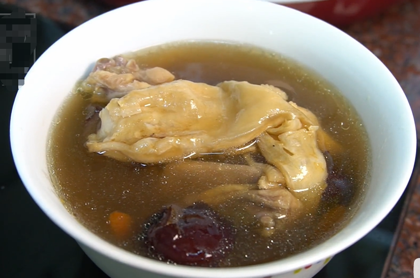
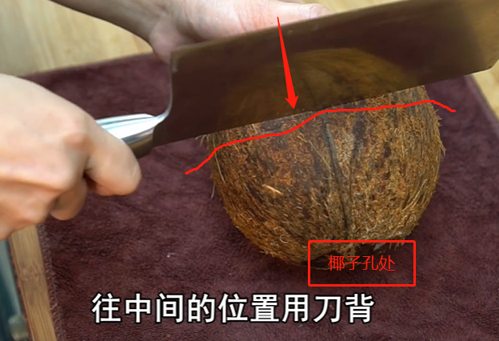
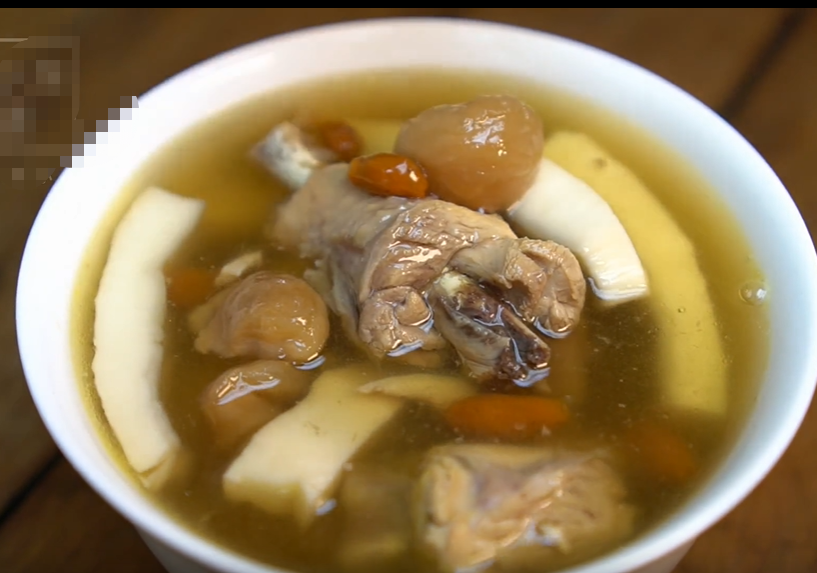
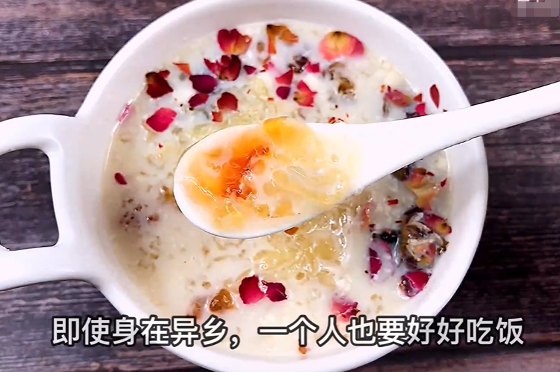
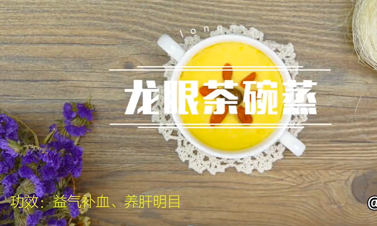
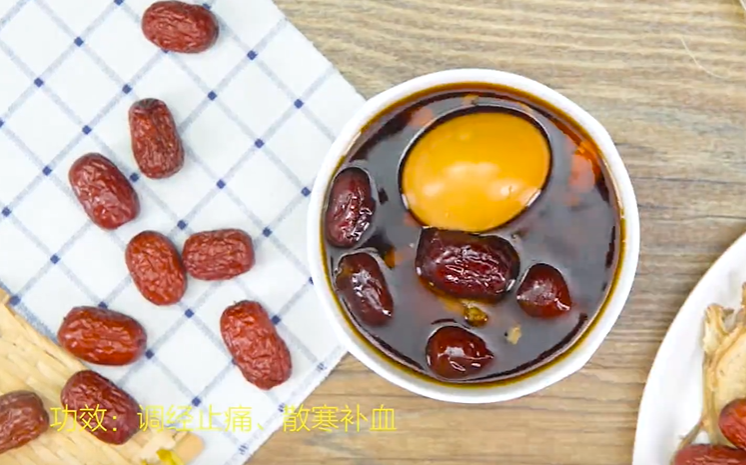
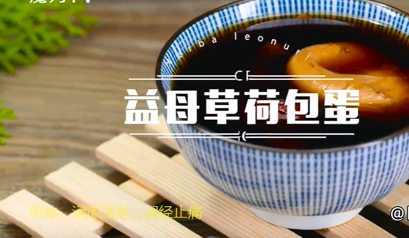
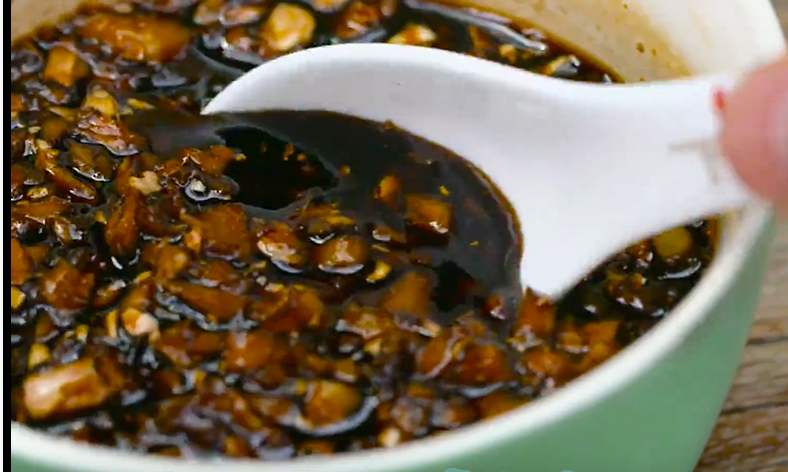
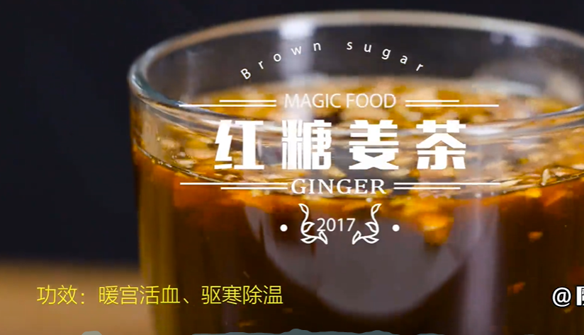

# #说明

> 曾看到这么一句话:"人这辈子 总是在等 等下次 等不忙 等有条件 等有时间 等有钱了 可后来等没了选择 等来了遗憾"
>
> 所以,咱打工人们不要等了,为自己或为亲人做一份滋补类食物,起码要留住健康
>
> 对你也对自己说:即使在异乡,一个人也要好好吃饭

# #目录

>[TOC]

# 一、鸡汤类

## Ⅰ-潮汕花胶鸡汤

>学自B站UP**我是马小坏**的美食视频
>
>1. 功效:具有`补气养血润肺`的功效,对于女孩子以及体质弱的小孩子可以考虑多喝这个汤
>
>2. 需要预处理的食材:
>
>   1. 泡发花胶:首先需要提前泡发一夜花胶(也可以不泡发,但是炖的时长需要延长一小时),下方`小贴士`
>
>      1) 花胶实际上是鱼鳔,富含胶原蛋白,但是品质好的花胶效果才好
>
>      2) 花胶泡发方式:先上锅蒸5分钟,冷却后放冷水放入冰箱泡一晚上
>
>   2. 鸡肉处理:买来鲜鸡半只或者一只(不要冻品),洗净切块,`冷水下锅焯水至水开翻滚30秒`左右捞出清洗干净
>
>   3. 准备少许红枣清洗并去核,准备少许枸杞
>
>3. 开始炖煮
>
>   1. 将上面准备的食材一并放入炖锅(最好是隔水加热的那种,能保留更多营养),加水并使水刚刚没过食材即可
>   2. 加入两片姜片
>   3. 调隔水炖一个半小时(花胶未泡发需2.5小时)
>   4. 时间到后根据自己口味添加少许盐即可
>
>4. 效果图:
>
>   

## Ⅱ-椰子鸡汤

>学自B站UP**我是马小坏**的美食视频
>
>1. 功效:就是好喝
>
>2. 需要预处理的食材:
>
>      1. 椰子选购:可以选择买椰青(椰肉嫩,但是味道淡,适合煮)也可以买椰皇(椰肉老,但是味道足,适合炖)
>
>      2. 开椰子:就着椰子口开洞,放出椰子水.并将椰壳打开取肉、并将椰肉切条或者切块
>
>         1) 放椰子水技巧:买来的椰子通常有三个洞,像嘴巴的那个洞用`刀尖`可以轻易的戳开,然后用吸管可以很轻松导出椰汁(没有的就手摇)
>
>         2) 取椰肉技巧:
>
>         1. 往椰壳中间部分用刀背敲就很容易敲碎
>            
>         2. 敲成块状后放锅上蒸几分钟(这样果肉很容易取出)
>         3. 用勺子挖,然后切成条(不能太细,否则炖出来就烂了)
>     
>  3. 准备`鸡肉`与`瘦肉`:鸡肉瘦肉切块焯水(具体焯水方法看上一个),焯完水后捞出洗净
>  
>3. 开始炖煮:
>
>   1. 先将焯完水的鸡肉与瘦肉放入炖锅中垫底,再放入椰肉
>   2. 加入几颗桂圆(增加滋补功效也增加甜味)--也可以再加入一小把薏米与两颗红枣(不是必要,也是增加鲜甜度)
>   3. 加入少许枸杞(正常十颗左右)
>   4. 加入刚刚放出的椰子水
>   5. 再加入适量清水--注意:清水与椰子水比例最好不要超过1:1.2,否则可能味道偏淡,有条件的全部加椰汁
>   6. 最后加入两片姜
>   7. 选择肉汤类炖煮3小时,选择椰皇就必须得炖久,否则很硬不好吃,别问我怎么知道的
>
>4. 效果图:
>
>   

# 二、糖水甜品类

## Ⅰ-桃胶银耳莲子羹

>1. 功效:具有`补气养血`的功效
>
>2. 需要预处理的食材:
>
>   1. 提前泡发桃胶:将干桃胶放入清水中泡发一个晚上.泡发好后多淘洗几次洗去杂质备用
>   2. 提前泡发银耳:提前3小时或者提前一个晚上用冷水泡发(如果急用可以用热水泡发,估摸着一小时就可以泡发好),泡发好后剪去根部撕成小朵备用
>   3. 洗一点莲子与百合备用,注:要用的时候再洗
>
>3. 开始炖煮:
>
>   1. 放入泡发洗净的桃胶、放入泡发撕好的银耳、放入洗净的莲子与百合、再加入多一点的清水
>   2. 大火煮至沸腾(可以先放锅中煮开后倒入炖锅)再`转小火煲一小时半`,一定要小火煲!!
>   3. 小火煲一小时半后再打开锅盖,此时加入适量`黄冰糖` 与适量枸杞--此冰糖甜味不重,不会影响口感
>   4. 煮至冰糖化开即可
>
>4. 效果图:
>
>   

## Ⅱ-牛奶炖桃胶

>学自B站UP主**王小北酱饭**的美食视频
>
>1. 功效:具有`补气养血`的功效
>
>2. 需要预处理的食材:
>
>   1. 提前泡发桃胶、雪燕、皂角米:将桃胶、雪燕、皂角米放入清水中泡发一个晚上.泡发好后多淘洗几次洗去杂质备用
>   2. 提前泡发银耳:提前3小时或者提前一个晚上用冷水泡发(如果急用可以用热水泡发,估摸着一小时就可以泡发好),泡发好后剪去根部撕成小朵备用
>   3. 红枣洗净切开去核
>
>3. 开始处理:
>
>   1. 锅中倒入适量清水(拿捏不准的就倒1L),银耳冷水下锅,水开后开始计时
>   2. `十分钟后`加入泡发好的桃胶、皂角米`转中小火继续煮`
>   3. `再过十分钟`加入枸杞、黄冰糖(此冰糖味道好)、红枣`小火慢炖`
>   4. `再过十分钟`加入雪燕与牛奶`小火慢炖`
>   5. 整个过程差不多40分钟,最后可以撒上少许碎玫瑰花增加清香味与增加美观(毕竟颜值高看起来更好吃)
>
>4. 效果图:
>
>   

# 三、多喝热水替代方案类

>看到了就Mark了,男孩子难道就不能喝了? 程序员就应该啥都会

## Ⅰ-龙眼茶碗蒸

>1. 功效:具有`益气补血、养肝明目`的功效
>
>2. 需要预处理的食材:
>
>   1. 桂圆几颗去壳取肉(不用去种子)加入清水浸泡备用
>   2. 适量枸杞加入清水浸泡备用
>
>3. 开始料理:
>
>   1. 鸡蛋一颗加入温水(不能凝固的那种温度!!)打散,加入适量白砂糖,可以的话搅散后最好过筛(口感会更细腻)
>   2. 将处理好的鸡蛋液撑在器具中放入蒸锅,凝成蛋羹
>   3. 蛋羹表面放上浸泡好的桂圆与枸杞(可以稍微摆盘好看点),蒸两分钟
>   4. 完成
>
>4. 效果图
>
>   

## Ⅱ-当归炖蛋

>1. 功效:具有`调经止痛、散寒补血`的功效
>
>2. 需要预处理的食材:
>
>   1. `当归`提前用冷水浸泡一晚上(急用的话也可以用热水泡,但是功效会弱点)
>   2. 煮一颗水煮蛋,去壳备用
>   3. 红枣、枸杞、桂圆提前用清水浸泡洗净
>
>3. 开始料理:
>
>   1. 加入提前泡好的当归、洗净的枸杞与红枣煮沸
>   2. 加入去壳的水煮蛋
>   3. 加入红糖块,`小火炖煮3小时`
>
>4. 效果图
>
>   

## Ⅲ-益母草荷包蛋

>1. 注意:要是给女朋友吃的,记得是在平时而不是特殊时期,你问为什么?`活血止淤`可懂?主要是平时调理用的
>
>2. 功效:具有`调经止痛、活血止淤`的功效
>
>3. 开始料理:
>
>   1. 益母草放入过滤球中(主要是为了煮完后能捞出料渣防止影响口感),再加入清水中煮沸
>   2. 加入红枣、红糖煮几分钟后捞出益母草
>   3. 加入一颗生鸡蛋煮沸即可
>
>4. 效果图
>
>   

## Ⅳ-红糖姜茶

>1. 这个是万能的,而且很快,给女朋友干了这杯红糖姜茶,去改代码岂不没人打扰快哉快哉!
>
>2. 功效:具有`暖宫活血、驱寒除温`的功效
>
>3. 开始料理:
>
>   1. 一块`老姜`洗干净,姜皮削掉最好(姜皮凉性),然后切碎或者切丁(切丁喝的时候不容易喝到姜块)
>
>   2. 取一个碗,底部铺一层姜粒,然后再一层红糖,如此反复铺满,最后封上保鲜膜
>
>   3. 放入蒸锅,`中火清蒸30分钟`
>
>   4. 此时得到的是如此状态
>
>      
>
>   5. 用时勺出部分放入杯子,开水冲服即可
>
>4. 效果图
>
>   

