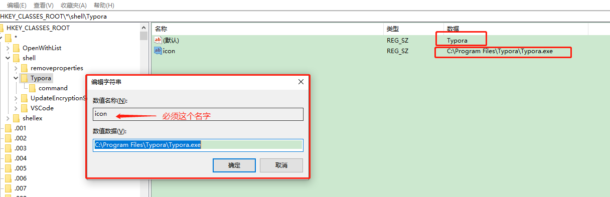

## #说明

>有时我们装了一个编辑类 ( 经常用 ) 软件,如:Vscode、Typora等常用软件.
>
>使用时常用方式: ( 1 ) 需要先找到这个软件打开,再于软件中打开此文件 ( 2 ) 将文件夹拖入此软件[ .exe ] 图标上打开
>
>是否觉得稍许麻烦,**难道不能右键像新建一个文件夹或者一个文本文件那样操作吗?**
>
>答案是肯定的,而且任何软件(不限于编辑类,音频播放器啥的都可)都能如此,下面以我的`Typora`为例


## Ⅰ- 打开注册表

> `windows键 + R` 打开运行窗口，输入`regedit` ，然后点击“确定”打开注册表
>
>   

## Ⅱ- 找到shell，然后新建 `项`

>依次展开\HKEY_CLASSES_ROOT*\shell，在shell上点击**右键->新建->项**，命名为[ Typora ]（注意：这个虽然可以随便命名，但是最好不要命名成中文，否则你最后创建好之后右键的时候可能会不出现），在[ Typora ]上点击**右键->新建->项**，命名为`command`（必须这个名）
>
>
>[ Typora ]是shell的子目录，command是[ Typora ]的子目录。（所以你建立其他软件的方式是也是一样的）

## Ⅲ -给新建项[ Typora ]添加键值对

>给新建项[ Typora ]添加键值对  ，这个类似添加环境变量，是键值对的形式，[ Typora ]一共要添加两个键值对。
>
>* 新建: 右键右侧绿色空白处->新建->字符串值
>* 修改 [ key ] 名称 : 选中要修改的key 右键->重命名
>* 添加值: 双击要写入的 [ key ], 就会有弹窗
>
>| Key  | Value                              | 说明                                          |
>| ---- | ---------------------------------- | --------------------------------------------- |
>| 默认 | Typora                             | 这个默认的位置填写的是一个快捷键的名称        |
>| icon | C:\Program Files\Typora\Typora.exe | 这里填写的是安装软件的可执行exe文件的完整路径 |
>
> 

## Ⅳ - 给新建项command添加键值对

>| Key  | Value                                 | 说明                                   |
>| ---- | ------------------------------------- | -------------------------------------- |
>| 默认 | C:\Program Files\Typora\Typora.exe %1 | 这个默认的位置填写的是一个快捷键的名称 |
>
>注意 : 填写数值的格式是：`路径+空格+%+1`
>
> 

## Ⅴ - 成功示例

> 

## Ⅵ - 使用shell命令直接快捷绑定

>将VSCode添加至右键菜单(Windows下)
>
>`问题`:Windows上面安装Visual Studio Code编辑器后,常常会因为安装的时候忘记勾选等原因,没有将"Open with Code(右键快捷方式)"添加到鼠标右键菜单里,使用起来多有不便,所以需要我们手动将VSCode添加至鼠标右键菜单之中.

>`解决`:
>
>1.新建reg文件.在桌面上新建一个文本文件,然后将文件后缀改为:*.reg,文件名任意,例如:add_shortcut.reg.
>
>2.编写文本文件内容.将下面的内容Copy到刚才新建的*.reg文件中,文本内容如下:
>
>3.下面代码中的地址表示VSCode在电脑上的安装路径,如果不是默认安装的或者路径不一样,`需要改成和电脑上实际安装路径一致的`.
>
>4.文件编辑好了之后保存关闭.然后双击运行 add_shortcut.reg ,遇到提示点击 "确定"或"是".不出意外,便大功告成了!

```js
Windows Registry Editor Version 5.00

[HKEY_CLASSES_ROOT\*\shell\VSCode]
@="Open with Code"
"Icon"="C:\\Users\\Administrator\\AppData\\Local\\Programs\\Microsoft VS Code\\Code.exe"

[HKEY_CLASSES_ROOT\*\shell\VSCode\command]
@="\"C:\\Users\\Administrator\\AppData\\Local\\Programs\\Microsoft VS Code\\Code.exe\" \"%1\""

Windows Registry Editor Version 5.00

[HKEY_CLASSES_ROOT\Directory\shell\VSCode]
@="Open with Code"
"Icon"="C:\\Users\\Administrator\\AppData\\Local\\Programs\\Microsoft VS Code\\Code.exe"

[HKEY_CLASSES_ROOT\Directory\shell\VSCode\command]
@="\"C:\\Users\\Administrator\\AppData\\Local\\Programs\\Microsoft VS Code\\Code.exe\" \"%V\""

Windows Registry Editor Version 5.00

[HKEY_CLASSES_ROOT\Directory\Background\shell\VSCode]
@="Open with Code"
"Icon"="C:\\Users\\Administrator\\AppData\\Local\\Programs\\Microsoft VS Code\\Code.exe"

[HKEY_CLASSES_ROOT\Directory\Background\shell\VSCode\command]
@="\"C:\\Users\\Administrator\\AppData\\Local\\Programs\\Microsoft VS Code\\Code.exe\" \"%V\""
```

