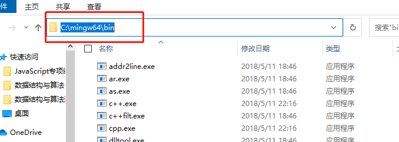
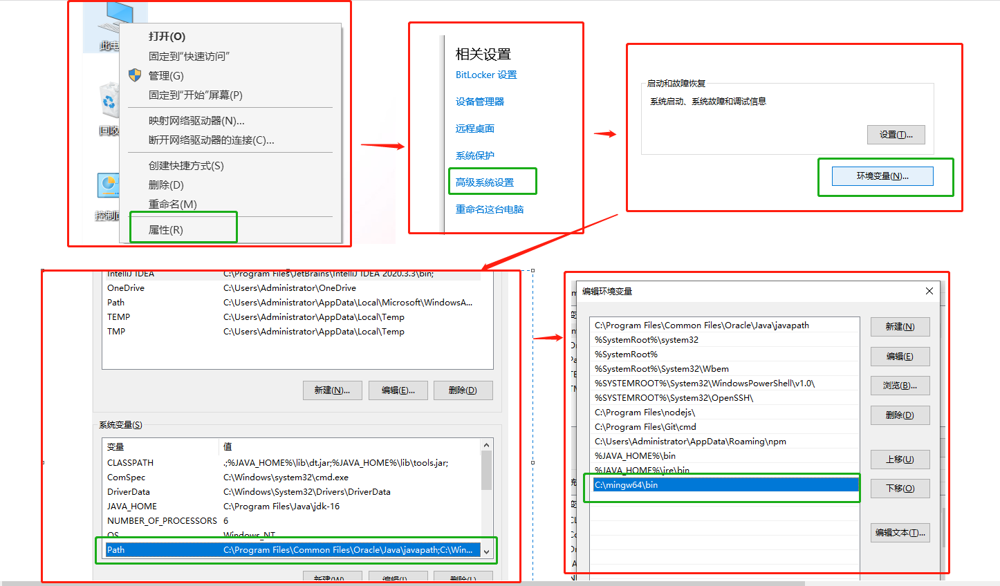
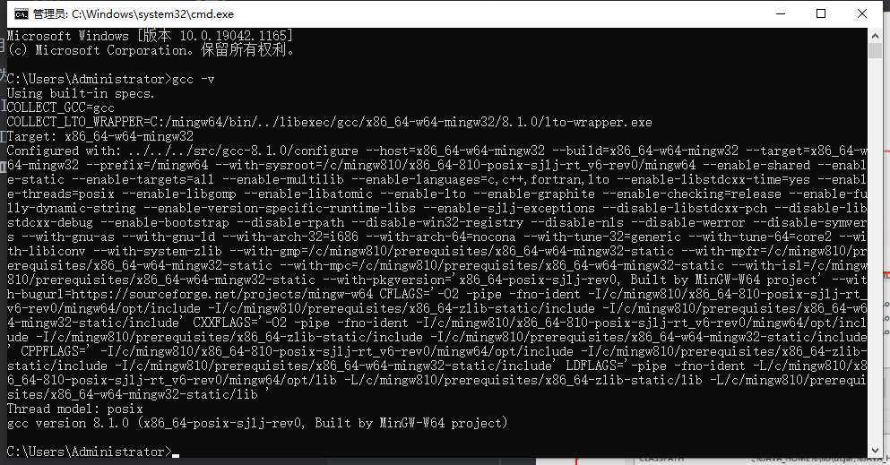
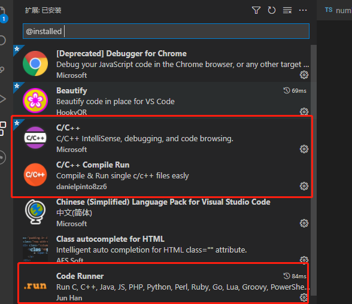
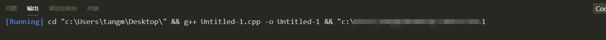
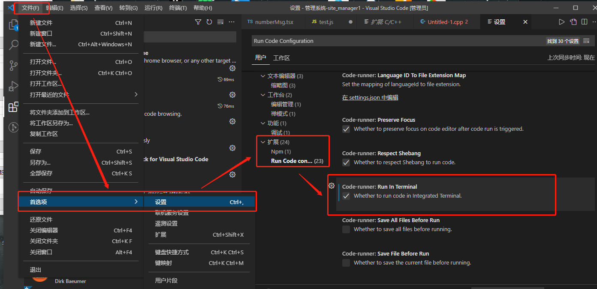
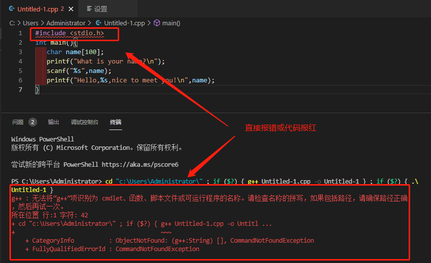
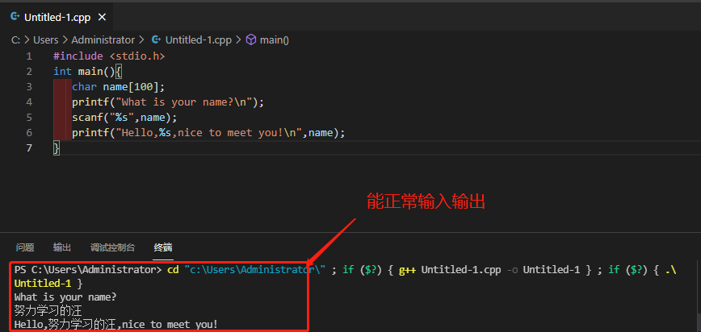

# #说明

>本人大学时期学习的C语言,但是出来工作(本人前端岗)基本都不用此语言了
>
>但最近准备学青岛大学的王卓老师的数据结构与算法课程,课程中使用的是C语言,但出来工作后都不曾接触C语言编译器了,而我又是前端工程师,所以还是想用VSCode来配置C语言的开发环境,用起来也更舒服

# 一、为Windows安装C编译器

### Ⅰ- 下载安装包 (mingw-w64)

>因为vscode只是一个代码编辑器，没有自带有C/C++的编译器，因此首先需要安装一个C/C++编译器并且设置环境变量
>
>mingw-w64只负责程序的编译,只提供命令行操作没有编辑代码的图像界面,代码的编写需要由文本编辑器(如[vscode](https://code.visualstudio.com/))来完成
>
>因为网络问题很难下载,此处分享本人百度云,链接：https://pan.baidu.com/s/18VZoRqyqnTKJXEDT9f1ecg  提取码：h123

### Ⅱ -  解压

>下载后选一个合适的位置解压,这个位置也就相当于是安装位置(此处可以给文件夹改个简短的名字),本人放在C盘
>
>然后进入文件夹下的bin文件夹 ,复制路径,此路径要用来配置环境变量
>
>

### Ⅲ - 配置环境变量

>然后在[此电脑]鼠标右键选择属性 -->选择高级系统设置 --> 点环境变量 --> 选择系统环境变量下的Path --> 选择编辑 -->新建:然后把刚刚复制的文件路径粘贴进去 -->一路点击确定退出
>
> 

####  Ⅳ - 验证

>按win+r运行cmd或者powershell输入gcc -v ,出现以下信息说明一切顺利
>
>
>
>之后就能通过g++ xxx.cpp -o xxx.exe这样的命令行指令编译c/cpp文件了 

# 二、安装与配置VSCode

### Ⅰ - 安装VSCode

> 首先在[微软官网](https://code.visualstudio.com/)下载并安装好`visual stdio code`，建议在安装时将选项全勾选上,傻瓜式操作就不说了

### Ⅱ - 安装必要的插件

>- C/C++
>- Code Runner
>
> 

### Ⅲ - 编译运行程序

>编译运行程序介绍两种方法
>
>1. 使用之前安装好的`Code Runner插件`一键编译运行程序
>2. 打开vscode的`集成终端`使用命令行编译和运行

#### 1、测试一下是否可用

>**点击：文件>新建文件**，出现一个空白文档，将下面的代码复制粘贴到空白文档中,然后点击右上角运行
>
>```c
>#include <stdio.h>
>int main(){
>   char name[100];
>   printf("What is your name?\n");
>   scanf("%s",name);
>   printf("Hello,%s,nice to meet you!\n",name);
>}
>```
>
>

#### 2、可能出现的问题1:

>程序段中使用了`scanf`函数从键盘读取一串字符，这时无法输入数据，也无法结束程序，需要重启一下vscode 
>
>然后依次打开：**文件>首选项>设置>用户>拓展>Run Code Configuration**-->找到**`Run In Terminal`**勾选上
>
>

#### 3、**找不到头文件问题**:

>对于安装了vs2019却使用mingw的情况，这时vscode代码检测会默认使用vs2019的msvc编译器的头文件，如果你使用mingw独有的特殊头文件会报找不到头文件的错误。
>鼠标移动到报错头文件会显示一个灯泡，点击，选编辑"includePath"设置，然后在指定编译器下拉列表中选择gcc或者g++  

#### 3、**vscode集成终端问题**

>windows 10 1903/1909版本，不能使用`cmd`（包括`cmder`），`git bash`作为默认终端，这两个终端输入`clear` / `cls`指令后再关闭终端会造成vscode无响应
>`PowerShell`作为默认终端时，虽然不存在`clear`的问题，但如果往终端输入了任何数据或指令又没有按回车就直接关闭了，同样会造成vscode无响应
>`WSL`没有发现类似的bug

#### 4、成功

> 
>
>至此 已经可以在VSCode的集成终端中正常运行C/C++程序了

