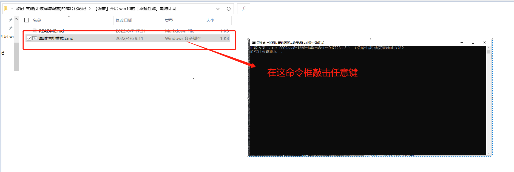
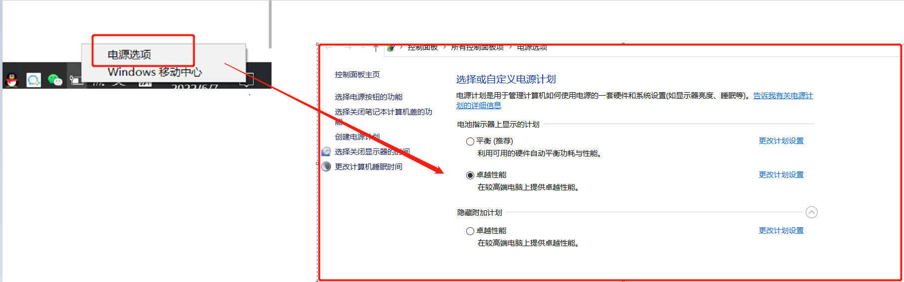

# 开启 Windows 10 中的「卓越性能」电源计

>开启这个「卓越性能」电源计划有两个前提，首先是你需要安装了 Windows 10 版本，其次是这个电源计划是面向高端电脑而设的。虽然说任何电脑都可以开启这个选项，但可能在你并不需要极限使用电脑的情况下，用这个电源计划有可能会适得其反。
>
>但是有一说一，本人17年买的垃圾电脑开了这个模式后玩游戏帧数提升非常明显，基本是肉眼可见的变化

## 源码

>本人在目录中已经放了写好的脚本，只需要双击运行一下即可，但是怕大家不敢乱点，就把代码放到这里展示
>
>```sh
>@echo off
>setlocal EnableExtensions
>setlocal EnableDelayedExpansion
>set "params=%*"
>cd /d "%~dp0" && ( if exist "%temp%\getadmin.vbs" del "%temp%\getadmin.vbs" ) && fsutil dirty query %systemdrive% 1>nul 2>nul || (  echo Set UAC = CreateObject^("Shell.Application"^) : UAC.ShellExecute "cmd.exe", "/k cd ""%~sdp0"" && %~s0 %params%", "", "runas", 1 >> "%temp%\getadmin.vbs" && "%temp%\getadmin.vbs" && exit /B )
>title=添加并启用卓越性能电源计划
>powercfg /list | find "(卓越性能)" > NUL
>if %ERRORLEVEL% == 0 (
>goto SetActive
>) else (
>goto DuplicateScheme
>)
>
>:DuplicateScheme
>powercfg /DUPLICATESCHEME e9a42b02-d5df-448d-aa00-03f14749eb61 && echo 导入完成。 && goto SetActive
>
>:SetActive
>for /f "tokens=3,4" %%i in ('powercfg /list') do (
>if "%%j" == "(卓越性能)" powercfg /SETACTIVE %%i && echo 激活成功。 && goto EOF
>)
>
>:EOF
>pause
>exit
>```

## 使用方式

### Ⅰ-双击bat文件

>注意：只要运行一次即可，在命令行输入任意键后输入框会消失，这是正常的，不要再重复点击运行，否则等会会出现多个相同电源选项（虽然不影响使用）

### Ⅱ - 重启电脑后进入电源选项，选择计划

>1. 运行上面脚本后重启电脑
>2. 随后找到电源选项，这时候就能选择电源计划（图中多了一个重复的「卓越性能」就是为了演示本人多点了一次脚本导致多了一个，但是不影响）
>
>