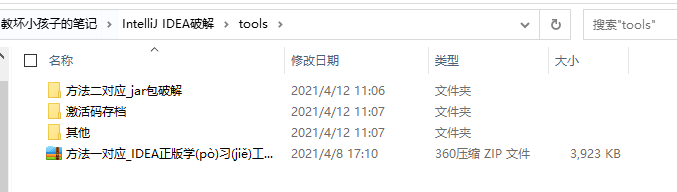
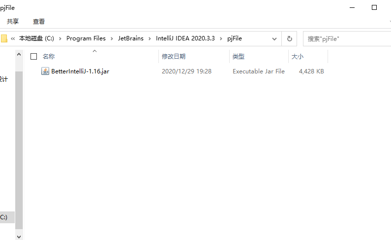
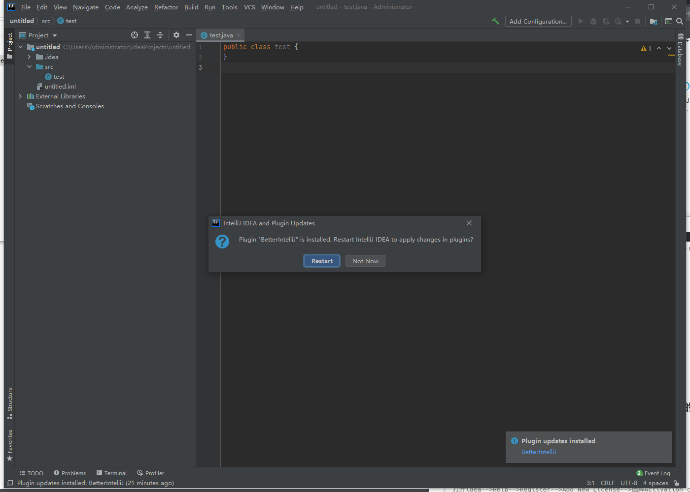
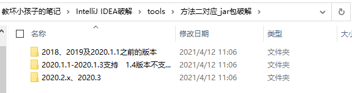
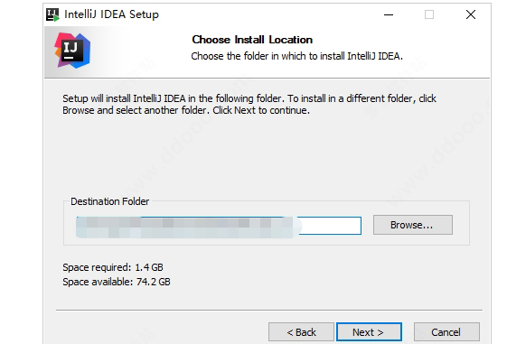
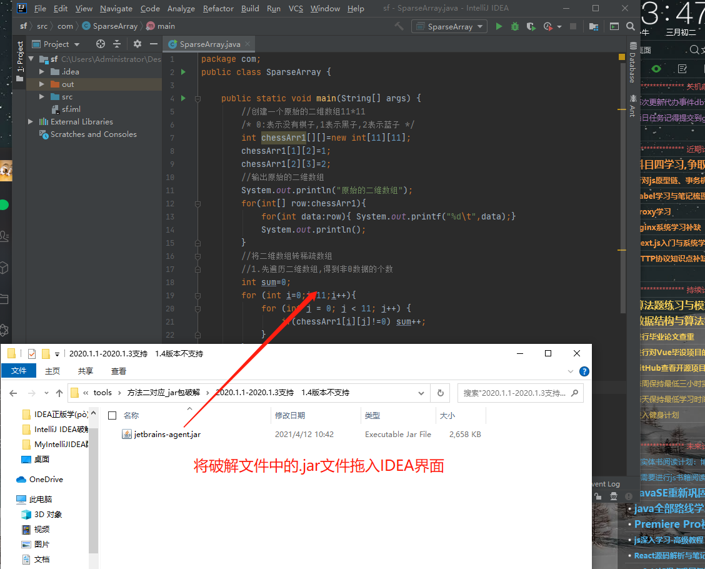
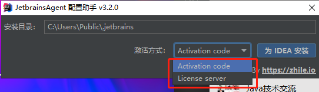
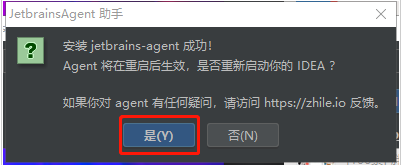

# #此文件为方便gitee网站观阅使用专门创建

> 此笔记文件于某一时间截取复制至此,容易存在更新不及时问题,建议观看同级目录下的笔记文件

# #说明

>1. 少年,请先关闭你的杀毒软件..............
>
>2. 相关工具都传至隔壁文件夹`tools`包中,需要的自取
>
>  
>
>3. 如果破解过程操作失误或者曾经用其他破解方式破解过,需要运行`reset.vbs`进行重置
>
>  
>
>4. 出于方便你我的初衷进行分享,同学们有条件的话还是支持正版。本人因为是学生党,过于贫穷又想学习所以只能.......
>5. idea[官网下载地址](https://www.jetbrains.com/idea/)

# 一、`BetterIntelliJ`进行破解

### 1.首先打开jetBrains任意一个软件

>此方法同样适用于webstrom
>
>此处我下载的是官方`IntelliJ IDEA2020.3U`版本,最好是此版本 or 以下的版本
>
>

### 2.随便新建或者打开一个项目,让idea处于打开项目状态

### 3. 将破解资源.zip文件解压

>1. BetterIntelliJ.zip   -->破解包
>2. reset_jetbrains_eval_windows.vbs  -->失败时使用:失败重置脚本
>3. 激活补丁key.txt     -->激活key
>
>

### 4.解压BetterIntelliJ.zip

>解压BetterIntelliJ.zip得到一个`.jar`文件

### 5.在IDEA的根目录创建一个目录

>1. 项目根目录即:在`bin`同一级目录
>2. 名字随意,但不能含有中文

### 6.将解压的`.jar`文件移入此文件目录

> 

### 7.将此文件目录的`.jar`文件拖拽到IDEA打开项目的界面中

> 这时就会开始破解了,时间视电脑性能而定,直到弹窗让你重启idea
>
> 

### 8.重启IDEA

### 9.注入激活码

>打开idea-->Help-->Register-->Add New License-->选择Activation code-->将激活码复制进去-->点击同意Activate
>
>

### 10.ChinaNB

> 破解成功,过期时间为`2099`年
>
> 

# 二、使用`.jar`文件破解

>1. 于`tools`文件夹中取出对应IDEA安装包版本的jar包
>
>   
>
>2. 本人使用`2020.3U`版本,下面以此为示例

### Ⅰ-双击 ideaIU-2020.3.exe,打开安装软件

>1. 如果电脑上之前有安装老版本的 IDEA, 会提示卸载，小伙伴们按照提示，先卸载掉老版本的 IDEA。安装目录默认为 C:\Program Files\JetBrains\IntelliJ IDEA 2020.3, 这里本人选择的是默认路径
>
>
>
>2. 勾选自己想要创建的桌面快捷方式，笔者的操作系统是 64 位的，所以勾选的 64 位快捷方式
>
>   

### Ⅱ-运行软件

>会先弹出一个注册框，勾选 Evaluate for free, 点击 Evaluate
>
>

### Ⅲ-将破解包移入IDEA界面

>1. 将`tools`文件夹中的破解补丁` jetbrains-agent.jar`拖入 IDEA 界面中：
>
>
>
>2. 拖入补丁后会弹框，点击 restart 重启 idea：
>
>   
>
>3. 配置助手会提示您，需要使用哪种激活方式，这里我们选择默认的 Activation Code，通过注册码来激活，点击为IDEA安装：
>
>   当然,别的版本有的会默认选择
>
>   

### Ⅳ-激活成功

>进入 IDEA 界面后，点击 Help -> Register 查看 -->过期时间到`2089`年
>
>