# #说明

> 我只是搬运工,记录以下网上的方法,由于当初记录时间太过久远,出处已经忘记了,有小伙伴知道的可以私聊我让我加上去
>
> 链接：https://pan.baidu.com/s/1Ng1BkZDN5moLCo8MLUQTgw 
> 提取码：h123 
> 分享软件百度云盘下载

安装方法

\1.  1

首先下载XMind 8 pro压缩包，解压缩后，双机里面的xmind-8-update7-Windows.exe开始安装，点击Next，继续安装。

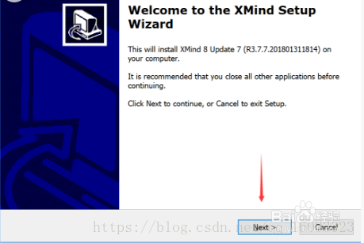

\2.  2

勾选“I accept the agreement”，然后Next，这一步可以选择安装路径

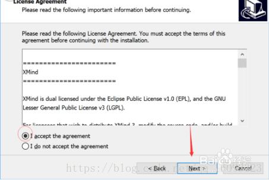

\3.  3

选择安装目录，点击Next

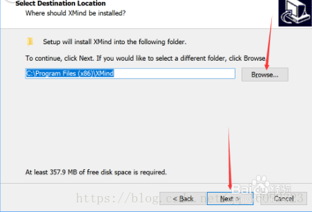

\4.  4

去掉后面的三个对勾，点击Next

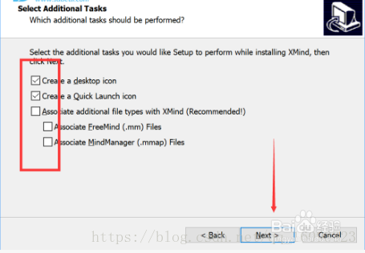

\5.  5

确认安装的附加任务，确定后点Install

\6.  6

正在安装中，请耐心等候......

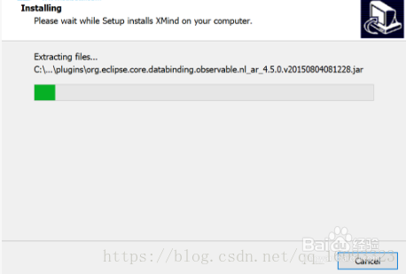

\7.  7

安装完成后，点击Finish并启动程序

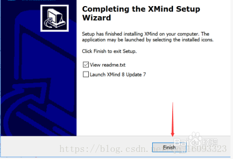

\8.  8

在XMind主界面左上方找到“编辑”--“首选项”--“常规”，如下图所示,点击“确定”后，关闭XMind软件。

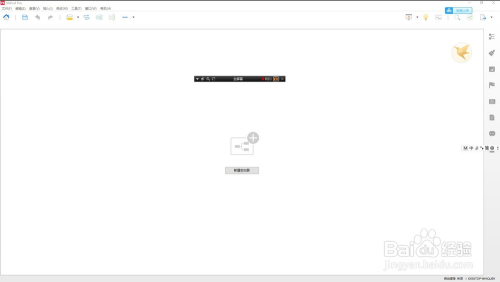

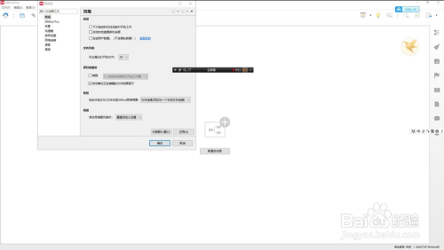

END

破解方法

\1.  1

以管理员身份运行X8U7-PJ.exe

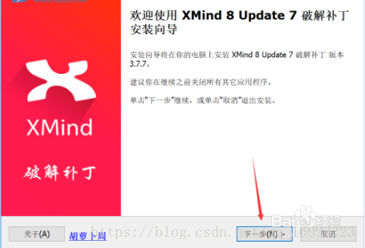

\2.  2

选择我接受协议，点击下一步

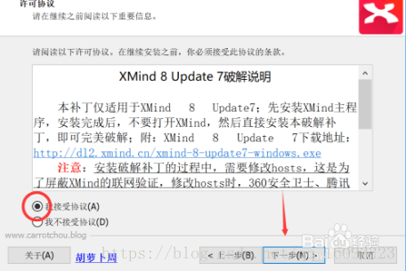

\3.  3

勾选复选框，点击下一步

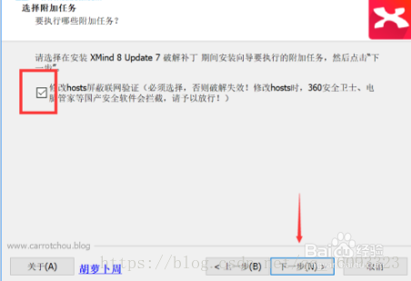

\4.  4

核对无误后点击安装

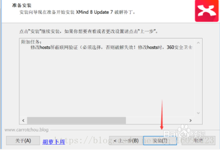

\5.  5

安装完成，至此，破解也已经完成

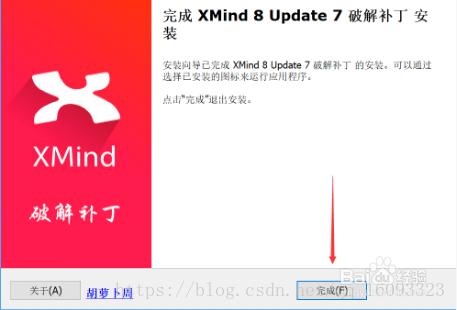

END

验证

\1.  再次打开Xmind8时，点击“帮助”--“关于Xmind”时，出现已激活界面

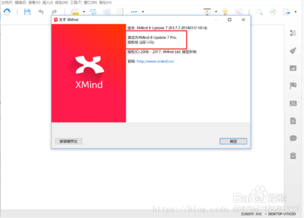

 