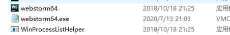
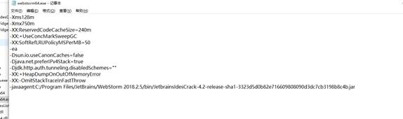

# #说明

>相应[`jar包放置地址`](https://gitee.com/hongjilin/hongs-study-notes/tree/master/%E6%9D%82%E8%AE%B0_%E5%85%B6%E4%BB%96(%E5%A6%82%E7%A0%B4%E8%A7%A3%E4%B8%8E%E9%85%8D%E7%BD%AE)%E7%9A%84%E7%A2%8E%E7%89%87%E5%8C%96%E7%AC%94%E8%AE%B0/%E6%95%99%E5%9D%8F%E5%B0%8F%E5%AD%A9%E5%AD%90%E7%9A%84%E7%AC%94%E8%AE%B0/IntelliJ%20IDEA%E7%A0%B4%E8%A7%A3/tools/%E6%96%B9%E6%B3%95%E4%BA%8C%E5%AF%B9%E5%BA%94_jar%E5%8C%85%E7%A0%B4%E8%A7%A3),webStrom软件去[官网下载](https://www.jetbrains.com/zh-cn/webstorm/download/#section=windows)即可
>
>其他方法可以移步隔壁[`IntelliJ IDEA破解`](https://gitee.com/hongjilin/hongs-study-notes/tree/master/%E6%9D%82%E8%AE%B0_%E5%85%B6%E4%BB%96(%E5%A6%82%E7%A0%B4%E8%A7%A3%E4%B8%8E%E9%85%8D%E7%BD%AE)%E7%9A%84%E7%A2%8E%E7%89%87%E5%8C%96%E7%AC%94%E8%AE%B0/%E6%95%99%E5%9D%8F%E5%B0%8F%E5%AD%A9%E5%AD%90%E7%9A%84%E7%AC%94%E8%AE%B0/IntelliJ%20IDEA%E7%A0%B4%E8%A7%A3),此处有更为详细的叙述

## Ⅰ-将jar包移入安装目录

> 将`JetbrainsIdesCrack-4.2`(此文件名跟你使用的版本不同)
>
> 文件移到webstrom安装目录C:\Program Files\JetBrains\WebStorm 2018.2.5\bin(`安装目录每个人可能不同`)

## Ⅱ-64.exe用记事本打开

>
>
>

## Ⅲ-将下面代码复制进去

>```bash
>-javaagent:C:/Program Files/JetBrains/WebStorm 2018.2.5/bin/JetbrainsIdesCrack-4.2-release-sha1-3323d5d0b82e716609808090d3dc7cb3198b8c4b.jar
>```
>
>将上述代码复制进去最后一行
>
>`注意`:代码中的`地址改成安装目录的bin包`
>

## Ⅳ-打开软件

> 1. 选择不发送
>
> 2. 输入
>
>    ```bash
>    ThisCrackLicenseId-{
>    
>    "licenseId":"ThisCrackLicenseId",
>    
>    "licenseeName":"Rover12421",
>    
>    "assigneeName":"",
>    
>    "assigneeEmail":"rover12421@163.com",
>    
>    "licenseRestriction":"For Rover12421 Crack, Only Test! Please support genuine!!!",
>    
>    "checkConcurrentUse":false,
>    
>    "products":[
>    
>    {"code":"II","paidUpTo":"2099-12-31"},
>    
>    {"code":"DM","paidUpTo":"2099-12-31"},
>    
>    {"code":"AC","paidUpTo":"2099-12-31"},
>    
>    {"code":"RS0","paidUpTo":"2099-12-31"},
>    
>    {"code":"WS","paidUpTo":"2099-12-31"},
>    
>    {"code":"DPN","paidUpTo":"2099-12-31"},
>    
>    {"code":"RC","paidUpTo":"2099-12-31"},
>    
>    {"code":"PS","paidUpTo":"2099-12-31"},
>    
>    {"code":"DC","paidUpTo":"2099-12-31"},
>    
>    {"code":"RM","paidUpTo":"2099-12-31"},
>    
>    {"code":"CL","paidUpTo":"2099-12-31"},
>    
>    {"code":"PC","paidUpTo":"2099-12-31"}
>    
>    ],
>    
>    "hash":"2911276/0",
>    
>    "gracePeriodDays":7,
>    
>    "autoProlongated":false}
>    ```

## Ⅴ-破解成功