# #说明

>该笔记代码与破解方式来自于梦川 [开源项目](https://gitee.com/meng-chuan/Unlock-netease-cloud-music),觉得不放心的可以去看源码
>
>刚看到是出于好奇进行了简单测试.觉得不错,就摘录Mark下来,在下只是大自然的搬运工
>
>`该教程仅供学习交流使用,如有侵权请联系本人删除,本人主要做个Mark,方便之后学习相关知识时可以借鉴`
>
>## 原理特性
>
>- 使用 QQ / 虾米 / 百度 / 酷狗 / 酷我 / 咪咕 / JOOX 音源`替换变灰歌曲链接` (默认仅启用一、五、六)
>- 为请求增加 `X-Real-IP` 参数解锁海外限制，支持指定网易云服务器 IP，支持设置上游 HTTP / HTTPS 代理
>- 完整的流量代理功能 (HTTP / HTTPS)，可直接作为系统代理 (同时支持 PAC)
>- `所以该作者的项目实质上并不算是破解,只是脚本帮我们找到相应别的音源并附加上去`

# #目录

>[TOC]


## 项目介绍

> 网易音乐相信不需要我过多的介绍大家也都知道，由于各种限制，相信很多人在听歌的时候也注意到了，很多的音乐呈现灰色的样式，是无法播放的，如下图所示。今天就带大家**把灰色不能听的音乐全部变成可以正常播放的音乐**，而且是**全平台通用**哦！此处只截图window平台下的效果
>
> 1. 未解锁前:
>
>    ​	
>
> 2. 解锁后
>
>    


# Windows端方法一：

>1. 这个基本不是程序员的不会选择,可以略过(本人程序员都不想用这个方法,麻烦)
>
>2. 打开网易云音乐客户端，进入设置页面，设置自定义代理
>
>   - 自定义代理 ：填写服务器地址和端口号
>   - 代理服务器地址：127.0.0.1 （推荐本机搭建，速度快）
>   - 代理服务器端口：52000
>   - 
>
>3. 安装node.js
>
>   1. 官方网站：[http://nodejs.cn/download/](http://nodejs.cn/download/),下载后双击软件安装包打开安装，一直点下一步直到完成即可
>
>   2. [**下载项目源码**](https://github.com/meng-chuan/Unlock-netease-cloud-music/archive/master.zip)
>
>   3. 下载后解压到任意文件夹,双击点开Unlock-netease-cloud-music文件夹中名为：网易☁🎵.bat 的文件
>
>      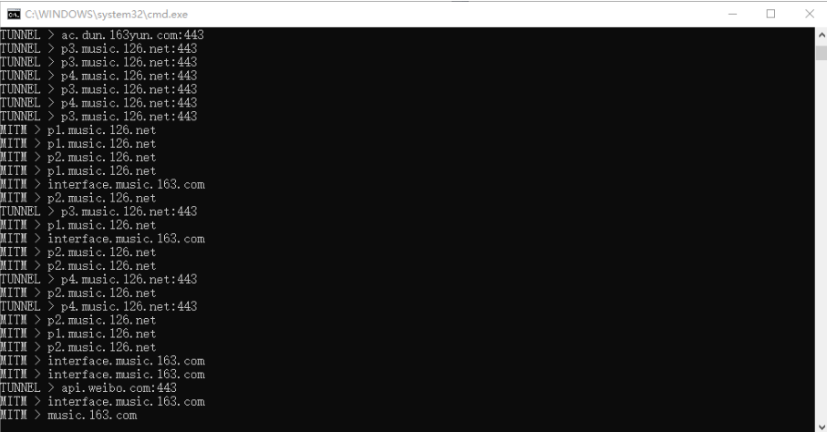
>
>   4. 注：此窗口不可关闭，可以最小化
>
>      以后每次打开网易云先运行网易☁🎵.bat这个文件即可解锁所有灰色歌曲，在这里先恭喜你成功学会了第一种解锁网易云音乐灰色歌曲的方法
>
>

# Windows端方法二：

## 1、注意

>注意：Windows 7 如无法执行则需升级 Powershell 到 3.0 以上，XP 不支持,这是windows官方软件:[下载地址](https://docs.microsoft.com/powershell/scripting/install/installing-powershell)
>
>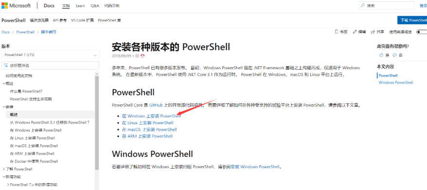
>
>

## 2、操作

### Ⅰ-安装代理

>1. 以 `管理员身份` 打开 `Powershell`，Windows 10 快捷入口：`Win + X` - `Windows Powershell(管理员)(A)`
>
>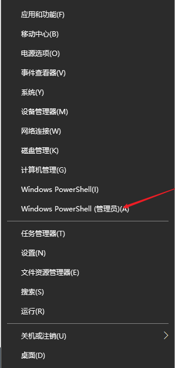
>
>2. 复制以下代码，右键粘贴到命令行回车，打开安装菜单。
>
>   ```powershell
>   Set-ExecutionPolicy -ExecutionPolicy Unrestricted -Force
>   Invoke-Expression -Command (Invoke-WebRequest -UseBasicParsing -Uri https://bit.ly/2RYvE3p).Content
>   ```
>
>   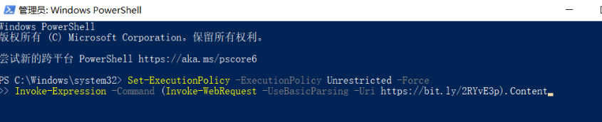
>
>3. 出现以下选项
>
>   - 随后选择 `1` 即安装。
>   - 安装完毕后选择 `3` 运行。
>   - 如需添加开机自启，则执行 `7`。
>   - 最后输入 `0` 退出。
>   - 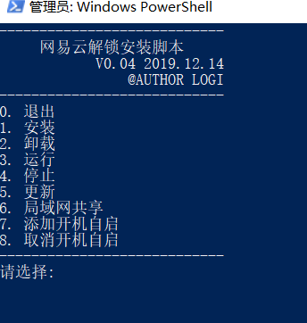

### Ⅱ-设置代理

>打开网易云音乐客户端，进入设置页面，设置自定义代理
>
>- 自定义代理 ：填写服务器地址和端口号
>- 代理服务器地址：127.0.0.1 （推荐本机搭建，速度快）
>- 代理服务器端口：6666
>- 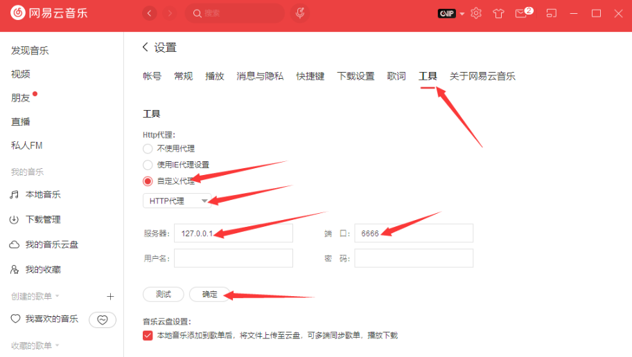
>
>`如使用一段时间后无法解锁`，则需要重新执行命令，选择 `5` 更新。


# Windows端方法三：

> 优点：无需下载任何资源，只需几步设置即可，话不多说，直接上干活，我这里以win10为例，其他系统操作类似：

>**第一步：鼠标左键点击桌面右下角的通知气泡**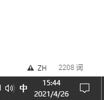
>
>
>
>第二步：然后鼠标左键点击所有设置
>
>第三步：鼠标左键点击点击进入网络和intrnet
>
>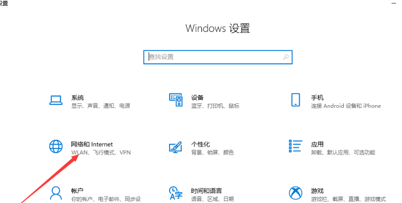
>
>**第四步，脚本地址**：[https://wy.ydlrqx.com/proxy.pac](https://wy.ydlrqx.com/proxy.pac ) 
>
>
>
>**第五步，打开网易云音乐，进入设置，操作步骤见下图，都是使用鼠标左键点击**
>
>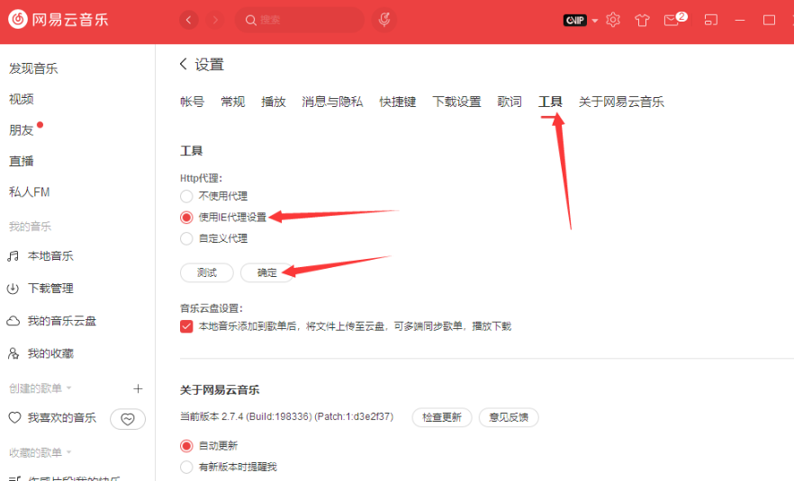
>
>


# macOS端

>由于本人家境贫寒，买不起苹果电脑，又不想用黑苹果，无法截图说明，所以这里直接文字描述
>
>**方法一：**macOS端的使用与以上Windows端第三种方法同理，依次打开系统偏好`设置`＞`网络`＞`高级`＞`代理`，然后填入**地址**：[https://wy.ydlrqx.com/proxy.pac](https://wy.ydlrqx.com/proxy.pac)
>
>**方法二：**请移步最下方观看不限端浏览器听音乐方案

# Linux端

>会用Linux的都不应该是小白，所以这里就不截图了，直接上文字描述
>
>**方法一：**Linux端的使用也同样与以上Windows端第三种方法和macOS端方法同理，依次进入系统`设置`＞`网络`＞`网络代理`，然后填入**地址**：[https://wy.ydlrqx.com/proxy.pac](https://wy.ydlrqx.com/proxy.pac)
>
>**方法二：**请移步最下方观看不限端浏览器听音乐方案

#  安卓端

> 安卓端是本人用了很久的一个小工具，这里先膜拜一下大佬的[开源项目](https://github.com/ndroi/easy163)，该软件无需**ROOT**，无需**WiFi**，一键解锁，接下来我用Redmi K30 Pro给大家演示一下


**第一步：进入浏览器输入地址https://github.com/ndroi/easy163/releases，选最新版本，下载后缀为apk的文件，然后安装**

>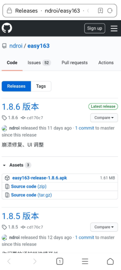
>
>

**第二步：打开软件，点击下面的按钮开启**

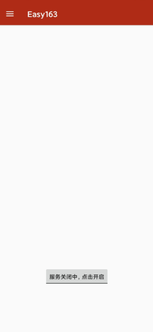

**第三步：软件后台运行，进入网易云音乐你会发现所有音乐已经解锁成功了，下面放两张效果图**

>
>
>

**建议下载 [网易云极速版](https://www.lanzoux.com/iUw9Dheqpob)**
此版本网易云功能简单稳定，与本软件兼容良好(`没试过`,人家作者说的)

# iOS端

>由于本人家境贫寒，买不起iPhone，无法截图说明，所以这里直接文字描述
>
>iOS端的使用也同样必须要连接WiFi，iOS 设备还需安装 CA 证书。首先点击**链接**：[https://raw.githubusercontent.com/nondanee/UnblockNeteaseMusic/master/ca.crt](https://raw.githubusercontent.com/nondanee/UnblockNeteaseMusic/master/ca.crt) 添加证书，随后在 `设置` > `通用` > `关于本机` > `证书信任设置` 下，手动开启证书，具体参考**Apple 官方说明**：[https://support.apple.com/zh-cn/HT204477](https://support.apple.com/zh-cn/HT204477) 。
>
>安装后依次打开无线局域网＞HTTP代理＞配置代理，然后把代理选择为自动配置模式，同Android端一样，粘贴我提供的地址，记得点击右上角的存储！！！**地址**：[https://wy.ydlrqx.com/proxy.pac](https://wy.ydlrqx.com/proxy.pac) 


# <span style="color:orangered;font-weight:bold;">不限端浏览器听音乐</span>

> 如果实在嫌麻烦，上面的教程都不用看，直接打开浏览器输入网址http://music.shadow-forum.com/ ，直接上车，已解锁无版权歌曲，支持下载
>
> 下面放一张截图
>
> 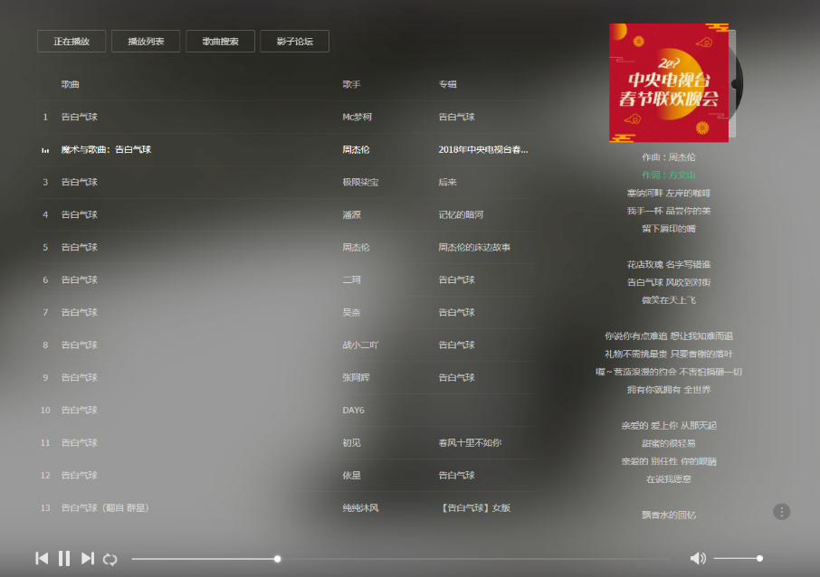

# 总结

> Windows端共提供了3种方法，推荐使用方法二(第一步操作可能会报错，请多试几次，实在不行就一行一行的执行)。此方法优势：只需操作一次，且部署在本地，不受代理服务器网速的影响。至于其他平台如果嫌麻烦其实都可以可以考虑使用浏览器听音乐的方案，香就完了，还需要什么自行车