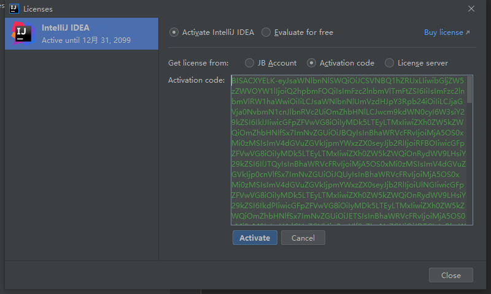

# IntelliJ IDEA破解

> 少年,请先关闭你的杀毒软件..............

#### 1.首先打开jetBrains任意一个软件

>此方法同样适用于webstrom
>
>此处我下载的是官方`IntelliJ IDEA2020.3U`版本
>
>

#### 2.随便新建或者打开一个项目,让idea处于打开项目状态

### 3. 将破解资源.zip文件解压

>1. BetterIntelliJ.zip   -->破解包
>2. reset_jetbrains_eval_windows.vbs  -->失败时使用:失败重置脚本
>3. 激活补丁key.txt     -->激活key
>
>

### 4.解压BetterIntelliJ.zip

>解压BetterIntelliJ.zip得到一个`.jar`文件

### 5.在IDEA的根目录创建一个目录

>1. 项目根目录即:在`bin`同一级目录
>2. 名字随意,但不能含有中文

### 6.将解压的`.jar`文件移入此文件目录

> 

### 7.将此文件目录的`.jar`文件拖拽到IDEA打开项目的界面中

> 这时就会开始破解了,时间视电脑性能而定,直到弹窗让你重启idea
>
> 

### 8.重启IDEA

### 9.注入激活码

>打开idea-->Help-->Register-->Add New License-->选择Activation code-->将激活码复制进去-->点击同意Activate
>
>

### 10.ChinaNB

> 破解成功
>
> 