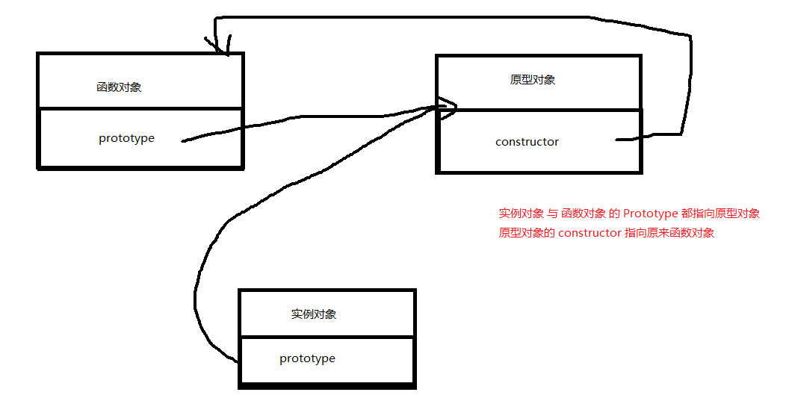
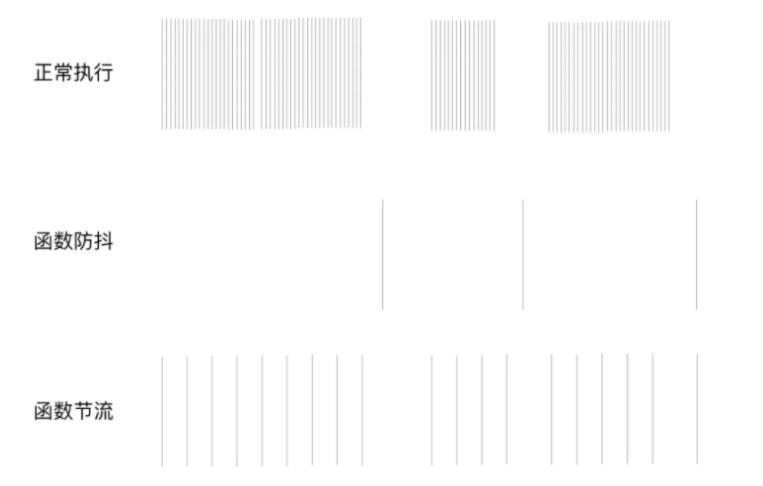
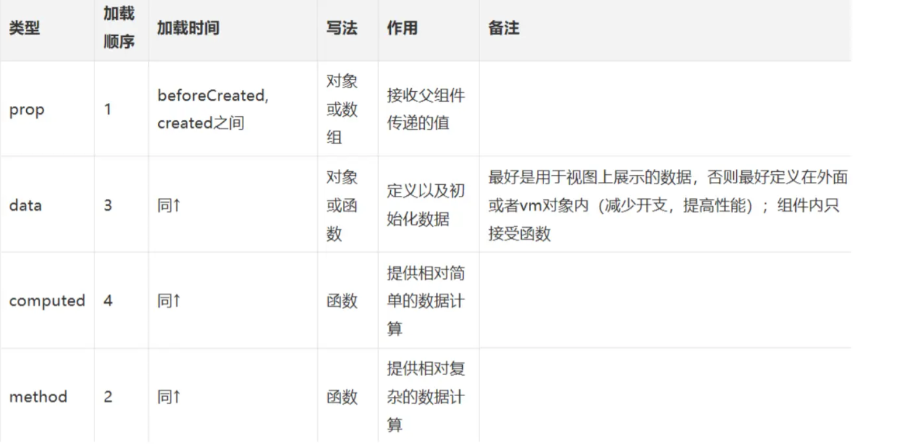

## HTML+CSS基础

### 1、flex布局兼容IE

>同时使用 `浮动`
>
>```css
>display: flex
>float:left
>```

### 2、Html5新标签

>[HTML5 新元素](https://www.runoob.com/html/html5-new-element.html)
>
>1. audio : 定义音频内容
>2. video : 定义视频内容
>3. detailts: 描述文档和细节
>4. footer: 定义页脚
>5. nav : 导航栏
>6. header: 定义头部区域
>7. mark : 带有记号的文本
>8. localStorage、canvas、svg等标签

### 3、说说对于盒子模型的理解

>盒子由四个部分组成
>
>* content
>* padding
>* border
>* margin
>
>###### 标准盒子模型:
>
>* 盒子总宽度 = width(content的宽度) + padding + border + margin;
>* 盒子总高度 = height + padding + border + margin
>
>###### IE怪异盒子
>
>* 盒子总宽度 = width + margin;
>* 盒子总高度 = height + margin;
>
>###### Box-sizing
>
>- content-box 默认值，元素的 width/height 不包含padding，border，与标准盒子模型表现一致
>- border-box 元素的 width/height 包含 padding，border，与怪异盒子模型表现一致
>- inherit 指定 box-sizing 属性的值，应该从父元素继承

### 4、怎么理解回流跟重绘? 什么场景会触发

>在html中,每个元素都可以理解成一个盒子,在浏览器解析过程中,会涉及到回流与重绘:
>
>* 回流: 布局引擎会根据各种样式计算每个盒子在页面上的大小与位置
>* 重绘: 当计算好盒模型的位置、大小及其他属性后,浏览器根据每个盒子特性进行绘制
>
>如果将画画比喻为一个黑板,已经画好一个小花,这时候我们要将其从从左边移到右边: 那么就首先确定好具体位置 ,画好形状(回流),再画上原本的颜色(重绘)

#### Ⅰ - 触发时机

>###### 回流
>
>* 添加删除可见的dom元素
>* 元素位置、尺寸、内容发生变化
>* 页面开始渲染的时候
>* 浏览器窗口尺寸变化
>* 还有一些获取特定属性的方法:  如`offsetTop、scrollHeight...`,为了获取这些值,浏览器会发生回流
>
>###### 重绘
>
>* 颜色、文本、阴影之类的改变

#### Ⅱ- 如何减少

>* 如果想改变元素的样式,建议通过改变元素的`class`类名
>* 避免设置过多的内联样式
>* 避免使用`table`布局,它每个元素的大小或内容改动都会导致重新计算
>* 对于复杂的动画,尽量设置`position:fixed/absolute`等,使其脱离文档流,减少对其他元素的影响


------


## js基础

> **[JavaScript笔记](https://gitee.com/hongjilin/hongs-study-notes/tree/master/编程_前端开发学习笔记/HTML+CSS+JS基础笔记/JavaScript笔记)** 

### 1、原型与原型链

>本人JS进阶部分有详细分析 -->[点我跳转](https://gitee.com/hongjilin/hongs-study-notes/blob/master/%E7%BC%96%E7%A8%8B_%E5%89%8D%E7%AB%AF%E5%BC%80%E5%8F%91%E5%AD%A6%E4%B9%A0%E7%AC%94%E8%AE%B0/HTML+CSS+JS%E5%9F%BA%E7%A1%80%E7%AC%94%E8%AE%B0/JavaScript%E7%AC%94%E8%AE%B0/A_JavaScript%E8%BF%9B%E9%98%B6%E5%AD%A6%E4%B9%A0%E7%AC%94%E8%AE%B0.md#1%E5%8E%9F%E5%9E%8B%E4%B8%8E%E5%8E%9F%E5%9E%8B%E9%93%BE)
>
>###### 什么是原型呢?
>
>>你可以这么理解: 每一个JS对象(除了Null) 在创建时就会与之关联的另一个对象,这个对象就是我们所说的原型,每一个对象都会从自己的 '原型对象' 中继承属性
>
>>* 每个函数都有一个 prototype 属性,它默认指向一个 Object 空对象(即成为原型对象)
>>* Prototype 对象默认有两个属性: constructor 属性 和 `_proto_`属性
>>* prototype上的 constructor 属性包含了一个指针,指回原函数(`fun.prototype.constructor-->fun`)
>
>###### prototype属性的作用?
>
>>* 给原型对象添加属性(一般都是方法): 函数的所有 实例对象 自动拥有原型中的属性(方法)
>>* 所以说,JS的继承机制就是通过原型对象实现继承的,原型对象的作用就是定义所有实例对象共享的属性与方法
>
>###### 什么是原型链?
>
>>每个对象都可以有一个隐式原型 `_proto_`, 这个原型还可以有它自己的原型,以此类推形成一个原型链:
>
>>* 查找特定属性的时候,我们先去这个对象里面去找
>>* 如果没有的话就去它的原型对象里面去找
>>* 如果还没有就再去原型对象的原型对象里去找..........
>
>>这个操作被委托在整个原型链上,这个就是我们所说的原型链了
>
>###### 原型链结论
>
>>* `_proto_`是原型链查询中实际用到的,它总是指向显式原型 `prototype`
>>* prototype 是函数独有的,在定义构造函数时自动创建,它总是被创建的实例的 `_proto_` 所指
>>* 所有对象都有`_proto_`属性,**函数这个特殊对象** 除了具有`_proto_`属性,还有特有的原型属性`Prototype`(因为它本身也是一种对象)

------


### 2、Prototype 与 `_proto_` 区别与关系

>* 每一个函数 function 都有一个 `prototype` ,即显式原型
>
>* 每个实例对象都有一个 `_proto_` ,即隐式原型
>
>* 对象的 隐式原型(`_proto_`) 的值 为其 对应构造函数的 显示原型(`prototype`) 的值
>
>  >可以这样理解 构造函数的prototype <-- 默认创建的Object(指向此地址值) --> 对象的`_proto_`
>
>* 隐式原型为对象独有的,而 显式原型(它是一个对象) 是函数独有的
>
>**总结**
>
>* 函数的 `prototype` 属性: 在定义函数时自动添加的,默认值时一个空Object对象
>* 对象的 `_proto_` 属性: 创建对象时自动添加的, 默认值为 `构造函数的 protopyte 属性值`
>* 程序员 可以直接操作 显式原型 而不能直接操作隐式原型(ES6之前)
>* prototype 属性可以给函数和对象添加可共享(继承)的方法、属性,而`_proto_`是查找某函数或对象的原型链的方法
>
>###### 图
>
>>

------


### 3、如何理解构造函数，原型对象和实例的关系

>* 每个构造函数都有一个原型对象(prototype)
>* 原型对象都包含一个指向构造函数的指针(prototype中有constructor)
>* 而实例都包含一个原型对象的指针(实例的`_proto_` 的值 指向 原型对象prototype 的值)
>
> 
>
>###### 构造函数
>
>>构造函数特点: 1. 函数体内使用this关键字,代表了所要生成的对象实例 2. 生成对象,必须使用 new关键字实例化
>
>###### instanceof 用法:可以忽略 new 用构造函数声明实例
>
>>```js
>> function Person(name) {
>>    // 判断this是否指向了当前的实例
>>    if (this instanceof Person) {
>>      // this指向了当前的实例，外部使用了关键字new
>>      this.name = name
>>    }else {
>>      // this指向window，外部没有使用关键字new
>>      return  new Person(name)
>>    }
>>  }
>>  var p1 = new Person("咚咚")
>>  var p2 =  Person("锵锵")
>>  console.log("p1",p1);
>>  console.log("p2",p2);
>>```

------

### 4、new关键字原理

>new 运算符创建一个用户定义的对象类型的实例 或者 具有构造函数的内置对象的实例
>
>1. 创建一个空的对象作为将要返回的对象实例
>2. 构造函数的prototype属性对象 指向 这个空的对象(原型对象)
>3. 将这个实例对象的值 赋值给 函数内部的this关键字
>4. 执行构造函数内的代码
>5. 如果该函数没有返回对象,则返回this

### 5、JS如何实现继承?

#### Ⅰ - 继承是什么?

>继承是面向对象软件技术中的一个概念:
>
>>如果一个类别B 继承自 另一个类别A ,那么就把这个B称为 'A的子类'; 而把A成为B的父类或者超类
>
>###### 继承的优点:
>
>>* 继承可以使得子类具有父类别的各种属性和方法,而不需要再次编写相同的代码
>>* 子类继承父类的同时,也能重新定义某些属性或者重写某些方法,即覆盖父类的原有属性与方法,使其获得与父类不同的功能
>
>常用的几个继承实现方式
>
>>1. ###### 组合继承
>>
>>   - 原型链继承: `Child.prototype = new Panent()`  -->修改一个实例,另外一个实例也会变化
>>   - 构造函数继承: `Panent.call(this) `  -->只能继承父类属性与方法,而不能继承父类的原型上的
>>   - 组合继承: 结合上面两个写法,同时需要手动挂上构造器(Child),指向自己的构造函数 `Child.prototype.constructor = Child`
>>
>>2. ###### 寄生组合式继承
>>
>>   - 原型继承 : 利用解决普通对象继承问题的 `Object.create()`方法进行实现
>>   - 寄生式继承: 优化上面原型继承的写法,实际上也不好
>>   - 寄生组合式继承:在前面所有继承方式的基础上进行优化,**是最优解决方案**

#### Ⅱ - 组合继承

##### ① 原型链实现继承 (`bad`)

>原型链继承是比较常见的继承方式之一, 其中涉及的构造函数、原型和实例,三者之间存在着一定关系,即前方提到的:1. 每个构造函数都有一个原型对象,原型对象又包含一个指向构造函数的指针,而实例则包含一个原型对象的指针
>
>###### 举个栗子
>
>```js
>//父类原型对象
>function Parent() {
>    this.name = 'parent1';
>    this.play = [1, 2, 3]
>  }
>//构造函数
>  function Child() {
>    this.type = 'child';
>  }
>//将Child 的原型指向 Parent 的实例
>  Child.prototype = new Parent();
>  console.log(new Child())
>//实例化两个对象
>let s1 = new Child();
>let s2 = new Child();
>console.log(s1.play,s2.play) //[1, 2, 3]    [1, 2, 3]
>
>//修改其中一个的原型
>s1.play.push(4)
>console.log(s1.play,s2.play) //[1, 2, 3, 4]   [1, 2, 3, 4]
>```
>
>我们发现:当我们改变S1的属性时,另外一个实例也发生了改变,这是因为这两个实例使用的是同一个原型对象,**他们的内存空间是共享的**

##### ② 构造函数继承(`bad`)

>借助 `call` 调用`Parent` 函数
>
>```js
>function Parent(){
>    this.name='努力学习的汪'
>}
>Parent.prototype.getName=function(){return this.name}
>
>//定义构造函数
>function Child(){
>    Parent.call(this);
>    this.type='child'
>}
>
>let child= new Child()
>let child1=new Child()
>
>console.log(child,child1)
>//Child {name: '努力学习的汪', type: 'child'} Child {name: '努力学习的汪', type: 'child'}
>
>child.name='hong'
>//Child {name: 'hong', type: 'child'} Child {name: '努力学习的汪', type: 'child'}
>child.getName() //报错
>```
>
>可以看到,父类原型对象中一旦存在父类之前自己已经定义的方法,那么子类将无法继承这些方法
>
>* 相比第一种原型链继承方式,父类的引用属性不会被共享,但他优化了第一种继承方式的弊端
>* 只能继承父类的实例属性和方法,不能继承其原型属性或方法

##### **组合继承**

>前面我们讲到两种继承方式,各有优缺点.组合继承则是将这两种方式结合起来:  **原型链继承+构造函数继承**
>
>* 利用原型链实现对父类对象的方法继承
>* 利用`super()`(实际上你只要写了constructor,那么默认就会给你调用一次super())接用父类构造函数初始化相同属性
>
>```js
>function Parent() {
>    this.name = '努力学习的汪';
>    this.play = [1,2,3]; 
>}
>Parent.prototype.getName = function(){return this.name}
>function Child(){
>    //实际上这里运行后是第二次调用Parent
>	Parent.call(this);
>    this.type = 'child' 
>}
>//第一次调用Parent()
>Child.prototype = new Parent();
>//手动挂上构造器(Child),指向自己的构造函数
>Child.prototype.constructor = Child;
>//实例化两个对象
>let s1 = new Child();
>let s2 = new Child();
>console.log(s1.play,s2.play) //[1, 2, 3]    [1, 2, 3]
>
>//修改其中一个的原型
>s1.play.push(4)
>console.log(s1.play,s2.play) ///[1, 2, 3, 4]    [1, 2, 3]  -->互不影响
>console.log(s1.getName(),s2.getName()) //正常调用
>```
>
>这种方式看起来没什么问题,但实际上 `Parent` 执行了两次,造成了多构造一次的性能开销

#### Ⅲ - **寄生组合式继承**

##### ① 原型继承(`bad`)

>这里主要借助`Object.create`的方法实现普通对象的继承
>
>* 因为`Object.create()`方法式浅拷贝,多个实例的引用类型属性指向相同的内存,存在篡改的可能
>
>```js
>let Parent ={
>    name:'努力学习的汪',
>    arr: ['1','2','3'],
>    getName: function(){return this.name}
>}
>//Object.create()方法创建一个新对象，使用现有的对象来提供新创建的对象的 __proto__
>let child = Object.create(Parent);
>child.name = 'hong';
>child.arr.push('4');
>//声明第二个实例
>let child1 = Object.create(Parent);
>child1.name='jilin';
>child1.arr.push('5')
>
>//调用
>console.log(child.name); //hong
>console.log(child1.name === child1.getName()); //true -->方法调用正常
>console.log(child1.name); // jilin -->名字这种属性修改正常且不会互相影响
>
>console.log(child.arr);  //['1', '2', '3', '4', '5']  -->被篡改了
>console.log(child1.arr); //['1', '2', '3', '4', '5']
>```

##### ② 寄生式继承(`bad`)

>寄生式继承在上面继承基础上进行优化,利用浅拷贝的能力再次进行加强,添加一些方法,但仍然存在一样的问题
>
>```js
>const Parent = {
>    name:'努力学习的汪',
>    arr: ['1','2','3'],
>    getName:function(){return this.name}
>}
>
>//对浅拷贝进行优化增强
>function clone(preObj){
>    let clone = Object.create(preObj);
>    clone.getArr = function(){return this.arr};
>    return clone;
>}
>
>let child = clone(Parent);
>child.name = 'hong';
>child.arr.push('4');
>let child1 = clone(Parent);
>child1.name='jilin';
>child1.arr.push('5');
>
>//调用
>console.log(child.name); //hong
>console.log(child1.name === child1.getName()); //true -->方法调用正常
>console.log(child1.name); // jilin -->名字这种属性修改正常且不会互相影响
>
>console.log(child.getArr());  //['1', '2', '3', '4', '5']  -->被篡改了
>console.log(child1.getArr()); //['1', '2', '3', '4', '5']
>```

##### 寄生组合式继承

>寄生组合式继承,借助解决普通对象继承问题的`Object.create()`方法,结合前面全部继承方法的优缺点的基础上进行改造,这也是所有继承方式里面相对最优的继承方式
>
>* 组合继承: 缺陷是 多调用了一次构造函数,存在性能问题
>* 寄生式继承: 缺陷是 引用类型属性指向相同内存,存在篡改问题
>
>```js
>//1. 定义父类
>function Parent(){
>    this.name = '努力学习的汪';
>    this.play = [1,2,3];
>}
>//在父类原型上定义一个方法或者属性
>Parent.prototype.getName = function(){return this.name}
>
>//2. 定义子类
>function Child(){
>    //构造函数继承部分  --> 这里会使得子类获得父类本身带有的属性与方法
>    Parent.call(this);
>    this.arr = [9, 8, 7];
>}
>
>//3. 定义一个寄生式继承方法
>function clone(parent,child){
>    //这里改用 Object.create 可以减少组合继承中那多余的一次构造过程
>    child.prototype = Object.create(parent.prototype) //将父类的原型赋给子类的原型
>    //组合继承中的,需要手动挂载构造函数给自身
>    child.prototype.constructor = child; 
>}
>
>//4. 调用一下寄生式继承方法,Parent与Child关联起来,到这步为止,实现了继承
>clone(Parent,Child)
>
>//5.注意:如果要在子类原型上添加属性或者方法,需要等步骤 4 运行完,因为 clone 有覆盖原型的步骤
>Child.prototype.getArr = function(){return this.arr}
>
>//调用
>let child = new Child();
>console.log(child);  //Child {name: '努力学习的汪', play: Array(3), arr: Array(3)}
>console.log(child.getName()); //努力学习的汪
>console.log(child.getArr()); //[9, 8, 7]
>```

#### Ⅳ - ES6的  `extends` 关键字直接实现

>实际上,如果通过转换我们会发现 `extends` 实际采用的也是寄生组合式继承

### 6、举个简单 工厂模式创建对象 的栗子

>* 套路: 通过工厂函数动态创建对象并返回
>* 使用场景: 需要创建多个对象
>* 问题: `对象没有一个具体的类型`,都是Object类型
>
>```js
>//声明一个工厂函数
>function createStudent(name,age){
>    const obj = {
>        name:name,
>        age: ahge
>    }
>    return obj
>}
>// 创建2个人
>const p1 = createStudent('hong', 12)
>const p2 = createStudent('jilin', 13)
>```


### 7、事件冒泡、事件捕获、事件阻止

>详见 : **[细说addEventListener与事件冒泡及捕获.md](https://gitee.com/hongjilin/hongs-study-notes/tree/master/编程_前端开发学习笔记/HTML+CSS+JS基础笔记/JavaScript笔记/细说addEventListener与事件冒泡及捕获.md)**

### 8、JS事件机制

>###### JS是单线程的,但他同时也是`非阻塞`的
>
>> 非阻塞是 当代码需要进行一项异步任务(无法立刻返回结果)的时候,主线程回挂起(padding)这个任务,然后在异步任务返回结果的时候再根据一定规则去执行相应的回调
>
>但JS是单线程的,他是如何做到 `非阻塞` 的呢?
>
>> 答案就是  --- event loop 事件循环

#### Ⅰ - 执行栈概念

>当JS代码执行的时候会将不同的变量存于内存中的不同位置: `堆`和`栈`中加以区分,其中堆里存放一些对象,而栈里存着一些基础类型变量以及对象的指针,但我们这里说的 **执行栈** 概念不同
>
>###### 执行栈
>
>>当我们调用一个方法的时候,JS会生成一个与这个方法对应的执行环境,又叫 `执行上下文`
>>
>>* 这个执行环境中存在着这个方法的私有作用域、上层作用域的指向、方法的参数,这个作用域中定义的变量以及这个作用域的this对象
>>* 而当一系列方法被依次调用的时候,因为JS是单线程的,同一时间只能执行一个方法,于是这些方法被排队在一个单独的地方
>>* 这个地方叫做执行栈
>
>###### 当一个脚本第一次执行的时候,JS引擎会解析这段代码并将其中的同步代码按照执行顺序加入执行栈中,然后从头开始执行
>
>* 如果当前执行的是一个方法,那么JS会向执行栈中添加这个方法的执行环境,然后进入这个执行环境继续执行其中的代码
>* 当这个执行环境中的代码执行完毕并返回结果后,JS会退出这个执行环境并把这个执行环境销毁,回到上一个方法的执行环境
>* 这个过程反复进行,可以是无限进行下去的,`除非发生了栈溢出,超出了所能使用内存的最大值`
>
>**但这并不是JS实现非阻塞的原因,而是下面的 事件队列**

#### Ⅱ - 事件队列

> JS引擎遇到一个异步事件后并不会一直等待其返回结果,而是将这个事件挂起,继续执行执行栈中的其他任务,当一个异步事件返回结果后,JS会将这个事件加入与当前执行栈不同的另外一个队列,这个队列叫做`事件队列`
>
> >* 被放入事件队列不会立即执行其回调,而是`等待当前执行栈中的所有任务都执行完毕,主线程处于闲置状态时,主线程会去查找事件队列是否有任务`
> >* 如果有: 主线程会从中取出排在第一位的事件,并将这个事件对应的回调放入执行栈中,随后执行其中的同步代码
> >* 如此反复形成一个无限的循环,这个过程叫做`事件循环`
>
> 以上是一个宏观的表述,实际上异步任务之间优先级也有不同,他们被分为两类: `宏任务与微任务`

#### Ⅲ - 宏任务与微任务

>顾名思义,宏任务放到宏任务队列, 微任务放到微任务队列
>
>1. JS中用来存储 待执行回调函数的队列包含2个不同特定的队列
>   - **宏队列: 定时器回调/ajax回调/dom事件回调**
>   - **微队列: Promise的回调**
>2. JS执行时会区分这两个队列
>   - JS执行引擎首先必须执行所有的 `初始化同步任务` 代码
>   - 每次准备取出第一个 `宏任务执行前` , 都要将 `微任务` 一个一个先取出来执行
>
>###### **当前执行栈执行完毕时会立刻先处理所有微任务队列中的事件,然后再去宏任务队列中取出一个事件.同一个事件循环中,微任务永远在宏任务之前执行**

#### Ⅳ - 题目练习

##### ① 写出代码运行结果

>```js
>const test = new Promise((resolve,reject)=>{
>    console.log(1)
>    resolve()
>    console.log(2)
>})
>test.then(3)
>test.then(console.log(4))
>// 1 2 4
>```

##### ② 写出代码运行结果

>```js
>setTimeout(()=>{ //放到一级宏队列
>console.log('定时器任务1'); 
>Promise.resolve(1).then(//这里有个坑:这里应该是直接加在微队列中,而当微队列有任务时永远不会先走下面的宏队列
>	v=>console.log('Promise任务1') 
>)
>},0)
>setTimeout(()=>{ //放到一级宏队列
>console.log('定时器任务2')
>},0)
>
>Promise.resolve(2).then( //放到一级微队列
>	v=>{
>   console.log('Promise任务2')
>   setTimeout(()=>{ //放到二级宏队列
>       console.log('定时器任务3')
>   },0)
>})
>
>Promise.resolve(3).then(//放到一级微队列
>	v=>console.log('Promise任务3')
>)
>console.log('同步代码')
>
>```
>
>答案
>
>```js
>同步代码
>//同步代码执行完,先取一级微队列任务
>Promise任务2
>Promise任务3
>//一级微队列任务取完,取一级宏队列任务
>定时器任务1
>//在执行一级宏队列时,发现了promise任务,加到了微队列中,所以仍是直接加了直接运行,随后才到下一个宏任务
>//同一个事件循环中,微任务永远在宏任务之前执行
>Promise任务1
>定时器任务2
>//取二级宏队列任务
>定时器任务3
>```

### 9、什么是防抖与节流?有什么区别?

>本质上是优化高频率执行代码的一种手段: 如浏览器的 `resize`、`scroll`、`mousemove`等事件在触发时会不断地调用绑定在事件上地回调函数,极大地浪费资源,降低前端性能
>
>* 节流: n秒内只运行一次,若n秒内重复触发,只有一次生效
>* 防抖: n秒后再执行该事件,若在n秒内被重复触发,则重新记时

#### 区别

>###### 相同点
>
>* 都可以通过`setTimeout`实现
>* 目的都是降低回调执行频率,节省计算资源
>
>###### 不同点
>
>* 函数防抖,在一段连续操作结束后,处理回调,利用`clearTimeout`和`setTimeout`实现;
>* 函数节流: 在一段连续操作中,每一段时间只执行一次,频率较高地时间中用来提高性能
>* 函数防抖关注一定时间内连续触发地事件,并只在最后执行一次,而节流每一段时间内只执行一次
>
> 

#### 应用场景

>防抖在连续的事件,只需要触发一次回调的场景有:
>
>* 搜索框搜索输入: 只需要检测用户最后一次输入,再发送请求
>* 手机号、邮箱验证输入检测
>* 窗口大小`resize`.只需要窗口调整完成后计算窗口大小,防止重复渲染
>
>节流在间隔一段时间执行一次回调的场景有:
>
>* 滚动加载,加载更多或滚到底部监听
>* 搜索框,搜索联想功能

### 10、fetch与ajax与axios的区别

> [fetch与ajax与axios的区别](https://gitee.com/hongjilin/hongs-study-notes/blob/master/%E7%BC%96%E7%A8%8B_%E5%89%8D%E7%AB%AF%E5%BC%80%E5%8F%91%E5%AD%A6%E4%B9%A0%E7%AC%94%E8%AE%B0/Ajax%E3%80%81Axios%E5%AD%A6%E4%B9%A0%E7%AC%94%E8%AE%B0/fetch%E3%80%81ajax%E3%80%81axios%E7%9A%84%E5%8C%BA%E5%88%AB.md)

### 11、JS隐式转换

>只有 **undefined, null, NaN, 0, false, 空字符串** 这`6`种情况转为布尔值结果为false，其余全部为true

### 12、箭头函数

#### Ⅰ - 箭头函数注意点

>1. 函数体内的this对象就是定义时所在的对象,而不是使用时所在的对象 `重点`
>2. 不可以当作构造函数使用,也就是不能用new命令实例化一个对象,否则会抛出一个错误
>3. 不可以使用 `arguments` 对象,该对象在函数体内不存在,如果要用的话,可以用 `rest`参数替代
>4. 不可以使用`yield`命令,箭头函数不可以用作  `Generator` 函数

#### Ⅱ - 箭头函数与匿名函数区别(作用时间区别)

>1. 正常情况下 this 指向 window
>2. 箭头函数是编译时执行 ==> 定义时指向当前this执行
>3. 匿名函数是执行时执行 ==> 全局环境执行window

### 13、JS中内存泄漏的几种情况?

>1. 意外使用全局变量,比如没有用 `let、const、var`等声明变量
>
>2. 使用定时器却不进行清楚
>
>3. 闭包内部引用外部函数变量得不到释放  (可以在闭包结尾将外部变量置为 null)
>
>   >```js
>   >function bindEvent() {
>   >  var obj = document.createElement('XXX');
>   >  var unused = function () {
>   >    console.log(obj, '闭包内引用obj obj不会被释放');
>   >  };
>   >  obj = null; // 解决方法
>   >}
>   >```
>
>4. 不清理dom元素的引用
>
>   >```js
>   >const refA = document.getElementById('refA');
>   >document.body.removeChild(refA); // dom删除了
>   >console.log(refA, 'refA'); // 但是还存在引用能console出整个div 没有被回收
>   >refA = null;
>   >console.log(refA, 'refA'); // 解除引用
>   >```
>
>5. 监听事件的解除,监听的时候addEventListener,不监听的时候要使用removeEventListener;

### 14、ES6中的模块化概念

>`ES6 Modules`规范算是成为了前端的主流吧
>
>* `export`命令和`import`命令可以出现在模块的任何位置，只要处于模块顶层就可以。
>* 如果处于块级作用域内，就会报错，这是因为处于条件代码块之中，就没法做静态优化了，违背了ES6模块的设计初衷

#### Ⅰ - CommonJS与ES6 Modules规范的区别

>* CommonJS模块是运行时加载, ES6 Modules 是编译时输出接口
>* CommonJS输出是值得浅拷贝; ES6 Modules 输出是值得引用: 被输出模块内部的改变会影响引用的改变
>* CommonJS导入的模块路径可以是一个表达式,因为它使用的是`require()`方法; 而ES6 Modules 只能是字符串
>* CommonJS 的`this`指向当前模块 ; ES6 Modules 的`this`指向 `undefined`
>* ES6 Modules 中没有这些顶层变量: `arguments`、`require`、`module`、`exports`、`__filename`、`__dirname`
>
>第一个差异是因为CommonJS加载的是一个对象(即`module.exports`属性),该对象只有在脚本运行完才会生成;而ES6模块不是对象,它的对外接口只是一种静态定义，在代码静态解析阶段就会生成。

### 15、柯里化

>函数柯里化又叫做 **部分求值**, 大白话就是: **只传递给函数一部分参数来调用它,让它返回一个新函数去处理剩下的参数**
>
>```js
>const add = a => b => a + b
>add(3)(4) //7
>```
>

### 16、说说你对于函数式变成的理解? 优缺点


## JS手写

### 1、JS字符串的 反转、重复、去重、查找等

#### Ⅰ - 字符串反转

##### ① 利用数组自带的 `reverse()`实现

>- `split()`方法使用指定分隔符字符串将一个String对象分割成子字符串数组,以一个指定的分割字符串来决定每个拆分的位置
>- `reverse()`方法将数组中元素的位置颠倒,并返回该数组: 该方法会改变原数组
>- `join()` 方法将一个数组(或一个类数组对象) 的所有元素连接成一个字符串并返回这个字符串,如果数组只有一个元素,那么可以不使用分隔符
>
>```js
>const reverseString= (str) => {
>	return str.split('').reverse().join('');
>}
>```
>
>三个方法组成链式调用

##### ② 利用递归反转字符串

>* `substring()`方法返回一个字符串从指定位置开始到指定字符串的字符
>
>  ```js
>  'hello'.substring(1)    // 'ello'
>  'hello'.substring(1,3)  // el
>  ```
>
>* `charAt()`方法从一个字符串中返回指定的字符
>
>  ```js
>  'hello'.charAt(0) // 'h'
>  ```
>
>###### 解决代码
>
>```js
>/**************** if else 方法  *********************/
>function reverseString(str){
>    if(str === '') return '';
>    //每次将传入的 str 第一位字符删除,然后拼接到最后
>    else return reverseString(str.substring(1))+str.charAt(0)
>}
>
>/**************** 三元写法  *********************/
>const reverseString = (str) =>
>		str === '' ? '' : reverseString(str.substring(1))+str.charAt(0)
>
>//调用
>reverseString('努力学习的汪') //'汪的习学力努'
>```

##### ③ 利用递减的 for 循环反转字符串

>```js
>const reverseString = (str) =>{
>    let newString = ''
>    for(let i = str.length-1; i >= 0 ;i--){
>        newString += str[i]
>    }
>    return newString
>}
>//调用
>reverseString('努力学习的汪') //'汪的习学力努'
>```

#### Ⅱ - 字符串重复

##### ① 利用while循环

>```js
>const repeatString = (str,count) => {
>    let newString = '';
>    while(count > 0){
>        newString+=str;
>        count--;
>    }
>    return newString;
>}
>//调用
>repeatString('努力学习的汪',3)
>```

##### ② 使用条件和递归重复字符串

>```js
>const repeatString = (str, count) => {
>    if(count == 0) return '';
>    if(count == 1 ) return str;
>    return str + repeatString(str,count-1);//注意: 这里不能用count--; 否则会超出调用栈
>}
>//调用
>repeatString('努力学习的汪',3)
>```
>
>###### 为什么不能用 count-- ?
>
>>count-- 当作参数,实际上传入参数的仍然是 `3`,导致死循环,不信的同学可以自己打印一下count

##### ③ 使用ES6的 `repeat()`方法重复

>```js
>const repeatString = (str,count) => {
>    if(count <= 0) return '';
>    return str.repeat(count);
>}
>//调用
>repeatString('努力学习的汪',3)
>
>/****************** 更简洁的可以使用三元运算符,本质上一样  **********************/
>const repeatString = (str,count) =>{
>     return count <= 0 ? '':str.repeat(count)
>}
>```

#### Ⅲ - 查找字符串中最长单词

##### ① 结合 `spilt()`和 `sort()`实现

>* `split()`:通过分离字符串,将字符串分割为字符串数组
>* `sort()`: 用[原地算法](https://en.wikipedia.org/wiki/In-place_algorithm)对数组的元素进行排序，并返回数组。默认排序顺序是在将元素转换为字符串，然后比较它们的UTF-16代码单元值序列 构建的
>
>```js
>const findLongString = (str) => {
>    let longString = str.split(' ').sort((a,b)=> b.length - a.length )
>    return longString[0] //此时,排在第一位的就是最长的
>}
>```

##### ② 结合 `split()`和 `reduce()`实现

>* `reduce()` 方法对数组中的每个元素执行一个由您提供的**reducer**函数(升序执行)，将其结果汇总为单个返回
>
>```js
>const findLongString = (str) => {
>    let longString =
>        str.split(' ') //注意,此处用一个空格作为分隔符
>    	.reduce((longest,currentWord)=> currentWord.length > longest.length ? currentWord : longest)
>    return longString;
>}
>findLongString('努力 学习的 汪')  //'学习的'
>```

#### Ⅲ - 判断一个字符是否为字符串结尾

>* `endsWith()`方法用来判断当前字符串是否是以另外一个给定的子字符串“结尾”的，根据判断结果返回 `true`
>
>```js
>const confirmEnding = (string , target) => {
>    return string.endWith(target);
>}
>confirmEnding('努力学习的汪', '汪')
>```


## 其他基础

### 1、强缓存、协商缓存

>[强缓存、协商缓存](https://gitee.com/hongjilin/hongs-study-notes/blob/master/%E7%BC%96%E7%A8%8B_%E7%AE%97%E6%B3%95%E5%8F%8A%E8%AF%BE%E7%A8%8B%E5%9F%BA%E7%A1%80%E5%AD%A6%E4%B9%A0%E7%AC%94%E8%AE%B0/%E8%AE%A1%E7%AE%97%E6%9C%BA%E7%BD%91%E7%BB%9C/%E6%B5%8F%E8%A7%88%E5%99%A8%E7%BC%93%E5%AD%98%E6%9C%BA%E5%88%B6%EF%BC%9A%E5%BC%BA%E7%BC%93%E5%AD%98%E3%80%81%E5%8D%8F%E5%95%86%E7%BC%93%E5%AD%98.md)

### 2、HTTP与websocket 的关系

#### Ⅰ - 相同点

>* 都是基于TCP的,都是可靠性传输协议
>* 都是应用层协议

#### Ⅱ - 区别

>* websocket是双向通信协议,模拟Socket协议,可以双向发送或者接受信息, **HTTP是单向的**
>* WebSocket是需要浏览器和服务器握手进行连接的;而HTTP是浏览器发起向服务器的连接,而服务器预先并不知道这个连接

#### Ⅲ - 联系

>* WebSocket在建立握手时,数据是通过HTTP传输的,但是建立之后,真正的传输是不需要HTTP协议的

#### Ⅳ - 总结

>WebSocket中,只需要服务器和浏览器通过HTTP协议进行一个握手的动作,然后单独建立一条TCP的通信通道进行数据的传送
>
>1. 首先,服务端发起http请求,经过三次握手后,建立起tcp连接: http请求中存放WebSocket支持的版本号等信息
>2. 然后,服务器受到客户端的握手请求后,同样采取HTTP协议回馈数据
>3. 最后,客户端受到连接成功的消息,开始借助TCP传输信道进行全双工通信


### 3、**发布订阅者 与 观察者 的区别**

> 

#### Ⅰ - 发布订阅者

>* 在软件架构中,**发布-订阅者** 是一种消息范式,消息的发送者(**也称为发布者**)不会将消息直接发送给特定的接收者(**也称为订阅者**). 
>* 而是将发布的消息分为不同的类别,无需了解哪些订阅者可能存在
>* 同样的,订阅者可以表达对一个或者多个类别的兴趣,只接受感兴趣的消息,无需了解哪些发布者存在
>
>###### **订阅者在订阅事件的时候,只关注事件本身,而不关心谁会发布这个事件;发布者在发布时间的时候,只关注事件本身,而不关心谁订阅了这个事件**

#### Ⅱ - 观察者模式

>观察者模式定义了一种 一对多的依赖关系,让多个 **观察者** 对象同时监听某一目标对象,当这个目标对象的状态发生变化时,就会通知所有观察者对象,使它们能自动更新

#### Ⅲ - 两者的区别

>1. 从角色角度上来看
>   - **发布订阅模式**: 需要三种角色 发布者、事件中心、订阅者
>   - **观察者模式**: 需要两种角色 目标和观察者,没有事件中心负责通信
>2. 从耦合度上看
>   - **订阅发布模式** : 是一个`事件中心调度模式`,订阅者与发布者时没有直接联系的,通过事件中心进行关联,两者是 `解耦` 的.
>   - **观察者模式**: 目标和观察者是直接关联的,`耦合在一起`的(也有观念说观察者是解耦,解耦的是业务代码,而不是目标和观察者本身)

#### Ⅳ - 两者的优缺点

> 优缺点都是从前端角度来看的

##### ① 订阅发布者优缺点

>###### 优点: 灵活
>
>* 由于订阅发布模式中发布者与订阅者是 **解耦** 的
>* 只要引入订阅发布模式的事件中心,不论在何处都可以发布订阅,同时订阅发布者之间互相不受影响
>
>###### 缺点
>
>* 灵活是优点也是缺点,使用不当的时候就会造成数据流混乱,导致代码不好维护
>* **性能消耗更大**: 发布订阅模式需要维护事件队列,订阅的事件越多,内存消耗越大
>
>就是因为存在可能使用不当的情况,所以才有了React提出单向数据流思想,目的就是为了解决数据流混乱的问题

##### ② 观察者优缺点

>###### 优点
>
>* **响应式**: 目标变化就会通知观察者,这是观察者最大的优点,也是因为这个优点,这个模式在前端才会这么出名
>
>###### 缺点
>
>* **不灵活**: 相比于发布订阅模式,由于目标和观察者是耦合在一起的,所以观察者模式需要同时引入目标与观察者才能达到响应式的效果. 而订阅发布模式只需要引入事件中心即可

### 4、说说地址栏输入 URL 敲下回车后发生了什么

>[从URL输入到页面展现,这中间发生了什么](https://gitee.com/hongjilin/hongs-study-notes/blob/master/%E7%BC%96%E7%A8%8B_%E7%AE%97%E6%B3%95%E5%8F%8A%E8%AF%BE%E7%A8%8B%E5%9F%BA%E7%A1%80%E5%AD%A6%E4%B9%A0%E7%AC%94%E8%AE%B0/%E8%AE%A1%E7%AE%97%E6%9C%BA%E7%BD%91%E7%BB%9C/%E6%B5%85%E6%9E%90%E4%BB%8E%E8%BE%93%E5%85%A5URL%E5%88%B0%E9%A1%B5%E9%9D%A2%E5%B1%95%E7%A4%BA%E8%BF%99%E4%B8%AD%E9%97%B4%E5%8F%91%E7%94%9F%E4%BA%86%E4%BB%80%E4%B9%88.md)
>
>1. URL解析
>2. DNS 查询
>3. TCP 连接
>4. HTTP 请求
>5. 响应请求 (当页面关闭后,tcp就会四次挥手完成端开)
>6. 页面渲染

### 5、数据传输简单基础原理

#### Ⅰ - 浏览器访问原理

> 协议-->IP --> 端口 --> uri

#### Ⅱ - 前后端数据传输过程

>控制层 --> 逻辑层 --> 数据层 --> 服务端(数据持久层)

### 6、get和post的区别

>* GET在浏览器回退时是无害的; 而POST会再次提交请求
>* GET比POST更不安全,参数直接暴露在URL上,所以不能用来传递敏感信息
>* GET请求会被浏览器主动缓存,而POST不会,除非手动设置
>* GET只能进行url编码 ; 而POST支持多种
>* GET请求在URL中传送的参数长度是有限制的; 而POST没有限制
>* GET通过URL传递 ; POST通过请求体中


1. http1与2的区别
2. 前端常见的软件设计模式?
3. 对于几个设计模式的实际使用场景的列举
4. 工厂模式实例,详解
5. Http常见状态码


## Vue

### 1、Proxy模拟实现VUE数据双向绑定

>  [ Proxy ] 就像一个代理器,当有人对目标对象进行处理(set、has、get 等等操作)的时候它会首先经过它, 这时我们可以使用代码进行处理, 此时 [ Proxy ] 相当于一个中介或者叫代理人,它经常被用于代理模式中,可以做字段验证、缓存代理、访问控制等等。

#### ①  [ Object.defineProperty ] 

>众所周知, `vue`使用了 [ Object.defineProperty ] 来做数据劫持, 它是利用劫持对象的访问器,在属性值发生变化时我们可以获取变化,从而进行进一步操作
>
>```js
>const obj = { a: 1 }
>Object.defineProperty(obj, 'a', {
>get: function() {
>console.log('get val')
>},
>set: function(newVal) {
>console.log('set val:' + newVal)
>}
>})
>```

#### ② 与 [ Object.defineProperty ] 相比,  [ Proxy ] 的优势

>1. 数组作为特殊的对象, 但Object.defineProperty无法监听数组变化。
>
>2. Object.defineProperty只能劫持对象的属性,因此我们需要对每个对象的每个属性进行遍历, 如果属性值也是对象那么需要深度遍历,显然能劫持一个完整的对象是更好的选择。
>
>3. Proxy 有多达 13 种拦截方法,不限于apply、ownKeys、deleteProperty、has等等是Object.defineProperty不具备的。
>
>4. Proxy返回的是一个新对象,我们可以只操作新的对象达到目的,而Object.defineProperty只能遍历对象属性直接修改
>
>5. Proxy作为新标准将受到浏览器厂商重点持续的性能优化

#### ③ 手写双向绑定代码

>1. 简单实现双向绑定
>
> ```js
> --------------------  html  ----------------------------
>   <input id="input_el" oninput="inputHandle(this)" type="text">
>   <br />
>   <div id="show_el"></div>
> -------------------  js ------------------------------
> <script>
>   proxy_bind = (traget) => {
>     return new Proxy(traget, {
>       get(obj, name) {
>         console.log("获取")
>         //如果传入的key并没有,则赋初始值
>         if (!obj[name]) obj[name] = ""
>         //根据传入的key进行相应属性返回
>         return obj[name]
>       },
>       //拦截的对象,拦截对象的值,传入要修改的值,(第四个参数通常不用,返回整个Proxy对象)
>       set(obj, name, val) {
>         console.log("写入")
>         obj[name] = val
>         //将输入狂内容即修改的proxy对象属性渲染到页面节点上
>         document.querySelector("#show_el").innerHTML = obj[name]
>         return;
>       }
>     })
>   }
>   inputHandle = (e) => {
>     //将输入框的值赋值给proxy对象的value属性上, 此处触发proxy的`set（）`
>     obj_bind.value = e.value
>   }
>
>   let obj = {
>     a: "2",
>     b: 3,
>     value: "默认值"
>   }
>   let obj_bind = proxy_bind(obj)
>   //自闭合, 如果前面没有加分号 会导致压缩式合并到前面去就会报错, 以防万一加分号, 此处触发proxy的`get（）`
>   ;
>   (function () {
>     document.querySelector("#show_el").innerHTML = obj_bind.value
>     document.querySelector("#input_el").value = obj_bind.value
>   })()
> </script>
> ```
>

### 2、Vuex的五个核心概念

>VueX是一个专门为Vue.js应用设计的状态管理架构,统一管理和维护各个vue组件的可变化状态,
>
>Vuex有五个核心概念
>
>* state ==> 基本数据
>* getter ==> 从基本数据派生的数据
>* mutations ==> 提交更改数据的方法,同步!
>* actions ==> 像一个装饰器,包裹mutations ,使之可以异步
>* modules ==> 模块化Vuex

### 3、SPA(单页面应用) 首屏加载速度慢怎么解决

>首屏时间是浏览器从响应用户输入网址地址,到首屏内容渲染完成的时间,此时整个页面不一定要全部渲染完成,但需要展示当前视窗需要的内容
>
>###### 首屏加载可以说是用户体验中 **最重要** 的环节了

#### Ⅰ - 加载慢的原因

>* 网络延迟问题
>* 资源文件体积是否过大
>* 资源是否重复发送请求去加载了
>* 加载脚本的时候,渲染内容堵塞了

#### Ⅱ - 解决方案

>1. 减小入口文件体积
>
>   > 常用的手段是路由懒加载,把不同的路由对应的组件分割成不同的代码块,等到路由被请求的时候会单独打包路由,使得入口文件变小,加载速度大大加快
>   >
>   > ```js
>   > //采用动态路由的形式
>   > routes:[ 
>   >     path: 'Blogs',
>   >     name: 'ShowBlogs',
>   >     component: () => import('./components/ShowBlogs.vue')
>   > ]
>   > ```
>
>2. 静态资源本地缓存
>
>   >* 采用`http缓存`,设置`cache-control`、`Last-Modified`、`Etag`等响应头
>   >* 采用`service Worker`离线缓存
>   >* 前端合理使用localStorage
>
>3. UI框架按需引入
>
>4. 对图片资源进行适当压缩
>
>5. 可以使用ssr

### 4、v-if与v-for为什么不建议同时使用

>**v-for比v-if优先级高**,所以使用的话,每次v-for都会执行v-if从而造成不必要的计算,影响性能,尤其是需要渲染很小一部分的时候
>
>> 如:有100个数据中只有一个需要v-if,也需要循环整个数组

### 5、`nextTick`作用与实现原理?

>**nextTick 可以让我们在下次 dom 更新循环结束之后执行延迟回调,用于获得更新后的DOM**
>
>它实际上使用了`宏任务与微任务`相关知识点,定义了一个异步方法
>
>* 把回调函数放入到callbacks等待执行
>* 将执行函数放到微任务或者宏任务中
>* 事件循环到了微任务或者宏任务,执行函数依次callbacks中的回调
>
>###### 如果想要在修改数据后立刻得到个更新后的DOM结构,可以使用此方法
>
>```js
>this.message = '修改后的值'
>console.log(this.$el.textContent) // => '原始的值'
>this.$nextTick(function () {
>    console.log(this.$el.textContent) // => '修改后的值'
>})
>```

### 6、简述`Vue`中diff算法原理

>1. 先同级比较,再比较子节点
>2. 先判断以放有儿子一方没儿子的情况
>3. 比较都有儿子的情况
>4. 递归子节点

### 7、为什么data属性是一个函数而不是一个对象?

>* 根实例对象`data`可以是对象也可以是函数(**根实例是单例**),不会产生数据污染情况
>* 组件实例对象`data`必须为函数,目的是为了防止多个组件实例对象之间共用一个`data`,产生数据污染
>* 采用函数的形式,`initData`时会将其作为工厂函数,都会返回全新的`data`对象

### 8、动态给Vue的data添加一个新属性时不刷新? 怎么解决? 

>如果在Vue2.x中,直接想data中添加新属性,发现数据虽然更新了并且能打印,单页面并不会更新
>
>* Vue2中是通过`Object.defineProperty`实现数据响应式,当我们为实例添加新属性时,并不会被拦截到
>* 如果为对象添加少量的新属性,可以直接采用`Vue.set()`
>* 如果你需要为新对象添加大量新属性时,可以通过`Oject.assign()`创建新对象
>* 实在不知道怎么做的时候,可以采取`$forceUpdate`进行强制刷新(不建议)
>
>###### Vue3使用`Proxy`实现数据响应式的,直接动态添加新属性仍然可以实现数据响应式
>
>

#### Ⅰ - Vue.set()

>`Vue.set( target, propertyName/index, value )`,下面是它的参数
>
>>* `{Object | Array} target`
>>* `{string | number} propertyName/index`
>>* `{any} value`
>>* 返回值: 设置的值
>
>通过`Vue.set`向响应式对象中添加一个`property`，并确保这个新 `property`同样是响应式的，且触发视图更新
>
>这里无非再次调用`defineReactive`方法，实现新增属性的响应式

#### Ⅱ - Object.assign()

>* 直接使用`Object.assign()`添加到对象的新属性不会触发更新
>
>* 应该创建一个新对象,合并原对象和混入对象的属性
>
>  ```js
>  this.someObject = Object.assign({}, this.someObject, {newroPerty: 1})
>  ```

#### Ⅲ - $forceUpdate

>* 如果你发现你自己需要在`VUE`中做一次强制更新,大概率上你是在某个地方做错了事
>* `$forceUpdate`可以迫使`Vue`实例重新渲染
>* PS:仅仅影响实例本身和插入插槽内容的子组件,而不是所有的子组件

### 9、你对Vue生命周期的理解?

>直接去看官方文档  --> [生命周期钩子](https://v3.cn.vuejs.org/api/options-lifecycle-hooks.html)
>
>###### 注意点:
>
>>* 所有生命周期钩子的`this`上下文将自动绑定至实例中,因此你可以访问`data`、`computed`和`methods`
>>* 这意味着 **你不应该使用箭头函数来定义一个生命周期函数**(如: `created:()=>{xxx}`)
>>* 因为箭头函数绑定了父级上下文,所以`this`不会指向预期的组件实例
>>* 且`this.fetchTodos`将会是undefined

### 10、Vue各阶段数据可使用情况

>* `created`时,可以使用 data 和 prop 中的数据
>* `computed`: 当在mounted或者dom中使用到时,才会执行的属性代码 
>* `mounted`: 可以使用前面的数据,并且此时才可以操作dom

#### Ⅰ - 加载顺序

> 

### 11、computed和methods的区别

#### Ⅰ- computed区别于method的两个核心

>* computed是属性调用,而methods是函数调用
>* computed带有缓存功能,而methods没有
>
>###### 举个栗子
>
>```html
><!--HTML部分-->
><div id="app">
>    <h1>{{message}}</h1>
>    <p class="test2-1">{{methodTest()}}</p>
>    <p class="test3-1">{{computedTest}}</p>
></div>
><script>
><!--script部分-->
>let vm = new Vue({
>    el: '#app',
>    data: {
>        message: '我是消息，'
>    },
>    methods: {
>        methodTest() {
>            return this.message + '现在我用的是methods'
>        }
>    },
>    computed: {
>        computedTest() {
>            return this.message + '现在我用的是computed'
>        }
>    }
>})
></script>
>```
>
>我们可以发现在HTML插值里
>
>* `computed`定义的方法我们是以属性访问的形式调用的:  `{{ computedTest }}`
>* 但是method定义的方法,我们必须加上`()`来调用,比如`{{methodTest()}}`

#### Ⅱ - computed的缓存功能

##### ① 首先我们要明白这个缓存有什么用

>相比大家都知道HTTP缓存,其核心作用就是对一些服务端未更新的资源进行服用,避免一些无谓的请求,优化了用户体验,对此`Computed`也是一样的
>
>* `methods`定义的方法是以函数调用的形式来访问的
>* 如果我们遇到一个场景,需要1000个这个函数的返回值,那么如此势必造成大量的浪费
>* 更恐怖的是如果你更改了与之相关的data 那么这 1000 个methods中的方法每个都会才能更新计算
>
>所以官方才会反复强调对于任何复杂的逻辑,你都应该使用计算属性

##### ②  computed的缓存功能

>> ###### computed依赖于data中的数据,只有在它相关依赖的数据发生改变时才会重新求值
>
>* 在Vue实例化的时候,computed中定义的方法就会做一次计算,返回一个值
>* 在随后的代码编写中,只要computed依赖的data没有发生改变,那么就不会发生重新计算
>* 也就是说,后面复用的代码都能直接拿到返回值,而不是重新计算

#### Ⅲ - 区别总结

>* computed是响应式的(data改变自动重新计算并渲染); methods并不是响应式的
>* 调用方法不一样,computed定义的成员是像属性一样访问; methods定义的成员必须以函数形式调用
>* computed 是带缓存的,只有依赖数据发生改变才会重新计算; 而methods中的函数在每次调用时都会执行
>* computed的成员可以之定义一个函数作为只读属性,也可以定义 `get/set`变成可读属性,这是methods的成员做不到的
>* computed不支持异步,当computed内有异步操作时无效,无法监听数据变化

### 12、Vue中组件和插件的区别

>首先 在Vue中,不管是插件还是组件
>
>* 它们最终的目的都是为了实现逻辑复用
>* 它们本质都是对代码逻辑的封装,只是封装的方式不同罢了
>* 必要时刻,组件也可以封装成插件,插件也能改写成组件,就看具体业务场景了

#### Ⅰ - 组件是什么?

>组件就是把图形、非图形的各种逻辑均抽象为一个统一的概念(组件)来实现开发的模式,在Vue中每一个`.vue`文件都可以视为一个组件,下面列出组件的优势:
>
>* **降低整个系统的耦合度**: 在保持接口不变的情况下,我们可以替换不同的组件快速完成需求,例如输入框可以替换成日历、时间、范围等
>* **调试方便**: 由于整个系统是通过组件组合起来的,在出现问题的时候,可以用排除法直接移除组件
>* **提高可维护性**: 由于每个组件的职责单一,并且组件在系统中是被复用的,所以对代码进行优化可以获得系统的整体升级

#### Ⅱ - 插件是什么

>插件通常用来为`Vue`添加全局功能,插件的功能范围没有严格的限制,一般有以下几种:
>
>* 添加全局方法或者属性 如: `vue-cuttom-element`
>* 添加全局资源: 指令/过滤器/过渡等  如: `vue-touch`
>* 通过全局混入来添加一些组件选项 如: `vue-router`
>* 添加`Vue`实例方法,通过把它们添加到`Vue.prototype`上实现
>* 一个库,提供自己的`API`,同时提供上面提到的一个或者多个功能, 如: `vue-router`

#### Ⅲ - 两者的区别

>两者区别主要表现在以下几个方面
>
>* 编写形式
>* 注册形式
>* 使用场景

##### ① 编写形式

###### a)编写组件

>* 我们最常见的就是`vue`单文件的这种格式,每一个`.vue`文件我们都可以看做一个组件
>* 可以用`template`属性来编写一个组件: 如果组件内容过多,我们可以在`template`外面定义组件内容,如果组件内容并不多,就可以直接卸载里面
>
>```vue
><template id="testComponent">     // 组件显示的内容
>    <div>component!</div>   
></template>
>
>Vue.component('componentA',{ 
>    template: '#testComponent'  
>    template: `<div>component</div>`  // 组件内容少可以通过这种形式
>})
>```

###### b) 编写插件

>* vue插件的编写应该暴露一个`install` 方法: **这个方法第一个参数是`Vue`构造器,第二个参数是一个可选的选项参数**
>
>```js
>MyPlugin.install = function (Vue, options) {
>  // 1. 添加全局方法或 property
>  Vue.myGlobalMethod = function () {
>    // 逻辑...
>  }
>
>  // 2. 添加全局资源
>  Vue.directive('my-directive', {
>    bind (el, binding, vnode, oldVnode) {
>      // 逻辑...
>    }
>    ...
>  })
>
>  // 3. 注入组件选项
>  Vue.mixin({
>    created: function () {
>      // 逻辑...
>    }
>    ...
>  })
>
>  // 4. 添加实例方法
>  Vue.prototype.$myMethod = function (methodOptions) {
>    // 逻辑...
>  }
>}
>```

##### ② 注册形式

###### a) 组件注册

>`vue`组件注册主要分为局部注册与全局注册
>
>```js
>//全局注册: 通过`vue.component`方法: 第一个参数为组件的名字,第二个参数为传入的配置
>Vue.component('myComponent',{/*传入配置*/})
>
>//局部注册: 只需要在用到的时候通过`components`属性注册一个组件
>const myComponent = {} //自己定义组件
>export default {
>    components: {
>        myComponent //局部注册
>    }
>}
>```

###### b) 插件注册

>插件的注册通过`Vue.use()`的方式进行注册: **第一个参数为插件的名字,第二个参数为可选的配置项**
>
>```js
>Vue.use(插件名字,{ /* ... */} )
>```
>
>* 注册插件的时候,需要在调用`new Vue()` 启动应用之前完成
>* `Vue.use`会自动阻止多次注册相同插件,只会注册一次

##### ③ 使用场景

>具体的实际在插件是什么已经表述了,这里再总结一下
>
>* 组件: 是用来构成你`APP`的业务模块,它的目标是`App.vue`
>* 插件: 是用来增强你的技术栈的功能模块,它的目标是`vue`本身
>* 简单来说,插件就是对`Vue`的功能的增强或者补充


## React

>最近一年都用的React , 知识点都在脑子里,所以不复习


## TS相关

### 1、TS中的访问修饰符

>TS可以使用三种访问修饰符,分别是: `public`、`private`和`protected`
>
>* `public`修饰的属性或方法是公有的,可以在任何地方被访问到,默认所有的方法与属性都是`public`的
>* `private`修饰的属性或方法是私有的,不能在声明它的类的外部访问
>* `protected`修饰的属性或者方法是受保护的,他和`private`类似,区别是它在子类中也是允许被访问的

### 2、TS中类与接口

#### Ⅰ - 类实现接口

>`实现`(implements)是面向对象中的一个重要概念,一般来讲,一个类只能继承自另外一个类,有时候不同类之间可以有一些共有的特性,这时候就可以把特性提取成接口(`interface`),然后用`implements`关键字来实现,这个特性大大提高了面向对象的灵活
>
>###### 举个栗子
>
>>```ts
>>interface Alarm {
>>alert(): void;
>>}
>>interface Light {
>>lightOn(): void;
>>lightOff(): void;
>>}
>>class Car implements Alarm, Light {
>>alert() {
>>console.log('Car alert');
>>}
>>lightOn() {
>>console.log('Car light on');
>>}
>>lightOff() {
>>console.log('Car light off');
>>}
>>}
>

#### Ⅱ - 接口继承接口

>接口与接口之间可以是继承关系
>
>```ts
>interface Alarm {
>    alert():void;
>}
>interface superAlarm extends Alarm{
>    sya() :void;
>}
>```

#### Ⅲ - 接口继承类

>常见的面向对象语言中,接口是不能继承类的,但是在TS中确实可以
>
>```ts
>class Parent {
>    name:'努力学习的汪'
>    constructor(name:string){
>        this.name=name;
>    }
>}
>interface Child extends Parents {
>    age: number;
>}
>const hong:Child = {name:'不努力的汪',age:16}
>```
>
>实际上**「接口继承类」**和**「接口继承接口」**没什么本质区别,为什么呢?
>
>实际上，当我们在声明 `class Parent` 时，除了会创建一个名为 `Parent` 的类之外，同时也创建了一个名为 `Parent` 的类型（实例的类型）。

### 3、TS中的泛型

#### Ⅰ - 泛型是什么?

>泛型程序设计是程序设计语言的一种风格或范式
>
>* 泛型允许我们在强类型程序设计语言中编写代码时使用一些以后才指定的类型
>* 在实例化时作为参数指明这些类型在`TS`中
>* 在定义 函数、接口、类的时候不预先定义好具体的类型,而是在使用的时候指定类型的一种特性

#### Ⅱ - 应用场景

>在定义函数、接口或者类的时候,不预先定义好具体的类型,而是在使用的时候指定类型的一种特性的时候,这种情况下可以使用泛型


## 组织语言类型

1. 最近学的什么技术,有什么比较深刻记忆
2. 封装过什么组件?
3. 最近遇到的困难以及解决?最大的收获是?


