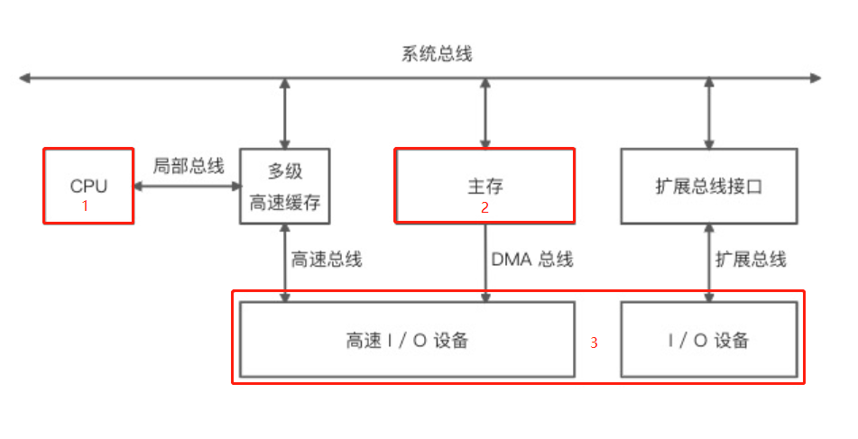

# #说明

>这部分就考核到你大学时期有没有好好学习了,出来混迟早要还的.
>
>主要考察内容：计算机原理、编译原理、算法、设计模式、编程范式等基本知识; 数据结构我将会另开一个笔记
>
>然后此处给出本人编程基础学习笔记 --> **[编程_算法及课程基础学习笔记](https://gitee.com/hongjilin/hongs-study-notes/tree/master/编程_算法及课程基础学习笔记)**

# 一、计算机组成原理

> 此部分考到了计算机组成原理部分知识点 详细知识点可以看本人笔记-->  **[计算机组成原理](https://gitee.com/hongjilin/hongs-study-notes/tree/master/编程_算法及课程基础学习笔记/计算机组成原理)** 

### 1、列举你所了解的计算机存储设备类型

#### Ⅰ - 存储的组成

>现代计算机以 **存储器** 为中心, 主要由 **CPU**、**I/O设备** 以及 **主存储器** 三大部分组成.各个部分通过总线进行连接通信
>
>###### 举个多总线结构的示意图
>
> 
>
>> CPU、主存以及 I / O 设备之间的所有数据都是通过总线进行并行传输，使用局部总线是为了提高 CPU 的吞吐量（CPU 不需要直接跟 I / O 设备通信），而使用高速总线（更贴近 CPU）和 DMA 总线则是为了提升高速 I / O 设备（外设存储器、局域网以及多媒体等）的执行效率。
>
>###### 主存储器包括 **随机存储器** RAM 和 **只读存储器** ROM (指的都是半导体存储器)

#### Ⅱ - **随机存储器** RAM

>实际上这个就是我们常说的内存
>
>* RAM 主要分为静态 RAM（SRAM） 和动态 RAM（DRAM） 两种类型
>* 指的是主板上的存储不见,是CPU直接与之沟通并用其存储数据的不见
>* 存放当前 正在使用的(**即执行中**) 的数据和程序
>* **它的物理实质就是一组或多组具备数据输入输出和数据存储功能的集成电路**
>* 内存只用于暂时存放程序和数据,一旦关闭电源或者发生断电,其中的程序和数据就会丢失
>* 随机存储器  **`RAM`**（Random Access Memory）俗称内存 

#### Ⅲ - **只读存储器** ROM

>这个是我们说的外存:如硬盘、软盘、磁带、CD等
>
>* ROM 可以分为 MROM（一次性）、PROM、EPROM、EEPROM 。
>* 能长期保存信息,且**不依赖于电**来保存信息,即断电不会失去保存的信息
>* 由于是机械部件带动,速度与CPU相比就显得慢得多
>* **`ROM`**（Read Only Memory） 只读内存，应用于硬盘存储

#### Ⅳ  - 简短回答

>1. 现代计算机以 **存储器** 为中心, 主要由 **CPU** 、**I/O设备**、**主存储器** 三部分构成
>2. 存储器是用来存储程序和数据的部件,对于计算机来说,有了存储器才有记忆功能,才能保证正常工作
>3. 而 **主存储器** 又可以分为两类:
>   - **内存储器**: 又称 **随机存储器RAM** ,就是我们常说的`内存`,它只用于暂时存放程序和数据,一旦关闭电源或者发生断电,其中的程序和数据就会丢失
>   - **外存储器(辅助存储器)**: 又称 **只读存储器 ROM** ,它能长期保存信息**且不依赖于电**,即便断电也不会失去保存的信息,就比如:硬盘、U盘、磁带等

------

### 2、**说说内存的分类**

#### Ⅰ - 静态RAM

>> **静态RAM，指SRAM：只要有供电，它保存的数据就不会丢失，且为高速存储器，如CPU中的高速缓存（cache）**
>
>缓存通常使用的是静态RAM, 不过由于静态RAM集成度低,因此便延申出一级缓存和二级缓存
>
>- 一级缓存为 静态RAM
>- 二级缓存为告诉动态RAM（比静态RAM慢，但比常规动态RAM要快）

#### Ⅱ - 动态RAM

>>**动态RAM，指DRAM：有供电，还要根据它要求的刷新时间参数，才能保持存储的数据不丢失，如电脑中的内存条**
>
>现在使用的内存一般都是**动态RAM** 
>
>- 因为静态RAM集成度相对较低:存储相同数据量,静态RAM的提及是动态RAM的6倍之多,且价格高

#### Ⅲ  -  动态RAM 与 静态RAM 的区别

> * 动态RAM 会周期地刷新,而 静态RAM 不会进行刷新
> * 动态RAM 是靠MOSS电路中的栅极电容来记忆信息的; 静态RAM 是靠双稳态触发器来记忆信息的
> * 由于电容上的电荷会泄露,需要定时给予补充. 所以 动态RAM 需要设置刷新电路,而静态不用
>
> ###### 应用上的区别
>
> * 动态RAM 比 静态RAM 集成度高、功耗低,从而成本也低,适用于做大容量储存器,所以**主内存通常采用动态RAM**
> * 另外:内存还应用于显卡、声卡及CMOS等设备中,用于充当设备缓存或保存固定的程序及数据
> * **高速缓冲存储器(Cache)则使用静态RAM** 

------

### 3、**一般代码存储在计算机的哪个设备中？代码在 CPU 中是如何运行的？**

> 一般来说,存储在 **内存** 或者 **CPU缓存** 中   
