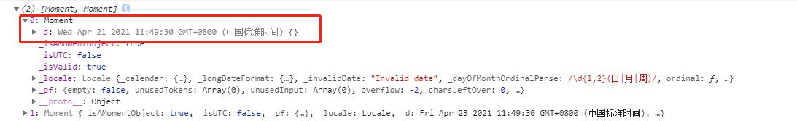

>本人[笔记地址](https://gitee.com/hongjilin/hongs-study-notes)

# #目录

>[TOC]

# 一、moment问题与解决

### Ⅰ-取出Moment格式中的具体时间报错

>1. 报错:`property '_d' does not exist on type 'moment'.`
>2. 出现错误原因分析:
>
>​	
>
>3. 解决
>
>   1. 其实不用`_d`去取出来,Moment格式有相应的取出方法
>
>      


# 二、moment常用基础知识点

moment获取天的23时59分59秒可以用moment().endOf(String)，以及获取天的0时0分0秒可以用moment().startOf('day')

- ##### 获取今天0时0分0秒

  ```
  moment().startOf('day')
  ```

- ##### 获取本周第一天(周日)0时0分0秒

  ```
  moment().startOf('week')
  ```

- ##### 获取本周周一0时0分0秒

  ```
  moment().startOf('isoWeek')
  ```

- ##### 获取当前月第一天0时0分0秒

   

  ```
  moment().startOf('month')
  ```

- - #### End of Time

    ```
    moment().endOf(String)
    ```

    - ##### 获取今天23时59分59秒

      ```
      moment().endOf('day')
      ```

    - ##### 获取本周最后一天(周六)23时59分59秒

      ```
      moment().endOf('week')
      ```

    - ##### 获取本周周日23时59分59秒

      ```
      moment().endOf('isoWeek')
      ```

    - ##### 获取当前月最后一天23时59分59秒

      ```
      moment().endOf('month')
      ```

  - #### Days in Month

    ```
    moment().daysInMonth()
    ```

    - ##### 获取当前月的总天数

      ```
      moment().daysInMonth()
      ```

  - #### Timestamp

    - ##### 获取时间戳(以秒为单位)

      ```
      moment().format('X') // 返回值为字符串类型
      
      
      
      moment().unix() // 返回值为数值型
      ```

    - ##### 获取时间戳(以毫秒为单位)

      ```
      moment().format('x') // 返回值为字符串类型
      
      
      
      moment().valueOf() // 返回值为数值型
      ```

  - #### Get Time

    - ##### 获取年份

      ```
      moment().year()
      
      
      
      moment().get('year')
      ```

    - ##### 获取月份

      ```
      moment().month() (0~11, 0: January, 11: December)
      
      
      
      moment().get('month')
      ```

    - ##### 获取一个月中的某一天

      ```
      moment().date()
      
      
      
      moment().get('date')
      ```

    - ##### 获取一个星期中的某一天

      ```
      moment().day() (0~6, 0: Sunday, 6: Saturday)
      
      
      
      moment().weekday() (0~6, 0: Sunday, 6: Saturday) moment().isoWeekday() (1~7, 1: Monday, 7: Sunday) moment().get('day') mment().get('weekday') moment().get('isoWeekday')
      ```

    - ##### 获取小时

      ```
      moment().hours()
      
      
      
      moment().get('hours')
      ```

    - ##### 获取分钟

      ```
      moment().minutes()
      
      
      
      moment().get('minutes')
      ```

    - ##### 获取秒数

      ```
      moment().seconds()
      
      
      
      moment().get('seconds')
      ```

    - ##### 获取当前的年月日时分秒

      ```
      moment().toArray() // [years, months, date, hours, minutes, seconds, milliseconds]
      
      
      
      moment().toObject() // {years: xxxx, months: x, date: xx ...}
      ```

  ### 设置时间

  - #### Set Time

    ```
    moment().year(Number), moment().month(Number)...
    
    
    
    moment().set(String, Int)
    
    
    
    moment().set(Object)
    ```

    - ##### 设置年份

      ```
      moment().year(2019)
      
      
      
      moment().set('year', 2019)
      
      
      
      moment().set({year: 2019})
      ```

    - ##### 设置月份

      ```
      moment().month(11) (0~11, 0: January, 11: December) moment().set('month', 11) 
      ```

    - ##### 设置某个月中的某一天

      ```
      moment().date(15)
      
      
      
      moment().set('date', 15)
      ```

    - ##### 设置某个星期中的某一天

      ```
      moment().weekday(0) // 设置日期为本周第一天（周日）
      
      
      
      moment().isoWeekday(1) // 设置日期为本周周一
      
      
      
      moment().set('weekday', 0) moment().set('isoWeekday', 1)
      ```

    - ##### 设置小时

      ```
      moment().hours(12)
      
      
      
      moment().set('hours', 12)
      ```

    - ##### 设置分钟

      ```
      moment().minutes(30)
      
      
      
      moment().set('minutes', 30)
      ```

    - ##### 设置秒数

      ```
      moment().seconds(30)
      
      
      
      moment().set('seconds', 30)
      ```

  - #### Add Time

    ```
    moment().add(Number, String)
    
    
    
    moment().add(Object)
    ```

    - ##### 设置年份

      ```
      moment().add(1, 'years')
      
      
      
      moment().add({years: 1})
      ```

    - ##### 设置月份

      ```
      moment().add(1, 'months')
      ```

    - ##### 设置日期

      ```
      moment().add(1, 'days')
      ```

    - ##### 设置星期

      ```
      moment().add(1, 'weeks')
      ```

    - ##### 设置小时

      ```
      moment().add(1, 'hours')
      ```

    - ##### 设置分钟

      ```
      moment().add(1, 'minutes')
      ```

    - ##### 设置秒数

      ```
      moment().add(1, 'seconds')
      ```

  - #### Subtract Time

    ```
    moment().subtract(Number, String)
    
    
    
    moment().subtract(Object)
    ```

    - ##### 设置年份

      ```
      moment().subtract(1, 'years')
      
      
      
      moment().subtract({years: 1})
      ```

    - ##### 设置月份

      ```
      moment().subtract(1, 'months')
      ```

    - ##### 设置日期

      ```
      moment().subtract(1, 'days')
      ```

    - ##### 设置星期

      ```
      moment().subtract(1, 'weeks')
      ```

    - ##### 设置小时

      ```
      moment().subtract(1, 'hours')
      ```

    - ##### 设置分钟

      ```
      moment().subtract(1, 'minutes')
      ```

    - ##### 设置秒数

      ```
      moment().subtract(1, 'seconds')
      ```

  ### 格式化时间

  - #### Format Time

    ```
    moment().format()
    
    
    
    moment().format(String)
    ```

    - ##### 格式化年月日： 'xxxx年xx月xx日'

      ```
      moment().format('YYYY年MM月DD日')
      ```

    - ##### 格式化年月日： 'xxxx-xx-xx'

      ```
      moment().format('YYYY-MM-DD')
      ```

    - ##### 格式化时分秒(24小时制)： 'xx时xx分xx秒'

      ```
      moment().format('HH时mm分ss秒')
      ```

    - ##### 格式化时分秒(12小时制)：'xx:xx:xx am/pm'

      ```
      moment().format('hh:mm:ss a')
      ```

    - ##### 格式化时间戳(以秒为单位)

      ```
      moment().format('X') // 返回值为字符串类型
      ```

    - ##### 格式化时间戳(以毫秒为单位)

      ```
      moment().format('x') // 返回值为字符串类型
      ```

  ### 比较时间

  - #### Difference

    ```
    moment().diff(Moment|String|Number|Date|Array)
    ```

    - ##### 获取两个日期之间的时间差

      ```
      let start_date = moment().subtract(1, 'weeks')
      
      
      
      let end_date = moment()
      
      
      
      
      
      
      
      end_date.diff(start_date) // 返回毫秒数 end_date.diff(start_date, 'months') // 0 end_date.diff(start_date, 'weeks') // 1 end_date.diff(start_date, 'days') // 7 start_date.diff(end_date, 'days') // -7
      ```

  ### 转化为JavaScript原生Date对象

  ```
  moment().toDate()
  
  
  
  new Date(moment())
  ```

  - #### 将Moment时间转换为JavaScript原生Date对象

    ```
    let m = moment()
    
    
    
    let nativeDate1 = m.toDate()
    
    
    
    let nativeDate2 = new Date(m) String(nativeDate1) === String(nativeDate2) // true
    ```

  ### 实战

  - ##### 获取昨日0时0分0秒到昨日23时59分59秒， 格式：[milliseconds, milliseconds]

  - ##### 获取上周一到上周日时间范围，格式: [seconds, seconds]

  - ##### 获取上个月第一天和最后一天时间范围， 格式：[YYYY-MM-DD, YYYY-MM-DD]