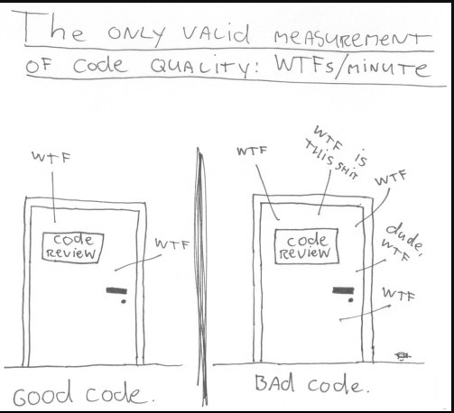
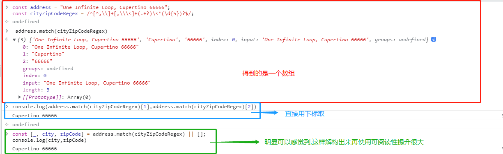
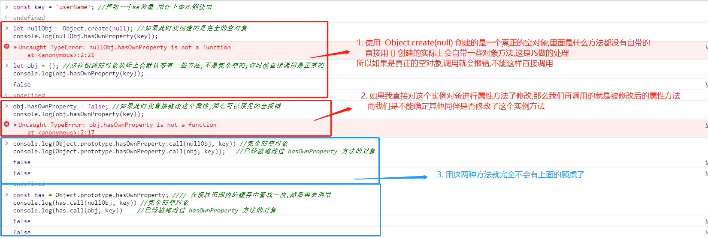

## #说明

>实际上,网络上关于 **JavaScript** 代码规范的好文章有很多,大家大可自行去查阅,此处将为本人梳理摘录的规范笔记,实际上会对查阅地多个资料进行摘录整合且以我的语言描述,梳理成方便本人查阅的样子, **仅供本人学习使用**.
>
>当然,**很多资料都是英文且知识点繁多驳杂**,如果同学们看英文资料相对吃力或者认为资料过多无法抓住重点的话还是可以看我的笔记,本人对于自己的语言组织能力还是有点信心的.
>
>查阅借鉴的资料: 首先分享个很多前辈推荐我去阅读学习的 **JavaScript** 代码规范文章: [clean-code-javascript ](https://github.com/ryanmcdermott/clean-code-javascript) 大家大可直接阅读这个文章;  其他的资料还有 菜鸟教程的[前端JavaScript规范](https://www.runoob.com/w3cnote/javascript-guide.html);  阿里云开发者社区的[JavaScript 代码规范](https://developer.aliyun.com/article/91941); Airbnb 出品的[javascript-zh](https://github.com/BingKui/javascript-zh);  CSDN的 [JavaScript代码规范（常用](https://blog.csdn.net/wmdydxr/article/details/88993107); 
>
>除此笔记外大家可以看我其他笔记 :**[全栈笔记](https://gitee.com/hongjilin/hongs-study-notes/tree/master)**、**[数据结构与算法](https://gitee.com/hongjilin/hongs-study-notes/tree/master/编程_算法及课程基础学习笔记/数据结构与算法)**、**[编程_前端开发学习笔记](https://gitee.com/hongjilin/hongs-study-notes/tree/master/编程_前端开发学习笔记)**、**[编程_后台服务端学习笔记](https://gitee.com/hongjilin/hongs-study-notes/tree/master/编程_后台服务端学习笔记)** 、**[Java](https://gitee.com/hongjilin/hongs-study-notes/tree/master/编程_后台服务端学习笔记/Java)** 、**[Nodejs](https://gitee.com/hongjilin/hongs-study-notes/tree/master/编程_后台服务端学习笔记/Nodejs)** 、**[JavaScript笔记](https://gitee.com/hongjilin/hongs-study-notes/tree/master/编程_前端开发学习笔记/HTML+CSS+JS基础笔记/JavaScript笔记)**、**[编程工具使用笔记](https://gitee.com/hongjilin/hongs-study-notes/tree/master/编程_前端开发学习笔记/A_前端工具使用笔记)** 、**[前端代码规范](https://gitee.com/hongjilin/hongs-study-notes/tree/master/编程_前端开发学习笔记/A_前端代码规范)** 、**[Git学习笔记](https://gitee.com/hongjilin/hongs-study-notes/tree/master/编程_前端开发学习笔记/Git学习笔记)** 、**[ES6及后续版本学习笔记](https://gitee.com/hongjilin/hongs-study-notes/tree/master/编程_前端开发学习笔记/ES6及后续版本学习笔记)** 、**[Vue笔记整合](https://gitee.com/hongjilin/hongs-study-notes/tree/master/编程_前端开发学习笔记/Vue笔记整合)** 、**[React笔记](https://gitee.com/hongjilin/hongs-study-notes/tree/master/编程_前端开发学习笔记/React笔记)**、**[微信小程序学习笔记](https://gitee.com/hongjilin/hongs-study-notes/tree/master/编程_前端开发学习笔记/微信小程序学习笔记)**、**[Chrome开发使用及学习笔记](https://gitee.com/hongjilin/hongs-study-notes/tree/master/编程_前端开发学习笔记/Chrome开发使用及学习笔记)** 以及许多其他笔记就不一一例举了


## 前言

>> 实际上,本笔记是基于同学们已经有一定的JS基础,并且熟悉ES6相关知识点的基础上写的,如果相对不熟悉的同学可以先看基础部分笔记  -->**[JavaScript笔记](https://gitee.com/hongjilin/hongs-study-notes/tree/master/编程_前端开发学习笔记/HTML+CSS+JS基础笔记/JavaScript笔记)**、**[ES6及后续版本学习笔记](https://gitee.com/hongjilin/hongs-study-notes/tree/master/编程_前端开发学习笔记/ES6及后续版本学习笔记)** 
>
>此处引用一下  [clean-code-javascript ](https://github.com/ryanmcdermott/clean-code-javascript)  中的一张图片能更形象的形容干净的代码与不干净的代码的区别:
>
> 
>
>这个文章中有一段话我觉得说的特别好:
>
>>* 了解这些不会立即使你成为更好的软件开发人员，与他们一起工作多年并不意味着你不会犯错误。每一段代码都是从初稿开始的，就像湿粘土被塑造成最终形式一样。
>>* 最后，当我们与同行一起回顾时，我们会剔除不完美之处。
>>* `不要为需要改进的初稿而自责。而是打败代码！`
>
>##### **不要为需要改进的初稿而自责。而是打败代码！** 

------


## 一、变量

### 1、const 、let相关规范

#### Ⅰ - 使用  const  或者  let  来定义变量

>使用 `const` 或者 `let` 来定义变量。 不这样做将创建一个全局变量。 我们希望避免污染全局命名空间。 Captain Planet 警告过我们。 eslint: [`no-undef`](https://eslint.org/docs/rules/no-undef) [`prefer-const`](https://eslint.org/docs/rules/prefer-const)
>
>```js
>// 坏的
>superPower = new SuperPower();
>
>// 好的
>const superPower = new SuperPower();
>```

#### Ⅱ - 使用  const  或者  let 声明每一个变量

>* 这样更容易添加新的变量声明
>* 而且你不必担心是使用 `;` 还是使用 `,` 或引入标点符号的差别。实际阅读时容易忽略
>* 你可以通过 debugger 逐步查看每个声明，而不是立即跳过所有声明
>
>```js
>// 坏的写法 
>const items = getItems(),
>      falg = true,
>      name = '努力学习的汪';
>// 坏的写法
>const items = getItems(),
>      falg = true; //此处使用了分号,实际上会导致 [ dragonball ] 并没有用const声明
>      name = '努力学习的汪';    //变成了全局变量
>
>// 好的代码
>const items = getItems();
>const falg = true;
>const name = '努力学习的汪';
>```

#### Ⅲ - 把  const  声明的放在一起，把  let  声明的放在一起

>> ###### **为什么? 这在后边如果需要根据前边的赋值变量指定一个变量时很有用**
>
>```js
>// 非常坏的 -->为什么坏前面说过了
>let i, len, dragonball,
>items = getItems(),
>falg = true;
>
>// 坏的  --> 这样掺杂着写很容易让你混淆他们是let还是const声明的
>let i;
>const items = getItems();
>let dragonball;
>const falg = true;
>let len;
>
>// 好的写法
>const falg = true;
>const items = getItems();
>let dragonball;
>let i;
>let length;
>```

#### Ⅳ -  在你需要的使用定义变量，但是要把它们放在一个合理的地方

>>###### **为什么? `let` 和 `const` 是块级作用域而不是函数作用域**
>
>```js
>// 坏的 - 不必要的函数调用
>function checkName(hasName) {
>//实际上如果传入参数 hasName 符合条件中断了,那么这行代码毫无意义
>const name = getName();
>
>if (hasName === 'test')  return false;
>
>if (name === 'test') {
>this.setName('');
>return false;
>}
>
>return name;
>}
>
>// 好的
>function checkName(hasName) {
>//如果传入的 hasName 符合要求就应该直接中断返回了,因为传参不用再进行获取
>if (hasName === 'test') return false;
>
>//如果 hasName 不符合条件再运行到这里,可以保证每次走到这里,这个函数调用永远是有意义的
>const name = getName();
>if (name === 'test') {
>this.setName('');
>return false;
>}
>
>return name;
>}
>```

#### Ⅴ - 使用 `const` 定义你的所有引用；避免使用 `var`

>> ###### **为什么? 这样能够确保你不能重新赋值你的引用，否则可能导致错误或者产生难以理解的代码**
>
>```js
>// 不好的
>var a = 1;
>var b = 2;
>
>// 推荐的
>const a = 1;
>const b = 2;
>```

#### Ⅵ  - 如果你必须重新赋值你的引用， 使用 `let` 代替 `var`

>> ###### **为什么? `let` 是块级作用域，而不像 `var` 是函数作用域**
>
>```js
>// 不推荐的
>var count = 1;
>if (true) {
>  count += 1;
>}
>
>//推荐的
>let count = 1;
>if (true) {
>  count += 1;
>}
>```

#### Ⅶ - 注意，let 和 const 都是块级范围的

>```js
>// const 和 let 只存在于他们定义的块中。
>{
>  let a = 1;
>  const b = 1;
>}
>console.log(a); // ReferenceError
>console.log(b); // ReferenceError
>```


### 2、 使用有意义且可发音的变量名  

>```js
>//坏的
>const yyyymmdstr = moment().format("YYYY/MM/DD");
>//好的
>const currentDate = moment().format("YYYY/MM/DD");
>```

### 3、 尽量对相同类型的变量使用相同的词汇

>```js
>//坏的-->同样是获取用户信息,取了三种名字,这样容易造成混淆且不易理解
>getUserInfo();
>getClientData();
>getCustomerRecord();
>
>//好的
>getUser();
>```

### 4、使用可搜索的名称

>* 我们将阅读的代码比我们编写的代码多。
>* 重要的是我们编写的代码可读和可搜索。
>* 通过不命名最终对理解我们的程序有意义的变量，我们伤害了我们的读者。
>* 使你的姓名可搜索。[ **buddy.js** ]和 [ **ESLint** ] 等工具 可以帮助识别未命名的常量。
>
>```js
>//坏的 --> 到底是干什么用的？
>setTimeout(blastOff, 86400000);
>
>//好的  -->  将它们声明为大写的命名常量
>const MILLISECONDS_PER_DAY = 60 * 60 * 24 * 1000; //86400000;
>setTimeout(blastOff, MILLISECONDS_PER_DAY); //这样我们就能很清晰地知道这串数字是什么作用了
>```

### 5、使用解释变量

>###### 坏的代码
>
>```js
>const address = "One Infinite Loop, Cupertino 66666";
>const cityZipCodeRegex = /^[^,\\]+[,\\\s]+(.+?)\s*(\d{5})?$/;
>//address.match(cityZipCodeRegex) 会得到一个数组,里面放置的是被匹配到的字符串
>saveCityZipCode(
>  address.match(cityZipCodeRegex)[1],//这里直接将匹配到的数组用下标直接取出来
>  address.match(cityZipCodeRegex)[2]
>);
>```
>
>###### 好的代码
>
>```js
>const address = "One Infinite Loop, Cupertino 66666";
>const cityZipCodeRegex = /^[^,\\]+[,\\\s]+(.+?)\s*(\d{5})?$/;
>//这句话意思是, 将 address.match(cityZipCodeRegex) 匹配得到的数组结果
>//第0位赋值给 _ ; 第一位赋值给 city ; 第二位赋值给 zipode , 这就是解释变量
>const [_, city, zipCode] = address.match(cityZipCodeRegex) || [];
>//这时候再将变量传入,这样的代码更容易阅读
>saveCityZipCode(city, zipCode);
>```
>
>
>
>如果这个解构看不懂的回头要去学习一下 ES6 相关知识点,现在已经是必备技能了 --> **[ES6及后续版本学习笔记](https://gitee.com/hongjilin/hongs-study-notes/tree/master/编程_前端开发学习笔记/ES6及后续版本学习笔记)** 

### 6、避免心理映射

>###### **显式优于隐式**
>
>```js
>const locations = ["深圳", "杭州", "厦门"];
>locations.forEach(l => {
>  doStuff();
>  doSomeOtherStuff();
>  dispatch(l);  //等等，`l` 又是什么？ 如果不去看上面代码我们很难猜出
>});
>
>//好的
>const locations = ["深圳", "杭州", "厦门"];
>locations.forEach(location => {
>  doStuff();
>  doSomeOtherStuff();
>  dispatch(location); //这样就算不去看上面代码,我们已经能大致猜出是什么了
>});
>```

### 7、 不要添加不需要的上下文

>**如果你的类/对象名称告诉你一些信息，请不要在你的变量名称中重复**
>
>```js
>//坏代码
>const Farmers = {
>  farmersProfession: "程序员", //实际上类名已经说明了这是个 `农民` 了,没必要再强调
>  farmersName: "努力学习的汪",
>};
>function paintCar(farmers, name) {
>  farmers.farmersName = name; 
>}
>
>//好的  --> 会相对更简洁点
>const Farmers = {
>  profession: "程序员",
>  name: "努力学习的汪",
>};
>
>function paintCar(farmers, name) {
>  farmers.name = name;
>}
>```

### 8、使用默认参数而不是短路或条件

>默认参数通常比短路更干净。请注意，如果你使用它们，你的函数将仅提供`undefined` 参数的默认值。其他“falsy”的价值观，如`''`，`""`，`false`，`null`，`0`，和 `NaN`，不会被默认值代替。
>
>```js
>//坏代码
>function createMicrobrewery(name) {
>  const breweryName = name || "努力学习的汪";
>}
>//好代码
>function createMicrobrewery(name = "努力学习的汪") {
>  const breweryName = name 
>}
>```

### 9、不要链式变量赋值

>###### **为什么? 链式变量赋值会创建隐式全局变量。**
>
>```js
>// 坏的写法  -->对于 const 也适用,此处用let进行举例
>(function example() { //此处用自执行函数封一个作用域出来
>  /**
>   JavaScript 把它解释为 let a = ( b = ( c = 1 ) ); 
>   let 关键词只适用于变量 a ；变量 b 和变量 c 则变成了全局变量。
>   */
>  let a = b = c = '努力学习的汪';
>}());
>
>console.log(a); // throws ReferenceError
>console.log(b); // '努力学习的汪'  在外部能访问到内部声明的变量
>console.log(c); // '努力学习的汪'
>
>// 好的写法
>(function example() {
>  let a = '努力学习的汪';
>  let b = a;
>  let c = a;
>}());
>
>console.log(a); // throws ReferenceError
>console.log(b); // throws ReferenceError
>console.log(c); // throws ReferenceError
>```
>
> `let a = b = c = 1;`实际上在 **JavaScript** 引擎中会被按照这样的顺序执行
>
>```js
>//首先声明
>let a ;
>//创建了全局对象的属性  --> 注意:是创建而不是声明 至于为什么是window? 因为顶层对象就是window
>window.b
>window.c
>
>//开始赋值,赋值顺序是从右至左
>window.c = '努力学习的汪';
>window.b = window.c;
>a = window.b
>```
>
>对于这里仍然不明白的可以看本人整理的另一篇笔记  -->  **[JS中声明变量与不声明变量直接使用的区别](https://gitee.com/hongjilin/hongs-study-notes/tree/master/编程_前端开发学习笔记/HTML+CSS+JS基础笔记/JavaScript笔记/JS中声明变量与不声明变量直接使用的区别.md)**
>
>如果你连顶层对象这部分知识点都不太熟悉,那我建议你补一下 **JavaScript** 进阶部分知识  --> **[JavaScript笔记](https://gitee.com/hongjilin/hongs-study-notes/tree/master/编程_前端开发学习笔记/HTML+CSS+JS基础笔记/JavaScript笔记)** 

### 10、避免使用不必要的递增和递减 (`++`, `--`)。

>>###### **为什么?** 
>>
>>* 在eslint文档中，一元递增和递减语句以自动分号插入为主题，并且在应用程序中可能会导致默认值的递增或递减。
>>* 它还可以用像 `num += 1` 这样的语句来改变你的值，而不是使用 `num++` 或 `num ++` 。
>>* 不允许不必要的增量和减量语句也会使你无法预先递增/预递减值，这也会导致程序中的意外行为。
>
>```js
>// 坏的写法
>const array = [1, 2, 3];
>let num = 1;
>num++; //此处建议用  num += 1; 的写法
>--num;
>
>let sum = 0;
>let truthyCount = 0;
>//此处用的两个变量 来循环累加记录 sum、truthyCount 的值
>for (let i = 0; i < array.length; i++) {
>  let value = array[i];
>  sum += value;
>  if (value) {
>    truthyCount++;
>  }
>}
>
>
>// 好的写法
>const array = [1, 2, 3];
>let num = 1;
>num += 1;
>num -= 1;
>//JS实际上给我们提供了很多相关 API ,灵活应用能减少我们的开发工作量的同时还能利于我们阅读
>const sum = array.reduce((a, b) => a + b, 0);
>const truthyCount = array.filter(Boolean).length;
>```

### 11、避免在赋值语句 `=` 前后换行

>###### **为什么? 在 `=` 前后换行，可能会混淆 赋的值**
>
>```js
>// 坏的写法
>const foo =
>superLongLongLongLongLongLongLongLongFunctionName();
>
>const foo
>= 'superLongLongLongLongLongLongLongLongString';
>
>
>// 好的写法
>const foo = (
>superLongLongLongLongLongLongLongLongFunctionName()
>);
>
>const foo = 'superLongLongLongLongLongLongLongLongString';
>```


------


## 二、函数

### 1、函数参数 (理想情况下为 2 个或更少)

>1. 限制函数参数的数量非常重要，因为它可以更轻松地测试你的函数。超过三个会导致组合爆炸，你必须用每个单独的参数测试大量不同的情况。
>2. 一两个参数是理想的情况，如果可能，应该避免三个参数。除此之外的任何事情都应该合并。通常，如果你有两个以上的参数，那么你的函数就会尝试做太多事情。如果不是，大多数情况下，更高级别的对象就足以作为参数。
>3. 由于 JavaScript 允许你即时创建对象，而无需大量类样板，因此如果你发现自己需要大量参数，则可以使用对象。
>
>为了让函数期望的属性一目了然，你可以使用 ES2015/ES6 解构语法。这有几个优点：
>
>>- 当有人查看函数签名时，会立即清楚正在使用哪些属性。
>>- 它可用于模拟命名参数。
>>- 解构还会克隆传递给函数的参数对象的指定原始值。这可以帮助防止副作用。注意：从参数对象解构的对象和数组不会被克隆。
>>- Linter 可以警告你未使用的属性，这在不解构的情况下是不可能的。
>>- 相关笔记 **[ES6及后续版本学习笔记](https://gitee.com/hongjilin/hongs-study-notes/tree/master/编程_前端开发学习笔记/ES6及后续版本学习笔记)** 
>
>```js
>//坏的代码
>function  createStudent ( className , name , buttonText , cancellable )  { /* ... */ } 
>//不建议分为多个参数传入
>createMenu ( "软工二班" ,  "努力学习的汪" ,  "变帅" ,  true ) ;
>
>//好的代码
>//此处用赋值解构方式取出需要的变量
>function  createStudent ( { className , name , buttonText , cancellable } )  {  /* ... */} 
>createStudent ( {  //调用时传入一个对象,里面讲需要的代码
>  className : "软工二班" , 
>  name : "努力学习的汪" , 
>  buttonText : "变帅" , 
>  cancellable : true 
>} ) ;
>```

### 2、函数应该只做一件事

>**这是迄今为止软件工程中最重要的规则: **
>
>* 当函数做不止一件事时，它们更难组合、测试和推理。
>* 当你可以将一个函数隔离为一个操作时，它可以轻松重构，你的代码读起来会更清晰。
>
>```js
>//不好的 --> 这个函数做两件事,但两件事又无关联,那么你该怎么形容这个函数? 读取还是写入类型函数?
>const badFunction = () => {
>  //获取某数据详情,并对获得的结果进行处理
>  const detil = await http.post('/store/detail', params);
>  detil.then( /* ..... */ )
>
>  //发送某请求,例如添加某名称
>  await http.post('/tag/add', {
>    name: '努力学习的汪'
>  });
>}
>
>//好的写法 --> 这样此函数就是用作专门调用,详细的事情就由下级两个函数分别做,各司其职
>const goodFunction = () => {
>  getDetails();
>  setName()
>}
>
>//获取某数据详情,并对获得的结果进行处理
>const getDetails = () => {
>  const detil = await http.post('/store/detail', params);
>  detil.then( /* ..... */ )
>}
>//发送某请求,例如添加某名称
>const setName = () => {
>  await http.post('/tag/add', {
>    name: '努力学习的汪'
>  });
>}
>```

### 3、函数应该只有一层抽象

>###### **当你有多个抽象级别时，你的函数通常做得太多。拆分功能导致可重用性和更容易的测试**
>
>```js
>//不好的代码:
>function parseBetterJSAlternative(code) {
>  const REGEXES = ['努力学习的汪','新生代农民工','hongjilin'];
>  const statements = code.split(" ");
>  const tokens = [];
>  //首先对 传入参数code 进行处理,处理后的结果赋予给 tokens  
>  REGEXES.forEach(REGEX => {
>    statements.forEach(statement => {
>       tokens.push(/*...*/)
>    });
>  });
>
>  const ast = [];
>  //然后我再对 进行过一次处理的 code 即 [tokens] 进行二次处理, 赋予给 ast  
>  tokens.forEach(token => {
>    ast.push(/* ... */)
>  });
> //再然后我再对 [ast]	进行处理
>  ast.forEach(node => {
>    // parse...
>  });
>}
>
>```
>
>>* 先不说其他的,就我已经给每个处理都打上了注释,阅读代码时是否仍然觉得耦合度非常高,难以阅读或者修改?
>>* 想象一下,就这个代码长度给你 **×3** ,然后说出了一个BUG,让你进行排错修改,是不是血压高了起来?
>>* 再想象一下,如果整个项目都是这样的代码,这时候来了个新需求,需要在原有业务上进行修改,那你听到需求的时候再想一下这个代码 ???
>
>```js
>//好的代码
>function parseBetterJSAlternative(code) {
>  //抽出后我只要按顺序调用即可,代码结构变得清晰的同时也变得容易阅读、排错
>  const tokens = tokenize(code); //调用对于code的第一次处理
>  const syntaxTree = parse(tokens); //调用对于code 的就一步处理
>  syntaxTree.forEach(node => {
>    // parse...
>  });
>}
>
>//1. 对于 code 第一次处理,处理成tokens
>function tokenize(code) {
>  const REGEXES = ['努力学习的汪','新生代农民工','hongjilin'];
>  const statements = code.split(" ");
>  const tokens = [];
>  REGEXES.forEach(REGEX => {
>    statements.forEach(statement => {
>      tokens.push(/* ... */);
>    });
>  });
>  return tokens;
>}
>//2. 对于 tokens 的进一步处理
>function parse(tokens) {
>  const syntaxTree = [];
>  tokens.forEach(token => {
>    syntaxTree.push(/* ... */);
>  });
>  return syntaxTree;
>}.
>```

### 4、函数名称应该说明它们的作用

>```js
>//不好的写法
>function  addToDate ( date ,  month )  { /* ... */ } 
>const  date  =  new  Date ( ) ; 
>//如果调用时距离函数定义很远,光看调用时的函数名 是不是很难猜出这个函数、这个参数`1` 分别都是什么作用
>addToDate ( date ,  1 ) ;
>
>//好的写法 
>function addMonthToDate(month, date) { /* ... */ } 
>const date = new Date();
>//这里即使不看函数定义,仍然能猜得出这个函数具体作用,参数作用.
>addMonthToDate(1, date);
>```
>
>实际查阅代码中, 最难的就是上下文过长,容易忘记每个函数各自作用,如果能这里明了的给出作用,对于后来维护代码的同伴是十分友好的

### 5、避免重复代码

>1. 尽最大努力避免重复代码。重复的代码是不好的，因为这意味着如果你需要改变一些这重复代码块的逻辑，那么你需要在所有复制了这个重复代码块的地方进行修改,这意味着你可能很容易发生不可意料的错误(手抖多改或者错改)
>
>2. 很多时候你有重复的代码是因为你有两个或更多稍微不同的东西
>
>   >- 它们有很多共同点，
>   >- 但它们的不同迫使你有两个或更多独立的函数来做很多相同的事情
>   >- 删除重复代码意味着创建一个抽象，它可以只用一个函数/模块/类来处理这组不同的事情
>   >- 实际上这就像在Java学习过程中反复强调的 **类与继承** 部分知识点: 抽出一个父类(共同点),多个子类继承父类的特性
>
>3. 写出正确的抽象至关重要
>
>   >- 关于 **类(class)** 将在下方单独列出它的规范,我们应该遵守它 .
>   >- **糟糕的抽象可能比重复的代码还要糟糕,所以要小心!** 
>   >- 话虽如此,如果能做出好的抽象,那就去做吧! 不必 '讳疾忌医',就如上面所说的: `不要为需要改进的初稿而自责。而是打败代码！` 不必怕自己写不好抽象而不去写,而是在反复思考后写出心里的代码,这样才能进步
>   >- 不要重复自己,否则你会发现自己在任何时候想要更改一件事情就会更改多个地方
>
>```js
>//坏的代码
>function showDeveloperList(developers) {
>  developers.forEach(developer => {
>    const expectedSalary = developer.calculateExpectedSalary();
>    const experience = developer.getExperience();
>    const githubLink = developer.getGithubLink(); 
>    const data = {
>      expectedSalary,
>      experience,
>      githubLink
>    };
>
>    render(data);
>  });
>}
>//重复的第二个函数
>function showManagerList(managers) {
>  managers.forEach(manager => {
>    const expectedSalary = manager.calculateExpectedSalary();
>    //只有此行代码不一样,而且在不影响重复代码块效果的时候,可能上下文顺序是不同的,这样更难以排查修改了
>    const portfolio = manager.getMBAProjects(); 
>    const experience = manager.getExperience();
>    const data = {
>      expectedSalary,
>      experience,
>      portfolio
>    };
>
>    render(data);
>  });
>}
>
>```
>
>>如果说,此时要修改一个重复部分的 **expectedSalary** 处理方式,那么我如果这个代码块重复了十次,那我就需要去改10个地方,而在实际开发中,查找这些重复代码块往往并不容易,下面给出几个推荐的写法
>
>```js
>//好的写法一
>function showEmployeeList(employees) {
>  employees.forEach(employee => {
>    const expectedSalary = employee.calculateExpectedSalary();
>    const experience = employee.getExperience();
>    const data = {
>      expectedSalary,
>      experience
>    };
>	//将重复的代码块写到同一个函数中,通过判断决定不一样的处理方式
>    switch (employee.type) {
>      case "manager":
>        data.portfolio = employee.getMBAProjects();
>        break;
>      case "developer":
>        data.githubLink = employee.getGithubLink();
>        break;
>    }
>    render(data);
>  });
>}
>
>/****** 也可以这样写,或者用class相关知识点也行,下面写法优于上方 ******/
>
>//这是重复代码块,需要的直接调用即可,需要修改时只要改此处,调用的地方都会受到改变
>function showEmployeeList(employees) {
>  employees.forEach(employee => {
>    const expectedSalary = employee.calculateExpectedSalary();
>    const experience = employee.getExperience();
>    const data = {
>      expectedSalary,
>      experience
>    };
>    return data
>  });
>}
>//分别在需要的地方调用即可
>const showDeveloperList = (developers) =>{
>  let data = showEmployeeList(developers);
>  data.githubLink = employee.getGithubLink();
>  render(data);
>}
>
>const showManagerList = (managers) =>{
>  let data = showEmployeeList(managers);
>  data.portfolio = employee.getMBAProjects();
>  render(data);
>}
>```
>
>实际上不同的场景有不同的写法,没有说一定好的写法,有的只是我们程序员对于代码质量的追求

### 6、不要使用 flag 作为函数参数

>`flag`告诉你的用户这个函数做的不止一件事。而函数应该只做一件事。
>
>1. 如果函数遵循基于 `布尔值` 的不同代码路径，可以尝试拆分它们。
>2. 这时你可能有疑惑了:上面 [避免重复代码] 中使用 switch ,不也算是一种标识吗?
>   * 首先他不是 `布尔值`, 所以他可能会有特别多的情况,如果一一分开反而更难以查阅,增加自己开发难度
>   * 其次,确实能够  `避免条件` 就尽量应避免,详见下方  [避免条件](#14、避免条件) 部分
>   * 并不是一定要求不能使用,只是说能想出更好写法的情况下使用更好的情况,大多数函数出现都是有它的需求场景的
>
>```js
>//坏代码
>function createFile(name, temp) {
>  if (temp) {
>    fs.create(`./temp/${name}`);
>  } else {
>    fs.create(name);
>  }
>}
>
>//好代码  --> 不再使用标识判断,而是在需要的时候调用不同函数
>function createFile(name) {
>  fs.create(name);
>}
>
>function createTempFile(name) {
>  createFile(`./temp/${name}`);
>}
>```

### 7、使用 Object.assign 设置默认对象

>###### 知识点补充
>
>>`Object.assign()` 方法: 用于将所有可枚举属性的值从一个或多个源对象分配到目标对象。它将返回目标对象。
>>
>>第二个参数,如果目标对象中的属性具有相同的键，则属性将被源对象中的属性覆盖。后面的源对象的属性将类似地覆盖前面的源对象的属性。  
>
>###### 不好的写法
>
>```js
>const studentConfig = {
>  occupation: null,
>  name: "努力学习的汪",
>  buttonText: null,
>  cancellable: true
>};
>
>function createStudent(config) {
>  config.occupation = config.occupation || "学生";
>  config.name = config.name || "hongjilin";
>  config.buttonText = config.buttonText || "变帅";
>   //此处必须这样判断而不是直接用 || 进行默认赋值 因为 false与undefined 在逻辑运算符中的结果是一样的 
>  config.cancellable =
>    config.cancellable !== undefined ?
>    config.cancellable :
>    true;
>  return config
>}
>
>createStudent(studentConfig);
>//{occupation: '学生', name: '努力学习的汪', buttonText: '变帅', cancellable: true}
>```
>
>> 如果对于上面代码的  [ cancellable ] 默认赋值判断方式感觉到陌生或者无法理解的,可以看本人整理的这个笔记 --> **[JS中的逻辑运算符详解笔记](https://gitee.com/hongjilin/hongs-study-notes/tree/master/编程_前端开发学习笔记/HTML+CSS+JS基础笔记/JavaScript笔记/JS中的逻辑运算符详解笔记.md)** 
>
>###### 好的写法
>
>```js
>const studentConfig = {
>  occupation: "现在是程序员",
>  // 用户没有包含 'name' 键
>  buttonText: "变秃",
>  cancellable: true
>};
>
>function createStudent(config) {
>  let finalConfig = Object.assign({
>      occupation: "曾经是学生",
>      name: "努力学习的汪",
>      buttonText: "变帅",
>      cancellable: true
>    },
>//第二个参数,如果目标对象中的属性具有相同的键，则属性将被源对象中的属性覆盖。后面的源对象的属性将类似地覆盖前面的源对象的属性。   
>    config
>  );
>  return finalConfig
>}
>
>createStudent(studentConfig);
>//{occupation: '现在是程序员', name: '努力学习的汪', buttonText: '变秃', cancellable: true}
>```

### 9、避免副作用

#### Ⅰ - 避免常见的副作用

>1. 如果一个函数除了接受一个值并返回另一个或者多个值以外的任何操作,都会产生副作用. 
>2. 副作用可能是写入文件、修改某些全局变量、又或者是影响到了页面渲染等
>3. 但有时我们又确实需要在程序中产生副作用,就比如要向某个文件写入数据,那么我们应当注意不要有多个写入特定文件的函数或者类.尽量保证有且只有一个.
>4. 重点是避免常见的陷阱,例如:
>   - 在没有任何结构的对象之间共享状态
>   - 使用任何可以写入的可变数据类型
>   - 以及不集中出现副作用的位置
>
>###### 坏的写法
>
>```js
>// 以下函数引用的全局变量。
>// 如果我们运行了 调用并加工这个变量 的函数, 那么就会产生不想要的副作用
>let name = "玛瑞儿";
>function splitIntoFirstAndLastName() {
>  name = name+"爱上了康康"
>}
>
>console.log('调用前的全局',name);  //调用前的全局 玛瑞儿
>splitIntoFirstAndLastName();
>console.log('调用后的全局',name);  //调用后的全局 玛瑞儿爱上了康康  
>//并且往后 查看name 都是被修改后的值
>```
>
>###### 好的写法
>
>```js
>function splitIntoFirstAndLastName(name) {
>  return name+"爱上了康康"
>}
>const name = "玛瑞儿";
>const newName = splitIntoFirstAndLastName(name);
>
>console.log(name); // '玛瑞儿';
>console.log(newName); // 玛瑞儿爱上了康康
>//这样就能不影响到其他变量的同时得到自己需要的结果
>```

#### Ⅱ - 避免可变参数副作用

>在 **JavaScript** 中,有些值是不可变的、有些是可变的. 其中 **对象和数组是两种可变值** . 因此在将它们作为参数传递给函数要小心处理.**JavaScript** 函数可以更改对象的属性或更改数组的内容,这很容易在其他地方引起错误

##### a) 举个🌰

>假设:有一个函数接受一个表示购物车的数组参数. 如果该函数对于该购物车数组进行了更改:
>
>* 假设现在我们项目的购物流程是: 通过 `添加` 函数将要买的商品加入购物车,点击 '购买' 将购物车商品全部买下
>* 如:通过添加函数添加要购买的而项目 -- 那么使用相同 `cart` 数组的任何函数都将收到此函数的影响
>* 这可能很棒,但也可能造成很糟糕的后果
>
>我们想象一个BUG场景:
>
>>* 用户点击 '购买' 按钮,这时候我们产生网络请求并将 `cart` 数组发送到服务器的处理函数中
>>* 但假设我们网络连接不良或者因为其他情况,导致我们请求函数不断重试请求
>>* 而在它重试请求的过程中,客户点击到了他们实际上不想要的商品的 '添加购物车'
>>* 因为我们添加函数是直接操作 `cart` 数组,这样会导致新加的商品会直接带到重新发起的请求中
>
>当然,具体开发过程中会遇到更多贴切 **副作用** 的场景,这里先按照这个场景进行列举

##### b) 解决方式

>一个很好的解决方案是让`addItemToCart`函数始终克隆 `cart`、编辑它并返回克隆。这将确保仍在使用旧购物车的功能不会受到更改的影响。
>
>- 可能有些情况下你确实想要修改输入对象，但是当你采用这种编程实践时，你会发现这些情况非常罕见。大多数东西都可以重构为没有副作用！
>- 就性能而言，克隆大对象可能非常昂贵。幸运的是，这在实践中并不是什么大问题，因为有很多很棒的库(实际上配合ES6就能做到大部分操作)可以让这种编程方法变得更快，而且不会像手动克隆对象和数组那样占用大量内存。

##### c) 代码示例

>```js
>//不好的代码
>const addItemToCart = (cart, item) => {
>  cart.push({ item, date: Date.now() });
>};
>
>//好的代码
>const addItemToCart = (cart, item) => {
>  return [...cart, { item, date: Date.now() }];
>};
>```
>
>这里运用到ES6的赋值解构相关知识点,仍是之前说过的,不懂的请看  --> **[ES6及后续版本学习笔记](https://gitee.com/hongjilin/hongs-study-notes/tree/master/编程_前端开发学习笔记/ES6及后续版本学习笔记)** 

#### Ⅲ - 避免不可变参数的副作用

>为什么? 他们很容易混淆。
>
>```js
>var b = 1;
>// 不好的写法
>function count(a = b++) {
>  console.log(a);
>}
>count();  // 1
>count();  // 2
>count(3); // 3
>count();  // 3
>```


### 10、不要写入全局函数

>在 JavaScript 中污染全局变量是一种不好的做法，因为你可能会与另一个库发生冲突，并且你的 API 的用户(或同事)在他们开发生产中遇到异常之前将一无所知。
>
>让我们考虑一个例子：
>
>>* 如果你想扩展 JavaScript 的原生 Array 方法来拥有一个`diff`可以显示两个数组之间差异的方法怎么办？
>>* 你可以将新函数写入`Array.prototype`，但它可能会与另一个试图做同样事情的库发生冲突。
>>* 如果其他库只是`diff`用来查找数组的第一个和最后一个元素之间的差异怎么办？
>>* 这就是为什么只使用 ES2015/ES6 类并简单地扩展`Array`全局会更好。
>
>```js
>//不好的写法
>Array.prototype.diff = function diff(comparisonArray) {
>  const hash = new Set(comparisonArray);
>  return this.filter(elem => !hash.has(elem));
>};
>
>//好的写法
>class SuperArray extends Array {
>  diff(comparisonArray) {
>    const hash = new Set(comparisonArray);
>    return this.filter(elem => !hash.has(elem));
>  }
>}
>```
>
>这里运用到ES6的 Class 相关知识点,仍是之前说过的,不懂的请看  --> **[ES6及后续版本学习笔记](https://gitee.com/hongjilin/hongs-study-notes/tree/master/编程_前端开发学习笔记/ES6及后续版本学习笔记)** 

### 11、比命令式编程应更倾向于函数式编程

>JavaScript 不像 Haskell 那样是一种函数式语言，但它具有函数式的风格。函数式语言可以更简洁，更易于测试。尽可能支持这种编程风格
>
>###### 这里举个统计代码行数的栗子
>
>```js
>const programmerOutput = [
>  {
>    name: "努力学习的汪",
>    //没错,截至目前,本人笔记已经快20W行了
>    linesOfCode: 200000  
>  },
>  {
>    name: "新生代农民工",
>    linesOfCode: 9999
>  },
>  {
>    name: "hongjilin",
>    linesOfCode: 150
>  },
>  {
>    name: "洪帅",
>    linesOfCode: 1000
>  }
>];
>
>//坏的代码
>let totalOutput = 0;
>for (let i = 0; i < programmerOutput.length; i++) {
>  totalOutput += programmerOutput[i].linesOfCode;
>}
>//好的代码
>const totalOutput = programmerOutput.reduce(
>  (totalLines, output) => totalLines + output.linesOfCode,
>  0
>);
>```

### 12、建议封装条件

>```js
>//不好的写法
>if (fsm.state === "fetching" && isEmpty(listNode)) {}
>
>//建议的写法
>function shouldShowSpinner(fsm, listNode) { return fsm.state === "fetching" && isEmpty(listNode) }
>if (shouldShowSpinner(fsmInstance, listNodeInstance)) {}
>```

### 13、应避免否定条件

>```js
>function isDOMNodeNotPresent(node) {/*return Boolean*/ }
>//不推荐的写法
>if (!isDOMNodeNotPresent(node)) {}
>//推荐的写法
>if (isDOMNodePresent(node)) {}
>```
>
>实际开发中我倒是挺经常使用这 **不推荐写法** 因为某些场景下是真的方便

### 14、避免条件

>这似乎是一项不可能完成的任务。
>
>1. 很多人第一次听到这个，都会说：**不说出来怎么办`if`？**
>   * 答案是: 在许多情况下，你可以使用多态来实现相同的任务。
>2. 第二个问题通常是: “**这很好，但我为什么要这样做？**” 
>   - 答案是我们之前学到的一个干净的代码概念：**一个函数应该只做一件事**。
>   - 当你拥有带有`if`语句的类和函数时，你就是在告诉你的用户你的函数做了不止一件事。
>   - 记住，只做一件事。
>
>```js
>//不推荐的写法
>class Airplane {
>  getCruisingAltitude() {
>    switch (this.name) {
>      case "努力学习的汪":
>        return this.getMaxAltitude() - this.getPassengerCount();
>      case "新生代农民工":
>        return this.getMaxAltitude();
>      case "hongjilin":
>        return this.getMaxAltitude() - this.getFuelExpenditure();
>    }
>  }
>}
>
>/********************   推荐的写法   *******************************/
>//父类
>class Airplane {} 
>
>class StudentDog extends Airplane {
>  getCruisingAltitude() {
>    return this.getMaxAltitude() - this.getPassengerCount();
>  }
>}
>
>class PeasantWork extends Airplane {
>  getCruisingAltitude() {
>    return this.getMaxAltitude();
>  }
>}
>
>class Hong extends Airplane {
>  getCruisingAltitude() {
>    return this.getMaxAltitude() - this.getFuelExpenditure();
>  }
>}
>```

### 15、避免检查类型

#### Ⅰ - 举个🌰

>* JavaScript 是无类型的，这意味着你的函数可以接受任何类型的参数。
>* 有时你会被这种自由所困扰，并且在你的函数中进行类型检查变得很诱人。有很多方法可以避免这样做。
>* 首先要考虑的是一致的 API。
>
>```js
>//不好的写法
>function travelToTexas(vehicle) {
>  if (vehicle instanceof Bicycle) {
>    vehicle.pedal(this.currentLocation, new Location("texas"));
>  } else if (vehicle instanceof Car) {
>    vehicle.drive(this.currentLocation, new Location("texas"));
>  }
>}
>//建议的写法 -->尽量写成一个一致的API函数
>function travelToTexas(vehicle) {
>  vehicle.move(this.currentLocation, new Location("texas"));
>}
>```

#### Ⅱ - 建议使用 TypeScript

>如果你正在处理基本的原始值，例如字符串和整数，并且你不能使用多态性，但你仍然觉得需要进行类型检查，那么你应该考虑使用 TypeScript。
>
>* 它是普通 JavaScript 的绝佳替代品，因为它在标准 JavaScript 语法之上为你提供静态类型
>* 手动对普通 JavaScript 进行类型检查的问题在于，做得好需要太多额外的措辞，以至于你获得的虚假“类型安全”并不能弥补失去的可读性。
>* 保持 JavaScript 干净，编写良好的测试，并进行良好的代码审查。
>* 如果想要了解 **TypeScript** 相关知识点,可以看本人整理的另一个笔记  --> **[TypeScrip笔记](https://gitee.com/hongjilin/hongs-study-notes/tree/master/编程_前端开发学习笔记/TypeScrip笔记)**
>
>```ts
>//不好的写法 -->通过自己的手动类型判断
>function combine(val1, val2) {
>  if (
>    (typeof val1 === "number" && typeof val2 === "number") ||
>    (typeof val1 === "string" && typeof val2 === "string")
>  ) {
>    return val1 + val2;
>  }
>  throw new Error("必须是 String 或者 Number 类型");
>}
>
>//好的写法  --> 当你使用TS后,可以这样写而不做类型判断,因为TS会帮你做判断,帮你提前杜绝错误
>function combine(val1, val2) {
>  return val1 + val2;
>}
>```

### 16、删除死代码

>死代码和重复代码一样糟糕。没有理由将它保留在你的代码库中。如果它没有被调用，摆脱它！如果你仍然需要它，它在你的版本历史记录中 (**Git**) 仍然是安全可找回的
>
>```js
>//废弃的函数,但我不知道什么时候可能又会调用
>//谁知道呢? 这你得去问善变的产品经理了
>function oldRequestModule(url) {/* ... */}
>
>function newRequestModule(url) {/* ... */}
>
>const req = newRequestModule('https://gitee.com/hongjilin');
>
>```
>
>> 且不论没打注释容易混淆,就说现在这样打上注释,就不会影响我们阅读代码吗? 
>
>```js
>//好的写法
>function newRequestModule(url) {/* ... */}
>const req = newRequestModule('https://gitee.com/hongjilin');
>```
>
>如果想了解版本历史记录怎么使用, 那么推荐可以看本人另一个知识点笔记  --> **[Git学习笔记](https://gitee.com/hongjilin/hongs-study-notes/tree/master/编程_前端开发学习笔记/Git学习笔记)** 

### 17、使用命名的函数表达式代替函数声明

>###### **为什么?** 
>
>>* 函数声明是挂起的，这意味着在它在文件中定义之前，很容易引用函数。这会损害可读性和可维护性。
>>* 如果你发现函数的定义是大的或复杂的，以至于它干扰了对文件的其余部分的理解，那么也许是时候将它提取到它自己的模块中了!
>>* 不要忘记显式地命名这个表达式，不管它的名称是否从包含变量(在现代浏览器中经常是这样，或者在使用诸如Babel之类的编译器时)。
>>* 这消除了对错误的调用堆栈的任何假设
>
>```js
>//不推荐的写法
>function foo() {/** ... */}
>
>const foo = function () {/** ... */}
>
>// 推荐的写法
>// 从变量引用调用中区分的词汇名称
>const short = function longUniqueMoreDescriptiveLexicalFoo() {/** ... */ }
>```

### 18、关于  `arguments` 参数

#### Ⅰ - 永远不要定义一个参数为 `arguments`

>> ###### 永远不要定义一个参数为 `arguments`。 这将会优先于每个函数给定范围的 `arguments` 对象。
>
>```js
>// bad
>function foo(name, options, arguments) {/** ... */ }
>
>// good
>function foo(name, options, args) {/** ... */ }
>```

#### Ⅱ - 建议不要使用 `arguments`, 而是选择使用 rest 语法 `...` 代替

>> ###### 为什么? `...` 明确了你想要拉取什么参数。 更甚, rest 参数是一个真正的数组，而不仅仅是类数组的 `arguments` 。
>
>```js
>// bad
>function concatenateAll() {
>  const args = Array.prototype.slice.call(arguments);
>  return args.join('');
>}
>
>// good
>function concatenateAll(...args) {
>  return args.join('');
>}
>```

### 19、关于默认参数

#### Ⅰ - 使用默认的参数语法，而不是改变函数参数

>```js
>//不好的写法
>function handleThings(opts) {
>  // 不！我们不应该改变函数参数。
>  // 双重错误：如果 opts 为假，它将被设置为一个对象，可能这是你想要的，但它可能会引入细微的错误。
>  opts = opts || {};
>}
>
>//推荐的写法
>函数 handleThings ( opts  =  { } )  { /* ... */ }
>```

#### Ⅱ - 建议把默认参数放在最后

>```js
>// bad
>function handleThings(opts = {}, name) { /* ... */ }
>
>// good
>function handleThings(name, opts = {}) { /* ... */ }
>```

### 20、不要使用函数构造器来创建一个新函数

>> ###### 为什么? 以这种方式创建一个函数将对一个类似于 `eval()` 的字符串进行计算，这将打开漏洞。
>
>```js
>// 不好的写法
>var add = new Function('a', 'b', 'return a + b');
>
>// 也是不好的写法
>var subtract = Function('a', 'b', 'return a - b');
>```

### 21、函数签名格式注意

#### Ⅰ - 注意函数签名中的间距

>> ###### 为什么? 一致性很好，在删除或添加名称时不需要添加或删除空格。
>
>```js
>// bad
>const f = function(){};
>const g = function (){};
>const h = function() {};
>
>// good
>const x = function () {};
>const y = function a() {};
>```

#### Ⅱ - 具有多行签名或者调用的函数的格式注意

>> ###### 具有多行签名或者调用的函数应该像本指南中的其他多行列表一样缩进：在一行上只有一个条目，并且每个条目最后加上逗号
>
>```js
>// bad
>function foo(bar,
>             baz,
>             quux) {
>  // ...
>}
>
>// good
>function foo(
>  bar,
>  baz,
>  quux,
>) {
>  // ...
>}
>
>// bad
>console.log(foo,
>  bar,
>  baz);
>
>// 好的写法
>console.log(
>  foo,
>  bar,
>  baz,
>);
>```

------


## 三、箭头函数

### 1、当你必须使用匿名函数时 (当传递内联函数时)， 使用箭头函数

>###### **为什么?** 
>
>> 它创建了一个在 `this` 上下文中执行的函数版本，它通常是你想要的，并且是一个更简洁的语法
>
>###### 什么情况不使用?
>
>> 如果你有一个相当复杂的函数，你可以把这个逻辑转移到它自己的命名函数表达式中
>
>```js
>// 不推荐的写法
>[1, 2, 3].map(function (x) {
>  const y = x + 1;
>  return x * y;
>});
>
>// 推荐的写法
>[1, 2, 3].map((x) => {
>  const y = x + 1;
>  return x * y;
>});
>```

### 2、括号 与 return 的省略

>如果函数体包含一个单独的语句，返回一个没有副作用的 [expression](https://developer.mozilla.org/en-US/docs/Web/JavaScript/Guide/Expressions_and_Operators#Expressions) ， 省略括号并使用隐式返回。否则，保留括号并使用 `return` 语句
>
>> ###### **为什么? 语法糖。 多个函数被链接在一起时，提高可读性**
>
>```js
>// 不推荐的写法
>[1, 2, 3].map(number => {
>  const nextNumber = number + 1;
>  `A string containing the ${nextNumber}.`;
>});
>
>// 推荐的写法  --> 只有一个单独的语句,可以省略return与中括号 直接返回
>[1, 2, 3].map(number => `A string containing the ${number}.`);
>
>// 推荐的写法
>[1, 2, 3].map((number) => {
>  const nextNumber = number + 1;
>  return `A string containing the ${nextNumber}.`;
>});
>
>/*******************  返回值是一个对象时  *****************************/
>// 推荐的写法 
>[1, 2, 3].map((number, index) => ({
>  [index]: number,
>}));
>
>// 没有副作用的隐式返回
>function foo(callback) {
>  const val = callback();
>  if (val === true) {
>    // 如果回调返回 true 执行
>  }
>}
>
>/************** 当foo为没有返回值的函数,只是对于某变量进行处理时    ***************************/
>let bool = false;
>// 不推荐的写法  
>foo(() => bool = true);
>
>// 推荐的写法
>foo(() => {
>  bool = true;
>});
>```

### 3、如果表达式跨越多个行，用括号将其括起来，以获得更好的可读性

>> ###### **为什么? 它清楚地显示了函数的起点和终点**
>
>```js
>// 不推荐
>['get', 'post', 'put'].map(httpMethod => Object.prototype.hasOwnProperty.call(
>    httpMagicObjectWithAVeryLongName,
>    httpMethod,
>  )
>);
>
>// 推荐的
>['get', 'post', 'put'].map(httpMethod => (
>  Object.prototype.hasOwnProperty.call(
>    httpMagicObjectWithAVeryLongName,
>    httpMethod,
>  )
>));
>```

### 4、如果你的函数只接收一个参数，则可以不用括号，省略括号

>如果你的函数只接收一个参数，则可以不用括号，省略括号。 否则，为了保证清晰和一致性，需要在参数周围加上括号。 注意：总是使用括号是可以接受的
>
>>###### **为什么? 减少视觉上的混乱**
>
>```js
>// bad
>[1, 2, 3].map((x) => x * x);
>// bad
>[1, 2, 3].map(x => {
>  const y = x + 1;
>  return x * y;
>});
>
>/***************  下面是推荐的写法  ************************/
>// good
>[1, 2, 3].map(x => x * x);
>
>// good
>[1, 2, 3].map(number => (
>  `一个带有${number}的长字符串它太长了，以至于我们不希望它占据.map行上的空间!`
>));
>
>// good
>[1, 2, 3].map((x) => {
>  const y = x + 1;
>  return x * y;
>});
>```

### 5、避免箭头函数符号 (`=>`) 和比较运算符 (`<=`, `>=`) 的混淆

>也许代码运行效果是一样的,但是可阅读性完全不一样
>
>```js
>// bad
>const itemHeight = item => item.height > 256 ? item.largeSize : item.smallSize;
>
>// bad
>const itemHeight = (item) => item.height > 256 ? item.largeSize : item.smallSize;
>
>// good
>const itemHeight = item => (item.height > 256 ? item.largeSize : item.smallSize);
>
>// good
>const itemHeight = (item) => {
>  const { height, largeSize, smallSize } = item;
>  return height > 256 ? largeSize : smallSize;
>};
>```

### 6、注意带有隐式返回的箭头函数函数体的位置

>```js
>//不推荐的
>(foo) =>  
>  bar;
>
>(foo) =>
>  (bar);
>
>
>// 推荐的
>(foo) => bar;
>(foo) => (bar);
>(foo) => (
>   bar
>)
>```

## 四、对象

### 1、使用字面语法来创建对象

>```js
>// 麻烦的
>const item = new Object();
>
>// 推荐的
>const item = {};
>```

### 2、在创建具有 动态属性名称 的对象 时使用计算属性名

>> ###### **为什么? 它允许你在一个地方定义对象的所有属性**
>
>```js
>//声明一个能动态返回属性名的函数
>function getKey(k) {
>  return `这是一个动态属性名称-${k}`;
>}
>
>// 不推荐的写法
>const obj = {
>  id: 5,
>  name: 'hongjilin',
>};
>obj[getKey('handsome')] = true;
>
>// 推荐写法
>const goodObj = {
>  id: 6,
>  name: '努力学习的汪',
>  [getKey('handsome')]: true,
>};
>// {id: 6, name: '努力学习的汪', 这是一个动态属性名称-handsome: true}
>```

### 3、使用对象方法的缩写

>> ###### **可以减少我们代码量的同时,也能使得我们的代码看起来更干净**
>
>```js
>// 不推荐的
>const atom = {
>  value: 1,
>  addValue: function (value) {
>    return atom.value + value;
>  },
>};
>
>//推荐的
>const atom = {
>  value: 1,
>  //这里可以使用缩写
>  addValue(value) {  
>    return atom.value + value;
>  },
>};
>```

### 4、对象属性值的缩写

#### Ⅰ - 建议使用属性值的缩写

>> ###### **为什么?  这是语法糖,它的写法和描述较短**
>
>```js
>const userName = '努力学习的汪';
>
>// 不推荐的
>const obj = {
>  userName: userName,
>};
>
>// 推荐的
>const obj = {
>  userName,
>};
>```

#### Ⅱ - 在对象声明的时候将简写的属性放在一起

>> ###### **为什么? 这样更容易的判断哪些属性使用了简写**
>
>```js
>const userName = '努力学习的汪';
>const occupation = '新生代农民工';
>
>// 不推荐的写法
>const obj = {
>  handsome: true,
>  occupation,
>  age: 23,
>  sex: '男',
>  userName,
>};
>
>// 推荐的写法
>const obj = {
>  userName,
>  occupation,
>  handsome: true,
>  age: 23,
>  sex: '男',
>};
>```

### 5、只使用引号标注无效标识符的属性

>>###### **为什么? 总的来说，我们认为这样更容易阅读。 它提升了语法高亮显示，并且更容易通过许多 JS 引擎优化**
>>
>>什么是无效标识符? 像是这种带着 `-` ,这种符号的就可以说是无效标识符 
>
>```js
>// 不推荐的
>const bad = {
>  'name': '努力学习的汪',
>  'age': 3,
>  'data-blah': 666,
>};
>
>// 推荐的
>const good = {
>  name: '努力学习的汪',
>  age: 3,
>  'data-blah': 666,
>};
>```

### 6、建议不要直接调用  Object.prototype 上的方法

>不能直接调用 `Object.prototype` 的方法，如： `hasOwnProperty` 、 `propertyIsEnumerable` 和 `isPrototypeOf`。
>
>> ###### **为什么? 这些方法可能被以下问题对象的属性追踪**
>>
>> * 相应的有 `{ hasOwnProperty: false }` - 或者，对象是一个空对象 (`Object.create(null)`)。
>> * 这时候基础不太好的同学可能就有点无法理解了,但是没关系,下面我会给出示例
>
>```js
>// bad
>console.log(object.hasOwnProperty(key));
>
>// good
>console.log(Object.prototype.hasOwnProperty.call(object, key));
>
>// best
>const has = Object.prototype.hasOwnProperty; // 在模块范围内的缓存中查找一次,然后再去调用
>```
>
>###### 截图示例
>
>
>
>如果说你看着截图示例还不懂 或者 说不知道为什么会出现图中的问题的话 
>说明咱基础不够牢固哦,还是要回去补充一下JS基础,也可以看本人笔记 --> **[JavaScript笔记](https://gitee.com/hongjilin/hongs-study-notes/tree/master/编程_前端开发学习笔记/HTML+CSS+JS基础笔记/JavaScript笔记)**

### 7、应该更倾向于用对象扩展操作符

>应该更倾向于用象扩展操作符 (ES6中知识点) , 而不是用 [`Object.assign`](https://developer.mozilla.org/en/docs/Web/JavaScript/Reference/Global_Objects/Object/assign) 浅拷贝一个对象。 使用对象的 rest 操作符来获得一个具有某些属性的新对象。
>
>```js
>/**************  非常糟糕的  **********************/
>const original = { a: 1, b: 2 };
>// 变异的 `original` ಠ_ಠ; 
>const copy = Object.assign(original, { c: 3 }); 
>//这里删除了 copy 的 a 属性 却同时也会删除 original 的 a 属性
>delete copy.a;   
>
>
>/**************  不推荐的  **********************/
>const original = { a: 1, b: 2 };
>// 这里将其拷贝到一个新的空对象上
>const copy = Object.assign({}, original, { c: 3 }); 
>//这里删除了 copy 的 a 属性 就不会影响到  original 了; 但仍不是一个好的写法
>delete copy.a;   
>
>
>/**************   推荐的  **********************/
>const original = { a: 1, b: 2 };
>const copy = { ...original, c: 3 }; 
>const { a, ...noA } = copy; 
>```

### 8、使用 getter 和 setter

>###### 使用 getter 和 setter 访问对象上的数据可能比简单地查找对象上的属性更好。或许你可能会问: " Why? "
>
>>* 当你想在获取对象属性之外做更多的事情是,你不必查找或者更改代码中的每个访问器再执行`set`
>>* 获取以及设置对象时更容易添加日志记录和错误处理 (在get、set方法中添加相应处理即可)
>>* 你可以延迟加载对象的属性,比如从服务器获取它
>
>###### 不推荐的
>
>```js
>/****************  不好的写法  ********************* */
>function makeBankAccount() {
>
>  return {
>    name: '努力学习的汪',
>    _age: 18
>  };
>}
>
>const account = makeBankAccount();
>//你可以随意的对于其进行修改
>account.name = '新生代农民工';
>
>//你可以随意看到里面所有内容
>console.log(account) 
>//log :  {name: '新生代农民工', _age: 18}
>```
>
>###### 推荐的写法
>
>```js
>/****************  推荐的写法  ********************* */
>function makeStudent() {
>  //1. 定义属性
>  let name = '努力学习的汪';
>  //这里加下划线的意思是,这是私有变量,我不想有人能在方法外的地方直接访问的到它,主要是一个约定,提醒开发者,没有实际约束能力  
>  let _age = 18 
>
>  //2. 一个'getter'方法的返回值公开想分享的属性
>  function getName() {
>    return name;
>  }
>  //也可以将不想公开的正确数据加工后再分享
>  function getAge() {
>    return _age - 5; //我想我应该更年轻点
>  }
>
>
>  //3. 通name过'setter'进行写入
>  function setName(newName) {
>    // ... 在更新名字前可以进行之前验证
>    name = newName;
>  }
>//4. 将方法暴露出去
>  return {
>    getName,
>    getAge,
>    setName
>  };
>}
>
>/*****************  调用  *********************** */
>const student = makeStudent();
>
>//我只能看到这个对象想暴露的, 只暴露了三个api接口,看不到里面具体属性
>console.log(student) //  {getName: ƒ, getAge: ƒ, setName: ƒ}
>
>//通过 'getter' 得到暴露出来的数据
>const { getName, getAge } = student;
>console.log(`大家好,我是${getName()},我今年${getAge()}岁了`) // 大家好,我是努力学习的汪,我今年13岁了
>
>//通过 'setting' 来写入数据
>const { setName } = student;
>setName('新生代农民工');
>console.log(`大家好,我是${getName()},我今年${getAge()}岁了`) //大家好,我是新生代农民工,我今年13岁了
>```
>
>这里的写法就很像Java的Bean包部分写法了,学过Java的小伙伴们肯定就很熟悉了

### 9、使对象具有私有成员

>这可以通过闭包来实现（对于 ES5 及以下）
>
>```js
>/**************  不推荐的写法  *************************/
>const Student = function(name) {
>  this.name = name;
>};
>
>Student.prototype.getName = function getName() {
>  return this.name;
>};
>
>const hong = new Student("努力学习的汪");
>console.log(`该学生的名字是: ${hong.getName()}`);  //该学生的名字是: 努力学习的汪
>delete hong.name; //可以直接删除实例上的属性
>console.log(`该学生的名字是: ${hong.getName()}`);  //该学生的名字是: undefined
>
>/**************  推荐的写法  *************************/
>function makeStudent(name) {
>  //返回的是一个对象,对象中的属性是 [ getName() ]
>  return {
>    // getName() 方法返回的是传入时的 name
>    getName() {
>      return name;
>    }
>  };
>}
>
>const hong = makeStudent("努力学习的汪");
>console.log(`该学生的名字是: ${hong.getName()}`);  //该学生的名字是: 努力学习的汪
>//实际上这个栗子中的 name 是通过闭包进行了保存,并不影响取值
>delete hong.name; 
>console.log(`该学生的名字是: ${hong.getName()}`);  //该学生的名字是: 努力学习的汪
>```

### 10、属性

#### Ⅰ - 访问属性时使用点符号

>这个不用解释吧,访问的属性名固定时,也比较少有人故意写成 `[]` 这样的形式
>
>```js
>const hong = {
>  name: '努力学习的汪',
>  age: 28,
>};
>
>// 不推荐的
>const userName = hong['name'];
>
>// 推荐的
>const userName = hong.name;
>```

#### Ⅱ - 使用变量访问属性时，使用 `[]`表示法

>与上面不同的是,这里访问的属性名是一个变量
>
>```js
>const hong = {
>  name: '努力学习的汪',
>  age: 28,
>};
>
>function getProp(keyName) {
>  return hong[keyName];
>}
>const userName = getProp('name')
>```

#### Ⅲ - 计算指数时，可以尝试使用 `**` 运算符

>这个主要看公司团队规范了,这个用法没尝试过,所以我遇到了就列举出来了
>
>```js
>// 一般的
>const binary = Math.pow(2, 10);
>
>// 可以尝试的
>const binary = 2 ** 10;
>```

------


## 五、数组

### 1、使用字面语法创建数组

>###### 为什么?
>
>>* 首先书写上更简洁,程序员能偷懒就要学会偷懒,这也是目前仍建议优先这样书写的主要原因
>>* 其次,在以前 **V8引擎** 未出现时,是有性能区别的. 直接字面语法声明性能上会更好,不过现在应该差别不大了
>>* **ES6** 后 Array 拓展了一些新用法,实际上如果想要提前约定数组长度等,还是可以用 `new Array()` 的
>
>```js
>// bad
>const items = new Array();
>
>// 推荐的
>const items = [];
>```

### 2、使用 [Array.push()](https://developer.mozilla.org/en/docs/Web/JavaScript/Reference/Global_Objects/Array/push) 取代直接赋值来给数组添加项

>```js
>const nameStack = [];
>//不好的写法  -->通常应该也没人这样写吧
>nameStack[nameStack.length]='努力学习的汪';
>
>//推荐的写法
>nameStack.push('努力学习的汪')
>```

### 3、建议使用数组展开方法 `...` 来拷贝数组

>> ###### 肉眼可见的简洁度差距
>
>```js
>// 不好的
>const len = items.length;
>const itemsCopy = [];
>let i;
>for (i = 0; i < len; i += 1) {
>  itemsCopy[i] = items[i];
>}
>
>// 推荐的
>const itemsCopy = [...items];
>```

### 4、将一个类数组对象转换成一个数组， 建议使用展开方法 `...` 代替 [`Array.from`](https://developer.mozilla.org/en/docs/Web/JavaScript/Reference/Global_Objects/Array/from)

>> ###### 仍是比较简洁,主要还是看团队约定,但我更倾向于直接用展开方法进行代替
>
>```js
>const divs = document.querySelectorAll('div');
>
>// 一般的
>const nodes = Array.from(divs);
>
>// 更好的
>const nodes = [...divs];
>```

### 5、对于对迭代器的映射，使用 [Array.from](https://developer.mozilla.org/en/docs/Web/JavaScript/Reference/Global_Objects/Array/from) 替代展开方法 `...` 

>对于对迭代器的映射，使用 [Array.from](https://developer.mozilla.org/en/docs/Web/JavaScript/Reference/Global_Objects/Array/from) 替代展开方法 `...` ， 因为它避免了创建中间数组。
>
>```js
>// 不好的  --> 展开方式实际上是创建了一个新的数组,性能多少有消耗
>const baz = [...arr].map(bar);
>
>// good  --> Array.from 第二个参数实际上就是 map 回调
>const baz = Array.from(arr, bar);
>```

### 6、数组回调方法中的 return 注意项

>**在数组回调方法中使用 return 语句。 如果函数体由一个返回无副作用的表达式的单个语句组成，那么可以省略返回值**
>
>此处用过多的描述不如直接上几个例子

#### Ⅰ-  举个简单的🌰

>```js
>// 这两个都是推荐的写法
>[1, 2, 3].map((x) => {
>  const y = x + 1;
>  return x * y;
>});
>
>// good
>[1, 2, 3].map(x => x + 1);
>```

#### Ⅱ - 举个关于map的🌰

>```js
>// bad - 没有返回值，意味着在第一次迭代后 `flatten` 被销毁,相当于无意义
>const arr = [[0, 1], [2, 3], [4, 5]].map((acc, item, index) => {//报错
> 			 const flatten = acc.concat(item);
>			});
>
>// 正确的做法
>const arr1 =[[0, 1], [2, 3], [4, 5]].map((acc, item, index) => {
>      		  const flatten = acc.concat(item);
> 			 return flatten;
>			});
>```

#### Ⅲ -  再举个🌰

>```js
>// bad
>inbox.filter((msg) => {
>  const { subject, author } = msg;
>  if (subject === '洪学习笔记') {
>    return author === '努力学习的汪';
>  } else { //实际上这个else是不必要的
>    return false;
>  }
>});
>
>// 推荐的
>inbox.filter((msg) => {
>  const { subject, author } = msg;
>  if (subject === '洪学习笔记') {
>    return author === '努力学习的汪';
>  }
>  //这样实际上与上方代码是同样效果的,但是明显代码结构跟清晰些
>  return false;
>});
>```

### 7、如果数组有多行，则在开始的时候换行，然后在结束的时候换行。

>```js
>/********************* 不推荐的 ****************************/
>const arr = [
>  [0, 1], [2, 3], [4, 5],
>];
>
>const objectInArray = [{
>  id: 1,
>}, {
>  id: 2,
>}];
>
>const numberInArray = [
>  1, 2,
>];
>
>/********************* 推荐的 ****************************/
>const arr = [[0, 1], [2, 3], [4, 5]];
>
>const objectInArray = [
>  {
>    id: 1,
>  },
>  {
>    id: 2,
>  },
>];
>
>const numberInArray = [
>  1,
>  2,
>];
>```

------


## 六、解构

### 1、在访问和使用对象的多个属性的时候使用对象的解构

>> ###### 为什么? 解构可以避免为这些属性创建临时引用。
>
>```js
>// 不推荐的写法
>function getFullName(user) {
>  const name = user.name;
>  const age = user.age;
>
>  return `你好!我叫${name},我今年${age}岁了`;
>}
>
>// 推荐的写法
>function getFullName(user) {
>  const { name, age } = user;
>  return `你好!我叫${name},我今年${age}岁了`;
>}
>
>// 更好的写法
>function getFullName({ name, age }) {
>  return `你好!我叫${name},我今年${age}岁了`;
>}
>```

### 2、使用数组解构

>代码质量就是这样一步一步提升上去的
>
>```js
>const arr = [1, 2, 3, 4];
>
>// 不推荐的写法
>const first = arr[0];
>const second = arr[1];
>
>// 推荐的写法
>const [first, second] = arr;
>```

### 3、对于多个返回值使用对象解构，而不是数组解构

>> ###### **为什么? 你可以随时添加新的属性或者改变属性的顺序，而不用修改调用方**
>
>```js
>/***********  不好的写法  ****************** */
>function processInput(input) {
>  // 处理代码...
>  return [left, right, top, bottom];
>}
>
>// 调用者需要考虑返回数据的顺序,数组解构是按照顺序赋予的,不能跳过
>const [left, __, top] = processInput(input);
>
>
>/***********  推荐的写法  ****************** */
>function processInput(input) {
>  // 处理代码...
>  return { left, right, top, bottom };
>}
>
>// 调用者只选择他们需要的数据,对象解构会按照 key 按需引入
>const { left, top } = processInput(input);
>```

------


## 七、字符

### 1、使用单引号 `''` 定义字符串

>```js
>// 不推荐的
>const name = "努力学习的汪";
>
>// 不推荐的 - 模板文字应该包含插值或换行,否则直接 '' 即可.实际上模板语法是需要消耗更多性能的
>const name = `努力学习的汪`;
>
>// 推荐的写法
>const name = '努力学习的汪';
>```

### 2、使行超过100个字符的字符串不应使用字符串连接跨多行写入。

>```js
>/*****   不推荐的:虽然看起来更舒服,但如果你搜索文本内容时却不好搜索了   **** */
>//换行虽然使得我们在代码中观看文本内容变得清晰,但是无疑对于代码搜索而言变得困难
>const badText = '可人不是断气的时候才真的死了。有人说人会死三次，\
>第一次是他断气的时候 ，从生物学上他死了；\
>第二次是他下葬的时候，人们来参加他的葬礼，怀念他的一生，然后在社会上他死了，不再会有他的位置；\
>第三次是最后一个记得他的人把他忘记的时候，那时候他才真正的死了'
>//也不建议用 + 进行连接
>const text = '可人不是断气的时候才真的死了。' + '有人说人会死三次，第一次是他断气的时候 ，从生物学上他死了；' +
>  '第二次是他下葬的时候，人们来参加他的葬礼，怀念他的一生，然后在社会上他死了，不再会有他的位置；' +
>  '第三次是最后一个记得他的人把他忘记的时候，那时候他才真正的死了'
>
>
>/************ 推荐的写法  **************** */
>const goodText = '可人不是断气的时候才真的死了。有人说人会死三次，第一次是他断气的时候 ，从生物学上他死了；第二次是他下葬的时候，人们来参加他的葬礼，怀念他的一生，然后在社会上他死了，不再会有他的位置；第三次是最后一个记得他的人把他忘记的时候，那时候他才真正的死了'
>```

### 3、当以编程模式构建字符串时，使用字符串模板代替字符串拼接

>>###### 为什么? 字符串模板为你提供了一种可读的、简洁的语法，具有正确的换行和字符串插值特性
>
>```js
>// 不推荐的
>function sayHi(name) {
>  return 'How are you, ' + name + '?';
>}
>
>// 更糟糕的  -->这样写我还宁愿用第一个方式更简单
>function sayHi(name) {
>  return ['How are you, ', name, '?'].join();
>}
>
>// 好中带坏的
>function sayHi(name) {
>  return `How are you, ${ name }?`; //这里 ${} 中与变量不用加空格间距
>}
>
>// 推荐的
>function sayHi(name) {
>  return `How are you, ${name}?`;
>}
>```

### 4、不要在字符串上使用 `eval()` 

> 字面意思: 不要在字符串上使用 `eval()` ,它打开了太多漏洞,至于为何? 直接百度去

### 5、不要转义字符串中不必要的字符

>>###### 为什么?  反斜杠损害了可读性，因此只有在必要的时候才会出现
>
>```js
>// 不好的
>const foo = '\'this\' \i\s \"努力学习的汪\"';
>
>// 推荐的
>const foo = '\'this\' is "努力学习的汪"';
>const foo = `'this' is "努力学习的汪"`;
>```

------


## 八、类与构造器

> 这一章节应用到ES6中的Class相关知识点  --> **[ES6及后续版本学习笔记](https://gitee.com/hongjilin/hongs-study-notes/tree/master/编程_前端开发学习笔记/ES6及后续版本学习笔记)** 

### 1、尽量使用 `class`. 避免直接操作 `prototype`

>> ###### 为什么? `class` 语法更简洁，更容易推理。
>
>```js
>/*************** 不推荐的写法 *************** */
>function Queue(contents = []) {
>  this.queue = [...contents];
>}
>//在 Queue 的原型上定义一个 pop 方法
>Queue.prototype.pop = function () { 
>  const value = this.queue[0];
>  this.queue.splice(0, 1);
>  return value;
>};
>
>
>/*************** 推荐的写法 *************** */
>class Queue {
>  constructor(contents = []) {
>    this.queue = [...contents];
>  }
>  //实际上这样写会更容易理解,直接在 Queue 上定义一个 pop 属性方法
>  pop() {
>    const value = this.queue[0];
>    this.queue.splice(0, 1);
>    return value;
>  }
>}
>```

### 2、使用 `extends` 来扩展继承

>>###### 为什么? 它是一个内置的方法，可以在不破坏 `instanceof` 的情况下继承原型功能。
>
>```js
>/*************** 不推荐的写法:很明显,这几行代码需要更多的阅读成本 *************** */
>const inherits = require('inherits');
>//这里是将 实例 的 this 对象指向 Queue
>function PeekableQueue(contents) {
>  Queue.apply(this, contents);
>}
>inherits(PeekableQueue, Queue);
>//这里是在 PeekableQueue 的原型上加属性方法
>PeekableQueue.prototype.peek = function () {
>  return this.queue[0];
>};
>
>
>/*************** 推荐的写法:直接继承父类 *************** */
>class PeekableQueue extends Queue {
>  peek() {
>    return this.queue[0];
>  }
>}
>```

### 3、只要在确保能正常工作并且不产生任何副作用的情况下，编写一个自定义的 `toString()` 方法也是可以的

>```js
>class Person {
>  constructor(options = {}) {
>    this.name = options.name || '这人没有名字';
>  }
>
>  getName() {
>    return this.name;
>  }
>
>  toString() {
>    return `My name is- ${this.getName()}`;
>  }
>}
>const anonym = new Person();
>console.log(anonym.toString())  //My name is- 这人没有名字
>
>const hong = new Person({ name: '努力学习地汪' });
>console.log(hong.toString())    //My name is- 努力学习地汪
>```

### 4、如果没有指定类，则类具有默认的构造器。 一个空的构造器或是一个代表父类的函数是没有必要的

>```js
>/**********************  构造函数示例  **************************** */
>//不推荐的
>class Person {
>  constructor() {} //一个空的构造器是没必要的
>  getName() {
>    return this.name;
>  }
>}
>//推荐的
>class Person {
>  getName() {
>    return this.name;
>  }
>}
>
>/**********************  extends 示例  **************************** */
>// 不推荐的 --只是一个代表父类的函数是没有必要的
>class Hong extends Person {
>  constructor(...args) {
>    super(...args);
>  }
>}
>
>// 推荐的写法  
>class Hong extends Person {
>  constructor(...args) {
>    super(...args);
>    this.name = '努力学习的汪'; 
>  }
>}
>
>/******************* 调用 ****************** */
>let hong = new Hong()
>
>hong.getName() //'努力学习的汪'
>console.log(hong) //hong {name: '努力学习的汪'}
>```

### 5、避免定义重复的类成员

>> ###### 为什么? 重复的类成员声明将会默认倾向于最后一个 - 具有重复的类成员可以说是一个错误。
>
>```js
>// 不推荐或者说算是错误的
>class Foo {
>  bar() { return 1; }
>  bar() { return 2; }
>}
>```

### 6、建议使用 方法链 模式定义类

>###### **为什么?**
>
>>* 这种模式在 JavaScript 中非常有用，你可以在许多库中看到它，例如 jQuery 和 Lodash。
>>* 它使你的代码具有表现力，并且不那么冗长。
>>* 出于这个原因,我觉得你可以使用 **方法链** 并看看你的代码将有多干净。
>>* 在你的类函数中，只需`this`在每个函数的末尾返回，你就可以将更多的类方法链接到它上面。
>
>```js
>/******************  一般的  ************************ */
>Student.prototype.getName = function () {
>  this.name = '努力学习的汪';
>};
>
>Student.prototype.setHeight = function (height) {
>  this.height = height;
>  return true;
>};
>
>const hong = new Student();
>hong.getName(); 
>hong.setHeight('180cm'); 
>
>
>/******************* 推荐的 *************************** */
>class Work {
>  getName() {
>    this.name = '新生代农民工';
>    return this;
>  }
>
>  setHeight(height) {
>    this.height = height;
>    return this;
>  }
>}
>
>const wang = new Work();
>//这样就能链式调用,可以不再反复地使用实例去调用
>wang.getName()
>  .setHeight('175cm');
>
>```

### 7、比起ES5的普通函数应更倾向于使用ES6的类

>###### 为什么?
>
>我们很难为经典的 **ES5** 类获得可读的类继承、构造和方法定义.如果我们需要继承(当然,不需要时也可),那我们应该更倾向于使用 **ES6** 中的 **Class** 相关知识点

#### Ⅰ - 不推荐的代码

>```js
>/********************  不推荐的 ************************** */
>//1. 声明父类 动物类
>const Animal = function (age) {
>  if (!(this instanceof Animal)) {
>    throw new Error("用“new”实例化动物");
>  }
>  this.age = age;
>};
>
>Animal.prototype.move = function move() {};
>
>//2. 声明一级子类 哺乳类, 我需要继承上面的人类
>const Mammal = function (age, furColor) {
>  if (!(this instanceof Mammal)) {
>    throw new Error("用“new”实例化哺乳动物");
>  }
>
>  Animal.call(this, age);
>  this.furColor = furColor;
>};
>//将 哺乳类(Mammal) 的原型指向 动物类(Animal) 的原型上
>Mammal.prototype = Object.create(Animal.prototype);
>//将  哺乳类(Mammal) 的构造函数指向本身
>Mammal.prototype.constructor = Mammal;
>//给 哺乳类(Mammal) 加上属于自己特有的方法
>Mammal.prototype.liveBirth = function liveBirth() {};
>
>//3. 声明二级子类 人类  我需要继承上面的哺乳类
>const Human = function (age, furColor, languageSpoken) {
>  if (!(this instanceof Human)) {
>    throw new Error("用“new”实例化人类");
>  }
>
>  Mammal.call(this, age, furColor);
>  this.languageSpoken = languageSpoken;
>};
>//将 人类(Human) 的原型指向 哺乳类(Mammal)  的原型上
>Human.prototype = Object.create(Mammal.prototype);
>//将 人类(Human) 的构造函数指向本身
>Human.prototype.constructor = Human;
>//加上 人类(Human) 独有的方法 说话
>Human.prototype.speak = function speak() {};
>```
>
>> 应该可以很明显地感觉到实现继承效果的麻烦之处了吧,下面给出ES6写法做个对比

#### Ⅱ - 推荐的

>```js
>/********************  推荐的 ************************** */
>//1. 声明父类 动物类
>class Animal {
>  constructor(age) {
>    this.age = age;
>  }
>  move() { /* 定义动物特有 移动 方法 */}
>}
>
>//2. 声明一级子类 哺乳类, 我需要继承上面的人类
>class Mammal extends Animal {
>  constructor(age, furColor) {
>    super(age);
>    this.furColor = furColor;
>  }
>  liveBirth() {  /* 定义哺乳类特有 胎生 方法 */ }
>}
>
>//3. 声明二级子类 人类  我需要继承上面的哺乳类
>class Human extends Mammal {
>  constructor(age, furColor, languageSpoken) {
>    super(age, furColor);
>    this.languageSpoken = languageSpoken;
>  }
>  speak() { /*  人类(Human) 独有的方法 说话 */  }
>}
>```
>
>这里可以明显的看出来,代码明显变得更清晰简洁

### 8、优先组合而不是继承

>正如四人帮的[*设计模式中*](https://en.wikipedia.org/wiki/Design_Patterns)所说的那样，在可能的情况下，你应该更喜欢组合而不是继承。使用继承有很多很好的理由，使用组合也有很多很好的理由。这个格言的要点是: 
>
>> ###### **如果你的头脑本能地倾向于继承，请尝试考虑组合是否可以更好地为你的问题建模。在某些情况下可以**
>
>你可能想问:“`我什么时候应该使用继承？`” 这取决于你手头的问题,下面列举几个 **继承比组合更有意义** 的栗子
>
>>- 您的继承代表 **是一个关系** 而不是 **具有关系**
>>- 您可以重用基类中的代码（人类可以像所有动物一样移动）
>>- 您希望通过更改基类对派生类进行全局更改。（比如改变所有动物移动时的热量消耗,那么人类所继承到的热量小号也会改变）
>
>```js
>/************ 不推荐的写法  *********** */
>class Employee {
>  constructor(name, email) {
>    this.name = name;
>    this.email = email;
>  }
>
>}
>
>// 不好是 因为员工 具有 税务数据TaxData这种行为。但税务数据不应该继承的员工类
>// EmployeeTaxData(员工税务数据) 不是 Employee(员工)类型 的子类 
>class EmployeeTaxData extends Employee {
>  constructor(ssn, salary) {
>    super();
>    this.ssn = ssn;
>    this.salary = salary;
>  }
>}
>
>/************ 推荐的写法  *********** */
>class EmployeeTaxData {
>  constructor(ssn, salary) {
>    this.ssn = ssn;
>    this.salary = salary;
>  }
>}
>
>class Employee {
>  constructor(name, email) {
>    this.name = name;
>    this.email = email;
>  }
>  //在你需要税务数据时,可以通过这样的方式组合,而不是继承
>  setTaxData(ssn, salary) {
>    this.taxData = new EmployeeTaxData(ssn, salary);
>  }
>}
>```
>
>

