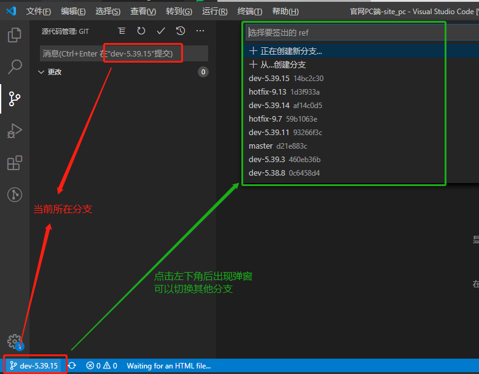

# #说明

>随着VS Code的功能和插件的不断强大和完善，它已经成为了我们日常开发中一个必不可缺的伙伴了,这篇笔记主要学习记录VS Code如何使用Git可视化管理我们的程序源代码
>
>查阅借鉴的资料:CSDN[徐余人](https://blog.csdn.net/zhaojun666)的[VScode的源代码管理简易使用](https://blog.csdn.net/zhaojun666/article/details/106163505) 博客园[allenxt](https://home.cnblogs.com/u/allenxt/)的[vs code 使用Git进行源代码管理](https://www.cnblogs.com/allenxt/p/8473686.html); 简书[broccoli_d39c](https://www.jianshu.com/u/bb8ffcaec19b)的[vscode源代码管理器（git可视化操作）](https://www.jianshu.com/p/ef0438a8b941); 腾讯云追逐时光者的[VS Code使用Git可视化管理源代码详细教程](https://cloud.tencent.com/developer/article/1793472) ; 知乎[我想飞](https://www.zhihu.com/people/xdbcb8)的[Visual Studio Code第二弹：Vscode与Git的完美结合](https://zhuanlan.zhihu.com/p/34753075);程序员宅基地的[vscode 侧边栏源代码管理不见了](https://www.cxyzjd.com/article/z591102/107707197)
>
>除此笔记外大家可以看我其他笔记 :**[全栈笔记](https://gitee.com/hongjilin/hongs-study-notes/tree/master)**、**[数据结构与算法](https://gitee.com/hongjilin/hongs-study-notes/tree/master/编程_算法及课程基础学习笔记/数据结构与算法)**、**[编程_前端开发学习笔记](https://gitee.com/hongjilin/hongs-study-notes/tree/master/编程_前端开发学习笔记)**、**[编程_后台服务端学习笔记](https://gitee.com/hongjilin/hongs-study-notes/tree/master/编程_后台服务端学习笔记)** 、**[Java](https://gitee.com/hongjilin/hongs-study-notes/tree/master/编程_后台服务端学习笔记/Java)** 、**[Nodejs](https://gitee.com/hongjilin/hongs-study-notes/tree/master/编程_后台服务端学习笔记/Nodejs)** 、**[JavaScript笔记](https://gitee.com/hongjilin/hongs-study-notes/tree/master/编程_前端开发学习笔记/HTML+CSS+JS基础笔记/JavaScript笔记)**、**[ES6及后续版本学习笔记](https://gitee.com/hongjilin/hongs-study-notes/tree/master/编程_前端开发学习笔记/ES6及后续版本学习笔记)** 、**[Vue笔记整合](https://gitee.com/hongjilin/hongs-study-notes/tree/master/编程_前端开发学习笔记/Vue笔记整合)** 、**[React笔记](https://gitee.com/hongjilin/hongs-study-notes/tree/master/编程_前端开发学习笔记/React笔记)**、**[微信小程序学习笔记](https://gitee.com/hongjilin/hongs-study-notes/tree/master/编程_前端开发学习笔记/微信小程序学习笔记)**、**[Chrome开发使用及学习笔记](https://gitee.com/hongjilin/hongs-study-notes/tree/master/编程_前端开发学习笔记/Chrome开发使用及学习笔记)** 以及许多其他笔记就不一一例举了

# 一、CLI 与 GUI

>实际上本人更喜欢于敲指令来进行git操作于提交,但是为何到最后还需要学GUI呢?下面举例以下CLI与GUI特点以及优劣

## Ⅰ - GUI

> 如果是想使用 VSCode的GUI推荐下载插件 **Git History** 

### 1、GUI是什么?

>Gui基于命令行开发，界内有不同的软件: Tortoist、gitg、SourceTree、Github Desktop等，用的比较多的貌似是sourceTree。
>
>* GUI其实就是帮你将命令行集成,比如你点击一个按钮,实际上是帮你执行了几句命令行
>* Gui对于**观察分支合并情况**会变得非常直观，这些图形界面都会把diff通过颜色标出来。
>* 但是这种多样性本身存在问题，它们都不能达到“在任何场景下方便操作”的程度。
>* 但不论是哪个客户端，想执行一些稍微高级点的操作都要点开层层菜单才能找到相应的按钮，更不用说这些客户端视图布局不一致，你根本不知道功能藏在哪。

### 2、优点

>在分支错综复杂的情况,就比如出现冲突，gui用来解决冲突、观察分支和分支合并关系是十分直观的
>
>1. 下面就是使用git的cli命令查看的,这样是不是看的很头疼,一点儿也不直观,在我初工作时真的看不懂这个界面
>
>   - ```sh
>     git log --graph --decorate --oneline --simplify-by-decoration --all
>     ```
>
>   -  
>
>2.  而这是使用GUI的效果,区别很明显不是吗?而且也能更直观地看到自己需要的信息
>
>   

### 3、 缺点

>并不是说GUI就很好,只能说在我们做某些工作的时候如虎添翼,是特殊情况的有力道具,但不一定是通用的
>
>* 一些简单的命令操作 **不够简洁**，有的命令菜单隐藏的很深，找找找找不一定能找得到，往往是降低程序员效率的一个点
>*  很多GUI的按钮文案是英文翻译过来的，例如rebase翻译中文是变基
>*  **gui无法操作自动化脚本**，比如一次 release中 ，我们可以要涉及到 build, test, bump , git add git commit, git tag, git push , npm publish. 等等独立命令的有序组合。

## Ⅱ - CLI

>git起源于命令行，命令行赋予了太多有用的功能，对于复杂的操作还是得需要命令行来完成。代码提交、合并、rebase等操作还是非常快的,本人也是更习惯于使用 **CLI** 
>
>* CLI 顾名思义就是命令行的意思

## Ⅲ - 取舍

>对于 **GUI** 和 **CLI **的取舍问题其实并不是非黑即白的,主要看个人看法与习惯
>
>* 有人更倾向于使用CLI操作(比如本人):但是在查看分支、合并等相关信息的场景上,我仍是会专门学习并使用GUI来操作
>* 有人觉得开发中大多都是简单的重复操作(如 pull push)等,那么直接用GUI进行日常大部分命令键入是没问题的
>* 大家在漫长的 '搬砖' 生涯中,就会慢慢形成一套自己的工具使用情况,所以可以借鉴,但不比要我给定确切的答案
>
>但 **CLI** 还是必学的:
>
>* 工具只是辅助的一种,了解相关的git机制,才能更好地协助你学习开发
>* 举个栗子:当你想做一个前端页面,JS可以稍微掌握(甚至不用会DOM操作),只要会一些基础语法就可以学习使用VUE框架,开发出一般的网站了,但是我们也知道,当遇到一些复杂、特殊问题时,靠的还是我们的JS基础解决.
>
>想看GIT基础的同学可以看这里 :  **[Git学习笔记](https://gitee.com/hongjilin/hongs-study-notes/tree/master/编程_前端开发学习笔记/Git学习笔记)** 

# 二、环境准备

> 此笔记基于 **我们已经掌握了以下两个工具的基本使用** 的基础上进行梳理记录的,如果对于这两个部分不熟悉的建议可以去学习或者看下本人梳理的笔记

## Ⅰ- VSCode下载以及基本使用学习

>本人梳理的VSCode使用学习笔记 : **[点我传送](https://gitee.com/hongjilin/hongs-study-notes/tree/master/编程_前端开发学习笔记/A_前端工具使用笔记/VSCode笔记)** 

## Ⅱ - Git 环境安装以及基本使用学习

> 本人梳理的关于Git学习笔记 :  **[Git学习笔记](https://gitee.com/hongjilin/hongs-study-notes/tree/master/编程_前端开发学习笔记/Git学习笔记)** 
>
> 建议还是先学好基础指令再学GUI可视化管理工具,本人还是更喜欢敲命令.
> 但学GUI主要还是查看修改、冲突时更明了

## Ⅲ - 为什么要用VSCode进行源代码管理

> 还能为啥,用习惯了呗.就跟你玩游戏能用微信或者QQ登录的你会专门去注册其他的平台账号来登录吗?

## Ⅳ- 推荐的插件

> 使用VSCode进行Git操作建议安装如下插件,帮你们少走弯路,下面给出的截图示例都会基于我们安装了下面插件的基础上说

### 1、GitLens 

>我强烈建议你安装插件`GitLens`, 它是 VS Code 中我最推荐的一个插件, 简直是 Git 神器, 码农必备。
>
>GitLens 在 Git 管理上有很多强大的功能, 比如：
>
>- 将光标放置在代码的当前行, `可以看到这行代码的提交者是谁`, 以及提交时间。这一点, 是 GitLens 最便捷的功能。
>- 查看某个 commit 的代码改动记录
>- 查看不同的分支
>- 可以将两个 commit 进行代码对比
>- 甚至可以将两个 branch 分支进行整体的代码对比。这一点, 简直是 GitLens 最强大的功能。当我们在不同分支 review 代码的时候, 就可以用到这一招。

### 2、Chinese (Simplified) Language Pack for Visual Studio Code

> 中文包, 让软件显示为简体中文语言, 没啥好说的吧
>
> 当初在学校时傻傻的觉得直接用英文用习惯了就行了,不然以后工作了别人没用中文包怎么给人调试?事实证明,出来都用的中文包,你的英文编辑器别人给你调试时反而不习惯:dog:

### 3、Git History 

> 有些同学习惯使用编辑器中的 Git 管理工具, 而不太喜欢要打开另外一个 Git UI 工具的同学, 这一款插件满足你查询所有 Git 记录的需求。

### 4、Git Graph

>同 3 是另一款GUI插件

# 三、操作入口

>入口有两个,分别是:
>
>1. VSCode左侧类似弹弓的图标是它的 “**源代码管理器**”
>2. 使用ctrl+shift+P并输入git进行git操作。
>
> 

# 四、进行Git操作

## Ⅰ - 查看、切换分支

>VSCode中操作:
>
> 
>
>Git命令行操作 :  **[Git学习笔记的分支部分知识点笔记](https://gitee.com/hongjilin/hongs-study-notes/tree/master/编程_前端开发学习笔记/Git学习笔记#六分支)** 

## Ⅱ - 克隆仓库

>1. VSCode打开一个空的文件夹,点击 **左侧弹簧 --> 克隆储存库**
>
>   >  
>
>2. 直接**Shit+Ctrl+P**,命令行搜索**克隆**即可
>
>   >  
>
>然后输入要克隆的仓库地址,之后操作就与命令行无异,不懂得可以看本人git笔记 :  **[Git学习笔记的克隆操作部分](https://gitee.com/hongjilin/hongs-study-notes/tree/master/编程_前端开发学习笔记/Git学习笔记#1将本地已有的一个项目上传到新建的git仓库的方法)** 

## Ⅲ - 查看分支之间的差异

>1. 首先你要安装 **GitLens ** 插件
>2. 安装后左侧出现分支图标,点击进入就能查看
>
> 
