# #说明

> 原本我用的是 WebStrom(写前端代码时) , 但作为前端转投 VSCode 是再正常不过了, 即使当初 WebStrom 用的再久在接触 VSCode 后也不得不说一句真香, 而当初我进入编程, 只能靠自己摸索以及百度上零零散散地拼凑, 回想起来真是非常吃力, 所以此处我将梳理整合网上资料再结合自己理解形成笔记, 分享给大家, 也希望大家能少走弯路
>
> 俗话说, `工欲善其事, 必先利其器`, 当你刚入门编程时第一件要做的就是去了解并学习编辑器的使用
>
> 查阅借鉴的资料: 知乎的 [King的VSCode新手入门教程](https://zhuanlan.zhihu.com/p/73577624)  、[韩骏的如何学习 Visual Studio Code？](https://zhuanlan.zhihu.com/p/162544477)、[千古壹号的第一次使用VS Code时你应该知道的一切配置](https://zhuanlan.zhihu.com/p/62913725);CSDN的 [猫科龙的「VS Code」Visual Studio Code 菜鸟教程：从入门到精通](https://blog.csdn.net/maokelong95/article/details/88805589);极客教程的 [VSCode 是什么](https://geek-docs.com/vscode/vscode-tutorials/what-is-vscode.html) ;思否的 [hyangteng的宇宙最强vscode教程（基础篇）](https://segmentfault.com/a/1190000017949680); [思考问题的熊的VScode入门学习路径](https://kaopubear.top/blog/2019-09-11-howtolearnvscode/); 简书的 [破晓霜林的VsCode使用教程](https://www.jianshu.com/p/11554732b323); [VSCode 插件大全｜ VSCode 高级玩家之第二篇](https://juejin.im/post/5ea40c6751882573b219777d); [VSCode 前端必备插件, 有可能你装了却不知道如何使用？](https://juejin.im/post/5db66672f265da4d0e009aad) ;[如何让 VS Code 更好用 10 倍？这里有一份 VS Code 新手指南](https://zhuanlan.zhihu.com/p/99462672); [使用 VSCode 的一些技巧](https://mp.weixin.qq.com/s?src=11&timestamp=1591581536&ver=2387&signature=i4xLZlLe1Gkl7OiBIhPO*VSeNB5lzFgTY-dgNW9E9ZbtIAv4bnJ1RdAAZdhvDw*cg-DmMcUa-V8NSUdV-tthmXZCq3ht4edCweq6v0QxKjnh8IuAxyyh5qymdRui*8iE&new=1);[能让你开发效率翻倍的 VSCode 插件配置（上）](https://juejin.im/post/5a08d1d6f265da430f31950e);还有一部分因为VSCode在很早之前就已在使用, 当时有做部分笔记但是未注明其中引用出处(小部分), 现在也无法查找, 但本人笔记主要还是为了方便大家学习, 所以仍会把当初笔记并入, 发现出处的小伙伴可以私聊我
>
> 除此笔记外大家可以看我其他笔记 :**[全栈笔记](https://gitee.com/hongjilin/hongs-study-notes/tree/master)**、**[数据结构与算法](https://gitee.com/hongjilin/hongs-study-notes/tree/master/编程_算法及课程基础学习笔记/数据结构与算法)**、**[编程_前端开发学习笔记](https://gitee.com/hongjilin/hongs-study-notes/tree/master/编程_前端开发学习笔记)**、**[编程_后台服务端学习笔记](https://gitee.com/hongjilin/hongs-study-notes/tree/master/编程_后台服务端学习笔记)** 、**[Java](https://gitee.com/hongjilin/hongs-study-notes/tree/master/编程_后台服务端学习笔记/Java)** 、**[Nodejs](https://gitee.com/hongjilin/hongs-study-notes/tree/master/编程_后台服务端学习笔记/Nodejs)** 、**[JavaScript笔记](https://gitee.com/hongjilin/hongs-study-notes/tree/master/编程_前端开发学习笔记/HTML+CSS+JS基础笔记/JavaScript笔记)**、**[编程工具使用笔记](https://gitee.com/hongjilin/hongs-study-notes/tree/master/编程_前端开发学习笔记/A_前端工具使用笔记)** 、**[ES6及后续版本学习笔记](https://gitee.com/hongjilin/hongs-study-notes/tree/master/编程_前端开发学习笔记/ES6及后续版本学习笔记)** 、**[Vue笔记整合](https://gitee.com/hongjilin/hongs-study-notes/tree/master/编程_前端开发学习笔记/Vue笔记整合)** 、**[React笔记](https://gitee.com/hongjilin/hongs-study-notes/tree/master/编程_前端开发学习笔记/React笔记)**、**[微信小程序学习笔记](https://gitee.com/hongjilin/hongs-study-notes/tree/master/编程_前端开发学习笔记/微信小程序学习笔记)**、**[Chrome开发使用及学习笔记](https://gitee.com/hongjilin/hongs-study-notes/tree/master/编程_前端开发学习笔记/Chrome开发使用及学习笔记)** 以及许多其他笔记就不一一例举了

# #目录

>[TOC]

# 绪论

>有一点你可能会感到惊讶：VS Code 这款软件本身, 是用 JavaScript 语言编写的（具体请自行查阅基于 JS 的 PC 客户端开发框架 `Electron`）。Jeff Atwood ( Stack Overflow 网站的联合创始人 ) 在 2007 年提出了著名的 Atwood 定律：
>
>> **任何能够用 JavaScript 实现的应用系统, 最终都必将用 JavaScript 实现**。
>
>引用网上看到的一段话: "** `前端目前是处在春秋战国时代, 各路英雄豪杰成为后浪, 各种框架工具层出不穷, VS Code 软件无疑是大前端时代最骄傲的工具` **"
>
>- 如果你是做前端开发（JavaScript 编程语言为主）, 则完全可以将 VS Code 作为「**主力开发工具**」。这款软件是为前端同学量身定制的。
>
>- 如果你是做其他语言方向的开发, 并且不需要太复杂的集成开发环境, 那么, 你可以把 VS Code 作为「**代码编辑器**」来使用, 纵享丝滑。
>
>- 甚至是一些写文档、写作的同学, 也经常把 VS Code 作为 markdown **写作工具**, 毫无违和感。
>
>- 退而求其次, 即便你不属于以上任何范畴, 你还可以把 VS Code 当作最简单的**文本编辑器**来使用, 完胜 Windows 系统自带的记事本。

# 一、VSCode的基础使用学习

## Ⅰ- VSCode的介绍

>VS Code 的全称是 Visual Studio Code, 是一款开源的、免费的、跨平台的、高性能的、轻量级的代码编辑器。它在性能、语言支持、开源社区方面, 都做得很不错。
>
>官方帮助文档: https://code.visualstudio.com/docs/

### 1、 IDE与编辑器的区别

>IDE 和编辑器是有区别的：
>
>- **IDE**（Integrated Development Environment, 集成开发环境）：对代码有较好的智能提示和相互跳转, 同时侧重于工程项目, 对项目的开发、调试工作有较好的图像化界面的支持, 简单来说, IDE中除了编辑器, 还把你可能用到的大多数东西都塞进去了, 因此比较笨重。比如 Eclipse、`WebStrom` 的定位就是 IDE。
>
>- **编辑器**：要相对轻量许多, 侧重于文本的编辑。比如 Sublime Text 的定位就是编辑器。再比如 Windows 系统自带的「记事本」就是最简单的编辑器。
>
>需要注意的是, VS Code 的定位是**编辑器**, 而非 IDE , 但 VS Code 又比一般的编辑器的功能要丰富许多。可以这样理解：VS Code 的体量是介于编辑器和 IDE 之间。

### 2、VS Code 的特点

>- VS Code 的使命, 是让开发者在编辑器里拥有 IDE 那样的开发体验, 比如代码的智能提示、语法检查、图形化的调试工具、插件扩展、版本管理等。
>
>- 跨平台支持 MacOS、Windows 和 Linux 等多个平台。
>
>- VS Code 的源代码以 MIT 协议开源。
>
>- 支持第三方插件, 功能强大, 生态系统完善。VSCode相较于WebStrom更轻就是因为它自带的东西少, 而我们有时候需要用到其没有自带的东西就可以用第三方插件进行下载补充
>
>- VS Code 自带了 JavaScript、TypeScript 和 Node.js 的支持。也就是说, 你在书写 JS 和 TS 时, 是自带智能提示的。当然, 其他的语言, 你可以安装相应的**扩展包**插件, 也会有智能提示。

### 3、前端利器之争： VS Code 与 WebStorm

#### a) 哪个编辑器/IDE 好用？

>前端小白最喜欢问的一个问题是：哪个编辑器/IDE 好用？是 VS Code 还是 WebStorm(WebStorm 其实是 IntelliJ IDEA 的定制版)?
>
>> 在我刚踏入前端时, 我选择了WebStrom :
>
>因为当时听老师说 WebStrom 装好了你就不用再装东西, 啥都有!!!  VsCode 比如你的HTML、CSS提示都要自己装第三方插件.当时我身为一个萌新小白那肯定是想 [ 我全都要 ], 所以选择了WebStrom, 当时写的也都是小demo, 除了初次启动速度慢其他的感觉用的很舒服
>
>> 后来出来工作, 实在坚持不住用了VSCode :
>
>并不是说 WebStrom 不适用于工作, 在开发中除了稍微笨重点其他的都是用的很顺畅的, 但是耐不住身边同事前辈都用VSCode啊!他们过来调试就各种不适, 我身为萌新不得 '迁就' 他们? 其次, 用了一段时间后, 确实发现 [ 顺畅 ] 与 [ 丝滑 ] 差距还是有的, 就像是你打游戏帧率 80 跟 120 肯定是感受的出来的(也许是我电脑卡, 就显得明显), 而且VSCode明显更酷

#### b) 对比

>- **哪个更酷**：显然 VS Code 更酷! WebStrom虽然考虑很周全什么都给你了, 但是就像是照顾小孩子一样填鸭式地给你.VSCode更像是给你更多地信任.
>
>- **内存占用情况**：根据我的观察, VS Code 是很占内存的（尤其是当你打开多个窗口的时候）, 但如果你的内存条够用, 使用起来是不会有任何卡顿的感觉的。相比之下, SwbStrom 不仅非常占内存, 而且还非常卡顿。如果你想换个既轻量级、又不占内存的编辑器, 最好还是使用「Sublime Text」编辑器。
>
>- **使用比例**：这个就不用说了吧, 我就是因为别人都使用VSCode才被同化的

#### c) 安装 

> 官网下载即可, 不赘述了

## Ⅱ - VSCode 快捷键

>VS Code 用得熟不熟, 首先就看你是否会用快捷键
>
>此处会列举部分常用快捷键, 以及本人快捷键习惯分享(仅分享, 不建议学, 每个人对于键位都有自己独特习惯)

### 1、 工作区快捷键

>| Mac 快捷键      | Win 快捷键           | 作用                                                         | 备注                                               |
>| :-------------- | :------------------- | :----------------------------------------------------------- | :------------------------------------------------- |
>| Cmd + Shift + P | Ctrl + Shift + P, F1 | 显示命令面板                                                 |                                                    |
>| Cmd + B         | Ctrl + B             | 显示/隐藏侧边栏                                              | 很实用                                             |
>| `Cmd + \`       | `Ctrl + \ `          | 创建(拆分)多个编辑器 <br />(或者可以直接在窗口中点击选中某个文件Tab, 右键(上下左右)拆分) | 注意:它与注释代码键位不一样<br />注释代码:`Ctrl+/` |
>| Cmd + 1、2      | Ctrl + 1、2          | 聚焦到第 1、第 2 个编辑器                                    | 此处主要是在拆分编辑器后切换使用                   |
>| cmd +/-         | ctrl +/-             | 将工作区放大/缩小（包括代码字体、左侧导航栏）                | 在投影仪场景经常用到                               |
>| Cmd + J         | Ctrl + J             | 显示/隐藏控制台                                              |                                                    |
>| Cmd + Shift + N | Ctrl + Shift + N     | 重新新建并打开一个软件的窗口                                 |                                                    |
>| Cmd + Shift + W | Ctrl + Shift + W     | 关闭软件的当前窗口                                           |                                                    |
>| Cmd + N         | Ctrl + N             | 新建文件                                                     |                                                    |
>| Cmd + W         | Ctrl + W             | 关闭当前文件                                                 |                                                    |

### 2、 跳转操作

>| Mac 快捷键                | Win 快捷键             | 作用                                 | 备注                               |
>| :------------------------ | :--------------------- | :----------------------------------- | :--------------------------------- |
>| Cmd + `                   | 没有                   | 在同一个软件的**多个工作区**之间切换 |                                    |
>| Cmd + Option + 左右方向键 | Ctrl + Pagedown/Pageup | 在已经打开的**多个文件**之间进行切换 | 非常实用                           |
>| Ctrl + Tab                | Ctrl + Tab             | 在已经打开的多个文件之间进行跳转     | 与上方一致<br />表现形式不一样而已 |
>| Cmd + Shift + O           | Ctrl + shift + O       | 在当前文件的各种**方法之间**进行跳转 |                                    |
>| Ctrl + G                  | Ctrl + G               | 跳转到指定行                         |                                    |
>| Cmd+Shift+\               | Ctrl+Shift+\           | 跳转到匹配的括号                     |                                    |
>| F12                       | F12                    | 跳转到变量或函数定义的快捷方法。     | 要先将光标移动到变量上             |
>| **⌥** + **F12**           | ALT + F12              | 查看定义,不是跳转,直接出现一个框查看 |                                    |

### 3、 移动光标

>| Mac 快捷键          | Win 快捷键                       | 作用                       | 备注       |
>| :------------------ | :------------------------------- | :------------------------- | :--------- |
>| 方向键              | 方向键                           | 在**单个字符**之间移动光标 | 大家都知道 |
>| option + 左右方向键 | Ctrl + 左右方向键                | 在**单词**之间移动光标     | 很常用     |
>| Cmd + 左右方向键    | Fn + 左右方向键                  | 在**整行**之间移动光标     | 很常用     |
>| Cmd + ←             | Fn(笔记本独有) + ←（或 Win + ←） | 将光标定位到当前行的最左侧 | 很常用     |
>| Cmd + →             | Fn + →（或 Win + →）             | 将光标定位到当前行的最右侧 | 很常用     |
>| Cmd + ↑             | Ctrl + Home                      | 将光标定位到文章的第一行   |            |
>| Cmd + ↓             | Ctrl + End                       | 将光标定位到文章的最后一行 |            |
>| Cmd + Shift + \     |                                  | 在**代码块**之间移动光标   |            |
>| **⌘** + **L**       | CTRL + L                         | 选中当前鼠标所在行         |            |

### 4、  编辑操作

>| Mac 快捷键             | Win 快捷键           | 作用                                               | 备注                                                         |
>| :--------------------- | :------------------- | :------------------------------------------------- | :----------------------------------------------------------- |
>| **Cmd + Enter**        | **Ctrl + Enter**     | 在当前行的下方新增一行, 然后跳至该行               | 即使`光标不在行尾`, 也能快速向下插入一行                     |
>| **Cmd+Shift+Enter**    | **Ctrl+Shift+Enter** | 在当前行的上方新增一行, 然后跳至该行               | 即使`光标不在行尾`, 也能快速向上插入一行                     |
>| **Option + ↑**         | **Alt + ↑**          | 将代码向上移动                                     | 很常用                                                       |
>| **Option + ↓**         | **Alt + ↓**          | 将代码向下移动                                     | 很常用                                                       |
>|                        | **Ctrl+Shift+↑/↓**   | 选中多行代码                                       |                                                              |
>| Option + Shift + ↑     | Alt + Shift + ↑      | 将代码向上复制                                     |                                                              |
>| **Option + Shift + ↓** | **Alt + Shift + ↓**  | 将代码向下复制                                     | 写重复代码的利器                                             |
>| **F2**                 | **F2**               | 选中变量名后按F2<br />代码中所有变量名都会发生改变 | 重构代码必不可少的快捷方式<br />但是要注意,此操作可能会改到同名变量 |
>
>

### 5、 多光标编辑

>### 
>
>| Mac 快捷键                | Win 快捷键                 | 作用                                 | 备注                                         |
>| ------------------------- | -------------------------- | ------------------------------------ | -------------------------------------------- |
>| Cmd + Option + 上下键     | **Ctrl + Alt + 上下键**    | 在连续的多列上, 同时出现光标         | 本人改键为`Ctrl+↓`, <br />随后可随意上下选中 |
>| Option + 鼠标点击任意位置 | **Alt + 鼠标点击任意位置** | 在任意位置, 同时出现光标             |                                              |
>| Option + Shift + 鼠标拖动 | Alt + Shift + 鼠标拖动     | 在选中区域的每一行末尾, 出现光标     |                                              |
>| Cmd + Shift + L           | Ctrl + Shift + L           | 在选中文本的所有相同内容处, 出现光标 |                                              |
>| **⇧** +  **⌥** + **I**    | Ctrl + Shift + I           | 在所选的每一行的末尾插入光标         |                                              |
>
>其他的多光标编辑操作：（很重要）
>
>- 选中某个文本, 然后反复按住快捷键「 **Cmd + D** 」键（windows 用户是按住「**Ctrl + D**」键）,  即可将全文中相同的词逐一加入选择。
>
>- 选中一堆文本后, 按住「**Option + Shift + i**」键（windows 用户是按住「**Alt + Shift + I**」键）, 既可在**每一行的末尾**都创建一个光标。

### 6、 删除操作

>| Mac 快捷键         | Win 快捷键       | 作用                   | 备注                                       |
>| :----------------- | :--------------- | :--------------------- | :----------------------------------------- |
>| Cmd + shift + K    | Ctrl + Shift + K | 删除整行               | 「Ctrl + X」的作用是剪切, 但也可以删除整行 |
>| option + Backspace | Ctrl + Backspace | 删除光标之前的一个单词 | 英文有效, 很常用                           |
>| option + delete    | Ctrl + delete    | 删除光标之后的一个单词 |                                            |
>| Cmd + Backspace    |                  | 删除光标之前的整行内容 | 很常用                                     |
>| Cmd + delete       |                  | 删除光标之后的整行内容 |                                            |
>
>ps：上面所讲到的移动光标、编辑操作、删除操作的快捷键, 在其他编辑器里, 大部分都适用。

### 7、  编程语言相关

>| Mac 快捷键         | Win 快捷键      | 作用                         | 备注                            |
>| :----------------- | :-------------- | :--------------------------- | :------------------------------ |
>| `Cmd + /`          | `Ctrl + /`      | 添加单行注释                 | `很常用`                        |
>| Option + Shift + F | Alt + shift + F | 代码格式化                   | 很常用                          |
>| F2                 | F2              | 以重构的方式进行**重命名**   | 将文件中所有此变量更名          |
>| Ctrl + J           |                 | 将多行代码合并为一行         | Win 用户可在命令面板搜索”合并行 |
>| Cmd + U            | Ctrl + U        | 将光标的移动回退到上一个位置 | 撤销光标的移动和选择            |

### 8、  搜索相关

>| Mac 快捷键              | Win 快捷键          | 作用                                         | 备注                                                         |
>| :---------------------- | :------------------ | :------------------------------------------- | :----------------------------------------------------------- |
>| **Cmd + Shift + F**     | **Ctrl + Shift +F** | 全局搜索代码 (也可以直接左侧菜单栏呼出)      | 很常用                                                       |
>| Cmd + P                 | Ctrl + P            | 在当前的项目工程里, **全局**搜索文件名       |                                                              |
>| Cmd + F                 | Ctrl + F            | 在当前文件中搜索代码, 光标在搜索框里         |                                                              |
>| Cmd + G                 | F3                  | 在当前文件中搜索代码, `光标仍停留在编辑器里` | 与`Ctrl+F`就光标位置不同                                     |
>| **⇧** + **⌘**  +  **L** | CTRL + SHIFT + L    | 选中所有找到的匹配项,可以进行批量修改        |                                                              |
>| **⌘** + **F2**          | CTRL + F2           | 选中所有匹配项                               | 有了它，甚至不必选择任何东西，<br />只需要将光标放在要选择所有出现的单词上,跟上面一致,可以批量操作 |
>
>

### 9、  自定义快捷键

>三种方式呼出快捷方式修改, 点击后就能查看并修改所有快捷键了
>
>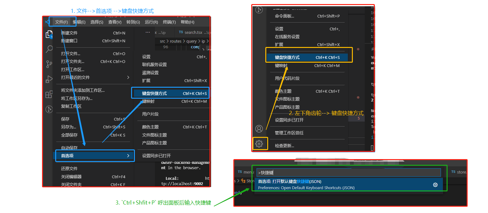 
>
>>快捷键速查表[官方]：<https://code.visualstudio.com/shortcuts/keyboard-shortcuts-windows.pdf>

### 10、组合快捷键

>这种快捷键方式想必大家基本都不知道吧,就是连续按两个快捷键出现的
>
>| Mac 快捷键                    | Win 快捷键                                  | 作用                       | 备注                                                         |
>| :---------------------------- | :------------------------------------------ | :------------------------- | :----------------------------------------------------------- |
>| **⌘** +  **K**  **⌘** + **X** | 先按**CTRL + K** 随后紧接着按 **CTRL +  X** | 裁剪尾随空格               | 即剪除本行代码后面所有空格                                   |
>| **⌘** +  **K**  **R**         | 先按 **CTRL  +  K** 随后紧接着按 **R**      | 在资源管理器中显示活动文件 | 弹出Vscode视图显示文件<br />即打开当前文件目录<br />非常好用 |
>| **⌘** + **K** **V**           | 先按 **CTRL +  K** 随后紧接着按 **V**       | 打开 MarkDown 侧边预览     | 对于本人习惯用VSCode管理笔记来说是非常好用的                 |
>| **⌘** +  **K** **Z**          | 先按 **CTRL + K** 随后紧接着按 **Z**        | 切换禅模式                 | 其实就是切换为全屏且只留下活动窗口                           |
>| **⌘** + **K** **⌘** + **F**   | 先按 **CTRL + K** 随后紧接着按 **CTRL + F** | 格式化选中代码             | 只格式化一部分代码格式                                       |
>|                               |                                             |                            |                                                              |
>
>这是当你按下 **Ctrl+K** 时 **VSCode** 下方展示,没有进行计时,而是监听你按下 **Ctrl+K** 后在此按下的按键,不用按的很匆忙
>
> 


## Ⅲ -  命令面板的使用

> 用户输入 `Ctrl+Shift+P`就能呼出命令面板

### 1、设置字体大小

>当然, 你也可以在菜单栏, 选择「首选项-设置-常用设置」, 在这个设置项里修改字体大小。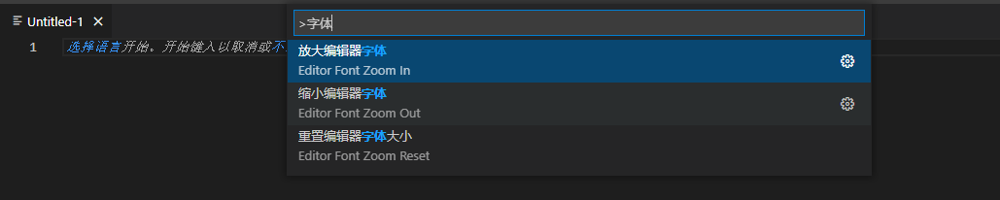 
>
>当然, 你也可以在菜单栏, 选择「首选项-设置-常用设置」, 在这个设置项里修改字体大小。

### 2、快捷键设置

>在命令面板输入“快捷键”, 就可以进入快捷键的设置, 这里在上方说过, 就不再截图示例

### 3、大小写转换

>选中文本后, 在命令面板中输入`transfrom`, 就可以修改文本的大小写了。
>
>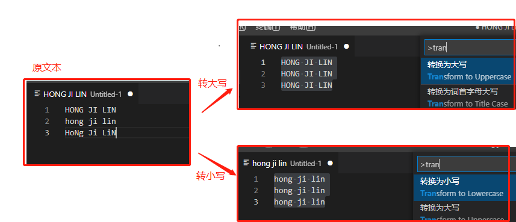 

# 二、VSCode的常见配置

## Ⅰ - VSCode设置为中文

>身为中国人为啥不直接用中文看呢? 能省力则省力
>
>我们直接安装插件`Chinese (Simplified) Language Pack for Visual Studio Code`, 并启用即可
>
>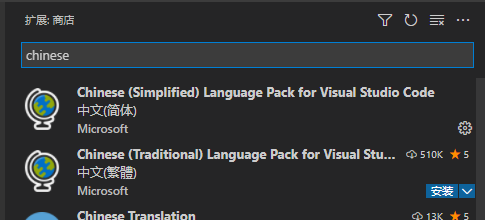 

## Ⅱ - 面包屑

>打开 VS Code 的设置项, 选择「用户设置 -> 工作台 -> 导航路径」, 勾选即可, 如下图所示：
>
>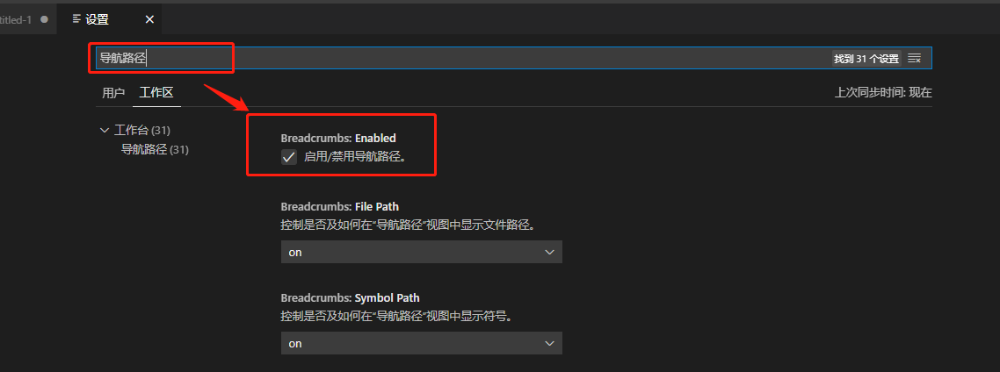
>
>设置成功后, 我们就可以查看到当前文件的「层级结构」, 成功后效果:
>
>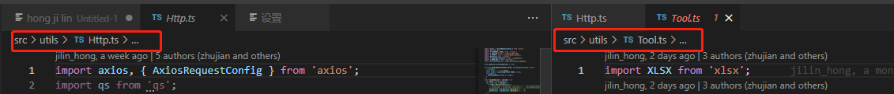 

## Ⅲ - 拆分多个编辑器窗口

>Windows 用户按住快捷键`Ctrl + \`, 或者下面方式打开, 即可同时打开多个编辑器窗口, 这个操作特别常用
>
>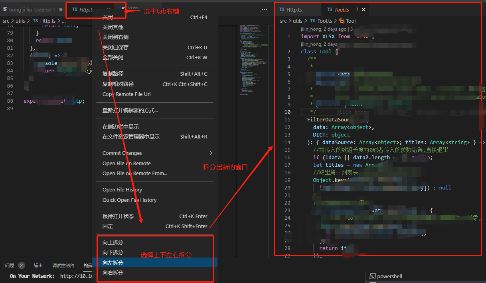
>
>按快捷键「Cmd + 1 」切换到左边的窗口, 按快捷键「Cmd + 2 」切换到右边的窗口。
>
>在代码比对、或者代码抽出封装查看父子组件逻辑等等...的应用场景下是简直是必备技能

## Ⅳ - VS Code 配置云同步

>我们可以将配置云同步, 这样的话, 当我们换个电脑时, 即可将配置一键同步到本地, 就不需要重新安装插件了, 也不需要重新配置软件。
>
>我们还可以把配置分享其他用户, 也可以把其他用户的配置给自己用 

### 1、将自己本地的配置云同步到 GitHub

>1. 安装插件 `settings-sync`。
>
>2. 安装完插件后, 在插件里使用 GitHub 账号登录。
>
>3. 登录后在 vscode 的界面中, 可以选择一个别人的 gist；也可以忽略掉, 然后创建一个属于自己的 gist。
>
>4. 使用快捷键 「Command + Shift + P」, 在弹出的命令框中输入 sync, 并选择「更新/上传配置」, 这样就可以把最新的配置上传到 GitHub。
>
>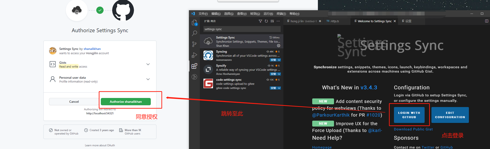
>
>命令框运行上传:
>
>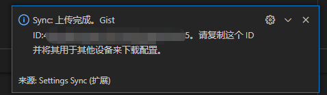 

### 2、从云端同步配置到本地

>- 当我们换另外一台电脑时, 可以先在 VS Code 中安装 `settings-sync` 插件。
>
>- 安装完插件后, 在插件里使用 GitHub 账号登录。
>
>- 登录之后, 插件的界面上, 会自动出现之前的同步记录
>- 如果你远程的配置没有成功同步到本地, 那可能是网络的问题, 此时, 可以使用快捷键 「Command + Shift + P」, 在弹出的命令框中输入 sync, 并选择「下载配置」, 多试几次

### 3、使用别人的配置

>如果我们想使用别人的配置, 首先需要对方提供给你 gist。具体步骤如下：
>
>- 安装插件 `settings-sync`。
>
>- 使用快捷键 「Command + Shift + P」, 在弹出的命令框中输入 sync, 并选择「下载配置」
>
>- 在弹出的界面中, 选择「Download Public Gist」, 然后输入别人分享给你的 gist。注意, 这一步不需要登录 GitHub 账号。
>- Gist就是上面上传配置时出现的提示:
>   

# 三、VSCode推荐插件

>每个人所接触项目、所有技术不同, 用到的插件不同, 但总有几个插件基本是必备的, 以下就给出几个插件推荐
>
>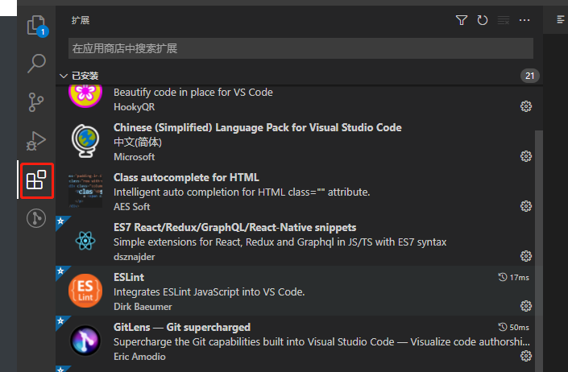 

## Ⅰ -  必备插件

> 此处给出基本上最常用也是本人最推荐的几个插件

### 1、GitLens 

>我强烈建议你安装插件`GitLens`, 它是 VS Code 中我最推荐的一个插件, 简直是 Git 神器, 码农必备。
>
>GitLens 在 Git 管理上有很多强大的功能, 比如：
>
>- 将光标放置在代码的当前行, `可以看到这行代码的提交者是谁`, 以及提交时间。这一点, 是 GitLens 最便捷的功能。
>
>- 查看某个 commit 的代码改动记录
>
>- 查看不同的分支
>
>- 可以将两个 commit 进行代码对比
>
>- 甚至可以将两个 branch 分支进行整体的代码对比。这一点, 简直是 GitLens 最强大的功能。当我们在不同分支 review 代码的时候, 就可以用到这一招。

### 2、Chinese (Simplified) Language Pack for Visual Studio Code

> 中文包, 让软件显示为简体中文语言, 没啥好说的吧
>
> 当初在学校时傻傻的觉得直接用英文用习惯了就行了,不然以后工作了别人没用中文包怎么给人调试?事实证明,出来都用的中文包,你的英文编辑器别人给你调试时反而不习惯:dog:

### 3、Live Server 

> 在本地启动一个服务器, 代码写完后可以实现「热更新」, 实时地在网页中看到运行效果。就不需要每次都得手动刷新页面了。
>
> 特别是写demo的时候很好用
>
> 使用方式：安装插件后, 开始写代码；代码写完后, 右键选择「Open with Live Server」

### 4、open in browser

> 安装`open in browser`插件后, 在 HTML 文件中「右键选择 --> Open in Default Browser」, 即可在浏览器中预览网页。
>
> 也是初学前端更容易用到的插件

### 5、Settings Sync 

>惊喜和意外永远不知道哪个先来, 可能突然之间你的电脑就不行了, 那么的VSCode如果进行了大量个性化配置, 那就简直是灾难了
>
>我们可以将配置云同步, 这样的话, 当我们换个电脑时, 即可将配置一键同步到本地, 就不需要重新安装插件了, 也不需要重新配置软件。
>
>我们还可以把配置分享其他用户, 也可以把其他用户的配置给自己用 
>
>详细步骤详见上方 :[Ⅳ - VS Code 配置云同步](#Ⅳ - VS Code 配置云同步)

### 6、javascript console utils：快速打印 log 日志

>安装这个插件后, 当我们按住快捷键「Cmd + Shift + L」后, 即可自动出现日志 `console.log()`。简直是日志党福音。
>
>当我们选中某个变量 `name`, 然后按住快捷键「Cmd + Shift + L」, 即可自动出现这个变量的日志 `console.log(name)`。
>
>其他的同类插件还有：Turbo Console Log。
>
>不过, 生产环境的代码, 还是尽量少打日志比较好, 避免出现一些异常。
>
>编程有三等境界：
>
>- 第三等境界是打日志, 这是最简单、便捷的方式, 略显低级, 一般新手或资深程序员偷懒时会用。
>- 第二等境界是断点调试, 在前端、Java、PHP、iOS 开发时非常常用, 通过断点调试可以很直观地跟踪代码执行逻辑、调用栈、变量等, 是非常实用的技巧。
>- 第一等境界是测试驱动开发, 在写代码之前先写测试。与第二等的断点调试刚好相反, 大部分人不是很习惯这种方式, 但在国外开发者或者敏捷爱好者看来, 这是最高效的开发方式, 在保证代码质量、重构等方面非常有帮助, 是现代编程开发必不可少的一部分。

### 7、Git History 

> 有些同学习惯使用编辑器中的 Git 管理工具, 而不太喜欢要打开另外一个 Git UI 工具的同学, 这一款插件满足你查询所有 Git 记录的需求。

### 8、Git Graph

>同上 是另一款GUI插件

## Ⅱ - 推荐的插件

### 1、TODO Highlight

>写代码过程中, 突然发现一个 Bug, 但是又不想停下来手中的活, 以免打断思路, 怎么办？按照代码规范, 我们一般是在代码中加个 TODO 注释。比如：（注意, 一定要写成大写`TODO`, 而不是小写的`todo`）
>
>```
>//TODO:标注此处有个BUG, 暂存
>```
>
>或者：
>
>```
>//FIXME:How are You? 
>```
>
>安装了插件 `TODO Highlight`之后, 按住「Cmd + Shift + P」打开命令面板, 输入「Todohighlist」, 选择相关的命令, 我们就可以看到一个 todoList 的清单。

### 2、Search node_modules 

> `node_modules`模块里面的文件夹和模块实在是太多了, 根本不好找。好在安装 `Search node_modules` 这个插件后, 输入快捷键「Cmd + Shift + P」, 然后输入 `node_modules`, 在弹出的选项中选择 `Search node_modules`, 即可搜索 node_modules 里的模块。

### 3、Local History(慎用)

>维护文件的本地历史记录, 可以安装。代码意外丢失时, 有时可以救命。
>但是有弊端,他会在你的项目下面生成一个 [ .history ] 文件,当你进行项目提交时,如果没有配置好,这些也会提交上去,造成不必要的提交,可能你就修改一个文件,但是生成了几百个记录文件,别问我是怎么知道的😀
>
>详情可以看下方 [Ⅳ - IDEA和VS code设置默认换行符为LF](#Ⅳ - IDEA和VS code设置默认换行符为LF)部分,你就知道为何我这么说了

### 4、Image Preview 

>图片预览。鼠标移动到图片 url 上的时候, 会自动显示图片的预览和图片尺寸。

### 5、kiwi-linter  -->国际化处理

>kiwi 的 `VS Code`插件工具, 主要用于检测代码中的中文, 高亮出中文字符串, 并一键提取中文字符串到对应的语言 Key 库。
>
>同时优化开发体验, 在 `VS Code` 中提供搜索中文, `提示国际化值对应的中文功能`。
>
>

### 6、Vscode counter --> 项目代码统计

>快速统计项目中代码行数以及分类,直接拓展商店搜索安装即可

#### ① 快速统计代码行数

>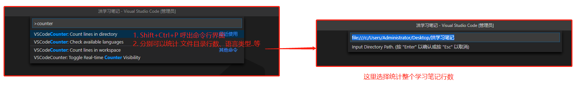

#### ② 显示结果

>这里用本笔记文件为例: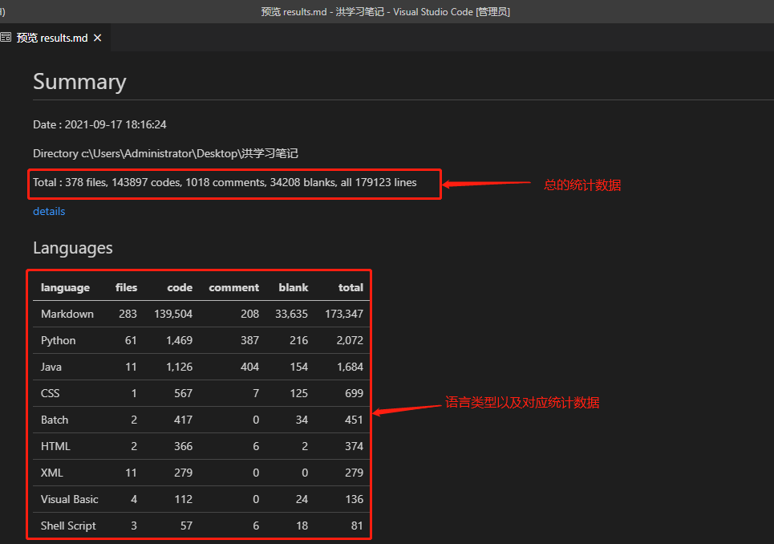 

####  ③查看详情

>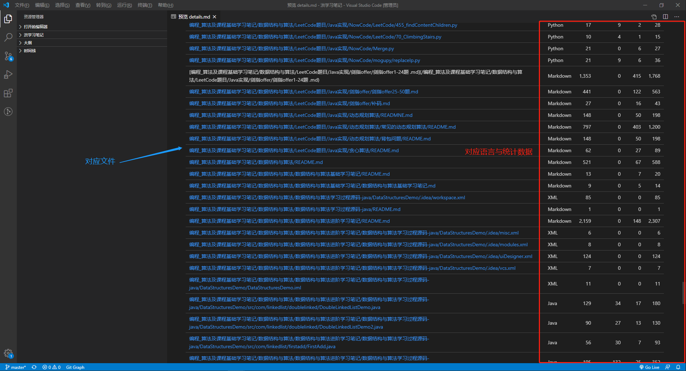 

## Ⅲ - 针对 框架 或 技术 的插件

> 此部分是针对技术或者框架出的插件

### 1、Vetur

> Vue 多功能集成插件, 包括：语法高亮, 智能提示, emmet, 错误提示, 格式化, 自动补全, debugger。VS Code 官方钦定 Vue 插件, Vue 开发者必备。

### 2、Simple React Snippets

> 与上方Vetur类似, React代码提示与补全, 只不过是React开发者用的

### 3、ES7 React/Redux/GraphQL/React-Native snippets

>React/Redux/react-router 的语法智能提示。

### 4、minapp:小程序支持

>小程序开发必备插件

### 5、JavaScript(ES6) code snippets

>ES6 语法智能提示, 支持快速输入。

### 6、Class autocomplete for HTML

> 自动重命名配对的HTML/XML标签(必备)

## Ⅳ - 个性化插件

### 1、highlight-icemode：选中相同的代码时, 让高亮显示更加明显

>VSCode 自带的高亮显示, 实在是不够显眼。用插件支持一下吧。
>
>所用了这个插件之后, VS Code 自带的高亮就可以关掉了：
>
>在用户设置里添加`"editor.selectionHighlight": false`即可。
>
>参考链接：[vscode 选中后相同内容高亮插件推荐](https://blog.csdn.net/palmer_kai/article/details/79548164)

### 2、vscode-icons

>vscode-icons 会根据文件的后缀名来显示不同的图标, 让你更直观地知道每种文件是什么类型的。

### 3、Markdown 相关插件

####  	a) Markdown  Shortcuts

>vscode`预览md`文件插件
>
>安装完毕, 重启VSCode, 然后打开.md文件。Ctrl + Shift + V, 即可预览。然后双击相应位置即可修改对应内容

#### 	b) Markdown Preview Enhanced

> 预览 Markdown 样式。

#### 	c) Markdown All in One

> 这个插件将帮助你更高效地在 Markdown 中编写文档。

### 4、Prettier 

>Prettier 是一个代码格式化工具, 只关注格式化, 但不具备校验功能。在一个多人协同开发的团队中, 统一的代码编写规范非常重要。一套规范可以让我们编写的代码达到一致的风格, 提高代码的可读性和统一性。自然维护性也会有所提高。

### 5、Beautify

>代码格式化工具。
>
>备注：相比之下, Prettier 是当前最流行的代码格式化工具, 比 Beautify 用得更多。

### 6、ESLint：代码格式校验

> ESLint, 一个让初学者或者萌新牙痒痒的东西, 包括空格缩进大小写都会进行判定
>
> 日常开发中, 可以用 Prettier 做代码格式化, 然后用 eslint 做校验。

###  7、 Courier New

>一款好看字体

### 8、indent-rainbow：突出显示代码缩进

>`indent-rainbow`插件：突出显示代码缩进。
>
>其实如果你装了`ESLint`, 就不太需要这个了, 因为缩进错误会报错:dog:
>
>效果如图: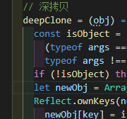 

### 9、 Code Spell Checker：单词拼写错误检查

>这个拼写检查程序的目标是帮助捕获常见的单词拼写错误, 可以检测驼峰命名。从此告别 Chinglish.

### 10、 Polacode-2020：生成代码截图

>可以把代码片段保存成美观的图片, 主题不同, 代码的配色方案也不同, 也也可以自定义设置图片的边框颜色、大小、阴影。
>
>尤其是在我们做 PPT 分享时需要用到代码片段时, 或者需要在网络上优雅地分享代码片段时, 这一招很有用。
>
>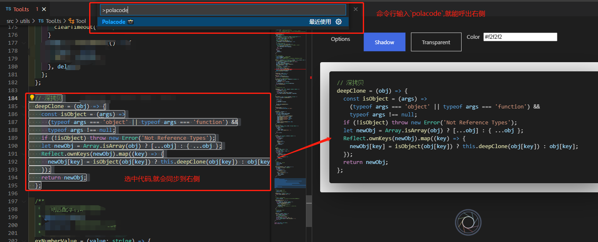 
>
>下面给出效果, 是不是比截图更优雅美观点(样式边框是可选能调整的)
>
>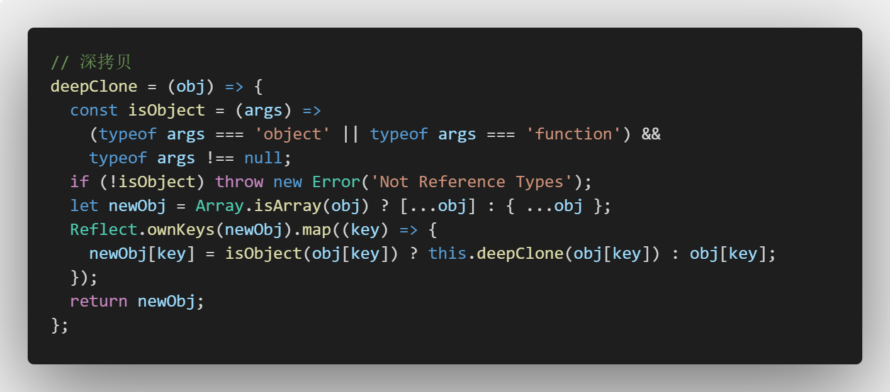

# 四、VSCode遇到问题与解决

## Ⅰ- 格式化修改缩进2(4)格无效解决

>1. 打开文件——》首选——》设置
>2. 输入搜索 tabsize  改为2
>
>③ 如果仍然没有效果 在首选项->设置=>工作区设置=>搜索(Detect Indentation)  -->将勾选去掉

## Ⅱ - vscode终端使用命令时报错：因为在此系统上禁止运行脚本。有关详细信息..

>原因：百度后得知, 无法运行脚本, 应该是不被信任。
>执行命令:
>
>```csharp
>get-ExecutionPolicy
>```
>
>结果是Restricted, 意思就是受限制的, 说明确实是因为不被信任的缘故

解决：

>执行命令:
>
>```csharp
>set-ExecutionPolicy RemoteSigned
>```
>
>结果是RemoteSigned, 意思就是远程签名, 说明已经取得信任。

## Ⅲ - 将VSCode添加至右键菜单(Windows下)

>`问题`:Windows上面安装Visual Studio Code编辑器后, 常常会因为安装的时候忘记勾选等原因, 没有将"Open with Code(右键快捷方式)"添加到鼠标右键菜单里, 使用起来多有不便, 所以需要我们手动将VSCode添加至鼠标右键菜单之中.
>
>`解决`:
>
>>1.新建reg文件.在桌面上新建一个文本文件, 然后将文件后缀改为:*.reg, 文件名任意, 例如:add_shortcut.reg.
>>
>>2.编写文本文件内容.将下面的内容Copy到刚才新建的*.reg文件中, 文本内容如下:
>>
>>3.下面代码中的地址表示VSCode在电脑上的安装路径, 如果不是默认安装的或者路径不一样, `需要改成和电脑上实际安装路径一致的`.
>>
>>4.文件编辑好了之后保存关闭.然后双击运行 add_shortcut.reg , 遇到提示点击 "确定"或"是".不出意外, 便大功告成了!
>
>```js
>Windows Registry Editor Version 5.00
>
>[HKEY_CLASSES_ROOT\*\shell\VSCode]
>@="Open with Code"
>"Icon"="C:\\Users\\Administrator\\AppData\\Local\\Programs\\Microsoft VS Code\\Code.exe"
>
>[HKEY_CLASSES_ROOT\*\shell\VSCode\command]
>@="\"C:\\Users\\Administrator\\AppData\\Local\\Programs\\Microsoft VS Code\\Code.exe\" \"%1\""
>
>Windows Registry Editor Version 5.00
>
>[HKEY_CLASSES_ROOT\Directory\shell\VSCode]
>@="Open with Code"
>"Icon"="C:\\Users\\Administrator\\AppData\\Local\\Programs\\Microsoft VS Code\\Code.exe"
>
>[HKEY_CLASSES_ROOT\Directory\shell\VSCode\command]
>@="\"C:\\Users\\Administrator\\AppData\\Local\\Programs\\Microsoft VS Code\\Code.exe\" \"%V\""
>
>Windows Registry Editor Version 5.00
>
>[HKEY_CLASSES_ROOT\Directory\Background\shell\VSCode]
>@="Open with Code"
>"Icon"="C:\\Users\\Administrator\\AppData\\Local\\Programs\\Microsoft VS Code\\Code.exe"
>
>[HKEY_CLASSES_ROOT\Directory\Background\shell\VSCode\command]
>@="\"C:\\Users\\Administrator\\AppData\\Local\\Programs\\Microsoft VS Code\\Code.exe\" \"%V\""
>```

## Ⅳ - IDEA和VS code设置默认换行符为LF

>相信用Git的人对这个问题非常了解了，如果团队没做好约定，或者新人不太会用git，用的又是windows，git又没有开启autocrlf，那么当队友修改了代码提交之后，那画面真的是不忍直视
>
>那个新人就是我,当时我新加了一个页面,满打满算五六个文件,没仔细看就推送上去了.但是我再去网站上确认时发现竟然动到了三百多个文件,当时看到我都惊了,赶紧让合作开发的小伙伴先不要提交,我自己进行了版本回滚,重新修正后再重新提交覆盖了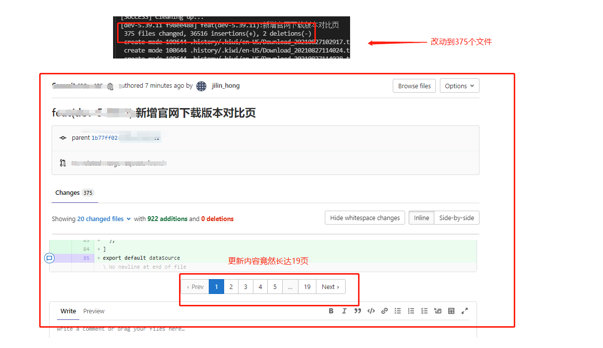
>
>当然,改动到这么多不只是这个行尾符格式问题,还有我手欠下了一个vscode插件(Local History),导致了特别多的修改,想要知道版本回滚操作的同学可以看我的Git笔记,里面有详细的记录描述 -->  **[Git学习笔记](https://gitee.com/hongjilin/hongs-study-notes/tree/master/编程_前端开发学习笔记/Git学习笔记)** 
>所以在我卸载这个插件后,继而将IDE的默认换行符设置为LF，一劳永逸；
>
>> IDEA ( WebStrom )
>
>File--》Settings--》Editor--》Code Style--》Line separator ==>设置为Unix and OS X（\n）
>
>> VSCode
>
>设置--》用户设置--》文本编辑器--》文件--》eol--》设置为\n
>
>或者直接搜索files:eol进行设置。
>
>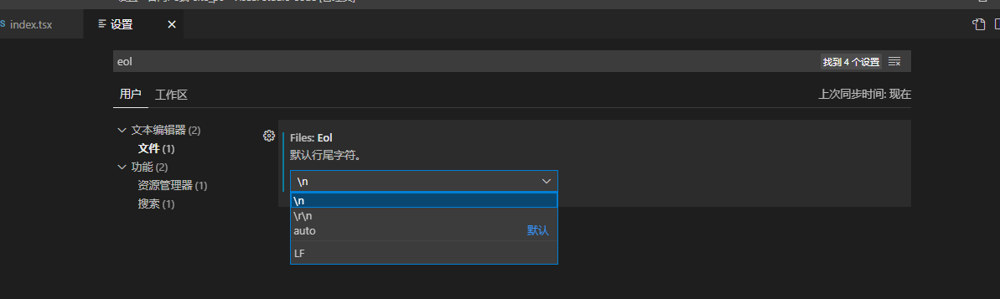 

## Ⅴ - VSCode左侧拓展活动栏内容消失怎么办

### 1、出现场景

>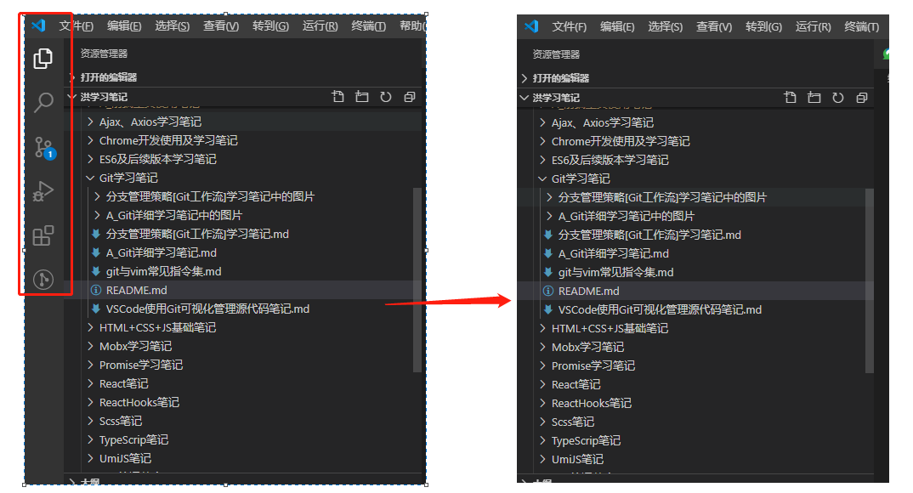 

### 2、解决方式

>勾选此项即可即可
>
>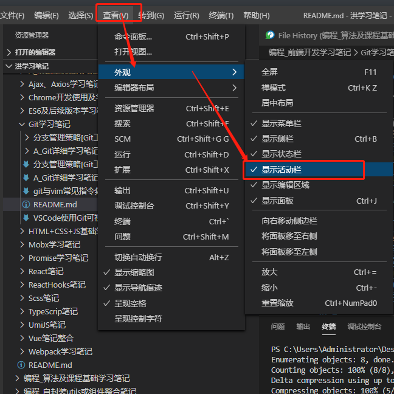 
