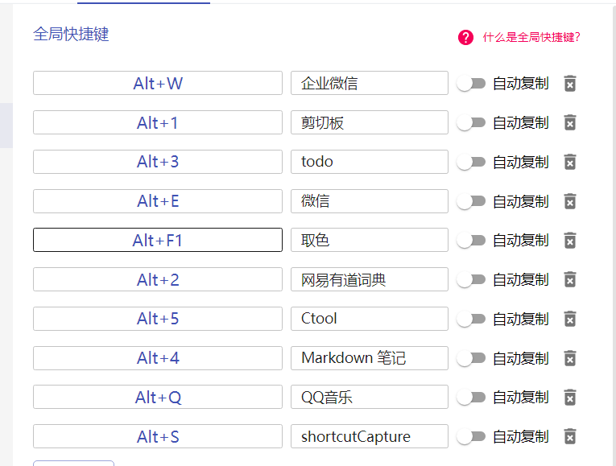

# uTools

> 官网链接:[官网链接](https://u.tools/)
>
> uTools 是一个极简、插件化、跨平台的现代桌面软件。通过自由选配丰富的插件，打造你得心应手的工具集合。
>
> 通过快捷键（默认 `alt + space` ）就可以快速呼出这个搜索框。它相当聪明，你可以往输入框内粘贴文本、图片、截图、文件、文件夹等等，能够处理此内容的插件也早已准备就绪，统一的设计风格和操作方式，助你高效的得到结果。
>
> 一旦你熟悉它后，除了能够为你节约大量时间，不中断、无干扰，让你可以更加专注地改变世界。
>
> 最简单的，uTools 可以作为一个程序快速启动器，支持英文、英文驼峰、中文拼音、拼音首字母来打开你的本地程序。除程序外， win10 和 macOS 用户还可以快速搜索并打开「控制面板」内的细项。总之，你只要还记得一个大概的名字，直接输入基本都能找到。
>
> 极力推荐,能极大地提高开发效率

## 常用插件

>这里给出本人常用的几个插件
>
>  
>
>

## 全局快捷键设置

>本人常用快捷键
>
> 