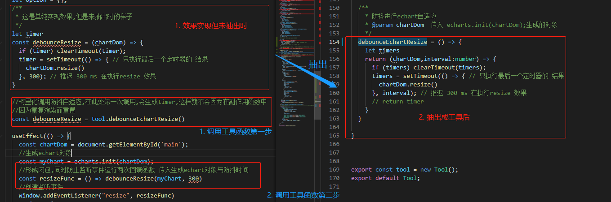
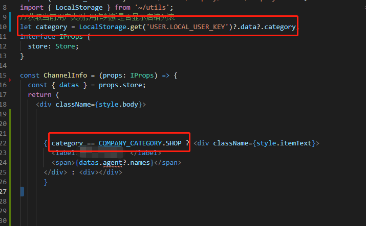
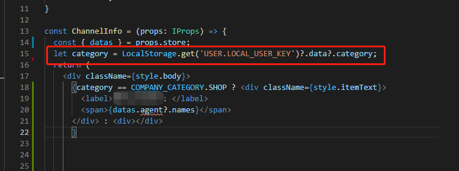
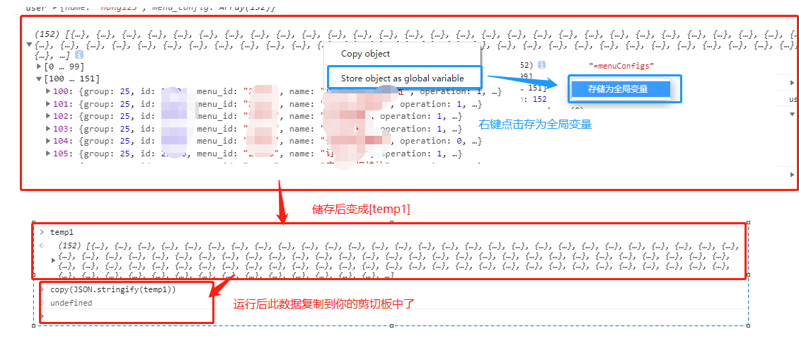
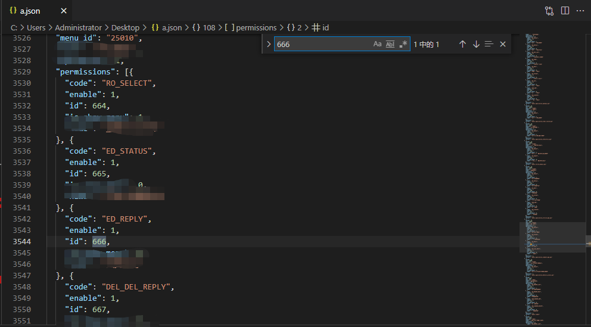

>本人笔记分享:[`全部笔记`](https://gitee.com/hongjilin/hongs-study-notes) 

# #说明

>1. 该笔记将记录本人在工作期间:看同事(公司大佬)代码过程中觉得值得学习的、被别人指出的不足需要修改的、细节部分想要mark的、我个人觉得可以分享的
>2. `此笔记自本人进入工作后开始记录,所分享点有深有浅(比如实习期间分享的肯定是新手常犯的错误)`
>3. 如果`涉及公司代码部分我会自己改写代码`,用自己的代码表达类似的意思,`不会泄露`相关代码.且本笔记主要是自己使用,分享出来也是觉得对大家有所借鉴作用
>4. 涉及到的相应知识,如有必要也会同时更新到相对应的知识点笔记中
>5. 本人[笔记地址](https://gitee.com/hongjilin/hongs-study-notes) ​

# #目录

>[TOC]

# 一、值得学习的

## Ⅰ-Scss混入

>在工作中提出的对于同事代码的优化-->使用`sass混合指令知识`,方便后期维护
>
>>
>
>本人sass相关知识点笔记分享-->**[点我传送](https://gitee.com/hongjilin/hongs-study-notes/tree/master/编程_前端开发学习笔记/Scss笔记)**


## Ⅱ-使用多个连续箭头函数

### 1、分析

>1. 该知识点在学习es6部分并没有对其直观的理解,所以在看到别人的代码中出现的时候一时间竟也没有反应过来;且该写法确实简洁了代码,所以很有必要侧重学习并记录分享下来
>
>2. 多个连续箭头函数就是 es6 的`多次柯里化`的写法,具体知识点笔记将记录于 **[ES6及后续版本学习笔记](https://gitee.com/hongjilin/hongs-study-notes/tree/master/编程_前端开发学习笔记/ES6及后续版本学习笔记)** 中 
>
>3. 大致知识解释:
>
>      1. 前`n - 1`次调用，其实是提前将参数传递进去，并没有调用最内层函数体，`最后一次调用才会调用最内层函数体`，并返回最内层函数体的返回值。
>
>      2. 理解成，柯里化后，将第一个参数变量存在函数里面了(`闭包`)，然后本来需要n个参数的函数可以变成只需要剩下的（n - 1个）参数就可以调用，类似于下面的写法
>
>    ```JS
>    let add = function(a) {
>        var param = a;
>        var innerFun = function(b) {
>            return param + b;
>        }
>        return innerFun;
>    }
>    ---------------------------------------------------------------
>    var add3 = add(3) //add3表示一个指向函数的变量 可以当成函数调用名来用
>    add3(4) === 3 + 4 //true
>    ```
>
>4. 优点:
>
>      1. 可以惰性求值
>      2. 可以提前传递部分参数
>
>5. 以下是我自己写的代码示例,在这种场景中应用十分应景:
>
>>

### 2、实践

> 1. 出现场景:当我在react的`useEffect`副作用函数中我要实现Echart折线图自适应`防抖效果`时,发现无法在其中声明timer用来实现(因为每次重新渲染都会重新声明一个`新的timer`),然后我还想将其抽出到工具库中复用
>
> 2. 分析:利用`闭包的原理`,在第一次调用时,不在`useEffect`中调用,这样就能相当于生成了一个不会被重新声明的timer,所以此后调用此函数时,其实他的timer是一直持续存在的且不会被重新定义的
>
> 3. 代码截图与注释
>
>    


------


# 二、自己犯错的

>此处记录的可能是自己知识盲区,也可能是因为粗心大意导致的问题,提醒自己不可再犯

## Ⅰ-重新渲染时需要的数据却写在开头

>1. 问题场景:
>
>     1. 本人将登录后后台返回的标识数据存进`LocalStorage`中,然后再在登录后根据此标识进行不同权限渲染.
>     2. 但本人登陆注销后回到登录页面时刷新后再登录,取到的数据却为空,导致渲染错误
>
>2. 问题分析
>
>     1. 错误代码截图
>
>   
>
>   2. 我将获取`LocalStorage`代码写在初始化渲染部分,导致我刷新后还未登录,但是`category`在加载时进行了获取,导致获取到的`category`时`undefined`,而在加载完成后我进行了登陆操作,但这时我的获取`LocalStorage.get(..)`操作并不会重新运行,导致取得的`category`一直时`undefined`,导致错误发生
>
>3. 正确代码截图
>
>   
>
>   > 将获取代码写在渲染函数中,这样每次需要时都会重新获取新的

------


# 三、注意细节的


# 四、值得分享的

## Ⅰ-`import`动态导入图片时报错

>1. 问题一:使用`import a from "@/img/"+url`时报错
>
>  解决:使用const a = require(`@/img/${文件名}${后缀名}`)
>
>2. 问题而:问题一解决后用`require后发现出现警告`
>
>  解决:拼接时将后缀名用写死的方式拼接
>
>  ```js
>  requImg = require(`@/img/${url}.png)
>  ```

## Ⅱ-控制台中的`Store as global variable`

>如果在console中打印了一堆数据，想对这堆数据做额外的操作，可以将它存储为一个全局变量。只需要右击它，并选择 “Store as global variable”(存为全局储存变量)选项。第一次使用的话，它会创建一个名为 temp1 的变量，第二次创建 temp2，第三次 ... 。通过使用这些变量来操作对应的数据，不用再担心影响到他们原来的值。
>
>更多关于`Chrome DevTools`调试工具的操作可以看本人的`Chrome开发使用及学习笔记`-->**[点我传送](https://gitee.com/hongjilin/hongs-study-notes/tree/master/编程_前端开发学习笔记/Chrome开发使用及学习笔记)** 

## Ⅲ- `copy()`方法妙用

>此方法可以配合上面`Store as global variable`使用,也可以配合代码中的`console,log()`使用
>
>- 常见场景:当你需要经常查看某特别长的数据结构时(特别是json格式的数据)
>
>- 使用技巧:将打印出来的数据存为[`全局储存变量`],然后控制台运行[`copy(JSON.stringify(复制的变量名))`]
>
>- 截图示例
>
>  
>
>- 随后新建一个json文件,复制进去格式化一下,这样数据就非常方便检索查阅了
>
>  
>
>


