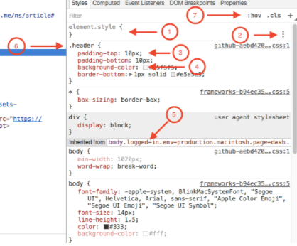
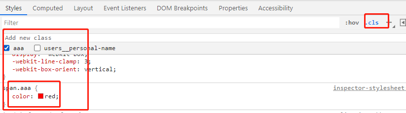
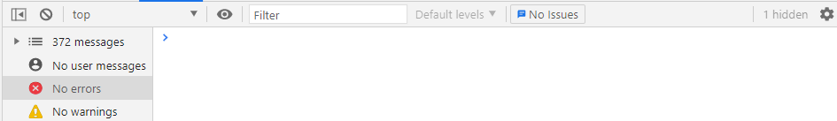
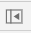
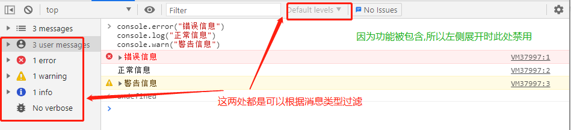
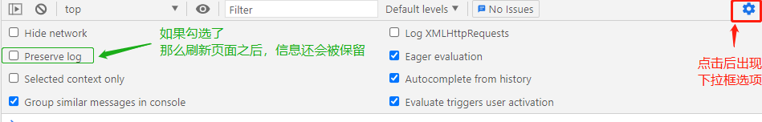
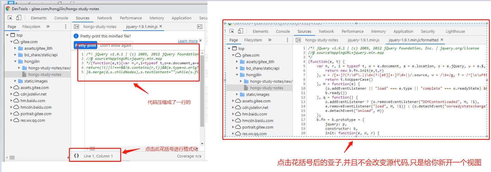
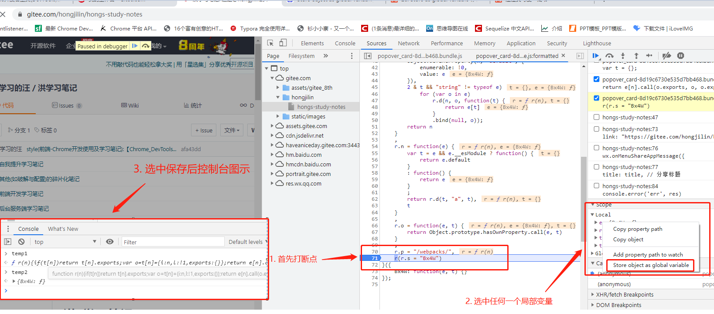
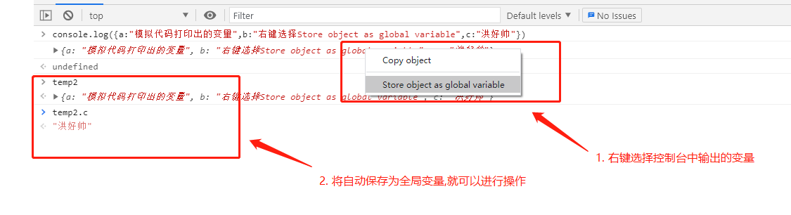
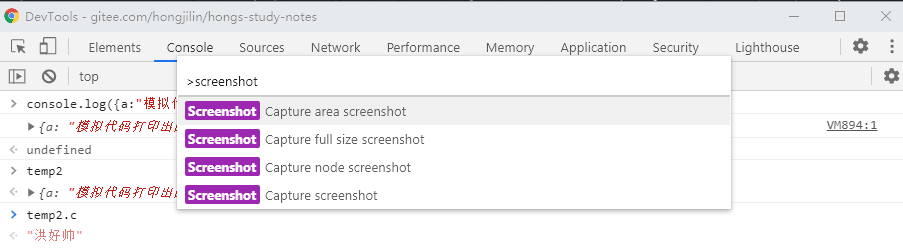

# #说明

> 作为开发人员，平时用的最多的就是[`Chrome devtools`](https://developer.chrome.com/docs/devtools)了此笔记将整理平时用的比较多的一些调试小技巧、网上或者别人教的好用的技巧
>
> 这个真的很有必要,对于此工具的使用从侧面也体现了一个前端程序员的经验(本人看到前辈流畅的使用这个工具的时候内心独白:6啊老铁,还能这样的?),对于前端来说会使用DevTools真的是一项必备技能了
>
> 此笔记将结合 [官方文档](https://developer.chrome.com/docs/devtools/javascript/)、查阅的博客如:segmentfault中`CompileYouth`、简书的`澄澄真可爱`等包括但不仅限此的博客或资料、以及自己的理解进行整理与撰写,不是文档翻译哦
>
> 测试页面截图也都直接按照本人gitee为模板
>
> 本人[全部笔记地址](https://gitee.com/hongjilin/hongs-study-notes)

# #目录

>[TOC]

# Chrome DevTools 使用详解

>Chrome DevTools（Chrome 开发者工具） 是内嵌在 Chrome 浏览器里的一组用于网页制作和调试的工具。官网还推荐一款叫做 [Chrome 金丝雀版本（Chrome Canary）](https://www.google.com/intl/en/chrome/browser/canary.html)的 Chrome 浏览器，从这里你可以获得最新版本的 DevTools。为什么 Google 称之为金丝雀呢，因为金丝雀早期在矿井中被用来预警，而该版本的 Chrome 一定程度上也能起到该作用。不用担心 Chrome Canary 会覆盖原本的 Chrome,它们是两个不同的软件

## 一、九大功能模块

>DevTools 是很多功能的集合，而在窗口顶部的工具栏是对这些功能的分组。最新的 Chrome 主要有 9 个功能组，分别对应了 9 个面板：
>
>- **Elements**：在 Elements 面板中可以通过 DOM 树的形式查看所有页面元素，同时也能对这些页面元素进行所见即所得的编辑
>- **Console**：一方面用来记录页面在执行过程中的信息（一般通过[各种 console 语句](https://github.com/CompileYouth/front-end-study/blob/master/js/console/JavaScript 中的 console.md)来实现），另一方面用来当做 shell 窗口来执行脚本以及与页面文档、DevTools等进行交互
>- **Sources**：Sources 面板主要用来调试页面中的 JavaScript
>- **Network**：在 Network 面板中可以查看通过网络来请求来的资源的详细信息以及请求这些资源的耗时
>- **Performance**：在 Performance 面板可以查看页面加载过程中的详细信息，比如在什么时间开始做什么事情，耗时多久等等。有人会问，这个跟上面的 Network 有什么区别呢，上面也能显示耗时信息。在 Performance 面板中，你不仅可以看到通过网络加载资源的信息，还能看到解析 JS、计算样式、重绘等页面加载的方方面面的信息
>- **Memory**：Memory 面板主要显示页面 JS 对象和相关联的 DOM 节点的内存分布情况
>- **Application**：记录网页加载的所有资源，包括存储信息、缓存信息以及页面用到的图片、字体、脚本、样式等信息
>- **Security**：用于检测当面页面的安全性
>- **Audits**：审计面板会对页面的加载进行分析，然后给出提高页面性能的建议，官网建议查看 [PageSpeed Insights](https://developers.google.com/speed/pagespeed/insights/) 来获得更多的页面加载建议。
>
>`ps`:有的 Chrome 上面没有 Performance 和 Memory，而是 Timeline 和 Profiles，是不是我写错了呢？不是的，而是 Chrome 到 v57 后，便将 Timeline 更名为 Performance，将 Profiles 更名为 Memory。目前来看，Google 仅仅是更名以及调整了部分功能所属的面板而已，并没有功能上的增删

### 1、Elements

>Elements 面板主要用于对页面 HTML 和 CSS 的检查以及可视化编辑。
>
>这是本人gitee的Elements面板
>
>
>
>可以看到整个面板被分成 3 个部分(`截图上看是4个,但实际上3个部分`,中右两个同是样式)，左边主体为`DOM树`,左下角为选中的元素节点,(中间为选中节点的样式,最右边也是样式(*是内置的Computed面板*)--此处也是后面点即内置面板出现内容的地方),当你界面较小时可以合并至同一处视图

#### Ⅰ- DOM树

##### 	1)  检查页面元素

>- 右击页面任意一处，选择检查 / 审查元素，查看选中页面对应的 DOM 元素
>- 点击 ，当图标显示为蓝色时，鼠标点击页面任意一处，可以查看选中页面对应的 DOM 元素
>- 鼠标悬停 DOM 树上的任意一个节点，页面会用淡蓝色的蒙板在页面上标记 DOM 节点对应的页面
>- 按键盘的向上向下键可以在展开的节点之间进行切换，向左向右键可以收缩和展开节点

##### 	2)  编辑 DOM

>你可以任意修改 DOM 树上的任意信息，比如修改节点的类型、属性，或者改变 DOM 节点的所属关系等等。不过需要注意的是，这些修改都是临时的，不会得到保存，当刷新页面时所有修改都将重置。

###### 	① ***常见的几个操作***

>- 双击元素标签，修改 DOM 节点类型，比如将 div 改成 ul
>- 双击元素属性，修改 DOM 节点属性，比如修改节点的 id
>- 选择一个 DOM 节点，按 enter 键，然后按 tab 键选择想修改的属性或标签
>- 选择一个 DOM 节点，并将其拖到目标位置，可以改变页面元素的结构
>- 选择一个 DOM 节点，按 delete 键删除
>- Ctrl + Z / Cmd + Z，撤回操作

###### 	② *选中后右键更多操作详解*

>1. 选中后右键更多操作截图:
>
>2. 更多的操作详解
>
>   - `Add Attribute`：为选中节点添加一个属性
>
>   - `Edit Attribute`：修改选中节点中选中属性
>
>   - `Edit as HTML`：将选中节点当做 HTML 进行编辑
>
>   - `Delete element`：删除节点
>
>   - `Copy→`:复制选中的节点，可以复制选中节点的选择器、XPath、元素本身、outerHTML 等，也能剪切、粘贴节点，我们一般选择复制节点的选择器
>
>   - `Hide element`：隐藏节点
>
>   - `Force state→`:4个伪类-选中则表示所选节点处于相应的状态，比如选中 `er` 则表示所选节点当前正处于鼠标悬停的状态
>
>   - `Expand all`：展开所选节点下的所有子节点
>
>   - `Collapse all`：收缩所选节点下的所有子节点，包括自己
>
>   - `Scroll into View`：如果所选的 DOM 节点对应的页面元素不在可视区域内的话，点击这个选项则会将页面滚动到可以显示对应的页面元素的位置
>
>   - `Break on`：给 DOM 节点设置断点，主要用来调试 JavaScript 代码，这段代码的作用是用来修改所加断点的 DOM 节点，这一般用在比较复杂的网页应用当中。可以给所选的 DOM 节点添加 3 种类型的断点：
>
>     - subtree modifications：所选节点的子节点被添加、删除、移动的话，则会触发
>
>     - attribute modifications：所选节点的属性被修改的话，则会触发
>
>     - node removal：所选节点被删除的话，则会触发
>
>     - 这 3 种断点可以同时作用在一个节点上。为了便于大家理解，我们举个例子:我给本人gitee页面上的节点加一个 "attribute modifications" 的断点，如下图所示：
>
>       

#### Ⅱ- elements的内置面板

> 
>
> 分别是：
>
> - Style：实时编辑与所选元素相关的样式
> - Computed：检查编辑所选元素的盒模型
> - Event Listeners：查看所选元素相关的 JS 事件监听
> - DOM Breakpoints: DOM 断点
> - Properties：所选节点对应的对象及父类们
> - Layout:本人理解主要用来看页面网格参数的,不详细赘述,感觉没啥用  --有些版本没有
> - Accessibility:你可以查看整个页面中的Accessibility Tree，该 Tree 是DOM tree 的子集，对应节点是由对屏幕阅读器（screen reader）有关和有用的展示内容。 --有些版本没有

##### 	1) Styles面板

>Styles 面板可以允许你通过各种方式来修改元素的样式，并且会想方设法使得你调试时简单方便。
>
>下方按照图中标注的序号进行描述：
>

###### 	① *element.style*：

> 代表所选元素的内联样式。比如我选择的是 Git 的 header 块，如果我直接修改其 HTML 为 `

`，那么 element.style 中就会出现 `background: red;`，相反，如果我在 element.style 块中点击任意空白处，添加 CSS 样式，那么你会在对应的元素节点上看到 style 属性，值就是你写在 element.style 内的内容

###### 	②*鼠标悬浮在*上:

> 鼠标悬浮在上会出现 (有些版本没有)，可以帮助你通过可视化界面的形式调试 text-shadow、 box-shadow、 color、 background。另外，最后一个 "+" 的符号代表可以添加新的 CSS 规则

###### 	③ *单击属性或者属性值*

> 单击属性或者属性值，进行修改，按 tab 键修改下一个属性或值，按 tab + shift 修改上一个属性或值。当值是数字类型时，按上下键可以以 1 为单位递增或递减，按 alt + 上下键以 0.1 为单位递增或递减，shift + 上下键以 10 为单位递增或递减，记不得这些快捷键就老老实实手动输入吧；点击空白处，添加新的样式

###### 	④ *取色器*

> Style 面板对 color 非常友好，点击色块可以打开取色器（color picker，取色器功能非常强大，大家自行感受），然后对颜色进行可视化编辑。同样的，shadow 属性也能如此

###### 	⑤ *继承的样式*

> 以 "Inherited from ..." 为分界，上面的样式都是作用于元素本身的，下面的都是其继承而来的，继承的对象一般不止一个，可能是父元素，父元素的父元素...

###### 	⑥ *查看该选择器影响的元素*

> 将鼠标悬停在一个选择器上时，可以看到这个选择器所影响的所有页面元素（不包括可视区域外的元素）

###### 	*⑦ 三个选项:`:hov`、`cls`、`+`*

>1. 点击"`:hov`":可以强制所选元素处于某个状态，这个也能通过右击元素，选择一个状态来实现
>
>   
>
>2. "`cls`":查看所有与当前元素直接相关的样式规则，你可以禁止/允许某个类作用于所选元素，也可以添加新的类(可以与隔壁`+`功能搭配使用)
>
>   
>
>3. "`+`":默认给选中元素新建一个样式规则类(可以与`cls`搭配),上面的`span.aaa`就是此功能创建出来的

###### 	总结

> 现在的 CSS 文件基本上都是编译后的结果，而保存的文件一般也是编译后的 CSS 文件，所以这么做的作用不大。所以我们一般将 Styles 面板当做一个所见即所得的调试工具。当然,这时我同查阅到的学习资料博主一样发出呼吁:如果有可以直接保存原始样式文件的方法,请留言谢谢:dog:

##### 	2) Computed面板

>Computed 面板显示了如下内容：
>
>- 所选元素的盒模型
>- 所选元素的 CSS 样式以及值，不仅显示最终所采用的值，也显示被覆盖了的值
>- 每个属性值所在的文件
>
>鼠标悬停在盒模型上的 margin、border、padding 以及内容区域，可以在网页中看到与之相对应的区域。你还可以双击盒模型上的数字来修改它。如果所选元素的 position 属性的值为 absolute 或者 fixed 的话，还可以在 margin 的外围设置 position。
>
>

##### 	3) Event Listeners

>查看所选元素相关的 JS 事件监听--此处直接举例
>
>1. 应用场景举例:当你想要查找某个元素绑定的点击事件,就可以通过该方法直接定位到代码中
>2. 操作:
>
>  1) 切换 “Elements" 元素面板,点击文档节点
>
>  2) 选择 “Event Listeners” 页签
>
>  3) 展开相应的事件名,如“click”
>
>  4) 对 “handler” 点击右键,选择 “Show funciton definition”
>
>  5) 点击后就会自动定位
>
>3. 示例图
>
>  

##### 	4) DOM Breakpoints

>查看、操作DOM断点
>
>当把鼠标悬停在节点标识符上时可以在网页相应区域显示对应的页面元素，勾选前面的复选框代表断点有效，不勾选代表断点虽然存在，但无法使用。
>
>
>
>

##### 	5) Properties

>这是所选 DOM 节点对应的对象以及这个对象的父类、父类的父类...的集合。
>
>

### 2、Console

>Chrome DevTools 的 Console 主要提供两类功能：
>
>- 在开发过程中记录代码诊断信息
>- 与文档和 DevTools 交互的命令行工具
>

#### Ⅰ- 打开 Console

>首先，先提一下打开 Console 的方法。第一种是之前提到过的：`Ctrl + Shift + J / Cmd + Opt + J`，打开 DevTools，并且直接定位到控制台面板。另外一种比较特殊，如果你想打开其他功能面板的同时，还想打开 Console 的话，[详见本笔记常用操作第17点](#17、打开控制台抽屉)

#### Ⅱ- Console 中的内置菜单详解

> 我们先看一下 Console 的界面，看看这个曾经很熟悉的界面是否真的熟悉
>
> 上下结构，上面是功能按钮或选项，下面是信息展示或交互的面板。先看上面，从左往右，依次是：
>
> - :显示/隐藏侧边栏的按钮，其功能是进行控制台面板的显示信息过滤。
> - :清空 Console控制台打印内容
> - :执行环境选择器,比如切换成`vue-devtools`
> - :监听变量,点击后输入某变量,就会将其置顶显示在console顶部,每次变量值改变都会同步上去
> - :过滤 Console 中的信息,可以用正则,也可以直接输入变量名
> - :也是对消息的过滤-分为**Verbose（详细）,Info（信息），Warnings（警告）,Error（错误)**四个等级类型
> - :其他的隐藏功能-如`Preserve log`刷新时保存当前console的变量等

##### 	1)	 过滤信息

>上面按钮中过滤信息的为
>
>1. 、:显示侧边栏时其右边的`Default levels`下拉菜单会被禁止使用，因为它的作用也是过滤信息并且侧边栏的过滤功能包含它
>
>   **共有四种选项，按照严重级别排序分别为：Verbose（详细）,Info（信息），Warnings（警告）,Error（错误）。**
>   **在侧边栏的信息过滤功能中，除了上述四种过滤方式外还可以根据具体的messages进行过滤**
>
>   
>
>2. :**过滤框主要能按照以下三种类型的输入进行信息过滤：**
>
>   1) URL
>
>   2) 上下文
>
>   3) 正则表达式
>
>   示例图
>
>   

##### 	2) 清空标志:清空控制台信息

>1. :清空 Console控制台打印内容
>2. 在控制台中键入clear()，然后运行
>3. Ctrl+L清空

##### 	3) top下拉标志:切换执行环境

>1. 此下拉菜单称为 Execution Context Selector,通常，您会看到此环境设置为 `top`（页面的顶部框架)。
>
>2. 其他框架和扩展程序在其自身的环境中运行。要使用这些其他环境，您需要从下拉菜单中选中它们。 例如，如果您要查看 `<iframe>` 元素的日志输出，并修改该环境中存在的某个变量，您需要从 Execution Context Selector 下拉菜单中选中该元素。
>
>3. 当您在 `top` 以外的环境中操作时，DevTools 将 Execution Context Selector 突出显示为红色，如下面的屏幕截图中所示。 这是因为开发者很少需要在 `top` 以外的任意环境中操作。 输入一个变量，期待返回一个值，只是为了查看该变量是否为 `undefined`（因为该变量是在不同环境中定义的），这会非常令人困惑
>
>4. 示例图
>
>   

##### 	4) 眼睛标志:监听变量

>:**用于创建一个Live表达式，此表达式的值可实时更新。**
>
>

##### 	5) **settings按钮具备显示信息的控制功能，其里面有八个选择项**

>内部挺多功能就稍微说常用的
>
>1. `Preserve log`:默认是不勾选的，所以当刷新页面时，Console 中的信息会被清空掉。如果勾选了的话，那么刷新页面之后，信息还会被保留。
>2. 其他的我不常用谢谢
>
>

#### Ⅲ- Console 能干什么事

##### 	1) 执行表达式

>你可以输入任何表达式，按回车执行。在输入过程中，可能会出现智能提醒，你可以按 tab 或者 → 键来完成自动补全。另外，还可以按 ↑ 和 ↓ 键来翻阅历史表达式

##### 	2) Chrome DevTools 自带了哪些有用的表达式?

>下面描述的都是 Chrome DevTools 自带的方法或者变量，需要注意一下的是，当页面暴露相同的方法或变量的话，DevTools `自带的会被覆盖`，比如 jQuery 官网下的 Console 中的 $() 就是自己的方法。

###### 	① 选择元素

>- $()：是 `document.querySelector()` 的缩写
>- $$()：是 `document.querySelectorAll()` 的缩写
>- $x()：通过 XPath 的方式查看元素，注意是 "XPath" 中的 "x"，而不是 `+-*/` 中的 `*`
>- 示例图

## 二、常用操作及快捷键

### 1、打开 Chrome DevTools

>1. 鼠标点击
>
>- 选择右上角Chome 菜单，然后选择更多工具 -> 开发者工具
>- 右键，选择检查/审查元素
>
>2. 当然，比较推荐利用快捷键来打开：
>
>- `Ctrl + Shift + I, F12 / Cmd + Opt + I`，打开 DevTools
>- `Ctrl + Shift + J / Cmd + Opt + J`，打开 DevTools，并且定位到控制台面板
>
>3. 上面两种方式不仅可以打开 DevTools，还可以关闭 DevTools。当然，还有一种方式可以打开 DevTools。
>
>- `Ctrl + Shift + C / Cmd + Opt + C`，打开 DevTools，并且开启审查元素模式（相当于点击了 DevTools 左上角的图标： )

### 2、刷新页面与强制刷新

>- `F5, Ctrl + R / Cmd + R`，刷新页面
>- `Ctrl + F5, Ctrl + Shift + R / Cmd + Shift + R`，刷新页面并忽略缓存

### 3、缩放DevTools

>- `Ctrl + '+' / Cmd + Shift + '+'`，放大 DevTools
>- `Ctrl + '-' / Cmd + Shift + '-'`，缩小 DevTools
>- `Ctrl + 0 / Cmd + 0`，DevTools 恢复大小

### 4、切换设备

>`Ctrl+Shift+M`切换设备 或者直接点击机身图标
>
>具体操作如下:
>

### 5、禁用缓存

>1. 应用场景:如有时要多次查看第一次进入该网页时加载的资源时会用到,防止有的数据走缓存导致下次刷新查看不到
>2. 操作:切换到“Network”网络面板,勾选“Disable cache”项
>
>

### 6、手动清理网站缓存

>1. 应用场景:此操作能清空Cookies、WebSQL、Service Workers、Cache Storage、IndexedDB、Local Storage、Application Cache
>
>2. 操作:
>
>   1) 按 command + shift + p （windows 按 Ctrl + shift + p），弹出命令输入框
>
>   2) 输入 “clear site data” 敲回车
>
>3. 效果图
>
>   

### 7、强制设置元素的状态

>1. 应用场景:当我要看如点击状态下的某个元素的样式,可以勾选点击状态,那么页面上该元素就会呈现此状态下的样式
>
>2. 操作:
>
>   1) 选中元素
>
>   2) 点击Style面板下的`:hov`按钮
>
>   3) 勾选要设置的状态,那么页面该元素就会呈现该选中状态下的样式
>
>

### 8、查找某元素绑定的事件

>1. 应用场景举例:当你想要查找某个元素绑定的点击事件,就可以通过该方法直接定位到代码中
>
>2. 操作:
>
>   1) 切换 “Elements" 元素面板,点击文档节点
>
>   2) 选择 “Event Listeners” 页签
>
>   3) 展开相应的事件名,如“click”
>
>   4) 对 “handler” 点击右键,选择 “Show funciton definition”
>
>   5) 点击后就会自动定位
>
>3. 示例图
>
>   

### 9、打开某个资源文件及定位源代码行数

>1. 打开某个资源文件
>
>   1) 按 command p (windows 按 Ctrl p),弹出文件搜索框,输入文件名回车即可定位
>
>   2) 效果图
>
>2. 快速定位源代码行数
>
>   1) 按 command p (windows 按 Ctrl p),弹出文件搜索框
>
>   2) 输入 :行数,如 “:480”,回车即可
>
>   3) 效果图:

### 10、格式化代码

>1. 应用场景:当你打开的源码是压缩过或者格式很乱的,影响阅读时可以使用
>2. 操作:点击已打开文件的`左下角花括号`
>3. 效果图:

### 11、查找加载图片的代码-(其他资源同理)

>1. 应用场景:当你要查找加载图片(其他资源)的代码时
>
>2. 操作
>
>   1) 切换 “`Network`” 网络面板,选中`Img`
>
>   2) 点击 “Initiator” 列下的文件名即会跳转至代码处
>
>3. 效果图

### 12、全局查询请求头和响应体

>1. 应用场景:
>
>2. 操作:
>
>   1) 切换 “Network” 页签
>
>   2) 点击左上角的“放大镜”按钮
>
>   3) 在弹出的搜索框中输入要查询的内容,敲回车键
>
>   4) 选择想要查看的请求点击,就能查阅其请求头与响应体
>
>3. 效果图
>
>   
>
>

### 13、切换网络模式及限制网速

>1. 应用场景:当你想要测试`无网络`、`快速的3G`、`卡顿的3G`、`限速的网络`环境时自己软件的表现时
>
>2. 切换网络模式操作:
>
>   1) 切换 Network 网络面板,点击 “ online ” 下拉面板,选择想要的模式
>
>   2) 效果图
>
>   
>
>3. 限制网速操作:
>
>   1) 切换 Network 网络面板 点击 “ online ” 下拉面板 选择 “ add.. ” 选项
>
>   2) 点击 “ Add custom profile… ” 按钮 依次输入“Profile Name”、“Download”、“Upload”等输入项设置网速,再点击 “Add” 按钮
>
>   3) 回到 Network 网络面板切换所新增的网络模式
>
>   4) 效果图:第一步操作同上切换网络操作
>
>   

### 14、在Console控制台查找DOM及多行输入

> 1. 在Console控制台查找DOM:
>
>    切换到Console控制台面板 输入:`document.querySelector("#id")`或`documen.querySelector("className")`敲回车键,很简单就不演示了
>
> 2. 在控制台中输入多行代码
>
>    输入时,按住Shift键敲回车即可换行

### 15、将DOM、打印结果、处理函数等存成全局变量在 console 面板使用

> 很多地方的右键上下文菜单上有这个`Store as global variable`这个选项--作用是`在 console 面板存成全局变量`,因为对象的引用类型,修改这个全局变量,`其实就是改变原对象的值`,很强大。
>
> 注:刷新后保存的变量会重置

#### Ⅰ-将DOM变成全局变量

>1. 应用场景:当你想从控制台进行对DOM节点的操作时,也可以变相等同于进行了一步`let temp2=document.querySelector("#id")`操作
>
>2. 操作:
>
>   1) devtools的Elements面板中选中要操作的DOM节点
>
>   2) 右键选择`Store object as global variable`,就会自动保存成全局变量
>
>   3) 可以如同js般对其进行操作
>
>3. 示例图:
>
>   

#### Ⅱ-打断点时候的任意一个局部变量

>1. 应用场景:当你需要保留观察或者进行操作调试过程中某个时期的变量时
>
>2. 操作:
>
>  1) 在代码中写`debugger`或者在控制台代码出打上断点,运行
>
>  2) 选中任意想要保存的局部变量,右键存储即可
>
>3. 示例图
>
>  

#### Ⅲ-消息的响应体预览界面

>1. 应用场景:通常就是保留下某些请求变量用作对比罢了,方便开发
>
>

#### Ⅳ-保存控制台输出内容

>1. 应用场景:当你不用`debugger`而只是使用`console.log`简单打印出变量时,可以将控制台打印出来的变量保存下来使用
>
>2. 操作:
>
>   1) 代码中进行打印或者控制台输入代码`console`打印出需要的变量
>
>   2) 右键选择`Store object as global variable`,就会自动保存成全局变量
>
>3. 示例图:
>
>   

### 16、截图操作

>首先你需要`F12`打开devtools,下面操作才会生效
>
>1. 按 command + shift + p （windows 按 Ctrl + shift + p），弹出命令输入框
>2. 输入：screenshot
>3. 如下图选择相应的截图方式：
>
>- Capture area screenshot：截取某个区域（需要选择某个标签）
>- Capture full size screenshot：截取整个网页
>- Capture node screenshot：截取某个标签节点
>- Capture screenshot：截取当前可视区域
>
>

### 17、打开控制台抽屉

>1. 应用场景:当你在如Network、elements界面要用要console控制台时,就如我上面的例子截图,
>2. 下面举例在`Elements`面板打开抽屉
>
>
>
>3. 更简单的:直接点击`esc`就可以在别的地方打开
>
>关掉的方法同理

