# #说明

> 作为开发人员，平时用的最多的就是[`Chrome devtools`](https://developer.chrome.com/docs/devtools)了此笔记将整理平时用的比较多的一些调试小技巧、网上或者别人教的好用的技巧
>
> 这个真的很有必要,对于此工具的使用从侧面也体现了一个前端程序员的经验(本人看到前辈流畅的使用这个工具的时候内心独白:6啊老铁,还能这样的?),对于前端来说会使用DevTools真的是一项必备技能了
>
> 由于网上该部分知识的资料十分零散,基本都是各位程序员前辈用爱发电`非常零散`地发出自己的经验使用(并且很多示例版本已经相对此时落后,特别是部分相对少用的面板基本没有资料),所以学的也是磕磕绊绊艰难的很,所以我就有意的学习并梳理出一份相对全面且利于自己后续查阅补充的笔记,下方会尽量在说明处给出学习资料出处(放进笔记具体知识点中会破坏自己笔记排版)
>
> 此笔记将结合 [官方文档](https://developer.chrome.com/docs/devtools/javascript/)、HTML中文网的[`Chrome 开发者工具中文文档`](https://www.html.cn/doc/chrome-devtools/);查阅的博客如:segmentfault中`CompileYouth`;简书的`澄澄真可爱`、[`前往悬崖下寻宝的神三算`](https://www.jianshu.com/u/defb23ef5cda)、[*`changchao`*](https://www.jianshu.com/u/870a1e4c7f0b);CSDN的[`@Demi的Chrome Devtool — Performance、Sources`](https://blog.csdn.net/qq_38128179)、[`精致灰`](https://blog.csdn.net/qq_26858401)、[`tang_yi的初识Chrome Performance`](https://blog.csdn.net/tang_yi_)、[`杭电茶娃的内存泄漏分析工具`](https://blog.csdn.net/c11073138);知乎的[`QAQ-YS`](https://www.zhihu.com/people/qaq-ys);css-tricks的[`SARAH DRASNER所写的Debugging Tips and Tricks`](https://css-tricks.com/debugging-tips-tricks/)、腾讯云中腾讯技术工程官方号的[`大型前端项目的断点调试共享化和复用化实践`](https://cloud.tencent.com/developer/article/1711214?from=article.detail.1471757)等包括但不仅限此的博客或资料、实践学习后`加以自己的理解`进行整理与撰写成自己的笔记,不是文档翻译哦
>
> 测试页面截图也都直接按照本人gitee为模板,本部分知识点实践占比很重,`所以我会画大量示例图`,可以对照操作.所以还是建议下载笔记后使用[`Typora`](https://gitee.com/hongjilin/hongs-study-notes/tree/master/%E6%9D%82%E8%AE%B0_%E5%85%B6%E4%BB%96(%E5%A6%82%E7%A0%B4%E8%A7%A3%E4%B8%8E%E9%85%8D%E7%BD%AE)%E7%9A%84%E7%A2%8E%E7%89%87%E5%8C%96%E7%AC%94%E8%AE%B0/Typora%E7%AC%94%E8%AE%B0%E8%BD%AF%E4%BB%B6%E5%88%86%E4%BA%AB),我就是按照这个软件排版写的,图片缩放什么的都设置了,从网页上看的话图片排版很乱(可能很大)且难以观阅的
>
> 除此笔记外大家可以看我其他笔记 :**[全栈笔记](https://gitee.com/hongjilin/hongs-study-notes/tree/master)**、**[编程_前端开发学习笔记](https://gitee.com/hongjilin/hongs-study-notes/tree/master/编程_前端开发学习笔记)**、**[Vue笔记整合](https://gitee.com/hongjilin/hongs-study-notes/tree/master/编程_前端开发学习笔记/Vue笔记整合)** 、**[React笔记](https://gitee.com/hongjilin/hongs-study-notes/tree/master/编程_前端开发学习笔记/React笔记)**、 **[ReactHooks笔记](https://gitee.com/hongjilin/hongs-study-notes/tree/master/编程_前端开发学习笔记/ReactHooks笔记)** 、**[微信小程序学习笔记](https://gitee.com/hongjilin/hongs-study-notes/tree/master/编程_前端开发学习笔记/微信小程序学习笔记)**、**[Chrome开发使用及学习笔记](https://gitee.com/hongjilin/hongs-study-notes/tree/master/编程_前端开发学习笔记/Chrome开发使用及学习笔记)** 以及许多其他笔记就不一一例举了https://gitee.com/hongjilin/hongs-study-notes)
>
> 说明:本人此笔记记录于2021年,用的是此时最新版本的chrome

# #传送门

>建议是都看了,整理的贼多贼累(但是应该相对很全),想偷懒的看我下面传送门  --`注意:此处传送是typora的锚点,在该软件中有效;其实也是对应笔记中四大部分`
>
>1. 只想看`九大面板详解`的点这里 -->[点我传送](#一、九大功能模块面板详解)
>2. 只想看`Chrome内存泄漏分析工具`的点这里 -->[点我传送](#二、Chrome内存泄漏分析工具)
>3. 只想看`前端调试`部分的点这里 -->[点我传送](#三、前端调试技巧)
>4. 只想看`常用操作及快捷键`的点这里-->[点我传送](#四、常用操作及快捷键)
>
>`更多笔记`-->[点我传送](https://gitee.com/hongjilin/hongs-study-notes)

# #目录

>[TOC]

# Chrome DevTools 使用详解

>Chrome DevTools（Chrome 开发者工具） 是内嵌在 Chrome 浏览器里的一组用于网页制作和调试的工具。官网还推荐一款叫做 [Chrome 金丝雀版本（Chrome Canary）](https://www.google.com/intl/en/chrome/browser/canary.html)的 Chrome 浏览器，从这里你可以获得最新版本的 DevTools。为什么 Google 称之为金丝雀呢，因为金丝雀早期在矿井中被用来预警，而该版本的 Chrome 一定程度上也能起到该作用。不用担心 Chrome Canary 会覆盖原本的 Chrome,它们是两个不同的软件

## 一、九大功能模块面板详解

>DevTools 是很多功能的集合，而在窗口顶部的工具栏是对这些功能的分组。最新的 Chrome 主要有 9 个功能组，分别对应了 9 个面板：
>
>- **Elements**：在 Elements 面板中可以通过 DOM 树的形式查看所有页面元素，同时也能对这些页面元素进行所见即所得的编辑
>- **Console**：一方面用来记录页面在执行过程中的信息（一般通过各种 console 语句来实现），另一方面用来当做 shell 窗口来执行脚本以及与页面文档、DevTools等进行交互
>- **Sources**：Sources 面板主要用来调试页面中的 JavaScript
>- **Network**：在 Network 面板中可以查看通过网络来请求来的资源的详细信息以及请求这些资源的耗时
>- **Performance**：在 Performance 面板可以查看页面加载过程中的详细信息，比如在什么时间开始做什么事情，耗时多久等等。有人会问，这个跟上面的 Network 有什么区别呢，上面也能显示耗时信息。在 Performance 面板中，你不仅可以看到通过网络加载资源的信息，还能看到解析 JS、计算样式、重绘等页面加载的方方面面的信息
>- **Memory**：Memory 面板主要显示页面 JS 对象和相关联的 DOM 节点的内存分布情况
>- **Application**：记录网页加载的所有资源，包括存储信息、缓存信息以及页面用到的图片、字体、脚本、样式等信息
>- **Security**：用于检测当面页面的安全性
>- **Lighthouse(Audits)**：审计面板会对页面的加载进行分析，然后给出提高页面性能的建议，官网建议查看 [PageSpeed Insights](https://developers.google.com/speed/pagespeed/insights/) 来获得更多的页面加载建议。
>
>`ps`:有的 Chrome 上面没有 Performance 和 Memory，而是 Timeline 和 Profiles，是不是我写错了呢？不是的，而是 Chrome 到 v57 后，便将 Timeline 更名为 Performance，将 Profiles 更名为 Memory。目前来看，Google 仅仅是更名以及调整了部分功能所属的面板而已，并没有功能上的增删

### 1、Elements 面板

>Elements 面板主要用于对页面 HTML 和 CSS 的检查以及可视化编辑。
>
>这是本人gitee的Elements面板
>
>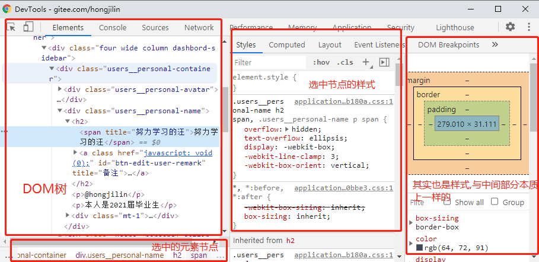
>
>可以看到整个面板被分成 3 个部分(`截图上看是4个,但实际上3个部分`,中右两个同是样式)，左边主体为`DOM树`,左下角为选中的元素节点,(中间为选中节点的样式,最右边也是样式(*是内置的Computed面板*)--此处也是后面点即内置面板出现内容的地方),当你界面较小时可以合并至同一处视图

#### Ⅰ- DOM树

##### 	1) 检查页面元素

>- 右击页面任意一处，选择检查 / 审查元素，查看选中页面对应的 DOM 元素
>- 点击 ，当图标显示为蓝色时，鼠标点击页面任意一处，可以查看选中页面对应的 DOM 元素
>- 鼠标悬停 DOM 树上的任意一个节点，页面会用淡蓝色的蒙板在页面上标记 DOM 节点对应的页面
>- 按键盘的向上向下键可以在展开的节点之间进行切换，向左向右键可以收缩和展开节点

##### 	2) 编辑 DOM

>你可以任意修改 DOM 树上的任意信息，比如修改节点的类型、属性，或者改变 DOM 节点的所属关系等等。不过需要注意的是，这些修改都是临时的，不会得到保存，当刷新页面时所有修改都将重置。

###### 	① *常见的几个操作*

>- 双击元素标签，修改 DOM 节点类型，比如将 div 改成 ul
>- 双击元素属性，修改 DOM 节点属性，比如修改节点的 id
>- 选择一个 DOM 节点，按 enter 键，然后按 tab 键选择想修改的属性或标签
>- 选择一个 DOM 节点，并将其拖到目标位置，可以改变页面元素的结构
>- 选择一个 DOM 节点，按 delete 键删除
>- Ctrl + Z / Cmd + Z，撤回操作

###### 	② *选中后右键更多操作详解*

>1. 选中后右键更多操作截图:
>     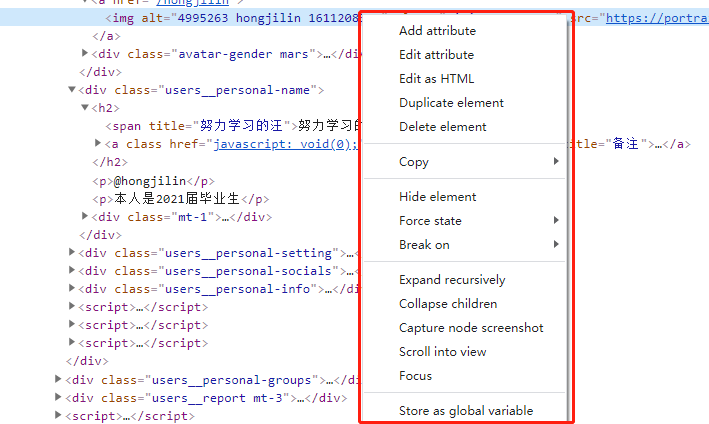 
>
>2. 更多的操作详解
>
>  - `Add Attribute`：为选中节点添加一个属性
>
>  - `Edit Attribute`：修改选中节点中选中属性
>
>  - `Edit as HTML`：将选中节点当做 HTML 进行编辑
>
>  - `Delete element`：删除节点
>
>  - `Copy→`:复制选中的节点，可以复制选中节点的选择器、XPath、元素本身、outerHTML 等，也能剪切、粘贴节点，我们一般选择复制节点的选择器
>
>  - `Hide element`：隐藏节点
>
>  - `Force state→`:4个伪类-选中则表示所选节点处于相应的状态，比如选中 `er` 则表示所选节点当前正处于鼠标悬停的状态
>
>  - `Expand all`：展开所选节点下的所有子节点
>
>  - `Collapse all`：收缩所选节点下的所有子节点，包括自己
>
>  - `Scroll into View`：如果所选的 DOM 节点对应的页面元素不在可视区域内的话，点击这个选项则会将页面滚动到可以显示对应的页面元素的位置
>
>  - `Break on`：给 DOM 节点设置断点，主要用来调试 JavaScript 代码，这段代码的作用是用来修改所加断点的 DOM 节点，这一般用在比较复杂的网页应用当中。可以给所选的 DOM 节点添加 3 种类型的断点：
>
>    - subtree modifications：所选节点的子节点被添加、删除、移动的话，则会触发
>
>    - attribute modifications：所选节点的属性被修改的话，则会触发
>
>    - node removal：所选节点被删除的话，则会触发
>
>    - 这 3 种断点可以同时作用在一个节点上。为了便于大家理解，我们举个例子:我给本人gitee页面上的节点加一个 "attribute modifications" 的断点，如下图所示：
>
>      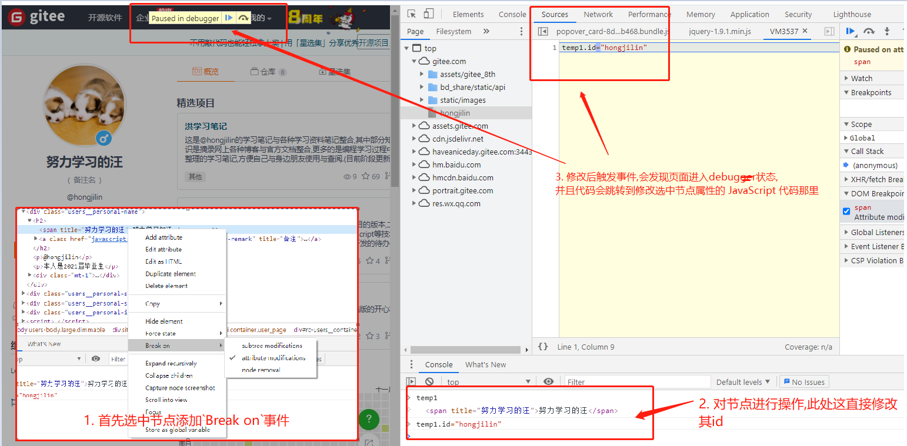

#### Ⅱ- elements的内置面板

> 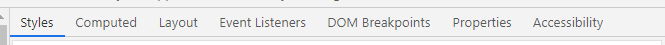
>
> 分别是：
>
> - Style：实时编辑与所选元素相关的样式
> - Computed：检查编辑所选元素的盒模型
> - Event Listeners：查看所选元素相关的 JS 事件监听
> - DOM Breakpoints: DOM 断点
> - Properties：所选节点对应的对象及父类们
> - Layout:本人理解主要用来看页面网格参数的,不详细赘述,感觉没啥用  --有些版本没有
> - Accessibility:你可以查看整个页面中的Accessibility Tree，该 Tree 是DOM tree 的子集，对应节点是由对屏幕阅读器（screen reader）有关和有用的展示内容。 --有些版本没有

##### 	1) Styles面板

>Styles 面板可以允许你通过各种方式来修改元素的样式，并且会想方设法使得你调试时简单方便。
>
>下方按照图中标注的序号进行描述：
>

###### 	① *element.style：*

> 代表所选元素的内联样式。比如我选择的是 Git 的 header 块，如果我直接修改其 HTML 为 `<div class="header" style="background: red"></div>`，那么 element.style 中就会出现 `background: red;`，相反，如果我在 element.style 块中点击任意空白处，添加 CSS 样式，那么你会在对应的元素节点上看到 style 属性，值就是你写在 element.style 内的内容

###### 	② *鼠标悬浮在*上:

> 鼠标悬浮在上会出现 (有些版本没有)，可以帮助你通过可视化界面的形式调试 text-shadow、 box-shadow、 color、 background。另外，最后一个 "+" 的符号代表可以添加新的 CSS 规则

###### 	③ *单击属性或者属性值*

> 单击属性或者属性值，进行修改，按 tab 键修改下一个属性或值，按 tab + shift 修改上一个属性或值。当值是数字类型时，按上下键可以以 1 为单位递增或递减，按 alt + 上下键以 0.1 为单位递增或递减，shift + 上下键以 10 为单位递增或递减，记不得这些快捷键就老老实实手动输入吧；点击空白处，添加新的样式

###### 	④ *取色器*

> Style 面板对 color 非常友好，点击色块可以打开取色器（color picker，取色器功能非常强大，大家自行感受），然后对颜色进行可视化编辑。同样的，shadow 属性也能如此

###### 	⑤ *继承的样式*

> 以 "Inherited from ..." 为分界，上面的样式都是作用于元素本身的，下面的都是其继承而来的，继承的对象一般不止一个，可能是父元素，父元素的父元素...

###### 	⑥ *查看该选择器影响的元素*

> 将鼠标悬停在一个选择器上时，可以看到这个选择器所影响的所有页面元素（不包括可视区域外的元素）

###### 	⑦ *三个选项:`:hov`、`cls`、`+`*

>1. 点击"`:hov`":可以强制所选元素处于某个状态，这个也能通过右击元素，选择一个状态来实现
>
>   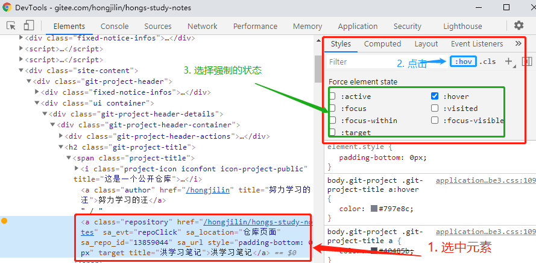
>
>2. "`cls`":查看所有与当前元素直接相关的样式规则，你可以禁止/允许某个类作用于所选元素，也可以添加新的类(可以与隔壁`+`功能搭配使用)
>
>   
>
>3. "`+`":默认给选中元素新建一个样式规则类(可以与`cls`搭配),上面的`span.aaa`就是此功能创建出来的

###### 	总结

> 现在的 CSS 文件基本上都是编译后的结果，而保存的文件一般也是编译后的 CSS 文件，所以这么做的作用不大。所以我们一般将 Styles 面板当做一个所见即所得的调试工具。当然,这时我同查阅到的学习资料博主一样发出呼吁:如果有可以直接保存原始样式文件的方法,请留言谢谢:dog:

##### 	2) Computed面板

>Computed 面板显示了如下内容：
>
>- 所选元素的盒模型
>- 所选元素的 CSS 样式以及值，不仅显示最终所采用的值，也显示被覆盖了的值
>- 每个属性值所在的文件
>
>鼠标悬停在盒模型上的 margin、border、padding 以及内容区域，可以在网页中看到与之相对应的区域。你还可以双击盒模型上的数字来修改它。如果所选元素的 position 属性的值为 absolute 或者 fixed 的话，还可以在 margin 的外围设置 position。
>
>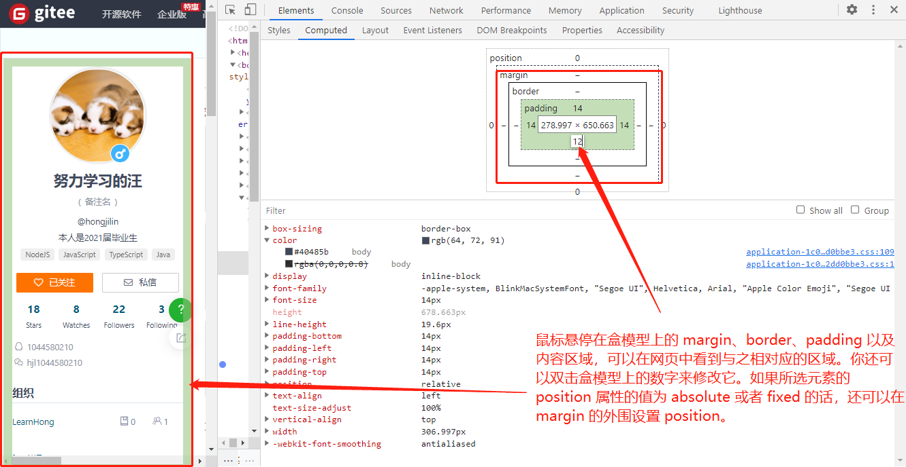

##### 	3) Event Listeners

>查看所选元素相关的 JS 事件监听--此处直接举例
>
>1. 应用场景举例:当你想要查找某个元素绑定的点击事件,就可以通过该方法直接定位到代码中
>2. 操作:
>
>  - 切换 “Elements" 元素面板,点击文档节点
>
>  - 选择 “Event Listeners” 页签
>
>  - 展开相应的事件名,如“click”
>
>  - 对 “handler” 点击右键,选择 “Show funciton definition”
>
>  - 点击后就会自动定位
>
>3. 示例图
>
>  

##### 	4) DOM Breakpoints

>查看、操作DOM断点
>
>当把鼠标悬停在节点标识符上时可以在网页相应区域显示对应的页面元素，勾选前面的复选框代表断点有效，不勾选代表断点虽然存在，但无法使用。
>
>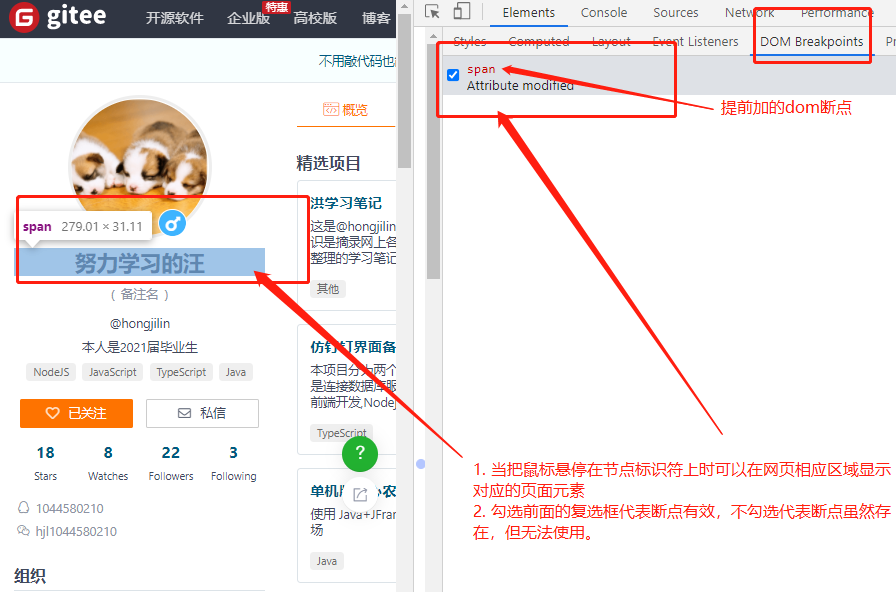
>
>

##### 	5) Properties

>这是所选 DOM 节点对应的对象以及这个对象的父类、父类的父类...的集合。
>
>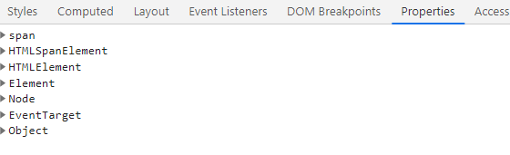 

### 2、Console 面板

>Chrome DevTools 的 Console 主要提供两类功能：
>
>- 在开发过程中记录代码诊断信息
>- 与文档和 DevTools 交互的命令行工具

#### Ⅰ- 打开 Console

>1. 首先，先提一下打开 Console 的方法。第一种是之前提到过的：`Ctrl + Shift + J / Cmd + Opt + J`，打开 DevTools，并且直接定位到控制台面板。
>
>2. `Console drawer`:这种比较特殊，如果你想打开其他功能面板的同时，还想打开 Console 的话，[详见本笔记常用操作第17点](#17、打开控制台抽屉)

#### Ⅱ- Console 中的内置菜单详解

> 我们先看一下 Console 的界面，看看这个曾经很熟悉的界面是否真的熟悉
>
> 上下结构，上面是功能按钮或选项，下面是信息展示或交互的面板。先看上面，从左往右，依次是：
>
> - :显示/隐藏侧边栏的按钮，其功能是进行控制台面板的显示信息过滤。
> - :清空 Console控制台打印内容
> - 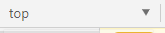:执行环境选择器,比如切换成`vue-devtools`
> - :监听变量,点击后输入某变量,就会将其置顶显示在console顶部,每次变量值改变都会同步上去
> - 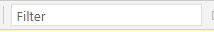:过滤 Console 中的信息,可以用正则,也可以直接输入变量名
> - 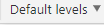:也是对消息的过滤-分为**Verbose（详细）,Info（信息），Warnings（警告）,Error（错误)**四个等级类型
> - 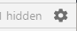:其他的隐藏功能-如`Preserve log`刷新时保存当前console的变量等

##### 	1) 过滤信息

>上面按钮中过滤信息的为
>
>1. 、:显示侧边栏时其右边的`Default levels`下拉菜单会被禁止使用，因为它的作用也是过滤信息并且侧边栏的过滤功能包含它
>
>   **共有四种选项，按照严重级别排序分别为：Verbose（详细）,Info（信息），Warnings（警告）,Error（错误）。**
>   **在侧边栏的信息过滤功能中，除了上述四种过滤方式外还可以根据具体的messages进行过滤**
>
>   
>
>2. :**过滤框主要能按照以下三种类型的输入进行信息过滤：**
>
>   - URL
>
>   - 上下文
>
>   - 正则表达式
>
>   示例图
>
>   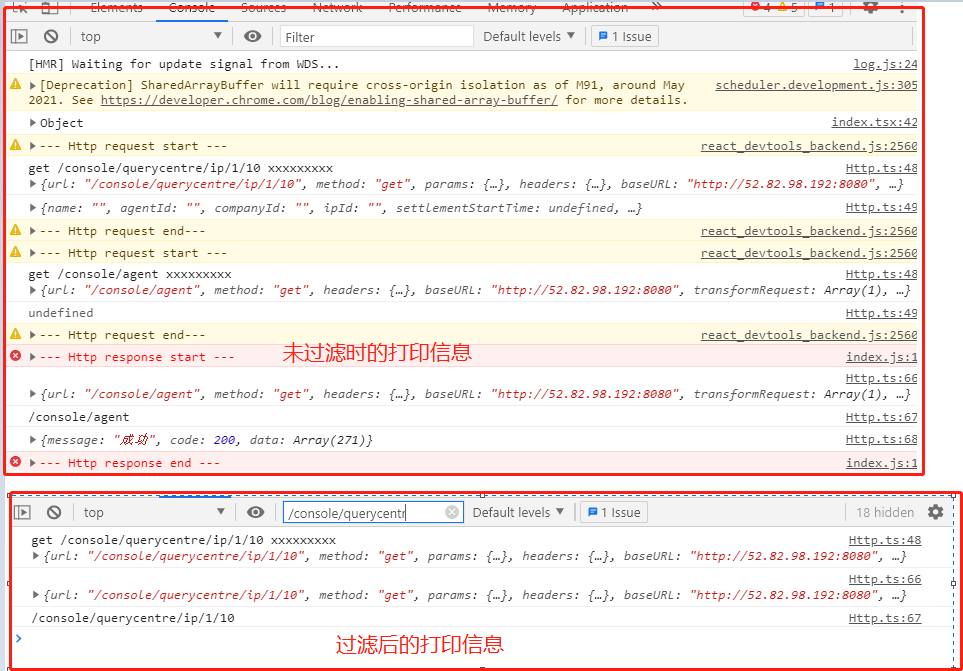

##### 	2) 清空标志:清空控制台信息

>1. :清空 Console控制台打印内容
>2. 在控制台中键入clear()，然后运行
>3. Ctrl+L清空

##### 	3) top下拉标志:切换执行环境

>1. 此下拉菜单称为 Execution Context Selector,通常，您会看到此环境设置为 `top`（页面的顶部框架)。
>
>2. 其他框架和扩展程序在其自身的环境中运行。要使用这些其他环境，您需要从下拉菜单中选中它们。 例如，如果您要查看 `<iframe>` 元素的日志输出，并修改该环境中存在的某个变量，您需要从 Execution Context Selector 下拉菜单中选中该元素。
>
>3. 当您在 `top` 以外的环境中操作时，DevTools 将 Execution Context Selector 突出显示为红色，如下面的屏幕截图中所示。 这是因为开发者很少需要在 `top` 以外的任意环境中操作。 输入一个变量，期待返回一个值，只是为了查看该变量是否为 `undefined`（因为该变量是在不同环境中定义的），这会非常令人困惑
>
>4. 示例图
>
>   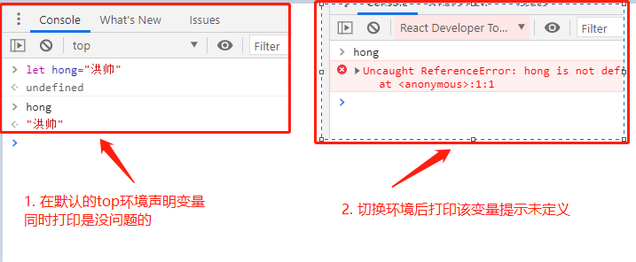

##### 	4) 眼睛标志:监听变量

>:**用于创建一个Live表达式，此表达式的值可实时更新。**
>
>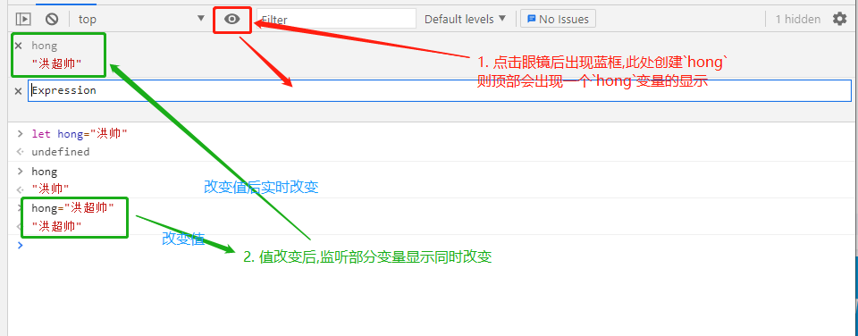

##### 	5) settings按钮具备显示信息的控制功能，其里面有八个选择项

>内部挺多功能就稍微说常用的
>
>1. `Preserve log`:默认是不勾选的，所以当刷新页面时，Console 中的信息会被清空掉。如果勾选了的话，那么刷新页面之后，信息还会被保留。
>2. 其他的我不常用谢谢
>
>

#### Ⅲ- Console 能干什么事

##### 	1) 执行表达式

>你可以输入任何表达式，按回车执行。在输入过程中，可能会出现智能提醒，你可以按 tab 或者 → 键来完成自动补全。另外，还可以按 ↑ 和 ↓ 键来翻阅历史表达式

##### 	2) Chrome DevTools 自带了哪些常用的表达式?

>下面描述的都是 Chrome DevTools 自带的方法或者变量，需要注意一下的是，当页面暴露相同的方法或变量的话，DevTools `自带的会被覆盖`，比如 jQuery 官网下的 Console 中的 $() 就是自己的方法。
>
>`常用来调试`

###### 	① *选择元素*

>- $()：是 `document.querySelector()` 的缩写
>- $$()：是 `document.querySelectorAll()` 的缩写
>- $x()：通过 XPath 的方式查看元素，注意是 "XPath" 中的 "x"，而不是 `+-*/` 中的 `*`
>- 示例图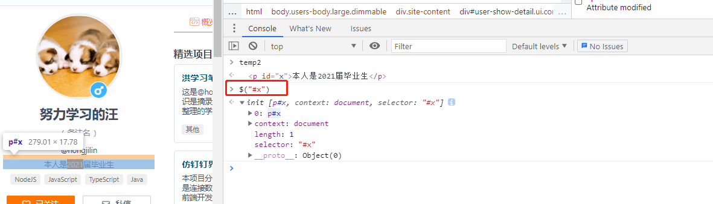

###### ② *inspect*

>在 Console 中输入 `inspect()` 参数是 DOM 元素或者 JS 引用，可以跳转到 Elements 面板并且定位到你选择的那个 DOM 节点那。
>
>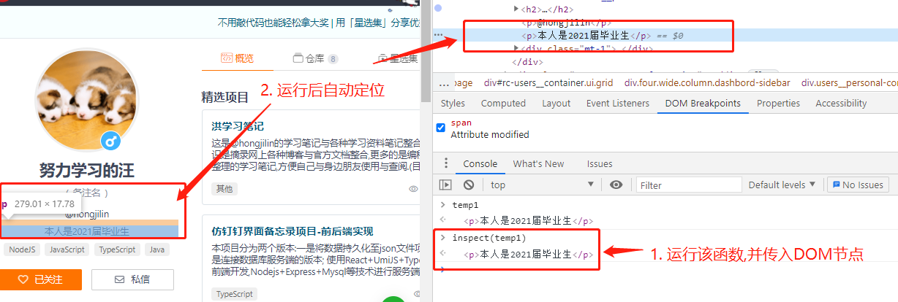

###### 	③ **$0-4*

>$0， $1...$4，代表 5 个最近访问过的 DOM 或者堆对象（Heap Object），$0 是最近访问的。那访问的意思是什么？就是在 Elements 面板被审查或者在 Memory 面板被选择的 DOM 元素或者堆对象
>
>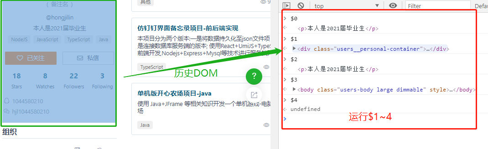

###### 	④ *$_*

>`$_` 返回上一次表达式执行的结果。举个栗子：
>
>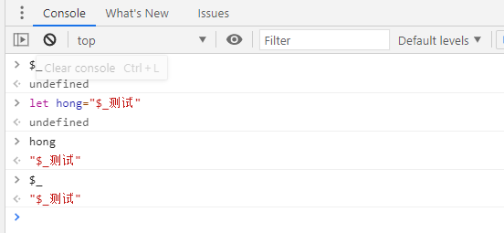 

###### 	⑤ *Event*

>在 Chrome DevTools 里你可以给 DOM 绑定事件、解绑事件，也能查看 DOM 注册了哪些事件
>
>- `monitorEvents(DOM_element, event)`，如果 event 为空的话，那会给选定的 DOM 元素加上所有事件；如果想监听多个事件的话，event 还可以是 Array 类型的变量
>
>- `unmonitorEvents(DOM_element)`，为某个 DOM 元素解绑事件
>
>- `getEventListeners(DOM_element)`，查看某个 DOM 元素绑定了哪些事件
>
>  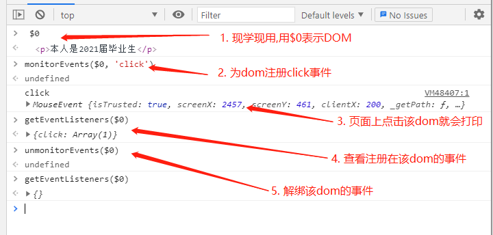
>
>  在上面例子中,我为`<p>本人是2021届毕业生</p>`注册了一个点击事件并解绑

###### 	⑥ *debug(function) 与 undebug(function)*

>在 Console 中调用 debug() 方法，当调用这个方法的时候，就会开启 debug 模式。用 `undebug` 方法来关闭。
>
>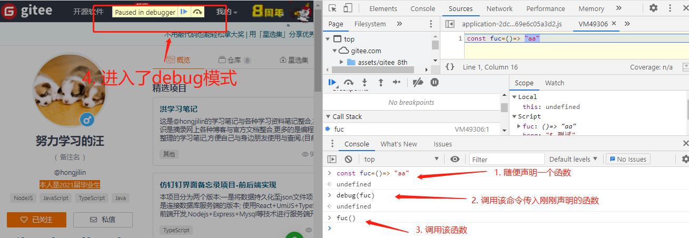

###### 	⑥ *monitor(function) 与 unmonitor(function)*

>当调用某个 function 时，Console 会输出这个 function 的名字和参数。

###### 	⑦ *dir(object) 与 dirxml(object)*

>dir() 与 console.dir() 一样，dirxml() 与 console.dirxml() 一样。
>
>dir() 将选中元素以对象的形式输出，而 dirxml() 将元素以 xml 的形式输出。

#### Ⅳ- Console drawer状态查看与修改你的值

>ps:[`Console drawer`](#Ⅰ- 打开 Console)其实就是在别的面板打开控制台
>
>如果你以为 Chrome DevTools 就简单看看这些值那就太小瞧她了，在中断状态下，还能动态修改变量的值。比如中断处有个变量叫 v，值是 1，如果我直接按 "Resume script execution" 的话，那么下一次的 v 也是 1，但如果我在按恢复执行按钮之前，我在 Console drawer 中输入 `v = 2` 回车，那么，下一处的 v 就是 2 了。
>
>还有更厉害的，你不仅可以修改变量的值，你还可以修改代码！当程序中断时，你可以在 [`Sources`](#Ⅰ- Sources 面板图解)(断点调试) 面板修改你的代码

### 3、Sources 面板

> 在 Chrome 中调试 JS 代码，那你不得不与 Chrome DevTools 的 Sources 面板打交道,使用谷歌控制台Sources面板可以:
>
> - 查看文件
> - 编辑 Css 和 JavaScript。
> - 创建和保存 JavaScript 的**代码段**，您可以在任何页面上运行此代码段。 **代码段**与小书签相似。
> - 调试 JavaScript。
> - 设置工作区，以将您在 DevTools 中作出的更改保存到文件系统的代码中。

#### Ⅰ- Sources 面板图解

>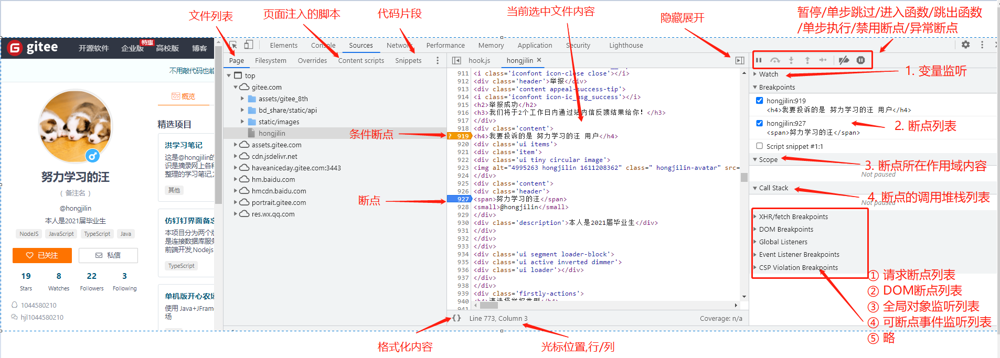

#### Ⅱ- 左侧面板详解

##### 	1) `Page`:

> 已加载的全部资源，以域名划分文件夹。

##### 	2) `Content Scripts`:

>浏览器扩展工具的脚本，比如我安装了`Vue.js devtools`、`React Developer Tools`、[`PostWoman接口调试工具(挺好用的,点我传送)`](https://gitee.com/hongjilin/hongs-study-notes/blob/master/%E6%9D%82%E8%AE%B0_%E5%85%B6%E4%BB%96(%E5%A6%82%E7%A0%B4%E8%A7%A3%E4%B8%8E%E9%85%8D%E7%BD%AE)%E7%9A%84%E7%A2%8E%E7%89%87%E5%8C%96%E7%AC%94%E8%AE%B0/%E5%A5%BD%E7%94%A8%E7%9A%84%E5%B7%A5%E5%85%B7Mark.md/#6、Postwoman(ApiDebug)%20http接口测试工具)等插件都会显示出来
>
>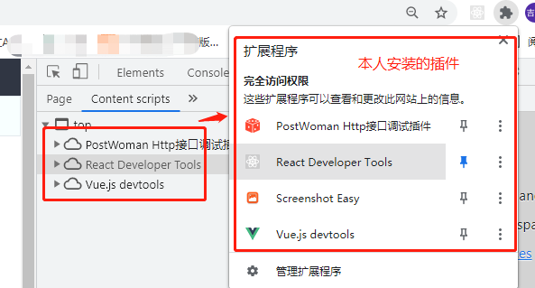 

##### 	3) `Snippets`

>代码片段，可以在这里添加一小段程序，这个一小段程序`可以访问这个页面中的变量和函数等`。不会因为刷新丢失，使用：添加=>保存(ctrl+s)=>运行(`Run`)=>不用则移除(`Remove`)
>
>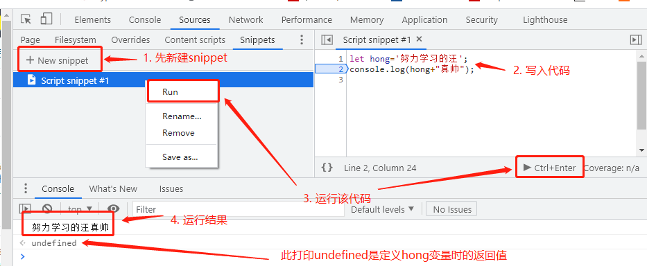

##### 	4) `Filesystem&Overrides`

> 可以加载本地文件夹,就是可以将整个项目加载到此进行调试

#### Ⅲ- 中间代码展示面板详解

##### 	1) `添加断点`

> 1. 断点:代码行号所在的位置叫做行号槽，点击行号槽，为相应的行添加断点，并在相应的行号上面加上一个类似肩章的五边形图标(蓝色的)。
>
>     
>
> 2. 条件断点:右键一个没有添加断点的行号，选择 "Add conditional breakpoint"或者 右键行号选择`Edit已有断点`输入你的条件，当条件满足时，断点才会生效。回车后效果如下
>
>    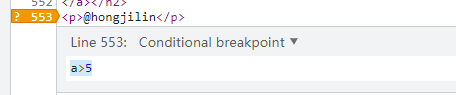 
>
> 3. 行内断点:当你将代码打在某些js语句上是,与上述例子不同的是同一行出现了 3 处标红的位置(也可能是2行,这得看你标注的代码具体情况)，表示 3 处断点。但第1个断点跟后2个不一样的是，第1个断点是默认处于激活状态，而后2个则不是，`只有点击激活后才能生效`
>
>    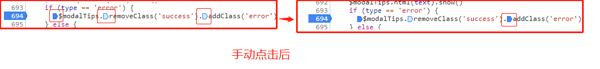

##### 	2) `右键行号` 及 `右键断点`

>1. 右键行号
>
>   - **Add breakpoint** 添加断点
>   - **Add conditional breakpoint** 添加条件断点
>   - **Never pause here** 永不停顿
>
>2. 右键断点
>
>   - **Remove breakpoint** 删除断点
>   - **Edit breakpoint** 修改断点
>   - **Disable breakpoint** 忽略断点
>   - Deactivate breakpoints：暂时忽略所有断点 (暗淡断点标志和断点列表，右键列表某个断点选择 Activate all breakpoints可恢复所有断点)
>   - Disable all breakpoints： 暂时忽略所有断点 (暗淡断点标志和断点列表，右键列表某个断点选择 Enable all breakpoints可恢复所有断点)
>   - Remove all breakpoints：删除所有断点
>     
>
>3. 比较奇怪的是我在网上看到的很多文章会写到右键有`Blackbox script (黑盒脚本)`,但本人无,所以推测可能是浏览器版本问题
>
>   > 这里另外指出并给出原文描述:我们写项目时，很多时候是要引用第三方库或框架的，当我们调试时，调试的对象应该是我们自己写的代码，但很多时候，我们经常在焦灼地进行下一步下一步时，突然代码跳到了第三方库或框架的源码上去，这让我们焦灼的内心更添了一把柴火。黑盒脚本就是用来解决这个问题的。它能够将一个脚本文件标记为 "Blackbox Script"，那么我们就永远不可能进入这个文件内部，这个文件对我们来讲就是一个黑盒子。为什么要强调“永远”呢？因为不仅普通的断点不能访问这个被标记了的脚本，其他的，比如说 DOM 断点、事件断点等等都无法访问那个脚本文件内部。

##### 3) 打断点注意点

>- 首先在浏览器页面按F12打开开发工具，点击Sources选项，默认显示的是Page标签。然后找到需要调试的源码文件。
>- 如果是正常html页面，那么源码一般是在对应域名下面。如果是webpack处理的页面，并且开启了源码映射，源码就是在webpack://下面。可通过快捷键ctrl+ o打开搜索框输入文件名搜索源码。
>
>1. 只要找到源码，在脚本代码显示区域左边的数字上添加断点即可，之后只要代码运行到断点处，开发工具就会进入调试状态。
>
>   >注意：有的数字行是灰色的，就是不可断点。有时候点击15行断点选中14行，这是因为浏览器真正执行的代码行不是你看到的那一行，可能是优化掉了或者经过某种转换。
>
>2. 还有一种情况是:添加某一行断点，会跳转到另一个页面并命中某一行,这个页面的背景色是黄色且文件名是VM开头。上述情况，大部分都是因为浏览器显示的源码版本，跟真正的源码文件不一致，只需要刷新一下页面，保证显示的源码是最新的即可。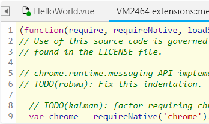  

##### 4) 打断点小技巧

###### ① *小技巧1*

>***有时候源码历经千辛万苦都找不到在哪，这时候就需要祭出console.log了。在需要调试的那一行代码前加上console.log(666),然后运行一次，到控制台查看结果输出，点击右边的链接会自动跳转到源码，这样就可以直接断点了***
>
>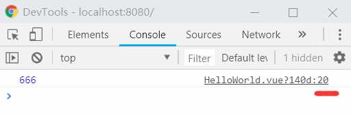 

###### ② *小技巧2*

>其实这个在上面`左侧面板第四点Filesystem&Overrides`部分讲过 -->[点我传送](#Ⅱ- 左侧面板详解)
>
>***如下图，在Filesystem添加文件夹到工作路径，选择之后会有提示，点击接受。如果你的谷歌浏览器没有这玩意，请升级版本，还是没有的话，请忽略这段话。虽然不知道这是什么时候出的功能，但是我偶然发现的，它可以编辑之后真的保存到文件，这个可以当编辑器用了。***
>
>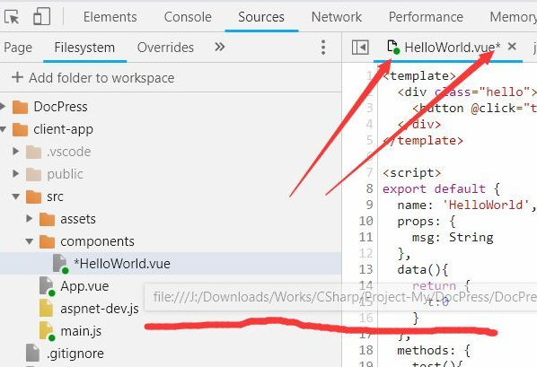 


#### Ⅳ- 右侧断点调试按钮组详解

> 首先我们先介绍右侧功能按钮组的各个作用
> 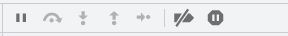
>
> - ：当程序中断在断点处时，点击去往下一个断点
> - ：当程序中断在断点处时，`长按上面的按钮出现此标志(还有一个方形按钮为中断)`，点击这个按钮可以在 0.5s 内忽略任何中断，当中断出现在循环内部时一般比较有用
> - ：执行下一条语句.按正常步骤，应该会一行一行的执行相关代码，以便深入探索哪些代码影响着正在更新的变量。如果你的代码中调用了另一个函数，点击此按钮将不会进入该函数，而是直接略过，将焦点留在当前函数上
> - ：当中断停留在一个函数调用处时，点击这个按钮会进入函数内部，而上面的按钮则会执行函数调用的下一句，不会进入函数内部
> - ：当中断停留在函数内部时，点击这个按钮则会跳出函数内部，停留在函数调用的下一个语句
> - ：在不取消断点标记的情况下，使得所有断点失效

#### Ⅴ- 右侧面板详解

> 此处用到上面[`左侧面板的Snippets相关知识`](#Ⅱ-左侧面板详解)插入了一个`代码块`模拟断点调试,方便展示

##### 	1) `Watch` (变量监听):

>正如名字所表示的，观察，观察什么呢？`主要观察变量`。
>
>示例图如下
>
>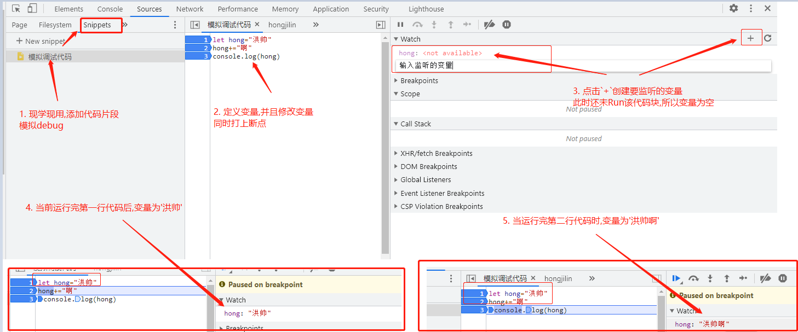

##### 	2) `BreakPoints `(断点列表)：

>展示断点列表，将每个断点所在文件/行数/该行简略内容展示
>
>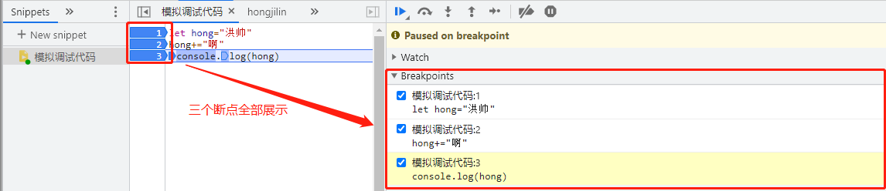

##### 	3) `Scope` (作用域):

>Scope 面板显示了你当前断点所在函数所有属性的值。Scope 会显示2种类型的值： Script和 Global。如下图，当前作用域里的对象是本地参数Script
>
>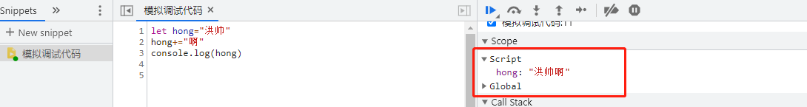
>
>注:在网上查阅资料时很多都说`Scope 会显示三种类型的值： Local、Closure 和 Global`。但是本人没有,仍是推测版本问题,所以我仍是以本人所见为主,备注出此资料

##### 	4) `Call Stack `(函数调用堆栈):

>Call Stack 面板会显示代码的执行路径

##### 	5) `XHR Breakpoints` (请求断点列表)

>对达到满足过滤条件的请求进行断点拦截，点击该面板右侧加号按钮，会跳出"Break when URL contains"以填写过滤条件。如下图，我们对请求URL包含字母`/console/querycentre....`的内容进行断点
>
>下方示例图为了不影响观看体验打码无用部分
>
>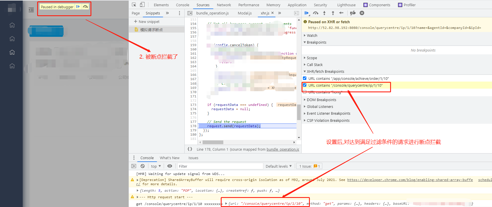

##### 	6) `DOM Breakpoints `(DOM断点列表)

>给DOM加断点，在达到规定条件时触发断点，截断javascript的执行并且定位到断点处。例如：在[Elements](#Ⅱ- elements的内置面板)面板，右键 body 元素→Break on→ modifications，在DOM Breakpoints面板中会显示DOM元素名

##### 	7) `Event Listener Breakpoints` (可断点的事件监听列表)

>打开这个列表，可以在监听事件并且在触发该事件时进入断点，调试器会停留在触发事件代码行。只需要展开事件列表，选择要监听的事件打上勾即可
>
>举个栗子,勾选键盘按下事件: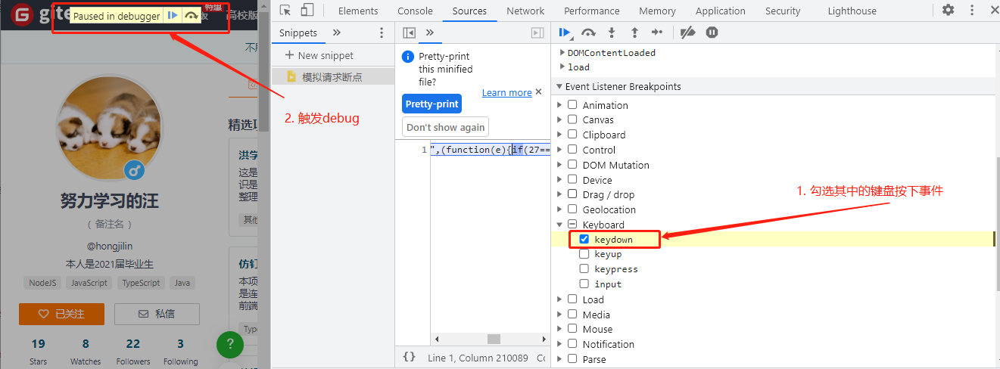

#### Ⅵ- 源码调试小贴士

>现在的项目几乎都是经过编译过的，所以当我们调试时会与编译后的代码打交道，但那并不是我们想要的。不要急，Chrome DevTools 提供了预处理过的代码与源码的映射，主要表现在两点：
>
>- 在 console 上，源链接指向的是源码，而不是编译后的文件
>- 在 debug 时，在 Call Stack 面板上的源链接指向的也是源码，不是编译后的文件
>
>不过需要注意的是，上面所讲的能查看源码的前提是 Chrome DevTools 在设置中提供了相应权限，具体是：Settings - Sources - Enable Javascript source maps / Enable CSS source maps，勾选这两项即可。不过，默认情况下就是勾选。


### 4、Network 面板

>Chrome DevTools 的 Network 面板主要用于度量当前网页的网络性能状况，其记录了当前网页每个网络操作的信息，包括时间数据、HTTP 请求、返回数据等等。
>
>国际惯例,先看完整截图概览
>
>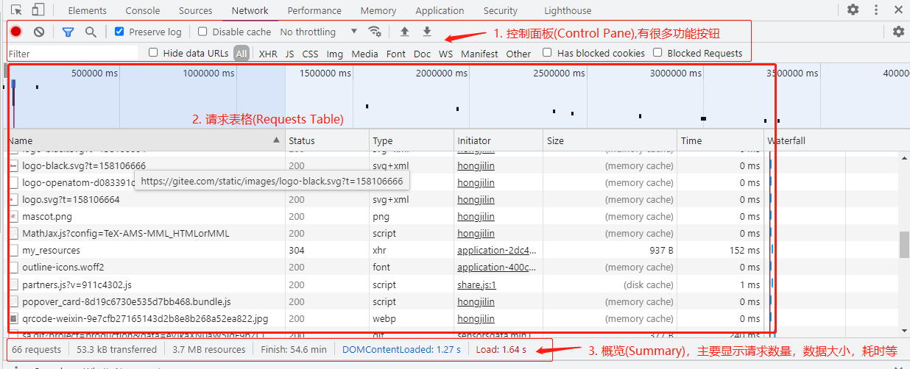

#### Ⅰ- Control 面板

>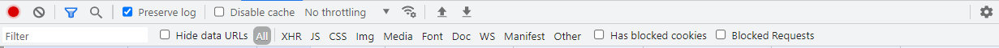
>
>> 

##### 	1) `开始/停止记录`

>**** 表示正常记录网络的请求状况，点击，当图标变成  时，代表停止记录请求状况,此时页面上不会对后续请求进行记录(保留点击前的记录)。

##### 	2) `清除记录`

> 点击  可以清除请求表格内的内容。

##### 	3) `截取加载的瞬间`

>本人`Control 面板`中没有录制图标,但其实是收置在了设置面板中,详见下方 `9)右侧设置图标`部分
>
>1. 仍是推测为版本区别,此处给出网上对于其功能描述:
>
>> 点击 ，当图标变成  时，代表开启截屏模式，即截取网页在加载过程中的瞬间，这些瞬间显示了网页在什么时间加载出了哪些部分。
>
>2. 本人操作
>
>   >出现下面的结果(`放出本人示例图`)：
>   >
>   >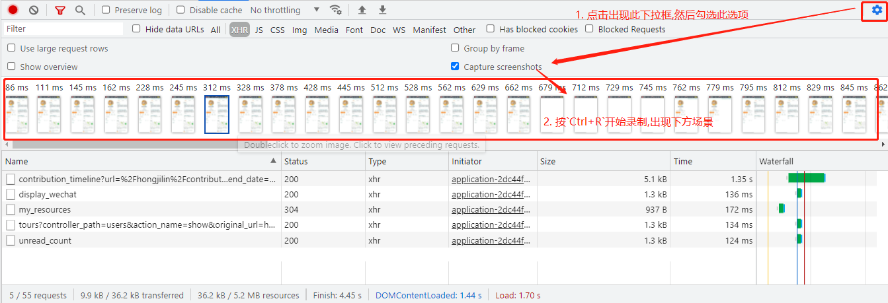

##### 	4) `过滤`

>点击  可以显示/隐藏过滤面板，如下：
>
>
>
>1. 可以把过滤面板看成由三个部分组成的面板，从左到右分别是：过滤文本域、隐藏 Data URLs 和请求资源类型选择。
>
>2. 对 Data URLs 不理解的可以看：[Data URLs](https://developer.mozilla.org/en-US/docs/Web/HTTP/Basics_of_HTTP/Data_URIs)。在这里主要就是为了隐藏这些用 Data URLs 来展示的资源,此处不赘述
>3. 在 "Hide data URLs" 后面有一组文件类型，选择一个可以在下面的请求表格中只显示相应类型的文件请求，当然你还可以在选择的同时按着 `ctrl / cmd`，那么就可以多选

###### 	① *请求资源类型选择*

>在 "Hide data URLs" 后面有一组文件类型，选择一个可以在下面的请求表格中只显示相应类型的文件请求，当然你还可以在选择的同时按着 `ctrl / cmd`，那么就可以多选

###### 	② *过滤文本域*

>下面来说过滤文本域，就是过滤面板最左边的输入框
>
>1. 首先，最简单的用法就是我们输入一个字符串，然后可以过滤出那些资源名称中包含相应字符串的资源。这是我们一般使用的，除此以外，文本域还支持一些关键词，举个栗子：
>
>  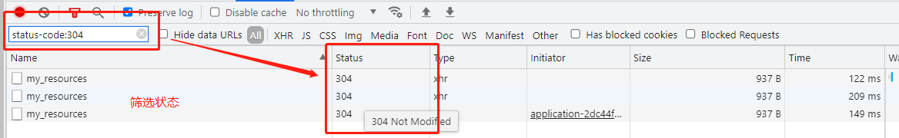
>
>  上面的例子就用到了 `status-code` 关键词，后面跟的参数是状态码，可以刷选出 `状态码为304` 的请求
>
>2. 常用关键词有哪些
>
>  - domain：刷选来自特定域的请求
>  - has-response-header：刷选 HTTP 返回值包含特定头部信息的请求
>  - is：可以用 `is:running` 查看 WebSocket 资源
>  - larger-than：筛选文件大小超过特定数字的请求，默认单位是 byte
>  - method：刷选特定 HTTP 请求方法的请求
>  - mime-type：刷选特定 MIME 类型的请求
>  - mixed-content：有 `mixed-content:all` 和 `mixed-content:displayed` 两种
>  - scheme：刷选特定 scheme 的请求
>  - set-cookie-domain：刷选特定的 HTTP 返回头部的 set-cookie 属性的请求
>  - set-cookie-name：也是对返回的 HTTP 头部中某个属性进行刷选的关键词
>  - set-cookie-value：同上
>  - status-code：对请求的状态值进行刷选
>
>3. 注意点
>
>  >- 冒号后面不能有空格
>  >- 大小写敏感。

##### 	5) `搜索`

>第4个搜索图标，可以打开search面板。search与filter的区别在于，filter只能按照请求URL来筛选请求，但search可以搜索到请求和响应中的内容。“Aa”表示是否匹配大小写，“.*”表示根据某种格式匹配。
>
>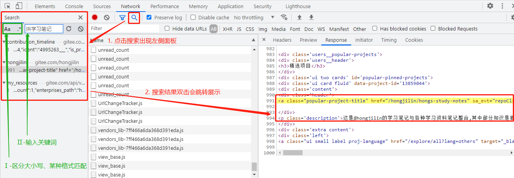

##### 	6) `preserve log`

>preserve log表示保留log。如果不勾选，当切换页面时，上个页面的log将被清除掉；勾选后，切换页面时，上个页面的log依然存在。

##### 	7) `Disable cache`

> Disable cache表示禁止缓存，勾选后，页面将不再从缓存中获取文件。

##### 	8) `模拟网络状况`

> 点击online，打开模拟网络选项，可以调试网页在不同网络状况下的表现情况。这对移动端的调试非常有用
>
> 1. 具体操作见下方常用操作:[切换网络模式及限制网速方式](#13、切换网络模式及限制网速)
>
> 2. 除了在 Network 面板可以设置网络状况，还可以在 Drawer 中看见。具体有两种方法：
>
>    - -> More tools -> Network conditions
>
>    - 按 esc 键调出 Console Drawer，在 Console Tab 旁边也有 ，点击，选择 Network conditions

##### 	9) `右侧设置图标`

> 点击右侧设置图标后会出现几个选项
>
> 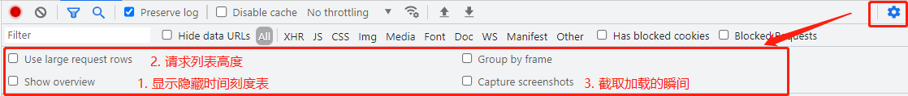


#### Ⅱ- 时间刻度表

>我一开始跟很多人一样，看到这个图时觉得头晕，感觉上是显示加载情况的，但又说不出具体什么意思，下面就跟大家一起了解一下这张图的含义。
>
>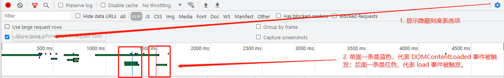
>
>首先从水平方向上从左看到右，你会看见：
>
>- 刻度：代表时间
>
>- 一条条水平线：一条水平线代表一项资源，这条水平线上的不同的颜色段代表这项资源在加载过程中处于什么阶段
>
>- 有两条竖线：前面一条是蓝色，代表 DOMContentLoaded 事件被触发；后面一条是红色，代表 load 事件被触发。`从概览面板也能看到`这两个信息：
>
>  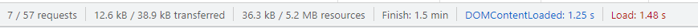
>
>然后从垂直方向看，这些五彩斑斓的水平线有的有重叠有的没有重叠，具有重叠部分说明这些资源是在同一时间被加载的。
>
>`ps`:筛选不同时间的请求
>
>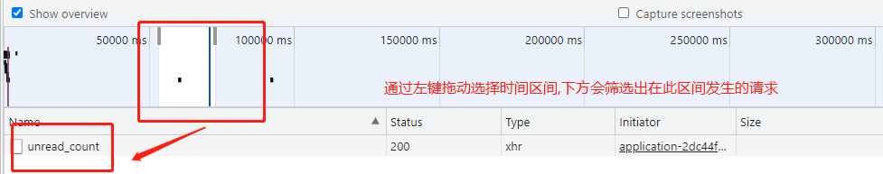


#### Ⅲ- 概况面板

>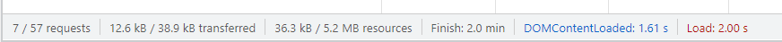
>
>网络面板的最下方，展示了整个页面的请求概况，下图可以看出，本人[`gitee`](https://gitee.com/hongjilin)首页共发起了57个请求，网络传输38.9KB，一共加载资源5.2MB，所有请求完成的时间是2.0min，DOM构建完成的时间是1.61s，所有外部资源加载完成的时间是2.00s。
>
>ps:`红蓝字部分的时间差大致是外部资源的加载时间`


#### Ⅳ- 请求列表操作面板

>  使用Network面板最多的地方莫过于调试aJax请求了。点开一个请求，可以看到几个标签。
>
>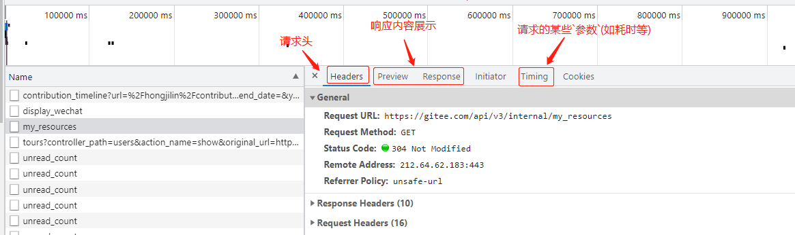
>
>

##### 	1) `Headers`

>Headers里面展示了一些请求的基本信息，包括请求头、响应头等。里面展示了一些请求的基本信息，包括请求头、响应头、`请求参数(常用)`等。

##### 	2) `Preview`和`Response`

> Preview和Response都是对返回信息的展示。区别是Response展示的是请求返回的原始内容；Preview是根据原始内容的不同类型进行的直观展示。
>
> 可以看到其实数据是一样的,但是格式不同
>
> 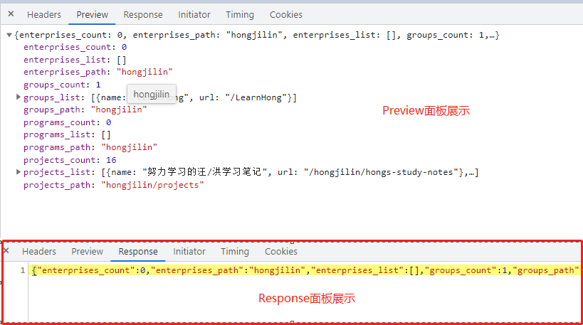 

##### 	3) `Timing`查看请求参数

> Timing里面列举了一些请求的参数,也可以在请求列表的Waterfall中看到请求的参数。
>
>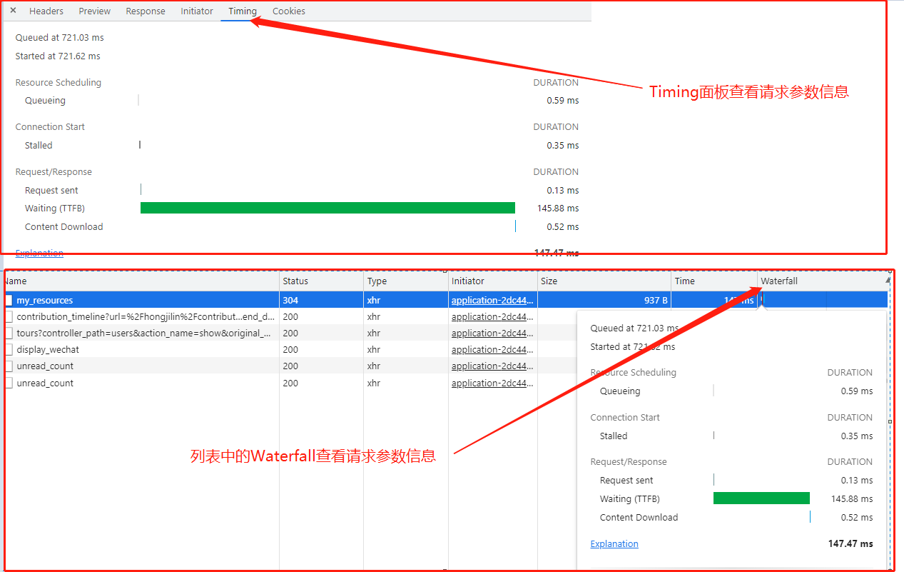
>
>应用场景: Queued表示队列时间，由于单个域名最多只能并发6个请求，所以不是所有的请求都是在页面初始就开始加载的。Started表示开始请求的时间。可以根据每个请求各阶段花费的时间来制定优化方案

##### 	4) 修改想展示的请求列表参数

> 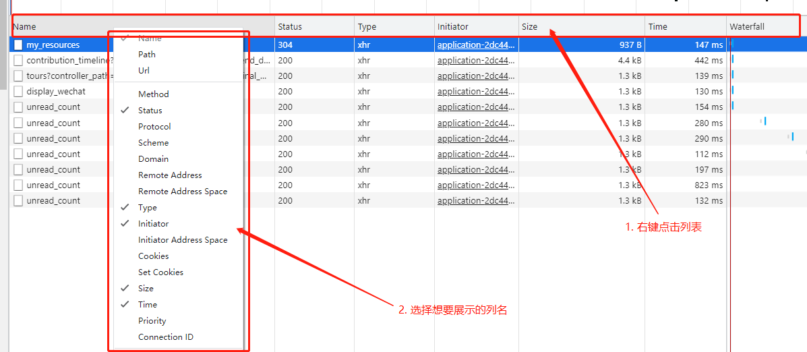


### 5、Performance(Timeline) 面板

> `Performance`--一个在前端开发领域中，无法被忽视的存在。使用Chrome DevTools的performance面板可以记录和分析页面在运行时的所有活动。本部分将详细介绍如何使用performance面板解决性能瓶颈  --旧版chrome中名叫`Timeline`
>
> 可以通过单击、鼠标滚动或者拖动来选中FPS,CPU或NET图标中的一部分，Main部分和Summary Tab就会只显示选中部分的录制信息
>
> 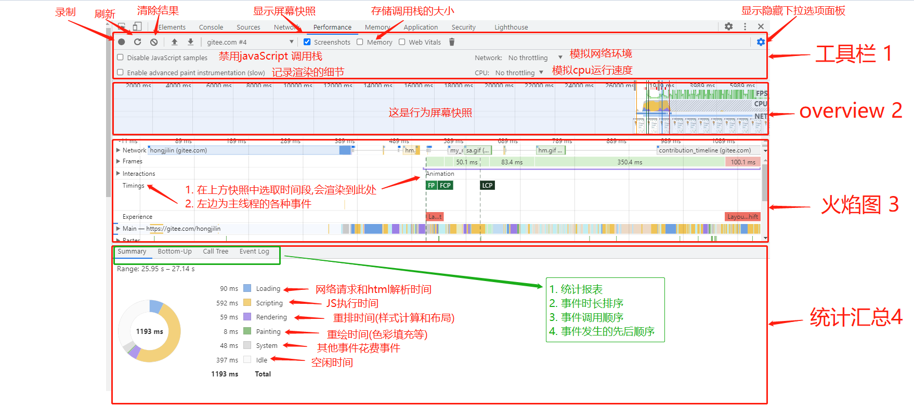 

##### 	1) performance面板的四个窗格

>1. Controls   -- 开始记录，停止记录和配置记录期间捕获的信息
>2. overview  -- 页面性能的高级汇总
>3. 火焰图     -- CPU 堆叠追踪的可视化
>4. 统计汇总    -- 以图表的形式汇总数据

##### 	2) Performance 工具的优点

>- 可视化图形界面
>- 每毫秒做的事情
>- 文件的执行加载的顺序
>- 每毫秒界面展示的效果
>- 每个方法执行的顺序和时间（由下至上）
>- 倒置的事件火焰图（由下至上）
>- 数据总结

##### 3) 面板中出现颜色对应的意义及资源

###### ① *面板中颜色表示的资源*

>- HTML文件为蓝色
>- 脚本为黄色
>- 样式表为紫色
>- 媒体文件为绿色
>- 其他资源为灰色

###### ② *各个颜色含义*

>**各个颜色含义 分别为(与Summary(火焰图)、CPU面板里的颜色是相互对应的)：**
>
>- 蓝色(Loading): 表示网络通信和 HTML 解析时间
>- 黄色(Scripting): 表示 JavaScript 执行时间
>- 紫色(Rendering): 表示样式计算和布局（重排）时间
>- 绿色(Painting): 表示重绘时间
>- 灰色(other): 表示其它事件花费的时间
>- 白色(Idle): 表示空闲时间

###### ③ *颜色中具体事件分类表格列举*

>  该表格内容在下方火焰图面板的Main面板中用到(观察瀑布流时) ->[`点我传送`](#④ *Main*)
>
>| 颜色              | 事件                     | 描述                                                         |
>| ----------------- | ------------------------ | ------------------------------------------------------------ |
>| 蓝色(Loading)     | Parse HTML               | 浏览器执行HTML解析                                           |
>|                   | Finish Loading           | 网络请求完毕事件                                             |
>|                   | Receive Data             | 请求的响应数据到达事件，如果响应数据很大（拆包），可能会多次触发该事件 |
>|                   | Receive Response         | 响应头报文到达时触发                                         |
>|                   | Send Request             | 发送网络请求时触发                                           |
>| **-------------** | **--------------------** | **------------------------------**                           |
>| 黄色(Scripting)   | Animation Frame Fired    | 一个定义好的动画帧发生并开始回调处理时触发                   |
>|                   | Cancel Animation Frame   | 取消一个动画帧时触发                                         |
>|                   | GC Event                 | 垃圾回收时触发                                               |
>|                   | DOMContentLoaded         | 当页面中的DOM内容加载并解析完毕时触发                        |
>|                   | Evaluate Script          | A script was evaluated.                                      |
>|                   | Event                    | js事件                                                       |
>|                   | Function Call            | 只有当浏览器进入到js引擎中时触发                             |
>|                   | Install Timer            | 创建计时器（调用setTimeout()和setInterval()）时触发          |
>|                   | Request Animation Frame  | requestAnimationFrame（）调用预定一个新帧                    |
>|                   | Remove Timer             | 当清除一个计时器时触发                                       |
>|                   | Time                     | 调用console.time()触发                                       |
>|                   | Time End                 | 调用console.timeEnd()触发                                    |
>|                   | Timer Fired              | 定时器激活回调后触发                                         |
>|                   | XHR Ready State Change   | 当一个异步请求为就绪状态后触发                               |
>|                   | XHR Load                 | 当一个异步请求完成加载后触发                                 |
>| **-------------** | **--------------------** | **-----------------------**                                  |
>| 紫色(Rendering)   | Invalidate layout        | 当DOM更改导致页面布局失效时触发                              |
>|                   | Layout                   | 页面布局计算执行时触发                                       |
>|                   | Recalculate style        | Chrome重新计算元素样式时触发                                 |
>|                   | Scroll                   | 内嵌的视窗滚动时触发                                         |
>|                   | 绿色(Painting)           | Composite Layers                                             |
>|                   | Image Decode             | 一个图片资源完成解码后触发                                   |
>|                   | Image Resize             | 一个图片被修改尺寸后触发                                     |
>|                   | Paint                    | 合并后的层被绘制到对应显示区域后触发                         |
>
>ps:该表格总结来自[`tang_yi的初识Chrome Performance`](https://blog.csdn.net/tang_yi_)

##### 		4) `Controls -Ⅰ` (工具栏) 功能

>1. 录制: 点击 Record （按Ctrl+E），这时候Devtools就开始录制各种性能指标。记录时，Record 按钮会变成红色。然后按 Record 按钮或再次键入键盘快捷键停止记录；
>2. 刷新: 刷新页面分析；
>3. 清除: 清除页面分析结果；
>4. 上下箭头: 用来上传和下载每一次性能检测报告；
>5. Screendshots:  显示屏幕快照，是用来查看在每个时间段界面的变化；
>6. Memory: 存储调用栈的大小，在不同时间段的不同大小；
>7. Disable Javascript samples:  禁用 JavaScript 调用栈；
>8. Enable advanced paint instrumentation(slow):  记录渲染事件的细节；
>9. Network: `模拟不同的网络环境`；--在移动端测试中特别好用
>10. CPU: 模拟不同的CPU运行速度

##### 	5) `overview -Ⅱ` (页面性能高级汇总)

>这里最主要是整体的界面渲染的时候，每个时间段执行的事件顺序，我们就能知道我们每个时间段（精确到毫秒）都做了什么，当鼠标放上去的时候，我们还可以`大图的形式`去查看我们每个时间段界面的渲染情况,下面上`概览详解图`:
>
>
>
>**`注意`：**无论鼠标移动到FPS,CPU或者NET图表上，DevTools都会显示在该时间节点上的屏幕截图，将你的鼠标左右移动，可以重放录制画面，这被称为擦洗。

###### 	① *FPS板块*

>**FPS:** 全称 Frames Per Second，表示每秒传输帧数，是速度单位，用来分析动画的一个主要性能指标。如果能够达到 >=60fps(帧)/s 的刷新频率，就可以避免出现卡顿。能保持在60的FPS的话，那么用户体验就是不错的。
>
>1. 为什么是**60fps**?
>
> >1. 我们先来理一下基本的概念：
> > - 60 fps 的意思是说，画面每秒更新60次
> >
> > - 这60次更新，是要均匀更新的，不是说一会快，一会慢，那样视觉上也会觉得不流畅
> >
> > - 每秒60次，也就是 1/60 ~= 16.67 ms 要更新一次
> >
> >   
> >
> >2. 现在可以具体解释一下为什么是**60fps**?
> > - 我们前面说的 60 fps，`是针对软件的`
> > - 这里说的屏幕的刷新率，是针对硬件的，现在大部分手机屏幕的刷新率，都维持在60 HZ，**移动设备上一般使用60HZ，是因为移动设备对于功耗的要求更高，提高手机屏幕的刷新率，对于手机来说，逻辑功耗会随着频率的增加而线性增大，同时更高的刷新率，意味着更短的TFT数据写入时间，对屏幕设计来说难度更大。**
> > - 屏幕刷新率 60 HZ 只能说**够用**，`在目前的情况下是最优解`，但是未来肯定是高刷新率屏幕的天下
>
>------
>
>
>
>2. **不同帧的体验：**
>
> >一般来说，帧频越高，画面会更流畅，高速动作看起来会更舒服
> >
> >帧率能够达到 50 ～ 60 FPS 的动画将会相当流畅，让人倍感舒适；
> >帧率在 30 ～ 50 FPS 之间的动画，因各人敏感程度不同，舒适度因人而异；
> >帧率在 30 FPS 以下的动画，让人感觉到明显的卡顿和不适感；
> >帧率波动很大的动画，亦会使人感觉到卡顿。

###### 	② *CPU板块*

>**CPU:** CPU 资源。CPU图表中的各种颜色代表着在这个时间段内，CPU在各种处理上所花费的时间。如果你看到了`某个处理占用了大量的时间`，那么这可能就是一个可以找到性能瓶颈的线索。
>
>其中颜色含义详解看上面 -- [`点我传送`](#② *各个颜色含义*)

###### ③ *NET板块*

>每条彩色横杠表示一种资源。横杠越长，检索资源所需的时间越长。 每个横杠的浅色部分表示等待时间（从请求资源到第一个字节下载完成的时间)

###### ④ *HEAP板块*

> JavaScrip 执行的时间分布。

##### 6) `Summary -Ⅲ`-火焰图面板

>可以通过单击、鼠标滚动或者拖动来选中FPS,CPU或NET图标中的一部分，Main部分和Summary Tab就会只显示选中部分的录制信息
>
>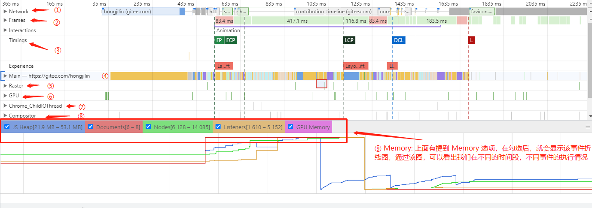

###### ① *Network*

> **Network:** 表示每个服务器资源的加载情况，什么时间加载了什么资源，通过这里，我们更直观的可以知道，资源是并行加载的

###### ② *Frames*

> **Frames:** 表示每幅帧的运行情况 -- 帧线程，鼠标悬浮绿色块可以看到fps
>
> 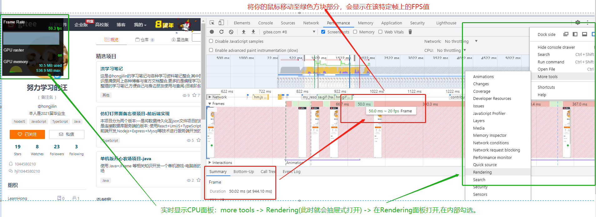
>
> 在这个例子中，页面的性能能很明显地被观察到，但是在实际场景中，可能并不是那么的容易，所以，要用所有这些工具来进行综合测量。
>
> **实时显示FPS面板：**more tools -> Rendering -> 在Rendering面板打开 FPS Meter(也能打开GPS实时检测)

###### ③ *Timings*

>**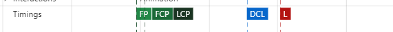**
>
>上图中有 4 条虚线，分别表示如下：
>
>1. `第一条绿线为首屏绘制`--其中 FP、FCP、FMP 是同一条虚线，三者时间不一致,比如首次渲染过后，有可能出现 JS 阻塞，这种情况下 FCP 就会大于 FP:
>
>   - `FP`(First Paint): 首屏绘制，页面刚开始渲染的时间
>
>   - `FCP`(First Contentful Paint): 首屏内容绘制，首次绘制任何文本，图像，非空白canvas 或 SVG 的时间点
>
>   - `FMP`(First Meaningful Paint): 首屏有意义的内容绘制，这个“有意义”没有权威的规定，本质上是通过一种算法来猜测某个时间点可能是
>
>     FMP。有的理解为是最大元素绘制的时间，即同`LCP`(Largest Contentful Paint）
>
>2. `LCP`(Largest Contentful Paint): 最大内容绘制，页面上尺寸最大的元素绘制时间。
>     其中 FP、FCP、FMP 是同一条虚线，三者时间不一致。比如首次渲染过后，有可能出现 JS 阻塞，这种情况下 FCP 就会大于 FP
>
>3. `DCL`(DOMContentLoaded): 表示 HTML 文档加载完成事件。当初始 HTML 文档完全加载并解析之后触发，无需等待样式、图片、子 frame 结束。作为明显的对比，load 事件是当个页面完全被加载时才触发
>
>4. `L`(Onload): 页面所有资源加载完成事件。

###### ④ *Main*

>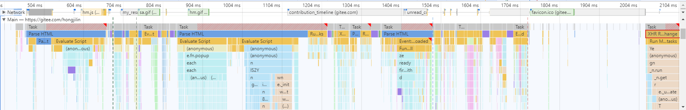
>
>**Main: **主线程，负责执行Javascript, 解析HTML/CSS, 完成绘制。可以看到主线程调用栈和耗时情况，每个长条都是一个事件，悬浮可以看到耗时和事件名  --`PS`:
>
>1. x轴指时间:最上面的第一条就是事件触发的地方，直到结束，这条线是最长的
>
>2. y轴指调用栈:上面的event调用了下面的子event，越到下面数量越少（瀑布）
>
>3. 各个事件类型(该图取自[`前往悬崖下寻宝的神三算`](https://www.jianshu.com/u/defb23ef5cda)博客)   如果要看其中具体事件请看上方`颜色中具体事件分类表格` ->[`点我传送`](#③ *颜色中具体事件分类表格列举*)
>
>   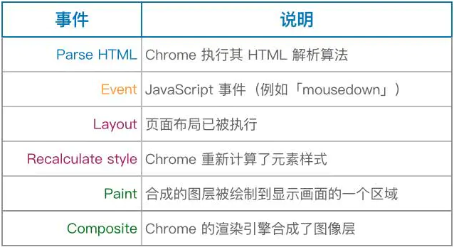 
>
>4. 可以看到某些事件右上角的`红色三角形图标`，该红色三角图标是这个事件可能有问题的警告,或者耗时过长(通常超过50ms)。如果是函数事件,那么就会显示导致问题的代码行号
>
>  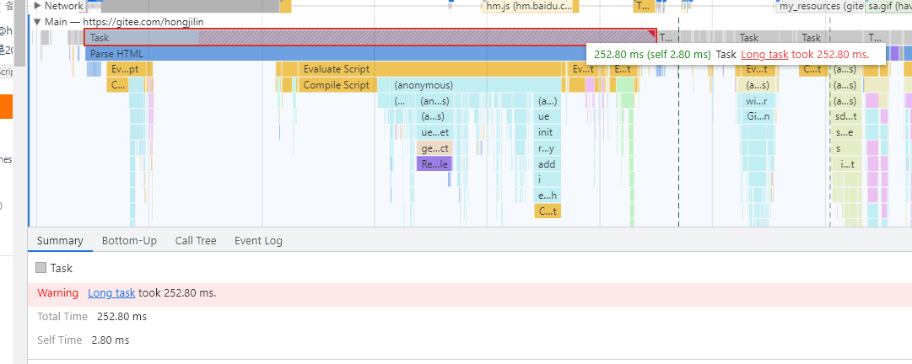
>
>5. **主要负责：**
>
>  - Javascript 的计算与执行
>  - CSS 样式计算
>  - Layout 布局计算
>  - 将页面元素绘制成位图（paint），也就是光栅化（Raster）
>  - 将位图给合成线程

###### ⑤ *Raster*

>Raster线程，网上说负责完成某个layer或者某些块(tile)的绘制,但本人未找到相应例子不是很懂,`先打个mark,后续找到具体例子再补充`

###### ⑥ *GPU*

>**GPU:** 表示 GPU 占用情况

###### ⑦ *Chrome_childIOThread*

>**Chrome_childIOThread:** 子线程

###### ⑧ *Compositor*

>**Compositor:** 合成线程

###### ⑨ *Memory* 

>**Memory:** 上面有提到 Memory 选项，在勾选后，就会显示该事件折线图，通过该图，可以看出我们在不同的时间段，不同事件的执行情况 --[`点我传送查看overview图示例`](#① *FPS板块*)
>
>- JS Heap: 表示 JS 占用的内存大小。
>- Documents: 表示文档数。
>- Nodes: 表示 Node 节点数
>- Listeners: 表示监听数。
>- GPU Memory: 表示 GPU 占用数
>
>4 条折线图是以上 4 个指标（没有 GPU 消耗）对应的时间消耗的内存大小与节点数量。若将某项指标前面的勾选去掉则不会出现对应的折线。注意这个折线图`只有在点击 Main 主线程的时候才会有`，选择其他的指标时折线图区域时空白。

##### 7) `统计汇总面板 -Ⅳ`

###### ① *Summary面板--统计报表*

>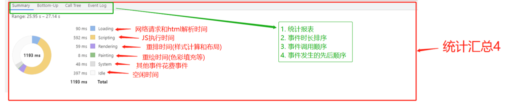

###### ② *Bottom-Up面板--事件时长排序列表*  

>这里和Main里面看见的，其实是一个对应着的关系，从这里，我们可以看见所有的事件列表，还有每个事件的Self Time(`自己调用的时间`） 、Total Time(`总调用时间，包括子项调用时间`） 、Activity(`行为，包括调用该事件的位置`）  
>
>ps:排列顺序为时间`倒序`
>
>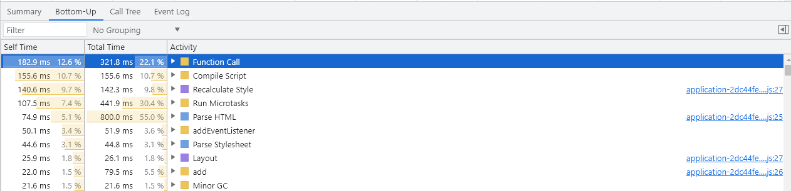

###### ③ *Call Tree面板--表示事件调用顺序列表*  

>这里和与 Bottom-Up 部分是差不多，略  

###### ④ *Event Log面板-- 表示事件发生的先后顺序*  

>其实就是比上面两个多了一列`Start Time` 属性,这个属性其实就是开始时间--从什么时候开始执行什么事件

### 6、Memory(Profiles) 面板

> Memory(Profiles)用来更深入的分析性能问题、内存问题。之前介绍的Performance(Timeline)可以直观的发现问题所在，但是要深入分析，定位问题原因，还得靠Memory。  --`一般初学者不会用到,同学们可以选择性学习`
>
> 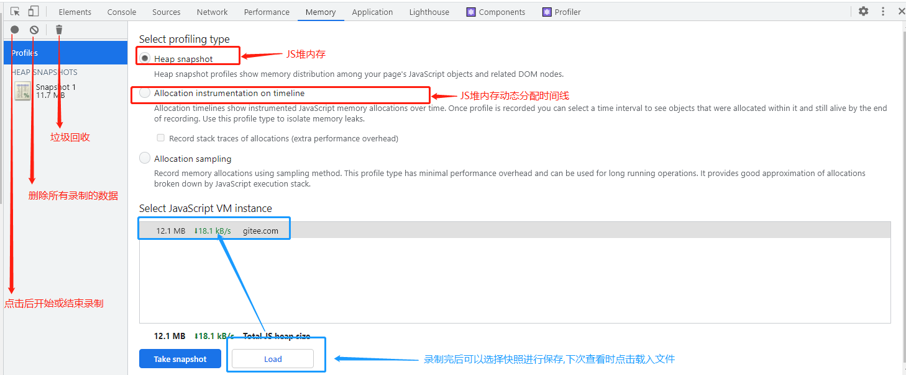
>
> **使用方式与注意点**:
>
> 1. 打开控制台上的Memory面板。
>
> 2. 选择堆快照类型。一般是使用前两种：`Heap snapshot(JS堆快照)`和`Allocation instrumentation on timeline(JS堆分配时间线)`。
> 3. 开始录制前先点击下`垃圾回收`-->点击开始录制。如果JS堆内存动态分配时间线，结束之前要再点击下垃圾回收，再结束录制

##### 1) `Heap snapshot`（JS堆快照）

###### ① ***Summary总览视图***

>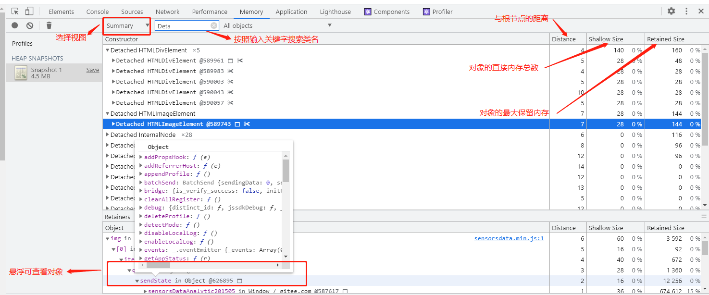
>
>- Constructor：构造函数，节点下的对象都是由改构造函数创建而来。
>- Distance：与根节点的距离。
>- Objects Count：对象个数及百分占比。
>- Shallow size：对象的直接内存总数，直接内存是指对象自身占用的内存大小。
>- Retained size：对象的最大保留内存，保留内存是指对象被删除后可以释放的那部分内存。
>
>点击展开构造函数，可以看到所有构造函数相关的对象实例，`@后面的数字是该对象实例的唯一标识符`。

###### ②  ***Comparasion对比视图***

>为了验证特定操作会不会引起内存泄露，对比快照的步骤如下：
>1、无任何操作，拍第一个堆快照
>2、执行你觉得可能造成内存泄露的操作，再执行相反操作
>3、拍第二个堆快照，切换到对照视图，并且指定与第一个堆快照对比
>
>比如你觉得登陆页面内存泄露，那可以先登陆到首页，拍第一个堆快照。然后退出到登陆界面，再重新登陆到首页，录制第二个快照。比对这两个快照的大小，如果增长有可能是泄露，可以反复操作几次。`记得每次录制之前要先点击垃圾回收`。
>
>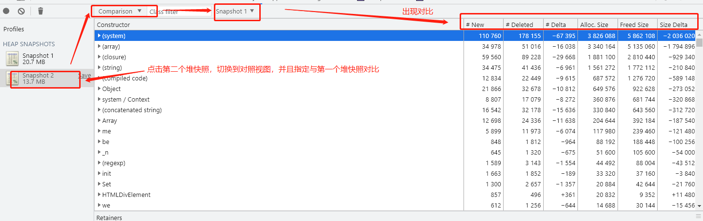

##### 2) ** `Allocation instrumentation on timeline` (JS堆分配时间线)**

> 通过`Allocation instrumentation on timeline`可以持续的记录堆分配的情况，显示了对象在什么时候被创建、什么时候存在内存泄漏等
>
>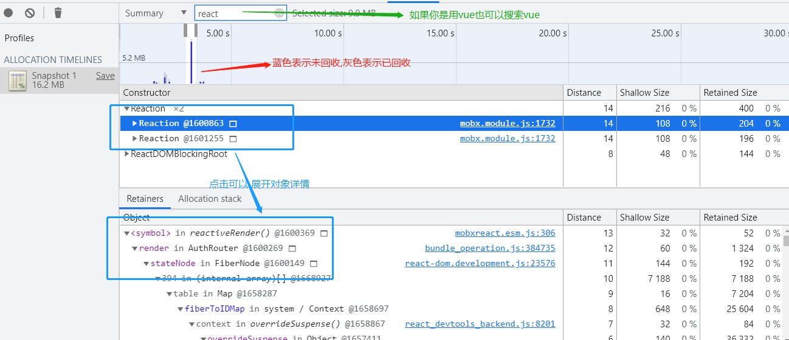
>
>上面的柱条表示堆中生成的新对象。高度表示这个对象的大小，颜色表示这个对象的内存释放情况：蓝色柱表示这个对象在timeline中生成，结束前仍然存在；灰色柱表示这个对象在timeline中生成，但结束前已经被回收了。
>我们可以重复执行某个动作，如果最后有不少蓝色柱被保留，这些蓝色柱就是潜在的内存泄露问题。
>如果左边的意料之外的蓝条，那么极有可能存在内存泄露。
>
>举个栗子:如果搜索Vue(同React)发现有三个VueComponent没有回收。点击展开查看详细信息。发现这三个组件的信息都是一样的，那就是组件没有释放。首先确认组件是否被销毁。如果已销毁，确认事件是否解绑、定时器是否取消，特别注意事件总线绑定的事件一定要解绑。--`当然,要是你页面上还在用肯定是不会释放的,要释放的是已经无用的资源`

##### 3) 补充知识点

>Ⅰ-*常见的顶层构造函数*
>
>>1. (global property)：全局对象和普通对象的中间对象，和常规思路不同。比如在Window上定义了一个Person对象，那么他们之间的关系就
>>2. [global] => (global property) => Person。之所以使用中间对象，是出于性能的考虑。
>>3. (closure)：使用函数闭包的对象。
>>4. (array, string, number, regexp)：一系列对象类型，其属性指向Array/String/Number/Regexp。
>>5. HTMLDivElement/HTMLAnchorElement/DocumentFragment：元素的引用或者代码引用的指定文档对象。
>
>Ⅱ-*黄色 or 红色标志*
>
>> 在查阅的资料中说:黄色的对象实例表示它被JS代码引用，红色的对象实例表示被黄色节点引用的游离节点
>>
>> 但是目前我的版本是没有显示的,估计是版本问题,先mark
>>
>> `所以JS堆快照可以用来发现DOM泄露`
>
>Ⅲ- *JS堆快照作用*
>
>>JS堆快照可以用来发现DOM泄露。在Class filter(类过滤器)文本框中输入Detached可以搜索分离的DOM树。如果分离节点被JS引用，有可能就是泄露点

### 7、Application 面板

>该面板主要是记录网站加载的所有资源信息，包括存储数据,面板主要分为以下几个
>
>1. `Application`:Manifest、Service Workers、Storage
>2. `Storage `:LocalStorage、Session Storage、IndexedDB、Web SQL(类似IndexedDB )、Cookies
>3. `Cache`: Cache Storage、Application Cache(已被上面的Service Workers替代)
>4. `BackGround Services`
>5. `Frames`

#### 1) Manifest

>- 在前端，有多个 manifest 相关的知识，比如 html5 manifest(已废弃)、PWA(Progressive Web App)的 manifest、Webpack 的 manifest(模块资源清单)。
>- Applicaation 面板中的是指 PWA 所需的 manifest.json 文件，其作用是用来告诉浏览器如何在用户的桌面上"安装"这个 app，及安后该展示的信息。
>- 在 Application 面板中，主要是展示其信息，不具有操作性质
>- 想了解更多的去这里看-->[添加 Web 应用清单](https://web.dev/add-manifest/)

#### 2) Service Workers

>Service Workers 是独立于当前页面的一段运行在浏览器后台进程里的脚本，由于运行在 worker 上下文，因此它不能访问 DOM，不过可以做一些简单的辅助性逻辑处理和离线缓存等。兼容性的话...除了 IE 都还行。
>
>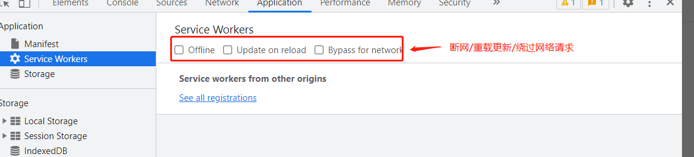

#### 3) Cache Storage

>Cache Storage 可以认为是 `sw(离线)缓存` 的资源列表(没用到,但是网上多个资料都是这么说的)。兼容的话，同 Service Workers.
>
>该图例来自知乎的[QAQ-YS](https://www.zhihu.com/people/qaq-ys)--(本人没找到合适的项目例子)
>
>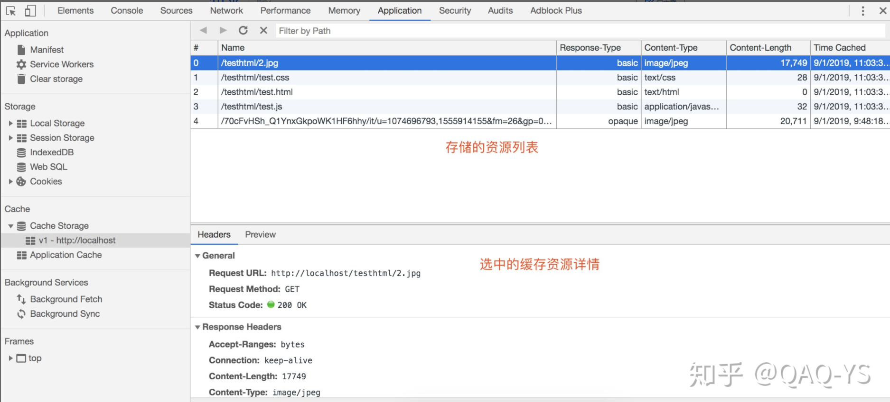

#### 4) Background Services

>Background Services 分 Background Fetch 和 Background Sync，前者用于生成在后台挂起的 fetch 资源任务，后者是生成在后台挂起执行的同步任务。兼容性的话...除了 Chrome 49+ 和 Edge 76+ 和 Opera 36+，其他都不行。
>
>该图例来自知乎的[QAQ-YS](https://www.zhihu.com/people/qaq-ys)--(本人没找到合适的项目例子)
>
>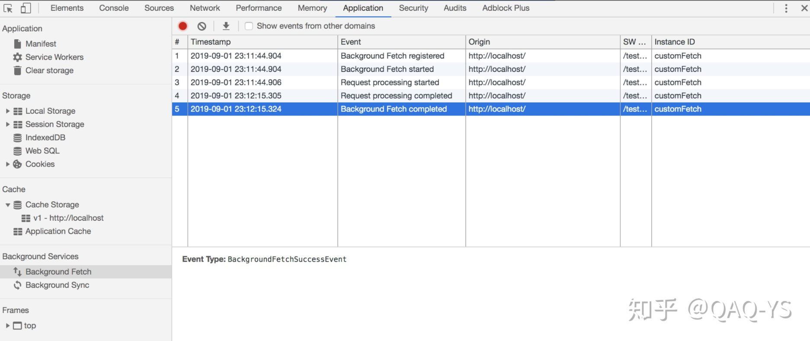
>
>列表的内容是`只读`的。图中可以看到，一次 fetch、sync 的各个阶段状态转变都会被记录

#### 5) storage

> 该面板主要用于展示当前浏览器存储信息的一个总览清除各种缓存(可自行勾选所需清理的内容)
>
> 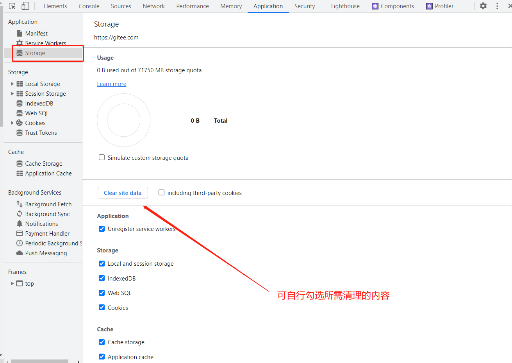
>
> 图中可以看到，可清理的有：
>
> - 卸载 services workers
> - Local storage 和 Session storage
> - IndexedDB 数据
> - Web SQL 数据
> - Cookies
> - Cache storage
> - Application Cache等

#### 6) `Local Storage` & `Seesion Storage`

>1. 他们两都属于 Web Storage，且兼容比较好。两者大致区别是：localStorage 的生命周期是需要人为干涉的，sessionStorage 的生命周期是一次会话窗口,且存储大小不相同
>
>2. Local Storage 面板和 Seesion Storage 面板显示的是浏览器的 localStorage/sessionStorage 键值对(KVP)数据(该数据大小在 2~5MB 之间，各浏览器，各平台不同)，在这个面板中。你可以执行查看值、双击空行新增 KVP、双击 KVP 对齐进行修改、删除 KVP 等操作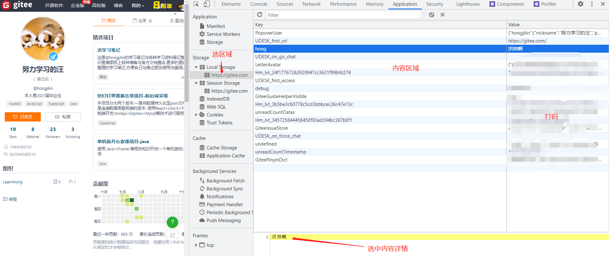
>3. 常见代码中存取操作
>
>```js
>localStorage.setItem('hong', '洪帅啊') //存
>localStorage.getItem('hong')	//取
>```
>
>4. 注意:数据在存取的时候都得是`string`类型。

#### 7) IndexedDB

>IndexDB 是浏览器端提供的本地存储键值对的数据库，建立在事务数据库模型上(所做的操作都发生在创建的事务对象上下文)，其 api 大多都是异步的。
>
>在 IndexedDB 面板，可以查看、删除 IndexedDB 内的数据(`注意:不可以修改`)。

#### 8) Cookies

>- 1. 常用作用户信息token校验
>
>- 2. Cookies 面板查看、新增(仅限)、修改、删除 http cookies。
>
>- 3. 当前的 cookies 值是可以通过 js 代码获取和修改的，也可以直接修改。如果不希望 js 可以操控该条 cookies，则需要在 Set-Cookies 时加上`httpOnly`字段。
>
>  

#### 9) Frames

>该面板显示了该网站所有内容资源。效果如图
>
>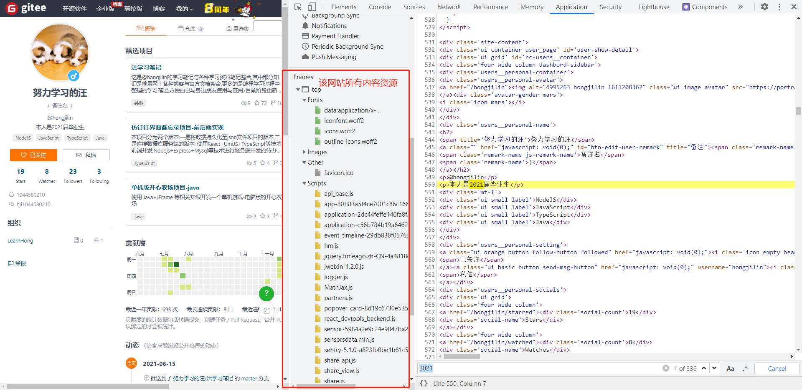
>
>`注意`:iframe 的内容不能预览，如果页面带`x-frame-options=SAMEORIGIN`，则其他域名网站就无法嵌入了。

### 8、security 面板

>HTTPS为您的网站提供关键安全和数据完整以及用户的隐私数据信息。使用Chrome DevTools中的Security(安全)面板可以调试安全隐患,并确保您已在网站上正确实施HTTPS。
>
>- 使用Security中的Overview(概述)立即查明当前页面是否安全。
>- 检查单个origins来查看连接和证书详细信息（对于Secure Origins）或者确定哪些请求是不受保护的（对于Non-Secure Origins）。

#### 1) **Security Overview (安全概述)**

>要查看页面整体的安全性，打开DevTools并转到Security面板。
>
>你看到的第一件事是Security Overview(安全概述)。一目了然,会显示是否安全(示例中为安全的)
>
> 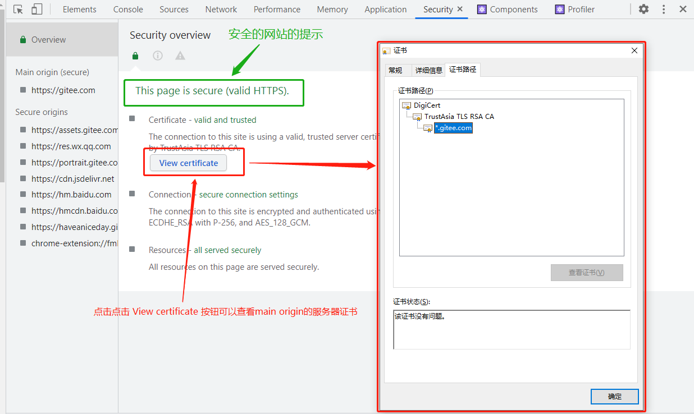

##### ① *安全的源*

>Security Overview(安全概述)会告诉您的页面是否安全。安全的页面会显示信息：`This page is secure (valid HTTPS)`.点击 View certificate 按钮可以查看[main origin](https://en.wikipedia.org/wiki/Same-origin_policy)的服务器证书
>
>

##### ② *不安全的源*

>不安全的网页会显示信息： This page is not secure.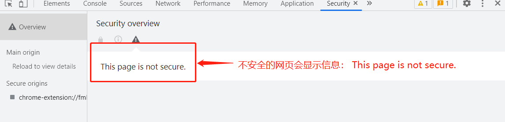
>
>1. Security面板识别两种类型的不安全网页
>
>     - 如果请求的页面通过HTTP提供，那么main origin被标记为不安全
>     - 如果通过HTTPS检索所请求的页面，但该页面后续使用HTTP从其他源检索内容，那么该页面仍被标记为不安全。 这种页面被称为[混合内容](https://developers.google.com/web/fundamentals/security/prevent-mixed-content/what-is-mixed-content)页面。混合内容页面仅部分内容受保护，因为HTTP内容可以被嗅探器访问并且容易受到中间人攻击
>
>2. 如何调试不安全页面?
>
>   - 点击View request in Network Panel(在网络面板中单击查看请求)可以打开 Network(网络)面板的过滤视图,并准确地查看通过HTTP协议提供的请求。这里显示所有来自未受保护的源的所有请求。
>
>     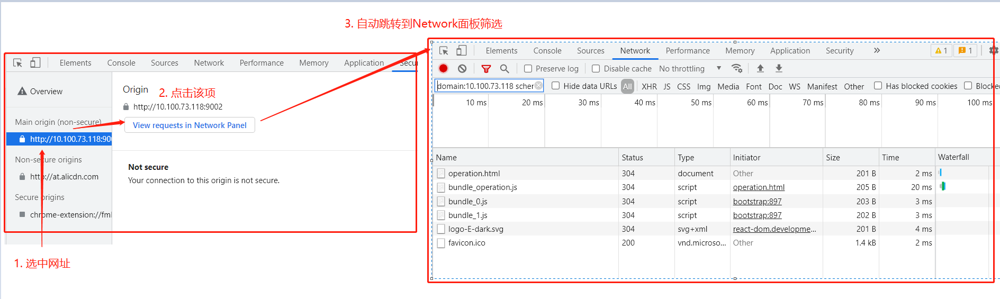
>
>   

#### 2) 检查源

>使用左侧面板可以检查单个安全或不安全的源。
>
>1. 单击安全源以查看该源的连接和证书详细信息。 -->看示例图 [点我跳转](#① *安全的源*)
>2. 如果您点击不安全的源，Security(安全)面板会显示一个链接到Network（网络）面板的过滤视图的链接。点击这个链接可以查看来自该源的所有通过HTTP协议提供的请求。  -->看示例图 [点我跳转](#② *不安全的源*)

### 9、Lighthouse(Audits) 审计面板

>- 上面的Performance可以给我们提供非常多的信息，但它不够直观，需要开发者透过表面的这些参数去分析背后的性能问题。有了这个需求之后，另一个性能优化工具就出现了，它就是`LightHouse`。
>
>- LightHouse 是 Google 开源的一个自动化工具，用于改进网络应用的质量。你可以将其作为一个 Chrome 扩展程序运行，或从命令行运行。 当为 Lighthouse 提供一个要审查的网址，它将针对此页面运行一连串的测试，然后生成一个有关页面性能的报告。可以参考失败的测试，看看可以采取哪些措施来改进应用
>
>- `Audits`就是LightHouse的其中一种运行方式
>
>- Audits主要从5个方面来给网页打分，最终会生成一个report
>
>  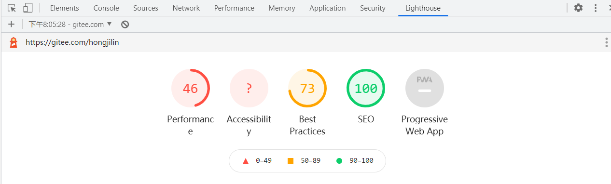

#### 1) Performance 性能

##### ① *Metrics 指标*

>网页性能，这个不用多说，网页加载慢一秒，可能对应的就是多少客户的流失，所以大家都懂的
>
>在这里强烈推荐大家点击每个指标后面的**`Learn More`**，来查看详细的指标介绍
>
>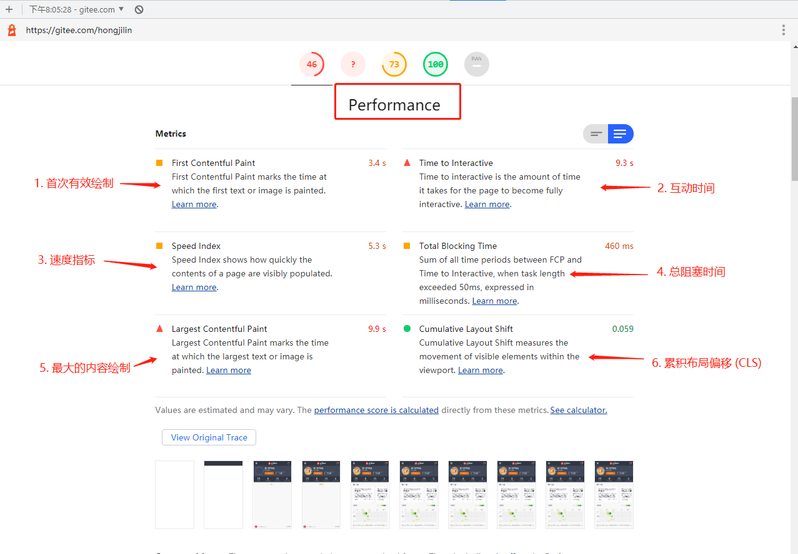
>
>1. 首次有效绘制:
>
>   > **可以简单理解为用户看到网页主要内容的时间，“首次有效绘制”分数越低，页面显示其主要内容的速度就越快**
>   >
>   > [Learn more](https://web.dev/first-contentful-paint/?utm_source=lighthouse&utm_medium=devtools)
>
>2. 互动时间
>
>   >交互时间 (`TTI`) 是一个很重要的指标,因为某些站点以交互性为代价来优化内容可见性。这可能会造成令人沮丧的用户体验：该站点似乎已准备就绪，但当用户尝试与之交互时，却什么也没有发生
>   >
>   >衡量一个页面需要多长时间才能*完全*交互。在以下情况下，页面被认为是完全交互的：
>   >
>   >- 页面显示有用的内容，这是由[First Contentful Paint](https://web.dev/first-contentful-paint)衡量的，
>   >- 为大多数可见的页面元素注册了事件处理程序，并且
>   >- 该页面在 50 毫秒内响应用户交互。
>   >
>   >[Learn more](https://web.dev/interactive/?utm_source=lighthouse&utm_medium=devtools)
>
>3. 速度指标
>
>   >速度指标是一个页面加载性能指标，向您展示明显填充页面内容的速度。 此指标的分数越低越好。
>   >
>   >[Learn more](https://web.dev/speed-index/?utm_source=lighthouse&utm_medium=devtools)
>
>4. 总阻塞时间
>
>   >TBT 衡量页面被阻止响应用户输入（例如鼠标点击、屏幕点击或键盘按下）的总时间。总和是通过在[First Contentful Paint](https://web.dev/first-contentful-paint/)和[Time to Interactive](https://web.dev/interactive/)之间添加所有[长任务](https://web.dev/long-tasks-devtools)的*阻塞部分*来计算的。任何执行时间超过 50 毫秒的任务都是长任务。50 毫秒后的时间量是阻塞部分。例如，如果 Lighthouse 检测到一个 70 毫秒长的任务，则阻塞部分将为 20 毫秒。
>   >
>   >[Learn more](https://web.dev/lighthouse-total-blocking-time/?utm_source=lighthouse&utm_medium=devtools)
>
>5. 最大的内容绘制
>
>   >LCP 测量视口中最大的内容元素何时呈现到屏幕上。这大约是页面的主要内容对用户可见的时间。有关如何确定 LCP 的更多详细信息，请参阅[定义的最大内容绘制](https://web.dev/largest-contentful-paint/#largest-contentful-paint-defined)。
>   >
>   >[Learn more](https://web.dev/lighthouse-largest-contentful-paint/?utm_source=lighthouse&utm_medium=devtools)
>
>6. 累积布局偏移 (CLS)
>
>   >当页面上的某些内容突然发生变化时，您是否曾经在线阅读过一篇文章？在没有警告的情况下，文本移动了，你就失去了位置。或者更糟糕的是：您正要点击一个链接或一个按钮，但在您的手指落地之前的瞬间——BOOM——链接移动，你最终点击了其他东西！
>   >
>   >页面内容的意外移动通常是因为资源是异步加载的，或者 DOM 元素被动态添加到现有内容上方的页面中。罪魁祸首可能是尺寸未知的图像或视频、呈现的字体大于或小于其后备，或者是动态调整自身大小的第三方广告或小部件。
>   >
>   >[Learn more](https://web.dev/cls/?utm_source=lighthouse&utm_medium=devtools)

##### ② *Opportunities 可优化项*

>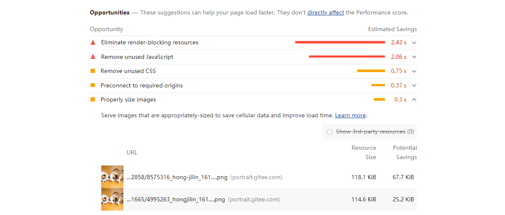
>
> 
>
>这项里面的内容指的是LightHouse发现的一些可以直接优化的点，你可以对应这些点来进行优化，比如本例中：
>
>- 未用到的Css ：发现了一些没有用到的css，浪费了带宽，同时有可能延缓了首屏加载时间。浏览器必须先处理当前网页的所有样式和布局信息，然后才能呈现内容。因此，浏览器会阻止呈现网页内容，直到外部样式表已下载完毕并处理完毕（这可能需要进行多次往返，因而可能会导致首次呈现时间延迟）
>- 去除阻塞渲染的样式、脚本等：Lighthouse 列出了其检测到的所有阻塞渲染的链接或脚本。 我们应该去减少这些链接或脚本的数量。
>- 合理压缩图片：对于实际展示区较小的图片，我们应该避免使用原图，而使用缩略图等，同时考虑使用压缩率较高的图片格式。

##### ③ *Diagnostics (手动诊断项目)*

>这些项目表示LightHouse并不能替你决定当前是好是坏，但是把详情列出来，由你手动排查每个项目的情况: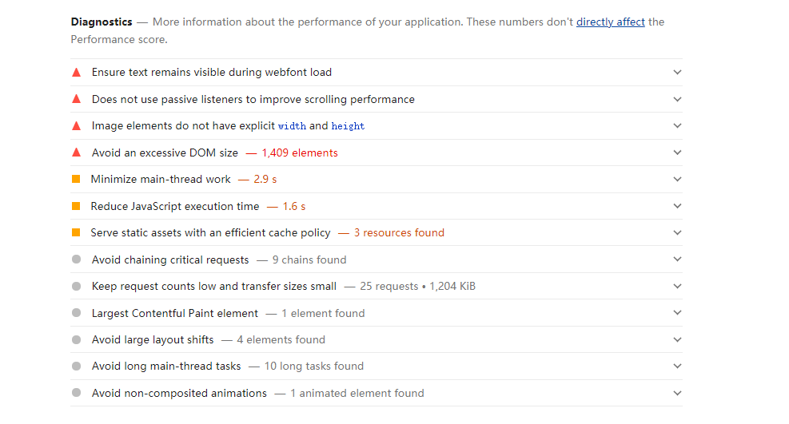
>
>就如同截图中所说:
>
>- Does not use passive listeners to improve scrolling performance :不使用被动侦听器提高滚动性能
>- image elements do not have explicit width and height:图片元素没有显式宽度和高度。
>- Image elements do not have explicit:图像元素没有显示
>- 其他略,自己选择优化项

##### ④ *通过的审查项目*

>顾名思义这里列出的都是你做的好的地方
>
>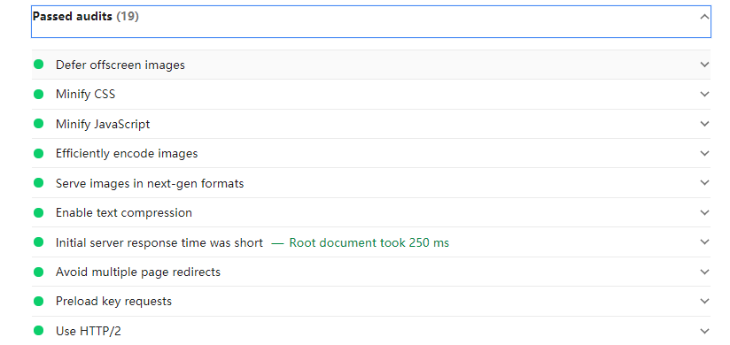

#### 2) Accessibility辅助功能

>辅助功能指的是那些可能超出“典型”用户范围之外的用户的体验，他们以不同于你期望的方式访问你的网页或进行交互
>
>辅助功能类别测试屏幕阅读器的能力和其他辅助技术是否能在页面中正常工作。例如：按元素来使用属性，ARIA属性的最佳实践，可辨别的元素命名等等。

#### 3) Best Practice 最佳实践

>本项指标是指LightHouse用业界公认的几项最佳实践来评估站点，然后看你有几项没有做到，几项做到了
>
>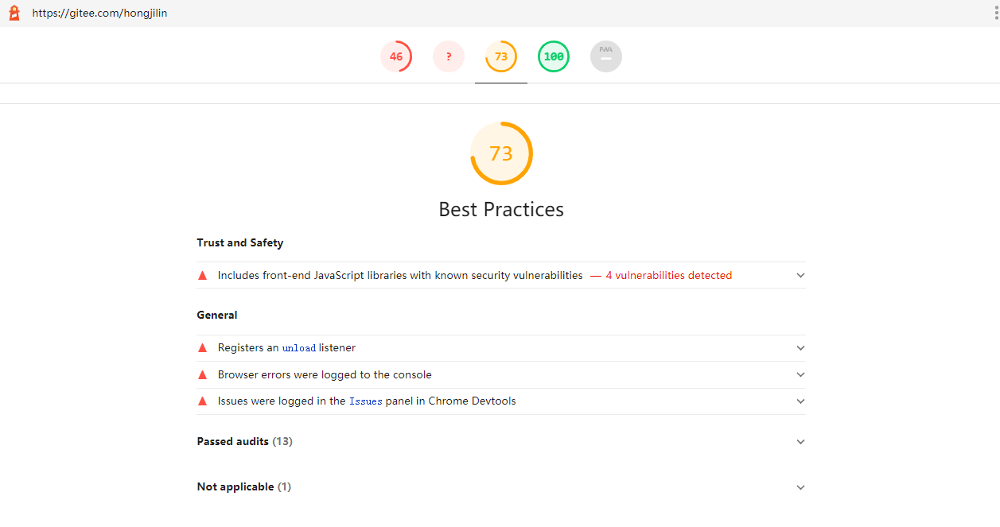

#### 4) SEO 搜索引擎优化

>检查目的很明确，就是优化搜索引擎索引,这里`gitee`是做的真好
>
>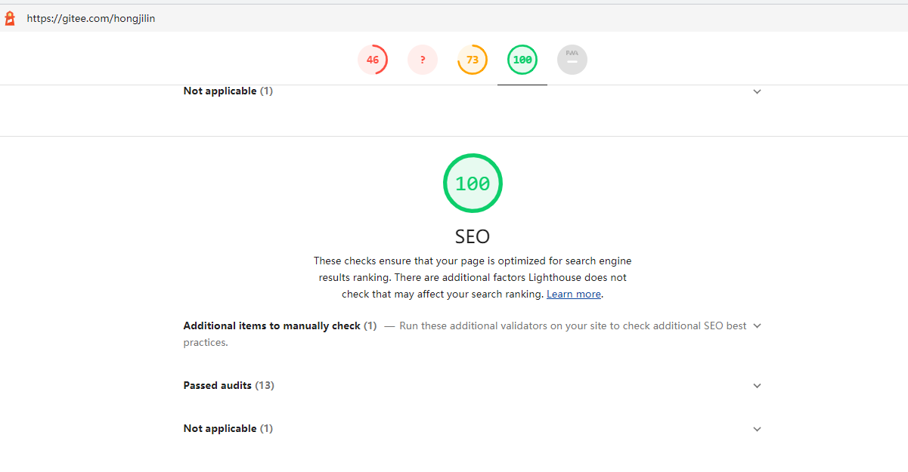

#### 5) PWA

>这一项很容易理解，其实就是检查网页对于PWA的兼容性,想详细了解的点进去里面的`showmore`了解详情,此处不详解
>
>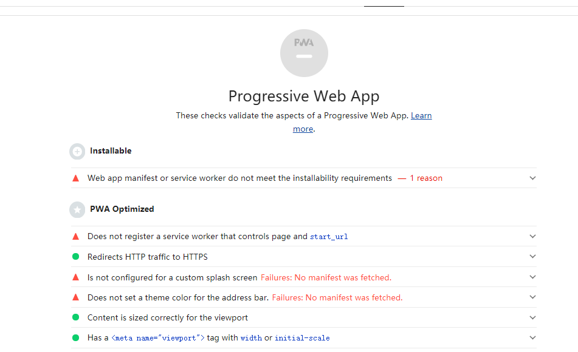 

------


## 二、Chrome内存泄漏分析工具

>内存分析使用的工具包括chrome任务管理器、chrome时间轴（低版本是Timeline，高版本对应performance）、chrome memory（低版本是chrome profiles，主要用JS堆快照、JS堆动态分配时间轴）。
>
>1. 使用Chrome任务管理器，了解网页使用的内存量。
>2. 使用时间轴(`Performance面板`)记录可视化内存使用。 -->[`点我跳转`](#5、Performance(Timeline) 面板)
>3. 使用堆快照(`Memory面板`)标识分离的DOM树（内存泄漏的常见原因）。 -->[`点我跳转`](#6、Memory(Profiles) 面板)
>4. 通过堆动态分配时间轴(`Memory面板`)记录了解在JS堆中分配及回收情况。  -->[`点我跳转`](#6、Memory(Profiles) 面板)

### 1、**chrome任务管理器**

>1. 按Shift + Esc打开任务管理器。或点击右上角菜单--更多工具---任务管理器。
>
>2. 主要关注`内存占用空间`、`Javascript使用的内存`。Javascript使用的内存默认不显示，可以点击右键添加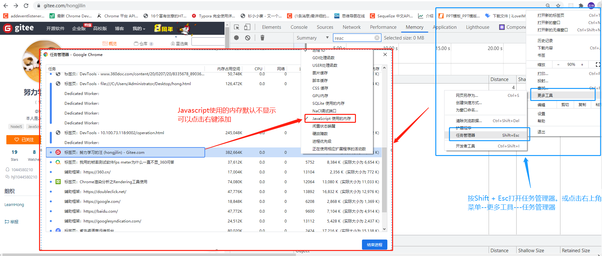
>
>3. 这两列是在用不同角度来告诉你，网页的内存使用情况︰
>
>   - 内存占用空间表示本机内存。DOM节点存储在本机内存中。如果这个值在增加，则说明正在创建DOM节点。
>   - JavaScript 使用的内存列 表示JS堆。这一列包含两个值。关注实际使用大小即可（括号中的数字）。跳动的数字表示您网页上的可获得的对象正在使用多少内存。如果这个数字在增加，那说明正在创建新对象，或现有对象正在增长。
>
>   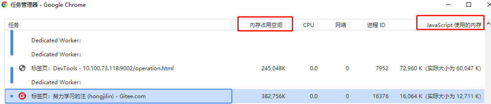 
>
>4. 如何判断?
>
>   - 如果内存占用空间一直在增长但JS内存不增长
>
>     > 可能是浏览器还没有回收，不操作闲置一段时间看下是否会下降。遇到几种情况内存一直不释放（控制台关闭状态下放置三个小时左右），不确定是回收慢，还是浏览器本身存在内存泄露（测试了45、68、69版本）--([测试结果来自杭电茶娃的chrome内存泄露相关博客](https://blog.csdn.net/c11073138))：
>     >
>     > 含密码框（三个版本都有问题）
>     > 含输入框，且用户手动输入过值（三个版本都有问题）
>     > 含按钮，且用户手动点击过（只有68有问题）   
>
>   - 如果是内存占用空间在增长，但JS内存增长得很缓慢
>
>     >有可能是有JS变量引用了DOM，这个DOM节点本身不大，但影响了其他DOM节点(比如父级节点树)。

### 2、其他

>其他三个方法在上方`Performance面板`、`Memory面板`均有指出,不再赘述
>
>>1. 使用时间轴(`Performance面板`)记录可视化内存使用。 -->[`点我跳转`](#5、Performance(Timeline) 面板)
>>2. 使用堆快照(`Memory面板`)标识分离的DOM树（内存泄漏的常见原因）。 -->[`点我跳转`](#6、Memory(Profiles) 面板)
>>3. 通过堆动态分配时间轴(`Memory面板`)记录了解在JS堆中分配及回收情况。  -->[`点我跳转`](#6、Memory(Profiles) 面板)

------


## 三、前端调试技巧

>编写代码其实只是开发者的一小部分工作。为了让工作更有效率，我们还必须精通 debug。我发现，花一些时间学习新的调试技巧，往往能让我能更快地完成工作，对我的团队做出更大的贡献  -->我也是因为想学调试,结果找不到很全的博客,却找了这么几十篇资料全学了然后整理,只为了学这个调试啊啊啊啊啊啊
>
>前端调试中最少你要看前面九大面板中的 JS调试:[`Console 面板`](#2、Console 面板)、[`Sources 面板`](#3、Sources 面板);网络调试: [`Network 面板`](#4、Network 面板); 样式调试: [`Elements 面板`](#1、Elements 面板);  至于性能调优:哥,都到能调优的水准了,那不得都会啊? --> [`九大功能模块面板详解`](#一、九大功能模块面板详解)
>
>查阅参考的资料:[Debugging Tips and Tricks](https://css-tricks.com/debugging-tips-tricks/)、腾讯云中腾讯技术工程官方号的[大型前端项目的断点调试共享化和复用化实践](https://cloud.tencent.com/developer/article/1711214?from=article.detail.1471757)

### 1、主要概念

#### Ⅰ- 隔离问题

>隔离问题大概是 debug 中最重要的核心概念。我们的代码库是由不同的类库、框架组成的，它们有着许多的贡献者，甚至还有一些不再参与项目的人，因此我们的代码库是杂乱无章的。隔离问题可以帮助我们逐步剥离与问题无关的部分以便我们可以把注意力放在解决方案上。
>
>例如我们古老，好用的 `console.log` 是就是一种隔离的方法,至于为何请看下方详解

##### 1)  隔离问题的好处

>隔离问题的好处包括但不限于以下几条：
>
>- 能够弄清楚问题的根本原因是否是我们想的那样，还是存在其它的冲突。
>- 对于时序任务，能判断是否存在时序紊乱。
>- 严格审查我们的代码是否还能够更加精简，这样既能帮助我们写代码也能帮助我们维护代码。
>- 解开纠缠在一起的代码，以观察到底是只有一个问题还是存在更多的问题。
>- 让BUG更容易复现查到问题所在

##### 2) 对问题进行隔离的方法

###### ① 在代码中写入*`debugger`*

>- 你可以在你代码中写上 `debugger;`，这样你可以看到当时这一小块代码做了什么
>- 你还可以在 Chrome 开发者工具中进一步进行调试，单步跟踪事件的发生。你也可以用它选择性地观察指定的事件监听器。-->[详情看前面九大功能面板中的Sources](#Ⅰ- Sources 面板图解)

###### ②  `console.log`

>建议看上面[`Console 面板`](#2、Console 面板)
>
>古老，好用的 `console.log` 是另一种隔离的方法。（nodejs中也是`console`,java 中是 `printf`...）。你可以一小片一小片地执行代码并对你的假设进行测试，或者检查看有什么东西发生了变化。这可能是最耗费时间的测试方式了。但是无论你的水平如何高，你还是得乖乖用它。ES6 的箭头函数也可以加速我们的 debug 游戏，它让我们可以在控制台中更方便地写单行代码。
>
>`console.table` 函数也是我最喜欢的工具之一。当你有大量的数据（例如很长的数组、巨大的对象等等）需要展示的时候，它特别有用。
>
>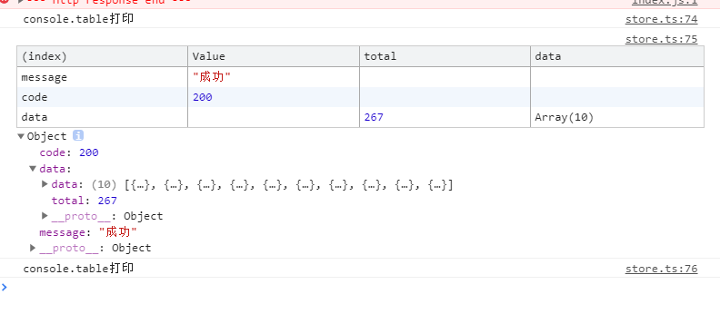 
>
>`console.dir` 函数也是个不错的选择。它可以把一个对象的属性以可交互的形式展示出来。
>
>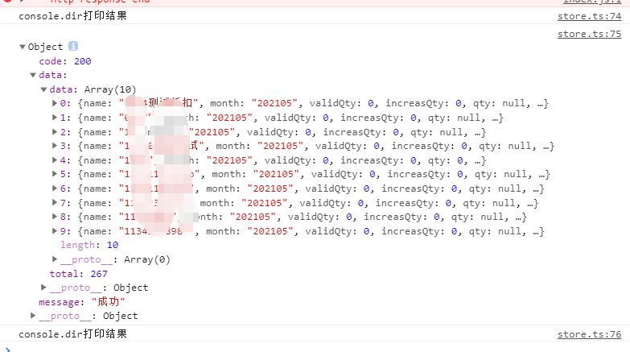 

#### Ⅱ- 保持条理清晰

>1. 编写(或改写)代码时如果一次性改动大量代码后再去调试---然后出了某些问题，我们不知道到底是改的哪一部分导致了问题的出现。接着为了 debug，我们又一次改很多代码，`最后迷失在寻找哪里能正常运行、哪里不能正常运行中`(如果你没有用分支工具,相信我,你此时最大的奢求就是能复原到修改前的样子)
>2. 其实我们或多或少都在这么做。当我们对一个工具越来越熟练时，我们会在没有对设想的情况进行测试的情况下写越来越多的代码。但是当你刚开始用一个语法或技术时，你需要放慢速度并且非常谨慎。你将能越来越快地处理自己无意间造成的错误。其实，当你弄出了一个问题的时候，一次调试一个问题可能会看起来慢一些，但其实要找出哪里发生了变化以及问题的所在是没法快速解决的。我说以上这些话是想告诉你：`欲速则不达`(特别是前端要有耐心)。
>3. **你还记得小时候父母告诉你的话吗？“如果你迷路了，待在原地别动(很有道理!!)“** 至少我的父母这么说了。这么说的原因是如果他们在到处找我，而我也在到处跑着找他们的话，我们将更难碰到一起。代码也是这样的。你每次动的代码越少就越好，你返回一致的结果越多，就越容易找到问题所在。所以当你在调试时，请尽量不要安装任何东西或者添加新的依赖。`如果本应该返回一个静态结果的地方每次都出现不同的错误`，你就得特别注意了！

### 2、辅助工具

>人们开发了无数的工具用于解决各种各样的问题。下面部分会放我接触到的觉得可的工具,此部分可能是慢慢补充的那种

#### Ⅰ- [React DevTools](https://chrome.google.com/webstore/detail/react-developer-tools/fmkadmapgofadopljbjfkapdkoienihi) 

>如果你工作中使用 React，[React DevTools](https://chrome.google.com/webstore/detail/react-developer-tools/fmkadmapgofadopljbjfkapdkoienihi) 是你必不可少的工具，你可以通过它观察虚拟 DOM。

#### Ⅱ- [Vue DevTools](https://chrome.google.com/webstore/detail/vuejs-devtools/nhdogjmejiglipccpnnnanhbledajbpd)

>当你使用 Vue 时，同上。

#### Ⅲ- 开发者工具

> 这就不必说了,把上面整理的笔记看完就差不多了


### 3、各种调试小技巧

>这是我看他人博客(如[Debugging Tips and Tricks](https://css-tricks.com/debugging-tips-tricks/))觉得好的就摘录下来或者自己觉得OK的分享出来

#### Ⅰ- 调试css

>[@sarah_edo](https://twitter.com/sarah_edo)：对于 CSS，我通常会给有问题的元素加上一个 .debug 的 class，这个 class 定义了红色的 border。
>
>— Jeremy Wagner (@malchata) [2017年3月15日](https://twitter.com/malchata/status/842029469246324736)

#### Ⅱ- 检测 React 的 State

>[@sarah_edo](https://twitter.com/sarah_edo)：
>
>```js
>{JSON.stringify(this.state, null, 2)}
>```
>
>— MICHAEL JACKSON (@mjackson) [2017年3月15日](https://twitter.com/mjackson/status/842041642760646657)

#### Ⅲ- 动画

>[@sarah_edo](https://twitter.com/sarah_edo)[@Real_CSS_Tricks](https://twitter.com/Real_CSS_Tricks)： 会在调试时减慢动画速度：
>
>```css
> { animation-duration: 10s !important; }
>```
>
>— Thomas Fuchs (@thomasfuchs) [2017年3月15日](https://twitter.com/thomasfuchs/status/842029720820695040)

#### Ⅳ- 设置定时 Debugger

>这一条是 Chris 提供的。详情-->[点我传送](https://css-tricks.com/set-timed-debugger-web-inspect-hard-grab-elements/)
>
>```css
>setTimeout(function() {
>  debugger;
>}, 3000);
>```
>
>它与我之前提到的 `debugger;` 工具很类似，不过你可以把它放在 setTimeout 函数中，得到更多详细的信息。
>
>此方法可以用在很多地方而不仅仅是调试样式,包括js都可以
>
>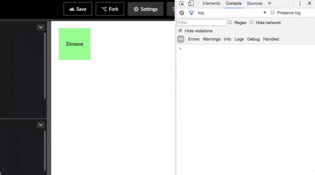 
>
>`ps`:该动图来自[Chris Coyier的Set a Timed Debugger To Web Inspect Hard-To-Grab Elements文章中](https://css-tricks.com/set-timed-debugger-web-inspect-hard-grab-elements/) 


### 4、打断点的几种方式

#### Ⅰ- 使用Sources面板打断点

>这种方式是比较常用的方式，在浏览器开发工具找到对应源码，在script脚本节点里面的代码行断点
>
>具体打断点方法在此部分有详细叙述,便不赘述  --> [点我传送](#Ⅲ- 中间代码展示面板详解)

#### Ⅱ- 在需要调试的地方加debugger关键字

>- 这种方式很粗暴，在需要调试的地方加debugger关键字，代码运行到的时候会自动停下，进入调试模式。
>- 此方法不需要手动断点，但是麻烦的是可能你调试一次就不用再调试了，但是每次运行到那里都会停下，必须移除这个代码才行。
>- 这玩意我在不少网站也见到有人用，不想让人家方便的查看到网站源码，一打开控制台就自动debugger。

### 5、大型前端项目的断点调试共享化和复用化实践

>发现的一篇很好的文章,是腾讯工程师enoyao写的.此处直接给出链接  -->[点我传送](https://cloud.tencent.com/developer/article/1711214?from=article.detail.1471757)
>
>下面给出文章简述:
>
>随着我们项目越来越大，我们有可能需要维护很多的模块，我们腾讯文档 Excel 项目大模块有 10 几个，而每个大模块分别有 N 个小模块，每个大模块下的小模块都有主要的负责人在跟进模块问题。这就会导致一个很大的问题是，模块负责人大部分情况只会关注自己模块的问题，而不甚了解其他负责人手上模块的具体问题。
>
>然后博主针对此问题进行了方案的提出与总结

------


## 四、常用操作及快捷键

### 1、打开 Chrome DevTools

>1. 鼠标点击
>
>- 选择右上角Chome 菜单，然后选择更多工具 -> 开发者工具
>- 右键，选择检查/审查元素
>
>2. 当然，比较推荐利用快捷键来打开：
>
>- `Ctrl + Shift + I, F12 / Cmd + Opt + I`，打开 DevTools
>- `Ctrl + Shift + J / Cmd + Opt + J`，打开 DevTools，并且定位到控制台面板
>
>3. 上面两种方式不仅可以打开 DevTools，还可以关闭 DevTools。当然，还有一种方式可以打开 DevTools。
>
>- `Ctrl + Shift + C / Cmd + Opt + C`，打开 DevTools，并且开启审查元素模式（相当于点击了 DevTools 左上角的图标： )

### 2、刷新页面与强制刷新

>- `F5, Ctrl + R / Cmd + R`，刷新页面
>- `Ctrl + F5, Ctrl + Shift + R / Cmd + Shift + R`，刷新页面并忽略缓存

### 3、缩放DevTools

>- `Ctrl + '+' / Cmd + Shift + '+'`，放大 DevTools
>- `Ctrl + '-' / Cmd + Shift + '-'`，缩小 DevTools
>- `Ctrl + 0 / Cmd + 0`，DevTools 恢复大小

### 4、切换设备

>`Ctrl+Shift+M`切换设备 或者直接点击机身图标
>
>具体操作如下:
>

### 5、禁用缓存

>1. 应用场景:如有时要多次查看第一次进入该网页时加载的资源时会用到,防止有的数据走缓存导致下次刷新查看不到
>2. 操作:切换到“Network”网络面板,勾选“Disable cache”项
>
>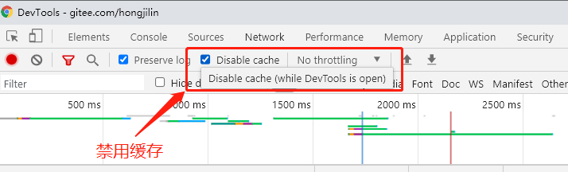

### 6、手动清理网站缓存

>1. 应用场景:此操作能清空Cookies、WebSQL、Service Workers、Cache Storage、IndexedDB、Local Storage、Application Cache
>
>2. 操作:
>
>   1) 按 command + shift + p （windows 按 Ctrl + shift + p），弹出命令输入框
>
>   2) 输入 “clear site data” 敲回车
>
>3. 效果图
>
>   

### 7、强制设置元素的状态

>1. 应用场景:当我要看如点击状态下的某个元素的样式,可以勾选点击状态,那么页面上该元素就会呈现此状态下的样式
>
>2. 操作:
>
>   1) 选中元素
>
>   2) 点击Style面板下的`:hov`按钮
>
>   3) 勾选要设置的状态,那么页面该元素就会呈现该选中状态下的样式
>
>

### 8、查找某元素绑定的事件

>1. 应用场景举例:当你想要查找某个元素绑定的点击事件,就可以通过该方法直接定位到代码中
>
>2. 操作:
>
>   1) 切换 “Elements" 元素面板,点击文档节点
>
>   2) 选择 “Event Listeners” 页签
>
>   3) 展开相应的事件名,如“click”
>
>   4) 对 “handler” 点击右键,选择 “Show funciton definition”
>
>   5) 点击后就会自动定位
>
>3. 示例图
>
>   

### 9、打开某个资源文件及定位源代码行数

>1. 打开某个资源文件
>
>   1) 按 command p (windows 按 Ctrl p),弹出文件搜索框,输入文件名回车即可定位
>
>   2) 效果图
>
>2. 快速定位源代码行数
>
>   1) 按 command p (windows 按 Ctrl p),弹出文件搜索框
>
>   2) 输入 :行数,如 “:480”,回车即可
>
>   3) 效果图: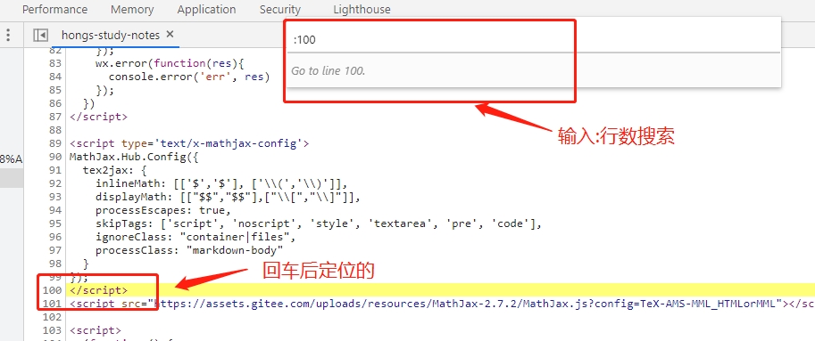

### 10、格式化代码

>1. 应用场景:当你打开的源码是压缩过或者格式很乱的,影响阅读时可以使用
>2. 操作:点击已打开文件的`左下角花括号`
>3. 效果图:

### 11、查找加载图片的代码-(其他资源同理)

>1. 应用场景:当你要查找加载图片(其他资源)的代码时
>
>2. 操作
>
>   - 切换 “`Network`” 网络面板,选中`Img`
>
>   - 点击 “Initiator” 列下的文件名即会跳转至代码处
>
>3. 效果图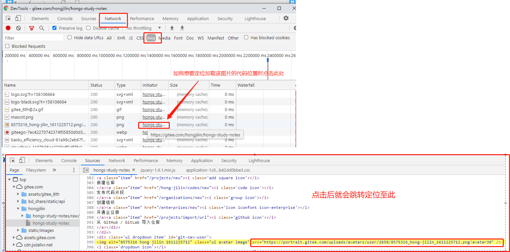

### 12、全局查询请求头和响应体

>1. 应用场景:
>
>2. 操作:
>
>   - 切换 “Network” 页签
>
>   - 点击左上角的“放大镜”按钮
>
>   - 在弹出的搜索框中输入要查询的内容,敲回车键
>
>   - 选择想要查看的请求点击,就能查阅其请求头与响应体
>
>3. 效果图
>
>   
>
>

### 13、切换网络模式及限制网速

>1. 应用场景:当你想要测试`无网络`、`快速的3G`、`卡顿的3G`、`限速的网络`环境时自己软件的表现时
>
>2. 切换网络模式操作:
>
>   - 切换 Network 网络面板,点击 “ online ” 下拉面板,选择想要的模式
>
>   - 效果图
>
>   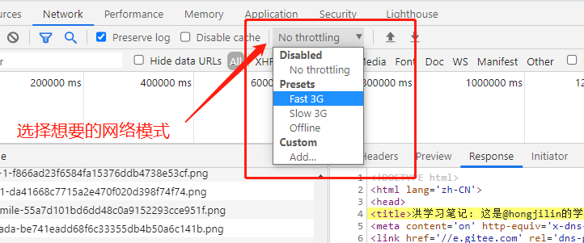
>
>3. 限制网速操作:
>
>   - 切换 Network 网络面板 点击 “ online ” 下拉面板 选择 “ add.. ” 选项
>
>   - 点击 “ Add custom profile… ” 按钮 依次输入“Profile Name”、“Download”、“Upload”等输入项设置网速,再点击 “Add” 按钮
>
>   - 回到 Network 网络面板切换所新增的网络模式
>
>   - 效果图:第一步操作同上切换网络操作
>
>   

### 14、在Console控制台查找DOM及多行输入

> 1. 在Console控制台查找DOM:
>
>    切换到Console控制台面板 输入:`document.querySelector("#id")`或`documen.querySelector("className")`敲回车键,很简单就不演示了
>
> 2. 在控制台中输入多行代码
>
>    输入时,按住Shift键敲回车即可换行

### 15、将DOM、打印结果、处理函数等存成全局变量在 console 面板使用

> 很多地方的右键上下文菜单上有这个`Store as global variable`这个选项--作用是`在 console 面板存成全局变量`,因为对象的引用类型,修改这个全局变量,`其实就是改变原对象的值`,很强大。
>
> 注:刷新后保存的变量会重置

#### Ⅰ-将DOM变成全局变量

>1. 应用场景:当你想从控制台进行对DOM节点的操作时,也可以变相等同于进行了一步`let temp2=document.querySelector("#id")`操作
>
>2. 操作:
>
>   - devtools的Elements面板中选中要操作的DOM节点
>
>   - 右键选择`Store object as global variable`,就会自动保存成全局变量
>
>   - 可以如同js般对其进行操作
>
>3. 示例图:
>
>   

#### Ⅱ-打断点时候的任意一个局部变量

>1. 应用场景:当你需要保留观察或者进行操作调试过程中某个时期的变量时
>
>2. 操作:
>
>  - 在代码中写`debugger`或者在控制台代码出打上断点,运行
>
>  - 选中任意想要保存的局部变量,右键存储即可
>
>3. 示例图
>
>  

#### Ⅲ-消息的响应体预览界面

>1. 应用场景:通常就是保留下某些请求变量用作对比罢了,方便开发
>
>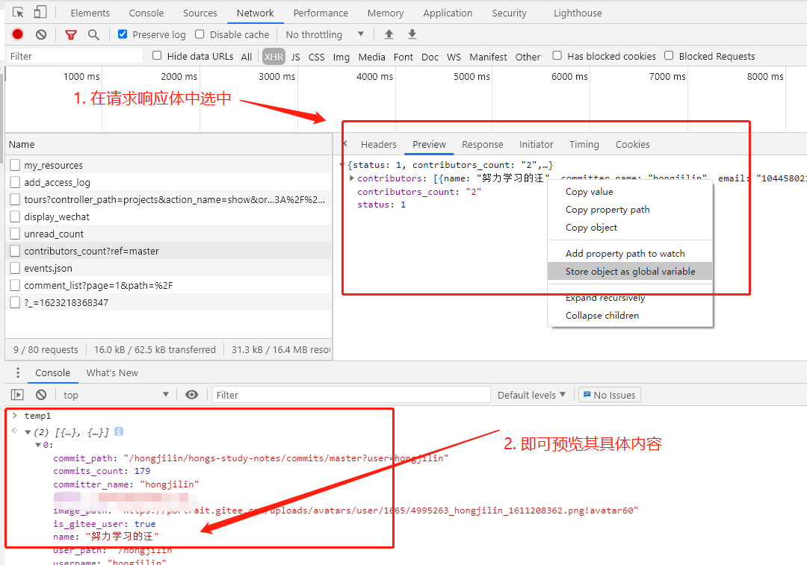 

#### Ⅳ-保存控制台输出内容

>1. 应用场景:当你不用`debugger`而只是使用`console.log`简单打印出变量时,可以将控制台打印出来的变量保存下来使用
>
>2. 操作:
>
>   - 代码中进行打印或者控制台输入代码`console`打印出需要的变量
>
>   - 右键选择`Store object as global variable`,就会自动保存成全局变量
>
>3. 示例图:
>
>   

### 16、截图操作

>首先你需要`F12`打开devtools,下面操作才会生效
>
>1. 按 command + shift + p （windows 按 Ctrl + shift + p），弹出命令输入框
>2. 输入：screenshot
>3. 如下图选择相应的截图方式：
>
>- Capture area screenshot：截取某个区域（需要选择某个标签）
>- Capture full size screenshot：截取整个网页
>- Capture node screenshot：截取某个标签节点
>- Capture screenshot：截取当前可视区域
>
>

### 17、打开控制台抽屉

>1. 应用场景:当你在如Network、elements界面要用要console控制台时,就如我上面的例子截图,
>2. 下面举例在`Elements`面板打开抽屉
>
>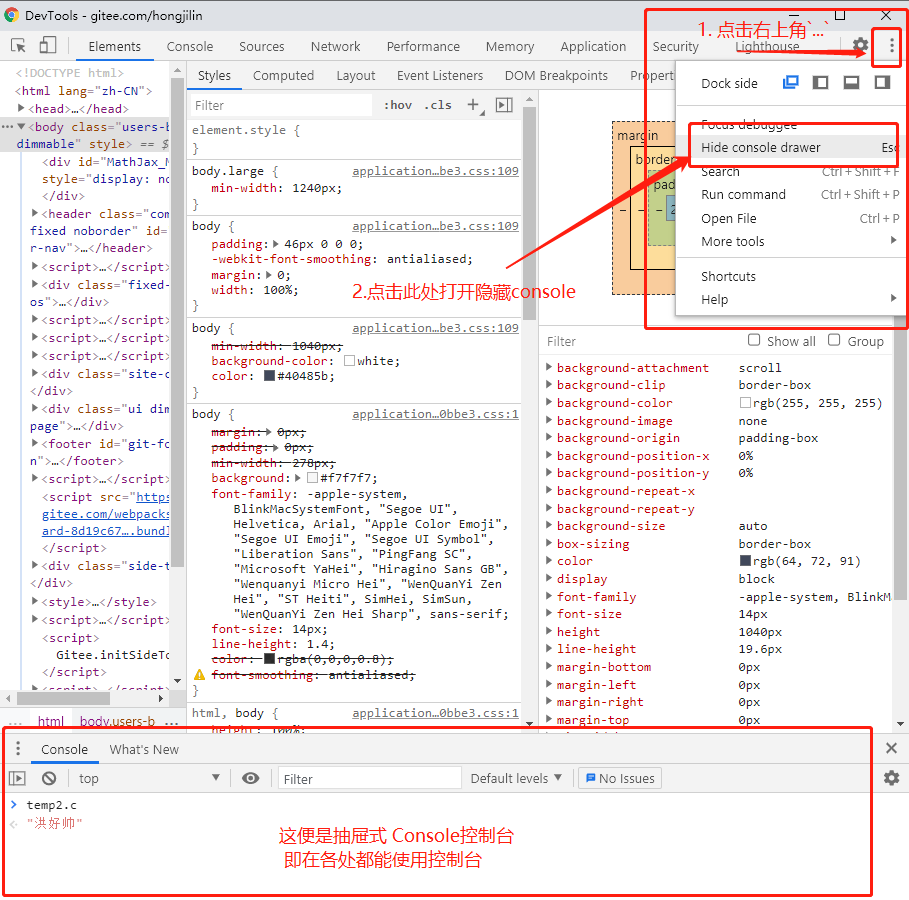 
>
>3. 更简单的:直接点击`esc`就可以在别的地方打开
>
>关掉的方法同理

### 18、重新发起某请求

>在与后端联调过程中，若需要重新发起请求，除了刷新页面或重新触发请求事件外，还可以使用更简单的方式。右击需要重新发起的请求，选择Replay XHR，就可以重新发起请求了
>
>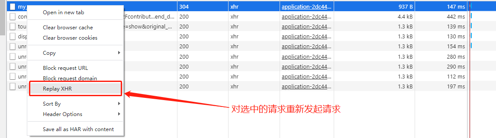


