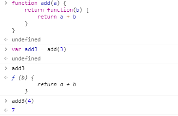
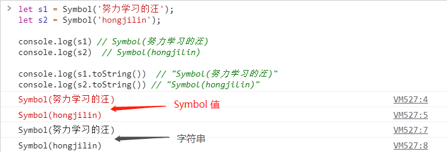
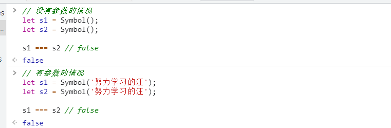

# #说明

>本笔记是本人`ES6-ES11系统学习笔记`,将ES系列全部梳理一遍,包括新特性等
>
>观阅或查阅的资料:[[阮一峰的ES6文档](https://gitee.com/hongjilin/hongs-study-notes/tree/master/编程_前端开发学习笔记/ES6及后续版本学习笔记/ES6资料文档摘录)]、[[尚硅谷Web前端ES6教程, 涵盖ES6-ES11](https://www.bilibili.com/video/BV1uK411H7on?share_source=copy_web)]、华为云的 [[js高手之路] es6系列教程](https://www.huaweicloud.com/articles/dcc4c743622e8a481b33b65d27990c95.html) ; [[JowayYoung的1.5万字概括ES6全部特性(已更新ES2020)](https://juejin.cn/user/2330620350432110)]、华为云的 [[js高手之路] es6系列教程](https://www.huaweicloud.com/articles/dcc4c743622e8a481b33b65d27990c95.html) ; [[JowayYoung的1.5万字概括ES6全部特性(已更新ES2020)](https://juejin.cn/user/2330620350432110)]、[ES6系列教程第二篇--Iterator 详解](https://daimajiaoliu.com/daima/4ed4f6a37900410);W3Cschool的[ES6 中文教程](https://www.w3cschool.cn/escript6/)
>
>笔记中每部分都会首先给出[`概括总结`],总结概括此部分知识点,然后再于下方给出`部分常用重点`知识点详解
>
>必要的预备前置知识点:  [JavaScript基础以及进阶知识点](https://gitee.com/hongjilin/hongs-study-notes/tree/master/编程_前端开发学习笔记/HTML+CSS+JS基础笔记/JavaScript笔记) -->其中 [ 进阶 ] 笔记部分需要重点掌握
>
>除此笔记外大家可以看我其他笔记 :**[全栈笔记](https://gitee.com/hongjilin/hongs-study-notes/tree/master)**、**[编程_前端开发学习笔记](https://gitee.com/hongjilin/hongs-study-notes/tree/master/编程_前端开发学习笔记)**、**[Vue笔记整合](https://gitee.com/hongjilin/hongs-study-notes/tree/master/编程_前端开发学习笔记/Vue笔记整合)** 、**[React笔记](https://gitee.com/hongjilin/hongs-study-notes/tree/master/编程_前端开发学习笔记/React笔记)**、 **[ReactHooks笔记](https://gitee.com/hongjilin/hongs-study-notes/tree/master/编程_前端开发学习笔记/ReactHooks笔记)** 、**[微信小程序学习笔记](https://gitee.com/hongjilin/hongs-study-notes/tree/master/编程_前端开发学习笔记/微信小程序学习笔记)**、**[Chrome开发使用及学习笔记](https://gitee.com/hongjilin/hongs-study-notes/tree/master/编程_前端开发学习笔记/Chrome开发使用及学习笔记)** 以及许多其他笔记就不一一例举了

# #目录

>[TOC]

# 一、ECMAScript引出

> JS基础要会再看这个,不然容易造成基础不牢的后果,此部分`类似JS语法糖`,请相信我不会害你的
>
> 必要的预备前置知识点:  [JavaScript基础以及进阶知识点](https://gitee.com/hongjilin/hongs-study-notes/tree/master/编程_前端开发学习笔记/HTML+CSS+JS基础笔记/JavaScript笔记) -->其中 [ 进阶 ] 笔记部分需要重点掌握

## 1、什么是 ECMA和ECMAScript

>`ECMA`（European Computer Manufacturers Association）中文名称为欧洲计算机制 造商协会, 这个组织的目标是评估、开发和认可电信和计算机标准。1994 年后该 组织改名为 Ecma 国际。
>
>`ECMAScript` 是由 Ecma 国际通过 ECMA-262 标准化的脚本程序设计语言。

## 2、ECMA-262

>Ecma 国际制定了许多标准, 而 ECMA-262 只是其中的一个, 所有标准列表查看 -->[点我传送](https://www.ecma-international.org/publications-and-standards/standards/)

### Ⅰ-ECMA-262 历史

>ECMA-262（ECMAScript）历史版本查看网址: -->[点我传送](https://www.ecma-international.org/publications-and-standards/standards/ecma-262/)
>
>|   版数    |        年份        | 内容                                                         |
>| :-------: | :----------------: | ------------------------------------------------------------ |
>|  第 1 版  |      1997 年       | 制定了语言的基本语法                                         |
>|  第 2 版  |      1998 年       | 较小改动                                                     |
>|  第 3 版  |      1999 年       | 引入正则、异常处理、格式化输出等。IE 开始支持                |
>|  第 4 版  |      2007 年       | 过于激进, 未发布                                             |
>|  第 5 版  |      2009 年       | 引入严格模式、JSON , 扩展对象、数组、原型、字符串、日期方法  |
>| `第 6 版` |     `2015 年`      | 模块化、面向对象语法、 Promise、箭头函数、let、 const、数组解构赋值等等<br />因为发布内容很多,堪称里程碑,所以我们目前通常主要学这个 |
>|  第 7 版  |      2016 年       | 幂运算符、数组扩展、 Async/await 关键字                      |
>|  第 8 版  |      2017 年       | Async/await、字符串扩展                                      |
>|  第 9 版  |      2018 年       | 对象解构赋值、正则扩展                                       |
>| 第 10 版  |      2019 年       | 扩展对象、数组方法                                           |
>|  ES.next  | 动态指向下一个版本 | `后续学到我会进行补充`                                       |
>
>`注：从 ES6 开始, 每年发布一个版本, 版本号比年份最后一位大 1`
>
>所以有些文章上提到的`ES7`(实质上是`ES2016`)、`ES8`(实质上是`ES2017`)、`ES9`(实质上是`ES2018`)、`ES10`(实质上是`ES2019`)、`ES11`(实质上是`ES2020`), 实质上都是一些不规范的概念。从ES1到ES6 , 每个标准都是花了好几年甚至十多年才制定下来, 你一个ES6到ES7 , ES7到ES8 , 才用了一年, 按照这样的定义下去, 那不是很快就ES20了。用正确的概念来说ES6目前涵盖了**ES2015**、**ES2016**、**ES2017**、**ES2018**、**ES2019**、**ES2020**。

### Ⅱ-谁在维护 ECMA-262

>TC39（Technical Committee 39）是推进 ECMAScript 发展的委员会。其会员都是公司（`其中主要是浏览器厂商`:有苹果、谷歌、微软、因特尔等）。TC39 定期 召开会议, 会议由会员公司的代表与特邀专家出席

## 3、为什么要重点学习 ES6

>* ES6 的版本变动内容最多, 具有里程碑意义
>* ES6 加入许多新的语法特性, 编程实现更简单、高效
>* ES6 是前端发展趋势, 就业必备技能
>* 实际上ES系列的知识点基本上都要掌握,才能写出逼格更高的代码:dog:

## 4、ES6 兼容性

>可以查看gitHub上的这个图-->[点我传送](http://kangax.github.io/compat-table/es6/)

# 二、ECMASript 6 新特性

> 想要查看更权威的官方ES6文档,可以看阮一峰的ES6文档,本人当初对其进行了摘录放至此处方便查阅-->**[ES6资料文档摘录](https://gitee.com/hongjilin/hongs-study-notes/tree/master/编程_前端开发学习笔记/ES6及后续版本学习笔记/ES6资料文档摘录)** 
>
> 此处ES6部分笔记主要为:`查阅的资料博客整合摘录(阮一峰的ES6文档)`,加上学习ES6时的笔记、个人心得体会以及在相当一段工作时间中觉得常用或者是需要重点学习的理解整合

## 1、ES6更新的内容概括

>**表达式**：声明、解构赋值
>
>**内置对象**：字符串扩展、数值扩展、对象扩展、数组扩展、函数扩展、正则扩展、Symbol、Set、Map、Proxy、Reflect
>
>**语句与运算**：Class、Module、Iterator
>
>**异步编程**：Promise、Generator、Async

## 2、let和const命令、作用域

> 注意:`不存在变量提升`
>
> `var`命令会发生“变量提升”现象, 即变量可以在声明之前使用, 值为 **undefined** 。这种现象多多少少是有些奇怪的, 按照一般的逻辑, 变量应该在声明语句之后才可以使用。
>
> 为了纠正这种现象, `let`、`const`命令改变了语法行为, 它所声明的变量一定要在声明后使用, 否则报错

### Ⅰ-概括与总结

>> 声明
>
>-  **const命令**：声明常量
>-  **let命令**：声明变量
>
>> 作用
>
>1. 作用域
>   - **全局作用域**
>   - **函数作用域**：`function() {}`
>   - **块级作用域**：`{}`
>2. 作用范围
>   - `var命令`在全局代码中执行
>   - `const命令`和`let命令`只能在代码块中执行
>3. 赋值使用
>   - `const命令`声明常量后必须立马赋值
>   - `let命令`声明变量后可立马赋值或使用时赋值
>4. 声明方法：`var`、`const`、`let`、`function`、`class`、`import`
>
>> 重点难点
>
>- 不允许重复声明
>- 未定义就使用会报错：`const命令`和`let命令`不存在变量提升
>- 暂时性死区：在代码块内使用`const命令`和`let命令`声明变量之前, 该变量都不可用
>
>下一节为赋值解构的概括总结  -->[点我传送](#3、赋值解构)

### Ⅱ-let关键字命令

>let 关键字用来声明变量, 使用 let 声明的变量有几个特点： 
>
>- 不允许重复声明 
>- 块级作用域 
>- 不存在变量提升 
>- 不影响作用域链
>
>应用场景：声明重复赋值的变量时可以用这个,如果你不是要求很高的话,基本上都能用let进行声明(var声明的可以都用这个替代了)

### Ⅲ-const关键字命令

>const 关键字用来声明常量 , const 声明有以下特点:
>
>- 不允许重复声明 
>- `值不允许修改`
>- 不存在变量提升 
>- 块级作用域 
>- 声明必须赋初始值
>- 标识符一般为大写
>
>注意: `对象属性修改和数组元素变化不会触发 const 错误` 
>
>> `const`实际上保证的, `并不是变量的值不得改动, 而是变量指向的那个内存地址所保存的数据不得改动`。
>>
>> 对于简单类型的数据（数值、字符串、布尔值）, 值就保存在变量指向的那个内存地址, 因此等同于常量。但对于复合类型的数据（主要是对象和数组）, 变量指向的内存地址, 保存的只是一个指向实际数据的指针, `const`只能保证这个指针是固定的（即总是指向另一个固定的地址）, 至于它指向的数据结构是不是可变的, 就完全不能控制了。因此, 将一个对象声明为常量必须非常小心。
>
>应用场景：声明对象类型、确定不会再次赋值的变量使用 const , 其他的可以用let

### Ⅳ-ES6 声明变量的六种方法

>ES5 只有两种声明变量的方法：`var`命令和`function`命令。ES6 除了添加`let`和`const`命令, 后面还会提到, 另外两种声明变量的方法：`import`命令和`class`命令。所以 , ES6 一共有 6 种声明变量的方法。

### Ⅴ-块级作用域

#### ① 为什么需要块级作用域？

>ES5 只有全局作用域和函数作用域, 没有块级作用域, 这带来很多不合理的场景。
>
>第一种场景, 内层变量可能会覆盖外层变量。
>
>```javascript
>var tmp = new Date();
>
>function f() {
>  console.log(tmp);
>  if (false) { var tmp = 'hello world'; }
>}
>
>f(); // undefined
>```
>
>上面代码的原意是, `if`代码块的外部使用外层的`tmp`变量, 内部使用内层的`tmp`变量。但是, 函数 [ `f` ] 执行后, 输出结果为 **undefined** , 原因在于变量提升, 导致内层的`tmp`变量覆盖了外层的`tmp`变量。
>
>第二种场景, 用来计数的循环变量泄露为全局变量。
>
>```javascript
>var s = 'hello';
>for (var i = 0; i < s.length; i++) { console.log(s[i]);}
>console.log(i); // 5
>```
>
>上面代码中, 变量`i`只用来控制循环, 但是循环结束后, 它并没有消失, 泄露成了全局变量。

#### ② ES6 的块级作用域

>`let`实际上为 JavaScript 新增了块级作用域。
>
>```javascript
>function f1() {
>  let n = 5;
>  if (true) { let n = 10; }
>  console.log(n); // 5
>}
>```
>
>上面的函数有两个代码块, 都声明了变量`n`, 运行后输出 5。这表示外层代码块不受内层代码块的影响。如果两次都使用`var`定义变量`n`, 最后输出的值才是 10。
>
>ES6 允许块级作用域的任意嵌套。
>
>```javascript
>{{{{
>  {let insane = 'Hello World'}
>  console.log(insane); // 报错 因为外层不能取到内层数据
>}}}};
>```
>
>上面代码使用了一个五层的块级作用域, 每一层都是一个单独的作用域。`第四层作用域无法读取第五层作用域的内部变量`。
>
>内层作用域可以定义外层作用域的同名变量。
>
>```javascript
>{{{{
>  let insane = 'Hello World';
>  {let insane = 'Hello World'}
>}}}};
>```
>
>块级作用域的出现, 实际上使得获得广泛应用的匿名立即执行函数表达式（匿名 IIFE）不再必要了。-->[对于IIFE不懂的可以看本人JS进阶笔记,点我跳转](https://gitee.com/hongjilin/hongs-study-notes/tree/master/%E7%BC%96%E7%A8%8B_%E5%89%8D%E7%AB%AF%E5%BC%80%E5%8F%91%E5%AD%A6%E4%B9%A0%E7%AC%94%E8%AE%B0/HTML+CSS+JS%E5%9F%BA%E7%A1%80%E7%AC%94%E8%AE%B0/JavaScript%E7%AC%94%E8%AE%B0#-%E5%B8%B8%E8%A7%81%E7%9A%84%E5%9B%9E%E8%B0%83%E5%87%BD%E6%95%B0)
>
>```javascript
>// IIFE 写法
>(function () {
>  var tmp = ...;
>  ...
>}());
>
>// 块级作用域写法
>{
>  let tmp = ...;
>  ...
>}
>```
>

#### ③ 块级作用域与函数声明

>函数能不能在块级作用域之中声明？这是一个相当令人混淆的问题。
>
>ES5 规定, 函数只能在顶层作用域和函数作用域之中声明, 不能在块级作用域声明。
>
>```javascript
>// 情况一
>if (true) {
>  function f() {}
>}
>
>// 情况二
>try {
>  function f() {}
>} catch(e) {
>  // ...
>}
>```
>
>上面两种函数声明, 根据 ES5 的规定都是非法的。
>
>但是, 浏览器没有遵守这个规定, 为了兼容以前的旧代码, 还是支持在块级作用域之中声明函数, 因此上面两种情况实际都能运行, 不会报错。
>
>ES6 引入了块级作用域, 明确允许在块级作用域之中声明函数。ES6 规定, 块级作用域之中, 函数声明语句的行为类似于`let`, 在块级作用域之外不可引用。
>
>```javascript
>function f() { console.log('I am outside!'); }
>(function () {
>     // 重复声明一次函数f
>  if (false) { function f() { console.log('I am inside!'); }}
>  f();
>}());
>```
>
>上面代码在 ES5 中运行, 会得到“I am inside!”, 因为在`if`内声明的函数 [ f ] 会被提升到函数头部, 实际运行的代码如下。
>
>```javascript
>// ES5 环境
>function f() { console.log('I am outside!'); }
>(function () {
>  function f() { console.log('I am inside!'); }
>  if (false) {}
>  f();
>}());
>```
>
>ES6 就完全不一样了, 理论上会得到“I am outside!”。因为块级作用域内声明的函数类似于`let`, 对作用域之外没有影响。但是, 如果你真的在 ES6 浏览器中运行一下上面的代码, 是会报错的, 这是为什么呢？
>
>```javascript
>// 浏览器的 ES6 环境
>function f() { console.log('I am outside!'); }
>(function () {
>     // 重复声明一次函数f
>  if (false) { function f() { console.log('I am inside!'); } }
>  f();
>}());
>// Uncaught TypeError: f is not a function
>```
>
>上面的代码在 ES6 浏览器中, 都会报错。
>
>原来, 如果改变了块级作用域内声明的函数的处理规则, 显然会对老代码产生很大影响。为了减轻因此产生的不兼容问题 , ES6 在[附录 B](http://www.ecma-international.org/ecma-262/6.0/index.html#sec-block-level-function-declarations-web-legacy-compatibility-semantics)里面规定, 浏览器的实现可以不遵守上面的规定, 有自己的[行为方式](http://stackoverflow.com/questions/31419897/what-are-the-precise-semantics-of-block-level-functions-in-es6)。
>
>- 允许在块级作用域内声明函数。
>- 函数声明类似于`var`, 即会提升到全局作用域或函数作用域的头部。
>- 同时, 函数声明还会提升到所在的块级作用域的头部。
>
>注意, 上面三条规则只对 ES6 的浏览器实现有效, 其他环境的实现不用遵守, 还是将块级作用域的函数声明当作`let`处理。
>
>根据这三条规则, 浏览器的 ES6 环境中, 块级作用域内声明的函数, 行为类似于`var`声明的变量。上面的栗子实际运行的代码如下。
>
>```javascript
>// 浏览器的 ES6 环境
>function f() { console.log('I am outside!'); }
>(function () {
>  var f = undefined;
>  if (false) { function f() { console.log('I am inside!'); }}
>  f();
>}());
>// Uncaught TypeError: f is not a function
>```
>
>考虑到环境导致的行为差异太大, 应该避免在块级作用域内声明函数。如果确实需要, 也应该写成函数表达式, 而不是函数声明语句。
>
>```javascript
>// 块级作用域内部的函数声明语句, 建议不要使用
>{
>  let a = 'secret';
>  function f() {  return a; }
>}
>
>// 块级作用域内部, 优先使用函数表达式
>{
>  let a = 'secret';
>  let f = function () {
>    return a;
>  };
>}
>```
>
>另外, 还有一个需要注意的地方。ES6 的块级作用域必须有大括号, 如果没有大括号 , JavaScript 引擎就认为不存在块级作用域。
>
>```javascript
>// 第一种写法, 报错
>if (true) let x = 1;
>
>// 第二种写法, 不报错
>if (true) {
>  let x = 1;
>}
>```
>
>上面代码中, 第一种写法没有大括号, 所以不存在块级作用域, 而`let`只能出现在当前作用域的顶层, 所以报错。第二种写法有大括号, 所以块级作用域成立。
>
>函数声明也是如此, 严格模式下, 函数只能声明在当前作用域的顶层。
>
>```javascript
>// 不报错
>'use strict';
>if (true) {
>  function f() {}
>}
>
>// 报错
>'use strict';
>if (true)
>  function f() {}
>```
>


## 3、赋值解构

>ES6 允许按照一定模式, `从数组和对象中提取值, 对变量进行赋值`, 这被称为解构（Destructuring）。
>
>本质上, 这种写法属于“`模式匹配`”, 只要等号两边的模式相同, 左边的变量就会被赋予对应的值

### Ⅰ-概括总结

>1.  **字符串解构**：`const [a, b, c, d, e] = "hello"`
>2.  **数值解构**：`const { toString: s } = 123`
>3.  **布尔解构**：`const { toString: b } = true`
>4. **对象解构**
>   - 形式：`const { x, y } = { x: 1, y: 2 }`
>   - 默认：`const { x, y = 2 } = { x: 1 }`
>   - 改名：`const { x, y: z } = { x: 1, y: 2 }`
>5. **数组解构**
>   - 规则：数据结构具有`Iterator接口`可采用数组形式的解构赋值
>   - 形式：`const [x, y] = [1, 2]`
>   - 默认：`const [x, y = 2] = [1]`
>6. **函数参数解构**
>   - 数组解构：`function Func([x = 0, y = 1]) {}`
>   - 对象解构：`function Func({ x = 0, y = 1 } = {}) {}`
>
>> `应用场景` 
>
>- 交换变量值：`[x, y] = [y, x]`
>- 返回函数多个值：`const [x, y, z] = Func()`
>- 定义函数参数：`Func([1, 2])`
>- 提取JSON数据：`const { name, version } = packageJson`
>- 定义函数参数默认值：`function Func({ x = 1, y = 2 } = {}) {}`
>- 遍历Map结构：`for (let [k, v] of Map) {}`
>- 输入模块指定属性和方法：`const { readFile, writeFile } = require("fs")`
>
>>  ** `重点难点` **
>
>- 匹配模式：只要等号两边的模式相同, 左边的变量就会被赋予对应的值
>- 解构赋值规则：只要等号右边的值不是对象或数组, 就先将其转为对象
>- 解构默认值生效条件：属性值严格等于 **undefined** 
>- 解构遵循匹配模式
>- 解构不成功时变量的值等于 **undefined** 
>-  **undefined** 和 **null** 无法转为对象, 因此无法进行解构
>
>下一节为字符串的拓展概括  -->[点我传送](#4、字符串的拓展)

### Ⅱ-基本用法

#### ① 基本用法举例

>以前, 为变量赋值, 只能直接指定值。
>
>```javascript
>let a = 1;
>let b = 2;
>let c = 3;
>```
>
>ES6 允许写成下面这样。
>
>```javascript
>let [a, b, c] = [1, 2, 3];
>```
>
>上面代码表示, 可以从数组中提取值, 按照对应位置, 对变量赋值。
>
>本质上, 这种写法属于“模式匹配”, 只要等号两边的模式相同, 左边的变量就会被赋予对应的值。下面是一些使用嵌套数组进行解构的栗子。
>
>```javascript
>let [foo, [[bar], baz]] = [1, [[2], 3]];//foo : 1 bar : 2 baz : 3
>
>let [ , , third] = ["foo", "bar", "baz"];//third : "baz"
>
>let [x, , y] = [1, 2, 3];//x : 1 y : 3
>
>let [head, ...tail] = [1, 2, 3, 4];//head : 1 tail : [2, 3, 4]
>
>let [x, y, ...z] = ['a'];//x : "a" y : undefined z : []
>```
>
>如果解构不成功, 变量的值就等于 **undefined** 。
>
>```javascript
>let [foo] = [];
>let [bar, foo] = [1];
>```
>
>以上两种情况都属于解构不成功, `foo`的值都会等于 **undefined** 。
>
>另一种情况是不完全解构, 即等号左边的模式, 只匹配一部分的等号右边的数组。这种情况下, 解构依然可以成功。
>
>```javascript
>let [x, y] = [1, 2, 3];//x : 1  y : 2 
>let [a, [b], d] = [1, [2, 3], 4];//a : 1 b : 2 d : 4
>```
>
>上面两个栗子, 都属于不完全解构, 但是可以成功。
>
>如果等号的右边不是数组（或者严格地说, 不是可遍历的结构, 参见《Iterator》一章）, 那么将会报错。
>
>```javascript
>// 报错
>let [foo] = 1;
>let [foo] = false;
>let [foo] = NaN;
>let [foo] = undefined;
>let [foo] = null;
>let [foo] = {};
>```
>
>上面的语句都会报错, 因为等号右边的值, 要么转为对象以后不具备 Iterator 接口（前五个表达式）, 要么本身就不具备 Iterator 接口（最后一个表达式）。
>
>`对于 Set 结构, 也可以使用数组的解构赋值`。
>
>```javascript
>let [x, y, z] = new Set(['a', 'b', 'c']);
>x // "a"
>```
>
>事实上, 只要某种数据结构具有 Iterator 接口, 都可以采用数组形式的解构赋值。
>
>```javascript
>function* fibs() {
>  let a = 0;
>  let b = 1;
>  while (true) {
>    yield a;
>    [a, b] = [b, a + b];
>  }
>}
>
>let [first, second, third, fourth, fifth, sixth] = fibs();
>sixth // 5
>```
>
>上面代码中, `fibs`是一个 Generator 函数（详见《Generator 函数》）, 原生具有 Iterator 接口。解构赋值会依次从这个接口获取值。

#### ② 默认值

>解构赋值允许指定默认值。
>
>```javascript
>let [foo = true] = [];//foo = true
>let [x, y = 'b'] = ['a']; // x='a', y='b'
>let [x, y = 'b'] = ['a', undefined]; // x='a', y='b'
>```
>
>注意 , ES6 内部使用严格相等运算符（`===`）, 判断一个位置是否有值。所以, 只有当一个数组成员严格等于 **undefined** , 默认值才会生效。
>
>```javascript
>let [x = 1] = [undefined];//x = 1
>let [x = 1] = [null];//x = null
>```
>
>上面代码中, 如果一个数组成员是 **null** , 默认值就不会生效, 因为 **null** 不严格等于 **undefined** 。
>
>如果默认值是一个表达式, 那么这个表达式是惰性求值的, 即只有在用到的时候, 才会求值。
>
>```javascript
>function f() { console.log('aaa');}
>let [x = f()] = [1];
>```
>
>上面代码中, 因为`x`能取到值, 所以函数 [ f ] 根本不会执行。上面的代码其实等价于下面的代码。
>
>```javascript
>let x;
>if ([1] === undefined) { x = f()} 
>else { x = [1]; }
>```
>
>默认值可以引用解构赋值的其他变量, 但该变量必须已经声明。
>
>```javascript
>let [x = 1, y = x] = [];     // x=1; y=1
>let [x = 1, y = x] = [2];    // x=2; y=2
>let [x = 1, y = x] = [1, 2]; // x=1; y=2
>let [x = y, y = 1] = [];     // ReferenceError: y is not defined
>```
>
>上面最后一个表达式之所以会报错, 是因为`x`用`y`做默认值时, `y`还没有声明。

#### ③ ES6小知识点:`连续赋值解构`+重命名

>此写法也是本人常用写法,挺好用的
>
>```js
>let obj = {a:{b:1}}
>const {a} = obj; //传统解构赋值
>const {a:{b}} = obj; //连续解构赋值
>const {a:{b:value}} = obj; //连续解构赋值+重命名
>```

### Ⅲ-对象的赋值解构

> `此处应用的非常多`,需要多查阅

#### ① 基本用法

>解构不仅可以用于数组, 还可以用于对象。
>
>```javascript
>let { foo, bar } = { foo: 'aaa', bar: 'bbb' };//foo = "aaa"; bar = "bbb"
>```
>
>对象的解构与数组有一个重要的不同。`数组的元素是按次序排列的, 变量的取值由它的位置决定；而对象的属性没有次序, 变量必须与属性同名, 才能取到正确的值`
>
>```javascript
>let { bar, foo } = { foo: 'aaa', bar: 'bbb' };//foo = "aaa" ; bar = "bbb"
>let { baz } = { foo: 'aaa', bar: 'bbb' };//baz = undefined
>```
>
>上面代码的第一个栗子, 等号左边的两个变量的次序, 与等号右边两个同名属性的次序不一致, 但是对取值完全没有影响。第二个栗子的变量没有对应的同名属性, 导致取不到值, 最后等于 **undefined** 。
>
>如果解构失败, 变量的值等于 **undefined** 。
>
>```javascript
>let {foo} = {bar: 'baz'};//foo = undefined
>```
>
>上面代码中, 等号右边的对象没有`foo`属性, 所以变量`foo`取不到值, 所以等于 **undefined** 。
>
>对象的解构赋值, 可以很方便地将现有对象的方法, 赋值到某个变量。
>
>```javascript
>// 例一
>let { log, sin, cos } = Math;
>// 例二
>const { log } = console;
>log('hello') // hello
>```
>
>上面代码的例一将`Math`对象的对数、正弦、余弦三个方法, 赋值到对应的变量上, 使用起来就会方便很多。例二将`console.log`赋值到`log`变量。
>
>如果变量名与属性名不一致, 必须写成下面这样-->`取别名`
>
>```javascript
>let { foo: baz } = { foo: 'aaa', bar: 'bbb' };//baz = "aaa"
>
>let obj = { first: 'hello', last: 'world' };
>let { first: f, last: l } = obj;//f = 'hello' ; l = 'world'
>```
>
>这实际上说明, 对象的解构赋值是下面形式的简写（详见《对象的扩展》）。
>
>```javascript
>let { foo: foo, bar: bar } = { foo: 'aaa', bar: 'bbb' };
>```
>
>也就是说, 对象的解构赋值的内部机制, 是先找到同名属性, 然后再赋给对应的变量。真正被赋值的是后者, 而不是前者。
>
>```javascript
>let { foo: baz } = { foo: 'aaa', bar: 'bbb' };
>//baz = "aaa";
>//foo = error: foo is not defined
>```
>
>上面代码中, `foo`是匹配的模式, `baz`才是变量。真正被赋值的是变量`baz`, 而不是模式`foo`。
>
>与数组一样, 解构也可以用于嵌套结构的对象。
>
>```javascript
>let obj = {
>  p: ['Hello', { y: 'World' }]
>};
>
>let { p: [x, { y }] } = obj;
>//x == "Hello"
>//y == "World"
>```
>
>注意, 这时`p`是模式, 不是变量, 因此不会被赋值。如果`p`也要作为变量赋值, 可以写成下面这样。
>
>```javascript
>let obj = {
>  p: [ 'Hello', { y: 'World' }]
>};
>
>let { p, p: [x, { y }] } = obj;
>//x == "Hello"
>//y == "World"
>//p == ["Hello", {y: "World"}]
>```
>
>下面是另一个栗子。
>
>```javascript
>const node = {
>  loc: { 
>      start: { line: 1, column: 5 }
>  }
>};
>
>let { loc, loc: { start }, loc: { start: { line }} } = node;
>//line == 1
>//loc  == Object {start: Object}
>//start == Object {line: 1, column: 5}
>```
>
>上面代码有三次解构赋值, 分别是对`loc`、`start`、`line`三个属性的解构赋值。注意, 最后一次对`line`属性的解构赋值之中, 只有`line`是变量, `loc`和`start`都是模式, 不是变量。
>
>下面是嵌套赋值的栗子。-->`注意:外部包着一层()`:
>
>```javascript
>let obj = {};
>let arr = [];
>({ foo: obj.prop, bar: arr[0] } = { foo: 123, bar: true });
>//因为 JavaScript 引擎会将`{x}`理解成一个代码块, 从而发生语法错误。`只有不将大括号写在行首`, 避免 JavaScript 将其解释为代码块, 才能解决这个问题。
>//obj == {prop:123}
>//arr == [true]
>```
>
>如果解构模式是嵌套的对象, 而且子对象所在的父属性不存在, 那么将会报错。
>
>```javascript
>// 报错
>let {foo: {bar}} = {baz: 'baz'};
>```
>
>上面代码中, 等号左边对象的`foo`属性, 对应一个子对象。该子对象的`bar`属性, 解构时会报错。原因很简单, 因为`foo`这时等于 **undefined** , 再取子属性就会报错。
>
>注意, 对象的解构赋值可以取到继承的属性。
>
>```javascript
>const obj1 = {};
>const obj2 = { foo: 'bar' };
>Object.setPrototypeOf(obj1, obj2);//Object.setPrototypeOf() 方法设置一个指定的对象的原型 ( 即, 内部[[Prototype]]属性）到另一个对象或  null
>const { foo } = obj1;
>foo // "bar"
>```
>
>上面代码中, 对象`obj1`的原型对象是`obj2`。`foo`属性不是`obj1`自身的属性, 而是继承自`obj2`的属性, 解构赋值可以取到这个属性。
>
>注:`Object.setPrototypeOf()`详解,不知道此方法的同学们看这里 -->[点我传送](https://developer.mozilla.org/zh-CN/docs/Web/JavaScript/Reference/Global_Objects/Object/setPrototypeOf)

#### ② 默认值

>对象的解构也可以指定默认值。
>
>```javascript
>var {x = 3} = {};//x == 3
>var {x, y = 5} = {x: 1};
>//x == 1
>//y == 5
>var {x: y = 3} = {};//y == 3
>var {x: y = 3} = {x: 5};//y == 5
>var { message: msg = 'Something went wrong' } = {};//msg == "Something went wrong"
>```
>
>默认值生效的条件是, 对象的属性值严格等于 **undefined** 。
>
>```javascript
>var {x = 3} = {x: undefined};//x == 3
>var {x = 3} = {x: null};//x == null
>```
>
>上面代码中, 属性`x`等于 **null** , 因为 **null** 与 **undefined** 不严格相等, 所以是个有效的赋值, 导致默认值`3`不会生效。-->[原因上面讲过](#② 默认值)

#### ③ 注意点

>（1）如果要将一个已经声明的变量用于解构赋值, 必须非常小心。
>
>```javascript
>// 错误的写法
>let x;
>{x} = {x: 1};
>// SyntaxError: syntax error
>```
>
>上面代码的写法会报错, 因为 JavaScript 引擎会将`{x}`理解成一个代码块, 从而发生语法错误。`只有不将大括号写在行首`, 避免 JavaScript 将其解释为代码块, 才能解决这个问题。
>
>```javascript
>// 正确的写法
>let x;
>({x} = {x: 1});
>```
>
>上面代码将整个解构赋值语句, `放在一个圆括号里面, 就可以正确执行`。关于圆括号与解构赋值的关系, 参见下文。
>
>（2）解构赋值允许等号左边的模式之中, 不放置任何变量名。因此, 可以写出非常古怪的赋值表达式。
>
>```javascript
>({} = [true, false]);
>({} = 'abc');
>({} = []);
>```
>
>上面的表达式虽然毫无意义, 但是语法是合法的, 可以执行。
>
>（3）`由于数组本质是特殊的对象, 因此可以对数组进行对象属性的解构`。
>
>```javascript
>let arr = [1, 2, 3];
>let {0 : first, [arr.length - 1] : last} = arr;
>//first == 1
>//last == 3
>```
>
>上面代码对数组进行对象解构。数组`arr`的`0`键对应的值是`1`, `[arr.length - 1]`就是`2`键, 对应的值是`3`。方括号这种写法, 属于“属性名表达式”（详见《对象的扩展》）。

### Ⅳ-字符串的赋值结构

>字符串也可以解构赋值。这是因为此时, 字符串被转换成了一个类似数组的对象。
>
>```javascript
>const [a, b, c, d, e] = 'hello';
>//a == "h" ;b  == "e" ; c == "l" ; d == "l" ;e == "o"
>```
>
>类似数组的对象都有一个`length`属性, 因此还可以对这个属性解构赋值。
>
>```javascript
>let {length : len} = 'hello';//len == 5
>```
>

### Ⅴ-数值和布尔值的解构赋值

>解构赋值时, 如果等号右边是数值和布尔值, 则会先转为对象。
>
>```javascript
>let {toString: s} = 123;
>s === Number.prototype.toString // true
>
>let {toString: s} = true;
>s === Boolean.prototype.toString // true
>```
>
>上面代码中, 数值和布尔值的包装对象都有`toString`属性, 因此变量`s`都能取到值。
>
>解构赋值的规则是, 只要等号右边的值不是对象或数组, 就先将其转为对象。由于 **undefined** 和 **null** 无法转为对象, 所以对它们进行解构赋值, 都会报错。
>
>```javascript
>let { prop: x } = undefined; // TypeError
>let { prop: y } = null; // TypeError
>```
>


### Ⅵ-函数参数的解构赋值

>函数的参数也可以使用解构赋值。
>
>```javascript
>function add([x, y]){ return x + y; }
>add([1, 2]); // 3
>```
>
>上面代码中, 函数`add`的参数表面上是一个数组, 但在传入参数的那一刻, 数组参数就被解构成变量`x`和`y`。对于函数内部的代码来说, 它们能感受到的参数就是`x`和`y`。
>
>下面是另一个栗子。
>
>```javascript
>[[1, 2], [3, 4]].map(([a, b]) => a + b);
>// [ 3, 7 ]
>```
>
>函数参数的解构也可以使用默认值。
>
>```javascript
>function move({x = 0, y = 0} = {}) {  return [x, y];}
>move({x: 3, y: 8}); // [3, 8]
>move({x: 3}); // [3, 0]
>move({}); // [0, 0]
>move(); // [0, 0]
>```
>
>上面代码中, 函数`move`的参数是一个对象, 通过对这个对象进行解构, 得到变量`x`和`y`的值。如果解构失败, `x`和`y`等于默认值。
>
>注意, 下面的写法会得到不一样的结果。
>
>```javascript
>function move({x, y} = { x: 0, y: 0 }) {
>return [x, y];
>}
>
>move({x: 3, y: 8}); // [3, 8]
>move({x: 3}); // [3, undefined]
>move({}); // [undefined, undefined]
>move(); // [0, 0]
>```
>
>上面代码是为函数`move`的参数指定默认值, 而不是为变量`x`和`y`指定默认值, 所以会得到与前一种写法不同的结果。
>
> **undefined** 就会触发函数参数的默认值。
>
>```javascript
>[1, undefined, 3].map((x = 'yes') => x);
>// [ 1, 'yes', 3 ]
>```
>

### Ⅶ-圆括号问题

>解构赋值虽然很方便, 但是解析起来并不容易。对于编译器来说, `一个式子到底是模式, 还是表达式`, 没有办法从一开始就知道, 必须解析到（或解析不到）等号才能知道。
>
>由此带来的问题是, 如果模式中出现圆括号怎么处理。ES6 的规则是, 只要有可能导致解构的歧义, 就不得使用圆括号。
>
>但是, 这条规则实际上不那么容易辨别, 处理起来相当麻烦。因此, 建议只要有可能, 就不要在模式中放置圆括号。

#### ① 不能使用圆括号的情况

>以下三种解构赋值不得使用圆括号。
>
>（1）`变量声明`语句
>
>```javascript
>// 全部报错
>let [(a)] = [1];
>let {x: (c)} = {};
>let ({x: c}) = {};
>let {(x: c)} = {};
>let {(x): c} = {};
>let { o: ({ p: p }) } = { o: { p: 2 } };
>```
>
>上面 6 个语句都会报错, `因为它们都是变量声明语句`, 模式不能使用圆括号。
>
>（2）函数参数
>
>函数参数也属于变量声明, 因此不能带有圆括号。
>
>```javascript
>// 报错
>function f([(z)]) { return z; }
>// 报错
>function f([z,(x)]) { return x; }
>```
>
>（3）赋值语句的模式
>
>```javascript
>// 全部报错
>({ p: a }) = { p: 42 };
>([a]) = [5];
>```
>
>上面代码将整个模式放在圆括号之中, 导致报错。
>
>```javascript
>// 报错
>[({ p: a }), { x: c }] = [{}, {}];
>```
>
>上面代码将一部分模式放在圆括号之中, 导致报错。

#### ② 可以使用圆括号的情况

>可以使用圆括号的情况只有一种：赋值语句的非模式部分, 可以使用圆括号。
>
>```javascript
>[(b)] = [3]; // 正确
>({ p: (d) } = {}); // 正确
>[(parseInt.prop)] = [3]; // 正确
>```
>
>上面三行语句都可以正确执行, 因为`首先它们都是赋值语句, 而不是声明语句`；其次它们的圆括号都不属于模式的一部分。第一行语句中, 模式是取数组的第一个成员, 跟圆括号无关；第二行语句中, 模式是`p`, 而不是`d`；第三行语句与第一行语句的性质一致。

### Ⅷ-具体应用场景举例

>变量的解构赋值用途很多

#### ① 交换变量的值

>```javascript
>let x = 1;
>let y = 2;
>[x, y] = [y, x];
>```
>
>上面代码交换变量`x`和`y`的值, 这样的写法不仅简洁, 而且易读, 语义非常清晰。

#### ② 从函数返回多个值

>函数只能返回一个值, 如果要返回多个值, 只能将它们放在数组或对象里返回。有了解构赋值, 取出这些值就非常方便。
>
>```javascript
>// 返回一个数组
>function example() {  return [1, 2, 3]; }
>let [a, b, c] = example();
>
>// 返回一个对象
>function example() {
>  return { foo: 1,bar: 2};
>}
>let { foo, bar } = example();
>```
>

#### ③ 函数参数的定义

>解构赋值可以方便地将一组参数与变量名对应起来。
>
>```javascript
>// 参数是一组有次序的值
>function f([x, y, z]) { ... }
>f([1, 2, 3]);
>
>// 参数是一组无次序的值
>function f({x, y, z}) { ... }
>f({z: 3, y: 2, x: 1});
>```
>

#### ④  提取 JSON 数据

>解构赋值对提取 JSON 对象中的数据, 尤其有用。
>
>```javascript
>let jsonData = {
>  id: 42,
>  status: "OK",
>  data: [867, 5309]
>};
>let { id, status, data: number } = jsonData;
>console.log(id, status, number);
>// 42, "OK", [867, 5309]
>```
>
>上面代码可以快速提取 JSON 数据的值。

#### ⑤  函数参数的默认值

>```javascript
>jQuery.ajax = function (url, {
>  async = true,
>  beforeSend = function () {},
>  cache = true,
>  complete = function () {},
>  crossDomain = false,
>  global = true,
>  // ... more config
>} = {}) {
>  // ... do stuff
>};
>```
>
>指定参数的默认值, 就避免了在函数体内部再写`var foo = config.foo || 'default foo';`这样的语句。

#### ⑥ 遍历 Map 结构

>任何部署了 Iterator 接口的对象, 都可以用`for...of`循环遍历。Map 结构原生支持 Iterator 接口, 配合变量的解构赋值, 获取键名和键值就非常方便。
>
>```javascript
>const map = new Map();
>map.set('first', 'hello');
>map.set('second', 'world');
>
>for (let [key, value] of map) {
>  console.log(key + " is " + value);
>}
>// first is hello
>// second is world
>```
>
>如果只想获取键名, 或者只想获取键值, 可以写成下面这样。
>
>```javascript
>// 获取键名
>for (let [key] of map) {
>  // ...
>}
>// 获取键值
>for (let [,value] of map) {
>  // ...
>}
>```
>

#### ⑦ 输入模块的指定方法

>加载模块时, 往往需要指定输入哪些方法。解构赋值使得输入语句非常清晰。
>
>```javascript
>const { SourceMapConsumer, SourceNode } = require("source-map");
>```

## 4、字符串的拓展

### Ⅰ-概括总结

>-  **Unicode表示法**：`大括号包含`表示Unicode字符(`\u{0xXX}`或`\u{0XXX}`)
>-  **字符串遍历**：可通过`for-of`遍历字符串
>-  **字符串模板**：可单行可多行可插入变量的增强版字符串
>-  **标签模板**：函数参数的特殊调用
>-  **String.raw()**：返回把字符串所有变量替换且对斜杠进行转义的结果
>-  **String.fromCodePoint()**：返回码点对应字符
>-  **codePointAt()**：返回字符对应码点(`String.fromCodePoint()`的逆操作)
>-  **normalize()**：把字符的不同表示方法统一为同样形式, 返回`新字符串`(Unicode正规化)
>-  **repeat()**：把字符串重复n次, 返回`新字符串`
>-  **matchAll()**：返回正则表达式在字符串的所有匹配
>-  **includes()**：是否存在指定字符串
>-  **startsWith()**：是否存在字符串头部指定字符串
>-  **endsWith()**：是否存在字符串尾部指定字符串
>
>- 以上扩展方法均可作用于由`4个字节储存`的`Unicode字符`上

### Ⅱ-模板字符串

> 模板字符串（template string）是增强版的字符串, 用反引号[ `  ]标识。它可以当作普通字符串使用, 也可以用来定义多行字符串, 或者在字符串中嵌入变量。
>
> 嵌入变量使用[`${变量名}`]:如果大括号中的值不是字符串, 将按照一般的规则转为字符串。比如, 大括号中是一个对象, 将默认调用对象的`toString`方法。如果大括号内部是一个字符串, 将会原样输出。

#### ① 字符串中可以出现换行符

>字符串中可以出现换行符:如果使用模板字符串表示多行字符串, 所有的空格和缩进都会被保留在输出之中。
>
>```js
>//代码中, 所有模板字符串的空格和换行, 都是被保留的, 比如`<ul>`标签前面会有一个换行。如果你不想要这个换行, 可以使用`trim`方法消除它。
>$('#list').html(`
><ul>
>  <li>first</li>
>  <li>second</li>
></ul>
>`.trim());
>```

#### ② 可以使用 ${xxx} 形式输出变量

>```js
>function authorize(user, action) {
>  if (!user.hasPrivilege(action)) {
>    throw new Error(
>      // 传统写法为
>      // 'User '
>      // + user.name
>      // + ' is not authorized to do '
>      // + action
>      // + '.'
>      `User ${user.name} is not authorized to do ${action}.`);
>  }
>}
>```

#### ③ 大括号内部可以放入任意的 JavaScript 表达式

>括号内部可以放入任意的 JavaScript 表达式, 可以进行运算, 以及引用对象属性。
>
>```js
>let x = 1;
>let y = 2;
>`${x} + ${y} = ${x + y}`// "1 + 2 = 3"
>`${x} + ${y * 2} = ${x + y * 2}`// "1 + 4 = 5"
>let obj = {x: 1, y: 2};
>`${obj.x + obj.y}`// "3"
>```

#### ④ 模板字符串之中还能调用函数。

>```js
>function fn() {  return "Hello World";}
>`foo ${fn()} bar`
>// foo Hello World bar
>```

#### ⑤ 字符串嵌套

>```js
>const tmpl = addrs => `
>  <table>
>  ${addrs.map(addr => `
>    <tr><td>${addr.first}</td></tr>
>    <tr><td>${addr.last}</td></tr>
>  `).join('')}
>  </table>
>`;
>```
>
>上面代码中, 模板字符串的变量之中, 又嵌入了另一个模板字符串, 使用方法如下。
>
>```javascript
>const data = [
>    { first: '<Jane>', last: 'Bond' },
>    { first: 'Lars', last: '<Croft>' },
>];
>console.log(tmpl(data));
>/**下面是打印结果
><table>
>   <tr><td><Jane></td></tr>
>  <tr><td>Bond</td></tr>
>
>   <tr><td>Lars</td></tr>
>   <tr><td><Croft></td></tr>
>
></table>
>*/
>```
>
>如果需要引用模板字符串本身, 在需要时执行, 可以写成函数。
>
>```javascript
>let func = (name) => `Hello ${name}!`;
>func('Jack') // "Hello Jack!"
>```
>
>上面代码中, 模板字符串写成了一个函数的返回值。执行这个函数, 就相当于执行这个模板字符串了。

### Ⅲ-标签模板

> 模板字符串的功能, 不仅仅是上面这些。它可以紧跟在一个函数名后面, 该函数将被调用来处理这个模板字符串。这被称为“`标签模板`”功能（tagged template`）。  -->反正我是很少用到,可阅读性较差
>
> ```js
> alert`hello`
> // 等同于
> alert(['hello'])
> ```

#### ① 简单实例

>标签模板其实不是模板, 而是函数调用的一种特殊形式。`[标签]指的就是函数`, 紧跟在后面的模板字符串就是它的参数。
>
>但是, 如果模板字符里面有变量, 就不是简单的调用了, 而是会将模板字符串先处理成多个参数, 再调用函数。
>
>```javascript
>let a = 5;
>let b = 10;
>
>tag`Hello ${ a + b } world ${ a * b }`;
>// 等同于
>tag(['Hello ', ' world ',  ' '  ], 15, 50);
>```
>
>上面代码中, 模板字符串前面有一个标识名`tag`, 它是一个函数。整个表达式的返回值, 就是`tag`函数处理模板字符串后的返回值。
>
>函数`tag`依次会接收到多个参数。
>
>```javascript
>function tag(stringArr, value1, value2){
>  // ...
>}
>// 等同于
>function tag(stringArr, ...values){
>  // ...
>}
>```
>
>`tag`函数的第一个参数是一个数组, `该数组的成员是模板字符串中那些没有变量替换的部分`, 也就是说, 变量替换只发生在数组的第一个成员与第二个成员之间、第二个成员与第三个成员之间, 以此类推。
>
>`tag`函数的其他参数, 都是模板字符串各个变量被替换后的值。由于本例中, 模板字符串含有两个变量, 因此`tag`会接受到`value1`和`value2`两个参数。
>
>`tag`函数所有参数的实际值如下。
>
>- 第一个参数：`['Hello ', ' world ', '']`
>- 第二个参数: 15
>- 第三个参数：50
>
>也就是说, `tag`函数实际上以下面的形式调用。
>
>```javascript
>tag(['Hello ', ' world ', ''], 15, 50)
>```
>
>我们可以按照需要编写`tag`函数的代码。下面是`tag`函数的一种写法, 以及运行结果。
>
>```javascript
>let a = 5;
>let b = 10;
>
>function tag(s, v1, v2) {
>  console.log(s[0]);
>  console.log(s[1]);
>  console.log(s[2]);
>  console.log(v1);
>  console.log(v2);
>
>  return "OK";
>}
>
>tag`Hello ${ a + b } world ${ a * b}`;
>// "Hello "
>// " world "
>// ""
>// 15
>// 50
>// "OK"
>```
>

#### ② 稍微复杂的栗子

>```javascript
>let total = 30;
>let msg = passthru`The total is ${total} (${total*1.05} with tax)`;
>
>function passthru(literals) {
>  let result = '';
>  let i = 0;
>while (i < literals.length) {
>  result += literals[i++];
>    if (i < arguments.length) {
>     result += arguments[i];
>     }
>    }
>  return result;
>}
>  
>msg // "The total is 30 (31.5 with tax)"
>```
>
>上面这个栗子展示了, 如何将各个参数按照原来的位置拼合回去。
>
>`passthru`函数采用 rest 参数的写法如下。
>
>```javascript
>function passthru(literals, ...values) {
>let output = "";
>let index;
>  for (index = 0; index < values.length; index++) {
>  output += literals[index] + values[index];
>  }
>    output += literals[index]
>  return output;
>}
>  ```
>  
>“标签模板”的一个重要应用, 就是过滤 HTML 字符串, 防止用户输入恶意内容。
>
>```javascript
>let message =
>SaferHTML`<p>${sender} has sent you a message.</p>`;
>
>function SaferHTML(templateData) {
>  let s = templateData[0];
>for (let i = 1; i < arguments.length; i++) {
>let arg = String(arguments[i]);
>  
>  // Escape special characters in the substitution.
>    s += arg.replace(/&/g, "&amp;")
>       .replace(/</g, "&lt;")
>           .replace(/>/g, "&gt;");
>    
>     // Don't escape special characters in the template.
>     s += templateData[i];
>}
>    return s;
>    }
>  ```
>  
>上面代码中, `sender`变量往往是用户提供的, 经过`SaferHTML`函数处理, 里面的特殊字符都会被转义。
>
>```js
>let sender = '<script>alert("abc")</script>'; // 恶意代码
>let message = SaferHTML`<p>${sender} has sent you a message.</p>`;
>
>message
>// <p>&lt;script&gt;alert("abc")&lt;/script&gt; has sent you a message.</p>
>```

#### ③ 用作多语言转换（国际化处理）

>标签模板的另一个应用, 就是多语言转换（国际化处理）。
>
>```javascript
>i18n`Welcome to ${siteName}, you are visitor number ${visitorNumber}!`
>// "欢迎访问xxx , 您是第xxxx位访问者！"
>```
>
>模板字符串本身并不能取代 Mustache 之类的模板库, 因为没有条件判断和循环处理功能, 但是通过标签函数, 你可以自己添加这些功能。
>
>```javascript
>// 下面的hashTemplate函数
>// 是一个自定义的模板处理函数
>let libraryHtml = hashTemplate`
>  <ul>
>    #for book in ${myBooks}
>      <li><i>#{book.title}</i> by #{book.author}</li>
>    #end
>  </ul>
>`;
>```
>
>除此之外, 你甚至可以使用标签模板, 在 JavaScript 语言之中嵌入其他语言。
>
>```javascript
>jsx`
>  <div>
>    <input
>      ref='input'
>      onChange='${this.handleChange}'
>      defaultValue='${this.state.value}' />
>      ${this.state.value}
>   </div>
>`
>```
>
>上面的代码通过`jsx`函数, 将一个 DOM 字符串转为 React 对象。
>
>下面则是一个假想的栗子, 通过`java`函数, 在 JavaScript 代码之中运行 Java 代码。
>
>```javascript
>java`
>class HelloWorldApp {
>  public static void main(String[] args) {
>    System.out.println("Hello World!"); // Display the string.
>  }
>}
>`
>HelloWorldApp.main();
>```
>
>模板处理函数的第一个参数（模板字符串数组）, 还有一个`raw`属性。
>
>```javascript
>console.log`123`
>// ["123", raw: Array[1]]
>```
>
>上面代码中, `console.log`接受的参数, 实际上是一个数组。该数组有一个`raw`属性, 保存的是转义后的原字符串。
>
>请看下面的栗子。
>
>```javascript
>tag`First line\nSecond line`
>
>function tag(strings) {
>  console.log(strings.raw[0]);
>  // strings.raw[0] 为 "First line\\nSecond line"
>  // 打印输出 "First line\nSecond line"
>}
>```
>
>上面代码中, `tag`函数的第一个参数`strings`, 有一个`raw`属性, 也指向一个数组。该数组的成员与`strings`数组完全一致。比如, `strings`数组是`["First line\nSecond line"]`, 那么`strings.raw`数组就是`["First line\\nSecond line"]`。两者唯一的区别, 就是字符串里面的斜杠都被转义了。比如 , strings.raw 数组会将`\n`视为`\\`和`n`两个字符, 而不是换行符。这是为了方便取得转义之前的原始模板而设计的。

## 5、数值的拓展

### Ⅰ- 概括总结

> **二进制表示法**：`0b或0B开头`表示二进制(`0bXX`或`0BXX`)
>
> **八进制表示法**：`0o或0O开头`表示二进制(`0oXX`或`0OXX`)
>
>**指数运算符**:其实这是`ES2016` 新增的 ,指数运算符（`**`）。 -->详见下方
>
> **Number.EPSILON**：数值最小精度
>
> **Number.MIN_SAFE_INTEGER**：最小安全数值(`-2^53`)
>
> **Number.MAX_SAFE_INTEGER**：最大安全数值(`2^53`)
>
> **Number.parseInt()**：返回转换值的整数部分
>
> **Number.parseFloat()**：返回转换值的浮点数部分
>
> **Number.isFinite()**：是否为有限数值
>
> **Number.isNaN()**：是否为NaN
>
> **Number.isInteger()**：是否为整数
>
> **Number.isSafeInteger()**：是否在数值安全范围内
>
> **Math.trunc()**：返回数值整数部分
>
> **Math.sign()**：返回数值类型(`正数1`、`负数-1`、`零0`)
>
> **Math.cbrt()**：返回数值立方根
>
> **Math.clz32()**：返回数值的32位无符号整数形式
>
> **Math.imul()**：返回两个数值相乘
>
> **Math.fround()**：返回数值的32位单精度浮点数形式
>
> **Math.hypot()**：返回所有数值平方和的平方根
>
> **Math.expm1()**：返回`e^n - 1`
>
> **Math.log1p()**：返回`1 + n`的自然对数(`Math.log(1 + n)`)
>
> **Math.log10()**：返回以10为底的n的对数
>
> **Math.log2()**：返回以2为底的n的对数
>
> **Math.sinh()**：返回n的双曲正弦
>
> **Math.cosh()**：返回n的双曲余弦
>
> **Math.tanh()**：返回n的双曲正切
>
> **Math.asinh()**：返回n的反双曲正弦
>
> **Math.acosh()**：返回n的反双曲余弦
>
> **Math.atanh()**：返回n的反双曲正切

### Ⅱ - 指数运算符

>ES2016 新增了一个指数运算符（`**`）。
>
>```javascript
>2 ** 2 // 4
>2 ** 3 // 8
>```
>
>这个运算符的一个特点是右结合, 而不是常见的左结合。多个指数运算符连用时, 是从最右边开始计算的。
>
>```javascript
>// 相当于 2 ** (3 ** 2)
>2 ** 3 ** 2
>// 512
>```
>
>上面代码中, 首先计算的是第二个指数运算符, 而不是第一个。
>
>指数运算符可以与等号结合, 形成一个新的赋值运算符（`**=`）。
>
>```javascript
>let a = 1.5;
>a **= 2;
>// 等同于 a = a * a;
>
>let b = 4;
>b **= 3;
>// 等同于 b = b * b * b;
>```
>

## 6、函数的拓展 (`重点`)

> `对于JS来说函数部分是重中之重的基础`,相对而言篇幅占比也会较大

### Ⅰ- 概括总结

>> **Ⅰ- 参数默认值**：为函数参数指定默认值
>
> - 形式：`function Func(x = 1, y = 2) {}`
> - 参数赋值：惰性求值(函数调用后才求值)
> - 参数位置：尾参数
> - 参数作用域：函数作用域
> - 声明方式：默认声明, 不能用`const`或`let`再次声明
> - length：返回没有指定默认值的参数个数
> - 与解构赋值默认值结合：`function Func({ x = 1, y = 2 } = {}) {}`
> - 应用
>   1. 指定某个参数不得省略, 省略即抛出错误：`function Func(x = throwMissing()) {}`
>   2. 将参数默认值设为 **undefined** , 表明此参数可省略：`Func(undefined, 1)`
>
>> **Ⅱ - 箭头函数(=>)**：函数简写  -->`重点`
>
> - 无参数：`() => {}`
> - 单个参数：`x => {}`
> - 多个参数：`(x, y) => {}`
> - 解构参数：`({x, y}) => {}`
> - 嵌套使用：** `部署管道机制` ** -->不懂的详见下方
> - this指向固定化
>   - 并非因为内部有绑定 [ this ] 的机制, 而是根本没有自己的 [ this ] , 导致内部的 [ this ] 就是外层代码块的 [ this ] 
>   - 因为没有 [ this ] , 因此不能用作构造函数
>
>> **Ⅲ - rest/spread参数(...)**：返回函数多余参数
>
> - 形式：以数组的形式存在, 之后不能再有其他参数
> - 作用：代替`Arguments对象`
> - length：返回没有指定默认值的参数个数但不包括`rest/spread参数`
>
>> **Ⅳ - 严格模式**：在严格条件下运行JS
>
> - 应用：只要函数参数使用默认值、解构赋值、扩展运算符, 那么函数内部就不能显式设定为严格模式
>
>> **Ⅴ - name属性**：返回函数的函数名
>
> - 将匿名函数赋值给变量：`空字符串`(**ES5**)、`变量名`(**ES6**)
> - 将具名函数赋值给变量：`函数名`(**ES5和ES6**)
> - bind返回的函数：`bound 函数名`(**ES5和ES6**)
> - Function构造函数返回的函数实例：`anonymous`(**ES5和ES6**)
>
>> **Ⅵ - 尾调用优化**：只保留内层函数的调用帧
>
> - 尾调用
>   - 定义：某个函数的最后一步是调用另一个函数
>   - 形式：`function f(x) { return g(x); }`
> - 尾递归
>   - 定义：函数尾调用自身
>   - 作用：只要使用尾递归就不会发生栈溢出, 相对节省内存
>   - 实现：把所有用到的内部变量改写成函数的参数并使用参数默认值
>
>> **Ⅶ - 箭头函数常见误区的正解**
>
>1. 函数体内的 [ this ] 是`定义时所在的对象`而不是`使用时所在的对象`
>2. 可让 [ this ] 指向固定化, 这种特性很有利于封装回调函数
>3. 不可当作`构造函数`, 因此箭头函数不可使用`new命令`
>4. 不可使用`yield命令`, 因此箭头函数不能用作`Generator函数`
>5. 不可使用`Arguments对象`, 此对象在函数体内不存在(可用`rest/spread参数`代替)
>6. 返回对象时必须在对象外面加上括号

### Ⅱ - 函数参数的默认值

#### ①  基本用法

>ES6 之前, 不能直接为函数的参数指定默认值, 只能采用变通的方法。
>
>```javascript
>function log(x, y) {
>  y = y || 'World'; //[或],当y为undefined时,将其赋值
>  console.log(x, y);
>}
>log('Hello') // Hello World
>log('Hello', 'China') // Hello China
>log('Hello', '') // Hello World  -->参数`y`等于空字符, 结果被改为默认值
>```
>
>上面代码检查函数`log`的参数`y`有没有赋值, 如果没有, 则指定默认值为`World`。这种写法的缺点在于, 如果参数`y`赋值了, 但是对应的布尔值为`false`, 则该赋值不起作用。就像上面代码的最后一行, 参数`y`等于空字符, 结果被改为默认值。
>
>为了避免这个问题, 通常需要先判断一下参数`y`是否被赋值, 如果没有, 再等于默认值。
>
>```javascript
>if (typeof y === 'undefined') {  y = 'World'; }
>```
>
>ES6 允许为函数的参数设置默认值, 即直接写在参数定义的后面。
>
>```javascript
>function log(x, y = 'World') {  console.log(x, y);}
>log('Hello') // Hello World
>log('Hello', 'China') // Hello China
>log('Hello', '') // Hello
>```
>
>可以看到 , ES6 的写法比 ES5 简洁许多, 而且非常自然。下面是另一个栗子。
>
>```javascript
>function Point(x = 0, y = 0) {
>  this.x = x;
>  this.y = y;
>}
>const p = new Point();
>p // { x: 0, y: 0 }
>```
>
>除了简洁 , ES6 的写法还有两个好处：
>
>- 首先, 阅读代码的人, 可以立刻意识到哪些参数是可以省略的, 不用查看函数体或文档；
>- 其次, 有利于将来的代码优化, 即使未来的版本在对外接口中, 彻底拿掉这个参数, 也不会导致以前的代码无法运行。
>
>参数变量是默认声明的, 所以不能用`let`或`const`再次声明,否则会报错。
>
>```javascript
>function foo(x = 5) {
>  let x = 1; // error
>  const x = 2; // error
>}
>```
>
>`使用参数默认值时, 函数不能有同名参数`。
>
>```javascript
>// 不报错
>function foo(x, x, y) {}
>
>// 报错
>function foo(x, x, y = 1) {}
>// SyntaxError: Duplicate parameter name not allowed in this context
>```
>
>另外, 一个容易忽略的地方是, 参数默认值不是传值的, 而是每次都重新计算默认值表达式的值。也就是说, 参数默认值是惰性求值的。
>
>```javascript
>let x = 99;
>function foo(p = x + 1) { console.log(p);}
>foo() // 100
>foo() // 100
>x = 100;
>foo() // 101
>```
>
>上面代码中, 参数`p`的默认值是`x + 1`。这时, 每次调用函数`foo`, 都会重新计算`x + 1`, 而不是默认`p`等于 100。

#### ② 与解构赋值默认值结合使用

>参数默认值可以与解构赋值的默认值, 结合起来使用。
>
>```javascript
>function foo({x, y = 5}) { console.log(x, y);}
>foo({}) // undefined 5
>foo({x: 1}) // 1 5
>foo({x: 1, y: 2}) // 1 2
>foo() // TypeError: Cannot read property 'x' of undefined
>```
>
>上面代码只使用了对象的解构赋值默认值, 没有使用函数参数的默认值。只有当函数`foo`的参数是一个对象时, 变量`x`和`y`才会通过解构赋值生成。如果函数`foo`调用时没提供参数, 变量`x`和`y`就不会生成, 从而报错。通过提供函数参数的默认值, 就可以避免这种情况。
>
>```javascript
>function foo({x, y = 5} = {}){console.log(x, y);}
>foo() // undefined 5
>```
>
>上面代码指定, 如果没有提供参数, 函数`foo`的参数默认为一个空对象。
>
>下面是另一个解构赋值默认值的栗子。
>
>```javascript
>function fetch(url, { body = '', method = 'GET', headers = {} }) {
>console.log(method);
>  }
>
>fetch('http://example.com', {})
>// "GET"
>
>fetch('http://example.com')
>// 报错
>```
>
>上面代码中, 如果函数`fetch`的第二个参数是一个对象, 就可以为它的三个属性设置默认值。这种写法不能省略第二个参数, 如果结合函数参数的默认值, 就可以省略第二个参数。这时, 就出现了双重默认值。
>
>```javascript
>function fetch(url, { body = '', method = 'GET', headers = {} } = {}) {
>console.log(method);
>  }
>
>fetch('http://example.com')
>// "GET"
>```
>
>上面代码中, 函数`fetch`没有第二个参数时, 函数参数的默认值就会生效, 然后才是解构赋值的默认值生效, 变量`method`才会取到默认值`GET`。
>
>作为练习, 请问下面两种写法有什么差别？
>
>```javascript
>// 写法一
>function m1({x = 0, y = 0} = {}) { return [x, y]; }
>
>  // 写法二
>function m2({x, y} = { x: 0, y: 0 }) { return [x, y]; }
>```
>
>上面两种写法都对函数的参数设定了默认值, 区别是写法一函数参数的默认值是空对象, 但是设置了对象解构赋值的默认值；写法二函数参数的默认值是一个有具体属性的对象, 但是没有设置对象解构赋值的默认值。
>  
>```javascript
>// 函数没有参数的情况
>m1() // [0, 0]
>m2() // [0, 0]
>
>// x 和 y 都有值的情况
>m1({x: 3, y: 8}) // [3, 8]
>m2({x: 3, y: 8}) // [3, 8]
>
>// x 有值 , y 无值的情况
>m1({x: 3}) // [3, 0]
>m2({x: 3}) // [3, undefined]
>
>// x 和 y 都无值的情况
>m1({}) // [0, 0];
>m2({}) // [undefined, undefined]
>
>m1({z: 3}) // [0, 0]
>m2({z: 3}) // [undefined, undefined]
>```
>

#### ③  参数默认值的位置

>通常情况下, 定义了默认值的参数, 应该是函数的尾参数。因为这样比较容易看出来, 到底省略了哪些参数。如果非尾部的参数设置默认值, 实际上这个参数是没法省略的。
>
>```javascript
>// 例一
>function f(x = 1, y) { return [x, y];}
>
>f() // [1, undefined]
>f(2) // [2, undefined]
>f(, 1) // 报错
>f(undefined, 1) // [1, 1]
>
>// 例二
>function f(x, y = 5, z) { return [x, y, z];}
>
>f() // [undefined, 5, undefined]
>f(1) // [1, 5, undefined]
>f(1, ,2) // 报错
>f(1, undefined, 2) // [1, 5, 2]
>```
>
>上面代码中, 有默认值的参数都不是尾参数。这时, 无法只省略该参数, 而不省略它后面的参数, 除非显式输入 **undefined** 。
>
>如果传入 **undefined** , 将触发该参数等于默认值,  **null** 则没有这个效果。
>
>```javascript
>function foo(x = 5, y = 6) { console.log(x, y); }
>foo(undefined, null)
>// 5 null
>```
>
>上面代码中, `x`参数对应 **undefined** , 结果触发了默认值, `y`参数等于 **null** , 就没有触发默认值。

#### ④ 函数的 length 属性

>指定了默认值以后, 函数的`length`属性, 将返回没有指定默认值的参数个数。也就是说, `指定了默认值后 , length属性将失真`。
>
>```javascript
>(function (a) {}).length // 1
>(function (a = 5) {}).length // 0
>(function (a, b, c = 5) {}).length // 2
>```
>
>上面代码中, [ length ]属性的返回值, 等于函数的参数个数减去指定了默认值的参数个数。比如, 上面最后一个函数, 定义了 3 个参数, 其中有一个参数`c`指定了默认值, 因此[ length ]属性等于`3`减去`1`, 最后得到`2`。
>
>这是因为`length`属性的含义是, 该函数预期传入的参数个数。某个参数指定默认值以后, 预期传入的参数个数就不包括这个参数了。同理, 后文的 rest 参数也不会计入[ length ]属性。
>
>```javascript
>(function(...args) {}).length // 0
>```
>
>如果设置了`默认值的参数不是尾参数`, 那么[ length ]属性也不再计入后面的参数了。
>
>```javascript
>(function (a = 0, b, c) {}).length // 0
>(function (a, b = 1, c) {}).length // 1
>```
>

#### ⑤  作用域

>一旦设置了参数的默认值, 函数进行声明初始化时, 参数会形成一个单独的作用域（context）。等到初始化结束, 这个作用域就会消失。这种语法行为, 在不设置参数默认值时, 是不会出现的。
>
>```javascript
>var x = 1;
>function f(x, y = x) { console.log(y); }
>f(2) // 2
>```
>
>上面代码中, 参数`y`的默认值等于变量`x`。调用函数 [ f ] 时, 参数形成一个单独的作用域。在这个作用域里面, 默认值变量`x`指向第一个参数`x`, 而不是全局变量`x`, 所以输出是`2`。
>
>再看下面的栗子。
>
>```javascript
>let x = 1;
>function f(y = x) {
>  let x = 2;
>  console.log(y);
>}
>f() // 1
>```
>
>上面代码中, 函数 [ f ] 调用时, 参数`y = x`形成一个单独的作用域。这个作用域里面, 变量`x`本身没有定义, 所以指向外层的全局变量`x`。函数调用时, 函数体内部的局部变量`x`影响不到默认值变量`x`。
>
>如果此时, 全局变量`x`不存在, 就会报错。
>
>```javascript
>function f(y = x) {
>  let x = 2;
>  console.log(y);
>}
>f() // ReferenceError: x is not defined
>```
>
>下面这样写, 也会报错。
>
>```javascript
>var x = 1;
>function foo(x = x) {
>  // ...
>}
>foo() // ReferenceError: x is not defined
>```
>
>上面代码中, 参数`x = x`形成一个单独作用域。实际执行的是`let x = x`, 由于暂时性死区的原因, 这行代码会报错”x 未定义“。
>
>如果参数的默认值是一个函数, 该函数的作用域也遵守这个规则。请看下面的栗子。
>
>```javascript
>let foo = 'outer';
>
>function bar(func = () => foo) {
>  let foo = 'inner';
>  console.log(func());
>}
>
>bar(); // outer
>```
>
>上面代码中, 函数`bar`的参数`func`的默认值是一个匿名函数, 返回值为变量`foo`。函数参数形成的单独作用域里面, 并没有定义变量`foo`, 所以`foo`指向外层的全局变量`foo`, 因此输出`outer`。
>
>如果写成下面这样, 就会报错。
>
>```javascript
>function bar(func = () => foo) {
>  let foo = 'inner';
>  console.log(func());
>}
>
>bar() // ReferenceError: foo is not defined
>```
>
>上面代码中, 匿名函数里面的`foo`指向函数外层, 但是函数外层并没有声明变量`foo`, 所以就报错了。
>
>下面是一个更复杂的栗子。
>
>```javascript
>var x = 1;
>function foo(x, y = function() { x = 2; }) {
>  var x = 3;
>  y();
>  console.log(x);
>}
>
>foo() // 3
>//x == 1
>```
>
>上面代码中, 函数`foo`的参数形成一个单独作用域。这个作用域里面, 首先声明了变量`x`, 然后声明了变量`y`, `y`的默认值是一个匿名函数。这个匿名函数内部的变量`x`, 指向同一个作用域的第一个参数`x`。函数`foo`内部又声明了一个内部变量`x`, 该变量与第一个参数`x`由于不是同一个作用域, 所以不是同一个变量, 因此执行`y`后, 内部变量`x`和外部全局变量`x`的值都没变。
>
>如果将`var x = 3`的`var`去除, 函数`foo`的内部变量`x`就指向第一个参数`x`, 与匿名函数内部的`x`是一致的, 所以最后输出的就是`2`, 而外层的全局变量`x`依然不受影响。
>
>```javascript
>var x = 1;
>function foo(x, y = function() { x = 2; }) {
>  x = 3;
>  y();
>  console.log(x);
>}
>
>foo() // 2
>//x== 1
>```

#### ⑥ 应用

>利用参数默认值, 可以指定某一个参数不得省略, 如果省略就抛出一个错误。
>
>```javascript
>function throwIfMissing() { throw new Error('Missing parameter'); }
>
>function foo(mustBeProvided = throwIfMissing()) {  return mustBeProvided; }
>
>foo()
>// Error: Missing parameter
>```
>
>上面代码的`foo`函数, 如果调用的时候没有参数, 就会调用默认值`throwIfMissing`函数, 从而抛出一个错误。
>
>从上面代码还可以看到, 参数`mustBeProvided`的默认值等于`throwIfMissing`函数的运行结果（注意函数名`throwIfMissing`之后有一对圆括号）, 这表明参数的默认值不是在定义时执行, 而是在运行时执行。如果参数已经赋值, 默认值中的函数就不会运行。
>
>另外, 可以将参数默认值设为 **undefined** , 表明这个参数是可以省略的。
>
>```javascript
>function foo(optional = undefined) { ··· }
>```
>

### Ⅲ - 箭头函数 (`重点`)

> ES6最常见用法,这个必须要会

#### ① 基本用法

>ES6 允许使用“箭头”（`=>`）定义函数。
>
>```javascript
>var f = v => v;
>
>// 等同于
>var f = function (v) {
>  return v;
>};
>```
>
>如果箭头函数不需要参数或需要多个参数, 就使用一个圆括号代表参数部分。
>
>```javascript
>var f = () => 5;
>// 等同于
>var f = function () { return 5 };
>
>var sum = (num1, num2) => num1 + num2;
>// 等同于
>var sum = function(num1, num2) {
>  return num1 + num2;
>};
>```
>
>如果箭头函数的代码块部分多于一条语句, 就要使用大括号将它们括起来, 并且使用`return`语句返回。
>
>```javascript
>var sum = (num1, num2) => { return num1 + num2; }
>```
>
>`由于大括号被解释为代码块, 所以如果箭头函数直接返回一个对象, 必须在对象外面加上括号, 否则会报错`。
>
>```javascript
>// 报错
>let getTempItem = id => { id: id, name: "Temp" };
>
>// 不报错
>let getTempItem = id => ({ id: id, name: "Temp" });
>```
>
>下面是一种特殊情况, 虽然可以运行, 但会得到错误的结果。
>
>```javascript
>let foo = () => { a: 1 };
>foo() // undefined
>```
>
>上面代码中, 原始意图是返回一个对象`{ a: 1 }`, 但是由于引擎认为大括号是代码块, 所以执行了一行语句`a: 1`。这时, `a`可以被解释为语句的标签, 因此实际执行的语句是`1;`, 然后函数就结束了, 没有返回值。
>
>如果箭头函数只有一行语句, 且不需要返回值, 可以采用下面的写法, 就不用写大括号了。
>
>```javascript
>let fn = () => void doesNotReturn();
>```
>
>箭头函数可以与变量解构结合使用。
>
>```javascript
>const full = ({ first, last }) => first + ' ' + last;
>
>// 等同于
>function full(person) {
>  return person.first + ' ' + person.last;
>}
>```
>
>箭头函数使得表达更加简洁。
>
>```javascript
>const isEven = n => n % 2 === 0; //类型 boolean
>const square = n => n * n;  //类型 number
>```
>
>上面代码只用了两行, 就定义了两个简单的工具函数。如果不用箭头函数, 可能就要占用多行, 而且还不如现在这样写醒目。
>
>箭头函数的一个用处是简化回调函数。
>
>```javascript
>// 正常函数写法
>[1,2,3].map(function (x) {
>  return x * x;
>});
>
>// 箭头函数写法
>[1,2,3].map(x => x * x);
>```
>
>另一个栗子是
>
>```javascript
>// 正常函数写法
>var result = values.sort(function (a, b) {
>  return a - b;
>});
>
>// 箭头函数写法
>var result = values.sort((a, b) => a - b);
>```
>
>下面是 rest 参数与箭头函数结合的栗子(`个人觉得很好用`)。
>
>```javascript
>const numbers = (...nums) => nums;
>
>numbers(1, 2, 3, 4, 5)
>// [1,2,3,4,5]
>
>const headAndTail = (head, ...tail) => [head, tail];
>
>headAndTail(1, 2, 3, 4, 5)
>// [1,[2,3,4,5]]
>```
>

#### ② 使用注意点

>箭头函数有几个使用注意点。
>
>（1）函数体内的 [ this ] 对象, 就是定义时所在的对象, 而不是使用时所在的对象。
>
>（2）不可以当作构造函数, 也就是说, 不可以使用`new`命令, 否则会抛出一个错误。
>
>（3）不可以使用`arguments`对象, 该对象在函数体内不存在。如果要用, `可以用 rest 参数代替`。
>
>（4）不可以使用`yield`命令, 因此箭头函数`不能用作 Generator 函数`。-->此类型函数在后方知识点会给出详解
>
>> 以下是详解举栗
>
>上面四点中, 第一点尤其值得注意。`[this]对象的指向是可变的, 但是在箭头函数中, 它是固定的`。
>
>```javascript
>function foo() {
>setTimeout(() => {
>console.log('id:', this.id);
>}, 100);
>}
>
>var id = 21;
>
>foo.call({ id: 42 }); // id: 42
>```
>
>上面代码中, `setTimeout()`的参数是一个箭头函数, 这个箭头函数的定义生效是在`foo`函数生成时, 而它的真正执行要等到 100 毫秒后。如果是普通函数, 执行时 [ this ] 应该指向全局对象`window`, 这时应该输出`21`。但是, 箭头函数导致 [ this ] 总是指向函数定义生效时所在的对象（本例是`{id: 42}`）, 所以打印出来的是`42`。
>
>箭头函数可以让`setTimeout`里面的 [ this ] , 绑定定义时所在的作用域, 而不是指向运行时所在的作用域。下面是另一个栗子。
>
>```javascript
>function Timer() {
>this.s1 = 0;
>this.s2 = 0;
>// 箭头函数
>setInterval(() => this.s1++, 1000);
>// 普通函数
>setInterval(function () {
>this.s2++;
>}, 1000);
>}
>
>var timer = new Timer();
>
>setTimeout(() => console.log('s1: ', timer.s1), 3100);
>setTimeout(() => console.log('s2: ', timer.s2), 3100);
>// s1: 3
>// s2: 0
>```
>
>上面代码中, `Timer`函数内部设置了两个定时器, 分别使用了箭头函数和普通函数。前者的 [ this ] 绑定定义时所在的作用域（即`Timer`函数）, 后者的 [ this ] 指向运行时所在的作用域（即全局对象）。所以, 3100 毫秒之后, `timer.s1`被更新了 3 次, 而`timer.s2`一次都没更新。
>
>`箭头函数可以让[this指向]固定化, 这种特性很有利于封装回调函数`。下面是一个栗子 , DOM 事件的回调函数封装在一个对象里面。
>
>```javascript
>var handler = {
>id: '123456',
>
>init: function() {
>document.addEventListener('click',
> event => this.doSomething(event.type), false);
>},
>
>doSomething: function(type) {
>console.log('Handling ' + type  + ' for ' + this.id);
>}
>};
>```
>
>上面代码的`init`方法中, 使用了箭头函数, 这导致这个箭头函数里面的 [ this ] , 总是指向`handler`对象。否则, 回调函数运行时, `this.doSomething`这一行会报错, 因为此时 [ this ] 指向`document`对象。
>
> [ this ] 指向的固定化, 并不是因为箭头函数内部有绑定 [ this ] 的机制, 实际原因是箭头函数根本没有自己的 [ this ] , 导致内部的 [ this ] 就是外层代码块的 [ this ] 。正是因为它没有 [ this ] , 所以也就不能用作构造函数。
>
>所以, 箭头函数转成 ES5 的代码如下。
>
>```javascript
>// ES6
>function foo() {
>setTimeout(() => {
>console.log('id:', this.id);
>}, 100);
>}
>
>// ES5
>function foo() {
>var _this = this;
>
>setTimeout(function () {
>console.log('id:', _this.id);
>}, 100);
>}
>```
>
>上面代码中, 转换后的 ES5 版本清楚地说明了, 箭头函数里面根本没有自己的 [ this ] , 而是引用外层的 [ this ] 。
>
>请问下面的代码之中有几个 [ this ] ？
>
>```javascript
>function foo() {
>return () => {
>return () => {
> return () => {
>   console.log('id:', this.id);
> };
>};
>};
>}
>
>var f = foo.call({id: 1});
>
>var t1 = f.call({id: 2})()(); // id: 1
>var t2 = f().call({id: 3})(); // id: 1
>var t3 = f()().call({id: 4}); // id: 1
>```
>
>上面代码之中, 只有一个 [ this ] , 就是函数`foo`的 [ this ] , 所以`t1`、`t2`、`t3`都输出同样的结果。因为所有的内层函数都是箭头函数, 都没有自己的 [ this ] , 它们的 [ this ] 其实都是最外层`foo`函数的 [ this ] 。
>
>除了 [ this ] , 以下三个变量在箭头函数之中也是不存在的, 指向外层函数的对应变量：`arguments`、`super`、`new.target`。
>
>```javascript
>function foo() {
>setTimeout(() => {
>console.log('args:', arguments);
>}, 100);
>}
>
>foo(2, 4, 6, 8)
>// args: [2, 4, 6, 8]
>```
>
>上面代码中, 箭头函数内部的变量`arguments`, 其实是函数`foo`的`arguments`变量。
>
>另外, 由于箭头函数没有自己的 [ this ] , 所以当然也就不能用`call()`、`apply()`、`bind()`这些方法去改变 [ this ] 的指向。
>
>```javascript
>(function() {
>return [
>(() => this.x).bind({ x: 'inner' })()
>];
>}).call({ x: 'outer' });
>// ['outer']
>```
>
>上面代码中, 箭头函数没有自己的 [ this ] , 所以`bind`方法无效, 内部的 [ this ] 指向外部的 [ this ] 。
>
>长期以来 , JavaScript 语言的 [ this ] 对象一直是一个令人头痛的问题, 在对象方法中使用 [ this ] , 必须非常小心。`箭头函数'绑定[this]', 很大程度上解决了这个困扰。`

#### ③ 不适用场合

>由于箭头函数使得 [ this ] 从“动态”变成“静态”, 下面两个场合不应该使用箭头函数。
>
>第一个场合是定义对象的方法, 且该方法内部包括 [ this ] 。
>
>>```javascript
>>const cat = {
>>  lives: 9,
>>  jumps: () => { this.lives--;}
>>}
>>```
>>
>>上面代码中, `cat.jumps()`方法是一个箭头函数, 这是错误的。调用`cat.jumps()`时, 如果是普通函数, 该方法内部的 [ this ] 指向`cat`；如果写成上面那样的箭头函数, 使得 [ this ] 指向全局对象, 因此不会得到预期结果。这是`因为对象不构成单独的作用域`, 导致`jumps`箭头函数定义时的作用域就是全局作用域。
>
>第二个场合是需要动态 [ this ] 的时候, 也不应使用箭头函数。
>
>>```javascript
>>var button = document.getElementById('press');
>>button.addEventListener('click', () => {
>>  this.classList.toggle('on');
>>});
>>```
>>
>>上面代码运行时, 点击按钮会报错, 因为`button`的监听函数是一个箭头函数, 导致里面的 [ this ] 就是全局对象。如果改成普通函数,  [ this ] 就会动态指向被点击的按钮对象。
>
>另外, 如果函数体很复杂, 有许多行, 或者函数内部有大量的读写操作, 不单纯是为了计算值, 这时也不应该使用箭头函数, 而是要使用普通函数, 这样可以提高代码可读性

#### ④ 嵌套的箭头函数

>箭头函数内部, 还可以再使用箭头函数。下面是一个 ES5 语法的多重嵌套函数。
>
>```javascript
>function insert(value) {
>  return {into: function (array) {
>    return {after: function (afterValue) {
>      array.splice(array.indexOf(afterValue) + 1, 0, value);
>      return array;
>    }};
>  }};
>}
>
>insert(2).into([1, 3]).after(1); //[1, 2, 3]
>```
>
>上面这个函数, 可以使用箭头函数改写。
>
>```javascript
>let insert = (value) => ({into: (array) => ({after: (afterValue) => {
>  array.splice(array.indexOf(afterValue) + 1, 0, value);
>  return array;
>}})});
>
>insert(2).into([1, 3]).after(1); //[1, 2, 3]
>```
>

##### a) 部署管道机制 (pipeline)

>下面是一个部署管道机制 (pipeline)的栗子 : `即前一个函数的输出是后一个函数的输入`。
>
>```javascript
>const pipeline = (...funcs) =>
>  val => funcs.reduce((a, b) => b(a), val);
>
>const plus1 = a => a + 1;
>const mult2 = a => a * 2;
>const addThenMult = pipeline(plus1, mult2);
>
>addThenMult(5)
>// 12
>```
>
>如果觉得上面的写法可读性比较差, 也可以采用下面的写法。
>
>```javascript
>const plus1 = a => a + 1;
>const mult2 = a => a * 2;
>
>mult2(plus1(5))
>// 12
>```
>
>箭头函数还有一个功能, 就是可以很方便地改写 λ 演算。
>
>```javascript
>// λ演算的写法
>fix = λf.(λx.f(λv.x(x)(v)))(λx.f(λv.x(x)(v)))
>
>// ES6的写法
>var fix = f => (x => f(v => x(x)(v)))
>               (x => f(v => x(x)(v)));
>```
>
>上面两种写法, 几乎是一一对应的。由于 λ 演算对于计算机科学非常重要, 这使得我们可以用 ES6 作为替代工具, 探索计算机科学。

##### b) 高阶函数

>在我的理解中,实际上高阶函数本质上就与  [ 部署管道机制 ] 殊途同归,此处列出是为了更好做对比,防止以后遇到混淆
>
>所谓高阶函数:`就是一个函数就可以接收另一个函数作为参数, 或者是返回一个函数`-->常见的高阶函数有map、reduce、filter、sort等
>
>  ```js
>var ADD =function add(a) {
> return function(b) { return a+b }
>}
> 调用：ADD(2)(3)即可获得结果
>  ```
>
>> map
>
>  ```js
>map接受一个函数作为参数, 不改变原来的数组, 只是返回一个全新的数组
>var arr = [1,2,3,4,5]
> var arr1 = arr.map(item => item = 2)// 输出[1,1,1,1,1]
>  ```
>
>> reduce
>
>  ```js
>reduce也是返回一个全新的数组。reduce接受一个函数作为参数, 这个函数要有两个形参, 代表数组中的前两项 , reduce会将这个函数的结果与数组中的第三项再次组成这个函数的两个形参以此类推进行累积操作
>var arr = [1,2,3,4,5]
>var arr2 = arr.reduce((a,b)=> a+b)
>console.log(arr2) // 15
>  ```
>
>> filter
>
>  ```js
>filter返回过滤后的数组。filter也接收一个函数作为参数, 这个函数将作用于数组中的每个元素, 根据该函数每次执行后返回的布尔值来保留结果, 如果是true就保留, 如果是false就过滤掉（这点与map要区分）
>var arr = [1,2,3,4,5]
> var arr3 = arr.filter(item => item % 2 == 0)
>console.log(arr3)// [2,4]
>  ```

##### c) 函数柯里化

>此处列出是因为此知识点常与箭头函数搭配使用,而很多同学其实有在用却都不懂这个概念(大多数教程都不会刻意去普及概念),所以我觉得在此处列出,会对很多同学有所帮助,也能形成关联性更强的知识体系
>
>> 截取自网上的正解图例
>
>  
>
>> 关键就是`理解柯里化`, 其实可以把它理解成, 柯里化后, `将第一个参数变量存在函数里面了(闭包)`, 然后本来需要n个参数的函数可以变成只需要剩下的（n - 1个）参数就可以调用, 比如
>
>  ```js
>let add = x => y => x + y
>let add2 = add(2)
>------------ 一般调用 ------------------------
>//本来完成 add 这个操作, 应该是这样调用
>let add = (x, y) => x + y
>add(2,3)
>------------- 柯里化后调用  ---------------------
>// 而现在 add2 函数完成同样操作只需要一个参数, 这在函数式编程中广泛应用。
>let add = x => y => x + y
>let add2 = add(2)
>//详细解释一下, 就是 add2 函数 等价于 有了 x 这个闭包变量的 y => x + y 函数,并且此时 x = 2 , 所以此时调用
>add2(3) === 2 + 3
>  ```

##### d) 从 ES6 高阶箭头函数理解函数柯里化以及 [ 部署管道机制 ]

>1. 首先看到了这样的一个栗子：
>
>  ```js
>let add = a => b => a + b
>  ```
>
>2. 以上是一个很简单的相加函数, 把它转化成 ES5 的写法如下
>
>  ```js
>function add(a) {
>      return function(b) { return a + b }
>}
>var add3 = add(3) //add3表示一个指向函数的变量 可以当成函数调用名来用
>add3(4) === 3 + 4 //true
>  ```
>
>3. 再简化一下, 可以写成如下形式：
>
>  ```js
>let add = function(a) {
>    var param = a;
>    var innerFun = function(b) { return param + b; }
>    return innerFun;
>}
>  ```
>
>4. 虽然好像没什么意义, 但是很显然上述使用了闭包, 而且该函数的返回值是一个函数。其实, 这就是`高阶函数的定义：以函数为参数或者返回值是函数的函数。`
>
>   

### Ⅳ - rest 参数 (`常用`)

>ES6 引入 rest 参数（形式为`...变量名`）, 用于获取函数的多余参数, 这样就不需要使用`arguments`对象了。rest 参数搭配的变量是一个数组, 该变量将多余的参数放入数组中。
>
>```javascript
>function add(...values) {
>  let sum = 0;
>  for (var val of values) {
>    sum += val;
>  }
>  return sum;
>}
>
>add(2, 5, 3) // 10
>```
>
>上面代码的`add`函数是一个求和函数, 利用 rest 参数, 可以向该函数传入任意数目的参数。
>
>下面是一个 rest 参数代替`arguments`变量的栗子。
>
>```javascript
>// arguments变量的写法
>function sortNumbers() {
>  return Array.prototype.slice.call(arguments).sort();
>}
>
>// rest参数的写法
>const sortNumbers = (...numbers) => numbers.sort();
>```
>
>上面代码的两种写法, 比较后可以发现 , rest 参数的写法更自然也更简洁。
>
>`arguments`对象不是数组, 而是一个类似数组的对象。所以为了使用数组的方法, 必须使用`Array.prototype.slice.call`先将其转为数组。`rest 参数就不存在这个问题, 它就是一个真正的数组, 数组特有的方法都可以使用`。下面是一个利用 rest 参数改写数组`push`方法的栗子。
>
>```javascript
>function push(array, ...items) {
>  items.forEach(function(item) {
>    array.push(item);
>    console.log(item);
>  });
>}
>
>var a = [];
>push(a, 1, 2, 3)
>```
>
>注意 , rest 参数之后不能再有其他参数（即只能是最后一个参数）, 否则会报错。
>
>```javascript
>// 报错
>function f(a, ...b, c) {
>  // ...
>}
>```
>
>函数的`length`属性, 不包括 rest 参数。
>
>```javascript
>(function(a) {}).length  // 1
>(function(...a) {}).length  // 0
>(function(a, ...b) {}).length  // 1
>```
>

### Ⅴ - 严格模式

>从 ES5 开始, 函数内部可以设定为严格模式。
>
>```javascript
>function doSomething(a, b) {
>  'use strict';
>  // code
>}
>```
>
>ES2016 做了一点修改, `规定只要函数参数使用了默认值、解构赋值、或者扩展运算符, 那么函数内部就不能显式设定为严格模式, 否则会报错`。
>
>```javascript
>// 报错
>function doSomething(a, b = a) {
>  'use strict';
>  // code
>}
>
>// 报错
>const doSomething = function ({a, b}) {
>  'use strict';
>  // code
>};
>
>// 报错
>const doSomething = (...a) => {
>  'use strict';
>  // code
>};
>
>const obj = {
>  // 报错
>  doSomething({a, b}) {
>    'use strict';
>    // code
>  }
>};
>```
>
>这样规定的原因是, 函数内部的严格模式, 同时适用于函数体和函数参数。但是, 函数执行的时候, 先执行函数参数, 然后再执行函数体。这样就有一个不合理的地方, 只有从函数体之中, 才能知道参数是否应该以严格模式执行, 但是参数却应该先于函数体执行。
>
>```javascript
>// 报错
>function doSomething(value = 070) {
>  'use strict';
>  return value;
>}
>```
>
>上面代码中, 参数`value`的默认值是八进制数`070`, 但是严格模式下不能用前缀`0`表示八进制, 所以应该报错。但是实际上 , JavaScript 引擎会先成功执行`value = 070`, 然后进入函数体内部, 发现需要用严格模式执行, 这时才会报错。
>
>虽然可以先解析函数体代码, 再执行参数代码, 但是这样无疑就增加了复杂性。因此, 标准索性禁止了这种用法, 只要参数使用了默认值、解构赋值、或者扩展运算符, 就不能显式指定严格模式。
>
>两种方法可以规避这种限制。第一种是设定全局性的严格模式, 这是合法的。
>
>```javascript
>'use strict';
>
>function doSomething(a, b = a) {
>  // code
>}
>```
>
>第二种是把函数包在一个无参数的立即执行函数里面。
>
>```javascript
>const doSomething = (function () {
>  'use strict';
>  return function(value = 42) {
>    return value;
>  };
>}());
>```
>

### Ⅵ - name 属性

>函数的`name`属性, 返回该函数的函数名。
>
>```javascript
>function foo() {}
>foo.name // "foo"
>```
>
>这个属性早就被浏览器广泛支持, 但是直到 ES6 , 才将其写入了标准。
>
>需要注意的是 , ES6 对这个属性的行为做出了一些修改。如果将一个匿名函数赋值给一个变量 , ES5 的`name`属性, 会返回空字符串, 而 ES6 的`name`属性会返回实际的函数名。
>
>```javascript
>var f = function () {};
>
>// ES5
>f.name // ""
>
>// ES6
>f.name // "f"
>```
>
>上面代码中, 变量 [ f ] 等于一个匿名函数 , ES5 和 ES6 的`name`属性返回的值不一样。
>
>如果将一个具名函数赋值给一个变量, 则 ES5 和 ES6 的`name`属性都返回这个具名函数原本的名字。
>
>```javascript
>const bar = function baz() {};
>
>// ES5
>bar.name // "baz"
>
>// ES6
>bar.name // "baz"
>```
>
>`Function`构造函数返回的函数实例, `name`属性的值为`anonymous`。
>
>```javascript
>(new Function).name // "anonymous"
>```
>
>`bind`返回的函数, `name`属性值会加上`bound`前缀。
>
>```javascript
>function foo() {};
>foo.bind({}).name // "bound foo"
>
>(function(){}).bind({}).name // "bound "
>```
>

### Ⅶ - 尾调用优化

> 此处如果看不懂可以暂时跳过或者粗略看下,此部分一般情况不会用到:
>
> 尾调用优化默认关闭,各大浏览器（除了`safari`）根本就没部署尾调用优化；

#### ① 什么是尾调用?

>尾调用（Tail Call）是函数式编程的一个重要概念, 本身非常简单, 一句话就能说清楚, 就是指某个函数的最后一步是调用另一个函数。
>
>```javascript
>function f(x){
>  return g(x);
>}
>```
>
>上面代码中, 函数 [ f ] 的最后一步是调用函数 [ g ] , 这就叫尾调用。
>
>以下三种情况, 都不属于尾调用。
>
>```javascript
>// 情况一
>function f(x){
>  let y = g(x);
>  return y;
>}
>
>// 情况二
>function f(x){
>  return g(x) + 1;
>}
>
>// 情况三
>function f(x){
>  g(x);
>}
>```
>
>上面代码中, 情况一是调用函数 [ g ] 之后, 还有赋值操作, 所以不属于尾调用, 即使语义完全一样。情况二也属于调用后还有操作, 即使写在一行内。`情况三等同于下面的代码`。
>
>```javascript
>function f(x){
>  g(x);
>  return undefined;
>}
>```
>
>`尾调用不一定出现在函数尾部, 只要是最后一步操作即可`。
>
>```javascript
>function f(x) {
>  if (x > 0) {
>    return m(x)
>  }
>  return n(x);
>}
>```
>
>上面代码中, 函数`m`和`n`都属于尾调用, 因为它们都是函数 [ f ] 的最后一步操作

#### ② 尾调用优化

>尾调用之所以与其他调用不同, 就在于它的特殊的调用位置。
>
>我们知道, `函数调用会在内存形成一个'调用记录', 又称 [调用帧 (call frame)]`, 保存调用位置和内部变量等信息。如果在函数 [ A ] 的内部调用函数 [ B ] , 那么在 [ A ] 的调用帧上方, 还会形成一个 [ B ] 的调用帧。等到 [ B ] 运行结束, 将结果返回到 [ A ] ,  [ B ] 的调用帧才会消失。如果函数 [ B ] 内部还调用函数 [ C ] , 那就还有一个 [ C ] 的调用帧, 以此类推。`所有的调用帧, 就形成一个[调用栈 (call stack)]`。
>
>尾调用由于是函数的最后一步操作, 所以不需要保留外层函数的调用帧, 因为调用位置、内部变量等信息都不会再用到了, `只要直接用内层函数的调用帧, 取代外层函数的调用帧就可以了`。
>
>```javascript
>function f() {
>  let m = 1;
>  let n = 2;
>  return g(m + n);
>}
>f();
>
>// 等同于
>function f() { return g(3);}
>f();
>
>// 等同于
>g(3);
>```
>
>上面代码中, 如果函数 [ g ] 不是尾调用, 函数 [  f  ] 就需要保存内部变量`m`和`n`的值、 [ g ] 的调用位置等信息。但由于调用 [ g ] 之后, 函数 [ `f` ] 就结束了, 所以执行到最后一步, 完全可以删除`f(x)`的调用帧, 只保留`g(3)`的调用帧。
>
>`这就叫做[尾调用优化 (Tail call optimization)]`:即只保留内层函数的调用帧。如果所有函数都是尾调用, 那么完全可以做到每次执行时, 调用帧只有一项, 这将大大节省内存。这就是“尾调用优化”的意义。
>
>注意, 只有不再用到外层函数的内部变量, 内层函数的调用帧才会取代外层函数的调用帧, 否则就无法进行“尾调用优化”。
>
>```javascript
>function addOne(a){
>  var one = 1;
>  function inner(b){
>    return b + one;
>  }
>  return inner(a);
>}
>```
>
>上面的函数不会进行尾调用优化, 因为内层函数`inner`用到了外层函数`addOne`的内部变量`one`。

#### ③ 尾递归

>函数调用自身, 称为递归。如果尾调用自身, 就称为尾递归。
>
>`递归非常耗费内存`, 因为需要同时保存成千上百个调用帧, 很容易发生[ 栈溢出错误 (stack overflow)]。`但对于尾递归来说, 由于只存在一个调用帧, 所以永远不会发生'栈溢出'错误`。
>
>```javascript
>function factorial(n) {
>  if (n === 1) return 1;
>  return n * factorial(n - 1);
>}
>
>factorial(5) // 120
>```
>
>上面代码是一个阶乘函数, 计算`n`的阶乘, 最多需要保存`n`个调用记录, 复杂度 O(n) 。
>
>如果改写成尾递归, 只保留一个调用记录, 复杂度 O(1) 。
>
>```javascript
>function factorial(n, total) {
>  if (n === 1) return total;
>  return factorial(n - 1, n * total);
>}
>
>factorial(5, 1) // 120
>```
>
>还有一个比较著名的栗子, 就是计算 Fibonacci 数列, 也能充分说明尾递归优化的重要性。
>
>非尾递归的 Fibonacci 数列实现如下。
>
>```javascript
>function Fibonacci (n) {
>  if ( n <= 1 ) {return 1};
>  return Fibonacci(n - 1) + Fibonacci(n - 2);
>}
>
>Fibonacci(10) // 89
>Fibonacci(100) // 超时
>Fibonacci(500) // 超时
>```
>
>尾递归优化过的 Fibonacci 数列实现如下。
>
>```javascript
>function Fibonacci2 (n , ac1 = 1 , ac2 = 1) {
>  if( n <= 1 ) {return ac2};
>  return Fibonacci2 (n - 1, ac2, ac1 + ac2);
>}
>
>Fibonacci2(100) // 573147844013817200000
>Fibonacci2(1000) // 7.0330367711422765e+208
>Fibonacci2(10000) // Infinity
>```
>
>由此可见, [ 尾调用优化 ]对递归操作意义重大, 所以一些函数式编程语言将其写入了语言规格。ES6 亦是如此, 第一次明确规定, 所有 ECMAScript 的实现, 都必须部署 [ 尾调用优化 ]。这就是说, `ES6 中只要使用尾递归, 就不会发生栈溢出 (或者层层递归造成的超时), 相对节省内存`。

#### ④ 递归函数的改写

>尾递归的实现, 往往需要改写递归函数, 确保最后一步只调用自身。做到这一点的方法, 就是把所有用到的内部变量改写成函数的参数。比如上面的栗子, 阶乘函数 factorial 需要用到一个中间变量`total`, 那就把这个中间变量改写成函数的参数。这样做的缺点就是不太直观, 第一眼很难看出来 : 为什么计算`5`的阶乘, 需要传入两个参数`5`和`1`？
>
>两个方法可以解决这个问题。方法一是在尾递归函数之外, 再提供一个正常形式的函数。
>
>```javascript
>function tailFactorial(n, total) {
>  if (n === 1) return total;
>  return tailFactorial(n - 1, n * total);
>}
>
>function factorial(n) { return tailFactorial(n, 1); }
>
>factorial(5) // 120
>```
>
>上面代码通过一个正常形式的阶乘函数`factorial`, 调用尾递归函数`tailFactorial`, 看起来就正常多了。
>
>函数式编程有一个概念, 叫做`柯里化 (currying)`, 意思是将多参数的函数转换成单参数的形式。这里也可以使用柯里化。-->不懂的看上方[④ 嵌套的箭头函数中的函数柯里化](#④ 嵌套的箭头函数 ) 
>
>```javascript
>function currying(fn, n) {
>  return function (m) {
>    return fn.call(this, m, n);
>  };
>}
>
>function tailFactorial(n, total) {
>  if (n === 1) return total;
>  return tailFactorial(n - 1, n * total);
>}
>
>const factorial = currying(tailFactorial, 1);
>
>factorial(5) // 120
>```
>
>上面代码通过柯里化, 将尾递归函数`tailFactorial`变为只接受一个参数的`factorial`。
>
>第二种方法就简单多了, 就是采用 ES6 的函数默认值。
>
>```javascript
>function factorial(n, total = 1) {
>  if (n === 1) return total;
>  return factorial(n - 1, n * total);
>}
>
>factorial(5) // 120
>```
>
>上面代码中, 参数`total`有默认值`1`, 所以调用时不用提供这个值。
>
>总结一下, 递归本质上是一种循环操作。纯粹的函数式编程语言没有循环操作命令, 所有的循环都用递归实现, 这就是为什么尾递归对这些语言极其重要。对于其他支持“尾调用优化”的语言（比如 Lua , ES6）, `只需要知道循环可以用递归代替, 而一旦使用递归, 就最好使用尾递归`。

#### ⑤ 严格模式

>`ES6 的尾调用优化只在严格模式下开启, 正常模式是无效的`。
>
>这是因为在正常模式下, 函数内部有两个变量, 可以跟踪函数的调用栈。
>
>- `func.arguments`：返回调用时函数的参数。
>- `func.caller`：返回调用当前函数的那个函数。
>
>尾调用优化发生时, 函数的调用栈会改写, 因此上面两个变量就会失真。严格模式禁用这两个变量, 所以尾调用模式仅在严格模式下生效。
>
>```javascript
>function restricted() {
>  'use strict';
>  restricted.caller;    // 报错
>  restricted.arguments; // 报错
>}
>restricted();
>```
>

#### ⑥ 利用 循环 替换 尾递归 优化的实现

>尾递归优化只在严格模式下生效, 那么正常模式下, 或者那些不支持该功能的环境中, 有没有办法也使用尾递归优化呢？回答是可以的, 就是自己实现尾递归优化。
>
>它的原理非常简单。尾递归之所以需要优化, 原因是调用栈太多, 造成溢出, 那么只要减少调用栈, 就不会溢出。怎么做可以减少调用栈呢？`就是采用 [循环] 换掉 [递归]`。
>
>下面是一个正常的递归函数。
>
>```javascript
>function sum(x, y) {
>  if (y > 0) return sum(x + 1, y - 1);
>   else  return x;
>}
>
>sum(1, 100000)
>// Uncaught RangeError: Maximum call stack size exceeded(…)
>// 未捕获的RangeError:最大调用堆栈大小超过(…)  
>```
>
>上面代码中, `sum`是一个递归函数, 参数`x`是需要累加的值, 参数`y`控制递归次数。一旦指定`sum`递归 100000 次, 就会报错, 提示超出调用栈的最大次数。
>

##### a)  蹦床函数

>蹦床函数（trampoline）可以将递归执行转为循环执行。
>
>```javascript
>function trampoline(f) {
>  while (f && f instanceof Function) { f = f();}
>  return f;
>}
>```
>
>上面就是蹦床函数的一个实现, 它接受一个函数`f`作为参数。只要`f`执行后返回一个函数, 就继续执行。
>
>注意:`这里是返回一个函数, 然后执行该函数, 而不是函数里面调用函数, 这样就避免了递归执行, 从而就消除了调用栈过大的问题`。
>
>然后, 要做的就是将原来的递归函数, 改写为每一步返回另一个函数。
>
>```javascript
>function sum(x, y) {
>  if (y > 0)  return sum.bind(null, x + 1, y - 1);
>   else return x;
>}
>```
>
>上面代码中, `sum`函数的每次执行, 都会返回自身的另一个版本。
>
>现在, 使用蹦床函数执行`sum`, 就不会发生调用栈溢出。
>
>```javascript
>trampoline(sum(1, 100000))
>// 100001
>```
>

##### b) 真正的尾递归优化

>蹦床函数并不是真正的尾递归优化, 下面的实现才是。
>
>```javascript
>function tco(f) {
>  var value;
>  var active = false;
>  var accumulated = [];
>
>  return function accumulator() {
>    accumulated.push(arguments);
>    if (!active) {
>      active = true;
>      while (accumulated.length) {
>        value = f.apply(this, accumulated.shift());
>      }
>      active = false;
>      return value;
>    }
>  };
>}
>
>var sum = tco(function(x, y) {
>  if (y > 0) return sum(x + 1, y - 1)
>  else return x
>});
>
>sum(1, 100000)
>// 100001
>```
>
>上面代码中, `tco`函数是尾递归优化的实现, 它的奥妙就在于状态变量`active`。默认情况下, 这个变量是不激活的。一旦进入尾递归优化的过程, 这个变量就激活了。然后, 每一轮递归`sum`返回的都是 **undefined** , 所以就避免了递归执行；而`accumulated`数组存放每一轮`sum`执行的参数, 总是有值的, 这就保证了`accumulator`函数内部的`while`循环总是会执行。这样就很巧妙地将“递归”改成了“循环”, 而后一轮的参数会取代前一轮的参数, 保证了调用栈只有一层。

#### ⑦ 尾调用优化默认关闭

>看到这想必一定很好奇, 既然尾调用优化如此高效, 为何都默认关闭了这个特性呢？答案分为两方面：
>
>1. ** `隐式优化问题` **: 由于引擎消除尾递归是隐式的, 函数是否符合尾调用而被消除了尾递归很难被程序员自己辨别；
>2. ** `调用栈丢失问题` **: 尾调用优化要求除掉尾调用执行时的调用堆栈, 这将导致执行流中的堆栈信息丢失。
>
>Chrome下使用尾递归写法的方法依旧出现调用栈溢出的原因在于：
>
>1. 直接原因： 各大浏览器（除了`safari`）根本就没部署尾调用优化；
>2. 根本原因： 尾调用优化依旧有隐式优化和调用栈丢失的问题；
>
>既然尾调用优化是默认关闭的, 是不是说尾调用没什么用了呢？
>
>> 其实不然, 尾调用是函数式编程一个重要的概念, 合理的应用尾调用可以大大提高我们代码的可读性和可维护性, 相比带来的一点性能损失, 写更优雅更易读的代码更为的重要

## 7、对象的拓展

### Ⅰ- 概括总结

>> **对象的新增方法与用法**
>
>1. **简洁表示法**：直接写入变量和函数作为对象的属性和方法(`{ prop, method() {} }`)
>2.  **属性名表达式**：字面量定义对象时使用`[]`定义键(`[prop]`, 不能与上同时使用)
>3. **方法的name属性**：返回方法函数名 -->此处与函数很像,因为本质上函数就是一种特殊对象
>   - 取值函数(getter)和存值函数(setter)：`get/set 函数名`(属性的描述对象在`get`和`set`上)
>   - bind返回的函数：`bound 函数名`
>   - Function构造函数返回的函数实例：`anonymous`
>4.  **属性的可枚举性和遍历**：描述对象的`enumerable`
>5.  **super关键字**：指向当前对象的原型对象(只能用在对象的简写方法中`method() {}`)
>6.  **Object.is()**：对比两值是否相等
>7.  **Object.assign()**：合并对象(浅拷贝), 返回原对象  (`常用`)
>8.  **Object.getPrototypeOf()**：返回对象的原型对象
>9.  **Object.setPrototypeOf()**：设置对象的原型对象
>10.  **__proto__**：返回或设置对象的原型对象
>
>> **属性遍历**
>
>1. 描述：`自身`、`可继承`、`可枚举`、`非枚举`、`Symbol`
>2. 遍历
>   - `for-in`：遍历对象`自身可继承可枚举`属性
>   - `Object.keys()`：返回对象`自身可枚举`属性键 [ key ] 组成的数组
>   - `Object.getOwnPropertyNames()`：返回对象`自身非Symbol`属性键 [ key ] 组成的数组
>   - `Object.getOwnPropertySymbols()`：返回对象`自身Symbol`属性键 [ key ] 组成的数组
>   - `Reflect.ownKeys()`：返回对象`自身全部`属性键 [ key ] 组成的数组
>3. 规则
>   - 首先遍历所有数值键, 按照数值升序排列
>   - 其次遍历所有字符串键, 按照加入时间升序排列
>   - 最后遍历所有Symbol键, 按照加入时间升序排列

### Ⅱ - 属性的简洁表示

#### ① 属性的简写

>ES6 允许在大括号里面, 直接写入变量和函数, 作为对象的属性和方法。这样的书写更加简洁。
>
>```javascript
>const foo = 'bar';
>const baz = {foo};
>//baz == {foo: "bar"}
>
>// 等同于
>const baz = {foo: foo};
>```
>
>上面代码中, 变量`foo`直接写在大括号里面。这时, 属性名就是变量名, 属性值就是变量值。下面是另一个栗子。
>
>```javascript
>function f(x, y) { return {x, y};}
>// 等同于
>function f(x, y) { return {x: x, y: y};}
>f(1, 2) // Object {x: 1, y: 2}
>```
>

#### ② 方法的简写

>除了属性简写, 方法也可以简写。
>
>```javascript
>const o = {
>method() {  return "Hello!";}
>};
>
>// 等同于
>const o = {
>method: function() {return "Hello!"; }
>};
>```
>
>下面是一个实际的栗子。
>
>```javascript
>let birth = '2000/01/01';
>
>const Person = {
>name: '张三',
>//等同于birth: birth
>birth,
>// 等同于hello: function ()...
>hello() { console.log('我的名字是', this.name); }
>};
>```
>
>这种写法用于函数的返回值, 将会非常方便。
>
>```javascript
>function getPoint() {
>const x = 1;
>const y = 10;
>return {x, y};
>}
>
>getPoint()
>// {x:1, y:10}
>```
>

#### ③ 简洁写法在CommonJS 模块的应用

>
>CommonJS 模块输出一组变量, 就非常合适使用简洁写法。
>
>```javascript
>let ms = {};
>
>function getItem (key) {
>return key in ms ? ms[key] : null; //属性名表达式+三元表达式
>}
>
>function setItem (key, value) {
>ms[key] = value;
>}
>
>function clear () {
>ms = {};
>}
>
>module.exports = { getItem, setItem, clear };
>// 等同于
>module.exports = {
>getItem: getItem,
>setItem: setItem,
>clear: clear
>};
>```
>

#### ④ 简洁写法在 属性 赋值器 和 取值器 中的应用

>
>属性的赋值器（setter）和取值器（getter）, 事实上也是采用这种写法。
>
>```javascript
>const cart = {
>_wheels: 4,
>
>get wheels () {
>return this._wheels;
>},
>
>set wheels (value) {
>if (value < this._wheels) {
>throw new Error('数值太小了！');
>}
>this._wheels = value;
>}
>}
>```

#### ⑤ 简洁写法在打印对象时的应用

>简洁写法在打印对象时也很有用。
>
>```javascript
>let user = {name: 'test'};
>
>let foo = {bar: 'baz'};
>
>console.log(user, foo)
>// {name: "test"} {bar: "baz"}
>console.log({user, foo})
>// {user: {name: "test"}, foo: {bar: "baz"}}
>```
>
>上面代码中, `console.log`直接输出`user`和`foo`两个对象时, 就是两组键值对, 可能会混淆。把它们放在大括号里面输出, 就变成了对象的简洁表示法, 每组键值对前面会打印对象名, 这样就比较清晰了。
>
>注意, 简写的对象方法不能用作构造函数, 会报错。
>
>```javascript
>const obj = {
>f() {this.foo = 'bar';}
>};
>
>new obj.f() // 报错
>```
>
>上面代码中, `f`是一个简写的对象方法, 所以`obj.f`不能当作构造函数使用。

### Ⅲ - 方法的 name 属性

>与函数拓展中的name差不多,可以稍微过一眼即可
>
>函数的`name`属性, 返回函数名。对象方法也是函数, 因此也有`name`属性。
>
>```javascript
>const person = {
>  sayName() {
>    console.log('hello!');
>  },
>};
>
>person.sayName.name   // "sayName"
>```
>
>上面代码中, 方法的`name`属性返回函数名（即方法名）。
>
>如果对象的方法使用了取值函数（`getter`）和存值函数（`setter`）, 则`name`属性不是在该方法上面, 而是该方法的属性的描述对象的`get`和`set`属性上面, 返回值是方法名前加上`get`和`set`。
>
>```javascript
>const obj = {
>  get foo() {},
>  set foo(x) {}
>};
>
>obj.foo.name
>// TypeError: Cannot read property 'name' of undefined
>
>const descriptor = Object.getOwnPropertyDescriptor(obj, 'foo');
>//返回指定对象上一个自有属性对应的属性描述符。（自有属性指的是直接赋予该对象的属性, 不需要从原型链上进行查找的属性）
>
>descriptor.get.name // "get foo"
>descriptor.set.name // "set foo"
>```
>
>有两种特殊情况：`bind`方法创造的函数, `name`属性返回`bound`加上原函数的名字；`Function`构造函数创造的函数, `name`属性返回`anonymous`。
>
>```javascript
>(new Function()).name // "anonymous"
>
>var doSomething = function() {
>  // ...
>};
>doSomething.bind().name // "bound doSomething"
>```
>
>如果对象的方法是一个 Symbol 值, 那么`name`属性返回的是这个 Symbol 值的描述。
>
>```javascript
>const key1 = Symbol('description');
>const key2 = Symbol();
>let obj = {
>  [key1]() {},
>  [key2]() {},
>};
>obj[key1].name // "[description]"
>obj[key2].name // ""
>```
>
>上面代码中, `key1`对应的 Symbol 值有描述, `key2`没有。

### Ⅳ - 属性的可枚举性和遍历

#### ① 可枚举性

>对象的每个属性都有一个描述对象（Descriptor）, 用来控制该属性的行为。`Object.getOwnPropertyDescriptor`方法可以获取该属性的描述对象。  -->[详见,点我传送](https://developer.mozilla.org/zh-CN/docs/Web/JavaScript/Reference/Global_Objects/Object/getOwnPropertyDescriptor)
>
>```javascript
>let obj = { foo: 123 };
>Object.getOwnPropertyDescriptor(obj, 'foo')
>//  {
>//    value: 123,
>//    writable: true,
>//    enumerable: true,
>//    configurable: true
>//  }
>```
>
>描述对象的` [ enumerable ] 属性, 称为“可枚举性”`, 如果该属性为 [ false ], 就表示某些操作会忽略当前属性。
>
>目前, 有四个操作会忽略`enumerable`为 [ false ] 的属性。
>
>1. **for...in循环**：只遍历对象自身的和继承的可枚举的属性。
>2. **Object.keys()**：返回对象自身的所有可枚举的属性的键名。
>3. **JSON.stringify()**：只串行化对象自身的可枚举的属性。
>4. **Object.assign()**： 忽略`enumerable`为`false`的属性, 只拷贝对象自身的可枚举的属性。
>
>这四个操作之中, 前三个是 ES5 就有的, 最后一个 [ Object.assign() ] 是 ES6 新增的。其中, 只有`for...in`会返回继承的属性, 其他三个方法都会忽略继承的属性, 只处理对象自身的属性。实际上, 引入“可枚举”（`enumerable`）这个概念的最初目的, 就是让某些属性可以规避掉`for...in`操作, 不然所有内部属性和方法都会被遍历到。比如, 对象原型的`toString`方法, 以及数组的`length`属性, 就通过“可枚举性”, 从而避免被`for...in`遍历到。
>
>```javascript
>Object.getOwnPropertyDescriptor(Object.prototype, 'toString').enumerable
>// false
>Object.getOwnPropertyDescriptor([], 'length').enumerable
>// false
>```
>
>上面代码中, `toString`和`length`属性的`enumerable`都是`false`, 因此`for...in`不会遍历到这两个继承自原型的属性。
>
>另外 , ES6 规定, 所有 Class 的原型的方法都是不可枚举的。
>
>```javascript
>Object.getOwnPropertyDescriptor(class {foo() {}}.prototype, 'foo').enumerable
>// false
>```
>
>总的来说, 操作中引入继承的属性会让问题复杂化, 大多数时候, 我们只关心对象自身的属性。所以, `尽量不要用 [ for...in ] 循环, 而用 [ Object.keys() ] 代替`。

#### ② 属性的遍历方法

>ES6 一共有 5 种方法可以遍历对象的属性。
>
>**（1）for...in**
>
>`for...in`循环遍历对象自身的和继承的可枚举属性（不含 Symbol 属性）。
>
>**（2）Object.keys(obj)**
>
>`Object.keys`返回一个数组, 包括对象自身的（不含继承的）所有可枚举属性（不含 Symbol 属性）的键名。
>
>**（3）Object.getOwnPropertyNames(obj)**
>
>`Object.getOwnPropertyNames`返回一个数组, 包含对象自身的所有属性（不含 Symbol 属性, 但是包括不可枚举属性）的键名。
>
>**（4）Object.getOwnPropertySymbols(obj)**
>
>`Object.getOwnPropertySymbols`返回一个数组, 包含对象自身的所有 Symbol 属性的键名。
>
>**（5）Reflect.ownKeys(obj)**
>
>`Reflect.ownKeys`返回一个数组, 包含对象自身的（不含继承的）所有键名, 不管键名是 Symbol 或字符串, 也不管是否可枚举。
>
>以上的 5 种方法遍历对象的键名, 都遵守同样的属性遍历的次序规则。
>
>1. 首先遍历所有数值键, 按照数值升序排列。
>2. 其次遍历所有字符串键, 按照加入时间升序排列。
>3. 最后遍历所有 Symbol 键, 按照加入时间升序排列。
>
>```javascript
>Reflect.ownKeys({ [Symbol()]:0, b:0, 10:0, 2:0, a:0 })
>// ['2', '10', 'b', 'a', Symbol()]
>```
>
>上面代码中, `Reflect.ownKeys`方法返回一个数组, 包含了参数对象的所有属性。这个数组的属性次序是这样的, 首先是数值属性`2`和`10`, 其次是字符串属性`b`和`a`, 最后是 Symbol 属性。

### Ⅴ- super 关键字

>我们知道, `this`关键字总是指向函数所在的当前对象 , ES6 又新增了另一个类似的关键字 [ super ], `指向当前对象的原型对象`。
>
>```javascript
>const proto = { foo: 'hello'};
>
>const obj = {
>  foo: 'world',
>  find() {
>    return super.foo;
>  }
>};
>
>Object.setPrototypeOf(obj, proto);
>obj.find() // "hello"
>```
>
>上面代码中, 对象`obj.find()`方法之中, 通过`super.foo`引用了原型对象`proto`的`foo`属性。
>
>注意, `super`关键字表示原型对象时, 只能用在对象的方法之中, 用在其他地方都会报错。
>
>```javascript
>// 报错
>const obj = {
>  foo: super.foo
>}
>
>// 报错
>const obj = {
>  foo: () => super.foo
>}
>
>// 报错
>const obj = {
>  foo: function () {
>    return super.foo
>  }
>}
>```
>
>上面三种`super`的用法都会报错, 因为对于 JavaScript 引擎来说, 这里的`super`都没有用在对象的方法之中。第一种写法是`super`用在属性里面, 第二种和第三种写法是`super`用在一个函数里面, 然后赋值给`foo`属性。目前, 只有对象方法的简写法可以让 JavaScript 引擎确认, 定义的是对象的方法。
>
>JavaScript 引擎内部, `super.foo`等同于`Object.getPrototypeOf(this).foo`（属性）或`Object.getPrototypeOf(this).foo.call(this)`（方法）。
>
>```javascript
>const proto = {
>  x: 'hello',
>  foo() {
>    console.log(this.x);
>  },
>};
>
>const obj = {
>  x: 'world',
>  foo() {
>    super.foo();
>  }
>}
>
>Object.setPrototypeOf(obj, proto);
>
>obj.foo() // "world"
>```
>
>上面代码中, `super.foo`指向原型对象`proto`的`foo`方法, 但是绑定的`this`却还是当前对象`obj`, 因此输出的就是`world`。

### Ⅵ -  对象的拓展运算符  ( `...` )

#### ① 对象的赋值解构

>对象的解构赋值用于从一个对象取值, 相当于将目标对象自身的所有可遍历的（enumerable）、但尚未被读取的属性, 分配到指定的对象上面。所有的键和它们的值, 都会拷贝到新对象上面。
>
>```javascript
>let { x, y, ...z } = { x: 1, y: 2, a: 3, b: 4 };
>//x == 1
>//y == 2
>//z == { a: 3, b: 4 }
>```
>
>上面代码中, 变量 [ z ] 是解构赋值所在的对象。它获取等号右边的所有尚未读取的键（`a`和`b`）, 将它们连同值一起拷贝过来。
>
>由于解构赋值要求等号右边是一个对象, 所以如果等号右边是 **undefined** 或 **null** , 就会报错, 因为它们无法转为对象。
>
>```javascript
>let { ...z } = null; // 运行时错误
>let { ...z } = undefined; // 运行时错误
>```
>
>解构赋值必须是最后一个参数, 否则会报错。
>
>```javascript
>let { ...x, y, z } = someObject; // 句法错误
>let { x, ...y, ...z } = someObject; // 句法错误
>```
>
>上面代码中, 解构赋值不是最后一个参数, 所以会报错。
>
>注意 : `解构赋值的拷贝是浅拷贝`, 即如果一个键的值是复合类型的值（数组、对象、函数）、那么解构赋值拷贝的是这个值的引用, 而不是这个值的副本。
>
>```javascript
>let obj = { a: { b: 1 } };
>let { ...x } = obj;
>obj.a.b = 2; //对原对象进行修改操作
>x.a.b // 2  赋值解构出来的[x]对应的值也同样进行了修改
>```
>
>上面代码中, `x`是解构赋值所在的对象, 拷贝了对象`obj`的`a`属性。`a`属性引用了一个对象, 修改这个对象的值, 会影响到解构赋值对它的引用。

#### ② 扩展运算符的解构赋值

>
>另外, 扩展运算符的解构赋值, 不能复制继承自原型对象的属性。
>
>```javascript
>let o1 = { a: 1 };
>let o2 = { b: 2 };
>o2.__proto__ = o1;
>let { ...o3 } = o2;
>o3 // { b: 2 }
>o3.a // undefined
>```
>
>上面代码中, 对象`o3`复制了`o2`, 但是只复制了`o2`自身的属性, 没有复制它的原型对象`o1`的属性。
>
>下面是另一个栗子。
>
>```javascript
>const o = Object.create({ x: 1, y: 2 });
>o.z = 3;
>
>let { x, ...newObj } = o;
>let { y, z } = newObj;
>x // 1
>y // undefined
>z // 3
>```
>
>上面代码中, 变量`x`是单纯的解构赋值, 所以可以读取对象`o`继承的属性；变量`y`和`z`是扩展运算符的解构赋值, 只能读取对象`o`自身的属性, 所以变量`z`可以赋值成功, 变量`y`取不到值。ES6 规定, 变量声明语句之中, 如果使用解构赋值, 扩展运算符后面必须是一个变量名, 而不能是一个解构赋值表达式, 所以上面代码引入了中间变量`newObj`, 如果写成下面这样会报错。
>
>```javascript
>let { x, ...{ y, z } } = o;
>// SyntaxError: ... must be followed by an identifier in declaration contexts
>// SyntaxError:… 在声明上下文中必须后跟标识符  
>```
>
>解构赋值的一个用处, 是扩展某个函数的参数, 引入其他操作。
>
>```javascript
>function baseFunction({ a, b }) {
>// ...
>}
>function wrapperFunction({ x, y, ...restConfig }) {
>// 使用 x 和 y 参数进行操作
>// 其余参数传给原始函数
>return baseFunction(restConfig);
>}
>```
>
>上面代码中, 原始函数`baseFunction`接受`a`和`b`作为参数, 函数`wrapperFunction`在`baseFunction`的基础上进行了扩展, 能够接受多余的参数, 并且保留原始函数的行为。

#### ③ 扩展运算符

>对象的扩展运算符（`...`）用于取出参数对象的所有可遍历属性, 拷贝到当前对象之中。
>
>```javascript
>let z = { a: 3, b: 4 };
>let n = { ...z };
>// n == { a: 3, b: 4 }
>```
>
>由于数组是特殊的对象, 所以对象的扩展运算符也可以用于数组。
>
>```javascript
>let foo = { ...['a', 'b', 'c'] };
>foo
>// {0: "a", 1: "b", 2: "c"}
>```
>
>如果扩展运算符后面是一个空对象, 则没有任何效果。
>
>```javascript
>{...{}, a: 1}
>// { a: 1 }
>```
>
>如果扩展运算符后面不是对象, 则会自动将其转为对象。
>
>```javascript
>// 等同于 {...Object(1)}
>{...1} // {}
>```
>
>上面代码中, 扩展运算符后面是整数`1`, 会自动转为数值的包装对象`Number{1}`。由于该对象没有自身属性, 所以返回一个空对象。
>
>下面的栗子都是类似的道理。
>
>```javascript
>// 等同于 {...Object(true)}
>{...true} // {}
>
>// 等同于 {...Object(undefined)}
>{...undefined} // {}
>
>// 等同于 {...Object(null)}
>{...null} // {}
>```
>
>但是, 如果扩展运算符后面是字符串, 它会自动转成一个类似数组的对象, 因此返回的不是空对象。
>
>```javascript
>{...'hello'}
>// {0: "h", 1: "e", 2: "l", 3: "l", 4: "o"}
>```
>
>对象的扩展运算符等同于使用 [ Object.assign() ] 方法。
>
>```javascript
>let aClone = { ...a };
>// 等同于 浅拷贝
>let aClone = Object.assign({}, a);
>```
>
>上面的栗子只是拷贝了对象实例的属性, 如果想完整克隆一个对象, 还拷贝对象原型的属性, 可以采用下面的写法。
>
>```javascript
>// 写法一
>const clone1 = {
>  __proto__: Object.getPrototypeOf(obj), //利用[getPrototypeOf]获取原型,将其附加到自身原型上
>  ...obj
>};
>
>// 写法二
>const clone2 = Object.assign(
>  Object.create(Object.getPrototypeOf(obj)),
>  obj
>);
>
>// 写法三
>const clone3 = Object.create(
>  Object.getPrototypeOf(obj),
>  Object.getOwnPropertyDescriptors(obj)
>)
>```
>
>上面代码中, 写法一的 [  [ `__proto__` ]  ] 属性在非浏览器的环境不一定部署, 因此推荐使用写法二和写法三。
>
>扩展运算符可以用于合并两个对象。
>
>```javascript
>let ab = { ...a, ...b };
>// 等同于
>let ab = Object.assign({}, a, b);
>```
>
>如果用户自定义的属性, 放在扩展运算符后面, 则扩展运算符内部的同名属性会被覆盖掉。
>
>```javascript
>let aWithOverrides = { ...a, x: 1, y: 2 };
>// 等同于
>let aWithOverrides = { ...a, ...{ x: 1, y: 2 } };
>// 等同于
>let x = 1, y = 2, aWithOverrides = { ...a, x, y };
>// 等同于
>let aWithOverrides = Object.assign({}, a, { x: 1, y: 2 });
>```
>
>上面代码中,`a`对象的 [ x ] 属性和 [ y ] 属性, `拷贝到新对象后会被同名的 [x,y] 属性覆盖掉`。
>
>这用来修改现有对象部分的属性就很方便了。
>
>```javascript
>let newVersion = {
>  ...previousVersion,
>  name: 'New Name' //  重写name属性
>};
>```
>
>上面代码中, `newVersion`对象自定义了`name`属性, 其他属性全部复制自`previousVersion`对象。
>
>如果把自定义属性放在扩展运算符前面, 就变成了设置新对象的默认属性值。
>
>```javascript
>let aWithDefaults = { x: 1, y: 2, ...a }; //如果a中没有 x、y 属性,则相当于赋默认值.有则覆盖
>// 等同于
>let aWithDefaults = Object.assign({}, { x: 1, y: 2 }, a);
>// 等同于
>let aWithDefaults = Object.assign({ x: 1, y: 2 }, a);
>```
>
>与数组的扩展运算符一样, 对象的扩展运算符后面可以跟表达式。
>
>```javascript
>const obj = {
>  ...(x > 1 ? {a: 1} : {}),
>  b: 2,
>};
>```
>
>扩展运算符的参数对象之中, 如果有取值函数`get`, 这个函数是会执行的。
>
>```javascript
>let a = {
>  get x() {throw new Error('not throw yet');}
>    }
>  
>let aWithXGetter = { ...a }; // 报错  -->因为[get]会自动执行,就不是赋值解构操作了
>```
>
>上面栗子中, 取值函数`get`在扩展`a`对象时会自动执行, 导致报错。

### Ⅶ -  对象的新增方法

> 本来不想将这些新增方法`摘录`举例至此,但后面开发(源码学习)过程中发现这些方法应用频繁,所以还是罗列出来,
>
> 同时并不止是es6部分,而是将ES系列常用的都列举于此,此部分相对容易混淆,可以先看一遍,在自己开发过程使用到的时候再去巩固及加深理解

#### ① Object.is()

>ES5 比较两个值是否相等，只有两个运算符：相等运算符（`==`）和严格相等运算符（`===`）。它们都有缺点，前者会自动转换数据类型，后者的`NaN`不等于自身，以及`+0`等于`-0`。JavaScript 缺乏一种运算，在所有环境中，只要两个值是一样的，它们就应该相等。
>
>ES6 提出“Same-value equality”（同值相等）算法，用来解决这个问题。 [ Object.is ] 就是部署这个算法的新方法。它用来比较两个值是否严格相等，与严格比较运算符（===）的行为基本一致。
>
>```javascript
>Object.is('foo', 'foo')
>// true
>Object.is({}, {})
>// false
>```
>
>不同之处只有两个：一是`+0`不等于`-0`，二是`NaN`等于自身。
>
>```javascript
>+0 === -0 //true
>NaN === NaN // false
>Object.is(+0, -0) // false
>Object.is(NaN, NaN) // true
>```
>
>ES5 可以通过下面的代码，部署 [ Object.is ] 。-->其实就是将无法判断的两个特殊清空特殊处理
>
>```javascript
>Object.defineProperty(Object, 'is', {
>  value: function(x, y) {
>    if (x === y) {
>      // 针对+0 不等于 -0的情况
>      return x !== 0 || 1 / x === 1 / y;
>    }
>    // 针对NaN的情况
>    return x !== x && y !== y;
>  },
>  configurable: true,
>  enumerable: false,
>  writable: true
>});
>```
>

#### ② Object.assign()

> 开发中常能见到,这个方法还是要着重了解的,需要注意的就是此方法为:** `浅拷贝` **

##### a) 基本用法

> [ Object.assign() ] 方法用于对象的合并，将源对象（source）的所有可枚举属性，复制到目标对象（target）。
>
>```javascript
>const target = { a: 1 };
>const source1 = { b: 2 };
>const source2 = { c: 3 };
>
>Object.assign(target, source1, source2);
>target // {a:1, b:2, c:3}
>```
>
> [ Object.assign() ] 方法的第一个参数是目标对象，后面的参数都是源对象。
>
>注意: 如果目标对象与源对象有同名属性，或多个源对象有同名属性，则`后面的属性会覆盖前面的属性`。
>
>```javascript
>const target = { a: 1, b: 1 };
>
>const source1 = { b: 2, c: 2 };
>const source2 = { c: 3 };
>
>Object.assign(target, source1, source2);
>target // {a:1, b:2, c:3}
>```
>
>如果只有一个参数， [ Object.assign() ] 会直接返回该参数。
>
>```javascript
>const obj = {a: 1};
>Object.assign(obj) === obj // true
>```
>
>如果该参数不是对象，则会先转成对象，然后返回。
>
>```javascript
>typeof Object.assign(2) // "object"
>```
>
>由于 **undefined** 和 **null** 无法转成对象，所以如果它们作为参数，就会报错。
>
>```javascript
>Object.assign(undefined) // 报错
>Object.assign(null) // 报错
>```
>
>如果非对象参数出现在源对象的位置（即非首参数），那么处理规则有所不同。首先，这些参数都会转成对象，如果无法转成对象，就会跳过。这意味着，如果 **undefined** 和 **null** 不在首参数，就不会报错。
>
>```javascript
>let obj = {a: 1};
>Object.assign(obj, undefined) === obj // true
>Object.assign(obj, null) === obj // true
>```
>
>其他类型的值（即数值、字符串和布尔值）不在首参数，也不会报错。但是，除了字符串会以数组形式，拷贝入目标对象，其他值都不会产生效果。
>
>```javascript
>const v1 = 'abc';
>const v2 = true;
>const v3 = 10;
>
>const obj = Object.assign({}, v1, v2, v3);
>console.log(obj); // { "0": "a", "1": "b", "2": "c" }
>```
>
>上面代码中，`v1`、`v2`、`v3`分别是字符串、布尔值和数值，结果只有字符串合入目标对象（以字符数组的形式），数值和布尔值都会被忽略。这是因为只有字符串的包装对象，会产生可枚举属性。
>
>```javascript
>Object(true) // {[[PrimitiveValue]]: true}
>Object(10)  //  {[[PrimitiveValue]]: 10}
>Object('abc') // {0: "a", 1: "b", 2: "c", length: 3, [[PrimitiveValue]]: "abc"}
>```
>
>上面代码中，布尔值、数值、字符串分别转成对应的包装对象，可以看到它们的原始值都在包装对象的内部属性`[[PrimitiveValue]]`上面，这个属性是不会被 [ Object.assign() ] 拷贝的。只有字符串的包装对象，会产生可枚举的实义属性，那些属性则会被拷贝。
>
> [ Object.assign() ] 拷贝的属性是有限制的，只拷贝源对象的自身属性（不拷贝继承属性），也不拷贝不可枚举的属性（`enumerable: false`）。
>
>```javascript
>Object.assign({b: 'c'},
>  Object.defineProperty({}, 'invisible', {
>    enumerable: false,
>    value: 'hello'
>  })
>)
>// { b: 'c' }
>```
>
>上面代码中， [ Object.assign() ] 要拷贝的对象只有一个不可枚举属性`invisible`，这个属性并没有被拷贝进去。
>
>属性名为 Symbol 值的属性，也会被 [ Object.assign() ] 拷贝。
>
>```javascript
>Object.assign({ a: 'b' }, { [Symbol('c')]: 'd' })
>// { a: 'b', Symbol(c): 'd' }
>```
>

##### b) 注意点

###### ( 1 ) 浅拷贝

> [ Object.assign() ] 方法实行的是浅拷贝，而不是深拷贝。也就是说，如果源对象某个属性的值是对象，那么目标对象拷贝得到的是这个对象的引用。
>
>```javascript
>const obj1 = {a: {b: 1}};
>const obj2 = Object.assign({}, obj1);
>
>obj1.a.b = 2;
>obj2.a.b // 2
>```
>
>上面代码中，源对象`obj1`的`a`属性的值是一个对象， [ Object.assign() ] 拷贝得到的是这个对象的引用。这个对象的任何变化，都会反映到目标对象上面。

###### ( 2 ) 同名属性的替换

>对于这种嵌套的对象，一旦遇到同名属性， [ Object.assign() ] 的处理方法是替换，而不是添加。
>
>```javascript
>const target = { a: { b: 'c', d: 'e' } }
>const source = { a: { b: 'hello' } }
>Object.assign(target, source)
>// { a: { b: 'hello' } }
>```
>
>上面代码中，`target`对象的`a`属性被`source`对象的`a`属性整个替换掉了，而不会得到 **{ a: { b: 'hello', d: 'e' } }** 的结果。这通常不是开发者想要的，需要特别小心。
>
>一些函数库提供 [ Object.assign() ] 的定制版本（比如 Lodash 的`_.defaultsDeep()`方法），可以得到深拷贝的合并。

###### ( 3 ) 数组的处理

> [ Object.assign() ] 可以用来处理数组，但是会把数组视为对象。
>
>```javascript
>Object.assign([1, 2, 3], [4, 5])
>// [4, 5, 3]
>```
>
>上面代码中， [ Object.assign() ] 把数组视为属性名为 0、1、2 的对象，因此源数组的 0 号属性`4`覆盖了目标数组的 0 号属性`1`。

###### ( 4 ) 取值函数的处理

> [ Object.assign() ] 只能进行值的复制，如果要复制的值是一个取值函数，那么将求值后再复制。
>
>```javascript
>const source = {  get foo() { return 1 }};
>const target = {};
>
>Object.assign(target, source)
>// { foo: 1 }
>```
>
>上面代码中，`source`对象的`foo`属性是一个取值函数， [ Object.assign() ] 不会复制这个取值函数，只会拿到值以后，将这个值复制过去

##### c) 常见用途

###### ( 1 ) 为对象添加属性

>```javascript
>class Point {
>  constructor(x, y) {   Object.assign(this, {x, y}) }
>}
>```
>
>上面方法通过 [ Object.assign() ] 方法，将`x`属性和`y`属性添加到`Point`类的对象实例。

###### ( 2 ) 为对象添加方法

>```javascript
>Object.assign(SomeClass.prototype, {
>  someMethod(arg1, arg2) {},
>  anotherMethod() { }
>});
>
>// 等同于下面的写法
>SomeClass.prototype.someMethod = function (arg1, arg2) {};
>SomeClass.prototype.anotherMethod = function () {};
>```
>
>上面代码使用了对象属性的简洁表示法，直接将两个函数放在大括号中，再使用`assign()`方法添加到`SomeClass.prototype`之中。

###### ( 3 ) 克隆对象

>```javascript
>function clone(origin) { return Object.assign({}, origin) }
>```
>
>上面代码将原始对象拷贝到一个空对象，就得到了原始对象的克隆。
>
>不过，采用这种方法克隆，只能克隆原始对象自身的值，不能克隆它继承的值。如果想要保持继承链，可以采用下面的代码。
>
>```javascript
>function clone(origin) {
>  let originProto = Object.getPrototypeOf(origin);
>  return Object.assign(Object.create(originProto), origin);
>}
>```
>
>[ Object.getPrototypeOf() ] 方法:返回指定对象的原型（内部`[[Prototype]]`属性的值）。

###### ( 4 ) 合并多个对象

>将多个对象合并到某个对象。
>
>```javascript
>const merge =(target, ...sources) => Object.assign(target, ...sources);
>```
>
>如果希望合并后返回一个新对象，可以改写上面函数，对一个空对象合并。
>
>```javascript
>const merge =(...sources) => Object.assign({}, ...sources);
>```
>

###### ( 5 ) 为属性指定默认值

>```javascript
>const DEFAULTS = {
>  logLevel: 0,
>  outputFormat: 'html'
>};
>
>function processContent(options) {
>  options = Object.assign({}, DEFAULTS, options); //利用其如果有同名属性,后面属性值会覆盖前面属性值的特性实现
>  console.log(options);
>}
>```
>
>上面代码中， [ DEFAULTS ] 对象是默认值， **options**  对象是用户提供的参数。 [ Object.assign() ] 方法将 [ DEFAULTS ] 和 **options** 合并成一个新对象，如果两者有同名属性，则 **options** 的属性值会覆盖 [ DEFAULTS ] 的属性值。
>
>注意，由于存在浅拷贝的问题， [ DEFAULTS ] 对象和 **options**  对象的所有属性的值，最好都是简单类型，不要指向另一个对象。否则， [ DEFAULTS ] 对象的该属性很可能不起作用。
>
>```javascript
>const DEFAULTS = {
>  url: {
>    host: 'example.com',
>    port: 7070
>  },
>};
>function processContent(options) {
>  options = Object.assign({}, DEFAULTS, options); //利用其如果有同名属性,后面属性值会覆盖前面属性值的特性实现
>  console.log(options);
>}
>processContent({ url: {port: 8000} })
>// {
>//   url: {port: 8000}
>// }
>```
>
>上面代码的原意是将`url.port`改成 8000，`url.host`不变。实际结果却是`options.url`覆盖掉`DEFAULTS.url`，所以`url.host`就不存在了。

####  ③ getOwnPropertyDescriptors()

> 此方法在开发前期基本很少用到,在源码阅读的时候比较容易遇到

##### a) 基本用法

>ES5 的`Object.getOwnPropertyDescriptor()`方法用来获取一个对象的所有自身属性的描述符。。ES2017 引入了 [ Object.getOwnPropertyDescriptors() ] 方法，返回指定对象所有自身属性（非继承属性）的描述对象。
>
>```javascript
>const obj = {
>  foo: 123,
>  get bar() { return 'abc' }
>};
>
>Object.getOwnPropertyDescriptors(obj)
>// { foo:
>//    { value: 123,
>//      writable: true,
>//      enumerable: true,
>//      configurable: true },
>//   bar:
>//    { get: [Function: get bar],
>//      set: undefined,
>//      enumerable: true,
>//      configurable: true }
>// }
>```
>
>上面代码中， [ Object.getOwnPropertyDescriptors() ] 方法返回一个对象，所有原对象的属性名都是该对象的属性名，对应的属性值就是该属性的描述对象。

##### b) 方法的实现

>该方法的实现非常容易。
>
>```javascript
>function getOwnPropertyDescriptors(obj) {
>const result = {};
>//静态方法 Reflect.ownKeys() 返回一个由目标对象自身的属性键组成的数组。
>for (let key of Reflect.ownKeys(obj)) {
>result[key] = Object.getOwnPropertyDescriptor(obj, key);
>}
>return result;
>}
>```
>

##### c) 此方法引入目的与常用用法

###### ( 1 ) 解决 [ Object.assign() ] 无法正确拷贝 [ get ] 属性和 [set ] 属性的问题。

>该方法的引入目的，主要是为了解决`Object.assign()`无法正确拷贝`get`属性和`set`属性的问题。
>
>```javascript
>const source = {
>set foo(value) {
>console.log(value);
>}
>};
>const target1 = {};
>Object.assign(target1, source);  //结果该属性的值变成了 undefined 。
>//此时获取其属性信息进行查看
>Object.getOwnPropertyDescriptor(target1, 'foo')
>// { value: undefined,
>//   writable: true,
>//   enumerable: true,
>//   configurable: true }
>```
>
>上面代码中，`source`对象的`foo`属性的值是一个赋值函数，`Object.assign`方法将这个属性拷贝给`target1`对象，结果该属性的值变成了 **undefined** 。这是因为`Object.assign`方法总是拷贝一个属性的值，而不会拷贝它背后的赋值方法或取值方法。
>
>这时， [ Object.getOwnPropertyDescriptors() ] 方法配合`Object.defineProperties()`方法，就可以实现正确拷贝。
>
>```javascript
>const source = {
>set foo(value) {
>console.log(value);
>}
>};
>
>const target2 = {};
>//1. Object.defineProperties()方法直接在一个对象上定义新的属性或修改现有属性，并返回该对象。
>//2. 先将[source]属性获取出来,配合 [ Object.defineProperties() ]方法实现正确拷贝
>Object.defineProperties(target2, Object.getOwnPropertyDescriptors(source));
>//此时再次获取其属性信息进行查看
>Object.getOwnPropertyDescriptor(target2, 'foo')
>// { get: undefined,
>//   set: [Function: set foo],
>//   enumerable: true,
>//   configurable: true }
>```
>
>上面代码中，两个对象合并的逻辑可以写成一个函数。
>
>```javascript
>//其实就是用[ Object.defineProperties() ]方法返回的数据再用 [Object.defineProperties()]方法进行修改或定义属性
>const shallowMerge = (target, source) => Object.defineProperties(
>target,
>Object.getOwnPropertyDescriptors(source)
>);
>```
>

###### ( 2 ) 将对象属性克隆到一个新对象  --> `浅拷贝`

>[ Object.getOwnPropertyDescriptors() ] 方法的另一个用处，是配合`Object.create()`方法，将对象属性克隆到一个新对象。这属于浅拷贝。
>
>```javascript
>//该Object.create()方法创建一个新对象，使用现有对象作为新创建对象的原型( proto )。
>//Object.getPrototypeOf() 方法返回指定对象的原型（内部[[Prototype]]属性的值）。
>const clone = Object.create(Object.getPrototypeOf(obj),
>Object.getOwnPropertyDescriptors(obj));
>
>// 或者 -->本质上一摸一样,只是用了箭头函数的方式写了,更简洁明了
>
>const shallowClone = (obj) => Object.create(
>Object.getPrototypeOf(obj),
>Object.getOwnPropertyDescriptors(obj)
>);
>```
>
>上面代码会克隆对象`obj`。

###### ( 3 ) 继承对象

>
>另外， [ Object.getOwnPropertyDescriptors() ] 方法可以实现一个对象继承另一个对象。以前，继承另一个对象，常常写成下面这样。
>
>```javascript
>const obj = {
>__proto__: prot,
>foo: 123,
>};
>```
>
>ES6 规定 [  [ `__proto__` ]  ] 只有浏览器要部署，其他环境不用部署。如果去除 [  [ `__proto__` ]  ] ，上面代码就要改成下面这样。
>
>```javascript
>//该Object.create()方法创建一个新对象，使用现有对象作为新创建对象的原型( proto )。
>const obj = Object.create(prot);
>obj.foo = 123;
>
>// 或者
>
>const obj = Object.assign(
>Object.create(prot),
>{foo: 123}
>);
>```
>
>有了 [ Object.getOwnPropertyDescriptors() ] ，我们就有了另一种写法。
>
>```javascript
>const obj = Object.create(
>prot,
>//获取对象原型属性
>Object.getOwnPropertyDescriptors({foo: 123})
>);
>```
>

###### ( 4 ) 实现 Mixin（混入）模式

>[ Object.getOwnPropertyDescriptors() ] 也可以用来实现 Mixin（混入）模式。
>
>```javascript
>let mix = (object) => ({
>with: (...mixins) => mixins.reduce(
>(c, mixin) => Object.create(
>c, Object.getOwnPropertyDescriptors(mixin)
>), object)
>});
>
>// multiple mixins example
>let a = {a: 'a'};
>let b = {b: 'b'};
>let c = {c: 'c'};
>let d = mix(c).with(a, b);
>
>d.c // "c"
>d.b // "b"
>d.a // "a"
>```
>
>上面代码返回一个新的对象`d`，代表了对象`a`和`b`被混入了对象`c`的操作。
>
>出于完整性的考虑， [ Object.getOwnPropertyDescriptors() ] 进入标准以后，以后还会新增`Reflect.getOwnPropertyDescriptors()`方法。

#### ④   [ `__proto__` ]  属性及其读、写操作

>JavaScript 语言的对象继承是通过原型链实现的。ES6 提供了更多原型对象的操作方法。

##### a)   [ `__proto__` ]  属性

> [  `__proto__`  ] 属性（前后各两个下划线），用来读取或设置当前对象的原型对象（prototype）。目前，所有浏览器（包括 IE11）都部署了这个属性。
>
>```javascript
>// es5 的写法
>const obj = {
>  method: function() { ... }
>};
>obj.__proto__ = someOtherObj;
>
>// es6 的写法
>var obj = Object.create(someOtherObj);
>obj.method = function() { ... };
>```
>
>该属性没有写入 ES6 的正文，而是写入了附录，原因是  [ `__proto__` ]  前后的双下划线，说明它本质上是一个**内部属性**，而不是一个正式的对外的 API，只是由于浏览器广泛支持，才被加入了 ES6。标准明确规定，只有浏览器必须部署这个属性，其他运行环境不一定需要部署，而且新的代码最好认为这个属性是不存在的。因此，无论从语义的角度，还是从兼容性的角度，都不要使用这个属性，而是使用下面的[ Object.setPrototypeOf() ]（`写操作`）、[ Object.getPrototypeOf() ]（`读操作`）、`Object.create()`（生成操作）代替。
>
>实现上， [  `__proto__`  ] 调用的是`Object.prototype.__proto__`，具体实现如下。
>
>```javascript
>Object.defineProperty(Object.prototype, '__proto__', {
>  get() {
>    let _thisObj = Object(this);
>    return Object.getPrototypeOf(_thisObj);
>  },
>  set(proto) {
>    if (this === undefined || this === null) throw new TypeError();
>    if (!isObject(this))  return undefined;
>    if (!isObject(proto)) return undefined;
>    let status = Reflect.setPrototypeOf(this, proto);
>    if (!status)  throw new TypeError();
>  },
>});
>
>function isObject(value) {
>  return Object(value) === value;
>}
>```
>
>如果一个对象本身部署了 [  [ `__proto__` ]  ] 属性，该属性的值就是对象的原型。
>
>```javascript
>Object.getPrototypeOf({ __proto__: null })
>// null
>```
>

##### b) Object.setPrototypeOf()  -->写操作

> [ Object.setPrototypeOf() ] 方法的作用与 [ `__proto__` ] 相同，用来设置一个对象的原型对象（prototype），返回参数对象本身。它是 ES6 正式推荐的设置原型对象的方法。
>
>```javascript
>// 格式
>Object.setPrototypeOf(object, prototype)
>
>// 用法
>const o = Object.setPrototypeOf({}, null);
>```
>
>该方法等同于下面的函数。
>
>```javascript
>function setPrototypeOf(obj, proto) {
>  obj.__proto__ = proto;
>  return obj;
>}
>```
>
>下面是一个例子。
>
>```javascript
>let proto = {};
>let obj = { x: 10 };
>Object.setPrototypeOf(obj, proto);
>
>proto.y = 20;
>proto.z = 40;
>
>obj.x // 10
>obj.y // 20
>obj.z // 40
>```
>
>上面代码将`proto`对象设为`obj`对象的原型，所以从`obj`对象可以读取`proto`对象的属性。
>
>如果第一个参数不是对象，会自动转为对象。但是由于返回的还是第一个参数，所以这个操作不会产生任何效果。
>
>```javascript
>Object.setPrototypeOf(1, {}) === 1 // true
>Object.setPrototypeOf('foo', {}) === 'foo' // true
>Object.setPrototypeOf(true, {}) === true // true
>```
>
>由于 **undefined** 和 **null** 无法转为对象，所以如果第一个参数是 **undefined** 或 **null** ，就会报错。
>
>```javascript
>Object.setPrototypeOf(undefined, {})
>// TypeError: Object.setPrototypeOf called on null or undefined
>
>Object.setPrototypeOf(null, {})
>// TypeError: Object.setPrototypeOf called on null or undefined
>```
>

##### c) Object.getPrototypeOf()

>该方法与 [ Object.setPrototypeOf() ] 方法配套，用于读取一个对象的原型对象。
>
>```javascript
>Object.getPrototypeOf(obj);
>```
>
>下面是一个例子。
>
>```javascript
>function Rectangle() {}
>const rec = new Rectangle();
>
>Object.getPrototypeOf(rec) === Rectangle.prototype// true
>Object.setPrototypeOf(rec, Object.prototype);
>Object.getPrototypeOf(rec) === Rectangle.prototype// false
>```
>
>如果参数不是对象，会被自动转为对象。
>
>```javascript
>// 等同于 Object.getPrototypeOf(Number(1))
>Object.getPrototypeOf(1)
>// Number {[[PrimitiveValue]]: 0}
>
>// 等同于 Object.getPrototypeOf(String('foo'))
>Object.getPrototypeOf('foo')
>// String {length: 0, [[PrimitiveValue]]: ""}
>
>// 等同于 Object.getPrototypeOf(Boolean(true))
>Object.getPrototypeOf(true)
>// Boolean {[[PrimitiveValue]]: false}
>
>Object.getPrototypeOf(1) === Number.prototype // true
>Object.getPrototypeOf('foo') === String.prototype // true
>Object.getPrototypeOf(true) === Boolean.prototype // true
>```
>
>如果参数是 **undefined** 或 **null** ，它们无法转为对象，所以会报错。
>
>```javascript
>Object.getPrototypeOf(null)
>// TypeError: Cannot convert undefined or null to object
>
>Object.getPrototypeOf(undefined)
>// TypeError: Cannot convert undefined or null to object
>```
>

#### ⑤  对象的keys()、values()、entries() 方法

> 这三个方法不得不说挺常用的,所以此处虽不是ES6的,但仍然在此处先给出 --> 推测有的同学会只看ES6部分就不继续看了:dog:

##### a) Object.keys()

>ES5 引入了`Object.keys`方法，返回一个数组，成员是参数对象自身的（不含继承的）所有可遍历（enumerable）属性的键名。
>
>```javascript
>var obj = { foo: 'bar', baz: 42 };
>Object.keys(obj)
>// ["foo", "baz"]
>```
>
>ES2017 [引入](https://github.com/tc39/proposal-object-values-entries)了跟`Object.keys`配套的 [ Object.values() ] 和 [ Object.entries() ] ，作为遍历一个对象的补充手段，供`for...of`循环使用。
>
>```javascript
>let {keys, values, entries} = Object;
>let obj = { a: 1, b: 2, c: 3 };
>
>for (let key of keys(obj)) {  console.log(key); // 'a', 'b', 'c'}
>for (let value of values(obj)) { console.log(value); // 1, 2, 3}
>for (let [key, value] of entries(obj)) { console.log([key, value]); // ['a', 1], ['b', 2], ['c', 3]}
>```
>

##### b) Object.values()

> [ Object.values() ] 方法返回一个数组，成员是参数对象自身的（不含继承的）所有可遍历（enumerable）属性的键值。
>
>```javascript
>const obj = { foo: 'bar', baz: 42 };
>Object.values(obj)
>// ["bar", 42]
>```
>
>返回数组的成员顺序，与本章的《属性的遍历》部分介绍的排列规则一致。
>
>```javascript
>const obj = { 100: 'a', 2: 'b', 7: 'c' };
>Object.values(obj)
>// ["b", "c", "a"]
>```
>
>上面代码中，属性名为数值的属性，是按照数值大小，从小到大遍历的，因此返回的顺序是`b`、`c`、`a`。
>
> [ Object.values() ] 只返回对象自身的可遍历属性。
>
>```javascript
>const obj = Object.create({}, {p: {value: 42}});
>Object.values(obj) // []
>```
>
>上面代码中， [ Object.create() ] 方法的第二个参数添加的对象属性（属性`p`），如果不显式声明，默认是不可遍历的，因为`p`的属性描述对象的`enumerable`默认是`false`， [ Object.values() ] 不会返回这个属性。只要把`enumerable`改成`true`， [ Object.values() ] 就会返回属性`p`的值。
>
>```javascript
>const obj = Object.create({}, {p:
>  {
>    value: 42,
>    enumerable: true
>  }
>});
>Object.values(obj) // [42]
>```
>
> [ Object.values() ] 会过滤属性名为 Symbol 值的属性。
>
>```javascript
>Object.values({ [Symbol()]: 123, foo: 'abc' });
>// ['abc']
>```
>
>如果 [ Object.values() ] 方法的参数是一个字符串，会返回各个字符组成的一个数组。
>
>```javascript
>Object.values('foo')
>// ['f', 'o', 'o']
>```
>
>上面代码中，字符串会先转成一个类似数组的对象。字符串的每个字符，就是该对象的一个属性。因此， [ Object.values() ] 返回每个属性的键值，就是各个字符组成的一个数组。
>
>如果参数不是对象， [ Object.values() ] 会先将其转为对象。由于数值和布尔值的包装对象，都不会为实例添加非继承的属性。所以， [ Object.values() ] 会返回空数组。
>
>```javascript
>Object.values(42) // []
>Object.values(true) // []
>```
>

##### c) Object.entries()

> [ Object.entries() ] 方法返回一个数组，成员是参数对象自身的（不含继承的）所有可遍历（enumerable）属性的键值对数组。
>
>```javascript
>const obj = { foo: 'bar', baz: 42 };
>Object.entries(obj)
>// [ ["foo", "bar"], ["baz", 42] ]
>```
>
>除了返回值不一样，该方法的行为与 [ Object.values() ] 基本一致。
>
>如果原对象的属性名是一个 Symbol 值，该属性会被忽略。
>
>```javascript
>Object.entries({ [Symbol()]: 123, foo: 'abc' });
>// [ [ 'foo', 'abc' ] ]
>```
>
>上面代码中，原对象有两个属性， [ Object.entries() ] 只输出属性名非 Symbol 值的属性。将来可能会有`Reflect.ownEntries()`方法，返回对象自身的所有属性。
>
> [ Object.entries() ] 的基本用途是遍历对象的属性。
>
>```javascript
>let obj = { one: 1, two: 2 };
>for (let [k, v] of Object.entries(obj)) {
>  console.log(
>    `${JSON.stringify(k)}: ${JSON.stringify(v)}`
>  );
>}
>// "one": 1
>// "two": 2
>```
>
> [ Object.entries() ] 方法的另一个用处是，将对象转为真正的`Map`结构。
>
>```javascript
>const obj = { foo: 'bar', baz: 42 };
>const map = new Map(Object.entries(obj));
>map // Map { foo: "bar", baz: 42 }
>```
>
>自己实现 [ Object.entries() ] 方法，非常简单。
>
>```javascript
>// Generator函数的版本
>function* entries(obj) {
>  for (let key of Object.keys(obj)) {
>    yield [key, obj[key]];
>  }
>}
>
>// 非Generator函数的版本
>function entries(obj) {
>  let arr = [];
>  for (let key of Object.keys(obj)) {
>    arr.push([key, obj[key]]);
>  }
>  return arr;
>}
>```
>

#### ⑥ Object.fromEntries()

>`Object.fromEntries()`方法是 [ Object.entries() ] 的逆操作，用于将一个键值对数组转为对象。
>
>```javascript
>Object.fromEntries([
>  ['foo', 'bar'],
>  ['baz', 42]
>])
>// { foo: "bar", baz: 42 }
>```
>
>该方法的主要目的，是将键值对的数据结构还原为对象，因此特别适合将 Map 结构转为对象。
>
>```javascript
>// 例一
>const entries = new Map([
>  ['foo', 'bar'],
>  ['baz', 42]
>]);
>
>Object.fromEntries(entries)
>// { foo: "bar", baz: 42 }
>
>// 例二
>const map = new Map().set('foo', true).set('bar', false);
>Object.fromEntries(map)
>// { foo: true, bar: false }
>```
>
>该方法的一个用处是配合`URLSearchParams`对象，将查询字符串转为对象。
>
>```javascript
>Object.fromEntries(new URLSearchParams('foo=bar&baz=qux'))
>// { foo: "bar", baz: "qux" }
>```

## 8、数组的拓展

> 对于前端而言,数组的操作是最频繁的,因为从服务端获取到的基本都是数组格式数据,其中方法最好是认真掌握

### Ⅰ- 概括与总结

>> **新增的拓展**
>
>-  **扩展运算符(...)**：转换数组为用逗号分隔的参数序列(`[...arr]`，相当于`rest/spread参数`的逆运算)
>-  **Array.from()**：转换具有 [ Iterator接口 ] 的数据结构为真正数组，返回新数组
>   1. 类数组对象：`包含length的对象`、`Arguments对象`、`NodeList对象`
>   2. 可遍历对象：`String`、`Set结构`、`Map结构`、`Generator函数`
>
>-  **Array.of()**：转换一组值为真正数组，返回新数组
>-  **实例方法**
>   1. **copyWithin()**：把指定位置的成员复制到其他位置，返回原数组
>   2. **find()**：返回第一个符合条件的成员
>   3. **findIndex()**：返回第一个符合条件的成员索引值
>   4. **fill()**：根据指定值填充整个数组，返回原数组
>   5. **keys()**：返回以索引值为遍历器的对象
>   6. **values()**：返回以属性值为遍历器的对象
>   7. **entries()**：返回以索引值和属性值为遍历器的对象
>   8. **其他**:毕竟只是概述,不过多列举,详细看下方
>-  **其他常用方法**:此处将数组常用方法在下方详细部分列出 (不仅是ES6)
>-  **数组空位**：ES6明确将数组空位转为 **undefined** (空位处理规不一，建议避免出现)
>
>> **扩展运算符在数组中的应用**
>
>- 克隆数组：`const arr = [...arr1]`
>- 合并数组：`const arr = [...arr1, ...arr2]`
>- 拼接数组：`arr.push(...arr1)`
>- 代替apply：`Math.max.apply(null, [x, y])` => `Math.max(...[x, y])`
>- 转换字符串为数组：`[..."hello"]`
>- 转换类数组对象为数组：`[...Arguments, ...NodeList]`
>- 转换可遍历对象为数组：`[...String, ...Set, ...Map, ...Generator]`
>- 与数组解构赋值结合：`const [x, ...rest/spread] = [1, 2, 3]`
>- 计算Unicode字符长度：`Array.from("hello").length` => `[..."hello"].length`
>
>> **重点难点**
>
>- 使用[ keys() ]、[ values() ]、[ entries() ]返回的遍历器对象，可用`for-of`自动遍历或`next()`手动遍历

### Ⅱ - 扩展运算符

#### ①  含义

>扩展运算符（spread）是三个点（`...`）。它好比 `rest 参数的逆运算`，将一个数组转为用逗号分隔的参数序列。
>
>```javascript
>console.log(...[1, 2, 3])
>// 1 2 3
>
>console.log(1, ...[2, 3, 4], 5)
>// 1 2 3 4 5
>
>[...document.querySelectorAll('div')]
>// [<div>, <div>, <div>]
>```
>
>`该运算符主要用于函数调用`。
>
>```javascript
>function push(array, ...items) {
>  array.push(...items);
>}
>
>function add(x, y) {
>  return x + y;
>}
>
>const numbers = [4, 38];
>add(...numbers) // 42
>```
>
>上面代码中，`array.push(...items)`和`add(...numbers)`这两行，都是函数的调用，它们都使用了扩展运算符。该运算符将一个数组，变为参数序列。
>
>扩展运算符与正常的函数参数可以结合使用，非常灵活。
>
>```javascript
>function f(v, w, x, y, z) { }
>const args = [0, 1];
>f(-1, ...args, 2, ...[3]);
>```
>
>扩展运算符后面还可以放置表达式。
>
>```javascript
>const arr = [
>  ...(x > 0 ? ['a'] : []),
>  'b',
>];
>```
>
>如果扩展运算符后面是一个空数组，则不产生任何效果。
>
>```javascript
>[...[], 1]
>// [1]
>```
>
>注意，`只有函数调用时，扩展运算符才可以放在圆括号中`，否则会报错。
>
>```javascript
>(...[1, 2])
>// Uncaught SyntaxError: Unexpected number
>
>console.log((...[1, 2]))
>// Uncaught SyntaxError: Unexpected number
>
>console.log(...[1, 2])
>// 1 2
>```
>
>上面三种情况，扩展运算符都放在圆括号里面，但是前两种情况会报错，因为扩展运算符所在的括号不是函数调用。

#### ② 替代函数的 apply 方法

>由于扩展运算符可以展开数组，所以不再需要`apply`方法，将数组转为函数的参数了。
>
>```javascript
>// ES5 的写法
>function f(x, y, z) {
>  // ...
>}
>var args = [0, 1, 2];
>f.apply(null, args);
>
>// ES6的写法
>function f(x, y, z) {
>  // ...
>}
>let args = [0, 1, 2];
>f(...args);
>```
>
>下面是扩展运算符取代`apply`方法的一个实际的栗子，应用`Math.max`方法，简化求出一个数组最大元素的写法。
>
>```javascript
>// ES5 的写法
>Math.max.apply(null, [14, 3, 77])
>
>// ES6 的写法
>Math.max(...[14, 3, 77])
>
>// 等同于
>Math.max(14, 3, 77);
>```
>
>上面代码中，由于 JavaScript 不提供求数组最大元素的函数，所以只能套用`Math.max`函数，将数组转为一个参数序列，然后求最大值。有了扩展运算符以后，就可以直接用`Math.max`了。
>
>另一个栗子是通过`push`函数，将一个数组添加到另一个数组的尾部。
>
>```javascript
>// ES5的 写法
>var arr1 = [0, 1, 2];
>var arr2 = [3, 4, 5];
>Array.prototype.push.apply(arr1, arr2);
>
>// ES6 的写法
>let arr1 = [0, 1, 2];
>let arr2 = [3, 4, 5];
>arr1.push(...arr2);
>```
>
>上面代码的 ES5 写法中，`push`方法的参数不能是数组，所以只好通过`apply`方法变通使用`push`方法。有了扩展运算符，就可以直接将数组传入`push`方法。
>
>下面是另外一个栗子。
>
>```javascript
>// ES5
>new (Date.bind.apply(Date, [null, 2015, 1, 1]))
>// ES6
>new Date(...[2015, 1, 1]);
>```
>

#### ③ 扩展运算符的应用

##### a) 复制数组

>数组是复合的数据类型，直接复制的话，只是复制了指向底层数据结构的指针，而不是克隆一个全新的数组 [` 浅拷贝`]。
>
>```javascript
>const a1 = [1, 2];
>const a2 = a1;
>
>a2[0] = 2;
>a1 // [2, 2]
>```
>
>上面代码中，`a2`并不是`a1`的克隆，而是指向同一份数据的另一个指针。修改`a2`，会直接导致`a1`的变化。
>
>ES5 只能用变通方法来复制数组。
>
>```javascript
>const a1 = [1, 2];
>const a2 = a1.concat();
>
>a2[0] = 2;
>a1 // [1, 2]
>```
>
>上面代码中，`a1`会返回原数组的克隆，再修改`a2`就不会对`a1`产生影响。
>
>扩展运算符提供了复制数组的简便写法。 -->这样就不会造成影响
>
>```javascript
>const a1 = [1, 2];
>// 写法一
>const a2 = [...a1];
>// 写法二
>const [...a2] = a1;
>```
>
>上面的两种写法，`a2`都是`a1`的克隆。
>
>`注意`:如果内部是引用数据类型,是不会改动到内部的引用,不懂的继续看下面 [ 合并数组 ] 的举例

##### b) 合并数组

>扩展运算符提供了数组合并的新写法。
>
>```javascript
>const arr1 = ['a', 'b'];
>const arr2 = ['c'];
>const arr3 = ['d', 'e'];
>
>// ES5 的合并数组
>arr1.concat(arr2, arr3);
>// [ 'a', 'b', 'c', 'd', 'e' ]
>
>// ES6 的合并数组
>[...arr1, ...arr2, ...arr3]
>// [ 'a', 'b', 'c', 'd', 'e' ]
>```
>
>不过，这两种方法都是浅拷贝 ( 指的是内部数据如 { foo: 1 } 是存地址 ) ，使用的时候需要注意。
>
>```javascript
>const a1 = [{ foo: 1 }];
>const a2 = [{ bar: 2 }];
>
>const a3 = a1.concat(a2);
>const a4 = [...a1, ...a2];
>
>a3[0] === a1[0] // true
>a4[0] === a1[0] // true
>```
>
>上面代码中，`[ a3 ] 和 [ a4 ] 是用两种不同方法合并而成的新数组，但是它们的成员都是对原数组成员的引用，这就是浅拷贝`。如果修改了引用指向的值，会同步反映到新数组。

##### c) 与解构赋值结合

>扩展运算符可以与解构赋值结合起来，用于生成数组。
>
>```javascript
>// ES5
>a = list[0], rest = list.slice(1) //此处是先取出第一个,然后从下标1处将其后的数据截取出
>// ES6
>[a, ...rest] = list
>```
>
>下面是另外一些栗子。
>
>```javascript
>const [first, ...rest] = [1, 2, 3, 4, 5];
>//first == 1
>//rest  == [2, 3, 4, 5]
>
>const [first, ...rest] = [];
>//first == undefined
>//rest  == []
>
>const [first, ...rest] = ["foo"];
>//first  == "foo"
>//rest   == []
>```
>
>如果将扩展运算符用于数组赋值，只能放在参数的最后一位，否则会报错。
>
>```javascript
>const [...butLast, last] = [1, 2, 3, 4, 5];
>// 报错
>
>const [first, ...middle, last] = [1, 2, 3, 4, 5];
>// 报错
>```
>

##### d) 字符串

>扩展运算符还可以将字符串转为真正的数组。
>
>```javascript
>[...'hello']
>// [ "h", "e", "l", "l", "o" ]
>```
>
>上面的写法，有一个重要的好处，那就是能够正确识别四个字节的 Unicode 字符。
>
>```javascript
>'x\uD83D\uDE80y'.length // 4
>[...'x\uD83D\uDE80y'].length // 3
>```
>
>上面代码的第一种写法，JavaScript 会将四个字节的 Unicode 字符，识别为 2 个字符，采用扩展运算符就没有这个问题。因此，正确返回字符串长度的函数，可以像下面这样写。
>
>```javascript
>function length(str) {
>  return [...str].length;
>}
>
>length('x\uD83D\uDE80y') // 3
>```
>
>凡是涉及到操作四个字节的 Unicode 字符的函数，都有这个问题。因此，最好都用扩展运算符改写。
>
>```javascript
>let str = 'x\uD83D\uDE80y';
>
>str.split('').reverse().join('')
>// 'y\uDE80\uD83Dx'
>
>[...str].reverse().join('')
>// 'y\uD83D\uDE80x'
>```
>
>上面代码中，如果不用扩展运算符，字符串的`reverse`操作就不正确。

##### e) 实现了 Iterator 接口的对象

>任何定义了遍历器（Iterator）接口的对象 [此处不懂可以跳过先看下方,有给出详情]，都可以用扩展运算符转为真正的数组。
>
>```javascript
>let nodeList = document.querySelectorAll('div');
>let array = [...nodeList];
>```
>
>上面代码中，`querySelectorAll`方法返回的是一个`NodeList`对象。它不是数组，而是一个类似数组的对象。这时，扩展运算符可以将其转为真正的数组，原因就在于`NodeList`对象实现了 Iterator 。
>
>```javascript
>Number.prototype[Symbol.iterator] = function*() {
>  let i = 0;
>  let num = this.valueOf();
>  while (i < num) {  yield i++; }
>}
>console.log([...5]) // [0, 1, 2, 3, 4]
>```
>
>上面代码中，先定义了`Number`对象的遍历器接口，扩展运算符将`5`自动转成`Number`实例以后，就会调用这个接口，就会返回自定义的结果。
>
>对于那些没有部署 Iterator 接口的类似数组的对象，扩展运算符就无法将其转为真正的数组。
>
>```javascript
>let arrayLike = {
>  '0': 'a',
>  '1': 'b',
>  '2': 'c',
>  length: 3
>};
>
>// TypeError: Cannot spread non-iterable object.
>let arr = [...arrayLike];
>```
>
>上面代码中，`arrayLike`是一个类似数组的对象，但是没有部署 Iterator 接口，扩展运算符就会报错。这时，可以改为使用`Array.from`方法将`arrayLike`转为真正的数组。
<<<<<<< HEAD

##### f) Map 和 Set 结构，Generator 函数

>扩展运算符内部调用的是数据结构的 Iterator 接口，因此只要具有 Iterator 接口的对象，都可以使用扩展运算符，比如 Map 结构。
>
>```javascript
>let map = new Map([
>  [1, 'one'],
>  [2, 'two'],
>  [3, 'three'],
>]);
>
>let arr = [...map.keys()]; // [1, 2, 3]
>```
>
>Generator 函数运行后，返回一个遍历器对象，因此也可以使用扩展运算符。
>
>```javascript
>const go = function*(){
>  yield 1;
>  yield 2;
>  yield 3;
>};
>
>[...go()] // [1, 2, 3]
>```
>
>上面代码中，变量`go`是一个 Generator 函数，执行后返回的是一个遍历器对象，对这个遍历器对象执行扩展运算符，就会将内部遍历得到的值，转为一个数组。
>
>如果对没有 Iterator 接口的对象，使用扩展运算符，将会报错。
>
>```javascript
>const obj = {a: 1, b: 2};
>let arr = [...obj]; // TypeError: Cannot spread non-iterable object
>```
>
=======

##### f) Map 和 Set 结构，Generator 函数

>扩展运算符内部调用的是数据结构的 Iterator 接口，因此只要具有 Iterator 接口的对象，都可以使用扩展运算符，比如 Map 结构。
>
>```javascript
>let map = new Map([
>  [1, 'one'],
>  [2, 'two'],
>  [3, 'three'],
>]);
>
>let arr = [...map.keys()]; // [1, 2, 3]
>```
>
>Generator 函数运行后，返回一个遍历器对象，因此也可以使用扩展运算符。
>
>```javascript
>const go = function*(){
>  yield 1;
>  yield 2;
>  yield 3;
>};
>
>[...go()] // [1, 2, 3]
>```
>
>上面代码中，变量`go`是一个 Generator 函数，执行后返回的是一个遍历器对象，对这个遍历器对象执行扩展运算符，就会将内部遍历得到的值，转为一个数组。
>
>如果对没有 Iterator 接口的对象，使用扩展运算符，将会报错。
>
>```javascript
>const obj = {a: 1, b: 2};
>let arr = [...obj]; // TypeError: Cannot spread non-iterable object
>```
>

### Ⅲ - Array.from()

> 对于还没有部署该方法的浏览器，可以用`Array.prototype.slice`方法替代。

#### ① 简单举例

>`Array.from`方法用于将两类对象转为真正的数组：类似数组的对象（array-like object）和可遍历（iterable）的对象（包括 ES6 新增的数据结构 Set 和 Map）。
>
>下面是一个类似数组的对象，`Array.from`将它转为真正的数组。
>
>```javascript
>let arrayLike = {
>'0': 'a',
>'1': 'b',
>'2': 'c',
>length: 3
>};
>
>// ES5的写法
>var arr1 = [].slice.call(arrayLike); // ['a', 'b', 'c']
>// ES6的写法
>let arr2 = Array.from(arrayLike); // ['a', 'b', 'c']
>```
>

#### ② 实际应用场景举栗

>实际应用中，常见的类似数组的对象是 DOM 操作返回的 NodeList 集合，以及函数内部的`arguments`对象。`Array.from`都可以将它们转为真正的数组。
>
>```javascript
>// NodeList对象
>let ps = document.querySelectorAll('p');
>Array.from(ps).filter(p => {
>return p.textContent.length > 100;
>});
>
>// arguments对象
>function foo() {
>var args = Array.from(arguments);
>// ...
>}
>```
>
>上面代码中，`querySelectorAll`方法返回的是一个类似数组的对象，可以将这个对象转为真正的数组，再使用`filter`方法。
>
>只要是部署了 Iterator 接口的数据结构，`Array.from`都能将其转为数组。
>
>```javascript
>Array.from('hello')
>// ['h', 'e', 'l', 'l', 'o']
>
>let namesSet = new Set(['a', 'b'])
>Array.from(namesSet) // ['a', 'b']
>```
>
>上面代码中，字符串和 Set 结构都具有 Iterator 接口，因此可以被`Array.from`转为真正的数组。
>
>如果参数是一个真正的数组，`Array.from`会返回一个一模一样的新数组。
>
>```javascript
>Array.from([1, 2, 3])
>// [1, 2, 3]
>```
>
>值得提醒的是，扩展运算符（`...`）也可以将某些数据结构转为数组 (上面有提到)。
>
>```javascript
>// arguments对象
>function foo() {
>const args = [...arguments];
>}
>
>// NodeList对象
>[...document.querySelectorAll('div')]
>```
>

#### ③ 不适用场景

>
>
>扩展运算符背后调用的是遍历器接口（`Symbol.iterator`），如果一个对象没有部署这个接口，就无法转换。
>
>`Array.from`方法还支持类似数组的对象。所谓类似数组的对象，本质特征只有一点，即必须有`length`属性。因此，任何有`length`属性的对象，都可以通过`Array.from`方法转为数组，而此时扩展运算符就无法转换。
>
>```javascript
>Array.from({ length: 3 });
>// [ undefined, undefined, undefined ]
>```
>
>上面代码中，`Array.from`返回了一个具有三个成员的数组，每个位置的值都是 **undefined** 。扩展运算符转换不了这个对象。
>
>对于还没有部署该方法的浏览器，可以用`Array.prototype.slice`方法替代。
>
>```javascript
>const toArray = (() =>
>Array.from ? Array.from : obj => [].slice.call(obj)
>)();
>```
>

#### ④ 第二个参数的作用

>`Array.from`还可以接受第二个参数，作用类似于数组的`map`方法，用来对每个元素进行处理，将处理后的值放入返回的数组。
>
>```javascript
>Array.from(arrayLike, x => x * x);
>// 等同于
>Array.from(arrayLike).map(x => x * x);
>
>Array.from([1, 2, 3], (x) => x * x)
>// [1, 4, 9]
>```
>
>下面的栗子是取出一组 DOM 节点的文本内容。
>
>```javascript
>let spans = document.querySelectorAll('span.name');
>
>// map()
>let names1 = Array.prototype.map.call(spans, s => s.textContent);
>
>// Array.from()
>let names2 = Array.from(spans, s => s.textContent)
>```
>
>下面的栗子将数组中布尔值为`false`的成员转为`0`。
>
>```javascript
>Array.from([1, , 2, , 3], (n) => n || 0)
>// [1, 0, 2, 0, 3]
>```
>
>另一个栗子是返回各种数据的类型。
>
>```javascript
>function typesOf () {
>return Array.from(arguments, value => typeof value)
>}
>typesOf(null, [], NaN)
>// ['object', 'object', 'number']
>```
>
>如果`map`函数里面用到了`this`关键字，还可以传入`Array.from`的第三个参数，用来绑定`this`。
>
>`Array.from()`可以将各种值转为真正的数组，并且还提供`map`功能。这实际上意味着，只要有一个原始的数据结构，你就可以先对它的值进行处理，然后转成规范的数组结构，进而就可以使用数量众多的数组方法。
>
>```javascript
>Array.from({ length: 2 }, () => 'jack')
>// ['jack', 'jack']
>```
>
>上面代码中，`Array.from`的第一个参数指定了第二个参数运行的次数。这种特性可以让该方法的用法变得非常灵活。
>
>`Array.from()`的另一个应用是: 将字符串转为数组，然后返回字符串的长度。因为它能正确处理各种 Unicode 字符，可以避免 JavaScript 将大于`\uFFFF`的 Unicode 字符，算作两个字符的 bug。
>
>```javascript
>function countSymbols(string) {
>return Array.from(string).length;
>}
>```
>

### Ⅳ- Array.of ( )

#### ① 基本使用

>[ Array.of ]方法用于将一组值，转换为数组。
>
>```javascript
>Array.of(3, 11, 8) // [3,11,8]
>Array.of(3) // [3]
>Array.of(3).length // 1
>```
>
>这个方法的主要目的，是弥补数组构造函数`Array()`的不足。因为参数个数的不同，会导致`Array()`的行为有差异。
>
>```javascript
>Array() // []
>Array(3) // [, , ,]
>Array(3, 11, 8) // [3, 11, 8]
>```
>
>上面代码中，`Array`方法没有参数、一个参数、三个参数时，返回结果都不一样。只有当参数个数不少于 2 个时，`Array()`才会返回由参数组成的新数组。参数个数只有一个时，实际上是指定数组的长度。
>
>[ Array.of ]基本上可以用来替代`Array()`或`new Array()`，并且不存在由于参数不同而导致的重载。它的行为非常统一。
>
>```javascript
>Array.of() // []
>Array.of(undefined) // [undefined]
>Array.of(1) // [1]
>Array.of(1, 2) // [1, 2]
>```
>
>[ Array.of ]总是返回参数值组成的数组。如果没有参数，就返回一个空数组。

#### ② 原生模拟 [ Array.of ]

>`Array.of`方法可以用下面的代码模拟实现。
>
>```javascript
>function ArrayOf(){
>  return [].slice.call(arguments);
>}
>```
>

### Ⅴ- 数组的实例方法

> 所谓实例方法,简单来说就是实例化后可以用 `[数组].方法名()`的方式调用的一类方法,其中有几个很常用,可以重点理解

#### ①  数组实例的 copyWithin()

>数组实例的 [ copyWithin() ] 方法，在当前数组内部，将指定位置的成员复制到其他位置（会覆盖原有成员），然后返回当前数组。也就是说，使用这个方法，`会修改当前数组`。
>
>```javascript
>Array.prototype.copyWithin(target, start = 0, end = this.length)
>```
>
>它接受三个参数。
>
>- target（必需）：从该位置开始替换数据。如果为负值，表示倒数。
>- start（可选）：从该位置开始读取数据，默认为 0。如果为负值，表示从末尾开始计算。
>- end（可选）：到该位置前停止读取数据，默认等于数组长度。如果为负值，表示从末尾开始计算。
>
>这三个参数都应该是数值，如果不是，会自动转为数值。
>
>```javascript
>[1, 2, 3, 4, 5].copyWithin(0, 3)
>// [4, 5, 3, 4, 5]
>```
>
>上面代码表示将从 3 号位直到数组结束的成员（4 和 5），复制到从 0 号位开始的位置，结果覆盖了原来的 1 和 2。
>
>下面是更多栗子。
>
>```javascript
>// 将3号位复制到0号位
>[1, 2, 3, 4, 5].copyWithin(0, 3, 4) //从三号位开始读取,到四号位结束,得到[4],将其替换到0号位
>// [4, 2, 3, 4, 5]
>
>// -2相当于3号位，-1相当于4号位
>[1, 2, 3, 4, 5].copyWithin(0, -2, -1) //从倒数2号位开始读取,到倒数一号位结束,得到[4],将其替换到0号位
>// [4, 2, 3, 4, 5]
>
>// 将3号位复制到0号位
>[].copyWithin.call({length: 5, 3: 1}, 0, 3)
>// {0: 1, 3: 1, length: 5}
>
>// 将2号位到数组结束，复制到0号位
>let i32a = new Int32Array([1, 2, 3, 4, 5]);
>i32a.copyWithin(0, 2);
>// Int32Array [3, 4, 5, 4, 5]
>
>// 对于没有部署 TypedArray 的 copyWithin 方法的平台
>// 需要采用下面的写法
>[].copyWithin.call(new Int32Array([1, 2, 3, 4, 5]), 0, 3, 4);
>// Int32Array [4, 2, 3, 4, 5]
>```
>

#### ② 数组实例的 find() 和 findIndex()

>数组实例的 [ find ] 方法，用于找出第一个符合条件的数组成员。它的参数是一个回调函数，所有数组成员依次执行该回调函数，直到找出第一个返回值为`true`的成员，然后返回该成员。如果没有符合条件的成员，则返回 **undefined** 。
>
>```javascript
>[1, 4, -5, 10].find((n) => n < 0)
>// -5
>```
>
>上面代码找出数组中第一个小于 0 的成员。
>
>```javascript
>[1, 5, 10, 15].find(function(value, index, arr) {
>  return value > 9;
>}) // 10
>```
>
>上面代码中，[ find ] 方法的回调函数可以接受三个参数，依次为`当前的值、当前的位置和原数组`。
>
>数组实例的 [ findIndex] 方法的用法与 [ find ] 方法非常类似，返回第一个符合条件的数组成员的位置，如果所有成员都不符合条件，则返回`-1`。
>
>```javascript
>[1, 5, 10, 15].findIndex(function(value, index, arr) {
>  return value > 9;
>}) // 2
>```
>
>这两个方法都可以接受第二个参数，用来绑定回调函数的`this`对象。
>
>```javascript
>function f(v){
>  return v > this.age;
>}
>let person = {name: 'John', age: 20};
>[10, 12, 26, 15].find(f, person);    // 26
>```
>
>上面的代码中， [ find ] 函数接收了第二个参数`person`对象，回调函数中的`this`对象指向`person`对象。
>
>另外，这两个方法都可以发现`NaN`，弥补了数组的 [ indexOf ] 方法的不足。
>
>```javascript
>[NaN].indexOf(NaN) // -1
>[NaN].findIndex(y => Object.is(NaN, y)) // 0
>```
>
>上面代码中， [ indexOf ] 方法无法识别数组的`NaN`成员，但是 [ findIndex] 方法可以借助 [ Object.is ] 方法做到。

#### ③ 数组实例的 entries()，keys() 和 values()

>ES6 提供三个新的方法——[ entries() ]，[ keys() ] 和 [ values() ]——用于遍历数组。它们都返回一个遍历器对象.可以用`for...of`循环进行遍历，唯一的区别是[ keys() ]是对键名的遍历、[ values() ]是对键值的遍历，[ entries() ]是对键值对的遍历。
>
>```javascript
>for (let index of ['a', 'b'].keys()) { console.log(index);}
>// 0
>// 1
>for (let elem of ['a', 'b'].values()) { console.log(elem);}
>// 'a'
>// 'b'
>for (let [index, elem] of ['a', 'b'].entries()) {  console.log(index, elem);}
>// 0 "a"
>// 1 "b"
>```
>
>如果不使用`for...of`循环，可以手动调用遍历器对象的`next`方法，进行遍历。
>
>```javascript
>let letter = ['a', 'b', 'c'];
>let entries = letter.entries();
>console.log(entries.next().value); // [0, 'a']
>console.log(entries.next().value); // [1, 'b']
>console.log(entries.next().value); // [2, 'c']
>```
>

#### ④ 数组实例的 includes()

>[ Array.prototype.includes ] 方法返回一个布尔值，表示某个数组是否包含给定的值，与字符串的 [ includes ] 方法类似。ES2016 引入了该方法。
>
>```javascript
>[1, 2, 3].includes(2)     // true
>[1, 2, 3].includes(4)     // false
>[1, 2, NaN].includes(NaN) // true
>```
>
>该方法的第二个参数表示搜索的起始位置，默认为`0`。如果第二个参数为负数，则表示倒数的位置，如果这时它大于数组长度（比如第二个参数为`-4`，但数组长度为`3`），则会重置为从`0`开始。
>
>```javascript
>[1, 2, 3].includes(3, 3);  // false
>[1, 2, 3].includes(3, -1); // true
>```
>
>没有该方法之前，我们通常使用数组的 [ indexOf ] 方法，检查是否包含某个值。
>
>```javascript
>if (arr.indexOf(el) !== -1) {
>  // ...
>}
>```
>
> [ indexOf ] 方法有两个缺点，一是不够语义化，它的含义是找到参数值的第一个出现位置，所以要去比较是否不等于`-1`，表达起来不够直观。二是，它内部使用严格相等运算符（`===`）进行判断，这会导致对`NaN`的误判。
>
>```javascript
>[NaN].indexOf(NaN)
>// -1
>```
>
> [ includes ] 使用的是不一样的判断算法，就没有这个问题。
>
>```javascript
>[NaN].includes(NaN)
>// true
>```
>
>下面代码用来检查当前环境是否支持该方法，如果不支持，部署一个简易的替代版本。
>
>```javascript
>const contains = (() =>
>  Array.prototype.includes
>    ? (arr, value) => arr.includes(value)
>    : (arr, value) => arr.some(el => el === value)
>)();
>contains(['foo', 'bar'], 'baz'); // => false
>```
>
>另外，Map 和 Set 数据结构有一个`has`方法，需要注意与 [ includes ] 区分。
>
>- Map 结构的`has`方法，是用来查找键名的，比如 [ Map.prototype.has(key) ] 、 [ WeakMap.prototype.has(key) ] 、 [ Reflect.has(target, propertyKey) ] 。
>- Set 结构的`has`方法，是用来查找值的，比如 [ Set.prototype.has(value) ] 、 [ WeakSet.prototype.has(value) ] 。

#### ⑤ 数组实例的 flat()，flatMap()

>数组的成员有时还是数组，`Array.prototype.flat()`用于将嵌套的数组“拉平”，变成一维的数组。该方法返回一个新数组，对原数据没有影响。
>
>```javascript
>[1, 2, [3, 4]].flat()
>// [1, 2, 3, 4]
>```
>
>上面代码中，原数组的成员里面有一个数组， [ flat() ] 方法将子数组的成员取出来，添加在原来的位置。
>
> [ flat() ] 默认只会“拉平”一层，如果想要“拉平”多层的嵌套数组，可以将 [ flat() ] 方法的参数写成一个整数，表示想要拉平的层数，默认为1。
>
>```javascript
>[1, 2, [3, [4, 5]]].flat()
>// [1, 2, 3, [4, 5]]
>[1, 2, [3, [4, 5]]].flat(2)
>// [1, 2, 3, 4, 5]
>```
>
>上面代码中， [ flat() ] 的参数为2，表示要“拉平”两层的嵌套数组。
>
>如果不管有多少层嵌套，都要转成一维数组，可以用`Infinity`关键字作为参数。
>
>```javascript
>[1, [2, [3]]].flat(Infinity)
>// [1, 2, 3]
>```
>
>`如果原数组有空位， [ flat() ] 方法会跳过空位`。 --> 这个可以用作去除数组中空位,特殊场景好用
>
>```javascript
>[1, 2, , 4, 5].flat()
>// [1, 2, 4, 5]
>```
>
> [ flatMap() ] 方法对原数组的每个成员执行一个函数（相当于执行`Array.prototype.map()`），然后对返回值组成的数组执行 [ flat() ] 方法。该方法返回一个新数组，不改变原数组。
>
>```javascript
>// 相当于 [[2, 4], [3, 6], [4, 8]].flat()
>[2, 3, 4].flatMap((x) => [x, x * 2])
>// [2, 4, 3, 6, 4, 8]
>```
>
> [ flatMap() ] 只能展开一层数组。
>
>```javascript
>// 相当于 [[[2]], [[4]], [[6]], [[8]]].flat()
>[1, 2, 3, 4].flatMap(x => [[x * 2]])
>// [[2], [4], [6], [8]]
>```
>
>上面代码中，遍历函数返回的是一个双层的数组，但是默认只能展开一层，因此 [ flatMap() ] 返回的还是一个嵌套数组。
>
> [ flatMap() ] 方法的参数是一个遍历函数，该函数可以接受三个参数，分别是当前数组成员、当前数组成员的位置（从零开始）、原数组。
>
>```javascript
>arr.flatMap(function callback(currentValue[, index[, array]]) {
>  // ...
>}[, thisArg])
>```
>
> [ flatMap() ] 方法还可以有第二个参数，用来绑定遍历函数里面的`this`。

#### ⑥ 数组实例的 filter() -->`常用`

> `此方法非常常用`,一定要掌握的
>
> `filter()` 方法创建一个新数组, 其包含通过所提供函数实现的测试的所有元素。 不会改变原有数组

##### a) 筛选对象数组中符合条件的

>```js
>const Arr = [
>  { look: '帅', name: '@hongjilin'},
>  { look: '很帅', name: '努力学习的汪'}
>]
>console.log(Arr.filter(item => item.name === '努力学习的汪' )) //{ look: '很帅', name: '努力学习的汪' }
>```

##### b) 筛选对象数组中不符合条件的

>同样操作上面的数组
>
>```js
>console.log(Arr.filter(item => item.look !== '很帅' )) //{ look: '帅', name: '@hongjilin'}
>```

##### c) 去除数组中的空字符串、undefined、null

>```js
>const undefinedArr = ['这是undefined数组','2',undefined, '努力学习的汪',undefined]
>const nullArr = ['这是null数组','2',null, '努力学习的汪',null]
>const stringArr = ['这是空字符串数组','2','', '努力学习的汪',''] //空字符串里面不能包含空格
>let newArr =[] //定义一个新数组来测试承接
>//过滤 undefined
>newArr= undefinedArr.filter(item => item) 
>console.log(newArr)  //log: ["这是undefined数组", "2", "努力学习的汪"]
>//过滤 null
>newArr = nullArr.filter(item => item)
>console.log(newArr) //log: ["这是null数组", "2", "努力学习的汪"]
>//过滤空字符串
> newArr = stringArr.filter(item => item)
>console.log(newArr) //log: ["这是空字符串数组", "2", "努力学习的汪"]
>```

##### d) 筛选字符串、数字数组符合条件项

>其实与上方对象数组筛选差不多,但稍微还是有所差别,举例出来,方便理解
>
>```js
>const numberArr = [20,30,50, 96,50]
>const stringArr = ['10','12','23','44','42']
>let newArr = []
>//筛选数组中符合条件项
>newArr= numberArr.filter(item => item>40)  
>console.log(newArr)   //log: [50, 96, 50]
>//过滤字符串数组符合条件项
>//item.indexOf('2')是查找字符串中含有['2']的下标,当不含有时,返回-1
>newArr = stringArr.filter(item => item.indexOf('2')<0) 
>console.log(newArr)   //log: ["10", "44"]
>```

##### e) 数组去重

>可以利用 [ filter ] 方法实现去重,当然去重方式非常多,这里也是一种思路
>
>```js
>const arr = [1, 2, 2, 3, 4, 5, 5, 6, 7, 7,8,8,0,8,6,3,4,56,2];
>let arr2 = arr.filter((x, index,self)=>self.indexOf(x)===index)  
>console.log(arr2); //[1, 2, 3, 4, 5, 6, 7, 8, 0, 56]
>```
>
>这里列一个ES6提供的去重新方法 
>
>```js
>//具体详情在下方 [Set] 相关知识点笔记中会给出
>const arr=[1,2,1,'1',null,null,undefined,undefined,NaN,NaN]
>let res=Array.from(new Set(arr));//{1,2,"1",null,undefined,NaN}
>//or
>let newarr=[...new Set(arr)]
>```

#### ⑦ 数组实例的 map() -->`常用`

>定义：对数组中的每个元素进行处理，得到新的数组；
>
>特点：不改变原有数据的结构和数据

##### a) 常用方法举例

>```js
>const array = [1, 3, 6, 9];
>const newArray = array.map( value => value + 1 ); //此处用的箭头函数写法,看不懂的要回头看前方函数部分
>console.log(newArray); //log: [2, 4, 7, 10]
>console.log(array);    //log: [1, 3, 6, 9]
>```

##### b) 类似方法

>类似效果实现方法： for in , for , foreach
>
>```js
>const array = [1, 3, 6, 9];
>
>const newArray2 = [];
>for (var i in array) { newArray2.push(array[i] + 1)}
>const newArray3 = [];
>for (var i = 0; i < array.length; i++) { newArray3.push(array[i] + 1)}
>const newArray4 = [];
>array.forEach(function (key) { newArray4.push(key * key)})
> 
>console.log(newArray2); //log: [2, 4, 7, 10]
>console.log(newArray3); //log: [2, 4, 7, 10]
>console.log(newArray4); //log: [1, 9, 36, 81]
>console.log(array);		//log: [1, 3, 6, 9]
>```
>
>与上述方法的区别:
>
>* .map()方法使用return，进行回调；其他方法可不需要。
>* .map()方法直接对数组的每个元素进行操作，返回相同数组长度的数组；其他方法可扩展数组的长度。
>* .map() 不会对空数组进行检测。

##### c) 与 filter() 区别

>  [ filter() ] 主要用作筛选,并不会对数组中元素进行处理,只会根据匹配条件返回数组中符合条件元素;
>
> [ map() ] 常用作将符合条件的元素进行加工,再返回出去的场景

#### ⑧ 数组实例的 some() 、every()

> **some()** : 方法测试数组中是不是至少有1个元素通过了被提供的函数测试。它返回的是一个Boolean类型的值。
>
> **every()**: 方法测试一个数组内的所有元素是否都能通过某个指定函数的测试。它返回一个布尔值。

### Ⅵ - 数组的空位

>数组的空位指，数组的某一个位置没有任何值。比如，`Array`构造函数返回的数组都是空位。
>
>```javascript
>Array(3) // [, , ,]
>```
>
>上面代码中，`Array(3)`返回一个具有 3 个空位的数组。
>
>注意，空位不是**undefined**，一个位置的值等于**undefined**，依然是有值的。`空位是没有任何值`，[ in ]运算符可以说明这一点。
>
>```javascript
>0 in [undefined, undefined, undefined] // true
>0 in [, , ,] // false
>```
>
>上面代码说明，第一个数组的 0 号位置是有值的，第二个数组的 0 号位置没有值。
>
>ES5 对空位的处理，已经很不一致了，**大多数情况下会忽略空位**。
>
>- forEach(), filter(), reduce(),  every()  和 some() 都会跳过空位。
>-  map() 会跳过空位，但会保留这个值
>-  join()  和 toString() 会将空位视为 undefined ，而 **undefined** 和 **null**会被处理成空字符串。
>
>```javascript
>// forEach方法
>[,'a'].forEach((x,i) => console.log(i)); // 1
>
>// filter方法
>['a',,'b'].filter(x => true) // ['a','b']
>
>// every方法
>[,'a'].every(x => x==='a') // true
>
>// reduce方法
>[1,,2].reduce((x,y) => x+y) // 3
>
>// some方法
>[,'a'].some(x => x !== 'a') // false
>
>// map方法
>[,'a'].map(x => 1) // [,1]
>
>// join方法
>[,'a',undefined,null].join('#') // "#a##"
>
>// toString方法
>[,'a',undefined,null].toString() // ",a,,"
>```
>
>ES6 则是明确将空位转为 **undefined**。
>
>`Array.from`方法会将数组的空位，转为 **undefined**，也就是说，这个方法不会忽略空位。
>
>```javascript
>Array.from(['a',,'b'])
>// [ "a", undefined, "b" ]
>```
>
>扩展运算符（`...`）也会将空位转为 **undefined**。
>
>```javascript
>[...['a',,'b']]
>// [ "a", undefined, "b" ]
>```
>
>`copyWithin()`会连空位一起拷贝。
>
>```javascript
>[,'a','b',,].copyWithin(2,0) // [,"a",,"a"]
>```
>
>`fill()`会将空位视为正常的数组位置。
>
>```javascript
>new Array(3).fill('a') // ["a","a","a"]
>```
>
>`for...of`循环也会遍历空位。
>
>```javascript
>let arr = [, ,];
>for (let i of arr) {
>  console.log(1);
>}
>// 1
>// 1
>```
>
>上面代码中，数组`arr`有两个空位，`for...of`并没有忽略它们。如果改成`map`方法遍历，空位是会跳过的。
>
>[ entries() ]、[ keys() ]、[ values() ]、`find()`和`findIndex()`会将空位处理成 **undefined**。
>
>```javascript
>// entries()
>[...[,'a'].entries()] // [[0,undefined], [1,"a"]]
>
>// keys()
>[...[,'a'].keys()] // [0,1]
>
>// values()
>[...[,'a'].values()] // [undefined,"a"]
>
>// find()
>[,'a'].find(x => true) // undefined
>
>// findIndex()
>[,'a'].findIndex(x => true) // 0
>```
>
>由于空位的处理规则非常不统一，所以建议避免出现空位。

### Ⅶ - Array.prototype.sort() 的排序稳定性

>排序稳定性（stable sorting）是排序算法的重要属性，指的是排序关键字相同的项目，排序前后的顺序不变。
>
>```javascript
>const arr = [
>  'peach',
>  'straw',
>  'apple',
>  'spork'
>];
>
>const stableSorting = (s1, s2) => {
>  if (s1[0] < s2[0]) return -1;
>  return 1;
>};
>
>arr.sort(stableSorting)
>// ["apple", "peach", "straw", "spork"]
>```
>
>上面代码对数组`arr`按照首字母进行排序。排序结果中，`straw`在`spork`的前面，跟原始顺序一致，所以排序算法`stableSorting`是稳定排序。
>
>```javascript
>const unstableSorting = (s1, s2) => {
>  if (s1[0] <= s2[0]) return -1;
>  return 1;
>};
>
>arr.sort(unstableSorting)
>// ["apple", "peach", "spork", "straw"]
>```
>
>上面代码中，排序结果是`spork`在`straw`前面，跟原始顺序相反，所以排序算法`unstableSorting`是不稳定的。
>
>常见的排序算法之中，插入排序、合并排序、冒泡排序等都是稳定的，堆排序、快速排序等是不稳定的。不稳定排序的主要缺点是，多重排序时可能会产生问题。假设有一个姓和名的列表，要求按照“姓氏为主要关键字，名字为次要关键字”进行排序。开发者可能会先按名字排序，再按姓氏进行排序。如果排序算法是稳定的，这样就可以达到“先姓氏，后名字”的排序效果。如果是不稳定的，就不行。
>
>早先的 ECMAScript 没有规定，`Array.prototype.sort()`的默认排序算法是否稳定，留给浏览器自己决定，这导致某些实现是不稳定的。[ES2019](https://github.com/tc39/ecma262/pull/1340) 明确规定，`Array.prototype.sort()`的默认排序算法必须稳定。这个规定已经做到了，现在 JavaScript 各个主要实现的默认排序算法都是稳定的。

## 9、正则的拓展

> 首先要学好正则基础再来看此部分(或者直接暂时跳过),不然的话,大概率你会在这里看不下去的!!!
>
> 对于正则基础笔记本人也有进行详细且系统的梳理,需要的可以去看看       -->  **[正则表达式学习笔记](https://gitee.com/hongjilin/hongs-study-notes/tree/master/编程_前端开发学习笔记/正则表达式学习笔记)** 

### Ⅰ- 概括与总结

>- **变更RegExp构造函数入参**：允许首参数为`正则对象`，尾参数为`正则修饰符`(返回的正则表达式会忽略原正则表达式的修饰符)
>-  **正则方法调用变更**：字符串对象的`match()`、`replace()`、`search()`、`split()`内部调用转为调用`RegExp`实例对应的`RegExp.prototype[Symbol.方法]`
>- **u修饰符**：Unicode模式修饰符，正确处理大于 [ \uFFFF ] 的 [ Unicode字符 ]
>  - `点字符`(.)
>  - `Unicode表示法`
>  - `量词`
>  - `预定义模式`
>  - `i修饰符`
>  - `转义`
>-  **y修饰符**：粘连修饰符，确保匹配必须从剩余的第一个位置开始全局匹配(与`g修饰符`作用类似)
>-  **unicode**：是否设置`u修饰符`
>-  **sticky**：是否设置`y修饰符`
>-  **flags**：返回正则表达式的修饰符
>
>> 重点难点
>
>- `y修饰符`隐含头部匹配标志`^`
>- 单单一个`y修饰符`对`match()`只能返回第一个匹配，必须与`g修饰符`联用才能返回所有匹配

### Ⅱ - RegExp 构造函数

>在 ES5 中，`RegExp`构造函数的参数有两种情况。
>
>第一种情况是，参数是字符串，这时第二个参数表示正则表达式的修饰符（flag 标志）。
>
>```javascript
>var regex = new RegExp('xyz', 'i');
>// 等价于
>var regex = /xyz/i;
>```
>
>第二种情况是，参数是一个正则表示式，这时会返回一个原有正则表达式的拷贝。
>
>```javascript
>var regex = new RegExp(/xyz/i);
>// 等价于
>var regex = /xyz/i;
>```
>
>但是，ES5 不允许此时使用第二个参数添加修饰符，否则会报错。
>
>```javascript
>var regex = new RegExp(/xyz/, 'i');
>// Uncaught TypeError: Cannot supply flags when constructing one RegExp from another
>```
>
>ES6 改变了这种行为。如果`RegExp`构造函数第一个参数是一个正则对象，那么可以使用第二个参数指定修饰符。而且，返回的正则表达式会忽略原有的正则表达式的修饰符，只使用新指定的修饰符。
>
>```javascript
>new RegExp(/abc/ig, 'i').flags
>// "i"
>```
>
>上面代码中，原有正则对象的修饰符是`ig`，它会被第二个参数`i`覆盖。

### Ⅲ -  字符串的正则方法

>字符串对象共有 4 个方法，可以使用正则表达式：`match()`、`replace()`、`search()`和`split()`。
>
>ES6 将这 4 个方法，在语言内部全部调用`RegExp`的实例方法，从而做到所有与正则相关的方法，全都定义在`RegExp`对象上。
>
>- [ String.prototype.match ] 调用 `RegExp.prototype[Symbol.match]`
>- [ String.prototype.replace ]  调用 `RegExp.prototype[Symbol.replace]`
>- [ String.prototype.search ]  调用 `RegExp.prototype[Symbol.search]`
>- [ String.prototype.split ]  调用 `RegExp.prototype[Symbol.split]`

### Ⅳ -  u 修饰符

>ES6 对正则表达式添加了`u`修饰符，含义为“Unicode 模式”，用来正确处理大于`\uFFFF`的 Unicode 字符。也就是说，会正确处理四个字节的 UTF-16 编码。
>
>```javascript
>/^\uD83D/u.test('\uD83D\uDC2A') // false
>/^\uD83D/.test('\uD83D\uDC2A') // true
>```
>
>上面代码中，`\uD83D\uDC2A`是一个四个字节的 UTF-16 编码，代表一个字符。但是，ES5 不支持四个字节的 UTF-16 编码，会将其识别为两个字符，导致第二行代码结果为`true`。加了`u`修饰符以后，ES6 就会识别其为一个字符，所以第一行代码结果为`false`。
>
>一旦加上`u`修饰符号，就会修改下面这些正则表达式的行为:

#### ① 点字符

>点（`.`）字符在正则表达式中，含义是除了换行符以外的任意单个字符。对于码点大于`0xFFFF`的 Unicode 字符，点字符不能识别，必须加上`u`修饰符。
>
>```javascript
>var s = '𠮷';
>/^.$/.test(s) // false
>/^.$/u.test(s) // true
>```
>
>上面代码表示，如果不添加`u`修饰符，正则表达式就会认为字符串为两个字符，从而匹配失败。

#### ② Unicode 字符表示法

>ES6 新增了使用大括号表示 Unicode 字符，这种表示法在正则表达式中必须加上`u`修饰符，才能识别当中的大括号，否则会被解读为量词。
>
>```javascript
>/\u{61}/.test('a') // false
>/\u{61}/u.test('a') // true
>/\u{20BB7}/u.test('𠮷') // true
>```
>
>上面代码表示，如果不加`u`修饰符，正则表达式无法识别`\u{61}`这种表示法，只会认为这匹配 61 个连续的`u`。

#### ③ 量词

>使用`u`修饰符后，所有量词都会正确识别码点大于`0xFFFF`的 Unicode 字符。
>
>```javascript
>/a{2}/.test('aa') // true
>/a{2}/u.test('aa') // true
>/𠮷{2}/.test('𠮷𠮷') // false
>/𠮷{2}/u.test('𠮷𠮷') // true
>```
>

#### ④ 预定义模式

>`u`修饰符也影响到预定义模式，能否正确识别码点大于`0xFFFF`的 Unicode 字符。
>
>```javascript
>/^\S$/.test('𠮷') // false
>/^\S$/u.test('𠮷') // true
>```
>
>上面代码的`\S`是预定义模式，匹配所有非空白字符。只有加了`u`修饰符，它才能正确匹配码点大于`0xFFFF`的 Unicode 字符。
>
>利用这一点，可以写出一个正确返回字符串长度的函数。
>
>```javascript
>function codePointLength(text) {
>  var result = text.match(/[\s\S]/gu);
>  return result ? result.length : 0;
>}
>var s = '𠮷𠮷';
>s.length // 4
>codePointLength(s) // 2
>```
>

#### ⑤ i 修饰符

>有些 Unicode 字符的编码不同，但是字型很相近，比如，`\u004B`与`\u212A`都是大写的`K`。
>
>```javascript
>/[a-z]/i.test('\u212A') // false
>/[a-z]/iu.test('\u212A') // true
>```
>
>上面代码中，不加`u`修饰符，就无法识别非规范的`K`字符。

#### ⑥ 转义

>没有`u`修饰符的情况下，正则中没有定义的转义（如逗号的转义`\,`）无效，而在`u`模式会报错。
>
>```javascript
>/\,/ // /\,/
>/\,/u // 报错
>```
>
>上面代码中，没有`u`修饰符时，逗号前面的反斜杠是无效的，加了`u`修饰符就报错。

#### ⑦ RegExp.prototype.unicode 属性 

>正则实例对象新增`unicode`属性，表示是否设置了`u`修饰符。
>
>```javascript
>const r1 = /hello/;
>const r2 = /hello/u;
>
>r1.unicode // false
>r2.unicode // true
>```
>
>上面代码中，正则表达式是否设置了`u`修饰符，可以从`unicode`属性看出来。

### Ⅴ -  y 修饰符

>提前剧透，`y`修饰符号相当于 `/g`隐含了头部匹配的标志`^`。带着这个思维就相对容易理解下方的`粘连`一次

#### ① 正常使用举例说明

>除了`u`修饰符，ES6 还为正则表达式添加了`y`修饰符，叫做“粘连”（sticky）修饰符。实际上相当于默认加了一个`^`
>
>`y`修饰符的作用与`g`修饰符类似，也是全局匹配，后一次匹配都从上一次匹配成功的下一个位置开始。不同之处在于，`g`修饰符只要剩余位置中存在匹配就可，而`y`修饰符确保匹配必须从剩余的第一个位置开始，这也就是“粘连”的涵义。
>
>```javascript
>var s = 'aaa_aa_a';
>var r1 = /a+/g;
>var r2 = /a+/y;
>
>r1.exec(s) // ["aaa"]  -->此时剩余字符串[_aa_a]
>r2.exec(s) // ["aaa"]  -->此时剩余字符串[_aa_a]
>
>r1.exec(s) // ["aa"]
>r2.exec(s) // null     -->y必须从第一个位置开始匹配,实际上相当于默认加了一个`^`,所以匹配不到
>```
>
>上面代码有两个正则表达式，一个使用`g`修饰符，另一个使用`y`修饰符。这两个正则表达式各执行了两次，第一次执行的时候，两者行为相同，剩余字符串都是`_aa_a`。由于`g`修饰没有位置要求，所以第二次执行会返回结果，而`y`修饰符要求匹配必须从头部开始，所以返回`null`。
>
>如果改一下正则表达式，保证每次都能头部匹配，`y`修饰符就会返回结果了。
>
>```javascript
>var s = 'aaa_aa_a';
>var r = /a+_/y;
>
>r.exec(s) // ["aaa_"]
>r.exec(s) // ["aa_"]
>```
>
>上面代码每次匹配，都是从剩余字符串的头部开始。

#### ② 使用`lastIndex`属性进行说明

>使用`lastIndex`属性，可以更好地说明`y`修饰符。
>
>```javascript
>const REGEX = /a/g;
>// 指定从2号位置（y）开始匹配
>REGEX.lastIndex = 2;
>// 匹配成功
>const match = REGEX.exec('xaya');
>// 在3号位置匹配成功
>match.index // 3
>// 下一次匹配从4号位开始
>REGEX.lastIndex // 4
>// 4号位开始匹配失败
>REGEX.exec('xaya') // null
>```
>
>上面代码中，`lastIndex`属性指定每次搜索的开始位置，`g`修饰符从这个位置开始向后搜索，直到发现匹配为止。
>
>`y`修饰符同样遵守`lastIndex`属性，但是要求必须在`lastIndex`指定的位置发现匹配。
>
>```javascript
>const REGEX = /a/y;
>// 指定从2号位置开始匹配
>REGEX.lastIndex = 2;
>// 不是粘连，匹配失败
>REGEX.exec('xaya') // null
>// 指定从3号位置开始匹配
>REGEX.lastIndex = 3;
>// 3号位置是粘连，匹配成功
>const match = REGEX.exec('xaya');
>match.index // 3
>REGEX.lastIndex // 4
>```
>
>实际上，`y`修饰符号隐含了头部匹配的标志`^`。
>
>```javascript
>/b/y.exec('aba')// null
>```
>
>上面代码由于不能保证头部匹配，所以返回`null`。`y`修饰符的设计本意，就是让头部匹配的标志`^`在全局匹配中都有效。

#### ③ 使用字符串对象的`replace`方法的举例

>下面是字符串对象的`replace`方法的例子。
>
>```javascript
>const REGEX = /a/gy;
>'aaxa'.replace(REGEX, '-') // '--xa'
>```
>
>上面代码中，最后一个`a`因为不是出现在下一次匹配的头部，所以不会被替换。
>
>单单一个`y`修饰符对`match`方法，只能返回第一个匹配，必须与`g`修饰符联用，才能返回所有匹配。
>
>```javascript
>'a1a2a3'.match(/a\d/y) // ["a1"]
>'a1a2a3'.match(/a\d/gy) // ["a1", "a2", "a3"]
>```
>
>`y`修饰符的一个应用，是从字符串提取 token（词元），`y`修饰符确保了匹配之间不会有漏掉的字符。
>
>```javascript
>const TOKEN_Y = /\s*(\+|[0-9]+)\s*/y;
>const TOKEN_G  = /\s*(\+|[0-9]+)\s*/g;
>
>tokenize(TOKEN_Y, '3 + 4')
>// [ '3', '+', '4' ]
>tokenize(TOKEN_G, '3 + 4')
>// [ '3', '+', '4' ]
>
>function tokenize(TOKEN_REGEX, str) {
>  let result = [];
>  let match;
>  while (match = TOKEN_REGEX.exec(str)) {
>    result.push(match[1]);
>  }
>  return result;
>}
>```
>
>上面代码中，如果字符串里面没有非法字符，`y`修饰符与`g`修饰符的提取结果是一样的。但是，一旦出现非法字符，两者的行为就不一样了。
>
>```javascript
>tokenize(TOKEN_Y, '3x + 4')
>// [ '3' ]
>tokenize(TOKEN_G, '3x + 4')
>// [ '3', '+', '4' ]
>```
>
>上面代码中，`g`修饰符会忽略非法字符，而`y`修饰符不会，这样就很容易发现错误。

#### ④ RegExp.prototype.sticky 属性

>与`y`修饰符相匹配，ES6 的正则实例对象多了`sticky`属性，表示是否设置了`y`修饰符。
>
>```javascript
>var r = /hello\d/y;
>r.sticky // true
>```
>

### Ⅵ - s 修饰符：dotAll 模式

>正则表达式中，点（`.`）是一个特殊字符，代表任意的单个字符，但是有两个例外。一个是四个字节的 UTF-16 字符，这个可以用`u`修饰符解决；另一个是行终止符（line terminator character）。
>
>所谓行终止符，就是该字符表示一行的终结。以下四个字符属于“行终止符”。
>
>- U+000A 换行符（`\n`）
>- U+000D 回车符（`\r`）
>- U+2028 行分隔符（line separator）
>- U+2029 段分隔符（paragraph separator）
>
>```javascript
>/foo.bar/.test('foo\nbar') // false
>```
>
>上面代码中，因为`.`不匹配`\n`，所以正则表达式返回`false`。
>
>但是，很多时候我们希望匹配的是任意单个字符，这时有一种变通的写法。
>
>```javascript
>/foo[^]bar/.test('foo\nbar') // true
>```
>
>这种解决方案毕竟不太符合直觉， [ES2018](https://github.com/tc39/proposal-regexp-dotall-flag) 引入`s`修饰符，使得`.`可以匹配任意单个字符。
>
>```javascript
>/foo.bar/s.test('foo\nbar') // true
>```
>
>这被称为`dotAll`模式，即点（dot）代表一切字符。所以，正则表达式还引入了一个`dotAll`属性，返回一个布尔值，表示该正则表达式是否处在`dotAll`模式。
>
>```javascript
>const re = /foo.bar/s;
>// 另一种写法
>// const re = new RegExp('foo.bar', 's');
>re.test('foo\nbar') // true
>re.dotAll // true
>re.flags // 's'
>```
>
>`/s`修饰符和多行修饰符`/m`不冲突，两者一起使用的情况下，`.`匹配所有字符，而`^`和`$`匹配每一行的行首和行尾。

### Ⅶ - RegExp.prototype.flags 属性 

>ES6 为正则表达式新增了`flags`属性，会返回正则表达式的修饰符。
>
>```javascript
>// ES5 的 source 属性
>// 返回正则表达式的正文
>/abc/ig.source
>// "abc"
>
>// ES6 的 flags 属性
>// 返回正则表达式的修饰符
>/abc/ig.flags
>// 'gi'
>```
>

### Ⅷ - Unicode 属性类

>ES2018 [引入](https://github.com/tc39/proposal-regexp-unicode-property-escapes)了一种新的类的写法`\p{...}`和`\P{...}`，允许正则表达式匹配符合 Unicode 某种属性的所有字符。
>
>```javascript
>const regexGreekSymbol = /\p{Script=Greek}/u;
>regexGreekSymbol.test('π') // true
>```
>
>上面代码中，`\p{Script=Greek}`指定匹配一个希腊文字母，所以匹配`π`成功。
>
>Unicode 属性类要指定属性名和属性值。
>
>```javascript
>\p{UnicodePropertyName=UnicodePropertyValue}
>```
>
>对于某些属性，可以只写属性名，或者只写属性值。
>
>```javascript
>\p{UnicodePropertyName}
>\p{UnicodePropertyValue}
>```
>
>`\P{…}`是`\p{…}`的反向匹配，即匹配不满足条件的字符。
>
>注意，这两种类只对 Unicode 有效，所以使用的时候一定要加上`u`修饰符。如果不加`u`修饰符，正则表达式使用`\p`和`\P`会报错，ECMAScript 预留了这两个类。
>
>由于 Unicode 的各种属性非常多，所以这种新的类的表达能力非常强。
>
>```javascript
>const regex = /^\p{Decimal_Number}+$/u;
>regex.test('𝟏𝟐𝟑𝟜𝟝𝟞𝟩𝟪𝟫𝟬𝟭𝟮𝟯𝟺𝟻𝟼') // true
>```
>
>上面代码中，属性类指定匹配所有十进制字符，可以看到各种字型的十进制字符都会匹配成功。
>
>`\p{Number}`甚至能匹配罗马数字。
>
>```javascript
>// 匹配所有数字
>const regex = /^\p{Number}+$/u;
>regex.test('²³¹¼½¾') // true
>regex.test('㉛㉜㉝') // true
>regex.test('ⅠⅡⅢⅣⅤⅥⅦⅧⅨⅩⅪⅫ') // true
>```
>
>下面是其他一些例子。
>
>```javascript
>// 匹配所有空格
>\p{White_Space}
>
>// 匹配各种文字的所有字母，等同于 Unicode 版的 \w
>[\p{Alphabetic}\p{Mark}\p{Decimal_Number}\p{Connector_Punctuation}\p{Join_Control}]
>
>// 匹配各种文字的所有非字母的字符，等同于 Unicode 版的 \W
>[^\p{Alphabetic}\p{Mark}\p{Decimal_Number}\p{Connector_Punctuation}\p{Join_Control}]
>
>// 匹配 Emoji
>/\p{Emoji_Modifier_Base}\p{Emoji_Modifier}?|\p{Emoji_Presentation}|\p{Emoji}\uFE0F/gu
>
>// 匹配所有的箭头字符
>const regexArrows = /^\p{Block=Arrows}+$/u;
>regexArrows.test('←↑→↓↔↕↖↗↘↙⇏⇐⇑⇒⇓⇔⇕⇖⇗⇘⇙⇧⇩') // true
>```
>

### Ⅸ - 具名组匹配

#### ① 简介

>正则表达式使用圆括号进行组匹配。
>
>```javascript
>const RE_DATE = /(\d{4})-(\d{2})-(\d{2})/;
>```
>
>上面代码中，正则表达式里面有三组圆括号。使用`exec`方法，就可以将这三组匹配结果提取出来。
>
>```javascript
>const RE_DATE = /(\d{4})-(\d{2})-(\d{2})/;
>
>const matchObj = RE_DATE.exec('1999-12-31');
>const year = matchObj[1]; // 1999
>const month = matchObj[2]; // 12
>const day = matchObj[3]; // 31
>```
>
>组匹配的一个问题是，每一组的匹配含义不容易看出来，而且只能用数字序号（比如`matchObj[1]`）引用，要是组的顺序变了，引用的时候就必须修改序号。
>
>ES2018 引入了[具名组匹配](https://github.com/tc39/proposal-regexp-named-groups)（Named Capture Groups），允许为每一个组匹配指定一个名字，既便于阅读代码，又便于引用。
>
>```javascript
>const RE_DATE = /(?<year>\d{4})-(?<month>\d{2})-(?<day>\d{2})/;
>
>const matchObj = RE_DATE.exec('1999-12-31');
>const year = matchObj.groups.year; // 1999
>const month = matchObj.groups.month; // 12
>const day = matchObj.groups.day; // 31
>```
>
>上面代码中，“具名组匹配”在圆括号内部，模式的头部添加 [ “问号 + 尖括号 + 组名” ] （`?<year>`），然后就可以在`exec`方法返回结果的`groups`属性上引用该组名。同时，数字序号（`matchObj[1]`）依然有效。
>
>具名组匹配等于为每一组匹配加上了 ID，便于描述匹配的目的。如果组的顺序变了，也不用改变匹配后的处理代码。
>
>如果具名组没有匹配，那么对应的`groups`对象属性会是`undefined`。
>
>```javascript
>const RE_OPT_A = /^(?<as>a+)?$/;
>const matchObj = RE_OPT_A.exec('');
>
>matchObj.groups.as // undefined
>'as' in matchObj.groups // true
>```
>
>上面代码中，具名组`as`没有找到匹配，那么`matchObj.groups.as`属性值就是`undefined`，并且`as`这个键名在`groups`是始终存在的。

#### ② 解构赋值和替换

>有了具名组匹配以后，可以使用解构赋值直接从匹配结果上为变量赋值。
>
>```javascript
>let {groups: {one, two}} = /^(?<one>.*):(?<two>.*)$/u.exec('foo:bar');
>one  // foo
>two  // bar
>```
>
>字符串替换时，使用`$<组名>`引用具名组。
>
>```javascript
>let re = /(?<year>\d{4})-(?<month>\d{2})-(?<day>\d{2})/u;
>
>'2015-01-02'.replace(re, '$<day>/$<month>/$<year>')
>// '02/01/2015'
>```
>
>上面代码中，`replace`方法的第二个参数是一个字符串，而不是正则表达式。
>
>`replace`方法的第二个参数也可以是函数，该函数的参数序列如下。
>
>```javascript
>'2015-01-02'.replace(re, (
>   matched, // 整个匹配结果 2015-01-02
>   capture1, // 第一个组匹配 2015
>   capture2, // 第二个组匹配 01
>   capture3, // 第三个组匹配 02
>   position, // 匹配开始的位置 0
>   S, // 原字符串 2015-01-02
>   groups // 具名组构成的一个对象 {year, month, day}
> ) => {
> let {day, month, year} = groups;
> return `${day}/${month}/${year}`;
>});
>```
>
>具名组匹配在原来的基础上，新增了最后一个函数参数：具名组构成的一个对象。函数内部可以直接对这个对象进行解构赋值。

#### ③ 引用

>如果要在正则表达式内部引用某个“具名组匹配”，可以使用`\k<组名>`的写法。
>
>```javascript
>const RE_TWICE = /^(?<word>[a-z]+)!\k<word>$/;
>RE_TWICE.test('abc!abc') // true
>RE_TWICE.test('abc!ab') // false
>```
>
>数字引用（`\1`）依然有效。
>
>```javascript
>const RE_TWICE = /^(?<word>[a-z]+)!\1$/;
>RE_TWICE.test('abc!abc') // true
>RE_TWICE.test('abc!ab') // false
>```
>
>这两种引用语法还可以同时使用。
>
>```javascript
>const RE_TWICE = /^(?<word>[a-z]+)!\k<word>!\1$/;
>RE_TWICE.test('abc!abc!abc') // true
>RE_TWICE.test('abc!abc!ab') // false
>```
>

### Ⅹ - String.prototype.matchAll()

>如果一个正则表达式在字符串里面有多个匹配，现在一般使用`g`修饰符或`y`修饰符，在循环里面逐一取出。
>
>```javascript
>var regex = /t(e)(st(\d?))/g;
>var string = 'test1test2test3';
>
>var matches = [];
>var match;
>while (match = regex.exec(string)) {
>  matches.push(match);
>}
>
>matches
>// [
>//   ["test1", "e", "st1", "1", index: 0, input: "test1test2test3"],
>//   ["test2", "e", "st2", "2", index: 5, input: "test1test2test3"],
>//   ["test3", "e", "st3", "3", index: 10, input: "test1test2test3"]
>// ]
>```
>
>上面代码中，`while`循环取出每一轮的正则匹配，一共三轮。
>
>[ES2020](https://github.com/tc39/proposal-string-matchall) 增加了`String.prototype.matchAll()`方法，可以一次性取出所有匹配。不过，它返回的是一个遍历器（Iterator），而不是数组。
>
>```javascript
>const string = 'test1test2test3';
>const regex = /t(e)(st(\d?))/g;
>
>for (const match of string.matchAll(regex)) {
>  console.log(match);
>}
>// ["test1", "e", "st1", "1", index: 0, input: "test1test2test3"]
>// ["test2", "e", "st2", "2", index: 5, input: "test1test2test3"]
>// ["test3", "e", "st3", "3", index: 10, input: "test1test2test3"]
>```
>
>上面代码中，由于`string.matchAll(regex)`返回的是遍历器，所以可以用`for...of`循环取出。相对于返回数组，返回遍历器的好处在于，如果匹配结果是一个很大的数组，那么遍历器比较节省资源。
>
>遍历器转为数组是非常简单的，使用`...`运算符和`Array.from()`方法就可以了。
>
>```javascript
>// 转为数组的方法一
>[...string.matchAll(regex)]
>
>// 转为数组的方法二
>Array.from(string.matchAll(regex))
>```

## 10、Symbol

### Ⅰ- 概述与总结

>ES5 的对象属性名都是字符串，这容易造成属性名的冲突。比如，你使用了一个他人提供的对象，但又想为这个对象添加新的方法（mixin 模式），新方法的名字就有可能与现有方法产生冲突。如果有一种机制，保证每个属性的名字都是独一无二的就好了，这样就从根本上防止属性名的冲突。这就是 ES6 引入`Symbol`的原因。
>
>ES6 引入了一种新的原始数据类型`Symbol`，表示独一无二的值。它是 JavaScript 语言的`第七种数据类型`，前六种是：`undefined`、`null`、布尔值（Boolean）、字符串（String）、数值（Number）、对象（Object）。
>
>1. 定义：独一无二的值,类似于一种标识唯一性的ID
>2. 声明：`const set = Symbol(str)`
>3. 入参：字符串(可选)
>4. 方法：
>   - **Symbol()**：创建以参数作为描述的`Symbol值`(不登记在全局环境)
>   - **Symbol.for()**：创建以参数作为描述的`Symbol值`，如存在此参数则返回原有的`Symbol值`(先搜索后创建，登记在全局环境)
>   - **Symbol.keyFor()**：返回已登记的`Symbol值`的描述(只能返回`Symbol.for()`的`key`)
>   - **Object.getOwnPropertySymbols()**：返回对象中所有用作属性名的`Symbol值`的数组
>5. 内置
>   - **Symbol.hasInstance**：指向一个内部方法，当其他对象使用`instanceof运算符`判断是否为此对象的实例时会调用此方法
>   - **Symbol.isConcatSpreadable**：指向一个布尔，定义对象用于`Array.prototype.concat()`时是否可展开
>   - **Symbol.species**：指向一个构造函数，当实例对象使用自身构造函数时会调用指定的构造函数
>   - **Symbol.match**：指向一个函数，当实例对象被`String.prototype.match()`调用时会重新定义`match()`的行为
>   - **Symbol.replace**：指向一个函数，当实例对象被`String.prototype.replace()`调用时会重新定义`replace()`的行为
>   - **Symbol.search**：指向一个函数，当实例对象被`String.prototype.search()`调用时会重新定义`search()`的行为
>   - **Symbol.split**：指向一个函数，当实例对象被`String.prototype.split()`调用时会重新定义`split()`的行为
>   - **Symbol.iterator**：指向一个默认遍历器方法，当实例对象执行`for-of`时会调用指定的默认遍历器
>   - **Symbol.toPrimitive**：指向一个函数，当实例对象被转为原始类型的值时会返回此对象对应的原始类型值
>   - **Symbol.toStringTag**：指向一个函数，当实例对象被`Object.prototype.toString()`调用时其返回值会出现在`toString()`返回的字符串之中表示对象的类型
>   - **Symbol.unscopables**：指向一个对象，指定使用`with`时哪些属性会被`with环境`排除
>
>> 数据类型
>
>- **Undefined**
>- **Null**
>- **String**
>- **Number**
>- **Boolean**
>- **Object**(包含`Array`、`Function`、`Date`、`RegExp`、`Error`)
>- **Symbol**
>- [bigint](https://developer.mozilla.org/zh-CN/docs/Glossary/BigInt)，  -->**BigInt** 是一种数字类型的数据
>
>> 应用场景
>
>1. 唯一化对象属性名：属性名属于Symbol类型，就都是独一无二的，可保证不会与其他属性名产生冲突
>
>2. 消除`魔术字符串`：在代码中多次出现且与代码形成强耦合的某一个具体的字符串或数值
>
>   - 魔术字符串指的是，在代码之中多次出现、与代码形成强耦合的某一个具体的字符串或者数值。风格良好的代码，应该尽量消除魔术字符串，改由含义清晰的变量代替。
>
>   - ```js
>     function getResults(param{
>     	if(param == 'name'){}
>     }
>     // 函数中赋值 'name',所以 'name' 这个字符串就是魔术字符串
>     getResults('name')
>     ```
>
>     
>
>3. 遍历属性名：无法通过`for-in`、`for-of`、`Object.keys()`、`Object.getOwnPropertyNames()`、`JSON.stringify()`返回，只能通过`Object.getOwnPropertySymbols`返回
>
>4. 启用模块的Singleton模式：调用一个类在任何时候返回同一个实例(`window`和`global`)，使用`Symbol.for()`来模拟全局的`Singleton模式`
>
>> 重点难点
>
>- `Symbol()`生成一个原始类型的值不是对象，因此`Symbol()`前不能使用`new命令`
>- `Symbol()`参数表示对当前`Symbol值`的描述，相同参数的`Symbol()`返回值不相等
>- `Symbol值`不能与其他类型的值进行运算
>- `Symbol值`可通过`String()`或`toString()`显式转为字符串
>- `Symbol值`作为对象属性名时，此属性是公开属性，但不是私有属性
>- `Symbol值`作为对象属性名时，只能用方括号运算符(`[]`)读取，不能用点运算符(`.`)读取
>- `Symbol值`作为对象属性名时，不会被常规方法遍历得到，可利用此特性为对象定义`非私有但又只用于内部的方法`

### Ⅱ - 举个简单的例子

> Symbol 值通过`Symbol`函数生成。这就是说，对象的属性名现在可以有两种类型，一种是原来就有的字符串，另一种就是新增的 Symbol 类型。凡是属性名属于 Symbol 类型，就都是独一无二的，可以保证不会与其他属性名产生冲突。
>
> 注意，`Symbol`函数前不能使用`new`命令，否则会报错。这是因为生成的 Symbol 是一个原始类型的值，不是对象。也就是说，由于 Symbol 值不是对象，所以不能添加属性。基本上，它是一种`类似于字符串的数据类型`。
>
> `Symbol`函数可以接受一个字符串作为参数，表示对 Symbol 实例的描述，主要是为了在控制台显示，或者转为字符串时，比较容易区分。
>
> ```javascript
> let s1 = Symbol('努力学习的汪');
> let s2 = Symbol('hongjilin');
> 
> s1 // Symbol(努力学习的汪)  注意:此处是 Symbol 值
> s2 // Symbol(hongjilin)
> 
> s1.toString() // "Symbol(努力学习的汪)" 注意 此处是字符串
> s2.toString() // "Symbol(hongjilin)"
> ```
>
>   
>
> 上面代码中，`s1`和`s2`是两个 Symbol 值。如果不加参数，它们在控制台的输出都是`Symbol()`，不利于区分。有了参数以后，就等于为它们加上了描述，输出的时候就能够分清，到底是哪一个值。
>
> 如果 Symbol 的参数是一个对象，就会调用该对象的`toString`方法，将其转为字符串，然后才生成一个 Symbol 值。
>
> ```javascript
> const obj = {
>   toString() {
>     return 'abc';
>   }
> };
> const sym = Symbol(obj);
> sym // Symbol(abc)  --> [ Symbol 值 ]
> ```
>
> 注意，`Symbol`函数的参数只是表示对当前 Symbol 值的描述，因此相同参数的`Symbol`函数的返回值是不相等的。
>
> ```javascript
> // 没有参数的情况
> let s1 = Symbol();
> let s2 = Symbol();
> s1 === s2 // false
> 
> // 有参数的情况
> let s1 = Symbol('努力学习的汪');
> let s2 = Symbol('努力学习的汪');
> s1 === s2 // false
> ```
>
>  
>
> 上面代码中，`s1`和`s2`都是`Symbol`函数的返回值，而且参数相同，但是它们是不相等的。
>
> Symbol 值不能与其他类型的值进行运算，会报错。
>
> ```javascript
> let sym = Symbol('My symbol');
> "your symbol is " + sym
> // TypeError: can't convert symbol to string
> `your symbol is ${sym}`
> // TypeError: can't convert symbol to string
> ```
>
> 但是，Symbol 值可以显式转为字符串。
>
> ```javascript
> let sym = Symbol('My symbol');
> 
> String(sym) // 'Symbol(My symbol)'
> sym.toString() // 'Symbol(My symbol)'
> ```
>
> 另外，Symbol 值也可以转为布尔值，但是不能转为数值。
>
> ```javascript
> let sym = Symbol();
> Boolean(sym) // true
> !sym  // false
> 
> if (sym) {}
> Number(sym) // TypeError
> sym + 2 // TypeError
> ```

### Ⅲ - Symbol.prototype.description

>创建 Symbol 的时候，可以添加一个描述。
>
>```javascript
>const sym = Symbol('努力学习的汪');
>```
>
>上面代码中，`sym`的描述就是字符串`努力学习的汪`。
>
>但是，读取这个描述需要将 Symbol 显式转为字符串，即下面的写法。
>
>```javascript
>const sym = Symbol('努力学习的汪');
>
>String(sym) // "Symbol(努力学习的汪)"
>sym.toString() // "Symbol(努力学习的汪)"
>```
>
>上面的用法不是很方便。[ES2019](https://github.com/tc39/proposal-Symbol-description) 提供了一个实例属性`description`，直接返回 Symbol 的描述。
>
>```javascript
>const sym = Symbol('努力学习的汪');
>sym.description // "努力学习的汪"
>```
>
> 

### Ⅳ - 作为属性名的 Symbol

#### ① 举个栗子:

>由于每一个 Symbol 值都是不相等的，这意味着 Symbol 值可以作为标识符，用于对象的属性名，就能保证不会出现同名的属性。这对于一个对象由多个模块构成的情况非常有用，能防止某一个键被不小心改写或覆盖。
>
>```javascript
>let mySymbol = Symbol();
>
>// 第一种写法
>let a = {};
>a[mySymbol] = 'Hello!';
>
>// 第二种写法
>let a = {
>  [mySymbol]: 'Hello!'
>};
>
>// 第三种写法
>let a = {};
>Object.defineProperty(a, mySymbol, { value: 'Hello!' });
>
>// 以上写法都得到同样结果
>a[mySymbol] // "Hello!"
>```
>
>上面代码通过方括号结构和`Object.defineProperty`，将对象的属性名指定为一个 Symbol 值。
>

#### ② 不能用点运算符

>注意，Symbol 值作为对象属性名时，不能用点运算符。
>
>```javascript
>const mySymbol = Symbol();
>const a = {};
>//不可这样用,这样用就没效果了
>a.mySymbol = '努力学习的汪!'; //因为点运算符后面总是字符串，所以不会读取`mySymbol`作为标识名所指代的那个值，导致`a`的属性名实际上是一个字符串，而不是一个 Symbol 值。
>a[mySymbol] // undefined
>a['mySymbol'] // "努力学习的汪!"
>```
>
> 
>
>上面代码中，因为点运算符后面总是字符串，所以不会读取`mySymbol`作为标识名所指代的那个值，导致`a`的属性名实际上是一个字符串，而不是一个 Symbol 值。
>
>同理，在对象的内部，使用 Symbol 值定义属性时，Symbol 值必须放在方括号之中。
>
>```javascript
>let s = Symbol();
>let obj = {
>[s]: function (arg) { ... }
>};
>obj[s](123);
>```
>
>上面代码中，如果`s`不放在方括号中，该属性的键名就是字符串`s`，而不是`s`所代表的那个 Symbol 值。
>
>采用增强的对象写法，上面代码的`obj`对象可以写得更简洁一些。
>
>```javascript
>let obj = {
>[s](arg) { ... }
>};
>```
>

#### ③ Symbol 类型用于定义常量

>Symbol 类型还可以用于定义一组常量，保证这组常量的值都是不相等的。
>
>```javascript
>const log = {};
>
>log.levels = {
>DEBUG: Symbol('debug'),
>INFO: Symbol('info'),
>WARN: Symbol('warn')
>};
>console.log(log.levels.DEBUG, 'debug message');
>console.log(log.levels.INFO, 'info message');
>```
>
>下面是另外一个例子。
>
>```javascript
>const COLOR_RED    = Symbol();
>const COLOR_GREEN  = Symbol();
>
>function getComplement(color) {
>switch (color) {
>case COLOR_RED:
>return COLOR_GREEN;
>case COLOR_GREEN:
>return COLOR_RED;
>default:
>throw new Error('Undefined color');
>}
>}
>```
>
>常量使用 Symbol 值最大的好处，就是其他任何值都不可能有相同的值了，因此可以保证上面的`switch`语句会按设计的方式工作。
>
>还有一点需要注意，Symbol 值作为属性名时，该属性还是公开属性，不是私有属性。
>
