# #说明

>本笔记是本人`ES全系统详细学习笔记`,将ES系列全部梳理一遍,包括新特性等,后续ES系列也会不间断的补充至此笔记中,主要方便本人后续查阅用,如果要专门学习,建议直接看阮一峰的ES6文档学习
>
>观阅或查阅的资料:[[阮一峰的ES6文档](https://www.bookstack.cn/read/es6-3rd/sidebar.md)]、[[尚硅谷Web前端ES6教程, 涵盖ES6-ES11](https://www.bilibili.com/video/BV1uK411H7on?share_source=copy_web)]、华为云的 [[js高手之路] es6系列教程](https://www.huaweicloud.com/articles/dcc4c743622e8a481b33b65d27990c95.html) ; [[JowayYoung的1.5万字概括ES6全部特性(已更新ES2020)](https://juejin.cn/user/2330620350432110)]、[ES6系列教程第二篇--Iterator 详解](https://daimajiaoliu.com/daima/4ed4f6a37900410);W3Cschool的[ES6 中文教程](https://www.w3cschool.cn/escript6/);博客园的[JavaScript ES6 Symbol.hasInstance的理解. ](https://www.cnblogs.com/waitforyou/p/7080591.html);简书的[JS数组reduce()方法详解及高级技巧](https://www.jianshu.com/p/e375ba1cfc47)
>
>笔记中每部分都会首先给出[`概括总结`],总结概括此部分知识点,然后再于下方给出知识点详解
>
>必要的预备前置知识点:  [JavaScript基础以及进阶知识点](https://gitee.com/hongjilin/hongs-study-notes/tree/master/编程_前端开发学习笔记/HTML+CSS+JS基础笔记/JavaScript笔记) -->其中 [ 进阶 ] 笔记部分需要重点掌握
>
>除此笔记外大家可以看我其他笔记 :**[全栈笔记](https://gitee.com/hongjilin/hongs-study-notes/tree/master)**、**[数据结构与算法](https://gitee.com/hongjilin/hongs-study-notes/tree/master/编程_算法及课程基础学习笔记/数据结构与算法)**、**[编程_前端开发学习笔记](https://gitee.com/hongjilin/hongs-study-notes/tree/master/编程_前端开发学习笔记)**、**[编程_后台服务端学习笔记](https://gitee.com/hongjilin/hongs-study-notes/tree/master/编程_后台服务端学习笔记)** 、**[Java](https://gitee.com/hongjilin/hongs-study-notes/tree/master/编程_后台服务端学习笔记/Java)** 、**[Nodejs](https://gitee.com/hongjilin/hongs-study-notes/tree/master/编程_后台服务端学习笔记/Nodejs)** 、**[JavaScript笔记](https://gitee.com/hongjilin/hongs-study-notes/tree/master/编程_前端开发学习笔记/HTML+CSS+JS基础笔记/JavaScript笔记)**、**[编程工具使用笔记](https://gitee.com/hongjilin/hongs-study-notes/tree/master/编程_前端开发学习笔记/A_前端工具使用笔记)** 、**[ES6及后续版本学习笔记](https://gitee.com/hongjilin/hongs-study-notes/tree/master/编程_前端开发学习笔记/ES6及后续版本学习笔记)** 、**[Vue笔记整合](https://gitee.com/hongjilin/hongs-study-notes/tree/master/编程_前端开发学习笔记/Vue笔记整合)** 、**[React笔记](https://gitee.com/hongjilin/hongs-study-notes/tree/master/编程_前端开发学习笔记/React笔记)**、**[微信小程序学习笔记](https://gitee.com/hongjilin/hongs-study-notes/tree/master/编程_前端开发学习笔记/微信小程序学习笔记)**、**[Chrome开发使用及学习笔记](https://gitee.com/hongjilin/hongs-study-notes/tree/master/编程_前端开发学习笔记/Chrome开发使用及学习笔记)** 以及许多其他笔记就不一一例举了

# #目录

>[TOC]

# 一、ECMAScript引出

> JS基础要会再看这个,不然容易造成基础不牢的后果,此部分`类似JS语法糖`,请相信我不会害你的
>
> 必要的预备前置知识点:  [JavaScript基础以及进阶知识点](https://gitee.com/hongjilin/hongs-study-notes/tree/master/编程_前端开发学习笔记/HTML+CSS+JS基础笔记/JavaScript笔记) -->其中 [ 进阶 ] 笔记部分需要重点掌握

## 1、什么是 ECMA和ECMAScript

>`ECMA`（European Computer Manufacturers Association）中文名称为欧洲计算机制 造商协会, 这个组织的目标是评估、开发和认可电信和计算机标准. 1994 年后该 组织改名为 Ecma 国际. 
>
>`ECMAScript` 是由 Ecma 国际通过 ECMA-262 标准化的脚本程序设计语言. 

## 2、ECMA-262

>Ecma 国际制定了许多标准, 而 ECMA-262 只是其中的一个, 所有标准列表查看 -->[点我传送](https://www.ecma-international.org/publications-and-standards/standards/)

### Ⅰ-ECMA-262 历史

>ECMA-262（ECMAScript）历史版本查看网址: -->[点我传送](https://www.ecma-international.org/publications-and-standards/standards/ecma-262/)
>
>|   版数    |        年份        | 内容                                                         |
>| :-------: | :----------------: | ------------------------------------------------------------ |
>|  第 1 版  |      1997 年       | 制定了语言的基本语法                                         |
>|  第 2 版  |      1998 年       | 较小改动                                                     |
>|  第 3 版  |      1999 年       | 引入正则、异常处理、格式化输出等. IE 开始支持                |
>|  第 4 版  |      2007 年       | 过于激进, 未发布                                             |
>|  第 5 版  |      2009 年       | 引入严格模式、JSON , 扩展对象、数组、原型、字符串、日期方法  |
>| `第 6 版` |     `2015 年`      | 模块化、面向对象语法、 Promise、箭头函数、let、 const、数组解构赋值等等<br />因为发布内容很多,堪称里程碑,所以我们目前通常主要学这个 |
>|  第 7 版  |      2016 年       | 幂运算符、数组扩展、 Async/await 关键字                      |
>|  第 8 版  |      2017 年       | Async/await、字符串扩展                                      |
>|  第 9 版  |      2018 年       | 对象解构赋值、正则扩展                                       |
>| 第 10 版  |      2019 年       | 扩展对象、数组方法                                           |
>|  ES.next  | 动态指向下一个版本 | `后续学到我会进行补充`                                       |
>
>`注: 从 ES6 开始, 每年发布一个版本, 版本号比年份最后一位大 1`
>
>所以有些文章上提到的`ES7`(实质上是`ES2016`)、`ES8`(实质上是`ES2017`)、`ES9`(实质上是`ES2018`)、`ES10`(实质上是`ES2019`)、`ES11`(实质上是`ES2020`), 实质上都是一些不规范的概念. 从ES1到ES6 , 每个标准都是花了好几年甚至十多年才制定下来, 你一个ES6到ES7 , ES7到ES8 , 才用了一年, 按照这样的定义下去, 那不是很快就ES20了. 用正确的概念来说ES6目前涵盖了**ES2015**、**ES2016**、**ES2017**、**ES2018**、**ES2019**、**ES2020**. 

### Ⅱ-谁在维护 ECMA-262

>TC39（Technical Committee 39）是推进 ECMAScript 发展的委员会. 其会员都是公司（`其中主要是浏览器厂商`:有苹果、谷歌、微软、因特尔等）. TC39 定期 召开会议, 会议由会员公司的代表与特邀专家出席

## 3、为什么要重点学习 ES6

>* ES6 的版本变动内容最多, 具有里程碑意义
>* ES6 加入许多新的语法特性, 编程实现更简单、高效
>* ES6 是前端发展趋势, 就业必备技能
>* 实际上ES系列的知识点基本上都要掌握(我们常说的ES6,实际上大多也泛指所有ES系列知识点),才能写出逼格更高的代码:dog:

## 4、ES6 兼容性

>可以查看gitHub上的这个图-->[点我传送](http://kangax.github.io/compat-table/es6/)

# 二、ECMASript 系列 新特性

> 想要查看更权威的官方ES6文档,可以看 [阮一峰 ECMAScript 6 (ES6) 标准入门教程](https://www.bookstack.cn/books/es6-3rd)
>
> 此部分将记录由 **ES6提出以及后续补充的** ,但不仅限于 ES6新增内容, 比如 **Promise**是ES6提出的,但是例如`Promise.allSettled()` 该方法由 [ES2020](https://github.com/tc39/proposal-promise-allSettled) 引入,我仍然会收录在此部分笔记而不是记录在**ES11**新特性中

## 1、ES6更新的内容概括

>**表达式**: 声明、解构赋值
>
>**内置对象**: 字符串扩展、数值扩展、对象扩展、数组扩展、函数扩展、正则扩展、Symbol、Set、Map、Proxy、Reflect
>
>**语句与运算**: Class、Module、Iterator
>
>**异步编程**: Promise、Generator、Async

## 2、let和const命令、作用域

> 注意:`不存在变量提升`
>
> `var`命令会发生“变量提升”现象, 即变量可以在声明之前使用, 值为 **undefined** . 这种现象多多少少是有些奇怪的, 按照一般的逻辑, 变量应该在声明语句之后才可以使用. 
>
> 为了纠正这种现象, `let`、`const`命令改变了语法行为, 它所声明的变量一定要在声明后使用, 否则报错

### Ⅰ-概括与总结

>> 声明
>
>-  **const命令**: 声明常量
>-  **let命令**: 声明变量
>
>> 作用
>
>1. 作用域
>   - **全局作用域**
>   - **函数作用域**: `function() {}`
>   - **块级作用域**: `{}`
>2. 作用范围
>   - `var命令`在全局代码中执行
>   - `const命令`和`let命令`只能在代码块中执行
>3. 赋值使用
>   - `const命令`声明常量后必须立马赋值
>   - `let命令`声明变量后可立马赋值或使用时赋值
>4. 声明方法: `var`、`const`、`let`、`function`、`class`、`import`
>
>> 重点难点
>
>- 不允许重复声明
>- 未定义就使用会报错: `const命令`和`let命令`不存在变量提升
>- 暂时性死区: 在代码块内使用`const命令`和`let命令`声明变量之前, 该变量都不可用
>
>下一节为赋值解构的概括总结  -->[点我传送](#3、赋值解构)

### Ⅱ-let关键字命令

>let 关键字用来声明变量, 使用 let 声明的变量有几个特点:  
>
>- 不允许重复声明 
>- 块级作用域 
>- 不存在变量提升 
>- 不影响作用域链
>
>应用场景: 声明重复赋值的变量时可以用这个,如果你不是要求很高的话,基本上都能用let进行声明(var声明的可以都用这个替代了)

### Ⅲ-const关键字命令

>const 关键字用来声明常量 , const 声明有以下特点:
>
>- 不允许重复声明 
>- `值不允许修改`
>- 不存在变量提升 
>- 块级作用域 
>- 声明必须赋初始值
>- 标识符一般为大写
>
>注意: `对象属性修改和数组元素变化不会触发 const 错误` 
>
>> `const`实际上保证的, `并不是变量的值不得改动, 而是变量指向的那个内存地址所保存的数据不得改动`. 
>>
>> 对于简单类型的数据（数值、字符串、布尔值）, 值就保存在变量指向的那个内存地址, 因此等同于常量. 但对于复合类型的数据（主要是对象和数组）, 变量指向的内存地址, 保存的只是一个指向实际数据的指针, `const`只能保证这个指针是固定的（即总是指向另一个固定的地址）, 至于它指向的数据结构是不是可变的, 就完全不能控制了. 因此, 将一个对象声明为常量必须非常小心. 
>
>应用场景: 声明对象类型、确定不会再次赋值的变量使用 const , 其他的可以用let

### Ⅳ-ES6 声明变量的六种方法

>ES5 只有两种声明变量的方法: `var`命令和`function`命令. ES6 除了添加`let`和`const`命令, 后面还会提到, 另外两种声明变量的方法: `import`命令和`class`命令. 所以 , ES6 一共有 6 种声明变量的方法. 

### Ⅴ-块级作用域

#### ① 为什么需要块级作用域？

>ES5 只有全局作用域和函数作用域, 没有块级作用域, 这带来很多不合理的场景. 
>
>第一种场景, 内层变量可能会覆盖外层变量. 
>
>```javascript
>var tmp = new Date();
>function f() {
>	console.log(tmp);
>	if (false) { var tmp = '努力学习的汪'; }
>}
>f(); // undefined
>
>/*********** 上面写法实际上等于这样 **********************/
>var tmp = new Date();
>function f() {
>    var tmp = undefined;
>	console.log(tmp); //所以这里打印是undefined
>	if (false) {  tmp = '努力学习的汪'; }
>}
>```
>
>上面代码的原意是, `if`代码块的外部使用外层的`tmp`变量, 内部使用内层的`tmp`变量. 但是, 函数 [ `f` ] 执行后, 输出结果为 **undefined** , 原因在于变量提升, 导致内层的`tmp`变量覆盖了外层的`tmp`变量. 
>
>第二种场景, 用来计数的循环变量泄露为全局变量. 
>
>```javascript
>var s = '努力学习的汪';
>for (var i = 0; i < s.length; i++) { console.log(s[i]);}
>console.log(i); // 6
>```
>
>上面代码中, 变量`i`只用来控制循环, 但是循环结束后, 它并没有消失, 泄露成了全局变量. 

#### ② ES6 的块级作用域

>`let`实际上为 JavaScript 新增了块级作用域. 
>
>```javascript
>function f1() {
>  	let n = 5;
>  	if (true) { let n = 10; }
>  	console.log(n); // 5
>}
>```
>
>上面的函数有两个代码块, 都声明了变量`n`, 运行后输出 5. 这表示外层代码块不受内层代码块的影响. 如果两次都使用`var`定义变量`n`, 最后输出的值才是 10. 
>
>ES6 允许块级作用域的任意嵌套. 
>
>```javascript
>{{{{
>  	{let insane = 'Hello World'}
>  	console.log(insane); // 报错 因为外层不能取到内层数据
>}}}};
>```
>
>上面代码使用了一个五层的块级作用域, 每一层都是一个单独的作用域. `第四层作用域无法读取第五层作用域的内部变量`. 
>
>内层作用域可以定义外层作用域的同名变量. 
>
>```javascript
>{{{{
>  	let insane = 'Hello World';
>  	{let insane = 'Hello World'} //可以这样命名,不会报错
>}}}};
>```
>
>块级作用域的出现, 实际上使得获得广泛应用的匿名立即执行函数表达式（匿名 IIFE）不再必要了. -->[对于IIFE不懂的可以看本人JS进阶笔记,点我跳转](https://gitee.com/hongjilin/hongs-study-notes/tree/master/%E7%BC%96%E7%A8%8B_%E5%89%8D%E7%AB%AF%E5%BC%80%E5%8F%91%E5%AD%A6%E4%B9%A0%E7%AC%94%E8%AE%B0/HTML+CSS+JS%E5%9F%BA%E7%A1%80%E7%AC%94%E8%AE%B0/JavaScript%E7%AC%94%E8%AE%B0#-%E5%B8%B8%E8%A7%81%E7%9A%84%E5%9B%9E%E8%B0%83%E5%87%BD%E6%95%B0)
>
>```javascript
>// IIFE 写法
>(function () {
>  	var tmp ;
>       ...
>}());
>
>// 块级作用域写法
>{
>  	let tmp ;
>       ...
>}
>```
>

#### ③ 块级作用域与函数声明

>函数能不能在块级作用域之中声明？这是一个相当令人混淆的问题. 
>
>ES5 规定, 函数只能在顶层作用域和函数作用域之中声明, 不能在块级作用域声明. 
>
>```javascript
>// 情况一
>if (true) {
>  	function f() {}
>}
>
>// 情况二
>try {
>  	function f() {}
>	} catch(e) {
>  	// ...
>}
>```
>
>上面两种函数声明, 根据 ES5 的规定都是非法的. 
>
>但是, 浏览器没有遵守这个规定, 为了兼容以前的旧代码, 还是支持在块级作用域之中声明函数, 因此上面两种情况实际都能运行, 不会报错. 
>
>ES6 引入了块级作用域, 明确允许在块级作用域之中声明函数. ES6 规定, 块级作用域之中, 函数声明语句的行为类似于`let`, 在块级作用域之外不可引用. 
>
>```javascript
>function f() { console.log('我在外面!'); }
>(function () {
>     	// 重复声明一次函数f
>  	if (false) { function f() { console.log('我在里面!'); }}
>  	f();
>}());
>```
>
>上面代码在 ES5 中运行, 会得到“**我在里面!**”, 因为在`if`内声明的函数 [ f ] 会被提升到函数头部, 实际运行的代码如下. 
>
>```javascript
>// ES5 环境
>function f() { console.log('我在外面!'); }
>(function () {
>  	function f() { console.log('我在里面!'); }
>  	if (false) {}
>  	f();
>}());
>```
>
>ES6 就完全不一样了, 理论上会得到“**我在外面!**”. 因为块级作用域内声明的函数类似于`let`, 对作用域之外没有影响. 但是, 如果你真的在 ES6 浏览器中运行一下上面的代码, 是会报错的, 这是为什么呢？
>
>```javascript
>// 浏览器的 ES6 环境
>function f() { console.log('我在外面!'); }
>(function () {
>     // 重复声明一次函数f
>  	if (false) { function f() { console.log('我在里面!'); } }
>  	f();
>}());
>// Uncaught TypeError: f is not a function
>```
>
>上面的代码在 ES6 浏览器中, 都会报错. 
>
>原来, 如果改变了块级作用域内声明的函数的处理规则, 显然会对老代码产生很大影响. 为了减轻因此产生的不兼容问题 , ES6 在[附录 B](http://www.ecma-international.org/ecma-262/6.0/index.html#sec-block-level-function-declarations-web-legacy-compatibility-semantics)里面规定, 浏览器的实现可以不遵守上面的规定, 有自己的[行为方式](http://stackoverflow.com/questions/31419897/what-are-the-precise-semantics-of-block-level-functions-in-es6). 
>
>- 允许在块级作用域内声明函数. 
>- 函数声明类似于`var`, 即会提升到全局作用域或函数作用域的头部. 
>- 同时, 函数声明还会提升到所在的块级作用域的头部. 
>
>注意, 上面三条规则只对 ES6 的浏览器实现有效, 其他环境的实现不用遵守, 还是将块级作用域的函数声明当作`let`处理. 
>
>根据这三条规则, 浏览器的 ES6 环境中, 块级作用域内声明的函数, 行为类似于`var`声明的变量. 上面的栗子实际运行的代码如下. 
>
>```javascript
>// 浏览器的 ES6 环境
>function f() { console.log('我在外面!'); }
>(function () {
>  	var f = undefined;
>  	if (false) { function f() { console.log('我在里面!'); }}
>  	f();
>}());
>// Uncaught TypeError: f is not a function
>```
>
>考虑到环境导致的行为差异太大, 应该避免在块级作用域内声明函数. 如果确实需要, 也应该写成函数表达式, 而不是函数声明语句. 
>
>```javascript
>// 块级作用域内部的函数声明语句, 建议不要使用
>{
>  let a = 'secret';
>  function f() {  return a; }
>}
>
>// 块级作用域内部, 优先使用函数表达式
>{
>  let a = 'secret';
>  let f = function () {
>    return a;
>  };
>}
>```
>
>另外, 还有一个需要注意的地方. ES6 的块级作用域必须有大括号, 如果没有大括号 , JavaScript 引擎就认为不存在块级作用域. 
>
>```javascript
>// 第一种写法, 报错
>if (true) let x = 1;
>
>// 第二种写法, 不报错
>if (true) {
>  let x = 1;
>}
>```
>
>上面代码中, 第一种写法没有大括号, 所以不存在块级作用域, 而`let`只能出现在当前作用域的顶层, 所以报错. 第二种写法有大括号, 所以块级作用域成立. 
>
>函数声明也是如此, 严格模式下, 函数只能声明在当前作用域的顶层. 
>
>```javascript
>// 不报错
>'use strict';
>if (true) {
>  function f() {}
>}
>
>// 报错
>'use strict';
>if (true) function f() {}
> ```
>


## 3、赋值解构

>ES6 允许按照一定模式, `从数组和对象中提取值, 对变量进行赋值`, 这被称为解构（Destructuring）. 
>
>本质上, 这种写法属于“`模式匹配`”, 只要等号两边的模式相同, 左边的变量就会被赋予对应的值

### Ⅰ-概括总结

>1.  **字符串解构**: `const [a, b, c, d, e] = "hello"`
>2.  **数值解构**: `const { toString: s } = 123`
>3.  **布尔解构**: `const { toString: b } = true`
>4. **对象解构**
>   - 形式: `const { x, y } = { x: 1, y: 2 }`
>   - 默认: `const { x, y = 2 } = { x: 1 }`
>   - 改名: `const { x, y: z } = { x: 1, y: 2 }`
>5. **数组解构**
>   - 规则: 数据结构具有`Iterator接口`可采用数组形式的解构赋值
>   - 形式: `const [x, y] = [1, 2]`
>   - 默认: `const [x, y = 2] = [1]`
>6. **函数参数解构**
>   - 数组解构: `function Func([x = 0, y = 1]) {}`
>   - 对象解构: `function Func({ x = 0, y = 1 } = {}) {}`
>
>> `应用场景` 
>
>- 交换变量值: `[x, y] = [y, x]`
>- 返回函数多个值: `const [x, y, z] = Func()`
>- 定义函数参数: `Func([1, 2])`
>- 提取JSON数据: `const { name, version } = packageJson`
>- 定义函数参数默认值: `function Func({ x = 1, y = 2 } = {}) {}`
>- 遍历Map结构: `for (let [k, v] of Map) {}`
>- 输入模块指定属性和方法: `const { readFile, writeFile } = require("fs")`
>
>>  ** `重点难点` **
>
>- 匹配模式: 只要等号两边的模式相同, 左边的变量就会被赋予对应的值
>- 解构赋值规则: 只要等号右边的值不是对象或数组, 就先将其转为对象
>- 解构默认值生效条件: 属性值严格等于 **undefined** 
>- 解构遵循匹配模式
>- 解构不成功时变量的值等于 **undefined** 
>-  **undefined** 和 **null** 无法转为对象, 因此无法进行解构
>
>下一节为字符串的拓展概括  -->[点我传送](#4、字符串的拓展)

### Ⅱ-基本用法

#### ① 基本用法举例

>以前, 为变量赋值, 只能直接指定值. 
>
>```javascript
>let a = 1;
>let b = 2;
>let c = 3;
>```
>
>ES6 允许写成下面这样. 
>
>```javascript
>let [a, b, c] = [1, 2, 3];
>```
>
>上面代码表示, 可以从数组中提取值, 按照对应位置, 对变量赋值. 
>
>本质上, 这种写法属于“模式匹配”, 只要等号两边的模式相同, 左边的变量就会被赋予对应的值. 下面是一些使用嵌套数组进行解构的栗子. 
>
>```javascript
>let [foo, [[bar], baz]] = [1, [[2], 3]];//foo : 1 bar : 2 baz : 3
>
>let [ , , third] = ["foo", "bar", "baz"];//third : "baz"
>
>let [x, , y] = [1, 2, 3];//x : 1 y : 3
>
>let [head, ...tail] = [1, 2, 3, 4];//head : 1 tail : [2, 3, 4]
>
>let [x, y, ...z] = ['a'];//x : "a" y : undefined z : []
>```
>
>如果解构不成功, 变量的值就等于 **undefined** . 
>
>```javascript
>let [foo] = [];
>let [bar, foo] = [1];
>```
>
>以上两种情况都属于解构不成功, `foo`的值都会等于 **undefined** . 
>
>另一种情况是不完全解构, 即等号左边的模式, 只匹配一部分的等号右边的数组. 这种情况下, 解构依然可以成功. 
>
>```javascript
>let [x, y] = [1, 2, 3];//x : 1  y : 2 
>let [a, [b], d] = [1, [2, 3], 4];//a : 1 b : 2 d : 4
>```
>
>上面两个栗子, 都属于不完全解构, 但是可以成功. 
>
>如果等号的右边不是数组（或者严格地说, 不是可遍历的结构, 参见《Iterator》一章）, 那么将会报错. 
>
>```javascript
>// 报错
>let [foo] = 1;
>let [foo] = false;
>let [foo] = NaN;
>let [foo] = undefined;
>let [foo] = null;
>let [foo] = {};
>```
>
>上面的语句都会报错, 因为等号右边的值, 要么转为对象以后不具备 Iterator 接口（前五个表达式）, 要么本身就不具备 Iterator 接口（最后一个表达式）. 
>
>`对于 Set 结构, 也可以使用数组的解构赋值`. 
>
>```javascript
>let [x, y, z] = new Set(['a', 'b', 'c']);
>x // "a"
>```
>
>事实上, 只要某种数据结构具有 Iterator 接口, 都可以采用数组形式的解构赋值. 
>
>```javascript
>function* fibs() {
>  let a = 0;
>  let b = 1;
>  while (true) {
>    yield a;
>    [a, b] = [b, a + b];
>  }
>}
>
>let [first, second, third, fourth, fifth, sixth] = fibs();
>sixth // 5
>```
>
>上面代码中, `fibs`是一个 Generator 函数（详见《Generator 函数》）, 原生具有 Iterator 接口. 解构赋值会依次从这个接口获取值. 

#### ② 默认值

>解构赋值允许指定默认值. 
>
>```javascript
>let [foo = true] = [];//foo = true
>let [x, y = 'b'] = ['a']; // x='a', y='b'
>let [x, y = 'b'] = ['a', undefined]; // x='a', y='b'
>```
>
>注意 , ES6 内部使用严格相等运算符（`===`）, 判断一个位置是否有值. 所以, 只有当一个数组成员严格等于 **undefined** , 默认值才会生效. 
>
>```javascript
>let [x = 1] = [undefined];//x = 1
>let [x = 1] = [null];//x = null
>```
>
>上面代码中, 如果一个数组成员是 **null** , 默认值就不会生效, 因为 **null** 不严格等于 **undefined** . 
>
>如果默认值是一个表达式, 那么这个表达式是惰性求值的, 即只有在用到的时候, 才会求值. 
>
>```javascript
>function f() { console.log('aaa');}
>let [x = f()] = [1];
>```
>
>上面代码中, 因为`x`能取到值, 所以函数 [ f ] 根本不会执行. 上面的代码其实等价于下面的代码. 
>
>```javascript
>let x;
>if ([1] === undefined) { x = f()} 
>else { x = [1]; }
>```
>
>默认值可以引用解构赋值的其他变量, 但该变量必须已经声明. 
>
>```javascript
>let [x = 1, y = x] = [];     // x=1; y=1
>let [x = 1, y = x] = [2];    // x=2; y=2
>let [x = 1, y = x] = [1, 2]; // x=1; y=2
>let [x = y, y = 1] = [];     // ReferenceError: y is not defined
>```
>
>上面最后一个表达式之所以会报错, 是因为`x`用`y`做默认值时, `y`还没有声明. 

#### ③ ES6小知识点:`连续赋值解构`+重命名

>此写法也是本人常用写法,挺好用的
>
>```js
>let obj = {a:{b:1}}
>const {a} = obj; //传统解构赋值
>const {a:{b}} = obj; //连续解构赋值
>const {a:{b:value}} = obj; //连续解构赋值+重命名
>```

### Ⅲ-对象的赋值解构

> `此处应用的非常多`,需要多查阅

#### ① 基本用法

>解构不仅可以用于数组, 还可以用于对象. 
>
>```javascript
>let { foo, bar } = { foo: 'aaa', bar: 'bbb' };//foo = "aaa"; bar = "bbb"
>```
>
>对象的解构与数组有一个重要的不同. `数组的元素是按次序排列的, 变量的取值由它的位置决定；而对象的属性没有次序, 变量必须与属性同名, 才能取到正确的值`
>
>```javascript
>let { bar, foo } = { foo: 'aaa', bar: 'bbb' };//foo = "aaa" ; bar = "bbb"
>let { baz } = { foo: 'aaa', bar: 'bbb' };//baz = undefined
>```
>
>上面代码的第一个栗子, 等号左边的两个变量的次序, 与等号右边两个同名属性的次序不一致, 但是对取值完全没有影响. 第二个栗子的变量没有对应的同名属性, 导致取不到值, 最后等于 **undefined** . 
>
>如果解构失败, 变量的值等于 **undefined** . 
>
>```javascript
>let {foo} = {bar: 'baz'};//foo = undefined
>```
>
>上面代码中, 等号右边的对象没有`foo`属性, 所以变量`foo`取不到值, 所以等于 **undefined** . 
>
>对象的解构赋值, 可以很方便地将现有对象的方法, 赋值到某个变量. 
>
>```javascript
>// 例一
>let { log, sin, cos } = Math;
>// 例二
>const { log } = console;
>log('hello') // hello
>```
>
>上面代码的例一将`Math`对象的对数、正弦、余弦三个方法, 赋值到对应的变量上, 使用起来就会方便很多. 例二将`console.log`赋值到`log`变量. 
>
>如果变量名与属性名不一致, 必须写成下面这样-->`取别名`
>
>```javascript
>let { foo: baz } = { foo: 'aaa', bar: 'bbb' };//baz = "aaa"
>
>let obj = { first: 'hello', last: 'world' };
>let { first: f, last: l } = obj;//f = 'hello' ; l = 'world'
>```
>
>这实际上说明, 对象的解构赋值是下面形式的简写（详见《对象的扩展》）. 
>
>```javascript
>let { foo: foo, bar: bar } = { foo: 'aaa', bar: 'bbb' };
>```
>
>也就是说, 对象的解构赋值的内部机制, 是先找到同名属性, 然后再赋给对应的变量. 真正被赋值的是后者, 而不是前者. 
>
>```javascript
>let { foo: baz } = { foo: 'aaa', bar: 'bbb' };
>//baz = "aaa";
>//foo = error: foo is not defined
>```
>
>上面代码中, `foo`是匹配的模式, `baz`才是变量. 真正被赋值的是变量`baz`, 而不是模式`foo`. 
>
>与数组一样, 解构也可以用于嵌套结构的对象. 
>
>```javascript
>let obj = {
>  p: ['Hello', { y: 'World' }]
>};
>
>let { p: [x, { y }] } = obj;
>//x == "Hello"
>//y == "World"
>```
>
>注意, 这时`p`是模式, 不是变量, 因此不会被赋值. 如果`p`也要作为变量赋值, 可以写成下面这样. 
>
>```javascript
>let obj = {
>  p: [ 'Hello', { y: 'World' }]
>};
>
>let { p, p: [x, { y }] } = obj;
>//x == "Hello"
>//y == "World"
>//p == ["Hello", {y: "World"}]
>```
>
>下面是另一个栗子. 
>
>```javascript
>const node = {
>  loc: { 
>      start: { line: 1, column: 5 }
>  }
>};
>
>let { loc, loc: { start }, loc: { start: { line }} } = node;
>//line == 1
>//loc  == Object {start: Object}
>//start == Object {line: 1, column: 5}
>```
>
>上面代码有三次解构赋值, 分别是对`loc`、`start`、`line`三个属性的解构赋值. 注意, 最后一次对`line`属性的解构赋值之中, 只有`line`是变量, `loc`和`start`都是模式, 不是变量. 
>
>下面是嵌套赋值的栗子. -->`注意:外部包着一层()`:
>
>```javascript
>let obj = {};
>let arr = [];
>({ foo: obj.prop, bar: arr[0] } = { foo: 123, bar: true });
>//因为 JavaScript 引擎会将`{x}`理解成一个代码块, 从而发生语法错误. `只有不将大括号写在行首`, 避免 JavaScript 将其解释为代码块, 才能解决这个问题. 
>//obj == {prop:123}
>//arr == [true]
>```
>
>如果解构模式是嵌套的对象, 而且子对象所在的父属性不存在, 那么将会报错. 
>
>```javascript
>// 报错
>let {foo: {bar}} = {baz: 'baz'};
>```
>
>上面代码中, 等号左边对象的`foo`属性, 对应一个子对象. 该子对象的`bar`属性, 解构时会报错. 原因很简单, 因为`foo`这时等于 **undefined** , 再取子属性就会报错. 
>
>注意, 对象的解构赋值可以取到继承的属性. 
>
>```javascript
>const obj1 = {};
>const obj2 = { foo: 'bar' };
>Object.setPrototypeOf(obj1, obj2);//Object.setPrototypeOf() 方法设置一个指定的对象的原型 ( 即, 内部[[Prototype]]属性）到另一个对象或  null
>const { foo } = obj1;
>foo // "bar"
>```
>
>上面代码中, 对象`obj1`的原型对象是`obj2`. `foo`属性不是`obj1`自身的属性, 而是继承自`obj2`的属性, 解构赋值可以取到这个属性. 
>
>注:`Object.setPrototypeOf()`详解,不知道此方法的同学们看这里 -->[点我传送](https://developer.mozilla.org/zh-CN/docs/Web/JavaScript/Reference/Global_Objects/Object/setPrototypeOf)

#### ② 默认值

>对象的解构也可以指定默认值. 
>
>```javascript
>var {x = 3} = {};//x == 3
>var {x, y = 5} = {x: 1};
>//x == 1
>//y == 5
>var {x: y = 3} = {};//y == 3
>var {x: y = 3} = {x: 5};//y == 5
>var { message: msg = 'Something went wrong' } = {};//msg == "Something went wrong"
>```
>
>默认值生效的条件是, 对象的属性值严格等于 **undefined** . 
>
>```javascript
>var {x = 3} = {x: undefined};//x == 3
>var {x = 3} = {x: null};//x == null
>```
>
>上面代码中, 属性`x`等于 **null** , 因为 **null** 与 **undefined** 不严格相等, 所以是个有效的赋值, 导致默认值`3`不会生效. -->[原因上面讲过](#② 默认值)

#### ③ 注意点

>（1）如果要将一个已经声明的变量用于解构赋值, 必须非常小心. 
>
>```javascript
>// 错误的写法
>let x;
>{x} = {x: 1};
>// SyntaxError: syntax error
>```
>
>上面代码的写法会报错, 因为 JavaScript 引擎会将`{x}`理解成一个代码块, 从而发生语法错误. `只有不将大括号写在行首`, 避免 JavaScript 将其解释为代码块, 才能解决这个问题. 
>
>```javascript
>// 正确的写法
>let x;
>({x} = {x: 1});
>```
>
>上面代码将整个解构赋值语句, `放在一个圆括号里面, 就可以正确执行`. 关于圆括号与解构赋值的关系, 参见下文. 
>
>（2）解构赋值允许等号左边的模式之中, 不放置任何变量名. 因此, 可以写出非常古怪的赋值表达式. 
>
>```javascript
>({} = [true, false]);
>({} = 'abc');
>({} = []);
>```
>
>上面的表达式虽然毫无意义, 但是语法是合法的, 可以执行. 
>
>（3）`由于数组本质是特殊的对象, 因此可以对数组进行对象属性的解构`. 
>
>```javascript
>let arr = [1, 2, 3];
>let {0 : first, [arr.length - 1] : last} = arr;
>//first == 1
>//last == 3
>```
>
>上面代码对数组进行对象解构. 数组`arr`的`0`键对应的值是`1`, `[arr.length - 1]`就是`2`键, 对应的值是`3`. 方括号这种写法, 属于“属性名表达式”（详见《对象的扩展》）. 

### Ⅳ-字符串的赋值结构

>字符串也可以解构赋值. 这是因为此时, 字符串被转换成了一个类似数组的对象. 
>
>```javascript
>const [a, b, c, d, e] = 'hello';
>//a == "h" ;b  == "e" ; c == "l" ; d == "l" ;e == "o"
>```
>
>类似数组的对象都有一个`length`属性, 因此还可以对这个属性解构赋值. 
>
>```javascript
>let {length : len} = 'hello';//len == 5
>```
>

### Ⅴ-数值和布尔值的解构赋值

>解构赋值时, 如果等号右边是数值和布尔值, 则会先转为对象. 
>
>```javascript
>let {toString: s} = 123;
>s === Number.prototype.toString // true
>
>let {toString: s} = true;
>s === Boolean.prototype.toString // true
>```
>
>上面代码中, 数值和布尔值的包装对象都有`toString`属性, 因此变量`s`都能取到值. 
>
>解构赋值的规则是, 只要等号右边的值不是对象或数组, 就先将其转为对象. 由于 **undefined** 和 **null** 无法转为对象, 所以对它们进行解构赋值, 都会报错. 
>
>```javascript
>let { prop: x } = undefined; // TypeError
>let { prop: y } = null; // TypeError
>```
>


### Ⅵ-函数参数的解构赋值

>函数的参数也可以使用解构赋值. 
>
>```javascript
>function add([x, y]){ return x + y; }
>add([1, 2]); // 3
>```
>
>上面代码中, 函数`add`的参数表面上是一个数组, 但在传入参数的那一刻, 数组参数就被解构成变量`x`和`y`. 对于函数内部的代码来说, 它们能感受到的参数就是`x`和`y`. 
>
>下面是另一个栗子. 
>
>```javascript
>[[1, 2], [3, 4]].map(([a, b]) => a + b);
>// [ 3, 7 ]
>```
>
>函数参数的解构也可以使用默认值. 
>
>```javascript
>function move({x = 0, y = 0} = {}) {  return [x, y];}
>move({x: 3, y: 8}); // [3, 8]
>move({x: 3}); // [3, 0]
>move({}); // [0, 0]
>move(); // [0, 0]
>```
>
>上面代码中, 函数`move`的参数是一个对象, 通过对这个对象进行解构, 得到变量`x`和`y`的值. 如果解构失败, `x`和`y`等于默认值. 
>
>注意, 下面的写法会得到不一样的结果. 
>
>```javascript
>function move({x, y} = { x: 0, y: 0 }) {
>return [x, y];
>}
>
>move({x: 3, y: 8}); // [3, 8]
>move({x: 3}); // [3, undefined]
>move({}); // [undefined, undefined]
>move(); // [0, 0]
>```
>
>上面代码是为函数`move`的参数指定默认值, 而不是为变量`x`和`y`指定默认值, 所以会得到与前一种写法不同的结果. 
>
> **undefined** 就会触发函数参数的默认值. 
>
>```javascript
>[1, undefined, 3].map((x = 'yes') => x);
>// [ 1, 'yes', 3 ]
>```
>

### Ⅶ-数组的赋值解构

>可以实现`一行代码实现两个变量的互换`  -->`[x,y]=[y,x]`
>
>下面举一个冒泡排序的栗子
>
>```js
>function bSort(arr) {
>  var len = arr.length;
>  for (var i = 0; i < len-1; i++) {
>    for (var j = 0; j < len - 1 - i; j++) {
>         // 相邻元素两两对比，元素交换，大的元素交换到后面
>        if (arr[j] > arr[j + 1]) {
>            [arr[j],arr[j+1]]=[arr[j+1],arr[j]]
>        }
>    }
>  }
>  return arr;
>}
>
>//举个数组
>myArr = [20,18,27,19,35];
>//使用函数
>bSort(myArr)
>```

### Ⅷ-圆括号问题

>解构赋值虽然很方便, 但是解析起来并不容易. 对于编译器来说, `一个式子到底是模式, 还是表达式`, 没有办法从一开始就知道, 必须解析到（或解析不到）等号才能知道. 
>
>由此带来的问题是, 如果模式中出现圆括号怎么处理. ES6 的规则是, 只要有可能导致解构的歧义, 就不得使用圆括号. 
>
>但是, 这条规则实际上不那么容易辨别, 处理起来相当麻烦. 因此, 建议只要有可能, 就不要在模式中放置圆括号. 

#### ① 不能使用圆括号的情况

>以下三种解构赋值不得使用圆括号. 
>
>（1）`变量声明`语句
>
>```javascript
>// 全部报错
>let [(a)] = [1];
>let {x: (c)} = {};
>let ({x: c}) = {};
>let {(x: c)} = {};
>let {(x): c} = {};
>let { o: ({ p: p }) } = { o: { p: 2 } };
>```
>
>上面 6 个语句都会报错, `因为它们都是变量声明语句`, 模式不能使用圆括号. 
>
>（2）函数参数
>
>函数参数也属于变量声明, 因此不能带有圆括号. 
>
>```javascript
>// 报错
>function f([(z)]) { return z; }
>// 报错
>function f([z,(x)]) { return x; }
>```
>
>（3）赋值语句的模式
>
>```javascript
>// 全部报错
>({ p: a }) = { p: 42 };
>([a]) = [5];
>```
>
>上面代码将整个模式放在圆括号之中, 导致报错. 
>
>```javascript
>// 报错
>[({ p: a }), { x: c }] = [{}, {}];
>```
>
>上面代码将一部分模式放在圆括号之中, 导致报错. 

#### ② 可以使用圆括号的情况

>可以使用圆括号的情况只有一种: 赋值语句的非模式部分, 可以使用圆括号. 
>
>```javascript
>[(b)] = [3]; // 正确
>({ p: (d) } = {}); // 正确
>[(parseInt.prop)] = [3]; // 正确
>```
>
>上面三行语句都可以正确执行, 因为`首先它们都是赋值语句, 而不是声明语句`；其次它们的圆括号都不属于模式的一部分. 第一行语句中, 模式是取数组的第一个成员, 跟圆括号无关；第二行语句中, 模式是`p`, 而不是`d`；第三行语句与第一行语句的性质一致. 

### Ⅸ-具体应用场景举例

>变量的解构赋值用途很多

#### ① 交换变量的值

>```javascript
>let x = 1;
>let y = 2;
>[x, y] = [y, x];
>```
>
>上面代码交换变量`x`和`y`的值, 这样的写法不仅简洁, 而且易读, 语义非常清晰. 

#### ② 从函数返回多个值

>函数只能返回一个值, 如果要返回多个值, 只能将它们放在数组或对象里返回. 有了解构赋值, 取出这些值就非常方便. 
>
>```javascript
>// 返回一个数组
>function example() {  return [1, 2, 3]; }
>let [a, b, c] = example();
>
>// 返回一个对象
>function example() {
>  return { foo: 1,bar: 2};
>}
>let { foo, bar } = example();
>```
>

#### ③ 函数参数的定义

>解构赋值可以方便地将一组参数与变量名对应起来. 
>
>```javascript
>// 参数是一组有次序的值
>function f([x, y, z]) { ... }
>f([1, 2, 3]);
>
>// 参数是一组无次序的值
>function f({x, y, z}) { ... }
>f({z: 3, y: 2, x: 1});
>```
>

#### ④  提取 JSON 数据

>解构赋值对提取 JSON 对象中的数据, 尤其有用. 
>
>```javascript
>let jsonData = {
>  id: 42,
>  status: "OK",
>  data: [867, 5309]
>};
>let { id, status, data: number } = jsonData;
>console.log(id, status, number);
>// 42, "OK", [867, 5309]
>```
>
>上面代码可以快速提取 JSON 数据的值. 

#### ⑤  函数参数的默认值

>```javascript
>jQuery.ajax = function (url, {
>  async = true,
>  beforeSend = function () {},
>  cache = true,
>  complete = function () {},
>  crossDomain = false,
>  global = true,
>  // ... more config
>} = {}) {
>  // ... do stuff
>};
>```
>
>指定参数的默认值, 就避免了在函数体内部再写`var foo = config.foo || 'default foo';`这样的语句. 

#### ⑥ 遍历 Map 结构

>任何部署了 Iterator 接口的对象, 都可以用`for...of`循环遍历. Map 结构原生支持 Iterator 接口, 配合变量的解构赋值, 获取键名和键值就非常方便. 
>
>```javascript
>const map = new Map();
>map.set('first', 'hello');
>map.set('second', 'world');
>
>for (let [key, value] of map) {
>  console.log(key + " is " + value);
>}
>// first is hello
>// second is world
>```
>
>如果只想获取键名, 或者只想获取键值, 可以写成下面这样. 
>
>```javascript
>// 获取键名
>for (let [key] of map) {
>  // ...
>}
>// 获取键值
>for (let [,value] of map) {
>  // ...
>}
>```
>

#### ⑦ 输入模块的指定方法

>加载模块时, 往往需要指定输入哪些方法. 解构赋值使得输入语句非常清晰. 
>
>```javascript
>const { SourceMapConsumer, SourceNode } = require("source-map");
>```

## 4、字符串的拓展

### Ⅰ-概括总结

>-  **Unicode表示法**: `大括号包含`表示Unicode字符(`\u{0xXX}`或`\u{0XXX}`)
>-  **字符串遍历**: 可通过 [ for-of ] 遍历字符串
>-  **字符串模板**: 可单行可多行可插入变量的增强版字符串
>-  **标签模板**: 函数参数的特殊调用
>-  **String.raw()**: 返回把字符串所有变量替换且对斜杠进行转义的结果
>-  **String.fromCodePoint()**: 返回码点对应字符
>-  **codePointAt()**: 返回字符对应码点(`String.fromCodePoint()`的逆操作)
>-  **normalize()**: 把字符的不同表示方法统一为同样形式, 返回`新字符串`(Unicode正规化)
>-  **repeat()**: 把字符串重复n次, 返回`新字符串`
>-  **matchAll()**: 返回正则表达式在字符串的所有匹配
>-  **includes()**: 是否存在指定字符串
>-  **startsWith()**: 是否存在字符串头部指定字符串
>-  **endsWith()**: 是否存在字符串尾部指定字符串
>
>- 以上扩展方法均可作用于由`4个字节储存`的`Unicode字符`上

### Ⅱ-模板字符串

> 模板字符串（template string）是增强版的字符串, 用反引号[ `  ]标识. 它可以当作普通字符串使用, 也可以用来定义多行字符串, 或者在字符串中嵌入变量. 
>
> 嵌入变量使用[`${变量名}`]:如果大括号中的值不是字符串, 将按照一般的规则转为字符串. 比如, 大括号中是一个对象, 将默认调用对象的`toString`方法. 如果大括号内部是一个字符串, 将会原样输出. 

#### ① 字符串中可以出现换行符

>字符串中可以出现换行符:如果使用模板字符串表示多行字符串, 所有的空格和缩进都会被保留在输出之中. 
>
>```js
>//代码中, 所有模板字符串的空格和换行, 都是被保留的, 比如`<ul>`标签前面会有一个换行. 如果你不想要这个换行, 可以使用`trim`方法消除它. 
>$('#list').html(`
><ul>
>  <li>first</li>
>  <li>second</li>
></ul>
>`.trim());
>```

#### ② 可以使用 ${xxx} 形式输出变量

>```js
>function authorize(user, action) {
>  if (!user.hasPrivilege(action)) {
>    throw new Error(
>      // 传统写法为
>      // 'User '
>      // + user.name
>      // + ' is not authorized to do '
>      // + action
>      // + '.'
>      `User ${user.name} is not authorized to do ${action}.`);
>  }
>}
>```

#### ③ 大括号内部可以放入任意的 JavaScript 表达式

>括号内部可以放入任意的 JavaScript 表达式, 可以进行运算, 以及引用对象属性. 
>
>```js
>let x = 1;
>let y = 2;
>`${x} + ${y} = ${x + y}`// "1 + 2 = 3"
>`${x} + ${y * 2} = ${x + y * 2}`// "1 + 4 = 5"
>let obj = {x: 1, y: 2};
>`${obj.x + obj.y}`// "3"
>```

#### ④ 模板字符串之中还能调用函数. 

>```js
>function fn() {  return "Hello World";}
>`foo ${fn()} bar`
>// foo Hello World bar
>```

#### ⑤ 字符串嵌套

>```js
>const tmpl = addrs => `
>  <table>
>  ${addrs.map(addr => `
>    <tr><td>${addr.first}</td></tr>
>    <tr><td>${addr.last}</td></tr>
>  `).join('')}
>  </table>
>`;
>```
>
>上面代码中, 模板字符串的变量之中, 又嵌入了另一个模板字符串, 使用方法如下. 
>
>```javascript
>const data = [
>    { first: '<Jane>', last: 'Bond' },
>    { first: 'Lars', last: '<Croft>' },
>];
>console.log(tmpl(data));
>/**下面是打印结果
><table>
>   <tr><td><Jane></td></tr>
>  <tr><td>Bond</td></tr>
>
>   <tr><td>Lars</td></tr>
>   <tr><td><Croft></td></tr>
>
></table>
>*/
>```
>
>如果需要引用模板字符串本身, 在需要时执行, 可以写成函数. 
>
>```javascript
>let func = (name) => `Hello ${name}!`;
>func('Jack') // "Hello Jack!"
>```
>
>上面代码中, 模板字符串写成了一个函数的返回值. 执行这个函数, 就相当于执行这个模板字符串了. 

### Ⅲ-标签模板

> 模板字符串的功能, 不仅仅是上面这些. 它可以紧跟在一个函数名后面, 该函数将被调用来处理这个模板字符串. 这被称为“`标签模板`”功能（tagged template`）.   -->反正我是很少用到,可阅读性较差
>
> ```js
> alert`hello`
> // 等同于
> alert(['hello'])
> ```

#### ① 简单实例

>标签模板其实不是模板, 而是函数调用的一种特殊形式. `[标签]指的就是函数`, 紧跟在后面的模板字符串就是它的参数. 
>
>但是, 如果模板字符里面有变量, 就不是简单的调用了, 而是会将模板字符串先处理成多个参数, 再调用函数. 
>
>```javascript
>let a = 5;
>let b = 10;
>
>tag`Hello ${ a + b } world ${ a * b }`;
>// 等同于
>tag(['Hello ', ' world ',  ' '  ], 15, 50);
>```
>
>上面代码中, 模板字符串前面有一个标识名`tag`, 它是一个函数. 整个表达式的返回值, 就是`tag`函数处理模板字符串后的返回值. 
>
>函数`tag`依次会接收到多个参数. 
>
>```javascript
>function tag(stringArr, value1, value2){
>  // ...
>}
>// 等同于
>function tag(stringArr, ...values){
>  // ...
>}
>```
>
>`tag`函数的第一个参数是一个数组, `该数组的成员是模板字符串中那些没有变量替换的部分`, 也就是说, 变量替换只发生在数组的第一个成员与第二个成员之间、第二个成员与第三个成员之间, 以此类推. 
>
>`tag`函数的其他参数, 都是模板字符串各个变量被替换后的值. 由于本例中, 模板字符串含有两个变量, 因此`tag`会接受到`value1`和`value2`两个参数. 
>
>`tag`函数所有参数的实际值如下. 
>
>- 第一个参数: `['Hello ', ' world ', '']`
>- 第二个参数: 15
>- 第三个参数: 50
>
>也就是说, `tag`函数实际上以下面的形式调用. 
>
>```javascript
>tag(['Hello ', ' world ', ''], 15, 50)
>```
>
>我们可以按照需要编写`tag`函数的代码. 下面是`tag`函数的一种写法, 以及运行结果. 
>
>```javascript
>let a = 5;
>let b = 10;
>
>function tag(s, v1, v2) {
>  console.log(s[0]);
>  console.log(s[1]);
>  console.log(s[2]);
>  console.log(v1);
>  console.log(v2);
>
>  return "OK";
>}
>
>tag`Hello ${ a + b } world ${ a * b}`;
>// "Hello "
>// " world "
>// ""
>// 15
>// 50
>// "OK"
>```
>

#### ② 稍微复杂的栗子

>```javascript
>let total = 30;
>let msg = passthru`The total is ${total} (${total*1.05} with tax)`;
>
>function passthru(literals) {
>  let result = '';
>  let i = 0;
>while (i < literals.length) {
>  result += literals[i++];
>    if (i < arguments.length) {
>     result += arguments[i];
>     }
>    }
>  return result;
>}
>  
>msg // "The total is 30 (31.5 with tax)"
>```
>
>上面这个栗子展示了, 如何将各个参数按照原来的位置拼合回去. 
>
>`passthru`函数采用 rest 参数的写法如下. 
>
>```javascript
>function passthru(literals, ...values) {
>let output = "";
>let index;
>  for (index = 0; index < values.length; index++) {
>  output += literals[index] + values[index];
>  }
>    output += literals[index]
>  return output;
>}
>  ```
>  
>“标签模板”的一个重要应用, 就是过滤 HTML 字符串, 防止用户输入恶意内容. 
>
>```javascript
>let message =
>SaferHTML`<p>${sender} has sent you a message.</p>`;
>
>function SaferHTML(templateData) {
>  let s = templateData[0];
>for (let i = 1; i < arguments.length; i++) {
>let arg = String(arguments[i]);
>  
>  // Escape special characters in the substitution.
>    s += arg.replace(/&/g, "&amp;")
>       .replace(/</g, "&lt;")
>           .replace(/>/g, "&gt;");
>    
>     // Don't escape special characters in the template.
>     s += templateData[i];
>}
>    return s;
>    }
>  ```
>  
>上面代码中, `sender`变量往往是用户提供的, 经过`SaferHTML`函数处理, 里面的特殊字符都会被转义. 
>
>```js
>let sender = '<script>alert("abc")</script>'; // 恶意代码
>let message = SaferHTML`<p>${sender} has sent you a message.</p>`;
>
>message
>// <p>&lt;script&gt;alert("abc")&lt;/script&gt; has sent you a message.</p>
>```

#### ③ 用作多语言转换（国际化处理）

>标签模板的另一个应用, 就是多语言转换（国际化处理）. 
>
>```javascript
>i18n`Welcome to ${siteName}, you are visitor number ${visitorNumber}!`
>// "欢迎访问xxx , 您是第xxxx位访问者！"
>```
>
>模板字符串本身并不能取代 Mustache 之类的模板库, 因为没有条件判断和循环处理功能, 但是通过标签函数, 你可以自己添加这些功能. 
>
>```javascript
>// 下面的hashTemplate函数
>// 是一个自定义的模板处理函数
>let libraryHtml = hashTemplate`
>  <ul>
>    #for book in ${myBooks}
>      <li><i>#{book.title}</i> by #{book.author}</li>
>    #end
>  </ul>
>`;
>```
>
>除此之外, 你甚至可以使用标签模板, 在 JavaScript 语言之中嵌入其他语言. 
>
>```javascript
>jsx`
>  <div>
>    <input
>      ref='input'
>      onChange='${this.handleChange}'
>      defaultValue='${this.state.value}' />
>      ${this.state.value}
>   </div>
>`
>```
>
>上面的代码通过`jsx`函数, 将一个 DOM 字符串转为 React 对象. 
>
>下面则是一个假想的栗子, 通过`java`函数, 在 JavaScript 代码之中运行 Java 代码. 
>
>```javascript
>java`
>class HelloWorldApp {
>  public static void main(String[] args) {
>    System.out.println("Hello World!"); // Display the string.
>  }
>}
>`
>HelloWorldApp.main();
>```
>
>模板处理函数的第一个参数（模板字符串数组）, 还有一个`raw`属性. 
>
>```javascript
>console.log`123`
>// ["123", raw: Array[1]]
>```
>
>上面代码中, `console.log`接受的参数, 实际上是一个数组. 该数组有一个`raw`属性, 保存的是转义后的原字符串. 
>
>请看下面的栗子. 
>
>```javascript
>tag`First line\nSecond line`
>
>function tag(strings) {
>  console.log(strings.raw[0]);
>  // strings.raw[0] 为 "First line\\nSecond line"
>  // 打印输出 "First line\nSecond line"
>}
>```
>
>上面代码中, `tag`函数的第一个参数`strings`, 有一个`raw`属性, 也指向一个数组. 该数组的成员与`strings`数组完全一致. 比如, `strings`数组是`["First line\nSecond line"]`, 那么`strings.raw`数组就是`["First line\\nSecond line"]`. 两者唯一的区别, 就是字符串里面的斜杠都被转义了. 比如 , strings.raw 数组会将`\n`视为`\\`和`n`两个字符, 而不是换行符. 这是为了方便取得转义之前的原始模板而设计的. 

## 5、数值的拓展

### Ⅰ- 概括总结

> **二进制表示法**: `0b或0B开头`表示二进制(`0bXX`或`0BXX`)
>
> **八进制表示法**: `0o或0O开头`表示二进制(`0oXX`或`0OXX`)
>
>**指数运算符**:其实这是`ES2016` 新增的 ,指数运算符（`**`）.  -->详见下方
>
> **Number.EPSILON**: 数值最小精度
>
> **Number.MIN_SAFE_INTEGER**: 最小安全数值(`-2^53`)
>
> **Number.MAX_SAFE_INTEGER**: 最大安全数值(`2^53`)
>
> **Number.parseInt()**: 返回转换值的整数部分
>
> **Number.parseFloat()**: 返回转换值的浮点数部分
>
> **Number.isFinite()**: 是否为有限数值
>
> **Number.isNaN()**: 是否为NaN
>
> **Number.isInteger()**: 是否为整数
>
> **Number.isSafeInteger()**: 是否在数值安全范围内
>
> **Math.trunc()**: 返回数值整数部分
>
> **Math.sign()**: 返回数值类型(`正数1`、`负数-1`、`零0`)
>
> **Math.cbrt()**: 返回数值立方根
>
> **Math.clz32()**: 返回数值的32位无符号整数形式
>
> **Math.imul()**: 返回两个数值相乘
>
> **Math.fround()**: 返回数值的32位单精度浮点数形式
>
> **Math.hypot()**: 返回所有数值平方和的平方根
>
> **Math.expm1()**: 返回`e^n - 1`
>
> **Math.log1p()**: 返回`1 + n`的自然对数(`Math.log(1 + n)`)
>
> **Math.log10()**: 返回以10为底的n的对数
>
> **Math.log2()**: 返回以2为底的n的对数
>
> **Math.sinh()**: 返回n的双曲正弦
>
> **Math.cosh()**: 返回n的双曲余弦
>
> **Math.tanh()**: 返回n的双曲正切
>
> **Math.asinh()**: 返回n的反双曲正弦
>
> **Math.acosh()**: 返回n的反双曲余弦
>
> **Math.atanh()**: 返回n的反双曲正切

### Ⅱ - 指数运算符

>ES2016 新增了一个指数运算符（`**`）. 
>
>```javascript
>2 ** 2 // 4
>2 ** 3 // 8
>```
>
>这个运算符的一个特点是右结合, 而不是常见的左结合. 多个指数运算符连用时, 是从最右边开始计算的. 
>
>```javascript
>// 相当于 2 ** (3 ** 2)
>2 ** 3 ** 2
>// 512
>```
>
>上面代码中, 首先计算的是第二个指数运算符, 而不是第一个. 
>
>指数运算符可以与等号结合, 形成一个新的赋值运算符（`**=`）. 
>
>```javascript
>let a = 1.5;
>a **= 2;
>// 等同于 a = a * a;
>
>let b = 4;
>b **= 3;
>// 等同于 b = b * b * b;
>```
>

## 6、函数的拓展

> `对于JS来说函数部分是重中之重的基础`,相对而言篇幅占比也会较大

### Ⅰ- 概括总结

>> **Ⅰ- 参数默认值**: 为函数参数指定默认值
>
> - 形式: `function Func(x = 1, y = 2) {}`
> - 参数赋值: 惰性求值(函数调用后才求值)
> - 参数位置: 尾参数
> - 参数作用域: 函数作用域
> - 声明方式: 默认声明, 不能用`const`或`let`再次声明
> - length: 返回没有指定默认值的参数个数
> - 与解构赋值默认值结合: `function Func({ x = 1, y = 2 } = {}) {}`
> - 应用
>   1. 指定某个参数不得省略, 省略即抛出错误: `function Func(x = throwMissing()) {}`
>   2. 将参数默认值设为 **undefined** , 表明此参数可省略: `Func(undefined, 1)`
>
>> **Ⅱ - 箭头函数(=>)**: 函数简写  -->`重点`
>
> - 无参数: `() => {}`
> - 单个参数: `x => {}`
> - 多个参数: `(x, y) => {}`
> - 解构参数: `({x, y}) => {}`
> - 嵌套使用: ** `部署管道机制` ** -->不懂的详见下方
> - this指向固定化
>   - 并非因为内部有绑定 [ this ] 的机制, 而是根本没有自己的 [ this ] , 导致内部的 [ this ] 就是外层代码块的 [ this ] 
>   - 因为没有 [ this ] , 因此不能用作构造函数
>
>> **Ⅲ - rest/spread参数(...)**: 返回函数多余参数
>
> - 形式: 以数组的形式存在, 之后不能再有其他参数
> - 作用: 代替`Arguments对象`
> - length: 返回没有指定默认值的参数个数但不包括`rest/spread参数`
>
>> **Ⅳ - 严格模式**: 在严格条件下运行JS
>
> - 应用: 只要函数参数使用默认值、解构赋值、扩展运算符, 那么函数内部就不能显式设定为严格模式
>
>> **Ⅴ - name属性**: 返回函数的函数名
>
> - 将匿名函数赋值给变量: `空字符串`(**ES5**)、`变量名`(**ES6**)
> - 将具名函数赋值给变量: `函数名`(**ES5和ES6**)
> - bind返回的函数: `bound 函数名`(**ES5和ES6**)
> - Function构造函数返回的函数实例: `anonymous`(**ES5和ES6**)
>
>> **Ⅵ - 尾调用优化**: 只保留内层函数的调用帧
>
> - 尾调用
>   - 定义: 某个函数的最后一步是调用另一个函数
>   - 形式: `function f(x) { return g(x); }`
> - 尾递归
>   - 定义: 函数尾调用自身
>   - 作用: 只要使用尾递归就不会发生栈溢出, 相对节省内存
>   - 实现: 把所有用到的内部变量改写成函数的参数并使用参数默认值
>
>> **Ⅶ - 箭头函数常见误区的正解**
>
>1. 函数体内的 [ this ] 是`定义时所在的对象`而不是`使用时所在的对象`
>2. 可让 [ this ] 指向固定化, 这种特性很有利于封装回调函数
>3. 不可当作`构造函数`, 因此箭头函数不可使用`new命令`
>4. 不可使用`yield命令`, 因此箭头函数不能用作`Generator函数`
>5. 不可使用`Arguments对象`, 此对象在函数体内不存在(可用`rest/spread参数`代替)
>6. 返回对象时必须在对象外面加上括号

### Ⅱ - 函数参数的默认值

#### ①  基本用法

>ES6 之前, 不能直接为函数的参数指定默认值, 只能采用变通的方法. 
>
>```javascript
>function log(x, y) {
>  y = y || 'World'; //[或],当y为undefined时,将其赋值
>  console.log(x, y);
>}
>log('Hello') // Hello World
>log('Hello', 'China') // Hello China
>log('Hello', '') // Hello World  -->参数`y`等于空字符, 结果被改为默认值
>```
>
>上面代码检查函数`log`的参数`y`有没有赋值, 如果没有, 则指定默认值为`World`. 这种写法的缺点在于, 如果参数`y`赋值了, 但是对应的布尔值为`false`, 则该赋值不起作用. 就像上面代码的最后一行, 参数`y`等于空字符, 结果被改为默认值. 
>
>为了避免这个问题, 通常需要先判断一下参数`y`是否被赋值, 如果没有, 再等于默认值. 
>
>```javascript
>if (typeof y === 'undefined') {  y = 'World'; }
>```
>
>ES6 允许为函数的参数设置默认值, 即直接写在参数定义的后面. 
>
>```javascript
>function log(x, y = 'World') {  console.log(x, y);}
>log('Hello') // Hello World
>log('Hello', 'China') // Hello China
>log('Hello', '') // Hello
>```
>
>可以看到 , ES6 的写法比 ES5 简洁许多, 而且非常自然. 下面是另一个栗子. 
>
>```javascript
>function Point(x = 0, y = 0) {
>  this.x = x;
>  this.y = y;
>}
>const p = new Point();
>p // { x: 0, y: 0 }
>```
>
>除了简洁 , ES6 的写法还有两个好处: 
>
>- 首先, 阅读代码的人, 可以立刻意识到哪些参数是可以省略的, 不用查看函数体或文档；
>- 其次, 有利于将来的代码优化, 即使未来的版本在对外接口中, 彻底拿掉这个参数, 也不会导致以前的代码无法运行. 
>
>参数变量是默认声明的, 所以不能用`let`或`const`再次声明,否则会报错. 
>
>```javascript
>function foo(x = 5) {
>  let x = 1; // error
>  const x = 2; // error
>}
>```
>
>`使用参数默认值时, 函数不能有同名参数`. 
>
>```javascript
>// 不报错
>function foo(x, x, y) {}
>
>// 报错
>function foo(x, x, y = 1) {}
>// SyntaxError: Duplicate parameter name not allowed in this context
>```
>
>另外, 一个容易忽略的地方是, 参数默认值不是传值的, 而是每次都重新计算默认值表达式的值. 也就是说, 参数默认值是惰性求值的. 
>
>```javascript
>let x = 99;
>function foo(p = x + 1) { console.log(p);}
>foo() // 100
>foo() // 100
>x = 100;
>foo() // 101
>```
>
>上面代码中, 参数`p`的默认值是`x + 1`. 这时, 每次调用函数`foo`, 都会重新计算`x + 1`, 而不是默认`p`等于 100. 

#### ② 与解构赋值默认值结合使用

>参数默认值可以与解构赋值的默认值, 结合起来使用. 
>
>```javascript
>function foo({x, y = 5}) { console.log(x, y);}
>foo({}) // undefined 5
>foo({x: 1}) // 1 5
>foo({x: 1, y: 2}) // 1 2
>foo() // TypeError: Cannot read property 'x' of undefined
>```
>
>上面代码只使用了对象的解构赋值默认值, 没有使用函数参数的默认值. 只有当函数`foo`的参数是一个对象时, 变量`x`和`y`才会通过解构赋值生成. 如果函数`foo`调用时没提供参数, 变量`x`和`y`就不会生成, 从而报错. 通过提供函数参数的默认值, 就可以避免这种情况. 
>
>```javascript
>function foo({x, y = 5} = {}){console.log(x, y);}
>foo() // undefined 5
>```
>
>上面代码指定, 如果没有提供参数, 函数`foo`的参数默认为一个空对象. 
>
>下面是另一个解构赋值默认值的栗子. 
>
>```javascript
>function fetch(url, { body = '', method = 'GET', headers = {} }) {
>console.log(method);
>  }
>
>fetch('http://example.com', {})
>// "GET"
>
>fetch('http://example.com')
>// 报错
>```
>
>上面代码中, 如果函数`fetch`的第二个参数是一个对象, 就可以为它的三个属性设置默认值. 这种写法不能省略第二个参数, 如果结合函数参数的默认值, 就可以省略第二个参数. 这时, 就出现了双重默认值. 
>
>```javascript
>function fetch(url, { body = '', method = 'GET', headers = {} } = {}) {
>console.log(method);
>  }
>
>fetch('http://example.com')
>// "GET"
>```
>
>上面代码中, 函数`fetch`没有第二个参数时, 函数参数的默认值就会生效, 然后才是解构赋值的默认值生效, 变量`method`才会取到默认值`GET`. 
>
>作为练习, 请问下面两种写法有什么差别？
>
>```javascript
>// 写法一
>function m1({x = 0, y = 0} = {}) { return [x, y]; }
>
>  // 写法二
>function m2({x, y} = { x: 0, y: 0 }) { return [x, y]; }
>```
>
>上面两种写法都对函数的参数设定了默认值, 区别是写法一函数参数的默认值是空对象, 但是设置了对象解构赋值的默认值；写法二函数参数的默认值是一个有具体属性的对象, 但是没有设置对象解构赋值的默认值. 
>  
>```javascript
>// 函数没有参数的情况
>m1() // [0, 0]
>m2() // [0, 0]
>
>// x 和 y 都有值的情况
>m1({x: 3, y: 8}) // [3, 8]
>m2({x: 3, y: 8}) // [3, 8]
>
>// x 有值 , y 无值的情况
>m1({x: 3}) // [3, 0]
>m2({x: 3}) // [3, undefined]
>
>// x 和 y 都无值的情况
>m1({}) // [0, 0];
>m2({}) // [undefined, undefined]
>
>m1({z: 3}) // [0, 0]
>m2({z: 3}) // [undefined, undefined]
>```
>

#### ③  参数默认值的位置

>通常情况下, 定义了默认值的参数, 应该是函数的尾参数. 因为这样比较容易看出来, 到底省略了哪些参数. 如果非尾部的参数设置默认值, 实际上这个参数是没法省略的. 
>
>```javascript
>// 例一
>function f(x = 1, y) { return [x, y];}
>
>f() // [1, undefined]
>f(2) // [2, undefined]
>f(, 1) // 报错
>f(undefined, 1) // [1, 1]
>
>// 例二
>function f(x, y = 5, z) { return [x, y, z];}
>
>f() // [undefined, 5, undefined]
>f(1) // [1, 5, undefined]
>f(1, ,2) // 报错
>f(1, undefined, 2) // [1, 5, 2]
>```
>
>上面代码中, 有默认值的参数都不是尾参数. 这时, 无法只省略该参数, 而不省略它后面的参数, 除非显式输入 **undefined** . 
>
>如果传入 **undefined** , 将触发该参数等于默认值,  **null** 则没有这个效果. 
>
>```javascript
>function foo(x = 5, y = 6) { console.log(x, y); }
>foo(undefined, null)
>// 5 null
>```
>
>上面代码中, `x`参数对应 **undefined** , 结果触发了默认值, `y`参数等于 **null** , 就没有触发默认值. 

#### ④ 函数的 length 属性

>指定了默认值以后, 函数的`length`属性, 将返回没有指定默认值的参数个数. 也就是说, `指定了默认值后 , length属性将失真`. 
>
>```javascript
>(function (a) {}).length // 1
>(function (a = 5) {}).length // 0
>(function (a, b, c = 5) {}).length // 2
>```
>
>上面代码中, [ length ]属性的返回值, 等于函数的参数个数减去指定了默认值的参数个数. 比如, 上面最后一个函数, 定义了 3 个参数, 其中有一个参数`c`指定了默认值, 因此[ length ]属性等于`3`减去`1`, 最后得到`2`. 
>
>这是因为`length`属性的含义是, 该函数预期传入的参数个数. 某个参数指定默认值以后, 预期传入的参数个数就不包括这个参数了. 同理, 后文的 rest 参数也不会计入[ length ]属性. 
>
>```javascript
>(function(...args) {}).length // 0
>```
>
>如果设置了`默认值的参数不是尾参数`, 那么[ length ]属性也不再计入后面的参数了. 
>
>```javascript
>(function (a = 0, b, c) {}).length // 0
>(function (a, b = 1, c) {}).length // 1
>```
>

#### ⑤  作用域

>一旦设置了参数的默认值, 函数进行声明初始化时, 参数会形成一个单独的作用域（context）. 等到初始化结束, 这个作用域就会消失. 这种语法行为, 在不设置参数默认值时, 是不会出现的. 
>
>```javascript
>var x = 1;
>function f(x, y = x) { console.log(y); }
>f(2) // 2
>```
>
>上面代码中, 参数`y`的默认值等于变量`x`. 调用函数 [ f ] 时, 参数形成一个单独的作用域. 在这个作用域里面, 默认值变量`x`指向第一个参数`x`, 而不是全局变量`x`, 所以输出是`2`. 
>
>再看下面的栗子. 
>
>```javascript
>let x = 1;
>function f(y = x) {
>  let x = 2;
>  console.log(y);
>}
>f() // 1
>```
>
>上面代码中, 函数 [ f ] 调用时, 参数`y = x`形成一个单独的作用域. 这个作用域里面, 变量`x`本身没有定义, 所以指向外层的全局变量`x`. 函数调用时, 函数体内部的局部变量`x`影响不到默认值变量`x`. 
>
>如果此时, 全局变量`x`不存在, 就会报错. 
>
>```javascript
>function f(y = x) {
>  let x = 2;
>  console.log(y);
>}
>f() // ReferenceError: x is not defined
>```
>
>下面这样写, 也会报错. 
>
>```javascript
>var x = 1;
>function foo(x = x) {
>  // ...
>}
>foo() // ReferenceError: x is not defined
>```
>
>上面代码中, 参数`x = x`形成一个单独作用域. 实际执行的是`let x = x`, 由于暂时性死区的原因, 这行代码会报错”x 未定义“. 
>
>如果参数的默认值是一个函数, 该函数的作用域也遵守这个规则. 请看下面的栗子. 
>
>```javascript
>let foo = 'outer';
>
>function bar(func = () => foo) {
>  let foo = 'inner';
>  console.log(func());
>}
>
>bar(); // outer
>```
>
>上面代码中, 函数`bar`的参数`func`的默认值是一个匿名函数, 返回值为变量`foo`. 函数参数形成的单独作用域里面, 并没有定义变量`foo`, 所以`foo`指向外层的全局变量`foo`, 因此输出`outer`. 
>
>如果写成下面这样, 就会报错. 
>
>```javascript
>function bar(func = () => foo) {
>  let foo = 'inner';
>  console.log(func());
>}
>
>bar() // ReferenceError: foo is not defined
>```
>
>上面代码中, 匿名函数里面的`foo`指向函数外层, 但是函数外层并没有声明变量`foo`, 所以就报错了. 
>
>下面是一个更复杂的栗子. 
>
>```javascript
>var x = 1;
>function foo(x, y = function() { x = 2; }) {
>  var x = 3;
>  y();
>  console.log(x);
>}
>
>foo() // 3
>//x == 1
>```
>
>上面代码中, 函数`foo`的参数形成一个单独作用域. 这个作用域里面, 首先声明了变量`x`, 然后声明了变量`y`, `y`的默认值是一个匿名函数. 这个匿名函数内部的变量`x`, 指向同一个作用域的第一个参数`x`. 函数`foo`内部又声明了一个内部变量`x`, 该变量与第一个参数`x`由于不是同一个作用域, 所以不是同一个变量, 因此执行`y`后, 内部变量`x`和外部全局变量`x`的值都没变. 
>
>如果将`var x = 3`的`var`去除, 函数`foo`的内部变量`x`就指向第一个参数`x`, 与匿名函数内部的`x`是一致的, 所以最后输出的就是`2`, 而外层的全局变量`x`依然不受影响. 
>
>```javascript
>var x = 1;
>function foo(x, y = function() { x = 2; }) {
>  x = 3;
>  y();
>  console.log(x);
>}
>
>foo() // 2
>//x== 1
>```

#### ⑥ 应用

>利用参数默认值, 可以指定某一个参数不得省略, 如果省略就抛出一个错误. 
>
>```javascript
>function throwIfMissing() { throw new Error('Missing parameter'); }
>
>function foo(mustBeProvided = throwIfMissing()) {  return mustBeProvided; }
>
>foo()
>// Error: Missing parameter
>```
>
>上面代码的`foo`函数, 如果调用的时候没有参数, 就会调用默认值`throwIfMissing`函数, 从而抛出一个错误. 
>
>从上面代码还可以看到, 参数`mustBeProvided`的默认值等于`throwIfMissing`函数的运行结果（注意函数名`throwIfMissing`之后有一对圆括号）, 这表明参数的默认值不是在定义时执行, 而是在运行时执行. 如果参数已经赋值, 默认值中的函数就不会运行. 
>
>另外, 可以将参数默认值设为 **undefined** , 表明这个参数是可以省略的. 
>
>```javascript
>function foo(optional = undefined) { ··· }
>```
>

### Ⅲ - 箭头函数 (`重点`)

> ES6最常见用法,这个必须要会

#### ① 基本用法

>ES6 允许使用“箭头”（`=>`）定义函数. 
>
>```javascript
>var f = v => v;
>
>// 等同于
>var f = function (v) {
>  return v;
>};
>```
>
>如果箭头函数不需要参数或需要多个参数, 就使用一个圆括号代表参数部分. 
>
>```javascript
>var f = () => 5;
>// 等同于
>var f = function () { return 5 };
>
>var sum = (num1, num2) => num1 + num2;
>// 等同于
>var sum = function(num1, num2) {
>  return num1 + num2;
>};
>```
>
>如果箭头函数的代码块部分多于一条语句, 就要使用大括号将它们括起来, 并且使用`return`语句返回. 
>
>```javascript
>var sum = (num1, num2) => { return num1 + num2; }
>```
>
>`由于大括号被解释为代码块, 所以如果箭头函数直接返回一个对象, 必须在对象外面加上括号, 否则会报错`. 
>
>```javascript
>// 报错
>let getTempItem = id => { id: id, name: "Temp" };
>
>// 不报错
>let getTempItem = id => ({ id: id, name: "Temp" });
>```
>
>下面是一种特殊情况, 虽然可以运行, 但会得到错误的结果. 
>
>```javascript
>let foo = () => { a: 1 };
>foo() // undefined
>```
>
>上面代码中, 原始意图是返回一个对象`{ a: 1 }`, 但是由于引擎认为大括号是代码块, 所以执行了一行语句`a: 1`. 这时, `a`可以被解释为语句的标签, 因此实际执行的语句是`1;`, 然后函数就结束了, 没有返回值. 
>
>如果箭头函数只有一行语句, 且不需要返回值, 可以采用下面的写法, 就不用写大括号了. 
>
>```javascript
>let fn = () => void doesNotReturn();
>```
>
>箭头函数可以与变量解构结合使用. 
>
>```javascript
>const full = ({ first, last }) => first + ' ' + last;
>
>// 等同于
>function full(person) {
>  return person.first + ' ' + person.last;
>}
>```
>
>箭头函数使得表达更加简洁. 
>
>```javascript
>const isEven = n => n % 2 === 0; //类型 boolean
>const square = n => n * n;  //类型 number
>```
>
>上面代码只用了两行, 就定义了两个简单的工具函数. 如果不用箭头函数, 可能就要占用多行, 而且还不如现在这样写醒目. 
>
>箭头函数的一个用处是简化回调函数. 
>
>```javascript
>// 正常函数写法
>[1,2,3].map(function (x) {
>  return x * x;
>});
>
>// 箭头函数写法
>[1,2,3].map(x => x * x);
>```
>
>另一个栗子是
>
>```javascript
>// 正常函数写法
>var result = values.sort(function (a, b) {
>  return a - b;
>});
>
>// 箭头函数写法
>var result = values.sort((a, b) => a - b);
>```
>
>下面是 rest 参数与箭头函数结合的栗子(`个人觉得很好用`). 
>
>```javascript
>const numbers = (...nums) => nums;
>
>numbers(1, 2, 3, 4, 5)
>// [1,2,3,4,5]
>
>const headAndTail = (head, ...tail) => [head, tail];
>
>headAndTail(1, 2, 3, 4, 5)
>// [1,[2,3,4,5]]
>```
>

#### ② 使用注意点

>箭头函数有几个使用注意点. 
>
>（1）函数体内的 [ this ] 对象, 就是定义时所在的对象, 而不是使用时所在的对象. 
>
>（2）不可以当作构造函数, 也就是说, 不可以使用`new`命令, 否则会抛出一个错误. 
>
>（3）不可以使用`arguments`对象, 该对象在函数体内不存在. 如果要用, `可以用 rest 参数代替`. 
>
>（4）不可以使用`yield`命令, 因此箭头函数`不能用作 Generator 函数`. -->此类型函数在后方知识点会给出详解
>
>> 以下是详解举栗
>
>上面四点中, 第一点尤其值得注意. `[this]对象的指向是可变的, 但是在箭头函数中, 它是固定的`. 
>
>```javascript
>function foo() {
>setTimeout(() => {
>console.log('id:', this.id);
>}, 100);
>}
>
>var id = 21;
>
>foo.call({ id: 42 }); // id: 42
>```
>
>上面代码中, `setTimeout()`的参数是一个箭头函数, 这个箭头函数的定义生效是在`foo`函数生成时, 而它的真正执行要等到 100 毫秒后. 如果是普通函数, 执行时 [ this ] 应该指向全局对象`window`, 这时应该输出`21`. 但是, 箭头函数导致 [ this ] 总是指向函数定义生效时所在的对象（本例是`{id: 42}`）, 所以打印出来的是`42`. 
>
>箭头函数可以让`setTimeout`里面的 [ this ] , 绑定定义时所在的作用域, 而不是指向运行时所在的作用域. 下面是另一个栗子. 
>
>```javascript
>function Timer() {
>this.s1 = 0;
>this.s2 = 0;
>// 箭头函数
>setInterval(() => this.s1++, 1000);
>// 普通函数
>setInterval(function () {
>this.s2++;
>}, 1000);
>}
>
>var timer = new Timer();
>
>setTimeout(() => console.log('s1: ', timer.s1), 3100);
>setTimeout(() => console.log('s2: ', timer.s2), 3100);
>// s1: 3
>// s2: 0
>```
>
>上面代码中, `Timer`函数内部设置了两个定时器, 分别使用了箭头函数和普通函数. 前者的 [ this ] 绑定定义时所在的作用域（即`Timer`函数）, 后者的 [ this ] 指向运行时所在的作用域（即全局对象）. 所以, 3100 毫秒之后, `timer.s1`被更新了 3 次, 而`timer.s2`一次都没更新. 
>
>`箭头函数可以让[this指向]固定化, 这种特性很有利于封装回调函数`. 下面是一个栗子 , DOM 事件的回调函数封装在一个对象里面. 
>
>```javascript
>var handler = {
>id: '123456',
>
>init: function() {
>document.addEventListener('click',
> event => this.doSomething(event.type), false);
>},
>
>doSomething: function(type) {
>console.log('Handling ' + type  + ' for ' + this.id);
>}
>};
>```
>
>上面代码的`init`方法中, 使用了箭头函数, 这导致这个箭头函数里面的 [ this ] , 总是指向`handler`对象. 否则, 回调函数运行时, `this.doSomething`这一行会报错, 因为此时 [ this ] 指向`document`对象. 
>
> [ this ] 指向的固定化, 并不是因为箭头函数内部有绑定 [ this ] 的机制, 实际原因是箭头函数根本没有自己的 [ this ] , 导致内部的 [ this ] 就是外层代码块的 [ this ] . 正是因为它没有 [ this ] , 所以也就不能用作构造函数. 
>
>所以, 箭头函数转成 ES5 的代码如下. 
>
>```javascript
>// ES6
>function foo() {
>setTimeout(() => {
>console.log('id:', this.id);
>}, 100);
>}
>
>// ES5
>function foo() {
>var _this = this;
>
>setTimeout(function () {
>console.log('id:', _this.id);
>}, 100);
>}
>```
>
>上面代码中, 转换后的 ES5 版本清楚地说明了, 箭头函数里面根本没有自己的 [ this ] , 而是引用外层的 [ this ] . 
>
>请问下面的代码之中有几个 [ this ] ？
>
>```javascript
>function foo() {
>return () => {
>return () => {
> return () => {
>   console.log('id:', this.id);
> };
>};
>};
>}
>
>var f = foo.call({id: 1});
>
>var t1 = f.call({id: 2})()(); // id: 1
>var t2 = f().call({id: 3})(); // id: 1
>var t3 = f()().call({id: 4}); // id: 1
>```
>
>上面代码之中, 只有一个 [ this ] , 就是函数`foo`的 [ this ] , 所以`t1`、`t2`、`t3`都输出同样的结果. 因为所有的内层函数都是箭头函数, 都没有自己的 [ this ] , 它们的 [ this ] 其实都是最外层`foo`函数的 [ this ] . 
>
>除了 [ this ] , 以下三个变量在箭头函数之中也是不存在的, 指向外层函数的对应变量: `arguments`、`super`、`new.target`. 
>
>```javascript
>function foo() {
>setTimeout(() => {
>console.log('args:', arguments);
>}, 100);
>}
>
>foo(2, 4, 6, 8)
>// args: [2, 4, 6, 8]
>```
>
>上面代码中, 箭头函数内部的变量`arguments`, 其实是函数`foo`的`arguments`变量. 
>
>另外, 由于箭头函数没有自己的 [ this ] , 所以当然也就不能用`call()`、`apply()`、`bind()`这些方法去改变 [ this ] 的指向. 
>
>```javascript
>(function() {
>return [
>(() => this.x).bind({ x: 'inner' })()
>];
>}).call({ x: 'outer' });
>// ['outer']
>```
>
>上面代码中, 箭头函数没有自己的 [ this ] , 所以`bind`方法无效, 内部的 [ this ] 指向外部的 [ this ] . 
>
>长期以来 , JavaScript 语言的 [ this ] 对象一直是一个令人头痛的问题, 在对象方法中使用 [ this ] , 必须非常小心. `箭头函数'绑定[this]', 很大程度上解决了这个困扰. `

#### ③ 不适用场合

>由于箭头函数使得 [ this ] 从“动态”变成“静态”, 下面两个场合不应该使用箭头函数. 
>
>第一个场合是定义对象的方法, 且该方法内部包括 [ this ] . 
>
>>```javascript
>>const cat = {
>>  lives: 9,
>>  jumps: () => { this.lives--;}
>>}
>>```
>>
>>上面代码中, `cat.jumps()`方法是一个箭头函数, 这是错误的. 调用`cat.jumps()`时, 如果是普通函数, 该方法内部的 [ this ] 指向`cat`；如果写成上面那样的箭头函数, 使得 [ this ] 指向全局对象, 因此不会得到预期结果. 这是`因为对象不构成单独的作用域`, 导致`jumps`箭头函数定义时的作用域就是全局作用域. 
>
>第二个场合是需要动态 [ this ] 的时候, 也不应使用箭头函数. 
>
>>```javascript
>>var button = document.getElementById('press');
>>button.addEventListener('click', () => {
>>  this.classList.toggle('on');
>>});
>>```
>>
>>上面代码运行时, 点击按钮会报错, 因为`button`的监听函数是一个箭头函数, 导致里面的 [ this ] 就是全局对象. 如果改成普通函数,  [ this ] 就会动态指向被点击的按钮对象. 
>
>另外, 如果函数体很复杂, 有许多行, 或者函数内部有大量的读写操作, 不单纯是为了计算值, 这时也不应该使用箭头函数, 而是要使用普通函数, 这样可以提高代码可读性

#### ④ 嵌套的箭头函数

>箭头函数内部, 还可以再使用箭头函数. 下面是一个 ES5 语法的多重嵌套函数. 
>
>```javascript
>function insert(value) {
>  return {into: function (array) {
>    return {after: function (afterValue) {
>      array.splice(array.indexOf(afterValue) + 1, 0, value);
>      return array;
>    }};
>  }};
>}
>
>insert(2).into([1, 3]).after(1); //[1, 2, 3]
>```
>
>上面这个函数, 可以使用箭头函数改写. 
>
>```javascript
>let insert = (value) => ({into: (array) => ({after: (afterValue) => {
>  array.splice(array.indexOf(afterValue) + 1, 0, value);
>  return array;
>}})});
>
>insert(2).into([1, 3]).after(1); //[1, 2, 3]
>```
>

##### a) 部署管道机制 (pipeline)

>下面是一个部署管道机制 (pipeline)的栗子 : `即前一个函数的输出是后一个函数的输入`. 
>
>```javascript
>const pipeline = (...funcs) =>
>  val => funcs.reduce((a, b) => b(a), val);
>
>const plus1 = a => a + 1;
>const mult2 = a => a * 2;
>const addThenMult = pipeline(plus1, mult2);
>
>addThenMult(5)
>// 12
>```
>
>如果觉得上面的写法可读性比较差, 也可以采用下面的写法. 
>
>```javascript
>const plus1 = a => a + 1;
>const mult2 = a => a * 2;
>
>mult2(plus1(5))
>// 12
>```
>
>箭头函数还有一个功能, 就是可以很方便地改写 λ 演算. 
>
>```javascript
>// λ演算的写法
>fix = λf.(λx.f(λv.x(x)(v)))(λx.f(λv.x(x)(v)))
>
>// ES6的写法
>var fix = f => (x => f(v => x(x)(v)))
>               (x => f(v => x(x)(v)));
>```
>
>上面两种写法, 几乎是一一对应的. 由于 λ 演算对于计算机科学非常重要, 这使得我们可以用 ES6 作为替代工具, 探索计算机科学. 

##### b) 高阶函数

>在我的理解中,实际上高阶函数本质上就与  [ 部署管道机制 ] 殊途同归,此处列出是为了更好做对比,防止以后遇到混淆
>
>所谓高阶函数:`就是一个函数就可以接收另一个函数作为参数, 或者是返回一个函数`-->常见的高阶函数有map、reduce、filter、sort等
>
>  ```js
>var ADD =function add(a) {
> return function(b) { return a+b }
>}
> 调用: ADD(2)(3)即可获得结果
>  ```
>
>> map
>
>  ```js
>map接受一个函数作为参数, 不改变原来的数组, 只是返回一个全新的数组
>var arr = [1,2,3,4,5]
> var arr1 = arr.map(item => item = 2)// 输出[1,1,1,1,1]
>  ```
>
>> reduce
>
>  ```js
>reduce也是返回一个全新的数组. reduce接受一个函数作为参数, 这个函数要有两个形参, 代表数组中的前两项 , reduce会将这个函数的结果与数组中的第三项再次组成这个函数的两个形参以此类推进行累积操作
>var arr = [1,2,3,4,5]
>var arr2 = arr.reduce((a,b)=> a+b)
>console.log(arr2) // 15
>  ```
>
>> filter
>
>  ```js
>filter返回过滤后的数组. filter也接收一个函数作为参数, 这个函数将作用于数组中的每个元素, 根据该函数每次执行后返回的布尔值来保留结果, 如果是true就保留, 如果是false就过滤掉（这点与map要区分）
>var arr = [1,2,3,4,5]
> var arr3 = arr.filter(item => item % 2 == 0)
>console.log(arr3)// [2,4]
>  ```

##### c) 函数柯里化

>此处列出是因为此知识点常与箭头函数搭配使用,而很多同学其实有在用却都不懂这个概念(大多数教程都不会刻意去普及概念),所以我觉得在此处列出,会对很多同学有所帮助,也能形成关联性更强的知识体系
>
>> 截取自网上的正解图例
>
>  
>
>> 关键就是`理解柯里化`, 其实可以把它理解成, 柯里化后, `将第一个参数变量存在函数里面了(闭包)`, 然后本来需要n个参数的函数可以变成只需要剩下的（n - 1个）参数就可以调用, 比如
>
>  ```js
>let add = x => y => x + y
>let add2 = add(2)
>------------ 一般调用 ------------------------
>//本来完成 add 这个操作, 应该是这样调用
>let add = (x, y) => x + y
>add(2,3)
>------------- 柯里化后调用  ---------------------
>// 而现在 add2 函数完成同样操作只需要一个参数, 这在函数式编程中广泛应用. 
>let add = x => y => x + y
>let add2 = add(2)
>//详细解释一下, 就是 add2 函数 等价于 有了 x 这个闭包变量的 y => x + y 函数,并且此时 x = 2 , 所以此时调用
>add2(3) === 2 + 3
>  ```

##### d) 从 ES6 高阶箭头函数理解函数柯里化以及 [ 部署管道机制 ]

>1. 首先看到了这样的一个栗子: 
>
>  ```js
>let add = a => b => a + b
>  ```
>
>2. 以上是一个很简单的相加函数, 把它转化成 ES5 的写法如下
>
>  ```js
>function add(a) {
>      return function(b) { return a + b }
>}
>var add3 = add(3) //add3表示一个指向函数的变量 可以当成函数调用名来用
>add3(4) === 3 + 4 //true
>  ```
>
>3. 再简化一下, 可以写成如下形式: 
>
>  ```js
>let add = function(a) {
>    var param = a;
>    var innerFun = function(b) { return param + b; }
>    return innerFun;
>}
>  ```
>
>4. 虽然好像没什么意义, 但是很显然上述使用了闭包, 而且该函数的返回值是一个函数. 其实, 这就是`高阶函数的定义: 以函数为参数或者返回值是函数的函数. `
>
>   

### Ⅳ - rest 参数 (`常用`)

>ES6 引入 rest 参数（形式为`...变量名`）, 用于获取函数的多余参数, 这样就不需要使用`arguments`对象了. rest 参数搭配的变量是一个数组, 该变量将多余的参数放入数组中. 
>
>```javascript
>function add(...values) {
>  let sum = 0;
>  for (var val of values) {
>    sum += val;
>  }
>  return sum;
>}
>
>add(2, 5, 3) // 10
>```
>
>上面代码的`add`函数是一个求和函数, 利用 rest 参数, 可以向该函数传入任意数目的参数. 
>
>下面是一个 rest 参数代替`arguments`变量的栗子. 
>
>```javascript
>// arguments变量的写法
>function sortNumbers() {
>  return Array.prototype.slice.call(arguments).sort();
>}
>
>// rest参数的写法
>const sortNumbers = (...numbers) => numbers.sort();
>```
>
>上面代码的两种写法, 比较后可以发现 , rest 参数的写法更自然也更简洁. 
>
>`arguments`对象不是数组, 而是一个类似数组的对象. 所以为了使用数组的方法, 必须使用`Array.prototype.slice.call`先将其转为数组. `rest 参数就不存在这个问题, 它就是一个真正的数组, 数组特有的方法都可以使用`. 下面是一个利用 rest 参数改写数组`push`方法的栗子. 
>
>```javascript
>function push(array, ...items) {
>  items.forEach(function(item) {
>    array.push(item);
>    console.log(item);
>  });
>}
>
>var a = [];
>push(a, 1, 2, 3)
>```
>
>注意 , rest 参数之后不能再有其他参数（即只能是最后一个参数）, 否则会报错. 
>
>```javascript
>// 报错
>function f(a, ...b, c) {
>  // ...
>}
>```
>
>函数的`length`属性, 不包括 rest 参数. 
>
>```javascript
>(function(a) {}).length  // 1
>(function(...a) {}).length  // 0
>(function(a, ...b) {}).length  // 1
>```
>

### Ⅴ - 严格模式

>从 ES5 开始, 函数内部可以设定为严格模式. 
>
>```javascript
>function doSomething(a, b) {
>  'use strict';
>  // code
>}
>```
>
>ES2016 做了一点修改, `规定只要函数参数使用了默认值、解构赋值、或者扩展运算符, 那么函数内部就不能显式设定为严格模式, 否则会报错`. 
>
>```javascript
>// 报错
>function doSomething(a, b = a) {
>  'use strict';
>  // code
>}
>
>// 报错
>const doSomething = function ({a, b}) {
>  'use strict';
>  // code
>};
>
>// 报错
>const doSomething = (...a) => {
>  'use strict';
>  // code
>};
>
>const obj = {
>  // 报错
>  doSomething({a, b}) {
>    'use strict';
>    // code
>  }
>};
>```
>
>这样规定的原因是, 函数内部的严格模式, 同时适用于函数体和函数参数. 但是, 函数执行的时候, 先执行函数参数, 然后再执行函数体. 这样就有一个不合理的地方, 只有从函数体之中, 才能知道参数是否应该以严格模式执行, 但是参数却应该先于函数体执行. 
>
>```javascript
>// 报错
>function doSomething(value = 070) {
>  'use strict';
>  return value;
>}
>```
>
>上面代码中, 参数`value`的默认值是八进制数`070`, 但是严格模式下不能用前缀`0`表示八进制, 所以应该报错. 但是实际上 , JavaScript 引擎会先成功执行`value = 070`, 然后进入函数体内部, 发现需要用严格模式执行, 这时才会报错. 
>
>虽然可以先解析函数体代码, 再执行参数代码, 但是这样无疑就增加了复杂性. 因此, 标准索性禁止了这种用法, 只要参数使用了默认值、解构赋值、或者扩展运算符, 就不能显式指定严格模式. 
>
>两种方法可以规避这种限制. 第一种是设定全局性的严格模式, 这是合法的. 
>
>```javascript
>'use strict';
>
>function doSomething(a, b = a) {
>  // code
>}
>```
>
>第二种是把函数包在一个无参数的立即执行函数里面. 
>
>```javascript
>const doSomething = (function () {
>  'use strict';
>  return function(value = 42) {
>    return value;
>  };
>}());
>```
>

### Ⅵ - name 属性

>函数的`name`属性, 返回该函数的函数名. 
>
>```javascript
>function foo() {}
>foo.name // "foo"
>```
>
>这个属性早就被浏览器广泛支持, 但是直到 ES6 , 才将其写入了标准. 
>
>需要注意的是 , ES6 对这个属性的行为做出了一些修改. 如果将一个匿名函数赋值给一个变量 , ES5 的`name`属性, 会返回空字符串, 而 ES6 的`name`属性会返回实际的函数名. 
>
>```javascript
>var f = function () {};
>
>// ES5
>f.name // ""
>
>// ES6
>f.name // "f"
>```
>
>上面代码中, 变量 [ f ] 等于一个匿名函数 , ES5 和 ES6 的`name`属性返回的值不一样. 
>
>如果将一个具名函数赋值给一个变量, 则 ES5 和 ES6 的`name`属性都返回这个具名函数原本的名字. 
>
>```javascript
>const bar = function baz() {};
>
>// ES5
>bar.name // "baz"
>
>// ES6
>bar.name // "baz"
>```
>
>`Function`构造函数返回的函数实例, `name`属性的值为`anonymous`. 
>
>```javascript
>(new Function).name // "anonymous"
>```
>
>`bind`返回的函数, `name`属性值会加上`bound`前缀. 
>
>```javascript
>function foo() {};
>foo.bind({}).name // "bound foo"
>
>(function(){}).bind({}).name // "bound "
>```
>

### Ⅶ - 尾调用优化

> 此处如果看不懂可以暂时跳过或者粗略看下,此部分一般情况不会用到:
>
> 尾调用优化默认关闭,各大浏览器（除了`safari`）根本就没部署尾调用优化；

#### ① 什么是尾调用?

>尾调用（Tail Call）是函数式编程的一个重要概念, 本身非常简单, 一句话就能说清楚, 就是指某个函数的最后一步是调用另一个函数. 
>
>```javascript
>function f(x){
>  return g(x);
>}
>```
>
>上面代码中, 函数 [ f ] 的最后一步是调用函数 [ g ] , 这就叫尾调用. 
>
>以下三种情况, 都不属于尾调用. 
>
>```javascript
>// 情况一
>function f(x){
>  let y = g(x);
>  return y;
>}
>
>// 情况二
>function f(x){
>  return g(x) + 1;
>}
>
>// 情况三
>function f(x){
>  g(x);
>}
>```
>
>上面代码中, 情况一是调用函数 [ g ] 之后, 还有赋值操作, 所以不属于尾调用, 即使语义完全一样. 情况二也属于调用后还有操作, 即使写在一行内. `情况三等同于下面的代码`. 
>
>```javascript
>function f(x){
>  g(x);
>  return undefined;
>}
>```
>
>`尾调用不一定出现在函数尾部, 只要是最后一步操作即可`. 
>
>```javascript
>function f(x) {
>  if (x > 0) {
>    return m(x)
>  }
>  return n(x);
>}
>```
>
>上面代码中, 函数`m`和`n`都属于尾调用, 因为它们都是函数 [ f ] 的最后一步操作

#### ② 尾调用优化

>尾调用之所以与其他调用不同, 就在于它的特殊的调用位置. 
>
>我们知道, `函数调用会在内存形成一个'调用记录', 又称 [调用帧 (call frame)]`, 保存调用位置和内部变量等信息. 如果在函数 [ A ] 的内部调用函数 [ B ] , 那么在 [ A ] 的调用帧上方, 还会形成一个 [ B ] 的调用帧. 等到 [ B ] 运行结束, 将结果返回到 [ A ] ,  [ B ] 的调用帧才会消失. 如果函数 [ B ] 内部还调用函数 [ C ] , 那就还有一个 [ C ] 的调用帧, 以此类推. `所有的调用帧, 就形成一个[调用栈 (call stack)]`. 
>
>尾调用由于是函数的最后一步操作, 所以不需要保留外层函数的调用帧, 因为调用位置、内部变量等信息都不会再用到了, `只要直接用内层函数的调用帧, 取代外层函数的调用帧就可以了`. 
>
>```javascript
>function f() {
>  let m = 1;
>  let n = 2;
>  return g(m + n);
>}
>f();
>
>// 等同于
>function f() { return g(3);}
>f();
>
>// 等同于
>g(3);
>```
>
>上面代码中, 如果函数 [ g ] 不是尾调用, 函数 [  f  ] 就需要保存内部变量`m`和`n`的值、 [ g ] 的调用位置等信息. 但由于调用 [ g ] 之后, 函数 [ `f` ] 就结束了, 所以执行到最后一步, 完全可以删除`f(x)`的调用帧, 只保留`g(3)`的调用帧. 
>
>`这就叫做[尾调用优化 (Tail call optimization)]`:即只保留内层函数的调用帧. 如果所有函数都是尾调用, 那么完全可以做到每次执行时, 调用帧只有一项, 这将大大节省内存. 这就是“尾调用优化”的意义. 
>
>注意, 只有不再用到外层函数的内部变量, 内层函数的调用帧才会取代外层函数的调用帧, 否则就无法进行“尾调用优化”. 
>
>```javascript
>function addOne(a){
>  var one = 1;
>  function inner(b){
>    return b + one;
>  }
>  return inner(a);
>}
>```
>
>上面的函数不会进行尾调用优化, 因为内层函数`inner`用到了外层函数`addOne`的内部变量`one`. 

#### ③ 尾递归

>函数调用自身, 称为递归. 如果尾调用自身, 就称为尾递归. 
>
>`递归非常耗费内存`, 因为需要同时保存成千上百个调用帧, 很容易发生[ 栈溢出错误 (stack overflow)]. `但对于尾递归来说, 由于只存在一个调用帧, 所以永远不会发生'栈溢出'错误`. 
>
>```javascript
>function factorial(n) {
>  if (n === 1) return 1;
>  return n * factorial(n - 1);
>}
>
>factorial(5) // 120
>```
>
>上面代码是一个阶乘函数, 计算`n`的阶乘, 最多需要保存`n`个调用记录, 复杂度 O(n) . 
>
>如果改写成尾递归, 只保留一个调用记录, 复杂度 O(1) . 
>
>```javascript
>function factorial(n, total) {
>  if (n === 1) return total;
>  return factorial(n - 1, n * total);
>}
>
>factorial(5, 1) // 120
>```
>
>还有一个比较著名的栗子, 就是计算 Fibonacci 数列, 也能充分说明尾递归优化的重要性. 
>
>非尾递归的 Fibonacci 数列实现如下. 
>
>```javascript
>function Fibonacci (n) {
>  if ( n <= 1 ) {return 1};
>  return Fibonacci(n - 1) + Fibonacci(n - 2);
>}
>
>Fibonacci(10) // 89
>Fibonacci(100) // 超时
>Fibonacci(500) // 超时
>```
>
>尾递归优化过的 Fibonacci 数列实现如下. 
>
>```javascript
>function Fibonacci2 (n , ac1 = 1 , ac2 = 1) {
>  if( n <= 1 ) {return ac2};
>  return Fibonacci2 (n - 1, ac2, ac1 + ac2);
>}
>
>Fibonacci2(100) // 573147844013817200000
>Fibonacci2(1000) // 7.0330367711422765e+208
>Fibonacci2(10000) // Infinity
>```
>
>由此可见, [ 尾调用优化 ]对递归操作意义重大, 所以一些函数式编程语言将其写入了语言规格. ES6 亦是如此, 第一次明确规定, 所有 ECMAScript 的实现, 都必须部署 [ 尾调用优化 ]. 这就是说, `ES6 中只要使用尾递归, 就不会发生栈溢出 (或者层层递归造成的超时), 相对节省内存`. 

#### ④ 递归函数的改写

>尾递归的实现, 往往需要改写递归函数, 确保最后一步只调用自身. 做到这一点的方法, 就是把所有用到的内部变量改写成函数的参数. 比如上面的栗子, 阶乘函数 factorial 需要用到一个中间变量`total`, 那就把这个中间变量改写成函数的参数. 这样做的缺点就是不太直观, 第一眼很难看出来 : 为什么计算`5`的阶乘, 需要传入两个参数`5`和`1`？
>
>两个方法可以解决这个问题. 方法一是在尾递归函数之外, 再提供一个正常形式的函数. 
>
>```javascript
>function tailFactorial(n, total) {
>  if (n === 1) return total;
>  return tailFactorial(n - 1, n * total);
>}
>
>function factorial(n) { return tailFactorial(n, 1); }
>
>factorial(5) // 120
>```
>
>上面代码通过一个正常形式的阶乘函数`factorial`, 调用尾递归函数`tailFactorial`, 看起来就正常多了. 
>
>函数式编程有一个概念, 叫做`柯里化 (currying)`, 意思是将多参数的函数转换成单参数的形式. 这里也可以使用柯里化. -->不懂的看上方[④ 嵌套的箭头函数中的函数柯里化](#④ 嵌套的箭头函数 ) 
>
>```javascript
>function currying(fn, n) {
>  return function (m) {
>    return fn.call(this, m, n);
>  };
>}
>
>function tailFactorial(n, total) {
>  if (n === 1) return total;
>  return tailFactorial(n - 1, n * total);
>}
>
>const factorial = currying(tailFactorial, 1);
>
>factorial(5) // 120
>```
>
>上面代码通过柯里化, 将尾递归函数`tailFactorial`变为只接受一个参数的`factorial`. 
>
>第二种方法就简单多了, 就是采用 ES6 的函数默认值. 
>
>```javascript
>function factorial(n, total = 1) {
>  if (n === 1) return total;
>  return factorial(n - 1, n * total);
>}
>
>factorial(5) // 120
>```
>
>上面代码中, 参数`total`有默认值`1`, 所以调用时不用提供这个值. 
>
>总结一下, 递归本质上是一种循环操作. 纯粹的函数式编程语言没有循环操作命令, 所有的循环都用递归实现, 这就是为什么尾递归对这些语言极其重要. 对于其他支持“尾调用优化”的语言（比如 Lua , ES6）, `只需要知道循环可以用递归代替, 而一旦使用递归, 就最好使用尾递归`. 

#### ⑤ 严格模式

>`ES6 的尾调用优化只在严格模式下开启, 正常模式是无效的`. 
>
>这是因为在正常模式下, 函数内部有两个变量, 可以跟踪函数的调用栈. 
>
>- `func.arguments`: 返回调用时函数的参数. 
>- `func.caller`: 返回调用当前函数的那个函数. 
>
>尾调用优化发生时, 函数的调用栈会改写, 因此上面两个变量就会失真. 严格模式禁用这两个变量, 所以尾调用模式仅在严格模式下生效. 
>
>```javascript
>function restricted() {
>  'use strict';
>  restricted.caller;    // 报错
>  restricted.arguments; // 报错
>}
>restricted();
>```
>

#### ⑥ 利用 循环 替换 尾递归 优化的实现

>尾递归优化只在严格模式下生效, 那么正常模式下, 或者那些不支持该功能的环境中, 有没有办法也使用尾递归优化呢？回答是可以的, 就是自己实现尾递归优化. 
>
>它的原理非常简单. 尾递归之所以需要优化, 原因是调用栈太多, 造成溢出, 那么只要减少调用栈, 就不会溢出. 怎么做可以减少调用栈呢？`就是采用 [循环] 换掉 [递归]`. 
>
>下面是一个正常的递归函数. 
>
>```javascript
>function sum(x, y) {
>  if (y > 0) return sum(x + 1, y - 1);
>   else  return x;
>}
>
>sum(1, 100000)
>// Uncaught RangeError: Maximum call stack size exceeded(…)
>// 未捕获的RangeError:最大调用堆栈大小超过(…)  
>```
>
>上面代码中, `sum`是一个递归函数, 参数`x`是需要累加的值, 参数`y`控制递归次数. 一旦指定`sum`递归 100000 次, 就会报错, 提示超出调用栈的最大次数. 
>

##### a)  蹦床函数

>蹦床函数（trampoline）可以将递归执行转为循环执行. 
>
>```javascript
>function trampoline(f) {
>  while (f && f instanceof Function) { f = f();}
>  return f;
>}
>```
>
>上面就是蹦床函数的一个实现, 它接受一个函数`f`作为参数. 只要`f`执行后返回一个函数, 就继续执行. 
>
>注意:`这里是返回一个函数, 然后执行该函数, 而不是函数里面调用函数, 这样就避免了递归执行, 从而就消除了调用栈过大的问题`. 
>
>然后, 要做的就是将原来的递归函数, 改写为每一步返回另一个函数. 
>
>```javascript
>function sum(x, y) {
>  if (y > 0)  return sum.bind(null, x + 1, y - 1);
>   else return x;
>}
>```
>
>上面代码中, `sum`函数的每次执行, 都会返回自身的另一个版本. 
>
>现在, 使用蹦床函数执行`sum`, 就不会发生调用栈溢出. 
>
>```javascript
>trampoline(sum(1, 100000))
>// 100001
>```
>

##### b) 真正的尾递归优化

>蹦床函数并不是真正的尾递归优化, 下面的实现才是. 
>
>```javascript
>function tco(f) {
>  var value;
>  var active = false;
>  var accumulated = [];
>
>  return function accumulator() {
>    accumulated.push(arguments);
>    if (!active) {
>      active = true;
>      while (accumulated.length) {
>        value = f.apply(this, accumulated.shift());
>      }
>      active = false;
>      return value;
>    }
>  };
>}
>
>var sum = tco(function(x, y) {
>  if (y > 0) return sum(x + 1, y - 1)
>  else return x
>});
>
>sum(1, 100000)
>// 100001
>```
>
>上面代码中, `tco`函数是尾递归优化的实现, 它的奥妙就在于状态变量`active`. 默认情况下, 这个变量是不激活的. 一旦进入尾递归优化的过程, 这个变量就激活了. 然后, 每一轮递归`sum`返回的都是 **undefined** , 所以就避免了递归执行；而`accumulated`数组存放每一轮`sum`执行的参数, 总是有值的, 这就保证了`accumulator`函数内部的`while`循环总是会执行. 这样就很巧妙地将“递归”改成了“循环”, 而后一轮的参数会取代前一轮的参数, 保证了调用栈只有一层. 

#### ⑦ 尾调用优化默认关闭

>看到这想必一定很好奇, 既然尾调用优化如此高效, 为何都默认关闭了这个特性呢？答案分为两方面: 
>
>1. ** `隐式优化问题` **: 由于引擎消除尾递归是隐式的, 函数是否符合尾调用而被消除了尾递归很难被程序员自己辨别；
>2. ** `调用栈丢失问题` **: 尾调用优化要求除掉尾调用执行时的调用堆栈, 这将导致执行流中的堆栈信息丢失. 
>
>Chrome下使用尾递归写法的方法依旧出现调用栈溢出的原因在于: 
>
>1. 直接原因:  各大浏览器（除了`safari`）根本就没部署尾调用优化；
>2. 根本原因:  尾调用优化依旧有隐式优化和调用栈丢失的问题；
>
>既然尾调用优化是默认关闭的, 是不是说尾调用没什么用了呢？
>
>> 其实不然, 尾调用是函数式编程一个重要的概念, 合理的应用尾调用可以大大提高我们代码的可读性和可维护性, 相比带来的一点性能损失, 写更优雅更易读的代码更为的重要

## 7、对象的拓展

### Ⅰ- 概括总结

>> **对象的新增方法与用法**
>
>1. **简洁表示法**: 直接写入变量和函数作为对象的属性和方法(`{ prop, method() {} }`)
>2.  **属性名表达式**: 字面量定义对象时使用`[]`定义键(`[prop]`, 不能与上同时使用)
>3. **方法的name属性**: 返回方法函数名 -->此处与函数很像,因为本质上函数就是一种特殊对象
>   - 取值函数(getter)和存值函数(setter): `get/set 函数名`(属性的描述对象在`get`和`set`上)
>   - bind返回的函数: `bound 函数名`
>   - Function构造函数返回的函数实例: `anonymous`
>4.  **属性的可枚举性和遍历**: 描述对象的`enumerable`
>5.  **super关键字**: 指向当前对象的原型对象(只能用在对象的简写方法中`method() {}`)
>6.  **Object.is()**: 对比两值是否相等
>7.  **Object.assign()**: 合并对象(浅拷贝), 返回原对象  (`常用`)
>8.  **Object.getPrototypeOf()**: 返回对象的原型对象
>9.  **Object.setPrototypeOf()**: 设置对象的原型对象
>10.  **__proto__**: 返回或设置对象的原型对象
>
>> **属性遍历**
>
>1. 描述: `自身`、`可继承`、`可枚举`、`非枚举`、`Symbol`
>2. 遍历
>   -  [ for-in ] : 遍历对象`自身可继承可枚举`属性
>   -  [Object.keys()] : 返回对象`自身可枚举`属性键 [ key ] 组成的数组
>   -  [Object.getOwnPropertyNames()] : 返回对象`自身非Symbol`属性键 [ key ] 组成的数组
>   - `Object.getOwnPropertySymbols()`: 返回对象`自身Symbol`属性键 [ key ] 组成的数组
>   - `Reflect.ownKeys()`: 返回对象`自身全部`属性键 [ key ] 组成的数组
>3. 规则
>   - 首先遍历所有数值键, 按照数值升序排列
>   - 其次遍历所有字符串键, 按照加入时间升序排列
>   - 最后遍历所有Symbol键, 按照加入时间升序排列

### Ⅱ - 属性的简洁表示

#### ① 属性的简写

>ES6 允许在大括号里面, 直接写入变量和函数, 作为对象的属性和方法. 这样的书写更加简洁. 
>
>```javascript
>const foo = 'bar';
>const baz = {foo};
>//baz == {foo: "bar"}
>
>// 等同于
>const baz = {foo: foo};
>```
>
>上面代码中, 变量`foo`直接写在大括号里面. 这时, 属性名就是变量名, 属性值就是变量值. 下面是另一个栗子. 
>
>```javascript
>function f(x, y) { return {x, y};}
>// 等同于
>function f(x, y) { return {x: x, y: y};}
>f(1, 2) // Object {x: 1, y: 2}
>```
>

#### ② 方法的简写

>除了属性简写, 方法也可以简写. 
>
>```javascript
>const o = {
>method() {  return "Hello!";}
>};
>
>// 等同于
>const o = {
>method: function() {return "Hello!"; }
>};
>```
>
>下面是一个实际的栗子. 
>
>```javascript
>let birth = '2000/01/01';
>
>const Person = {
>name: '张三',
>//等同于birth: birth
>birth,
>// 等同于hello: function ()...
>hello() { console.log('我的名字是', this.name); }
>};
>```
>
>这种写法用于函数的返回值, 将会非常方便. 
>
>```javascript
>function getPoint() {
>const x = 1;
>const y = 10;
>return {x, y};
>}
>
>getPoint()
>// {x:1, y:10}
>```
>

#### ③ 简洁写法在CommonJS 模块的应用

>
>CommonJS 模块输出一组变量, 就非常合适使用简洁写法. 
>
>```javascript
>let ms = {};
>
>function getItem (key) {
>return key in ms ? ms[key] : null; //属性名表达式+三元表达式
>}
>
>function setItem (key, value) {
>ms[key] = value;
>}
>
>function clear () {
>ms = {};
>}
>
>module.exports = { getItem, setItem, clear };
>// 等同于
>module.exports = {
>getItem: getItem,
>setItem: setItem,
>clear: clear
>};
>```
>

#### ④ 简洁写法在 属性 赋值器 和 取值器 中的应用

>
>属性的赋值器（setter）和取值器（getter）, 事实上也是采用这种写法. 
>
>```javascript
>const cart = {
>_wheels: 4,
>
>get wheels () {
>return this._wheels;
>},
>
>set wheels (value) {
>if (value < this._wheels) {
>throw new Error('数值太小了！');
>}
>this._wheels = value;
>}
>}
>```

#### ⑤ 简洁写法在打印对象时的应用

>简洁写法在打印对象时也很有用. 
>
>```javascript
>let user = {name: 'test'};
>
>let foo = {bar: 'baz'};
>
>console.log(user, foo)
>// {name: "test"} {bar: "baz"}
>console.log({user, foo})
>// {user: {name: "test"}, foo: {bar: "baz"}}
>```
>
>上面代码中, `console.log`直接输出`user`和`foo`两个对象时, 就是两组键值对, 可能会混淆. 把它们放在大括号里面输出, 就变成了对象的简洁表示法, 每组键值对前面会打印对象名, 这样就比较清晰了. 
>
>注意, 简写的对象方法不能用作构造函数, 会报错. 
>
>```javascript
>const obj = {
>f() {this.foo = 'bar';}
>};
>
>new obj.f() // 报错
>```
>
>上面代码中, `f`是一个简写的对象方法, 所以`obj.f`不能当作构造函数使用. 

### Ⅲ - 方法的 name 属性

>与函数拓展中的name差不多,可以稍微过一眼即可
>
>函数的`name`属性, 返回函数名. 对象方法也是函数, 因此也有`name`属性. 
>
>```javascript
>const person = {
>  sayName() {
>    console.log('hello!');
>  },
>};
>
>person.sayName.name   // "sayName"
>```
>
>上面代码中, 方法的`name`属性返回函数名（即方法名）. 
>
>如果对象的方法使用了取值函数（`getter`）和存值函数（`setter`）, 则`name`属性不是在该方法上面, 而是该方法的属性的描述对象的`get`和`set`属性上面, 返回值是方法名前加上`get`和`set`. 
>
>```javascript
>const obj = {
>  get foo() {},
>  set foo(x) {}
>};
>
>obj.foo.name
>// TypeError: Cannot read property 'name' of undefined
>
>const descriptor = Object.getOwnPropertyDescriptor(obj, 'foo');
>//返回指定对象上一个自有属性对应的属性描述符. （自有属性指的是直接赋予该对象的属性, 不需要从原型链上进行查找的属性）
>
>descriptor.get.name // "get foo"
>descriptor.set.name // "set foo"
>```
>
>有两种特殊情况: `bind`方法创造的函数, `name`属性返回`bound`加上原函数的名字；`Function`构造函数创造的函数, `name`属性返回`anonymous`. 
>
>```javascript
>(new Function()).name // "anonymous"
>
>var doSomething = function() {
>  // ...
>};
>doSomething.bind().name // "bound doSomething"
>```
>
>如果对象的方法是一个 Symbol 值, 那么`name`属性返回的是这个 Symbol 值的描述. 
>
>```javascript
>const key1 = Symbol('description');
>const key2 = Symbol();
>let obj = {
>  [key1]() {},
>  [key2]() {},
>};
>obj[key1].name // "[description]"
>obj[key2].name // ""
>```
>
>上面代码中, `key1`对应的 Symbol 值有描述, `key2`没有. 

### Ⅳ - 属性的可枚举性和遍历

#### ① 可枚举性

>对象的每个属性都有一个描述对象（Descriptor）, 用来控制该属性的行为.   [ Object.getOwnPropertyDescriptor ] 方法可以获取该属性的描述对象.   -->[详见,点我传送](https://developer.mozilla.org/zh-CN/docs/Web/JavaScript/Reference/Global_Objects/Object/getOwnPropertyDescriptor)
>
>```javascript
>let obj = { foo: 123 };
>Object.getOwnPropertyDescriptor(obj, 'foo')
>//  {
>//    value: 123,
>//    writable: true,
>//    enumerable: true,
>//    configurable: true
>//  }
>```
>
>描述对象的` [ enumerable ] 属性, 称为“可枚举性”`, 如果该属性为 [ false ], 就表示某些操作会忽略当前属性. 
>
>目前, 有四个操作会忽略`enumerable`为 [ false ] 的属性. 
>
>1. **for...in循环**: 只遍历对象自身的和继承的可枚举的属性. 
>2. **Object.keys()**: 返回对象自身的所有可枚举的属性的键名. 
>3. **JSON.stringify()**: 只串行化对象自身的可枚举的属性. 
>4. **Object.assign()**:  忽略`enumerable`为`false`的属性, 只拷贝对象自身的可枚举的属性. 
>
>这四个操作之中, 前三个是 ES5 就有的, 最后一个 [ Object.assign() ] 是 ES6 新增的. 其中, 只有`for...in`会返回继承的属性, 其他三个方法都会忽略继承的属性, 只处理对象自身的属性. 实际上, 引入“可枚举”（`enumerable`）这个概念的最初目的, 就是让某些属性可以规避掉`for...in`操作, 不然所有内部属性和方法都会被遍历到. 比如, 对象原型的`toString`方法, 以及数组的`length`属性, 就通过“可枚举性”, 从而避免被`for...in`遍历到. 
>
>```javascript
>Object.getOwnPropertyDescriptor(Object.prototype, 'toString').enumerable
>// false
>Object.getOwnPropertyDescriptor([], 'length').enumerable
>// false
>```
>
>上面代码中, `toString`和`length`属性的`enumerable`都是`false`, 因此`for...in`不会遍历到这两个继承自原型的属性. 
>
>另外 , ES6 规定, 所有 Class 的原型的方法都是不可枚举的. 
>
>```javascript
>Object.getOwnPropertyDescriptor(class {foo() {}}.prototype, 'foo').enumerable
>// false
>```
>
>总的来说, 操作中引入继承的属性会让问题复杂化, 大多数时候, 我们只关心对象自身的属性. 所以, `尽量不要用 [ for...in ] 循环, 而用 [ Object.keys() ] 代替`. 

#### ② 属性的遍历方法

>ES6 一共有 5 种方法可以遍历对象的属性. 
>
>**（1）for...in**
>
>`for...in`循环遍历对象自身的和继承的可枚举属性（不含 Symbol 属性）. 
>
>**（2）Object.keys(obj)**
>
>`Object.keys`返回一个数组, 包括对象自身的（不含继承的）所有可枚举属性（不含 Symbol 属性）的键名. 
>
>**（3）Object.getOwnPropertyNames(obj)**
>
>`Object.getOwnPropertyNames`返回一个数组, 包含对象自身的所有属性（不含 Symbol 属性, 但是包括不可枚举属性）的键名. 
>
>**（4）Object.getOwnPropertySymbols(obj)**
>
>`Object.getOwnPropertySymbols`返回一个数组, 包含对象自身的所有 Symbol 属性的键名. 
>
>**（5）Reflect.ownKeys(obj)**
>
>`Reflect.ownKeys`返回一个数组, 包含对象自身的（不含继承的）所有键名, 不管键名是 Symbol 或字符串, 也不管是否可枚举. 
>
>以上的 5 种方法遍历对象的键名, 都遵守同样的属性遍历的次序规则. 
>
>1. 首先遍历所有数值键, 按照数值升序排列. 
>2. 其次遍历所有字符串键, 按照加入时间升序排列. 
>3. 最后遍历所有 Symbol 键, 按照加入时间升序排列. 
>
>```javascript
>Reflect.ownKeys({ [Symbol()]:0, b:0, 10:0, 2:0, a:0 })
>// ['2', '10', 'b', 'a', Symbol()]
>```
>
>上面代码中, `Reflect.ownKeys`方法返回一个数组, 包含了参数对象的所有属性. 这个数组的属性次序是这样的, 首先是数值属性`2`和`10`, 其次是字符串属性`b`和`a`, 最后是 Symbol 属性. 

### Ⅴ- super 关键字

>我们知道, `this`关键字总是指向函数所在的当前对象 , ES6 又新增了另一个类似的关键字 [ super ], `指向当前对象的原型对象`. 
>
>```javascript
>const proto = { foo: 'hello'};
>
>const obj = {
>  foo: 'world',
>  find() {
>    return super.foo;
>  }
>};
>
>Object.setPrototypeOf(obj, proto);
>obj.find() // "hello"
>```
>
>上面代码中, 对象`obj.find()`方法之中, 通过`super.foo`引用了原型对象`proto`的`foo`属性. 
>
>注意, `super`关键字表示原型对象时, 只能用在对象的方法之中, 用在其他地方都会报错. 
>
>```javascript
>// 报错
>const obj = {
>  foo: super.foo
>}
>
>// 报错
>const obj = {
>  foo: () => super.foo
>}
>
>// 报错
>const obj = {
>  foo: function () {
>    return super.foo
>  }
>}
>```
>
>上面三种`super`的用法都会报错, 因为对于 JavaScript 引擎来说, 这里的`super`都没有用在对象的方法之中. 第一种写法是`super`用在属性里面, 第二种和第三种写法是`super`用在一个函数里面, 然后赋值给`foo`属性. 目前, 只有对象方法的简写法可以让 JavaScript 引擎确认, 定义的是对象的方法. 
>
>JavaScript 引擎内部, `super.foo`等同于`Object.getPrototypeOf(this).foo`（属性）或`Object.getPrototypeOf(this).foo.call(this)`（方法）. 
>
>```javascript
>const proto = {
>  x: 'hello',
>  foo() {
>    console.log(this.x);
>  },
>};
>
>const obj = {
>  x: 'world',
>  foo() {
>    super.foo();
>  }
>}
>
>Object.setPrototypeOf(obj, proto);
>
>obj.foo() // "world"
>```
>
>上面代码中, `super.foo`指向原型对象`proto`的`foo`方法, 但是绑定的`this`却还是当前对象`obj`, 因此输出的就是`world`. 

### Ⅵ -  对象的拓展运算符  ( `...` )

>###### `解构赋值的拷贝是浅拷贝`, 即如果一个键的值是复合类型的值（数组、对象、函数）、那么解构赋值拷贝的是这个值的引用, 而不是这个值的副本. 
>
>所以如果你想实现深拷贝,而里面的属性是对象,那么就不应该用赋值解构,除非第一层就是字符串,因为如果属性是对应,它存的对应属性就是引用类型
>
>它相当于创建了一个新的对象,但是对象属性仍是之前的引用地址,会造成错误
>
>可以使用 `JSON.parse()` 代替实现深拷贝 只是没有原型了

#### ① 对象的赋值解构

>对象的解构赋值用于从一个对象取值, 相当于将目标对象自身的所有可遍历的（enumerable）、但尚未被读取的属性, 分配到指定的对象上面. 所有的键和它们的值, 都会拷贝到新对象上面. 
>
>```javascript
>let { x, y, ...z } = { x: 1, y: 2, a: 3, b: 4 };
>//x == 1
>//y == 2
>//z == { a: 3, b: 4 }
>```
>
>上面代码中, 变量 [ z ] 是解构赋值所在的对象. 它获取等号右边的所有尚未读取的键（`a`和`b`）, 将它们连同值一起拷贝过来. 
>
>由于解构赋值要求等号右边是一个对象, 所以如果等号右边是 **undefined** 或 **null** , 就会报错, 因为它们无法转为对象. 
>
>```javascript
>let { ...z } = null; // 运行时错误
>let { ...z } = undefined; // 运行时错误
>```
>
>解构赋值必须是最后一个参数, 否则会报错. 
>
>```javascript
>let { ...x, y, z } = someObject; // 句法错误
>let { x, ...y, ...z } = someObject; // 句法错误
>```
>
>上面代码中, 解构赋值不是最后一个参数, 所以会报错. 
>
>注意 : `解构赋值的拷贝是浅拷贝`, 即如果一个键的值是复合类型的值（数组、对象、函数）、那么解构赋值拷贝的是这个值的引用, 而不是这个值的副本. 
>
>```javascript
>let obj = { a: { b: 1 } };
>let { ...x } = obj;
>obj.a.b = 2; //对原对象进行修改操作
>x.a.b // 2  赋值解构出来的[x]对应的值也同样进行了修改
>```
>
>上面代码中, `x`是解构赋值所在的对象, 拷贝了对象`obj`的`a`属性. `a`属性引用了一个对象, 修改这个对象的值, 会影响到解构赋值对它的引用. 

#### ② 扩展运算符的解构赋值

>
>另外, 扩展运算符的解构赋值, 不能复制继承自原型对象的属性. 
>
>```javascript
>let o1 = { a: 1 };
>let o2 = { b: 2 };
>o2.__proto__ = o1;
>let { ...o3 } = o2;
>o3 // { b: 2 }
>o3.a // undefined
>```
>
>上面代码中, 对象`o3`复制了`o2`, 但是只复制了`o2`自身的属性, 没有复制它的原型对象`o1`的属性. 
>
>下面是另一个栗子. 
>
>```javascript
>const o = Object.create({ x: 1, y: 2 });
>o.z = 3;
>
>let { x, ...newObj } = o;
>let { y, z } = newObj;
>x // 1
>y // undefined
>z // 3
>```
>
>上面代码中, 变量`x`是单纯的解构赋值, 所以可以读取对象`o`继承的属性；变量`y`和`z`是扩展运算符的解构赋值, 只能读取对象`o`自身的属性, 所以变量`z`可以赋值成功, 变量`y`取不到值. ES6 规定, 变量声明语句之中, 如果使用解构赋值, 扩展运算符后面必须是一个变量名, 而不能是一个解构赋值表达式, 所以上面代码引入了中间变量`newObj`, 如果写成下面这样会报错. 
>
>```javascript
>let { x, ...{ y, z } } = o;
>// SyntaxError: ... must be followed by an identifier in declaration contexts
>// SyntaxError:… 在声明上下文中必须后跟标识符  
>```
>
>解构赋值的一个用处, 是扩展某个函数的参数, 引入其他操作. 
>
>```javascript
>function baseFunction({ a, b }) {
>// ...
>}
>function wrapperFunction({ x, y, ...restConfig }) {
>// 使用 x 和 y 参数进行操作
>// 其余参数传给原始函数
>return baseFunction(restConfig);
>}
>```
>
>上面代码中, 原始函数`baseFunction`接受`a`和`b`作为参数, 函数`wrapperFunction`在`baseFunction`的基础上进行了扩展, 能够接受多余的参数, 并且保留原始函数的行为. 

#### ③ 扩展运算符

>对象的扩展运算符（`...`）用于取出参数对象的所有可遍历属性, 拷贝到当前对象之中. 
>
>```javascript
>let z = { a: 3, b: 4 };
>let n = { ...z };
>// n == { a: 3, b: 4 }
>```
>
>由于数组是特殊的对象, 所以对象的扩展运算符也可以用于数组. 
>
>```javascript
>let foo = { ...['a', 'b', 'c'] };
>foo
>// {0: "a", 1: "b", 2: "c"}
>```
>
>如果扩展运算符后面是一个空对象, 则没有任何效果. 
>
>```javascript
>{...{}, a: 1}
>// { a: 1 }
>```
>
>如果扩展运算符后面不是对象, 则会自动将其转为对象. 
>
>```javascript
>// 等同于 {...Object(1)}
>{...1} // {}
>```
>
>上面代码中, 扩展运算符后面是整数`1`, 会自动转为数值的包装对象`Number{1}`. 由于该对象没有自身属性, 所以返回一个空对象. 
>
>下面的栗子都是类似的道理. 
>
>```javascript
>// 等同于 {...Object(true)}
>{...true} // {}
>
>// 等同于 {...Object(undefined)}
>{...undefined} // {}
>
>// 等同于 {...Object(null)}
>{...null} // {}
>```
>
>但是, 如果扩展运算符后面是字符串, 它会自动转成一个类似数组的对象, 因此返回的不是空对象. 
>
>```javascript
>{...'hello'}
>// {0: "h", 1: "e", 2: "l", 3: "l", 4: "o"}
>```
>
>对象的扩展运算符等同于使用 [ Object.assign() ] 方法. 
>
>```javascript
>let aClone = { ...a };
>// 等同于 浅拷贝
>let aClone = Object.assign({}, a);
>```
>
>上面的栗子只是拷贝了对象实例的属性, 如果想完整克隆一个对象, 还拷贝对象原型的属性, 可以采用下面的写法. 
>
>```javascript
>// 写法一
>const clone1 = {
>  __proto__: Object.getPrototypeOf(obj), //利用[getPrototypeOf]获取原型,将其附加到自身原型上
>  ...obj
>};
>
>// 写法二
>const clone2 = Object.assign(
>  Object.create(Object.getPrototypeOf(obj)),
>  obj
>);
>
>// 写法三
>const clone3 = Object.create(
>  Object.getPrototypeOf(obj),
>  Object.getOwnPropertyDescriptors(obj)
>)
>```
>
>上面代码中, 写法一的 [  [ `__proto__` ]  ] 属性在非浏览器的环境不一定部署, 因此推荐使用写法二和写法三. 
>
>扩展运算符可以用于合并两个对象. 
>
>```javascript
>let ab = { ...a, ...b };
>// 等同于
>let ab = Object.assign({}, a, b);
>```
>
>如果用户自定义的属性, 放在扩展运算符后面, 则扩展运算符内部的同名属性会被覆盖掉. 
>
>```javascript
>let aWithOverrides = { ...a, x: 1, y: 2 };
>// 等同于
>let aWithOverrides = { ...a, ...{ x: 1, y: 2 } };
>// 等同于
>let x = 1, y = 2, aWithOverrides = { ...a, x, y };
>// 等同于
>let aWithOverrides = Object.assign({}, a, { x: 1, y: 2 });
>```
>
>上面代码中,`a`对象的 [ x ] 属性和 [ y ] 属性, `拷贝到新对象后会被同名的 [x,y] 属性覆盖掉`. 
>
>这用来修改现有对象部分的属性就很方便了. 
>
>```javascript
>let newVersion = {
>  ...previousVersion,
>  name: 'New Name' //  重写name属性
>};
>```
>
>上面代码中, `newVersion`对象自定义了`name`属性, 其他属性全部复制自`previousVersion`对象. 
>
>如果把自定义属性放在扩展运算符前面, 就变成了设置新对象的默认属性值. 
>
>```javascript
>let aWithDefaults = { x: 1, y: 2, ...a }; //如果a中没有 x、y 属性,则相当于赋默认值.有则覆盖
>// 等同于
>let aWithDefaults = Object.assign({}, { x: 1, y: 2 }, a);
>// 等同于
>let aWithDefaults = Object.assign({ x: 1, y: 2 }, a);
>```
>
>与数组的扩展运算符一样, 对象的扩展运算符后面可以跟表达式. 
>
>```javascript
>const obj = {
>  ...(x > 1 ? {a: 1} : {}),
>  b: 2,
>};
>```
>
>扩展运算符的参数对象之中, 如果有取值函数`get`, 这个函数是会执行的. 
>
>```javascript
>let a = {
>  get x() {throw new Error('not throw yet');}
>    }
>  
>let aWithXGetter = { ...a }; // 报错  -->因为[get]会自动执行,就不是赋值解构操作了
>```
>
>上面栗子中, 取值函数`get`在扩展`a`对象时会自动执行, 导致报错. 

### Ⅶ -  对象的新增方法

> 本来不想将这些新增方法`摘录`举例至此,但后面开发(源码学习)过程中发现这些方法应用频繁,所以还是罗列出来,
>
> 同时并不止是es6部分,而是将ES系列常用的都列举于此,此部分相对容易混淆,可以先看一遍,在自己开发过程使用到的时候再去巩固及加深理解

#### ① Object.is()

>ES5 比较两个值是否相等, 只有两个运算符: 相等运算符（`==`）和严格相等运算符（`===`）. 它们都有缺点, 前者会自动转换数据类型, 后者的`NaN`不等于自身, 以及`+0`等于`-0`. JavaScript 缺乏一种运算, 在所有环境中, 只要两个值是一样的, 它们就应该相等. 
>
>ES6 提出“Same-value equality”（同值相等）算法, 用来解决这个问题.  [ Object.is ] 就是部署这个算法的新方法. 它用来比较两个值是否严格相等, 与严格比较运算符（===）的行为基本一致. 
>
>```javascript
>Object.is('foo', 'foo')
>// true
>Object.is({}, {})
>// false
>```
>
>不同之处只有两个: 一是`+0`不等于`-0`, 二是`NaN`等于自身. 
>
>```javascript
>+0 === -0 //true
>NaN === NaN // false
>Object.is(+0, -0) // false
>Object.is(NaN, NaN) // true
>```
>
>ES5 可以通过下面的代码, 部署 [ Object.is ] . -->其实就是将无法判断的两个特殊清空特殊处理
>
>```javascript
>Object.defineProperty(Object, 'is', {
>  value: function(x, y) {
>    if (x === y) {
>      // 针对+0 不等于 -0的情况
>      return x !== 0 || 1 / x === 1 / y;
>    }
>    // 针对NaN的情况
>    return x !== x && y !== y;
>  },
>  configurable: true,
>  enumerable: false,
>  writable: true
>});
>```
>

#### ② Object.assign()

> 开发中常能见到,这个方法还是要着重了解的,需要注意的就是此方法为:** `浅拷贝` **

##### a) 基本用法

> [ Object.assign() ] 方法用于对象的合并, 将源对象（source）的所有可枚举属性, 复制到目标对象（target）. 
>
>```javascript
>const target = { a: 1 };
>const source1 = { b: 2 };
>const source2 = { c: 3 };
>
>Object.assign(target, source1, source2);
>target // {a:1, b:2, c:3}
>```
>
> [ Object.assign() ] 方法的第一个参数是目标对象, 后面的参数都是源对象. 
>
>注意: 如果目标对象与源对象有同名属性, 或多个源对象有同名属性, 则`后面的属性会覆盖前面的属性`. 
>
>```javascript
>const target = { a: 1, b: 1 };
>
>const source1 = { b: 2, c: 2 };
>const source2 = { c: 3 };
>
>Object.assign(target, source1, source2);
>target // {a:1, b:2, c:3}
>```
>
>如果只有一个参数,  [ Object.assign() ] 会直接返回该参数. 
>
>```javascript
>const obj = {a: 1};
>Object.assign(obj) === obj // true
>```
>
>如果该参数不是对象, 则会先转成对象, 然后返回. 
>
>```javascript
>typeof Object.assign(2) // "object"
>```
>
>由于 **undefined** 和 **null** 无法转成对象, 所以如果它们作为参数, 就会报错. 
>
>```javascript
>Object.assign(undefined) // 报错
>Object.assign(null) // 报错
>```
>
>如果非对象参数出现在源对象的位置（即非首参数）, 那么处理规则有所不同. 首先, 这些参数都会转成对象, 如果无法转成对象, 就会跳过. 这意味着, 如果 **undefined** 和 **null** 不在首参数, 就不会报错. 
>
>```javascript
>let obj = {a: 1};
>Object.assign(obj, undefined) === obj // true
>Object.assign(obj, null) === obj // true
>```
>
>其他类型的值（即数值、字符串和布尔值）不在首参数, 也不会报错. 但是, 除了字符串会以数组形式, 拷贝入目标对象, 其他值都不会产生效果. 
>
>```javascript
>const v1 = 'abc';
>const v2 = true;
>const v3 = 10;
>
>const obj = Object.assign({}, v1, v2, v3);
>console.log(obj); // { "0": "a", "1": "b", "2": "c" }
>```
>
>上面代码中, `v1`、`v2`、`v3`分别是字符串、布尔值和数值, 结果只有字符串合入目标对象（以字符数组的形式）, 数值和布尔值都会被忽略. 这是因为只有字符串的包装对象, 会产生可枚举属性. 
>
>```javascript
>Object(true) // {[[PrimitiveValue]]: true}
>Object(10)  //  {[[PrimitiveValue]]: 10}
>Object('abc') // {0: "a", 1: "b", 2: "c", length: 3, [[PrimitiveValue]]: "abc"}
>```
>
>上面代码中, 布尔值、数值、字符串分别转成对应的包装对象, 可以看到它们的原始值都在包装对象的内部属性`[[PrimitiveValue]]`上面, 这个属性是不会被 [ Object.assign() ] 拷贝的. 只有字符串的包装对象, 会产生可枚举的实义属性, 那些属性则会被拷贝. 
>
> [ Object.assign() ] 拷贝的属性是有限制的, 只拷贝源对象的自身属性（不拷贝继承属性）, 也不拷贝不可枚举的属性（`enumerable: false`）. 
>
>```javascript
>Object.assign({b: 'c'},
>  Object.defineProperty({}, 'invisible', {
>    enumerable: false,
>    value: 'hello'
>  })
>)
>// { b: 'c' }
>```
>
>上面代码中,  [ Object.assign() ] 要拷贝的对象只有一个不可枚举属性`invisible`, 这个属性并没有被拷贝进去. 
>
>属性名为 Symbol 值的属性, 也会被 [ Object.assign() ] 拷贝. 
>
>```javascript
>Object.assign({ a: 'b' }, { [Symbol('c')]: 'd' })
>// { a: 'b', Symbol(c): 'd' }
>```
>

##### b) 注意点

###### ( 1 ) 浅拷贝

> [ Object.assign() ] 方法实行的是浅拷贝, 而不是深拷贝. 也就是说, 如果源对象某个属性的值是对象, 那么目标对象拷贝得到的是这个对象的引用. 
>
>```javascript
>const obj1 = {a: {b: 1}};
>const obj2 = Object.assign({}, obj1);
>
>obj1.a.b = 2;
>obj2.a.b // 2
>```
>
>上面代码中, 源对象`obj1`的`a`属性的值是一个对象,  [ Object.assign() ] 拷贝得到的是这个对象的引用. 这个对象的任何变化, 都会反映到目标对象上面. 

###### ( 2 ) 同名属性的替换

>对于这种嵌套的对象, 一旦遇到同名属性,  [ Object.assign() ] 的处理方法是替换, 而不是添加. 
>
>```javascript
>const target = { a: { b: 'c', d: 'e' } }
>const source = { a: { b: 'hello' } }
>Object.assign(target, source)
>// { a: { b: 'hello' } }
>```
>
>上面代码中, `target`对象的`a`属性被`source`对象的`a`属性整个替换掉了, 而不会得到 **{ a: { b: 'hello', d: 'e' } }** 的结果. 这通常不是开发者想要的, 需要特别小心. 
>
>一些函数库提供 [ Object.assign() ] 的定制版本（比如 Lodash 的`_.defaultsDeep()`方法）, 可以得到深拷贝的合并. 

###### ( 3 ) 数组的处理

> [ Object.assign() ] 可以用来处理数组, 但是会把数组视为对象. 
>
>```javascript
>Object.assign([1, 2, 3], [4, 5])
>// [4, 5, 3]
>```
>
>上面代码中,  [ Object.assign() ] 把数组视为属性名为 0、1、2 的对象, 因此源数组的 0 号属性`4`覆盖了目标数组的 0 号属性`1`. 

###### ( 4 ) 取值函数的处理

> [ Object.assign() ] 只能进行值的复制, 如果要复制的值是一个取值函数, 那么将求值后再复制. 
>
>```javascript
>const source = {  get foo() { return 1 }};
>const target = {};
>
>Object.assign(target, source)
>// { foo: 1 }
>```
>
>上面代码中, `source`对象的`foo`属性是一个取值函数,  [ Object.assign() ] 不会复制这个取值函数, 只会拿到值以后, 将这个值复制过去

##### c) 常见用途

###### ( 1 ) 为对象添加属性

>```javascript
>class Point {
>  constructor(x, y) {   Object.assign(this, {x, y}) }
>}
>```
>
>上面方法通过 [ Object.assign() ] 方法, 将`x`属性和`y`属性添加到`Point`类的对象实例. 

###### ( 2 ) 为对象添加方法

>```javascript
>Object.assign(SomeClass.prototype, {
>  someMethod(arg1, arg2) {},
>  anotherMethod() { }
>});
>
>// 等同于下面的写法
>SomeClass.prototype.someMethod = function (arg1, arg2) {};
>SomeClass.prototype.anotherMethod = function () {};
>```
>
>上面代码使用了对象属性的简洁表示法, 直接将两个函数放在大括号中, 再使用`assign()`方法添加到`SomeClass.prototype`之中. 

###### ( 3 ) 克隆对象

>```javascript
>function clone(origin) { return Object.assign({}, origin) }
>```
>
>上面代码将原始对象拷贝到一个空对象, 就得到了原始对象的克隆. 
>
>不过, 采用这种方法克隆, 只能克隆原始对象自身的值, 不能克隆它继承的值. 如果想要保持继承链, 可以采用下面的代码. 
>
>```javascript
>function clone(origin) {
>  let originProto = Object.getPrototypeOf(origin);
>  return Object.assign(Object.create(originProto), origin);
>}
>```
>
>[ Object.getPrototypeOf() ] 方法:返回指定对象的原型（内部`[[Prototype]]`属性的值）. 

###### ( 4 ) 合并多个对象

>将多个对象合并到某个对象. 
>
>```javascript
>const merge =(target, ...sources) => Object.assign(target, ...sources);
>```
>
>如果希望合并后返回一个新对象, 可以改写上面函数, 对一个空对象合并. 
>
>```javascript
>const merge =(...sources) => Object.assign({}, ...sources);
>```
>

###### ( 5 ) 为属性指定默认值

>```javascript
>const DEFAULTS = {
>  logLevel: 0,
>  outputFormat: 'html'
>};
>
>function processContent(options) {
>  options = Object.assign({}, DEFAULTS, options); //利用其如果有同名属性,后面属性值会覆盖前面属性值的特性实现
>  console.log(options);
>}
>```
>
>上面代码中,  [ DEFAULTS ] 对象是默认值,  **options**  对象是用户提供的参数.  [ Object.assign() ] 方法将 [ DEFAULTS ] 和 **options** 合并成一个新对象, 如果两者有同名属性, 则 **options** 的属性值会覆盖 [ DEFAULTS ] 的属性值. 
>
>注意, 由于存在浅拷贝的问题,  [ DEFAULTS ] 对象和 **options**  对象的所有属性的值, 最好都是简单类型, 不要指向另一个对象. 否则,  [ DEFAULTS ] 对象的该属性很可能不起作用. 
>
>```javascript
>const DEFAULTS = {
>  url: {
>    host: 'example.com',
>    port: 7070
>  },
>};
>function processContent(options) {
>  options = Object.assign({}, DEFAULTS, options); //利用其如果有同名属性,后面属性值会覆盖前面属性值的特性实现
>  console.log(options);
>}
>processContent({ url: {port: 8000} })
>// {
>//   url: {port: 8000}
>// }
>```
>
>上面代码的原意是将`url.port`改成 8000，`url.host`不变. 实际结果却是`options.url`覆盖掉`DEFAULTS.url`, 所以`url.host`就不存在了. 

####  ③ getOwnPropertyDescriptors()

> 此方法在开发前期基本很少用到,在源码阅读的时候比较容易遇到

##### a) 基本用法

>ES5 的  [ Object.getOwnPropertyDescriptor() ] 方法用来获取一个对象的所有自身属性的描述符. . ES2017 引入了 [ Object.getOwnPropertyDescriptors() ] 方法, 返回指定对象所有自身属性（非继承属性）的描述对象. 
>
>```javascript
>const obj = {
>  foo: 123,
>  get bar() { return 'abc' }
>};
>
>Object.getOwnPropertyDescriptors(obj)
>// { foo:
>//    { value: 123,
>//      writable: true,
>//      enumerable: true,
>//      configurable: true },
>//   bar:
>//    { get: [Function: get bar],
>//      set: undefined,
>//      enumerable: true,
>//      configurable: true }
>// }
>```
>
>上面代码中,  [ Object.getOwnPropertyDescriptors() ] 方法返回一个对象, 所有原对象的属性名都是该对象的属性名, 对应的属性值就是该属性的描述对象. 

##### b) 方法的实现

>该方法的实现非常容易. 
>
>```javascript
>function getOwnPropertyDescriptors(obj) {
>const result = {};
>//静态方法 Reflect.ownKeys() 返回一个由目标对象自身的属性键组成的数组. 
>for (let key of Reflect.ownKeys(obj)) {
>result[key] = Object.getOwnPropertyDescriptor(obj, key);
>}
>return result;
>}
>```
>

##### c) 此方法引入目的与常用用法

###### ( 1 ) 解决 [ Object.assign() ] 无法正确拷贝 [ get ] 属性和 [set ] 属性的问题. 

>该方法的引入目的, 主要是为了解决`Object.assign()`无法正确拷贝`get`属性和`set`属性的问题. 
>
>```javascript
>const source = {
>set foo(value) {
>console.log(value);
>}
>};
>const target1 = {};
>Object.assign(target1, source);  //结果该属性的值变成了 undefined . 
>//此时获取其属性信息进行查看
>Object.getOwnPropertyDescriptor(target1, 'foo')
>// { value: undefined,
>//   writable: true,
>//   enumerable: true,
>//   configurable: true }
>```
>
>上面代码中, `source`对象的`foo`属性的值是一个赋值函数, `Object.assign`方法将这个属性拷贝给`target1`对象, 结果该属性的值变成了 **undefined** . 这是因为`Object.assign`方法总是拷贝一个属性的值, 而不会拷贝它背后的赋值方法或取值方法. 
>
>这时,  [ Object.getOwnPropertyDescriptors() ] 方法配合`Object.defineProperties()`方法, 就可以实现正确拷贝. 
>
>```javascript
>const source = {
>set foo(value) {
>console.log(value);
>}
>};
>
>const target2 = {};
>//1. Object.defineProperties()方法直接在一个对象上定义新的属性或修改现有属性, 并返回该对象. 
>//2. 先将[source]属性获取出来,配合 [ Object.defineProperties() ]方法实现正确拷贝
>Object.defineProperties(target2, Object.getOwnPropertyDescriptors(source));
>//此时再次获取其属性信息进行查看
>Object.getOwnPropertyDescriptor(target2, 'foo')
>// { get: undefined,
>//   set: [Function: set foo],
>//   enumerable: true,
>//   configurable: true }
>```
>
>上面代码中, 两个对象合并的逻辑可以写成一个函数. 
>
>```javascript
>//其实就是用[ Object.defineProperties() ]方法返回的数据再用 [Object.defineProperties()]方法进行修改或定义属性
>const shallowMerge = (target, source) => Object.defineProperties(
>target,
>Object.getOwnPropertyDescriptors(source)
>);
>```
>

###### ( 2 ) 将对象属性克隆到一个新对象  --> `浅拷贝`

>[ Object.getOwnPropertyDescriptors() ] 方法的另一个用处, 是配合`Object.create()`方法, 将对象属性克隆到一个新对象. 这属于浅拷贝. 
>
>```javascript
>//该Object.create()方法创建一个新对象, 使用现有对象作为新创建对象的原型( proto ). 
>//Object.getPrototypeOf() 方法返回指定对象的原型（内部[[Prototype]]属性的值）. 
>const clone = Object.create(Object.getPrototypeOf(obj),
>Object.getOwnPropertyDescriptors(obj));
>
>// 或者 -->本质上一摸一样,只是用了箭头函数的方式写了,更简洁明了
>
>const shallowClone = (obj) => Object.create(
>Object.getPrototypeOf(obj),
>Object.getOwnPropertyDescriptors(obj)
>);
>```
>
>上面代码会克隆对象`obj`. 

###### ( 3 ) 继承对象

>
>另外,  [ Object.getOwnPropertyDescriptors() ] 方法可以实现一个对象继承另一个对象. 以前, 继承另一个对象, 常常写成下面这样. 
>
>```javascript
>const obj = {
>__proto__: prot,
>foo: 123,
>};
>```
>
>ES6 规定 [  [ `__proto__` ]  ] 只有浏览器要部署, 其他环境不用部署. 如果去除 [  [ `__proto__` ]  ] , 上面代码就要改成下面这样. 
>
>```javascript
>//该Object.create()方法创建一个新对象, 使用现有对象作为新创建对象的原型( proto ). 
>const obj = Object.create(prot);
>obj.foo = 123;
>
>// 或者
>
>const obj = Object.assign(
>Object.create(prot),
>{foo: 123}
>);
>```
>
>有了 [ Object.getOwnPropertyDescriptors() ] , 我们就有了另一种写法. 
>
>```javascript
>const obj = Object.create(
>prot,
>//获取对象原型属性
>Object.getOwnPropertyDescriptors({foo: 123})
>);
>```
>

###### ( 4 ) 实现 Mixin（混入）模式

>[ Object.getOwnPropertyDescriptors() ] 也可以用来实现 Mixin（混入）模式. 
>
>```javascript
>let mix = (object) => ({
>with: (...mixins) => mixins.reduce(
>(c, mixin) => Object.create(
>c, Object.getOwnPropertyDescriptors(mixin)
>), object)
>});
>
>// multiple mixins example
>let a = {a: 'a'};
>let b = {b: 'b'};
>let c = {c: 'c'};
>let d = mix(c).with(a, b);
>
>d.c // "c"
>d.b // "b"
>d.a // "a"
>```
>
>上面代码返回一个新的对象`d`, 代表了对象`a`和`b`被混入了对象`c`的操作. 
>
>出于完整性的考虑,  [ Object.getOwnPropertyDescriptors() ] 进入标准以后, 以后还会新增`Reflect.getOwnPropertyDescriptors()`方法. 

#### ④   [ `__proto__` ]  属性及其读、写操作

>JavaScript 语言的对象继承是通过原型链实现的. ES6 提供了更多原型对象的操作方法. 

##### a)   [ `__proto__` ]  属性

> [  `__proto__`  ] 属性（前后各两个下划线）, 用来读取或设置当前对象的原型对象（prototype）. 目前, 所有浏览器（包括 IE11）都部署了这个属性. 
>
>```javascript
>// es5 的写法
>const obj = {
>  method: function() { ... }
>};
>obj.__proto__ = someOtherObj;
>
>// es6 的写法
>var obj = Object.create(someOtherObj);
>obj.method = function() { ... };
>```
>
>该属性没有写入 ES6 的正文, 而是写入了附录, 原因是  [ `__proto__` ]  前后的双下划线, 说明它本质上是一个**内部属性**, 而不是一个正式的对外的 API，只是由于浏览器广泛支持, 才被加入了 ES6. 标准明确规定, 只有浏览器必须部署这个属性, 其他运行环境不一定需要部署, 而且新的代码最好认为这个属性是不存在的. 因此, 无论从语义的角度, 还是从兼容性的角度, 都不要使用这个属性, 而是使用下面的[ Object.setPrototypeOf() ]（`写操作`）、[ Object.getPrototypeOf() ]（`读操作`）、`Object.create()`（生成操作）代替. 
>
>实现上,  [  `__proto__`  ] 调用的是`Object.prototype.__proto__`, 具体实现如下. 
>
>```javascript
>Object.defineProperty(Object.prototype, '__proto__', {
>  get() {
>    let _thisObj = Object(this);
>    return Object.getPrototypeOf(_thisObj);
>  },
>  set(proto) {
>    if (this === undefined || this === null) throw new TypeError();
>    if (!isObject(this))  return undefined;
>    if (!isObject(proto)) return undefined;
>    let status = Reflect.setPrototypeOf(this, proto);
>    if (!status)  throw new TypeError();
>  },
>});
>
>function isObject(value) {
>  return Object(value) === value;
>}
>```
>
>如果一个对象本身部署了 [  [ `__proto__` ]  ] 属性, 该属性的值就是对象的原型. 
>
>```javascript
>Object.getPrototypeOf({ __proto__: null })
>// null
>```
>

##### b) Object.setPrototypeOf()  -->写操作

> [ Object.setPrototypeOf() ] 方法的作用与 [ `__proto__` ] 相同, 用来设置一个对象的原型对象（prototype）, 返回参数对象本身. 它是 ES6 正式推荐的设置原型对象的方法. 
>
>```javascript
>// 格式
>Object.setPrototypeOf(object, prototype)
>
>// 用法
>const o = Object.setPrototypeOf({}, null);
>```
>
>该方法等同于下面的函数. 
>
>```javascript
>function setPrototypeOf(obj, proto) {
>  obj.__proto__ = proto;
>  return obj;
>}
>```
>
>下面是一个例子. 
>
>```javascript
>let proto = {};
>let obj = { x: 10 };
>Object.setPrototypeOf(obj, proto);
>
>proto.y = 20;
>proto.z = 40;
>
>obj.x // 10
>obj.y // 20
>obj.z // 40
>```
>
>上面代码将`proto`对象设为`obj`对象的原型, 所以从`obj`对象可以读取`proto`对象的属性. 
>
>如果第一个参数不是对象, 会自动转为对象. 但是由于返回的还是第一个参数, 所以这个操作不会产生任何效果. 
>
>```javascript
>Object.setPrototypeOf(1, {}) === 1 // true
>Object.setPrototypeOf('foo', {}) === 'foo' // true
>Object.setPrototypeOf(true, {}) === true // true
>```
>
>由于 **undefined** 和 **null** 无法转为对象, 所以如果第一个参数是 **undefined** 或 **null** , 就会报错. 
>
>```javascript
>Object.setPrototypeOf(undefined, {})
>// TypeError: Object.setPrototypeOf called on null or undefined
>
>Object.setPrototypeOf(null, {})
>// TypeError: Object.setPrototypeOf called on null or undefined
>```
>

##### c) Object.getPrototypeOf()

>该方法与 [ Object.setPrototypeOf() ] 方法配套, 用于读取一个对象的原型对象. 
>
>```javascript
>Object.getPrototypeOf(obj);
>```
>
>下面是一个例子. 
>
>```javascript
>function Rectangle() {}
>const rec = new Rectangle();
>
>Object.getPrototypeOf(rec) === Rectangle.prototype// true
>Object.setPrototypeOf(rec, Object.prototype);
>Object.getPrototypeOf(rec) === Rectangle.prototype// false
>```
>
>如果参数不是对象, 会被自动转为对象. 
>
>```javascript
>// 等同于 Object.getPrototypeOf(Number(1))
>Object.getPrototypeOf(1)
>// Number {[[PrimitiveValue]]: 0}
>
>// 等同于 Object.getPrototypeOf(String('foo'))
>Object.getPrototypeOf('foo')
>// String {length: 0, [[PrimitiveValue]]: ""}
>
>// 等同于 Object.getPrototypeOf(Boolean(true))
>Object.getPrototypeOf(true)
>// Boolean {[[PrimitiveValue]]: false}
>
>Object.getPrototypeOf(1) === Number.prototype // true
>Object.getPrototypeOf('foo') === String.prototype // true
>Object.getPrototypeOf(true) === Boolean.prototype // true
>```
>
>如果参数是 **undefined** 或 **null** , 它们无法转为对象, 所以会报错. 
>
>```javascript
>Object.getPrototypeOf(null)
>// TypeError: Cannot convert undefined or null to object
>
>Object.getPrototypeOf(undefined)
>// TypeError: Cannot convert undefined or null to object
>```
>

#### ⑤  对象的keys()、values()、entries() 方法

> 这三个方法不得不说挺常用的,所以此处虽不是ES6的,但仍然在此处先给出 --> 推测有的同学会只看ES6部分就不继续看了:dog:

##### a) Object.keys()

>ES5 引入了`Object.keys`方法, 返回一个数组, 成员是参数对象自身的（不含继承的）所有可遍历（enumerable）属性的键名. 
>
>```javascript
>var obj = { foo: 'bar', baz: 42 };
>Object.keys(obj)
>// ["foo", "baz"]
>```
>
>ES2017 [引入](https://github.com/tc39/proposal-object-values-entries)了跟`Object.keys`配套的 [ Object.values() ] 和 [ Object.entries() ] , 作为遍历一个对象的补充手段, 供`for...of`循环使用. 
>
>```javascript
>let {keys, values, entries} = Object;
>let obj = { a: 1, b: 2, c: 3 };
>
>for (let key of keys(obj)) {  console.log(key); // 'a', 'b', 'c'}
>for (let value of values(obj)) { console.log(value); // 1, 2, 3}
>for (let [key, value] of entries(obj)) { console.log([key, value]); // ['a', 1], ['b', 2], ['c', 3]}
>```
>

##### b) Object.values()

> [ Object.values() ] 方法返回一个数组, 成员是参数对象自身的（不含继承的）所有可遍历（enumerable）属性的键值. 
>
>```javascript
>const obj = { foo: 'bar', baz: 42 };
>Object.values(obj)
>// ["bar", 42]
>```
>
>返回数组的成员顺序, 与本章的《属性的遍历》部分介绍的排列规则一致. 
>
>```javascript
>const obj = { 100: 'a', 2: 'b', 7: 'c' };
>Object.values(obj)
>// ["b", "c", "a"]
>```
>
>上面代码中, 属性名为数值的属性, 是按照数值大小, 从小到大遍历的, 因此返回的顺序是`b`、`c`、`a`. 
>
> [ Object.values() ] 只返回对象自身的可遍历属性. 
>
>```javascript
>const obj = Object.create({}, {p: {value: 42}});
>Object.values(obj) // []
>```
>
>上面代码中,  [ Object.create() ] 方法的第二个参数添加的对象属性（属性`p`）, 如果不显式声明, 默认是不可遍历的, 因为`p`的属性描述对象的`enumerable`默认是`false`,  [ Object.values() ] 不会返回这个属性. 只要把`enumerable`改成`true`,  [ Object.values() ] 就会返回属性`p`的值. 
>
>```javascript
>const obj = Object.create({}, {p:
>  {
>    value: 42,
>    enumerable: true
>  }
>});
>Object.values(obj) // [42]
>```
>
> [ Object.values() ] 会过滤属性名为 Symbol 值的属性. 
>
>```javascript
>Object.values({ [Symbol()]: 123, foo: 'abc' });
>// ['abc']
>```
>
>如果 [ Object.values() ] 方法的参数是一个字符串, 会返回各个字符组成的一个数组. 
>
>```javascript
>Object.values('foo')
>// ['f', 'o', 'o']
>```
>
>上面代码中, 字符串会先转成一个类似数组的对象. 字符串的每个字符, 就是该对象的一个属性. 因此,  [ Object.values() ] 返回每个属性的键值, 就是各个字符组成的一个数组. 
>
>如果参数不是对象,  [ Object.values() ] 会先将其转为对象. 由于数值和布尔值的包装对象, 都不会为实例添加非继承的属性. 所以,  [ Object.values() ] 会返回空数组. 
>
>```javascript
>Object.values(42) // []
>Object.values(true) // []
>```
>

##### c) Object.entries()

> [ Object.entries() ] 方法返回一个数组, 成员是参数对象自身的（不含继承的）所有可遍历（enumerable）属性的键值对数组. 
>
>```javascript
>const obj = { foo: 'bar', baz: 42 };
>Object.entries(obj)
>// [ ["foo", "bar"], ["baz", 42] ]
>```
>
>除了返回值不一样, 该方法的行为与 [ Object.values() ] 基本一致. 
>
>如果原对象的属性名是一个 Symbol 值, 该属性会被忽略. 
>
>```javascript
>Object.entries({ [Symbol()]: 123, foo: 'abc' });
>// [ [ 'foo', 'abc' ] ]
>```
>
>上面代码中, 原对象有两个属性,  [ Object.entries() ] 只输出属性名非 Symbol 值的属性. 将来可能会有`Reflect.ownEntries()`方法, 返回对象自身的所有属性. 
>
> [ Object.entries() ] 的基本用途是遍历对象的属性. 
>
>```javascript
>let obj = { one: 1, two: 2 };
>for (let [k, v] of Object.entries(obj)) {
>  console.log(
>    `${JSON.stringify(k)}: ${JSON.stringify(v)}`
>  );
>}
>// "one": 1
>// "two": 2
>```
>
> [ Object.entries() ] 方法的另一个用处是, 将对象转为真正的`Map`结构. 
>
>```javascript
>const obj = { foo: 'bar', baz: 42 };
>const map = new Map(Object.entries(obj));
>map // Map { foo: "bar", baz: 42 }
>```
>
>自己实现 [ Object.entries() ] 方法, 非常简单. 
>
>```javascript
>// Generator函数的版本
>function* entries(obj) {
>  for (let key of Object.keys(obj)) {
>    yield [key, obj[key]];
>  }
>}
>
>// 非Generator函数的版本
>function entries(obj) {
>  let arr = [];
>  for (let key of Object.keys(obj)) {
>    arr.push([key, obj[key]]);
>  }
>  return arr;
>}
>```
>

#### ⑥ Object.fromEntries()

>`Object.fromEntries()`方法是 [ Object.entries() ] 的逆操作, 用于将一个键值对数组转为对象. 
>
>```javascript
>Object.fromEntries([
>  ['foo', 'bar'],
>  ['baz', 42]
>])
>// { foo: "bar", baz: 42 }
>```
>
>该方法的主要目的, 是将键值对的数据结构还原为对象, 因此特别适合将 Map 结构转为对象. 
>
>```javascript
>// 例一
>const entries = new Map([
>  ['foo', 'bar'],
>  ['baz', 42]
>]);
>
>Object.fromEntries(entries)
>// { foo: "bar", baz: 42 }
>
>// 例二
>const map = new Map().set('foo', true).set('bar', false);
>Object.fromEntries(map)
>// { foo: true, bar: false }
>```
>
>该方法的一个用处是配合`URLSearchParams`对象, 将查询字符串转为对象. 
>
>```javascript
>Object.fromEntries(new URLSearchParams('foo=bar&baz=qux'))
>// { foo: "bar", baz: "qux" }
>```

## 8、数组的拓展

> 对于前端而言,数组的操作是最频繁的,因为从服务端获取到的基本都是数组格式数据,其中方法最好是认真掌握

### Ⅰ- 概括与总结

>> **新增的拓展**
>
>-  **扩展运算符(...)**: 转换数组为用逗号分隔的参数序列(`[...arr]`, 相当于`rest/spread参数`的逆运算)
>-  **Array.from()**: 转换具有 [ Iterator接口 ] 的数据结构为真正数组, 返回新数组
>   1. 类数组对象: `包含length的对象`、`Arguments对象`、`NodeList对象`
>   2. 可遍历对象: `String`、`Set结构`、`Map结构`、`Generator函数`
>
>-  **Array.of()**: 转换一组值为真正数组, 返回新数组
>-  **实例方法**
>   1. **copyWithin()**: 把指定位置的成员复制到其他位置, 返回原数组
>   2. **find()**: 返回第一个符合条件的成员
>   3. **findIndex()**: 返回第一个符合条件的成员索引值
>   4. **fill()**: 根据指定值填充整个数组, 返回原数组
>   5. **keys()**: 返回以索引值为遍历器的对象
>   6. **values()**: 返回以属性值为遍历器的对象
>   7. **entries()**: 返回以索引值和属性值为遍历器的对象
>   8. **其他**:毕竟只是概述,不过多列举,详细看下方
>-  **其他常用方法**:此处将数组常用方法在下方详细部分列出 (不仅是ES6)
>-  **数组空位**: ES6明确将数组空位转为 **undefined** (空位处理规不一, 建议避免出现)
>
>> **扩展运算符在数组中的应用**
>
>- 克隆数组: `const arr = [...arr1]`
>- 合并数组: `const arr = [...arr1, ...arr2]`
>- 拼接数组: `arr.push(...arr1)`
>- 代替apply: `Math.max.apply(null, [x, y])` => `Math.max(...[x, y])`
>- 转换字符串为数组: `[..."hello"]`
>- 转换类数组对象为数组: `[...Arguments, ...NodeList]`
>- 转换可遍历对象为数组: `[...String, ...Set, ...Map, ...Generator]`
>- 与数组解构赋值结合: `const [x, ...rest/spread] = [1, 2, 3]`
>- 计算Unicode字符长度: `Array.from("hello").length` => `[..."hello"].length`
>
>> **重点难点**
>
>- 使用[ keys() ]、[ values() ]、[ entries() ]返回的遍历器对象, 可用 [ for-of ] 自动遍历或`next()`手动遍历

### Ⅱ - 扩展运算符

#### ①  含义

>扩展运算符（spread）是三个点（`...`）. 它好比 `rest 参数的逆运算`, 将一个数组转为用逗号分隔的参数序列. 
>
>```javascript
>console.log(...[1, 2, 3])
>// 1 2 3
>
>console.log(1, ...[2, 3, 4], 5)
>// 1 2 3 4 5
>
>[...document.querySelectorAll('div')]
>// [<div>, <div>, <div>]
>```
>
>`该运算符主要用于函数调用`. 
>
>```javascript
>function push(array, ...items) {
>  array.push(...items);
>}
>
>function add(x, y) {
>  return x + y;
>}
>
>const numbers = [4, 38];
>add(...numbers) // 42
>```
>
>上面代码中, `array.push(...items)`和`add(...numbers)`这两行, 都是函数的调用, 它们都使用了扩展运算符. 该运算符将一个数组, 变为参数序列. 
>
>扩展运算符与正常的函数参数可以结合使用, 非常灵活. 
>
>```javascript
>function f(v, w, x, y, z) { }
>const args = [0, 1];
>f(-1, ...args, 2, ...[3]);
>```
>
>扩展运算符后面还可以放置表达式. 
>
>```javascript
>const arr = [
>  ...(x > 0 ? ['a'] : []),
>  'b',
>];
>```
>
>如果扩展运算符后面是一个空数组, 则不产生任何效果. 
>
>```javascript
>[...[], 1]
>// [1]
>```
>
>注意, `只有函数调用时, 扩展运算符才可以放在圆括号中`, 否则会报错. 
>
>```javascript
>(...[1, 2])
>// Uncaught SyntaxError: Unexpected number
>
>console.log((...[1, 2]))
>// Uncaught SyntaxError: Unexpected number
>
>console.log(...[1, 2])
>// 1 2
>```
>
>上面三种情况, 扩展运算符都放在圆括号里面, 但是前两种情况会报错, 因为扩展运算符所在的括号不是函数调用. 

#### ② 替代函数的 apply 方法

>由于扩展运算符可以展开数组, 所以不再需要`apply`方法, 将数组转为函数的参数了. 
>
>```javascript
>// ES5 的写法
>function f(x, y, z) {
>  // ...
>}
>var args = [0, 1, 2];
>f.apply(null, args);
>
>// ES6的写法
>function f(x, y, z) {
>  // ...
>}
>let args = [0, 1, 2];
>f(...args);
>```
>
>下面是扩展运算符取代`apply`方法的一个实际的栗子, 应用`Math.max`方法, 简化求出一个数组最大元素的写法. 
>
>```javascript
>// ES5 的写法
>Math.max.apply(null, [14, 3, 77])
>
>// ES6 的写法
>Math.max(...[14, 3, 77])
>
>// 等同于
>Math.max(14, 3, 77);
>```
>
>上面代码中, 由于 JavaScript 不提供求数组最大元素的函数, 所以只能套用`Math.max`函数, 将数组转为一个参数序列, 然后求最大值. 有了扩展运算符以后, 就可以直接用`Math.max`了. 
>
>另一个栗子是通过`push`函数, 将一个数组添加到另一个数组的尾部. 
>
>```javascript
>// ES5的 写法
>var arr1 = [0, 1, 2];
>var arr2 = [3, 4, 5];
>Array.prototype.push.apply(arr1, arr2);
>
>// ES6 的写法
>let arr1 = [0, 1, 2];
>let arr2 = [3, 4, 5];
>arr1.push(...arr2);
>```
>
>上面代码的 ES5 写法中, `push`方法的参数不能是数组, 所以只好通过`apply`方法变通使用`push`方法. 有了扩展运算符, 就可以直接将数组传入`push`方法. 
>
>下面是另外一个栗子. 
>
>```javascript
>// ES5
>new (Date.bind.apply(Date, [null, 2015, 1, 1]))
>// ES6
>new Date(...[2015, 1, 1]);
>```
>

#### ③ 扩展运算符的应用

##### a) 复制数组

>数组是复合的数据类型, 直接复制的话, 只是复制了指向底层数据结构的指针, 而不是克隆一个全新的数组 [` 浅拷贝`]. 
>
>```javascript
>const a1 = [1, 2];
>const a2 = a1;
>
>a2[0] = 2;
>a1 // [2, 2]
>```
>
>上面代码中, `a2`并不是`a1`的克隆, 而是指向同一份数据的另一个指针. 修改`a2`, 会直接导致`a1`的变化. 
>
>ES5 只能用变通方法来复制数组. 
>
>```javascript
>const a1 = [1, 2];
>const a2 = a1.concat();
>
>a2[0] = 2;
>a1 // [1, 2]
>```
>
>上面代码中, `a1`会返回原数组的克隆, 再修改`a2`就不会对`a1`产生影响. 
>
>扩展运算符提供了复制数组的简便写法.  -->这样就不会造成影响
>
>```javascript
>const a1 = [1, 2];
>// 写法一
>const a2 = [...a1];
>// 写法二
>const [...a2] = a1;
>```
>
>上面的两种写法, `a2`都是`a1`的克隆. 
>
>`注意`:如果内部是引用数据类型,是不会改动到内部的引用,不懂的继续看下面 [ 合并数组 ] 的举例

##### b) 合并数组

>扩展运算符提供了数组合并的新写法. 
>
>```javascript
>const arr1 = ['a', 'b'];
>const arr2 = ['c'];
>const arr3 = ['d', 'e'];
>
>// ES5 的合并数组
>arr1.concat(arr2, arr3);
>// [ 'a', 'b', 'c', 'd', 'e' ]
>
>// ES6 的合并数组
>[...arr1, ...arr2, ...arr3]
>// [ 'a', 'b', 'c', 'd', 'e' ]
>```
>
>不过, 这两种方法都是浅拷贝 ( 指的是内部数据如 { foo: 1 } 是存地址 ) , 使用的时候需要注意. 
>
>```javascript
>const a1 = [{ foo: 1 }];
>const a2 = [{ bar: 2 }];
>
>const a3 = a1.concat(a2);
>const a4 = [...a1, ...a2];
>
>a3[0] === a1[0] // true
>a4[0] === a1[0] // true
>```
>
>上面代码中, `[ a3 ] 和 [ a4 ] 是用两种不同方法合并而成的新数组, 但是它们的成员都是对原数组成员的引用, 这就是浅拷贝`. 如果修改了引用指向的值, 会同步反映到新数组. 

##### c) 与解构赋值结合

>扩展运算符可以与解构赋值结合起来, 用于生成数组. 
>
>```javascript
>// ES5
>a = list[0], rest = list.slice(1) //此处是先取出第一个,然后从下标1处将其后的数据截取出
>// ES6
>[a, ...rest] = list
>```
>
>下面是另外一些栗子. 
>
>```javascript
>const [first, ...rest] = [1, 2, 3, 4, 5];
>//first == 1
>//rest  == [2, 3, 4, 5]
>
>const [first, ...rest] = [];
>//first == undefined
>//rest  == []
>
>const [first, ...rest] = ["foo"];
>//first  == "foo"
>//rest   == []
>```
>
>如果将扩展运算符用于数组赋值, 只能放在参数的最后一位, 否则会报错. 
>
>```javascript
>const [...butLast, last] = [1, 2, 3, 4, 5];
>// 报错
>
>const [first, ...middle, last] = [1, 2, 3, 4, 5];
>// 报错
>```
>

##### d) 字符串

>扩展运算符还可以将字符串转为真正的数组. 
>
>```javascript
>[...'hello']
>// [ "h", "e", "l", "l", "o" ]
>```
>
>上面的写法, 有一个重要的好处, 那就是能够正确识别四个字节的 Unicode 字符. 
>
>```javascript
>'x\uD83D\uDE80y'.length // 4
>[...'x\uD83D\uDE80y'].length // 3
>```
>
>上面代码的第一种写法，JavaScript 会将四个字节的 Unicode 字符, 识别为 2 个字符, 采用扩展运算符就没有这个问题. 因此, 正确返回字符串长度的函数, 可以像下面这样写. 
>
>```javascript
>function length(str) {
>  return [...str].length;
>}
>
>length('x\uD83D\uDE80y') // 3
>```
>
>凡是涉及到操作四个字节的 Unicode 字符的函数, 都有这个问题. 因此, 最好都用扩展运算符改写. 
>
>```javascript
>let str = 'x\uD83D\uDE80y';
>
>str.split('').reverse().join('')
>// 'y\uDE80\uD83Dx'
>
>[...str].reverse().join('')
>// 'y\uD83D\uDE80x'
>```
>
>上面代码中, 如果不用扩展运算符, 字符串的`reverse`操作就不正确. 

##### e) 实现了 Iterator 接口的对象

>任何定义了遍历器（Iterator）接口的对象 [此处不懂可以跳过先看下方,有给出详情], 都可以用扩展运算符转为真正的数组. 
>
>```javascript
>let nodeList = document.querySelectorAll('div');
>let array = [...nodeList];
>```
>
>上面代码中, `querySelectorAll`方法返回的是一个`NodeList`对象. 它不是数组, 而是一个类似数组的对象. 这时, 扩展运算符可以将其转为真正的数组, 原因就在于`NodeList`对象实现了 Iterator . 
>
>```javascript
>Number.prototype[Symbol.iterator] = function*() {
>  let i = 0;
>  let num = this.valueOf();
>  while (i < num) {  yield i++; }
>}
>console.log([...5]) // [0, 1, 2, 3, 4]
>```
>
>上面代码中, 先定义了`Number`对象的遍历器接口, 扩展运算符将`5`自动转成`Number`实例以后, 就会调用这个接口, 就会返回自定义的结果. 
>
>对于那些没有部署 Iterator 接口的类似数组的对象, 扩展运算符就无法将其转为真正的数组. 
>
>```javascript
>let arrayLike = {
>  '0': 'a',
>  '1': 'b',
>  '2': 'c',
>  length: 3
>};
>
>// TypeError: Cannot spread non-iterable object.
>let arr = [...arrayLike];
>```
>
>上面代码中, `arrayLike`是一个类似数组的对象, 但是没有部署 Iterator 接口, 扩展运算符就会报错. 这时, 可以改为使用`Array.from`方法将`arrayLike`转为真正的数组. 
<<<<<<< HEAD

##### f) Map 和 Set 结构，Generator 函数

>扩展运算符内部调用的是数据结构的 Iterator 接口, 因此只要具有 Iterator 接口的对象, 都可以使用扩展运算符, 比如 Map 结构. 
>
>```javascript
>let map = new Map([
>  [1, 'one'],
>  [2, 'two'],
>  [3, 'three'],
>]);
>
>let arr = [...map.keys()]; // [1, 2, 3]
>```
>
>Generator 函数运行后, 返回一个遍历器对象, 因此也可以使用扩展运算符. 
>
>```javascript
>const go = function*(){
>  yield 1;
>  yield 2;
>  yield 3;
>};
>
>[...go()] // [1, 2, 3]
>```
>
>上面代码中, 变量`go`是一个 Generator 函数, 执行后返回的是一个遍历器对象, 对这个遍历器对象执行扩展运算符, 就会将内部遍历得到的值, 转为一个数组. 
>
>如果对没有 Iterator 接口的对象, 使用扩展运算符, 将会报错. 
>
>```javascript
>const obj = {a: 1, b: 2};
>let arr = [...obj]; // TypeError: Cannot spread non-iterable object
>```
>
=======

##### f) Map 和 Set 结构，Generator 函数

>扩展运算符内部调用的是数据结构的 Iterator 接口, 因此只要具有 Iterator 接口的对象, 都可以使用扩展运算符, 比如 Map 结构. 
>
>```javascript
>let map = new Map([
>  [1, 'one'],
>  [2, 'two'],
>  [3, 'three'],
>]);
>
>let arr = [...map.keys()]; // [1, 2, 3]
>```
>
>Generator 函数运行后, 返回一个遍历器对象, 因此也可以使用扩展运算符. 
>
>```javascript
>const go = function*(){
>  yield 1;
>  yield 2;
>  yield 3;
>};
>
>[...go()] // [1, 2, 3]
>```
>
>上面代码中, 变量`go`是一个 Generator 函数, 执行后返回的是一个遍历器对象, 对这个遍历器对象执行扩展运算符, 就会将内部遍历得到的值, 转为一个数组. 
>
>如果对没有 Iterator 接口的对象, 使用扩展运算符, 将会报错. 
>
>```javascript
>const obj = {a: 1, b: 2};
>let arr = [...obj]; // TypeError: Cannot spread non-iterable object
>```
>

### Ⅲ - Array.from()

> 对于还没有部署该方法的浏览器, 可以用`Array.prototype.slice`方法替代. 

#### ① 简单举例

>`Array.from`方法用于将两类对象转为真正的数组: 类似数组的对象（array-like object）和可遍历（iterable）的对象（包括 ES6 新增的数据结构 Set 和 Map）. 
>
>下面是一个类似数组的对象, `Array.from`将它转为真正的数组. 
>
>```javascript
>let arrayLike = {
>'0': 'a',
>'1': 'b',
>'2': 'c',
>length: 3
>};
>
>// ES5的写法
>var arr1 = [].slice.call(arrayLike); // ['a', 'b', 'c']
>// ES6的写法
>let arr2 = Array.from(arrayLike); // ['a', 'b', 'c']
>```
>

#### ② 实际应用场景举栗

>实际应用中, 常见的类似数组的对象是 DOM 操作返回的 NodeList 集合, 以及函数内部的`arguments`对象. `Array.from`都可以将它们转为真正的数组. 
>
>```javascript
>// NodeList对象
>let ps = document.querySelectorAll('p');
>Array.from(ps).filter(p => {
>return p.textContent.length > 100;
>});
>
>// arguments对象
>function foo() {
>var args = Array.from(arguments);
>// ...
>}
>```
>
>上面代码中, `querySelectorAll`方法返回的是一个类似数组的对象, 可以将这个对象转为真正的数组, 再使用`filter`方法. 
>
>只要是部署了 Iterator 接口的数据结构, `Array.from`都能将其转为数组. 
>
>```javascript
>Array.from('hello')
>// ['h', 'e', 'l', 'l', 'o']
>
>let namesSet = new Set(['a', 'b'])
>Array.from(namesSet) // ['a', 'b']
>```
>
>上面代码中, 字符串和 Set 结构都具有 Iterator 接口, 因此可以被`Array.from`转为真正的数组. 
>
>如果参数是一个真正的数组, `Array.from`会返回一个一模一样的新数组. 
>
>```javascript
>Array.from([1, 2, 3])
>// [1, 2, 3]
>```
>
>值得提醒的是, 扩展运算符（`...`）也可以将某些数据结构转为数组 (上面有提到). 
>
>```javascript
>// arguments对象
>function foo() {
>const args = [...arguments];
>}
>
>// NodeList对象
>[...document.querySelectorAll('div')]
>```
>

#### ③ 不适用场景

>扩展运算符背后调用的是遍历器接口（`Symbol.iterator`）, 如果一个对象没有部署这个接口, 就无法转换. 
>
>`Array.from`方法还支持类似数组的对象. 所谓类似数组的对象, 本质特征只有一点, 即必须有`length`属性. 因此, 任何有`length`属性的对象, 都可以通过`Array.from`方法转为数组, 而此时扩展运算符就无法转换. 
>
>```javascript
>Array.from({ length: 3 });
>// [ undefined, undefined, undefined ]
>```
>
>上面代码中, `Array.from`返回了一个具有三个成员的数组, 每个位置的值都是 **undefined** . 扩展运算符转换不了这个对象. 
>
>对于还没有部署该方法的浏览器, 可以用`Array.prototype.slice`方法替代. 
>
>```javascript
>const toArray = (() =>
>Array.from ? Array.from : obj => [].slice.call(obj)
>)();
>```
>

#### ④ 第二个参数的作用

>`Array.from`还可以接受第二个参数, 作用类似于数组的`map`方法, 用来对每个元素进行处理, 将处理后的值放入返回的数组. 
>
>```javascript
>Array.from(arrayLike, x => x * x);
>// 等同于
>Array.from(arrayLike).map(x => x * x);
>
>Array.from([1, 2, 3], (x) => x * x)
>// [1, 4, 9]
>```
>
>下面的栗子是取出一组 DOM 节点的文本内容. 
>
>```javascript
>let spans = document.querySelectorAll('span.name');
>
>// map()
>let names1 = Array.prototype.map.call(spans, s => s.textContent);
>
>// Array.from()
>let names2 = Array.from(spans, s => s.textContent)
>```
>
>下面的栗子将数组中布尔值为`false`的成员转为`0`. 
>
>```javascript
>Array.from([1, , 2, , 3], (n) => n || 0)
>// [1, 0, 2, 0, 3]
>```
>
>另一个栗子是返回各种数据的类型. 
>
>```javascript
>function typesOf () {
>return Array.from(arguments, value => typeof value)
>}
>typesOf(null, [], NaN)
>// ['object', 'object', 'number']
>```
>
>如果`map`函数里面用到了`this`关键字, 还可以传入`Array.from`的第三个参数, 用来绑定`this`. 
>
>`Array.from()`可以将各种值转为真正的数组, 并且还提供`map`功能. 这实际上意味着, 只要有一个原始的数据结构, 你就可以先对它的值进行处理, 然后转成规范的数组结构, 进而就可以使用数量众多的数组方法. 
>
>```javascript
>Array.from({ length: 2 }, () => 'jack')
>// ['jack', 'jack']
>```
>
>上面代码中, `Array.from`的第一个参数指定了第二个参数运行的次数. 这种特性可以让该方法的用法变得非常灵活. 
>
>`Array.from()`的另一个应用是: 将字符串转为数组, 然后返回字符串的长度. 因为它能正确处理各种 Unicode 字符, 可以避免 JavaScript 将大于`\uFFFF`的 Unicode 字符, 算作两个字符的 bug. 
>
>```javascript
>function countSymbols(string) {
>return Array.from(string).length;
>}
>```
>

### Ⅳ- Array.of ( )

#### ① 基本使用

>[ Array.of ]方法用于将一组值, 转换为数组. 
>
>```javascript
>Array.of(3, 11, 8) // [3,11,8]
>Array.of(3) // [3]
>Array.of(3).length // 1
>```
>
>这个方法的主要目的, 是弥补数组构造函数`Array()`的不足. 因为参数个数的不同, 会导致`Array()`的行为有差异. 
>
>```javascript
>Array() // []
>Array(3) // [, , ,]
>Array(3, 11, 8) // [3, 11, 8]
>```
>
>上面代码中, `Array`方法没有参数、一个参数、三个参数时, 返回结果都不一样. 只有当参数个数不少于 2 个时, `Array()`才会返回由参数组成的新数组. 参数个数只有一个时, 实际上是指定数组的长度. 
>
>[ Array.of ]基本上可以用来替代`Array()`或`new Array()`, 并且不存在由于参数不同而导致的重载. 它的行为非常统一. 
>
>```javascript
>Array.of() // []
>Array.of(undefined) // [undefined]
>Array.of(1) // [1]
>Array.of(1, 2) // [1, 2]
>```
>
>[ Array.of ]总是返回参数值组成的数组. 如果没有参数, 就返回一个空数组. 

#### ② 原生模拟 [ Array.of ]

>`Array.of`方法可以用下面的代码模拟实现. 
>
>```javascript
>function ArrayOf(){
>  return [].slice.call(arguments);
>}
>```
>

### Ⅴ- 数组的实例方法

> 所谓实例方法,简单来说就是实例化后可以用 `[数组].方法名()`的方式调用的一类方法,其中有几个很常用,可以重点理解

#### ①  数组实例的 copyWithin()

>数组实例的 [ copyWithin() ] 方法, 在当前数组内部, 将指定位置的成员复制到其他位置（会覆盖原有成员）, 然后返回当前数组. 也就是说, 使用这个方法, `会修改当前数组`. 
>
>```javascript
>Array.prototype.copyWithin(target, start = 0, end = this.length)
>```
>
>它接受三个参数. 
>
>- target（必需）: 从该位置开始替换数据. 如果为负值, 表示倒数. 
>- start（可选）: 从该位置开始读取数据, 默认为 0. 如果为负值, 表示从末尾开始计算. 
>- end（可选）: 到该位置前停止读取数据, 默认等于数组长度. 如果为负值, 表示从末尾开始计算. 
>
>这三个参数都应该是数值, 如果不是, 会自动转为数值. 
>
>```javascript
>[1, 2, 3, 4, 5].copyWithin(0, 3)
>// [4, 5, 3, 4, 5]
>```
>
>上面代码表示将从 3 号位直到数组结束的成员（4 和 5）, 复制到从 0 号位开始的位置, 结果覆盖了原来的 1 和 2. 
>
>下面是更多栗子. 
>
>```javascript
>// 将3号位复制到0号位
>[1, 2, 3, 4, 5].copyWithin(0, 3, 4) //从三号位开始读取,到四号位结束,得到[4],将其替换到0号位
>// [4, 2, 3, 4, 5]
>
>// -2相当于3号位, -1相当于4号位
>[1, 2, 3, 4, 5].copyWithin(0, -2, -1) //从倒数2号位开始读取,到倒数一号位结束,得到[4],将其替换到0号位
>// [4, 2, 3, 4, 5]
>
>// 将3号位复制到0号位
>[].copyWithin.call({length: 5, 3: 1}, 0, 3)
>// {0: 1, 3: 1, length: 5}
>
>// 将2号位到数组结束, 复制到0号位
>let i32a = new Int32Array([1, 2, 3, 4, 5]);
>i32a.copyWithin(0, 2);
>// Int32Array [3, 4, 5, 4, 5]
>
>// 对于没有部署 TypedArray 的 copyWithin 方法的平台
>// 需要采用下面的写法
>[].copyWithin.call(new Int32Array([1, 2, 3, 4, 5]), 0, 3, 4);
>// Int32Array [4, 2, 3, 4, 5]
>```
>

#### ② 数组实例的 find() 和 findIndex()

>数组实例的 [ find ] 方法, 用于找出第一个符合条件的数组成员. 它的参数是一个回调函数, 所有数组成员依次执行该回调函数, 直到找出第一个返回值为`true`的成员, 然后返回该成员. 如果没有符合条件的成员, 则返回 **undefined** . 
>
>```javascript
>[1, 4, -5, 10].find((n) => n < 0)
>// -5
>```
>
>上面代码找出数组中第一个小于 0 的成员. 
>
>```javascript
>[1, 5, 10, 15].find(function(value, index, arr) {
>  return value > 9;
>}) // 10
>```
>
>上面代码中, [ find ] 方法的回调函数可以接受三个参数, 依次为`当前的值、当前的位置和原数组`. 
>
>数组实例的 [ findIndex] 方法的用法与 [ find ] 方法非常类似, 返回第一个符合条件的数组成员的位置, 如果所有成员都不符合条件, 则返回`-1`. 
>
>```javascript
>[1, 5, 10, 15].findIndex(function(value, index, arr) {
>  return value > 9;
>}) // 2
>```
>
>这两个方法都可以接受第二个参数, 用来绑定回调函数的`this`对象. 
>
>```javascript
>function f(v){
>  return v > this.age;
>}
>let person = {name: 'John', age: 20};
>[10, 12, 26, 15].find(f, person);    // 26
>```
>
>上面的代码中,  [ find ] 函数接收了第二个参数`person`对象, 回调函数中的`this`对象指向`person`对象. 
>
>另外, 这两个方法都可以发现`NaN`, 弥补了数组的 [ indexOf ] 方法的不足. 
>
>```javascript
>[NaN].indexOf(NaN) // -1
>[NaN].findIndex(y => Object.is(NaN, y)) // 0
>```
>
>上面代码中,  [ indexOf ] 方法无法识别数组的`NaN`成员, 但是 [ findIndex] 方法可以借助 [ Object.is ] 方法做到. 

#### ③ 数组实例的 entries()，keys() 和 values()

>ES6 提供三个新的方法——[ entries() ], [ keys() ] 和 [ values() ]——用于遍历数组. 它们都返回一个遍历器对象.可以用`for...of`循环进行遍历, 唯一的区别是[ keys() ]是对键名的遍历、[ values() ]是对键值的遍历, [ entries() ]是对键值对的遍历. 
>
>```javascript
>for (let index of ['a', 'b'].keys()) { console.log(index);}
>// 0
>// 1
>for (let elem of ['a', 'b'].values()) { console.log(elem);}
>// 'a'
>// 'b'
>for (let [index, elem] of ['a', 'b'].entries()) {  console.log(index, elem);}
>// 0 "a"
>// 1 "b"
>```
>
>如果不使用`for...of`循环, 可以手动调用遍历器对象的`next`方法, 进行遍历. 
>
>```javascript
>let letter = ['a', 'b', 'c'];
>let entries = letter.entries();
>console.log(entries.next().value); // [0, 'a']
>console.log(entries.next().value); // [1, 'b']
>console.log(entries.next().value); // [2, 'c']
>```
>

#### ④ 数组实例的 includes()

>[ Array.prototype.includes ] 方法返回一个布尔值, 表示某个数组是否包含给定的值, 与字符串的 [ includes ] 方法类似. ES2016 引入了该方法. 
>
>```javascript
>[1, 2, 3].includes(2)     // true
>[1, 2, 3].includes(4)     // false
>[1, 2, NaN].includes(NaN) // true
>```
>
>该方法的第二个参数表示搜索的起始位置, 默认为`0`. 如果第二个参数为负数, 则表示倒数的位置, 如果这时它大于数组长度（比如第二个参数为`-4`, 但数组长度为`3`）, 则会重置为从`0`开始. 
>
>```javascript
>[1, 2, 3].includes(3, 3);  // false
>[1, 2, 3].includes(3, -1); // true
>```
>
>没有该方法之前, 我们通常使用数组的 [ indexOf ] 方法, 检查是否包含某个值. 
>
>```javascript
>if (arr.indexOf(el) !== -1) {
>  // ...
>}
>```
>
> [ indexOf ] 方法有两个缺点, 一是不够语义化, 它的含义是找到参数值的第一个出现位置, 所以要去比较是否不等于`-1`, 表达起来不够直观. 二是, 它内部使用严格相等运算符（`===`）进行判断, 这会导致对`NaN`的误判. 
>
>```javascript
>[NaN].indexOf(NaN)
>// -1
>```
>
> [ includes ] 使用的是不一样的判断算法, 就没有这个问题. 
>
>```javascript
>[NaN].includes(NaN)
>// true
>```
>
>下面代码用来检查当前环境是否支持该方法, 如果不支持, 部署一个简易的替代版本. 
>
>```javascript
>const contains = (() =>
>  Array.prototype.includes
>    ? (arr, value) => arr.includes(value)
>    : (arr, value) => arr.some(el => el === value)
>)();
>contains(['foo', 'bar'], 'baz'); // => false
>```
>
>另外，Map 和 Set 数据结构有一个`has`方法, 需要注意与 [ includes ] 区分. 
>
>- Map 结构的`has`方法, 是用来查找键名的, 比如 [ Map.prototype.has(key) ] 、 [ WeakMap.prototype.has(key) ] 、 [ Reflect.has(target, propertyKey) ] . 
>- Set 结构的`has`方法, 是用来查找值的, 比如 [ Set.prototype.has(value) ] 、 [ WeakSet.prototype.has(value) ] . 

#### ⑤ 数组实例的 flat()，flatMap()

>数组的成员有时还是数组, `Array.prototype.flat()`用于将嵌套的数组“拉平”, 变成一维的数组. 该方法返回一个新数组, 对原数据没有影响. 
>
>```javascript
>[1, 2, [3, 4]].flat()
>// [1, 2, 3, 4]
>```
>
>上面代码中, 原数组的成员里面有一个数组,  [ flat() ] 方法将子数组的成员取出来, 添加在原来的位置. 
>
> [ flat() ] 默认只会“拉平”一层, 如果想要“拉平”多层的嵌套数组, 可以将 [ flat() ] 方法的参数写成一个整数, 表示想要拉平的层数, 默认为1. 
>
>```javascript
>[1, 2, [3, [4, 5]]].flat()
>// [1, 2, 3, [4, 5]]
>[1, 2, [3, [4, 5]]].flat(2)
>// [1, 2, 3, 4, 5]
>```
>
>上面代码中,  [ flat() ] 的参数为2，表示要“拉平”两层的嵌套数组. 
>
>如果不管有多少层嵌套, 都要转成一维数组, 可以用`Infinity`关键字作为参数. 
>
>```javascript
>[1, [2, [3]]].flat(Infinity)
>// [1, 2, 3]
>```
>
>`如果原数组有空位,  [ flat() ] 方法会跳过空位`.  --> 这个可以用作去除数组中空位,特殊场景好用
>
>```javascript
>[1, 2, , 4, 5].flat()
>// [1, 2, 4, 5]
>```
>
> [ flatMap() ] 方法对原数组的每个成员执行一个函数（相当于执行`Array.prototype.map()`）, 然后对返回值组成的数组执行 [ flat() ] 方法. 该方法返回一个新数组, 不改变原数组. 
>
>```javascript
>// 相当于 [[2, 4], [3, 6], [4, 8]].flat()
>[2, 3, 4].flatMap((x) => [x, x * 2])
>// [2, 4, 3, 6, 4, 8]
>```
>
> [ flatMap() ] 只能展开一层数组. 
>
>```javascript
>// 相当于 [[[2]], [[4]], [[6]], [[8]]].flat()
>[1, 2, 3, 4].flatMap(x => [[x * 2]])
>// [[2], [4], [6], [8]]
>```
>
>上面代码中, 遍历函数返回的是一个双层的数组, 但是默认只能展开一层, 因此 [ flatMap() ] 返回的还是一个嵌套数组. 
>
> [ flatMap() ] 方法的参数是一个遍历函数, 该函数可以接受三个参数, 分别是当前数组成员、当前数组成员的位置（从零开始）、原数组. 
>
>```javascript
>arr.flatMap(function callback(currentValue[, index[, array]]) {
>  // ...
>}[, thisArg])
>```
>
> [ flatMap() ] 方法还可以有第二个参数, 用来绑定遍历函数里面的`this`. 

#### ⑥ 数组实例的 filter() -->`常用`

> `此方法非常常用`,一定要掌握的
>
> `filter()` 方法创建一个新数组, 其包含通过所提供函数实现的测试的所有元素.  不会改变原有数组

##### a) 筛选对象数组中符合条件的

>```js
>const Arr = [
>  { look: '帅', name: '@hongjilin'},
>  { look: '很帅', name: '努力学习的汪'}
>]
>console.log(Arr.filter(item => item.name === '努力学习的汪' )) //{ look: '很帅', name: '努力学习的汪' }
>```

##### b) 筛选对象数组中不符合条件的

>同样操作上面的数组
>
>```js
>console.log(Arr.filter(item => item.look !== '很帅' )) //{ look: '帅', name: '@hongjilin'}
>```

##### c) 去除数组中的空字符串、undefined、null

>```js
>const undefinedArr = ['这是undefined数组','2',undefined, '努力学习的汪',undefined]
>const nullArr = ['这是null数组','2',null, '努力学习的汪',null]
>const stringArr = ['这是空字符串数组','2','', '努力学习的汪',''] //空字符串里面不能包含空格
>let newArr =[] //定义一个新数组来测试承接
>//过滤 undefined
>newArr= undefinedArr.filter(item => item) 
>console.log(newArr)  //log: ["这是undefined数组", "2", "努力学习的汪"]
>//过滤 null
>newArr = nullArr.filter(item => item)
>console.log(newArr) //log: ["这是null数组", "2", "努力学习的汪"]
>//过滤空字符串
> newArr = stringArr.filter(item => item)
>console.log(newArr) //log: ["这是空字符串数组", "2", "努力学习的汪"]
>```

##### d) 筛选字符串、数字数组符合条件项

>其实与上方对象数组筛选差不多,但稍微还是有所差别,举例出来,方便理解
>
>```js
>const numberArr = [20,30,50, 96,50]
>const stringArr = ['10','12','23','44','42']
>let newArr = []
>//筛选数组中符合条件项
>newArr= numberArr.filter(item => item>40)  
>console.log(newArr)   //log: [50, 96, 50]
>//过滤字符串数组符合条件项
>//item.indexOf('2')是查找字符串中含有['2']的下标,当不含有时,返回-1
>newArr = stringArr.filter(item => item.indexOf('2')<0) 
>console.log(newArr)   //log: ["10", "44"]
>```

##### e) 数组去重

>可以利用 [ filter ] 方法实现去重,当然去重方式非常多,这里也是一种思路
>
>```js
>const arr = [1, 2, 2, 3, 4, 5, 5, 6, 7, 7,8,8,0,8,6,3,4,56,2];
>let arr2 = arr.filter((x, index,self)=>self.indexOf(x)===index)  
>console.log(arr2); //[1, 2, 3, 4, 5, 6, 7, 8, 0, 56]
>```
>
>这里列一个ES6提供的去重新方法 
>
>```js
>//具体详情在下方 [Set] 相关知识点笔记中会给出
>const arr=[1,2,1,'1',null,null,undefined,undefined,NaN,NaN]
>let res=Array.from(new Set(arr));//{1,2,"1",null,undefined,NaN}
>//or
>let newarr=[...new Set(arr)]
>```

#### ⑦ 数组实例的 map() -->`常用`

>定义: 对数组中的每个元素进行处理, 得到新的数组；
>
>特点: 不改变原有数据的结构和数据

##### a) 常用方法举例

>```js
>const array = [1, 3, 6, 9];
>const newArray = array.map( value => value + 1 ); //此处用的箭头函数写法,看不懂的要回头看前方函数部分
>console.log(newArray); //log: [2, 4, 7, 10]
>console.log(array);    //log: [1, 3, 6, 9]
>```

##### b) 类似方法

>类似效果实现方法:  for in , for , foreach
>
>```js
>const array = [1, 3, 6, 9];
>
>const newArray2 = [];
>for (var i in array) { newArray2.push(array[i] + 1)}
>const newArray3 = [];
>for (var i = 0; i < array.length; i++) { newArray3.push(array[i] + 1)}
>const newArray4 = [];
>array.forEach(function (key) { newArray4.push(key * key)})
> 
>console.log(newArray2); //log: [2, 4, 7, 10]
>console.log(newArray3); //log: [2, 4, 7, 10]
>console.log(newArray4); //log: [1, 9, 36, 81]
>console.log(array);		//log: [1, 3, 6, 9]
>```
>
>与上述方法的区别:
>
>* .map()方法使用return，进行回调；其他方法可不需要. 
>* .map()方法直接对数组的每个元素进行操作, 返回相同数组长度的数组；其他方法可扩展数组的长度. 
>* .map() 不会对空数组进行检测. 

##### c) 与 filter() 区别

>  [ filter() ] 主要用作筛选,并不会对数组中元素进行处理,只会根据匹配条件返回数组中符合条件元素;
>
> [ map() ] 常用作将符合条件的元素进行加工,再返回出去的场景

#### ⑧ 数组实例的 reduce() -->`常用`

>reduce()方法可以搞定的东西，for循环，或者forEach方法有时候也可以搞定，那为啥要用reduce()？
>
>这个问题，之前我也想过，要说原因还真找不到,但我觉得是：**通往成功的道路有很多，但是总有一条路是最捷径的，亦或许reduce()逼格更高...**

##### a) 语法

>```js
>arr.reduce(callback,[initialValue])
>```
>
>`reduce`为数组中的而每一个元素一次执行回调函数,不包括数组中被删除或从未被赋值的元素,接受四个参数: 初始值(或上一次回调函数的返回值)、当前元素值、当前索引、调用reduce的数组
>
>1. callback(执行数组中每个值的函数,包括四个参数)
>   - `previousValue`: 上一次调用回调返回的值,如果是第一次则为提供的初始值(initialValue)
>   - `currentValue`: 数组中当前被处理的元素
>   - `index`: 当前元素在数组中的索引
>   - `array`: 调用reduce的数组
>2. initialValue(作为第一次调用的第一个参数)

##### b) 实例解析initialValue

>先说得出的结论:
>
>1. 如果没有提供`initialValue(初始值)`,reduce会从索引1的地方开始执行callback方法,跳过第一个索引.如果提供`initialValue`,则从索引0开始
>2. 一般来说要写上初始值更安全,否则空数组会出现报错

###### (1) 举个栗子1:

>```js
>const arr = [1,2,3,4];
>const sum = arr.reduce(function(prev,cur,index,arr){
>	 console.log(prev,cur,index)
>    // 每次对数据进行累加
>	 return prev+cur   
>})
>console.log(arr, sum);
>```
>
>我们看到,`index`(打印结果中第三位)是从**`1`**开始的,第一次的prev的值是数组的第一个值.数组长度是4,但是reduce函数循环3次
>
> 

###### (2) 接着看栗子2:

>本质上就是加了第二个参数,赋予其默认值
>
>```js
>//本质上就是加了第二个参数,赋予其默认值
>const arr = [1,2,3,4];
>const sum = arr.reduce(function(prev,cur,index,arr){
>	 console.log(prev,cur,index)
>    // 每次对数据进行累加
>	 return prev+cur   
>},0)
>console.log(arr, sum);
>```
>
>我们可以看到:`index`是从0开始的,第一次的eprev的值是我们设置的初始值0,数组长度是4,reduce循环4次
>
> 

###### (3) 结论1:

>**如果没有提供`initialValue(初始值)`,reduce会从索引1的地方开始执行callback方法,跳过第一个索引.如果提供`initialValue`,则从索引0开始**
>
>那么有同学可能会问了:既然没给初始值,他会从索引1开始,那么如果我遍历的数组为空,那他不会报错吗?那就引出了下面的栗子3,别急我们继续往下看

###### (4) 栗子3:如果数组为空?

>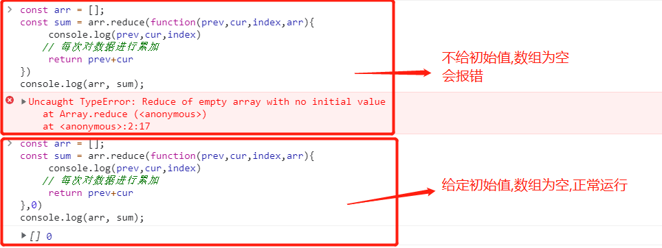
>
>**所以一般来说我们提供初始值更安全**

##### c) reduce的简单用法

>最简单的就是我们常用的数组求和、乘积
>
>```js
>const  arr = [1, 2, 3, 4];
>const sum = arr.reduce((x,y)=>x+y)
>const mul = arr.reduce((x,y)=>x*y)
>console.log( sum ); //求和，10
>console.log( mul ); //求乘积，24
>```

##### d) reduce的高级用法

###### (1) 计算数组中每个元素出现的次数

>```js
>const names = ['Jelyn', '努力学习的汪', 'hong', '努力学习的汪', '努力学习的汪','Jelyn'];
>
>const nameInfo = names.reduce((pre,cur)=>{
>  if(cur in pre){
>     //如果当前项,是pre对象的属性key,则将其value+1
>    pre[cur]++
>  }else{
>    //如果当前项不存在对象key中,则将此项作为其对象key,且给定初始值1
>    pre[cur] = 1 
>  }
>  return pre
>},{})//给定初始值空对象
>console.log(nameInfo);//{Jelyn: 2, 努力学习的汪: 3, hong: 1}
>```

###### (2) 数组去重

>* `includes()`:用来判断一个数组是否包含一个指定的值，如果是返回 true，否则false。
>* `concat()` : 用于连接两个或多个数组;且不会更改现有数组，而是返回一个新数组，其中包含已连接数组的值。
>
>```js
>const names = ['Jelyn', '努力学习的汪', 'hong', '努力学习的汪', '努力学习的汪','Jelyn'];
>let newArr = names.reduce((pre,cur)=>{
>    //如果 当前项不存在于 pre中
>    if(!pre.includes(cur)){
>    //则将 当前项并入 pre数组中
>     return pre.concat(cur)
>     // 也可使用push
>    //pre.push(cur);  return pre ;
>    }else{
>    //如果存在于pre中,则不并入,将pre原样返回,进入下次循环
>      return pre
>    }
>},[])
>console.log(newArr);//['Jelyn', '努力学习的汪', 'hong']
>```

###### (3)  将二维数组转化成一维

>首先,最简单的方法是使用上面讲过的`flat()`方法,他能拉平一层数组,但这里再写个使用reduce实现的栗子
>
>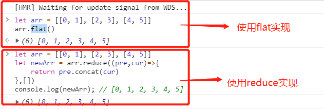 

###### (4) 将多维转换成一维

>与上面的一样,可以用`flat`实现,所以遇到这种情况还是用flat好
>
>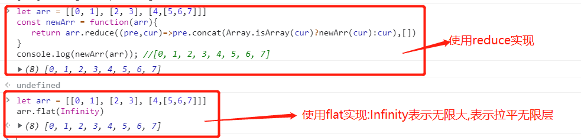

###### (5) 对象数组去重 -->`常用`

>```js
>const obj = {}   
>const arr = [
>        { id: '17011300', name: '努力学习的汪', age: '18' },
>        { id: '170113001', name: 'Jelyn', age: '18' },
>        { id: '17011300', name: '努力学习的汪', age: '18' },
>        { id: '17011300', name: '努力学习的汪', age: '18' },
>        { id: '999', name: 'hongjilin', age: '28' }
>      ]
>const temp = arr.reduce(function (item, next) {
>        if (obj[next.id] && next.id) { return item } else obj[next.id] = true && item.push(next)
>        return item
>      }, [])
>console.log(temp)
>```
>
>###### 解析:
>
>1. 当首次进入时,必定为空,这时就进入了else中,在此处给这个属性加上一个value,同时将这个next存入数组中
>2. 当后续进入时,如果 id重复,则在上轮中已经给他赋值了true,所以此处就判断到重复值,此时将item直接抛出
>3. 当后续进入时,如果 id 不重复,就重复第一步
>4. `&& next.id` 如果加了,则不会筛选没有 id 的数据,如果去除,则会过滤
>
>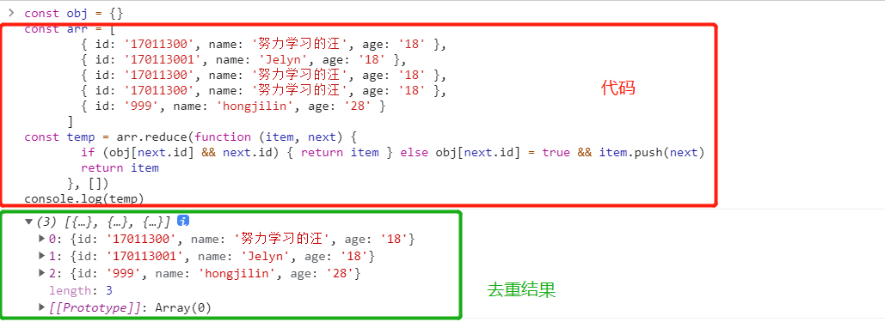 


#### ⑨ 数组实例的 some() 、every()

> **some()** : 方法测试数组中是不是至少有1个元素通过了被提供的函数测试. 它返回的是一个Boolean类型的值. 
>
> **every()**: 方法测试一个数组内的所有元素是否都能通过某个指定函数的测试. 它返回一个布尔值. 

### Ⅵ - 数组的空位

>数组的空位指, 数组的某一个位置没有任何值. 比如, `Array`构造函数返回的数组都是空位. 
>
>```javascript
>Array(3) // [, , ,]
>```
>
>上面代码中, `Array(3)`返回一个具有 3 个空位的数组. 
>
>注意, 空位不是**undefined**, 一个位置的值等于**undefined**, 依然是有值的. `空位是没有任何值`, [ in ]运算符可以说明这一点. 
>
>```javascript
>0 in [undefined, undefined, undefined] // true
>0 in [, , ,] // false
>```
>
>上面代码说明, 第一个数组的 0 号位置是有值的, 第二个数组的 0 号位置没有值. 
>
>ES5 对空位的处理, 已经很不一致了, **大多数情况下会忽略空位**. 
>
>- forEach(), filter(), reduce(),  every()  和 some() 都会跳过空位. 
>-  map() 会跳过空位, 但会保留这个值
>-  join()  和 toString() 会将空位视为 undefined , 而 **undefined** 和 **null**会被处理成空字符串. 
>
>```javascript
>// forEach方法
>[,'a'].forEach((x,i) => console.log(i)); // 1
>
>// filter方法
>['a',,'b'].filter(x => true) // ['a','b']
>
>// every方法
>[,'a'].every(x => x==='a') // true
>
>// reduce方法
>[1,,2].reduce((x,y) => x+y) // 3
>
>// some方法
>[,'a'].some(x => x !== 'a') // false
>
>// map方法
>[,'a'].map(x => 1) // [,1]
>
>// join方法
>[,'a',undefined,null].join('#') // "#a##"
>
>// toString方法
>[,'a',undefined,null].toString() // ",a,,"
>```
>
>ES6 则是明确将空位转为 **undefined**. 
>
>`Array.from`方法会将数组的空位, 转为 **undefined**, 也就是说, 这个方法不会忽略空位. 
>
>```javascript
>Array.from(['a',,'b'])
>// [ "a", undefined, "b" ]
>```
>
>扩展运算符（`...`）也会将空位转为 **undefined**. 
>
>```javascript
>[...['a',,'b']]
>// [ "a", undefined, "b" ]
>```
>
>`copyWithin()`会连空位一起拷贝. 
>
>```javascript
>[,'a','b',,].copyWithin(2,0) // [,"a",,"a"]
>```
>
>`fill()`会将空位视为正常的数组位置. 
>
>```javascript
>new Array(3).fill('a') // ["a","a","a"]
>```
>
>`for...of`循环也会遍历空位. 
>
>```javascript
>let arr = [, ,];
>for (let i of arr) {
>  console.log(1);
>}
>// 1
>// 1
>```
>
>上面代码中, 数组`arr`有两个空位, `for...of`并没有忽略它们. 如果改成`map`方法遍历, 空位是会跳过的. 
>
>[ entries() ]、[ keys() ]、[ values() ]、`find()`和`findIndex()`会将空位处理成 **undefined**. 
>
>```javascript
>// entries()
>[...[,'a'].entries()] // [[0,undefined], [1,"a"]]
>
>// keys()
>[...[,'a'].keys()] // [0,1]
>
>// values()
>[...[,'a'].values()] // [undefined,"a"]
>
>// find()
>[,'a'].find(x => true) // undefined
>
>// findIndex()
>[,'a'].findIndex(x => true) // 0
>```
>
>由于空位的处理规则非常不统一, 所以建议避免出现空位. 

### Ⅶ - Array.prototype.sort() 的排序稳定性

>排序稳定性（stable sorting）是排序算法的重要属性, 指的是排序关键字相同的项目, 排序前后的顺序不变. 
>
>```javascript
>const arr = [
>  'peach',
>  'straw',
>  'apple',
>  'spork'
>];
>
>const stableSorting = (s1, s2) => {
>  if (s1[0] < s2[0]) return -1;
>  return 1;
>};
>
>arr.sort(stableSorting)
>// ["apple", "peach", "straw", "spork"]
>```
>
>上面代码对数组`arr`按照首字母进行排序. 排序结果中, `straw`在`spork`的前面, 跟原始顺序一致, 所以排序算法`stableSorting`是稳定排序. 
>
>```javascript
>const unstableSorting = (s1, s2) => {
>  if (s1[0] <= s2[0]) return -1;
>  return 1;
>};
>
>arr.sort(unstableSorting)
>// ["apple", "peach", "spork", "straw"]
>```
>
>上面代码中, 排序结果是`spork`在`straw`前面, 跟原始顺序相反, 所以排序算法`unstableSorting`是不稳定的. 
>
>常见的排序算法之中, 插入排序、合并排序、冒泡排序等都是稳定的, 堆排序、快速排序等是不稳定的. 不稳定排序的主要缺点是, 多重排序时可能会产生问题. 假设有一个姓和名的列表, 要求按照“姓氏为主要关键字, 名字为次要关键字”进行排序. 开发者可能会先按名字排序, 再按姓氏进行排序. 如果排序算法是稳定的, 这样就可以达到“先姓氏, 后名字”的排序效果. 如果是不稳定的, 就不行. 
>
>早先的 ECMAScript 没有规定, `Array.prototype.sort()`的默认排序算法是否稳定, 留给浏览器自己决定, 这导致某些实现是不稳定的. [ES2019](https://github.com/tc39/ecma262/pull/1340) 明确规定, `Array.prototype.sort()`的默认排序算法必须稳定. 这个规定已经做到了, 现在 JavaScript 各个主要实现的默认排序算法都是稳定的. 

## 9、正则的拓展

> 首先要学好正则基础再来看此部分(或者直接暂时跳过),不然的话,大概率你会在这里看不下去的!!!
>
> 如果对于正则技术不是很急需的也可以先跳过,相对而言ES6正则刚需没那么大
>
> 对于正则基础笔记本人也有进行详细且系统的梳理,需要的可以去看看       -->  **[正则表达式学习笔记](https://gitee.com/hongjilin/hongs-study-notes/tree/master/编程_前端开发学习笔记/正则表达式学习笔记)** 

### Ⅰ- 概括与总结

>- **变更RegExp构造函数入参**: 允许首参数为`正则对象`, 尾参数为`正则修饰符`(返回的正则表达式会忽略原正则表达式的修饰符)
>-  **正则方法调用变更**: 字符串对象的`match()`、`replace()`、`search()`、`split()`内部调用转为调用`RegExp`实例对应的`RegExp.prototype[Symbol.方法]`
>- **u修饰符**: Unicode模式修饰符, 正确处理大于 [ \uFFFF ] 的 [ Unicode字符 ]
>  - `点字符`(.)
>  - `Unicode表示法`
>  - `量词`
>  - `预定义模式`
>  - `i修饰符`
>  - `转义`
>-  **y修饰符**: 粘连修饰符, 确保匹配必须从剩余的第一个位置开始全局匹配(与`g修饰符`作用类似)
>-  **unicode**: 是否设置`u修饰符`
>-  **sticky**: 是否设置`y修饰符`
>-  **flags**: 返回正则表达式的修饰符
>
>> 重点难点
>
>- `y修饰符`隐含头部匹配标志`^`
>- 单单一个`y修饰符`对`match()`只能返回第一个匹配, 必须与`g修饰符`联用才能返回所有匹配

### Ⅱ - RegExp 构造函数

>在 ES5 中, `RegExp`构造函数的参数有两种情况. 
>
>第一种情况是, 参数是字符串, 这时第二个参数表示正则表达式的修饰符（flag 标志）. 
>
>```javascript
>var regex = new RegExp('xyz', 'i');
>// 等价于
>var regex = /xyz/i;
>```
>
>第二种情况是, 参数是一个正则表示式, 这时会返回一个原有正则表达式的拷贝. 
>
>```javascript
>var regex = new RegExp(/xyz/i);
>// 等价于
>var regex = /xyz/i;
>```
>
>但是，ES5 不允许此时使用第二个参数添加修饰符, 否则会报错. 
>
>```javascript
>var regex = new RegExp(/xyz/, 'i');
>// Uncaught TypeError: Cannot supply flags when constructing one RegExp from another
>```
>
>ES6 改变了这种行为. 如果`RegExp`构造函数第一个参数是一个正则对象, 那么可以使用第二个参数指定修饰符. 而且, 返回的正则表达式会忽略原有的正则表达式的修饰符, 只使用新指定的修饰符. 
>
>```javascript
>new RegExp(/abc/ig, 'i').flags
>// "i"
>```
>
>上面代码中, 原有正则对象的修饰符是`ig`, 它会被第二个参数`i`覆盖. 

### Ⅲ -  字符串的正则方法

>字符串对象共有 4 个方法, 可以使用正则表达式: `match()`、`replace()`、`search()`和`split()`. 
>
>ES6 将这 4 个方法, 在语言内部全部调用`RegExp`的实例方法, 从而做到所有与正则相关的方法, 全都定义在`RegExp`对象上. 
>
>- [ String.prototype.match ] 调用 `RegExp.prototype[Symbol.match]`
>- [ String.prototype.replace ]  调用 `RegExp.prototype[Symbol.replace]`
>- [ String.prototype.search ]  调用 `RegExp.prototype[Symbol.search]`
>- [ String.prototype.split ]  调用 `RegExp.prototype[Symbol.split]`

### Ⅳ -  u 修饰符

>ES6 对正则表达式添加了`u`修饰符, 含义为“Unicode 模式”, 用来正确处理大于`\uFFFF`的 Unicode 字符. 也就是说, 会正确处理四个字节的 UTF-16 编码. 
>
>```javascript
>/^\uD83D/u.test('\uD83D\uDC2A') // false
>/^\uD83D/.test('\uD83D\uDC2A') // true
>```
>
>上面代码中, `\uD83D\uDC2A`是一个四个字节的 UTF-16 编码, 代表一个字符. 但是，ES5 不支持四个字节的 UTF-16 编码, 会将其识别为两个字符, 导致第二行代码结果为`true`. 加了`u`修饰符以后，ES6 就会识别其为一个字符, 所以第一行代码结果为`false`. 
>
>一旦加上`u`修饰符号, 就会修改下面这些正则表达式的行为:

#### ① 点字符

>点（`.`）字符在正则表达式中, 含义是除了换行符以外的任意单个字符. 对于码点大于`0xFFFF`的 Unicode 字符, 点字符不能识别, 必须加上`u`修饰符. 
>
>```javascript
>var s = '𠮷';
>/^.$/.test(s) // false
>/^.$/u.test(s) // true
>```
>
>上面代码表示, 如果不添加`u`修饰符, 正则表达式就会认为字符串为两个字符, 从而匹配失败. 

#### ② Unicode 字符表示法

>ES6 新增了使用大括号表示 Unicode 字符, 这种表示法在正则表达式中必须加上`u`修饰符, 才能识别当中的大括号, 否则会被解读为量词. 
>
>```javascript
>/\u{61}/.test('a') // false
>/\u{61}/u.test('a') // true
>/\u{20BB7}/u.test('𠮷') // true
>```
>
>上面代码表示, 如果不加`u`修饰符, 正则表达式无法识别`\u{61}`这种表示法, 只会认为这匹配 61 个连续的`u`. 

#### ③ 量词

>使用`u`修饰符后, 所有量词都会正确识别码点大于`0xFFFF`的 Unicode 字符. 
>
>```javascript
>/a{2}/.test('aa') // true
>/a{2}/u.test('aa') // true
>/𠮷{2}/.test('𠮷𠮷') // false
>/𠮷{2}/u.test('𠮷𠮷') // true
>```
>

#### ④ 预定义模式

>`u`修饰符也影响到预定义模式, 能否正确识别码点大于`0xFFFF`的 Unicode 字符. 
>
>```javascript
>/^\S$/.test('𠮷') // false
>/^\S$/u.test('𠮷') // true
>```
>
>上面代码的`\S`是预定义模式, 匹配所有非空白字符. 只有加了`u`修饰符, 它才能正确匹配码点大于`0xFFFF`的 Unicode 字符. 
>
>利用这一点, 可以写出一个正确返回字符串长度的函数. 
>
>```javascript
>function codePointLength(text) {
>  var result = text.match(/[\s\S]/gu);
>  return result ? result.length : 0;
>}
>var s = '𠮷𠮷';
>s.length // 4
>codePointLength(s) // 2
>```
>

#### ⑤ i 修饰符

>有些 Unicode 字符的编码不同, 但是字型很相近, 比如, `\u004B`与`\u212A`都是大写的`K`. 
>
>```javascript
>/[a-z]/i.test('\u212A') // false
>/[a-z]/iu.test('\u212A') // true
>```
>
>上面代码中, 不加`u`修饰符, 就无法识别非规范的`K`字符. 

#### ⑥ 转义

>没有`u`修饰符的情况下, 正则中没有定义的转义（如逗号的转义`\,`）无效, 而在`u`模式会报错. 
>
>```javascript
>/\,/ // /\,/
>/\,/u // 报错
>```
>
>上面代码中, 没有`u`修饰符时, 逗号前面的反斜杠是无效的, 加了`u`修饰符就报错. 

#### ⑦ RegExp.prototype.unicode 属性 

>正则实例对象新增`unicode`属性, 表示是否设置了`u`修饰符. 
>
>```javascript
>const r1 = /hello/;
>const r2 = /hello/u;
>
>r1.unicode // false
>r2.unicode // true
>```
>
>上面代码中, 正则表达式是否设置了`u`修饰符, 可以从`unicode`属性看出来. 

### Ⅴ -  y 修饰符

>提前剧透, `y`修饰符号相当于 `/g`隐含了头部匹配的标志`^`. 带着这个思维就相对容易理解下方的`粘连`一次

#### ① 正常使用举例说明

>除了`u`修饰符，ES6 还为正则表达式添加了`y`修饰符, 叫做“粘连”（sticky）修饰符. 实际上相当于默认加了一个`^`
>
>`y`修饰符的作用与`g`修饰符类似, 也是全局匹配, 后一次匹配都从上一次匹配成功的下一个位置开始. 不同之处在于, `g`修饰符只要剩余位置中存在匹配就可, 而`y`修饰符确保匹配必须从剩余的第一个位置开始, 这也就是“粘连”的涵义. 
>
>```javascript
>var s = 'aaa_aa_a';
>var r1 = /a+/g;
>var r2 = /a+/y;
>
>r1.exec(s) // ["aaa"]  -->此时剩余字符串[_aa_a]
>r2.exec(s) // ["aaa"]  -->此时剩余字符串[_aa_a]
>
>r1.exec(s) // ["aa"]
>r2.exec(s) // null     -->y必须从第一个位置开始匹配,实际上相当于默认加了一个`^`,所以匹配不到
>```
>
>上面代码有两个正则表达式, 一个使用`g`修饰符, 另一个使用`y`修饰符. 这两个正则表达式各执行了两次, 第一次执行的时候, 两者行为相同, 剩余字符串都是`_aa_a`. 由于`g`修饰没有位置要求, 所以第二次执行会返回结果, 而`y`修饰符要求匹配必须从头部开始, 所以返回`null`. 
>
>如果改一下正则表达式, 保证每次都能头部匹配, `y`修饰符就会返回结果了. 
>
>```javascript
>var s = 'aaa_aa_a';
>var r = /a+_/y;
>
>r.exec(s) // ["aaa_"]
>r.exec(s) // ["aa_"]
>```
>
>上面代码每次匹配, 都是从剩余字符串的头部开始. 

#### ② 使用`lastIndex`属性进行说明

>使用`lastIndex`属性, 可以更好地说明`y`修饰符. 
>
>```javascript
>const REGEX = /a/g;
>// 指定从2号位置（y）开始匹配
>REGEX.lastIndex = 2;
>// 匹配成功
>const match = REGEX.exec('xaya');
>// 在3号位置匹配成功
>match.index // 3
>// 下一次匹配从4号位开始
>REGEX.lastIndex // 4
>// 4号位开始匹配失败
>REGEX.exec('xaya') // null
>```
>
>上面代码中, `lastIndex`属性指定每次搜索的开始位置, `g`修饰符从这个位置开始向后搜索, 直到发现匹配为止. 
>
>`y`修饰符同样遵守`lastIndex`属性, 但是要求必须在`lastIndex`指定的位置发现匹配. 
>
>```javascript
>const REGEX = /a/y;
>// 指定从2号位置开始匹配
>REGEX.lastIndex = 2;
>// 不是粘连, 匹配失败
>REGEX.exec('xaya') // null
>// 指定从3号位置开始匹配
>REGEX.lastIndex = 3;
>// 3号位置是粘连, 匹配成功
>const match = REGEX.exec('xaya');
>match.index // 3
>REGEX.lastIndex // 4
>```
>
>实际上, `y`修饰符号隐含了头部匹配的标志`^`. 
>
>```javascript
>/b/y.exec('aba')// null
>```
>
>上面代码由于不能保证头部匹配, 所以返回`null`. `y`修饰符的设计本意, 就是让头部匹配的标志`^`在全局匹配中都有效. 

#### ③ 使用字符串对象的`replace`方法的举例

>下面是字符串对象的`replace`方法的例子. 
>
>```javascript
>const REGEX = /a/gy;
>'aaxa'.replace(REGEX, '-') // '--xa'
>```
>
>上面代码中, 最后一个`a`因为不是出现在下一次匹配的头部, 所以不会被替换. 
>
>单单一个`y`修饰符对`match`方法, 只能返回第一个匹配, 必须与`g`修饰符联用, 才能返回所有匹配. 
>
>```javascript
>'a1a2a3'.match(/a\d/y) // ["a1"]
>'a1a2a3'.match(/a\d/gy) // ["a1", "a2", "a3"]
>```
>
>`y`修饰符的一个应用, 是从字符串提取 token（词元）, `y`修饰符确保了匹配之间不会有漏掉的字符. 
>
>```javascript
>const TOKEN_Y = /\s*(\+|[0-9]+)\s*/y;
>const TOKEN_G  = /\s*(\+|[0-9]+)\s*/g;
>
>tokenize(TOKEN_Y, '3 + 4')
>// [ '3', '+', '4' ]
>tokenize(TOKEN_G, '3 + 4')
>// [ '3', '+', '4' ]
>
>function tokenize(TOKEN_REGEX, str) {
>  let result = [];
>  let match;
>  while (match = TOKEN_REGEX.exec(str)) {
>    result.push(match[1]);
>  }
>  return result;
>}
>```
>
>上面代码中, 如果字符串里面没有非法字符, `y`修饰符与`g`修饰符的提取结果是一样的. 但是, 一旦出现非法字符, 两者的行为就不一样了. 
>
>```javascript
>tokenize(TOKEN_Y, '3x + 4')
>// [ '3' ]
>tokenize(TOKEN_G, '3x + 4')
>// [ '3', '+', '4' ]
>```
>
>上面代码中, `g`修饰符会忽略非法字符, 而`y`修饰符不会, 这样就很容易发现错误. 

#### ④ RegExp.prototype.sticky 属性

>与`y`修饰符相匹配，ES6 的正则实例对象多了`sticky`属性, 表示是否设置了`y`修饰符. 
>
>```javascript
>var r = /hello\d/y;
>r.sticky // true
>```
>

### Ⅵ - s 修饰符: dotAll 模式

>正则表达式中, 点（`.`）是一个特殊字符, 代表任意的单个字符, 但是有两个例外. 一个是四个字节的 UTF-16 字符, 这个可以用`u`修饰符解决；另一个是行终止符（line terminator character）. 
>
>所谓行终止符, 就是该字符表示一行的终结. 以下四个字符属于“行终止符”. 
>
>- U+000A 换行符（`\n`）
>- U+000D 回车符（`\r`）
>- U+2028 行分隔符（line separator）
>- U+2029 段分隔符（paragraph separator）
>
>```javascript
>/foo.bar/.test('foo\nbar') // false
>```
>
>上面代码中, 因为`.`不匹配`\n`, 所以正则表达式返回`false`. 
>
>但是, 很多时候我们希望匹配的是任意单个字符, 这时有一种变通的写法. 
>
>```javascript
>/foo[^]bar/.test('foo\nbar') // true
>```
>
>这种解决方案毕竟不太符合直觉,  [ES2018](https://github.com/tc39/proposal-regexp-dotall-flag) 引入`s`修饰符, 使得`.`可以匹配任意单个字符. 
>
>```javascript
>/foo.bar/s.test('foo\nbar') // true
>```
>
>这被称为`dotAll`模式, 即点（dot）代表一切字符. 所以, 正则表达式还引入了一个`dotAll`属性, 返回一个布尔值, 表示该正则表达式是否处在`dotAll`模式. 
>
>```javascript
>const re = /foo.bar/s;
>// 另一种写法
>// const re = new RegExp('foo.bar', 's');
>re.test('foo\nbar') // true
>re.dotAll // true
>re.flags // 's'
>```
>
>`/s`修饰符和多行修饰符`/m`不冲突, 两者一起使用的情况下, `.`匹配所有字符, 而`^`和`$`匹配每一行的行首和行尾. 

### Ⅶ - RegExp.prototype.flags 属性 

>ES6 为正则表达式新增了`flags`属性, 会返回正则表达式的修饰符. 
>
>```javascript
>// ES5 的 source 属性
>// 返回正则表达式的正文
>/abc/ig.source
>// "abc"
>
>// ES6 的 flags 属性
>// 返回正则表达式的修饰符
>/abc/ig.flags
>// 'gi'
>```
>

### Ⅷ - Unicode 属性类

>ES2018 [引入](https://github.com/tc39/proposal-regexp-unicode-property-escapes)了一种新的类的写法`\p{...}`和`\P{...}`, 允许正则表达式匹配符合 Unicode 某种属性的所有字符. 
>
>```javascript
>const regexGreekSymbol = /\p{Script=Greek}/u;
>regexGreekSymbol.test('π') // true
>```
>
>上面代码中, `\p{Script=Greek}`指定匹配一个希腊文字母, 所以匹配`π`成功. 
>
>Unicode 属性类要指定属性名和属性值. 
>
>```javascript
>\p{UnicodePropertyName=UnicodePropertyValue}
>```
>
>对于某些属性, 可以只写属性名, 或者只写属性值. 
>
>```javascript
>\p{UnicodePropertyName}
>\p{UnicodePropertyValue}
>```
>
>`\P{…}`是`\p{…}`的反向匹配, 即匹配不满足条件的字符. 
>
>注意, 这两种类只对 Unicode 有效, 所以使用的时候一定要加上`u`修饰符. 如果不加`u`修饰符, 正则表达式使用`\p`和`\P`会报错，ECMAScript 预留了这两个类. 
>
>由于 Unicode 的各种属性非常多, 所以这种新的类的表达能力非常强. 
>
>```javascript
>const regex = /^\p{Decimal_Number}+$/u;
>regex.test('𝟏𝟐𝟑𝟜𝟝𝟞𝟩𝟪𝟫𝟬𝟭𝟮𝟯𝟺𝟻𝟼') // true
>```
>
>上面代码中, 属性类指定匹配所有十进制字符, 可以看到各种字型的十进制字符都会匹配成功. 
>
>`\p{Number}`甚至能匹配罗马数字. 
>
>```javascript
>// 匹配所有数字
>const regex = /^\p{Number}+$/u;
>regex.test('²³¹¼½¾') // true
>regex.test('㉛㉜㉝') // true
>regex.test('ⅠⅡⅢⅣⅤⅥⅦⅧⅨⅩⅪⅫ') // true
>```
>
>下面是其他一些例子. 
>
>```javascript
>// 匹配所有空格
>\p{White_Space}
>
>// 匹配各种文字的所有字母, 等同于 Unicode 版的 \w
>[\p{Alphabetic}\p{Mark}\p{Decimal_Number}\p{Connector_Punctuation}\p{Join_Control}]
>
>// 匹配各种文字的所有非字母的字符, 等同于 Unicode 版的 \W
>[^\p{Alphabetic}\p{Mark}\p{Decimal_Number}\p{Connector_Punctuation}\p{Join_Control}]
>
>// 匹配 Emoji
>/\p{Emoji_Modifier_Base}\p{Emoji_Modifier}?|\p{Emoji_Presentation}|\p{Emoji}\uFE0F/gu
>
>// 匹配所有的箭头字符
>const regexArrows = /^\p{Block=Arrows}+$/u;
>regexArrows.test('←↑→↓↔↕↖↗↘↙⇏⇐⇑⇒⇓⇔⇕⇖⇗⇘⇙⇧⇩') // true
>```
>

### Ⅸ - 具名组匹配

#### ① 简介

>正则表达式使用圆括号进行组匹配. 
>
>```javascript
>const RE_DATE = /(\d{4})-(\d{2})-(\d{2})/;
>```
>
>上面代码中, 正则表达式里面有三组圆括号. 使用`exec`方法, 就可以将这三组匹配结果提取出来. 
>
>```javascript
>const RE_DATE = /(\d{4})-(\d{2})-(\d{2})/;
>
>const matchObj = RE_DATE.exec('1999-12-31');
>const year = matchObj[1]; // 1999
>const month = matchObj[2]; // 12
>const day = matchObj[3]; // 31
>```
>
>组匹配的一个问题是, 每一组的匹配含义不容易看出来, 而且只能用数字序号（比如`matchObj[1]`）引用, 要是组的顺序变了, 引用的时候就必须修改序号. 
>
>ES2018 引入了[具名组匹配](https://github.com/tc39/proposal-regexp-named-groups)（Named Capture Groups）, 允许为每一个组匹配指定一个名字, 既便于阅读代码, 又便于引用. 
>
>```javascript
>const RE_DATE = /(?<year>\d{4})-(?<month>\d{2})-(?<day>\d{2})/;
>
>const matchObj = RE_DATE.exec('1999-12-31');
>const year = matchObj.groups.year; // 1999
>const month = matchObj.groups.month; // 12
>const day = matchObj.groups.day; // 31
>```
>
>上面代码中, “具名组匹配”在圆括号内部, 模式的头部添加 [ “问号 + 尖括号 + 组名” ] （`?<year>`）, 然后就可以在`exec`方法返回结果的`groups`属性上引用该组名. 同时, 数字序号（`matchObj[1]`）依然有效. 
>
>具名组匹配等于为每一组匹配加上了 ID，便于描述匹配的目的. 如果组的顺序变了, 也不用改变匹配后的处理代码. 
>
>如果具名组没有匹配, 那么对应的`groups`对象属性会是`undefined`. 
>
>```javascript
>const RE_OPT_A = /^(?<as>a+)?$/;
>const matchObj = RE_OPT_A.exec('');
>
>matchObj.groups.as // undefined
>'as' in matchObj.groups // true
>```
>
>上面代码中, 具名组`as`没有找到匹配, 那么`matchObj.groups.as`属性值就是`undefined`, 并且`as`这个键名在`groups`是始终存在的. 

#### ② 解构赋值和替换

>有了具名组匹配以后, 可以使用解构赋值直接从匹配结果上为变量赋值. 
>
>```javascript
>let {groups: {one, two}} = /^(?<one>.*):(?<two>.*)$/u.exec('foo:bar');
>one  // foo
>two  // bar
>```
>
>字符串替换时, 使用`$<组名>`引用具名组. 
>
>```javascript
>let re = /(?<year>\d{4})-(?<month>\d{2})-(?<day>\d{2})/u;
>
>'2015-01-02'.replace(re, '$<day>/$<month>/$<year>')
>// '02/01/2015'
>```
>
>上面代码中, `replace`方法的第二个参数是一个字符串, 而不是正则表达式. 
>
>`replace`方法的第二个参数也可以是函数, 该函数的参数序列如下. 
>
>```javascript
>'2015-01-02'.replace(re, (
>   matched, // 整个匹配结果 2015-01-02
>   capture1, // 第一个组匹配 2015
>   capture2, // 第二个组匹配 01
>   capture3, // 第三个组匹配 02
>   position, // 匹配开始的位置 0
>   S, // 原字符串 2015-01-02
>   groups // 具名组构成的一个对象 {year, month, day}
> ) => {
> let {day, month, year} = groups;
> return `${day}/${month}/${year}`;
>});
>```
>
>具名组匹配在原来的基础上, 新增了最后一个函数参数: 具名组构成的一个对象. 函数内部可以直接对这个对象进行解构赋值. 

#### ③ 引用

>如果要在正则表达式内部引用某个“具名组匹配”, 可以使用`\k<组名>`的写法. 
>
>```javascript
>const RE_TWICE = /^(?<word>[a-z]+)!\k<word>$/;
>RE_TWICE.test('abc!abc') // true
>RE_TWICE.test('abc!ab') // false
>```
>
>数字引用（`\1`）依然有效. 
>
>```javascript
>const RE_TWICE = /^(?<word>[a-z]+)!\1$/;
>RE_TWICE.test('abc!abc') // true
>RE_TWICE.test('abc!ab') // false
>```
>
>这两种引用语法还可以同时使用. 
>
>```javascript
>const RE_TWICE = /^(?<word>[a-z]+)!\k<word>!\1$/;
>RE_TWICE.test('abc!abc!abc') // true
>RE_TWICE.test('abc!abc!ab') // false
>```
>

### Ⅹ - String.prototype.matchAll()

>如果一个正则表达式在字符串里面有多个匹配, 现在一般使用`g`修饰符或`y`修饰符, 在循环里面逐一取出. 
>
>```javascript
>var regex = /t(e)(st(\d?))/g;
>var string = 'test1test2test3';
>
>var matches = [];
>var match;
>while (match = regex.exec(string)) {
>  matches.push(match);
>}
>
>matches
>// [
>//   ["test1", "e", "st1", "1", index: 0, input: "test1test2test3"],
>//   ["test2", "e", "st2", "2", index: 5, input: "test1test2test3"],
>//   ["test3", "e", "st3", "3", index: 10, input: "test1test2test3"]
>// ]
>```
>
>上面代码中, `while`循环取出每一轮的正则匹配, 一共三轮. 
>
>[ES2020](https://github.com/tc39/proposal-string-matchall) 增加了`String.prototype.matchAll()`方法, 可以一次性取出所有匹配. 不过, 它返回的是一个遍历器（Iterator）, 而不是数组. 
>
>```javascript
>const string = 'test1test2test3';
>const regex = /t(e)(st(\d?))/g;
>
>for (const match of string.matchAll(regex)) {
>  console.log(match);
>}
>// ["test1", "e", "st1", "1", index: 0, input: "test1test2test3"]
>// ["test2", "e", "st2", "2", index: 5, input: "test1test2test3"]
>// ["test3", "e", "st3", "3", index: 10, input: "test1test2test3"]
>```
>
>上面代码中, 由于`string.matchAll(regex)`返回的是遍历器, 所以可以用`for...of`循环取出. 相对于返回数组, 返回遍历器的好处在于, 如果匹配结果是一个很大的数组, 那么遍历器比较节省资源. 
>
>遍历器转为数组是非常简单的, 使用`...`运算符和`Array.from()`方法就可以了. 
>
>```javascript
>// 转为数组的方法一
>[...string.matchAll(regex)]
>
>// 转为数组的方法二
>Array.from(string.matchAll(regex))
>```

## 10、Symbol

### Ⅰ- 概述与总结

>ES5 的对象属性名都是字符串, 这容易造成属性名的冲突. 比如, 你使用了一个他人提供的对象, 但又想为这个对象添加新的方法（mixin 模式）, 新方法的名字就有可能与现有方法产生冲突. 如果有一种机制, 保证每个属性的名字都是独一无二的就好了, 这样就从根本上防止属性名的冲突. 这就是 ES6 引入`Symbol`的原因. 
>
>ES6 引入了一种新的原始数据类型`Symbol`, 表示独一无二的值. 它是 JavaScript 语言的`第七种数据类型`, 前六种是: `undefined`、`null`、布尔值（Boolean）、字符串（String）、数值（Number）、对象（Object）. 
>
>1. 定义: 独一无二的值,类似于一种标识唯一性的ID
>2. 声明: `const set = Symbol(str)`
>3. 入参: 字符串(可选)
>4. 方法: 
>  - **Symbol()**: 创建以参数作为描述的`Symbol值`(不登记在全局环境)
>  - **Symbol.for()**: 创建以参数作为描述的`Symbol值`, 如存在此参数则返回原有的`Symbol值`(先搜索后创建, 登记在全局环境)
>  - **Symbol.keyFor()**: 返回已登记的`Symbol值`的描述(只能返回`Symbol.for()`的`key`)
>  - **Object.getOwnPropertySymbols()**: 返回对象中所有用作属性名的`Symbol值`的数组
>5. 内置
>  - **Symbol.hasInstance**: 指向一个内部方法, 当其他对象使用`instanceof运算符`判断是否为此对象的实例时会调用此方法
>  - **Symbol.isConcatSpreadable**: 指向一个布尔, 定义对象用于`Array.prototype.concat()`时是否可展开
>  - **Symbol.species**: 指向一个构造函数, 当实例对象使用自身构造函数时会调用指定的构造函数
>  - **Symbol.match**: 指向一个函数, 当实例对象被`String.prototype.match()`调用时会重新定义`match()`的行为
>  - **Symbol.replace**: 指向一个函数, 当实例对象被`String.prototype.replace()`调用时会重新定义`replace()`的行为
>  - **Symbol.search**: 指向一个函数, 当实例对象被`String.prototype.search()`调用时会重新定义`search()`的行为
>  - **Symbol.split**: 指向一个函数, 当实例对象被`String.prototype.split()`调用时会重新定义`split()`的行为
>  - **Symbol.iterator**: 指向一个默认遍历器方法, 当实例对象执行 [ for-of ] 时会调用指定的默认遍历器
>  - **Symbol.toPrimitive**: 指向一个函数, 当实例对象被转为原始类型的值时会返回此对象对应的原始类型值
>  - **Symbol.toStringTag**: 指向一个函数, 当实例对象被`Object.prototype.toString()`调用时其返回值会出现在`toString()`返回的字符串之中表示对象的类型
>  - **Symbol.unscopables**: 指向一个对象, 指定使用`with`时哪些属性会被`with环境`排除
>
>> 数据类型
>
>- **Undefined**
>- **Null**
>- **String**
>- **Number**
>- **Boolean**
>- **Object**(包含`Array`、`Function`、`Date`、`RegExp`、`Error`)
>- **Symbol**
>- [bigint](https://developer.mozilla.org/zh-CN/docs/Glossary/BigInt),   -->**BigInt** 是一种数字类型的数据
>
>> 应用场景
>
>1. 唯一化对象属性名: 属性名属于Symbol类型, 就都是独一无二的, 可保证不会与其他属性名产生冲突
>
>2. 消除`魔术字符串`: 在代码中多次出现且与代码形成强耦合的某一个具体的字符串或数值
>
>  - 魔术字符串指的是, 在代码之中多次出现、与代码形成强耦合的某一个具体的字符串或者数值. 风格良好的代码, 应该尽量消除魔术字符串, 改由含义清晰的变量代替. 
>
>  - ```js
>    function getResults(param){
>    	if(param == '努力学习的汪') console.log('魔术字符串')
>    }
>    // 函数中赋值 '努力学习的汪',所以 '努力学习的汪' 这个字符串就是魔术字符串
>    getResults('努力学习的汪')
>    ```
>
>3. 遍历属性名: 无法通过 [ for-in ] 、 [ for-of ] 、 [Object.keys()] 、 [Object.getOwnPropertyNames()] 、`JSON.stringify()`返回, 只能通过`Object.getOwnPropertySymbols`返回
>
>4. 启用模块的Singleton模式: 调用一个类在任何时候返回同一个实例(`window`和`global`), 使用`Symbol.for()`来模拟全局的`Singleton模式`
>
>> 重点难点
>
>- `Symbol()`生成一个原始类型的值不是对象, 因此`Symbol()`前不能使用`new命令`
>- `Symbol()`参数表示对当前`Symbol值`的描述, 相同参数的`Symbol()`返回值不相等
>- `Symbol值`不能与其他类型的值进行运算
>- `Symbol值`可通过`String()`或`toString()`显式转为字符串
>- `Symbol值`作为对象属性名时, 此属性是公开属性, 但不是私有属性
>- `Symbol值`作为对象属性名时, 只能用方括号运算符(`[]`)读取, 不能用点运算符(`.`)读取
>- `Symbol值`作为对象属性名时, 不会被常规方法遍历得到, 可利用此特性为对象定义`非私有但又只用于内部的方法`

### Ⅱ - 举个简单的例子

> Symbol 值通过`Symbol`函数生成. 这就是说, 对象的属性名现在可以有两种类型, 一种是原来就有的字符串, 另一种就是新增的 Symbol 类型. 凡是属性名属于 Symbol 类型, 就都是独一无二的, 可以保证不会与其他属性名产生冲突. 
>
> 注意, `Symbol`函数前不能使用`new`命令, 否则会报错. 这是因为生成的 Symbol 是一个原始类型的值, 不是对象. 也就是说, 由于 Symbol 值不是对象, 所以不能添加属性. 基本上, 它是一种`类似于字符串的数据类型`. 
>
> `Symbol`函数可以接受一个字符串作为参数, 表示对 Symbol 实例的描述, 主要是为了在控制台显示, 或者转为字符串时, 比较容易区分. 
>
> ```javascript
> let s1 = Symbol('努力学习的汪');
> let s2 = Symbol('hongjilin');
> 
> s1 // Symbol(努力学习的汪)  注意:此处是 Symbol 值
> s2 // Symbol(hongjilin)
> 
> s1.toString() // "Symbol(努力学习的汪)" 注意 此处是字符串
> s2.toString() // "Symbol(hongjilin)"
> ```
>
>   
>
> 上面代码中, `s1`和`s2`是两个 Symbol 值. 如果不加参数, 它们在控制台的输出都是`Symbol()`, 不利于区分. 有了参数以后, 就等于为它们加上了描述, 输出的时候就能够分清, 到底是哪一个值. 
>
> 如果 Symbol 的参数是一个对象, 就会调用该对象的`toString`方法, 将其转为字符串, 然后才生成一个 Symbol 值. 
>
> ```javascript
> const obj = {
>   toString() {
>     return 'abc';
>   }
> };
> const sym = Symbol(obj);
> sym // Symbol(abc)  --> [ Symbol 值 ]
> ```
>
> 注意, `Symbol`函数的参数只是表示对当前 Symbol 值的描述, 因此相同参数的`Symbol`函数的返回值是不相等的. 
>
> ```javascript
> // 没有参数的情况
> let s1 = Symbol();
> let s2 = Symbol();
> s1 === s2 // false
> 
> // 有参数的情况
> let s1 = Symbol('努力学习的汪');
> let s2 = Symbol('努力学习的汪');
> s1 === s2 // false
> ```
>
>  
>
> 上面代码中, `s1`和`s2`都是`Symbol`函数的返回值, 而且参数相同, 但是它们是不相等的. 
>
> Symbol 值不能与其他类型的值进行运算, 会报错. 
>
> ```javascript
> let sym = Symbol('My symbol');
> "your symbol is " + sym
> // TypeError: can't convert symbol to string
> `your symbol is ${sym}`
> // TypeError: can't convert symbol to string
> ```
>
> 但是，Symbol 值可以显式转为字符串. 
>
> ```javascript
> let sym = Symbol('My symbol');
> 
> String(sym) // 'Symbol(My symbol)'
> sym.toString() // 'Symbol(My symbol)'
> ```
>
> 另外，Symbol 值也可以转为布尔值, 但是不能转为数值. 
>
> ```javascript
> let sym = Symbol();
> Boolean(sym) // true
> !sym  // false
> 
> if (sym) {}
> Number(sym) // TypeError
> sym + 2 // TypeError
> ```

### Ⅲ - Symbol.prototype.description

>创建 Symbol 的时候, 可以添加一个描述. 
>
>```javascript
>const sym = Symbol('努力学习的汪');
>```
>
>上面代码中, `sym`的描述就是字符串`努力学习的汪`. 
>
>但是, 读取这个描述需要将 Symbol 显式转为字符串, 即下面的写法. 
>
>```javascript
>const sym = Symbol('努力学习的汪');
>
>String(sym) // "Symbol(努力学习的汪)"
>sym.toString() // "Symbol(努力学习的汪)"
>```
>
>上面的用法不是很方便. [ES2019](https://github.com/tc39/proposal-Symbol-description) 提供了一个实例属性`description`, 直接返回 Symbol 的描述. 
>
>```javascript
>const sym = Symbol('努力学习的汪');
>sym.description // "努力学习的汪"
>```
>
>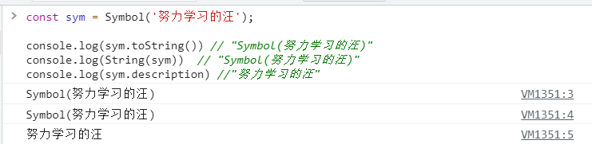 

### Ⅳ - 作为属性名的 Symbol

#### ① 举个栗子:

>由于每一个 Symbol 值都是不相等的, 这意味着 Symbol 值可以作为标识符, 用于对象的属性名, 就能保证不会出现同名的属性. 这对于一个对象由多个模块构成的情况非常有用, 能防止某一个键被不小心改写或覆盖. 
>
>```javascript
>let mySymbol = Symbol();
>
>// 第一种写法
>let a = {};
>a[mySymbol] = 'Hello!';
>
>// 第二种写法
>let a = {
>  [mySymbol]: 'Hello!'
>};
>
>// 第三种写法
>let a = {};
>Object.defineProperty(a, mySymbol, { value: 'Hello!' });
>
>// 以上写法都得到同样结果
>a[mySymbol] // "Hello!"
>```
>
>上面代码通过方括号结构和 [ Object.defineProperty ] , 将对象的属性名指定为一个 Symbol 值. 
>

#### ② 不能用点运算符

>注意，Symbol 值作为对象属性名时, 不能用点运算符. 
>
>```javascript
>const mySymbol = Symbol();
>const a = {};
>//不可这样用,这样用就没效果了
>a.mySymbol = '努力学习的汪!'; //因为点运算符后面总是字符串, 所以不会读取`mySymbol`作为标识名所指代的那个值, 导致`a`的属性名实际上是一个字符串, 而不是一个 Symbol 值. 
>a[mySymbol] // undefined     -->此处以 创建的Symbol值 作为key名进行读取
>a['mySymbol'] // "努力学习的汪!"  -->此处就是字符串作为key名进行读取
>```
>
> 
>
>上面代码中, 因为点运算符后面总是字符串, 所以不会读取`mySymbol`作为标识名所指代的那个值, 导致`a`的属性名实际上是一个字符串, 而不是一个 Symbol 值. 
>
>同理, 在对象的内部, 使用 Symbol 值定义属性时，Symbol 值必须放在方括号之中. 
>
>```javascript
>let s = Symbol();
>let obj = {
>[s]: function (arg) { ... }
>};
>obj[s](123);
>```
>
>上面代码中, 如果`s`不放在方括号中, 该属性的键名就是字符串`s`, 而不是`s`所代表的那个 Symbol 值. 
>
>采用增强的对象写法, 上面代码的`obj`对象可以写得更简洁一些. 
>
>```javascript
>let obj = {
>[s](arg) { ... }
>};
>```
>

#### ③ Symbol 类型用于定义常量

>Symbol 类型还可以用于定义一组常量, 保证这组常量的值都是不相等的. 
>
>```javascript
>const log = {};
>
>log.levels = {
>DEBUG: Symbol('debug'),
>INFO: Symbol('info'),
>WARN: Symbol('warn')
>};
>console.log(log.levels.DEBUG, 'debug message');
>console.log(log.levels.INFO, 'info message');
>```
>
>下面是另外一个例子. 
>
>```javascript
>const COLOR_RED    = Symbol();
>const COLOR_GREEN  = Symbol();
>
>function getComplement(color) {
>switch (color) {
>case COLOR_RED:
>return COLOR_GREEN;
>case COLOR_GREEN:
>return COLOR_RED;
>default:
>throw new Error('Undefined color');
>}
>}
>```
>
>常量使用 Symbol 值最大的好处, 就是其他任何值都不可能有相同的值了, 因此可以保证上面的`switch`语句会按设计的方式工作. 
>
>还有一点需要注意，Symbol 值作为属性名时, 该属性还是公开属性, 不是私有属性. 

#### ④ 应用实例:消除魔术字符串

##### a) 魔术字符串

>魔术字符串指的是, 在代码之中多次出现、与代码形成强耦合的某一个具体的字符串或者数值. 风格良好的代码, 应该尽量消除魔术字符串, 改由含义清晰的变量代替. 
>
>```js
>function getResults(param){
>	if(param == '努力学习的汪') console.log('魔术字符串')
>}
>// 函数中赋值 '努力学习的汪',所以 '努力学习的汪' 这个字符串就是魔术字符串
>getResults('努力学习的汪')
>```
>
>上面代码中, 字符串`Triangle`就是一个魔术字符串. 它多次出现, 与代码形成“强耦合”, 不利于将来的修改和维护. 

##### b) 常用的消除魔术字符串的方法

>常用的消除魔术字符串的方法, 就是把它写成一个变量
>
>```js
>const name='努力学习的汪'
>function getResults(param){
>	if(param == name) console.log('消除魔术字符串')
>}
>getResults(name) //消除魔术字符串
>```
>
>上面代码中, 我们把`努力学习的汪`写成 [ name ] 属性, 这样就消除了强耦合. 

##### c) 改用Symbol值

>如果仔细分析, 可以发现`shapeType.triangle`等于哪个值并不重要, 只要确保不会跟其他`shapeType`属性的值冲突即可. 因此, 这里就很适合改用 Symbol 值. 
>
>```javascript
>const name=Symbol('努力学习的汪')
>function getResults(param){
>	if(param == name) console.log('Symbol消除魔术字符串')
>}
>getResults(name)  // Symbol消除魔术字符串
>```
>
>上面代码中, 除了将`努力学习的汪`的值设为一个 Symbol，其他地方都不用修改. 

### Ⅴ - 属性名的遍历

#### ①  概念引出

>Symbol 作为属性名, 遍历对象的时候, 该属性不会出现在`for...in`、`for...of`循环中, 也不会被 [Object.keys()] 、 [Object.getOwnPropertyNames()] 、`JSON.stringify()`返回. 
>
>但是, 它也不是私有属性, 有一个`Object.getOwnPropertySymbols()`方法, 可以获取指定对象的所有 Symbol 属性名. 该方法返回一个数组, 成员是当前对象的所有用作属性名的 Symbol 值. 
>
>```javascript
>const obj = {};
>let a = Symbol('a');
>let b = Symbol('b');
>
>obj[a] = 'Hello';
>obj[b] = 'World';
>const objectSymbols = Object.getOwnPropertySymbols(obj);
>
>objectSymbols// [Symbol(a), Symbol(b)]
>```
>
>上面代码是`Object.getOwnPropertySymbols()`方法的示例, 可以获取所有 Symbol 属性名. 
>

#### ② 获取Symbol键名方式 

>下面是另一个例子, `Object.getOwnPropertySymbols()`方法与`for...in`循环、`Object.getOwnPropertyNames`方法进行对比的例子. 
>
>```javascript
>const name = Symbol('name');
>const obj={
>    [name]:'Symbol:努力学习的汪',  //赋一个Symbol属性
>    other:'正常属性'   //给一个正常属性做对比
>}
>
>console.log('------------ for --------------')
>for (let i in obj) {
>  console.log(i);  //只打印一个 other
>}
>console.log('------------ Object.keys --------------')
>const objKeys=Object.keys(obj)  //打印一个 [ "other" ]
>console.log(objKeys) 
>console.log('------------ Object.getOwnPropertyNames --------------')
>const PropertyNames=Object.getOwnPropertyNames(obj) // 打印一个 [ "other" ]
>console.log(PropertyNames);
>console.log('------------ Object.getOwnPropertySymbols --------------')
>const PropertySymbols= Object.getOwnPropertySymbols(obj) // [Symbol(name)]
>console.log(PropertySymbols)
>```
>
>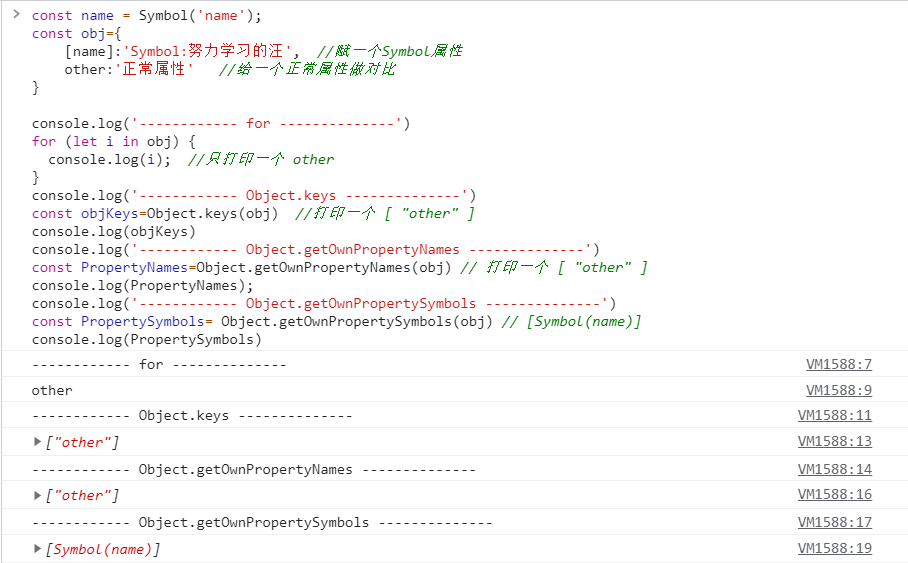 上面代码中, 使用`for...in`循环和 [Object.getOwnPropertyNames()] 方法都得不到 Symbol 键名, 需要使用`Object.getOwnPropertySymbols()`方法. 
>

#### ③ 获取所有类型的键名

>另一个新的 API，`Reflect.ownKeys()`方法可以返回所有类型的键名, 包括常规键名和 Symbol 键名. 
>
>```javascript
>let obj = {
>  [Symbol('my_key')]: 1,
>  enum: 2,
>  nonEnum: 3
>};
>
>Reflect.ownKeys(obj)
>//  ["enum", "nonEnum", Symbol(my_key)]
>```
>

#### ④ 利用特性 营造 非私有的内部方法的效果

>由于以 Symbol 值作为键名, 不会被常规方法遍历得到. 我们可以利用这个特性, 为对象定义一些非私有的、但又希望只用于内部的方法. 
>
>```javascript
>let size = Symbol('私有'); //可以 Symbol('字符串'),也可以不要Symbol(),但加了会更有辨识度
>
>class Collection { //注意,此类中的所有size属性都是指的上方  Symbol('私有')
>  constructor() {
>    this[size] = 0; //此处构造函数初始化时 给 [size]进行了初始化赋值-->[Symbol('私有')]=0
>  }
>
>  add(item) {
>    this[this[size]] = item; //此时 1. 先取出 this[size] 的值,此时为0,作为新的key,存入item 
>    this[size]++;   //此时 this[size] == 1 
>    //第一次调用 log:Collection {0: "调用一次添加", Symbol(私有): 1}  
>  }
>
>  static sizeOf(instance) {
>    return instance[size];  // 返回传入实例中的 size 属性
>  }
>}
>
>let x = new Collection();
>console.log('------------ 先获取初始化时数据 --------------')
>console.log('此时的size属性值',Collection.sizeOf(x)) // 此时的size属性值 0
>console.log(x)        //Collection {Symbol(私有): 0}
>
>console.log('------------ 调用一次添加 --------------')
>x.add('调用一次添加'); //调用一次添加
>console.log('此时的size属性值',Collection.sizeOf(x)) //此时的size属性值 1
>console.log(x) //Collection {0: "调用一次添加", Symbol(私有): 1}
>
>console.log('------------ 调用两次添加 --------------')
>x.add('调用2次添加'); //第二次调用
>console.log('此时的size属性值',Collection.sizeOf(x)) // 此时的size属性值 2
>console.log(x) // Collection {0: "调用一次添加", 1: "调用2次添加", Symbol(私有): 2}
>
>console.log('------------ 查看不同方法取出的key --------------')
>console.log(Object.keys(x)) // ["0", "1"]
>console.log(Object.getOwnPropertyNames(x)) // ["0", "1"]
>console.log(Object.getOwnPropertySymbols(x)) // [Symbol(私有)]
>
>```
>
>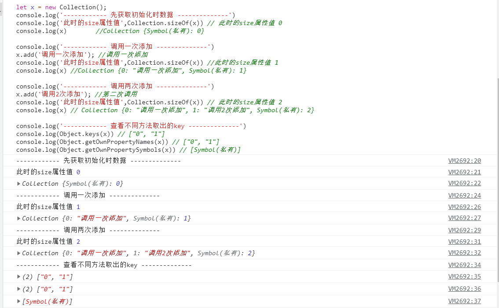 上面代码中, 对象`x`的`size`属性是一个 Symbol 值, 所以`Object.keys(x)`、`Object.getOwnPropertyNames(x)`都无法获取它. 这就造成了一种非私有的内部方法的效果. 

### Ⅵ - Symbol.for()，Symbol.keyFor()

#### ① Symbol.for()

>有时, 我们希望重新使用同一个 Symbol 值, `Symbol.for()`方法可以做到这一点. 它接受一个字符串作为参数, 然后搜索有没有以该参数作为名称的 Symbol 值. 如果有, 就返回这个 Symbol 值, 否则就新建一个以该字符串为名称的 Symbol 值, 并将其注册到全局. 
>
>```javascript
>let s1 = Symbol.for('hongjilin');
>let s2 = Symbol.for('hongjilin');
>let h1 = Symbol('努力学习的汪');
>let h2 = Symbol('努力学习的汪');
>console.log(s1 === s2 ,h1 === h2)
>```
>
>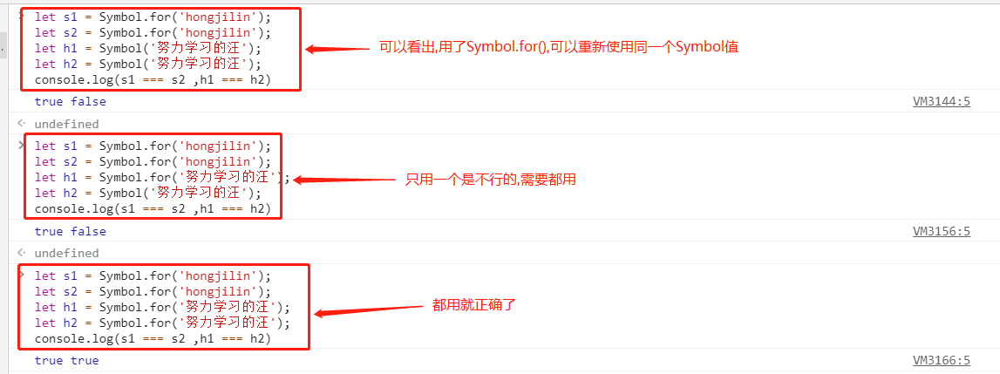 上面代码中, `s1`和`s2`都是 Symbol 值, 但是它们都是由同样参数的`Symbol.for`方法生成的, 所以实际上是同一个值. 
>
>`Symbol.for()`与`Symbol()`这两种写法, 都会生成新的 Symbol. 它们的区别是 : 
>
>>* 前者会被登记在全局环境中供搜索, 后者不会. 
>>* `Symbol.for()`不会每次调用就返回一个新的 Symbol 类型的值, 而是会先检查给定的`key`是否已经存在, 如果不存在才会新建一个值. 
>>* 如果你调用`Symbol.for("cat")`30 次, 每次都会返回同一个 Symbol 值;
>>* 但是调用`Symbol("cat")`30 次, 会返回 30 个不同的 Symbol 值. 

#### ② Symbol.keyFor()

>`Symbol.keyFor()`方法返回一个已登记的 Symbol 类型值的`key`. 
>
>```javascript
>let s1 = Symbol.for("努力学习的汪");
>console.log(Symbol.keyFor(s1)) // "努力学习的汪"
>
>let s2 = Symbol("努力学习的汪");
>console.log(Symbol.keyFor(s2)) // undefined
>```
>
>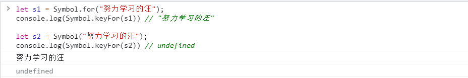 上面代码中, 变量`s2`属于未登记的 Symbol 值, 所以返回`undefined`. 
>
>注意, `Symbol.for()`为 Symbol 值登记的名字, 是全局环境的, 不管有没有在全局环境运行. 
>
>```javascript
>function foo() {
>  return Symbol.for('努力学习的汪'); //在函数内部:局部作用域中运行
>}
>
>const x = foo();
>const y = Symbol.for('努力学习的汪');
>console.log(x === y); // true
>```
>
>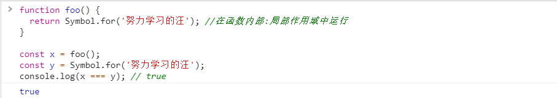 上面代码中, `Symbol.for('bar')`是函数内部运行的, 但是生成的 Symbol 值是登记在全局环境的. 所以, 第二次运行`Symbol.for('bar')`可以取到这个 Symbol 值. 
>
>`Symbol.for()`的这个全局登记特性, 可以用在不同的 iframe 或 service worker 中取到同一个值. 
>
>```javascript
>iframe = document.createElement('iframe');
>iframe.src = String(window.location);
>document.body.appendChild(iframe);
>
>iframe.contentWindow.Symbol.for('foo') === Symbol.for('foo')
>// true
>```
>
>上面代码中，iframe 窗口生成的 Symbol 值, 可以在主页面得到. 

### Ⅶ - 应用实例: 模块的 Singleton 模式

#### ① 模块的 Singleton 模式

>Singleton 模式指的是调用一个类, 任何时候返回的都是同一个实例. 
>
>对于 Node 来说, 模块文件可以看成是一个类. 怎么保证每次执行这个模块文件, 返回的都是同一个实例呢？
>
>很容易想到, 可以把实例放到顶层对象`global`. 
>
>```javascript
>// mod.js
>function A() {
>  this.userName = '努力学习的汪';
>}
>if (!global._userName)  global._userName = new A();
>module.exports = global._userName;
>```
>
>然后, 加载上面的`mod.js`. 
>
>```javascript
>const a = require('./mod.js');
>console.log(a.foo);// 努力学习的汪
>```
>
>上面代码中, 变量`a`任何时候加载的都是`A`的同一个实例. 
>
>但是, 这里有一个问题, 全局变量`global._foo`是可写的, 任何文件都可以修改. 
>
>```javascript
>global._userName = { userName: '不努力学习的单身汪' };
>const a = require('./mod.js');
>console.log(a.userName); // 不努力学习的单身汪
>```
>
>上面的代码, 会使得加载`mod.js`的脚本都失真. 

#### ②  Symbol.for() 的应用

>为了防止这种情况出现, 我们就可以使用 Symbol. 
>
>```javascript
>// mod.js
>const FOO_KEY = Symbol.for('userName'); //此处使用Symbol.for()进行生成,目的为多次加载此js,生成的symbol都相同
>function A() {
>  this.userName = '努力学习的汪';
>}
>
>if (!global[FOO_KEY])  global[FOO_KEY] = new A();
>module.exports = global[FOO_KEY];
>```
>
>上面代码中, 可以保证`global[FOO_KEY]`不会被无意间覆盖, 但还是可以被改写. 
>
>```javascript
>//仍可以改写,但通常不会被无意间覆盖.会写出这个代码通常就是故意要覆盖的
>global[Symbol.for('userName')] = { userName: '不努力学习的单身汪' };
>const a = require('./mod.js');
>```
>

#### ③ Symbol() 的应用

>如果键名使用`Symbol`方法生成, 那么外部将无法引用这个值, 当然也就无法改写. 
>
>```javascript
>// mod.js
>//不使用Symbol.for(),而是直接使用Symbol(),这样就确保不会被改写,理解吃力的话要重新看下上面的方法描述
>const FOO_KEY = Symbol('userName'); 
>// 后面代码相同 ……
>```
>
>上面代码将导致其他脚本都无法引用`FOO_KEY`. 但这样也有一个问题:
>
>> 就是如果多次执行这个脚本, 每次得到的`FOO_KEY`都是不一样的. 虽然 Node 会将脚本的执行结果缓存, 一般情况下, 不会多次执行同一个脚本, 但是用户可以手动清除缓存, 所以也不是绝对可靠. 

### Ⅷ - 内置的 Symbol 值

>除了定义自己使用的 Symbol 值以外，ES6 还提供了 11 个内置的 Symbol 值, 指向语言内部使用的方法. 
>
>对于新手来说用的很少,可以暂时先跳过此部分,此处举例几个

#### ① Symbol.hasInstance

##### a) 方法介绍

>对象的 [Symbol.hasInstance] 属性, 指向一个内部方法. 当其他对象使用instanceof运算符, 判断是否为该对象的实例时, 会调用这个方法. 比如, `foo instanceof Foo`在语言内部, 实际调用的是`Foo[Symbol.hasInstance](foo)`. 
>
>```js
>class MyClass {
>  [Symbol.hasInstance](foo) {
>    return false;
>  }
>}
>class TestClass {
>  [Symbol.hasInstance](foo) {
>    return true;
>  }
>}
>console.log([1, 2, 3] instanceof new MyClass()) // false
>console.log([1, 2, 3] instanceof new TestClass()) // true
>```
>
>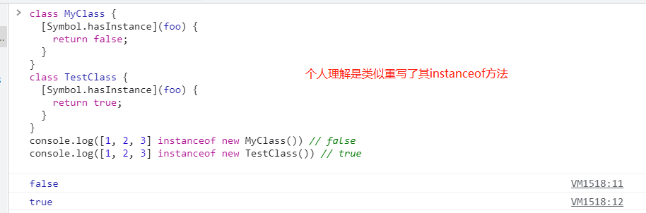

##### b) 举个栗子 

>下面是另一个例子. 
>
>```javascript
>class MyClass {
>  [Symbol.hasInstance](foo) {
>    return foo instanceof Array;
>  }
>  static [Symbol.hasInstance](obj) { //静态方法
>    return Number(obj) % 2 === 0;
>  }
>}
>var x = new MyClass()
>console.log([1, 2, 3] instanceof new MyClass()); // true //我是调用的动态方法
>console.log(x[Symbol.hasInstance]([0, 0, 0,]));//true //我是调用的动态方法
>console.log(2 instanceof MyClass); //true 我是调用静态方法
>console.log(MyClass[Symbol.hasInstance](2));//true 我是调用了静态方法
>console.log(x instanceof MyClass); //false 因为修改了静态方法(不传入值返回肯定是false). x本身就是MyClass的实例, 如果注释了静态方法就会返回true. 
>```
>
>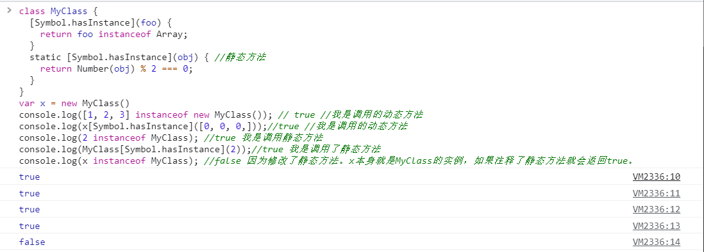

#### ② Symbol.isConcatSpreadable

>对象的`Symbol.isConcatSpreadable`属性等于一个布尔值, 表示该对象用于`Array.prototype.concat()`时, 是否可以展开. 
>
>```javascript
>let arr1 = ['c', 'd'];
>['a', 'b'].concat(arr1, 'e') // ['a', 'b', 'c', 'd', 'e']
>arr1[Symbol.isConcatSpreadable] // undefined
>
>let arr2 = ['c', 'd'];
>arr2[Symbol.isConcatSpreadable] = false;
>['a', 'b'].concat(arr2, 'e') // ['a', 'b', ['c','d'], 'e']
>```
>
>上面代码说明, 数组的默认行为是可以展开, `Symbol.isConcatSpreadable`默认等于`undefined`. 该属性等于`true`时, 也有展开的效果. 
>
>类似数组的对象正好相反, 默认不展开. 它的`Symbol.isConcatSpreadable`属性设为`true`, 才可以展开. 
>
>```javascript
>let obj = {length: 2, 0: 'c', 1: 'd'};
>['a', 'b'].concat(obj, 'e') // ['a', 'b', obj, 'e']
>
>obj[Symbol.isConcatSpreadable] = true;
>['a', 'b'].concat(obj, 'e') // ['a', 'b', 'c', 'd', 'e']
>```
>
>`Symbol.isConcatSpreadable`属性也可以定义在类里面. 
>
>```javascript
>class A1 extends Array {
>  constructor(args) {
>    super(args);
>    this[Symbol.isConcatSpreadable] = true;
>  }
>}
>class A2 extends Array {
>  constructor(args) {
>    super(args);
>  }
>  get [Symbol.isConcatSpreadable] () {
>    return false;
>  }
>}
>let a1 = new A1();
>a1[0] = 3;
>a1[1] = 4;
>let a2 = new A2();
>a2[0] = 5;
>a2[1] = 6;
>[1, 2].concat(a1).concat(a2)
>// [1, 2, 3, 4, [5, 6]]
>```
>
>上面代码中, 类`A1`是可展开的, 类`A2`是不可展开的, 所以使用`concat`时有不一样的结果. 
>
>注意, `Symbol.isConcatSpreadable`的位置差异, `A1`是定义在实例上, `A2`是定义在类本身, 效果相同. 

#### ③ 其他

> 几个内置方法不常用,需要时可以往上查阅,便暂不赘述


## 11、Set 数据结构

> `常用`

### Ⅰ - 概括与总结

#### ① Set

>- 定义: 类似于数组的数据结构, 成员值都是唯一且没有重复的值
>- 声明: `const set = new Set(arr)`
>- 入参: 具有`Iterator接口`的数据结构
>- 属性
>  - **constructor**: 构造函数, 返回Set
>  - **size**: 返回实例成员总数
>- 方法
>  - **add()**: 添加值, 返回实例
>  - **delete()**: 删除值, 返回布尔
>  - **has()**: 检查值, 返回布尔
>  - **clear()**: 清除所有成员
>  - **keys()**: 返回以属性值为遍历器的对象
>  - **values()**: 返回以属性值为遍历器的对象
>  - **entries()**: 返回以属性值和属性值为遍历器的对象
>  - **forEach()**: 使用回调函数遍历每个成员
>
>> 应用场景
>
>- 去重字符串: `[...new Set(str)].join("")`
>- 去重数组: `[...new Set(arr)]`或`Array.from(new Set(arr))`
>- 集合数组
>  - 声明: `const a = new Set(arr1)`
>  - 并集: `new Set([...a, ...b])`
>  - 交集: `new Set([...a].filter(v => b.has(v)))`  //此处的has指的是set自带的方法
>  - 差集: `new Set([...a].filter(v => !b.has(v)))`
>- 映射集合
>  - 声明: `let set = new Set(arr)`
>  - 映射: `set = new Set([...set].map(v => v * 2))`或`set = new Set(Array.from(set, v => v * 2))`
>
>> 重点难点
>
>- 遍历顺序: 插入顺序
>- 没有键只有值, 可认为键和值两值相等
>- 添加多个`NaN`时, 只会存在一个`NaN`
>- 添加相同的对象时, 会认为是不同的对象
>- 添加值时不会发生类型转换(`5 !== "5"`)
>- `keys()`和`values()`的行为完全一致, `entries()`返回的遍历器同时包括键和值且两值相等

#### ② WeakSet

>- 定义: 和Set结构类似, 成员值只能是对象
>- 声明: `const set = new WeakSet(arr)`
>- 入参: 具有`Iterator接口`的数据结构
>- 属性
>  - **constructor**: 构造函数, 返回WeakSet
>- 方法
>  - **add()**: 添加值, 返回实例
>  - **delete()**: 删除值, 返回布尔
>  - **has()**: 检查值, 返回布尔
>
>> 应用场景
>
>- 储存DOM节点: DOM节点被移除时自动释放此成员, 不用担心这些节点从文档移除时会引发内存泄漏
>- 临时存放一组对象或存放跟对象绑定的信息: 只要这些对象在外部消失, 它在`WeakSet结构`中的引用就会自动消去
>
>> 重点难点
>
>- 成员都是`弱引用`, 垃圾回收机制不考虑`WeakSet结构`对此成员的引用
>- 成员不适合引用, 它会随时消失, 因此ES6规定`WeakSet结构不可遍历`
>- 其他对象不再引用成员时, 垃圾回收机制会自动回收此成员所占用的内存, 不考虑此成员是否还存在于`WeakSet结构`中

### Ⅱ -  基本用法

#### ① 基础示例

>ES6 提供了新的数据结构 Set. 它类似于数组, 但是成员的值都是唯一的, 没有重复的值. 
>
>`Set`本身是一个构造函数, 用来生成 Set 数据结构. 
>
>```javascript
>const s = new Set();
>['努','努','力','学习','的','学习','汪'].forEach(item => s.add(item));
>console.log(s) //Set(5) {"努", "力", "学习", "的", "汪"}
>```
>
>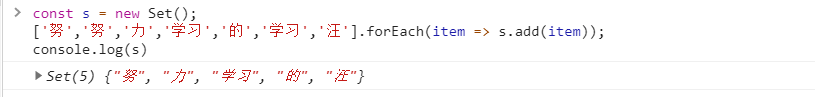 
>上面代码通过`add()`方法向 Set 结构加入成员, 结果表明 Set 结构不会添加重复的值. 

#### ② 接受一个数组作为参数

>`Set`函数可以接受一个数组（或者具有 iterable 接口的其他数据结构）作为参数, 用来初始化. 
>
>```javascript
>// 例一
>const set = new Set([1, 2, 3, 4, 4]);
>console.log([...set]) //[1, 2, 3, 4]
>// 例二
>const items = new Set([1, 2, 3, 4, 5, 5, 5, 5]);
>console.log(items.size) // 5
>// 例三
>const setDiv = new Set(document.querySelectorAll('div'));
>console.log(setDiv.size) // 这个就根据你的当前页面梳理而定
>// 类似于
>const setDIV = new Set();
>document
> .querySelectorAll('div')
> .forEach(div => setDIV.add(div));
>console.log(setDiv.size) // 这个就根据你的当前页面梳理而定
>```
>
>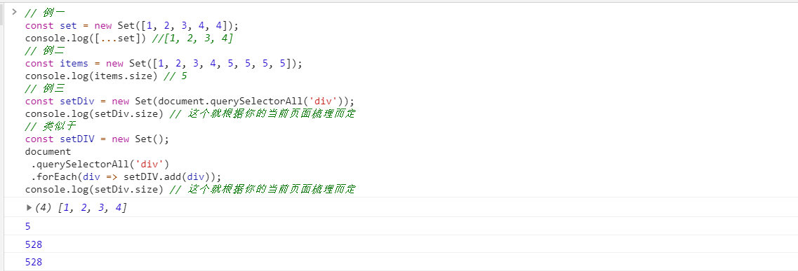 上面代码中, 例一和例二都是`Set`函数接受数组作为参数, 例三是接受类似数组的对象作为参数. 
>

#### ③ 用于数组或字符串去重

>上面代码也展示了一种去除数组重复成员的方法. 
>
>```javascript
>// 去除数组的重复成员
>[...new Set(array)]
>```
>
>上面的方法也可以用于, 去除字符串里面的重复字符. 
>
>```javascript
>[...new Set('ababbc')].join('')
>// "abc"
>```
>

#### ④ 不会发生类型转换

>向 Set 加入值的时候, 不会发生类型转换, 所以`5`和`"5"`是两个不同的值. Set 内部判断两个值是否不同, 使用的算法叫做“Same-value-zero equality”, 它类似于精确相等运算符（`===`）, 主要的区别是向 Set 加入值时认为`NaN`等于自身, 而精确相等运算符认为`NaN`不等于自身. 
>
>```javascript
>let set = new Set();
>let a = NaN;
>let b = NaN;
>set.add(a);
>set.add(b);
>set // Set {NaN}
>```
>
>上面代码向 Set 实例添加了两次`NaN`, 但是只会加入一个. 这表明, 在 Set 内部, 两个`NaN`是相等的. 
>
>另外, 两个对象总是不相等的. 
>
>```javascript
>let set = new Set();
>set.add({});
>console.log(set,set.size) //Set(1) {{…}} 1
>set.add({});
>console.log(set,set.size) //Set(2) {{…}, {…}} 2
>```
>
> 

#### ⑤ 判断数组中是否有对象重复

>```js
> // 判断 级别与代号 是否重复,如果重复则不予通过
> const tempLists =  [
>     {itemLevelName:'Ⅱ',itemCode:'UT'},
>     {itemLevelName:'Ⅰ',itemCode:'UT'},
>     {itemLevelName:'Ⅱ',itemCode:'UT'},
> ]
> // 项目代号与级别名称如果都相同,则认为是重复对象
> const tempSetArr = new Set()
> tempLists.map(item => {
>   // 利用Set数组的唯一性,将级别名称与代号名称拼接,加入后如果重复则不会加入
>   tempSetArr.add(`${item.itemLevelName}${item.itemCode}`)
> })
> // 判断去重后的数组长度是否与当前界面上的长度一致,如果不一致,则输入的内容重复了,校验不通过
> if (tempSetArr.size !== tempLists.length) {
>    this.$message.error('列表不可有重复项，请修改后重新提交')
>   return
>  }
>```

### Ⅲ - Set 实例的属性和方法

>Set 结构的实例有以下属性. 
>
>- `Set.prototype.constructor`: 构造函数, 默认就是`Set`函数. 
>- `Set.prototype.size`: 返回`Set`实例的成员总数. 
>
>Set 实例的方法分为两大类: 操作方法（用于操作数据）和遍历方法（用于遍历成员）. 下面先介绍四个操作方法. 
>
>- `Set.prototype.add(value)`: 添加某个值, 返回 Set 结构本身. 
>- `Set.prototype.delete(value)`: 删除某个值, 返回一个布尔值, 表示删除是否成功. 
>- `Set.prototype.has(value)`: 返回一个布尔值, 表示该值是否为`Set`的成员. 
>- `Set.prototype.clear()`: 清除所有成员, 没有返回值. 
>
>上面这些属性和方法的实例如下. 
>
>```javascript
>let s=new Set()
>s.add(6).add(6).add('努力').add('学习的汪').add('学习的汪');// 注意 [6] [学习的汪] 被加入了两次
>console.log(s,s.size) // Set(3) {6, "努力", "学习的汪"} 3
>console.log(s.has(6))  //true
>console.log(s.has('努力'))  //true
>console.log(s.has('努力学习的单身汪'))  //false
>//删除 [ 6 ]
>s.delete(6); 
>console.log(s.has(6))  // false
>console.log(s,s.size)  //Set(2) {"努力", "学习的汪"} 2
>```
>
>下面是一个对比, 看看在判断是否包括一个键上面, `Object`结构和`Set`结构的写法不同. 
>
>```javascript
>// 对象的写法
>const properties = {
>  'width': 1,
>  'height': 1
>};
>if (properties[someName]) console.log("对象的写法")
>
>// Set的写法
>const properties = new Set();
>properties.add('width');
>properties.add('height');
>if (properties.has(someName))console.log('Set的写法')
>```
>
>`Array.from`方法可以将 Set 结构转为数组. 
>
>```javascript
>const items = new Set([1, 2, 3, 4, 5]);
>const array = Array.from(items);
>```
>
>这就提供了去除数组重复成员的另一种方法. 
>
>```javascript
>function dedupe(array) {
>  return Array.from(new Set(array));
>}
>dedupe([1, 1, 2, 3]) // [1, 2, 3]
>```
>

### Ⅳ - 遍历操作

>Set 结构的实例有四个遍历方法, 可以用于遍历成员. 
>
>- `Set.prototype.keys()`: 返回键名的遍历器
>- `Set.prototype.values()`: 返回键值的遍历器
>- `Set.prototype.entries()`: 返回键值对的遍历器
>- `Set.prototype.forEach()`: 使用回调函数遍历每个成员
>
>需要特别指出的是, `Set`的遍历顺序就是插入顺序. 这个特性有时非常有用, 比如使用 Set 保存一个回调函数列表, 调用时就能保证按照添加顺序调用

#### ① `keys()`, `values()`, `entries()`

>`keys`方法、`values`方法、`entries`方法返回的都是遍历器对象（详见《Iterator 对象》）. 由于 Set 结构没有键名, 只有键值（或者说键名和键值是同一个值）, 所以`keys`方法和`values`方法的行为完全一致. 
>
>```javascript
>let set = new Set(['努力', '学习', '的汪']);
>console.log('---------  set.keys()  -------------');
>for (let item of set.keys()) { console.log(item) }
>console.log('---------  set.values()  -------------');
>for (let item of set.values()) { console.log(item) }
>console.log('---------  set.entries()  -------------');
>for (let item of set.entries()) {  console.log(item) }
>```
>
>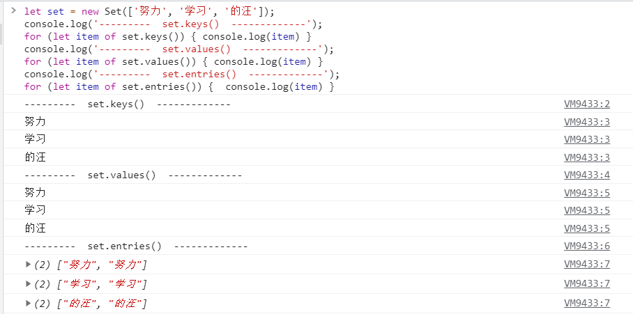 上面代码中, `entries`方法返回的遍历器, 同时包括键名和键值, 所以每次输出一个数组, 它的两个成员完全相等. 
>
>Set 结构的实例默认可遍历, 它的默认遍历器生成函数就是它的`values`方法. 
>
>```javascript
>Set.prototype[Symbol.iterator] === Set.prototype.values // true
>```
>
>这意味着, 可以省略`values`方法, 直接用`for...of`循环遍历 Set. 
>
>```javascript
>let set = new Set(['努力', '学习', '的汪']);
>for (let x of set) { console.log(x) }
>```
>
>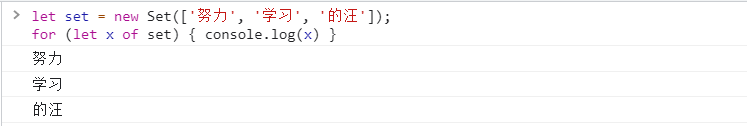  

#### ② forEach()

>Set 结构的实例与数组一样, 也拥有`forEach`方法, 用于对每个成员执行某种操作, 没有返回值. 
>
>```javascript
>let set = new Set(['努力','学习', '的大帅哥']);
>set.forEach((value, key) => console.log(key + ' : ' + value))
>```
>
>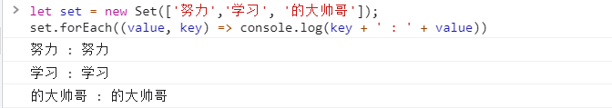 
>
>> - 上面代码说明, `forEach`方法的参数就是一个处理函数. 
>> - 该函数的参数与数组的`forEach`一致, 依次为键值、键名、集合本身（上例省略了该参数）. 
>> - 这里需要注意，Set 结构的键名就是键值（两者是同一个值), 因此第一个参数与第二个参数的值永远都是一样的. 
>
>另外, `forEach`方法还可以有第二个参数, 表示绑定处理函数内部的`this`对象. 
>

#### ③ 遍历的应用

>扩展运算符（`...`）内部使用`for...of`循环, 所以也可以用于 Set 结构. 
>
>```javascript
>let set = new Set(['努力', '学习', '的汪']);
>let arr = [...set]; // ["努力", "学习", "的汪"]
>```
>
>扩展运算符和 Set 结构相结合, 就可以去除数组的重复成员. 
>
>```javascript
>let arr = ['努力', '的汪','努力', '学习', '的汪','不学习'];
>let unique = [...new Set(arr)]; //  ["努力", "的汪", "学习", "不学习"]
>```
>
>而且, 数组的`map`和`filter`方法也可以间接用于 Set 了. 
>
>```javascript
>let set = new Set([1, 2, 3]);
>set = new Set([...set].map(x => x * 2));
>// 返回Set结构: {2, 4, 6}
>
>let set = new Set([1, 2, 3, 4, 5, 5]);
>set = new Set([...set].filter(x => (x % 2) == 0));
>// 返回Set结构: {2, 4}
>```
>
>因此使用 Set 可以很容易地实现并集（Union）、交集（Intersect）和差集（Difference）. 
>
>```javascript
>let a = new Set([1, 2, 3]);
>let b = new Set([4, 3, 2]);
>
>// 并集
>let union = new Set([...a, ...b]);
>// Set {1, 2, 3, 4}
>
>// 交集
>let intersect = new Set([...a].filter(x => b.has(x)));
>// set {2, 3}
>
>// （a 相对于 b 的）差集
>let difference = new Set([...a].filter(x => !b.has(x)));
>// Set {1}
>```
>

### Ⅴ -  改变原来的 Set 结构

>如果想在遍历操作中, 同步改变原来的 Set 结构, 目前没有直接的方法, 但有两种变通方法. 一种是利用原 Set 结构映射出一个新的结构, 然后赋值给原来的 Set 结构；另一种是利用`Array.from`方法. 
>
>```javascript
>// 方法一
>let set = new Set([1, 2, 3]);
>set = new Set([...set].map(val => val * 2));
>// set的值是2, 4, 6
>
>// 方法二
>let set = new Set([1, 2, 3]);
>set = new Set(Array.from(set, val => val * 2));
>// set的值是2, 4, 6
>```
>
>上面代码提供了两种方法, 直接在遍历操作中改变原来的 Set 结构. 

### Ⅵ - WeakSet

> 到目前为止本人对于此知识点( WeakSet )实践遇到较少,所以此处笔记主要为知识点摘录,后续若实践遇到,再来补充自己理解

#### ① 含义

>WeakSet 结构与 Set 类似, 也是不重复的值的集合. 但是, 它与 Set 有两个区别. 
>
>首先，WeakSet 的成员只能是对象, 而不能是其他类型的值. 
>
>```javascript
>const ws = new WeakSet();
>ws.add(1)
>// TypeError: Invalid value used in weak set
>ws.add(Symbol())
>// TypeError: invalid value used in weak set
>```
>
>上面代码试图向 WeakSet 添加一个数值和`Symbol`值, 结果报错, 因为 WeakSet 只能放置对象. 
>
>其次，WeakSet 中的对象都是弱引用, 即垃圾回收机制不考虑 WeakSet 对该对象的引用, 也就是说, 如果其他对象都不再引用该对象, 那么垃圾回收机制会自动回收该对象所占用的内存, 不考虑该对象还存在于 WeakSet 之中. 
>
>这是因为垃圾回收机制依赖引用计数, 如果一个值的引用次数不为`0`, 垃圾回收机制就不会释放这块内存. 结束使用该值之后, 有时会忘记取消引用, 导致内存无法释放, 进而可能会引发内存泄漏. WeakSet 里面的引用, 都不计入垃圾回收机制, 所以就不存在这个问题. 因此，WeakSet 适合临时存放一组对象, 以及存放跟对象绑定的信息. 只要这些对象在外部消失, 它在 WeakSet 里面的引用就会自动消失. 
>
>由于上面这个特点，WeakSet 的成员是不适合引用的, 因为它会随时消失. 另外, 由于 WeakSet 内部有多少个成员, 取决于垃圾回收机制有没有运行, 运行前后很可能成员个数是不一样的, 而垃圾回收机制何时运行是不可预测的, 因此 ES6 规定 WeakSet 不可遍历. 
>
>这些特点同样适用于本章后面要介绍的 WeakMap 结构. 

#### ② 语法

>WeakSet 是一个构造函数, 可以使用`new`命令, 创建 WeakSet 数据结构. 
>
>```javascript
>const ws = new WeakSet();
>```
>
>作为构造函数，WeakSet 可以接受一个数组或类似数组的对象作为参数. （实际上, 任何具有 Iterable 接口的对象, 都可以作为 WeakSet 的参数. ）该数组的所有成员, 都会自动成为 WeakSet 实例对象的成员. 
>
>```javascript
>const a = [[1, 2], [3, 4]];
>const ws = new WeakSet(a);
>// WeakSet {[1, 2], [3, 4]}
>```
>
>上面代码中, `a`是一个数组, 它有两个成员, 也都是数组. 将`a`作为 WeakSet 构造函数的参数, `a`的成员会自动成为 WeakSet 的成员. 
>
>注意, 是`a`数组的成员成为 WeakSet 的成员, 而不是`a`数组本身. 这意味着, 数组的成员只能是对象. 
>
>```javascript
>const b = [3, 4];
>const ws = new WeakSet(b);
>// Uncaught TypeError: Invalid value used in weak set(…)
>```
>
>上面代码中, 数组`b`的成员不是对象, 加入 WeakSet 就会报错. 
>
>WeakSet 结构有以下三个方法. 
>
>- **WeakSet.prototype.add(value)**: 向 WeakSet 实例添加一个新成员. 
>- **WeakSet.prototype.delete(value)**: 清除 WeakSet 实例的指定成员. 
>- **WeakSet.prototype.has(value)**: 返回一个布尔值, 表示某个值是否在 WeakSet 实例之中. 
>
>下面是一个例子. 
>
>```javascript
>const ws = new WeakSet();
>const obj = {};
>const foo = {};
>
>ws.add(window);
>ws.add(obj);
>
>ws.has(window); // true
>ws.has(foo);    // false
>
>ws.delete(window);
>ws.has(window);    // false
>```
>
>WeakSet 没有`size`属性, 没有办法遍历它的成员. 
>
>```javascript
>ws.size // undefined
>ws.forEach // undefined
>
>ws.forEach(function(item){ console.log('WeakSet has ' + item)})
>// TypeError: undefined is not a function
>```
>
>上面代码试图获取`size`和`forEach`属性, 结果都不能成功. 
>
>WeakSet 不能遍历, 是因为成员都是弱引用, 随时可能消失, 遍历机制无法保证成员的存在, 很可能刚刚遍历结束, 成员就取不到了. WeakSet 的一个用处, 是储存 DOM 节点, 而不用担心这些节点从文档移除时, 会引发内存泄漏. 
>
>下面是 WeakSet 的另一个例子. 
>
>```javascript
>const foos = new WeakSet()
>class Foo {
>  constructor() {
>    foos.add(this)
>  }
>  method () {
>    if (!foos.has(this)) {
>      throw new TypeError('Foo.prototype.method 只能在Foo的实例上调用！');
>    }
>  }
>}
>```
>
>上面代码保证了`Foo`的实例方法, 只能在`Foo`的实例上调用. 这里使用 WeakSet 的好处是, `foos`对实例的引用, 不会被计入内存回收机制, 所以删除实例的时候, 不用考虑`foos`, 也不会出现内存泄漏. 

### Ⅶ - 做个题目吧

>光说不练假把式,试着回答几个问题检测下是否理解Set 数据结构

### ① 代码阅读题1:

> ```js
> let s = new Set();
> s.add([1]);
> s.add([1]);
> console.log(s.size);
> ```
>
> **问: 打印出来的size的值是多少？**
>
> 答: 2，两个[1]定义的是两个不同的数组, 在内存中的存储地址不同, 所以是不同的值

### ② 代码阅读题2:

>```js
>var str='abstract';
>console.log(new Set([...str]).size);//6  重复的无法加入
>```

## 12、Map 数据结构

### Ⅰ - 概括与总结

#### ①  Map

>- 定义: 类似于对象的数据结构, 成员键是任何类型的值
>- 声明: `const set = new Map(arr)`
>- 入参: 具有`Iterator接口`且每个成员都是一个双元素数组的数据结构
>- 属性
>  - **constructor**: 构造函数, 返回Map
>  - **size**: 返回实例成员总数
>- 方法
>  - **get()**: 返回键值对
>  - **set()**: 添加键值对, 返回实例
>  - **delete()**: 删除键值对, 返回布尔
>  - **has()**: 检查键值对, 返回布尔
>  - **clear()**: 清除所有成员
>  - **keys()**: 返回以键为遍历器的对象
>  - **values()**: 返回以值为遍历器的对象
>  - **entries()**: 返回以键和值为遍历器的对象
>  - **forEach()**: 使用回调函数遍历每个成员
>
>> 重点难点
>
>- 遍历顺序: 插入顺序
>- 对同一个键多次赋值, 后面的值将覆盖前面的值
>- 对同一个对象的引用, 被视为一个键
>- 对同样值的两个实例, 被视为两个键
>- 键跟内存地址绑定, 只要内存地址不一样就视为两个键
>- 添加多个以`NaN`作为键时, 只会存在一个以`NaN`作为键的值
>- `Object结构`提供`字符串—值`的对应, `Map结构`提供`值—值`的对应

#### ② WeakMap

>- 定义: 和Map结构类似, 成员键只能是对象
>- 声明: `const set = new WeakMap(arr)`
>- 入参: 具有`Iterator接口`且每个成员都是一个双元素数组的数据结构
>- 属性
>  - **constructor**: 构造函数, 返回WeakMap
>- 方法
>  - **get()**: 返回键值对
>  - **set()**: 添加键值对, 返回实例
>  - **delete()**: 删除键值对, 返回布尔
>  - **has()**: 检查键值对, 返回布尔
>
>> 应用场景
>
>- 储存DOM节点: DOM节点被移除时自动释放此成员键, 不用担心这些节点从文档移除时会引发内存泄漏
>- 部署私有属性: 内部属性是实例的弱引用, 删除实例时它们也随之消失, 不会造成内存泄漏
>
>> 重点难点
>
>- 成员键都是`弱引用`, 垃圾回收机制不考虑`WeakMap结构`对此成员键的引用
>- 成员键不适合引用, 它会随时消失, 因此ES6规定`WeakMap结构不可遍历`
>- 其他对象不再引用成员键时, 垃圾回收机制会自动回收此成员所占用的内存, 不考虑此成员是否还存在于`WeakMap结构`中
>- 一旦不再需要, 成员会自动消失, 不用手动删除引用
>- 弱引用的`只是键而不是值`, 值依然是正常引用
>- 即使在外部消除了成员键的引用, 内部的成员值依然存在

### Ⅱ - 含义和基本用法

#### ① map()出现的意义

>JavaScript 的对象（Object）, 本质上是键值对的集合（Hash 结构）, 但是传统上只能用字符串当作键. 这给它的使用带来了很大的限制. 
>
>```javascript
>const data = {};
>const element = document.querySelector('div'); //取得的 HTMLDivElement 元素对象
>
>data[element] = '努力学习的汪'; //尝试将其当作key 并赋值
>console.log(element) // "<div>...</div>"
>console.log(data['[object HTMLDivElement]']) // "努力学习的汪"
>```
>
>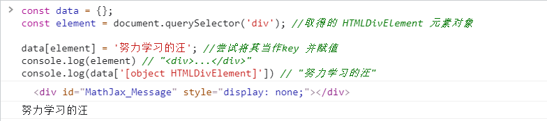 上面代码原意是将一个 DOM 节点作为对象`data`的键, 但是由于对象只接受字符串作为键名, 所以`element`被自动转为字符串`[object HTMLDivElement]`. 
>
>为了解决这个问题，ES6 提供了 Map 数据结构. 它类似于对象, 也是键值对的集合, 但是“键”的范围不限于字符串, 各种类型的值（包括对象）都可以当作键. 也就是说，Object 结构提供了“字符串—值”的对应，Map 结构提供了“值—值”的对应, 是一种更完善的 Hash 结构实现. 如果你需要“键值对”的数据结构，Map 比 Object 更合适. 
>
>```javascript
>const m = new Map();
>const o = { name: 'Hello World' };
>console.log(m) //Map(0) {}
>console.log('-------  写入O属性 ----------')
>m.set(o, '努力学习的汪') 
>console.log(m.keys())  //MapIterator {{…}}
>console.log(m.get(o))  //努力学习的汪
>console.log(m) //Map(1) {{…} => "努力学习的汪"}
>console.log('-------  删除O属性 ----------')
>m.delete(o) 
>console.log(m)  //Map(0) {}
>```
>
>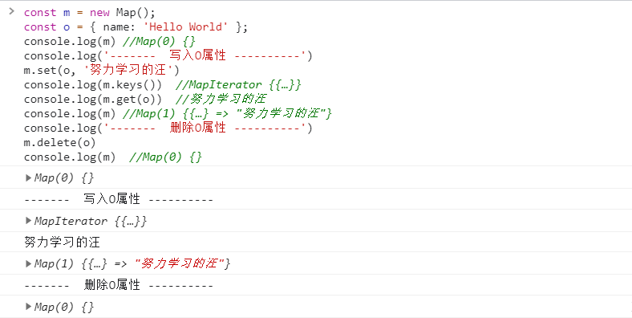 
>
>上面代码使用 Map 结构的`set`方法, 将对象`o`当作`m`的一个键, 然后又使用`get`方法读取这个键, 接着使用`delete`方法删除了这个键. 

#### ② 接受数组作为参数

>上面的例子展示了如何向 Map 添加成员. 作为构造函数，Map 也可以接受一个数组作为参数. 该数组的成员是一个个表示键值对的数组. 
>
>```javascript
>const map = new Map([
>['name', '努力学习的汪'],
>['title', 'Author']
>]);
>map.size // 2
>map.has('name') // true
>map.get('name') // "努力学习的汪"
>map.has('title') // true
>map.get('title') // "Author"
>```
>
>上面代码在新建 Map 实例时, 就指定了两个键`name`和`title`. 
>
>`Map`构造函数接受数组作为参数, 实际上执行的是下面的算法. 
>
>```javascript
>const items = [
>['name', '努力学习的汪'],
>['title', 'Author']
>];
>const map = new Map();
>items.forEach(
>([key, value]) => map.set(key, value)
>);
>```
>
>事实上, 不仅仅是数组, 任何具有 Iterator 接口、且每个成员都是一个双元素的数组的数据结构（详见《Iterator》一章）都可以当作`Map`构造函数的参数. 这就是说, `Set`和`Map`都可以用来生成新的 Map. 
>
>```javascript
>const set = new Set([
>['name', '努力学习的汪'],
>['bar', 2]
>]);
>const m1 = new Map(set);
>console.log(m1)              //Map(2) {"name" => "努力学习的汪", "bar" => 2}
>console.log(m1.get('name'))  //努力学习的汪
>
>const m2 = new Map([['baz', 3]]);
>console.log(m2)				//Map(1) {"baz" => 3}
>
>const m3 = new Map(m2);
>console.log(m3) 			//Map(1) {"baz" => 3}
>```
>
>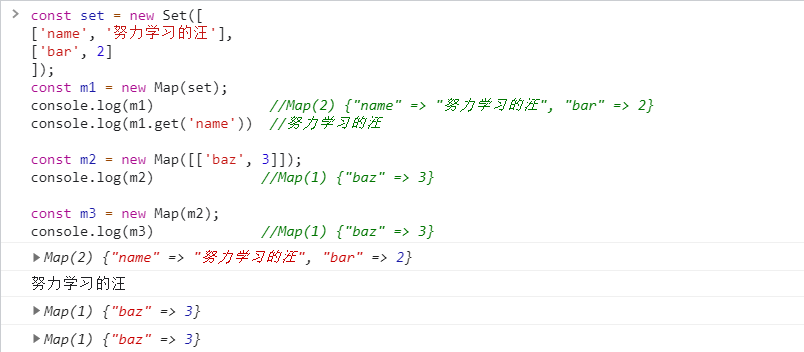 
>
>上面代码中, 我们分别使用 Set 对象和 Map 对象, 当作`Map`构造函数的参数, 结果都生成了新的 Map 对象. 

#### ③ 对同一个键多次赋值, 后面的值将覆盖前面的值

>如果对同一个键多次赋值, 后面的值将覆盖前面的值. 
>
>```javascript
>const map = new Map();
>map.set(1, 'hongjilin').set(1, '努力学习的汪');
>console.log(map) //Map(1) {1 => "努力学习的汪"}
>```
>
>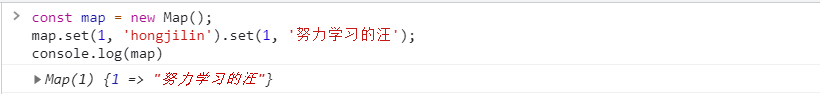 上面代码对键`1`连续赋值两次, 后一次的值覆盖前一次的值. 
>
>如果读取一个未知的键, 则返回`undefined`. 
>
>```javascript
>new Map().get('随便输入的键值')  // undefined
>```
>

#### ④  只有对同一个对象的引用，Map 结构才将其视为同一个键

>注意, 只有对同一个对象的引用，Map 结构才将其视为同一个键. 这一点要非常小心. 
>
>```javascript
>const map = new Map();
>//实际上下方两个 ['name'] 是不同实例,相当于只是语法糖 ['name'] == 等同 ==> new Array('name')
>map.set(['name'], '努力学习的汪'); 
>map.get(['name']) // undefined
>```
>
>上面代码的`set`和`get`方法, 表面是针对同一个键, 但实际上这是两个不同的数组实例, 内存地址是不一样的, 因此`get`方法无法读取该键, 返回`undefined`. 
>
>同理, 同样的值的两个实例, 在 Map 结构中被视为两个键. 
>
>```javascript
>const map = new Map();
>const k1 = ['name'];   //实际上相当于是语法糖 ['name'] == 等同 ==> new Array('name')
>const k2 = ['name'];
>map.set(k1, 111).set(k2, 222);
>console.log(map)  // Map(2) {Array(1) => 111, Array(1) => 222}
>console.log(map.get(k1),map.get(k2))  // 111 222
>```
>
>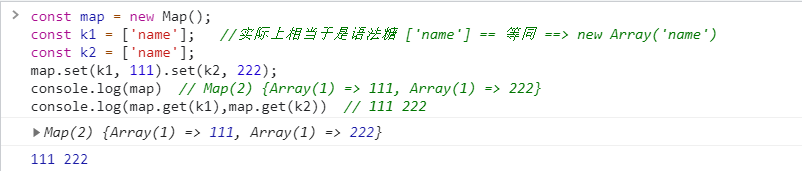 
>
> 上面代码中, 变量 [ k1 ] 和 [ k2 ] 的值是一样的, 但是它们在 Map 结构中被视为两个键. 
>
>由上可知, `Map 的键实际上是跟内存地址绑定的`, 只要内存地址不一样, 就视为两个键. 这就解决了同名属性碰撞（clash）的问题, 我们扩展别人的库的时候, 如果使用对象作为键名, 就不用担心自己的属性与原作者的属性同名. 
>
>如果 Map 的键是一个简单类型的值（数字、字符串、布尔值）, 则只要两个值严格相等，Map 将其视为一个键, 比如`0`和`-0`就是一个键, 布尔值`true`和字符串`true`则是两个不同的键. 另外, `undefined`和`null`也是两个不同的键. 虽然`NaN`不严格相等于自身, 但 Map 将其视为同一个键. 
>
>```javascript
>let map = new Map();
>
>map.set(-0, 123);
>map.get(+0) // 123
>
>map.set(true, 1);
>map.set('true', 2);
>map.get(true) // 1
>
>map.set(undefined, 3);
>map.set(null, 4);
>map.get(undefined) // 3
>
>map.set(NaN, 123);
>map.get(NaN) // 123
>```

### Ⅲ -  实例的属性和操作方法

> Map 结构的实例有以下属性和操作方法.  

#### ① size 属性

>`size`属性返回 Map 结构的成员总数. 
>
>```javascript
>const map = new Map();
>map.set('handsome', true);
>map.set('name', '努力学习的汪');
>map.size // 2
>```
>

#### ② Map.prototype.set(key, value)

>`set`方法设置键名`key`对应的键值为`value`, 然后返回整个 Map 结构. 如果`key`已经有值, 则键值会被更新, 否则就新生成该键. 
>
>```javascript
>const m = new Map();
>m.set('age', 18)        // 键是字符串
>m.set(666, '努力学习的汪')     // 键是数值
>m.set(undefined, 'xxxx')    // 键是 undefined
>console.log(m)  //Map(3) {"age" => 18, 666 => "努力学习的汪", undefined => "xxxx"}
>```
>
>`set`方法返回的是当前的`Map`对象, 因此可以采用链式写法. 
>
>```javascript
>let map = new Map().set(1, '努力').set(2, '学习').set(3, '的汪');
>console.log(map)    //Map(3) {1 => "努力", 2 => "学习", 3 => "的汪"}
>```
>
>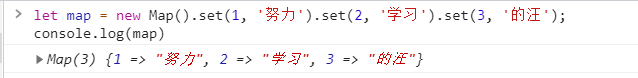 

#### ③  Map.prototype.get(key)

>`get`方法读取`key`对应的键值, 如果找不到`key`, 返回`undefined`. 
>
>```javascript
>const m = new Map();
>const hello = function() {console.log('Learn ES6')};
>const name = {name : "hongjilin"}
>m.set(hello, '你好 ES6') // 键是函数
>m.set(name, '努力学习的汪') // 键是对象
>m.set('name','字符串名字') // 键是字符串
>
>console.log("键是函数:",m.get(hello),";键是对象:",m.get(name),";键是字符串:",m.get('name'))
>console.log('找不到的键',m.get('找不到的键'))
>```
>
> 

#### ④ Map.prototype.has(key)

>`has`方法返回一个布尔值, 表示某个键是否在当前 Map 对象之中. 
>
>```javascript
>const m = new Map();
>m.set('age', 18)        // 键是字符串
>m.set(666, '努力学习的汪')     // 键是数值
>m.set(undefined, 'xxxx')    // 键是 undefined
>
>console.log(m.has('age'))   // true
>console.log(m.has(666))		  // true
>console.log(m.has(undefined))    // true
>console.log(m.has('不存在的键'))  // false
>```
>

#### ⑤ Map.prototype.delete(key)

>`delete`方法删除某个键, 返回`true`. 如果删除失败, 返回`false`. 
>
>```javascript
>const m = new Map();
>m.set(undefined, 'undefined!');
>console.log(m,m.has(undefined)) // Map(1) {undefined => "undefined!"} true
>
>m.delete(undefined)
>console.log(m,m.has(undefined)) // Map(0) {} false
>```
>

#### ⑥ Map.prototype.clear()

>`clear`方法清除所有成员, 没有返回值. 
>
>```javascript
>let map = new Map();
>map.set('name', '努力学习的汪').set('handsome', true);
>
>console.log(map) // Map(2) {"name" => "努力学习的汪", "handsome" => true}
>map.clear()
>console.log(map) // Map(0) {}
>```
>

### Ⅳ -  遍历方法

>Map 结构原生提供三个遍历器生成函数和一个遍历方法. 
>
>- `Map.prototype.keys()`: 返回键名的遍历器. 
>- `Map.prototype.values()`: 返回键值的遍历器. 
>- `Map.prototype.entries()`: 返回所有成员的遍历器. 
>- `Map.prototype.forEach()`: 遍历 Map 的所有成员. 

#### ① Map 的遍历顺序就是插入顺序

>需要特别注意的是，Map 的遍历顺序就是插入顺序. 
>
>```javascript
>const map = new Map([
>  ['name', '努力学习的汪'],
>  ['handsome',  'yes'],
>]);
>console.log('------------- keys() ---------------')
>for (let key of map.keys()) { console.log(key) }
>console.log('------------- values() ---------------')
>for (let value of map.values()) { console.log(value) }
>console.log('------------- entries() ---------------')
>for (let item of map.entries()) { console.log(item[0], item[1]) }
>// 或者
>for (let [key, value] of map.entries()) { console.log(key, value) }
>// 等同于使用map.entries()
>for (let [key, value] of map) { console.log(key, value) }
>```
>
>  上面代码最后的那个例子, 表示 Map 结构的默认遍历器接口（`Symbol.iterator`属性), 就是`entries`方法. 
>
>```javascript
>map[Symbol.iterator] === map.entries  // true
>```
>

#### ② Map 结构转为数组结构

>Map 结构转为数组结构, 比较快速的方法是使用扩展运算符（`...`）. 
>
>```javascript
>const map = new Map([ [1, 'one'],[2, 'two'],[3, 'three'] ]);
>console.log([...map.keys()])// [1, 2, 3]
>console.log([...map.values()])// ['one', 'two', 'three']
>console.log([...map.entries()])// [[1,'one'], [2, 'two'], [3, 'three']]
>console.log([...map])// [[1,'one'], [2, 'two'], [3, 'three']]
>```
>
>结合数组的`map`方法、`filter`方法, 可以实现 Map 的遍历和过滤（Map 本身没有`map`和`filter`方法）. 
>
>```javascript
>const map = new Map().set(1, 'a').set(2, 'b').set(3, 'c');
>
>const map1 = new Map( [...map].filter(([k, v]) => k < 3) );
>console.log(map1) // Map(2) {1 => "a", 2 => "b"}
>
>const map2 = new Map( [...map].map(([k, v]) => [k * 2, '*' + v]) );
>console.log(map2) //Map(3) {2 => "*a", 4 => "*b", 6 => "*c"}
>```
>

#### ③ Map 的  `forEach()`  方法

>Map 还有一个`forEach`方法, 与数组的`forEach`方法类似, 也可以实现遍历. 
>
>```javascript
>map.forEach(function(value, key, map) {
>  console.log("Key: %s, Value: %s", key, value);
>});
>```
>
>`forEach`方法还可以接受第二个参数, 用来绑定`this`. 下面举个栗子说明:
>
>```javascript
>const map = new Map().set('name', '努力学习的汪').set('handsome', true).set(3, '不读书');
>const reporter = {
>  report: function(key, value) { console.log("Key: %s, Value: %s", key, value);}
>};
>//第二个参数绑定后,可以通过this取得其内部属性方法
>map.forEach(function(value, key, map) {this.report(key, value); }, reporter);
>//不绑定示例  报错!!
>map.forEach(function(value, key, map) {this.report(key, value); });
>```
>
> 上面代码中, `forEach`方法的回调函数的`this`, 就指向`reporter`. 

### Ⅴ - 与其他数据结构的互相转换

#### ① Map 转为数组

>前面已经提过，Map 转为数组最方便的方法, 就是使用扩展运算符（`...`）. 
>
>```javascript
>const myMap = new Map().set(true, 1).set({name: '对象'}, ['这是数组']);
>console.log([...myMap])
>//[ [true, 1] , [{name: "对象"},["这是数组"]]  ]  ==>数组内部两个二维数组
>```
>
> 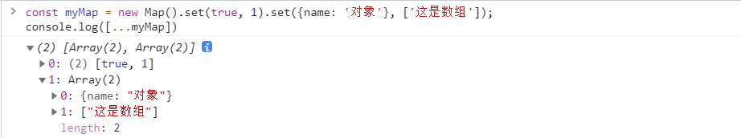  

#### ② 数组 转为 Map

>将数组传入 Map 构造函数, 就可以转为 Map. 
>
>```javascript
>new Map().set(true, 1).set({name: '对象'}, ['这是数组']);
>```
>
>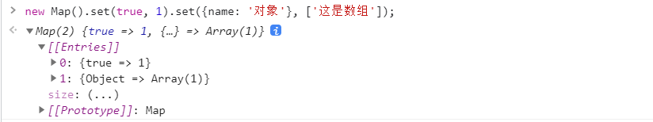 

#### ③ Map 转为对象

>如果所有 Map 的键都是字符串, 它可以无损地转为对象. 
>
>```javascript
>function strMapToObj(strMap) {
>  let obj = Object.create(null); //创建一个空对象
>  for (let [k,v] of strMap) {  obj[k] = v } //循环遍历并给空对象赋值
>  return obj;  //最后将加工好的对象返回出去
>}
>//字符串的键转对象
>const myMap = new Map().set('name', '努力学习的汪').set('handsome', true);
>console.log(strMapToObj(myMap))
>//其他转对象
>const testMap =strMapToObj( new Map()
>.set(document.querySelector('div'), '文档对象').set(true, '布尔值').set(123,"数值") )//转为对象时都转为了字符串形式
>console.log(testMap)
>```
>
>如果有非字符串的键名, 那么这个键名会被转成字符串, 再作为对象的键名. 
>
>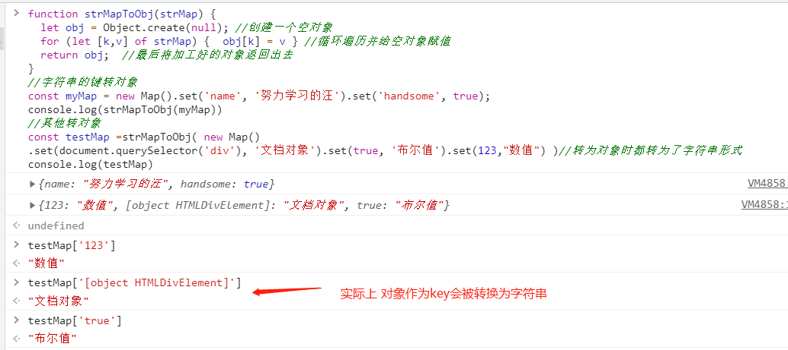
>
>当然,如果你像是布尔值或者数值 如输入时直接 testMap[true] 也能获得结果,因为有`隐式转换`,这就涉及JS基础了

#### ④ 对象转为 Map

>对象转为 Map 可以通过`Object.entries()`. 
>
>```javascript
>let obj = {'name':'努力学习的汪', 'handsome':true};
>//其实就是通过[Object.entries()]将对象转化为数组,再通过Map()构造函数转化为Map
>let map = new Map(Object.entries(obj)); // Map(2) {"name" => "努力学习的汪", "handsome" => true}
>```
>
>此外, 也可以自己实现一个转换函数. 
>
>```javascript
>function objToStrMap(obj) {
>  let strMap = new Map();  // 定义一个空的Map
>  for (let k of Object.keys(obj)) {  strMap.set(k, obj[k]) } //通过循环将对象内容取出并加入Map中
>  return strMap;   //最后返回
>}
>//调用
>objToStrMap({'name':'努力学习的汪', 'handsome':true})// Map(2) {"name" => "努力学习的汪", "handsome" => true}
>```
>

#### ⑤ Map 转为 JSON

##### a) Map 的键名都是字符串

>Map 转为 JSON 要区分两种情况. 一种情况是，Map 的键名都是字符串, 这时可以选择转为对象 JSON. 
>
>```javascript
> //Map转对象 函数
>const strMapToObj=(strMap)=> {
>  let obj = Object.create(null);
>  for (let [k,v] of strMap) {obj[k] = v;}
>  return obj;
>}
>//对象转JSON 函数
>const strMapToJson=(strMap)=>  JSON.stringify(strMapToObj(strMap));
>let myMap = new Map().set('name', '努力学习的汪').set('handsome', true);
>
>console.log(strMapToObj(myMap))  //调用map转对象,查看效果
>console.log(strMapToJson(myMap))  //调用map转对象 对象转JSON 方法
>```
>
>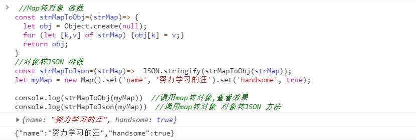 

##### b)  Map 的键名有非字符串

>另一种情况是，Map 的键名有非字符串, 这时可以选择转为数组 JSON. 
>
>```javascript
>//Map转JSON函数
>const mapToArrayJson=(map)=> JSON.stringify([...map]) 
>let myMap = new Map().set(true, 1).set({name: '对象'}, ['这是数组']);
>
>console.log([...myMap]) //查看点运算符解构转换后结果
>console.log(mapToArrayJson(myMap)) //调用转换函数
>```
>
>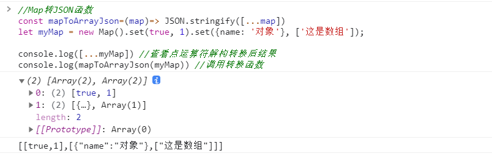 

#### ⑥ JSON 转为 Map

>JSON 转为 Map，正常情况下, 所有键名都是字符串. 
>
>```javascript
>function objToStrMap(obj) {
>  let strMap = new Map();  // 定义一个空的Map
>  for (let k of Object.keys(obj)) {  strMap.set(k, obj[k]) } //通过循环将对象内容取出并加入Map中
>  return strMap;   //最后返回
>}
>const jsonToStrMap=(jsonStr) => objToStrMap(JSON.parse(jsonStr));
>
>console.log(jsonToStrMap('{"name":"努力学习的汪","handsome":true}'))
>//log: Map(2) {"name" => "努力学习的汪", "handsome" => true}
>```
>
>但是, 有一种特殊情况, 整个 JSON 就是一个数组, 且每个数组成员本身, 又是一个有两个成员的数组. 这时, 它可以一一对应地转为 Map. 这往往是 Map 转为数组 JSON 的逆操作. 
>
>```javascript
>const  jsonToMap = (jsonStr) =>  new Map(JSON.parse(jsonStr));
>jsonToMap('[[true,1],[{"name":"对象"},["这是数组"]]]')
>```
>
>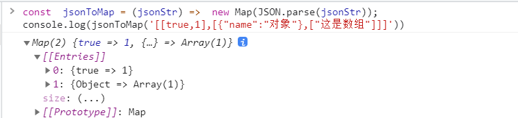 

#### ⑦ WeakMap

> 此处知识点本人较少用到,就暂不整理,留后续补充

### Ⅵ - map()方法: 

>**map(): 映射, 即原数组映射成一个新的数组**--> `非常常用`
>
>map方法接受一个新参数, 这个参数就是将原数组变成新数组的映射关系. 
>
>```javascript
>const fun1=(arr)=>{
> let array = [];
>  arr.map( item =>  array.push(item*item) );
>  console.log(array);
>}
>const fun2=(arr)=>{
> var array = [];
>  arr.map( function(item){ array.push(item*item) });
>  console.log(array);
>}
>
>var arr1 = [5,2,1,3,4];
>fun1(arr1);    //[25, 4, 1, 9, 16]
>var arr2 = [1,2,3,4,5];
>fun1(arr2);   // [1, 4, 9, 16, 25]
>var arr3 = [3,4,5,1,2,6];
>fun2(arr3);   //[9, 16, 25, 1, 4, 36] 
>```
>
>在实际的应用中, 我们可以通过map方法得到某一个对象数组中特定属性的值
>
>```javascript
>const obj = [
>  {name:'努力学习的汪',age:18,sex:'男'},
>  {name:'hongjilin',age:88,sex:'男'},
>  {name:'帅小伙',age:66,sex:'女'},
>]
>const getter=(obj)=>{ obj.map( item => {  console.log(item.name) })}
>getter(obj);
>```
>
>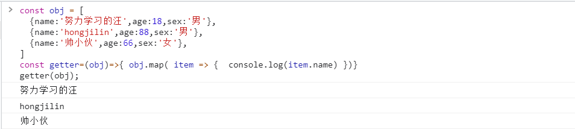  
>
>map方法的作用不难理解, 即“映射”, 也就是原数组被“映射”成对应新数组. 下面这个例子是数值项求平方: 
>
>```javascript
>const data = [1, 2, 3, 4];
>const arrayOfSquares = data.map((item)=> item * item);
>console.log(arrayOfSquares); // 1, 4, 9, 16
>
>//callback需要有return值, 如果没有, 就像下面这样: 
>var data1 = [1, 2, 3, 4];
>var arrayOfSquares1 = data.map(function() {});
>console.log(arrayOfSquares1)//数组所有项都被映射成了undefined: 
>```
>
>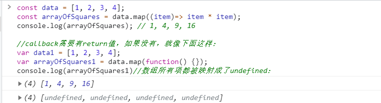 

### Ⅶ - 做个题目吧

> 光说不练假把式,试着回答几个问题检测下是否理解 Mep 数据结构

### ① 代码阅读题

>```js
>let map = new Map();
>map.set([1],"ES6系列");
>let con = map.get([1]);
>console.log(con);
>```
>
>**问: 打印出来的变量con的值是多少, 为什么？**
>
>> 答: undefined. 因为set的时候用的数组[1]和get的时候用的数组[1]是分别两个不同的数组, 只不过它们元素都是1. 它们是分别定义的两个数组, 并不是同一个值. 
>
>**如果想达到预期的效果, 你要保证get的时候和set的时候用同一个数组. 比如: **
>
>```js
>let map = new Map();
>let arr = [1];
>map.set(arr,"ES6系列");
>let con = map.get(arr);
>console.log(con); //ES6系列
>```

## 13、Proxy

> 很重要的知识点,也许你初入前端的时候会用的比较少,但是在后面进阶开发中此知识点是绕不过的,这知识点常与下方 **Reflect** 搭配使用
>
> 嗯,如果你是Vue前端工程师,那这个就更要掌握了,毕竟Vue3.x双向绑定就是用这个知识点实现的
>
> 下面我也会用Proxy自己模拟实现一个数据双向绑定

### Ⅰ - 概括与总结

>1. 定义: Proxy 用于修改某些操作的默认行为, 等同于在语言层面做出修改, 所以属于一种“元编程”（meta programming）, 即对编程语言进行编程. 
>2. 声明: `const proxy = new Proxy(target, handler)`
>3. 入参:
>    - **target**: 拦截的目标对象
>    - **handler**: 定制拦截行为
>4. 方法:
>    - **Proxy.revocable()**: 返回可取消的Proxy实例(返回`{ proxy, revoke }`, 通过revoke()取消代理)
>
>> 下面是 Proxy 支持的拦截操作一览, 一共 13 种. 
>
>- **get(target, propKey, receiver)**：拦截对象属性的读取, 比如`proxy.foo`和`proxy['foo']`. 
>- **set(target, propKey, value, receiver)**：拦截对象属性的设置, 比如`proxy.foo = v`或`proxy['foo'] = v`, 返回一个布尔值. 
>- **has(target, propKey)**：拦截`propKey in proxy`的操作, 返回一个布尔值. 
>- **deleteProperty(target, propKey)**：拦截`delete proxy[propKey]`的操作, 返回一个布尔值. 
>- **ownKeys(target)**：拦截`Object.getOwnPropertyNames(proxy)`、`Object.getOwnPropertySymbols(proxy)`、`Object.keys(proxy)`、`for...in`循环, 返回一个数组. 该方法返回目标对象所有自身的属性的属性名, 而 [Object.keys()] 的返回结果仅包括目标对象自身的可遍历属性. 
>- **getOwnPropertyDescriptor(target, propKey)**：拦截`Object.getOwnPropertyDescriptor(proxy, propKey)`, 返回属性的描述对象. 
>- **defineProperty(target, propKey, propDesc)**：拦截`Object.defineProperty(proxy, propKey, propDesc）`、`Object.defineProperties(proxy, propDescs)`, 返回一个布尔值. 
>- **preventExtensions(target)**：拦截`Object.preventExtensions(proxy)`, 返回一个布尔值. 
>- **getPrototypeOf(target)**：拦截`Object.getPrototypeOf(proxy)`, 返回一个对象. 
>- **isExtensible(target)**：拦截`Object.isExtensible(proxy)`, 返回一个布尔值. 
>- **setPrototypeOf(target, proto)**：拦截`Object.setPrototypeOf(proxy, proto)`, 返回一个布尔值. 如果目标对象是函数, 那么还有两种额外操作可以拦截. 
>- **apply(target, object, args)**：拦截 Proxy 实例作为函数调用的操作, 比如`proxy(...args)`、`proxy.call(object, ...args)`、`proxy.apply(...)`. 
>- **construct(target, args)**：拦截 Proxy 实例作为构造函数调用的操作, 比如`new proxy(...args)`. 
>
>> 应用场景
>
>- `Proxy.revocable()`: 不允许直接访问对象, 必须通过代理访问, 一旦访问结束就收回代理权不允许再次访问
>- `get()`: 读取未知属性报错、读取数组负数索引的值、封装链式操作、生成DOM嵌套节点
>- `set()`: 数据绑定(Vue数据双向绑定实现原理)、确保属性值设置符合要求、防止内部属性被外部读写
>- `has()`: 隐藏内部属性不被发现、排除不符合属性条件的对象
>- `deleteProperty()`: 保护内部属性不被删除
>- `defineProperty()`: 阻止属性被外部定义
>-  [ownKeys()] : 保护内部属性不被遍历
>
>> 重点难点
>
>- 要使 [ Proxy ] 起作用, 必须针对`实例`进行操作, 而不是针对`目标对象`进行操作
>- 没有设置任何拦截时, 等同于`直接通向原对象`
>- 属性被定义为`不可读写/扩展/配置/枚举`时, 使用拦截方法会报错
>- 代理下的目标对象, 内部`this`指向`Proxy代理`

### Ⅱ - 概念结合实例解析

>通过分析简单常用的例子,来帮助我们理解Proxy

#### ①  概述

>Proxy 用于修改某些操作的默认行为, 等同于在语言层面做出修改, 所以属于一种“元编程”（meta programming）, 即对编程语言进行编程. 
>
>Proxy 可以理解成, 在目标对象之前架设一层“拦截”, 外界对该对象的访问, 都必须先通过这层拦截, 因此提供了一种机制, 可以对外界的访问进行过滤和改写. Proxy 这个词的原意是代理, 用在这里表示由它来“代理”某些操作, 可以译为“代理器”. 
>
>```javascript
>const obj = new Proxy({}, {
>   //拦截的对象,传入的对象属性,整个proxy对象
>  get: function (target, propKey, receiver) {
>    console.log(`getting ${propKey}!`);
>     // [ Reflect.get ] 方法查找并返回`target`对象的`name`属性, 如果没有该属性, 则返回`undefined`. 
>    return Reflect.get(target, propKey, receiver);  //详见下方Reflect一章,但此处不深究
>  },
>  set: function (target, propKey, value, receiver) {
>    console.log(`setting ${propKey}!`);
>     //`Reflect.set`方法设置`target`对象的`name`属性等于`value`. 
>    return Reflect.set(target, propKey, value, receiver);
>  }
>});
>```
>
>上面代码对一个空对象架设了一层拦截, 重定义了属性的读取（`get`）和设置（`set`）行为. 这里暂时先不解释具体的语法(详见下一章节 < Reflect >), 只看运行结果. 对设置了拦截行为的对象`obj`, 去读写它的属性, 就会得到下面的结果. 
>
>```javascript
>obj.count = 1
>//  setting count!
>++obj.count
>//  getting count!
>//  setting count!
>//  2
>```
>
>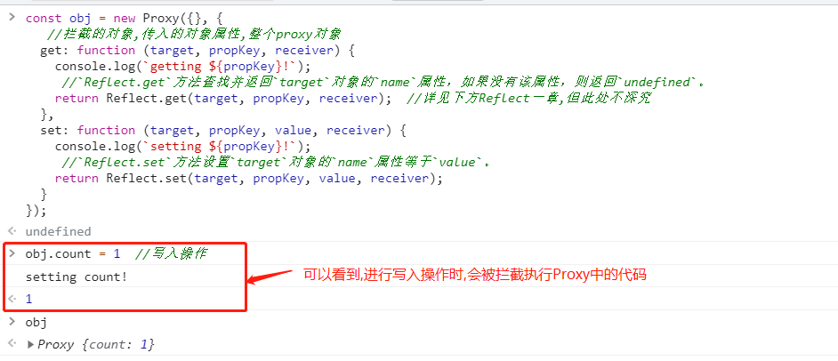 上面代码说明，Proxy 实际上重载（overload)了点运算符, 即用自己的定义覆盖了语言的原始定义. 
>
>ES6 原生提供 Proxy 构造函数, 用来生成 Proxy 实例. 
>
>```javascript
>var proxy = new Proxy(target, handler);
>```
>
>Proxy 对象的所有用法, 都是上面这种形式, 不同的只是`handler`参数的写法. 其中, `new Proxy()`表示生成一个 [ Proxy ] 实例, `target`参数表示所要拦截的目标对象, `handler`参数也是一个对象, 用来定制拦截行为. 

#### ② 举个拦截读取属性行为的栗子

>```javascript
>var proxy = new Proxy({}, {
>  get: (target, propKey)=> '努力学习的汪' //温习下:ES6箭头函数写法,如果你对这个写法陌生一定要回头去巩固
>});
>console.log(proxy.name) //努力学习的汪
>console.log(proxy.title) //努力学习的汪
>proxy.a = 1 //写入操作,修改[a]属性
>console.log(proxy.a) //由于[读] 操作已经被拦截,所有 [读] 操作都返回的是 '努力学习的汪'
>```
>
>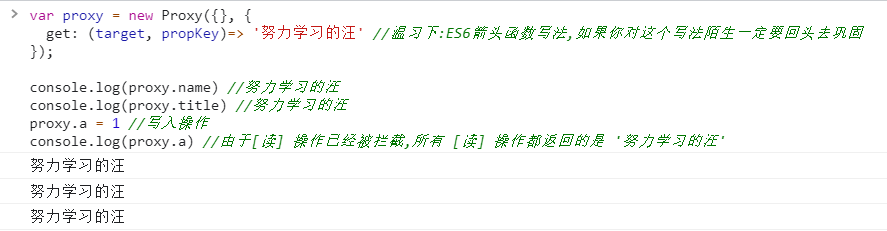 上面代码中, 作为构造函数,  [ Proxy ] 接受两个参数 : 
>
>- 第一个参数是所要代理的目标对象（上例是一个空对象), 即如果没有 [ Proxy ] 的介入, 操作原来要访问的就是这个对象；
>
>- 第二个参数是一个配置对象, 对于每一个被代理的操作, 需要提供一个对应的处理函数, 该函数将拦截对应的操作:
>
>  > 比如, 上面代码中, 配置对象有一个`get`方法, 用来拦截对目标对象属性的访问请求. 
>  >
>  > `get`方法的两个参数分别是目标对象和所要访问的属性. 
>  >
>  > 可以看到, 由于拦截函数总是返回[`努力学习的汪`], 所以即使我给其设置了值,访问任何属性都得到[`努力学习的汪`]. 

#### ③ 没有设置任何拦截 等同 直接通向原对象. 

>注意, 要使得 [ Proxy ] 起作用, 必须针对 [ Proxy ] 实例（上例是`proxy`对象）进行操作, 而不是针对目标对象（上例是空对象）进行操作. 
>
>如果`handler`没有设置任何拦截, 那就等同于直接通向原对象. 
>
>```javascript
>var target = {};
>var handler = {};
>var proxy = new Proxy(target, handler);
>proxy.a = '努力学习的汪';
>target.a // "努力学习的汪"
>```
>
>上面代码中, `handler`是一个空对象, 没有任何拦截效果, 访问`proxy`就等同于访问`target`. 
>
>一个技巧是将 Proxy 对象, 设置到`object.proxy`属性, 从而可以在`object`对象上调用. 
>
>```javascript
>var object = { proxy: new Proxy(target, handler) };
>```

#### ④ Proxy 实例作为其他对象的原型对象

>Proxy 实例也可以作为其他对象的原型对象。
>
>```javascript
>var proxy = new Proxy({}, {
>  get: (target, propKey)=>'不努力学习的单身汪'
>});
>
>let obj = Object.create(proxy);
>obj.name='努力学习的汪'
>console.log(obj.name) // 努力学习的汪
>console.log(obj.xxx)  // 不努力学习的单身汪
>```
>
>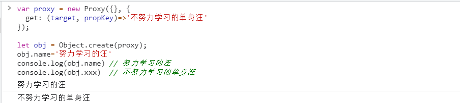 上面代码中, `proxy`对象是`obj`对象的原型
>
>> - `obj`对象本身并有 [ name ] 属性,当访问 [ name ] 属性时,因为对象本身有,就不会去其原型上找,所以不会触发拦截
>> - `obj`对象本身并没有 [ xxx ] 属性, 所以根据原型链, 会在`proxy`对象上读取该属性, 导致被拦截。

#### ⑤ 同一个拦截器函数, 设置拦截多个操作

>同一个拦截器函数, 可以设置拦截多个操作。
>
>```javascript
>var handler = {
>  get: (target, name) => {
>     //当读取拦截对象的 [ prototype ],返回的是 Object的 [ prototype ]
>    if (name === 'prototype')  return Object.prototype;
>      //如果读取非[ prototype ]属性,返回加工后的属性名
>    return '进行了非[prototype]属性的读取: ' + name;
>  },
>  //温习巩固一下:箭头函数、标签语法
>  apply: (target, thisBinding, args) => `拦截进入apply:${args[0]}`,
> //构造函数 温习一下:构造函数不能使用箭头函数,如果不知道为什么的需要回头去巩固下->箭头函数没有自己的 this
>  construct: function(target, args) {  return {value:`拦截进入构造函数:${args[1]}`}}
>};
>//new 一个 Proxy 实例
>var fproxy = new Proxy(function(x, y) {
>  return x + y;
>}, handler);
>
>console.log(fproxy(1, 2))  // 拦截进入apply:1
>console.log(new fproxy(1, 2)) //{value: "拦截进入构造函数:2"}
>console.log(fproxy.prototype === Object.prototype) //对比读取fproxy与Object的 [prototype]属性是否一致 ==true
>console.log(fproxy.xxx)  //进行了非[prototype]属性的读取: xxx
>```
>
>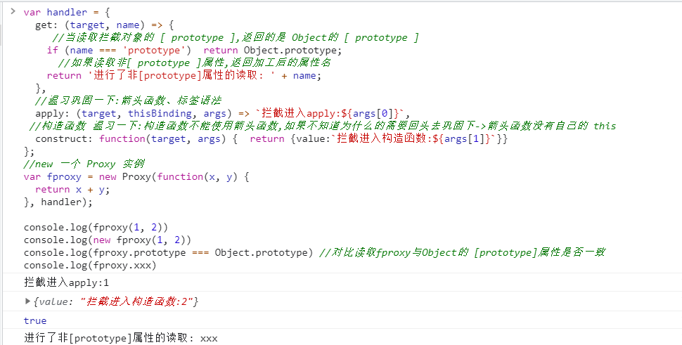 对于可以设置、但没有设置拦截的操作, 则直接落在目标对象上, 按照原先的方式产生结果。

### Ⅲ - Proxy 实例的方法

> 主要就是对于拦截方法的详细介绍

#### ① get()

>**get(target, propKey, receiver)**：拦截对象属性的读取, 比如`proxy.foo`和`proxy['foo']`. 
>
>`get`方法用于拦截某个属性的读取操作, 可以接受三个参数, 依次为目标对象、属性名和 proxy 实例本身（严格地说, 是操作行为所针对的对象）, 其中最后一个参数可选。

##### a) 举个栗子

>```javascript
>const person = { name: "努力学习的汪" };
>const proxy = new Proxy(person, {
>  get: function(target, propKey) {
>     //如果  [propKey(属性名)] 属于 target 对象,则正常返回,否则直接抛出异常
>    if (propKey in target) return  target[propKey];
>    else throw new ReferenceError("属性名 \"" + propKey + "\" 不存在.");
>  }
>});
>
>console.log(proxy.name) //努力学习的汪
>console.log(proxy.age)  //报错
>```
>
>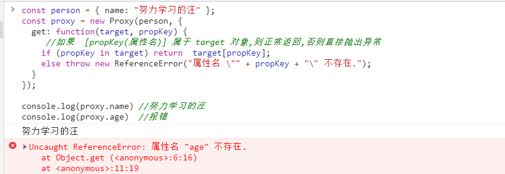 
>
> 上面代码表示, 如果访问目标对象不存在的属性, 会抛出一个错误。如果没有这个拦截函数, 访问不存在的属性, 只会返回`undefined`。

##### b) get() 方法可以继承

>`get`方法可以继承。此处用上方用过的一个例子来说明
>
>```javascript
>var proto = new Proxy({}, {
>  get: (target, propKey)=>'不努力学习的单身汪'
>});
>
>let obj = Object.create(proto);
>obj.name='努力学习的汪'
>console.log(obj.name) // 努力学习的汪
>console.log(obj.xxx)  // 不努力学习的单身汪
>```
>
>上面代码中, 拦截操作定义在`Prototype`对象上面, 所以如果读取`obj`对象继承的属性时, 拦截会生效。
>
>> - `obj`对象本身并有 [ name ] 属性,当访问 [ name ] 属性时,因为对象本身有,就不会去其原型上找,所以不会触发拦截
>> - `obj`对象本身并没有 [ xxx ] 属性, 所以根据原型链, 会在`proxy`对象上读取该属性, 导致被拦截。

##### c) 实现数组读取负数的索引

>下面的例子使用`get`拦截, 实现数组读取负数的索引。
>
>```javascript
>function createArray(...elements) {
>  let handler = {
>    get(target, propKey, receiver) {
>      let index = Number(propKey);
>       //如果小于0,则修改传入的属性名[propKey],做到负数索引能正确读取  
>      if (index < 0)  propKey = String(target.length + index);
>      return Reflect.get(target, propKey, receiver);
>    }
>  };
>  let target = [];
>  target.push(...elements); //将传入参数解构 push 进 target数组中
>  return new Proxy(target, handler);
>}
>
>let arr = createArray('倒数第三', '倒数第二', '倒数第一');
>console.log(arr)
>console.log(arr[-2],arr[-1]) 	//倒数第二 倒数第一
>
>console.log('---------- 正常数组读取做对比----------')
>let arr1 =['倒数第三', '倒数第二', '倒数第一']
>console.log(arr1[-2],arr1[-1])  //undefined undefined
>```
>
>上面代码中, 数组的位置参数是`-1`, 就会输出数组的倒数第一个成员。

##### d)  实现属性的链式操作

>利用 Proxy，可以将读取属性的操作（`get`）, 转变为执行某个函数, 从而实现属性的链式操作。
>
>```javascript
>//使用var定义函数: 所有在全局作用域中声明的变量、函数都会变成window对象的属性和方法
>var double = n => n * 2;
>var pow    = n => n * n;
>var reverseInt = n => n.toString().split("").reverse().join("") | 0;
>//定义链式调用函数
>const pipe = function (value) {
>  const funcStack = [];
>  const oproxy = new Proxy({} , {
>    get : function (target, propKey) {
>       //如果传入的属性名是 [get] ,就会从函数栈[funcStack]中循环取出,然后逐层调用
>      if (propKey === 'get') 
>       //[window]是必须的,因为定义时用的是 [var] ,这几个函数都是挂载在[window]上 
>       return funcStack.reduce( (val, fn) => window[fn](val),value);
>      funcStack.push(propKey);//传入的不是 [get] 所以将传入的当前属性名 压入数组中存储
>      return oproxy;//当不是[get]时,返回proxy给下一层调用
>    }
>  });
>  return oproxy;
>}
>//打印调用
>console.log(pipe(3).get) 			//3
>console.log(pipe(3).double.get)		 //6
>console.log(pipe(3).double.pow.get)	 //36
>console.log(pipe(3).double.pow.reverseInt.get)//63
>```
>
>上面代码设置 Proxy 以后, 达到了将函数名链式使用的效果。注意点:
>
>>- 使用var定义函数: 所有在全局作用域中声明的变量、函数都会变成window对象的属性和方法
>>- [window]是必须的,因为定义时用的是 [var] ,这几个函数都是挂载在[window]上 
>
>对于某些刚入坑的同学来说可能会比较绕,所以我尽量多的给出了注释,如果还不能理解也多看几遍,以后在学习数据结构与算法的时候就会觉得这里很简单了

##### e) 实现生成各种 DOM 节点的通用函数

>```javascript
>const dom = new Proxy({}, {
>  get(target, propKey) {
>    //声明一个函数,第一个参数为默认为空的对象  第二个参数为其余所有入参
>    return function(attrs = {}, ...children) {
>      const el = document.createElement(propKey); //根据传入的 [属性名] 创建对应初始 DOM 节点
>      for (let prop of Object.keys(attrs)) {//取出传入第一个参数对象的属性名
>        el.setAttribute(prop, attrs[prop]); //如果有属性名,就将其写入标签的属性中
>      }
>      for (let child of children) { //循环取出所有入参(除第一个入参外)
>        //如果入参类型为字符串,则将其转换为文本节点 
>        if (typeof child === 'string')  child = document.createTextNode(child);
>        el.appendChild(child); //将子节点插入el中
>      }
>      return el;
>    }
>  }
>});
>
>const els = dom.div({}, //生成外层的div节点
>  '你好!我的名字叫做: ', //生成文本节点
>  dom.a({href: 'https://gitee.com/hongjilin'}, '努力学习的汪'),//生成一个a节点
>  '. 我喜欢:',
>  dom.ul({},//生成一个ul节点
>    dom.li({}, '划水'), //生成li节点
>    dom.li({}, '吃瓜'),
>    dom.li({}, '…其他')
>  )
>);
>document.body.insertBefore(els); 
>```
>
>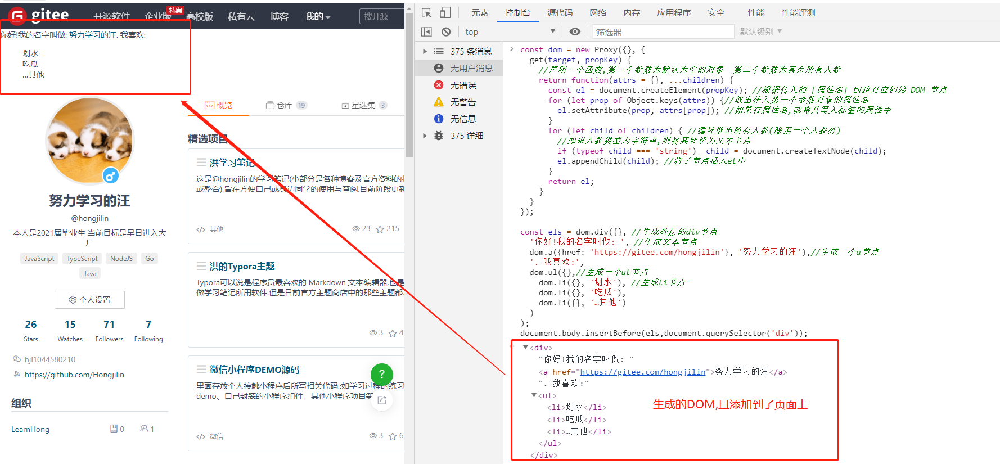 

##### f) get() 的第三个参数

>下面是一个`get`方法的第三个参数的例子, 它总是指向原始的读操作所在的那个对象, 一般情况下就是 Proxy 实例。
>
>```javascript
>const proxy = new Proxy({}, {
>get: function(target, key, receiver) {
>return receiver;
>}
>});
>proxy.getReceiver === proxy // true
>```
>
>上面代码中, `proxy`对象的`getReceiver`属性是由`proxy`对象提供的, 所以  [ receiver ] 指向`proxy`对象。
>
>```javascript
>const proxy = new Proxy({}, {
>get: function(target, key, receiver) {
>return receiver;
>}
>});
>const d = Object.create(proxy);
>d.a === d // true
>```
>
>上面代码中, `d`对象本身没有`a`属性, 所以读取`d.a`的时候, 会去`d`的原型`proxy`对象找。这时,   [ receiver ] 就指向`d`, 代表原始的读操作所在的那个对象。
>
>如果一个属性不可配置（configurable）且不可写（writable）, 则 Proxy 不能修改该属性, 否则通过 Proxy 对象访问该属性会报错。
>
>```javascript
>const target = Object.defineProperties({}, {
> obj: {
> 	name: '努力学习的汪',
>	handsome: true,
>     //configurable:默认为 false 只有设为 true 该属性可能的类型可以被改变, 该属性可以从中删除。
>	configurable: false  
> },
>});
>const handler = {
>get(target, propKey) {
>return '不想学习';
>}
>};
>const proxy = new Proxy(target, handler);
>proxy.obj
>//TypeError: 'get' on proxy: property 'obj' is a read-only and non-configurable data property on the proxy target but the proxy did not return its actual value (expected 'undefined' but got '不想学习')
>```
>

#### ② set()

>`set`方法用来拦截某个属性的赋值操作, 可以接受四个参数, 依次为目标对象、属性名、属性值和 Proxy 实例本身, 其中最后一个参数可选。

##### a) 举个栗子

>假定`Person`对象有一个`age`属性, 该属性应该是一个不大于 200 的整数, 那么可以使用 [ Proxy ] 拦截进而保证`age`的属性值符合要求。
>
>```javascript
>let validator = {
>  set: function(obj, prop, value) {
>    if (prop === 'age') { //对于设置 [age] 的操作进行拦截
>      if (!Number.isInteger(value))  throw new TypeError('年龄不是一个整数');
>      if (value > 200)  throw new RangeError('你在修仙吗?');
>    }
>    // 对于满足条件的 age 属性以及其他属性, 直接保存
>    obj[prop] = value;
>  }
>};
>
>let person = new Proxy({}, validator);
>
>person.age = 99;
>console.log('写入年龄99岁:',person)
>person.name = '努力学习的汪'  
>console.log('写入名字:',person)
>person.age = 300 // 报错
>person.age = '寿元无限' // 报错
>```
>
>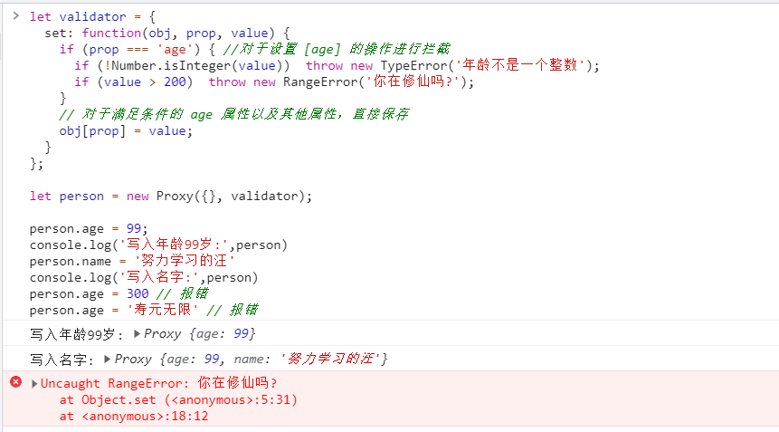 上面代码中, 由于设置了存值函数`set`, 任何不符合要求的`age`属性赋值, 都会抛出一个错误, 这是数据验证的一种实现方法。利用`set`方法, 还可以数据绑定, 即每当对象发生变化时, 会自动更新 DOM。

##### b) 做到防止内部属性被外部读写

>有时, 我们会在对象上面设置内部属性, 属性名的第一个字符使用下划线开头, 表示这些属性不应该被外部使用。结合`get`和`set`方法, 就可以做到防止这些内部属性被外部读写。
>
>```javascript
>const handler = {
>  get (target, key) {
>    invariant(key, 'get'); //将传入的属性名当作参数传给函数
>    return target[key];
>  },
>  set (target, key, value) {
>    invariant(key, 'set');
>    target[key] = value;
>    return true;
>  }
>};
>function invariant (key, action) {
>    //当传入的 [属性名] 第一位字符是 '_' 时抛出错误
>  if (key[0] === '_')   throw new Error(`对私有属性 [${key}] 进行 [${action}] 操作是无效的 `);
>}
>const target = {};
>const proxy = new Proxy(target, handler);
>proxy._prop  //报错: 对私有属性 [_prop] 进行 [get] 操作是无效的 
>proxy._prop = 'c' //报错 : 对私有属性 [_prop] 进行 [set] 操作是无效的 
>proxy.name = '努力学习的汪'//正常的
>console.log(proxy.name)  //正常的
>```
>
>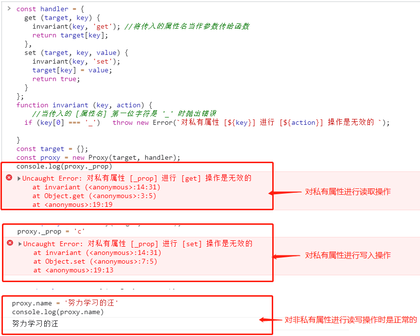
>
>上面代码中, 只要读写的属性名的第一个字符是下划线, 一律抛出错误, 从而达到禁止读写内部属性的目的。

##### c) 举个关于第四个参数的栗子

>下面是`set`方法第四个参数的例子。
>
>```javascript
>const handler = {
>  set: function(obj, prop, value, receiver) {//拦截写入方法 将本身实例挂载在传入的属性名
>    obj[prop] = receiver; //效果:不论写入什么,赋值上去的都是本身实例.主要就是给你做例子用,这种写法开发中不会用到
>  }
>};
>const proxy = new Proxy({}, handler);
>proxy.name = '努力学习的汪';
>console.log(proxy)
>proxy.name === proxy // true
>```
>
>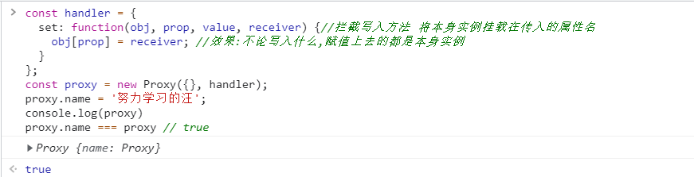 
>
>上面代码中, `set`方法的第四个参数  [ receiver ] , 指的是原始的操作行为所在的那个对象, 一般情况下是`proxy`实例本身, 请看下面的例子。
>
>```javascript
>const handler = {
>  set: function(obj, prop, value, receiver) {
>    obj[prop] = receiver; //当触发属性写入操作时,将本身proxy实例写入属性中
>  }
>};
>const proxy = new Proxy({}, handler);
>const myObj = {};
>const testObj = {}
>//Object.setPrototypeOf() 方法一个指定的对象的原型（即设置, 内部[[Prototype]]属性）到另一个对象或  null。
>Object.setPrototypeOf(myObj, proxy); //将proxy指定为 myObj 的原型对象
>
>myObj.name = '努力学习的汪';
>testObj.name = '对比:努力学习的汪'
>console.log( '绑定原型的:',myObj, ' ;没有绑定proxy原型的:',testObj)
>myObj.name === myObj // true
>```
>
>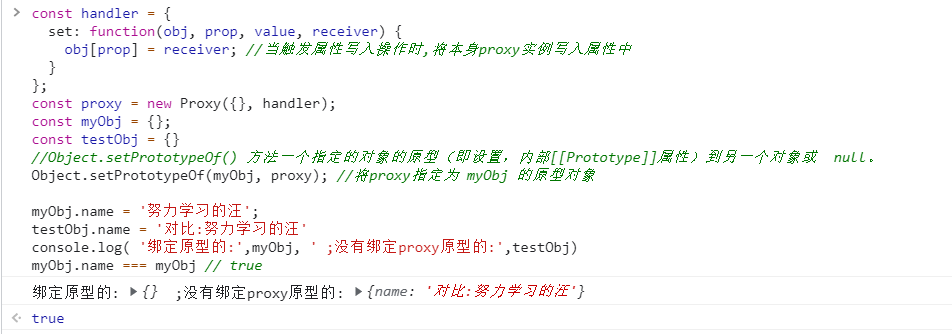 分析一下上面代码:
>
>>- 设置`myObj.name`属性的值时, `myObj`并没有 [ name ] 属性, 因此引擎会到`myObj`的原型链去找 [ name ] 属性。
>>- `myObj`的原型对象`proxy`是一个 Proxy 实例, 设置它的 [ name ] 属性会触发`set`方法。
>>- 这时, 第四个参数  [ receiver ] 就指向原始赋值行为所在的对象`myObj`。

#### ③ apply()

>`apply`方法拦截函数的调用、`call`和`apply`操作。
>
>`apply`方法可以接受三个参数, 分别是目标对象、目标对象的上下文对象（`this`）和目标对象的参数数组。
>
>```javascript
>const handler = {
>  apply (target, ctx, args) {
>    return Reflect.apply(...arguments);  //对于此方法不懂的可以看下方章节 [Reflect]
>  }
>};
>```
>

##### a) 举个栗子

>```javascript
>const target = function () { return '我是 target'; };
>const handler = {
>  apply: function () {
>    return '我是 proxy';
>  }
>};
>
>const p = new Proxy(target, handler);
>p()
>// "我是 proxy"
>```
>
>上面代码中, 变量`p`是 Proxy 的实例, 当它作为函数调用时[`p()`], 就会被`apply`方法拦截, 返回一个字符串。

##### b) 举两个栗子

>```javascript
>const twice = {
>  apply (target, ctx, args) {
>    return Reflect.apply(...arguments) * 2;
>  }
>};
>function sum (left, right) {
>  return left + right;
>};
>const proxy = new Proxy(sum, twice);
>proxy(1, 2) // 6
>proxy.call(null, 5, 6) // 22
>proxy.apply(null, [7, 8]) // 30
>```
>
>上面代码中, 每当执行`proxy`函数（直接调用或`call`和`apply`调用）, 就会被`apply`方法拦截。
>
>另外, 直接调用`Reflect.apply`方法, 也会被拦截。
>
>```javascript
>Reflect.apply(proxy, null, [9, 10]) // 38
>```
>

#### ④ has()

>`has()`方法用来拦截`HasProperty`操作, 即判断对象是否具有某个属性时, 这个方法会生效。典型的操作就是`in`运算符。
>
>`has()`方法可以接受两个参数, 分别是目标对象、需查询的属性名。

##### a) 举个栗子

>下面的例子使用`has()`方法隐藏某些属性, 不被`in`运算符发现。
>
>```javascript
>var handler = {
>  has (target, key) {
>    if (key[0] === '_')   return false;
>    return key in target;
>  }
>};
>var target = { _prop: '隐藏属性', prop: '正常属性' };
>var proxy = new Proxy(target, handler);
>'_prop' in proxy // false
>```
>
>上面代码中, 如果原对象的属性名的第一个字符是下划线, `proxy.has()`就会返回`false`, 从而不会被`in`运算符发现。

##### b) 当原对象不可配置或者禁止扩展时, `has()` 会报错

>如果原对象不可配置或者禁止扩展, 这时`has()`拦截会报错。
>
>```javascript
>var obj = { a: 10 };
>Object.preventExtensions(obj); //设置为不可配置
>
>var p = new Proxy(obj, {
>  has: function(target, prop) { return false  }
>});
>
>'a' in p // TypeError is thrown
>```
>
>上面代码中, `obj`对象禁止扩展, 结果使用`has`拦截就会报错。也就是说, 如果某个属性不可配置（或者目标对象不可扩展）, 则`has()`方法就不得“隐藏”（即返回`false`）目标对象的该属性。
>
>值得注意的是, `has()`方法拦截的是`HasProperty`操作, 而不是`HasOwnProperty`操作, 即`has()`方法不判断一个属性是对象自身的属性, 还是继承的属性。

##### c) `has()` 拦截对 `for...in` 循环不生效

>另外, 虽然`for...in`循环也用到了`in`运算符, 但是`has()`拦截对`for...in`循环不生效。
>
>```javascript
>let stu1 = {name: 'hongjilin', score: 89};
>let stu2 = {name: '努力学习的汪', score: 149};
>
>let handler = {
>  has(target, prop) {
>    if (prop === 'score' && target[prop] < 90) {
>      console.log(`${target.name} 不及格`);
>      return false;
>    }
>    return prop in target;
>  }
>}
>
>let oproxy1 = new Proxy(stu1, handler);
>let oproxy2 = new Proxy(stu2, handler);
>
>'score' in oproxy1
>//hongjilin 不及格
>//false
>
>'score' in oproxy2   //true
>
>for (let a in oproxy1) {
>  console.log(oproxy1[a]); //hongjilin   // 89
>}
>
>for (let b in oproxy2) {
>  console.log(oproxy2[b]); //努力学习的汪 // 149
>}
>```
>
>上面代码中, `has()`拦截只对`in`运算符生效, 对`for...in`循环不生效, 导致不符合要求的属性没有被`for...in`循环所排除。

#### ⑤ construct()

>`construct()`方法用于拦截`new`命令, 下面是拦截对象的写法。
>
>```javascript
>const handler = {
>  construct (target, args, newTarget) {
>    return new target(...args);
>  }
>};
>```
>

##### a) construct() 的三个参数

>`construct()`方法可以接受三个参数。
>
>- `target`：目标对象。
>- `args`：构造函数的参数数组。
>- `newTarget`：创造实例对象时, `new`命令作用的构造函数（下面例子的`p`）。
>
>```javascript
>const p = new Proxy(function () {}, {
>  construct: function(target, args) {
>    console.log('构造函数的参数数组: '+args,'构造函数的参数转字符串: '+args.join(', ')); //打印其传入参数
>    return { value: args[0] * 2 };  //将传入参数的第一个参数乘2 返回
>  }
>});
>new p(9,66)
>//构造函数的参数数组: 9,66 构造函数的参数转字符串: 9, 66
>//{value: 18}
>```
>
>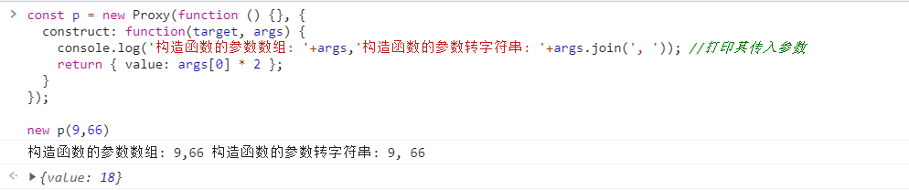 

##### b) construct() 方法返回的必须是一个对象, 否则会报错

>`construct()`方法返回的必须是一个对象, 否则会报错。
>
>```javascript
>const p = new Proxy(function() {}, {
>  construct: function(target, argumentsList) { return '努力学习的汪' }
>});
>
>new p() // 报错
>```
>
>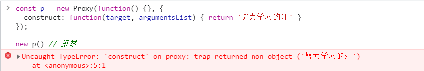 

##### c) construct() 的目标对象必须是函数

>由于`construct()`拦截的是构造函数, 所以它的目标对象必须是函数, 否则就会报错。
>
>```javascript
>const p = new Proxy({}, { //此处第一个参数设置为对象
>  construct: function(target, argumentsList) {  return {} }
>});
>new p() // 报错
>```
>
>上面例子中, 拦截的目标对象不是一个函数, 而是一个对象（`new Proxy()`的第一个参数）, 导致报错。
>
>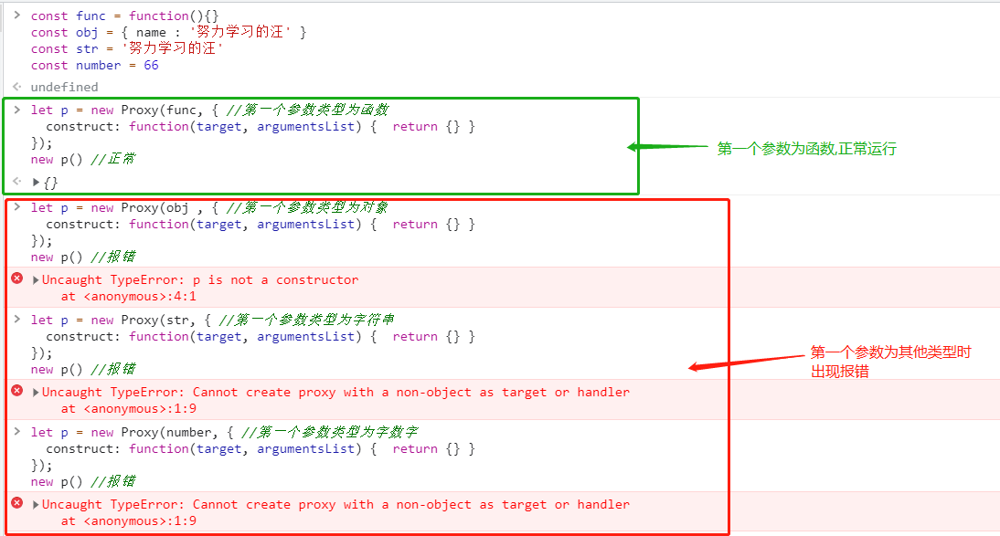 

##### d) 方法中的`this`指向的是`handler`, 而不是实例对象

>注意, `construct()`方法中的`this`指向的是`handler`, 而不是实例对象。
>
>```javascript
>const handler = {
>  construct: function(target, args) {
>    console.log('this指向: ',this ); // this指向:  {construct: ƒ}
>    console.log("this是否指向handler: ",this === handler ); //this是否指向handler:  true
>    return new target(...args);
>  }
>}
>let p = new Proxy(function () {}, handler);
>new p() 
>```
>
>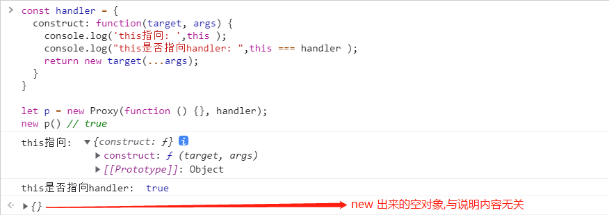 

#### ⑥ deleteProperty()

>`deleteProperty`方法用于拦截`delete`操作, 如果这个方法抛出错误或者返回`false`, 当前属性就无法被`delete`命令删除。
>
>```javascript
>var handler = {
>  deleteProperty (target, key) {
>    deleteHandler(key, 'delete'); //调用自定义抛出异常方法
>    delete target[key]; //如果上面方法中没有抛出异常才可走到此处,这里进行删除
>    return true;
>  }
>};
>//拦截 [ delete ] 时调用的方法,当为私有属性时,抛出异常
>function deleteHandler (key, action) {
>  if (key[0] === '_') throw new Error(`无效的动作尝试: ${action} , 私有属性 "${key}" 是不可删除的 `);
>}
>
>var target = { _name: '努力学习的汪' };//声明一个对象,有私有属性 [ _name ]
>var proxy = new Proxy(target, handler);
>delete proxy._name  //进行删除私有属性操作
>//Uncaught Error: 无效的动作尝试: delete , 私有属性 "_name" 是不可删除的 
>```
>
>上面代码中, `deleteProperty`方法拦截了`delete`操作符, 删除第一个字符为下划线的属性会报错。
>
>注意, 目标对象自身的不可配置（configurable）的属性, 不能被`deleteProperty`方法删除, 否则报错 
>
>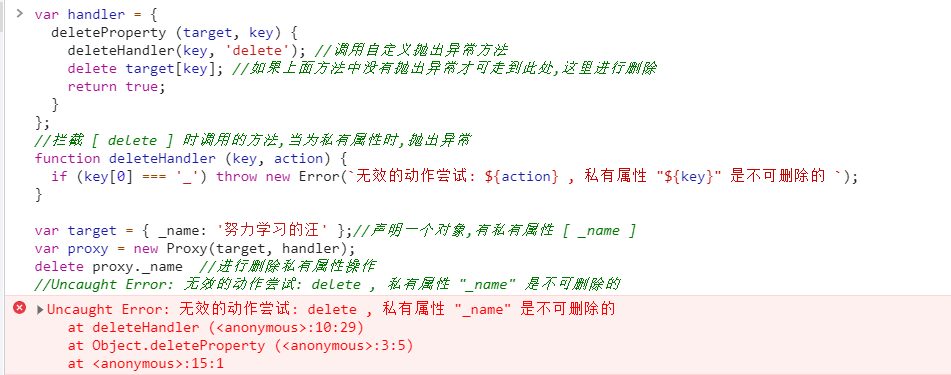 

#### ⑦ defineProperty()

>`defineProperty()`方法拦截了  [ Object.defineProperty() ] 操作。
>
>**Object.defineProperty() 方法**: 会直接在一个对象上定义一个新属性, 或者修改一个对象的现有属性, 并返回此对象。
>
>```javascript
>let handler = {
>  defineProperty (target, key, descriptor) {
>    return true
>  }
>};
>let target = {};
>let proxy = new Proxy(target, handler);
>proxy.name = '努力学习的汪' ;
>proxy.age = 99 ;
>console.log(proxy)
>```
>
>实际上,你只要使用了  **defineProperty** 方法拦截了,就会导致添加新属性失败,(返回的 布尔值 其实只是用来提示的,与是否能添加新属性无关)
>
>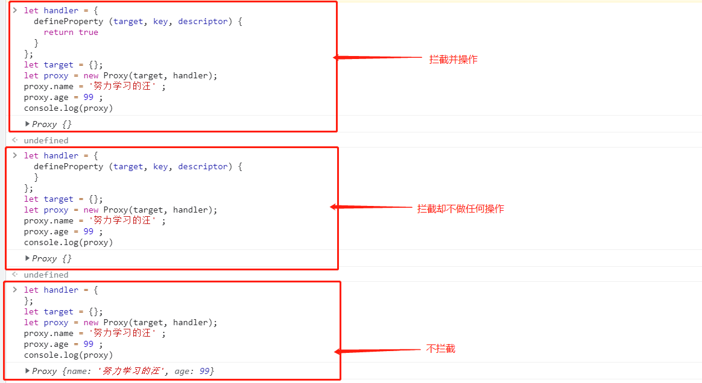 
>
>注意, 如果目标对象不可扩展（non-extensible）, 则`defineProperty()`不能增加目标对象上不存在的属性, 否则会报错。另外, 如果目标对象的某个属性不可写（writable）或不可配置（configurable）, 则`defineProperty()`方法不得改变这两个设置。

#### ⑧ getOwnPropertyDescriptor()

>`getOwnPropertyDescriptor()`方法拦截  [ Object.getOwnPropertyDescriptor() ] , 返回一个属性描述对象或者`undefined`。
>
>**Object.getOwnPropertyDescriptor() 方法**: 返回指定对象上一个自有属性对应的属性描述符。（自有属性指的是直接赋予该对象的属性, 不需要从原型链上进行查找的属性）
>
>```javascript
>const handler = {
>  getOwnPropertyDescriptor (target, key) {
>    if (key[0] === '_')  return; //如果为私有属性,则返回undefined
>    return Object.getOwnPropertyDescriptor(target, key); //不是私有属性就正常返回
>  }
>};
>const target = { _name: '努力学习的汪', age: 18 };
>const proxy = new Proxy(target, handler);
>
>console.log(Object.getOwnPropertyDescriptor(proxy, 'sex')) //对象本身就没这个属性,所以返回 undefined
>console.log(Object.getOwnPropertyDescriptor(proxy, '_name'))//私有属性,被拦截,所以得到    undefined
>console.log(Object.getOwnPropertyDescriptor(proxy, 'age'))  //对象本身有此属性且不是私有属性,正常返回  {value: 18, writable: true, enumerable: true, configurable: true}
>```
>
>上面代码中, `handler.getOwnPropertyDescriptor()`方法对于第一个字符为下划线的属性名会返回`undefined`。
>
>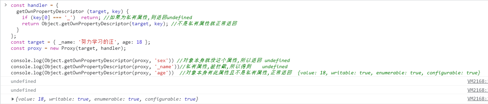 

#### ⑨ getPrototypeOf()

>`getPrototypeOf()`方法主要用来拦截获取对象原型。具体来说, 拦截下面这些操作。
>
>- `Object.prototype.__proto__`
>- `Object.prototype.isPrototypeOf()`
>- `Object.getPrototypeOf()`
>- `Reflect.getPrototypeOf()`
>- `instanceof`

##### a) 举个栗子

>```javascript
>const proto = {};
>const p = new Proxy({}, {
>  getPrototypeOf(target) {  return proto; } //拦截:不论如何都返回空对象
>});
>Object.getPrototypeOf(p) === proto // true
>```
>
>上面代码中, `getPrototypeOf()`方法拦截`Object.getPrototypeOf()`, 返回`proto`对象。
>
>注意, `getPrototypeOf()`方法的返回值必须是 **对象或者null**, 否则报错。另外, 如果目标对象不可扩展（non-extensible）,  `getPrototypeOf()`方法必须返回目标对象的原型对象

#### ⑩ isExtensible()

>`isExtensible()`方法拦截`Object.isExtensible()`操作。
>
>**Object.isExtensible() 方法:** 判断一个对象是否是可扩展的（是否可以在它上面添加新的属性）
>
>```javascript
>var p = new Proxy({}, {
>  isExtensible: function(target) {
>    console.log("拦截:全部变为可拓展");
>    return true;
>  }
>});
>
>Object.isExtensible(p)
>//拦截:全部变为可拓展
>//true
>```
>
>上面代码设置了`isExtensible()`方法, 在调用`Object.isExtensible` 时会打印字符串 [拦截:全部变为可拓展]。
>
>注意, 该方法只能返回布尔值, 否则返回值会被自动转为布尔值。
>
>这个方法有一个强限制, 它的返回值必须与目标对象的`isExtensible`属性保持一致, 否则就会抛出错误。
>
>```javascript
>Object.isExtensible(proxy) === Object.isExtensible(target)
>```
>

##### a) 举个栗子

>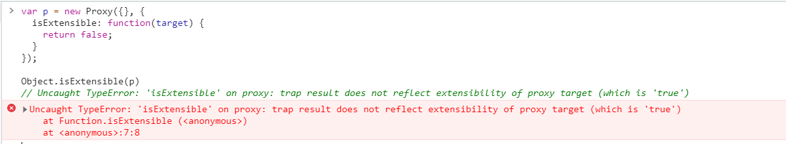 
>
>这边就是本身可拓展,却设置为false, 所以报错.具体使用场景比较特殊,就不列举了

#### ⑩① ownKeys()

> [ownKeys()] 方法用来拦截对象自身属性的读取操作。具体来说, 拦截以下操作。
>
>-  [Object.getOwnPropertyNames()] 
>- `Object.getOwnPropertySymbols()`
>-  [Object.keys()] 
>- `for...in`循环

##### a) 举个 拦截 [Object.keys()]  的栗子

>```javascript
>let target = {
>  name: '努力学习的汪',
>  age: 99,
>  cm: 180
>};
>
>let handler = {
>  ownKeys(target) { return ['name'] }
>};
>
>let proxy = new Proxy(target, handler);
>console.log(Object.keys(proxy)) //name
>```
>
>上面代码拦截了对于`target`对象的 [Object.keys()] 操作, 只返回 [ name ] 、[ age ]、[ cm ] 三个属性之中的 [ age ] 属性。

##### b) 举个 拦截 [Object.keys()] 中第一个字符为下划线的属性名 的栗子

>```js
>let target = {
>  _name: '努力学习的汪',
>  _age: 99,
>  age: 18
>};
>
>let handler = {
>  ownKeys (target) {
>     //筛选不是以下划线开头的属性名(私有属性)
>    return Reflect.ownKeys(target).filter(key => key[0] !== '_');
>  }
>};
>
>let proxy = new Proxy(target, handler);
>for (let key of Object.keys(proxy)) {
>  console.log(target[key]);
>}
>// 只输出 18
>```
>
> [Object.keys()] 本来应是都能输出,但是经过拦截后,开头为下划线的属性被过滤不进行输出,就纸打印了 18

##### c) 使用 [Object.keys()] 方法时, 有三类属性会被 [ownKeys()] 方法自动过滤

>注意, 使用 [Object.keys()] 方法时, 有三类属性会被 [ownKeys()] 方法自动过滤, 不会返回。
>
>- 目标对象上不存在的属性
>- 属性名为 Symbol 值
>- 不可遍历（`enumerable`）的属性
>
>```javascript
>//1. 定义原对象
>let target = { 
>  a: 1,
>  b: 2,
>  c: 3,
>  [Symbol.for('name')]: '努力学习的汪',
>};
>//2. 定义 不可遍历（`enumerable`）的属性 对照组数据
>//Object.defineProperty() 方法会直接在一个对象上定义一个新属性, 或者修改一个对象的现有属性, 并返回此对象。
>Object.defineProperty(target, 'key', {
>  enumerable: false, //当且仅当该属性的 enumerable 键值为 true 时, 该属性才会出现在对象的枚举属性中。
>  configurable: true,
>  writable: true,
>  value: '这是测试不可遍历属性'
>});
>Object.defineProperty(target, 'test', {
>  enumerable: true, 
>  configurable: true,
>  writable: true,
>  value: '出现在枚举中'
>});
>//3. 定义拦截
>let handler = {
>  ownKeys(target) { return ['a', 'd', Symbol.for('name'), 'key' , 'test']; }
>};
>let proxy = new Proxy(target, handler);
>
>Object.keys(proxy) //['a', 'test']
>```
>
>上面代码中,  [ownKeys()] 方法之中, 显式返回不存在的属性（`d`）、Symbol 值（`Symbol.for('secret')`）、不可遍历的属性（`key`）, 结果都被自动过滤掉。
>
>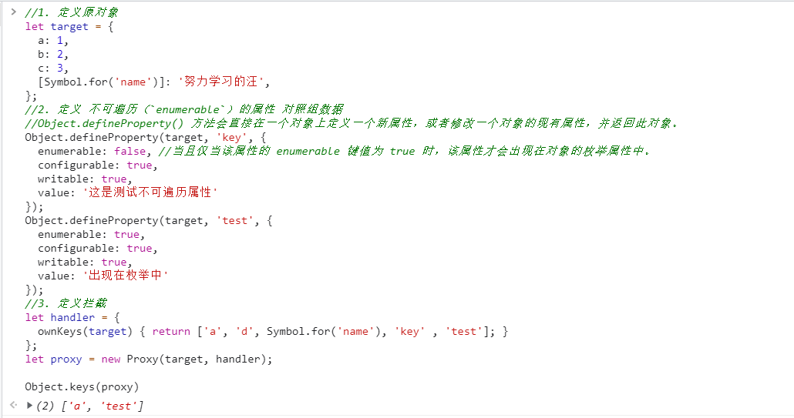 

##### d)  [ownKeys()] 方法还可以拦截 [Object.getOwnPropertyNames()] 

>**Object.getOwnPropertyNames():** 方法返回一个由指定对象的所有自身属性的属性名（包括不可枚举属性但不包括Symbol值作为名称的属性）组成的数组。
>
>```js
>const p = new Proxy({}, {
>  ownKeys: function(target) {
>    return ['a', 'b', 'c'];
>  }
>});
>Object.getOwnPropertyNames(p)
>// [ 'a', 'b', 'c' ]
>```

##### e) `for...in`循环也受到 [ownKeys()] 方法的拦截。

>```javascript
>const obj = { name: '努力学习的汪' };
>const proxy = new Proxy(obj, {
>  ownKeys: function () {
>    return ['a', 'b'];
>  }
>});
>
>for (let key in proxy) {
>  console.log(key); // 没有任何输出
>}
>```
>
>上面代码中,  [ownKeys()] 指定只返回`a`和`b`属性, 由于`obj`没有这两个属性, 因此`for...in`循环不会有任何输出。

##### f)  [ownKeys()] 方法返回的数组成员, 只能是字符串或 Symbol 值

> [ownKeys()] 方法返回的数组成员, 只能是字符串或 Symbol 值。如果有其他类型的值, 或者返回的根本不是数组, 就会报错。
>
>```javascript
>var obj = {};
>var p = new Proxy(obj, {
>  ownKeys: function(target) {
>    return [123, true, undefined, null, {}, []];
>  }
>});
>for (let key in p) {
>  console.log(key); // 报错
>}
>```
>
>上面代码中,  [ownKeys()] 方法虽然返回一个数组, 但是每一个数组成员都不是字符串或 Symbol 值, 因此就报错了。
>
>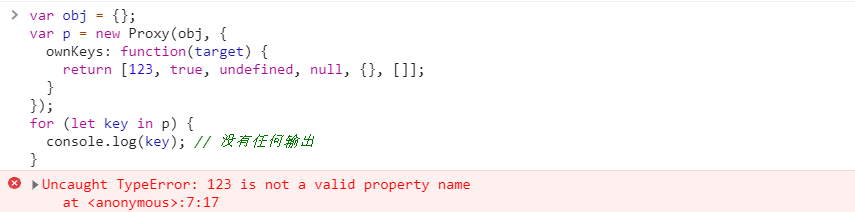 

##### g) 如果目标对象自身包含不可配置的属性, 则该属性必须被 [ownKeys()] 方法返回, 否则报错

>如果目标对象自身包含不可配置的属性, 则该属性必须被 [ownKeys()] 方法返回, 否则报错。
>
>```javascript
>const obj = {};
>Object.defineProperty(obj, 'name', {
>  configurable: false, //当且仅当该属性的 configurable 键值为 true 时, 该属性的描述符才能够被改变, 同时该属性也能从对应的对象上被删除。
>  enumerable: true,
>  value: '努力学习的汪' }
>);
>
>const getName = new Proxy(obj, {
>  ownKeys: function(target) {  return ['name']  }
>});
>const getB = new Proxy(obj, {
>  ownKeys: function(target) {  return ['b']  }
>});
>//前面说过,也能拦截此方法
>console.log(Object.getOwnPropertyNames(getName)) // ['name']
>console.log(Object.getOwnPropertyNames(getB))    // 报错
>```
>
>上面代码中, `obj`对象的`name`属性是不可配置的, 这时 [ownKeys()] 方法返回的数组之中, 必须包含`name`, 否则会报错
>
>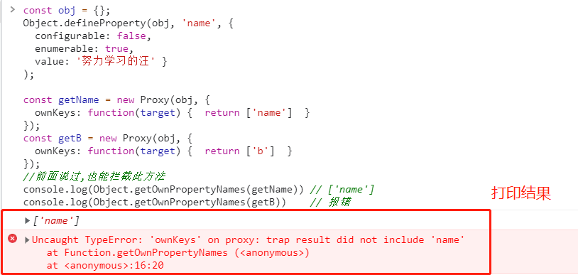 

##### h) 如果目标对象是不可扩展的（non-extensible）, 这时 [ownKeys()] 方法返回的数组之中, 必须包含原对象的所有属性, 且不能包含多余的属性, 否则报错

>另外, 如果目标对象是不可扩展的（non-extensible）, 这时 [ownKeys()] 方法返回的数组之中, 必须包含原对象的所有属性, 且不能包含多余的属性, 否则报错。
>
>```javascript
>const obj = { name:"努力学习的汪" };
>//Object.preventExtensions()方法让一个对象变的不可扩展, 也就是永远不能再添加新的属性。
>Object.preventExtensions(obj); //不可拓展
>const p = new Proxy(obj, {
>  ownKeys: function(target) { return ['name', 'age'] }
>});
>
>Object.getOwnPropertyNames(p)
>//报错 Uncaught TypeError: 'ownKeys' on proxy: trap returned extra keys but proxy target is non-extensible
>```
>
>上面代码中, `obj`对象是不可扩展的, 这时 [ownKeys()] 方法返回的数组之中, 包含了`obj`对象的多余属性`b`, 所以导致了报错。
>
>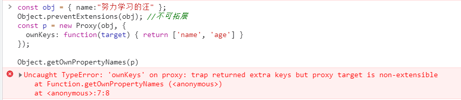 

#### ⑩② preventExtensions()

>`preventExtensions()`方法拦截`Object.preventExtensions()`。该方法必须返回一个布尔值, 否则会被自动转为布尔值。
>
>**Object.preventExtensions()方法:** 让一个对象变的不可扩展, 也就是永远不能再添加新的属性。

##### a) 限制

>这个方法有一个限制, 只有目标对象不可扩展时（即`Object.isExtensible(proxy)`为`false`）, `proxy.preventExtensions`才能返回`true`, 否则会报错。
>
>```javascript
>var proxy = new Proxy({}, {
>  preventExtensions: function(target) {  return true }
>});
>Object.preventExtensions(proxy)
>//VM2320:4 Uncaught TypeError: 'preventExtensions' on proxy: trap returned truish but the proxy target is extensible
>```
>
>上面代码中, `proxy.preventExtensions()`方法返回`true`, 但这时`Object.isExtensible(proxy)`会返回`true`, 因此报错。
>
>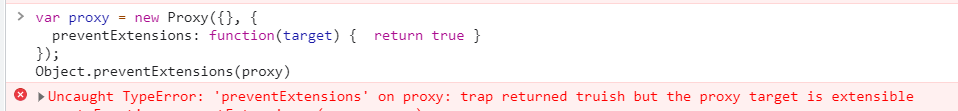 

##### b) 解决

>为了防止出现这个问题, 通常要在`proxy.preventExtensions()`方法里面, 调用一次`Object.preventExtensions()`。
>
>```javascript
>const proxy = new Proxy({}, {
>  preventExtensions: function(target) {
>    console.log('回调');
>    Object.preventExtensions(target);
>    return true;
>  }
>});
>
>Object.preventExtensions(proxy)
>// "called"
>// Proxy {}
>```
>
>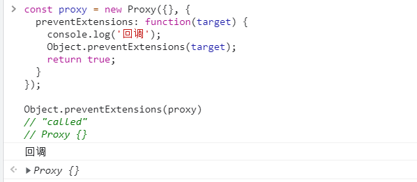 

#### ⑩③ setPrototypeOf()

>`setPrototypeOf()`方法主要用来拦截`Object.setPrototypeOf()`方法。
>
>**Object.setPrototypeOf()** 方法设置一个指定的对象的原型 ( 即, 内部[[Prototype]]属性）到另一个对象或  [`null`](https://developer.mozilla.org/zh-CN/docs/Web/JavaScript/Reference/Global_Objects/null)。
>
>下面是一个例子。
>
>```javascript
>var handler = {
>  setPrototypeOf (target, proto) {
>    throw new Error('禁止更改原型');
>  }
>};
>var proto = {};
>var target = function () {};
>var proxy = new Proxy(target, handler);
>Object.setPrototypeOf(proxy, proto);
>// Error: 禁止更改原型
>```
>
>上面代码中, 只要修改`target`的原型对象, 就会报错。
>
>注意, 该方法只能返回布尔值, 否则会被自动转为布尔值。另外, 如果目标对象不可扩展（non-extensible）, `setPrototypeOf()`方法不得改变目标对象的原型。

### Ⅳ  - Proxy.revocable() 可取消的Proxy实例

>Proxy.revocable()`方法返回一个可取消的 Proxy 实例。
>
>```javascript
>let target = {};
>let handler = {};
>let {proxy, revoke} = Proxy.revocable(target, handler);
>
>proxy.name = '努力学习的汪';
>proxy.name // 努力学习的汪
>
>revoke();
>proxy.name // TypeError: Revoked
>```
>
>`Proxy.revocable()`方法返回一个对象, 该对象的`proxy`属性是 [ Proxy ] 实例, `revoke`属性是一个函数, 可以取消 [ Proxy ] 实例。上面代码中, 当执行`revoke`函数之后, 再访问 [ Proxy ] 实例, 就会抛出一个错误。
>
>`Proxy.revocable()`的一个使用场景是, 目标对象不允许直接访问, 必须通过代理访问, 一旦访问结束, 就收回代理权, 不允许再次访问。
>
>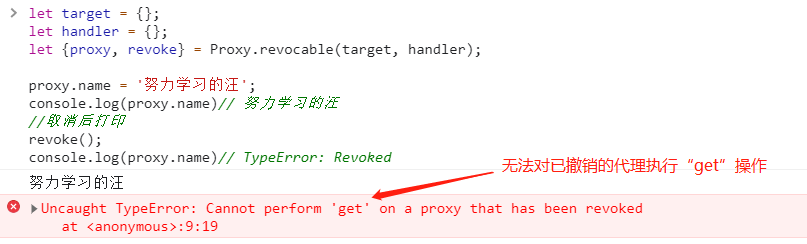 

### Ⅴ - this 问题

>虽然 Proxy 可以代理针对目标对象的访问, 但它不是目标对象的透明代理, 即不做任何拦截的情况下, 也无法保证与目标对象的行为一致。主要原因就是在 Proxy 代理的情况下, 目标对象内部的`this`关键字会指向 Proxy 代理。
>
>```javascript
>const target = {
>  m: function () {
>    console.log(this === proxy); //打印this执行是否指向 proxy
>  }
>};
>const handler = {};
>const proxy = new Proxy(target, handler);
>
>target.m() // false
>proxy.m()  // true
>```
>
>上面代码中, 一旦`proxy`代理`target`, `target.m()`内部的`this`就是指向`proxy`, 而不是`target`。

#### ① 举个栗子

>下面是一个例子, 由于`this`指向的变化, 导致 Proxy 无法代理目标对象。
>
>```javascript
>const _name = new WeakMap();
>class Person {
>  constructor(name) { _name.set(this, name) }
>  get name() { return _name.get(this) }
>}
>
>const hong = new Person('努力学习的汪');
>console.log(hong.name ) //努力学习的汪
>
>const proxy = new Proxy(hong, {});
>console.log(proxy.name ) //undefined
>```
>
>上面代码中, 目标对象`hong`的`name`属性, 实际保存在外部`WeakMap`对象`_name`上面, 通过`this`键区分。由于通过`proxy.name`访问时, `this`指向`proxy`, 导致无法取到值, 所以返回`undefined`。

#### ② 无法某些原生对象的内部属性

>有些原生对象的内部属性, 只有通过正确的`this`才能拿到, 所以 Proxy 也无法代理这些原生对象的属性。
>
>```javascript
>const target = new Date();
>const handler = {};
>const proxy = new Proxy(target, handler);
>
>proxy.getDate();
>// TypeError: this is not a Date object.
>```
>
>上面代码中, `getDate()`方法只能在`Date`对象实例上面拿到, 如果`this`不是`Date`对象实例就会报错。这时, `this`绑定原始对象, 就可以解决这个问题。
>
>```js
>const target = new Date('2021-11-11');
>const handler = {
>  get(target, prop) {
>    if (prop === 'getDate') {
>      return target.getDate.bind(target);
>    }
>    return Reflect.get(target, prop);
>  }
>};
>const proxy = new Proxy(target, handler);
>
>proxy.getDate() //11
>```

#### ③ Proxy 拦截函数内部的`this`, 指向的是`handler`对象。

>Proxy 拦截函数内部的`this`, 指向的是`handler`对象。
>
>```javascript
>const handler = {
>  get: function (target, key, receiver) {
>    console.log("此时this === handler:",this === handler);
>    return `拦截get: [${key}] 属性` ;
>  },
>  set: function (target, key, value) {
>    console.log("此时this === handler:",this === handler);
>    target[key] = value;
>    return `拦截set: [${key}] 属性`;
>  }
>};
>const proxy = new Proxy({}, handler);
>
>proxy.name
>proxy.name = '努力学习的汪'
>```
>
>上面例子中, `get()`和`set()`拦截函数内部的`this`, 指向的都是`handler`对象。
>
>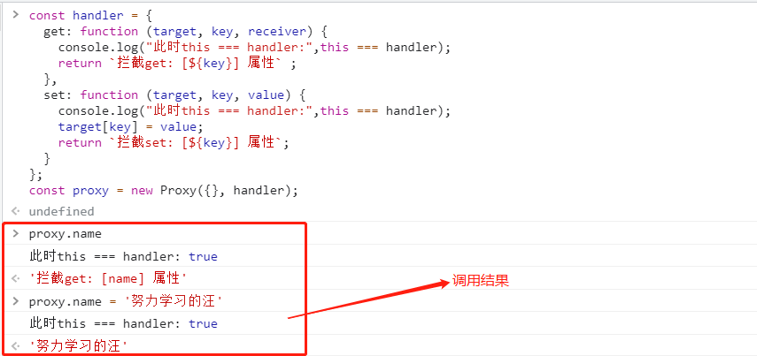 

### Ⅵ - 应用: Web 服务的客户端

>Proxy 对象可以拦截目标对象的任意属性, 这使得它很合适用来写 Web 服务的客户端。
>
>```javascript
>const service = createWebService('https://gitee.com/hongjilin');
>service.employees().then(json => {
> ......
>});
>```
>
>上面代码新建了一个 Web 服务的接口, 这个接口返回各种数据。Proxy 可以拦截这个对象的任意属性, 所以不用为每一种数据写一个适配方法, 只要写一个 Proxy 拦截就可以了。
>
>```javascript
>function createWebService(baseUrl) {
>  return new Proxy({}, {
>    get(target, propKey, receiver) {
>      return () => httpGet(baseUrl + '/' + propKey);
>    }
>  });
>}
>```
>
>同理，Proxy 也可以用来实现数据库的 ORM 层。

### Ⅶ - Proxy模拟实现VUE数据双向绑定

>  [ Proxy ] 就像一个代理器,当有人对目标对象进行处理(set、has、get 等等操作)的时候它会首先经过它, 这时我们可以使用代码进行处理, 此时 [ Proxy ] 相当于一个中介或者叫代理人,它经常被用于代理模式中,可以做字段验证、缓存代理、访问控制等等。

#### ①  [ Object.defineProperty ] 

>众所周知, `vue`使用了 [ Object.defineProperty ] 来做数据劫持, 它是利用劫持对象的访问器,在属性值发生变化时我们可以获取变化,从而进行进一步操作
>
>```js
>const obj = { a: 1 }
>Object.defineProperty(obj, 'a', {
>get: function() {
>console.log('get val')
>},
>set: function(newVal) {
>console.log('set val:' + newVal)
>}
>})
>```

#### ② 与 [ Object.defineProperty ] 相比,  [ Proxy ] 的优势

>1. 数组作为特殊的对象, 但Object.defineProperty无法监听数组变化。
>
>2. Object.defineProperty只能劫持对象的属性,因此我们需要对每个对象的每个属性进行遍历, 如果属性值也是对象那么需要深度遍历,显然能劫持一个完整的对象是更好的选择。
>
>3. Proxy 有多达 13 种拦截方法,不限于apply、ownKeys、deleteProperty、has等等是Object.defineProperty不具备的。
>
>4. Proxy返回的是一个新对象,我们可以只操作新的对象达到目的,而Object.defineProperty只能遍历对象属性直接修改
>
>5. Proxy作为新标准将受到浏览器厂商重点持续的性能优化

#### ③ 手写双向绑定代码

>1. 简单实现双向绑定
>
>  ```js
>  --------------------  html  ----------------------------
>    <input id="input_el" oninput="inputHandle(this)" type="text">
>    <br />
>    <div id="show_el"></div>
>  -------------------  js ------------------------------
>  <script>
>    proxy_bind = (traget) => {
>      return new Proxy(traget, {
>        get(obj, name) {
>          console.log("获取")
>          //如果传入的key并没有,则赋初始值
>          if (!obj[name]) obj[name] = ""
>          //根据传入的key进行相应属性返回
>          return obj[name]
>        },
>        //拦截的对象,拦截对象的值,传入要修改的值,(第四个参数通常不用,返回整个Proxy对象)
>        set(obj, name, val) {
>          console.log("写入")
>          obj[name] = val
>          //将输入狂内容即修改的proxy对象属性渲染到页面节点上
>          document.querySelector("#show_el").innerHTML = obj[name]
>          return;
>        }
>      })
>    }
>    inputHandle = (e) => {
>      //将输入框的值赋值给proxy对象的value属性上, 此处触发proxy的`set（）`
>      obj_bind.value = e.value
>    }
>
>    let obj = {
>      a: "2",
>      b: 3,
>      value: "默认值"
>    }
>    let obj_bind = proxy_bind(obj)
>    //自闭合, 如果前面没有加分号 会导致压缩式合并到前面去就会报错, 以防万一加分号, 此处触发proxy的`get（）`
>    ;
>    (function () {
>      document.querySelector("#show_el").innerHTML = obj_bind.value
>      document.querySelector("#input_el").value = obj_bind.value
>    })()
>  </script>
>  ```
>
>2. 模拟vue实现完整双向绑定实现
>
>  ```js
>  --------------------  html  ----------------------------
>  <div>
>    <p>请输入:</p>
>    <input type="text" id="input">
>    <p id="p"></p>
>  </div>
>  -------------------  js ------------------------------
>  class Watcher {
>    constructor(vm, key, callback) {
>      this.vm = vm
>      this.callback = callback
>      this.key = key // 被订阅的数据
>      this.val = this.get() // 维护更新之前的数据
>      vm.$data = this.createProxy(vm.$data)
>    }
>
>    update(newVal) {
>      this.callback(newVal)
>    }
>    get() {
>      const val = this.vm.$data[this.key]
>      return val
>    }
>    createProxy(data) {
>      let _this = this
>      let handler = {
>        get(target, property) {
>          return Reflect.get(target, property)
>        },
>        set(target, property, value) {
>          let res = null
>          if (target[property] != value) {
>            const isOk = Reflect.set(target, property, value)
>            if (_this.key === property) {
>              // 同一层级
>              res = value
>            } else {
>              res = _this.get()
>              console.log(res)
>            }
>            _this.callback(res)
>            return isOk
>          }
>        }
>      }
>
>      return toDeepProxy(data, handler)
>
>      function toDeepProxy(object, handler) {
>        if (!isPureObject(object)) addSubProxy(object, handler)
>        return new Proxy(object, handler)
>
>        function addSubProxy(object, handler) {
>          for (let prop in object) {
>            if (typeof object[prop] == 'object') {
>              if (!isPureObject(object[prop])) addSubProxy(object[prop], handler)
>              object[prop] = new Proxy(object[prop], handler)
>            }
>          }
>          object = new Proxy(object, handler)
>        }
>
>        function isPureObject(object) {
>          if (typeof object !== 'object') {
>            return false
>          } else {
>            for (let prop in object) {
>              if (typeof object[prop] == 'object') {
>                return false
>              }
>            }
>          }
>          return true
>        }
>      }
>    }
>  }
>
>  class Vue {
>    constructor(data) {
>      // 将所有data最外层属性代理到实例上
>      this.$data = data
>      Object.keys(data).forEach(key => this.$proxy(key))
>    }
>    $watch(key, cb) {
>      new Watcher(this, key, cb)
>    }
>    $proxy(key) {
>      Reflect.defineProperty(this, key, { //此处API不懂的可以看下方下个知识点
>        configurable: true,
>        enumerable: true,
>        get: () => this.$data[key],
>        set: val => {
>          this._data[key] = val
>        }
>      })
>    }
>  }
>
>  const p = document.getElementById('p')
>  const input = document.getElementById('input')
>
>  const data = new Vue({ text: { a: '' } })
>
>  input.addEventListener('keyup', function(e) {
>    data.text.a = e.target.value
>  })
>
>  data.$watch('text', content => p.innerHTML = content.a)
>
>  ```

## 14、Reflect

> 在前方我们在描述 [ Proxy ] 知识点时,我们有用到 **Reflect** 这个API
>
> 实际上你可以认为 **Reflect** 就是将 **Object** 上的部分内部方法移到上面,让我们的JS编码更规范、清晰明了

### Ⅰ - 概述与总结

>  **Reflect**  对象与 [ Proxy ] 对象一样, 也是 ES6 为了操作对象而提供的新 API。  **Reflect**  对象的设计目的有这样几个。
>
>  1.  将`Object`对象的一些明显属于语言内部的方法（比如 [ Object.defineProperty ] ）, 放到  **Reflect**  对象上。现阶段, 某些方法同时在`Object`和  **Reflect**  对象上部署, 未来的新方法将只部署在  **Reflect**  对象上。也就是说, 从  **Reflect**  对象上可以拿到语言内部的方法
>
>  2. 修改某些`Object`方法的返回结果, 让其变得更合理。比如,  [Object.defineProperty(obj, name, desc)] 在无法定义属性时, 会抛出一个错误, 而`Reflect.defineProperty(obj, name, desc)`则会返回`false`。
>
>   >```js
>   >// 老写法: 因为会抛出异常错误,所以必须用 try..catch() 去承接错误
>   >try {
>   >  Object.defineProperty(target, property, attributes);
>   >  // success
>   >} catch (e) {
>   >  // 这里承接抛出的错误
>   >}
>   >
>   >// 新写法
>   >if (Reflect.defineProperty(target, property, attributes)) {
>   >  // success
>   >} else {
>   >  // failure
>   >}
>   >```
>
>  3. 让`Object`操作都变成函数行为。某些`Object`操作是命令式, 比如`name in obj`和`delete obj[name]`, 而`Reflect.has(obj, name)`和`Reflect.deleteProperty(obj, name)`让它们变成了函数行为。
>
>   >```js
>   >// 老写法
>   >'assign' in Object // true
>   >
>   >// 新写法
>   >Reflect.has(Object, 'assign') // true
>   >```
>
>  4.  **Reflect** 对象的方法与 [Proxy] 对象的方法一一对应, 只要是 [Proxy] 对象的方法, 就能在 **Reflect** 对象上找到对应的方法。这就让 [Proxy] 对象可以方便地调用对应的 **Reflect** 方法, 完成默认行为, 作为修改行为的基础。也就是说, 不管 [Proxy] 怎么修改默认行为, 你总可以在 **Reflect** 上获取默认行为。
>
>   >```js
>   >Proxy(target, {
>   >set: function(target, name, value, receiver) {
>   >const success = Reflect.set(target, name, value, receiver);
>   >if (success)  console.log('在属性:' + name + ' 上 ' + target + ' 写入 ' + value);
>   >return success;
>   >}
>   >});
>   >```
>   >
>   >上面代码中, 每一个 [Proxy] 对象的拦截操作（`get`、`delete`、`has`）, 内部都调用对应的 **Reflect** 方法, 保证原生行为能够正常执行。添加的工作, 就是将每一个操作输出一行日志。
>
>  有了 **Reflect** 对象以后, 很多操作会更易读。
>
>  ```javascript
>  // 老写法
>  Function.prototype.apply.call(Math.floor, undefined, [1.75]) // 1
>  
>  // 新写法
>  Reflect.apply(Math.floor, undefined, [1.75]) // 1
>  ```
>

#### ① 设计目的

>- 将`Object`属于`语言内部的方法`放到  **Reflect**  上
>- 将某些Object方法报错情况改成返回`false`
>- 让`Object操作`变成`函数行为`
>-  [ Proxy ] 与  **Reflect**  相辅相成

#### ②废弃方法

>-   [ Object.defineProperty() ]  =>   [ Reflect.defineProperty() ] 
>-   [ Object.getOwnPropertyDescriptor() ]  =>   [ Reflect.getOwnPropertyDescriptor() ] 

#### ③ 重点难点

>- `Proxy方法`和`Reflect方法`一一对应
>-  [ Proxy ] 和  **Reflect**  联合使用, 前者负责`拦截赋值操作`, 后者负责`完成赋值操作`

#### ④ 方法

>下面这些方法的作用, 大部分与`Object`对象的同名方法的作用都是相同的, 而且它与`Proxy`对象的方法是一一对应的。下面是对它们的解释。
>
>- **get()**：返回对象属性
>- **set()**：设置对象属性, 返回布尔
>- **has()**：检查对象属性, 返回布尔
>- **deleteProperty()**：删除对象属性, 返回布尔
>- **defineProperty()**：定义对象属性, 返回布尔
>- **ownKeys()**：遍历对象属性, 返回数组(`Object.getOwnPropertyNames()`+`Object.getOwnPropertySymbols()`)
>- **getOwnPropertyDescriptor()**：返回对象属性描述, 返回对象
>- **getPrototypeOf()**：返回对象原型, 返回对象
>- **setPrototypeOf()**：设置对象原型, 返回布尔
>- **isExtensible()**：返回对象是否可扩展, 返回布尔
>- **preventExtensions()**：设置对象不可扩展, 返回布尔
>- **apply()**：绑定this后执行指定函数
>- **construct()**：调用构造函数创建实例
>
>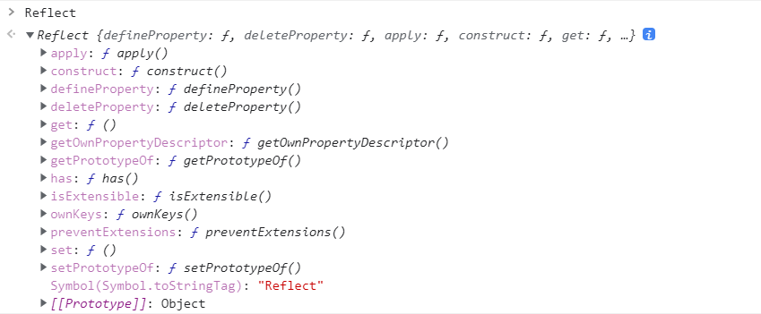 

#### ⑤ 数据绑定：观察者模式

> [ Proxy ] 和  **Reflect**  联合使用, 前者负责`拦截赋值操作`, 后者负责`完成赋值操作`, 相辅相成,下面举个栗子
>
>```js
>const observerQueue = new Set();
>const observe = fn => observerQueue.add(fn);
>const observable = obj => new Proxy(obj, {
>    set(tgt, key, val, receiver) {
>        const result = Reflect.set(tgt, key, val, receiver);
>        observerQueue.forEach(v => v());
>        return result;
>    }
>});
>
>const person = observable({ age: 66, name: "hongjilin" });
>const print = () => console.log(`${person.name} is ${person.age} years old`); 
>observe(print); //进行监听
>
>person.name = "努力学习的汪";
>```
>
>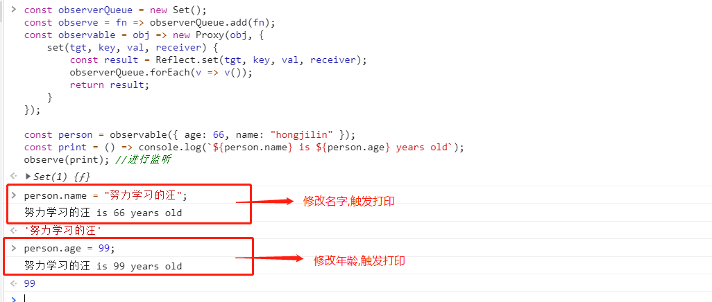 

### Ⅱ - 方法详解

#### ① Reflect.get(target, name, receiver)

> [ Reflect.get ] 方法查找并返回`target`对象的`name`属性, 如果没有该属性, 则返回`undefined`。
>
>```javascript
>const myObject = {
>  name: '努力学习的汪',
>  age: 99,
>  get msg() {
>    return this.name + "现在" +this.age + "岁";
>  },
>}
>console.log(Reflect.get(myObject, 'name'))// 努力学习的汪
>console.log(Reflect.get(myObject, 'age') ) // 99
>console.log(Reflect.get(myObject, 'msg'))  // 努力学习的汪现在99岁
>```
>

##### a) 如果`name`属性部署了读取函数（getter）, 则读取函数的 `this` 绑定   [ receiver ] 

>如果`name`属性部署了读取函数（getter）, 则读取函数的`this`绑定  [ receiver ] 
>
>```javascript
>const myObject = {
>  name: '努力学习的汪',
>  age: 99,
>  get msg() {
>    return this.name + "现在" +this.age + "岁";
>  },
>}
>
>const myReceiverObject = {
>  name: 'hongjilin',
>  age: 18,
>};
>
>Reflect.get(myObject, 'msg', myReceiverObject) //'hongjilin现在18岁'
>```
>

##### b) 如果第一个参数不是对象,  [ Reflect.get ] 方法会报错。

>```javascript
>Reflect.get(1, 'name') // 报错
>Reflect.get(false, 'name') // 报错
>```

#### ② Reflect.set(target, name, value, receiver)

##### a) `Reflect.set`方法设置`target`对象的`name`属性等于`value`

>```javascript
>const myObject = {
>  name: 'hongjilin',
>  set setName(value) {
>    return this.name = value;
>  },
>}
>
>console.log(myObject.name) // hongjilin
>
>Reflect.set(myObject, 'name', '努力学习的汪');
>console.log(myObject.name) // 努力学习的汪
>
>Reflect.set(myObject, 'setName','调用setName写入名字')
>console.log(myObject.name) // 调用setName写入名字
>```
>

##### b) 如果`name`属性设置了赋值函数, 则赋值函数的`this`绑定  [ receiver ] 。

>```js
>const myObject = {
>  name: 'hongjilin',
>  set setName(value) {
>    return this.name = value;
>  },
>}
>
>const myReceiverObject = {
>  name: '这是 myReceiverObject 的 name',
>};
>
>Reflect.set(myObject, 'name', '努力学习的汪', myReceiverObject);
>console.log(myObject.name) // hongjilin
>console.log(myReceiverObject.name) // 努力学习的汪  
>```
>
> 可以看到 [ **myReceiverObject** ] 被修改了

##### c) 如果 `Proxy`对象和 `Reflect`对象联合使用注意事项

>注意, 如果 `Proxy`对象和 `Reflect`对象联合使用, 前者拦截赋值操作, 后者完成赋值的默认行为, 而且传入了  [ receiver ] , 那么`Reflect.set`会触发  [ Proxy.defineProperty ] 拦截。
>
>>知识点回顾:
>>
>>* **handler.defineProperty()** : 用于拦截对对象的 [`Object.defineProperty()`](https://developer.mozilla.org/zh-CN/docs/Web/JavaScript/Reference/Global_Objects/Object/defineProperty) 操作
>>* **Object.defineProperty()** : 会直接在一个对象上定义一个新属性, 或者修改一个对象的现有属性, 并返回此对象。
>
>```javascript
>let p = { name: 'hongjilin' };
>
>let handler = {
>  set(target, key, value, receiver) {
>    console.log('拦截 set 操作');
>    Reflect.set(target, key, value, receiver)
>  },
>  defineProperty(target, key, attribute) {
>    console.log('触发 defineProperty');
>    Reflect.defineProperty(target, key, attribute);
>  }
>};
>
>let obj = new Proxy(p, handler);
>obj.name = '努力学习的汪';
>// 拦截 set 操作
>// 触发 defineProperty
>```
>
>上面代码中,  **Proxy.set** 拦截里面使用了`Reflect.set`, 而且传入了  [ receiver ] , 导致触发  [ Proxy.defineProperty ] 拦截。
>
>>* 这是因为 **Proxy.set** 的  [ receiver ] 参数总是指向当前的 `Proxy`实例（即上例的`obj`）
>>* 而`Reflect.set`一旦传入  [ receiver ] , 就会将属性赋值到  [ receiver ] 上面(即`obj`), 导致触发`defineProperty`拦截
>>* 如果`Reflect.set`没有传入  [ receiver ] , 那么就不会触发`defineProperty`拦截。
>
>```javascript
>let p = { name: 'hongjilin' };
>
>let handler = {
>  set(target, key, value, receiver) {
>    console.log('拦截 set 操作');
>    Reflect.set(target, key, value) // 差异:此处没有传入receiver
>  },
>  defineProperty(target, key, attribute) {
>    console.log('触发 defineProperty');
>    Reflect.defineProperty(target, key, attribute);
>  }
>};
>
>let obj = new Proxy(p, handler);
>obj.name = '努力学习的汪';
>// 拦截 set 操作 -->不会触发 defineProperty
>```
>

##### d) 如果第一个参数不是对象,  [ Reflect.get ] 方法会报错。

>```javascript
>Reflect.set(1, 'name',{}) // 报错 
>Reflect.set(false, 'name','xx') // 报错
>//Uncaught TypeError: Reflect.set called on non-object
>```

#### ③ Reflect.has(obj, name)

>`Reflect.has`方法对应`name in obj`里面的`in`运算符。
>
>```javascript
>const myObject = { name: '努力学习的汪' };
>
>// 旧写法
>'name' in myObject // true
>
>// 新写法
>Reflect.has(myObject, 'name') // true
>```
>
>如果`Reflect.has()`方法的第一个参数不是对象, 会报错。

#### ④ Reflect.deleteProperty(obj, name)

>`Reflect.deleteProperty`方法等同于`delete obj[name]`, 用于删除对象的属性。
>
>```javascript
>const myObj = { name: '努力学习的汪' };
>
>// 旧写法
>delete myObj.name;
>
>// 新写法
>Reflect.deleteProperty(myObj, 'name');
>```
>
>该方法返回一个布尔值。如果删除成功, 或者被删除的属性不存在, 返回`true`；删除失败, 被删除的属性依然存在, 返回`false`。
>
>如果`Reflect.deleteProperty()`方法的第一个参数不是对象, 会报错。

#### ⑤ Reflect.construct(target, args)

>`Reflect.construct`方法等同于`new target(...args)`, 这提供了一种不使用`new`, 来调用构造函数的方法。
>
>```javascript
>function Greeting(name) {
>  this.name = name;
>}
>
>// new 的写法
>const instance = new Greeting('努力学习的汪');
>
>// Reflect.construct 的写法
>const instance = Reflect.construct(Greeting, ['努力学习的汪']);
>```
>
>如果`Reflect.construct()`方法的第一个参数不是函数, 会报错。

#### ⑥ Reflect.getPrototypeOf(obj)

>`Reflect.getPrototypeOf`方法用于读取对象的`__proto__`属性, 对应`Object.getPrototypeOf(obj)`。
>
>```javascript
>const myObj = new FancyThing();
>
>// 旧写法
>Object.getPrototypeOf(myObj) === FancyThing.prototype;
>
>// 新写法
>Reflect.getPrototypeOf(myObj) === FancyThing.prototype;
>```
>
>`Reflect.getPrototypeOf`和`Object.getPrototypeOf`的一个区别是, 如果参数不是对象, `Object.getPrototypeOf`会将这个参数转为对象, 然后再运行, 而`Reflect.getPrototypeOf`会报错。
>
>```javascript
>Object.getPrototypeOf(1) // Number {[[PrimitiveValue]]: 0}
>Reflect.getPrototypeOf(1) // 报错
>```
>

#### ⑦ Reflect.setPrototypeOf(obj, newProto)

>`Reflect.setPrototypeOf`方法用于设置目标对象的原型（prototype）, 对应`Object.setPrototypeOf(obj, newProto)`方法。它返回一个布尔值, 表示是否设置成功。
>
>```javascript
>const myObj = {};
>
>// 旧写法
>Object.setPrototypeOf(myObj, Array.prototype);
>
>// 新写法
>Reflect.setPrototypeOf(myObj, Array.prototype);
>
>myObj.length // 0
>```
>

##### a) 如果无法设置目标对象的原型时

>如果无法设置目标对象的原型（比如, 目标对象禁止扩展）, `Reflect.setPrototypeOf`方法返回`false`。
>
>```javascript
>Reflect.setPrototypeOf({}, null)
>// true
>Reflect.setPrototypeOf(Object.freeze({}), null)
>// false
>```
>

##### b) 第一个参数不是对象时

>如果第一个参数不是对象, `Object.setPrototypeOf`会返回第一个参数本身, 而`Reflect.setPrototypeOf`会报错。
>
>```javascript
>Object.setPrototypeOf(1, {})
>// 1
>
>Reflect.setPrototypeOf(1, {})
>// TypeError: Reflect.setPrototypeOf called on non-object
>```
>

##### c) 如果第一个参数是`undefined`或`null`时

>如果第一个参数是`undefined`或`null`, `Object.setPrototypeOf`和`Reflect.setPrototypeOf`都会报错。
>
>```javascript
>Object.setPrototypeOf(null, {})
>// TypeError: Object.setPrototypeOf called on null or undefined
>
>Reflect.setPrototypeOf(null, {})
>// TypeError: Reflect.setPrototypeOf called on non-object
>```
>

#### ⑧ Reflect.apply(func, thisArg, args)

>`Reflect.apply`方法等同于`Function.prototype.apply.call(func, thisArg, args)`, 用于绑定`this`对象后执行给定函数。
>
>一般来说, 如果要绑定一个函数的`this`对象, 可以这样写`fn.apply(obj, args)`, 但是如果函数定义了自己的`apply`方法, 就只能写成`Function.prototype.apply.call(fn, obj, args)`, 采用`Reflect`对象可以简化这种操作。
>
>```javascript
>const ages = [11, 33, 12, 54, 18, 96];
>
>// 旧写法
>const youngest = Math.min.apply(Math, ages);
>const oldest = Math.max.apply(Math, ages);
>const type = Object.prototype.toString.call(youngest);
>
>// 新写法
>const youngest = Reflect.apply(Math.min, Math, ages);
>const oldest = Reflect.apply(Math.max, Math, ages);
>const type = Reflect.apply(Object.prototype.toString, youngest, []);
>```
>

#### ⑨ Reflect.defineProperty(target, propertyKey, attributes)

>  [ Reflect.defineProperty ] 方法基本等同于`Object.defineProperty`, 用来为对象定义属性。未来, 后者会被逐渐废除, 请从现在开始就使用  [ Reflect.defineProperty ] 代替它。
>
>```javascript
>function MyDate() {}
>
>// 旧写法
>Object.defineProperty(MyDate, 'now', {
>  value: () => Date.now()
>});
>
>// 新写法
>Reflect.defineProperty(MyDate, 'now', {
>  value: () => Date.now()
>});
>```
>
>如果  [ Reflect.defineProperty ] 的第一个参数不是对象, 就会抛出错误, 比如`Reflect.defineProperty(18, 'age')`

##### a) 可以与  [ Proxy.defineProperty ] 配合使用

>这个方法可以与  [ Proxy.defineProperty ] 配合使用。
>
>```javascript
>const p = new Proxy({}, {
>  defineProperty(target, prop, descriptor) {
>    console.log(descriptor); //此处拦截后 进行一次打印
>    return Reflect.defineProperty(target, prop, descriptor);
>  }
>});
>
>p.name = '努力学习的汪';// {value: '努力学习的汪', writable: true, enumerable: true, configurable: true}
>p.name // '努力学习的汪'
>```
>
>上面代码中,   [ Proxy.defineProperty ] 对属性赋值设置了拦截, 然后使用  [ Reflect.defineProperty ] 完成了赋值,这样就能不影响原来赋值效果的同时还能进行拦截处理

#### ⑩ Reflect.getOwnPropertyDescriptor(target, propertyKey)

>  [ Reflect.getOwnPropertyDescriptor ] 基本等同于  [ Object.getOwnPropertyDescriptor ] , 用于得到指定属性的描述对象, 将来会替代掉后者。
>
>> **Object.getOwnPropertyDescriptor()方法**: 返回指定对象上一个自有属性对应的属性描述符。（自有属性指的是直接赋予该对象的属性, 不需要从原型链上进行查找的属性）
>>
>> **Object.defineProperty()** 方法会直接在一个对象上定义一个新属性, 或者修改一个对象的现有属性, 并返回此对象。
>
>```javascript
>var myObject = {};
>Object.defineProperty(myObject, 'name', {
>  value: true, //该属性对应的值。可以是任何有效的 JavaScript 值（数值, 对象, 函数等）。
>  enumerable: false, //当且仅当该属性的 enumerable 键值为 true 时, 该属性才会出现在对象的枚举属性中。
>});
>
>// 旧写法
>var theDescriptor = Object.getOwnPropertyDescriptor(myObject, 'name');
>
>// 新写法
>var theDescriptor1 = Reflect.getOwnPropertyDescriptor(myObject, 'name');
>```
>
>  [ Reflect.getOwnPropertyDescriptor ] 和  [ Object.getOwnPropertyDescriptor ] 的一个区别是, 如果第一个参数不是对象
>
>* [ Object.getOwnPropertyDescriptor(99, 'age') ]不报错, 返回`undefined`
>* 而 [ Reflect.getOwnPropertyDescriptor(99, 'age') ] 会抛出错误, 表示参数非法。

#### ⑩① Reflect.isExtensible (target)

>`Reflect.isExtensible`方法对应`Object.isExtensible`, 返回一个布尔值, 表示当前对象是否可扩展。
>
>```javascript
>const myObject = {};
>
>// 旧写法
>Object.isExtensible(myObject) // true
>
>// 新写法
>Reflect.isExtensible(myObject) // true
>```
>
>如果参数不是对象, `Object.isExtensible`会返回`false`, 因为非对象本来就是不可扩展的, 而`Reflect.isExtensible`会报错。
>
>```javascript
>Object.isExtensible(1) // false
>Reflect.isExtensible(1) // 报错
>```
>

#### ⑩② Reflect.preventExtensions(target)

>`Reflect.preventExtensions`对应`Object.preventExtensions`方法, 用于让一个对象变为不可扩展。它返回一个布尔值, 表示是否操作成功。
>
>```javascript
>var myObject = {};
>
>// 旧写法
>Object.preventExtensions(myObject) // Object {}
>
>// 新写法
>Reflect.preventExtensions(myObject) // true
>```
>
>如果参数不是对象, `Object.preventExtensions`在 ES5 环境报错, 在 ES6 环境返回传入的参数, 而`Reflect.preventExtensions`会报错。
>
>```javascript
>// ES5 环境
>Object.preventExtensions(1) // 报错
>
>// ES6 环境
>Object.preventExtensions(1) // 1
>
>// 新写法
>Reflect.preventExtensions(1) // 报错
>```
>

#### ⑩③ Reflect.ownKeys (target

>`Reflect.ownKeys`方法用于返回对象的所有属性, 基本等同于`Object.getOwnPropertyNames`与`Object.getOwnPropertySymbols`之和。
>
>```javascript
>var myObject = {
>  foo: 1,
>  bar: 2,
>  [Symbol.for('baz')]: 3,
>  [Symbol.for('bing')]: 4,
>};
>
>// 旧写法
>Object.getOwnPropertyNames(myObject)
>// ['foo', 'bar']
>
>Object.getOwnPropertySymbols(myObject)
>//[Symbol(baz), Symbol(bing)]
>
>// 新写法
>Reflect.ownKeys(myObject)
>// ['foo', 'bar', Symbol(baz), Symbol(bing)]
>```
>
>如果`Reflect.ownKeys()`方法的第一个参数不是对象, 会报错。

### Ⅲ - 应用: 配合 Proxy 实现观察者模式

>实际上与上方[ Proxy ] 模拟实现Vue数据双向绑定一样,这里按照 阮一峰ES6 教程中的示例代码  实现
>
>观察者模式（Observer mode）指的是函数自动观察数据对象, 一旦对象有变化, 函数就会自动执行。
>
>```javascript
>const person = observable({
>  name: 'hongjilin',
>  age: 18
>});
>
>function print() { console.log(`${person.name} 今年 ${person.age} 岁了`) }
>
>observe(print); //监听  这个方法定义实现放在下方
>person.name = '努力学习的汪';
>person.age = 99;
>```
>
>上面代码中, 数据对象`person`是观察目标, 函数`print`是观察者。一旦数据对象发生变化, `print`就会自动执行。
>
>下面, 使用 Proxy 写一个观察者模式的最简单实现, 即实现`observable`和`observe`这两个函数。思路是`observable`函数返回一个原始对象的 Proxy 代理, 拦截赋值操作, 触发充当观察者的各个函数。
>
>```javascript
>const queuedObservers = new Set();
>
>const observe = fn => queuedObservers.add(fn);
>const observable = obj => new Proxy(obj, {set});
>
>function set(target, key, value, receiver) {
>  const result = Reflect.set(target, key, value, receiver);
>  queuedObservers.forEach(observer => observer());
>  return result;
>}
>```
>
>上面代码中, 先定义了一个`Set`集合, 所有观察者函数都放进这个集合。然后, `observable`函数返回原始对象的代理, 拦截赋值操作。拦截函数`set`之中, 会自动执行所有观察者。
>
>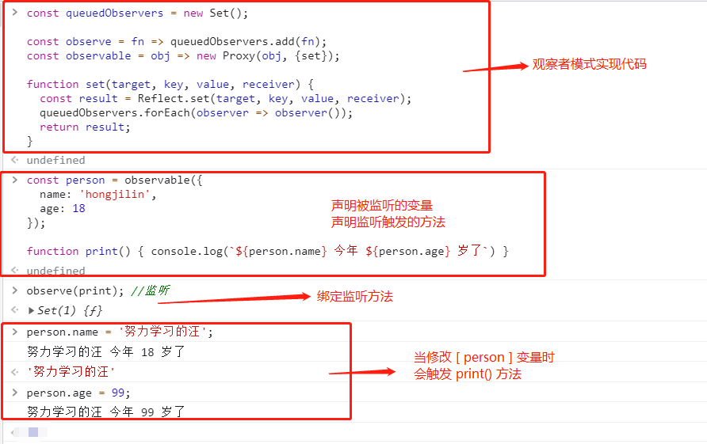 


## 15、Iterator 和 for…of 循环

>这个知识点就属于,貌似你不学也不影响基本编程开发的类型,但当你编程开发了一段时间后这东西似乎又无处不在地存在于我们 JavaScript 的每个部分
>
>起码在我初学前端时这部分是直接跳过不学的,也是到现在才回头来补充学习,

### Ⅰ- 概述与总结

>1. 定义：为各种不同的数据结构提供统一的访问机制
>2. 原理：创建一个指针指向首个成员, 按照次序使用`next()`指向下一个成员, 直接到结束位置(数据结构只要部署`Iterator接口`就可完成遍历操作)
>3. 作用
>   - 为各种数据结构提供一个统一的简便的访问接口
>   - 使得数据结构成员能够按某种次序排列
>   - ES6创造了新的遍历命令 [ for-of ] , `Iterator接口`主要供 [ for-of ] 消费
>4. 形式： [ for-of ] (自动去寻找Iterator接口)
>5. 数据结构
>   - 集合：`Array`、`Object`、`Set`、`Map`
>   - 原生具备接口的数据结构：`String`、`Array`、`Set`、`Map`、`TypedArray`、`Arguments`、`NodeList`
>6. 部署：默认部署在`Symbol.iterator`(具备此属性被认为`可遍历的iterable`)
>7. 遍历器对象
>   - **next()**：下一步操作, 返回`{ done, value }`(必须部署)
>   - **return()**： [ for-of ] 提前退出调用, 返回`{ done: true }`
>   - **throw()**：不使用, 配合`Generator函数`使用
>
>> ###### For...Of 循环
>
>1. 定义：调用`Iterator接口`产生遍历器对象( [ for-of ] 内部调用数据结构的`Symbol.iterator()`)
>
>2. 遍历字符串： [ for-in ] 获取`索引`,  [ for-of ] 获取`值`(可识别32位UTF-16字符)
>
>3. 遍历数组： [ for-in ] 获取`索引`,  [ for-of ] 获取`值`
>
>4. 遍历对象： [ for-in ] 获取`键`,  [ for-of ] 需自行部署
>
>5. 遍历Set： [ for-of ] 获取`值` => `for (const v of set)`
>
>6. 遍历Map： [ for-of ] 获取`键值对` =>  `for (const [k, v] of map)`
>
>7. 遍历类数组：`包含length的对象`、`Arguments对象`、`NodeList对象`(无`Iterator接口的类数组`可用`Array.from()`转换)
>
>8. 计算生成数据结构：`Array`、`Set`、`Map`
>
>   >- **keys()**：返回遍历器对象, 遍历所有的键
>   >- **values()**：返回遍历器对象, 遍历所有的值
>   >- **entries()**：返回遍历器对象, 遍历所有的键值对
>
>9. 与 [ for-in ] 区别
>
>   >- 有着同 [ for-in ] 一样的简洁语法, 但没有 [ for-in ] 那些缺点、
>   >- 不同于`forEach()`, 它可与`break`、`continue`和`return`配合使用
>   >- 提供遍历所有数据结构的统一操作接口
>
>> ###### 应用场景
>
>1. 改写具有`Iterator接口`的数据结构的`Symbol.iterator`
>2. 解构赋值：对Set进行解构
>3. 扩展运算符：将部署`Iterator接口`的数据结构转为数组
>4. yield*：`yield*`后跟一个可遍历的数据结构, 会调用其遍历器接口
>5. 接受数组作为参数的函数： [ for-of ] 、`Array.from()`、`new Set()`、`new WeakSet()`、`new Map()`、`new WeakMap()`、`Promise.all()`、`Promise.race()`

### Ⅱ - Iterator（遍历器）的概念

>##### 提出原因:
>
>* JavaScript 原有的表示“集合”的数据结构, 主要是数组(`Array`)和对象(`Object`)
>* ES6 又添加了`Map`和`Set`。这样就有了四种数据集合, 用户还可以组合使用它们, 定义自己的数据结构, 比如数组的成员是`Map`, `Map`的成员是对象。
>* 这样就需要一种统一的接口机制, 来处理所有不同的数据结构。
>
>遍历器（Iterator）就是这样一种机制。它是一种接口, 为各种不同的数据结构提供统一的访问机制。任何数据结构只要部署 Iterator 接口, 就可以完成遍历操作（即依次处理该数据结构的所有成员）。
>

#### ① Iterator 的作用有三个

>* 一是为各种数据结构, 提供一个统一的、简便的访问接口；
>* 二是使得数据结构的成员能够按某种次序排列；
>* 三是 ES6 创造了一种新的遍历命令`for...of`循环，Iterator 接口主要供`for...of`消费

#### ② Iterator 的遍历过程

>（1）创建一个指针对象, 指向当前数据结构的起始位置。也就是说, 遍历器对象本质上, 就是一个指针对象。
>
>（2）第一次调用指针对象的`next`方法, 可以将指针指向数据结构的第一个成员。
>
>（3）第二次调用指针对象的`next`方法, 指针就指向数据结构的第二个成员。
>
>（4）不断调用指针对象的`next`方法, 直到它指向数据结构的结束位置。
>
>每一次调用`next`方法, 都会返回数据结构的当前成员的信息。具体来说, 就是返回一个包含`value`和`done`两个属性的对象。其中, `value`属性是当前成员的值, `done`属性是一个布尔值, 表示遍历是否结束。

#### ③ 模拟`next`方法返回值的🌰

>```javascript
>function makeIterator(array) {
>  	let nextIndex = 0; //定义初始下标为 0
>  	return {
>    		next: function() {
>      		return nextIndex < array.length ? 
>     	  	 {value: array[nextIndex++], done: false} ://当 当前下标小于数组总长度时,返回当前下标数据
>     	  	 {value: undefined, done: true};  //当 当前下标大于等于数组总长度时,返回 undefined
>    		}
>  	};
>}
>
>const it = makeIterator(['努力学习的汪', 'hongjilin']);
>it.next() // { value: "努力学习的汪", done: false }
>it.next() // { value: "hongjilin", done: false }
>it.next() // { value: undefined, done: true }  -->可以根据 done 设置是否能继续遍历
>```
>
>上面代码定义了一个`makeIterator`函数, 它是一个遍历器生成函数, 作用就是返回一个遍历器对象。对数组`['努力学习的汪', 'hongjilin']`执行这个函数, 就会返回该数组的遍历器对象（即指针对象）`it`。
>
>* 指针对象的`next`方法, 用来移动指针。
>* 开始时, 指针指向数组的开始位置。然后, 每次调用`next`方法, 指针就会指向数组的下一个成员。第一次调用, 指向`'努力学习的汪'`；第二次调用, 指向`hongjilin`。
>* `next`方法返回一个对象, 表示当前数据成员的信息。
>* 这个对象具有`value`和`done`两个属性, `value`属性返回当前位置的成员, `done`属性是一个布尔值, 表示遍历是否结束, 即是否还有必要再一次调用`next`方法。
>
>> 总之, 调用指针对象的`next`方法, 就可以遍历事先给定的数据结构。
>
>对于遍历器对象来说, `done: false`和`value: undefined`属性都是可以省略的, 因此上面的`makeIterator`函数可以简写成下面的形式。
>
>```javascript
>function makeIterator(array) {
>  var nextIndex = 0;
>  return {
>    next: function() {
>      return nextIndex < array.length ?
>        {value: array[nextIndex++]} :
>        {done: true};
>    }
>  };
>}
>```
>
>由于 Iterator 只是把接口规格加到数据结构之上, 所以, 遍历器与它所遍历的那个数据结构, 实际上是分开的, 完全可以写出没有对应数据结构的遍历器对象, 或者说用遍历器对象模拟出数据结构。

#### ④ 无限运行的遍历器对象的🌰

>```javascript
>function idMaker() {
>	let index = 0;
>	return {
>		next: function() { return {value: index++, done: false}} //不论如何都返回 done:false
>	};
>}
>
>const it = idMaker();
>let values=[]
> //这边给了限制,只循环一百次,一百次都会打印出来
>// 可以预见如果遍历器没法设置条件done为true,使用 for...of 就会无限遍历
>for (i = 0; i < 100; i++) { 
>	values.push(it.next().value )
>}
>values  //[1, 2, 3 ... 98, 99]
>```
>
>上面的例子中, 遍历器生成函数`idMaker`, 返回一个遍历器对象（即指针对象）。但是并没有对应的数据结构, 或者说是遍历器对象自己描述了一个数据结构出来(无法控制)。

#### ⑤ 遍历器接口(Iterable)、指针对象(Iterator)和`next`方法返回值的规格以TS写法描述

>```ts
>interface Iterable {
>  	[Symbol.iterator]() : Iterator,
>}
>
>interface Iterator {
>  	next(value?: any) : IterationResult,
>}
>
>interface IterationResult {
>  	value: any,
>  	done: boolean,
>}
>```

### Ⅲ - 默认 Iterator 接口

>Iterator 接口的目的, 就是为所有数据结构, 提供了一种统一的访问机制, 即`for...of`循环（详见下文）。当使用`for...of`循环遍历某种数据结构时, 该循环会自动去寻找 Iterator 接口。
>
>> ###### **一种数据结构只要部署了 Iterator 接口, 我们就称这种数据结构是“可遍历的”（iterable）**
>
>* ES6 规定, 默认的 Iterator 接口部署在数据结构的`Symbol.iterator`属性, 或者说, 一个数据结构只要具有`Symbol.iterator`属性, 就可以认为是“可遍历的”（iterable）。
>

#### ① Symbol.iterator 设置时需要写在中括号中

>1. `Symbol.iterator`属性本身是一个函数, 就是当前数据结构默认的遍历器生成函数。执行这个函数, 就会返回一个遍历器。至于属性名`Symbol.iterator`, 它是一个表达式, 返回`Symbol`对象的`iterator`属性, 这是一个预定义好的、类型为 Symbol 的特殊值, **所以要放在方括号内**(在前面 **Symbol、Map、Set** 章节中的示例也是如此使用)
>2. **Symbol.iterator**: 指向一个默认遍历器方法, 当实例对象执行 [ for-of ] 时会调用指定的默认遍历器
>3. 我们知道,在给对象设置属性名时,如果属性名是变量,那么我们用 **[ ]** 进行包裹
>
>```javascript
>const obj = {
> [Symbol.iterator] : function () { // Symbol.iterator 本身是一个表达式,所以需要写在中括号中
>   return {
>     next: function () { return { value: '努力学习的汪',  done: true}  }
>   };
> }
>};
>```
>
>上面代码中, 对象`obj`是可遍历的（iterable）, 因为具有`Symbol.iterator`属性。执行这个属性, 会返回一个遍历器对象。该对象的根本特征就是具有`next`方法。每次调用`next`方法, 都会返回一个代表当前成员的信息对象, 具有`value`和`done`两个属性。

#### ② 怎样算是部署了遍历器接口 ? 

>ES6 的有些数据结构原生具备 Iterator 接口（比如数组）, 即不用任何处理, 就可以被`for...of`循环遍历。原因在于, 这些数据结构原生部署了`Symbol.iterator`属性（详见下文）, 另外一些数据结构没有（比如对象）。凡是部署了`Symbol.iterator`属性的数据结构, 就称为部署了遍历器接口。调用这个接口, 就会返回一个遍历器对象。

#### ③ 原生具备 Iterator 接口的数据结构如下:

>- Array
>- Map
>- Set
>- String
>- TypedArray
>- 函数的 arguments 对象
>- NodeList 对象
>
>对于原生部署 Iterator 接口的数据结构, 不用自己写遍历器生成函数, `for...of`循环会自动遍历它们。除此之外, 其他数据结构（主要是对象）的 Iterator 接口, 都需要自己在`Symbol.iterator`属性上面部署, 这样才会被`for...of`循环遍历

#### ④ 举个数组的`Symbol.iterator`属性的🌰

>```javascript
>let arr = ['努力学习的汪', 'hongjilin', '不想学习了我头秃了'];
>let iter = arr[Symbol.iterator]();
>
>iter.next() // { value: '努力学习的汪', done: false }
>iter.next() // { value: 'hongjilin', done: false }
>iter.next() // { value: '不想学习了我头秃了', done: false }
>iter.next() // { value: undefined, done: true }
>```
>
>上面代码中, 变量`arr`是一个数组, 原生就具有遍历器接口, 部署在`arr`的`Symbol.iterator`属性上面。所以, 调用这个属性, 就得到遍历器对象。

#### ⑥ 对象为何没有默认部署 Iterator 接口 ?

>对象（Object）之所以没有默认部署 Iterator 接口, 是因为对象的哪个属性先遍历, 哪个属性后遍历是不确定的, 需要开发者手动指定。本质上, 遍历器是一种线性处理, 对于任何非线性的数据结构, 部署遍历器接口, 就等于部署一种线性转换。不过, 严格地说, 对象部署遍历器接口并不是很必要, 因为这时对象实际上被当作 Map 结构使用，ES5 没有 Map 结构, 而 ES6 原生提供了。
>
>一个对象如果要具备可被`for...of`循环调用的 Iterator 接口, 就必须在`Symbol.iterator`的属性上部署遍历器生成方法（原型链上的对象具有该方法也可）。
>
>```javascript
>class RangeIterator {
>	constructor(start, stop) {
>		this.value = start; //定义一个初始开始值
>		this.stop = stop;  //定义结束点
>	}
>   //Symbol.iterator 绑定自身实例对象,这样 [next()] 也相当于是函数体内声明的,看不懂的回顾JS进阶基础部分
>	[Symbol.iterator]() { return this; } 
>   //定义遍历器方法
>	next() {
>		let value = this.value; //声明一个临时变量储存当前实例的 value
>		if (value < this.stop) { 
>			 this.value++; //注意 这里的 [this.value] 是 RangeIterator 实例的 value, 此处给实例的value进行+1
> 			return {done: false, value: value}; //当 当前 value 小于 stop 时,返回当前 value(未加1时的)
>		}
>		return {done: true, value: undefined};//当 当前 value 大等于 stop 时,返回 undefined
>	}
>}
>//声明一个生成 RangeIterator 实例的方法
>const range = (start, stop) => {
>	return new RangeIterator(start, stop);
>}
>
>for (let value of range(0, 3)) { //如果遍历器没法设置条件 done为true,就会无限循环
>	console.log(value); // 0, 1, 2
>}
>```
>
>上面代码是一个类部署 Iterator 接口的写法。`Symbol.iterator`属性对应一个函数, 执行后返回当前对象的遍历器对象

#### ⑦ 通过遍历器实现指针结构的🌰

>```javascript
>function Obj(value) {
>	this.value = value;
>	this.next = null;
>}
>//在 Obj 的原型上加 [Symbol.iterator] 属性
>Obj.prototype[Symbol.iterator] = function() {
>	const iterator = { next: next }; //设置迭代器
>	let current = this;  //用 current 储存当前 this
>
>	function next() {
>		if (current) {
>             const value = current.value; //将当前实例的 value 储存到 新的value变量 中
> 			current = current.next;      //将 current 储存的this 替换为下次迭代next出来的 this
> 			return { done: false, value: value }; //返回储存的 value  同时设置为可以继续遍历
>		} else {
>			 return { done: true }; //如果 current 储存的 当前this 找不到(undefined),停止遍历
>		}
>	}
>		return iterator;
>}
>
>const one = new Obj('hongjilin');
>const two = new Obj('努力学习的汪');
>const three = new Obj('新生代农民');
>
>one.next = two; // 将 two 赋值给 one的next属性
>two.next = three; // 将 three 赋值给 two的next属性
>
>for (let i of one){
>	console.log(i);  
>}
>```
>
>上面代码首先在构造函数的原型链上部署`Symbol.iterator`方法, 调用该方法会返回遍历器对象`iterator`, 调用该对象的`next`方法, 在返回一个值的同时, 自动将内部指针移到下一个实例。
>
>>* **for...of **代码运行的第一步时运行 one ,这时候它在本身实例上找不到,就回到自身的Prototype中找,找到了 **next()**,并执行,得到结果 **{ done: false, value: 'hongjilin' }**
>>* 当调用 **one.next** 时 (**for...of会自动往深处一直调用,直到done为true**) ,相当于调用运行了 two ,然后参照第一步,它找到了 two 的prototype中的 **next**,得到 **{ done: false, value: '努力学习的汪' }**
>>* 当调用 **one.next.next** 时(每次循环加一层) ,相当于调用  运行了 **three** ,得到了  **{ done: false, value: '新生代农名工' }**
>
>###### 截图示例
>
>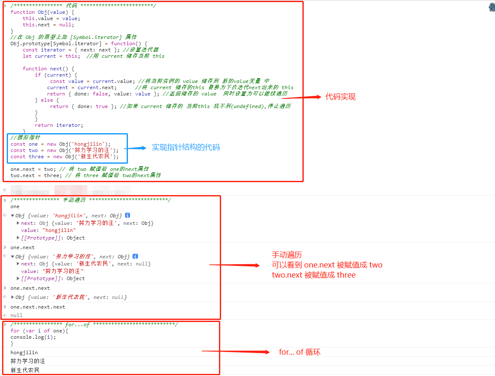 

#### ⑧ 为对象添加 Iterator 接口的🌰

>```javascript
>let obj = {
>  data: [ 'hongjilin', '努力学习的汪' ],
>  [Symbol.iterator]() {
>    const self = this;
>    let index = 0;
>    return {
>      next() {
>        if (index < self.data.length) {//当index 小于 data 的长度时,返回当前下标数据
>          return {
>            value: self.data[index++],
>            done: false
>          };
>        } else {
>          return { value: undefined, done: true };
>        }
>      }
>    };
>  }
>};
>```
>

#### ⑨ 类似数组的对象部署 Iterator 接口

>对于类似数组的对象（存在数值键名和`length`属性）, 部署 Iterator 接口, 有一个简便方法, 就是`Symbol.iterator`方法直接引用数组的 **Iterator** 接口。
>
>```javascript
>NodeList.prototype[Symbol.iterator] = Array.prototype[Symbol.iterator];
>// 或者
>NodeList.prototype[Symbol.iterator] = [][Symbol.iterator];
>
>[...document.querySelectorAll('div')] // 可以执行了
>```
>
>NodeList 对象是类似数组的对象, 本来就具有遍历接口, 可以直接遍历。上面代码中, 我们将它的遍历接口改成数组的`Symbol.iterator`属性, 可以看到没有任何影响。

##### a) 类似数组的对象调用数组的`Symbol.iterator`方法的🌰

>```javascript
>let iterable = {
>  0: 'a',
>  1: 'b',
>  2: 'c',
>  length: 3,
>  [Symbol.iterator]: Array.prototype[Symbol.iterator]
>};
>for (let item of iterable) {
>  console.log(item); // 'a', 'b', 'c'
>}
>```
>

##### b) 普通对象部署数组的`Symbol.iterator`方法, 并无效果

>```javascript
>let iterable = {
>  a: 'a',
>  b: 'b',
>  c: 'c',
>  length: 3,
>  [Symbol.iterator]: Array.prototype[Symbol.iterator]
>};
>for (let item of iterable) {
>  console.log(item); // undefined, undefined, undefined
>}
>```
>

##### c) 如果`Symbol.iterator`方法对应的不是遍历器生成函数（即会返回一个遍历器对象的函数）, 解释引擎将会报错

>如果`Symbol.iterator`方法对应的不是遍历器生成函数（即会返回一个遍历器对象）, 解释引擎将会报错。
>
>```javascript
>var obj = {};
>
>obj[Symbol.iterator] = () => 1;
>
>[...obj] // TypeError: [] is not a function
>```
>
>上面代码中, 变量`obj`的`Symbol.iterator`方法对应的不是遍历器生成函数, 因此报错。

##### d) 有了遍历器接口,也可以使用`while`循环遍历

>有了遍历器接口, 数据结构就可以用`for...of`循环遍历（详见下文）, 也可以使用`while`循环遍历。
>
>```javascript
>const $iterator = ITERABLE[Symbol.iterator]();
>let $result = $iterator.next();
>while (!$result.done) {
>  let x = $result.value;
>  // ...
>  $result = $iterator.next(); //指向下一个
>}
>```
>
>上面代码中, `ITERABLE`代表某种可遍历的数据结构, `$iterator`是它的遍历器对象。遍历器对象每次移动指针（`next`方法）, 都检查一下返回值的`done`属性, 如果遍历还没结束, 就移动遍历器对象的指针到下一步（`next`方法）, 不断循环。

### Ⅳ - 调用 Iterator 接口的场合

>有一些场合会默认调用 Iterator 接口（即`Symbol.iterator`方法）, 除了下文会介绍的`for...of`循环, 还有几个别的场合。

#### ①  解构赋值

>对数组和 Set 结构进行解构赋值时, 会默认调用`Symbol.iterator`方法。
>
>```javascript
>let set = new Set().add('hongjilin').add('努力学习的汪').add('新生代农民工');
>
>let [x,y] = set;
>// x='hongjilin'; y='努力学习的汪'
>
>let [first, ...rest] = set;
>// first='hongjilin'; rest=['努力学习的汪','新生代农民工'];
>```
>

#### ② 扩展运算符

>扩展运算符（...）也会调用默认的 Iterator 接口。
>
>```javascript
>// 例一
>const str = '努力学习的汪';
>[...str] //  ['努', '力', '学', '习', '的', '汪']
>
>// 例二
>const arr = ['努力学习的汪', 'hongjilin'];
>['我是谁?', ...arr, '新生代农民工']
>// ['我是谁?', '努力学习的汪', 'hongjilin', '新生代农民工']
>```
>
>上面代码的扩展运算符内部就调用 Iterator 接口。
>
>实际上, 这提供了一种简便机制, 可以将任何部署了 Iterator 接口的数据结构, 转为数组。也就是说, 只要某个数据结构部署了 Iterator 接口, 就可以对它使用扩展运算符, 将其转为数组。
>
>```javascript
>let arr = [...iterable];
>```
>

#### ③ yield*

>`yield*`后面跟的是一个可遍历的结构, 它会调用该结构的遍历器接口。
>
>```javascript
>const generator = function* () { //注意 此处有个 * 号
>  yield 1;
>  yield* ['努力学习的汪',undefined,true]; //注意 此处有个 * 号
>  yield null;
>  yield {name:'hongjilin'};
>};
>
>const iterator = generator();
>
>iterator.next() // {value: 1, done: false}
>iterator.next() // {value: '努力学习的汪', done: false}
>iterator.next() // {value: undefined, done: false}
>iterator.next() // {value: true, done: false}
>iterator.next() // {value: null, done: false}
>iterator.next() // {value: {name:'hongjilin'}, done: false}
>iterator.next() // {value: undefined, done: true}  --> 到此处done为true
>```
>

#### ④ 其他场合

>由于数组的遍历会调用遍历器接口, 所以任何接受数组作为参数的场合, 其实都调用了遍历器接口。下面是一些🌰
>
>- for...of
>- Array.from()
>- Map(), Set(), WeakMap(), WeakSet()（比如`new Map([['hong',1],['汪',2]])`）
>- Promise.all()
>- Promise.race()

### Ⅴ - 字符串的 Iterator 接口

>字符串是一个类似数组的对象, 也原生具有 Iterator 接口。
>
>```javascript
>const someString = "农民工";
>typeof someString[Symbol.iterator]  // "function"
>const iterator = someString[Symbol.iterator](); //将 someString 字符串的遍历器方法赋值给 iterator
>
>iterator.next()  // { value: "农", done: false }
>iterator.next()  // { value: "民", done: false }
>iterator.next()  // { value: "工", done: false }
>iterator.next()  // { value: undefined, done: true }
>```
>
>上面代码中, 调用`Symbol.iterator`方法返回一个遍历器对象, 在这个遍`历器上可以调用 next 方法, 实现对于字符串的遍历。
>
>> ###### 可以覆盖原生的`Symbol.iterator`方法, 达到修改遍历器行为的目的。
>
>```javascript
>const str = new String("努力学习的汪");
>[...str] //  ['努', '力', '学', '习', '的', '汪']
>//修改遍历器行为
>str[Symbol.iterator] = function() {
>  return {
>    next: function() {
>      if (this._first) {
>        this._first = false; //进来后直接将 _first 赋值为false ,这样这个代码块只会进来一次
>        return { value: "新生代农民工", done: false };
>      } else {
>        return { done: true }; //当 [_first] 为false 时,直接停止遍历
>      }
>    },
>    _first: true //初次声明,未进入next时,默认值给true,这样确保
>  };
>};
>
>[...str] // ["新生代农民工"]  -->可以看到,调用到其遍历器时,行为已经被修改了
>str // String {'努力学习的汪', Symbol(Symbol.iterator): ƒ}
>```
>
>上面代码中, 字符串 str 的`Symbol.iterator`方法被修改了, 所以扩展运算符（`...`）返回的值变成了`新生代农民工`, 而字符串本身还是`努力学习的汪`。

### Ⅵ - Iterator 接口与 Generator 函数

>`Symbol.iterator()`方法的最简单实现, 还是使用下一节要介绍的 Generator 函数,此处先列出来,具体详情可以看下方详解
>
>```javascript
>let myIterable = {
>  [Symbol.iterator]: function* () { //此处有个 * 号
>    yield 1;
>    yield 2;
>    yield 3;
>  }
>};
>[...myIterable] // [1, 2, 3]
>
>// 或者采用下面的简洁写法
>
>let obj = {
>  * [Symbol.iterator]() {
>    yield '努力学习的汪';
>    yield '新生代农民工';
>  }
>};
>
>for (let x of obj) {
>  console.log(x);
>}
>// "努力学习的汪"
>// "新生代农民工"
>```
>
>上面代码中, `Symbol.iterator()`方法几乎不用部署任何代码, 只要用 yield 命令给出每一步的返回值即可。

### Ⅶ - 遍历器对象的 return()，throw()

>遍历器对象除了具有`next()`方法, 还可以具有`return()`方法和`throw()`方法。如果你自己写遍历器对象生成函数, 那么`next()`方法是必须部署的, `return()`方法和`throw()`方法是否部署是可选的。
>

#### ① `return()`方法的使用场合

>`return()`方法的使用场合是, 如果`for...of`循环提前退出（通常是因为出错, 或者有`break`语句）, 就会调用`return()`方法。如果一个对象在完成遍历前, 需要清理或释放资源, 就可以部署`return()`方法。
>
>```javascript
>function readLinesSync(file) {
>  return {
>    [Symbol.iterator]() {
>      return {
>        next() {
>          return { done: false };
>        },
>        return() { //清理或释放资源
>          file.close();
>          return { done: true };
>        }
>      };
>    },
>  };
>}
>```
>
>上面代码中, 函数`readLinesSync`接受一个文件对象作为参数, 返回一个遍历器对象, 其中除了`next()`方法, 还部署了`return()`方法。

#### ② 会触发执行`return()`方法的两种情况

>下面的两种情况, 都会触发执行`return()`方法。
>
>```javascript
>// 情况一
>for (let line of readLinesSync(fileName)) {
>  console.log(line);
>  break;
>}
>
>// 情况二
>for (let line of readLinesSync(fileName)) {
>  console.log(line);
>  throw new Error();
>}
>```
>
>上面代码中:
>
>* 情况一输出文件的第一行以后, 就会执行`return()`方法, 关闭这个文件；
>* 情况二会在执行`return()`方法关闭文件之后, 再抛出错误。
>* 注意, `return()`方法必须返回一个对象, 这是 Generator 语法决定的。
>
>`throw()`方法主要是配合 Generator 函数使用, 一般的遍历器对象用不到这个方法。

### Ⅷ - for...of 循环

>ES6 借鉴 C++、Java、C# 和 Python 语言, 引入了`for...of`循环, 作为遍历所有数据结构的统一的方法。
>
>一个数据结构只要部署了`Symbol.iterator`属性, 就被视为具有 iterator 接口, 就可以用`for...of`循环遍历它的成员。也就是说, `for...of`循环内部调用的是数据结构的`Symbol.iterator`方法。
>
>`for...of`循环可以使用的范围包括数组、Set 和 Map 结构、某些类似数组的对象（比如`arguments`对象、DOM NodeList 对象）、后文的 Generator 对象, 以及字符串。

#### ① 数组

>数组原生具备`iterator`接口（即默认部署了`Symbol.iterator`属性）, `for...of`循环本质上就是调用这个接口产生的遍历器, 可以用下面的代码证明。
>
>```javascript
>const arr = ['hongjilin', '努力学习的汪', '新生代农民工'];
>
>for(let v of arr) {
>  console.log(v); // hongjilin 努力学习的汪 新生代农民工
>}
>
>const obj = {};
>//实际上相当于将arr的迭代器行为复制到obj中,迭代的还是之前那个数组
>obj[Symbol.iterator] = arr[Symbol.iterator].bind(arr); 
>for(let v of obj) {
>  console.log(v); // hongjilin 努力学习的汪 新生代农民工
>}
>```
>
>上面代码中, 空对象`obj`部署了数组`arr`的`Symbol.iterator`属性, 结果`obj`的`for...of`循环, 产生了与`arr`完全一样的结果。

##### a) `for...of`循环可以代替数组实例的`forEach`方法

>`for...of`循环可以代替数组实例的`forEach`方法。
>
>```javascript
>const arr = ['hongjilin', '努力学习的汪', '新生代农民工'];
>
>arr.forEach(function (item, index) {
>  console.log(item); // hongjilin 努力学习的汪 新生代农民工
>  console.log(index);   // 0 1 2
>});
>```
>

##### b) 与 `for...in`循环的区别1:

>JavaScript 原有的`for...in`循环, 只能获得对象的键名, 不能直接获取键值。ES6 提供`for...of`循环, 允许遍历获得键值。
>
>```javascript
>const arr = ['a', 'b', 'c', 'd'];
>
>for (let a in arr) {
>  console.log(a); // 0 1 2 3
>}
>
>for (let a of arr) {
>  console.log(a); // a b c d
>}
>```
>
>上面代码表明, `for...in`循环读取键名, `for...of`循环读取键值。如果要通过`for...of`循环, 获取数组的索引, 可以借助数组实例的`entries`方法和`keys`方法 (详见前面数组拓展部分)

##### c) 与 `for...in`循环的区别2:

>`for...of`循环调用遍历器接口, 数组的遍历器接口只返回具有数字索引的属性。这一点跟`for...in`循环也不一样。
>
>```javascript
>let arr = ['item1', 'item2', 'item3'];
>arr.name = '努力学习的汪';
>
>for (let i in arr) {
>  console.log(i); // "0", "1", "2", "name"
>}
>
>for (let i of arr) {
>  console.log(i); //  "item1", "item2", "item3"
>}
>```
>
>上面代码中, `for...of`循环不会返回数组`arr`的`name`属性。

#### ② Set 和 Map 结构

>Set 和 Map 结构也原生具有 **Iterator** 接口, 可以直接使用`for...of`循环。
>
>```javascript
>var engines = new Set(['hongjilin', '努力学习的汪', '新生代农民工','新生代农民工']);
>for (let e of engines) {
>  console.log(e);
>}
>// hongjilin
>// 努力学习的汪
>// 新生代农民工
>
>let es6 = new Map();
>es6.set("name", '努力学习的汪');
>es6.set("age", 99);
>es6.set("occupation", "新生代农民工");
>for (let [name, value] of es6) {
>  console.log(name + ": " + value);
>}
>// name: 努力学习的汪
>// age: 99
>// occupation: 新生代农民工
>```
>
>上面代码演示了如何遍历 Set 结构和 Map 结构。值得注意的地方有两个, 首先, 遍历的顺序是按照各个成员被添加进数据结构的顺序。其次，Set 结构遍历时, 返回的是一个值, 而 Map 结构遍历时, 返回的是一个数组, 该数组的两个成员分别为当前 Map 成员的键名和键值。
>
>```javascript
>let map = new Map().set("name", '努力学习的汪').set("occupation", "新生代农民工")
>for (let pair of map) {
>  console.log(pair);
>}
>// ['name', '努力学习的汪']
>// ['occupation', '新生代农民工']
>
>for (let [key, value] of map) {
>  console.log(key + ' : ' + value);
>}
>// name: 努力学习的汪
>// occupation: 新生代农民工
>```
>

#### ③ 计算生成的数据结构

>有些数据结构是在现有数据结构的基础上, 计算生成的。比如，ES6 的数组、Set、Map 都部署了以下三个方法, 调用后都返回遍历器对象。
>
>- `entries()` 返回一个遍历器对象, 用来遍历`[键名, 键值]`组成的数组。对于数组, 键名就是索引值；对于 Set，键名与键值相同。Map 结构的 Iterator 接口, 默认就是调用`entries`方法。
>- `keys()` 返回一个遍历器对象, 用来遍历所有的键名。
>- `values()` 返回一个遍历器对象, 用来遍历所有的键值。
>
>这三个方法调用后生成的遍历器对象, 所遍历的都是计算生成的数据结构。
>
>```javascript
>let arr = ['a', 'b', 'c'];
>for (let pair of arr.entries()) {
>  console.log(pair);
>}
>// [0, 'a']
>// [1, 'b']
>// [2, 'c']
>```
>

#### ④ 类似数组的对象

>类似数组的对象包括好几类。下面是`for...of`循环用于字符串、DOM NodeList 对象、`arguments`对象的例子。
>
>```javascript
>// 字符串
>let str = "努力学习的汪";
>for (let s of str) {
>  console.log(s); //  '努', '力', '学', '习', '的', '汪'
>}
>
>// DOM NodeList对象
>let paras = document.querySelectorAll("p");
>for (let p of paras) {
>   console.log(p)
>}
>
>// arguments对象
>function printArgs() {
>  for (let x of arguments) {
>    console.log(x);
>  }
>}
>printArgs('努力学习的汪', '新生代农民工');
>// '努力学习的汪'
>// '新生代农民工'
>```
>

##### a) 会正确识别 32 位 UTF-16 字符

>对于字符串来说, `for...of`循环还有一个特点, 就是会正确识别 32 位 UTF-16 字符。
>
>```javascript
>for (let x of 'a\uD83D\uDC0A') {
>  console.log(x);
>}
>// 'a'
>// '\uD83D\uDC0A'
>```
>

##### b) 使用`Array.from`方法将其转为数组

>并不是所有类似数组的对象都具有 Iterator 接口, 一个简便的解决方法, 就是使用`Array.from`方法将其转为数组。
>
>```javascript
>let arrayLike = { length: 4, name: '努力学习的汪', 1: '新生代农民工' ,2:'hongjilin'};
>
>// 报错
>for (let x of arrayLike) {
>  console.log(x);
>}
>
>// 正确
>for (let x of Array.from(arrayLike)) {
>  console.log(x);
>}
>// undefined -->找不到下标为0 的,所以打印undefined 
>// 新生代农民工
>// hongjilin
>// undefined  -->实际上是根据length确定类似数组的长度,所以找不到下标为3的
>```

#### ⑤ 对象

>对于普通的对象, `for...of`结构不能直接使用, 会报错, 必须部署了 Iterator 接口后才能使用。但是, 这样情况下, `for...in`循环依然可以用来遍历键名。
>
>```javascript
>let es6 = {
>  name: "努力学习的汪",
>  age: 99,
>  occupation: "新生代农民工"
>};
>
>for (let e in es6) {
>  console.log(e);
>}
>// name
>// age
>// occupation
>
>for (let e of es6) {
>  console.log(e);
>}
>// Uncaught TypeError: es6 is not iterable
>```
>
>上面代码表示, 对于普通的对象, `for...in`循环可以遍历键名, `for...of`循环会报错

##### a) 解决方案1

>一种解决方法是, 使用`Object.keys`方法将对象的键名生成一个数组, 然后遍历这个数组。
>
>```javascript
>for (let key of Object.keys(someObject)) {
>  console.log(key + ': ' + someObject[key]);
>}
>```
>

##### b) 使用 Generator 函数将对象重新包装 进行解决

>另一个方法是使用 Generator 函数将对象重新包装一下,不懂的可以带着疑惑往下看,可以先知道有这个用法
>
>```javascript
>let es6 = {
>  name: "努力学习的汪",
>  age: 99,
>  occupation: "新生代农民工"
>}; 
>
>function* entries(obj) {  //注意 此处有 * 号
>  for (let key of Object.keys(obj)) {
>    yield [key, obj[key]];
>  }
>}
>
>for (let [key, value] of entries(es6)) {
>  console.log(key, ':', value);
>}
>//name: "努力学习的汪",
>//age: 99,
>//occupation: "新生代农民工"
>```
>

#### ⑥ 与其他遍历语法的比较

##### a) for 与 forEach 概述

>以数组为例，JavaScript 提供多种遍历语法。最原始的写法就是`for`循环。
>
>```javascript
>for (let index = 0; index < myArray.length; index++) {
>  console.log(myArray[index]);
>}
>```
>
>这种写法比较麻烦, 因此数组提供内置的`forEach`方法。
>
>```javascript
>myArray.forEach(function (value) {
>  console.log(value);
>});
>```
>
>这种写法的问题在于, 无法中途跳出`forEach`循环, `break`命令或`return`命令都不能奏效。

##### b) `for...in`循环 概述

>`for...in`循环可以遍历数组的键名。
>
>```javascript
>for (var index in myArray) {
>  console.log(myArray[index]);
>}
>```
>
>`for...in`循环有几个缺点。
>
>- 数组的键名是数字, 但是`for...in`循环是以字符串作为键名“0”、“1”、“2”等等。
>- `for...in`循环不仅遍历数字键名, 还会遍历手动添加的其他键, 甚至包括原型链上的键。
>- 某些情况下, `for...in`循环会以任意顺序遍历键名。
>
>总之, `for...in`循环主要是为遍历对象而设计的, 不适用于遍历数组

##### c) `for...of`循环相比上面几种做法的优点

>`for...of`循环相比上面几种做法, 有一些显著的优点
>
>```javascript
>for (let value of myArray) {
>  console.log(value);
>}
>```
>
>- 有着同`for...in`一样的简洁语法, 但是没有`for...in`那些缺点。具体区别看下方
>- 不同于`forEach`方法, 它可以与`break`、`continue`和`return`配合使用。
>- 提供了遍历所有数据结构的统一操作接口。
>
>下面是一个使用 break 语句, 跳出`for...of`循环的例子。
>
>```javascript
>for (var n of fibonacci) {
>  if (n > 1000)
>    break;
>  console.log(n);
>}
>```
>
>上面的例子, 会输出斐波纳契数列小于等于 1000 的项。如果当前项大于 1000，就会使用`break`语句跳出`for...of`循环。

### Ⅸ - for...of 与 for...in区别

>首先最明显的区别:
>
>* for in遍历的是数组的索引（即键名）
>* 而for of遍历的是数组元素值。
>
>```js
>Array.prototype.method=function(){}
>let myArray=[1,2,4];
>myArray.name="数组";
>
>for (var index in myArray) console.log(myArray[index]);    //0,1,2,'数组', f(){} ,
>
>for (var value of myArray)  console.log(value);    //1,2,4
>```

##### a)  for in的一些**缺陷**:

>1. 索引是字符串型的数字, 因而不能直接进行几何运算
>2. 遍历顺序可能不是实际的内部顺序
>3. for in会遍历数组所有的可枚举属性, 包括原型。例如的原型方法method和name属性
>
>故而一般用**for in遍历对象而不用来遍历数组**
>
>这也就是for of存在的意义了,**for of 不遍历method和name,适合用来遍历数组**

##### b) for of有缺点:

>**for of不支持普通对象**, 想遍历对象的属性, 可以用for in循环, 或内建的Object.keys()方法：
>
>**Object.keys(myObject)获取对象的实例属性组成的数组, 不包括原型方法和属性**
>
>```javascript
>for (let key of Object.keys(Object))
>console.log(key + ": " + Object[key]);
>```
>
>但是这样似乎代码优点冗余


## 16、Promise

>此知识点因为 **很重要** ,此处将只列出 ES6 中关于Promise的用法详解,像是 **自定义Promise手撕代码** 、**Promise+ async +await**、**Promise的宏任务与微任务** ....等等都不会在此处记载
>
>更多完整关于Promise的知识点可以看这里 --> **[Promise学习笔记](https://gitee.com/hongjilin/hongs-study-notes/tree/master/编程_前端开发学习笔记/Promise学习笔记)** 

### 一、Promise的理解与使用

>1、概念:
>
>​	Promise是`异步编程的一种解决方案`, 比传统的解决方案——回调函数和事件——更合理和更强大。所谓Promise，简单说就是一个容器, 里面保存着某个未来才会结束的事件（通常是一个异步操作）的结果。
>
>通俗讲, `Promise是一个许诺、承诺`,是对未来事情的承诺, 承诺不一定能完成, 但是无论是否能完成都会有一个结果。
>
>* Pending  正在做。。。
>* Resolved 完成这个承诺
>* Rejected 这个承诺没有完成, 失败了
>
>​	Promise 用来预定一个不一定能完成的任务, 要么成功, 要么失败
>
>​	在具体的程序中具体的体现, 通常用来封装一个异步任务, 提供承诺结果
>
>Promise 是异步编程的一种解决方案, `主要用来解决回调地狱的问题, 可以有效的减少回调嵌套`。真正解决需要`配合async/await`
>
>2、特点:
>
>​	(1)对象的状态不受外界影响。Promise对象代表一个异步操作, 有三种状态：Pending（进行中）、Resolved（已完成, 又称Fulfilled）和Rejected（已失败）。只有异步操作的结果, 可以决定当前是哪一种状态, 任何其他操作都无法改变这个状态。
>
>​	(2)一旦状态改变, 就不会再变, 任何时候都可以得到这个结果。Promise对象的状态改变, 只有两种可能：从Pending变为Resolved和从Pending变为Rejected。只要这两种情况发生, 状态就凝固了, 不会再变了, 会一直保持这个结果。就算改变已经发生了, 你再对Promise对象添加回调函数, 也会立即得到这个结果。
>
>3、缺点:
>
>​	(1)无法取消Promise，一旦新建它就会立即执行, 无法中途取消。和一般的对象不一样, 无需调用。
>
>​	(2)如果不设置回调函数，Promise内部抛出的错误, 不会反应到外部。
>
>​	(3)当处于Pending状态时, 无法得知目前进展到哪一个阶段（刚刚开始还是即将完成）

------

### 1、Promise是什么?

##### Ⅰ-理解

>1. 抽象表达:  
>
>​	1) Promise 是一门新的技术(ES6 规范) 
>
>​	2)Promise 是 JS 中`进行异步编程`的新解决方案 备注：旧方案是单纯使用回调函数
>
>2. 具体表达: 
>
>    1) 从语法上来说: Promise 是一个`构造函数`
>
>    2) 从功能上来说: promise 对象用来封装一个异步操作并可以获取其成功/ 失败的结果值

##### Ⅱ-promise 的状态

###### 	a) promise 的状态

>实例对象中的一个属性 『PromiseState』
>
>* pending  未决定的
>* resolved / fullfilled  成功
>* rejected  失败

###### 	b) promise 的状态改变

>1. pending 变为 resolved 
>
>2. pending 变为 rejected
>
>  说明: `只有这 2 种`, 且一个 promise 对象`只能改变一次` 无论变为成功还是失败, 都会有一个结果数据 成功的结果数据一般称为 value, 失败的结果数据一般称为 reason

##### Ⅲ-promise的基本流程

>

##### Ⅳ-promise的基本使用

###### 1.使用 promise 封装基于定时器的异步

```js
<script >
  function doDelay(time) {
    // 1. 创建 promise 对象(pending 状态), 指定执行器函数
    return new Promise((resolve, reject) => {
      // 2. 在执行器函数中启动异步任务
      console.log('启动异步任务')
      setTimeout(() => {
        console.log('延迟任务开始执行...')
        const time = Date.now() // 假设: 时间为奇数代表成功, 为偶数代表失败
        if (time % 2 === 1) { // 成功了
          // 3. 1. 如果成功了, 调用 resolve()并传入成功的 value
          resolve('成功的数据 ' + time)
        } else { // 失败了
          // 3.2. 如果失败了, 调用 reject()并传入失败的 reason
          reject('失败的数据 ' + time)
        }
      }, time)
    })
  }
const promise = doDelay(2000)
promise.then(// promise 指定成功或失败的回调函数来获取成功的 vlaue 或失败的 reason
    value => {// 成功的回调函数 onResolved, 得到成功的 vlaue
      console.log('成功的 value: ', value)
    },
    reason => { // 失败的回调函数 onRejected, 得到失败的 reason
      console.log('失败的 reason: ', reason)
    },
  ) <
  /script>
```

###### 2.使用 promise 封装 ajax 异步请求

```js
<script >
  /*
  可复用的发 ajax 请求的函数: xhr + promise
  */
  function promiseAjax(url) {
    return new Promise((resolve, reject) => {
      const xhr = new XMLHttpRequest()
      xhr.onreadystatechange = () => {
        if (xhr.readyState !== 4) return
        const {
          status,
          response
        } = xhr
        // 请求成功, 调用 resolve(value)
        if (status >= 200 && status < 300) {
          resolve(JSON.parse(response))
        } else { // 请求失败, 调用 reject(reason)
          reject(new Error('请求失败: status: ' + status))
        }
      }
      xhr.open("GET", url)
      xhr.send()
    })
  }
promiseAjax('https://api.apiopen.top2/getJoke?page=1&count=2&type=vid
    eo ')
    .then(
      data => {
        console.log('显示成功数据', data)
      },
      error => {
        alert(error.message)
      }
    ) </script>
```

###### 3.fs模块使用Promise

```js
const fs = require('fs');

//回调函数 形式----------------------------------------------------
 fs.readFile('./resource/content.txt', (err, data) => {
     // 如果出错 则抛出错误
     if(err)  throw err;
     //输出文件内容
     console.log(data.toString());
 });

//Promise 形式-----------------------------------------------------------
/**
 * 封装一个函数 mineReadFile 读取文件内容
 * 参数:  path  文件路径
 * 返回:  promise 对象
 */
function mineReadFile(path){
    return new Promise((resolve, reject) => {
        //读取文件
        require('fs').readFile(path, (err, data) =>{
            //判断
            if(err) reject(err);
            //成功
            resolve(data);
        });
    });
}

mineReadFile('./resource/content.txt')
.then(value=>{
    //输出文件内容
    console.log(value.toString());
}, reason=>{
    console.log(reason);
});

```

###### 4.异常穿透

> 可以在每个then()的第二个回调函数中进行err处理,也可以利用异常穿透特性,到最后用`catch`去承接统一处理,两者一起用时,前者会生效(因为err已经将其处理,就不会再往下穿透)而走不到后面的catch
>
> 在每个.then()中我可以将数据再次传出给下一个then()

```js
mineReadFile('./11.txt').then(result=>{
  console.log(result.toString())
  return result
},err=>console.log(err))
.then(data=>console.log(data,"2222222"))
.catch(err=>console.log("这是catch的"))
```

###### 5.`util.promisify方法`

>可以将函数直接变成promise的封装方式,不用再去手动封装

```js
//引入 util 模块
const util = require('util');
//引入 fs 模块
const fs = require('fs');
//返回一个新的函数
let mineReadFile = util.promisify(fs.readFile);

mineReadFile('./resource/content.txt').then(value => {
  console.log(value.toString());
});
```

------


### 2、为什么要用Promise?

#### Ⅰ-指定回调函数的方式更加灵活

>1. 旧的: 必须在启动异步任务前指定 
>2. promise: 启动异步任务 => 返回promie对象 => 给promise对象绑定回调函 数(甚至可以在异步任务结束后指定/多个)

#### Ⅱ-支持链式调用, 可以解决回调地狱问题

##### 	1、什么是回调地狱

>回调函数嵌套调用, 外部回调函数异步执行的结果是嵌套的回调执行的条件
>
>

##### 	2、回调地狱的缺点?

>不便于阅读 不便于异常处理

##### 	3、解决方案?

> promise `链式调用`,
>
> 用来解决回调地狱问题, 但是`只是简单的改变格式`, 并没有彻底解决上面的问题真正要解决上述问题, 一定要利用promise再加上await和async关键字实现异步传同步

##### 	4、终极解决方案?

> promise +async/await

------


### 3、Promise中的常用 API 概述

> 此处列举几个最常用的API的概述,如果想看详细描述的可以继续往下看下方的  **Promise方法的具体使用** 描述

#### 	Ⅰ- Promise 构造函数: Promise (excutor) {}

>(1) executor 函数: 执行器 (resolve, reject) => {}
>
>(2) resolve 函数: 内部定义成功时我们调用的函数 value => {} 
>
>(3) reject 函数: 内部定义失败时我们调用的函数 reason => {} 
>
>说明: executor 会在 Promise 内部立即`同步调用`,异步操作在执行器中执行,换话说Promise支持同步也支持异步操作

#### 	Ⅱ-Promise.prototype.then 方法: (onResolved, onRejected) => {}

>(1) onResolved 函数: 成功的回调函数 (value) => {} 
>
>(2) onRejected 函数: 失败的回调函数 (reason) => {} 
>
>说明: 指定用于得到成功 value 的成功回调和用于得到失败 reason 的失败回调 返回一个新的 promise 对象

#### 	 Ⅲ-Promise.prototype.catch 方法: (onRejected) => {}

>(1) onRejected 函数: 失败的回调函数 (reason) => {}
>
>说明: then()的语法糖, 相当于: then(undefined, onRejected)
>
>(2) 异常穿透使用:当运行到最后,没被处理的所有异常错误都会进入这个方法的回调函数中	

#### 	Ⅳ-Promise.resolve 方法: (value) => {}

>(1) value: 成功的数据或 promise 对象 
>
>说明: 返回一个成功/失败的 promise 对象,直接改变promise状态
>
>```js
>	let p3 = Promise.reject(new Promise((resolve, reject) => {  resolve('OK'); }));      
>	console.log(p3);
>```

#### 	Ⅴ-Promise.reject 方法: (reason) => {}

>(1) reason: 失败的原因 
>
>说明: 返回一个失败的 promise 对象,直接改变promise状态,`代码示例同上`

#### Ⅵ-Promise.all 方法: (promises) => {}

>promises: 包含 n 个 promise 的数组 
>
>说明: 返回一个新的 promise, 只有所有的 promise `都成功才成功`, 只要有一 个失败了就直接失败
>
>```js
>let p1 = new Promise((resolve, reject) => { resolve('成功');  })
>let p2 = Promise.reject('错误错误错误');
>let p3 = Promise.resolve('也是成功')
>const result = Promise.all([p1, p2, p3]);
>console.log(result);
>```

#### Ⅶ-Promise.race 方法: (promises) => {}

>(1) promises: 包含 n 个 promise 的数组 
>
>说明: 返回一个新的 promise, `第一个完成`的 promise 的结果状态就是最终的结果状态,
>
>如p1延时,开启了异步,内部正常是同步进行,所以`p2>p3>p1`,结果是`P2`
>
>```js
>let p1 = new Promise((resolve, reject) => {
> setTimeout(() => {
>   resolve('OK');
> }, 1000);
>})
>let p2 = Promise.resolve('Success');
>let p3 = Promise.resolve('Oh Yeah');
>//调用
>const result = Promise.race([p1, p2, p3]);
>console.log(result);
>```

------


### 4、Promise的几个关键问题

#### Ⅰ-如何改变 promise 的状态?

>(1) resolve(value): 如果当前是 pending 就会变为 resolved 
>
>(2) reject(reason): 如果当前是 pending 就会变为 rejected 
>
>(3) 抛出异常: 如果当前是 pending 就会变为 rejected

#### Ⅱ-一个 promise 指定多个成功/失败回调函数, 都会调用吗?

>当 promise `改变为对应状态时`都会调用,改变状态后,多个回调函数都会调用,并不会自动停止
>
>```js
>let p = new Promise((resolve, reject) => {  resolve('OK');});
>///指定回调 - 1
>p.then(value => {  console.log(value); });
>//指定回调 - 2
>p.then(value => { alert(value);});
>```

#### Ⅲ- 改变 promise 状态和指定回调函数谁先谁后?

>(1) 都有可能, 正常情况下是先指定回调再改变状态, 但也可以先改状态再指定回调 
>
>​	先指定回调再改变状态(`异步`):先指定回调--> 再改变状态 -->改变状态后才进入异步队列执行回调函数
>
>​	先改状态再指定回调(`同步`):改变状态 -->指定回调 `并马上执行`回调
>
>(2) 如何先改状态再`指定`回调?   -->注意:指定并不是执行
>
>​	① 在执行器中直接调用 resolve()/reject() -->即,不使用定时器等方法,执行器内直接同步操作 
>
>​	② 延迟更长时间才调用 then() 	-->即,在`.then()`这个方法外再包一层例如延时器这种方法
>
>(3) 什么时候才能得到数据? 
>
>​	① 如果先指定的回调, 那当状态发生改变时, 回调函数就会调用, 得到数据 
>
>​	② 如果先改变的状态, 那当指定回调时, 回调函数就会调用, 得到数据
>
>```js
>let p = new Promise((resolve, reject) => {
>//异步写法,这样写会先指定回调,再改变状态
>setTimeout(() => {resolve('OK'); }, 1000);
>//这是同步写法,这样写会先改变状态,再指定回调
>resolve('OK'); 
>});
>p.then(value => {console.log(value);}, reason => {})
>```
>
>(4) 个人理解--结合源码
>
>​	源码中,promise的状态是通过一个`默认为padding`的变量进行判断,所以当你`resolve/reject`延时(异步导致当then加载时,状态还未修改)后,这时直接进行p.then()会发现,目前状态还是`进行中`,所以只是这样导致只有同步操作才能成功.
>
>​	所以promise将传入的`回调函数`拷贝到promise对象实例上,然后在`resolve/reject`的执行过程中再进行调用,达到异步的目的
>
>​	具体代码实现看下方自定义promise

#### Ⅳ-promise.then()返回的新 promise 的结果状态由什么决定?

>(1) 简单表达: 由 then()指定的回调函数执行的结果决定 
>
>(2) 详细表达: 
>
>​	① 如果抛出异常, 新 promise 变为 rejected, reason 为抛出的异常 
>
>​	② 如果返回的是非 promise 的任意值, 新 promise 变为 resolved, value 为返回的值 
>
>​	③ 如果返回的是另一个新 promise, 此 promise 的结果就会成为新 promise 的结果
>
>```js
>let p = new Promise((resolve, reject) => {
>resolve('ok');
>});
>//执行 then 方法
>let result = p.then(value => {
>console.log(value);
>// 1. 抛出错误 ,变为 rejected
>throw '出了问题';
>// 2. 返回结果是非 Promise 类型的对象,新 promise 变为 resolved
>return 521;
>// 3. 返回结果是 Promise 对象,此 promise 的结果就会成为新 promise 的结果
>return new Promise((resolve, reject) => {
>// resolve('success');
>reject('error');
>});
>}, reason => {
>console.warn(reason);
>});
>```

#### Ⅴ- promise 如何串连多个操作任务?

>(1) promise 的 then()返回一个新的 promise, 可以开成 then()的链式调用 
>
>(2) 通过 then 的链式调用串连多个同步/异步任务,这样就能用`then()`将多个同步或异步操作串联成一个同步队列
>
>```js
><script>
>let p = new Promise((resolve, reject) => { setTimeout(() => {resolve('OK'); }, 1000); });
>p.then(value => {return new Promise((resolve, reject) => { resolve("success"); });})
>.then(value => {console.log(value);})
>.then(value => { console.log(value);})
></script>
>```

#### Ⅵ-promise 异常传透?


>* 当使用 promise 的 then 链式调用时, 可以在最后指定失败的回调
>* 前面任何操作出了异常, 都会传到最后失败的回调中处理
>
>```javascript
>getJSON('./hong.json')
>   .then(function(posts) { throw new Error('抛出异常') })
>	.then(res=>console.log(res),e=>console.log('被then的错误回调捕获',e) )
>   .catch(function(error) {
>		 // 处理 getJSON 和 前一个回调函数运行时发生的错误
> 		console.log('错误捕获: ', error);
>	});
>//执行结果: 被then的错误回调捕获 Error: 抛出异常
>
>/******************** 利用异常穿透 ****************************************/
>getJSON('./hong.json')
>   .then(function(posts) { throw new Error('抛出异常') })
>	.then(res=>console.log(res) ) //此处差异,不指定 reject 回调,利用异常穿透传到最后
>   .catch(function(error) {
> 		console.log('错误捕获: ', error);
>	});
>//执行结果:  错误捕获:  Error: 抛出异常
>```
>
>注:可以在每个then()的第二个回调函数中进行err处理,也可以利用异常穿透特性,到最后用`catch`去承接统一处理,两者一起用时,前者会生效(因为err已经将其处理,就不会再往下穿透)而走不到后面的catch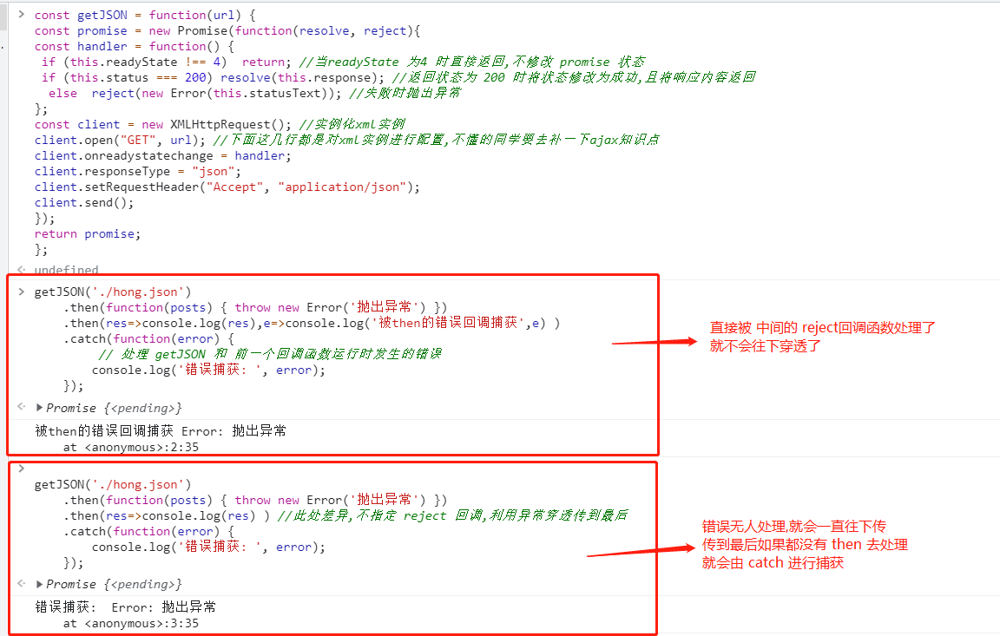

#### Ⅶ- 中断 promise 链?

>在`关键问题2`中,可以得知,当promise状态改变时,他的链式调用都会生效,那如果我们有这个一个实际需求:我们有5个then(),但其中有条件判断,如当我符合或者不符合第三个then条件时,要直接中断链式调用,不再走下面的then,该如何?
>
>(1) 当使用 promise 的 then 链式调用时, 在中间中断, 不再调用后面的回调函数 
>
>(2) 办法: 在回调函数中返回一个 `pendding` 状态的`promise 对象`
>
>```js
><script>
>let p = new Promise((resolve, reject) => {setTimeout(() => { resolve('OK');}, 1000);});
>p.then(value => {return new Promise(() => {});})//有且只有这一个方式
>.then(value => { console.log(222);})
>.then(value => { console.log(333);})
>.catch(reason => {console.warn(reason);});
></script>
>```

------


### 5、 Promise的实际应用

> 举两个栗子

#### Ⅰ - 加载图片

>我们可以将图片的加载写成一个`Promise`, 一旦加载完成, `Promise`的状态就发生变化。
>
>```javascript
>const preloadImage = function (path) {
>return new Promise(function (resolve, reject) {
>const image = new Image();
>image.onload  = resolve;
>image.onerror = reject;
>image.src = path;
>});
>};
>```

#### Ⅱ - Generator 函数与 Promise 的结合

>使用 Generator 函数管理流程, 遇到异步操作的时候, 通常返回一个`Promise`对象。
>
>```javascript
>function getFoo () {
>return new Promise(function (resolve, reject){
>resolve('foo');
>});
>}
>
>const g = function* () {
>try {
>const foo = yield getFoo();
>console.log(foo);
>} catch (e) {
>console.log(e);
>}
>};
>
>function run (generator) {
>const it = generator();
>
>function go(result) {
>if (result.done) return result.value;
>
>return result.value.then(function (value) {
> return go(it.next(value));
>}, function (error) {
> return go(it.throw(error));
>});
>}
>
>go(it.next());
>}
>
>run(g);
>```
>
>上面代码的 Generator 函数`g`之中, 有一个异步操作`getFoo`, 它返回的就是一个`Promise`对象。函数`run`用来处理这个`Promise`对象, 并调用下一个`next`方法。

------

### 二、Promise API 用法详解

>ES6 规定, `Promise`对象是一个构造函数, 用来生成`Promise`实例。
>
>此部分是对于 **Promise API 用法的详解** ,尽量详细地列举其常见用法,所以篇幅较长

### Ⅰ -  基本用法

#### ①  举个创造 Promise 实例的栗子

> 下面代码创造了一个`Promise`实例。
>
> ```javascript
> const promise = new Promise(function(resolve, reject) {
> if (/* 异步操作成功 */)  resolve(value); //将该 Promise 修改为成功且返回
> else  reject(error); //将该 Promise 修改为失败且返回
> });
> ```
>
> `Promise`构造函数接受一个函数作为参数, 该函数的两个参数分别是`resolve`和`reject`。它们是两个函数, 由 JavaScript 引擎提供, 不用自己部署。
>
> `resolve`函数的作用是, 将`Promise`对象的状态从“未完成”变为“成功”（即从 pending 变为 resolved）, 在异步操作成功时调用, 并将异步操作的结果, 作为参数传递出去；`reject`函数的作用是, 将`Promise`对象的状态从“未完成”变为“失败”（即从 pending 变为 rejected）, 在异步操作失败时调用, 并将异步操作报出的错误, 作为参数传递出去。

#### ② 使用 [ then ] 方法分别指定 成功/失败 的回调

>`Promise`实例生成以后, 可以用 [ then() ] 方法分别指定`resolved`状态和`rejected`状态的回调函数。
>
>```javascript
>promise.then(function(value) {
>// 当promise状态返回为resolve 时会执行的回调函数
>}, function(error) {
>// 当promise状态返回为rejected 时会执行的回调函数
>});
>```
>
>[ then ] 方法可以接受两个回调函数作为参数。第一个回调函数是`Promise`对象的状态变为`resolved`时调用, 第二个回调函数是`Promise`对象的状态变为`rejected`时调用。其中, **第二个函数是可选的, 不一定要提供**。这两个函数都接受`Promise`对象传出的值作为参数。

#### ③ 举个 Promise 对象的简单栗子

>下面是一个`Promise`对象的简单例子。
>
>> setTimeout的第三个参数是给第一个函数的参数, 而且是先于第一个参数(即回调函数)执行的 
>
>```javascript
>function timeout(ms) { //声明一个方法, 传入的 参数ms 为延时器时间
>return new Promise((resolve, reject) => {
>  //这行代码实际效果: 当 [ms] 毫秒后 执行 resolve('努力学习的汪')
>  setTimeout(resolve, ms, '努力学习的汪'); 
>});
>}
>
>timeout(1000).then((value) => {  console.log(value) });
>//打印结果 : 努力学习的汪
>```
>
>上面代码中, `timeout`方法返回一个`Promise`实例, 表示一段时间以后才会发生的结果。过了指定的时间（`ms`参数）以后, `Promise`实例的状态变为`resolved`, 就会触发`then`方法绑定的回调函数。

#### ④ Promise 新建后就会立即执行

>```javascript
>let promise = new Promise(function(resolve, reject) {
>console.log('Promise');
>resolve();
>});
>
>promise.then(function() {
>console.log('resolved.');
>});
>
>console.log('Hi!');
>
>// Promise
>// Hi!
>// resolved //可以发现,明明then是在 Hi 前面,却最后打印
>```
>
>上面代码中，Promise 新建后立即执行, 所以首先输出的是`Promise`。然后, `then`方法指定的回调函数, 将在当前脚本所有同步任务执行完才会执行, 所以`resolved`最后输出。
>
>实际上,这个运行结果相关知识点是 [ [宏任务与微任务](https://gitee.com/hongjilin/hongs-study-notes/tree/master/%E7%BC%96%E7%A8%8B_%E5%89%8D%E7%AB%AF%E5%BC%80%E5%8F%91%E5%AD%A6%E4%B9%A0%E7%AC%94%E8%AE%B0/Promise%E5%AD%A6%E4%B9%A0%E7%AC%94%E8%AE%B0#%E5%9B%9B%E5%AE%8F%E4%BB%BB%E5%8A%A1%E4%B8%8E%E5%BE%AE%E4%BB%BB%E5%8A%A1) ] ,单独梳理在下方.这里可以先初步理解为: 
>
>1. JS是单线程的,至上往下运行,在声明 **Promise** 时实际上已经执行到了内部方法
>
>2. 为何 resolve() 运行后没有立即打印?
>
> - JS中用来存储待执行回调函数的队列包含2个不同特定的列队
>
>   > `宏队列`:用来保存待执行的宏任务(回调),比如:`定时器`回调/ajax回调/dom事件回调
>   >
>   > `微队列`:用来保存待执行的微任务(回调),比如:`Promise`的回调/muntation回调
>
> - JS执行时会区别这2个队列:
>
>   >JS执行引擎首先必须执行所有的`初始化同步任务`代码
>   >
>   >每次准备取出第一个`宏任务执行前`,都要将所有的`微任务`一个一个取出来执行

#### ⑤ 举个异步加载图片的栗子

>```javascript
>function loadImageAsync(url) {
>return new Promise(function(resolve, reject) {
>const image = new Image();
>
>image.onload = function() {
>console.log('图片加载成功')
>resolve(image);
>};
>
>image.onerror = function() {
>reject(new Error(`无法从 ${url} 中加载图片` ));
>};
>image.src = url;
>});
>}
>loadImageAsync('正确的url') //打印图片加载成功
>loadImageAsync('错误的url') //抛出异常
>
>```
>
>上面代码中, 使用`Promise`包装了一个图片加载的异步操作。如果加载成功, 就调用`resolve`方法, 否则就调用`reject`方法。
>
>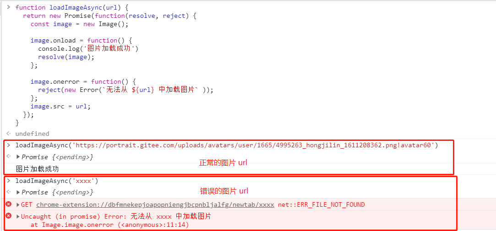 

#### ⑥ 举个用`Promise`对象实现的 Ajax 操作的栗子

>Ajax知识点不懂的同学要去补一下: 这里可以看本人梳理的ajax笔记 --> [点我跳转](https://gitee.com/hongjilin/hongs-study-notes/tree/master/%E7%BC%96%E7%A8%8B_%E5%89%8D%E7%AB%AF%E5%BC%80%E5%8F%91%E5%AD%A6%E4%B9%A0%E7%AC%94%E8%AE%B0/Ajax%E3%80%81Axios%E5%AD%A6%E4%B9%A0%E7%AC%94%E8%AE%B0) 
>
>```javascript
>const getJSON = function(url) {
>const promise = new Promise(function(resolve, reject){
>const handler = function() {
>if (this.readyState !== 4)  return; //当readyState 为4 时直接返回,不修改 promise 状态
>if (this.status === 200) resolve(this.response); //返回状态为 200 时将状态修改为成功,且将响应内容返回
>else  reject(new Error(this.statusText)); //失败时抛出异常
>};
>const client = new XMLHttpRequest(); //实例化xml实例
>client.open("GET", url); //下面这几行都是对xml实例进行配置,不懂的同学要去补一下ajax知识点
>client.onreadystatechange = handler;
>client.responseType = "json";
>client.setRequestHeader("Accept", "application/json");
>client.send();
>});
>return promise;
>};
>
>getJSON("./hong.json").then(function(json) {
>console.log('Contents: ' , json);
>}, function(error) {
>console.error('出错了', error);
>});
>```
>
>上面代码中, `getJSON`是对 XMLHttpRequest 对象的封装, 用于发出一个针对 JSON 数据的 HTTP 请求, 并且返回一个`Promise`对象。需要注意的是, 在`getJSON`内部, `resolve`函数和`reject`函数调用时, 都带有参数。
>
>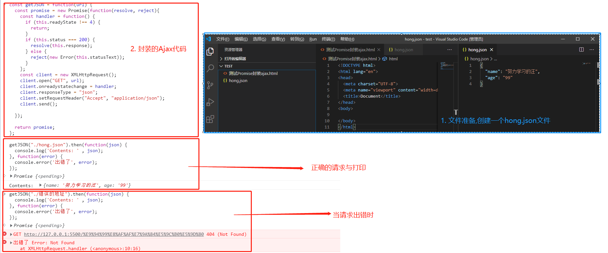
>
>> 小贴士:此处可能有同学想尝试却发现读取本地文件会有跨域问题,这边教一下你们
>
>> 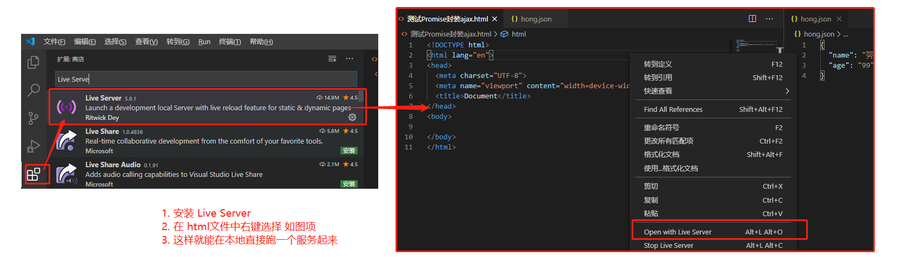 

#### ⑦  resolve()  的参数可以是另一个 Promise 实例

>如果调用`resolve`函数和`reject`函数时带有参数, 那么它们的参数会被传递给回调函数。`reject`函数的参数通常是`Error`对象的实例, 表示抛出的错误；`resolve`函数的参数除了正常的值以外, 还可能是另一个 Promise 实例, 比如像下面这样。
>
>```javascript
>const p1 = new Promise(function (resolve, reject) {});
>
>const p2 = new Promise(function (resolve, reject) { resolve(p1) })
>```
>
>上面代码中, `p1`和`p2`都是 Promise 的实例, 但是`p2`的`resolve`方法将`p1`作为参数, 即一个异步操作的结果是返回另一个异步操作。
>
>注意, 这时`p1`的状态就会传递给`p2`, 也就是说, `p1`的状态决定了`p2`的状态。如果`p1`的状态是`pending`, 那么`p2`的回调函数就会等待`p1`的状态改变；如果`p1`的状态已经是`resolved`或者`rejected`, 那么`p2`的回调函数将会立刻执行。
>
>```javascript
>const p1 = new Promise(function (resolve, reject) {
>setTimeout(() => reject(new Error('p1的状态改为错误')), 0)
>})
>
>const p2 = new Promise(function (resolve, reject) {
>setTimeout(() => resolve(p1), 3000) //将p1 传给p2
>})
>
>p2.then(result => console.log(result),result=>console.log('失败'))
>.catch(error => console.log('catch异常捕获:'+error))
>//首先报错
>//运行三秒后打印: 失败
>```
>
>##### 上面代码运行后执行效果:
>
>* 首先马上会打印一个报错 : "Uncaught (in promise) Error: p1的状态改为错误" (红色报错)
>* 然后等3秒后再打印:  '失败'
>* 注意: 如果 **p2.then()** 中没有写 **reject** 回调函数(第二个参数),则会被 **catch** 捕获,变为`catch异常捕获:Error: p1的状态改为错误`
>
>##### 解释:
>
>>* 首先前面说过,promise定义时就会立即执行,所以刚开始就运行了 **p1 的reject()**,所以直接控制台报错了
>>* `resolve`方法返回的是`p1`。由于`p2`返回的是另一个 Promise，导致`p2`自己的状态无效了, 由`p1`的状态决定`p2`的状态
>>* 总结来说,promise返回promise这种嵌套形式,将由最内层的promise决定外层的状态

#### ⑧ 调用`resolve`或`reject`并不会终结 Promise 的参数函数的执行

>调用`resolve`或`reject`并不会终结 Promise 的参数函数的执行。
>
>```javascript
>new Promise((resolve, reject) => {
>resolve(1);
>console.log(2);
>}).then(r => {
>console.log(r);
>});
>// 2
>// 1
>```
>
>上面代码中, 调用`resolve(1)`以后, 后面的`console.log(2)`还是会执行, 并且会首先打印出来。这是因为立即 resolved 的 Promise 是在本轮事件循环的末尾执行, 总是晚于本轮循环的同步任务。

#### ⑨ 建议在修改状态函数前加return 

>一般来说, 调用`resolve`或`reject`以后，Promise 的使命就完成了, 后继操作应该放到`then`方法里面, 而不应该直接写在`resolve`或`reject`的后面。所以, 最好在它们前面加上`return`语句, 这样就不会有意外。
>
>```javascript
>new Promise((resolve, reject) => {
>return resolve(1);
>// 后面的语句不会执行
>console.log(2);
>})
>```
>
>有同学可能就会问了,不加感觉也没啥事啊,反正我在这个函数体内就是要做这些操作,放在 `resolve/reject`前后好像都不影响啊! 这里我给举个实际场景

##### a) 不加 return 导致的错误场景举🌰

>一般来说,错误发生在 Promise 内,是不会传到外部的,只会在 Promise 内部消化,详见下方API详解部分的 [②Promise.prototype.catch()](#② Promise.prototype.catch())
>
>```javascript
>const promise = new Promise(function (resolve, reject) {
>resolve('成功了'); //如果你加了 return , 函数执行到此步就停止了
>setTimeout(function () { throw new Error('错误错误!!!!!') }, 0)
>});
>promise.then(function (value) { console.log(value) });
>// ok
>// Uncaught Error: 错误错误!!!!
>```
>
>上面代码中，Promise 指定在下一轮“事件循环”再抛出错误。到了那个时候，Promise 的运行已经结束了, 所以这个错误是在 Promise 函数体外抛出的, 会冒泡到最外层, 成了未捕获的错误。

### Ⅱ -  API 用法详解

> 此处将对于所有API进行详细剖析,参照资料为 [阮一峰的ES6日志]()

#### ① Promise.prototype.then()

>Promise 实例具有`then`方法, 也就是说, `then`方法是定义在原型对象`Promise.prototype`上的。它的作用是为 Promise 实例添加状态改变时的回调函数。前面说过, `then`方法的第一个参数是`resolved`状态的回调函数, 第二个参数（可选）是`rejected`状态的回调函数。

##### a) `then`方法返回的是一个新的`Promise`实例

>`then`方法返回的是一个新的`Promise`实例（注意, 不是原来那个`Promise`实例）。因此可以采用链式写法, 即`then`方法后面再调用另一个`then`方法。
>
>```javascript
>getJSON("./hong.json").then(function(json) {
>return json.name;
>}).then(function(name) {
>console.log(`My name is ${name}` )
>});
>```
>
>上面的代码使用`then`方法, 依次指定了两个回调函数。第一个回调函数完成以后, 会将返回结果作为参数, 传入第二个回调函数。

##### b) 采用链式的`then`, 会等待前一个Promise状态发生改变才会被调用

>采用链式的`then`, 可以指定一组按照次序调用的回调函数。这时, 前一个回调函数, 有可能返回的还是一个`Promise`对象（即有异步操作）, 这时后一个回调函数, 就会等待该`Promise`对象的状态发生变化, 才会被调用。
>
>```javascript
>getJSON("./hong.json")
>.then(function(json) {  return getJSON(json.name)})
>.then(
>function (name) { console.log("resolved: My name is ", name)}, 
>function (err){ console.log("rejected: ", err)}
>);
>```
>
>上面代码中, 第一个`then`方法指定的回调函数, 返回的是另一个`Promise`对象。这时, 第二个`then`方法指定的回调函数, 就会等待这个新的`Promise`对象状态发生变化。如果变为`resolved`, 就调用第一个回调函数, 如果状态变为`rejected`, 就调用第二个回调函数。

##### c) 使用箭头函数简写

>如果采用箭头函数, 上面的代码可以写得更简洁 (实际代码中基本都是这样写了)
>
>```js
>getJSON("./hong.json")
>.then(json => getJSON(json.name) )
>.then(
>	  name => console.log("resolved: My name is ", name), 
>err => console.log("rejected: ", err)
>);
>```


#### ② Promise.prototype.catch()

>`Promise.prototype.catch()`方法是`.then(null, rejection)`或`.then(undefined, rejection)`的别名, 用于指定发生错误时的回调函数。

##### a) 基本用法

>```javascript
>getJSON('./hong.json')
>.then(function(posts) {})
>.catch(function(error) {
>		// 处理 getJSON 和 前一个回调函数运行时发生的错误
>		console.log('发生错误！', error);
>	 });
>```
>
>上面代码中, `getJSON()`方法返回一个 Promise 对象
>
>>* 如果该对象状态变为`resolved`, 则会调用`then()`方法指定的回调函数；
>>* 如果异步操作抛出错误, 状态就会变为`rejected`, 就会调用`catch()`方法指定的回调函数, 处理这个错误
>>* 另外, `then()`方法指定的回调函数, 如果运行中抛出错误, 也会被`catch()`方法捕获。
>>* 被 catch 方法捕获的前提是前方的 then() 方法中没有对 `rejected` 进行捕获处理(即没有写reject回调函数)
>
>```js
>p.then((val) => console.log('指定成功回调:', val))
>.catch((err) => console.log('在catch中进行 rejected 的处理', err));
>// 等同于
>p.then((val) => console.log('指定成功回调:', val))
>.then(null, (err) => console.log("等同于另起一个then,只指定 rejected 的处理", err));
>```

##### b)  `reject()`方法的作用, 等同于抛出错误

>```javascript
>const promise = new Promise(function(resolve, reject) {
>throw new Error('直接抛出错误');
>});
>promise.catch(function(error) {
>console.log('异常捕获: ',error);
>});
>//异常捕获:  Error: 直接抛出错误
>```
>
>上面代码中, `promise`抛出一个错误, 就被`catch()`方法指定的回调函数捕获。注意, 上面的写法与下面两种写法是等价的。
>
>```javascript
>/******************  写法一 ***************************************/
>const promise = new Promise(function(resolve, reject) {
>try {
>throw new Error('直接抛出错误');
>} catch(e) {
>console.log('进入catch,然后再用 reject(e)抛出 ')
>reject(e) 
>}
>});
>promise.catch(function(error) {
>console.log(error);
>});
>//进入catch,然后再用 reject(e)抛出 
>//Error: 直接抛出错误
>
>/******************  写法二 ***************************************/
>const promise1 = new Promise(function(resolve, reject) {
>reject(new Error('使用 reject() 抛出错误'));
>});
>promise1.catch(function(error) {
>console.log(error);
>});
>//Error: 使用 reject() 抛出错误
>```
>
>比较上面两种写法, 可以发现`reject()`方法的作用, 等同于抛出错误,所以不必用try..catch()去承接后再去抛出了

##### c) 如果 Promise 状态已经被修改, 再抛出错误是无效的

>```javascript
>const promise = new Promise(function(resolve, reject) {
>resolve('成功了'); //换成 reject('成功了') 结果也是一样的
>throw new Error('成功后扔抛出异常');
>});
>promise
>.then(function(value) { console.log(value) })
>.catch(function(error) { console.log(error) });
>// 成功了
>```
>
>上面代码中，Promise 在`resolve/reject`语句后面, 再抛出错误, 不会被捕获, 等于没有抛出。因为 Promise 的状态一旦改变, 就永久保持该状态, 不会再变了(前面有说过)

##### d) Promise 对象的错误具有 “冒泡” 性质

>Promise 对象的错误具有“冒泡”性质, 会一直向后传递, 直到被捕获为止。也就是说, 错误总是会被下一个`catch`语句捕获。
>
>```javascript
>getJSON('./hong.json') //第一个promise
>.then(function(post) { //第二个promise
>		 return getJSON(post.commentURL)
>	})
>.then(function(comments) { //第三个promise
>	})
>.catch(function(error) {
>		// 处理前面三个Promise产生的错误
>	});
>```
>
>上面代码中, 一共有三个 Promise 对象(**then返回的仍可能是一个Promise对象**)：一个由`getJSON()`产生, 两个由`then()`产生。它们之中任何一个抛出的错误, 都会被最后一个`catch()`捕获。
>
>也是因为这个特性,有了 **异常穿透问题** 

##### e) 异常穿透问题

>* 当使用 promise 的 then 链式调用时, 可以在最后指定失败的回调
>* 前面任何操作出了异常, 都会传到最后失败的回调中处理
>
>```javascript
>getJSON('./hong.json')
> .then(function(posts) { throw new Error('抛出异常') })
>	.then(res=>console.log(res),e=>console.log('被then的错误回调捕获',e) )
> .catch(function(error) {
>		 // 处理 getJSON 和 前一个回调函数运行时发生的错误
>		console.log('错误捕获: ', error);
>	});
>//执行结果: 被then的错误回调捕获 Error: 抛出异常
>
>/******************** 利用异常穿透 ****************************************/
>getJSON('./hong.json')
> .then(function(posts) { throw new Error('抛出异常') })
>	.then(res=>console.log(res) ) //此处差异,不指定 reject 回调,利用异常穿透传到最后
> .catch(function(error) {
>		console.log('错误捕获: ', error);
>	});
>//执行结果:  错误捕获:  Error: 抛出异常
>```
>
>注:可以在每个then()的第二个回调函数中进行err处理,也可以利用异常穿透特性,到最后用`catch`去承接统一处理,两者一起用时,前者会生效(因为err已经将其处理,就不会再往下穿透)而走不到后面的catch

##### f) 建议使用 catch() 进行异常处理

>一般来说, 不要在`then()`方法里面定义 Reject 状态的回调函数（即`then`的第二个参数）, 总是使用`catch`方法。
>
>```javascript
>// bad
>promise
>.then(
>data=> console.log('成功',data),
>err=>console.log('失败了',err)
>	);
>/********* 好的写法 ********************/
>promise
>.then( data=> console.log('成功',data)) //只指定成功回调
>.catch( err=>console.log('失败了',err));
>```
>
>上面代码中, 第二种写法要好于第一种写法:
>
>* 理由是第二种写法可以捕获前面`then`方法执行中的错误
>* 也更接近同步的写法（`try/catch`）
>* 因此, 建议总是使用`catch()`方法, 而不使用`then()`方法的第二个参数。

##### g) 与传统 `try/catch` 代码块的差异

>跟传统的`try/catch`代码块不同的是, 如果没有使用`catch()`方法指定错误处理的回调函数，Promise 对象抛出的错误不会传递到外层代码, 即不会有任何反应。
>
>```javascript
>const someAsyncThing = function() {
>return new Promise(function(resolve, reject) {
>// 下面一行会报错, 因为hong 没有声明
>resolve( hong );
>});
>};
>//Promise 的 then() 处理,但不处理异常
>someAsyncThing().then(function() { console.log('只指定成功回调,不处理异常错误') });
>
>setTimeout(() => { console.log('努力学习的汪') }, 2000);
>// Uncaught (in promise) ReferenceError: hong is not defined
>// 努力学习的汪
>```
>
>上面代码中, `someAsyncThing()`函数产生的 Promise 对象, 内部有语法错误。
>
>>* 浏览器运行到这一行, 会打印出错误提示`Uncaught (in promise) ReferenceError: hong is not defined`
>>* 但是不会退出进程、终止脚本执行, 2 秒之后还是会输出`努力学习的汪`。
>>* 这就是说，Promise 内部的错误不会影响到 Promise 外部的代码, 通俗的说法就是“Promise 会吃掉错误”。

##### h) catch()方法后还能跟 then() 方法

>一般总是建议，Promise 对象后面要跟`catch()`方法, 这样可以处理 Promise 内部发生的错误。`catch()`方法返回的还是一个 Promise 对象, 因此后面还可以接着调用`then()`方法。
>
>```javascript
>const someAsyncThing = function() {
>return new Promise(function(resolve, reject) {
>// 下面一行会报错, 因为 hong 没有声明
>resolve( hong );
>});
>};
>
>someAsyncThing()
>.catch(function(error) {  console.log('捉到错误咯:', error)})
>.then(function() { console.log('错误捕获后我还要浪') });
>//捉到错误咯: ReferenceError: hong is not defined
>//错误捕获后我还要浪
>```
>
>上面代码运行完`catch()`方法指定的回调函数, 会接着运行后面那个`then()`方法指定的回调函数。
>
>如果没有报错, 则会跳过`catch()`方法。
>
>```js
>Promise.resolve('硬是成功了')
>.catch(function(error) { console.log('捉错误', error) })
>.then(v => console.log('catch后面的then: ',v) );
>//catch后面的then:  硬是成功了
>```
>
>上面的代码因为没有报错, 跳过了`catch()`方法, 直接执行后面的`then()`方法。此时, 要是`then()`方法里面报错, 就与前面的`catch()`无关了。

##### i) `catch()`方法之中, 还能再抛出错误

>`catch()`方法之中, 还能再抛出错误。
>
>```javascript
>const someAsyncThing = function() {
>return new Promise(function(resolve, reject) {
>// 下面一行会报错, 因为 hong 没有声明
>resolve( hong );
>});
>};
>
>someAsyncThing()
>.then(() =>  someOtherAsyncThing()) 
>.catch(function(error) {
>		 console.log('ctach:', error);
>		 // 下面一行会报错, 因为 sum 没有声明
>		  sum ++;
>	})
>.then(function() { console.log('捕获后的then()')});
>
>// ctach: [ReferenceError: hong is not defined]
>// Uncaught (in promise) ReferenceError: sum is not defined
>```
>
>上面代码中, `catch()`方法抛出一个错误, 因为后面没有别的`catch()`方法了, 导致这个错误不会被捕获, 也不会传递到外层。如果改写一下, 结果就不一样了。
>
>```javascript
>someAsyncThing().then(function() {
>return someOtherAsyncThing();
>}).catch(function(error) {
>console.log('catch: ', error);
>// 下面一行会报错, 因为 sum 没有声明
>sum ++;
>}).catch(function(error) {
>console.log('catch()后的catch: ', error);
>});
>//catch:  ReferenceError: hong is not defined
>//catch()后的catch:  ReferenceError: sum is not defined
>```
>
>上面代码中, 第二个`catch()`方法用来捕获前一个`catch()`方法抛出的错误。

#### ③ Promise.prototype.finally()

>`finally()`方法用于指定不管 Promise 对象最后状态如何, 都会执行的操作。该方法是 `ES2018` 引入标准的。
>
>```javascript
>promise
>.then(result => {···})
>.catch(error => {···})
>.finally(() => {···});
>```
>
>上面代码中, 不管`promise`最后的状态, 在执行完`then`或`catch`指定的回调函数以后, 都会执行`finally`方法指定的回调函数。
>
>>* `finally`方法的回调函数不接受任何参数, 
>>* 这意味着没有办法知道, 前面的 Promise 状态到底是`fulfilled`还是`rejected`。
>>* 这表明, `finally`方法里面的操作, 应该是与状态无关的, 不依赖于 Promise 的执行结果。

##### a) `finally`本质上是`then`方法的特例

>```javascript
>promise
>.finally(() => {});
>
>// 等同于
>promise
>.then(
>result =>  result ,
>error =>  throw error
>);
>```
>
>上面代码中, 如果不使用`finally`方法, 同样的语句需要为成功和失败两种情况各写一次。有了`finally`方法, 则只需要写一次。

##### b) 它的实现

>它的实现也很简单。
>
>```javascript
>Promise.prototype.finally = function (callback) {
>let P = this.constructor;
>return this.then(
>value  => P.resolve(callback()).then(() => value),
>reason => P.resolve(callback()).then(() => { throw reason })
>);
>};
>```
>
>上面代码中, 不管前面的 Promise 是`fulfilled`还是`rejected`, 都会执行回调函数`callback`。
>
>从上面的实现还可以看到, `finally`方法总是会返回原来的值(传入什么即传出什么)
>
>```javascript
>// resolve 的值是 undefined
>Promise.resolve(2).then(() => {}, () => {})
>
>// resolve 的值是 2
>Promise.resolve(2).finally(() => {})
>
>// reject 的值是 undefined
>Promise.reject(3).then(() => {}, () => {})
>
>// reject 的值是 3
>Promise.reject(3).finally(() => {})
>```
>
> 

#### ④ Promise.all()

>`Promise.all()`方法用于将多个 Promise 实例, 包装成一个新的 Promise 实例。
>
>```javascript
>const p = Promise.all([p1, p2, p3]);
>```
>
>>* `Promise.all()`方法接受一个数组作为参数, 
>>* `p1`、`p2`、`p3`都是 Promise 实例, 如果不是, 就会先调用下面讲到的`Promise.resolve`方法, 将参数转为 Promise 实例, 再进一步处理。
>>* 另外, `Promise.all()`方法的参数可以不是数组, 但必须具有 Iterator 接口, 且返回的每个成员都是 Promise 实例。

##### a) 返回的状态由什么决定?

>`p`的状态由`p1`、`p2`、`p3`决定, 分成两种情况。
>
>>1. 只有`p1`、`p2`、`p3`的状态都变成`fulfilled`, `p`的状态才会变成`fulfilled`, 此时`p1`、`p2`、`p3`的返回值组成一个数组, 传递给`p`的回调函数。
>>2. 只要`p1`、`p2`、`p3`之中有一个被`rejected`, `p`的状态就变成`rejected`, 此时第一个被`reject`的实例的返回值, 会传递给`p`的回调函数。
>
>###### 下面是一个具体的例子。
>
>```javascript
>// 生成一个Promise对象的数组
>const promises = ['hong', 1, 2, 3, 4, 5].map(item {
>return getJSON( item+'.json');
>});
>
>Promise.all(promises).then(function (posts) {
>// ...
>}).catch(function(reason){
>// ...
>});
>```
>
>上面代码中, `promises`是包含 6 个 Promise 实例的数组, 只有这 6 个实例的状态 **都** 变成`fulfilled`, 或者**其中有一个变为`rejected`**, 才会调用`Promise.all`方法后面的回调函数。
>
>###### 下面是另一个例子
>
>```javascript
>const databasePromise = connectDatabase(); //假设定义了一个异步方法,此方法能拿到你需要的所有数据
>
>const booksPromise = databasePromise     //定义一个方法,在 databasePromise() 执行后寻找其内部书本信息
>.then(findAllBooks);
>
>const userPromise = databasePromise    //定义一个方法,在 databasePromise() 执行后寻找其内部当前用户信息
>.then(getCurrentUser);
>
>Promise.all([
>booksPromise,
>userPromise
>])
>.then(([books, user]) => pickTopRecommendations(books, user));
>```
>
>上面代码中, `booksPromise`和`userPromise`是两个异步操作, 只有等到它们的结果都返回了, 才会触发`pickTopRecommendations`这个回调函数。

##### b) 如果参数中的Promise实例定义了自己的catch方法 ?

>注意, 如果作为参数的 Promise 实例, 自己定义了`catch`方法, 那么它一旦被`rejected`, 并不会触发`Promise.all()`的`catch`方法。
>
>```javascript
>//定义一个状态将为成功的的promise
>const p1 = new Promise((resolve, reject) => { resolve('hello')})
>.then(result => result)
>.catch(e => e);
>
>//定义一个将抛出错误的promise
>const p2 = new Promise((resolve, reject) => { throw new Error('报错了') })
>.then(result => result)
>.catch(e =>{
>console.log('p2自己的catch捕获: ', e)
>return e; //异常获取后原样返回,不做修改
>});
>
>//调用 Promise.all 方法
>Promise.all([p1, p2])
>.then(result => console.log(' Promise.all 方法中的成功回调: ', result))
>.catch(e => console.log(" Promise.all 方法中的catch", e));
>
>//p2自己的catch捕获:  Error: 报错了
>// Promise.all 方法中的成功回调:  (2) ['hello', Error: 报错了]
>```
>
>上面代码中, 
>
>>* `p1`会`resolved`, `p2`首先会`rejected`
>>* 但是`p2`有自己的`catch`方法, 该方法返回的是一个新的 Promise 实例, `p2`指向的实际上是这个实例。
>>* 该实例执行完`catch`方法后, 也会变成`resolved`, 导致`Promise.all()`方法参数里面的两个实例都会`resolved`
>>* 因此会调用`then`方法指定的回调函数, 而不会调用`catch`方法指定的回调函数

##### c)  如果参数中的Promise实例 `没有` 定义自己的catch方法 ?

>如果`p2`没有自己的`catch`方法, 就会调用`Promise.all()`的`catch`方法。
>
>```javascript
>//定义一个状态将为成功的的promise
>const p1 = new Promise((resolve, reject) => { resolve('hello')})
>.then(result => result)
>
>//定义一个将抛出错误的promise
>const p2 = new Promise((resolve, reject) => { throw new Error('报错了') })
>.then(result => result)
>
>//调用 Promise.all 方法
>Promise.all([p1, p2])
>.then(result => console.log(' Promise.all 方法中的成功回调: ', result))
>.catch(e => console.log(" Promise.all 方法中的catch", e));
>
>// Promise.all 方法中的catch Error: 报错了
>```

#### ⑤ Promise.race()

>`Promise.race()`方法同样是将多个 Promise 实例, 包装成一个新的 Promise 实例。
>
>```javascript
>const p = Promise.race([p1, p2, p3]);
>```
>
>上面代码中, 只要`p1`、`p2`、`p3`之中有一个实例率先改变状态, `p`的状态就跟着改变。那个率先改变的 Promise 实例的返回值, 就传递给`p`的回调函数。
>
>`Promise.race()`方法的参数与`Promise.all()`方法一样, 如果不是 Promise 实例, 就会先调用下面讲到的`Promise.resolve()`方法, 将参数转为 Promise 实例, 再进一步处理。

##### a) 举个简单的🌰

>如p1延时,开启了异步,内部正常是同步进行,所以`p2>p3>p1`,结果是`P2`
>
>```js
>let p1 = new Promise((resolve, reject) => {
>setTimeout(() => {
>resolve('OK');
>}, 1000);
>})
>let p2 = Promise.resolve('Success');
>let p3 = Promise.resolve('Oh Yeah');
>//调用
>const result = Promise.race([p1, p2, p3]);
>console.log(result);
>```

##### b) 举个应用实🌰

>下面是一个例子, 如果指定时间内没有获得结果, 就将 Promise 的状态变为`reject`, 否则变为`resolve`。
>
>```javascript
>const p = Promise.race([
>fetch('https://gitee.com/hongjilin'),
>new Promise(function (resolve, reject) {
>setTimeout(() => reject(new Error('请求超时!!!!')), 5000)
>})
>]);
>
>p
>.then(console.log)
>.catch(console.error);
>```
>
>上面代码中, 如果 5 秒之内`fetch`方法无法返回结果, 变量`p`的状态就会变为`rejected`, 从而触发`catch`方法指定的回调函数。
>
>是不是很好用又简单

#### ⑥ Promise.allSettled()

>`Promise.allSettled()`方法接受一组 Promise 实例作为参数, 包装成一个新的 Promise 实例。
>
>**只有等到所有这些参数实例都返回结果**, 不管是`fulfilled`还是`rejected`, 包装实例才会结束。
>
>该方法由 [ES2020](https://github.com/tc39/proposal-promise-allSettled) 引入。

##### a) 举个简单的🌰

>```javascript
>const promises = [
>fetch('https://gitee.com/hongjilin'),
>fetch('https://github.com/Hongjilin'),
>fetch('./hong.json'),
>];
>loading = true; //请求前将 loading 改为true ; 页面出现滚动加载图标蒙层
>await Promise.allSettled(promises);
>loading = false;
>```
>
>上面代码对服务器发出三个请求, 等到三个请求都结束, 不管请求成功还是失败, 加载的滚动图标就会消失。

##### b)  该方法返回的新的 Promise 实例, 一旦结束, 状态总是`fulfilled`, 不会变成`rejected`

>该方法返回的新的 Promise 实例, 一旦结束, 状态总是`fulfilled`, 不会变成`rejected`。状态变成`fulfilled`后，Promise 的监听函数接收到的参数是一个数组, 每个成员对应一个传入`Promise.allSettled()`的 Promise 实例。
>
>```javascript
>const resolved = Promise.resolve('返回成功状态的promise');
>const rejected = Promise.reject('返回失败状态的promise');
>
>const allSettledPromise = Promise.allSettled([resolved, rejected]);
>// Promise.allSettled 得到的新实例状态只会是 `fulfilled`
>allSettledPromise.then(function (results) {
>console.log(results); //注意,这是 `fulfilled` 的回调函数,只有其状态为成功才能进到这里
>});
>/*
>[
>	{ "status": "fulfilled", "value": "返回成功状态的promise" },
>	{ "status": "rejected", "reason": "返回失败状态的promise" }
>]
>*/
>```
>
>>* `Promise.allSettled()`的返回值`allSettledPromise`, 状态只可能变成`fulfilled`(注意,是 **allSettledPromise** 的状态,而不是内部的promise实例)
>>* 它的监听函数接收到的参数是数组`results`。该数组的每个成员都是一个对象, 对应的是传入`Promise.allSettled()`的 Promise 实例。
>>* 每个对象都有`status`属性, 该属性的值只可能是字符串`fulfilled`或字符串`rejected`。
>>* `fulfilled`时, 对象有`value`属性, `rejected`时有`reason`属性, 对应两种状态的返回值。

##### c) 举个返回值用法的🌰

>```javascript
>const promises = [ fetch('./hong.json'), fetch('https://gitee.com/hongjilin') ];
>const results = await Promise.allSettled(promises);
>
>// 过滤出成功的请求
>const successfulPromises = results.filter(item => item.status === 'fulfilled');
>
>// 过滤出失败的请求, 并取得它们的失败原因
>const errors = results
>.filter(p => p.status === 'rejected')
>.map(p => p.reason);
>```
>
>有时候, 我们不关心异步操作的结果, 只关心这些操作有没有结束。这时, `Promise.allSettled()`方法就很有用。如果没有这个方法, 想要确保所有操作都结束, 就很麻烦。`Promise.all()`方法无法做到这一点。
>
>```javascript
>const urls = [ 'https://gitee.com/hongjilin' ,'https://github.com/Hongjilin'];
>const requests = urls.map(x => fetch(x));
>//举例用 Promise.all 尝试实现,很明显,难以实现
>try {
>await Promise.all(requests);
>console.log('所有请求都成功。');
>} catch {
>console.log('至少一个请求失败, 其他请求可能还没结束。');
>}
>```
>
>上面代码中, `Promise.all()`无法确定所有请求都结束。想要达到这个目的, 写起来很麻烦, 有了`Promise.allSettled()`, 这就很容易了

#### ⑦ Promise.any()

>ES2021 引入了[`Promise.any()`方法](https://github.com/tc39/proposal-promise-any)。该方法接受一组 Promise 实例作为参数, 包装成一个新的 Promise 实例返回。只要参数实例有一个变成`fulfilled`状态, 包装实例就会变成`fulfilled`状态；如果所有参数实例都变成`rejected`状态, 包装实例就会变成`rejected`状态。

##### a) 与 `Promise.race()` 方法的区别

>`Promise.any()`跟`Promise.race()`方法很像, 只有一点不同, 就是不会因为某个 Promise 变成`rejected`状态而结束。
>
>```javascript
>const promises = [
>fetch('https://gitee.com/hongjilin').then(() => 'a'),
>fetch('https://github.com/Hongjilin').then(() => 'b'),
>fetch('./hong.json').then(() => 'c'),
>];
>try {
>const first = await Promise.any(promises);
>console.log(first);
>} catch (error) {
>console.log(error);
>}
>```
>
>上面代码中, `Promise.any()`方法的参数数组包含三个 Promise 操作。其中只要有一个变成`fulfilled`, `Promise.any()`返回的 Promise 对象就变成`fulfilled`。如果所有三个操作都变成`rejected`, 那么`await`命令就会抛出错误。

##### b) Promise.any() 抛出的错误

>`Promise.any()`抛出的错误, 不是一个一般的错误, 而是一个 AggregateError 实例。它相当于一个数组, 每个成员对应一个被`rejected`的操作所抛出的错误。下面是 AggregateError 的实现示例。
>
>```javascript
>new AggregateError() extends Array -> AggregateError
>
>const err = new AggregateError();
>err.push(new Error("first error"));
>err.push(new Error("second error"));
>throw err;
>```
>
>捕捉错误时, 如果不用`try...catch`结构和 await 命令, 可以像下面这样写。
>
>```javascript
>Promise.any(promises).then(
>(first) => {
>// Any of the promises was fulfilled.
>},
>(error) => {
>// All of the promises were rejected.
>}
>);
>```

##### c) 再举个🌰

>下面是一个例子。
>
>```javascript
>const resolved = Promise.resolve('成功');
>const rejected = Promise.reject('失败了');
>const alsoRejected = Promise.reject('太失败了');
>
>Promise.any([resolved, rejected, alsoRejected]).then(function (result) {
>console.log(result); // 成功
>});
>
>Promise.any([rejected, alsoRejected]).catch(function (results) {
>console.log(results);  //AggregateError: All promises were rejected
>});
>```
>
>三个Promise中有一个为成功,则总的结果就是成功,三个中全部失败,才会变成失败

#### ⑧ Promise.resolve()

>有时需要将现有对象转为 Promise 对象, `Promise.resolve()`方法就起到这个作用。
>
>```javascript
>const jsPromise = Promise.resolve($.ajax('https://gitee.com/hongjilin'));
>```
>
>上面代码将 jQuery 生成的`deferred`对象, 转为一个新的 Promise 对象。
>
>`Promise.resolve()`等价于下面的写法。
>
>```javascript
>Promise.resolve('努力学习的汪')
>// 等价于
>new Promise(resolve => resolve('努力学习的汪'))
>```
>
>`Promise.resolve()`方法的参数分成四种情况

##### a) 参数是一个 Promise 实例

> 如果参数是 Promise 实例, 那么`Promise.resolve`将不做任何修改、原封不动地返回这个实例。

##### **b) 参数是一个`thenable`对象**

>`thenable`对象指的是具有`then`方法的对象, 比如下面这个对象。
>
>```javascript
>let thenable = {
>	then: function(resolve, reject) {
>		resolve('成功');
>	}
>};
>```
>
>`Promise.resolve()`方法会将这个对象转为 Promise 对象, 然后就立即执行`thenable`对象的`then()`方法。
>
>```javascript
>let thenable = {
>	then: function(resolve, reject) { resolve('成功') }
>};
>
>let p1 = Promise.resolve(thenable);
>p1.then(function (value) {
>	console.log(value);  // '成功'
>});
>```
>
>上面代码中, `thenable`对象的`then()`方法执行后, 对象`p1`的状态就变为`resolved`, 从而立即执行最后那个`then()`方法指定的回调函数, 输出 **'成功'**。 

##### c) 参数不是具有`then()`方法的对象, 或根本就不是对象

>如果参数是一个原始值, 或者是一个不具有`then()`方法的对象, 则`Promise.resolve()`方法返回一个新的 Promise 对象, 状态为`resolved`。
>
>```javascript
>const p = Promise.resolve('努力学习的汪');
>
>p.then(function (s) {
>console.log(s)
>});
>// 努力学习的汪
>```
>
>上面代码生成一个新的 Promise 对象的实例`p`。
>
>>* 由于字符串 `努力学习的汪` 不属于异步操作（判断方法是字符串对象不具有 then 方法）
>>* 返回 Promise 实例的状态从一生成就是`resolved`, 所以回调函数会立即执行
>>* `Promise.resolve()`方法的参数会同时传给回调函数作为其参数

##### d) 不带有任何参数

>`Promise.resolve()`方法允许调用时不带参数, 直接返回一个`resolved`状态的 Promise 对象。
>
>所以, 如果希望得到一个 Promise 对象, 比较方便的方法就是直接调用`Promise.resolve()`方法。
>
>```javascript
>const p = Promise.resolve();
>
>p.then(function () {});
>```
>
>上面代码的变量`p`就是一个 Promise 对象。
>
>需要注意的是, 立即`resolve()`的 Promise 对象, 是在本轮“事件循环”（event loop）的结束时执行, 而不是在下一轮“事件循环”的开始时 --> 不懂的同学请看 [JavaScript笔记中的#4事件循环模型event-loop机制](https://gitee.com/hongjilin/hongs-study-notes/tree/master/编程_前端开发学习笔记/HTML+CSS+JS基础笔记/JavaScript笔记#4事件循环模型event-loop机制) ,本人在此有进行详细的解析
>
>```javascript
>setTimeout(function () {
>console.log('three'); //这里是新的一轮事件循环
>}, 0);
>
>Promise.resolve().then(function () {
>console.log('two'); //本轮同步代码结束后,新一轮事件循环前,就执行
>});
>
>console.log('one');
>
>// one
>// two
>// three
>```
>
>上面代码中, `setTimeout(fn, 0)`在下一轮“事件循环”开始时执行, `Promise.resolve()`在本轮“事件循环”结束时执行, `console.log('one')`则是立即执行, 因此最先输出。

#### ⑨ Promise.reject()

>`Promise.reject(reason)`方法也会返回一个新的 Promise 实例, 该实例的状态为`rejected`。
>
>```javascript
>const p = Promise.reject('出错了');
>// 等同于
>const p = new Promise((resolve, reject) => reject('出错了'))
>
>p.then(null, function (s) {
>console.log(s)
>});
>// 出错了
>```
>
>上面代码生成一个 Promise 对象的实例`p`, 状态为`rejected`, 回调函数会立即执行。
>
>`Promise.reject()`方法的参数, 会原封不动地作为`reject`的理由, 变成后续方法的参数。
>
>```javascript
>Promise.reject('出错了')
>.catch(e => {
>console.log(e === '出错了')
>})
>// true
>```
>
>上面代码中, `Promise.reject()`方法的参数是一个字符串, 后面`catch()`方法的参数`e`就是这个字符串。

#### ⑩ Promise.try()

>实际开发中, 经常遇到一种情况：不知道或者不想区分, 函数`f`是同步函数还是异步操作, 但是想用 Promise 来处理它。因为这样就可以不管`f`是否包含异步操作, 都用`then`方法指定下一步流程, 用`catch`方法处理`f`抛出的错误。一般就会采用下面的写法。
>
>```javascript
>Promise.resolve().then(f)
>```
>
>上面的写法有一个缺点, 就是如果`f`是同步函数, 那么它会在本轮事件循环的末尾执行。
>
>```javascript
>const f = () => console.log('now');
>Promise.resolve().then(f);
>console.log('next');
>// next
>// now
>```
>
>上面代码中, 函数`f`是同步的, 但是用 Promise 包装了以后, 就变成异步执行了。
>
>###### 那么有没有一种方法, 让同步函数同步执行, 异步函数异步执行, 并且让它们具有统一的 API 呢？

##### a) 写法一 : 用`async`函数来写

>该知识点如果不懂的可以继续往下看,这是ES6的另外一块知识点内容
>
>```javascript
>const f = () => console.log('now');
>(async () => f())();
>console.log('next');
>// now
>// next
>```
>
>上面代码中, 第二行是一个立即执行的匿名函数, 会立即执行里面的`async`函数, 因此如果`f`是同步的, 就会得到同步的结果；如果`f`是异步的, 就可以用`then`指定下一步, 就像下面的写法。
>
>```javascript
>(async () => f())()
>.then(...)
>```
>
>需要注意的是, `async () => f()`会吃掉`f()`抛出的错误。所以, 如果想捕获错误, 要使用`promise.catch`方法。
>
>```javascript
>(async () => f())()
>.then(...)
>.catch(...)
>```

##### b)  写法二 : 使用`new Promise()`

>```javascript
>const f = () => console.log('now');
>(
>() => new Promise(
>resolve => resolve(f())
>)
>)();
>console.log('next');
>// now
>// next
>```
>
>上面代码也是使用立即执行的匿名函数, 执行`new Promise()`。这种情况下, 同步函数也是同步执行的。

##### c) Promise.try的引出

>鉴于这是一个很常见的需求, 所以现在有一个[提案](https://github.com/ljharb/proposal-promise-try), 提供`Promise.try`方法替代上面的写法。
>
>```javascript
>const f = () => console.log('now');
>Promise.try(f);
>console.log('next');
>// now
>// next
>```
>
>事实上, `Promise.try`存在已久，Promise 库[`Bluebird`](http://bluebirdjs.com/docs/api/promise.try.html)、[`Q`](https://github.com/kriskowal/q/wiki/API-Reference#promisefcallargs)和[`when`](https://github.com/cujojs/when/blob/master/docs/api.md#whentry), 早就提供了这个方法。
>
>由于`Promise.try`为所有操作提供了统一的处理机制, 所以如果想用`then`方法管理流程, 最好都用`Promise.try`包装一下。这样有[许多好处](http://cryto.net/~joepie91/blog/2016/05/11/what-is-promise-try-and-why-does-it-matter/), 其中一点就是可以更好地管理异常。
>
>```javascript
>function getUsername(userId) {
>return database.users.get({id: userId})
>.then(function(user) {
>return user.name;
>});
>}
>```
>
>上面代码中, `database.users.get()`返回一个 Promise 对象, 如果抛出异步错误, 可以用`catch`方法捕获, 就像下面这样写。
>
>```javascript
>database.users.get({id: userId})
>.then(...)
>.catch(...)
>```
>
>但是`database.users.get()`可能还会抛出同步错误（比如数据库连接错误, 具体要看实现方法）, 这时你就不得不用`try...catch`去捕获。
>
>```javascript
>try {
>database.users.get({id: userId})
>.then(...)
>.catch(...)
>} catch (e) {
>// ...
>}
>```
>
>上面这样的写法就很笨拙了, 这时就可以统一用`promise.catch()`捕获所有同步和异步的错误。
>
>```javascript
>Promise.try(() => database.users.get({id: userId}))
>.then(...)
>.catch(...)
>```
>
>事实上, `Promise.try`就是模拟`try`代码块, 就像`promise.catch`模拟的是`catch`代码块。

------

### Ⅲ - 更多 Promise 知识点

>此知识点因为 **很重要** ,此处将只列出ES6中关于Promise的用法详解,像是 **自定义Promise手撕代码** 、**Promise+async+await**、**Promise的宏任务与微任务** ....等等都不会在此处记载
>
>更多完整关于Promise的知识点可以看这里 --> **[Promise学习笔记](https://gitee.com/hongjilin/hongs-study-notes/tree/master/编程_前端开发学习笔记/Promise学习笔记)** 

## 17、Generator

### Ⅰ - 概述

#### ① 定义与声明

>1. 定义：Generator 函数是 ES6 提供的一种异步编程解决方案, 语法行为与传统函数完全不同
>
>2. 形式：调用`Generator函数`(该函数不执行)返回指向内部状态的指针对象(不是运行结果)
>
>3. 声明：`function* Func() {}`
>
>4. 理解 : 
>
>   >###### Generator 函数有多种理解角度
>   >
>   >语法上:
>   >
>   >* 首先可以把它理解成: Generator 函数是一个状态机, 封装了多个内部状态
>   >* 执行 Generator 函数会返回一个遍历器对象, 也就是说 : Generator 函数除了状态机, 还是一个遍历器对象生成函数。返回的遍历器对象, 可以依次遍历 Generator 函数内部的每一个状态。
>   >
>   >形式上Generator 函数是一个普通函数,但它有两个特征
>   >
>   >* **关键字与函数名之间有一个星号**
>   >* 函数体内部使用`yield`表达式, 定义不同的内部状态（`yield`在英语里的意思就是“产出”）
>
>5. 方法
>
>   - **next()**：使指针移向下一个状态, 返回`{ done, value }`(入参会被当作上一个`yield命令表达式`的返回值)
>   - **return()**：返回指定值且终结遍历`Generator函数`, 返回`{ done: true, value: 入参 }`
>   - **throw()**：在`Generator函数`体外抛出错误, 在`Generator函数`体内捕获错误, 返回自定义的`new Errow()`

#### ② yield命令

>yield命令：由于 Generator 函数返回的遍历器对象, 只有调用`next`方法才会遍历下一个内部状态, 所以其实提供了一种可以暂停执行的函数 : `yield`表达式就是暂停标志。
>
>- 遇到`yield命令`就暂停执行后面的操作, 并将其后表达式的值作为返回对象的`value`
>- 下次调用`next()`时, 再继续往下执行直到遇到下一个`yield命令`
>- 没有再遇到`yield命令`就一直运行到`Generator函数`结束, 直到遇到`return语句`为止并将其后表达式的值作为返回对象的`value`
>- `Generator函数`没有`return语句`则返回对象的`value`为`undefined`
>
>yield*命令：在一个`Generator函数`里执行另一个`Generator函数`(后随具有`Iterator接口`的数据结构)

#### ③ 遍历与其上下文

>遍历：通过`for-of`自动调用`next()`
>
>作为对象属性
>
>- 全写：`const obj = { method: function*() {} }`
>- 简写：`const obj = { * method() {} }`
>
>上下文：执行产生的`上下文环境`一旦遇到`yield命令`就会暂时退出堆栈(但并不消失), 所有变量和对象会冻结在`当前状态`, 等到对它执行`next()`时, 这个`上下文环境`又会重新加入调用栈, 冻结的变量和对象恢复执行

#### ④ 方法异同

>相同点：`next()`、`throw()`、`return()`本质上是同一件事, 作用都是让函数恢复执行且使用不同的语句替换`yield命令`
>
>不同点
>
>- **next()**：将`yield命令`替换成一个`值`
>- **return()**：将`yield命令`替换成一个`return语句`
>- **throw()**：将`yield命令`替换成一个`throw语句`

#### ⑤ 应用场景

>1. 异步操作同步化表达
>2. 控制流管理
>3. 为对象部署Iterator接口：把`Generator函数`赋值给对象的`Symbol.iterator`, 从而使该对象具有`Iterator接口`
>4. 作为具有Iterator接口的数据结构

#### ⑥ 重点难点

>1. 每次调用`next()`, 指针就从`函数头部`或`上次停下的位置`开始执行, 直到遇到下一个`yield命令`或`return语句`为止
>2. 函数内部可不用`yield命令`, 但会变成单纯的`暂缓执行函数`(还是需要`next()`触发)
>   - `yield命令`是暂停执行的标记, `next()`是恢复执行的操作
>   - `yield命令`用在另一个表达式中必须放在`圆括号`里
>   - `yield命令`用作函数参数或放在赋值表达式的右边, 可不加`圆括号`
>   - `yield命令`本身没有返回值, 可认为是返回`undefined`
>   - `yield命令表达式`为惰性求值, 等`next()`执行到此才求值
>3. 函数调用后生成遍历器对象, 此对象的`Symbol.iterator`是此对象本身
>4. 在函数运行的不同阶段, 通过`next()`从外部向内部注入不同的值, 从而调整函数行为
>   - 首个`next()`用来启动遍历器对象, 后续才可传递参数
>   - 想首次调用`next()`时就能输入值, 可在函数外面再包一层
>   - 一旦`next()`返回对象的`done`为`true`, `for-of`遍历会中止且不包含该返回对象
>5. 函数内部部署`try-finally`且正在执行`try`, 那么`return()`会导致立刻进入`finally`, 执行完`finally`以后整个函数才会结束
>   - 函数内部没有部署`try-catch`, `throw()`抛错将被外部`try-catch`捕获
>   - `throw()`抛错要被内部捕获, 前提是必须`至少执行过一次next()
>   - `throw()`被捕获以后, 会附带执行下一条yield命令
>
>函数还未开始执行, 这时`throw()`抛错只可能抛出在函数外部

#### ⑦ 首次next()可传值

>```jsx
>function Wrapper(func) {
>    return function(...args) {
>        const generator = func(...args);
>        generator.next();
>        return generator;
>    }
>}
>const print = Wrapper(function*() {
>    console.log(`第一次next可传值: ${yield}`);
>    return "说点啥";
>});
>
>print().next("努力学习的汪");
>```
>
>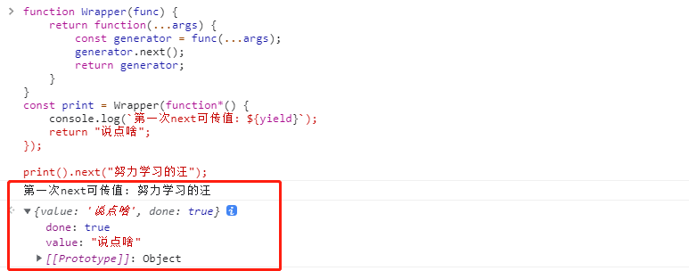 

### Ⅱ - next方法的参数

>`yield`表达式本身没有返回值，或者说总是返回`undefined`。`next`方法可以带一个参数，该参数就会被当作上一个`yield`表达式的返回值。
>
>```javascript
>function* f() {
>  for(var i = 0; true; i++) {
>    var reset = yield i;
>    if(reset) { i = -1; }
>  }
>}
>
>var g = f();
>
>g.next() // { value: 0, done: false }
>g.next() // { value: 1, done: false }
>g.next(true) // { value: 0, done: false }
>```
>
>上面代码先定义了一个可以无限运行的 Generator 函数`f`，如果`next`方法没有参数，每次运行到`yield`表达式，变量`reset`的值总是`undefined`。当`next`方法带一个参数`true`时，变量`reset`就被重置为这个参数（即`true`），因此`i`会等于`-1`，下一轮循环就会从`-1`开始递增。
>
>这个功能有很重要的语法意义。Generator 函数从暂停状态到恢复运行，它的上下文状态（context）是不变的。通过`next`方法的参数，就有办法在 Generator 函数开始运行之后，继续向函数体内部注入值。也就是说，可以在 Generator 函数运行的不同阶段，从外部向内部注入不同的值，从而调整函数行为。

#### ①  举个栗子

>```javascript
>function* foo(x) {
>  var y = 2 * (yield (x + 1));
>  var z = yield (y / 3);
>  return (x + y + z);
>}
>
>var a = foo(5);
>a.next() // Object{value:6, done:false}
>a.next() // Object{value:NaN, done:false}
>a.next() // Object{value:NaN, done:true}
>
>var b = foo(5);
>b.next() // { value:6, done:false }
>b.next(12) // { value:8, done:false }
>b.next(13) // { value:42, done:true }
>```
>
>**上面代码中**:
>
>* 第二次运行`next`方法的时候不带参数，导致 y 的值等于`2 * undefined`（即`NaN`），除以 3 以后还是`NaN`，因此返回对象的`value`属性也等于`NaN`。
>* 第三次运行`Next`方法的时候不带参数，所以`z`等于`undefined`，返回对象的`value`属性等于`5 + NaN + undefined`，即`NaN`。
>
>###### 如果向`next`方法提供参数，返回结果就完全不一样了
>
>* 上面代码第一次调用`b`的`next`方法时，返回`x+1`的值`6`；
>* 第二次调用`next`方法，将上一次`yield`表达式的值设为`12`，因此`y`等于`24`，返回`y / 3`的值`8`；
>* 第三次调用`next`方法，将上一次`yield`表达式的值设为`13`，因此`z`等于`13`，这时`x`等于`5`，`y`等于`24`，所以`return`语句的值等于`42`。
>
>**注意**:
>
>> * 由于`next`方法的参数表示上一个`yield`表达式的返回值，所以在第一次使用`next`方法时，传递参数是无效的
>> * V8 引擎直接忽略第一次使用`next`方法时的参数
>> * 只有从第二次使用`next`方法开始，参数才是有效的。
>> * **从语义上讲，第一个`next`方法用来启动遍历器对象，所以不用带有参数。**

#### ② 再举一个通过`next`方法的参数，向 Generator 函数内部输入值的🌰

>```javascript
>function* dataConsumer() {
>  console.log('这是首次运行');
>  console.log(`第一次传入的值:  ${yield}`);
>  console.log(`第二次传入的值: ${yield}`);
>  return '最后结果';
>}
>
>let genObj = dataConsumer();
>genObj.next();
>//这是首次运行
>genObj.next('hongjilin')
>// 第一次传入的值: hongjilin
>genObj.next('努力学习的汪')
>// 第二次传入的值: 努力学习的汪
>```
>
>上面代码是一个很直观的例子，每次通过`next`方法向 Generator 函数输入值，然后打印出来
>
>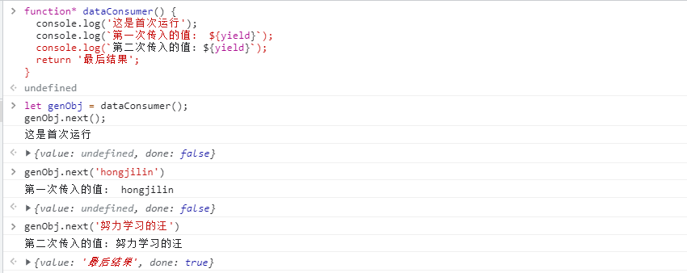 

#### ③ 想要第一次调用 next() 时就能输入值怎么做?

>如果想要第一次调用`next`方法时，就能够输入值，可以在 Generator 函数外面再包一层。
>
>```javascript
>function wrapper(generatorFunction) {
>  return function (...args) {
>    let generatorObject = generatorFunction(...args);
>    generatorObject.next();
>    return generatorObject;
>  };
>}
>
>const wrapped = wrapper(function* () {
>  console.log(`首次输入: ${yield}`);
>  return '结束';
>});
>
>wrapped().next('努力学习的汪!')
>```
>
>> 上面代码中，Generator 函数如果不用`wrapper`先包一层，是无法第一次调用`next`方法就输入参数的。
>>
>> 实际上原理就是: 调用时已经将其运行了一次,你传入参数扔是第二次调用才传入的,代码上看像是第一次调用
>
>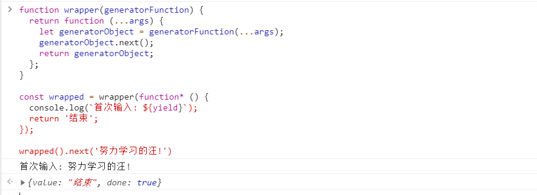 

### Ⅲ - for...of循环

>`for...of`循环可以自动遍历 **Generator** 函数运行时生成的 `Iterator`
>
>此部分暂停,后续更新
>
>


## 18、异步操作和Async函数

>异步编程对JS语言十分重要,因为语言本身的执行环境是 **单线程** 的,如果没有异步编程,很容易出现卡死、堵塞的鲜血
>
>ES6诞生以前,异步编程的方法大概分为下面四种:
>
>* 回调函数
>* 事件监听
>* 发布/订阅
>* Promise对象
>
>ES6将JS异步编程带入了一个全新的阶段,ES7的`Async`函数更是提出了异步编程的一个极好的解决方案

### Ⅰ - 概述与总结

>#### 一、Async的定义与概念
>
>1. 定义：使异步函数以同步函数的形式书写(Generator函数语法糖)
>>2. 原理：将`Generator函数`和自动执行器`spawn`包装在一个函数里
>3. 形式：将`Generator函数`的`*`替换成`async`，将`yield`替换成`await`
>>4. 声明:
>
>>- 具名函数：`async function Func() {}`
>- 函数表达式：`const func = async function() {}`
>>- 箭头函数：`const func = async() => {}`
>- 对象方法：`const obj = { async func() {} }`
>- 类方法：`class Cla { async Func() {} }`
>
>5. await命令：等待当前Promise对象状态变更完毕
>
>>- 正常情况：后面是Promise对象则返回其结果，否则返回对应的值
>- 后随`Thenable对象`：将其等同于Promise对象返回其结果
>>
>6. 错误处理：将`await命令Promise对象`放到`try-catch`中(可放多个)
>
>>###### 二、Async对Generator改进
>
>- 内置执行器
>- 更好的语义
>- 更广的适用性
>- 返回值是Promise对象
>
>###### 三、应用场景
>
>> 按顺序(同步)完成异步操作
>
>###### 四、重点难点
>
>1. `Async函数`返回`Promise对象`，可使用`then()`添加回调函数
>2. 内部`return返回值`会成为后续`then()`的出参
>3. 内部抛出错误会导致返回的Promise对象变为`rejected状态`，被`catch()`接收到
>4. 返回的Promise对象必须等到内部所有`await命令Promise对象`执行完才会发生状态改变，除非遇到`return语句`或`抛出错误`
>5. 任何一个`await命令Promise对象`变为`rejected状态`，整个`Async函数`都会中断执行
>6. 希望即使前一个异步操作失败也不要中断后面的异步操作
>  - 将`await命令Promise对象`放到`try-catch`中
>  - `await命令Promise对象`跟一个`catch()`
>7. `await命令Promise对象`可能变为`rejected状态`，最好把其放到`try-catch`中
> 8. 多个`await命令Promise对象`若不存在继发关系，最好让它们同时触发(异步机制的存在本身就是为了提高效率)
> 9. `await命令`只能用在`Async函数`之中，否则会报错
>10. 数组使用`forEach()`执行`async/await`会失效，可使用`for-of`和`Promise.all()`代替
>11. 可保留运行堆栈，函数上下文随着`Async函数`的执行而存在，执行完成就消失

### Ⅱ -  基本概念

> 回顾一些基本概念

#### ① 异步

>所谓异步,简单说就是一个任务分成两段,先执行第一段,然后转而去执行更重要的其他任务,等做好了准备或者有空闲了,再来执行第二段
>
>>栗子:有一个任务是读取文件进行处理
>>
>>* 任务的第一段是向操作系统发出请求,要求读取文件,然后程序执行其他任务
>>* 然后程序执行其他任务,等到操作系统返回了文件,我才接着执行任务的第二段(处理文件)
>>* 这种不连续的执行就叫做异步
>
>相对应的,连续的执行就叫做同步,由于是连续执行,不能插入其他任务,如果 **读取文件操作** 转成同步操作的话,操作系统从硬盘读取文件的这段时间,就只能等待,造成'堵塞'

#### ② 回调函数

> JS语言对异步编程的实现就是 **回调函数(callback)**. 所谓回调函数:就是把任务的第二段单独写在一个函数里面,等到重新执行这个任务的时候就直接调用这个函数

##### a) 举个栗子

>这时Node中常见的读取文件操作函数
>
>```js
>//读取文件操作
>fs.readFile('/etc/fs', function (err, data) {
>  if (err) throw err;
>  console.log(data);
>});
>```
>
>###### 上面代码中:`readFile`函数的第二个参数就是回调函数,也就是任务的第二段.等到操作系统返回 `/etc/fs` 后,回调函数才会执行
>
>引申的问题:为什么Nodejs约定回调函数的第一个参数,必须是错误对象err(如果没有错,该参数就是null)?
>
>> 原因是执行分成两段,这两段之间抛出的错误,程序无法捕捉,只能当作参数传入第二段中

#### ③ Promise

>回调函数本身没有问题,但是他的问题出现在多个回调函数嵌套时,俗称 `回调地狱`,如同下面这样:
>
>
>
>而Promise的出现就是为了解决回调地狱的问题,但**只是简单的改变格式**, 并没有彻底解决上面的问题(还是会有一堆的then).真正要解决上述问题, 一定要利用promise再加上await和async关键字实现异步传同步
>
>具体内容更可以看本人 **[Promise学习笔记](https://gitee.com/hongjilin/hongs-study-notes/tree/master/编程_前端开发学习笔记/Promise学习笔记)** 

### Ⅲ -  Generator函数

> 更详细的内容看上面笔记,这里做个大致回顾

#### ① 协程

>传统的编程语言,早有异步编程的解决方案(其实是多任务的解决方案).其中一种叫做'协程(coroutine)':意思是多个线程互相协作,完成异步任务
>
>协程有点像函数却又有点像线程,它的运行流程大致如下:
>
>* 第一步:协程A开始执行
>* 第二步:协程A执行到一半进入暂停,执行权转移到协程B
>* 第三步:(一段时间后)协程B交还执行权
>* 第四步:协程A恢复执行
>
>上面流程的协程A就是异步任务,因为它分成两段或者多段执行

##### a) 举个栗子

>```js
>function *asyncJob() {
>  // ...其他代码
>  var f = yield readFile(fileA);
>  // ...其他代码
>}
>```
>
>上面代码的函数`asyncJob`是一个协程,它的奥妙就在其中的`yield`命令,它表示执行到此处执行权将交给其他协程,也就是说`yield`命令是异步两个阶段的分界线
>
>协程遇到`yield`命令就暂停,等到执行权返回,再从暂停的地方继续往后执行.它的最大优点就是代码的写法非常像同步操作

#### ② Generator函数的ming的概念

>Generator函数是协程在ES6的实现,最大的特点就是可以交出函数的执行权(即暂停执行)
>
>整个Generator函数就是一个封装的异步任务或者说是异步任务的容器,异步操作需要暂停的地方都用`yield`语句注明,Generator函数的执行方法如下
>
>```js
>function* gen(x){
>   return  yield x + 1;
>}
>
>var g = gen(1);
>g.next() // { value: 2, done: false }
>g.next() // { value: undefined, done: true }
>```
>
>上面代码中调用Generator函数,会返回一个内部指针(即遍历器):这是Generator函数不同于普通函数的另一个地方,即执行它不会返回结果,返回的是指针对象.调用指针g的next方法,会移动内部指针(即执行异步函数的第一段)指向第一个遇到yield语句,上例是执行到`x+1`为止
>
>换言之:next方法的作用是分阶段执行Generator函数,每次调用next方法,会返回一个对象表示当前阶段的信息(value属性和done属性)
>
>* value属性:yield语句后面表达式的值,表示当前阶段的值
>* done属性:布尔值-->表示Generator函数是否执行完毕(即是否还有下一个阶段)

#### ③ Generator函数的数据交换和错误处理

>Generator函数可以在暂停执行和恢复执行,这是它能封装异步任务的根本原因
>
>除此之外它还有两个特性使它可以作为异步编程的完美解决方案:**函数体内外的数据交换和错误处理机制**
>
>* next方法返回值的value属性是Generator函数向外输出数据
>* next方法还可以接受参数,这是向Generator函数体内输入数据

##### a) 举个栗子

>```js
>function* gen(x){
>  return yield x + 1;
>}
>
>var g = gen(1);
>g.next() // { value: 2, done: false }
>g.next(2) // { value: 2, done: true }
>```
>
>上面代码中:
>
>* 第一个next方法的value属性,返回表达式`x+1`的值
>* 第二个next方法带有参数 `2`,这个参数可以传入Generator函数作为上一个阶段异步任务的返回结果,所以这一步的value属性返回的就是2,且done为true

##### b) 再举个栗子

>Generator 函数内部还可以部署错误处理代码，捕获函数体外抛出的错误。
>
>```js
>function* gen(x){
>  try {
>    var y = yield x + 2;
>  } catch (e){
>    console.log(e);
>  }
>  return y;
>}
>
>var g = gen(1);
>g.next();
>g.throw('出错了');
>// 出错了
>```
>
>上面代码的最后一行，Generator函数体外，使用指针对象的throw方法抛出的错误，可以被函数体内的try ...catch代码块捕获。这意味着，出错的代码与处理错误的代码，实现了时间和空间上的分离，这对于异步编程无疑是很重要的。

#### ④ 异步任务的封装

>下面看看如何使用 Generator 函数，执行一个真实的异步任务。
>
>```javascript
>var fetch = require('node-fetch');
>
>function* gen(){
>  var url = 'https://gitee.com/hongjilin';
>  var result = yield fetch(url);
>  console.log(result.bio);
>}
>```
>
>上面代码中，Generator函数封装了一个异步操作，该操作先读取一个远程接口，然后从JSON格式的数据解析信息。就像前面说过的，这段代码非常像同步操作，除了加上了yield命令。

##### a) 执行代码的方法如下

>```js
>var g = gen();
>var result = g.next();
>//这里的value实际上相当于 fetch(url);
>result.value.then(function(data){
>  return data.json();
>}).then(function(data){
>  g.next(data);
>});
>```
>
>上面代码中:
>
>* 先执行Generator函数,获取遍历器对象,然后使用next方法(第二行),执行异步任务第一阶段
>* 由于Fetch模块返回的是一个Promise对象,因此要用then方法调用下一个next方法
>* 可以看到虽然Generator函数将异步操作表示的很简洁,但是流程管理却不方便(即何时执行第一阶段、何时执行第二阶段)

### Ⅳ - Thunk函数

>JavaScript 语言是 **`传值调用`** 

#### ① 参数的求值策略

>Thunk函数早在上个世纪60年代就诞生了,那时候编程语言才刚刚起步,计算机学家还在研究编译器怎么写比较好,一个争论的焦点时'**求值策略**':即函数的参数到底应该何时求值
>
>```js
>const x = 1;
>
>function f(m){
>  return m * 2;
>}
>
>f(x + 1)
>```
>
>上面代码先定义函数f,然后向它传入表达式`x+1`,请问这个表达式应该何时求值?

##### a) 传值调用(call  by value)

>即在进入函数体之前,就计算`x+1`的值(等于2),再将这个值传入函数f,C语言就是采用这种策略
>
>```js
>f(x+1)
>//传值调用时,两者等同
>f(2)
>```

##### b) 传名调用(call by name)

>即直接将表达式`x+1`传入函数体,只在用到它的时候求值,Haskell语言采用这种策略
>
>```js
>f(x+1)
>//传名调用时,等同下面的
>(x+1)*2
>```

##### c) 传值和传名调用那种好?

>###### 答案是各有利弊:传值调用比较简单,但是对参数求值的时候,实际上还没用到这个参数,有可能造成性能损失
>
>```js
>function f(a, b){
>  return b;
>}
>//这里传入的第一个参数,在实际调用中并没有使用
>f(3 * x * x - 2 * x - 1, x);
>```
>
>上面代码中,函数f的第一个参数是一个复杂的表达式,但是函数体内根本没用到,对于这个参数求值实际上是不必要的,因此有一些计算机学家倾向于'**传名求值**'-->只在执行时求值

#### ② Thunk函数的含义

>###### 编译器 '**`传名调用`**' 实现往往是将参数放到一个临时函数之中,再将这个临时函数传入函数体,这个临时函数就叫做Thunk函数
>
>```js
>function f(m){
>    return m * 2
>}
>f(x + 1)
>//等同于下面
>const Thunk = function (){
>    return x + 1
>}
>function f(thunk){
>    return Thunk() * 2
>}
>```
>
>上面代码中函数f的参数`x + 1`被一个自定义的`Thunk`函数替换了.凡是用到原参数的地方对`Thunk`函数求值即可,这就是Thunk函数的定义,他是'传名调用'的一种实现策略,用来替换某个表达式

#### ③ JavaScript语言的Thunk函数

>###### JavaScript 语言是 **`传值调用`** ,它的Thunk函数含义有所不同:
>
>> 在JavaScript语言中,Thunk函数替换的不是表达式,而是多参函数,将其转换成单参数的版本,且只接受回调函数作为参数
>
>```js
>// 正常版本的readFile（多参数版本）
>fs.readFile(fileName, callback);
>
>// Thunk版本的readFile（单参数版本）
>const readFileThunk = Thunk(fileName);
>readFileThunk(callback);
>
>const Thunk = function (fileName){
>  return function (callback){
>    return fs.readFile(fileName, callback);
>  };
>};
>```
>
>上面代码中:
>
>* fs模块的readFie方法是一个多参数函数,两个参数分别是文件名和回调函数
>* 经过转换器处理,他变成了一个单参数的函数,只接受回调函数作为参数,这个单参数版本就叫做Thunk函数

##### a) 任何函数只要参数有回调函数就能写成Thunk形式

>```js
>// ES5版本
>var Thunk = function(fn){
>  return function (){
>    var args = Array.prototype.slice.call(arguments);
>    return function (callback){
>      args.push(callback);
>      return fn.apply(this, args);
>    }
>  };
>};
>
>// ES6版本
>var Thunk = function(fn) {
>  return function (...args) {
>    return function (callback) {
>      return fn.call(this, ...args, callback);
>    }
>  };
>};
>
>//调用栗子1
>var readFileThunk = Thunk(fs.readFile);
>readFileThunk(fileA)(callback);
>//栗子2
>function f(a, cb) {
>  cb(a);
>}
>let ft = Thunk(f);
>
>let log = console.log.bind(console);
>ft(1)(log) // 1
>```
>
>实际上这个写法非常像`闭包`

#### ④ Generator 函数的流程管理

>你可能会问,Thunk函数有什么用?
>
>>回答就是以前确实没什么用,但是ES6有了Generator函数,Thunk函数现在可以用于Generator函数

##### a) Generator可以自动执行

>```js
>function* gen() {
>  // ...
>}
>
>var g = gen();
>var res = g.next();
>//只要 done 不为true:即流程没有结束时,一直循环
>while(!res.done){
>  console.log(res.value);
>  res = g.next();
>}
>```
>
>上面代码中,Generator函数`gen`会自动执行完所有步骤,**但是这并不适合异步操作!!!!**

##### b) 异步操作解决方案

>如果必须保证前一步执行完才能执行后一步,上面的自动执行就不可行,这时Thunk函数就能派上用场:以读取文件为例下面的Generator函数封装了两个异步操作
>
>```js
>var fs = require('fs');
>var thunkify = require('thunkify');
>var readFile = thunkify(fs.readFile);
>
>var gen = function* (){
>  var r1 = yield readFile('/etc/fstab');
>  console.log(r1.toString());
>  var r2 = yield readFile('/etc/shells');
>  console.log(r2.toString());
>};
>```
>
>###### 上面代码中 `yield`命令用于将程序的执行权移出Generator函数,那么就需要一种方法将执行权再交还给Generator函数
>
>这种方法就是Thunk函数:因为它可以在回调函数里将执行权交还给Generator函数,为了便于理解我们先看如何手动执行上面这个Generator函数

###### (1)  手动执行上面的Generator函数

>```js
>var g = gen();
>
>var r1 = g.next();
>r1.value(function(err, data){
>  if (err) throw err;
>  var r2 = g.next(data);
>    //需要调用几次,就重复几次这样的代码
>  r2.value(function(err, data){
>    if (err) throw err;
>    g.next(data);
>  });
>});
>```
>
>上面代码中，变量g是Generator函数的内部指针，表示目前执行到哪一步。next方法负责将指针移动到下一步，并返回该步的信息（value属性和done属性）。
>
>仔细查看上面的代码，可以发现Generator函数的执行过程，其实是将同一个回调函数，反复传入next方法的value属性。这使得我们可以用递归来自动完成这个过程,那如何实现自动递归调用呢?看下面的内容

#### ⑤ Thunk函数的自动流程管理

>hunk函数真正的威力，在于可以自动执行Generator函数。下面就是一个基于Thunk函数的Generator执行器。
>
>```javascript
>function run(fn) {
>  const gen = fn();
>
>  function next(err, data) {
>    const result = gen.next(data);
>    if (result.done) return;
>    //将下一级的函数取出,随后传入 next回调函数(上面说过,单参数传入回调)
>    result.value(next);
>  }
>
>  next();
>}
>
>function* g() {
>  // ...
>}
>
>run(g);
>```
>
>上面代码的`run`函数，就是一个Generator函数的自动执行器
>
>* 内部的`next`函数就是Thunk的回调函数。
>* `next`函数先将指针移到Generator函数的下一步（`gen.next`方法），然后判断Generator函数是否结束（`result.done`属性）
>* 如果没结束，就将`next`函数再传入Thunk函数（`result.value`属性），否则就直接退出。
>
>有了这个执行器,执行Generator函数方便多了,不管内部又多少个异步操作,直接把Generator函数传入这个`run`函数即可,当然前提是:
>
>**每一个异步操作都要是Thunk函数,也就是说yield命令后面必须是Thunk函数**

##### a) 实例

>```javascript
>var g = function* (){
>  var f1 = yield readFile('fileA');
>  var f2 = yield readFile('fileB');
>  // ...
>  var fn = yield readFile('fileN');
>};
>
>run(g);
>```
>
>上面代码中，函数`g`封装了`n`个异步的读取文件操作，只要执行`run`函数，这些操作就会自动完成。这样一来，异步操作不仅可以写得像同步操作，而且一行代码就可以执行。
>
>Thunk函数并不是Generator函数自动执行的唯一方案。因为自动执行的关键是，必须有一种机制，自动控制Generator函数的流程，接收和交还程序的执行权。回调函数可以做到这一点，Promise 对象也可以做到这一点。

### Ⅴ - co模块

#### ① 基本用法

>co模块是一个用于Generator函数的自动执行的小工具
>
>比如，有一个Generator函数，用于依次读取两个文件。
>
>```javascript
>var gen = function* (){
>  var f1 = yield readFile('/etc/fstab');
>  var f2 = yield readFile('/etc/shells');
>  console.log(f1.toString());
>  console.log(f2.toString());
>};
>```
>
>co模块可以让你不用编写Generator函数的执行器。
>
>```javascript
>var co = require('co');
>co(gen);
>```
>
>上面代码中，Generator函数只要传入co函数，就会自动执行。
>
>co函数返回一个Promise对象，因此可以用then方法添加回调函数。
>
>```javascript
>co(gen).then(function (){
>  console.log('Generator 函数执行完成');
>});
>```
>
>上面代码中，等到Generator函数执行结束，就会输出一行提示。

#### ② co模块的原理

>###### 为什么co可以自动执行Generator函数?
>
>> 前面说过Generator就是一个异步操作的容器,它的自动执行需要一种机制,当异步操作有了结果能够自动交回执行权
>
>两种方法可以做到这一点
>
>1. 回调函数: 将异步操作包装成Thunk函数,在回调函数里面交回执行权
>2. Promise对象:将异步操作包装成Promise对象,用then方法交回执行权
>
>co模块其实就是将两种自动执行器(Thunk函数和Promise对象)包装成一个模块.使用co的前提条件是:Generator函数的yield命令后面，只能是Thunk函数或Promise对象

##### a)基于Promise对象的自动执行

>还是沿用上面的例子。首先，把fs模块的readFile方法包装成一个Promise对象。
>
>```javascript
>var fs = require('fs');
>
>var readFile = function (fileName){
>  return new Promise(function (resolve, reject){
>    fs.readFile(fileName, function(error, data){
>      if (error) return reject(error);
>      resolve(data);
>    });
>  });
>};
>
>var gen = function* (){
>  var f1 = yield readFile('/etc/fstab');
>  var f2 = yield readFile('/etc/shells');
>  console.log(f1.toString());
>  console.log(f2.toString());
>};
>```
>
>然后，手动执行上面的Generator函数。
>
>```javascript
>var g = gen();
>
>g.next().value.then(function(data){
>  g.next(data).value.then(function(data){
>    g.next(data);
>  });
>});
>```
>
>手动执行其实就是用then方法，层层添加回调函数。理解了这一点，就可以写出一个自动执行器。
>
>```javascript
>function run(gen){
>  var g = gen();
>
>  function next(data){
>    var result = g.next(data);
>    if (result.done) return result.value;
>    //将回调传入,实现自动执行  
>    result.value.then(function(data){
>      next(data);
>    });
>  }
>
>  next();
>}
>
>run(gen);
>```
>
>上面代码中，只要Generator函数还没执行到最后一步，next函数就调用自身，以此实现自动执行。

##### b) co模块的源码

>co就是上面那个自动执行器的扩展，它的源码只有几十行，非常简单。
>
>首先，co函数接受Generator函数作为参数，返回一个 Promise 对象。
>
>```javascript
>function co(gen) {
>  var ctx = this;
>
>  return new Promise(function(resolve, reject) {
>  });
>}
>```
>
>在返回的Promise对象里面，co先检查参数gen是否为Generator函数。如果是，就执行该函数，得到一个内部指针对象；如果不是就返回，并将Promise对象的状态改为resolved。
>
>```javascript
>function co(gen) {
>  var ctx = this;
>
>  return new Promise(function(resolve, reject) {
>    if (typeof gen === 'function') gen = gen.call(ctx);
>    //如果下一步已经流程结束或者 非Generator函数,则返回成功状态  
>    if (!gen || typeof gen.next !== 'function') return resolve(gen);
>  });
>}
>```
>
>接着，co将Generator函数的内部指针对象的next方法，包装成onFulfilled函数。这主要是为了能够捕捉抛出的错误。
>
>```javascript
>function co(gen) {
>  var ctx = this;
>
>  return new Promise(function(resolve, reject) {
>    if (typeof gen === 'function') gen = gen.call(ctx);
>    if (!gen || typeof gen.next !== 'function') return resolve(gen);
>
>    onFulfilled();
>    function onFulfilled(res) {
>      var ret;
>      try {
>        ret = gen.next(res);
>      } catch (e) {
>        return reject(e);
>      }
>      next(ret);
>    }
>  });
>}
>```
>
>最后，就是关键的next函数，它会反复调用自身。
>
>```javascript
>function next(ret) {
>  if (ret.done) return resolve(ret.value);
>  var value = toPromise.call(ctx, ret.value);
>  if (value && isPromise(value)) return value.then(onFulfilled, onRejected);
>  return onRejected(new TypeError('You may only yield a function, promise, generator, array, or object, '
>    + 'but the following object was passed: "' + String(ret.value) + '"'));
>}
>```
>
>上面代码中，next 函数的内部代码，一共只有四行命令。
>
>第一行，检查当前是否为 Generator 函数的最后一步，如果是就返回。
>
>第二行，确保每一步的返回值，是 Promise 对象。
>
>第三行，使用 then 方法，为返回值加上回调函数，然后通过 onFulfilled 函数再次调用 next 函数。
>
>第四行，在参数不符合要求的情况下（参数非 Thunk 函数和 Promise 对象），将 Promise 对象的状态改为 rejected，从而终止执行。

#### ③ 处理并发的异步操作

>co支持并发的异步操作，即允许某些操作同时进行，等到它们全部完成，才进行下一步。
>
>这时，要把并发的操作都放在数组或对象里面，跟在yield语句后面。
>
>```javascript
>// 数组的写法
>co(function* () {
>  var res = yield [
>    Promise.resolve(1),
>    Promise.resolve(2)
>  ];
>  console.log(res);
>}).catch(onerror);
>
>// 对象的写法
>co(function* () {
>  var res = yield {
>    1: Promise.resolve(1),
>    2: Promise.resolve(2),
>  };
>  console.log(res);
>}).catch(onerror);
>```
>
>下面是另一个例子。
>
>```javascript
>co(function* () {
>  var values = [n1, n2, n3];
>  yield values.map(somethingAsync);
>});
>
>function* somethingAsync(x) {
>  // do something async
>  return y
>}
>```
>
>上面的代码允许并发三个`somethingAsync`异步操作，等到它们全部完成，才会进行下一步。


### Ⅵ - Async函数

####  ①Async是Generator 函数的语法糖

##### a)  两者间区别

>比如我们要实现一个依次读取两个文件的效果
>
>1.  Generator 函数实现
>
>```js
>const gen = function* () {
>const f1 = yield readFile('/etc/test1');
>const f2 = yield readFile('/etc/test2');
>console.log(f1.toString());
>console.log(f2.toString());
>};
>```
>
>2. async实现
>
>```js
>const asyncReadFile = async function () {
>const f1 = await readFile('/etc/test1');
>const f2 = await readFile('/etc/test2');
>console.log(f1.toString());
>console.log(f2.toString());
>};
>```
>
>###### 一比较我们就能发现,他们存在大量相似的地方:
>
>* `async`函数就是将 Generator 函数的星号（`*`）替换成`async`
>* 将`yield`替换成`await`,仅此而已

##### b)  Async函数对 Generator 函数的改进

###### (1)  内置执行器

>Generator函数的执行必须靠执行器,所以才有了`co`模块,而`async`函数自带执行器.
>
>* 它不用像Generator函数需要调用`next`方法,或者用`co`模块才能真正执行得到结果
>* 也就是说，`async`函数的执行，与普通函数一模一样，只要一行。

###### (2) 更好的语义

>`async`和`await`,比起`*`和`yield`而言语义更清楚了:
>
>**`async`表示函数里有异步操作,`await`表示紧跟在后面的表达式需要等待结果**

###### (3) 更广的适用性

>* `co`模块约定:`yield`命令后面只能是Thunk函数或Promise对象
>* `async`与`await`: 命令后面可以是Promise对象和原始类型的值(数值、字符串和布尔值,但这时会自动转成立即`resolved`的Promise对象)

###### (4)返回值是Promise

>`async`函数的返回值是Promise对象,这比Generator函数的返回值是Iterator对象方便多了
>
>* 你可以用`then`方法执行下一步操作
>* 进一步说:`async`函数完全可以看作多个异步操作,包装成的一个Promise对象
>* `await`命令就是内部`then`命令的语法糖

#### ② 语法

>`Async`函数的语法规则总体上比较简单,难点是错误处理机制

##### a) Async函数返回一个Promise对象

>


