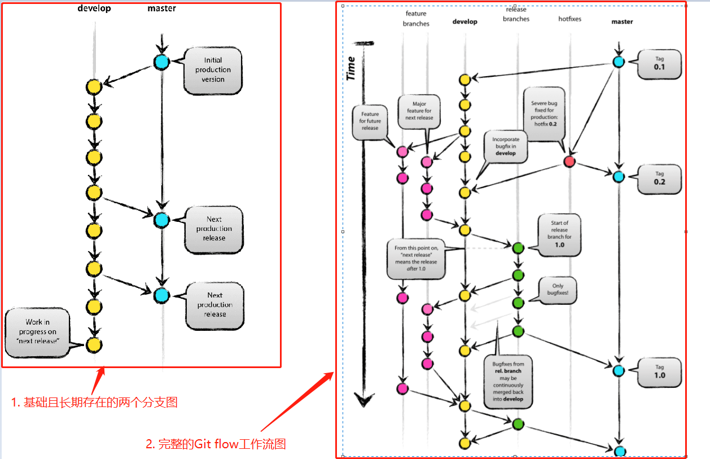
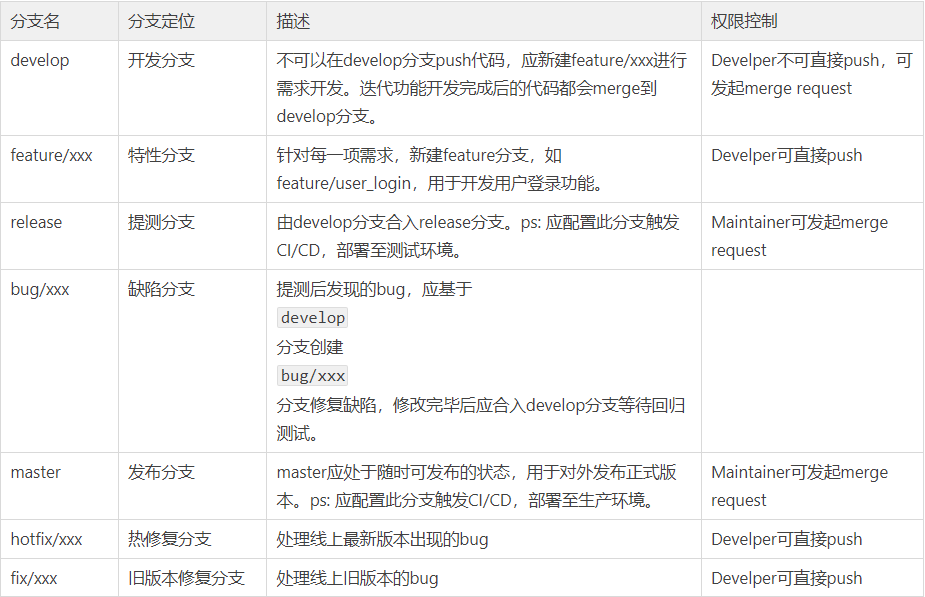
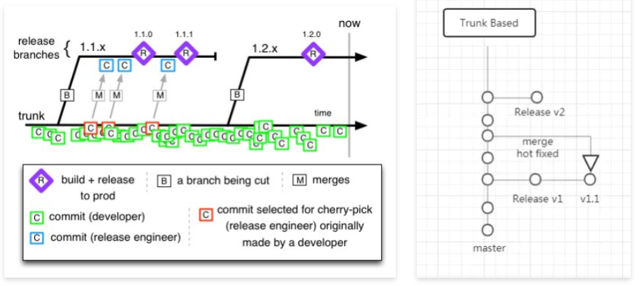
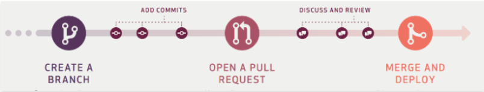
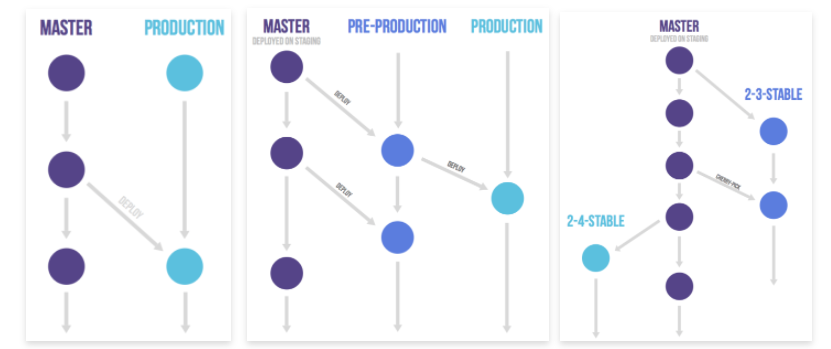
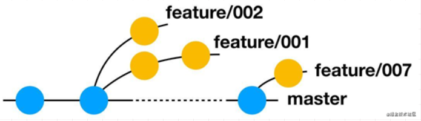
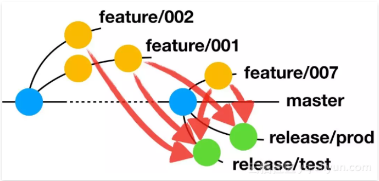
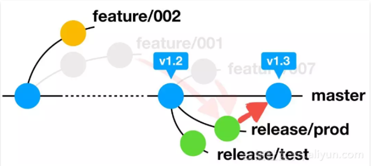

# #说明

> 本笔记是本人对于Git工作流的学习感悟与记录(部分是摘录)
>
> 借阅参考的资料:阮一峰的[Git工作流程](http://www.ruanyifeng.com/blog/2015/12/git-workflow.html)、[《Git 分支管理策略》](https://www.ruanyifeng.com/blog/2012/07/git.html);掘金上zifeiyu的[GIT工作流指南系列--gitFlow工作流](https://juejin.cn/post/6844903997589946382#heading-4)、红尘炼心的[『前端进阶』—— 代码管理方案之Aone Flow](https://juejin.cn/post/6979605217184579591);[钱五哥の自由空间](http://www.brofive.org/)的[Git 代码分支模型GitFlow、GitHub Flow、Trunk Based Development](http://www.brofive.org/?p=2165);[替代分支模型](https://trunkbaseddevelopment.com/alternative-branching-models/);*[刘尚奇](https://insights.thoughtworks.cn/author/liushangqi/)*的[Gitflow有害论](http://insights.thoughtworks.cn/gitflow-consider-harmful/);Paul Hammant的[What is Trunk-Based Development?](https://paulhammant.com/2013/04/05/what-is-trunk-based-development/);以及公司前辈在技术分享会上的讲述
>
> 本人笔记地址分享:[`全部笔记`](https://gitee.com/hongjilin/hongs-study-notes)、[`Git笔记`](https://gitee.com/hongjilin/hongs-study-notes/tree/master/%E7%BC%96%E7%A8%8B_%E5%89%8D%E7%AB%AF%E5%BC%80%E5%8F%91%E5%AD%A6%E4%B9%A0%E7%AC%94%E8%AE%B0/Git%E5%AD%A6%E4%B9%A0%E7%AC%94%E8%AE%B0)

# #目录

>[TOC]

# 一、Git 工作流程概念

>Git 作为一个源码管理系统，不可避免涉及到多人协作。
>
>协作必须有一个规范的工作流程，让大家有效地合作，使得项目井井有条地发展下去。"工作流程"在英语里，叫做"workflow"或者"flow"，原意是水流，比喻项目像水流那样，顺畅、自然地向前流动，不会发生冲击、对撞、甚至漩涡。
>
>如果你对于Git还不是很熟练,可以看本人关于Git的详细学习笔记,内给出了对应的学习教程来源    -->**[点我跳转](https://gitee.com/hongjilin/hongs-study-notes/tree/master/编程_前端开发学习笔记/Git学习笔记)** 

## 1、定义

>- 基于Git的强大分支能力所构建的一套软件开发工作流
>- 根据项目具体需求定制的一套工作规范

## 2、存在意义

>1. 整个研发流程(软件工程)管理中的重要环节
>    - 上游:项目管理/缺陷管理  
>    - 下游:运维部署(CD)
>
>2. 所有类型的提出基本能解决:
>   - 特性独立开发互不影响,记录发布历史
>    - 多版本并行,多环境多渠道部署的不同需求

## 3、功能驱动

>- 常见的几种工作流程，有一个共同点：都采用["功能驱动式开发"](https://en.wikipedia.org/wiki/Feature-driven_development)（Feature-driven development，简称FDD）。
>- 它指的是，需求是开发的起点，先有需求再有功能分支（feature branch）或者补丁分支（hotfix branch）。完成开发后，该分支就合并到主分支，然后被删除。
>
>例如:Git flow、Github flow、Gitlab flow等

## 4、省流总结

>- `没有银弹!!`-->没有非黑即白的工作流,只有不同应用场景的选择
>- `branch的本质是一种轻量级的代码隔离技术,生命周期应该尽可能地短`
>- 本身工作流也是一种人为规定的规范,可以结合常见的几种工作流然后取其精华去其糟粕规定出自己所需的工作流
>- 工作中最好细致拆解任务,这样可以防止feature开发周期过长导致合并时带上`痛苦面具`
>- 养成习惯:频繁进行pull与rebase操作,冲突还真是麻烦的

# 二、Git Flow

> 更详细的关于Git flow相关知识可以查阅阮一峰的[《Git 分支管理策略》](https://www.ruanyifeng.com/blog/2012/07/git.html)。
>
> 此工作流也是最具有争议的

## 1、工作流程图

>

## 2、特点

>它主要有两个特点
>
>1. 首先项目存在两个长期分支:
>   - 主分支`master`
>   - 开发分支`develop`
>   - `ps`:前者用于存放对外发布的版本，任何时候在这个分支拿到的，都是稳定的分布版；后者用于日常开发，存放最新的开发版。
>2. 其次，项目存在三种短期分支
>   - 功能分支（feature branch）
>   - 补丁分支（hotfix branch）
>   - 预发分支（release branch）
>   - ps`:一旦完成开发，它们就会被合并进`develop`或`master`，然后被删除。

## 3、分支删除管理

>- 特性分支合并到dev后,删除feature
>- 发布分支合并到master和dev后,删除release
>- 修复分支合并到master和dev后,删除hotfix

## 4、GitFlow分支说明

>根据主流的Git工作流,一般分为:master(`必须`)、release(`通常必须`)、develop(`必须`)、hoxfix/xxx、bug/xxx、feature/xxx,分支贯穿了整个**开发、测试、部署**流程
>
>各分支的定位以及权限描述:
>
> 

## 5、缺点与其有害论

>缺点
>
>- 特性分支基于dev,代码不够稳定
>- 发布分支基于dev,可能含有不打算发布的特性
>- 非官方推荐,类似于民间约定俗成的工作流
>
>有害论
>
>- 流程相对复杂,需要要求成员深刻理解流程并且严格执行
>- merge总是痛苦和易错的,成本异常高,特别是feature的周期很长的时候.合并的时候总会带上`痛苦面具`
>- 持续集成引起的不适
>- 借阅的资料:[Gitflow有害论](http://insights.thoughtworks.cn/gitflow-consider-harmful/)

## 6、工作流实践

> 此实践参考资料来自于掘金的[zifeiyu的GIT工作流指南系列](https://juejin.cn/post/6844903997589946382)

### Ⅰ-初始化

>你可以从远程仓库clone项目或者本地新建项目
>
>1. 初始化命令
>
>```sh
>git flow init
>```
>
>2. 该命令会指引你去修改不同分支的前缀，建议没有特别的需求使用默认前缀即可
>
>   ```sh
>   $ git flow init
>   Initialized empty Git repository in /Users/tobi/acme-website/.git/
>   Branch name for production releases: [master] 
>   Branch name for "next release" development: [develop] 
>   
>   How to name your supporting branch prefixes?
>   Feature branches? [feature/] 
>   Release branches? [release/] 
>   Hotfix branches? [hotfix/] 
>   ```
>
>3. 如果你不需要修改默认的分支前缀（大多数情况）那么也可以使用如下命令进行初始化来跳过询问过程
>
>```sh
>git flow init -d
>```

### Ⅱ-feature分支

#### ① *本地操作流程*

>- 当我们初始化完成之后，就可以开始一个新功能的开发，开发新功能需要在feature分支上进行，下面就让我们创建一个新的叫做rss-feed的feature分支
>
>```sh
>git flow feature start rss-feed
>```
>
>- 这个功能可能需要多人协作才能完成，所以我们需要把它发布到远端（如果是本地创建的项目，请先与远端仓库建立联系）
>
>```sh
>git flow feature public rss-feed
>```
>
>这条指令在远程仓库新建了一个feature/rss-feed的分支，并将本地ree-feed分支track上述分支，push本地分支代码。
>
>ps:该命令只能执行一次，当远程仓库已经有了相应分支，在执行该命令将会报错，这个时候只要执行push命令就可以了。
>
>- 经过一段时间的努力，我们跟同事一起协作开发完成了rss-feed分支上的功能，我们需要把这个feature分支合并到develop分支(可能还有别的feature分支，一起合并到develop)。
>
>```sh
>git flow feature finish rss-feed
>```
>
>*该命令做了以下几件事*
>
>- 切换到develop分支
>- 将feature/rss-feed分支merge到develop分支
>- 删除本地feature/rss-feed分支
>
>  `注意`:
> - git flow进行merge操作或者tag操作的时候，会让打开vim编辑器让你填写merge信息或者tag信息（tag信息必须填写，否则无法打tag）
> - 如果merge过程发生了冲突，则在第二步merge时终止流程，即不会再删除本地分支。但当前已处于develop分支，待本地冲突解决并commit后，重新执行git flow feature finish <feature_name>即可完成finish流程。

#### ② *同步远程仓库*

>- push本地develop分支
>
>- 删除远端仓库feature/rss-feed分支
>
>- ```sh
>  git push origin develop
>   git push origin :feature/rss-feed

#### ③ ***finish指令的附加参数***

>- -r mege前先进行rebase操作
>- -F merge操作完成后删除远程和本地feature分支
>- -k 保留feature分支

### Ⅲ-release分支

>当项目组的各个成员都完成了自己在本次版本中feature分支的功能开发并合并到develop分支，项目的管理员应当开始`release`操作。
>
>基于develop分支拉出release分支进行测试，发现bug项目组成员拉取release分支后直接在release分支上进行修改，并提交到远程仓库。

#### **操作具体流程**

>1. 切换到master分支
>2. 执行git fetch检查更新： 如果远程仓库有更新，会停下来并让你先执行git pull命令（如果有冲突解决冲突并提交，这可能是唯一一种直接操作master分支的情形了）, 确保本地master是最新的。
>3. 如果没有更新，将release/v2.0分支合并到本地master: 会让你填写merge信息，vim的形式（如何操作vim）
>4. 将release/v2.0分支合并到本地develop
>5. 删除本地release/v2.0分支
>6. 注意:
>   - 建议在使用`release finish`命令之前使用git pull更新develop和master代码，特别是master
>   - 如果本地还有未finish的release分支，将不允许使用start指令开启新的release分支，这一点是对并行发布的一个限制。
>7. 然后同步到远程

### Ⅳ-hotfix分支

>当我们的线上版本出现BUG需要紧急修复的时候，流程如下：
>
>1. 假设修复bug的版本号为v2.0-patch
>
>   ```sh
>   git flow hotfix start v2.0-patch
>   ```
>
>   hotfix并没有public命令，因为BUG一般是比较小且不可分割的逻辑单元，通常是单人在单个工作周期内完成，也不需要跟其他人协作。
>
>2. 本地完成修复，并测试通过commit之后就可以执行finish命令
>
>   ```sh
>   git flow hotfix finish v2.0-patch
>   ```
>
>3. 运行结果
>
>   ```sh
>   Summary of actions:
>   - Latest objects have been fetched from 'origin'
>   - Hotfix branch has been merged into 'master'
>   - The hotfix was tagged 'v2.0-patch'
>   - Hotfix branch has been back-merged into 'develop'
>   - Hotfix branch 'hotfix/v2.0-patch' has been deleted
>   ```
>
>   对应的意思
>
>   - git fetch 检查本地与远端是否up-to-date
>   - 将v2.0-patch分支合并到master分支
>   - 生成「v2.0-pathc」标签
>   - 将v2.0-patch分支合并到develop分支
>   - 删除本地v2.0-patch分支

### Ⅴ-关于feature分支的讨论

>不知道大家有没有这个疑问？feature分支的逻辑功能颗粒度应当是怎样的？是一个可拆分的大任务？需要多人协作？还是一个不可拆分的逻辑单元，只能由一个人独立完成？
>
>我的看法是，每个人都应该有自己的feature分支，feature分支应当是不可拆分的完整逻辑功能，不应当多人协作；如果能够拆分那就拆成两个不同的feature分支。

**这么做的理由是：**

- 如果多人使用同一个feature，势必会导致publish的冲突，因为只能publish一次。
- finish操作也只能有一个人完成
- feature分支需要时不时的进行pull/push操作
- 每个分支还必须有一个管理者，整个项目还需要一个最终管理者进行release操作，导致组织结构复杂，而软件工程开发本身是一个扁平化的结构，扁平化代表了高效率。

**由此引发的讨论：**

- 既然feature分支只是自己在用，是否有必要将feature分支publish到远程仓库呢？
- 前端如何进行任务分配？模块化，微服务等概念如何在前端落地？一个项目如何能够拆分成互不干涉，完全解耦的几个部分？如果不能，那么多人协作的过程中势必会产生冲突和功能重复，代码冗余，如何避免呢？


## 7、结论

>Git flow的优点是清晰可控，缺点是相对复杂，需要同时维护两个长期分支。大多数工具都将`master`当作默认分支，可是开发是在`develop`分支进行的，这导致经常要切换分支，非常烦人。
>
>更大问题在于，这个模式是基于"版本发布"的，目标是一段时间以后产出一个新版本。但是，很多网站项目是"持续发布"，代码一有变动，就部署一次。这时，`master`分支和`develop`分支的差别不大，没必要维护两个长期分支。


# 三、Trunk-based Flow

>也许你会突然有疑惑,不应该先说 Github flow与Gitlab flow吗?
>
>其实这个工作流是本人学习`Git flow`过程中根据其缺点有人提出的新的工作流程,此处就将其排于`Git flow`之后
>
>更详细请看相关资料:[What is Trunk-Based Development?](https://paulhammant.com/2013/04/05/what-is-trunk-based-development/)

## 1、工作流程图

>
>
>适用场景:`适合于单一稳定产品线,迭代排期稳定,需求边界完全可控的团队`

## 2、提出的原因

>- 使用`Git flow`:
>
>  你会发现，在坚持持续集成实践的情况下，feature branch是一件非常矛盾的事情。持续集成在鼓励更加频繁的代码集成和交互，让冲突越早解决越好。feature branch的代码隔离策略却在尽可能推迟代码的集成。延迟集成所带来的恶果在软件开发的历史上已经出现过很多次了，每个团队自己写自己的代码是挺high，到最后不同团队进行联调集成的时候就傻眼了，经常出现写两个月代码，花一个月时间集成的情况，质量还无法保证。
>
>- 而此工作流所有的开发工作都在同一个master分支上进行，同时利用[Continuous Integration](http://www.martinfowler.com/articles/continuousIntegration.html)确保master上的代码随时都是production ready的。从master上拉出release分支进行release的追踪。

## 3、缺点

>没有Feature分支:feature branch可以确保没完成的feature不会进入到production呀。没关系，[Feature Toggle](http://martinfowler.com/bliki/FeatureToggle.html)技术也可以帮你做到这一点

## 4、优点

>对于持续集成,每日构建,每日冒烟十分友好

# 四、GitHub Flow

## 1、工作流程图

> 
>
>详细了解看:https://guides.github.com/introduction/flow/

## 2、特点

>分支结构简单,`非常强调CR`,通过CR保证理论上主干代码质量有保障

## 3、缺点

>没有解答部署、环境、发布、集成等问题

# 五、GitLab Flow

>在`GitHub Flow`的基础上考虑了一些环境部署、项目管理等问题
>
> 

# 六、Aone Flow

>参考资料:掘金的红尘炼心的[『前端进阶』—— 代码管理方案之Aone Flow](https://juejin.cn/post/6979605217184579591)
>
>其关于此知识点博客写的已经很好了,摘录下来并加上自己少许理解

## 1、开发流程

>
>
> 
>
>在Aone Flow中只有三种分支，正式分支master，预发布分支release，功能分支(特性分支)feature。
>
>当开发新功能时，从master分支创建feature分支，分支的命名通常以“feature/功能名称”来命名，每个feature分支可以是一个人完成，或是多个人协作完成。
>
>切记不能用master分支去合并feature分支，也不能在master分支上直接修改代码然后提交，master分支只能用来合并release分支

## 2、预发布流程

> 
>
>在Aone Flow中使用release分支作为预发布分支，先用master分支创建一个release分支，分支的名称通常以release/环境名称，然后将要预发布的功能对应的feature分支合并到release分支。最后将release分支的代码部署到对应的预发布环境进行测试，若出现BUG，直接在release分支上修复，修复完成后再部署到对应的预发布环境测试。

## 3、正式发布流程

> 
>
>当release分支的代码在对应的预发布环境测试通过后，用master分支合并release分支，合并完成后打出一个tag，其tag的名称可以用版本号来命名，然后将tag上的代码部署到正式环境，正式发布流程完成，同时删除release分支和相关联的feature分支。

## 4、修复正式环境的BUG流程

>- 若正式环境出现BUG，那么要找到对应版本的tag，用tag创建出一个release分支，此时的release分支相当fixbug分支，在release分支上修复BUG后，将代码部署到对应的预发布环境进行测试。
>- 若测试通过后，在release分支打一个tag，其tag的名字用该版本号后面加个小版本号来命名，如修复v1.1版本的BUG，则tag的名称为v1.1.1，然后将该tag的代码部署在正式环境，最后再用master分支合并release分支，合并完成后将release分支删除。
>- 若测试未通过，继续在release分支修复BUG，再将代码部署到对应的预发布环境进行测试。

## 5、可能的玩法

>- 发布分支对应具体的环境
>- 一个发布分支对应多个环境,比如把`灰度发布`和正式发布串在一起,中间加上人工验收的步骤  -->[什么是灰度发布？](http://www.appadhoc.com/blog/what-is-gray-release/)
>- 分布分支对应办呢吧,再将一系列环境串联起来