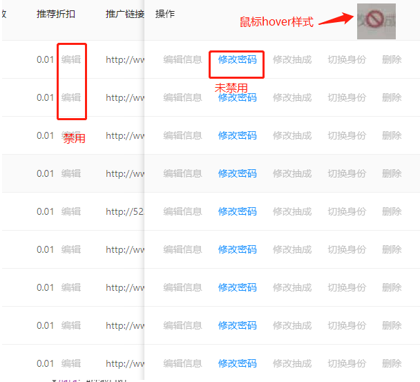
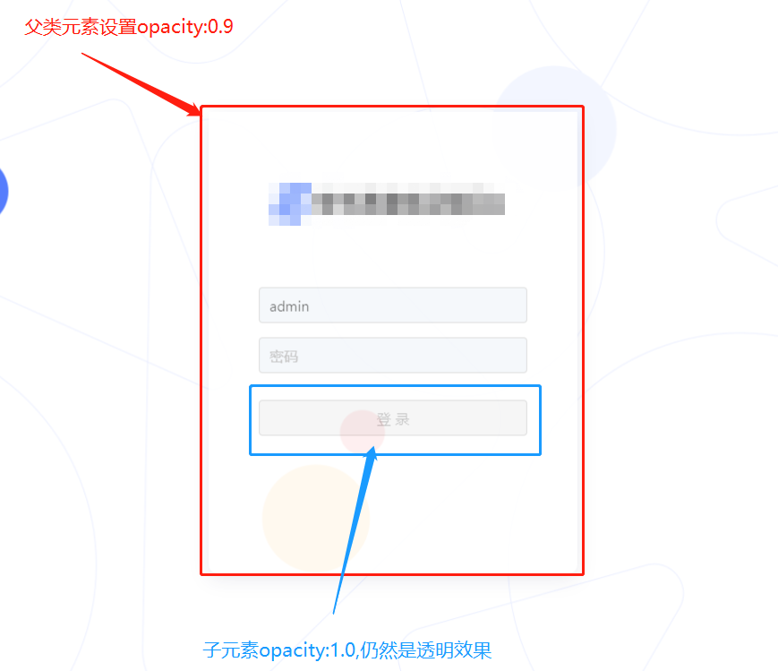
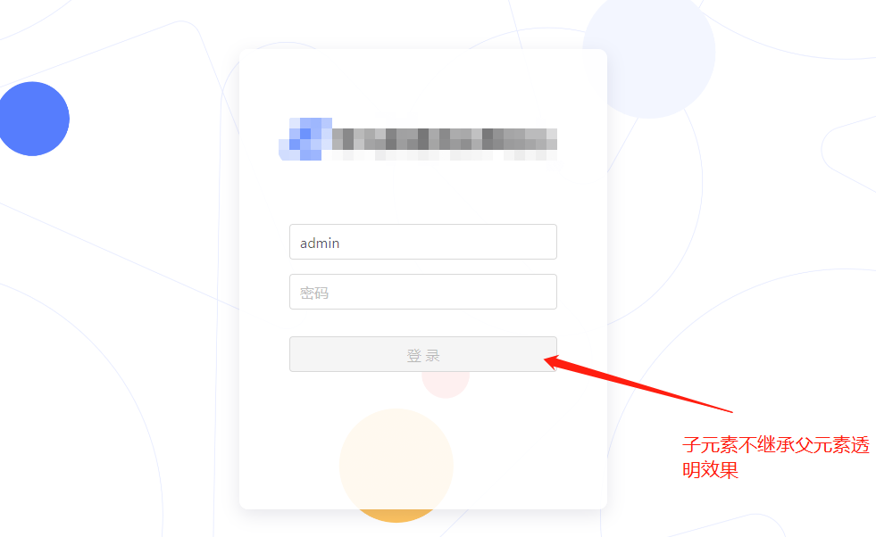

>本人[笔记地址](https://gitee.com/hongjilin/hongs-study-notes)

# #目录

>[TOC]

# 一、知识点详解

## Ⅰ-css3 `pointer-events`

>此属性会阻止hover、active、onclick等触发事件
>
>1. ###### `pointer-events `更像是JavaScript，它能够：
>
>   - 阻止用户的点击动作产生任何效果
>   - 阻止缺省鼠标指针的显示
>   - 阻止CSS里的 `hover `和 `active `状态的变化触发事件
>   - 阻止JavaScript点击动作触发的事件
>
>2. ###### 具体用法：
>
>   ```css
>   pointer-events:  auto | none | visiblePainted | visibleFill | visibleStroke | visible | painted | fill | stroke | all | inherit
>   ```
>
>   > pointer-events属性有很多值，但是对于浏览器来说，`只有auto和none两个值可用`，其它的几个是针对SVG的(本身这个属性就来自于SVG技术)。
>
>3. ###### pointer-events属性值详解
>
>   - auto——效果和没有定义pointer-events属性相同，鼠标不会穿透当前层。在SVG中，该值和visiblePainted的效果相同。
>   - none——元素不再是鼠标事件的目标，鼠标不再监听当前层而去监听下面的层中的元素。但是如果它的子元素设置了pointer-events为其它值，比如auto，鼠标还是会监听这个子元素的。
>   - 其它属性值为SVG专用，这里不再多介绍了。

# 二、实际问题解决

## Ⅰ-图片不拉伸属性 ` object-fit`

```css
   width: 100%;
        height: 100%;
        object-fit: cover;
```

## Ⅱ-css鼠标点击的五种状态

```css
  1、a:link{color:#fff}  未访问时的状态（鼠标点击前显示的状态）
  2、a:hover{color:#fff}  鼠标悬停时的状态
  3、a:visited{color:#fff}  已访问过的状态（鼠标点击后的状态）
  4、a:active{color:#fff}  鼠标点击时的状态
  5、a:focus{color:#fff}  点击后鼠标移开保持鼠标点击时的状态（只有在<a href="#"></a>时标签中有效）
```

## Ⅲ-阴影效果

```css
box-shadow:2px 2px 5px #000; 	//正常
box-shadow:inset 2px 2px 5px #000; //内阴影
box-shadow:0px 0px 5px 10px #000;//拓展阴影长度
box-shadow:0px 0px 0px 3px #bb0a0a,
           0px 0px 0px 6px #2e56bf,
           0px 0px 0px 9px #ea982e;//多重阴影
```

> 逼真的阴影效果示例

```css
<div class="box11 shadow"></div>
/********************************************/
.box11 {
	width: 300px;
	height: 100px;
	background: #ccc;
	border-radius: 10px;
	margin: 10px;
}

.shadow {
	position: relative;
	max-width: 270px;
	box-shadow: 0px 1px 4px rgba(0,0,0,0.3),
				0px 0px 20px rgba(0,0,0,0.1) inset;
}

.shadow::before,
.shadow::after {
   content:"";
   position:absolute;
   z-index:-1;
}

.shadow::before,
.shadow::after {
   content:"";
   position:absolute;
   z-index:-1;
   bottom:15px;
   left:10px;
   width:50%;
   height:20%;
}

.shadow::before,
.shadow::after {
   content:"";
   position:absolute;
   z-index:-1;
   bottom:15px;
   left:10px;
   width:50%;
   height:20%;
   box-shadow:0 15px 10px rgba(0, 0, 0, 0.7);
   transform:rotate(-3deg);
}

.shadow::after{
   right:10px;
   left:auto;
   transform:rotate(3deg);
 }
```

## Ⅳ-实现a标签禁用

>1. 需求分析:业务中遇到一个需求-根据当前数据类别进行权限限制,当我为新用户数据时,开放编辑操作,当我为旧用户数据时,禁用编辑操作
>
>2. 代码:
>
>     1. css代码:
>
>   ```scss
>   /**设置a标签禁用
>   */
>   a.disabled {
>     pointer-events: none;
>     filter: alpha(opacity=50);
>     /*IE滤镜，透明度50%*/
>     -moz-opacity: 0.5;
>     /*Firefox私有，透明度50%*/
>     opacity: 0.5;
>     /*其他，透明度50%*/
>     color: gray;
>
>   }
>
>   //因为pointer-events会阻止hover事件,所以在外层进行判断,同时变为行内元素
>   .disabledbox {
>     display: inline-block
>   }
>   .combox {
>     display: inline-block
>   }
>   .disabledbox:hover {
>     cursor: not-allowed;
>   }
>
>   ```
>
>     1. html部分调用代码--示例中是在:antd中table组件中试用
>
>   ```jsx
>   //新旧渠道商标识
>   const CHANNELBZ = {
>     OLD: 0,
>     NEW: 1
>   } 
>   ....
>   {
>       title: '推荐折扣',
>       dataIndex: 'discount',
>       width: 100,
>       render: (value, item) => (
>         <div>
>           <span>{value}</span>
>           <div className={item.sourceType == CHANNELBZ.OLD ? style.disabledbox : style.combox}>
>             <a
>               className={item.sourceType == CHANNELBZ.OLD ? style.disabled : ""}
>               style={{ marginLeft: 10 }}
>               onClick={() => {
>                 console.log(item.sourceType, "itemmmmmm")
>               }}
>             >
>               编辑
>           </a>
>           </div>
>         </div>
>       ),
>     },
>   ```
>
>  3. 效果实现截图:
>
>     
>
>

## Ⅴ-实现父元素半透明，子元素不透明

>CSS实现父元素半透明，子元素不透明。 很久以来大家都习惯使用opacity:0.5在新式浏览器里实现半透明，而对IE较旧的版本使用filter:Alpha(opacity=0.5)的滤镜来实现半透明。但是这样实现的半透明有个问题，那就是这个属性会被子元素所继承。
>
>如下代码，则子元素中也将是半透明效果，无论你将子元素的半透明值重置还是如何都不会改变这一情况。
>
>```css
>.parent{opacity:0.9; background-color:#fff;}
>.child{opacity:1.0; background-color:#fff; height:200px;}
>```
>
>1. 问题效果
>
> 
>
>2. 解决:其实在新的CSS3规则里面的属性 GRBA已经可以方便的实现父元素透明，而子元素不透明了。
>
>   ```css
>   //使用背景色透明可以限制子类不继承,防止下方按钮也变得半透明
>     background:rgba(255,255,255,0.9) ;
>   ```
>
>    

