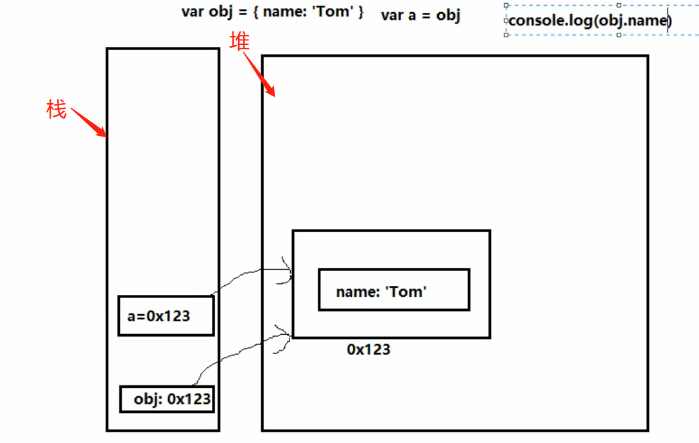

# #说明

> 此笔记为JavaScript进阶学习笔记,会对之前javaScript基础做一次梳理,并进行对于其进阶知识进行学习与记录
>
> 借阅以及参照学习资料:印记中文的[`现在JavaScript教程`](https://zh.javascript.info/)、B站尚硅谷的[`尚硅谷JavaScript高级教程(javascript实战进阶)`](https://www.bilibili.com/video/BV14s411E7qf?share_source=copy_web)
>
> 此笔记为实习工作半年后发觉之前学习JavaScript不够系统全面,或者说当初只是囫囵吞枣,首先并没有系统学习javaScript,其次没有较为深入的学习进阶知识,只是知道`怎么做,而不知道为什么`(当然这也符合本人学习节奏,先`know how`再`know why`)
>
> 本人[全部笔记地址分享](https://gitee.com/hongjilin/hongs-study-notes),亦是持续更新笔记
>
> ​											                     		--始于2021年7月 `更新中`~~

# #目录

>[TOC]

# 一、javaScript基础总结

> 基础部分可以看本人`javaScript初学笔记`

## 1、数据类型相关知识点

### Ⅰ-基本(值)类型

>1. String: 任意字符串
>2. Number: 任意的数字
>3. boolean: true/false
>4. undefined: undefined
>5. null: null  -->使用`typeof`时返回`object`

### Ⅱ-对象(引用)类型

>1. Object: 任意对象
>2. Function: 一种特别的`对象`(可以执行)  --内部包含可运行的代码
>3. Array: 一种特别的`对象`(`key`为数值下标属性, 内部数据是有序的)

### Ⅲ-判断方法

#### ①*` typeof`*

>**`typeof`** 操作符返回一个`字符串`，表示未经计算的操作数的类型。
>
>* 可以判断: undefined/ 数值 / 字符串 / 布尔值 / function
>
>* 不能判断: null与object  object与array
>
>* `注意`: 运行`console.log(typeof undefined)`时,得到的的也是一个`字符串,同时为小写!!`--> `'undefined'`
>
>* 代码示例
>
>  ```js
>    // typeof返回数据类型的字符串表达
>    var a
>    
>    //注意:typeof返回的是字符串
>    console.log(a, typeof a, typeof a==='undefined',a===undefined )  // undefined 'undefined' true true
>    console.log(undefined === 'undefined') //false
>    a = 4
>    console.log(typeof a==='number') //true
>    a = 'hongjilin'
>    console.log(typeof a==='string') //true
>    console.log(typeof a==='String') //false  -->注意,返回的类型为小写
>    a = true
>    console.log(typeof a==='boolean') //true
>    a = null
>    console.log(typeof a, a===null) // 'object'  true
>   let b={}
>    console.log(typeof b,typeof null, '-------') // 'object' 'object'  -->所以Typeof不能判断null与object
>  ```

#### ②*`instanceof`*(判断实例方法)

>- `专门判断对象`的具体类型
>
>- **`instanceof`** **运算符**用于检测构造函数的 `prototype` 属性是否出现在某个实例对象的原型链上。
>
>- 代码示例:
>
>  ```js
>    var b1 = {
>      b2: [1, 'abc', console.log],
>   //可以简化成 b3:()=>()=> 'hongjilin'  -->高阶函数相关知识
>      b3: function () {
>        return  () =>{  return   'hongjilin'}
>      }
>    }
>   /**使用instanceof进行对象判断*/
>    console.log(b1 instanceof Object, b1 instanceof Array) // true  false
>    console.log(b1.b2 instanceof Array, b1.b2 instanceof Object) // true true
>    console.log(b1.b3 instanceof Function, b1.b3 instanceof Object) // true true
>  
>    /**使用typeof进行对象中某属性的判断*/
>   console.log(typeof b1.b2, typeof null) // 'object' 'object'  
>    console.log(typeof b1.b3==='function') // true
>    console.log(typeof b1.b2[2]==='function') //true
>  
>    /**调用对象与数组中某函数示例*/
>    b1.b2[2]('调用console.log打印hongjilin')    //调用console.log打印hongjilin
>    console.log(b1.b3()()) // hongjilin
>  ```

#### ③*`===`*

>具体可以看 MDN的[JavaScript中的相等性判断](https://developer.mozilla.org/zh-CN/docs/Web/JavaScript/Equality_comparisons_and_sameness)
>
>可以判断: undefined, null
>
>简而言之，在比较两件事情时，`双等号将执行类型转换`;` 三等号将进行相同的比较，而不进行类型转换` (如果类型不同, 只是总会返回 false )

### Ⅳ-undefined与null的区别?

>* undefined代表定义未赋值
>
>* nulll定义并赋值了, 只是值为null
>
>* 代码示例
>
>  ```js
>    var a
>    console.log(a)  // undefined
>    a = null
>    console.log(a) // null
>  ```

### Ⅴ-什么时候给变量赋值为null呢?

>* 初始赋值, 表明将要赋值为对象,`可以用做约定俗成的占位符`
>
>* 结束前, 让对象成为垃圾对象(被垃圾回收器回收)
>
>* 代码示例
>
>  ```js
>    //起始,可以用做约定俗成的占位符
>    var b = null  // 初始赋值为null, 表明将要赋值为对象
>    //确定对象就赋值
>    b = ['atguigu', 12]
>    //最后在不使用的时候,将其引用置空,就可以释放b这个对象占用的内存      ---当没有引用指向它的对象称为垃圾对象
>    b = null // 让b指向的对象成为垃圾对象(被垃圾回收器回收)
>  ```

### Ⅵ-严格区别变量类型与数据类型?

>* 数据的类型
>  * 基本类型
>  * 对象类型
>* 变量的类型(变量内存值的类型)
>  * 基本类型: 保存就是`基本类型`的数据
>  * 引用类型: 保存的是地址值(对象类型)


## 2、数据,变量, 内存的理解

### Ⅰ-什么是数据?

>1. 存储在内存中代表特定信息的'东西', 本质上是0101...
>2. 数据的特点: `可传递`, `可运算`    -->let a=0;b=a 🔜体现可传递
>3. 一切皆数据
>4. 内存中所有操作的目标: 数据
>  * 算术运算
>  * 逻辑运算
>  * 赋值
>  * 运行函数

### Ⅱ-什么是内存?

>1. 内存条通电后产生的可储存数据的空间(临时的)
>
>    
>
>2. 内存产生和死亡: 内存条(电路版)==>通电==>产生内存空间==>存储数据==>处理数据==>断电==>内存空间和数据都消失
>
>3. 一块小内存的2个数据
>   * 内部存储的数据
>   * 地址值
>
>4. 内存分类
>  * 栈: 全局变量/局部变量
>  * 堆: 对象
>  *   

### Ⅲ-什么是变量?

>* 可变化的量, 由变量名和变量值组成
>* 每个变量都对应的一块小内存, 变量名用来查找对应的内存, 变量值就是内存中保存的数据
>
>ps:变量`obj.xx`-->`.`相当于拿着地址找到后面对应的内存,所以只有当我变量中存的是地址,才可以用`.`

### Ⅳ-内存,数据, 变量三者之间的关系

>* 内存用来存储数据的空间
>* 变量是内存的标识

