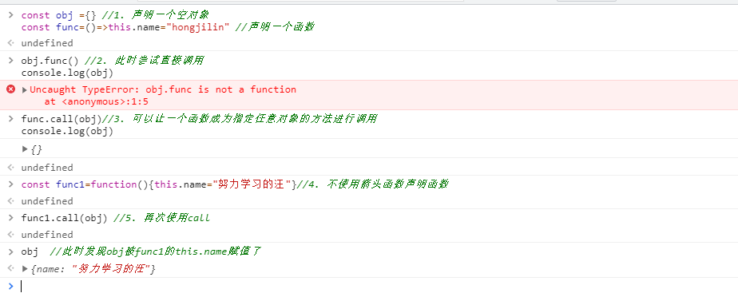
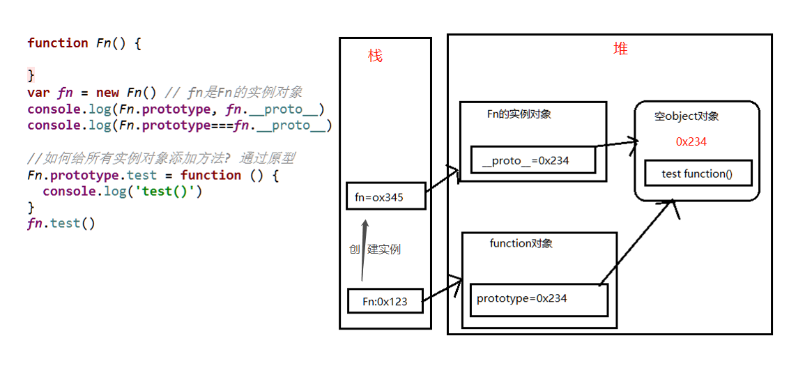
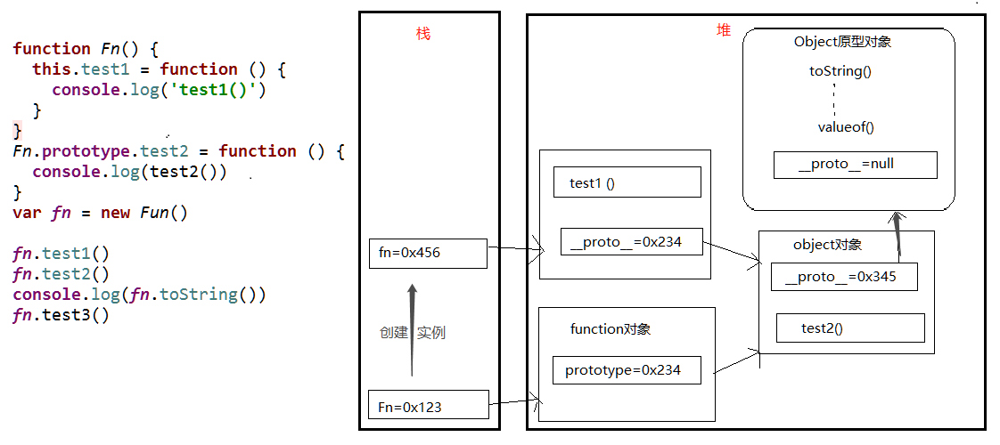
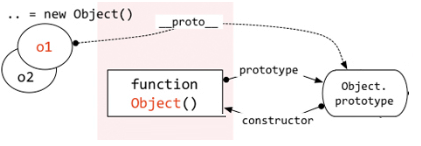
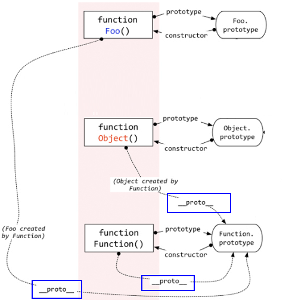

# #说明

> 此笔记为JavaScript进阶学习笔记,会对之前javaScript基础做一次梳理,并进行对于其进阶知识进行学习与记录
>
> 借阅以及参照学习资料:B站尚硅谷的[`尚硅谷JavaScript高级教程(javascript实战进阶)`](https://www.bilibili.com/video/BV14s411E7qf?share_source=copy_web);印记中文的[`现在JavaScript教程`](https://zh.javascript.info/)、
>
> 此笔记为实习工作半年后发觉之前学习JavaScript不够系统全面,或者说当初只是囫囵吞枣,首先并没有系统学习javaScript,其次没有较为深入的学习进阶知识,只是知道`怎么做,而不知道为什么`(当然这也符合本人学习节奏,先`know how`再`know why`)
>
> 本人[全部笔记地址分享](https://gitee.com/hongjilin/hongs-study-notes),亦是持续更新笔记
>
> ​											                     		--始于2021年7月 `更新中`~~

# #目录

>[TOC]

# 一、javaScript基础总结

> 基础部分可以看本人`javaScript初学笔记`

## 1、数据类型相关知识点

### Ⅰ-基本(值)类型

>1. String: 任意字符串
>2. Number: 任意的数字
>3. boolean: true/false
>4. undefined: undefined
>5. null: null  -->使用`typeof`时返回`object`

### Ⅱ-对象(引用)类型

>1. Object: 任意对象
>2. Function: 一种特别的`对象`(可以执行)  --内部包含可运行的代码
>3. Array: 一种特别的`对象`(`key`为数值下标属性, 内部数据是有序的)

### Ⅲ-判断方法

#### ①*` typeof`*

>**`typeof`** 操作符返回一个`字符串`，表示未经计算的操作数的类型。
>
>* 可以判断: undefined/ 数值 / 字符串 / 布尔值 / function
>
>* 不能判断: null与object  object与array
>
>* `注意`: 运行`console.log(typeof undefined)`时,得到的的也是一个`字符串,同时为小写!!`--> `'undefined'`
>
>* 代码示例
>
>  ```js
>    // typeof返回数据类型的字符串表达
>    var a
>    
>    //注意:typeof返回的是字符串
>    console.log(a, typeof a, typeof a==='undefined',a===undefined )  // undefined 'undefined' true true
>    console.log(undefined === 'undefined') //false
>    a = 4
>    console.log(typeof a==='number') //true
>    a = 'hongjilin'
>    console.log(typeof a==='string') //true
>    console.log(typeof a==='String') //false  -->注意,返回的类型为小写
>    a = true
>    console.log(typeof a==='boolean') //true
>    a = null
>    console.log(typeof a, a===null) // 'object'  true
>   let b={}
>    console.log(typeof b,typeof null, '-------') // 'object' 'object'  -->所以Typeof不能判断null与object
>  ```

#### ②*`instanceof`*(判断实例方法)

>- `专门判断对象`的具体类型
>
>- **`instanceof`** **运算符**用于检测构造函数的 `prototype` 属性是否出现在某个实例对象的原型链上。
>
>- 代码示例:
>
>  ```js
>    var b1 = {
>      b2: [1, 'abc', console.log],
>   //可以简化成 b3:()=>()=> 'hongjilin'  -->高阶函数相关知识
>      b3: function () {
>        return  () =>{  return   'hongjilin'}
>      }
>    }
>   /**使用instanceof进行对象判断*/
>    console.log(b1 instanceof Object, b1 instanceof Array) // true  false
>    console.log(b1.b2 instanceof Array, b1.b2 instanceof Object) // true true
>    console.log(b1.b3 instanceof Function, b1.b3 instanceof Object) // true true
>  
>    /**使用typeof进行对象中某属性的判断*/
>   console.log(typeof b1.b2, typeof null) // 'object' 'object'  
>    console.log(typeof b1.b3==='function') // true
>    console.log(typeof b1.b2[2]==='function') //true
>  
>    /**调用对象与数组中某函数示例*/
>    b1.b2[2]('调用console.log打印hongjilin')    //调用console.log打印hongjilin
>    console.log(b1.b3()()) // hongjilin
>  ```

#### ③*`===`*

>具体可以看 MDN的[JavaScript中的相等性判断](https://developer.mozilla.org/zh-CN/docs/Web/JavaScript/Equality_comparisons_and_sameness)
>
>可以判断: undefined, null
>
>简而言之，在比较两件事情时，`双等号将执行类型转换`;` 三等号将进行相同的比较，而不进行类型转换` (如果类型不同, 只是总会返回 false )

### Ⅳ-相关问题引出

#### ① *undefined与null的区别?*

>* undefined代表定义未赋值
>
>* nulll定义并赋值了, 只是值为null
>
>* 代码示例
>
>  ```js
>    var a
>    console.log(a)  // undefined
>    a = null
>    console.log(a) // null
>  ```

#### ② *什么时候给变量赋值为null呢?*

>* 初始赋值, 表明将要赋值为对象,`可以用做约定俗成的占位符`
>
>* 结束前, 让对象成为垃圾对象(被垃圾回收器回收)
>
>* 代码示例
>
>  ```js
>    //起始,可以用做约定俗成的占位符
>    var b = null  // 初始赋值为null, 表明将要赋值为对象
>    //确定对象就赋值
>    b = ['atguigu', 12]
>    //最后在不使用的时候,将其引用置空,就可以释放b这个对象占用的内存      ---当没有引用指向它的对象称为垃圾对象
>    b = null // 让b指向的对象成为垃圾对象(被垃圾回收器回收)
>  ```

#### ③ *严格区别变量类型与数据类型?*

>* 数据的类型
>  * 基本类型
>  * 对象类型
>* 变量的类型(变量内存值的类型)
>  * 基本类型: 保存就是`基本类型`的数据
>  * 引用类型: 保存的是地址值(对象类型)

### Ⅴ-补充知识点:

#### ①符串对比*`>`、`<`*以及*`charCodeAt()`*方法

>1. Javascript字符串在进行大于(小于)比较时，会根据第一个不同的字符的ascii值码进行比较，当数字(number)与字符串(string)进行比较大小时，会强制的将数字(number)转换成字符串(string)然后再进行比较
>
>   ```js
>   (function(){
>       console.log('13'>'3'); // 输出：false
>       console.log(5>'6');  // 输出： false
>       console.log('d'>'ABDC') // 输出： true
>       console.log(19>'ssf') // 输出 false
>       console.log('A'>'abcdef') // 输出 false
>   })()
>   ```
>
>2. 手动转换为ascii后相减,用正负数表示大小
>
>   ```tsx
>   sorter={(a:string,b:string)=> a.charCodeAt()-b.charCodeAt()}
>   ```


## 2、数据,变量, 内存的理解

### Ⅰ-什么是数据?

>1. 存储在内存中代表特定信息的'东西', 本质上是0101...
>2. 数据的特点: `可传递`, `可运算`    -->let a=0;b=a 🔜体现可传递
>3. 一切皆数据
>4. 内存中所有操作的目标: 数据
>  * 算术运算
>  * 逻辑运算
>  * 赋值
>  * 运行函数

### Ⅱ-什么是内存?

>1. 内存条通电后产生的可储存数据的空间(临时的)
>
>    
>
>2. 内存产生和死亡: 内存条(电路版)==>通电==>产生内存空间==>存储数据==>处理数据==>断电==>内存空间和数据都消失
>
>3. 一块小内存的2个数据
>   * 内部存储的数据
>   * 地址值
>
>4. 内存分类
>  * 栈: 全局变量/局部变量
>  * 堆: 对象
>  *   

### Ⅲ-什么是变量?

>* 可变化的量, 由变量名和变量值组成
>* 每个变量都对应的一块小内存, 变量名用来查找对应的内存, 变量值就是内存中保存的数据
>
>ps:变量`obj.xx`-->`.`相当于拿着地址找到后面对应的内存,所以只有当我变量中存的是地址,才可以用`.`

### Ⅳ-内存,数据, 变量三者之间的关系

>* 内存用来存储数据的空间
>* 变量是内存的标识

### Ⅴ-相关问题引出

#### ① *关于赋值和内存的问题*

>let a = xxx, a内存中到底保存的是什么?
>
>* xxx是基本数据, 保存的就是这个数据
>* xxx是对象, 保存的是对象的地址值
>* xxx是一个变量, 保存的xxx的内存内容(可能是基本数据, 也可能是地址值)

#### ② *关于引用变量赋值问题*

>* 2个引用变量指向同一个对象, 通过一个变量修改对象内部数据, 另一个变量看到的是修改之后的数据
>
>* 2个引用变量指向同一个对象, 让其中一个引用变量指向另一个对象, 另一引用变量依然指向前一个对象
>
>* 代码示例:
>
>  ```js
>    let a = {age: 12}
>  //此时是将a指向的地址值赋值给B,所以B此时也指向{age:12}这个内存
>    let b = a
>  //此时重新创建了一个内存并让a指向它,所以此处a指向的是{name:'hong'},而b指向仍是刚开始的指向{age:12}
>    a = {name: 'hong'}
>  //此时a与b指向的内存已经不一样了,所以修改互不影响
>    b.age = 14
>    console.log(b.age, a.name, a.age) // 14 hong undefined
>    //此时其实已经重新创建了一个内存{age:15},并且将其地址赋值覆盖给a
>  //实际上传进来的obj也是拿着其key对应的地址值找内存,此时
>    const fn2=(obj) => obj = {age: 15}
>    fn2(a)
>    console.log(a.age) //15
>  ```

#### ③ *在js调用函数时传递变量参数时, 是值传递还是引用传递*

>* 理解1: 都是值(基本/地址值)传递
>
>  * 所以实际上传进function中的参数也是拿着其存着的地址值找内存
>
>    ```js
>    //传进来的obj存储的是a中存的地址值,所以obj==a(因为他们地址值一致,指向一致)
>      let a = {name: 'hong'}
>      const fn2=(obj) => obj = {age: 15}
>      fn2(a)
>      console.log(a.age) //15
>    ```
>
>* 理解2: 可能是值传递, 也可能是引用传递(地址值)

#### ④ *JS引擎如何管理内存?*

>1. 内存生命周期
>  * 分配小内存空间, 得到它的使用权
>  * 存储数据, 可以反复进行操作
>  * 释放小内存空间
>2. 释放内存
>  * 局部变量: 函数执行完自动释放
>  * 对象: 成为垃圾对象==>垃圾回收器回收
>
>```js
>  var a = 3
>  var obj = {name:"hong"}
>  obj = undefined ||null  //此时,obj没有被释放,但是之前声明的`{name:"hong"}`由于没有人指向它,会在后面你某个时刻被垃圾回收器回收
> 
>function fn () { var b = {}}
>  fn() // b是自动释放, b所指向的对象是在后面的某个时刻由垃圾回收器回收
>```

## 3、对象

### Ⅰ-对象的概念

#### ① *什么是对象?*

>* 多个数据的封装体
>* 用来保存多个数据的容器
>* 一个对象代表现实中的一个事物

#### ② *为什么要用对象?*

>* 统一管理多个数据

#### ③ *对象的组成*

>* 属性: 属性名(字符串)和属性值(任意)组成
>* 方法: 一种特别的属性(属性值是函数)

### Ⅱ-如何访问对象内部数据?

>* `.属性名`: 编码简单, 有时不能用
>* `['属性名']`: 编码麻烦, 能通用

### Ⅲ-什么时候必须使用`['属性名']`的方式?

>1. 属性名包含特殊字符: `-` `空格`
>2. 属性名不确定
>
>```js
>  var p = {}
>  //1. 给p对象添加一个属性: content type: text/json
>  // p.content-type = 'text/json' //不能用
>  p['content-type'] = 'text/json'
>  console.log(p['content-type'])
>
>  //2. 属性名不确定
>  var propName = 'myAge'
>  var value = 18
>  // p.propName = value //不能用
>  p[propName] = value
>  console.log(p[propName])
>```

## 4、函数

### Ⅰ-函数的概念

#### ① *什么是函数*

>  * 实现特定功能的n条语句的封装体
>  * 只有函数是可以执行的, 其它类型的数据不能执行

#### ② *为什么要用函数?*

>* 提高代码复用
>* 便于阅读交流

#### ③ *如何定义函数?*

>* 函数声明
>
>* 表达式
>
>  ```js
>    function fn1 () { console.log('fn1()' )//函数声明
>                     
>    const fn2 = ()=> console.log('fn2()')  //表达式
>  ```

### Ⅱ-如何调用(执行)函数

>1. test(): 直接调用
>
>2. obj.test(): 通过对象调用
>
>3. new test(): new调用
>
>4. `test.call/apply(obj)`: 临时让test成为obj的方法进行调用
>
>   *   
>
>5. 代码示例
>
>   ```js
>     var obj = {}
>     //此处不能使用箭头函数,因为箭头函数会改变this指向
>     function test2 () {
>       this.xxx = 'hongjilin'
>     }
>     // obj.test2()  不能直接, 根本就没有
>     test2.call(obj)  // 可以让一个函数成为指定任意对象的方法进行调用
>     console.log(obj.xxx)
>   
>   ```

### Ⅲ-回调函数

#### ① *什么函数才是回调函数?*

>- 你定义的
>- 你没有调
>- 但最终它执行了(在某个时刻或某个条件下)

#### ② *常见的回调函数?*

>* dom事件回调函数 ==>发生事件的dom元素
>* 定时器回调函数 ===>window
>* ajax请求回调函数(后面讲)
>* 生命周期回调函数(后面讲)
>
>```js
>   // dom事件回调函数
>  document.getElementById('btn').onclick = function () {alert(this.innerHTML)}
>  // 定时器回调函数
>  setTimeout(function () {   alert('到点了'+this)}, 2000)
>```

### Ⅳ-IIFE (自调用函数)

>1. 全称: `Immediately-Invoked Function Expression` 自调用函数
>
>2. 作用:
>
>     * 隐藏实现
>     * 不会污染外部(一般指全局)命名空间
>     * 用它来编码js模块
>
>3. 代码示例
>
>   ```js
>     (function () { //匿名函数自调用
>       var a = 3
>       console.log(a + 3)
>     })()
>     console.log(a) // a is not defined
>   
>     //此处前方为何要一个`;`-->因为自调用函数外部有一个()包裹,可能与前方以()结尾的代码被一起认为是函数调用
>     //不加分号可能会被认为这样 console.log(a)(IIFE)
>     ;(function () {//不会污染外部(全局)命名空间-->举例
>       let a = 1;
>       function test () { console.log(++a) } //声明一个局部函数test
>       window.$ = function () {  return {test: test} }// 向外暴露一个全局函数
>     })()
>    test ()  //test is not defined
>     $().test() // 1. $是一个函数 2. $执行后返回的是一个对象
>   ```

### Ⅴ-函数中的this

#### ① *this是什么?*

>* 任何函数本质上都是通过某个对象来调用的,如果没有直接指定就是window
>* 所有函数内部都有一个变量this
>* 它的值是`调用函数的当前对象`

#### ② *如何确定this的值?*

>* test(): window
>* p.test(): p
>* new test(): 新创建的对象
>* p.call(obj): obj

#### ③ *代码举例详解*

>```js
>  function Person(color) {
>    console.log(this)
>    this.color = color;
>    this.getColor = function () {
>      console.log(this)
>      return this.color;
>    };
>    this.setColor = function (color) {
>      console.log(this)
>      this.color = color;
>    };
>  }
>
>  Person("red"); //this是谁? window
>
>  const p = new Person("yello"); //this是谁? p
>
>  p.getColor(); //this是谁? p
>
>  const obj = {};
>  //调用call会改变this指向-->让我的p函数成为`obj`的临时方法进行调用
>  p.setColor.call(obj, "black"); //this是谁? obj
>
>  const test = p.setColor;
>  test(); //this是谁? window  -->因为直接调用了
>
>  function fun1() {
>    function fun2() {  console.log(this); }
>    fun2(); //this是谁? window
>  }
> fun1();//调用fun1
>```

## 5、关于语句分号

>1. js一条语句的后面可以不加分号
>2. 是否加分号是编码风格问题, 没有应该不应该，只有你自己喜欢不喜欢
>3. 在下面2种情况下不加分号会有问题
>  * `小括号开头的前一条语句`
>  * `中方括号开头的前一条语句`
>4. 解决办法: 在行首加分号
>5. 强有力的例子: vue.js库
>6. 知乎热议: https://www.zhihu.com/question/20298345

------


# 二、函数高级

## 1、原型与原型链

### Ⅰ-原型 [prototype]

>1. 函数的`prototype`属性
>  * 每个函数都有一个prototype属性, 它默认指向一个Object空对象(即称为: 原型对象)
>  * 原型对象中有一个属性constructor, 它指向函数对象
>  * 
>2. 给原型对象添加属性(`一般都是方法`)
>  * 作用: 函数的所有实例对象自动拥有原型中的属性(方法)
>
>3. 代码示例
>
>   ```js
>   
>     // 每个函数都有一个prototype属性, 它默认指向一个Object空对象(即称为: 原型对象)
>     console.log(Date.prototype, typeof Date.prototype)
>     function Fun () { }
>     console.log(Fun.prototype)  // 默认指向一个Object空对象(没有我们的属性)
>   
>     // 原型对象中有一个属性constructor, 它指向函数对象
>     console.log(Date.prototype.constructor===Date)
>     console.log(Fun.prototype.constructor===Fun)
>   
>     //给原型对象添加属性(一般是方法) ===>实例对象可以访问
>     Fun.prototype.test = function () { console.log('test()') }
>     var fun = new Fun()
>     fun.test()
>   ```

### Ⅱ-显式原型与隐式原型

>1. 每个函数function都有一个`prototype`，即`显式`原型(属性)
>
>2. 每个实例对象都有一个[`__ proto __`]，可称为`隐式`原型(属性)
>
>3. 对象的隐式原型的值为其对应构造函数的显式原型的值
>
>4. 内存结构
>
>    
>
>5. 总结:
>  * 函数的[`prototype`]属性: 在定义函数时自动添加的, 默认值是一个空Object对象
>  * 对象的[`__ proto __`]属性: 创建对象时自动添加的, `默认值为构造函数的prototype属性值`
>  * 程序员能直接操作显式原型, 但不能直接操作隐式原型(ES6之前)
>
>6. 代码示例:
>
>   ```js
>     //定义构造函数
>     function Fn() {
>      // 内部默认执行语句: this.prototype = {}
>       }
>     // 1. 每个函数function都有一个prototype，即显式原型属性, 默认指向一个空的Object对象
>     console.log(Fn.prototype)
>     // 2. 每个实例对象都有一个__proto__，可称为隐式原型
>     //创建实例对象
>     var fn = new Fn()  // 内部默认执行语句: this.__proto__ = Fn.prototype
>     console.log(fn.__proto__)
>     // 3. 对象的隐式原型的值为其对应构造函数的显式原型的值
>     console.log(Fn.prototype===fn.__proto__) // true
>     //给原型添加方法
>     Fn.prototype.test = function () {
>       console.log('test()')
>     }
>     //通过实例调用原型的方法
>     fn.test()
>   ```


### Ⅲ-原型链

#### ① *原型链*

>1. 原型链
>  * 访问一个对象的属性时，
>    * 先在自身属性中查找，找到返回
>    * 如果没有, 再沿着[`__ proto __`]这条链向上查找, 找到返回
>    * 如果最终没找到, 返回undefined
>    * 
>  * 别名: 隐式原型链
>  * 作用: 查找对象的属性(方法) 

#### ②*构造函数/原型/实例对象的关系(图解)*

>1. ```js
>   var o1 = new Object();
>   var o2 = {};
>   ```
>
>    
>
>2. ```js
>   function Foo(){  }
>   ```
>
>    
>
>    ps:所有函数的[`__ proto __`]都是一样的


