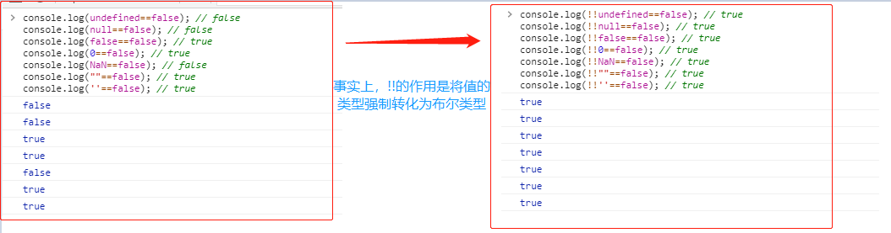

# #说明

>之前在别人代码中看到有人使用`!!`的写法进行判断,当时觉得挺不解的,感觉明明`!`以及原来变量不就已经可以进行boolean判断了吗
>
>但后来才发现不是这样的
>
>本人[全部笔记地址](https://gitee.com/hongjilin/hongs-study-notes)


# JavaScript中为什么需要 `!!` ？

## 1、了解布尔值为 `false`的值

>首先你要知道在JavaScript中，布尔值为 `false`的值有如下几个：
>
>- `undefined`
>- `null`
>- `false`
>- `0`
>- `NaN`
>- `""`或`''`（空字符串）
>
>这样才能知道更好的理解这个用法

## 2、`!!`的作用

>`!!`的作用是将值的类型强制转化为布尔类型。
>
>
>
>可以发现 `undefined==false`、`null==false`和 `NaN==false`的值均为 `false`，如果加上 `!!`，就都相等了

## 3、使用场景举例

### Ⅰ-`if`语句中使用

>首先,我们要知道`if`语句的条件表达式会执行**隐式类型转换**。
>
>```js
>var let = 0;
>if(b) console.log('true');
>else console.log('false'); // 执行这行代码
>
>if(b&&true) console.log('true');
>else console.log('false'); // 执行这行代码
>
>if(!!b&&true) console.log('true');
>else console.log('false'); // 执行这行代码
>```
>
>所以发现并无任何影响,也证明了if其实已经默认转换了,我们是否增加`!!`并没有任何影响
>
>这也是当初我当初觉得没用的原因了

### Ⅱ-返回值强制转换

>```ts
>const test=value=> value && true;
>console.log(test(0)); // 0
>
>const test=value=> !!value && true;
>console.log(test(0)); // false
>```
>
>可以看到，`!!`把 `value`强制转化为布尔值。


