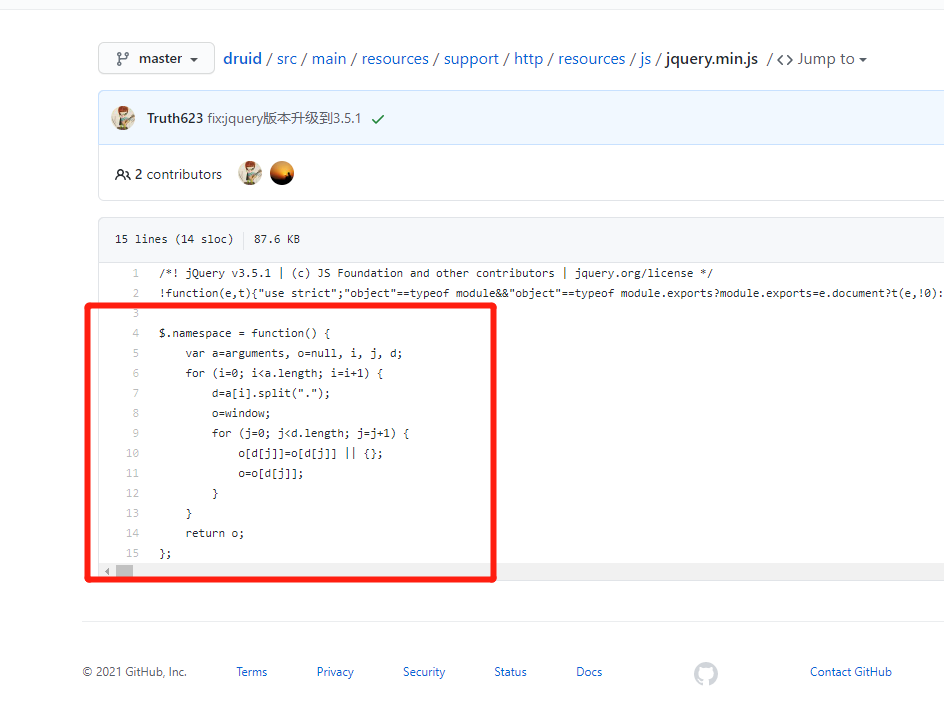
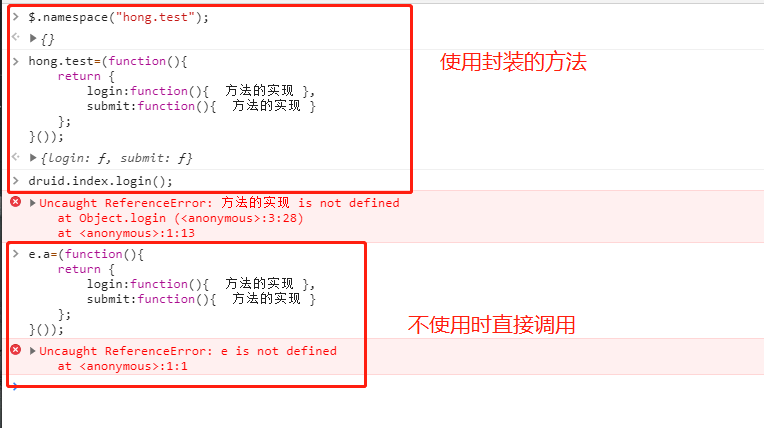

# #说明

>本人[全部笔记地址](https://gitee.com/hongjilin/hongs-study-notes)
>
>此部分查阅网上简书上的`ifcode`、博客园的`一抹夏忧`、博客园的`digdeep`、脚本之家的`计算机-小白`等包括但不限此的资料,结合自己理解以及实际代码示例整理而成

# #目录

>[TOC]

# JS命名空间（namespace）

>1. 命名空间namespace（某些语言中叫package），是一个在静态语言中常见的概念。它可以帮助我们更好地整理代码，并可避免命名冲突。
>
>2. 如果使用[`ES6的模块`](https://gitee.com/hongjilin/hongs-study-notes/tree/master/%E7%BC%96%E7%A8%8B_%E5%89%8D%E7%AB%AF%E5%BC%80%E5%8F%91%E5%AD%A6%E4%B9%A0%E7%AC%94%E8%AE%B0/ES6%E5%AD%A6%E4%B9%A0%E8%B5%84%E6%96%99%E6%91%98%E5%BD%95%E4%B8%8E%E7%AC%94%E8%AE%B0)相关知识，则大多数场景不需要名称空间。
>
>   1) 命名空间的目的是防止定义相同名称的不同文件之间发生冲突。 
>
>   2) 模块通过让callsite选择一个名称来为其提供所需的每个模块，从而完全消除了这个问题。 
>
>   3) 您只需导出一个包含所需内容的简单对象，其他文件可以将其导入到他们选择的任何名称。
>
>   4) 但是该知识在某些地方仍是有需求的,学会该知识点对于编程思维是有所提升的,不要成为`API战士啊,亲` 

## Ⅰ-常见应用场景

>1. 在多人合作写脚本的时候，会发生方法名冲突的情况
>
>2. 在现代的大规模JS开发中，不采用命名空间会造成非常糟糕的命名方式，比如用`前缀命名函数和变量`，导致代码丑陋不可读。当引入第三方库后，更可能会发生`命名覆盖`的情况 
>
>3. 为了方便大家理解,下面代码举例:
>
>   ```JS
>   <html lang="en">
>   <head>
>       <meta charset="UTF-8">
>       <title>命名空间的用法</title>
>       <script src="1.js"></script>
>       <script src="2.js"></script>
>       <script src="3.js"></script>
>   </head>
>   <body>
>        
>   </body>
>   <script type="text/javascript">
>       //如此调用岂不比专门去加前缀命名更明显
>       hello();
>   	//DocHello() 如果你要解决此问题,然后不用命名空间时 是否会使用类似方法
>   	//HongHello() 
>       DOC.hello();
>       HONG.hello();
>       HONG.getName("HONG");
>   </script>
>   </html>
>   
>   <---------------- 如果有三个开发者,分别写三个js文件且定义方法名相同,同时又被同一个页面引用时,我使用命名空间的方式 -------------------->
>      //1.js 
>    const hello=()=>{  console.log(1)}  
>      //2.js
>    const DOC= DOC || {};
>    OC.hello = () =>{console.log("hello DOC")}  
>      //3.js 
>    const HONG = HONG || {};
>    HONG.hello = ()=> { console.log("hello Hong")}
>    HONG.getName=name => { console.log(name)}
>    
>    <----------------不使用命名空间的方式,而是使用加前缀方式 -------------------->
>     //1.js 
>    const hello=()=>{  console.log(1)}  
>      //2.js
>    const  DocHello = () =>{console.log("hello DOC")}  
>     //3.js 
>    const HongHello = ()=> { console.log("hello Hong")}
>    const HongGetName=name => { console.log(name)}
>   ```
>
>   当然,上面这种情况只是简单的场景,举一反三能力要有

## Ⅱ-使用简单对象字面量模拟命名空间

>1. 我们可以创建一个简单对象字面量来打包所有的相关函数和变量。这个简单对象字面量模拟了命名空间的作用。
>
>   ```js
>   const MYNAMESPACE = {
>       person: function(name) {
>           this.name = name;
>           this.getName = () => this.name;
>       }
>   };
>   ```
>
>2. person对象被完整包含到MYNAMESPACE这个命名空间中了，使用方法也很简单：
>
>   ```js
>   const H = new MYNAMESPACE.person("hong");
>   H.getName();    
>   const JL=new MYNAMESPACE.person("jilin");
>   JL.getName();   
>   ```
>
>   如此一来，通过命名空间我们就可以声明多个`person对象`了。

## Ⅲ-嵌套命名空间

>1. 我们用嵌套命名空间可以更详细的归类对象：
>
>   ```js
>   const MYNAMESPACE = {
>       PEOPLE: {
>           person: function(name) {
>               this.name = name;
>               this.getName = () => this.name;
>           }
>       },
>       PET: {
>           dog: function(petName) {
>               this.petName = petName;
>               this.getPetName = () => this.petName;  
>           }
>       }
>   };
>   ```
>
>2. 上面这个模拟的命名空间代码好像看起来不错的亚子. 但这里还是有一个问题:在添加这个“命名空间”的时候，我们有可能覆盖全局空间中的同名对象。因此我们需要在声明命名空间前进行检查,声明的方法也需要作改动，保证全局空间的安全：
>
>   ```js
>   const MYNAMESPACE = MYNAMESPACE || {};
>   
>   MYNAMESPACE.person = name =>{  this.name = name};
>   MYNAMESPACE.person.prototype.getName = ()=> this.name;
>   
>   // 使用方法
>   const p = new MYNAMESPACE.person("hong");
>   p.getName();        // hong
>   ```
>
>   若全局空间中已有同名对象，则不覆盖该对象；否则创建一个新的命名空间。
>
>3. `注意`在定义命名空间构造函数时，需要将其定义在`prototype`上，否则新建的实例无法访问对象的方法。

## Ⅳ-自执行函数 - 伪命名空间封装法

### 1、什么是自执行函数

>1. 自执行函数就是为了不污染全局变量命名空间的一中匿名函数，相当于自己创建了一个作用域，下面我来说一下它的原理：
>
>   ```js
>   function foo() {...}   // 这是定义，Declaration；定义只是让解释器知道其存在，但是不会运行。
>   foo();          // 这是语句，Statement；解释器遇到语句是会运行它的。
>   ```
>
>2. 上面的函数就是传统的函数，它写起来有点啰嗦，而且会污染全局命名空间，这样对我们来说并不友好，所以自执行函数就出现了，写法如下：
>
>   ```js
>   (function foo("参数") {" 函数方法"})(" 给参数传的值或者不传");
>   (function foo("参数") {" 函数方法"}(" 给参数传的值或者不传"));//推荐使用这种形式
>   !function("参数"){" 函数方法"}(" 给参数传的值或者不传") //此处的`!`可以换做其他运算符或者void
>   ```
>
>3. `自执行函数是自私的`:它的内部可以访问全局变量。但是除了自执行函数自身内部，是无法访问它的
>
>   ```js
>   const aaa=(a1,b1)=> sum1 = a1 + b1 //普通函数
>   (const bbb=(a2,b2)=>{return sum2 = a2 + b2}() //自执行函数
>   console.log(aaa)
>   console.log(bbb) //报错,找不到该变量
>   ```
>
>4. 如何简单理解自执行函数?
>
>   自执行函数相当于一个瓶口朝下的杯子，当定义它的时候，它会倾斜，把杯口露出来，吸收外面的新鲜空气；当它执行完毕，杯口不再外露，紧闭起来，与外界再无关联。

### 2、使用自执行函数模拟命名空间

>1. 为何使用自执行函数这种方式进行封装?
>
>   当然就是保护了自执行函数内的方法、变量、属性等。这样代码更加安全了。
>
>2. 自执行函数模拟命名空间代码:
>
>   ```js
>   
>   /********* 使用自执行函数模拟命名空间 ****************/
>   (function() {
>   //根据id获取对象
>   function $(id) { return document.getElementById(id); }
>   //内部函数，在外层是不可以调用的
>   function _setStyle(id, styleName, styleValue) {
>   $(id).style[styleName] = styleValue;
>   }
>   
>   //创建伪命名空间
>   window.mySpace = {};
>   //将内部函数_setStyle封装在mySpace命名空间内
>   //调用时，使用window.mySpace.setStyle(id, styleName, styleValue)
>   window.mySpace.setStyle = _setStyle;
>   })();
>   
>   //下面是测试代码
>   window.onload = function() {
>   //将id为test的对象的文字颜色设置为红色
>   window.mySpace.setStyle("test", "color", "#f00");
>   }
>   
>   /*********与下方代码效果等同,外部能访问其所有属性,相对来说缺少安全性****************/
>   window.mySpace = {};
>   window.mySpace.$ = function(id) { return document.getElementById(id); }
>   window.mySpace.setStyle = function(id, styleName, styleValue) {
>   window.mySpace.$("test").style[styleName] = styleValue;
>   }
>   //下面是测试代码
>   window.onload = function() {
>   window.mySpace.setStyle("test", "backgroundColor", "#f00");
>   window.mySpace.setStyle("test", "color", "#fff");
>   }
>   ```
>
>3. 比较之后我们可以发现`，第二方法更加的直观`，易于理解。`但是少了封装过程，代码完全裸露在外`
>
>   `ps`:不一定使用`window`,也可以自己声明全局变量进行使用,此处是为了更明显展示


## Ⅴ-通过druid源码部分剖析js命名空间

>这是在看阿里员工写的开源数据库连接池的druid的源代码时，发现了其中在jquery的原代码中又定义了一个命名空间的函数:`$.namespace()`

### 1、源码截图与使用方式举例

>1. 代码截图
>
>   
>
>2. 使用代码举例:
>
>   ```js
>   //注意,因为此处人家直接在`jquery-1.11.1.min.js`中加的方法,所以导入后可以直接使用
>   <script type="text/javascript" src="js/jquery-1.11.1.min.js"></script> 
>   <script type="text/javascript">
>   $.namespace("druid.index");
>   //注意:此处用子调用函数,否则你下面调用不能`druid.index.login();` 而是要 `druid.index().login();`的方式
>   druid.index=(function(){
>       return {
>           login:function(){  方法的实现 },
>           submit:function(){  方法的实现 }
>       };
>   }());
>   //使用命名空间的函数
>   druid.index.login();
>   druid.index.submit();
>   ```
>
>    这样的话，就不会在全局变量区，引入很多的函数，将所有要使用的函数已经变量都放入了命名空间druid.index中，避免了不同js库中的函数名的冲突
>
>3. 控制台使用效果截图
>
>4. 想看人家源码的同学点这里:[源码地址](https://github.com/alibaba/druid/blob/master/src/main/resources/support/http/resources/js/jquery.min.js)

### 2、如何理解源代码?

>1. 代码加自己注释
>
>   ```js
>   $.namespace = function() { 
>       	//arguments->是默认的传入参数
>          var a=arguments, o=null, i, j, d; 
>          for (i=0; i<a.length; i=i+1) { 
>           //将传入参数分割成数组 标识是`.` -->druid.index  就会变成 ['druid','index']
>             d=a[i].split("."); 
>           //将全局的window浅拷贝到O对象上  -->此步作用应为用来判断window全局上是否有传入参数的属性-> 例如['druid','index']
>             o=window; 
>             for (j=0; j<d.length; j=j+1) { 
>           //判断全局中是否有该属性,有则不覆盖,没有则创建   -->注意:此时O并不是代表window,而只是浅拷贝了window上的数据   
>                o[d[j]]=o[d[j]] || {}; 
>           //将o[d[j]]保存下来,用作出循环后返回使用
>                o=o[d[j]]; 
>             } 
>          } 
>       return o; 
>   };
>   ```
>
>2. 代码理解-->
>
>   1)` o[d[j]]=o[d[j]] || {}; `: 可以看上述代码中,我先将`o`指向了`window`,所以如o.index={}就等同于window.index={};就相当于在window上定义了一个名叫index的对象
>
>   2)在上一句后接` o=o[d[j]];`:上面的代码中：o = o.druid; 之后，因为 o 是指向 window，为什么console.log(o); 打印 Object {}；而 console.log(window); 打印输出Window呢？这里的原因是，没有理解引用的含义。o 和 window 都是stack上的一个变量，他们都指向heap上的全局window对象，我们修改 o 这个引用，让它指向另外的一个空对象，而这并不会同时修改stack上的window这个引用的指向。也就是就像两条绳子 a, b 都指向一条船，我让其中的一条绳子b指向第二条船，并不会影响绳子a还指向第一条船。
>
>   o = o.druid; 执行之后，o 不再执行window对象了，而是指向了window.druid对象，那么最后的console.log(o.druid);为什么打印输出 undefined 呢？很简单，因为 o 已经指向了 window.druid; 而window.druid是个空对象，其下并没有个druid的属性，所以自然就打印输出 undefined 了。也就是说最后的console.log(o.druid); 就相当于 console.log(window.druid.druid);
>
>   3) 我们看到了已经形成了我们需要的命名空间：window.druid.index ，其实命名空间是使用对象链条来实现的。因为 o = o.druid; 之后，o 已经指向了 window.druid ，那么 o.index = {}; 就相当于 window.druid.index = {};而 后面的 o = o.index; 又将 o 对象变成了一个空对象，不再指向 window.druid，打印一个空对象的 index 属性自然就输出 undefined.

### 3、核心知识点

>1）利用了 window 这个特殊引用的不可覆盖性，不可修改；
>
>2）命名空间其实是对象链条来模拟的；
>
>3）理解引用的含义：引用是个在stack上的变量，可以修改它指向不同的对象，要访问或者说修改他指向的对象，必须使用 “.” 点操作符，比如 o.index ={}; 而单纯的修改 o ，比如 o = {}; 并不会修改他指向的对象，因为 没有访问到他指向的对象，怎么能修改到他指向的对象呢？

### 4、设计封装理念

>1. 首先 $.namespace("druid.index"); 定义了一个命名空间：druid.index，它其实是 window.druid.index , 然后下面将一个**匿名函数的调用**的返回值赋值给window.druid.index
>2. 然后这个函数返回的是： return {} ，这是什么？显然**我们在js中可以这样定义一个对象： var obj = {}; 所以这里返回的是一个js对象**，那么这个js对象的内容是什么呢：{login:xxx, submit:xxx} 这是什么？？**显然这和我们的 json 格式是一模一样的，所以返回的对象是一个json对象**，当然也是一个js对象，只不过，**该json对象的属性的值，不是普通的字符串或者json对象，而是一个函数**，仅此而已。

------


## Ⅵ-应用实例举例1-自封装命名空间函数

>此处是本人利用命名空间进行对`localStorage`与`sessionStorage`存取方法的封装,此处就应用到上述几个知识点
>
>且不要论本人编码能力(毕竟本人还没毕业,编码能力肯定没多年大佬强),此处举例出来是为的让大伙知道有此写法

### 1、需求场景分析

> 举个栗子:当我们同一项目有两个客户端,登录后我们要分别将其登录数据存入本地,如:token userData等,但明明都属于登录时的数据,为了方便归类也为了防止本地变量混乱,就可以使用此方法,这样我们可以有效区分本地存储数据,并且使用方便

### 2、功能实现

>本地存储的增删改查,并且通过命名空间,闭包的相关知识,可以很轻松的将不同常量直接添加到一个对象变量中并存到本地
>
>相关封装中的图片.png)

### 3、封装代码实现

>```tsx
>import {
>//检查 value 是否是普通对象.也就是说该对象由 Object 构造函数创建，或者 [[Prototype]] 为 null 。
>isPlainObject,
>//检查 value 是否是 Array 类对象。
>isArray,
>//创建一个 debounced（防抖动）函数
>debounce
>} from 'lodash/fp';
>
>interface Params {
>key: any;
>value?: any;
>}
>
>interface StorageOperate {
>add?: ({ key, value }: Params) => void;
>remove?: ({ key }: Params) => void;
>get?: ({ key }: Params) => any;
>clear?: () => void;
>}
>//LocalStorage 类型
>const LOCALSTORAGE = 'LOCALSTORAGE';
>//Session Storage类型
>const SESSIONSTORAGE = 'SESSIONSTORAGE';
>//对象类型
>const OBJECTSTORAGE = 'OBJECTSTORAGE';
>
>//LocalStorage存储类型的操作函数重写
>const _localStorage: StorageOperate = (() => {
>//将window的localStorage赋值到_db上
>const _db = window.localStorage;
>return {
>//实际上只是二次封装,统一调用方式
>add({ key, value }) {
>// 当调用其add方法函数时,实际上是去调用其`setItem方法`
>_db?.setItem(key, value);
>},
>remove({ key }) {
>_db?.removeItem(key);
>},
>get({ key }) {
>return _db?.getItem(key) || null;
>},
>clear() {
>_db?.clear();
>},
>};
>})();
>//SessionStorage存储类型的操作函数重写
>const _sessionStorage: StorageOperate = (() => {
>const _db = window.sessionStorage;
>return {
>add({ key, value }) {
>_db?.setItem(key, value);
>},
>remove({ key }) {
>_db?.removeItem(key);
>},
>get({ key }) {
>return _db?.getItem(key) || null;
>},
>clear() {
>_db?.clear();
>},
>};
>})();
>//对象存储类型操作函数
>const _objectStorage: StorageOperate = (() => {
>let _db = {};
>return {
>add({ key, value }) {
>_db[key] = value;
>},
>remove({ key }) {
>delete _db[key];
>},
>get({ key }) {
>return _db[key];
>},
>clear() {
>_db = {};
>},
>};
>})();
>
>//声明私有变量_DB对象  此处`db`在构造函数中已经经过判断,转换为特定类型的存储对象了
>const _DB = {
>_get({ db, domain, type }) {
>//根据传入的已经转换的`db`对象调用其获取方法获取本地存储数据
>let _val = db.get({ key: domain });
>let _obj;
>try {
>//如果取得的_val数据是空的,或者获取的类别是对象存储,则赋予`_val(如果_val为空则赋予空对象)`
>//如果不为空,将得到的`_val`数据格式转换为json对象
>_obj = !_val || type === OBJECTSTORAGE ? _val || {} : JSON.parse(_val);
>} catch ($$) {//此处$$只是一个占位,无作用
>//如果发生异常,则直接赋予空对象
>_obj = {};
>}
>return _obj;//最后将处理好的json对象数据返回
>},
>//set写入方法
>_set(obj: any, { db, domain, type }) {
>//如果传入为空,则返回错误
>if (!obj) return false;
>//如果传入的是一个对象或者 是一个数组且类型不为对象存储时,就进行类型转换
>if (isPlainObject(obj) || (isArray(obj) && type !== OBJECTSTORAGE)) obj = JSON.stringify(obj);
>//根据传入的已经转换的`db`对象调用其写入方法写入本地存储数据
>db.add({ key: domain, value: obj });
>return true;
>},
>//删除方法
>_remove({ db, domain }) {
>//根据传入的已经转换的`db`对象调用其删除方法删除本地存储数据
>db.remove({ key: domain });
>},
>};
>
>
>//定义DB类,这里是对于_DB的调用
>class DB {
>source: any = {};
>option = null;
>backup = null;
>
>setOrigin = debounce(10)(function () {
>_DB._set(this.source, this.option);
>});
>
>/**构造函数
>*调用示例 const loginDB = new DB('LOGIN', DB.LOCALSTORAGE);
>* @param param0 {用作存储的key名 , 存储类型 }
>*/
>constructor({ domain, storageType = OBJECTSTORAGE }) {
> this.option = {
>   //用作后续存储的key名,可以省略后续输入
>   domain,
>   //存储类型
>   type: storageType,
>   //通过存储类型判断决定db使用上述什么类型的存储操作函数
>   //以达到同一函数根据不同参数做出不同反应的效果
>   db:
>     storageType === LOCALSTORAGE
>       ? _localStorage //如果是LocalStorage类型
>       : storageType === SESSIONSTORAGE
>         ? _sessionStorage//如果SessionStorage类型
>         : _objectStorage,//如果是其他类型,则用对象存储
> };
> //此处是`flag`作用-->当传入的存储类型不是对象存储时为`true`
> this.backup = storageType !== OBJECTSTORAGE;
> //当类别不为对象存储时 this.source以该配置信息获取数据,此处得到的数据应是json格式对象或者空对象
> //此处将其提前存储,后续在构造函数get方法中可以直接调用,节省性能
> if (this.backup) this.source = _DB._get(this.option);
>}
>
>/** 重新初始化函数
>  * 针对特殊场景防错方法:
>    1. 因为上面_update中调用的`setOrigin()`方法是防抖功能,延迟设置storage来达到防止频繁操作storage(异步操作)
>    2. 但也因为如此,在某些特定场景下导致初始化拿不到数据,举个栗子:
>  		1) 当你同一浏览器开两个本项目页面,当我将storage所有数据清空后或者第一次使用时,先登录一个页面账户,在登陆另一个页面账户
>		2) 登录账户的token是存在storage,那么我在登录第二个账户时,第一个账户的token就会被删除,导致不同账号却能挤下线
>	* 原因:
>	 1. 当你打开两个页面时,其实两个页面都初始化了,这时`this.source`都为undefined,但我在其中一个页面登录后写入,另外一个页面却不会监听到,
>	 2. 导致另一个页面按照storage为空处理,直接覆盖,导致上述情况发生
>	* 解决:
>	    调用时在重新初始化`this.source`即可	
>	* 该函数调用:如上述特殊情况时调用此方法(初始化使用),通常就是这种登录初始化渲染的极端情况
>  */
>syncSource() {
>   if (this.backup)  this.source = _DB._get(this.option);
> }  
>
>/**
>* 外部调用的获取函数
>* @param key  获取数据的KEY
>* @param getOriginal 是否强制重新获取 -->因为有可能在构造时传入的是对象存储类型,导致`this.source`为空
>* @returns 
>*/
>get(key: string, getOriginal?: boolean ) {
> //如果`getOriginal`为true时根据构造函数时传入的option获取该类型的Storage 否则直接用调用构造函数时取得的数据
> //此处是必要的,因为删除后将其置空了,所以置空后再次get就需要此步,否则取不到值
> const source = getOriginal ? _DB._get(this.option) : this.source
> //这时候拿到的source其实是一个对象,里面存了多个json对象,这时候根据key获取其中具体的属性,详见运行示例截图
> return key !== undefined ? source[key] : this.source;//如果key传入空,则直接返回所有
>}
>
>/**
>* 私有--更新方法,即重新写入this.source
>* @param imd 是否进行防抖更新
>*/
>_update(imd?: boolean) {
> if (!imd)  this.setOrigin(); //如果为false,则防抖
> else  _DB._set(this.source, this.option);//为true则不防抖
>}
>/**
>* 外部调用的写入函数
>* 此处是给实例化后的该json对象写入特定key于value
>* @param key  写入的key
>* @param val  要写入的value
>* @param imd  是否防抖 默认false
>* @returns 
>*/
>set(key: any, val: any, imd = false) {
> //如果传入的key是空的,返回空字符串,并且不写入
> if (key === undefined) return '';
> this.source[key] = val; //将source对象中新创一个[key]属性并赋值val
> this._update(imd); //调用更新,即将this.source重新写入到本地中
> return true;
>}
>//复制,将传入的对象直接复制到 this.source上,随后直接写入
>assign(obj: any, imd?: boolean) {
> if (!isPlainObject(obj) && !isArray(obj)) {
>   console.log('value 必须是 object 或 array 类型');
>   return false;
> }
> this.source = obj;
> this._update(imd);
> return true;
>}
>//删除本地存储
>remove(key?: any, imd?: boolean) {
> //如果删除不传入key,则删除当前实例下的数据,然后通过调用` _DB._remove`进行删除
> if (key === undefined) {
>   this.source = {};         //将 this.source置空
>   _DB._remove(this.option); //删除本地存储
>   return;
> }
> //如果当前删除特定属性的不为空
> if (this.source[key] !== undefined) {
>   //如果为数组,且key为下标的话 使用`splice`删除
>   if (isArray(this.source) && /^([1-9]\d*)|0$/.test(key))  this.source?.splice(key, 1);
>   else  delete this.source[key];
>   //删除完后再写入本地
>   this._update(imd);
> }
> return true;
>}
>clear() {
> return this.remove(); //调用上面的remove,不传值即使置空
>}
>}
>
>//导出  且此处使用一个自运行函数形成闭包,即命名空间
>export default (function () {
>//此处是利用闭包的原理,每次调用该实例操作的都是此数,可以理解为此数是盛放所有new DB() 类型的容器
>let store = {};
>let index = 0;
>
>const Storage = function (domain?: string, storageType?: string): void {
> //如果不传入key 则默认随机生成key且不重复
> if (!domain) {
>   domain = +new Date() + '-' + index;
>   index++;
> }
> //如果不存在该属性,则进行子实例创建,并挂载到store对象上
> if (!store[domain])  store[domain] = new DB({ domain, storageType });
> return store[domain];
>};
>//清理函数
>Storage.clear = function (domain?: string) {
> //如果不传入参数,就将所有类型的全删除
> if (!domain) {
>   _localStorage.clear();
>   _sessionStorage.clear();
>   _objectStorage.clear();
>   store = {};
> } else {
>   if (store[domain]) {
>     store[domain].clear();
>     store[domain] = null;
>   }
> }
>};
>
>Storage.LOCALSTORAGE = LOCALSTORAGE;
>Storage.SESSIONSTORAGE = SESSIONSTORAGE;
>Storage.OBJECTSTORAGE = OBJECTSTORAGE;
>//此处是环境变量配置,不需要
>// const __DEV__ = process.env.NODE_ENV == 'development';
>// if (__DEV__) {
>//   window['abs'] = store;
>// }
>return Storage;
>})();
>
>```

### 4、调用与使用

>1. 声明创建实例
>
> ```tsx
>import DB from '~/utils/DB';
>//此处可以直接调用到内部的常量是因为有做返回处理
>//此处可以 `new DB('PLATFORM', "常量名");`这样调用是因为命名空间的原因
>export const platformDB = new DB('PLATFORM',"常量名");
> ```
>
> 此处可以 `new DB('PLATFORM', DB.SESSIONSTORAGE);`这样调用是因为命名空间的原因
>
>2. 调用-->此间大写都是常量
>
> ```tsx
>//取
>const tabPanes = platformDB.get("常量名");
>const activeKey = platformDB.get("常量名");
>//存
>platformDB.set("常量名", this.tabPanes);
>//删
>platformDB.remove("常量名");
> ```
>
>3. 重新初始化函数调用  --`针对特殊场景检查`
>
>  ```tsx
> /**此处有一个BUG :
>      1. 使用同一浏览器,同时打开两个页面,清空LicalStrage后 
>      2. 先后登录 用户端后台和 运维端后台,先登录的那个用户的LicalStrage会被覆盖
>      3. 但是随后继续重新登录后就都不会出问题
> */
>        if (isEmpty(loginDB.get())) {
>        // 因为loginDB使用对象保存key/value延迟设置storage来达到防止频繁操作storage，
>       //因此在另一个页面清空storage，另一个页面对象在不刷新情况无法初始化感知，针对特殊场景检查。
>        loginDB.syncSource();
>      }
>  ```

### 5、函数概要截图

>相关封装中的概要.png)


