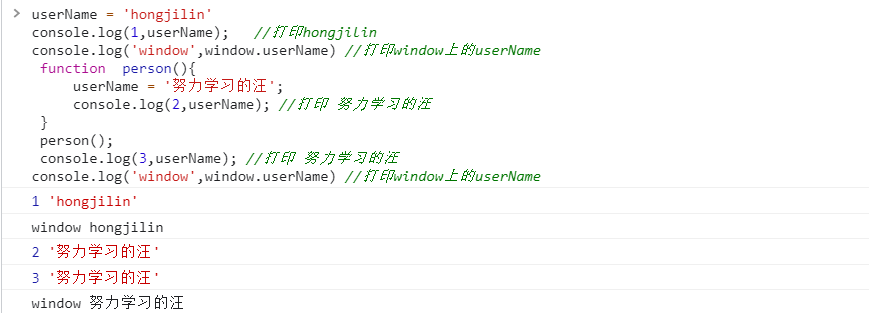
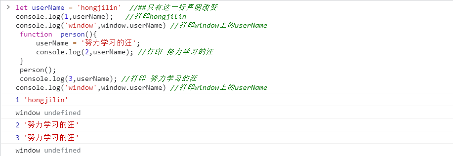

## #说明

>一般来说,我们使用变量前都会先声明变量:let const var function ... ; 但是JS中变量也可以不声明,直接使用,这是什么意思呢?他们之间有何区别呢?
>
>查阅借鉴的资料:MDN的[var 描述部分](https://developer.mozilla.org/zh-CN/docs/Web/JavaScript/Reference/Statements/var);慕课网的[变量可以不声明直接使用?](https://www.imooc.com/qadetail/78057); CSDN的[js 变量声明 （var使用与不使用的区别](https://blog.csdn.net/muzidigbig/article/details/81075545);思否的 [JS函数中直接使用变量,不用VAR?](https://segmentfault.com/q/1010000007048076)、[Javascript变量和属性的区别](https://blog.csdn.net/veranal/article/details/50594615);博客园的[js 变量与属性的区别](https://www.cnblogs.com/web-fusheng/p/6745083.html)
>
>除此笔记外大家可以看我其他笔记 :**[全栈笔记](https://gitee.com/hongjilin/hongs-study-notes/tree/master)**、**[数据结构与算法](https://gitee.com/hongjilin/hongs-study-notes/tree/master/编程_算法及课程基础学习笔记/数据结构与算法)**、**[编程_前端开发学习笔记](https://gitee.com/hongjilin/hongs-study-notes/tree/master/编程_前端开发学习笔记)**、**[编程_后台服务端学习笔记](https://gitee.com/hongjilin/hongs-study-notes/tree/master/编程_后台服务端学习笔记)** 、**[Java](https://gitee.com/hongjilin/hongs-study-notes/tree/master/编程_后台服务端学习笔记/Java)** 、**[Nodejs](https://gitee.com/hongjilin/hongs-study-notes/tree/master/编程_后台服务端学习笔记/Nodejs)** 、**[JavaScript笔记](https://gitee.com/hongjilin/hongs-study-notes/tree/master/编程_前端开发学习笔记/HTML+CSS+JS基础笔记/JavaScript笔记)**、**[编程工具使用笔记](https://gitee.com/hongjilin/hongs-study-notes/tree/master/编程_前端开发学习笔记/A_前端工具使用笔记)** 、**[ES6及后续版本学习笔记](https://gitee.com/hongjilin/hongs-study-notes/tree/master/编程_前端开发学习笔记/ES6及后续版本学习笔记)** 、**[Vue笔记整合](https://gitee.com/hongjilin/hongs-study-notes/tree/master/编程_前端开发学习笔记/Vue笔记整合)** 、**[React笔记](https://gitee.com/hongjilin/hongs-study-notes/tree/master/编程_前端开发学习笔记/React笔记)**、**[微信小程序学习笔记](https://gitee.com/hongjilin/hongs-study-notes/tree/master/编程_前端开发学习笔记/微信小程序学习笔记)**、**[Chrome开发使用及学习笔记](https://gitee.com/hongjilin/hongs-study-notes/tree/master/编程_前端开发学习笔记/Chrome开发使用及学习笔记)** 以及许多其他笔记就不一一例举了


## Ⅰ - 变量的声明分显式声明和隐式声明

>* **显示声明** 是程序中的一条说明语句，它列出一批变量名并指明这些变量的类型。
>
>  >```js
>  >// 显示声明 变量name，但不知其类型，也不知其占用空间大小
>  >var name ;
>  >```
>
>* **隐式声明** 指通过某种默认协定的方法将变量名与类型绑定。所有隐式声明的变量默认都是全局变量，无论函数内外
>
>  >```js
>  >// 赋值语句其实隐式的声明了变量name，类型为string
>  >name = '努力学习的汪';//隐式声明(为全局变量的一个属性) --> 注意:是属性
>  >```
>  >
>  >隐式声明带来了些许的方便，但却被认为有损于程序的可读性，因为它可能会带来隐藏的错误，Bug。

## Ⅱ - 结合实例说明

### 1、当我们使用访问一个没有声明的变量时，JS会报错

>```js
>console.log(1,userName);  //报错,因为没有声明
>```

### 2、当我们给一个没有声明的变量赋值时，JS不会报错

>* 相反它会认为我们是要隐式声明一个 **全局** 变量，这一点一定要注意。
>
>```js
>userName = 'hongjilin'
>console.log(1,userName);   //打印hongjilin
>console.log('window',window.userName) //打印window上的userName
> function  person(){
>     userName = '努力学习的汪';
>     console.log(2,userName); //打印 努力学习的汪
> }
> person();
> console.log(3,userName); //打印 努力学习的汪
>console.log('window',window.userName) //打印window上的userName
>```
>
>可以明显看到,实际上变量是挂载在全局对象window上,以属性的形式存在
>
> 

### 3、当我们给声明过的变量赋值

>与上方代码基本一致,只有第一行代码改为声明变量
>
>```js
>let userName = 'hongjilin'  //##只有这一行声明改变
>console.log(1,userName);   //打印hongjilin
>console.log('window',window.userName) //打印window上的userName
> function  person(){
>     userName = '努力学习的汪';
>     console.log(2,userName); //打印 努力学习的汪
> }
> person();
> console.log(3,userName); //打印 努力学习的汪
>console.log('window',window.userName) //打印window上的userName
>```
>
>可以明显看到,实际上声明后的变量是局部存在的,在window上是找不到这个属性的 

## Ⅲ - 总结

>在当前域中声明变量. 如果在方法中声明，则为局部变量（local variable）；如果是在全局域中声明，则为全局变量。
>
>1. 而事实上是对属性赋值操作。
>   * 首先，它会尝试在当前作用域链: 如在方法中声明, (先找方法当前的作用域）中解析 userName；
>   *  如果在任何当前作用域链中找到name，则会执行对name属性赋值； 
>   * 如果没有找到name，它才会层层往上找,最终在全局对象(即当前作用域链的最顶层对象，如window对象)中创造name属性并赋值。
>2. **注意**: 它并不是声明了一个全局变量，而是创建了一个全局对象的属性
>   - 即便如此，可能你还是很难明白“变量声明”跟“创建对象属性”在这里的区别,别急! 继续往下看
>   - 事实上，Javascript的变量声明、创建属性以及每个Javascript中的每个属性都有一定的标志说明它们的属性
>   - 如只读（ReadOnly）不可枚举（DontEnum）不可删除（DontDelete）等等。
>3.  由于变量声明自带不可删除属性，比较 **var userName = '努力学习的汪'** 跟 **userName = '努力学习的汪'**
>   - 前者是变量声明，带不可删除属性，因此无法被删除 -->  **delete userName；** 无效
>   - 后者为全局变量的一个属性，因此可以从全局变量中删除  -->  **delete userName；** 有效