# #说明

>也许在看到这个笔记之前,你就听说过JS进行浮点运算时可能会有些误差.当初我老师曾跟我们说过,就是因为如此JS不能用来做高精度运算的系统(大二三的时候问的),如银行金融软件等,当时也不是很清楚为何会如此,而现在我又想起了,就本着钻研的精神将其整理梳理出来
>
>查阅借鉴的资料:B站UP主 前端周老师的[0.1+0.2竟然不等于0.3，你是认真的吗？](https://www.bilibili.com/video/BV1NM4y1L7qK?share_source=copy_web)视频; CSDN的[js中浮点型数据的计算](https://blog.csdn.net/qq_41572552/article/details/105659722);博客园的[彻底理解0.1 + 0.2 === 0.30000000000000004的背后](https://www.cnblogs.com/fsjohnhuang/p/5115672.html)、[js 浮点型数据运算](https://www.cnblogs.com/shiyun32/p/12759742.html);思否的[IEEE754浮点表示法详解](https://segmentfault.com/a/1190000010841961);简书的[IEEE754表示浮点数](https://www.jianshu.com/p/e5d72d764f2f);百度文库的[IEEE754标准浮点数表示法](https://wenku.baidu.com/view/6c945dd6e009581b6ad9eb15.html);[IEEE 754浮点数标准详解](http://c.biancheng.net/view/314.html) 等
>

# 一、常见的坑

>此处列举几个常见的浮点型运算的坑
>
>1. 著名的 0.1 + 0.2 === 0.30000000000000004
>2. 1000000000000000128 === 1000000000000000129
>3. 0.7 * 180 == 125.99999999998
>4. 其他

# 二、IEEE Floating Point Standard (IEEE754浮点数表示法标准)

>在正式开始说JS浮点型运算前,我们要先了解一个东西,那就是: **IEEE754浮点数表示法标准** 此处只要大致看一下就行,有个概念
>
>因为JS的浮点就是按照 IEEE754浮点数表示法标准 进行的
>
>此部分借鉴资料: 思否的[IEEE754浮点表示法详解](https://segmentfault.com/a/1190000010841961);简书的[IEEE754表示浮点数](https://www.jianshu.com/p/e5d72d764f2f);百度文库的[IEEE754标准浮点数表示法](https://wenku.baidu.com/view/6c945dd6e009581b6ad9eb15.html);[IEEE 754浮点数标准详解](http://c.biancheng.net/view/314.html)；实际上这应是大学时期学的，只是可能你忘记了

## Ⅰ - 组成

>IEEE754标准包含一组实数的二进制表示法。它有三部分组成：
>
>- 符号位
>- 指数位
>- 尾数位
>
>三种精度的浮点数各个部分位数如下：
>
>| 精度     | 符号 | 阶/指数 | 尾数 | 总位数 |
>| -------- | ---- | ------- | ---- | ------ |
>| 单精度   | 1    | 8       | 23   | 32     |
>| 双精度   | 1    | 11      | 52   | 64     |
>| 长双精度 | 1    | 15      | 64   | 80     |
>
>#### 分类： 
>
>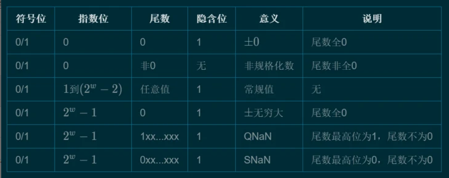 

## Ⅱ - 正规化

>对于将某个实数表示为计算机浮点数，首先要将其**正规化**，也就是表示为形如：
>
>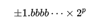 
>
>的样子。其中 [b] 是 `0` 或 `1` ，而 [p] 二进制数表示的指数位。这样，假设想表示为单精度(float)的浮点数，那么：
>
>- 第一位符号位用 `0` 表示正，用 `1` 表示负
>- 将指数 [p] 加上 **移码** 表示为8位的二进制数
>- 在接下来的23位填充位数 [b] 部分。由于正规化表示时，最左边部分**总是** `1` ，所以我们只需表示23位的尾数即可。

### 1、移码

>上述中有一个词：**移码**(exponential bias),相信很多同学都不知道是什么.
>
>因为指数 [p] 有正有负，那么在8位的指数位中我们就要拿出第一位来**指示符号**，这样显然会造成不必要的浪费。给指数加上移码，就能保证结果**总是**一个非负数，也就可以将8个指数位都利用起来。对于有 [M] 个指数位的精度，其移码为：
>
>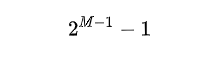 
>
>这样就能得到上方三种精度的移码:
>
>| 精度     | M(阶/指数位数) | 移码  | 二进制表示         |
>| -------- | -------------- | ----- | ------------------ |
>| 单精度   | 8              | 127   | 0111 1111          |
>| 双精度   | 11             | 1023  | 011 1111 1111      |
>| 长双精度 | 15             | 16383 | 011 1111 1111 1111 |
>
>以双精度(Double)的为例。双精度的指数位有11位。这样可以表示的数是从`000 0000 0000`到`111 1111 1111`，也就是 **指数加移码** 所表示的范围从0到2047，那么，减去移码1023，则可以表示的指数是-1023到1024。但是注意，*-1023和1024作为他用*（后面会说到）。所以**实际**上能表示数的指数是从-1022到1023。

### 2、单精度、双精度、长双精度

>这边可能会有基础比较差的同学会问单精度双精度这是啥,其实这个就是很基础的知识点了,在很多变成课本或者书籍上都有记录,这边就不深入讨论,而从使用的角度来讲，我想大体了解以下的情况就可以了：
>
>1. 整数、长整数: 都是相当于数学中的整数，只是由于计算机中存放数据的内存空间有限，所以计算机中的整数和长整数都有一定的范围，而且因计算机硬件的不同而不同，但一般而言存放长整数的内存空间比整数的要多，所以表示的范围也更大。
>2. 单精度浮点数、双精度浮点数: 都是计算机用来表示实数的方法，与上边的整数、长整数类似，也有一定的表示范围，而且相应的双精度浮点数比单精度浮点数的范围更大、而且有效位数也更多，也即更精确。
>3. 如果在程序中用一个变量表示一个人的年龄，那么由于人的年龄都是整数，所以这个变量定义为整数类型的最合适了。如果要用一个变量表示一件物品的价格，由于价格是实数，比如66.60元，那么要用单精度浮点数。
>4. 如果变量的范围要比整数、单精度浮点数大，或者精度比单精度浮点数要高，那么就要改用长整数或者双精度浮点数。
>5. 长双精度顾名思义就是比双精度更长,更精确
>6. 以上的数的范围和精度都可以在很多课本和手册中查到。

### 3、举些栗子

#### ① 【例】：0.1与0.2转化为二进制表示

>这边以图文方式举例:
>
>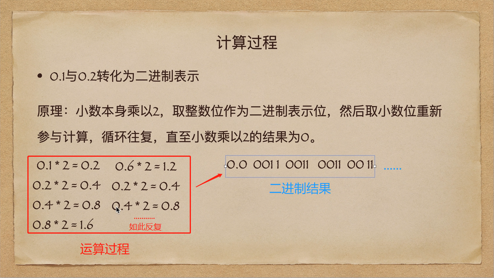

#### ②【例】：求3.14的单精度浮点数表示。

>> 首先将3.14转成二进制:
>>
>>- 整数部分3的二进制是11`b`
>>- 小数部分0.14的二进制是：0.0010001111010111000**010**[10001111.....]`b`（方括号中表示小数点后第23位及之后）。
>>
>>这样，3.14的二进制代码就是：11.0010001111010111000**010**[10001111....]×20`b`，那么用正规化表示就是：1.10010001111010111000**010**[10001111....]×21`b`。
>>
>> 方括号表示的就是小数点后第24位了，由于单精度浮点数尾数只有23位，所以需要**舍入**（舍入方法见后）：由于第24位为1，且之后 *不全为* 0，所以需要向第23位进1完成上舍入：1.10010001111010111000**011**×21`b`。
>> 而其指数是1，需要加上移码127，即128，也就是(1000 0000)`b`。
>> 它又是正数，所以符号为0。
>> 综上所述，3.14的单精度浮点数表示为：
>> **0 1000-0000 1001-0001-1110-1011-1000-011**`b`
>> 十六进制代码为：**0x4048F5C3**
>
>通过此例可知，3.14的单精度浮点数表示是`0 1000-0000 1001-0001-1110-1011-1000-011`。现在我们来还原，看看它的误差：
>
>- 指数是128，那么还原回去（减去移码），实际指数就是1
>- 尾数还原也就是：10010001111010111000011`b`，所以是：1.10010001111010111000011×21`b`，也就是11.0010001111010111000011`b`。
>
>利用二进制转十进制，可得它对应的十进制数是：**3.1400001049041748046875**。显然与3.14是有误差的。
>
>我们再通过另一种方法估算误差。从例子中可知，对于3.14的单精度浮点数，我们舍去了第24位以及之后，它们是：
> 0.00...(23个0)....00 **[10001111.....]×21**`b`。
> 为了方便计算，不妨假设此后全是0（即方括号中省略部分），也就是舍去了：
> **0.10001111b×2-23×21**`b`
> 约为0.00000013317912817001；由于舍入进位关系，给第23位又加了1，所以加了：2-23×21，故而要减去这一部分。
> 所以，误差约为2-23×21 - 0.10001111b×2-23×21=0.00000010523945093155。所以结果大致为3.14+0.00000010523945093155=`3.14000010523945093155`。
> 可见和上面计算结果大致相同。 

### 4、机器ε（machine epsilon）

>机器ε表示1与大于1的最小浮点数之差。不同精度定义的机器ε不同。以双精度为例，双精度表示的1是：
>
>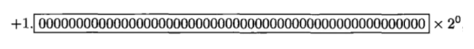 
>
>而比1大的最小双精度浮点数是：
>
>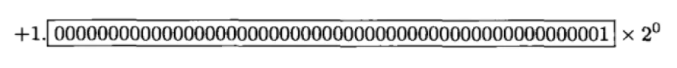 
>
>可见，此二者之差为：2-52≈2.220446049250313e-16。所以它就是双精度浮点数的机器ε。
> 在舍入中，相对舍入误差不能大于机器ε的一半。比如上面的3.14的单精度浮点数，二者误差绝对值是0.0000001049041748046875....，从而相对舍入误差为0.0000001049041748046875....÷3.14≈`0.00000003340897286773`。而单精度浮点数的机器ε为2-23≈1.1920928955078125e-7，它的一半是`0.00000005960464477539`。显然，相对舍入误差小于单精度浮点数机器ε的一半。

## Ⅲ - 非正规化：0的表示

>从正规化中可知，**无论如何**浮点数都满足最左边是1。这就有一个严重问题：0没有办法被表示。为此，可以使用**非正规化**的表示方法，即让最左边默认为0，这样再另尾数也全部为0，就可以表示0了。

### 1、**根据什么**判断是非正规化还是正规化呢？

>答案就是通过 **指数部分** 来反映。记得前面说过，双精度浮点数中，*指数加移码* 的范围可以从0到2047，然而0和2047是作为他用的。在这里，**指数部分为0就代表着非正规化**。
>
>所以，当见到指数部分为0是，尾数部分就不再是`1.bbbbb...`而是`0.bbbbb...`了。
> 再进一步，对于非正规化，可以看成是正规化中，小数点向**左边**跑了一位：1.bbbb....×2-1023=0.1bbbb....×2×2-1023==0.1bbbb....×2-1022（只是概念上理解，小数第一位也不一定非要是1，如`0.001010×2^-1022`也可）。所以，非正规化下表示为：
>
>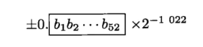 
>
>现在，0就可以表示了。值得注意的是，此时0可以表示位+0和-0。
>
>因为它的最左边不是1是0，实际上可以表示更小的数。双精度浮点数下，使用非正规化可以表示的**最小的正数**是0.00......01×2-1022也就是2-52×2-1022=**2-1074**。
>
>

### 2、与机器ε的**区别**

>请注意这个最小数和前面提到的机器ε的**区别**。比机器ε小的数是可以被表示出来的（利用非正规化）。但是当它们与其他浮点数做运算时，因为要转成同一种格式（正规化格式），从而可能会因为溢出位而被舍弃。最终结果就是，这些更小的数尽管能被表示，但是对运算结果没有影响。

## Ⅳ - 浮点数加法

>机器加法要先将两个操作数的小数点对齐，相加后再转为浮点数存储。这里最重要的一点是，尽管浮点数有位数限制，但是加法会在精度更高的寄存器中进行，这意味着，寄存器能够运算出比52位还要多的位数，但是在转回浮点数存储时，多余位数会被舍弃，造成两者相加的机器结果不严格等于算术结果。
>
>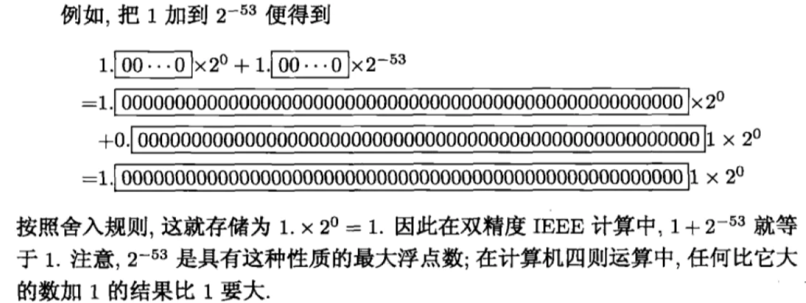 
>
>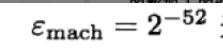 并不表示在IEEE模型中可以忽略比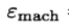 小的数只要它们在模型中可以表示出来. 
>
>**假定没有把它们与单位大小的数相加减,那么用这样大的数进行的计算就如同精确的一样**

## Ⅴ - 无穷大与NaN

>上面说到，在双精度浮点数中，指数为0表示非正规化，那么指数为2047（二进制是111 1111 1111b，即11位指数位全为1）就表示无穷大和 NaN（Not a Number）。具体表现在，当指数是2047，当尾数,全为0就表示无穷大，当尾数不全为0就表示 NaN。

## Ⅵ - 舍入规则

### 1、以52位尾数位的双精度浮点数为例，舍入时需要重点参考第53位：

>- 若第53位为1，而第53位之后全部为0。此时就要使第52位为0：若第52位本来就是0则不管，若第52位为1，则第53位就要向第52位进一位，这样第52位就可以为0
>- 若不是上面的情况，即第53位1，但是第53位之后不全为0，则第53位就要向第52位进一完成上舍入。
>- 若也不是上面两种情况，那么第53位必为0，此时直接舍去不进位，称为下舍入。
>
>由于存在这种舍入规则，浮点数一般在机器内都不会以原数精确相等的存储，这就会使在某些情况下，使用浮点数做算术运算时出现令人费解的情况，如在JavaScript中（数以双精度存储）：
>
>
>
>```cpp
>>>9.4-9-0.4===0 //9.4减去9再减去0.4，与0比较大小
><<false
>>>(9.4-9-0.4).toFixed(20)
><<"0.00000000000000033307"
>```
>
>可见机器表示中，9.4-9-0.4**不严格等于**0，其结果有极小误差。因为按照上面的算法可知，9.4在机器内被表示为：9.4+0.2×2-49，而0.4被表示为0.4+0.1×2-52。这样，当9.4-9时（因为9是整数是可以精确存储的）得0.4+0.2×2-49，再减去0.4+0.1×2-52得3×2-53，约等于"0.00000000000000033307"。

### 2、循环小数的二进制转回十进制的技巧

> 某循环小数的二进制码是：0. 0110 0110 0110 0110 0110.....b。可见是0110的循环，令x为其十进制数：x=0.01100110.....b，则24x=110,01100110.....b，两式相减得：(24-1)x=110b，即15x=6，从而x=6/15=0.4

# 三、回归JS

> 众所周知JS仅有Number这个数值类型，而Number采用的时IEEE 754 64位双精度浮点数编码。而浮点数表示方式具有以下特点：
>
>1. 浮点数可表示的值范围比同等位数的整数表示方式的值范围要大得多；
>
>2. 浮点数无法精确表示其值范围内的所有数值，而有符号和无符号整数则是精确表示其值范围内的每个数值；
>
>3. 浮点数只能精确表示m*2e的数值；
>
>4. 当biased-exponent为2e-1-1时，浮点数能精确表示该范围内的各整数值；
>
>5. 当biased-exponent不为2e-1-1时，浮点数不能精确表示该范围内的各整数值。
>
> 由于部分数值无法精确表示（存储），于是在运算统计后偏差会愈见明显。

## Ⅰ - 为何 0.1 + 0.2 === 0.30000000000000004 ?

### 1、文字描述

> 在浮点数运算中产生误差值的示例中，最出名应该是0.1 + 0.2 === 0.30000000000000004了，到底有多有名？看看这个网站就知道了http://0.30000000000000004.com/。也就是说不仅是JavaScript会产生这种问题，只要是采用IEEE 754 Floating-point的浮点数编码方式来表示浮点数时，则会产生这类问题。下面我们来分析整个运算过程。
>
>1. 0.1 的二进制表示为 1.1001100110011001100110011001100110011001100110011001 1(0011)+ * 2^-4；
>
>2. 当64bit的存储空间无法存储完整的无限循环小数，而IEEE 754 Floating-point采用round to nearest, tie to even的舍入模式，因此0.1实际存储时的位模式是0-01111111011-1001100110011001100110011001100110011001100110011010；
>
>3. 0.2 的二进制表示为 1.1001100110011001100110011001100110011001100110011001 1(0011)+ * 2^-3；
>
>4. 当64bit的存储空间无法存储完整的无限循环小数，而IEEE 754 Floating-point采用round to nearest, tie to even的舍入模式，因此0.2实际存储时的位模式是0-01111111100-1001100110011001100110011001100110011001100110011010；
>
>5. 实际存储的位模式作为操作数进行浮点数加法，得到 0-01111111101-0011001100110011001100110011001100110011001100110100。转换为十进制即为0.30000000000000004。

### 2、图文解析

>
>
>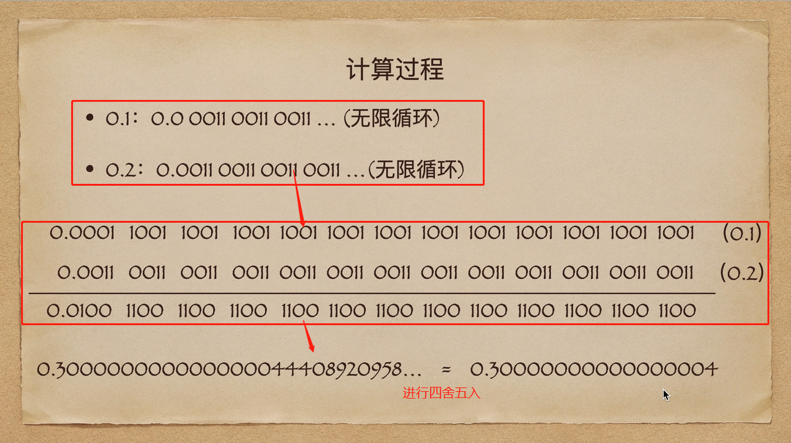 

## Ⅱ - 为何 0.7 * 180===125.99999999998 ?　　　　　　　　　

>1. 0.7实际存储时的位模式是0-01111111110-0110011001100110011001100110011001100110011001100110；
>
>2. 180实际存储时的位模式是0-10000000110-0110100000000000000000000000000000000000000000000000；
>
>3. 实际存储的位模式作为操作数进行浮点数乘法，得到0-10000000101-1111011111111111111111111111111111111111101010000001。转换为十进制即为125.99999999998。

## Ⅲ - 为何 **`1000000000000000128`=== `1000000000000000129` ?**

>
> 　1. `1000000000000000128`实际存储时的位模式是0-10000111010-1011110000010110110101100111010011101100100000000001；
>
> 2. `1000000000000000129`实际存储时的位模式是0-10000111010-1011110000010110110101100111010011101100100000000001；
>
> 3. 因此`1000000000000000128和``1000000000000000129的实际存储的位模式是一样的。`

## Ⅳ - 为何 0.1+0.1 === 0.2 ？

> 实际上 0.1+0.1 得到的是 0.20000000....00x,也是有误差，但是JS只取17位有效数字，四舍五入后就相当于是正确答案了

