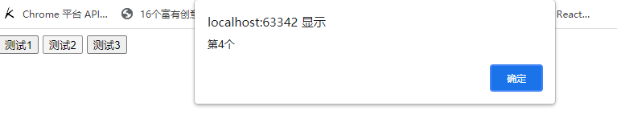
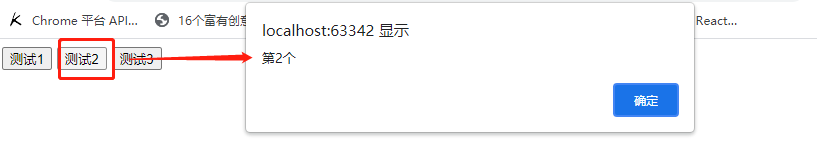
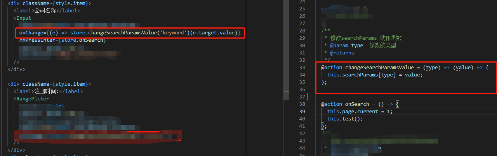
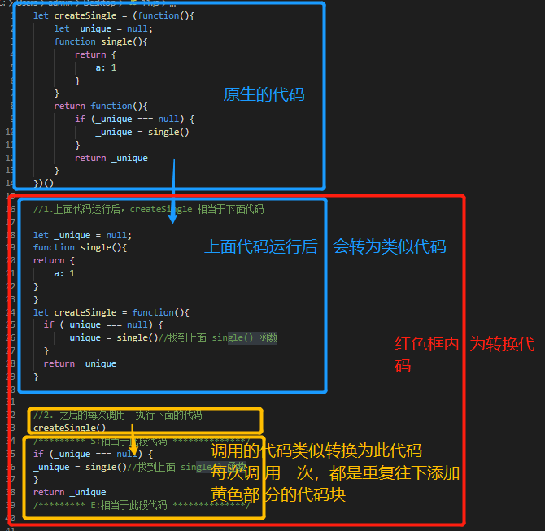

## #说明

>此部分知识点实际上在本人 [A_JavaScript进阶学习笔记](https://gitee.com/hongjilin/hongs-study-notes/blob/master/%E7%BC%96%E7%A8%8B_%E5%89%8D%E7%AB%AF%E5%BC%80%E5%8F%91%E5%AD%A6%E4%B9%A0%E7%AC%94%E8%AE%B0/HTML+CSS+JS%E5%9F%BA%E7%A1%80%E7%AC%94%E8%AE%B0/JavaScript%E7%AC%94%E8%AE%B0/A_JavaScript%E8%BF%9B%E9%98%B6%E5%AD%A6%E4%B9%A0%E7%AC%94%E8%AE%B0.md#4%E9%97%AD%E5%8C%85%E9%A2%84%E5%A4%87%E7%9F%A5%E8%AF%86%E7%82%B9%E6%A2%B3%E7%90%86) 中就有详细的记载,但现在仍单独抽出,为了是自己复习or同学们更快地找到这个知识点


## 一、闭包预备知识点梳理

> 在进入闭包之前,你要确保上面知识点你能掌握.你不确定 ? 噢好吧,那你就跟着我看下这部分梳理(如果懂得直接跳过即可)

### Ⅰ- 举个栗子分析执行上下文

>在讨论闭包之前，让我们看下下方的代码(建议先只看代码自己头脑风暴再看笔记中的描述),也算是对上面知识点的梳理回顾：
>
>```js
>1: let a = 3
>2: function addTwo(x) {
>3:  let ret = x + 2
>4:   return ret
>5:  }
>6: let b = addTwo(a)
>7: console.log(b)
>```
>
>为了理解 JavaScript 引擎是如何工作的，让我们详细分析一下：
>
>1. 在第 1 行，我们在全局执行上下文中声明了一个新变量 a，并将赋值为 3。
>2. 接下来就变得棘手了，第 2 行到第 5 行实际上是在一起的。这里发生了什么?
>
>  - 我们在全局执行上下文中声明了一个名为`addTwo`的新变量,我们给它分配了什么?  -->`一个函数定义`。
>  - 两个括号{}之间的任何内容都被分配给`addTwo`，`函数内部的代码没有被求值，没有被执行，只是存储在一个变量中以备将来使用`。
>
>3. 现在我们在第 6 行。
>
>  - 它看起来很简单，但是这里有很多东西需要拆开分析。首先，我们在全局执行上下文中声明一个新变量，并将其标记为[`b`]，`变量一经声明，其值即为 undefined`。
>  - 接下来，仍然在第 6 行，我们看到一个赋值操作符。我们准备给变量`b`赋一个新值，接下来我们看到一个函数被调用。`当您看到一个变量后面跟着一个圆括号(…)时，这就是调用函数的信号`，接着，每个函数都返回一些东西(值、对象或 undefined)，无论从函数返回什么，都将赋值给变量`b`。
>
>4. 但是首先我们需要调用标记为`addTwo`的函数。JavaScript 将在其全局执行上下文内存中查找名为`addTwo`的变量。噢，它找到了一个，它是在[`步骤 2(或第 2 - 5 行)中定义`]的。变量[`addTwo`]包含一个函数定义。
>
>  - 注意:`变量[a]作为参数传递给函数`。
>  - JavaScript 在全局执行上下文内存中搜索变量`a`，找到它，发现它的值是 3，并将数字 3 作为参数传递给函数，准备好执行函数。
>
>5. 现在执行上下文将切换,创建了一个新的本地执行上下文，我们将其命名为[“`addTwo 执行上下文`”，`执行上下文被推送到调用堆栈上`。在 addTwo 执行上下文中，我们要做的第一件事是什么?
>
>  - 你可能会说，“在 addTwo 执行上下文中声明了一个新的变量 ret”，`这是不对的`。
>  - `正确的答案是`:我们需要先看函数的参数。`在 addTwo 执行上下文中声明一个新的变量[x]`，因为值 3 是作为参数传递的，所以变量 x 被赋值为 3。		
>  - 下一步才是在 addTwo 执行上下文中声明一个新的变量`ret`。它的值被设置为 undefined(第三行)。
>
>6. 仍然是第 3 行，需要执行一个相加操作。
>
>  - 首先我们需要`x`的值，JavaScript 会寻找一个变量`x`，它会首先在`addTwo`执行上下文中寻找，找到了一个值为 3。第二个操作数是数字 2。两个相加结果为 5 就被分配给变量`ret`。
>
>7. 第 4 行，我们返回变量`ret`的内容，在 addTwo 执行上下文中查找，找到值为 5，返回，函数结束。
>8. 第 4 - 5 行，函数结束。
>
>  - `addTwo 执行上下文被销毁`，变量`x`和`ret`被消去了，它们已经不存在了。`addTwo 执行上下文从调用堆栈中弹出`，返回值返回给调用上下文，在这种情况下，调用上下文是全局执行上下文，因为函数`addTwo` 是从全局执行上下文调用的。
>
>9. 现在我们继续第 4 步的内容，返回值 5 被分配给变量`b`，`此时实际上程序仍然在第 6 行`(盗梦空间既视感:dog:)
>10. 在第 7 行，`b`的值 5 被打印到控制台了。
>
>对于一个非常简单的程序，这是一个非常冗长的解释，我们甚至还没有涉及闭包。但肯定会涉及的，不过首先我们得绕一两个弯。

### Ⅱ-举个栗子分析词法作用域

>这里想说明，我们在函数执行上下文中有变量，在全局执行上下文中有变量。JavaScript 的一个复杂之处在于它如何查找变量，如果在函数执行上下文中找不到变量，它将在调用上下文中寻找它，如果在它的调用上下文中没有找到，就一直往上一级，直到它在全局执行上下文中查找为止。(如果最后找不到，它就是 undefined)。
>
>```js
>1: let val1 = 2
>2: function multiplyThis(n) {
>3:   let ret = n * val1
>4:    return ret
>5: }
>6: let multiplied = multiplyThis(6)
>7: console.log('example of scope:', multiplied)
>```
>
>下面列出向个步骤来解释一下（如果你已经熟悉了，请跳过）：
>
>1. 在全局执行上下文中声明一个新的变量`val1`，并将其赋值为 2。
>2. 行 2 - 5，声明一个新的变量 `multiplyThis`，并给它分配一个函数定义。
>3. 第六行，声明一个在全局执行上下文 `multiplied` 新变量。
>4. 从全局执行上下文内存中查找变量`multiplyThis`，并将其作为函数执行，传递数字 6 作为参数。
>
>  - 新函数调用(创建新执行上下文），创建一个新的 `multiplyThis` 函数执行上下文。
>  - 在 `multiplyThis` 执行上下文中，`声明一个变量 n 并将其赋值为 6`  -->声明后才会进入函数体内部执行
>
>5. 执行函数回到第 3 行。
>
>  - 在`multiplyThis`执行上下文中，声明一个变量`ret`。
>  - 继续第 3 行。对两个操作数 n 和 val1 进行乘法运算.在`multiplyThis`执行上下文中查找变量 `n`。
>    - 我们在步骤 6 中声明了它,它的内容是数字 6。在`multiplyThis`执行上下文中查找变量`val1`。
>    - `multiplyThis`执行上下文没有一个标记为 val1 的变量。`我们向调用上下文查找，调用上下文是全局执行上下文，在全局执行上下文中`寻找 [`val1`]。哦，是的、在那儿，它在步骤 1 中定义，数值是 2。
>  - 继续第 3 行。将两个操作数相乘并将其赋值给`ret`变量，6 * 2 = 12，ret 现在值为 12。
>
>6. 返回`ret`变量，销毁`multiplyThis`执行上下文及其变量 `ret` 和 `n` 。变量 `val1` 没有被销毁，因为它是全局执行上下文的一部分。
>7. 回到第 6 行。在调用上下文中，数字 12 赋值给 `multiplied` 的变量。
>8. 最后在第 7 行，我们在控制台中打印 `multiplied` 变量的值
>
>在这个例子中，我们需要记住一个函数可以访问在它的调用上下文中定义的变量，这个就是**词法作用域（Lexical scope）**。

### Ⅲ- 返回函数的函数[`高阶函数`]

>在第一个例子中，函数`addTwo`返回一个数字。请记住，函数可以返回任何东西。让我们看一个返回函数的函数示例，因为这对于下方理解闭包非常重要。看栗子：
>
>```js
>1: let val = 7
>2: function createAdder() {
>3:   function addNumbers(a, b) {
>4:     let ret = a + b
>5:     return ret
>6:   }
>7:   return addNumbers
>8: }
>9: let adder = createAdder()
>10: let sum = adder(val, 8)
>11: console.log('example of function returning a function: ', sum)
>```
>
>让我们回到分步分解：
>
>1. 第一行。我们在全局执行上下文中声明一个变量`val`并赋值为 7。
>2. 行 2 - 8。我们在全局执行上下文中声明了一个名为 `createAdder` 的变量，并为其分配了一个函数定义。
>
>  - 内部的第 3 至 7 行描述了上述函数定义，和以前一样，在这一点上，我们没有直接讨论这个函数。我们只是将函数定义存储到[`createAdder`]变量中。
>
>3. 第 9 行。
>
>  - 我们在全局执行上下文中声明了一个名为 `adder` 的新变量，暂时，值为 undefined
>  - 我们看到括号()，我们需要执行或调用一个函数，查找全局执行上下文的内存并查找名为`createAdder` 的变量，它是在步骤 2 中创建的。好吧，我们调用它。
>
>4. 调用函数时，执行到第 2 行。
>
>  - 创建一个新的`createAdder`执行上下文。我们可以在`createAdder`的执行上下文中创建自有变量。js 引擎将`createAdder`的上下文添加到调用堆栈。这个函数没有参数，让我们`直接跳到它的主体部分`.
>
>5. 第 3 - 6 行(执行到主体函数中)。
>
>  - 我们有一个新的函数声明，我们在`createAdder`执行上下文中创建一个变量 addNumbers。这很重要，`addnumber`只存在于`createAdder`执行上下文中。我们将函数定义存储在名为 `addNumbers` 的自有变量中。
>  - 在第 7 行，我们返回变量`addNumbers`的内容。js 引擎查找一个名为`addNumbers`的变量并找到它，这是一个函数定义。好的，函数可以返回任何东西，包括函数定义。我们返`addNumbers`的定义。第 4 行和第 5 行括号之间的内容构成该函数定义。
>
>6. [return addNumbers]时，`createAdder`执行上下文将被销毁。`addNumbers` 变量不再存在。但`addNumbers`函数定义仍然存在，`因为它返回并赋值给了 adder 变量`。   
>
>  - `此处很重要`!!!此时的[`adder=createAdder()`]实际上它的值是[`addNumbers`]的函数定义而不是[`createAdder`]了,adder现在是一个匿名函数--这里有点绕,要确定理解
>
>7. 第 10 行。我们在全局执行上下文中定义了一个新的变量 `sum`，先赋值为 undefined;
>
>  - 接下来我们需要执行一个函数。哪个函数?
>    - 是名为`adder`变量中定义的函数。我们在全局执行上下文中查找它，果然找到了它，这个函数有两个参数。
>    - 让我们查找这两个参数，第一个是我们在步骤 1 中定义的变量`val`，它表示数字 7，第二个是数字 8。
>  - 现在我们要执行这个函数，函数定义概述在第 3-5 行，`因为这个函数是匿名`，为了方便理解，我们暂且叫它`adder`吧。这时创建一个`adder`函数执行上下文，在`adder`执行上下文中创建了两个新变量 `a` 和 `b`。它们分别被赋值为 7 和 8，因为这些是我们在上一步传递给函数的参数。
>
>8. 执行回到第 4 行。
>
>  - 在`adder`执行上下文中声明了一个名为`ret`的新变量,
>  - 将变量`a`的内容和变量`b`的内容相加得 15 并赋给 ret 变量。
>
>9. `ret`变量从该函数返回。这个匿名函数执行上下文被销毁，从调用堆栈中删除，变量`a`、`b`和`ret`不再存在。
>10. 返回值被分配给我们在步骤 9 中定义的`sum`变量。
>11. 我们将`sum`的值打印到控制台。
>
>如预期，控制台将打印 15。我们在这里确实经历了很多困难，我想在这里说明几点。首先，函数定义可以存储在变量中，函数定义在程序调用之前是不可见的。其次，每次调用函数时，都会(临时)创建一个本地执行上下文。当函数完成时，执行上下文将消失。函数在遇到 return 或右括号}时执行完成。

##### `高阶函数是什么?`

>所谓高阶函数，就是一个函数就可以接收另一个函数作为参数，或者是返回一个函数-->常见的高阶函数有map、reduce、filter、sort等
>
>```js
>var ADD =function add(a) {
>return function(b) {
>return a+b
>}
>}
>调用：ADD(2)(3)即可获得结果
>```
>
>1. map
>
> - ```js
>   //
>   map接受一个函数作为参数，不改变原来的数组，只是返回一个全新的数组
>   var arr = [1,2,3,4,5]
>   var arr1 = arr.map(item => item = 2)
>   //arr  输出[1,2,3,4,5]
>   //arr1 输出[2,2,2,2,2]
>   ```
>
>2. reduce
>
> - ```js
>   //
>   reduce也是返回一个全新的数组。reduce接受一个函数作为参数，这个函数要有两个形参，代表数组中的前两项，reduce会将这个函数的结果与数组中的第三项再次组成这个函数的两个形参以此类推进行累积操作
>   var arr = [1,2,3,4,5]
>   var arr2 = arr.reduce((a,b)=> a+b)
>   console.log(arr2) // 15
>   ```
>
>3. filter
>
> - ```js
>   //
>   filter返回过滤后的数组。filter也接收一个函数作为参数，这个函数将作用于数组中的每个元素，根据该函数每次执行后返回的布尔值来保留结果，如果是true就保留，如果是false就过滤掉（这点与map要区分）
>   var arr = [1,2,3,4,5]
>    var arr3 = arr.filter(item => item % 2 == 0)
>   console.log(arr3)// [2,4]
>   ```

## 二、闭包

>一个函数和对其周围状态（**lexical environment，词法环境**）的引用捆绑在一起（或者说函数被引用包围），这样的组合就是**闭包**（**closure**）。也就是说，闭包让你可以在一个内层函数中访问到其外层函数的作用域。在 JavaScript 中，每当创建一个函数，闭包就会在函数创建的同时被创建出来。
>
>本来闭包部分是看`尚硅谷`的教学视频,当时那位老师在此部分讲解的让我觉得并没特别清晰(在刚开始时没讲到重点,导致难以理解,但是在后面有提到就懂了),所以我自己看完后再去翻阅许多关于闭包的资料进行自学,随后将其梳理整合并加以自己感悟记录于此

### Ⅰ-引出闭包概念

#### ① 错误场景

>需求: `点击某个按钮, 提示"点击的是第n个按钮"`
>
>```html
><button>测试1</button>
><button>测试2</button>
><button>测试3</button>
><!--
>需求: 点击某个按钮, 提示"点击的是第n个按钮"
>-->
><script type="text/javascript">
>var btns = document.getElementsByTagName('button')
>//注意[btns]不是一个数组,它是一个伪数组
>//每次获取[btns.length]其实都是需要进行计算的(因为它是伪数组)
>//所以为了性能更好,在此处赋值,就只需要计算一次
>for (var i = 0,length=btns.length; i < length; i++) {
>var btn = btns[i]
>btn.onclick = function () {  //遍历加监听
> alert('第'+(i+1)+'个')     //结果 全是[4]
>}
>}
></script>    
>```
>
>此处错误是,直接修改并使用全局变量[`i`],导致for循环结束后,所有点击按钮绑定的弹窗值都是[`i+1`]
>
>随后调用时,都会找到[`i`]这个变量,但是此时i==3,所以所有结果都是4
>
> 

#### ② 将变量挂载到自身来解决

>解决方式:将btn所对应的下标保存在btn上
>
>```js
><button>测试1</button>
><button>测试2</button>
><button>测试3</button>
><!--
>需求: 点击某个按钮, 提示"点击的是第n个按钮"
>-->
><script type="text/javascript">
>var btns = document.getElementsByTagName('button')
>for (var i = 0,length=btns.length; i < length; i++) {
>var btn = btns[i]
>//将btn所对应的下标保存在btn上
>btn.index = i
>btn.onclick = function () {  //遍历加监听
> alert('第'+(i+1)+'个')     //结果 全是[4]
>}
>}
></script>    
>```
>
>将其放在自己的身上,需要时自己找自己拿,这样就能解决
>
>

#### ③ 利用闭包

>利用闭包知识点解决,引出下方知识点,不懂的可以带着疑问继续往下看
>
>```js
><body>
><button>测试1</button>
><button>测试2</button>
><button>测试3</button>
>
><script type="text/javascript">
>//利用闭包
>for (var i = 0,length=btns.length; i < length; i++) {
>//此处的j是局部的,它将传入的[i]存入局部的[j]中,这样就能实现效果 
>(function (j) {
> var btn = btns[j]
> btn.onclick = function () {
>   alert('第'+(j+1)+'个')
> }
>})(i)
>}
></script>  
></body>
>```
>
>

### Ⅱ-举个闭包栗子分析理解

> 按照上方 [`4`]代码举例分析流程的方式 来尝试理解`闭包`概念
>
> 提前给出一个闭包栗子进行分析,先看看发生什么,再去看它的概念进行印证,相信我,你会有种拨开迷雾的感受

#### ① 按照正常逻辑理解

>先说,此部分不是按照闭包机制进行理解,所以中途发觉不对(`肯定有地方不对劲`)请勿钻牛角尖,主要用作后方对照
>
>```js
>1: function createCounter() {
>2:   let counter = 0
>3:   const myFunction = function() {
>4:     counter = counter + 1
>5:     return counter
>6:   }
>7:   return myFunction
>8: }
>9: const increment = createCounter()
>10: const c1 = increment()
>11: const c2 = increment()
>12: const c3 = increment()
>13: console.log('example increment', c1, c2, c3)
>```
>
>现在，我们已经从前几个示例中掌握了它的诀窍，让我们按照预期的方式快速执行它：  (`错误的流程理解,故意按照正常的逻辑流程走,做印证`)
>
>1. 行 1 - 8。我们在全局执行上下文中创建了一个新的变量`createCounter`，并赋值了一个的函数定义。
>2. 第 9 行。
>
>  - 我们在全局执行上下文中声明了一个名为`increment`的新变量。
>  - 我们需要调用`createCounter`函数并将其返回值赋给`increment`变量。
>
>3. 返回执行 行 1 - 8。调用函数，创建新的本地执行上下文。
>
>  - 第 2 行。在本地执行上下文中，声明一个名为`counter`的新变量并赋值为 0;
>  - 行 3 - 6。声明一个名为`myFunction`的新变量，变量在本地执行上下文中声明,变量的内容是为第 4 行和第 5 行所定义。
>  - 第 7 行。返回`myFunction`变量的内容，删除本地执行上下文。变量`myFunction`和`counter`不再存在。此时控制权回到了调用上下文。
>
>4. 再次回到 第 9 行
>
>  - 在调用上下文(全局执行上下文)中，`createCounter`返回的值赋给了`increment`，变量`increment`现在包含一个函数定义内容为`createCounter`返回的函数。
>  - 它不再标记为`myFunction`，但它的定义是相同的。在全局上下文中，它是的标记为 `labeledincrement`。
>
>5. 第 10 行。声明一个新变量(c1)。
>
>  - 继续第 10 行。查找`increment`变量，它是一个函数并调用它。它包含前面返回的函数定义，如第 4-5 行所定义的。
>  - 创建一个新的执行上下文。没有参数。开始执行函数。
>
>6. 回到 第 4 行。
>
>  - counter=counter + 1。在本地执行上下文中查找`counter`变量。
>  - 我们只是创建了那个上下文，从来没有声明任何局部变量。让我们看看全局执行上下文。这里也没有`counter`变量。
>  - Javascript 会将其计算为 counter = undefined + 1，声明一个标记为`counter`的新局部变量，并将其赋值为 number 1，`因为 undefined 被当作值为 0。`    -->此处是错误的哦,别钻牛角尖,正确的理解在下方,此处是做错误对比
>
>7. 第 5 行。我们变量`counter`的值(1)，我们销毁本地执行上下文和`counter`变量。
>8. 回到第 10 行。返回值(1)被赋给 c1。
>9. 第 11 行。重复步骤 10-14，c2 也被赋值为 1。
>10. 第 12 行。重复步骤 10-14，c3 也被赋值为 1。
>11. 第 13 行。我们打印变量 c1 c2 和 c3 的内容。
>
>你自己试试，看看会发生什么。你会将注意到，`它并不像从我上面的解释中所期望的那样记录 1,1,1。而是记录 1,2,3`。这个是为什么?

#### ②正确的理解

>不知怎么滴，`increment`函数记住了那个`cunter`的值。这是怎么回事?
>
>>1. counter是全局执行上下文的一部分吗? 
>>
>>  - 尝试 console.log(counter)，得到undefined的结果,显然不是这样的。
>>
>>2. 也许，当你调用increment时，它会以某种方式返回它创建的函数(createCounter)?
>>
>>  - 这怎么可能呢?变量increment包含函数定义，而不是函数的来源，显然也不是这样的。
>>
>>3. 所以一定有另一种机制。**闭包**，我们终于找到了，丢失的那块。
>>
>>  -  **-`它是这样工作的，无论何时声明新函数并将其赋值给变量，都要存储函数定义和闭包。闭包包含在函数创建时作用域中的所有变量，它类似于背包。函数定义附带一个小背包，它的包中存储了函数定义创建时作用域中的所有变` **
>
>**所以我们上面的解释都是错的，让我们再试一次，但是这次是正确的**
>
>```js
>1: function createCounter() {
>2:   let counter = 0
>3:   const myFunction = function() {
>4:     counter = counter + 1
>5:     return counter
>6:   }
>7:   return myFunction
>8: }
>9: const increment = createCounter()
>10: const c1 = increment()
>11: const c2 = increment()
>12: const c3 = increment()
>13: console.log('example increment', c1, c2, c3)
>```
>
>1. 同上，第`1-8`行。我们在全局执行上下文中创建了一个新的变量`createCounter`，它得到了指定的函数定义。
>2. 同上，第`9`行。
>
> - 我们在全局执行上下文中声明了一个名为`increment`的新变量。
> - 我们需要调用`createCounter`函数并将其返回值赋给`increment`变量。
>
>3. 同上，第`1-8`行。调用函数，创建新的本地执行上下文。
>
> - 第`2`行。在本地执行上下文中，声明一个名为`counter`的新变量并赋值为 `0` 。
> - 第`3-6`行。声明一个名为`myFunction`的新变量，变量在本地执行上下文中声明,变量的内容是另一个函数定义。如第`4`行和第`5`行所定义，现在我们还创建了一个闭包，并将其作为函数定义的一部分。闭包包含作用域中的变量，在本例中是变量`counter`(值为`0`)。
> - 第`7`行。返回`myFunction`变量的内容,删除本地执行上下文。`myFunction`和`counter`不再存在。控制权交给了调用上下文，我们返回函数定义和它的闭包，闭包中包含了创建它时在作用域内的变量。
>
>4. 回到第`9`行。
>
> - 在调用上下文(全局执行上下文)中，`createCounter`返回的值被指定为`increment`
> - 变量`increment`现在包含一个函数定义(和闭包),由createCounter返回的函数定义,它不再标记为`myFunction`，但它的定义是相同的,在全局上下文中，称为`increment`。
>
>5. 第`10`行。声明一个新变量`c1`。
>
> - 继续第`10`行。查找变量`increment`，它是一个函数，调用它。它包含前面返回的函数定义,如第`4-5`行所定义的。(`它还有一个带有变量的闭包`)。
> - 创建一个新的执行上下文，没有参数，开始执行函数。
>
>6. 第`4`行。[`counter = counter + 1`]，寻找变量 [`counter`]，`在查找本地或全局执行上下文之前，让我们检查一下闭包`，瞧，闭包包含一个名为[`counter`]的变量，其值为`0`。在第`4`行表达式之后，它的值被设置为`1`。它再次被储存在闭包里，闭包现在包含值为`1`的变量 [`counter`]。
>7. 第`5`行。我们返回`counter的值`，销毁本地执行上下文。
>8. 回到第`10`行。返回值`1`被赋给变量`c1`。
>9. 第`11`行。我们重复步骤`10-14`。这一次，在闭包中此时变量`counter`的值是1。它在第`12`行设置的，它的值被递增并以`2`的形式存储在递增函数的闭包中,`c2`被赋值为`2`。
>10. 第`12`行。重复步骤`10-14`行,`c3`被赋值为3。
>11. 第13行。我们打印变量`c1 c2`和`c3`的值。
>
>** `你此时可能会问，是否有任何函数具有闭包，甚至是在全局范围内创建的函数?` **
>
>>答案是肯定的。在全局作用域中创建的函数创建闭包，但是由于这些函数是在全局作用域中创建的，所以它们可以访问全局作用域中的所有变量，闭包的概念并不重要。
>
>>但当函数返回函数时，闭包的概念就变得更加重要了。返回的函数可以访问不属于全局作用域的变量，但它们仅存在于其闭包中。

### Ⅲ-常见的闭包

#### ① 将函数作为另一个函数的返回值

>```js
>// 1. 将函数作为另一个函数的返回值
>function fn1() {
>var a = 2
>function fn2() {
> a++
> console.log(a)
>}
>return fn2
>}
>var f = fn1()
>f() // 3
>f() // 4
>```

#### ② 将函数作为实参传递给另一个函数调用

>```js
>// 2. 将函数作为实参传递给另一个函数调用
>function showDelay(msg, time) {
>setTimeout(function () {
> alert(msg)
>}, time)
>}
>showDelay('atguigu', 2000)
>```

#### ③ 高阶函数与柯里化

>有时候闭包在你甚至没有注意到它的时候就会出现，你可能已经看到了我们称为部分应用程序的示例
>
>当然如果你还不理解的话可以,可以完整的多看几次本笔记闭包知识点部分,或者结合上方[ `Ⅱ-举个闭包栗子分析理解` ](#Ⅱ-举个闭包栗子分析理解)进行理解

##### 1、从 ES6 高阶箭头函数理解函数柯里化(`运用到闭包`)

>1. 首先看到了这样的一个例子：
>
> ```js
>let add = a => b => a + b
> ```
>
>2. 以上是一个很简单的相加函数，把它转化成 ES5 的写法如下
>
> ```js
>function add(a) {
>     return function(b) {
>         return a + b
>     }
> }
> var add3 = add(3) //add3表示一个指向函数的变量 可以当成函数调用名来用
> add3(4) === 3 + 4 //true
> ```
>
>3. 再简化一下，可以写成如下形式：
>
> ```js
>let add = function(a) {
>   var param = a;
>   var innerFun = function(b) {
>       return param + b;
>   }
>   return innerFun;
>}
> ```
>
>4. 虽然好像没什么意义，但是很显然上述使用了[`闭包`]，而且该函数的返回值是一个函数。其实，这就是`高阶函数的定义：以函数为参数或者返回值是函数的函数。`
>
> 

##### 2、柯里化

>1. 图例:
>
> 
>
>2. 关键就是`理解柯里化`，其实可以把它理解成，柯里化后，`将第一个参数变量存在函数里面了(闭包)`，然后本来需要n个参数的函数可以变成只需要剩下的（n - 1个）参数就可以调用，比如
>
> ```js
>let add = x => y => x + y
>let add2 = add(2)
>-*----------------------------------
>本来完成 add 这个操作，应该是这样调用
>let add = (x, y) => x + y
>add(2,3)
>----------------------------------
>1. 而现在 add2 函数完成同样操作只需要一个参数，这在函数式编程中广泛应用。
>let add = x => y => x + y
>let add2 = add(2)
>2.详细解释一下，就是 add2 函数 等价于 有了 x 这个闭包变量的 y => x + y 函数,并且此时 x = 2，所以此时调用
>add2(3) === 2 + 3
> ```

##### 4、总结

>1. 如果是`a => b => c => {xxx}`这种多次柯里化的,如何理解?
>
> 理解:前` n - 1 `次调用，其实是提前将参数传递进去，并没有调用最内层函数体，最后一次调用才会调用最内层函数体，并返回最内层函数体的返回值
>
>2. 结合上文可知，这里的多个连续箭头（无论俩个箭头函数三个及以上）函数连在一起 就是在柯里化。所以连续箭头函数就是多次柯里化函数的 es6 写法。
>
>3. `调用特点`:let test = a => b => c => {xxx}
>
> 比如对于上面的 `test` 函数，它有 3 个箭头， 这个函数要被调用 3 次 `test(a)(b)(c)`，前两次调用只是在传递参数，只有最后依次调用才会返回 `{xxx}` 代码段的返回值，并且在 `{xxx}` 代码段中可以调用 a,b,c

### Ⅳ-闭包的作用

>1. 使用函数内部的变量在函数执行完后, 仍然存活在内存中(延长了局部变量的生命周期)
>2. 让函数外部可以操作(读写)到函数内部的数据(变量/函数)
>
>问题:
>
>      1. 函数执行完后, 函数内部声明的局部变量是否还存在? 
>         -  一般是不存在, 存在于闭中的变量才可能存在
>      2. 在函数外部能直接访问函数内部的局部变量吗? 
>         - 不能, 但我们可以通过闭包让外部操作它

### Ⅴ-闭包的生命周期

>1. 产生: 在嵌套内部函数定义执行完时就产生了(不是在调用)
>2. 死亡: 在嵌套的内部函数成为垃圾对象时
>
>  - 即没有人指向它时死亡,通常置为[`null`],当然指向其他也行,但不安全(容易污染变量)
>
>```js
>//闭包的生命周期
>function fn1() {
>   //此时闭包就已经产生了(函数提升,实际上[fn2]提升到了第一行, 内部函数对象已经创建了)
>   var a = 2
>   function fn2 () { //如果时[let fn2=function(){}],那么在这行才会产生闭包
>     a++
>     console.log(a)
>   }
>   return fn2
> }
> var f = fn1()
> f() // 3
> f() // 4
> f = null //闭包死亡(包含闭包的函数对象成为垃圾对象)
>```

### Ⅵ-闭包的应用

>闭包的应用 : 定义JS模块
>
> * 具有特定功能的js文件
> * 将所有的数据和功能都封装在一个函数内部(私有的)
> * 只向外暴露一个包信n个方法的对象或函数
> * 模块的使用者, 只需要通过模块暴露的对象调用方法来实现对应的功能
>
>1. 模块定义:
>
>  - ```js
>    //myModule.js
>    function myModule() {
>      //私有数据
>      var msg = 'My atguigu'
>      //操作数据的函数
>      function doSomething() {
>        console.log('doSomething() '+msg.toUpperCase())
>      }
>      function doOtherthing () {
>        console.log('doOtherthing() '+msg.toLowerCase())
>      }
>       
>      //向外暴露对象(给外部使用的方法)
>      return {
>        doSomething: doSomething,
>        doOtherthing: doOtherthing
>      }
>    }
>       
>    -----------------------------------------------------------------
>    // myModule2.js   
>    (function () {
>      //私有数据
>      var msg = 'My atguigu'
>      //操作数据的函数
>      function doSomething() {
>        console.log('doSomething() '+msg.toUpperCase())
>      }
>      function doOtherthing () {
>        console.log('doOtherthing() '+msg.toLowerCase())
>      }
>       
>      //向外暴露对象(给外部使用的方法)
>      window.myModule2 = {
>        doSomething: doSomething,
>        doOtherthing: doOtherthing
>      }
>    })()    
>       
>    ```
>
>2. 模块调用
>
>  - ```js
>    //调用示例
>    ------------  模块调用1 --------------------------------------------
>    <script type="text/javascript" src="myModule.js"></script>
>    <script type="text/javascript">
>      var module = myModule()
>      module.doSomething()
>      module.doOtherthing()
>    </script>
>    ------------  模块调用2 --------------------------------------------
>    <script type="text/javascript" src="myModule2.js"></script>
>    <script type="text/javascript">
>      myModule2.doSomething()
>      myModule2.doOtherthing()
>    </script>
>    ```

### Ⅶ-闭包的缺点及解决

>1. 缺点:
>
> * 函数执行完后, 函数内的局部变量没有释放, 占用内存时间会变长
> * 容易造成内存泄露
>
>2. 解决:
>
> * 能不用闭包就不用
>
> * 及时释放
>
> * ```js
>   function fn1() {
>     var arr = new Array(100000)
>     function fn2() {
>       console.log(arr.length)
>     }
>     return fn2
>   }
>   var f = fn1()
>   f()
>   f = null //让内部函数成为垃圾对象-->回收闭包
>   ```
>
>我还有一个解决方式,调用时直接`f()()`直接运行调用即可-->匿名函数,用完自动就销毁了
>
>

### Ⅷ-内存溢出与内存泄露

>1. 内存溢出
>
> * 一种程序运行出现的错误
> * 当程序运行需要的内存超过了剩余的内存时, 就出抛出内存溢出的错误
>
>2. 内存泄露
>
> * 占用的内存没有及时释放
> * `内存泄露积累多了就容易导致内存溢出`
> * 常见的内存泄露:
>   * 意外的全局变量
>   * 没有及时清理的计时器或回调函数
>   * 闭包
>
>```js
><script type="text/javascript">
> // 1. 内存溢出
> var obj = {}
> for (var i = 0; i < 10000; i++) {
>   obj[i] = new Array(10000000)
>   console.log('-----')
> }
>
> // 2. 内存泄露
>   // 意外的全局变量
> function fn() {
>   a = new Array(10000000)  //不使用var let const去承接
>   console.log(a)
> }
> fn()
>
>  // 没有及时清理的计时器或回调函数
> var intervalId = setInterval(function () { //启动循环定时器后不清理
>   console.log('----')
> }, 1000)
>
> // clearInterval(intervalId)
>
>   // 闭包
> function fn1() {
>   var a = 4
>   function fn2() {
>     console.log(++a)
>   }
>   return fn2
> }
> var f = fn1()
> f()
> // f = null
>
></script>
>```
>
>不使用let const var等去声明,实际上是挂载到[`window`]上的,所以导致内存泄露

### Ⅸ-相关面试题1

>```js
>//代码片段一  -->没有产生闭包:因为内部函数没有调用外部变量
>var name = "The Window";
>var object = {
>name : "My Object",
>getNameFunc : function(){
>return function(){
> return this.name;
>};
>}
>};
>alert(object.getNameFunc()());  //?  the window
>//函数体的this是window
>
>//代码片段二
>var name2 = "The Window";
>var object2 = {
>name2 : "My Object",
>getNameFunc : function(){
>//此处的this指向是[getNameFunc],他是对象中的属性,所以this指向就是object
>var that = this;
>return function(){
> //此处用的是保存的  that
> return that.name2;
>};
>}
>};
>alert(object2.getNameFunc()()); //?  my object
>```
>
>1. 代码片段一:
>
>  - 函数体的`this`指向是[`window`]
>  - 没有产生闭包:因为内部函数没有调用外部变量
>
>2. 代码片段二为何指向是对象?
>
>  - this指向是调用它的[`getNameFunc`],他是对象中的属性,所以this指向就是object
>  - 产生了闭包

### Ⅹ-相关面试题2

>```js
>function fun(n,o) {
>console.log(o)
>return {
>fun:function(m){
> return fun(m,n)
>}
>}
>}
>var a = fun(0) //undefined
>a.fun(1)  //0
>a.fun(2)  //0	
>a.fun(3)  //0
>
>var b = fun(0).fun(1).fun(2).fun(3) //undefined 0 1 2
>
>var c = fun(0).fun(1) //undefined  0
>c.fun(2)//1 -->经过上方定义后 n固定为1
>c.fun(3)//1 -->此处是陷阱!!!  一直没有改到n,所以一直是1
>```


## 三、闭包的另一种解释方式

>经过上面的学习,应该都有个概念了,但有的同学可能觉得有点抽象,那么我尝试将其解释成代码的形式,看看能不能帮助大家理解

### Ⅰ - 例子

>```js
>let createSingle = (function(){
>        let _unique = null;
>        function single(){
>            return {
>                a: 1
>            }
>        }
>        return function(){
>            if (_unique === null) {
>                _unique = single()
>            }
>            return _unique
>        }
>    })()
>createSingle()
>createSingle()
>```
>
>相比大家都能想出答案了吧,但这时我们要将其编译后的代码写出来(或者说写出等同效果的代码)

### Ⅱ - 代码模拟

>* 实际上就是 `_unique`、`single`只会在最刚开始自执行的时候创建
>* 然后将返回的函数指向 `createSingle`
>* 随后每次调用,都是相当于添加一段`黄色部分代码`
>* 闭包相当于:只要不将其指向都清空,`红色框内代码`,只会增加不会被销毁,所以做到了类似维护自己内部变量数据的效果
>
> 
>
>```js
>let createSingle = (function(){
>        let _unique = null;
>        function single(){
>            return {
>                a: 1
>            }
>        }
>        return function(){
>            if (_unique === null) {
>                _unique = single()
>            }
>            return _unique
>        }
>    })()
>
>//1.上面代码运行后，createSingle 相当于下面代码
>
>let _unique = null;
>function single(){
>    return {
>        a: 1
>    }
>}
>let createSingle = function(){
>      if (_unique === null) {
>          _unique = single()//找到上面 single() 函数
>      }
>      return _unique
>  }
>
>
>//2. 之后的每次调用  执行下面的代码
>createSingle()
>/********* S:相当于此段代码 **************/
>if (_unique === null) {
>  _unique = single()//找到上面 single() 函数
>}
>return _unique
>/********* E:相当于此段代码 **************/
>
>createSingle() //再次调用
>/********* S:相当于此段代码 **************/
>if (_unique === null) {
>  _unique = single()//找到上面 single() 函数
>}
>return _unique
>/********* E:相当于此段代码 **************/
>```
>
>

