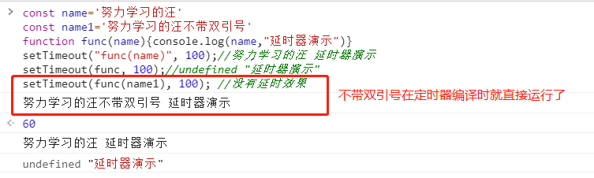
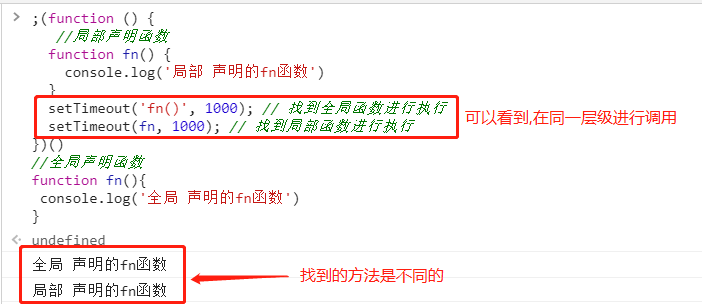

# #问题说明

>之前在学习JS时并没有发现的关于定时器的细节:定时器第一个参数可以带双引号,且调用方式、作用域发生了改变
>
>这还是本人在刷JS专项题目的时候发现的,想看题的同学可以点我传送  --> **[JavaScript专项练习](https://gitee.com/hongjilin/hongs-study-notes/tree/master/面试_面试题整理/JavaScript专项练习)** 

# Ⅰ- 问题的提出

### 1、代码示例

>```js
>function func(){console.log("延时器演示")}
>setTimeout(func, 0);
>setTimeout("func()", 0);
>```
>
>定时器中，两个调用函数的方法都是正确的。这时可能就有同学要提出疑问了:为什么有时候要有引号有时候不用引号,分别在什么场景会用到呢?那为什么我之前都不会遇到这个问题呢?

### 2、为什么之前没遇到这个问题

>在此之前,我使用的都是箭头函数的写法,所以都没有在意过这个问题
>
>```js
>setTimeout(()=>{ console.log("箭头函数延时器") }, 0);
>```
>
>但并不是说少遇到就不去解决,这不,在我刷题的时候就遇到了.....

### 3、什么场景会用?

>当你想用定时器，调用函数的时候，给函数传参的话，必须要加引号，否则会没有延时效果
>
>```js
>const name='努力学习的汪'
>const name1='努力学习的汪不带双引号'
>function func(name){console.log(name,"延时器演示")}
>setTimeout("func(name)", 100);//努力学习的汪 延时器演示
>setTimeout(func, 100);//undefined "延时器演示"
>setTimeout(func(name1), 100); //没有延时效果
>```
>
> 

# Ⅱ - 第一个参数为字符串时

### 1、实际情况会发生什么

>如果您将字符串作为函数的第一个参数传递，实际情况会发生什么
>
>```js
>setTimeout('string',number)
>```
>
>是在运行时(在经过number毫秒之后)评估的第一个参数的值。基本上它等于:
>
>```js
>setTimeout(eval('string'), number)
>```

### 2、作用域发生改变

>```js
>//它会优先寻找当前的作用域中是否有func函数,如果局部没有的话,则会依次按照顺序往上查找,直到全局作用域中。
>setTimeout(func, 0); 　　　　　　
>setTimeout("func()", 0);//而这个定时器他的寻找func函数只会从全局寻找这个方法，不会从局部寻找。
>```
>
>在全局环境中执行时，从全局环境中找，如果全局环境并没有定义**func**，且作用域链规定了外部作用域是不能访问内部作用域中的相关函数和变量的，所以会报错。

### 3、this指向发生变化

>```javascript
>//在不加引号的定时器方法中
>setTimeout(func, 0);//this的指向是指向当前函数的主人
>
>//而在加引号的定时器中
>setTimeout("func()", 0);//他的指向永远是 Window -->因为调用的是window.eval()方法进行了执行
>```

### 4、举个栗子

>1. 带引号，该方法在**全局环境**中寻找；      
>2. 不带引号，该方法在**局部环境**中寻找。     
>
>```js
>;(function () {
>   //局部声明函数
>  function fn() { 
>    console.log('局部 声明的fn函数')
>  }
>  setTimeout('fn()', 1000); // 找到全局函数进行执行
>  setTimeout(fn, 1000); // 找到局部函数进行执行
>})()
>//全局声明函数
>function fn(){
> console.log('全局 声明的fn函数')
>}
>```
>
> 

# Ⅲ - 安全问题

>尽管可能，但不应将字符串传递给setTimeout或setInterval。传递字符串使setTimeout()或setInterval()使用类似于eval()的功能，将字符串作为脚本执行，从而使任意和可能有害的脚本执行成为可能。

