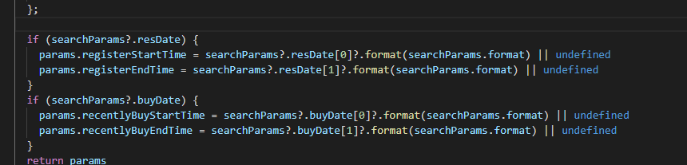

本笔记摘录及整理Monent.js相关知识点笔记

>本人全部笔记地址分享 -->[点我跳转](https://gitee.com/hongjilin/hongs-study-notes)

# #目录

>[TOC]


# 一、moment常用方法

> moment获取天的23时59分59秒可以用moment().endOf(String)，以及获取天的0时0分0秒可以用moment().startOf('day')

## 1、获取时间

### Ⅰ-获取开始(Start of Time)时间

>- ##### 获取今天0时0分0秒
>
> ```js
> moment().startOf('day')
> ```
>
>- ##### 获取本周第一天(周日)0时0分0秒
>
> ```js
> moment().startOf('week')
> ```
>
>- ##### 获取本周周一0时0分0秒
>
> ```js
> moment().startOf('isoWeek')
> ```
>
>- ##### 获取当前月第一天0时0分0秒
>
> ```js
> moment().startOf('month')
> ```
>
>- 
>  当前季度的开始时间：
>
>```js
>moment().startOf('quarter').format("YYYY-MM-DD")
>```
>
>- 指定年指定季度的开始时间：（某年某季度的开始时间）
>
>```js
>moment(moment().format("YYYY-02-01")).startOf('quarter').format("YYYY-MM-DD")
>```

 ### Ⅱ-获取结束(End of Time)时间

>格式`moment().endOf(String)`
>
>  - ##### 获取今天23时59分59秒
>
>    ```js
>    moment().endOf('day')
>    ```
>
>  - ##### 获取本周最后一天(周六)23时59分59秒
>
>    ```js
>    moment().endOf('week')
>    ```
>
>  - ##### 获取本周周日23时59分59秒
>
>    ```js
>    moment().endOf('isoWeek')
>    ```
>
>  - ##### 获取当前月最后一天23时59分59秒
>
>    ```js
>    moment().endOf('month')
>    ```
>
>
>- 当前季度的结束时间：
>
>  ```js
>  moment().endOf('quarter').format("YYYY-MM-DD")
>  ```
>
>- 指定年指定季度的结束时间：（某年某季度的结束时间）
>
>  ```js
>  moment(moment().format("YYYY-02-01")).endOf('quarter').format("YYYY-MM-DD")
>  ```

### Ⅲ-获取当前月的总天数(Days in Month)

>- 获取当前月的总天数
>
>  ```js
>  moment().daysInMonth()
>  ```

### Ⅳ- 获取时间戳(以秒为单位)

>1. 获取时间戳(以秒为单位)
>
>   ```js
>    // 获取当前时间的时间戳 (秒)  大写的X 返回值为字符串类型
>   const miao = moment().format("X")  
>    // 获取当前时间的时间戳 (毫秒)  小写的x
>   const haomiao moment().format("x")  
>   
>   moment().unix() // 返回值为数值型
>   ```
>
>2. moment时间戳与时间的转换
>
>   ```js
>   	// 获取当前时间
>       const currentTime = moment()
>       // 获取当前时间的时间戳 (秒)  大写的X
>       const miao = moment().format("X")  
>       // 获取当前时间的时间戳 (毫秒)  小写的x
>       const haomiao moment().format("x")  
>       
>       //秒时间戳转换为北京时间
>       moment.unix(miao).format('YYYY-MM-DD HH:mm:ss') 	// format 用来设置你想展示的时间格式
>   	
>   	//毫秒时间戳转换为北京时间
>   	moment(haomiao).format('YYYY-MM-DD HH:mm:ss')
>   ```

### Ⅴ- 获取具体时间(Get Time)

>1. 获取年份
>
>   ```js
>   moment().year()
>   
>   moment().get('year')
>   ```
>
>2. 获取月份
>
>   ```js
>   moment().month() (0~11, 0: January, 11: December)
>   
>   moment().get('month')
>   ```
>
>3. 获取一个月中的某一天
>
>   ```js
>   moment().date()
>   
>   moment().get('date')
>   ```
>
>4. 获取一个星期中的某一天
>
>   ```js
>   moment().day() (0~6, 0: Sunday, 6: Saturday)
>   
>   moment().weekday() (0~6, 0: Sunday, 6: Saturday) moment().isoWeekday() (1~7, 1: Monday, 7: Sunday) moment().get('day') mment().get('weekday') moment().get('isoWeekday')
>   ```
>
>5. 获取小时
>
>   ```js
>   moment().hours()
>   
>   moment().get('hours')
>   ```
>
>6. 获取分钟
>
>   ```js
>   moment().minutes()
>   
>   moment().get('minutes')
>   ```
>
>7. ##### 获取秒数
>
>   ```js
>   moment().seconds()
>   
>   moment().get('seconds')
>   ```
>
>8. ##### 获取当前的年月日时分秒
>
>   ```js
>   moment().toArray() // [years, months, date, hours, minutes, seconds, milliseconds]
>   
>   moment().toObject() // {years: xxxx, months: x, date: xx ...}
>   ```

### Ⅵ- 获取当前时间往前的时间

>```js
>moment().format("YYYY-MM-DD HH:mm:ss"); //当前时间
>
>moment().subtract(1, "days").format("YYYY-MM-DD"); //当前时间的前1天时间
>
>moment().subtract(1, "years").format("YYYY-MM-DD"); //当前时间的前1年时间
>
>moment().subtract(1, "months").format("YYYY-MM-DD"); //当前时间的前1个月时间
>
>moment().subtract(1, "weeks").format("YYYY-MM-DD"); //当前时间的前一个星期时间
>
>//如果不设置格式的去掉后面的format()即可
>
>let  date = moment().subtract(1, "months");  //设置时间为当前时间的前一个月
>```

### Ⅷ-(上/下)获取(年/季/月)

>上一年/下一年
>
>```js
>上一年：moment().add(-1, 'y').format("YYYY")
>下一年：moment().add(1, 'y').format("YYYY")
>上几年和下几年同理，做momment日期加减，月季度亦同理
>```
>
>上一季度/下一季度
>
>```js
>上一季度：moment().add(-1, 'Q').quarter()
>下一季度：moment().add(1, 'Q').quarter()
>```

### Ⅸ- 获取当前日期是当年的第几周

>此函数是网上查阅资料,摘录整理进来
>
>```js
>/**
>     * 实现当前日期是当年的第几周,再向前和向后推几周
>     * js数组保存当前日期的前后两周(共五周的数据)
>     * */
>    let initSearchMajorChanges = function(vv){
>        //实现当前日期是当年的第几周,再向前和向后推几周,js数组保存当前日期的前后两周(共五周的数据)
>        let vNowDate=moment(new moment(vv).format("YYYY-MM-DD"));//.add('month',0).add('days',-1);
>        let vWeekOfDay=moment(vNowDate).format("E");//算出这周的周几
>        let vWeekOfDays=7-vWeekOfDay-1;
>        let vStartDate=moment(vNowDate).add('days',vWeekOfDays);
>        let vEndDate=moment(vNowDate).add('days',-vWeekOfDay);
>        let vStartDateNew=moment(vStartDate).add('days',7*$scope.gWeeks);
>        let vEndDateNew=moment(vEndDate).add('days',-(7*$scope.gWeeks));
>        searchMajorChanges(vStartDateNew,vEndDateNew);
>    }
>    
>    initSearchMajorChanges('2021-06-06')
>    
>```


## 2、设置时间

>`常被用做获取某一特定时间的moment`

### Ⅰ- Set Time

>**`常用格式`**  --直接设置时间
>
>```js
>moment().year(Number), moment().month(Number)
>moment().set(String, Int)
>moment().set(Object)
>```
>
>- ##### 设置年份
>
>  ```js
>  moment().year(2019)
>  
>  moment().set('year', 2019)
>  
>  moment().set({year: 2019})
>  ```
>
>- ##### 设置月份
>
>  ```js
>  moment().month(11) (0~11, 0: January, 11: December) moment().set('month', 11) 
>  ```
>
>- ##### 设置某个月中的某一天
>
>  ```js
>  moment().date(15)
>  
>  moment().set('date', 15)
>  ```
>
>- ##### 设置某个星期中的某一天
>
>  ```js
>  moment().weekday(0) // 设置日期为本周第一天（周日）
>  
>  moment().isoWeekday(1) // 设置日期为本周周一
>  
>  moment().set('weekday', 0) moment().set('isoWeekday', 1)
>  ```
>
>- ##### 设置小时
>
>  ```js
>  moment().hours(12)
>  
>  moment().set('hours', 12)
>  ```
>
>- ##### 设置分钟
>
>  ```js
>  moment().minutes(30)
>  
>  moment().set('minutes', 30)
>  ```
>
>- ##### 设置秒数
>
>  ```js
>  moment().seconds(30)
>  
>  moment().set('seconds', 30)
>  ```

### Ⅱ- Add Time

>  **`常用格式`** --增加(符号时为减少) 时间
>  
>  ```js
>moment().add(Number, String)
>    moment().add(Object)
>```
>    
>      - ##### 设置年份
>    
>    ```js
>      moment().add(1, 'years')
>    
>      moment().add({years: 1})
>    ```
>  
>  - ##### 设置月份
>  
>    ```js
>      moment().add(1, 'months')
>    ```
>  
>  - ##### 设置日期
>  
>    ```js
>      moment().add(1, 'days')
>    ```
>  
>  - ##### 设置星期
>  
>    ```js
>      moment().add(1, 'weeks')
>    ```
>  
>  - ##### 设置小时
>  
>    ```js
>      moment().add(1, 'hours')
>    ```
>  
>  - ##### 设置分钟
>  
>    ```js
>      moment().add(1, 'minutes')
>    ```
>  
>  - ##### 设置秒数
>  
>    ```js
>      moment().add(1, 'seconds')
>    ```

### Ⅲ- Subtract Time

>**`常用格式`** --往前多少的 时间
>
>```js
>moment().subtract(Number, String)
>
>moment().subtract(Object)
>```
>
>- ##### 设置年份
>
>  ```js
>  moment().subtract(1, 'years')
>  
>  moment().subtract({years: 1})
>  ```
>
>- ##### 设置月份
>
>  ```js
>  moment().subtract(1, 'months')
>  ```
>
>- ##### 设置日期
>
>  ```js
>  moment().subtract(1, 'days')
>  ```
>
>- ##### 设置星期
>
>  ```js
>  moment().subtract(1, 'weeks')
>  ```
>
>- ##### 设置小时
>
>  ```js
>  moment().subtract(1, 'hours')
>  ```
>
>- ##### 设置分钟
>
>  ```js
>  moment().subtract(1, 'minutes')
>  ```
>
>- ##### 设置秒数
>
>  ```js
>  moment().subtract(1, 'seconds')
>  ```


## 3、格式化时间

>#### 格式:Format Time
>
>```js
>moment().format()
>moment().format(String)
>```
>
>- ##### 格式化年月日： 'xxxx年xx月xx日'
>
>  ```js
>  moment().format('YYYY年MM月DD日')
>  ```
>
>- ##### 格式化年月日： 'xxxx-xx-xx'
>
>  ```js
>  moment().format('YYYY-MM-DD')
>  ```
>
>- ##### 格式化时分秒(24小时制)： 'xx时xx分xx秒'
>
>  ```js
>  moment().format('HH时mm分ss秒')
>  ```
>
>- ##### 格式化时分秒(12小时制)：'xx:xx:xx am/pm'
>
>  ```js
>  moment().format('hh:mm:ss a')
>  ```
>
>- ##### 格式化时间戳(以秒为单位)
>
>  ```js
>  moment().format('X') // 返回值为字符串类型
>  ```
>
>- ##### 格式化时间戳(以毫秒为单位)
>
>  ```js
>  moment().format('x') // 返回值为字符串类型
>  ```

## 4、比较时间

>#### Difference
>
>```js
>moment().diff(Moment|String|Number|Date|Array)
>```
>
>- ##### 获取两个日期之间的时间差
>
>  ```js
>  let start_date = moment().subtract(1, 'weeks')
>  
>  let end_date = moment()
>  
>  end_date.diff(start_date) // 返回毫秒数 end_date.diff(start_date, 'months') // 0 end_date.diff(start_date, 'weeks') // 1 end_date.diff(start_date, 'days') // 7 start_date.diff(end_date, 'days') // -7
>  ```


## 5、转化为JavaScript原生Date对象

>  ```js
>moment().toDate()
>new Date(moment())
>  ```
>
>  - 将Moment时间转换为JavaScript原生Date对象
>
>    ```js
>    let m = moment()
>            
>    let nativeDate1 = m.toDate()
>            
>    let nativeDate2 = new Date(m) String(nativeDate1) === String(nativeDate2) // true
>    ```

## 6、引入moment时使用中文

>在入口文件处引用即可显示中文
>
>```js
>import moment from 'moment';
>
>moment.locale('zh-cn');或者moment.lang('zh-cn');即可显示中文
>```


# 二、moment问题与解决

### Ⅰ-取出Moment格式中的具体时间报错(`TS报错`)

>1. 报错:`property '_d' does not exist on type 'moment'.`
>2. 出现错误原因分析:
>
>​	
>
>3. 解决
>
>  4. 其实不用`_d`去取出来,Moment格式有相应的取出方法
>
>     


### Ⅱ- TS定义时间格式

>1. 应用场景:当我使用Antd的时间选择框时需要给其绑定的时间限制Ts格式(不设置的时候会报红),这时候就可以用monent自带的格式
>
>     
>
>2. 应用代码
>
>   ```tsx
>   //1. 导入
>   import { Moment } from 'moment';
>   //2. 定义类型接口
>   interface ISearchParams {
>     storeId: any;
>     agentId: any;
>     status: string;
>     regDate: [Moment, Moment];
>     creDate: [Moment, Moment];
>     format: string;
>     loading: boolean;
>     listLoading: boolean;
>   }
>   //3. 将定义好的ts格式赋进去
>    searchParams: ISearchParams = {
>       storeId: '',
>       agentId: '',
>       status: null,
>       regDate: undefined,
>       creDate: undefined,
>       format: 'YYYY-MM-DD',
>       loading: false,
>       listLoading: false,
>     };
>   ```


