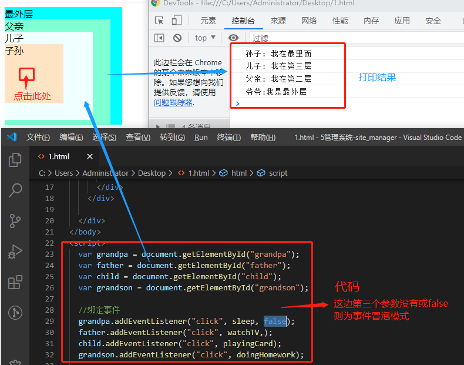
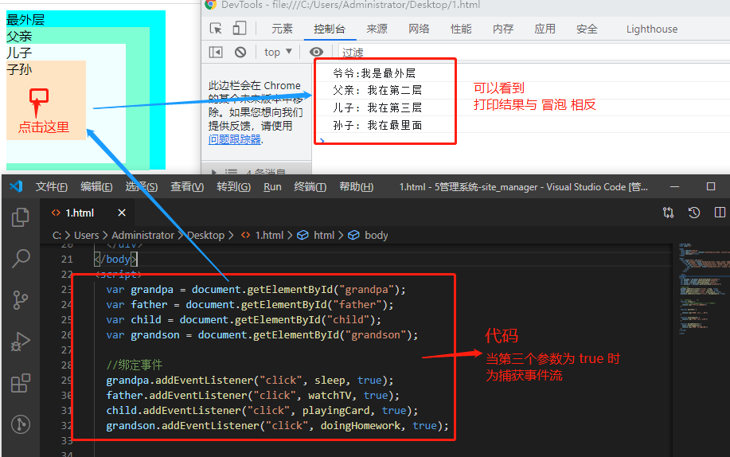
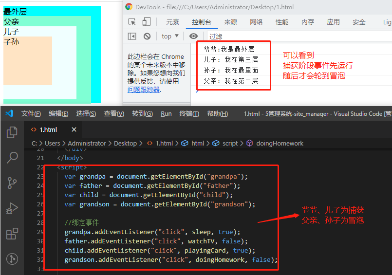
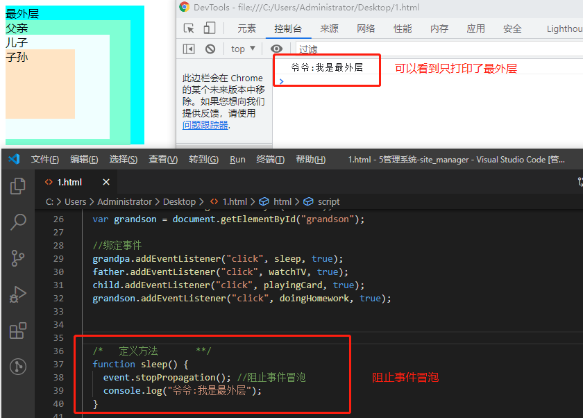

## #说明

>查阅借鉴的资料: 思否的[你真的理解事件冒泡和事件捕获吗？](https://segmentfault.com/a/1190000012729080) ; CSDN的 [addEventListener() 关于第三个参数](https://blog.csdn.net/zhangjing0320/article/details/80751622); [Javascript事件preventDefault,stopPropagation及return false的区别](https://blog.csdn.net/xingkongtianyuzhao/article/details/114433336);MDN的 [事件介绍](https://developer.mozilla.org/zh-CN/docs/Learn/JavaScript/Building_blocks/Events); 知乎的 **[细说addEventListener与事件捕获、事件冒泡](https://www.imooc.com/article/9833)**
>
>除此笔记外大家可以看我其他笔记 :**[全栈笔记](https://gitee.com/hongjilin/hongs-study-notes/tree/master)**、**[数据结构与算法](https://gitee.com/hongjilin/hongs-study-notes/tree/master/编程_算法及课程基础学习笔记/数据结构与算法)**、**[编程_前端开发学习笔记](https://gitee.com/hongjilin/hongs-study-notes/tree/master/编程_前端开发学习笔记)**、**[编程_后台服务端学习笔记](https://gitee.com/hongjilin/hongs-study-notes/tree/master/编程_后台服务端学习笔记)** 、**[Java](https://gitee.com/hongjilin/hongs-study-notes/tree/master/编程_后台服务端学习笔记/Java)** 、**[Nodejs](https://gitee.com/hongjilin/hongs-study-notes/tree/master/编程_后台服务端学习笔记/Nodejs)** 、**[JavaScript笔记](https://gitee.com/hongjilin/hongs-study-notes/tree/master/编程_前端开发学习笔记/HTML+CSS+JS基础笔记/JavaScript笔记)**、**[编程工具使用笔记](https://gitee.com/hongjilin/hongs-study-notes/tree/master/编程_前端开发学习笔记/A_前端工具使用笔记)** 、**[前端代码规范](https://gitee.com/hongjilin/hongs-study-notes/tree/master/编程_前端开发学习笔记/A_前端代码规范)** 、**[Git学习笔记](https://gitee.com/hongjilin/hongs-study-notes/tree/master/编程_前端开发学习笔记/Git学习笔记)** 、**[ES6及后续版本学习笔记](https://gitee.com/hongjilin/hongs-study-notes/tree/master/编程_前端开发学习笔记/ES6及后续版本学习笔记)** 、**[Vue笔记整合](https://gitee.com/hongjilin/hongs-study-notes/tree/master/编程_前端开发学习笔记/Vue笔记整合)** 、**[React笔记](https://gitee.com/hongjilin/hongs-study-notes/tree/master/编程_前端开发学习笔记/React笔记)**、**[微信小程序学习笔记](https://gitee.com/hongjilin/hongs-study-notes/tree/master/编程_前端开发学习笔记/微信小程序学习笔记)**、**[Chrome开发使用及学习笔记](https://gitee.com/hongjilin/hongs-study-notes/tree/master/编程_前端开发学习笔记/Chrome开发使用及学习笔记)** 以及许多其他笔记就不一一例举了


## 1、addEventListner基本用法

>在复杂的项目中,JS与html的解耦变得至关重要.W3C为我们提供了 `addEventListener()` 函数用来为指定的dom元素动态绑定事件,这个函数有三个参数:
>
>* 第一个参数是事件类型 (如'click')
>* 第二个参数是事件触发后调用的函数
>* 第三个参数是个布尔值: 默认是false(冒泡阶段执行)  true(捕获阶段产生) 
>
>一般来说,前面两个参数就足以满足我们为按钮绑定事件的需求了
>
>###### 实际代码
>
>```html
><!DOCTYPE html>
><html lang="en">
><head>
>  <meta charset="UTF-8">
>  <meta name="viewport" content="width=device-width, initial-scale=1.0">
>  <title>Document</title>
></head>
><body>
>  <div class="main" id="main">
>    <div id="grandpa" style="background-color: aqua; width: 200px;height: 200px;">最外层爷爷
>      <div id="father" style="background-color: aquamarine; width: 180px;height: 180px;">父亲
>        <div id="child" style="background-color: azure; width: 150px;height: 150px;">儿子
>          <div id="grandson" style="background-color: bisque; width: 100px;height: 100px;">孙子</div>
>        </div>
>      </div>
>    </div>
>
>  </div>
></body>
><script>
>  var grandpa = document.getElementById("grandpa");
>  var father = document.getElementById("father");
>  var child = document.getElementById("child");
>  var grandson = document.getElementById("grandson");
>
>  //绑定事件,true为捕获阶段产生
>  grandpa.addEventListener("click", sleep, true);
>  father.addEventListener("click", watchTV, true);
>  child.addEventListener("click", playingCard, true);
>  grandson.addEventListener("click", doingHomework, true);
>
>
>
>  /*   定义方法       **/
>  function sleep() {
>    // event.stopPropagation(); //阻止事件冒泡
>    console.log("爷爷:我是最外层");
>  }
>
>  function watchTV() {
>
>    console.log("父亲: 我在第二层");
>  }
>
>  function playingCard() {
>    console.log("儿子: 我在第三层");
>  }
>
>  function doingHomework() {
>    event.stopPropagation();
>    console.log("孙子: 我在最里面");
>  }
></script>
>
></html>
>```
>
>**下方其他栗子都是基于此代码举例,所以下方代码将只给出代码块**


## 2、事件冒泡概念

>`IE`的事件流叫做事件冒泡. 
>
>* 即事件开始时由 **最具体的元素**(点击处文档中嵌套层次最深的那个节点) 接收到
>* 然后逐级向上传播到较为不具体的节点(文档)
>* 所有现代浏览器都支持事件冒泡,并且会一直冒泡到`Window`
>* **即内部元素的事件会先被触发，然后再触发外部元素**
>
>事件流如图: 
>
>###### 具体示例:
>
> 

## 3、事件捕获概念

>事件捕获的思想时不太具体的节点应该更早地接收到事件,而在最具体的节点应该最后接收到事件
>
>* 事件捕获的用途在于 **事件到达预定目标之前捕获他** 
>* `IE9+`以上支持他,但因为老版本浏览器不支持,所以很少有人使用事件捕获
>* 它从`window`开始捕获(尽管有些地方规定从document开始)
>
>事件流如图: 
>
>###### 具体实例:
>
> 

## 4、DOM事件流

>'DOM2级事件' 规定事件流包括三个阶段: 事件捕获阶段、处于目标阶段、事件冒泡阶段
>
>* 首先发生事件的捕获,为截获事件提供了机会
>* 然后是实际的目标接受了事件
>* 最后一个阶段是冒泡阶段,可以在这个阶段对事件做出响应
>
> 

## 5、事件冒泡与事件捕获如果同时进行会怎样?

>###### 跟我一样善于思考的同学们肯定也会思考这么一个问题: 
>
>>在上述代码中的 `addEventListener()` 第三个参数,如果一部分是true 一部分是false;就是一部分为冒泡一部分为捕获,这时候的运行结果是什么?
>>
>>实际上我们的浏览器更倾向于使用 **事件捕获**:
>>
>>* 他会先把 **第三个参数为true** 的元素绑定事件按照正常顺序绑定事件
>>* 然后才会为 **第三个参数为false** 的元素按照冒泡事件的顺序执行绑定的事件
>
>###### 直接上结果:
>
> 

## 6、阻止事件冒泡与捕获

>我们可以利用事件对象event的 `stopPropagation()` 方法阻止事件的进一步传播
>
>* 值得注意的是: event.stopPropagation
>
>```js
>//这里我们可以修改爷爷绑定的事件
>  /*   定义方法       **/
>  function sleep() {
>    event.stopPropagation(); //阻止事件冒泡
>    console.log("爷爷:我是最外层");
>  }
>```
>
> 

## 7、preventDefault 及 stopPropagation函数以及`return false`的作用与区别?

>实际上因为本人在实际开发中基本就没用到这两个函数,所以在一次别人问我关于这个的问题时我是一脸?
>
>所以我专门来学习并梳理这一块的知识点笔记

### Ⅰ -  event.stopPropagation()

>###### 这个函数是阻止事件冒泡:实际上在上面的内容已经解释过了,这里当作复习再叙述一遍
>
>>事件可以再各层级的节点中传递,不管是冒泡还是捕获,有时我们希望事件在特定节点执行完后不再传递,就可以使用 `event.stopProgation()`来阻止事件冒泡
>
>当然,他只会阻止事件传播,并不会阻止事件本身的默认行为(如a标签的跳转)

### Ⅱ - event.preventDefault()

>###### **此函数是阻止默认行为触发**,什么是默认行为?
>
>>即标签属性本身具备的功能,就是类似于a标签所带的href与submit所带的提交等
>>
>>对于默认行为,浏览器**优先执行事件函数后 再执行默认行为**
>
>当然,他不会阻止事件传播,所以可以两个搭配着用

### Ⅲ -  return false

>包含特有退出执行`return false ` 之后的所有触发事件和动作都不会被执行,有时候`return false` 可以替代`event.stopPropagation`和`event.preventDefult()`来阻止默认行为发生和冒泡
>
>```html
><body>
>    <br />
>    <div>
>         <a href="http://www.baidu.com">点击</a>
>    </div>
>    <script type="text/javascript">
>        document.querySelector('a').onclick=function(){
>            alert('警告');
>            return false;
>        }
>    </script>
></body>
>```
>
>结果只是出现了警告的弹窗,并没有跳转到百度页面
>
>如果将 `retuen false` 提前到 `alert('警告')` 的前面,结果就是什么都不显示,原因是 return false 会中止事件与默认行文

### Ⅳ - `return false ` 和 `event.stopPropagation`区别?

>* `return false` 不仅阻止了冒泡而且还阻止了事件本身
>* `event.stopPropagation()`只阻止了冒泡
>
>注意: 虽然`teturn false` 能够替代前面两个阻止默认行为和冒泡函数,但也有其他作用(比如中止循环);可能导致不可预料的结果,所以推荐还是使用前两者更好,提高代码的高效性 
