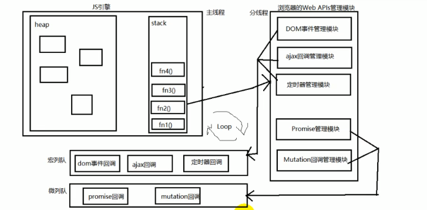
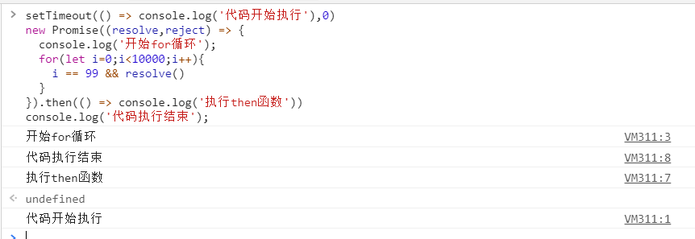
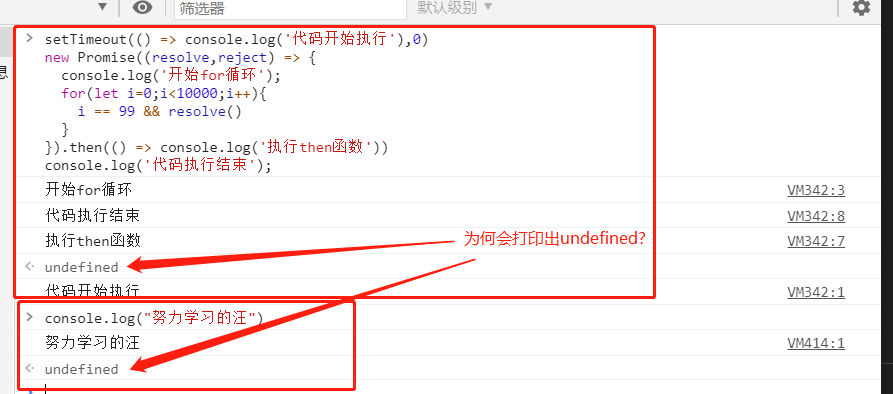
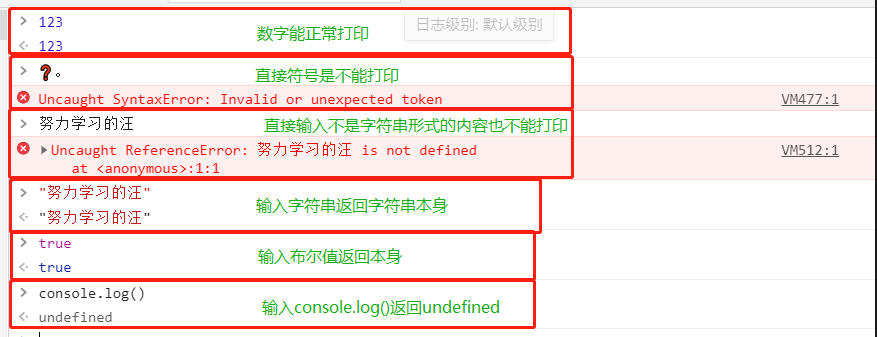
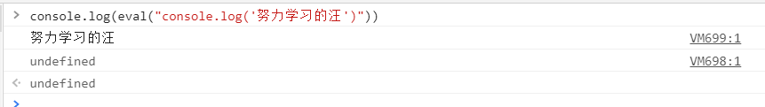

# #说明

>该笔记为观看`尚硅谷Web前端Promise教程从入门到精通（2021抢先版）`与`尚硅谷Promise教程(promise前端进阶必学)`两个课程视频以及参考其课件整理而成
>
>仅本人洪用作Promise知识点补缺及系统学习记录使用
>
>此部分知识为学习axios预备知识,预备知识链:[ajax](https://gitee.com/hongjilin/hongs-study-notes/tree/master/%E7%BC%96%E7%A8%8B_%E5%89%8D%E7%AB%AF%E5%BC%80%E5%8F%91%E5%AD%A6%E4%B9%A0%E7%AC%94%E8%AE%B0/Ajax%E3%80%81Axios%E5%AD%A6%E4%B9%A0%E7%AC%94%E8%AE%B0) --> [promise](https://gitee.com/hongjilin/hongs-study-notes/tree/master/%E7%BC%96%E7%A8%8B_%E5%89%8D%E7%AB%AF%E5%BC%80%E5%8F%91%E5%AD%A6%E4%B9%A0%E7%AC%94%E8%AE%B0/Promise%E5%AD%A6%E4%B9%A0%E7%AC%94%E8%AE%B0) --> [axios](https://gitee.com/hongjilin/hongs-study-notes/tree/master/%E7%BC%96%E7%A8%8B_%E5%89%8D%E7%AB%AF%E5%BC%80%E5%8F%91%E5%AD%A6%E4%B9%A0%E7%AC%94%E8%AE%B0/Ajax%E3%80%81Axios%E5%AD%A6%E4%B9%A0%E7%AC%94%E8%AE%B0)  --> [react](https://gitee.com/hongjilin/hongs-study-notes/tree/master/%E7%BC%96%E7%A8%8B_%E5%89%8D%E7%AB%AF%E5%BC%80%E5%8F%91%E5%AD%A6%E4%B9%A0%E7%AC%94%E8%AE%B0/React%E7%AC%94%E8%AE%B0)/[vue](https://gitee.com/hongjilin/hongs-study-notes/tree/master/%E7%BC%96%E7%A8%8B_%E5%89%8D%E7%AB%AF%E5%BC%80%E5%8F%91%E5%AD%A6%E4%B9%A0%E7%AC%94%E8%AE%B0/Vue%E7%AC%94%E8%AE%B0%E6%95%B4%E5%90%88)
>
>本人笔记地址分享:[`全部笔记`](https://gitee.com/hongjilin/hongs-study-notes)、[`Promise笔记`](https://gitee.com/hongjilin/hongs-study-notes/tree/master/%E7%BC%96%E7%A8%8B_%E5%89%8D%E7%AB%AF%E5%BC%80%E5%8F%91%E5%AD%A6%E4%B9%A0%E7%AC%94%E8%AE%B0/Promise%E5%AD%A6%E4%B9%A0%E7%AC%94%E8%AE%B0)
>
>​										记录时间:2021-3-10晚启  截至3/16学完(周末休息)

# #目录

>[TOC]

# 一、Promise的理解与使用

>1、概念:
>
>​	Promise是`异步编程的一种解决方案`，比传统的解决方案——回调函数和事件——更合理和更强大。所谓Promise，简单说就是一个容器，里面保存着某个未来才会结束的事件（通常是一个异步操作）的结果。
>
>通俗讲，`Promise是一个许诺、承诺`,是对未来事情的承诺，承诺不一定能完成，但是无论是否能完成都会有一个结果。
>
>​	Pending  正在做。。。
>
>​	Resolved 完成这个承诺
>
>​	Rejected 这个承诺没有完成，失败了
>
>​	Promise 用来预定一个不一定能完成的任务，要么成功，要么失败
>
>​	在具体的程序中具体的体现，通常用来封装一个异步任务，提供承诺结果
>
>Promise 是异步编程的一种解决方案，`主要用来解决回调地狱的问题，可以有效的减少回调嵌套`。真正解决需要`配合async/await`
>
>2、特点:
>
>​	(1)对象的状态不受外界影响。Promise对象代表一个异步操作，有三种状态：Pending（进行中）、Resolved（已完成，又称Fulfilled）和Rejected（已失败）。只有异步操作的结果，可以决定当前是哪一种状态，任何其他操作都无法改变这个状态。
>
>​	(2)一旦状态改变，就不会再变，任何时候都可以得到这个结果。Promise对象的状态改变，只有两种可能：从Pending变为Resolved和从Pending变为Rejected。只要这两种情况发生，状态就凝固了，不会再变了，会一直保持这个结果。就算改变已经发生了，你再对Promise对象添加回调函数，也会立即得到这个结果。
>
>3、缺点:
>
>​	(1)无法取消Promise，一旦新建它就会立即执行，无法中途取消。和一般的对象不一样，无需调用。
>
>​	(2)如果不设置回调函数，Promise内部抛出的错误，不会反应到外部。
>
>​	(3)当处于Pending状态时，无法得知目前进展到哪一个阶段（刚刚开始还是即将完成）

------

## 1、Promise是什么?

#### Ⅰ-理解

>1. 抽象表达:  
>
>​	1) Promise 是一门新的技术(ES6 规范) 
>
>​	2)Promise 是 JS 中`进行异步编程`的新解决方案 备注：旧方案是单纯使用回调函数
>
>2. 具体表达: 
>
>   1) 从语法上来说: Promise 是一个`构造函数`
>
>   2) 从功能上来说: promise 对象用来封装一个异步操作并可以获取其成功/ 失败的结果值

#### Ⅱ-promise 的状态

##### 	a) promise 的状态

>实例对象中的一个属性 『PromiseState』
>
>* pending  未决定的
>* resolved / fullfilled  成功
>* rejected  失败

##### 	b) promise 的状态改变

>1. pending 变为 resolved 
>
>2. pending 变为 rejected
>
>   说明: `只有这 2 种`, 且一个 promise 对象`只能改变一次` 无论变为成功还是失败, 都会有一个结果数据 成功的结果数据一般称为 value, 失败的结果数据一般称为 reason

#### Ⅲ-promise的基本流程

>

#### Ⅳ-promise的基本使用

###### 1.使用 promise 封装基于定时器的异步

```js
<script >
  function doDelay(time) {
    // 1. 创建 promise 对象(pending 状态), 指定执行器函数
    return new Promise((resolve, reject) => {
      // 2. 在执行器函数中启动异步任务
      console.log('启动异步任务')
      setTimeout(() => {
        console.log('延迟任务开始执行...')
        const time = Date.now() // 假设: 时间为奇数代表成功, 为偶数代表失败
        if (time % 2 === 1) { // 成功了
          // 3. 1. 如果成功了, 调用 resolve()并传入成功的 value
          resolve('成功的数据 ' + time)
        } else { // 失败了
          // 3.2. 如果失败了, 调用 reject()并传入失败的 reason
          reject('失败的数据 ' + time)
        }
      }, time)
    })
  }
const promise = doDelay(2000)
promise.then(// promise 指定成功或失败的回调函数来获取成功的 vlaue 或失败的 reason
    value => {// 成功的回调函数 onResolved, 得到成功的 vlaue
      console.log('成功的 value: ', value)
    },
    reason => { // 失败的回调函数 onRejected, 得到失败的 reason
      console.log('失败的 reason: ', reason)
    },
  ) <
  /script>
```

###### 2.使用 promise 封装 ajax 异步请求

```js
<script >
  /*
  可复用的发 ajax 请求的函数: xhr + promise
  */
  function promiseAjax(url) {
    return new Promise((resolve, reject) => {
      const xhr = new XMLHttpRequest()
      xhr.onreadystatechange = () => {
        if (xhr.readyState !== 4) return
        const {
          status,
          response
        } = xhr
        // 请求成功, 调用 resolve(value)
        if (status >= 200 && status < 300) {
          resolve(JSON.parse(response))
        } else { // 请求失败, 调用 reject(reason)
          reject(new Error('请求失败: status: ' + status))
        }
      }
      xhr.open("GET", url)
      xhr.send()
    })
  }
promiseAjax('https://api.apiopen.top2/getJoke?page=1&count=2&type=vid
    eo ')
    .then(
      data => {
        console.log('显示成功数据', data)
      },
      error => {
        alert(error.message)
      }
    ) </script>
```

###### 3.fs模块使用Promise

```js
const fs = require('fs');

//回调函数 形式----------------------------------------------------
 fs.readFile('./resource/content.txt', (err, data) => {
     // 如果出错 则抛出错误
     if(err)  throw err;
     //输出文件内容
     console.log(data.toString());
 });

//Promise 形式-----------------------------------------------------------
/**
 * 封装一个函数 mineReadFile 读取文件内容
 * 参数:  path  文件路径
 * 返回:  promise 对象
 */
function mineReadFile(path){
    return new Promise((resolve, reject) => {
        //读取文件
        require('fs').readFile(path, (err, data) =>{
            //判断
            if(err) reject(err);
            //成功
            resolve(data);
        });
    });
}

mineReadFile('./resource/content.txt')
.then(value=>{
    //输出文件内容
    console.log(value.toString());
}, reason=>{
    console.log(reason);
});

```

###### 4.异常穿透

> 可以在每个then()的第二个回调函数中进行err处理,也可以利用异常穿透特性,到最后用`catch`去承接统一处理,两者一起用时,前者会生效(因为err已经将其处理,就不会再往下穿透)而走不到后面的catch
>
> 在每个.then()中我可以将数据再次传出给下一个then()

```js
mineReadFile('./11.txt').then(result=>{
  console.log(result.toString())
  return result
},err=>console.log(err))
.then(data=>console.log(data,"2222222"))
.catch(err=>console.log("这是catch的"))
```

###### 5.`util.promisify方法`

>可以将函数直接变成promise的封装方式,不用再去手动封装

```js
//引入 util 模块
const util = require('util');
//引入 fs 模块
const fs = require('fs');
//返回一个新的函数
let mineReadFile = util.promisify(fs.readFile);

mineReadFile('./resource/content.txt').then(value => {
  console.log(value.toString());
});
```

------


## 2、为什么要用Promise?

### Ⅰ-指定回调函数的方式更加灵活

>1. 旧的: 必须在启动异步任务前指定 
>2. promise: 启动异步任务 => 返回promie对象 => 给promise对象绑定回调函 数(甚至可以在异步任务结束后指定/多个)

### Ⅱ-支持链式调用, 可以解决回调地狱问题

##### 	1、什么是回调地狱

>回调函数嵌套调用, 外部回调函数异步执行的结果是嵌套的回调执行的条件
>
>

##### 	2、回调地狱的缺点?

>不便于阅读 不便于异常处理

##### 	3、解决方案?

> promise `链式调用`,
>
> 用来解决回调地狱问题，但是`只是简单的改变格式`，并没有彻底解决上面的问题真正要解决上述问题，一定要利用promise再加上await和async关键字实现异步传同步

##### 	4、终极解决方案?

> promise +async/await

------


## 3、Promise中的常用API

#### 	Ⅰ- Promise 构造函数: Promise (excutor) {}

>(1) executor 函数: 执行器 (resolve, reject) => {}
>
>(2) resolve 函数: 内部定义成功时我们调用的函数 value => {} 
>
>(3) reject 函数: 内部定义失败时我们调用的函数 reason => {} 
>
>说明: executor 会在 Promise 内部立即`同步调用`,异步操作在执行器中执行,换话说Promise支持同步也支持异步操作

#### 	Ⅱ-Promise.prototype.then 方法: (onResolved, onRejected) => {}

>(1) onResolved 函数: 成功的回调函数 (value) => {} 
>
>(2) onRejected 函数: 失败的回调函数 (reason) => {} 
>
>说明: 指定用于得到成功 value 的成功回调和用于得到失败 reason 的失败回调 返回一个新的 promise 对象

#### 	 Ⅲ-Promise.prototype.catch 方法: (onRejected) => {}

>(1) onRejected 函数: 失败的回调函数 (reason) => {}
>
>说明: then()的语法糖, 相当于: then(undefined, onRejected)
>
>(2) 异常穿透使用:当运行到最后,没被处理的所有异常错误都会进入这个方法的回调函数中	

#### 	Ⅳ-Promise.resolve 方法: (value) => {}

>(1) value: 成功的数据或 promise 对象 
>
>说明: 返回一个成功/失败的 promise 对象,直接改变promise状态
>
>```js
>	let p3 = Promise.reject(new Promise((resolve, reject) => {  resolve('OK'); }));      
>	console.log(p3);
>```

#### 	Ⅴ-Promise.reject 方法: (reason) => {}

>(1) reason: 失败的原因 
>
>说明: 返回一个失败的 promise 对象,直接改变promise状态,`代码示例同上`

#### Ⅵ-Promise.all 方法: (promises) => {}

>promises: 包含 n 个 promise 的数组 
>
>说明: 返回一个新的 promise, 只有所有的 promise `都成功才成功`, 只要有一 个失败了就直接失败
>
>```js
>  		let p1 = new Promise((resolve, reject) => { resolve('OK');  })
>        let p2 = Promise.reject('Error');
>        let p3 = Promise.resolve('Oh Yeah')
>        const result = Promise.all([p1, p2, p3]);
>  		 console.log(result);
>```

#### Ⅶ-Promise.race 方法: (promises) => {}

>(1) promises: 包含 n 个 promise 的数组 
>
>说明: 返回一个新的 promise, `第一个完成`的 promise 的结果状态就是最终的结果状态,
>
>如p1延时,开启了异步,内部正常是同步进行,所以`p2>p3>p1`,结果是`P2`
>
>```js
>  let p1 = new Promise((resolve, reject) => {
>      setTimeout(() => {
>        resolve('OK');
>      }, 1000);
>    })
>    let p2 = Promise.resolve('Success');
>    let p3 = Promise.resolve('Oh Yeah');
>    //调用
>    const result = Promise.race([p1, p2, p3]);
>    console.log(result);
>```

------


## 4、Promise的几个关键问题

#### Ⅰ-如何改变 promise 的状态?

>(1) resolve(value): 如果当前是 pending 就会变为 resolved 
>
>(2) reject(reason): 如果当前是 pending 就会变为 rejected 
>
>(3) 抛出异常: 如果当前是 pending 就会变为 rejected

#### Ⅱ-一个 promise 指定多个成功/失败回调函数, 都会调用吗?

>当 promise `改变为对应状态时`都会调用,改变状态后,多个回调函数都会调用,并不会自动停止
>
>```js
> let p = new Promise((resolve, reject) => {  resolve('OK');});
>        ///指定回调 - 1
>        p.then(value => {  console.log(value); });
>        //指定回调 - 2
>        p.then(value => { alert(value);});
>```

#### Ⅲ- 改变 promise 状态和指定回调函数谁先谁后?

>(1) 都有可能, 正常情况下是先指定回调再改变状态, 但也可以先改状态再指定回调 
>
>​	先指定回调再改变状态(`异步`):先指定回调--> 再改变状态 -->改变状态后才进入异步队列执行回调函数
>
>​	先改状态再指定回调(`同步`):改变状态 -->指定回调 `并马上执行`回调
>
>(2) 如何先改状态再`指定`回调?   -->注意:指定并不是执行
>
>​	① 在执行器中直接调用 resolve()/reject() -->即,不使用定时器等方法,执行器内直接同步操作 
>
>​	② 延迟更长时间才调用 then() 	-->即,在`.then()`这个方法外再包一层例如延时器这种方法
>
>(3) 什么时候才能得到数据? 
>
>​	① 如果先指定的回调, 那当状态发生改变时, 回调函数就会调用, 得到数据 
>
>​	② 如果先改变的状态, 那当指定回调时, 回调函数就会调用, 得到数据
>
>```js
>    let p = new Promise((resolve, reject) => {
>      //异步写法,这样写会先指定回调,再改变状态
>      setTimeout(() => {resolve('OK'); }, 1000);
>      //这是同步写法,这样写会先改变状态,再指定回调
>      resolve('OK'); 
>    });
>    p.then(value => {console.log(value);}, reason => {})
>```
>
> (4) 个人理解--结合源码
>
>​	源码中,promise的状态是通过一个`默认为padding`的变量进行判断,所以当你`resolve/reject`延时(异步导致当then加载时,状态还未修改)后,这时直接进行p.then()会发现,目前状态还是`进行中`,所以只是这样导致只有同步操作才能成功.
>
>​	所以promise将传入的`回调函数`拷贝到promise对象实例上,然后在`resolve/reject`的执行过程中再进行调用,达到异步的目的
>
>​	具体代码实现看下方自定义promise

#### Ⅳ-promise.then()返回的新 promise 的结果状态由什么决定?

>(1) 简单表达: 由 then()指定的回调函数执行的结果决定 
>
>(2) 详细表达: 
>
>​	① 如果抛出异常, 新 promise 变为 rejected, reason 为抛出的异常 
>
>​	② 如果返回的是非 promise 的任意值, 新 promise 变为 resolved, value 为返回的值 
>
>​	③ 如果返回的是另一个新 promise, 此 promise 的结果就会成为新 promise 的结果
>
>```js
>  let p = new Promise((resolve, reject) => {
>      resolve('ok');
>    });
>    //执行 then 方法
>    let result = p.then(value => {
>      console.log(value);
>      // 1. 抛出错误 ,变为 rejected
>      throw '出了问题';
>      // 2. 返回结果是非 Promise 类型的对象,新 promise 变为 resolved
>      return 521;
>      // 3. 返回结果是 Promise 对象,此 promise 的结果就会成为新 promise 的结果
>      return new Promise((resolve, reject) => {
>        // resolve('success');
>        reject('error');
>      });
>    }, reason => {
>      console.warn(reason);
>    });
>```

#### Ⅴ- promise 如何串连多个操作任务?

>(1) promise 的 then()返回一个新的 promise, 可以开成 then()的链式调用 
>
>(2) 通过 then 的链式调用串连多个同步/异步任务,这样就能用`then()`将多个同步或异步操作串联成一个同步队列
>
>```js
> <script>
>   let p = new Promise((resolve, reject) => { setTimeout(() => {resolve('OK'); }, 1000); });
>   p.then(value => {return new Promise((resolve, reject) => { resolve("success"); });})
>    .then(value => {console.log(value);})
>    .then(value => { console.log(value);})
>  </script>
>```

#### Ⅵ-promise 异常传透?

>(1) 当使用 promise 的 then 链式调用时, 可以在最后指定失败的回调,  
>
>(2) 前面任何操作出了异常, 都会传到最后失败的回调中处理
>
>注:可以在每个then()的第二个回调函数中进行err处理,也可以利用异常穿透特性,到最后用`catch`去承接统一处理,两者一起用时,前者会生效(因为err已经将其处理,就不会再往下穿透)而走不到后面的catch

#### Ⅶ- 中断 promise 链?

>在`关键问题2`中,可以得知,当promise状态改变时,他的链式调用都会生效,那如果我们有这个一个实际需求:我们有5个then(),但其中有条件判断,如当我符合或者不符合第三个then条件时,要直接中断链式调用,不再走下面的then,该如何?
>
>(1) 当使用 promise 的 then 链式调用时, 在中间中断, 不再调用后面的回调函数 
>
>(2) 办法: 在回调函数中返回一个 `pendding` 状态的`promise 对象`
>
>```js
> <script>
>    let p = new Promise((resolve, reject) => {setTimeout(() => { resolve('OK');}, 1000);});
>    p.then(value => {return new Promise(() => {});})//有且只有这一个方式
>    .then(value => { console.log(222);})
>    .then(value => { console.log(333);})
>    .catch(reason => {console.warn(reason);});
>  </script>
>```


# 二、自定义Promise手写

>1. 下方的`Promise.prototype.then`与`Promise.resolve`为什么一个挂载在`prototype`而另一个挂载在实例对象上?
>
>   解:原因是分别为静态方法与实例方法 
>
>   -->上面的需要new实例化的时候自动继承实例`prototype`上的方法和属性,所以用`实例对象.then()`来调用,而下面的Promise.resolve是静态方法,不用new,是可以直接Promise.resolve()调用

## Ⅰ-Promise的实例方法实现

### 1 - 初始结构搭建

> html引入,该章节后续html大部分重复 除非必要,否则不再放上来

```html
<!DOCTYPE html>
<html lang="en">
<head>
    <meta charset="UTF-8">
    <meta name="viewport" content="width=device-width, initial-scale=1.0">
    <title>Promise-封装 | 1 - 初始结构搭建</title>
    <script src="./promise.js"></script>
</head>
<body>
    <script>
        let p = new Promise((resolve, reject) => {
            resolve('OK');
        });
        p.then(value => {
            console.log(value);
        }, reason=>{
            console.warn(reason);
        })
    </script>
</body>
</html>
```

> promise.js  -->使用原生写法,最后会改为class写法

```js
function Promise(executor){}
//添加 then 方法
Promise.prototype.then = function(onResolved, onRejected){}
```

### 2 - resolve 与 reject构建与基础实现

>1. 使用`const self = this;`保存this执行,使function中可以取得当前实例
>
>   ps:可以不使用该方法保存,但是下方function需要`改为箭头函数`,否则`function默认指向是window`
>
>   之后代码默认使用`self`保存this,箭头函数方式将在最后改为class写法时使用
>
>2. 默认设置 `PromiseState = 'pending'以及 PromiseResult = null`,这就是promise状态基础

```js
//声明构造函数
function Promise(executor) {
  //添加属性
  this.PromiseState = 'pending';
  this.PromiseResult = null;
  //保存实例对象的 this 的值
/*  此处可以不写,但是下面function方法需要改为箭头函数,否则function默认指向是window */
  const self = this; 
  //resolve 函数
  function resolve(data) {--------------------------------------------
    //1. 修改对象的状态 (promiseState)
    self.PromiseState = 'fulfilled'; // resolved
    //2. 设置对象结果值 (promiseResult)
    self.PromiseResult = data;
  }
  //reject 函数
  function reject(data) {----------------------------------------------
    //1. 修改对象的状态 (promiseState)
    self.PromiseState = 'rejected'; // 
    //2. 设置对象结果值 (promiseResult)
    self.PromiseResult = data;
  }
  //同步调用『执行器函数』
  executor(resolve, reject);
}
//添加 then 方法
Promise.prototype.then = function (onResolved, onRejected) {}
```

### 3 - throw 抛出异常改变状态 

>1. 在2的基础上进行修改:将执行器放入`try-catch()`中
>2. 在catch中使用`reject()`修改 promise 对象状态为『`失败`』

```js
 try {
    //同步调用『执行器函数』
    executor(resolve, reject);
  } catch (e) {
    //修改 promise 对象状态为『失败』
    reject(e);
  }
```

### 4 - 状态只能修改一次

>1. 基于2 3代码中resolve和reject方法进修改
>
>2. 在成功与失败函数中添加判断` if(self.PromiseState !== 'pending') return;`,如果进入函数时状态不为`pending`直接退出,这样就能做到状态只能从`pending`改至其他状态且做到只能改一次

```js
html调用--------------------------------------------------------
 let p = new Promise((resolve, reject) => {
      reject("error");
      resolve('OK');
      //抛出异常
      // throw "error";
    });
 console.log(p);
promise.js修改--------------------------------------------------------

  //resolve 函数
    function resolve(data){
        //判断状态
        if(self.PromiseState !== 'pending') return;
        //1. 修改对象的状态 (promiseState)
        self.PromiseState = 'fulfilled';// resolved
        //2. 设置对象结果值 (promiseResult)
        self.PromiseResult = data;
    }
    //reject 函数
    function reject(data){
        //判断状态
        if(self.PromiseState !== 'pending') return;
        //1. 修改对象的状态 (promiseState)
        self.PromiseState = 'rejected';// 
        //2. 设置对象结果值 (promiseResult)
        self.PromiseResult = data;
    }
```

### 5 - then 方法执行回调基础实现

> 1. 修改`Promise.prototype.then`方法
> 2. 传入`then(成功回调,失败回调)`,当调用then后,会判断当前`this.PromiseState`的状态,当其为成功时调用`成功回调`,失败时调用`失败回调`

```js
html调用------------------------------------------------------------
    let p = new Promise((resolve, reject) => {
      // resolve('OK');// reject("Error");
      throw "ERROR";
    });
    p.then(
        value => {console.log(value); }, 
        reason => {console.warn(reason);}
    )
promise.js修改与实现-----------------------------------------------------
//添加 then 方法
Promise.prototype.then = function (onResolved, onRejected) {
  //调用回调函数  PromiseState
  if (this.PromiseState === 'fulfilled') {onResolved(this.PromiseResult);}
  if (this.PromiseState === 'rejected') {onRejected(this.PromiseResult);}
}
```

### 6 - 异步任务 then 方法实现

>1. 此处对于5有四处修改,下面上`js代码`
>
>2. 当我运行`异步代码`后,我的执行器内部代码还未返回(因为用了定时器,里面的代码进入了异步队列),所以当我下面的.then()运行时:我的`p`为`pending`状态,所以根本不会执行resolve与reject方法
>
>   解:添加判断`pending`状态,将当前回调函数保存到实例对象(存到实例上是为了更方便)中,这样后续改变状态时候才调用得到
>
>3. 为什么要将回调保存到实例上而不是直接调用?
>
>   `理由`:因为我的回调函数需要在我的promise状态改变后(成功或者失败),再根据状态选择运行哪个函数
>   所以当你调用`then()`时却检测到状态为`pending`,说明这时候的promise在异步队列 不能直接运行成功或者失败函数
>
>   `解决`:因为`resolve与reject`方法与`then()`不在同一个作用域中,并不能共享`then(成功回调,失败回调)`的参数,所以在判断状态为`pending`时将回调保存到实例对象上.然后将回调函数的调用放在`resolve()与reject()`中
>
>   这样当我代码运行到异步队列的`resolve()或reject()`时,就可以在这个函数中运行回调函数,实现异步then
>
>4. 此处的then`仍有瑕疵`,需要继续完善

```js
html调用------------------------------------------------------------
 //实例化对象
    let p = new Promise((resolve, reject) => {
      setTimeout(() => {reject("error"); /* resolve('OK');*/}, 1000);
    });
    p.then(value => {console.log(value);},reason => { console.warn(reason);});
    console.log(p);

promise.js修改与实现-----------------------------------------------------
//声明构造函数
function Promise(executor) {
  this.PromiseState = 'pending'; this.PromiseResult = null;
  // 声明属性     
  this.callback = {};			-----------新添加1
  const self = this; 
    
  //resolve 函数
  function resolve(data) {
    //判断状态
    if (self.PromiseState !== 'pending') return;
    self.PromiseState = 'fulfilled'; self.PromiseResult = data;
    //调用成功的回调函数  加判断的原因是防止无回调报错
    if (self.callback.onResolved) { self.callback.onResolved(data); }  ------------新添加2 最重要 
  }
    
  //reject 函数
  function reject(data) {
    if (self.PromiseState !== 'pending') return;
    self.PromiseState = 'rejected'; self.PromiseResult = data;
    //执行回调						
    if (self.callback.onResolved) { self.callback.onResolved(data);}  ------------新添加3
  }
  try {executor(resolve, reject);} catch (e) {reject(e);}
}

//添加 then 方法
Promise.prototype.then = function (onResolved, onRejected) {
  //调用回调函数  PromiseState
  if (this.PromiseState === 'fulfilled') {onResolved(this.PromiseResult);}
  if (this.PromiseState === 'rejected') { onRejected(this.PromiseResult);}
  //判断 pending 状态
  if (this.PromiseState === 'pending') {  ------------新添加4
    //保存回调函数
    this.callback = {
      onResolved: onResolved,
      onRejected: onRejected
    }
  }
}
```

### 7 - 指定多个回调

>1. 基于6代码进行修改 只展示修改部分代码
>
>2. `6`中保存回调函数的方式有BUG,如果我有多个`.then()`,后面加载的回调函数会覆盖之前的回调函数,导致最后回调函数`有且只有`最后一个
>
>   解:使用`数组`的方式进行存储回调函数,调用时也是用数组循环取出
>
>3. 此处的then`仍有瑕疵`,需要继续完善

```js
html调用------------------------------------------------------------
//实例化对象
   let p = new Promise((resolve, reject) => {setTimeout(() => {reject('No');}, 1000);});
   p.then(value => { console.log(value);}, reason=>{console.warn(reason);});
   p.then(value => { alert(value);}, reason=>{ alert(reason);});
   console.log(p);

promise.js修改与实现-----------------------------------------------------
Promise.prototype.then = function (onResolved, onRejected) {
       //resolve 函数
    function resolve(data){
  		.....
        //调用成功的回调函数
        // if (self.callback.onResolved) { self.callback.onResolved(data); } 
        self.callbacks.forEach(item => {   --------修改1
            item.onResolved(data);
        });
    }
    //reject 函数
    function reject(data){
     	 ......
        //执行失败的回调
        // if (self.callback.onResolved) { self.callback.onResolved(data);}
        self.callbacks.forEach(item => {		------修改2
            item.onRejected(data);
        });
    }
    
  //添加 then 方法
Promise.prototype.then = function(onResolved, onRejected){
    ........
    //判断 pending 状态
    if(this.PromiseState === 'pending'){
        //保存回调函数
        //  this.callback = { onResolved: onResolved, onRejected: onRejected }
        this.callbacks.push({					--------修改3
            onResolved: onResolved,
            onRejected: onRejected
        });
    }
}
```

###  8 - 同步任务 then 返回结果

>1. 在之前的then运行结果中得知,我们使用`then`后的返回结果是其回调函数的返回结果,而我们需要的返回结果是一个新的promise对象
>
>   解:所以我们在then中`return new Promise()`,使其得到的是一个新的promise对象
>
>2. 在为`解决问题1`后产生一个新问题:新的promise对象因为没有用`rejerect与resolve`方法,导致返回的状态一直是`pending`
>
>   解:在新的promise中判断`运行回调函数`后的返回值是什么,然后根据其不同类型给其赋予不同状态
>
>   ​	Ⅰ-`if(result instanceof Promise)`:返回值一个新的②promise对象(因为是新的promise的回调函数返回值,称`②promise对象`),在返回值(因为是promise对象)的`.then()`回调函数中使用rejerect与resolve方法,将其`自身的状态`赋予外层的promise,
>
>   ​	即 回调函数中的promise 赋值 给then返回值 ,  所以 `最终返回状态==回调函数中的新promise状态`
>
>   ​	Ⅱ-如果返回值是一个`非promise`对象,返回状态设置为成功
>
>   ​	Ⅲ-如果返回值是一个异常,返回状态设置为失败

```js

html调用------------------------------------------------------------
  //实例化对象
    let p = new Promise((resolve, reject) => {resolve('OK');});
    //执行 then 方法
    const res = p.then(
     value => { throw "FAIL";},
    reason => { console.warn(reason);});
    console.log(res);

promise.js修改与实现-----------------------------------------------------
//添加 then 方法
Promise.prototype.then = function(onResolved, onRejected){
    return new Promise((resolve, reject) => {
        //调用回调函数  PromiseState
 //  if(this.PromiseState === 'fulfilled'){ onResolved(this.PromiseResult);} 未修改时代码
        if(this.PromiseState === 'fulfilled'){    -------修改1 
            try{
                //获取回调函数的执行结果
                let result = onResolved(this.PromiseResult);
                //判断
                if(result instanceof Promise){//如果是 Promise 类型的对象,我就将下一个promise结果赋予外层
                    result.then(v => {  resolve(v); },r=>{reject(r);})
                }else{resolve(result);}  //如果返回的不是promise对象,都将其赋予成功状态
            }catch(e){
                rejerect(e);	//如果出错了,则返回失败状态
            }
        }
        if(this.PromiseState === 'rejected'){ onRejected(this.PromiseResult);}------此部分修改与修改1一样
        //判断 pending 状态
        if(this.PromiseState === 'pending'){
            this.callbacks.push({ onResolved: onResolved, onRejected: onRejected});
        }
    })
}
```

### 9 \- 异步任务 then 返回结果

>1. 异步任务是修改`if(this.PromiseState === 'pending')`后面的值,原因参考`6`,下面代码只举例这部分修改
>
>2. 因为我们需要增加then状态修改,所以在我们保存回调函数这一步我们可以对于回调函数进行`加工`,`添加判断其回调函数的返回值`的代码块再存入实例的回调函数中
>
>   Ⅰ-声明一个新的函数:其内部功能->先运行`onResolved回调函数`,再将其返回值取出,进行判断其返回值(这个过程同`8`)
>
>   Ⅱ-加工后存入实例回调函数数组,之后在`resolve与reject`方法中调用即可(同`6`)

```js
html调用------------------------------------------------------------
   //实例化对象
    let p = new Promise((resolve, reject) => {
      setTimeout(() => {reject("Error");}, 1000)}); // resolve('OK');
    //执行 then 方法
    const res = p.then(value => {
      // return 'oh Yeah';  //如果有返回,根据其返回值得到相应的状态:字符串为成功,抛出为错误
      throw 'error';
    }, reason => {
      console.warn(reason, "xx"); //如果只是打印没返回,则实际上时返回一个undefined,
      //在我们封装js中,undefined会判定为非promise对象,所以状态为成功,结果为undefined
      return "sss"   // throw 'error';
    });
    console.log(res);

promise.js修改与实现-----------------------------------------------------
    //判断 pending 状态
    if (this.PromiseState === 'pending') {
      //保存回调函数
      this.callbacks.push({
          
        onResolved: function () {
          try {
            //执行成功回调函数
            let result = onResolved(self.PromiseResult);
            //判断 其结果
            if (result instanceof Promise) {
              result.then(
                  v => { resolve(v);},
                  r => {reject(r);}
                 )
            } else {resolve(result);}
          } catch (e) {reject(e);}
        },
          
        onRejected: function () {
          try {
            //执行成功回调函数
            let result = onRejected(self.PromiseResult);
            //判断
            if (result instanceof Promise) {
              result.then(
                  v => {resolve(v); },
                  r => {reject(r);}
                 )
            } else {resolve(result);}
          } catch (e) { reject(e); }
        }
      });
    }
```

### 10\- then方法代码优化

>1. 在8、9、10中可以看出,其判断与改变返回结果状态的代码块是基本重复的,所以可以将其抽出

```js
//添加 then 方法
Promise.prototype.then = function (onResolved, onRejected) {
  const self = this;
  return new Promise((resolve, reject) => {
    封装函数----------------------------------------------------------------------------
    function callback(type) {
      try {
        //获取回调函数的执行结果
        let result = type(self.PromiseResult);
        //判断
        if (result instanceof Promise) {
          //如果是 Promise 类型的对象
          result.then(v => {
            resolve(v);
          }, r => {
            reject(r);
          })
        } else {
          //结果的对象状态为『成功』
          resolve(result);
        }
      } catch (e) {
        reject(e);
      }
    }
  -----------------------------------------------------------------------------------    
    //调用回调函数  PromiseState
    if (this.PromiseState === 'fulfilled') {
      callback(onResolved);
    }
    if (this.PromiseState === 'rejected') {
      callback(onRejected);
    }
    //判断 pending 状态
    if (this.PromiseState === 'pending') {
      //保存回调函数
      this.callbacks.push({
        onResolved: function () {
          callback(onResolved);
        },
        onRejected: function () {
          callback(onRejected);
        }
      });
    }
  })
}
```

### 11 - catch 方法与异常穿透与值传递

>1. 异常穿透:添加`catch 方法 `,并且需要进行回调函数为`undefined的`处理
>
>2. 当我`then()`中只传一个回调或者不传回调函数时,运行代码会报错,因为运行时调用的回调函数是`undefined`
>
>   解:进行回调函数判断,当其为空时,基于默认回调函数内容:`直接往外抛出`这样下方的`then() or catch()`就可以承接到异常或者值

```js
html调用------------------------------------------------------------  
//实例化对象
    let p = new Promise((resolve, reject) => {
      setTimeout(() => {resolve('OK'); }, 1000);
    });
    //值传递
    p.then()
    .then(value => {console.log(222);})
      .then(value => {console.log(333);})
        .catch(reason => {console.warn(reason);});
promise.js修改与实现-----------------------------------------------------
//添加 then 方法
Promise.prototype.then = function (onResolved, onRejected) {
	...				-----------修改1
  if (typeof onRejected !== 'function') {onRejected = reason => { throw reason;}}
  if (typeof onResolved !== 'function') { onResolved = value => value;}
	 ....
}
//添加 catch 方法  
Promise.prototype.catch = function(onRejected){  ---------------异常穿透 修改2
    return this.then(undefined, onRejected);
}
```

## Ⅱ-Promise的静态方法实现

### 1 - Promise.resolve 封装

> 1. 判断传入的参数是否为`promise对象`:
>
>    Ⅰ-如果为`promise`:将其状态与结果赋值给外层promise对象
>
>    Ⅱ-如果为`非promise`:状态设置为成功

```js
html调用------------------------------------------------------------  
 const p = Promise.resolve('OK');
 const p2 = Promise.resolve(new Promise((resolve, reject) => {     
      reject("error");// resolve('Success');
    }));
 const p3 = Promise.resolve(Promise.resolve('Oh Yeah'));
 console.log(p3);

promise.js修改与实现-----------------------------------------------------
//添加 resolve 方法
Promise.resolve = function(value){
    //返回promise对象
    return new Promise((resolve, reject) => {
        if(value instanceof Promise){
            value.then(
                v=>{resolve(v);},
                r=>{reject(r);}
            )}else{resolve(value); }//状态设置为成功
    });
}
```

### 2 - Promise.resolve 封装

> 不同于resolve,这个方法只要把传入参数再次传出去,并将状态改为`失败`即可

```js
html调用------------------------------------------------------------  
   //Promise.reject
    const p = Promise.reject('Error');
    const p2 = Promise.reject(new Promise((resolve, reject) => {
      resolve('OK');
    }));
    console.log(p);
    console.log(p2);

promise.js修改与实现-----------------------------------------------------
//添加 reject 方法
Promise.reject = function (reason) {
  return new Promise((resolve, reject) => {
    reject(reason);
  });
}
```

### 3 - Promise.all 封装

> 1. 遍历传入的promise数组,每当遍历结果是成功,则用计数器记录,当计数器等同于数组长度,则全部成功,这时候可以返回`成功`状态
> 2. 如果当数组中任意一个promise的执行结果是`reject`,直接中断,返回状态为`失败`

```js
html调用------------------------------------------------------------  
let p1 = new Promise((resolve, reject) => {
      setTimeout(() => {resolve('OK'); }, 1000)
    })
    let p2 = Promise.reject('Success');
    let p3 = Promise.resolve('Oh Yeah');
    //调用 all 方法
    let result = Promise.all([p1, p2, p3]);
    console.log(result);

promise.js修改与实现-----------------------------------------------------
//添加 all 方法
Promise.all = function (promises) {
  //返回结果为promise对象
  return new Promise((resolve, reject) => {
    //声明变量
    let count = 0;
    let arr = [];
    //遍历
    for (let i = 0; i < promises.length; i++) {
      promises[i].then(v => {
        //得知对象的状态是成功
        //每个promise对象 都成功
        count++;
        //将当前promise对象成功的结果 存入到数组中
        arr[i] = v;
        //判断
        if (count === promises.length) {resolve(arr);}//修改状态
      }, r => {
        reject(r);
      });
    }
  });
}
```

### 4 - Promise.race 封装

> 直接谁先执行就返回谁的运行结果即可

```js
html调用------------------------------------------------------------  
 let p1 = new Promise((resolve, reject) => {
      setTimeout(() => {resolve('OK');});
    });
    let p2 = Promise.reject('Success');
    let p3 = Promise.resolve('Oh Yeah');
    //调用 race 方法
    let result = Promise.race([p1, p2, p3]);
    console.log(result);

promise.js修改与实现-----------------------------------------------------
//添加 race 方法
Promise.race = function (promises) {
  return new Promise((resolve, reject) => {
    for (let i = 0; i < promises.length; i++) {
      promises[i].then(v => {
        //修改返回对象的状态为 『成功』
        resolve(v);
      }, r => {
        //修改返回对象的状态为 『失败』
        reject(r);
      })
    }
  });
}
```

## Ⅲ-其他优化

### 1 - 回调函数『异步执行』

>1. 如果我们运行下面代码,正确顺序时: 111 --> 333 -->222
>
>```js
>  let p1 = new Promise((resolve, reject) => {
>      reject('OK');
>      console.log(111);
>    });
>
>    p1.then(value => {
>      console.log(222);
>    }, reason => {
>      console.log(444);
>    });
>
>    console.log(333);
>```
>
>2. 但当我们运行之前代码时:111 --> 222 --> 333
>
>   我们需要将我们的then方法变成`异步方法`
>
>3. 我们只要在以下四处地方的`回调函数调用`外层包裹一层定时器(不一定是定时器,开启异步即可),即可做到异步操作
>
>```js
>
> function resolve(data){
>        setTimeout(() => { self.callbacks.forEach(item => { item.onResolved(data); }); });--修改1
>    }
>   //reject 函数
>    function reject(data){
>        setTimeout(() => { self.callbacks.forEach(item => { item.onRejected(data); }); });---修改2
>    }
>
>//添加 then 方法
>Promise.prototype.then = function(onResolved, onRejected){
>    return new Promise((resolve, reject) => {
>        //调用回调函数  PromiseState
>       /*  修改前代码
>       if (this.PromiseState === 'fulfilled') { callback(onResolved); }
>   		if (this.PromiseState === 'rejected') { callback(onRejected);
>   		 */
>        if(this.PromiseState === 'fulfilled'){setTimeout(() => { callback(onResolved);});}  -----修改3
>        if(this.PromiseState === 'rejected'){ setTimeout(() => { callback(onRejected);});   ---修改4
>        }
>    }
>
>```
>
>4. `相关原理参照js事件循环机制、宏任务与微任务`

### 2- class改写promise

>1. 其中将`self=this`保存this指向方式改为箭头函数表示(在上面示例中也有效果)
>2. 将其改为class写法
>3. 下面为promisedemo.js代码
>
>```js
>class Promise {
>  //构造方法
>  constructor(executor) {
>    //添加属性
>    this.PromiseState = 'pending';
>    this.PromiseResult = null;
>    //声明属性
>    this.callbacks = [];
>    //保存实例对象的 this 的值
>    //resolve 函数
>    let resolve = (data) => {
>      //判断状态
>      if (this.PromiseState !== 'pending') return;
>      //1. 修改对象的状态 (promiseState)
>      this.PromiseState = 'fulfilled'; // resolved
>      //2. 设置对象结果值 (promiseResult)
>      this.PromiseResult = data;
>      //调用成功的回调函数
>      setTimeout(() => {
>        this.callbacks.forEach(item => {
>          item.onResolved(data);
>        });
>      });
>    }
>    //reject 函数
>    let reject = (data) => {
>      //判断状态
>      if (this.PromiseState !== 'pending') return;
>      //1. 修改对象的状态 (promiseState)
>      this.PromiseState = 'rejected'; // 
>      //2. 设置对象结果值 (promiseResult)
>      this.PromiseResult = data;
>      //执行失败的回调
>      setTimeout(() => {
>        this.callbacks.forEach(item => {
>          item.onRejected(data);
>        });
>      });
>    }
>    try {
>      //同步调用『执行器函数』
>      executor(resolve, reject);
>    } catch (e) {
>      //修改 promise 对象状态为『失败』
>      reject(e);
>    }
>  }
>
>  //then 方法封装
>  then(onResolved, onRejected) {
>    //判断回调函数参数
>    if (typeof onRejected !== 'function') {
>      onRejected = reason => {
>        throw reason;
>      }
>    }
>    if (typeof onResolved !== 'function') {
>      onResolved = value => value;
>      //value => { return value};
>    }
>    return new Promise((resolve, reject) => {
>      //封装函数
>      let callback = (type) => {
>        try {
>          //获取回调函数的执行结果
>          let result = type(this.PromiseResult);
>          //判断
>          if (result instanceof Promise) {
>            //如果是 Promise 类型的对象
>            result.then(v => {
>              resolve(v);
>            }, r => {
>              reject(r);
>            })
>          } else {
>            //结果的对象状态为『成功』
>            resolve(result);
>          }
>        } catch (e) {
>          reject(e);
>        }
>      }
>      //调用回调函数  PromiseState
>      if (this.PromiseState === 'fulfilled') {
>        setTimeout(() => {
>          callback(onResolved);
>        });
>      }
>      if (this.PromiseState === 'rejected') {
>        setTimeout(() => {
>          callback(onRejected);
>        });
>      }
>      //判断 pending 状态
>      if (this.PromiseState === 'pending') {
>        //保存回调函数
>        this.callbacks.push({
>          onResolved: function () {
>            callback(onResolved);
>          },
>          onRejected: function () {
>            callback(onRejected);
>          }
>        });
>      }
>    })
>  }
>
>  //catch 方法
>  catch (onRejected) {
>    return this.then(undefined, onRejected);
>  }
>
>  //添加 resolve 方法
>  static resolve(value) {
>    //返回promise对象
>    return new Promise((resolve, reject) => {
>      if (value instanceof Promise) {
>        value.then(v => {
>          resolve(v);
>        }, r => {
>          reject(r);
>        })
>      } else {
>        //状态设置为成功
>        resolve(value);
>      }
>    });
>  }
>
>  //添加 reject 方法
>  static reject(reason) {
>    return new Promise((resolve, reject) => {
>      reject(reason);
>    });
>  }
>
>  //添加 all 方法
>  static all(promises) {
>    //返回结果为promise对象
>    return new Promise((resolve, reject) => {
>      //声明变量
>      let count = 0;
>      let arr = [];
>      //遍历
>      for (let i = 0; i < promises.length; i++) {
>        //
>        promises[i].then(v => {
>          //得知对象的状态是成功
>          //每个promise对象 都成功
>          count++;
>          //将当前promise对象成功的结果 存入到数组中
>          arr[i] = v;
>          //判断
>          if (count === promises.length) {
>            //修改状态
>            resolve(arr);
>          }
>        }, r => {
>          reject(r);
>        });
>      }
>    });
>  }
>
>  //添加 race 方法
>  static race(promises) {
>    return new Promise((resolve, reject) => {
>      for (let i = 0; i < promises.length; i++) {
>        promises[i].then(v => {
>          //修改返回对象的状态为 『成功』
>          resolve(v);
>        }, r => {
>          //修改返回对象的状态为 『失败』
>          reject(r);
>        })
>      }
>    });
>  }
>}
>```


>html文件调用
>
>```html
><!DOCTYPE html>
><html lang="en">
>
><head>
>  <meta charset="UTF-8">
>  <meta name="viewport" content="width=device-width, initial-scale=1.0">
>  <title>class版本封装</title>
>  <script src="./promisedemo.js"></script>
></head>
>
><body>
>  <script>
>    let p1 = new Promise((resolve, reject) => {
>      setTimeout(() => {
>        // resolve("OK");
>        reject("Erosssr");
>      })
>    });
>
>    p1.then(value => {
>      console.log(value);
>    }, reason => {
>      console.warn(reason);
>    });
>
>    console.log(Promise.resolve('OK'));
>  </script>
></body>
>
></html>
>```

# 三、Promise+ async + await 

>##### 							1)Promise==>异步
>
>##### 							2)await==>异步转同步
>
>1. await 可以理解为是 async wait 的简写。await 必须出现在 async 函数内部，不能单独使用。
>2. await 后面可以跟任何的JS 表达式。虽然说 await 可以等很多类型的东西，但是它最主要的意图是用来等待 Promise 对象的状态被 resolved。如果await的是 promise对象会造成异步函数停止执行并且等待 promise 的解决,如果等的是正常的表达式则立即执行		
>
>##### 							3)async==>同步转异步
>
>1.    方法体内部的某个表达式使用await修饰，那么这个方法体所属方法必须要用async修饰所以使用awit方法会自动升级为异步方法
>
>###### 4)mdn文档
>
>1. [async](https://developer.mozilla.org/zh-CN/docs/Web/JavaScript/Reference/Statements/async_function) 
>2. [await](https://developer.mozilla.org/zh-CN/docs/Web/JavaScript/Reference/Operators/await)

## Ⅰ-async函数

>1. 函数的返回值为 promise 对象 
>2. promise 对象的结果由 async 函数执行的返回值决定

## Ⅱ-await表达式

>1. await 右侧的表达式一般为 promise 对象, 但也可以是其它的值 
>
>2. 如果表达式是 promise 对象, await 返回的是 promise 成功的值 
>3. 如果表达式是其它值, 直接将此值作为 await 的返回值

## Ⅲ-注意

>1. await 必须写在 async 函数中, 但 async 函数中可以没有 await 
>2. 如果 await 的 promise 失败了, 就会抛出异常, 需要通过 try...catch 捕获处理

## Ⅳ-自己对某些问题理解解答

### 1、如何在Promise外部使用Promise的结果

>用到的本章节知识:
>
>1、axios本质上就是一个promise,所以下面用定时器+Promise模拟axios,效果一样,可以将`new Promise(resolve => {setTimeout(function() { resolve("promise普通结果"); }, 1000); })`等价于`axios({})`
>
>2、resolve() 与reject()是修改Promise状态并往外抛出的,一个Promise只能改变一次状态,所以一个primise中只能调用一次
>
>3、 上一步抛出后可以在下面 的.then()中获取到
>
>   Ⅰ-如果没有用.then(),则值会抛往Promise外部
>
>   Ⅱ-如果声明了.then(),则值会被.then()接住,放到里面处理,如果需要再次抛出--`某些业务场景需要` ,然后在下一个then()或者外部使用, 则可以 .then(v=>return v) ---前提这个链式调用前曾使用过resolve() 与reject()才用return,不然就用这两个resolve() 与reject()
>
>```js
>//讲解时写的简单demo
>let resolveCommon = ()=> {
>  let result="普通promise初始值"
>   result=new Promise(resolve => {setTimeout(function() { resolve("promise普通结果"); }, 1000); })
>  console.log(result)
>  //打印结果: Promise { <pending> } 
>};
>let resolveAsync=async ()=> {
>  let result="await+async的promise初始值"
>   result=await new Promise(resolve => { setTimeout(function() { resolve("这是async+await结果"); }, 1000);})
>  console.log(result)
>  //打印结果: 这是async+await结果  这里就是正确的值,你可以在下一步进行正常使用,也可以用在下一步的promise中
>  //------------------------------------------------------
>  //在第二个promise中调用使用
>  let result2=""
>  result2= await new Promise(resolve => { setTimeout(function() { resolve(result+"+经过第二个promise加工"); }, 1000);})
>  .then(v=>{
>    console.log("第二个promise的then()中打印并返回:",v)
>    return v+",经过then()加工返回"
>  })
>  console.log("最终结果:第二个promise外部结果打印,",result2)
>  //---------------------------------------------
>};
>resolveCommon()  //调用普通promise函数
>resolveAsync()    //调用await+async
>/**
> 运行结果
> 1.resolveCommon() 运行结果:    Promise { <pending> }
> 2.resolveAsync() 运行结果:     
>  这是async+await结果
>  第二个promise的then()中打印并返回: 这是async+await结果+经过第二个promise加工
>  最终结果:第二个promise外部结果打印, 这是async+await结果+经过第二个promise加工,经过then()加工返回
>*/
>```
>
>原因解析:
>
>1. new Promise()是一个异步任务,会加到异步队列中,而正常运行比如console.log()是同步运行的(即从上往下运行),会加到同步队列 
>
>   所以 Promise()通常是会在同一等级的同步任务之后才得到结果的 所以你得到的是一个挂起的 Promise { <pending> } 对象
>
>2. 而await则是让跟在后面的异步任务转为同步任务(效果如此,就通俗来讲,具体概念需要自学),所以result就能得到一个已经修改状态为成功或者失败的值
>
>   所以下面的任务就可以使用到这个值
>
>3. 为什么这些操作要放在同一个async fn()=>{} 中?
>
>  1)Promise==>异步
>
>  2)await==>异步转同步
>
>   1. await 可以理解为是 async wait 的简写。await 必须出现在 async 函数内部，不能单独使用。
>
>   2. await 后面可以跟任何的JS 表达式。虽然说 await 可以等很多类型的东西，但是它最主要的意图是用来等待 Promise 对象的状态被 resolved。如果await的是 promise对象会造成异步函数停止执行并且等待 promise 的解决,如果等的是正常的表达式则立即执行  
>
>  3)async==>同步转异步
>
>   方法体内部的某个表达式使用await修饰，那么这个方法体所属方法必须要用async修饰所以使用awit方法会自动升级为异步方法


# 四、宏任务与微任务

## Ⅰ-说明

>原理图:
>
>
>
>说明:
>
>1. JS中用来存储待执行回调函数的队列包含2个不同特定的列队
>    - `宏队列`:用来保存待执行的宏任务(回调),比如:`定时器`回调/ajax回调/dom事件回调
>    - `微队列`:用来保存待执行的微任务(回调),比如:`Promise`的回调/muntation回调
> 2. JS执行时会区别这2个队列:
>      - JS执行引擎首先必须执行所有的`初始化同步任务`代码
>      - 每次准备取出第一个`宏任务执行前`,都要将所有的`微任务`一个一个取出来执行

## Ⅱ-代码与示例

>你需要一些栗子来帮助验证自己的想法是否正确,尽量先不看结果去自己思考下打印结果顺序

### 1、代码示例:

#### a) 首先给出注释的栗子举一个

> 此处会给出每个打印放入什么队列,加深你的印象
>
> ```js
> setTimeout(() => { 
>       console.log('timeout callback1（）')//立即放入宏队列
>       Promise.resolve(3).then(
>         value => { 
>           console.log('Promise onResolved3()', value)//当这个宏任务执行后 立马放入微队列,所以这个微任务执行完后下个宏任务才能执行 
>         }
>       )
>     }, 0)
> 
>     setTimeout(() => { 
>       console.log('timeout callback2（）') //立即放入宏队列,
>     }, 0)
> 
>     Promise.resolve(1).then(
>       value => { 
>         console.log('Promise onResolved1()', value)//立即放入微队列
>         setTimeout(() => {
>           console.log('timeout callback3（）', value) //立即放入宏任务
>         }, 0)
>       }
>     )
> 
>     Promise.resolve(2).then(
>       value => { 
>         console.log('Promise onResolved2()', value)//立即放入微队列
>       }
>     )
> console.log('同步代码') //同步代码立即执行
> ```
>
> 结果放在下方,就怕你不小心瞄到

#### b) 尝试自己思考下

>尝试自己脑海中用自己理解 '运行' 一下, 然后把结果写下来,再去下面结果做对比
>
>```js
>setTimeout(() => console.log('代码开始执行'),0)
>new Promise((resolve,reject) => {
>  console.log('开始for循环');
>  for(let i=0;i<10000;i++){
>    i == 99 && resolve()
>  }
>}).then(() => console.log('执行then函数'))
>console.log('代码执行结束');
>```


### 2、示例结果:

#### a) 第一个栗子的结果

>```js
> '同步代码',
>  'Promise onResolved1()',
>  'Promise onResolved2()',
>  'timeout callback1（）',
>  'Promise onResolved3()',
>  'timeout callback2（）',
>  'timeout callback3（）'
>```

#### b) 第二个栗子的结果

>
>
>PS: 可以忽略`undefined`这个打印结果, 因为这会加重我们对于宏任务与微任务的理解负担.
>
>当然人都是会好奇的,没有打破砂锅问到底的精神呢也当不了一个好程序员,那我就在下方额外给出解释

# 五、对浏览器console控制台输出undefined的分析

## Ⅰ- 出现场景

>

## Ⅱ - 尝试输入其他内容进行分析

>
>
>那么做个合理推测: 应该是在控制台输入的内容,它的 `返回值` 会显示出来,这让我们不禁想到JS的 [ **eval()** ]

## Ⅲ - eval（string） 

>其作用是将 接收的 string 字符串作为参数，对其进行JavaScript 表达式或语句 计算，返回得到的值；
>
>如果是没有返回值的表达式或语句，则会返回 undefined ；
>
>如果没有合法的表达式和语句，则会抛出 SyntaxError 异常 。
>
>于是我们可以猜测Console控制台的实质 就是 调用了eval（）函数

## Ⅳ - 验证一下

> 
>
>大家都是聪明人,看到这个结果应该就不用我组织语言来解释了吧 

## Ⅴ -  分析其在宏任务与微任务的打印顺序

>首先看图: 
>
>可以看到 [ undefined ] 实在微任务完成后,宏任务执行前 打印

