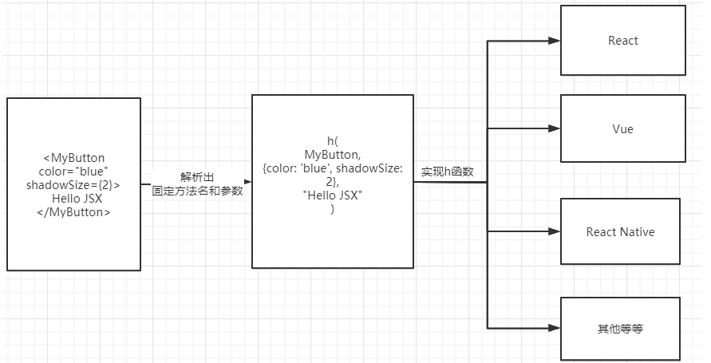
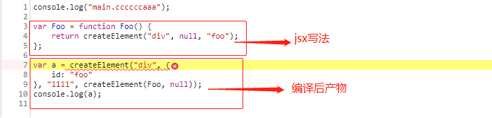
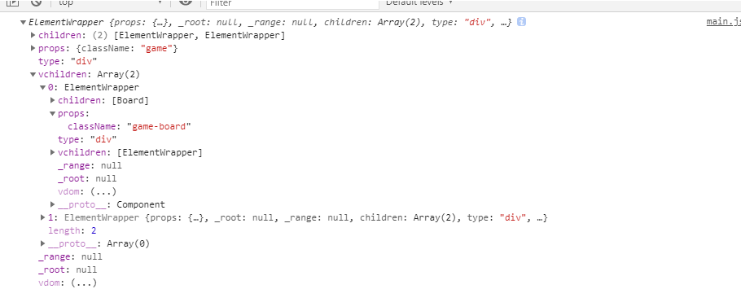
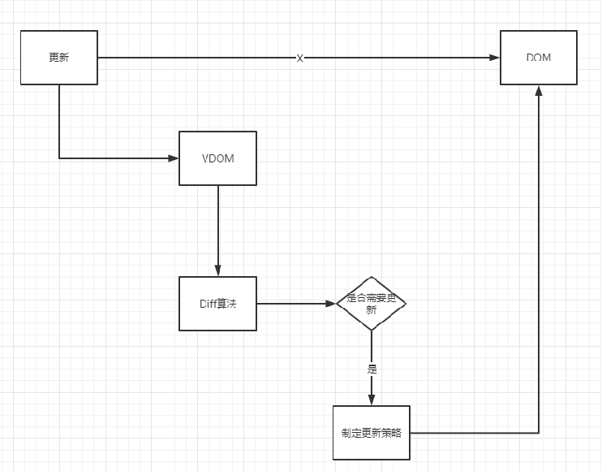

# #此文件为方便gitee网站观阅使用专门创建

> 此笔记文件于某一时间截取复制至此,容易存在更新不及时问题,建议观看同级目录下的笔记文件
>
> 截取了上方了`React深入学习与源码解析笔记`的部分知识点至此,方便网站阅读
>
> 本人的React学习笔记分类(也是对应本人技术成长路程):[[`想快速入门看这部分`](https://gitee.com/hongjilin/hongs-study-notes/tree/master/编程_前端开发学习笔记/React笔记/React基础补充学习笔记)]、[[`想对React基础系统全面进行学习的同学看这里`](https://gitee.com/hongjilin/hongs-study-notes/tree/master/%E7%BC%96%E7%A8%8B_%E5%89%8D%E7%AB%AF%E5%BC%80%E5%8F%91%E5%AD%A6%E4%B9%A0%E7%AC%94%E8%AE%B0/Scss%E7%AC%94%E8%AE%B0)]、[[`对基础学习完成且有了一定开发经验,想尝试解析源码的看这里`](https://gitee.com/hongjilin/hongs-study-notes/tree/master/编程_前端开发学习笔记/React笔记/React深入学习与源码解析笔记)]

# #说明

>本笔记为本人`洪`深入学习React并尝试阅读理解React源码所记录笔记 -->`源码版本16.9.0`
>
>建议预备知识:react基础
>
>学习过程及笔记记录时查阅借鉴的相关资料官方文档的[源码概览](https://zh-hans.reactjs.org/docs/codebase-overview.html);ILoveDevelop的[`React 源码解析`](https://react.jokcy.me/);知乎的神马翔[`React专栏`](https://www.zhihu.com/people/song-meng-xiang-95)、[全栈潇晨](https://www.zhihu.com/people/qbtqiuqiu)的React系列文章、[`万字长文+图文并茂+全面解析 React 源码 - render 篇`](https://segmentfault.com/a/1190000022105022);前端桃园的[`Deep In React之浅谈 React Fiber 架构`](https://mp.weixin.qq.com/s?__biz=MzAxODE2MjM1MA==&mid=2651556940&idx=1&sn=d40506db3d4d78da9a94ae6c7dc61af6&chksm=80255b8db752d29bbb8edc79eb40ce4122f3fddca121a53a5c3f859259cf4b1d7402ff676a84&scene=21#wechat_redirect);还有`公司前辈的技术分享`
>
>本人笔记地址分享:[`全部笔记`](https://gitee.com/hongjilin/hongs-study-notes)、**[`React笔记`](https://gitee.com/hongjilin/hongs-study-notes/tree/master/编程_前端开发学习笔记/React笔记)** 
>
>本人的React学习笔记分类(也是对应本人技术成长路程):[[`想快速入门看这部分`](https://gitee.com/hongjilin/hongs-study-notes/tree/master/编程_前端开发学习笔记/React笔记/React基础补充学习笔记)]、[[`想对React基础系统全面进行学习的同学看这里`](https://gitee.com/hongjilin/hongs-study-notes/tree/master/%E7%BC%96%E7%A8%8B_%E5%89%8D%E7%AB%AF%E5%BC%80%E5%8F%91%E5%AD%A6%E4%B9%A0%E7%AC%94%E8%AE%B0/Scss%E7%AC%94%E8%AE%B0)]、[[`对基础学习完成且有了一定开发经验,想尝试解析源码的看这里`](https://gitee.com/hongjilin/hongs-study-notes/tree/master/编程_前端开发学习笔记/React笔记/React深入学习与源码解析笔记)]

# 一、React基础知识总结

> 在深入学习前,还是先捋一捋对于React基础知识的理解与总结
>
> 如果想看详细的React基础知识点笔记,可以看本人 **[React系统学习笔记](https://gitee.com/hongjilin/hongs-study-notes/tree/master/编程_前端开发学习笔记/React笔记)** 

## 1、JSX

>这东西不用解释我为啥放在第一位说了吧,基本上我们大部分React开发者都是用jsx进行代码编写的
>
>这里不着重讲解基础语法,只是给出自己的理解与总结,有需要了解基础语法的同学  -->[点我跳转](https://zh-hans.reactjs.org/docs/jsx-in-depth.html)

### Ⅰ-我们认为的JSX是什么? 

> 我们认为的JSX是什么? ===>  ` 类HTML的语法?  React里面的模板语法?  语法糖?`
>
> - 其实应该都算是对的,但是有好像不是完全对.如果只讲里面的一点的话又有所欠缺的感觉
>
>  > JSX是(JavaScript XML)的缩写,其实他本质上还是属于JavaScript,`不一定用在React上`
>
> - 此处借用React中文官网的一句话:
>
>  >React不强制要求使用JSX,但是大多数人发现,在JS代码中将JSX与UI放在一起时,在视觉上会有辅助作用.它还可以使得React显示更多有用的错误和警告信息
>
> - 它本身可以理解为是一个规范,开发者在JSX的帮助下,避免重复地学习不同框架或者库,因为在JSX的规范中,他产生的结果是一致的.用React的思想来说,JSX最终的作用是把模板语法解析成Component、props、children....等等;而具体怎么利用这些产物,就是不同的框架或者库的特性了,比如下面的一个组件它被解析以后其实产生的是一段代码段,并且有固定的参数位置
>
>  > 
>  >
>  > 由上图可以看出JSX的产物(h函数名称和h函数的参数),它很像虚拟DOM

### Ⅱ-JSX的产物

#### ① 简单的JSX产物

>以下是一个最简单的JSX编译后的结果
>
> 
>
>JSX的产物可以理解是基于JSX代码,利用一个函数模板(如同[`Ⅰ`](#Ⅰ-我们认为的JSX是什么? )中图示的[h]函数),生成一段[`调用`]函数模板,然后里面的函数名可能在不同的框架或者库中是不一样的,他没有实现h函数,需要框架或者库自己实现
>
>可以得出一个大胆的结论:`JSX理论上是完全跨平台的,只要有人实现它在对应平台的[h]函数,它甚至可以在任何支持JS语言的平台上运行`

#### ② Rreact中的JSX产物

>- 作为React的官方指定语法,JSX允许用户在JS代码中插入HTML代码.但是这种写法`浏览器是无法解析的`,他们就需要一个转换器
>
>  >`Babel`就充当了这样一个角色，他在JSX代码编译时候将其转换成JS文件，这样浏览器就能解析了。
>
>- JSX有JS和HTMl两种写法，本身就是JS写法的其实是不需要转换的
>
>  >当然也不能说的这么绝对，有时候Babel会为了兼容性的缘故将高版本的语法翻译到低版本，这部分不在讨论范围。我们要关注的其实是HTMl的处理方式

##### 代码转换示例与解析

>1. 比如下面这行代码：
>
>   >```jsx
>   ><div id='name'>Tom and Jerry</div>
>   >
>   >---------------通过Babel转换后生成的代码是：-------------------------
>   >    
>   >React.createElement("div", {
>   >    id: "name"
>   >}, "Tom and Jerry");
>   >```
>   >
>   >HTML语法转变成了JS语法，简单来说，我们所写的JSX最终变成了JS。
>
>2. 复杂点的例子
>
>   >```jsx
>   ><div class='wrapper' id='id_wrapper'>
>   >    <span>Tom</span>
>   >    <span>Jerry</span>
>   ></div>
>   >----------- 通过Babel转换后生成的代码是： ---------------------
>   >    
>   >React.createElement("div", {
>   >    class: "wrapper",
>   >    id: "id_wrapper"
>   >}, React.createElement("span", null, "Tom"), React.createElement("span", null, "Jerry"));
>   >```
>   >
>   >转换规则是比较简单的，React.createElement的第一个参数是节点类型；第二个参数是该节点的属性，以key：value的形式作为一个对象，后面的所有参数都是该节点的子节点。
>
>3. 自定义组件
>
>   >```jsx
>   >function Comp() { return '<div>Tom and Jerry</div>' }
>   ><Comp></Comp>
>   >
>   >-------------- 通过Babel转换后生成的代码是：  ---------------------------------
>   >
>   >function Comp() {  return '<div>Tom and Jerry</div>'; }
>   >React.createElement(Comp, null);
>   >```
>   >
>   >可以看出，React.createElement的第一个参数变成了一个变量，而不是一个字符串，`尝试将函数Comp首字母小写`：
>   >
>   >```jsx
>   >function comp() { return '<div>Tom and Jerry</div>' }
>   ><comp></comp>
>   >
>   >--------------  通过Babel转换后生成的代码是：-------------------------------------------
>   >
>   >function comp() { return '<div>Tom and Jerry</div>'; }
>   >React.createElement("comp", null);
>   >```
>   >
>   >React.createElement的第一个参数又变成了一个字符串。
>   >这也就是我们在React中写组件的时候，`为什么会要求首字母大写的原因`，Babel在编译的时候会将首字母小写的组件视为原生的HTMl节点进行处理，如果我们将自定义组件首字母小写，后续的程序将无法识别这个组件，最终会报错。

### Ⅲ-React为什么选择JSX?

>- 对于一个人喜欢的事物,很多可以用一句话概括:`之所以选择X,是因为Y和Z不好,然后X有一个点能吸引你,那么X就是好的`
>
>- 但是放到技术上,要回答好这个问题,就需要先了解React可选的其他解决方案有什么不好的地方
>
>- 其实相关的方案很多,最直观的就是`模板`:
>
>  > 其实Vue与Angular都是用的模板语法,他们上手简单这是事实,但是`对于React团队来说它并不纯粹!!`
>  >
>  > 它引入了很多新的概念,需要去学习模板指令、模板语法等(如Vue需要理解v-if、v-for等),而JSX就没前者这么复杂,它不需要学习新的开发方式,虽然它也有模板的味道,但它本身能直接支持JS写法(如条件表达式和循环等)

## 2、ReactElement

> 为何这个放在JSX下方,因为此知识有jsx做铺垫就容易理解很多,有做对比更易理解

### Ⅰ-React.createElement函数

>通过Babel编译后的JS代码，频繁出现React.createElement这个函数。这个函数的返回值就是ReactElement，通过上面的示例可以看出，React.createElement函数的入参有三个，或者说三类

#### ① type 

>type指代这个`ReactElement的类型`
>
>1. 字符串比如div，p代表原生DOM，称为HostComponent
>2. Class类型是我们继承自Component或者PureComponent的组件，称为ClassComponent
>3. 方法就是functional Component
>4. 原生提供的Fragment、AsyncMode等是Symbol，会被特殊处理

#### ② config

>参照上面Babel编译后的代码，所有节点的属性都会以Key:Value的形式放到config对象中。

#### ③ children

>子节点不止会有一个，所以children不只有一个，从第二个参数以后的所有参数都是children，它是一个数组

### Ⅱ-ReactElement的结构

>1. [`$$typeof`] 是一个常量，所有通过React.createElement生成的元素都有这个值。一般使用 React 的组件都是挂到父组件的 this.props.children 上面，但是也有例外，比如要实现一个模态框，就需要将模态框挂载到body节点下，这个时候需要使用ReactDOM.createPortals(child, container)这个函数实现，这个函数生成的$$typeof值就是REACT_PORTAL_TYPE。 -->`用于确定是否属于ReactElement`
>2. [`type`]指代这个ReactElement的类型 -->`用作判断如何创建节点`
>3. [`key]`和[`ref`]都是从config对象中找到的特殊配置，将其单独抽取出来，放在ReactElement下
>4. [`props`]包含了两部分，第一部分是去除了key和ref的config，第二部分是children数组，数组的成员也是通过React.createElement生成的对象  -->`新的属性内容`
>5. _owner在16.7的版本上是Fiber，Fiber是react16+版本的核心,也是调度算法
>
>这些信息对于后期构建应用的树结构是非常重要的,**`而React通过提供这种类型的数据，来脱离平台的限制`**
>
>```js
>const element = {
>   // 这个标签允许我们唯一地将其标识为React元素  
>   $$typeof: REACT_ELEMENT_TYPE,
>
>   //属于元素的内置属性  
>   type: type,
>   key: key,
>   ref: ref,
>   props: props,
>
>   // 记录负责创建此元素的组件。
>   _owner: owner,
> };
>```
>
>它就是一个简单的对象，为了看清楚这个对象的创建规则，我们举个例子。 首先是我们写的JSX：
>
>```jsx
><div class='class_name' id='id_name' key='key_name' ref='ref_name'>
>   <span>Tom</span>
>   <span>Jerry</span>
></div>
>```
>
>它会被Babel编译为：
>
>```js
>React.createElement("div", {
>   class: "class_name",
>   id: "id_name",
>   key: "key_name",
>   ref: "ref_name"
>}, React.createElement("span", null, "Tom"), React.createElement("span", null, "Jerry"));
>```
>
>它会生成这样一个Element
>
>```js
>{
>   $$typeof: REACT_ELEMENT_TYPE,
>   type：'div'，
>   key: 'key_name',
>   ref: "ref_name",
>   props: {
>       class: "class_name",
>       id: "id_name",
>       children: [
>           React.createElement("span", null, "Tom"),
>           React.createElement("span", null, "Jerry")
>       ]
>   }
>    _owner: ReactCurrentOwner.current,
>}
>```


## 3、React API 梳理

### Ⅰ-暴露出来的API

>```jsx
>// react\src\React.js
>const React = {
>  Children: {
>    map,
>    forEach,
>    count,
>    toArray,
>    only,
>  },
>
>  createRef,
>  Component,
>  PureComponent,
>
>  createContext,
>  forwardRef,
>  lazy,
>  memo,
>
>  useCallback,
>  useContext,
>  useEffect,
>  useImperativeHandle,
>  useDebugValue,
>  useLayoutEffect,
>  useMemo,
>  useReducer,
>  useRef,
>  useState,
>
>  Fragment: REACT_FRAGMENT_TYPE,
>  Profiler: REACT_PROFILER_TYPE,
>  StrictMode: REACT_STRICT_MODE_TYPE,
>  Suspense: REACT_SUSPENSE_TYPE,
>  unstable_SuspenseList: REACT_SUSPENSE_LIST_TYPE,
>
>  createElement: __DEV__ ? createElementWithValidation : createElement,
>  cloneElement: __DEV__ ? cloneElementWithValidation : cloneElement,
>  createFactory: __DEV__ ? createFactoryWithValidation : createFactory,
>  isValidElement: isValidElement,
>
>  version: ReactVersion,
>
>  unstable_withSuspenseConfig: withSuspenseConfig,
>
>  __SECRET_INTERNALS_DO_NOT_USE_OR_YOU_WILL_BE_FIRED: ReactSharedInternals,
>};
>```
>
>挑一些常见的分析下用法和源码

### Ⅱ-createRef

>react获得ref的方式有三种
>
>- String ref 方式(被废弃)
>- callback ref 方式
>- `React.createRef` (16.3版本新增特性)
>
>代码举例:
>
>```jsx
>----------------------- string ref -------------------------
>class App extends React.Component {
>  componentDidMount() {
>    this.refs.myRef.focus();
>  }
>  render() {
>    return <input ref="myRef" />;
>  }
>}
>------------------------ callback ref-------------------------
>class App extends React.Component {
>  componentDidMount() {
>    this.myRef.focus();
>  }
>  render() {
>    return <input ref={(ele) => {
>      this.myRef = ele;
>    }} />;
>  }
>}
>---------------------- React.createRef ------------------------
>class App extends React.Component {
>  constructor(props) {
>    super(props);
>    this.myRef = React.createRef();
>  }
>  componentDidMount() {
>    this.myRef.current.focus();
>  }
>  render() {
>    return <input ref={this.myRef} />;
>  }
>}
>```
>
>查看 React.createRef 的源码，`发现只是生成了一个对象，用于保存 current 的值`。
>
>```js
>// react\src\ReactCreateRef.js
>export function createRef(): RefObject {
>  const refObject = {
>    current: null,
>  };
>  return refObject;
>}
>```
>
>`React.createRef 并不负责将 dom 节点绑定 current 上面，它只负责生成对应的结构`。
>
>`真正做事的是 react-dom`。react 这么拆分，将公共的部分放在 react 中，而与平台相关的单独抽离，比如在移动端，负责将页面元素挂在到 current 字段上的就不是 `react-dom` 了，而是`react-native`。

### Ⅲ-Component & PureComponent

#### ① Component:

>Component源码
>
>```jsx
>// react\src\ReactBaseClasses.js
>function Component(props, context, updater) {
>this.props = props;
>this.context = context;
>// 如果一个组件有字符串引用，我们将在以后分配一个不同的对象。  
>this.refs = emptyObject;
>// 初始化默认更新器，但真正的更新器由 renderer.
>this.updater = updater || ReactNoopUpdateQueue;
>}
>
>Component.prototype.setState = function(partialState, callback) {
>this.updater.enqueueSetState(this, partialState, callback, 'setState');
>};
>
>Component.prototype.forceUpdate = function(callback) {
>this.updater.enqueueForceUpdate(this, callback, 'forceUpdate');
>};
>```
>
>Component 中维护了4个变量，props，context，refs 以及 updater。前三者都是我们常见的，updater 是与平台相关的，他基本负责了 react 中的所有任务，包括数据更新，界面渲染等一系列的工作。
>
>以下是 Component 的数据结构，f 表示函数，省略号表示暂时不用关注
>
>```json
>{
>props: {},
>context: {},
>refs: {},
>updater: {...},
>state: null,
>__proto__: {
> constructor: class Demo，
> render: f
> __proto__: {
>   constructor: f,
>   setState: f,
>   forceUpdate: f,
>   isReactComponent: {}
> }}}
>```
>
>可以看到，`eact 中的声明周期不是在 Component 中定义的`，这一点在后续的章节会详细讲解。

#### ② PureComponent

>和 Component 是基本一致的，只是比 Component 多了一个属性
>
>```js
>pureComponentPrototype.isPureReactComponent = true;
>```
>
>以下是 PureComponent 的数据结构
>
>```json
>{
>props: {},
>context: {},
>refs: {},
>updater: {...},
>state: null,
>__proto__: {
> constructor: class Demo，
> render: f
> __proto__: {
>   constructor: f,
>   setState: f,
>   forceUpdate: f,
>   isReactComponent: {}，
>   isPureReactComponent: true  //多了这个
> }
>}
>}
>```

#### ③ 多出的[`isPureReactComponent`]有什么用?

>```js
>if (ctor.prototype && ctor.prototype.isPureReactComponent) {
>  return (
>    !shallowEqual(oldProps, newProps) || !shallowEqual(oldState, newState)
>  );
>}
>```
>
>这是检查组件是否需要更新的一个判断，`ctor`就是你声明的继承自`Component or PureComponent`的类，他会判断你是否继承自`PureComponent`，如果是的话就`shallowEqual`比较`state`和`props`。
>
>顺便说一下：**React中对比一个ClassComponent是否需要更新，只有两个地方。一是看有没有`shouldComponentUpdate`方法，二就是这里的`PureComponent`判断**

### Ⅳ-createContext

>createContext 是官方定稿的 context 方案，在这之前我们一直在用的老的 context API 都是 React 不推荐的 API，官方在17大版本会把老 API 去除。
>
>Context 通过`组件树`提供了一个传递数据的方法，从而避免了在每一个层级手动的传递 props 属性。下面的例子展示了在顶层组件通过 [`Provider`] 的方式提供了一个值，在下层组件可以通过 [`Consumer`] 拿到，中间不需要任何的 props 传参。
>
>```jsx
>const { Provider, Consumer } = React.createContext('default');
>
>class Top extends React.Component {
>  state = { contextValue: '123' };
>  render() {
>    return (
>      <Provider value={this.state.contextValue}>
>        {this.props.children}
>      </Provider>
>    )
>  }
>}
>
>class Bottom extends React.Component {
>  render() {
>    return (
>      <Consumer>
>        {value => <p>contextValue: {value}</p>}
>      </Consumer>
>    )    
>  }
>}
>
>export default () => (
>  <Top>
>    <Bottom />
>  </Top>
>)
>```
>
>查看React.createContext的源码，我摘出其中的重要代码:
>
>```js
>// react\src\ReactContext.js
>export function createContext<T>(
>  defaultValue: T,
>  calculateChangedBits: ?(a: T, b: T) => number,
>): ReactContext<T> {
>
>    const context: ReactContext<T> = {
>      $$typeof: REACT_CONTEXT_TYPE,
>      _calculateChangedBits: calculateChangedBits,
>      //作为支持多个并发渲染器的解决方案，我们将其分类  
>      //一些渲染器是主要的，另一些是次要的。 我们只希望  
>      //最多有两个并发渲染器:React Native (primary)和  
>      //面料(二级); React DOM(主要)和React ART(次要)。  
>      //二级渲染器将它们的上下文值存储在单独的字段中。  
>      _currentValue: defaultValue,
>      _currentValue2: defaultValue,
>      //用于跟踪当前有多少并发渲染此上下文  
>      //在单个渲染器中支持。 例如并行服务器呈现。  
>      _threadCount: 0,
>      // These are circular
>      Provider: (null: any),
>      Consumer: (null: any),
>  };
>
>  context.Provider = {
>    $$typeof: REACT_PROVIDER_TYPE,
>    _context: context,
>  };
>
>  context.Consumer = context;
>
>  return context;
>}
>```
>
>createContext接收的是一个 `defaultValue` ，还有一个是 `calculateChangedBits` 。这是一个方法，这个方法接受 newValue 与 oldValue 的函数，返回值作为 changedBits，在 Provider 中，当 changedBits = 0，将不再触发更新。
>
>方法里面声明了一个 context 对象，有一个 $$typeof 属性，需要注意的是，`这个 [$$typeof]` 跟 `ReactElement的 [$$typeof] 是不一样的`。
>
>下面列出了两个$$typeof的不同之处。
>
>```json
>{
>  $$typeof: REACT_ELEMENT_TYPE // 其实是一个Symbol类型的标志
>  type: {
>    $$typeof: REACT_PROVIDER_TYPE // 其实是一个Symbol类型的标志
>    _currentValue: "default",
>    ...
>  }
>}
>```
>
>_currentValue ， _currentValue2 这两个属性是一样的，只是用到的地方不一样。 _currentValue 这个 value 是用来记录 Provider 里面的这个 value 。 他有变化的情况下就会更新到这个 _currentValue 。是用来记录最新的 context 的值的。
>
>context.Provider 有个属性 _context ，这个属性会指向这个 context。context.Consumer = context。 `也就是说 Consumer 是等于自己的`。

### Ⅴ-forwardRef

>`forwardRef`是用来解决HOC组件传递`ref`的问题的，所谓HOC就是`Higher Order Component(高阶组件)`，比如使用`redux`的时候，我们用`connect`来给组件绑定需要的state，这其中其实就是给我们的组件在外部包了一层组件，然后通过`...props`的方式把外部的`props`传入到实际组件
>
>在低版本使用string ref的时候，ref 是不能加在 Component 上的。原因也很简单，ref 这个字段会被单独处理，不会传递到子组件上（[`详见ReactElement部分`](#2、ReactElement)）。React16之后，通过 forwardRef 就能实现父组件向子组件自动传递引用 ref。这种需求通常发生在需要处理焦点，动画，或者是集成第三方 Dom 库的时候。下面列举了一个处理输入框焦点的例子。
>
>```jsx
>import React, { Component, createRef, forwardRef } from 'react';
>//forwardRef使用方式举例
>const FocusInput = forwardRef((props, ref) => (
>  <input type="text" ref={ref} />
>));
>
>class ForwardRef extends Component {
>  constructor(props) {
>      super(props);
>      this.ref = createRef();
>  }
>
>  componentDidMount() {
>    const { current } = this.ref;
>    current.focus();
>  }
>
>  render() {
>    return (
>      <div>
>        <p>forward ref</p>
>        <FocusInput ref={this.ref} />
>      </div>
>    );
>  }
>}
>export default ForwardRef;
>```
>
>查看 forwardRef 源码。
>
>```js
>// react\src\forwardRef.js
>export default function forwardRef<Props, ElementType: React$ElementType>(
>   //render函数作为参数-->即包装的FunctionComponent
>  render: (props: Props, ref: React$Ref<ElementType>) => React$Node,
>) {
>  return {
>    $$typeof: REACT_FORWARD_REF_TYPE,
>    render,
>  };
>}
>```
>
>1. 被forwardRef包裹后，组件内部的$$typeof是`REACT_FORWARD_REF_TYPE`
>2. render即包装的FunctionComponent，ClassComponent是不用forwardRef的

### Ⅵ-四个类型

>1. Fragment: REACT_FRAGMENT_TYPE
>2. Profiler: REACT_PROFILER_TYPE
>3. StrictMode: REACT_STRICT_MODE_TYPE
>4. Suspense: REACT_SUSPENSE_TYPE
>
>这四个都是React提供的组件，但他们其实都只是占位符，都是一个Symbol，在React实际检测到他们的时候会做一些特殊的处理。

#### ① Fragment

>`Fragment 是我们使用最多的`，React 中一个常见模式是为一个组件返回多个元素。Fragments 可以让你聚合一个子元素列表，并且不在DOM中增加额外节点。 <> 是 的语法糖。
>
>```jsx
>render() {
>  return (
>    <> //<Fragment></Fragment> 等同
>      <ChildA />
>      <ChildB />
>    </>
>  );
>}
>```

#### ② Profiler

>Profiler是用来测量渲染性能的，几乎不用。

#### ③ StrictMode

>StrictMode 是一个用来突出显示应用程序中潜在问题的工具。与 Fragment 一样，StrictMode 不会渲染任何可见的 UI。它为其后代元素触发额外的检查和警告。
>
>```jsx
>import React from 'react';
>
>function ExampleApplication() {
>  return (
>    <div>
>      <Header />
>      <React.StrictMode>
>        <div>
>          <ComponentOne />
>          <ComponentTwo />
>        </div>
>      </React.StrictMode>
>      <Footer />
>    </div>
>  );
>}
>```
>
>在上述的示例中，不会对 Header 和 Footer 组件运行严格模式检查。但是，`ComponentOne` 和 `ComponentTwo` 以及`它们的所有后代元素`都将进行检查。

#### ④ Suspense

>```jsx
>const OtherComponent = React.lazy(() => import('./OtherComponent'));
>
>function MyComponent() {
>  return (
>    <div>
>      <Suspense fallback={<div>Loading...</div>}>
>        <OtherComponent />
>      </Suspense>
>    </div>
>  );
>}
>```
>
>OtherComponent是通过懒加载加载进来的，所以渲染页面的时候可能会有延迟，`但使用了Suspense之后，可优化交互`。 在外面使用Suspense标签，并在fallback中声明OtherComponent加载完成前做的事，即可优化整个页面的交互
>
>fallback 属性接受任何在组件加载过程中你想展示的 React 元素。你可以将 Suspense 组件置于懒加载组件之上的任何位置。你甚至可以用一个 Suspense 组件包裹多个懒加载组件。

### Ⅶ-四个Element API

#### ① createElement & 

>`createElement`可谓是React中最重要的API了，他是用来创建`ReactElement`的，但是很多同学却从没见过也没用过，这是为啥呢？因为你用了JSX，JSX并不是标准的js，所以要经过编译才能变成可运行的js，而编译之后，`createElement`就出现了：
>
>```js
>// jsx
><div id="app">content</div>
>
>// js
>React.createElement('div', { id: 'app' }, 'content')
>```

#### ② cloneElement 

>`cloneElement`就很明显了，是用来克隆一个`ReactElement`的

#### ③ createFactory 

> `createFactory`是用来创建专门用来创建某一类`ReactElement`的工厂的
>
> ```js
>export function createFactory(type) {
> const factory = createElement.bind(null, type);
> factory.type = type;
>   return factory;
>   }
>   ```
> 
> 他其实就是绑定了第一个参数的`createElement`，一般我们用JSX进行编程的时候不会用到这个API

#### ④ isValidElement

>`isValidElement`顾名思义就是用来验证是否是一个`ReactElement`的，基本也用不太到


## 4、React Children

> 此处为什么不放在`API梳理`中而是单独拿出来讲? [`同学们可以忽略不看此部分`]
>
> 一方面平时不怎么用，另一方面跟数组处理功能差不多，不深究实现是比较容易理解的.但是观阅许多相关资料后,觉得这个还是可以记录一下
>
> 以[`React.Children.map`]进行分析
>
> `map`和`forEach`的最大区别就是有没有`return result`。

### Ⅰ- 使用方式

>首先看下这个 API 的用法
>
>```jsx
>import React from 'react'
>
>function ChildrenDemo(props) {
>  return React.Children.map(props.children, c => [c, c])
>}
>
>export default () => (
>  <ChildrenDemo>
>    <div>Tom and Jerry</div>
>  </ChildrenDemo>
>)
>```
>
>界面上显示
>
>```js
>Tom and Jerry
>Tom and Jerry
>```
>
>如果将上述的代码稍微调整
>
>```jsx
>function ChildrenDemo(props) {
>  return React.Children.map(props.children, c => [c, [c, c]])
>}
>```
>
>有意思的事情发生了，界面上显示
>
>```js
>Tom and Jerry
>Tom and Jerry
>Tom and Jerry
>```

### Ⅱ- 源码分析

>接下来从代码的角度分析，为什么出现这种情况，从React入口文件开始
>
>```js
>// react\src\React.js
>import {forEach, map, count, toArray, only} from './ReactChildren';
>
>const React = {
>Children: {
>map,
>forEach,
>count,
>toArray,
>only,
>},
>
>...
>
>}
>```
>
>可以看出，React Clildren 的所有 API 来自 ReactChildren.js 文件。
>
>```js
>// react\src\ReactChildren.js
>export {
>forEachChildren as forEach,
>mapChildren as map,
>countChildren as count,
>onlyChild as only,
>toArray,
>}
>```
>
>`map 只是个别名，真正的函数是 mapChildren`
>
>```js
>// react\src\ReactChildren.js
>function mapChildren(children, func, context) {
>if (children == null) {
>return children;
>}
>const result = [];
>mapIntoWithKeyPrefixInternal(children, result, null, func, context);
>// map和forEach的最大区别就是有没有return result。
>return result;
>}
>
>function mapIntoWithKeyPrefixInternal(children, array, prefix, func, context) {
>let escapedPrefix = '';
>
>// 用来生成key的
>if (prefix != null) {
>escapedPrefix = escapeUserProvidedKey(prefix) + '/';
>}
>const traverseContext = getPooledTraverseContext(
>array,
>escapedPrefix,
>func,
>context,
>);
>traverseAllChildren(children, mapSingleChildIntoContext, traverseContext);
>releaseTraverseContext(traverseContext);
>}
>```
>
>`map`和`forEach`的最大区别就是有没有`return result`。

#### ① 分析 getPooledTraverseContext 和 releaseTraverseContext


>getPooledTraverseContext 就是从 pool 里面找一个对象，releaseTraverseContext 会把当前的 context 对象清空然后放回到 pool 中。
>
>```jsx
>// react\src\ReactChildren.js
>const POOL_SIZE = 10;
>const traverseContextPool = [];
>function getPooledTraverseContext(
>mapResult,
>keyPrefix,
>mapFunction,
>mapContext,
>) {
>if (traverseContextPool.length) {
>const traverseContext = traverseContextPool.pop();
>// set attrs
>return traverseContext;
>} else {
>return {
>result: mapResult,
>keyPrefix: keyPrefix,
>func: mapFunction,
> context: mapContext,
> count: 0,
>};
>}
>}
>
>function releaseTraverseContext(traverseContext) {
>// clear attrs
>if (traverseContextPool.length < POOL_SIZE) {
>traverseContextPool.push(traverseContext);
>}
>}
>```
>
>这么做主要是为了节省对象重复创建带来的性能消耗，React 中后续还会有一些这样的管理对象的方式。
>
>那么按照这个流程来看，是不是`pool`永远都只有一个值呢，毕竟推出之后操作完了就推入了，这么循环着。答案肯定是否的，这就要讲到`React.Children.map`的一个特性了，那就是对每个节点的`map`返回的如果是数组，那么还会继续展开，这是一个递归的过程。接下去我们就来`分析traverseAllChildren`。

#### ② 分析traverseAllChildren 方法

>`traverseContext` 对象`封装完毕`后，调用 traverseAllChildren 方法
>
>```js
>// react\src\ReactChildren.js
>function traverseAllChildren(children, callback, traverseContext) {
>if (children == null) {
>return 0;
>  }
>    
>  return traverseAllChildrenImpl(children, '', callback, traverseContext);
>}
>  ```
>
>直接调用 traverseAllChildrenImpl 方法,`下方代码是连着上面的,只是拆出来更清晰 `
>
>```js
>// react\src\ReactChildren.js
>// children: ReactElement
>// nameSoFar: ''
>// callback: 是个函数 mapSingleChildIntoContext，在mapChildren 函数中传入
>// traverseContext： { result: [], keyPrefix: "", func: c => [c, [c, c]], context: undefined, count: 0}
>function traverseAllChildrenImpl(
>children,
>nameSoFar,
>  callback,
>  traverseContext,
>  ) {
>  // children一般是一个React Element，或者是多个React Element
>const type = typeof children;
>  
>  // 判断children的合理性
>if (type === 'undefined' || type === 'boolean') {
>  children = null
>  }
>    
>  let invokeCallback = false
>
>  // 对于单个节点，invokeCallback = true
>if (children === null) {
>  invokeCallback = true
>  } else {
>    switch (type) {
>  case 'string':
>      case 'number':
>        invokeCallback = true
>        break
>      case 'object':
>        switch (children.$$typeof) {
>          case REACT_ELEMENT_TYPE:
>          case REACT_PORTAL_TYPE:
>            invokeCallback = true
>        }
>     }
>     }
>    
>  if (invokeCallback) {
>// callback 指的是 mapSingleChildIntoContext
>  callback(
>    traverseContext,
>      children,
>         //此处是设置Key的代码
>      nameSoFar === '' ? SEPARATOR + getComponentKey(children, 0) : nameSoFar,
>     )
>    return 1
>    }
>  
>let child;
>  let nextName;
>  let subtreeCount = 0; // Count of children found in the current subtree.
>  const nextNamePrefix =
>  nameSoFar === '' ? SEPARATOR : nameSoFar + SUBSEPARATOR;
>    
>// 对于本例，第一次进入这个函数 clildren 是两个 span，是一个array
>  if (Array.isArray(children)) {
>  for (let i = 0; i < children.length; i++) {
>     child = children[i];
>      nextName = nextNamePrefix + getComponentKey(child, i);
>     
> // 递归调用 traverseAllChildrenImpl
>      subtreeCount += traverseAllChildrenImpl(
>        child,
>        nextName,
>        callback,
>        traverseContext,
>      );
>     }
>    } else {
>  // 针对的是那些不是Array类型，但是有迭代器，能遍历的情况，正常代码不会这样，可以忽略
>    const iteratorFn = getIteratorFn(children);
>    if (typeof iteratorFn === 'function') {
>     const iterator = iteratorFn.call(children);
>      let step;
>      let ii = 0;
>      while (!(step = iterator.next()).done) {
>        child = step.value;
>        nextName = nextNamePrefix + getComponentKey(child, ii++);
>        subtreeCount += traverseAllChildrenImpl(
>          child,
>          nextName,
>          callback,
>          traverseContext,
>        );
>      }
>     } else if (type === 'object') {
>     let addendum = '';
>      const childrenString = '' + children;
>      invariant(
>        false,
>        'Objects are not valid as a React child (found: %s).%s',
>        childrenString === '[object Object]'
>          ? 'object with keys {' + Object.keys(children).join(', ') + '}'
>          : childrenString,
>        addendum,
>      );
>     }
>    }
>  
>return subtreeCount;
>  }
>```
>
>`traverseAllChildrenImpl` 函数做的事情比较简单，children如果是可循环的，遍历children中的每个元素，`递归调用本身`，直到是一个节点的情况， 然后调用callback，也就是 mapSingleChildIntoContext。
>
>```js
>// react\src\ReactChildren.js
>function mapSingleChildIntoContext(bookKeeping, child, childKey) {
>const {result, keyPrefix, func, context} = bookKeeping;
>  
>// child 调用 我们传入的函数 c => [c, [c, c]]
>  let mappedChild = func.call(context, child, bookKeeping.count++);
>  
>// 如果 返回的值依然是个数组，递归调用mapIntoWithKeyPrefixInternal
>  if (Array.isArray(mappedChild)) {
>  // 注意 c => c 
>    mapIntoWithKeyPrefixInternal(mappedChild, result, childKey, c => c);
>    } else if (mappedChild != null) {
>  // 如果返回的值是个合格的Element，将结果放入result中
>    if (isValidElement(mappedChild)) {
>     mappedChild = cloneAndReplaceKey(
>        mappedChild,
>        // Keep both the (mapped) and old keys if they differ, just as
>        // traverseAllChildren used to do for objects as children
>        keyPrefix +
>          (mappedChild.key && (!child || child.key !== mappedChild.key)
>            ? escapeUserProvidedKey(mappedChild.key) + '/'
>            : '') +
>          childKey,
>      );
>     }
>    result.push(mappedChild);
>    }
>  }
>```
>
>mapSingleChildIntoContext 这个方法其实就是调用 React.Children.map(children, callback) 这里的callback，就是我们传入的第二个参数，并得到map之后的结果。
>
>- 如果`map`之后的节点还是一个数组，那么再次进入`mapIntoWithKeyPrefixInternal`，那么这个时候我们就会再次从`pool`里面去`context`了，而`pool`的意义大概也就是在这里了，如果循环嵌套多了，可以减少很多对象创建和`gc`的损耗。
>- 而如果不是数组并且是一个合规的ReactElement，就触达顶点了，替换一下key就推入result了。
>- React 将重复对象放在Pool中是因为对Children的处理一般在render里面，所以会比较频繁，所以设置一个pool减少声明和gc的开销。

#### ③ React 这么实现的目的

>1. 拆分`map`出来的数组
>2. 因为对`Children`的处理一般在`render`里面，所以会比较频繁，所以设置一个`pool`减少声明和`gc`的开销

### Ⅲ-Key值的设置

>将原先的一个children映射为多个children的过程中，涉及到了一些key值的变换
>
>```js
>//源码
>function traverseAllChildrenImpl() {
>  ...
>
>  if (invokeCallback) {
>    callback(
>      traverseContext,
>      children,
>   		 //如果它是唯一的子元素，那么就把它当作包装在数组中  
>		//如果孩子的数量增长，它是一致的。  
>      nameSoFar === '' ? SEPARATOR + getComponentKey(children, 0) : nameSoFar,
>    );
>    return 1;
>  }
>
>  ...
>
>  const nextNamePrefix =
>    nameSoFar === '' ? SEPARATOR : nameSoFar + SUBSEPARATOR;
>
>  if (Array.isArray(children)) {
>    for (let i = 0; i < children.length; i++) {
>      child = children[i];
>      nextName = nextNamePrefix + getComponentKey(child, i);
>      subtreeCount += traverseAllChildrenImpl(
>        child,
>        nextName,
>        callback,
>        traverseContext,
>      );
>    }
>  }
>
>  ...
>}
>```
>
>举例来说明key的生成过程
>
>```jsx
>// React.Children.map(props.children, c => c)
>() => (
>  <div >Tom</div>
>  <div >Jerry</div>
>)
>```
>
>如果 children 是一个数组，那么首先会计算一个 nextNamePrefix，计算的规则如下
>
>```js
>// const SEPARATOR = '.';
>// const SUBSEPARATOR = ':';
>const nextNamePrefix =
>    nameSoFar === '' ? SEPARATOR : nameSoFar + SUBSEPARATOR;
>```
>
>nameSoFar === '' 成立， nextNamePrefix 是 SEPARATOR ，也就是 “.”。在遍历数组的过程中
>
>```js
>nextName = nextNamePrefix + getComponentKey(child, i);
>```
>
>getComponentKey 会获得元素上的key值，如果没有key值，那么就是 i， i代表数组中的index。对于一个对象调用callback的过程中，key的规则是
>
>```js
>nameSoFar === '' ? SEPARATOR + getComponentKey(children, 0) : nameSoFar
>```
>
>由于此时nameSoFar不为空串， Tom 的 key是 “.0”, Jerry 的 key 是 “.1”。
>
>如果 c => [ c, c ]，即映射出的是数组，那么在 mapSingleChildIntoContext 函数中 会走到这个分支
>
>```js
>if (Array.isArray(mappedChild)) {
>    mapIntoWithKeyPrefixInternal(mappedChild, result, childKey, c => c);
>  }
>```
>
>此时会重新调用 mapIntoWithKeyPrefixInternal，也就是
>
>```js
>if (prefix != null) {
>    escapedPrefix = escapeUserProvidedKey(prefix) + '/';
>}
>```
>
>执行完毕后，key后面多加了 ‘/’ 。继续执行 traverseAllChildrenImpl，nameSoFar === '' 成立， nextNamePrefix 是 SEPARATOR ，也就是 ‘.’， key后面多加了 ‘.’。再次执行
>
>```js
>nameSoFar === '' ? SEPARATOR + getComponentKey(children, 0) : nameSoFar
>```
>
>最终生成的4个key分别是
>
>```text
>.0/.0
>.0/.1
>.1/.0
>.1/.1
>```
>
>如果 c => [ c, [c, c] ]，那么
>
>```js
>const nextNamePrefix =
>    nameSoFar === '' ? SEPARATOR : nameSoFar + SUBSEPARATOR;
>```
>
>会被循环调用，第二次进入循环的时候，nameSoFar === ''这个条件不满足，key后面会加一个 ‘SUBSEPARATOR’，也就是 ‘:’，其余流程不变。
>
>最终生成的6个key分别是
>
>```text
>.0/.0
>.0/.1:0
>.0/.1:1
>.1/.0
>.1/.1:0
>.1/.1:1
>```
>
>`还需要注意的是，如果component设置了key，会使用component上的key，不使用index，此时会如果两个元素的key相同，react会给出警告。`

## 5、React的数据结构

> `了解即可,可跳过`

### Ⅰ-FiberRoot

>```js
>type BaseFiberRootProperties = {|
>  // root节点，render方法接收的第二个参数
>  containerInfo: any,
>  // 只有在持久更新中会用到，也就是不支持增量更新的平台，react-dom不会用到
>  pendingChildren: any,
>  // 当前应用对应的Fiber对象，是Root Fiber
>  current: Fiber,
>
>  // 一下的优先级是用来区分
>  // 1) 没有提交(committed)的任务
>  // 2) 没有提交的挂起任务
>  // 3) 没有提交的可能被挂起的任务
>  // 我们选择不追踪每个单独的阻塞登记，为了兼顾性能
>  // The earliest and latest priority levels that are suspended from committing.
>  // 最老和新的在提交的时候被挂起的任务
>  earliestSuspendedTime: ExpirationTime,
>  latestSuspendedTime: ExpirationTime,
>  // The earliest and latest priority levels that are not known to be suspended.
>  // 最老和最新的不确定是否会挂起的优先级（所有任务进来一开始都是这个状态）
>  earliestPendingTime: ExpirationTime,
>  latestPendingTime: ExpirationTime,
>  // The latest priority level that was pinged by a resolved promise and can
>  // be retried.
>  // 最新的通过一个promise被reslove并且可以重新尝试的优先级
>  latestPingedTime: ExpirationTime,
>
>  // 如果有错误被抛出并且没有更多的更新存在，我们尝试在处理错误前同步重新从头渲染
>  // 在`renderRoot`出现无法处理的错误时会被设置为`true`
>  didError: boolean,
>
>  // 正在等待提交的任务的`expirationTime`
>  pendingCommitExpirationTime: ExpirationTime,
>  // 已经完成的任务的FiberRoot对象，如果你只有一个Root，那他永远只可能是这个Root对应的Fiber，或者是null
>  // 在commit阶段只会处理这个值对应的任务
>  finishedWork: Fiber | null,
>  // 在任务被挂起的时候通过setTimeout设置的返回内容，用来下一次如果有新的任务挂起时清理还没触发的timeout
>  timeoutHandle: TimeoutHandle | NoTimeout,
>  // 顶层context对象，只有主动调用`renderSubtreeIntoContainer`时才会有用
>  context: Object | null,
>  pendingContext: Object | null,
>  // 用来确定第一次渲染的时候是否需要融合
>  +hydrate: boolean,
>  // 当前root上剩余的过期时间
>  // TODO: 提到renderer里面区处理
>  nextExpirationTimeToWorkOn: ExpirationTime,
>  // 当前更新对应的过期时间
>  expirationTime: ExpirationTime,
>  // List of top-level batches. This list indicates whether a commit should be
>  // deferred. Also contains completion callbacks.
>  // TODO: Lift this into the renderer
>  // 顶层批次（批处理任务？）这个变量指明一个commit是否应该被推迟
>  // 同时包括完成之后的回调
>  // 貌似用在测试的时候？
>  firstBatch: Batch | null,
>  // root之间关联的链表结构
>  nextScheduledRoot: FiberRoot | null,
>|};
>```

### Ⅱ-Fiber

>```js
>// Fiber对应一个组件需要被处理或者已经处理了，一个组件可以有一个或者多个Fiber
>type Fiber = {|
>  // 标记不同的组件类型
>  tag: WorkTag,
>
>  // ReactElement里面的key
>  key: null | string,
>
>  // ReactElement.type，也就是我们调用`createElement`的第一个参数
>  elementType: any,
>
>  // The resolved function/class/ associated with this fiber.
>  // 异步组件resolved之后返回的内容，一般是`function`或者`class`
>  type: any,
>
>  // The local state associated with this fiber.
>  // 跟当前Fiber相关本地状态（比如浏览器环境就是DOM节点）
>  stateNode: any,
>
>  // 指向他在Fiber节点树中的`parent`，用来在处理完这个节点之后向上返回
>  return: Fiber | null,
>
>  // 单链表树结构
>  // 指向自己的第一个子节点
>  child: Fiber | null,
>  // 指向自己的兄弟结构
>  // 兄弟节点的return指向同一个父节点
>  sibling: Fiber | null,
>  index: number,
>
>  // ref属性
>  ref: null | (((handle: mixed) => void) & {_stringRef: ?string}) | RefObject,
>
>  // 新的变动带来的新的props
>  pendingProps: any, 
>  // 上一次渲染完成之后的props
>  memoizedProps: any,
>
>  // 该Fiber对应的组件产生的Update会存放在这个队列里面
>  updateQueue: UpdateQueue<any> | null,
>
>  // 上一次渲染的时候的state
>  memoizedState: any,
>
>  // 一个列表，存放这个Fiber依赖的context
>  firstContextDependency: ContextDependency<mixed> | null,
>
>  // 用来描述当前Fiber和他子树的`Bitfield`
>  // 共存的模式表示这个子树是否默认是异步渲染的
>  // Fiber被创建的时候他会继承父Fiber
>  // 其他的标识也可以在创建的时候被设置
>  // 但是在创建之后不应该再被修改，特别是他的子Fiber创建之前
>  mode: TypeOfMode,
>
>  // Effect
>  // 用来记录Side Effect
>  effectTag: SideEffectTag,
>
>  // 单链表用来快速查找下一个side effect
>  nextEffect: Fiber | null,
>
>  // 子树中第一个side effect
>  firstEffect: Fiber | null,
>  // 子树中最后一个side effect
>  lastEffect: Fiber | null,
>
>  // 代表任务在未来的哪个时间点应该被完成
>  // 不包括他的子树产生的任务
>  expirationTime: ExpirationTime,
>
>  // 快速确定子树中是否有不在等待的变化
>  childExpirationTime: ExpirationTime,
>
>  // 在Fiber树更新的过程中，每个Fiber都会有一个跟其对应的Fiber
>  // 我们称他为`current <==> workInProgress`
>  // 在渲染完成之后他们会交换位置
>  alternate: Fiber | null,
>
>  // 下面是调试相关的，收集每个Fiber和子树渲染时间的
>
>  actualDuration?: number,
>
>  // If the Fiber is currently active in the "render" phase,
>  // This marks the time at which the work began.
>  // This field is only set when the enableProfilerTimer flag is enabled.
>  actualStartTime?: number,
>
>  // Duration of the most recent render time for this Fiber.
>  // This value is not updated when we bailout for memoization purposes.
>  // This field is only set when the enableProfilerTimer flag is enabled.
>  selfBaseDuration?: number,
>
>  // Sum of base times for all descedents of this Fiber.
>  // This value bubbles up during the "complete" phase.
>  // This field is only set when the enableProfilerTimer flag is enabled.
>  treeBaseDuration?: number,
>
>  // Conceptual aliases
>  // workInProgress : Fiber ->  alternate The alternate used for reuse happens
>  // to be the same as work in progress.
>  // __DEV__ only
>  _debugID?: number,
>  _debugSource?: Source | null,
>  _debugOwner?: Fiber | null,
>  _debugIsCurrentlyTiming?: boolean,
>|};
>```

### Ⅲ-sideEffects

>```js
>/**
> * Copyright (c) Facebook, Inc. and its affiliates.
> *
> * This source code is licensed under the MIT license found in the
> * LICENSE file in the root directory of this source tree.
> *
> * @flow
> */
>
>export type SideEffectTag = number;
>
>// Don't change these two values. They're used by React Dev Tools.
>export const NoEffect = /*              */ 0b00000000000;
>export const PerformedWork = /*         */ 0b00000000001;
>
>// You can change the rest (and add more).
>export const Placement = /*             */ 0b00000000010;
>export const Update = /*                */ 0b00000000100;
>export const PlacementAndUpdate = /*    */ 0b00000000110;
>export const Deletion = /*              */ 0b00000001000;
>export const ContentReset = /*          */ 0b00000010000;
>export const Callback = /*              */ 0b00000100000;
>export const DidCapture = /*            */ 0b00001000000;
>export const Ref = /*                   */ 0b00010000000;
>export const Snapshot = /*              */ 0b00100000000;
>
>// Update & Callback & Ref & Snapshot
>export const LifecycleEffectMask = /*   */ 0b00110100100;
>
>// Union of all host effects
>export const HostEffectMask = /*        */ 0b00111111111;
>
>export const Incomplete = /*            */ 0b01000000000;
>export const ShouldCapture = /*         */ 0b10000000000;
>```
>
>

### Ⅳ-ReactWorkTag

>```js
>export const FunctionComponent = 0;
>export const ClassComponent = 1;
>export const IndeterminateComponent = 2; // Before we know whether it is function or class
>export const HostRoot = 3; // Root of a host tree. Could be nested inside another node.
>export const HostPortal = 4; // A subtree. Could be an entry point to a different renderer.
>export const HostComponent = 5;
>export const HostText = 6;
>export const Fragment = 7;
>export const Mode = 8;
>export const ContextConsumer = 9;
>export const ContextProvider = 10;
>export const ForwardRef = 11;
>export const Profiler = 12;
>export const SuspenseComponent = 13;
>export const MemoComponent = 14;
>export const SimpleMemoComponent = 15;
>export const LazyComponent = 16;
>export const IncompleteClassComponent = 17;
>```

### Ⅴ-Update & UpdateQueue

>```js
>export type Update<State> = {
>  // 更新的过期时间
>  expirationTime: ExpirationTime,
>
>  // export const UpdateState = 0;
>  // export const ReplaceState = 1;
>  // export const ForceUpdate = 2;
>  // export const CaptureUpdate = 3;
>  // 指定更新的类型，值为以上几种
>  tag: 0 | 1 | 2 | 3,
>  // 更新内容，比如`setState`接收的第一个参数
>  payload: any,
>  // 对应的回调，`setState`，`render`都有
>  callback: (() => mixed) | null,
>
>  // 指向下一个更新
>  next: Update<State> | null,
>  // 指向下一个`side effect`
>  nextEffect: Update<State> | null,
>};
>
>export type UpdateQueue<State> = {
>  // 每次操作完更新之后的`state`
>  baseState: State,
>
>  // 队列中的第一个`Update`
>  firstUpdate: Update<State> | null,
>  // 队列中的最后一个`Update`
>  lastUpdate: Update<State> | null,
>
>  // 第一个捕获类型的`Update`
>  firstCapturedUpdate: Update<State> | null,
>  // 最后一个捕获类型的`Update`
>  lastCapturedUpdate: Update<State> | null,
>
>  // 第一个`side effect`
>  firstEffect: Update<State> | null,
>  // 最后一个`side effect`
>  lastEffect: Update<State> | null,
>
>  // 第一个和最后一个捕获产生的`side effect`
>  firstCapturedEffect: Update<State> | null,
>  lastCapturedEffect: Update<State> | null,
>};
>```


## 6、对虚拟DOM的理解

### Ⅰ-什么是虚拟DOM

>- 在React、Vue还没有出现的时候,我们要操作页面上的元素,需要`先找到那个元素`,然后`再进行修改样式、内容或者结构等`-->这很明显性能特别差,也会特别消耗资源!
>
>- 于是就有人会这样思考:如果在操作DOM之前就知道这一次数据更新期望改变的[`节点和`]怎么修改的话,那么这很明显可以提升页面渲染效率
>
> - > 举个栗子:渲染列表时比如有100条数据,我删除其中一条,那么我只是在`虚拟DOM数据`上删除此条数据,然后剩余的经过diff算法对比,其实只是删除了一条,其余的只是调整了在页面上的位置没有重新渲染;直接操作dom就会导致数据重绘(临时举例不够贴切勿怪)
>
>- 于是[`虚拟DOM`]出现了,`它其实是一个数据结构`,是针对当前DOM构建的一个数据结构
>
>- 以下是一个React的虚拟DOM结构
>
>  

### Ⅱ-为什么需要虚拟DOM

>其实在上面说明[[什么是虚拟DOM](#Ⅰ-什么是虚拟DOM)]的时候就已经大概说明了为什么需要虚拟DOM了.因为`一个新事物只有被需要、能解决某一痛点的时候才会被创造`
>
>- 无脑的渲染是否真的必要?
>
> - > 很明显不需要.但是在没有虚拟DOM之前,我们能依靠的只有直接操作DOM,尽管我们知道操作DOM而产生的`重绘`会对页面性能产生巨大影响
>
>- 当一个项目大到一种境界的时候,如果还是用查找元素然后进行修改的话,对代码的维护难度会呈现指数级飙升
>
>- 它是Diff算法的技术,也是数据驱动UI的前提
>
>个人理解的虚拟DOM大致流程图(公司前辈讲解的)
>
> 


### Ⅲ- 误区:虚拟DOM比直接操作DOM快?

>- 很多人有这个误区,甚至我在之前很长的一段时间中都是这样认为的.其实不然,通过上面的流程图其实可以很好理解:`直接操作DOM是最快的`.
>- 如果通过虚拟DOM计算出的更新策略是需要重绘10次,而直接操作DOM的次数也是重绘10次,那么直接操作应该是更快的,因为它省去了中间虚拟DOM构建、Diff算法、制定更新策略等;
>- 当然,正常情况下针对一个[`state`(状态)]变化后期望产生结果得出的`更新次数是远小于直接操作DOM`的,预知更新策略比直接无脑操作虽然会花费一部分内存,但是直接操作减少了,性能肯定会更好,做出来的应用的会更加健壮

#### 无图无真相

>网络上有人做了一个操作更新组件各种样式1000次的时间点对比(设定重绘次数一致):
>
>
>
>可以看出,直接操作DOM是最快的!`但是React需要的渲染时间可能是0`,下限更低,也正是因为计算出来某些[`state`(状态)]不需要更新DOM

# 二、创建更新

>react创建更新的方式有三种
>
>- ReactDOM.render
>- setState
>- forceUpdate

## 1、ReactDOM.render

### Ⅰ-使用概述

>```jsx
>// index.js
>import React from 'react';
>import ReactDOM from 'react-dom';
>import App from './App';
>ReactDOM.render(<App />, document.getElementById('root'));
>```
>
>ReactDOM.render 是 React 程序的起点。ReactDom 中包含了 createPortal，findDOMNode， render 等方法，这里需要注意的是 `hydrate` 和 `render` 方法，这两个方法其实调用的是一个函数，`只是一个参数不同`，hydrate 一般用于服务端渲染，它会复用服务端返回的Html结构。我们这次只分析 render，hydrate后续会单独分析。

### Ⅱ-ReactDOM源码示例

>[`unstable_createRoot`] 和 [`unstable_createSyncRoot`] 这两个接口需要注意下，特别是 `createRoot`，其实就是 16.9 之前的 [Concurrent Mode] 的`替代`，会启用 React 的并行模型。
>
>创建`ReactRoot`，并且根据情况调用`root.legacy_renderSubtreeIntoContainer`或者`root.render`，前者是遗留的 API 将来应该会删除，根据`ReactDOM.render`的调用情况也可以发现`parentComponent`是写死的`null`
>
>```js
>// react-dom\src\client\ReactDOM.js
>const ReactDOM: Object = {
>hydrate(element: React$Node, container: DOMContainer, callback: ?Function) {
>// TODO: throw or warn if we couldn't hydrate?
>return legacyRenderSubtreeIntoContainer(
>null,
>element,
>container,
>true,
>callback,
>);
>},
>
>render(
>element: React$Element<any>,
>container: DOMContainer,
>callback: ?Function,
>) {
>return legacyRenderSubtreeIntoContainer(
>null,
>element,
>container,
>false,
>callback,
>);
>}，
>
>unstable_createRoot: createRoot,
>unstable_createSyncRoot: createSyncRoot,
>}
>```

### Ⅲ-render源码解析

>render 接受三个参数，第一个参数是`ReactElement`，第二个参数为`组件所要挂载的DOM节点`，第三个参数为`回调函数`。
>
>```jsx
>render(
>element: React$Element<any>,
>container: DOMContainer, //组件索要挂在的DOM节点
>callback: ?Function, //回调函数
>) {
>//将继承来的render渲染成容器
>return legacyRenderSubtreeIntoContainer(
>null,
>element,
>container,
>false,
>callback,
>);
>}，
>```

#### ① legacyRenderSubtreeIntoContainer

>[`legacyRenderSubtreeIntoContainer`] 函数第一个入参 parentComponent 是写死的 null，函数首先生成了一个 root 对象， 调用的方法是 [`legacyCreateRootFromDOMContainer`]。
>
>首先会创建`ReactRoot`对象，然后调用他的`render`方法
>
>```jsx
>// react-dom\src\client\ReactDOM.js
>function legacyRenderSubtreeIntoContainer(
>parentComponent: ?React$Component<any, any>, // null
>children: ReactNodeList, // ReactElement
>container: DOMContainer, // dom节点
>forceHydrate: boolean,
>callback: ?Function,
>) {
>// 第一次 container 上没有 _reactRootContainer 属性，所以初次渲染为 null
>let root: _ReactSyncRoot = (container._reactRootContainer: any);
>let fiberRoot;
>if (!root) {
>// 生成一个 root 节点    ==根据DOM容器生成一个 根节点
>root = container._reactRootContainer = legacyCreateRootFromDOMContainer(
>container,
>forceHydrate,
>);
>fiberRoot = root._internalRoot;
>
>// 处理回调函数
>if (typeof callback === 'function') {
>const originalCallback = callback;
>callback = function() {
>// 其实就是 root.current.child.stateNode
>const instance = getPublicRootInstance(fiberRoot);
>//以instance的身份调用回调函数
>originalCallback.call(instance);
>};
>}
>//DOMRenderer.unbatchedUpdates制定不使用batchedUpdates，因为这是初次渲染，需要尽快完成。    
>// 不会进行批量策略的更新
>unbatchedUpdates(() => {
>updateContainer(children, fiberRoot, parentComponent, callback);
>});
>} else {
>// root已经存在的情况，会复用之前生成的root，暂时不考虑这种情况
>}
>return getPublicRootInstance(fiberRoot);
>}
>```
>
>下一步运行`legacyCreateRootFromDOMContainer` -->[③ legacyCreateRootFromDOMContainer](#③ legacyCreateRootFromDOMContainer)
>
>接着解析初次渲染不会进入的[`updateContainer`]函数

#### ② updateContainer

>此处虽然初次渲染先不会进入[`updateContainer`]函数,但仍在此处给出部分解析,在[⑦ createFiber](#⑦ createFiber)创建完RootFiber后将会回到此处运行
>
>其中`DOMRenderer`是`react-reconciler/src/ReactFiberReconciler`，他的`updateContainer`如下在这里计算了一个时间，这个时间叫做`expirationTime`，顾名思义就是这次更新的 **超时时间**。
>
>关于时间是如何计算的   -->请看[expiration Time]部分
>
>```js
>// react-reconciler\src\ReactFiberReconciler
>export function updateContainer(
>element: ReactNodeList,
>container: OpaqueRoot,
>parentComponent: ?React$Component<any, any>,
>callback: ?Function,
>): ExpirationTime {
>const current = container.current
>const currentTime = requestCurrentTime()
>// 计算超时时间
>const expirationTime = computeExpirationForFiber(currentTime, current)
>return updateContainerAtExpirationTime(
>element,
>container,
>parentComponent,
>expirationTime,
>callback,
>)
>}
>
>export function updateContainerAtExpirationTime(
>element: ReactNodeList,
>container: OpaqueRoot,
>parentComponent: ?React$Component<any, any>,
>expirationTime: ExpirationTime,
>callback: ?Function,
>) {
>// TODO: If this is a nested container, this won't be the root.
>const current = container.current
>const context = getContextForSubtree(parentComponent)
>if (container.context === null) {
>container.context = context
>} else {
>container.pendingContext = context
>}
>//这个方法中开始了调度。
>return scheduleRootUpdate(current, element, expirationTime, callback)
>}
>```
>
>然后调用了`updateContainerAtExpirationTime`，在这个方法里调用了`scheduleRootUpdate`,这个方法中开始了调度。
>
>首先要生成一个`update`，不管你是`setState`还是`ReactDOM.render`造成的 React 更新，都会生成一个叫`update`的对象，并且会赋值给`Fiber.updateQueue`
>
>关于`update`请看此部分

##### scheduleWork

>然后就是调用`scheduleWork`。注意到这里之前`setState`和`ReactDOM.render`是不一样，但进入`schedulerWork`之后，就是任务调度的事情了，跟之前你是怎么调用的没有任何关系
>
>```js
>// react-reconciler\src\ReactFiberReconciler
>function scheduleRootUpdate(
>current: Fiber, // RootFiber 对象
>element: ReactNodeList,// ReactElement
>expirationTime: ExpirationTime,// 计算出的超时时间
>suspenseConfig: null | SuspenseConfig, // null
>callback: ?Function,
>) {
>//创建Updater
>const update = createUpdate(expirationTime)
>	//设置payload为React Element
>update.payload = { element }
>
>callback = callback === undefined ? null : callback
>if (callback !== null) {
>warningWithoutStack(
> typeof callback === 'function',
> 'render(...): Expected the last optional `callback` argument to be a ' +
>   'function. Instead received: %s.',
> callback,
>)
>//设置回调  
>update.callback = callback
>}
>//赋值给Fiber.updateQueue 
>enqueueUpdate(current, update)
>//任务调度,此部分就于后面部分详解
>scheduleWork(current, expirationTime)
>return expirationTime
>}
>```
>
>下面看看`createUpdate`创建Updater

##### createUpdate

>首先要做的就是创建一个 Updater， React 中所有的更新都要创建 Updater
>
>```js
>// react-reconciler\src\ReactUpdateQueue.js
>export function createUpdate(
>expirationTime: ExpirationTime,
>suspenseConfig: null | SuspenseConfig,
>): Update<*> {
>let update: Update<*> = {
>// 更新的过期时间
>expirationTime,
>suspenseConfig,
>// export const UpdateState = 0;
>// export const ReplaceState = 1;
>// export const ForceUpdate = 2;
>// export const CaptureUpdate = 3;
>// 指定更新的类型，值为以上几种
>tag: UpdateState,
>// 更新内容，比如`setState`接收的第一个参数
>payload: null,
>// 对应的回调，`setState`，`render`都有
>callback: null,
>// 指向下一个更新
>next: null,
>// 指向下一个`side effect`
>nextEffect: null,
>};
>
>return update;
>}
>```
>
>接下来会对 update 中的成员变量赋值，之后执行 enqueueUpdate

##### enqueueUpdate

>```js
>// react-reconciler\src\ReactUpdateQueue.js
>export function enqueueUpdate<State>(fiber: Fiber, update: Update<State>) {
>
>//alternate即workInProgress
>//fiber即current
>//current到alternate有一个映射关系
>//所以要保证current和workInProgress的updateQueue是一致的
>const alternate = fiber.alternate;
>
>// current的队列
>let queue1;
>
>//alternate的队列
>let queue2;
>
>// 如果 alternate 为null，说明此时没有更新，没有workInProgress，只更新queue1
>if (alternate === null) {
>// There's only one fiber.
>queue1 = fiber.updateQueue;
>queue2 = null;
>if (queue1 === null) {
> // 初始化更新队列，赋值给fiber.updateQueue
> queue1 = fiber.updateQueue = createUpdateQueue(fiber.memoizedState);
>}
>} else {
>// There are two owners.
>// /如果alternate不为空，则取各自的更新队列
>queue1 = fiber.updateQueue;
>queue2 = alternate.updateQueue;
>if (queue1 === null) {
> if (queue2 === null) {
>   // Neither fiber has an update queue. Create new ones.
>   queue1 = fiber.updateQueue = createUpdateQueue(fiber.memoizedState);
>   queue2 = alternate.updateQueue = createUpdateQueue(
>     alternate.memoizedState,
>   );
> } else {
>   // Only one fiber has an update queue. Clone to create a new one.
>   // 如果queue2存在但queue1不存在的话，则根据queue2复制queue1
>   // 复制的时候 firstUpdate， lastUpdate 是共用的
>   queue1 = fiber.updateQueue = cloneUpdateQueue(queue2);
> }
>} else {
> if (queue2 === null) {
>   // Only one fiber has an update queue. Clone to create a new one.
>   queue2 = alternate.updateQueue = cloneUpdateQueue(queue1);
> } else {
>   // Both owners have an update queue.
> }
>}
>}
>
>// 经理上述步骤后，只可能是 queue2 为 null， queue1不可能为null
>if (queue2 === null || queue1 === queue2) {
>// There's only a single queue.
>// 将update放入queue1中
>appendUpdateToQueue(queue1, update);
>} else {
>// There are two queues. We need to append the update to both queues,
>// while accounting for the persistent structure of the list — we don't
>// want the same update to be added multiple times.
>if (queue1.lastUpdate === null || queue2.lastUpdate === null) {
> // One of the queues is not empty. We must add the update to both queues.
> // react不想多次将同一个的update放入队列中
> // 如果两个都是空队列，则添加update
> appendUpdateToQueue(queue1, update);
> appendUpdateToQueue(queue2, update);
>
>// 如果两个都不是空队列，由于两个结构共享，所以只在queue1加入update
>// 在queue2中，将lastUpdate指向update
>} else {
> // Both queues are non-empty. The last update is the same in both lists,
> // because of structural sharing. So, only append to one of the lists.
> appendUpdateToQueue(queue1, update);
> // But we still need to update the `lastUpdate` pointer of queue2.
> queue2.lastUpdate = update;
>}
>}
>}
>```
>
>这段代码看着复杂，但实际上做的事情很简单，首先，初始化fiber对象上的updateQueue，没有的话新建一个，然后将这个update放到updateQueue中，其中让人迷惑的点在于为什么有两个queue，以及alternate的作用，简单来讲，在Fiber树更新的过程中，每个Fiber都会有一个跟其对应的Fiber， 我们称他为`current <==> workInProgress`，在渲染完成之后他们会交换位置，这样就保证了更新过程中Fiber本身不变，两个queue也就这么产生了。
>
>`alternate`即workInProgress,current到alternate有一个映射关系

##### createUpdateQueue 

>createUpdateQueue 就是创建了对象，如下。
>
>```js
>// react-reconciler\src\ReactUpdateQueue.js
>export function createUpdateQueue<State>(baseState: State): UpdateQueue<State> {
>  const queue: UpdateQueue<State> = {
>     // 每次操作完更新之后的`state`
>    baseState,
>    // 队列中的第一个`Update`
>    firstUpdate: null,
>    // 队列中的最后一个`Update`
>    lastUpdate: null,
>    // 第一个捕获类型的`Update`
>    firstCapturedUpdate: null,
>    // 最后一个捕获类型的`Update`
>    lastCapturedUpdate: null,
>    // 第一个`side effect`
>    firstEffect: null,
>    // 最后一个`side effect`
>    lastEffect: null,
>    // 第一个和最后一个捕获产生的`side effect`
>    firstCapturedEffect: null,
>    lastCapturedEffect: null,
>  };
>  return queue;
>}
>```
>
>到此，React 将更新放到了Fiber队列中，接下来就是使用scheduleWork来进行调度了，这个后续章节讲。

#### ③ legacyCreateRootFromDOMContainer

>```jsx
>// react-dom\src\client\ReactDOM.js
>function legacyCreateRootFromDOMContainer(
>container: DOMContainer,
>forceHydrate: boolean,
>): _ReactSyncRoot {
>// 判断 forceHydrate 参数，render 函数插入的是false
>// shouldHydrateDueToLegacyHeuristic 函数主要是判断我们传入的Dom元素上是否有 data-reactroot 属性，这个属性一般是服务端渲染的时候赋给的
>//[shouldHydrate]用作后续判断是否复用页面上的DOM节点
>const shouldHydrate =
>forceHydrate || shouldHydrateDueToLegacyHeuristic(container);
>
>// 如果不复用页面上的 DOM 节点，那么调用 removeChild 方法将 DOM 节点的子节点全部清除 
>if (!shouldHydrate) {
>let warned = false;
>let rootSibling;
>//循环删除每一个子节点
>while ((rootSibling = container.lastChild)) {
>container.removeChild(rootSibling);
>}
>}
>
>// 通过 new 创建对象
>return new ReactSyncRoot(
>container,
>LegacyRoot,//LegacyRoot 是一个常量，代表的是传统的同步的渲染方式。
>shouldHydrate //上面讲过 [这个属性一般是服务端渲染的时候赋给的,然后进行了判断],所以此处是判断是否为服务端渲染
>? {
>hydrate: true,
>}
>: undefined,
>);
>}
>```
>
>LegacyRoot 是一个常量，代表的是传统的同步的渲染方式。
>
>```js
>// shared\ReactRootTags.js
>export const LegacyRoot = 0;
>export const BatchedRoot = 1;
>export const ConcurrentRoot = 2;
>```
>
>接着看 `ReactSyncRoot` 函数

#### ④  ReactSyncRoot

>创建`ReactRoot`的时候会调用`DOMRenderer.createContainer`创建`FiberRoot`，在后期调度更新的过程中这个节点非常重要
>
>```jsx
>// react-dom\src\client\ReactDOM.js
>function ReactSyncRoot(
>container: DOMContainer,
>tag: RootTag, // Tag is either LegacyRoot or Concurrent Root
>options: void | RootOptions, //前方传来的[服务端渲染判断]相关参数
>) {
>const hydrate = options != null && options.hydrate === true;
>const hydrationCallbacks =
>(options != null && options.hydrationOptions) || null;
>const root = createContainer(container, tag, hydrate, hydrationCallbacks);
>
>// 可以看出，new 出来的对象上，只有一个 _internalRoot 属性
>this._internalRoot = root;
>}
>```
>
>实际调用的是 `createContainer` 函数
>
>需要注意的是，如果不是ReactDOM.render，而是ReactDOM.unstable_createRoot，那么程序也会走到 createContainer 这步，但是 tag 就不是 RootTag，而是 ConcurrentRoot。
>
>```js
>// react-reconciler\src\ReactFiberReconciler.js
>export function createContainer(
>containerInfo: Container,
>tag: RootTag, // 0
>hydrate: boolean, // false
>hydrationCallbacks: null | SuspenseHydrationCallbacks, 
>): OpaqueRoot {
>return createFiberRoot(containerInfo, tag, hydrate, hydrationCallbacks);
>}
>```
>
>接着调用 `createFiberRoot` 函数

#### ⑤ createFiberRoot 

>```js
>// react-reconciler\src\ReactFiberRoot.js
>export function createFiberRoot(
>containerInfo: any, // div
>tag: RootTag, // 0
>hydrate: boolean,// false //是否服务端渲染
>hydrationCallbacks: null | SuspenseHydrationCallbacks,// null -->根据是否服务端渲染决定此参数
>): FiberRoot {
>
>// new 一个 FiberRoot 对象
>const root: FiberRoot = (new FiberRootNode(containerInfo, tag, hydrate): any);
>
>// false 不用管
>if (enableSuspenseCallback) {
>root.hydrationCallbacks = hydrationCallbacks;
>}
>
>// Cyclic construction. This cheats the type system right now because
>// stateNode is any.
>// 创建了一个Fiber对象，由于是root节点的Fiber
>const uninitializedFiber = createHostRootFiber(tag);
>
>// FiberRoot 通过 current 指向 [uninitializedFiber] 对象
>root.current = uninitializedFiber;
>
>// [uninitializedFiber] 通过 stateNode 指向 dom 节点
>uninitializedFiber.stateNode = root;
>
>// 返回 FiberRoot
>return root;
>}
>```
>
>调用 new FiberRootNode 创建了一个 FiberRoot 对象
>
>```js
>// react-reconciler\src\ReactFiberRoot.js
>function FiberRootNode(containerInfo, tag, hydrate) {
>// LegacyRoot | BatchedRoot | ConcurrentRoot
>this.tag = tag;
>// 当前应用对应的Fiber对象，是Root Fiber
>this.current = null;
>// root节点，render方法接收的第二个参数
>this.containerInfo = containerInfo;
>// react-dom不会用到
>this.pendingChildren = null;
>this.pingCache = null;
>this.finishedExpirationTime = NoWork;
>// 已经完成的任务的FiberRoot对象，如果你只有一个Root，那他永远只可能是这个Root对应的Fiber，或者是null
>// 在commit阶段只会处理这个值对应的任务
>this.finishedWork = null;
>this.timeoutHandle = noTimeout;
>// 顶层context对象，只有主动调用`renderSubtreeIntoContainer`时才会有用
>this.context = null;
>this.pendingContext = null;
>// 用来确定第一次渲染的时候是否需要融合
>this.hydrate = hydrate;
>this.firstBatch = null;
>this.callbackNode = null;
>this.callbackExpirationTime = NoWork;
>// 存在root中，最早的挂起时间
>// 不确定是否挂起的状态（所有任务一开始均是该状态）
>this.firstPendingTime = NoWork;
>// 存在root中，最新的挂起时间
>this.lastPendingTime = NoWork;
>this.pingTime = NoWork;
>}
>```
>
>通过 `createHostRootFiber` 创建一个Fiber对象

#### ⑥ createHostRootFiber 

>此处会调用[createFiberRoot](#④ createFiberRoot)函数
>
>```js
>// react-reconciler\src\ReactFiber.js
>export function createHostRootFiber(tag: RootTag): Fiber {
>
>// 通过tag来生成mode
>let mode;
>if (tag === ConcurrentRoot) {
>mode = ConcurrentMode | BatchedMode | StrictMode;
>} else if (tag === BatchedRoot) {
>mode = BatchedMode | StrictMode;
>} else {
>mode = NoMode;
>}
>
>if (enableProfilerTimer && isDevToolsPresent) {
>// Always collect profile timings when DevTools are present.
>// This enables DevTools to start capturing timing at any point–
>// Without some nodes in the tree having empty base times.
>mode |= ProfileMode;
>}
>
>// HostRoot 也是一个常量，用做标记，因为 root 节点的 Fiber 对象是Fiber树的头节点。后续会用的上
>return createFiber(HostRoot, null, null, mode);
>}
>// react-reconciler\src\ReactTypeOfMode.js
>export const NoMode = 0b0000;
>export const StrictMode = 0b0001;
>// TODO: Remove BatchedMode and ConcurrentMode by reading from the root
>// tag instead
>export const BatchedMode = 0b0010;
>export const ConcurrentMode = 0b0100;
>export const ProfileMode = 0b1000;
>```
>
>在生成 mode 的过程中，用到了上面这些常量，是二进制的值。0b0100 | 0b0001 = 0b0101。使用按位或操作，不仅能提高运行速度，在常量的判断上也很方便
>
>接着调用`createFiber`

#### ⑦ createFiber

>```js
>// react-reconciler\src\ReactFiber.js
>const createFiber = function(
>tag: WorkTag,
>pendingProps: mixed,
>key: null | string,
>mode: TypeOfMode,
>): Fiber {
>// $FlowFixMe: the shapes are exact here but Flow doesn't like constructors
>return new FiberNode(tag, pendingProps, key, mode);
>};
>// react-reconciler\src\ReactFiber.js
>function FiberNode(
>tag: WorkTag,
>pendingProps: mixed,
>key: null | string,
>mode: TypeOfMode,
>) {
>// Instance
>// 标记不同的组件类型
>this.tag = tag;
>// ReactElement里面的key
>this.key = key;
>// ReactElement.type，也就是我们调用`createElement`的第一个参数
>this.elementType = null;
>// 异步组件resolved之后返回的内容，一般是`function`或者`class`
>this.type = null;
>//跟当前Fiber相关本地状态（比如浏览器环境就是DOM节点）
>this.stateNode = null;
>
>// Fiber
>// 指向他在Fiber节点树中的`parent`，用来在处理完这个节点之后向上返回
>this.return = null;
>// 单链表树结构
>// 指向自己的第一个子节点
>this.child = null;
>// 指向自己的兄弟结构
>// 兄弟节点的return指向同一个父节点
>this.sibling = null;
>this.index = 0;
>
>// ref属性
>this.ref = null;
>
>// 新的变动带来的新的props
>this.pendingProps = pendingProps;
>// 上一次渲染完成之后的props
>this.memoizedProps = null;
>// 该Fiber对应的组件产生的Update会存放在这个队列里面
>this.updateQueue = null;
>// 上一次渲染的时候的state
>this.memoizedState = null;
>// 一个列表，存放这个Fiber依赖的context
>this.dependencies = null;
>
>// 用来描述当前Fiber和他子树的`Bitfield`
>// 共存的模式表示这个子树是否默认是异步渲染的
>// Fiber被创建的时候他会继承父Fiber
>// 其他的标识也可以在创建的时候被设置
>// 但是在创建之后不应该再被修改，特别是他的子Fiber创建之前
>this.mode = mode;
>
>// Effects
>// 用来记录Side Effect
>this.effectTag = NoEffect;
>// 单链表用来快速查找下一个side effect
>this.nextEffect = null;
>
>// 子树中第一个side effect
>this.firstEffect = null;
>// 子树中最后一个side effect
>this.lastEffect = null;
>
>// 代表任务在未来的哪个时间点应该被完成
>// 不包括他的子树产生的任务
>this.expirationTime = NoWork;
>// 快速确定子树中是否有不在等待的变化
>this.childExpirationTime = NoWork;
>
>// 在Fiber树更新的过程中，每个Fiber都会有一个跟其对应的Fiber
>// 我们称他为`current <==> workInProgress`
>// 在渲染完成之后他们会交换位置
>this.alternate = null;
>...
>}
>```
>
>终于把这个 RootFiber 创建出来了。接下来回到 legacyRenderSubtreeIntoContainer 函数，`执行 updateContainer(children, fiberRoot, parentComponent, callback)`。children是传入的 React 组件， fiberRoot 是一个 FiberRoot 对象，parentComponent 是 null。    
>
>updateContainer在前方②处已经给出详解-->[② updateContainer](#② updateContainer)


# `更多请看上方[React深入学习与源码解析笔记]`


