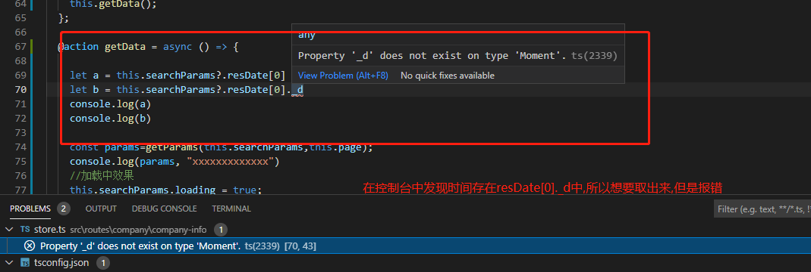

>本人笔记地址分享:[`全部笔记`](https://gitee.com/hongjilin/hongs-study-notes)、[`TypeScript所有学习笔记`](https://gitee.com/hongjilin/hongs-study-notes/tree/master/%E7%BC%96%E7%A8%8B_%E5%89%8D%E7%AB%AF%E5%BC%80%E5%8F%91%E5%AD%A6%E4%B9%A0%E7%AC%94%E8%AE%B0/TypeScrip%E7%AC%94%E8%AE%B0)https://gitee.com/hongjilin/hongs-study-notes)

# #目录

>[TOC]

# TypeScrpit问题

## 1、vsCode报错函数重复

> 我正在开始使用TypeScript，并且我正在遵循[TypeScript in 5 minutes](https://www.typescriptlang.org/docs/handbook/typescript-in-5-minutes.html)指南,而当我写了一个函数(如下面代码),并且确定没错问题时候报错
>
> `Duplicate function implementation.`

```ts
function jspang(){
    let web : string ="hello World"
    console.log(web)
}
 /*  */
jspang()
//`Duplicate function implementation.`函数重复
```

##### 解决:

>看起来像这是Visual Studio代码中的一个错误。 GitHub对此有几个问题，如[here](https://github.com/Microsoft/TypeScript/issues/10804)和[here](https://github.com/Microsoft/vscode/issues/1773)。对这些问题的评论意味着它是一个问题，然后被修复，并在v1.12.1中再次成为问题。
>
>解决方案是运行`tsc --init`来初始化文件夹中的`tsconfig.json`。

## 2、在不同ts文件中声明同一个name时报错：

>主要错误信息：
>
>```bash
>无法重新声明块范围变量“name”
>```
>
>我们前面明明（明明说管我什么事）没有声明name，但是却说我们重复声明了
>
>- 这次是因为我们的`typescript` 将 `DOM typings` 作为全局的运行环境；
>- 所以当我们声明 `name`时， 与 `DOM` 中的全局  `name` 属性出现了重名；

```tsx
//Demo1.ts
let count :number=1
//Demo2.ts
let count :number=2
```

##### 解决:

>如何解决这个问题呢？
>
>- 有两种方案：去掉 DOM typings 的环境和声明模块
>
>**方式一：删除DOM typings的环境**
>
>但是这种办法对于我们来说并不合适，因为我们依然希望在DOM下编译我们的TypeScript代码
>
>**方式二：声明我们的ts文件为一个模块**(`推荐`)
>
>既然与全局的变量出现重名，那我们将脚本封装到模块（module）中，因为模块有属于自己的作用域，就不会和全局的产生冲突：
>
>- 在 Typescript 中，我们可以使用ES6的export来导出一个对象，并且该文件被视为 module
>
>```javascript
>let name = "coderwhy";
>export {}
>```

## 3、模块类的导入与导出

>当我尝试从一个ts文件中声明一个类或者一个对象或者一个变量 然后import到另外一个ts文件中,我发现我拿过来的值是`undefined`

##### 解决

> 1、由于我用的是ts-node直接运行,我发现将之前编译的js文件删除,在运行就可以了
>
> 2、类的导入需要new进行实例化

##### 代码示例

```ts
demox.ts导出
//声明一个类  
class Animal {
    name: string ="xx";
    show(): string {
        return this.name;
    }
    show1():void{
        console.log(this.name)
    }
}
//声明一个变量
 let test:string="洪吉林"
//导出方式
 export{ Animal,test }
//声明一个对象
export const xiaohong = {
    uname: "小洪",
    age: 18
}
```

```ts
demox1.ts导入
import  {Animal,xiaohong,test} from "./demox"
let a=new Animal()
a.show1()
console.log(a.show())
console.log(test)
console.log(xiaohong)
console.log(xiaohong.uname)
/*
xx
xx
洪吉林
{ uname: '小洪', age: 18 }
小洪
*/
```

## 4、React - 类型“Readonly<{}>”上不存在属性

>问题定位在了 TypeScript 上。
>解决方案如下:
>将 `props 和 state 的类型定位成 any` 就可以解决这个问题了!

```tsx
class Login extends Component <any,any>{}
```

## 5、继承state类型接口后使用`setState`修改报错`缺少类型`

>类型“{ [x: string]: string; }”的参数不能赋给类型“IState | ((prevState: Readonly<IState>, props: Readonly<any>) => IState | Pick<IState, "username" | "password"> | null) | Pick<...> | null”的参数。
>类型“{ [x: string]: string; }”缺少类型“Pick<IState, "username" | "password">”中的以下属性: username, password

```tsx
/* 定义state类型接口 */
interface IState {
    username: string,
    password: string,
}
    //方法一:输入框改变事件,双向绑定数据
    handleChange: (value: string, name: string) => void = (value, name) => {
        this.setState({
            [name]: value
        })
    }
```

>其实是定义接口时没有写缺省,导致赋值时候只赋值一个报错

```tsx
interface IState {
    username?: string,
    password?: string,
}
```

> 对象定义也可以用这个方法

```tsx
interface JWTInf{
  verify?:any,
  sign?:any,
  verifysync?:any
}
const JWT:JWTInf ={}
```

## 6、TS引用json文件报错

> Module '@/pages/components/util/list.json' was resolved to 'c:/Users/ZG/WebstormProjects/VsCodeProjects/yapi_system/src/pages/components/util/list.json', but '--`resolveJsonModule' is not used`.
>
> 当我引用json时报错,这也是我一下子魔愣了没想到,我应该在typings.d.ts文件中这样声明,ts中引用json文件才不会报错

```ts
//path: typings.d.ts
declare module "*.json"
```

## 7、TS报错具有隐式any

> Parameter 'item' implicitly has an 'any' type.
>
> `noImplicitAny 当表达式和申明 类型为any时，是否需要发出警告，设置true，则不警告`

## 8、Ts报错,不能自定义属性标签

>Type '{ children: Element[]; key: any; tag: any; onClick: (e: MouseEvent<HTMLLIElement, MouseEvent>) => void; }' is not assignable to type 'DetailedHTMLProps<LiHTMLAttributes<HTMLLIElement>, HTMLLIElement>'.
>Property 'tag' does not exist on type 'DetailedHTMLProps<LiHTMLAttributes<HTMLLIElement>, HTMLLIElement>'.

解决

>HTML支持自定义属性的data- *属性类型.你可以阅读更多 here.
>Definition and Usage The data-* attributes is used to store custom
>data private to the page or application.
>
>The data-* attributes gives us the ability to embed custom data
>attributes on all HTML elements.
>
>The stored (custom) data can then be used in the page’s JavaScript to
>create a more engaging user experience (without any Ajax calls or
>server-side database queries).
>
>The data-* attributes consist of two parts:
>
>The attribute name should not contain any uppercase letters,and must
>be at least one character long after the prefix “data-”
>The attribute value can be any string
>Note: Custom attributes prefixed with “data-” will be completely ignored by the user agent.
>
>`而不是只使用size =“A4”,你可以使用data-size =“A4”`

```tsx
<page className="page" tag={item.id}>//报错
</page>
<div className="page" data-tag={item.id}>//正确
  // ....
</div>
```

## 9、Ts报错,当操作dom节点操作

>Property 'className' does not exist on type 'Element | Text'.
>Property 'className' does not exist on type 'Text'.

原因:这是typescript的类型检查导致的，需要在querySelector或者其他查询语句方法前面加个类型断言。

```tsx
   let icon =  ReactDom.findDOMNode(document.getElementById('collect')) as HTMLElement;
    icon.className=IconStyles.iconfont+" "+IconStyles.icon_shoucang1
```

## 10、关于时间格式问题

### Ⅰ-赋值时间格式报错

>1. Type `'any[]' is not assignable to type '[Moment, Moment]'`.Target requires 2 element(s) but source may have fewer.
>
>   
>
>2. 解决
>
>   ```tsx
>   interface ISearchParams {
>   keyword:any,
>   customerId:any,
>   resDate: [Moment, Moment],
>   buyDate:[Moment, Moment],
>   format:string,
>   loading:boolean
>   }
>   
>   class Store {
>   @observable datas = [];
>   @observable searchParams:ISearchParams = {
>   keyword: '',
>   customerId: '',
>   resDate:[undefined, undefined],
>   buyDate: [undefined, undefined],
>   format: 'YYYY-MM-DD',  
>   loading: false,
>   };
>   }
>   ```

### Ⅱ-取出Moment格式中的具体时间报错

>1. 报错:`property '_d' does not exist on type 'moment'.`
>2. 出现错误原因分析:
>
>​	
>
>3. 解决
>
>   1. 其实不用`_d`去取出来,Moment格式有相应的取出方法
>
>      


