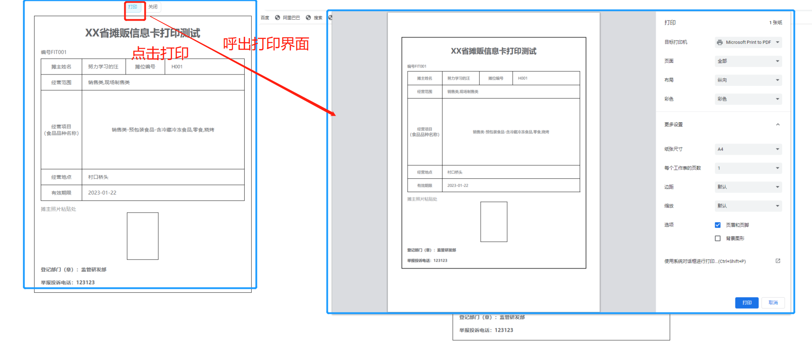
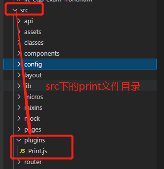

## #说明

>某天收到一个需求,要求实现  拼接成表格并能一键回填数据并能打印成A4大小(或者生成pdf)的功能.
>
>实际上回填数据以及拼接部分都很简单,稍微陌生的就是调用浏览器打印功能并将页面内容变成pdf并打印
>
>然后百度了一下发现百度上给出的解决方案并不够具体,很容易踩坑出现各种奇怪的错误,于是就将本人的踩坑解决方案以及思路都记录下来

## 一、需求及实现效果

>

## 二、使用的技术

>这里采用了 **`Print.js`** ,以下是他的 源码下载地址 --> [点我传送](https://github.com/crabbly/Print.js/releases/tag/v1.5.0) 
>
>可以直接npm下载安装依赖或者直接下载源码放到项目中直接调用,代码量不大,所以本人选择下载到项目中

## 三、实现代码

### Ⅰ - 下载源码

>* 首先源码下载地址 --> [点我传送](https://github.com/crabbly/Print.js/releases/tag/v1.5.0) 
>* 在这里选择一个版本下载(一般可以选最新的),下载纯js源码,但是源码中有点地方需要按照个人业务需求做点改变
>* 或者直接复制本人修改过的js源码,创建一个`Print.js`的文件,将下面代码复制进去
>
>在`getStyle`函数中可以写内联样式,覆盖外面原有的样式,以去除一些打印时不需要的而原HTML中有的样式
>
>```js
>/**
> * 打印类属性、方法定义,需要先在插件中引入
> * 使用示例: 1. 先在mian.js中引入
> *          2. 函数中调用this.$print(this.$refs.xxxx)
> */
>
>/* eslint-disable */
>const Print = function (dom, options) {
>  if (!(this instanceof Print)) return new Print(dom, options);
>
>  this.options = this.extend({
>    'noPrint': '.no-print'
>  }, options);
>
>  if ((typeof dom) === "string") {
>    this.dom = document.querySelector(dom);
>  } else {
>    this.isDOM(dom)
>    this.dom = this.isDOM(dom) ? dom : dom.$el;
>  }
>
>  this.init();
>};
>Print.prototype = {
>  init: function () {
>    var content = this.getStyle() + this.getHtml();
>    this.writeIframe(content);
>  },
>  extend: function (obj, obj2) {
>    for (var k in obj2) {
>      obj[k] = obj2[k];
>    }
>    return obj;
>  },
>
>  getStyle: function () {
>    var str = "",
>     styles = document.querySelectorAll('style,link');
>    for (var i = 0; i < styles.length; i++) {
>     str += styles[i].outerHTML;
>    }
>    str += "<style>" + (this.options.noPrint ? this.options.noPrint : '.no-print') + "{display:none;}</style>";
>    //str += "<style>html,body,div{height: auto!important;font-size:14px}</style>";
>    //这边样式要谨慎使用,会覆盖样式表中设置的样式  -->按照自己的业务需求拼接,会覆盖外面H5原先的样式
>    str += "<style>html,body,div{font-size:14px}</style>";
>  
>    return str;
>   },
>
>  getHtml: function () {
>    var inputs = document.querySelectorAll('input');
>    var textareas = document.querySelectorAll('textarea');
>    var selects = document.querySelectorAll('select');
>
>    for (var k = 0; k < inputs.length; k++) {
>      if (inputs[k].type == "checkbox" || inputs[k].type == "radio") {
>        if (inputs[k].checked == true) {
>          inputs[k].setAttribute('checked', "checked")
>        } else {
>          inputs[k].removeAttribute('checked')
>        }
>      } else if (inputs[k].type == "text") {
>        inputs[k].setAttribute('value', inputs[k].value)
>      } else {
>        inputs[k].setAttribute('value', inputs[k].value)
>      }
>    }
>
>    for (var k2 = 0; k2 < textareas.length; k2++) {
>      if (textareas[k2].type == 'textarea') {
>        textareas[k2].innerHTML = textareas[k2].value
>      }
>    }
>
>    for (var k3 = 0; k3 < selects.length; k3++) {
>      if (selects[k3].type == 'select-one') {
>        var child = selects[k3].children;
>        for (var i in child) {
>          if (child[i].tagName == 'OPTION') {
>            if (child[i].selected == true) {
>              child[i].setAttribute('selected', "selected")
>            } else {
>              child[i].removeAttribute('selected')
>            }
>          }
>        }
>      }
>    }
>
>    return this.dom.outerHTML;
>  },
>
>  writeIframe: function (content) {
>    var w, doc, iframe = document.createElement('iframe'),
>      f = document.body.appendChild(iframe);
>    iframe.id = "myIframe";
>    //iframe.style = "position:absolute;width:0;height:0;top:-10px;left:-10px;";
>    iframe.setAttribute('style', 'position:absolute;width:0;height:0;top:-10px;left:-10px;');
>    w = f.contentWindow || f.contentDocument;
>    doc = f.contentDocument || f.contentWindow.document;
>    doc.open();
>    doc.write(content);
>    doc.close();
>    var _this = this
>    iframe.onload = function(){
>      _this.toPrint(w);
>      setTimeout(function () {
>        document.body.removeChild(iframe)
>      }, 100)
>    }
>  },
>
>  toPrint: function (frameWindow) {
>    try {
>      setTimeout(function () {
>        frameWindow.focus();
>        try {
>          if (!frameWindow.document.execCommand('print', false, null)) {
>            frameWindow.print();
>          }
>        } catch (e) {
>          frameWindow.print();
>        }
>        frameWindow.close();
>      }, 10);
>    } catch (err) {
>      console.log('err', err);
>    }
>  },
>  isDOM: (typeof HTMLElement === 'object') ?
>    function (obj) {
>      return obj instanceof HTMLElement;
>    } :
>    function (obj) {
>      return obj && typeof obj === 'object' && obj.nodeType === 1 && typeof obj.nodeName === 'string';
>    }
>};
>const MyPlugin = {}
>MyPlugin.install = function (Vue, options) {
>  // 4. 添加实例方法
>  Vue.prototype.$print = Print
>}
>export default MyPlugin
>```

### Ⅱ - 将代码放入指定文件夹中

>* 首先要明确一点,一般来说如果你使用vue默认的webpack配置,那么最好将其放到 `src/plugins` 文件目录下(没有的话自己创建)
>* 然后这个`printjs`是一个插件,所以后续还需要在`main.js`中进行一些修改,现在放在这里就是为了后面能找到
>
> 

### Ⅲ - `mian.js`中添加以下代码

>```js
>//相对路径引入Print.js
>import Print from '../../plugins/Print'
>Vue.use(Print) // 注册打印
>```
>
>* 到这里就已经将`Printjs`中的方法挂载到Vue实例中了
>
>* 可能有同学会问,直接use怎么就将方法都挂上去了?问这个问题的同学去看下源码,源码中有这么一段代码,已经帮你将方法挂在到了vue实例的`$print`上面了
>
>  ```js
>  MyPlugin.install = function (Vue, options) {
>    // 4. 添加实例方法
>    Vue.prototype.$print = Print
>  }
>  ```

### Ⅳ - 需要打印页面中的调用方式

>* 确定需要打印的元素标签,给其加上`ref`,比如下面代码中的 `ref="printRef"`
>* 声明一个打印函数,函数中调用vue实例中的 `$print` 方法,将ref作为参数传入,如代码中的 `this.$print(this.$refs.printRef)`
>* 不需要打印的元素加上 `class="no-print"`,那么打印时就会将设置了此类名的元素忽略
>
>```vue
><template v-loading="loading">
>  <!-- 需要ref使得Printjs能找到要打印的元素 -->
>  <div ref="printRef" class="pitchman-box">
>    <div class="btn-class">
>      <!-- 不需要打印的部分加上  class="no-print",比如下面的打印与关闭按钮 -->
>      <el-button type="primary" plain :size="$size" class="no-print" @click="toPrint">打印</el-button>
>      <el-button plain :size="$size" class="no-print" @click="close">关闭</el-button>
>    </div>
>    <div>需要打印的内容</div>
>  </div>
></template>
>
><script>
>export default {
>  methods: {
>    // 打印
>    toPrint () {
>      this.$print(this.$refs.printRef)
>    }
>  }
>}
> </script>  
>```
>
>到这里就能正常使用了,但是可能还会有一些坑,我再下面列举

## 四、可能出现的问题

### Ⅰ - 出现多余的空白页

>可能有的同学会发现,怎么自己打印预览的时候明明高度限制好了固定页数,但是打印预览的时候竟然多了一页空白页,怎么删减内容都去除不了
>
>当时我百度了很久,网上大多都是不知道原因,都是蛮将高度之类的去除,但我推测是因为 `margin` 的问题
>
>本人产生此问题的原因是`margin-top`,把margin-top拿掉,改用其他的设置样式就好了,应该是父盒子外边距塌陷的问题,但是用overflow:hidden;没有解决.所以将需要用到`margin`的地方换成`padding`就能解决这个问题

### Ⅱ - 打印页面滚动条

>实际上这个的解决方案也很简单,只要将页面的滚动条设置隐藏即可,打印时实际上也会继承到该样式
>
>在样式中加入以下代码
>
>```js
>::-webkit-scrollbar {
>  width: 0 !important;
>}
>::-webkit-scrollbar {
>  width: 0 !important;height: 0;
>}
>body::-webkit-scrollbar {
>  display: none;
>}
>body {
>  -ms-overflow-style: none;
>}
>html {
>  overflow: -moz-hidden-unscrollable; /*注意！若只打 hidden，chrome 的其它 hidden 会出问题*/
>  height: 100%;
>}
>```

### Ⅲ - 去除页脚的链接

>有的同学发现,打印时怎么将自己网址给打印出来了,实际中并不需要这个,实际上在样式中加入以下代码即可
>
>```scss
>//不打印页脚的链接  --放在样式中
>@page {
>  margin-top: 1mm;
>  margin-bottom: 1mm;
>  padding-top: 1mm;
>}
>```


