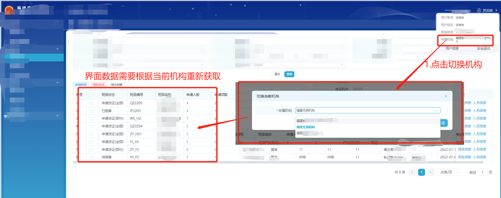

# 1、需求问题引出

>项目中遇到一个需求,具体内容就不说了,就只说关键点
>
>1. 当前项目大部分数据都是根据当前所属机构数据作为参数进行请求,但能够切换当前机构
>
>2. 但是遇到了一个问题,切换机构后当前Vue中的数据需要重新获取,不能将上一个机构的数据带到当前机构中展示使用,所以一般就想到模拟页面刷新
>
>   - 一开始肯定是想到 `location.reload();`,---参数： bForceGet， 可选参数， 默认为 false，从客户端缓存里取当前页。true, 则以 GET 方式，从服务端取最新的页面, 相当于客户端点击 F5("刷新")
>   - 但是使用这个API有个问题,**会导致白屏**,那这样用户体验就不是很好了,所以我们就需要改一个方案实现,所以就引出了本笔记所要记载的--->**不刷新页面情况下刷新数据**
>
>3. 下面是大致的需求图示
>
>   >

# 2、解决思路解析

>###### 既然直接调用浏览器的API不行,那么我们是不是可以换个思路,换成我们重新触发一遍Vue的生命周期函数,这样不就能重新获取数据了?
>
>  - 而我最先想到的方式就是使用 `v-if`,大家都知道 `v-if = false` 时整个dom都不会加载在界面上(通过控制台可以看到整个Dom都没有而不是隐藏),而 `v-if = true` 时才会进行dom的加载
>
>  - 那假设我对于 **最上层(即`APP.vue`)组件** 进行一次 `v-if` 的快速切换,而 `APP.VUE`中又包含所有Vue组件,那么我就能迫使整个Vue项目进行一次重新加载
>
>  - 此处正好复习下之前学到的父子组件渲染顺序(与此问题并无太大关系,只是用作知识拓展复习)
>
>    >`父beforeCreate` ->`父created` -> `父beforeMount` -> `子beforeCreate` -> `子created` -> `子beforeMount` -> `子mounted` -> `父mounted`
>    >
>    >父亲创建好后进行渲染准备,然后子组件创建渲染完成后,父组件才进行渲染


# 3、代码示例与分析

>* `v-if`绑定在最上层`vue.app`组件中,现在主要需要实现的就是能在子组件调用到最上层组件的控制显隐的方法
>* 这里使用 `provide/inject` -->允许一个祖先组件向其所有子孙后代注入一个依赖，不论组件层次有多深，并在起上下游关系成立的时间里始终生效

### Ⅰ - App.vue

>1. 首先绑定 `<router-view v-if="isRouter" />` ,并声明相应的data,后续我们就是控制这个 `isRouter` 实现页面的数据刷新
>2. 声明一个函数,此函数对 `isRouter` 进行操作,间接控制界面的显隐.而此处可能有些同学基础较为薄弱,就可能会问:此处为何要用`$nextTick`?
>  - 首先我们要知道,vue中你修改data后并不是立刻调用并重绘的,而是类似有一个机制,将短时间内对于同一个data修改合并计算,再将最后的计算结果进行重绘,其次我们再来了解下`nextTick()`这个API
>  - **`nextTick()`**:是将回调函数延迟在下一次dom更新数据后调用，简单的理解是：**当数据更新了，在dom中渲染后，再执行该API内的函数**
>  - 所以综合上面两点,可以知道如果我们没有用`nextTick()`而是直接连续修改`isRouter`,实际上页面是不会发生重绘的,因为对于vue来说,你这个data一直都是不变的(为什么?看上面第一点)
>  - 所以可以想到的是,我们需要等待 `this.isRouter = false` 执行并将dom隐藏后,再去执行 `this.isRouter = true`
>
>3. 使用`provide`将自定义的刷新函数注入,代码如下
>
>```vue
><!-- App.vue中的代码示例 -->
><template>
> <div>
>   <router-view v-if="isRouter" />
> </div>
></template>
><script>
>export default {
>   //注入依赖
> provide () {
>   return {
>     // 注入重新加载函数
>     reload: this.reload
>   }
> },
> data () {
>   return {
>     isRouter: true
>   }
> },
> methods: {
>   /**
>   * 自定义刷新函数
>   * 本质上就是修改 v-if 中所绑定的Boolean值
>   */
>   reload () {
>     this.isRouter = false
>     this.$nextTick(function () {
>       this.isRouter = true
>     })
>   }
> }
>
>}
></script>
>```
>

### Ⅱ - 调用

>1. 在任何需要调用到`刷新数据`操作的子组件中使用 `inject`,随后直接调用即可
>
>```vue
><template>
>   <button  @click="test">刷新数据</button>
></template>
>
><script>
>export default {
>    inject: ['reload'],
>    methods:{
>      test(){
>        this.reload()
>      }
>    }
>}
></script>
>```
