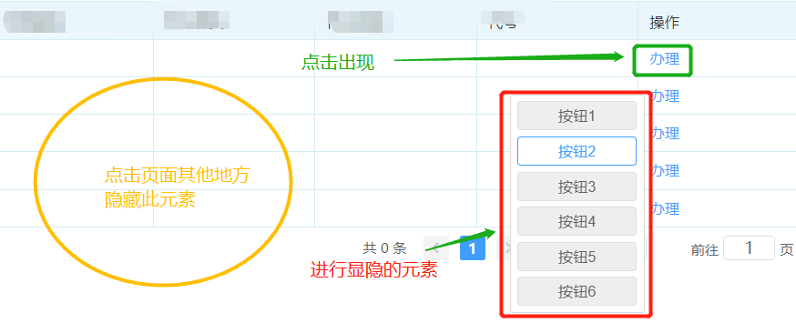

# #说明

>实际上不仅是vue,只要是能用js写的都能用这个思路(react、原生),这里是按照vue给出示例
>
>假定有一个需求: 
>
>* 当你点击某个按钮时出现一个 **自定义元素** 它可以是一个弹窗、图片或者其他
>* 当我点击除了这个 **自定义元素** 的其他区域时,关闭它
>
>
>
>下面将一步一步地实现上图中效果

# 一、实现点击时,元素出现在鼠标位置

>1. 首先定义并写好 悬浮窗元素以及样式,重点需要将其设置为 `position: fixed;`
>2. 编写一个函数,点击时触发: 获取当前鼠标的 X、Y轴位置,并将其存到 data中
>3. 将此data绑定到悬浮元素的 `style`中
>
>```vue
><template>
>  <el-button :size="$size" plain @click="showDtl">点击出现弹窗</el-button>
>    <div
>      class="sort-buttons"
>      v-show="sortShow"
>      :style="{'left':sortPlace.left,'top':sortPlace.top}"
>    >
>        <!-- 这里面就随意了,随便怎么写 -->
>      <div>
>        <el-button :size="$size" plain @click="addNewExpert">按钮1</el-button>
>      </div>
>      <div>
>        <el-button :size="$size" plain @click="addNewExpert">按钮2</el-button>
>      </div>
>      <div>
>        <el-button :size="$size" plain @click="addNewExpert">按钮3</el-button>
>      </div>
>      </div>
>    </div>
></template>
><script>
> export default {
>   data () {
>    return {
>       // 绑定弹窗出现的位置
>      sortPlace: {
>        left: '0px', top: '0px'
>      }, 
>      //确定是否显隐
>      sortShow: true,
>    }},
>   methods:{
>    // 绑定显示弹窗
>    showDtl (event) {
>      const e = event || window.event
>      //此处是否减去完全看个人,我是为了更美观,放到左侧去
>      this.sortPlace = { left: (e.clientX - 120) + 'px', top: e.clientY + 'px' }
>      this.sortShow = true
>    },
>   }
> }
></script>
><style scoped lang="scss">
>.sort-buttons {
>  display: flex;
>  flex-flow: column;
>  align-items: center;
>  justify-content: center;
>  width: 118px;
>  border: 1px gainsboro solid;
>  padding: 5px;
>  border-radius: 3px;
>  position: fixed;
>  background-color: #ffffff;
>  z-index: 999;
>  opacity:1;
>
> /*为何多一层div? elementui自带两个button中有间隔,为了消除这个 */
>  div {
>    padding: 0;
>    button {
>      width: 105px;
>      background-color: #eeeeee;
>      display: flex;
>      justify-content: center;
>    }
>    /*每个按钮添加下边距*/
>    margin-bottom: 5px;
>    /*最后一个按钮取消下边距*/
>    &:last-child {
>      margin-bottom: 0px;
>    }
>  }
>}
></style>
>```
>
>###### 至此,点击出现弹窗,且弹窗位置出现在点击时的位置,`但怎么关闭呢?`

# 二、实现点击其他位置,隐藏自定义div

>1. 首先在 **整个模块组件(点击隐藏生效范围)** 中添加一个 `hidePanel事件` : 只要在这个整体模块下的点击事件都能监听到,并进行处理
>2. 给不需要点击隐藏的部分加上一个`类`或者`id`: 当点击带有这种`class`或`id`的元素时,不会隐藏自定义元素
>3.  定义 `hidePanel事件`: 
>   - 首先获取绑定了`class `的所有元素
>   - 随后每次点击时判断是否点击了这些元素,如果不是,则将自定义元素隐藏即可
>
>###### 这里只给出区别代码,最后会完整给出代码
>
>```vue
><template>
><!-- 假设这个div就是需要点击隐藏的最外层模块,给他绑定事件 -->
><div @click="hidePanel">
>  <el-button :size="$size" plain @click="showDtl">点击出现弹窗</el-button>
>    <!-- 注意,这里class名新增了一个 `show-sort-btn` -->
>	<div
>      class="sort-buttons  show-sort-btn"
>      v-show="sortShow"
>      :style="{'left':sortPlace.left,'top':sortPlace.top}"
>    >
>      </div>
> </div>
></template>
><script>
>    export default {
>        methods:{
>      		hidePanel (event) {
>                //这里可以自定义,如果是唯一的id,则不用遍历
>     			 let btn = document.querySelectorAll('.show-sort-btn')
>   	  			 let flag = false
>    			  // 将nodeList转换为真正的数组
>    			  btn = [...btn]
>     			 // 遍历转换后的数组,判断点击的是否是出现
>     			 btn.map(item => {
>     			   if (item.contains(event.target)) flag = true
>    			  })
>   		  	 // 如果点击的不是赋予此类名的元素,则隐藏
>   		  	 if (!flag) this.sortShow = false
>   		 	},
>        }
>    }
></script>
>```
>
>###### 至此,功能已经实现

# 三、完整代码

>```vue
><template>
><!-- 假设这个div就是需要点击隐藏的最外层模块,给他绑定事件 -->
><div @click="hidePanel">
>  <el-button :size="$size" plain @click="showDtl">点击出现弹窗</el-button>
>        <!-- 注意,这里class名新增了一个 `show-sort-btn` -->
>    <div
>      class="sort-buttons   show-sort-btn"
>      v-show="sortShow"
>      :style="{'left':sortPlace.left,'top':sortPlace.top}"
>    >
>        <!-- 这里面就随意了,随便怎么写 -->
>      <div>
>        <el-button :size="$size" plain @click="addNewExpert">按钮1</el-button>
>      </div>
>      <div>
>        <el-button :size="$size" plain @click="addNewExpert">按钮2</el-button>
>      </div>
>      <div>
>        <el-button :size="$size" plain @click="addNewExpert">按钮3</el-button>
>      </div>
>      </div>
>    </div>
></div>
></template>
><script>
> export default {
>   data () {
>    return {
>       // 绑定弹窗出现的位置
>      sortPlace: {
>        left: '0px', top: '0px'
>      }, 
>      //确定是否显隐
>      sortShow: true,
>    }},
>   methods:{
>    // 绑定显示弹窗
>    showDtl (event) {
>      const e = event || window.event
>      //此处是否减去完全看个人,我是为了更美观,放到左侧去
>      this.sortPlace = { left: (e.clientX - 120) + 'px', top: e.clientY + 'px' }
>      this.sortShow = true
>    },
>       //隐藏方法
>     hidePanel (event) {
>        //这里可以自定义,如果是唯一的id,则不用遍历
>     	let btn = document.querySelectorAll('.show-sort-btn')
>   	  	let flag = false
>    	//此处用赋值解构的用意: 将nodeList转换为真正的数组
>    	btn = [...btn]
>     	 // 遍历转换后的数组,判断点击的是否是出现
>     	 btn.map(item => {
>     		if (item.contains(event.target)) flag = true
>    	 })
>   		 // 如果点击的不是赋予此类名的元素,则隐藏
>   		  if (!flag) this.sortShow = false
>   		},       
>   }
> }
></script>
><style scoped lang="scss">
>.sort-buttons {
>  display: flex;
>  flex-flow: column;
>  align-items: center;
>  justify-content: center;
>  width: 118px;
>  border: 1px gainsboro solid;
>  padding: 5px;
>  border-radius: 3px;
>  position: fixed;
>  background-color: #ffffff;
>  z-index: 999;
>  opacity:1;
>
> /*为何多一层div? elementui自带两个button中有间隔,为了消除这个 */
>  div {
>    padding: 0;
>    button {
>      width: 105px;
>      background-color: #eeeeee;
>      display: flex;
>      justify-content: center;
>    }
>    /*每个按钮添加下边距*/
>    margin-bottom: 5px;
>    /*最后一个按钮取消下边距*/
>    &:last-child {
>      margin-bottom: 0px;
>    }
>  }
>}
></style>
>```
>
>


