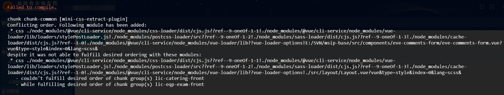

## 1、关于mini-css-extract-plugin在使用过程中出现冲突的问题

> 官方对于该问题的描述  --> [点我传送](https://laysent.com/til/2019-11-28_conflicting-order-in-mini-css-extract-plugin)

#### Ⅰ - 问题描述

>本人业务上用Vue写了一个双页面应用，运行之后出现了如下图的冲突报错：
>
>

#### Ⅱ - 问题排查

>在网上得知出现该问题最经常的原因在于`mini-css-extract-plugin`插件在打包过程中对于css文件的引入是有顺序要求的，打个比方：
>
>```js
>// A.vue
>import './a.css';
>import './b.css';
>
>// B.vue
>import './b.css';
>import './a.css';
>```
>
>这种情况下，你的打包过程就会出现冲突，因为你两个文件中引入相同样式的顺序不统一

#### Ⅲ - 解决方案

>###### 最好的方法就是对照冲突排查下最近新添加的组件是否出现了引入顺序的问题
>
>但是有时候实在找不到或者是由于冲突很多或时间不足的时候在确保不会影响到项目本身的情况下可以选择添加如下配置项忽视就可以（*配置项修改后需要重新打包运行*）
>
>###### vue.config.js  -->本人在vue项目中修改的配置
>
>```js
>module.exports = {
>  css: {
>		extract: process.env.NODE_ENV === 'production' ? {
>   		   ignoreOrder: true
>  		 } : false,
>  },
>```
>
>###### 其他通用
>
>```vue
>// 在webpack配置中的插件配置里添加ignoreOrder为true即可忽视掉打包过程中出现的冲突警告
>module.exports = {
>	plugins: [
>		new MiniCssExtractPlugin({
>	        ignoreOrder: true,
>	    }),
>	]
>}
>```
>

