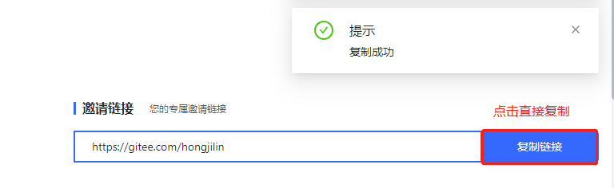

# clipboard.js

>将文本复制到剪贴板的js插件！
>
>不依赖flash，不依赖框架，压缩后仅3kb
>
>官网地址-->[点我传送](https://clipboardjs.com/)

# 一、为什么使用它?

>将文本复制到剪贴板应该不难。它不需要配置很多步骤，也不需要加载数百KB。但最重要的是，它不应该依赖Flash或任何框架。
>
>这就是为什么clipboard.js存在的原因.

# 二、基本使用

> clipboard.js 是一个不需要flash，将文本复制到剪贴板的插件。简单介绍下基本运用。

## 1、引入插件

>```html
><pre> <script src="js/clipboard.min.js"></script> </pre>
>```

## 2、基本使用

>首先需要您需要通过传递DOM选择器，HTML元素或HTML元素列表来实例化它
>
>```js
>let a= new Clipboard('.btn');
>```
>
>1. 用一个元素当触发器来复制另一个元素的文本,data-clipboard-target属性后需要跟属性选择器
>
>   ```html
>   <pre>
>   <input id="foo" value="https://gitee.com/hongjilin">
>   <button class="btn" data-clipboard-target="#foo">
>   </button>
>   </pre>
>   ```
>
>2. 另外还有另外一个属性data-clipboard-action属性，以指定是要要么copy还是要cut操作。默认情况下是copy。cut操作只适用于`<input>`或`<textarea>`元素。
>
>   ```html
>   <pre>
>   <textarea id="bar">Mussum ipsum cacilds...</textarea>
>   <button class="btn" data-clipboard-action="cut" data-clipboard-target="#bar">
>   Cut to clipboard
>   </button>
>   </pre>
>   
>   ```
>
>3. 从属性中复制文本，不需要另一个元素当触发器，可以使用data-clipboard-text属性，在后面放上需要复制的文本.
>
>   ```html
>   <pre>
>   <button class="btn" data-clipboard-text="Just because you can doesn't mean you should — clipboard.js">
>   Copy to clipboard
>   </button>
>   </pre>
>   ```


## 3、其他说明

>1. 通过运行检查clipboard.js是否支持Clipboard.isSupported()，返回true则可以使用。
>2. 显示一些用户反馈或捕获在复制/剪切操作后选择的内容。操作，文本，触发元素
>
>```js
>var clipboard = new Clipboard('.btn');
>clipboard.on('success', function(e) {
>    console.info('Action:', e.action);
>    console.info('Text:', e.text);
>    console.info('Trigger:', e.trigger);
>    e.clearSelection();
>});
>
>clipboard.on('error', function(e) {
>    console.error('Action:', e.action);
>    console.error('Trigger:', e.trigger);
>});
>```
>
>3. 该插件使用的是事件委托的方式来触发，所以大大减少了对dom的操作。


## 4、高级使用

>如果你不想修改你的HTML，那么你可以使用一个非常方便的命令API。所有你需要做的是声明一个函数，写下你想要的操作，并返回一个值。下面是一个对不同id的触发器返回不同的值的例子。具体的使用方法请看[https://clipboardjs.com
>
>```js
><body>
><input id="foo" value="https://gitee.com/hongjilin">
><button id='foo_1' class="btn" data-clipboard-target="#foo" />
></body>
>
><script>
>new Clipboard('.btn', {
>text: function(trigger) {
>if(trigger.getAttribute('id')=='foo_1')return 1;
>else return 2;
>}
>});
></script>
>```

## 5、支持的浏览器

> 谷歌42+，火狐41+,其他的可看官网

# 三、本人在项目中实际应用

## 1、代码

>在本人React项目中的应用
>
>```jsx
>import React, { Component } from 'react';
>import { MyNotification } from '~/components';
>import ClipboardJS from 'clipboard';
>  const testURL='https://gitee.com/hongjilin' ;//模拟假数据
>
>class InviteActivity extends Component {
>  componentDidMount() {
>    let clipboard = new ClipboardJS('.btn-copy');  //声明实例
>    clipboard.on('success', () => {
>     MyNotification.success('复制成功'); //调用自封装的提示框组件
>    });
>    clipboard.on('error', () => {
>     MyNotification.success('复制失败');
>    });
>  }
>render() {
>return (       
> <div className={Style.link}>
>  <div className={Style.title}>
>    <div className={Style['title-head']} />
>    <span className={Style['title-head-span']}>邀请链接</span>
>    <span className={Style['title-head-i']}>
>      您的专属邀请链接
>    </span>
>  </div>
>  <div className={Style.urlLink}>
>    <div className={Style.urlBox}>{testURL}</div>
>    <Button
>      className={`btn-copy ${Style['btn-copy']}`}
>      type="primary"
>      data-clipboard-text={testURL}
>    >
>      复制链接
>    </Button>
>  </div>
> </div>
>)}
>}
>            
>```

## 2、效果

> 

