# #说明

>`antd` 是基于 Ant Design 设计体系的 React UI 组件库，主要用于研发企业级中后台产品。也是是本人目前实习公司所用框架技术之一
>
>本笔记主要记录工作中项目中遇到的`与官方文档有差异化的` 的使用方式、或者是自己对于文档记录的组件的使用,方便自己查阅
>
>此笔记持续更新
>
>本人笔记地址分享:[`全部笔记`](https://gitee.com/hongjilin/hongs-study-notes)
>
>ps:下方给出的解决代码只会展示本效果所需必要代码,其余代码不展示出来-->`必须代码上都有相应注释`

# #目录

>[TOC]

# Ant Design of React 文档

>1. [官方文档地址](https://ant.design/docs/react/introduce-cn)
>
>2. [组件](https://ant.design/components/overview-cn/)


# 一、数据录入

## 1、From表单

> 许多数据录入是与From表单相结合的

### Ⅰ-限制表单中输入框不能为空以及中文

>1. 通过[`From.Item`](https://ant.design/components/form-cn/#Form.Item) 中的 `normalize`属性进行处理对value的处理:组件获取值后进行转换，再放入 Form 中。不支持异步
>
>2. 通过正则替换,将键入的空格以及中文替换为空字符串
>
>3. 代码示例
>
>   ```jsx
>   <Form form={form} onFinish={handleFinish}>
>   <Item
>       label="密码"
>        name="password"
>        rules={[{ required: true, message: '密码不能为空' }]}
>        //密码框不允许为空格,且不允许输入中文
>        normalize={(value) => value.replace(/\s/g, '').replace(/[\u4E00-\u9FA5]|[\uFE30-\uFFA0]/gi, '')
>        }
>      >
>        <Input.Password
>          placeholder="请输入密码"
>          autoComplete="new-password"
>        />
>      </Item>
>    </From>
>   ```

### Ⅱ-自定义校验

>1. 详见[`Rule`](https://ant.design/components/form-cn/#Rule)属性中自定义`validator`
>
>2. 通常用作用户名等校验
>
>  ```jsx
>  <Form form={form} onFinish={handleFinish}>
>      <Item
>        label="用户名"
>        name="username"
>        validateTrigger="onBlur"
>        normalize={(value) => value.replace(/\s/g, '')}
>        rules={[
>         //此处message为空字符串是为了防止下方自定义校验返回的字符串重叠    
>         { required: true, message: '' },
>          {
>            validator: async (_, value) => {
>                //如果是修改时,可以用这句话,当你内容没改变时,不进行校验
>                if (editData.name === value) return; 
>                //判断空以及输入空字符串的报错
>                if (value == null || value.trim() == '') return Promise.reject("用户名不能为空");
>                //请求接口,查询通过上述两个校验后的字符串是否与数据库中重复,如果重复,则提示用户名已存在
>                const res: IResult<IExist> = await ChannelApi.isUserExist( value );
>                if (res?.data.status) return Promise.reject('用户名已存在');
>                else  return Promise.resolve(); 
>            },
>          },
>        ]}
>      >
>        <Input placeholder="请输入用户名" />
>      </Item>
>   </From>
>  ```
>
>3. 通常用作必须字段校验(不进行数据库查询)
>
>   ```jsx
>     <Item
>       label="必填项"
>       name="incomeType"
>       rules={[
>         { required: true, message: '' },
>         {
>           validator: async (_, value) => {
>             if (value == null || value.trim() == '') 
>               return Promise.reject('必填项不能为空');
>           },
>         },
>       ]}
>     >
>       <Input.TextArea placeholder="请输入必填项信息" />
>     </Item>
>   ```

### Ⅲ-表单中动态修改数字输入框的value

>1. 出现场景:在 第一次对[`InputNumber`](https://ant.design/components/input-number-cn/#API)组件输入0时，就自动填充为设置的`min`了，这时我的需求是改成输入框失去焦点时再自动填充为min
>
>2. 用到的组件:`From`、[`InputNumber`](https://ant.design/components/input-number-cn/#API)
>
>3. 代码示例
>
>   ```jsx
>    //最小折扣,用于动态改变最小折扣
>     const [min, setMin] = useState(0);
>   
>   <Form form={form} onFinish={handleFinish}>
>     <Item
>         label="折扣数"
>         name="discount"
>         rules={[{ required: true, message: '推荐码折扣不能为空' }]}
>       >
>         <InputNumber
>           style={{ width: '100%' }}
>           placeholder={DISCOUNT_TIP}
>           // min={0.9}
>           min={min}
>          max={1}
>           step={0.01}
>           precision={2}
>           // 第一次输入推荐码折扣，输入0，就自动填充为0.9了，建议改成输入框失去焦点时再自动填充为0.9
>           //所以取消默认min,通过动态添加min实现第一次不会自动填充,唯有失去焦点时才会执行
>           onBlur={(e) => {
>             if (Number(e.target.value) < 0.9) form.setFieldsValue({ discount: 0.9 })
>             setMin(0.9)
>           }}
>         />
>       </Item>
>    </From>
>   ```

### Ⅳ-限制表单中输入框-不能只输入纯空格以及为空(保留value中间空格)

>1. 出现场景:详见截图
>
> 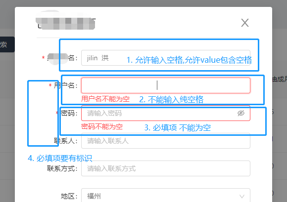
>
>2. 代码示例:此处指举例第一个输入框,并在里面进行注释
>
> ```jsx
>   <Form {...FORM_LAYOUT} form={form} onFinish={handleFinish}>
>           <Item
>             label="xxx名"
>             name="name"
>             validateTrigger="onBlur"
>             // normalize={(value) => value.replace(/\s/g, '')} //此行代码是直接限制无法输入空格,不符需求所以废弃
>             rules={[
>               //1. 此处message要置空,因为下方`value == null `就是为空提示,不置空会出现提示两遍的错误
>               //2. 为何保留此处? 需要输入框前有*提示必填 如果不是必填项就不需要
>               { required: true, message: '' },
>               {
>                 validator: async (_, value) => {
>                   //此行是去除前后空格后为空字符串或者直接为空的话返回 不能为空提示
>                   if (value == null ||value.trim() == '') { 
>                     return Promise.reject('xxx名不能为空');
>                   } else {
>                     const res: IResult<IExist> = await ChannelApi.isChannelExist(
>                       value
>                     );
>                     if (res?.data.status) {
>                       return Promise.reject('xxx名已存在');
>                     } else {
>                       return Promise.resolve();
>                     }
>                   }
>                 },
>               },
>             ]}
>           >
>             <Input placeholder="请输入渠道商名" />
>           </Item>
>     	 //不是必须项的对比
>       	 <Item label="联系人" name="contactName">
>             <Input placeholder="请输入联系人" />
>           </Item>
> </Form>
> ```
>
>3. 解析
>
>    1. `rules`中`message`为什么要置空?
>
>       因为下方`value == null `就是为空提示,不置空会出现提示两遍的错误
>
>    2. 为什么下方`validator`中已经给出为空提示,为何还要保留`  { required: true, message: '' }`?
>
>       因为需要输入框前有*提示必填 如果不是必填项就不需要,此项会给你增加`*`号标识
>       
>    3. 为何不直接给输入内容`.trim()`去除前后空格?
>
>       因为输入监听导师value是单次输入,需要你在后面提交时将参数进行一次trim()去除前后空格

### Ⅴ- 实现嵌套结构-多类型输入效果

>1. 需求场景:当要求通过下拉框切换后面输入框类别,同时后面的输入框绑定的值不同(与文档中给出的不同:文档中后续输入框时同一个,只是简单时输入框组合)
>
>2. 需求示例截图
>
>   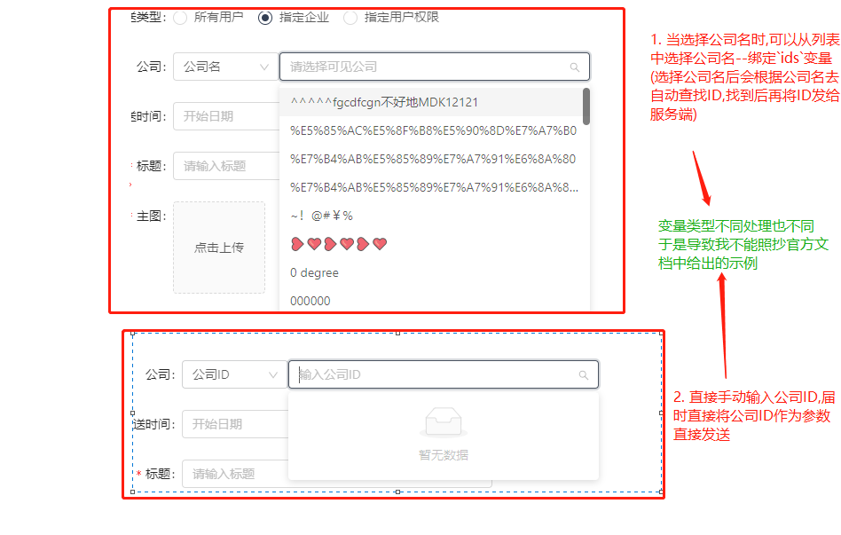
>
>3. 实现思路:
>
>   - `Form.Item`中再嵌套`Form.Item`,然后将各自规则分开写(不能写在`父item`中).分别绑定不同变量名,通过选择的类型切换渲染后面的`Form.Item`
>   - 在取数据时,可以判断其中一个变量为空时进行对另一个变量的数据(如果不渲染Form.Item,其绑定的变量为undefined),如此就能实现此需求
>   - 此处记录主要起到借鉴作用,我感觉应有更好的写法,但是暂时没想出,同学们如果有好写法希望可以提出交流
>
>4. 解决代码:
>
>   ```jsx
>     <Form.Item {...formItemLayout} label="公司">
>           <Select
>             defaultValue="0"
>             style={{ width: 120 }}
>             onChange={(v) => setinputType(v)}
>           >
>             <Option value="0">公司名</Option>
>             <Option value="1">公司ID</Option>
>           </Select>
>           {/* 当前方选择框选择公司ID输入时,渲染输入公司ID
>               当前方选择框选择公司名输入时,渲染请选择可见公司 */}
>           {inputType != '0' ? (
>             <Form.Item
>               {...formItemLayout}
>               //此处name需要绑定不同变量名,否则会导致与下方`选择可见公司`选择框变量互相污染
>               name="company_inputIds"
>               noStyle
>               rules={[{ required: true, message: '输入公司ID' }]}
>             >
>               {/*  此处使用antd自带下拉框   */}
>               <Select
>                 mode="tags"
>                 value={showCompanyIDList}
>                 onChange={(val) => changeCompanyIds(val)}
>                 showArrow={true}
>                 placeholder="输入公司ID"
>                 style={{ minWidth: 250, maxWidth: 350 }}
>                 tokenSeparators={[',']}
>               />
>             </Form.Item>
>           ) : (
>             //此处调用公用组件
>             <Form.Item
>               {...formItemLayout}
>               name="company_ids"
>               noStyle
>               rules={[{ required: true, message: '请选择指定公司' }]}
>             >
>               <SuperSelect
>                 value={showCompanyList}
>                 placeholder="请选择可见公司"
>                 loading={companyLoading}
>                 options={companyList}
>                 showArrow={true}
>                 onChange={(val) => {
>                   companyListChange(val);
>                 }}
>                 getData={() => {
>                   getCompanyList();
>                 }}
>                 onSearch={onSearchCompany}
>               />{' '}
>             </Form.Item>
>           )}
>         </Form.Item>
>    ---------------------------------  数据处理 ----------------------------------------------------  
>      const params = {
>         //当 `company_ids`为空时,取`company_inputIds`的值(反之相反),然后将值转为字符串形式(以,隔开)
>         company_ids:
>           data?.company_ids?.length > 0
>             ? data?.company_ids?.map((value) => value.key).join(',')
>             : !toJS(data?.company_inputIds)
>               ? undefined
>               : data?.company_inputIds?.toString(),
>       };
>   ```

### Ⅵ-实现From中使用富文本编辑器

>1. 需求场景:当你的表单提交中有富文本编辑器,且你要将其变为受控组件时
>
>2. 难点分析:
>
>  - 如何将让from认到富文本编辑器中的值:使用`form.setFieldsValue`方法设置`Form.Item`绑定的默认值,用作`校验`
>  - 为什么不用`setState`去将其绑定成受控组件?-->你不应该用 `setState`，可以使用 `form.setFieldsValue` 来动态改变表单值
>    --> [(此处为官方文档原话,点我传送)](https://ant.design/components/form-cn/#Form.Item)
>
>3. 代码及其注解
>
>   ```tsx
>     -----------------------  组件调用处 ------------------------
>     <Form.Item
>               {...formItemLayout}
>               name="EditorContent"
>               style={{ width: '120%' }}
>               rules={[
>                 {
>                   required: true,
>                   validator: (_, value) => {
>                     //此处只是简单判断是否为空,
>                     //但其实value在store中将undefined的值赋值成了'<p><br/></p>';
>                     //如果要严格判断是否为空,应加正则进行判断
>                     if (value) return Promise.resolve();
>                     return Promise.reject('请输入推送内容');
>                   },
>                 },
>               ]}
>             >
>               {/* 富文本编辑器-- 此组件为封装的组件*/}
>               <SuperWangeditor
>                 EditorContent={newEditorContent}
>                 setEditorContent={setEditorContent}
>                 setContentType={setContentType}
>                 disable={true}
>                 //此处将`changeHandle`方法传给子组件,目的是让其将值传递出来给`form.setFieldsValue`使用
>                 changeHandle={(content) => {
>                   form.setFieldsValue({
>                     'EditorContent': content,
>                   });
>                 }}
>               />
>      </Form.Item>
>     ------------------------ 封装的富文本组件中的`onchange`事件处代码    ----------------------------------------
>   import Wangeditor from 'wangeditor';
>   ..省略..
>     componentDidMount() {
>       const {  changeHandle } = this.props;
>     //当输入修改时触发
>   //3.x版本写法
>   //      editor.customConfig.onchange = (html) => {
>   //        //将子组件的值抛给父类,这样可以使得此组件更有通用性   ----------------->主要是这步
>    //       if (changeHandle) changeHandle?.(html);
>    //       //文本
>    //       if (setEditorContent || setContentType) {
>    //         //设置内容
>   //          setEditorContent(editor.txt.html());
>   //          setContentType(false);
>   //        }
>   //      };
>      //4.x版本应将`customConfig`更改为config
>       editor.config.onchange = (html) => {
>         // console.log(html)
>         //将子组件的值抛给父类,这样可以使得此组件更有通用性
>         if (changeHandle) changeHandle?.(html);
>         //文本
>         // console.log(editor.txt.text())
>         if (setEditorContent || setContentType) {
>           //设置内容
>           setEditorContent(editor.txt.html());
>           setContentType(false);
>         }
>       };
>     }
>     ---------------------- 对于输入富文本数据进行处理(此处可忽略,只是指出数据处理)  --------------------------------------
>       @computed
>       get newEditorContent() {
>         let content;
>           //此处如果为undefined时置换成'<p><br/></p>'     -->所以在上述校验条件中指出:如果严格校验输入为空以及纯空格需要用正则判断
>         if (typeof this.tableData.content == 'undefined') {
>           content = '<p><br/></p>';
>         } else {
>           content = toJS(this.tableData?.content);
>         }
>         return content;
>       }
>   
>   ```
>
>4. 富文本编辑器官网  -->[点我跳转](https://www.wangeditor.com/)


# 二、数据展示

## 1、[Table表格](https://ant.design/components/table-cn/)

> 基本前端大部分页面数据展示都是使用`Table`进行展示

### Ⅰ-列表渲染映射文字

>1. 场景:当你对下列表渲染时,服务端传送过来的`值是数字`(0,1,2),而你要`显示成相对应的文字时`
>
>2. 代码示例1:
>
>   ```jsx
>   <Table>
>         <Column
>           title="状态"
>           dataIndex="status"
>           render={(data) => {
>             const text = {
>               0: '已绑定',
>               1: '未绑定',
>               2: '已删除',
>             };
>             return text[data];
>           }}
>         />
>   </Table>
>   ```
>
>3. 代码示例2,写法不同效果相同,下面是本人喜欢的写法:
>
>   ```jsx
>   /**       数据字典 company-const.ts   **/
>   const SHOPSTATUSDICT = {
>     0: '已删除',
>     1: '正常',
>     2: '未绑定IP',
>   };
>   export{ SHOPSTATUSDICT }
>   
>   /**      页面调用出        */
>   import { SHOPSTATUSDICT } from '../common/company-const'//导入数据字典
>   const columns = [ {
>         title: '状态',
>         dataIndex: 'status',
>         ellipsis: true,  
>         render: text=>SHOPSTATUSDICT[text]//进行状态数据映射
>       },]
>   
>     return (
>       <Fragment>
>         <Table columns={columns} />
>       </Fragment>
>     );
>   ```

### Ⅱ-列表渲染映射-小数转百分比

>1. 当服务端给你的数据是小数,而你需要将其渲染成百分比进行展示   0.25-->25%
>
>2. 解析:应用的是`render`相关知识点
>
>3. 代码示例:
>
>   1. 转换函数代码
>
>      ```jsx
>        /**
>         * 将小数转化为百分比
>         * @param point 
>         * @returns 
>         */
>      toPercent=(point:number)=>{
>          //判断是否为空,如果为空不做处理 -->此处如果为空要转换成0,将此行代码下移一位即可
>       	if(!!!point) return point
>          //服务端可能传来的数据是字符串,转换一下
>           point=Number(point)
>          if (point==0)   return 0;
>          let str=Number(point*100).toFixed()+"%";
>          return str;
>        }
>      ```
>   
>   2. 列表table组件代码 
>   
>      ```jsx
>        //写法一
>        <Table>
>        <Column title="抽成比例" dataIndex="rate"
>              //将小数转换成百分比,当为数字时,进行转换
>               render={(data) => (typeof data =='number')?  tool.toPercent(data):data }
>         />
>        </Table>
>      
>        //写法二
>         const columns = [ {
>              title: '抽成比例',
>              dataIndex: 'rate',
>              width: 150,
>              ellipsis: true,
>              //将小数转换成百分比
>              render: data => tool.toPercent(data) 
>      
>         },];
>        <Table columns={columns}></Table>
>      ```
>   
>4. 如果对于`if(!!!point) `此行代码不懂的同学可以看本人在js笔记中的[`js中为什么需要!!?`](https://gitee.com/hongjilin/hongs-study-notes/blob/master/编程_前端开发学习笔记/(html+css+js)零散笔记,待梳理/JavaScript笔记(零散待梳理)/js中为什么需要!!？.md)部分

### Ⅲ-表格列固定

>1. 需求场景:当你的列表过长时,使用滚轮进行拖动会导致用户体验感较差,这时就需要进行表格列固定
>
>   1. 未使用时效果
>
>      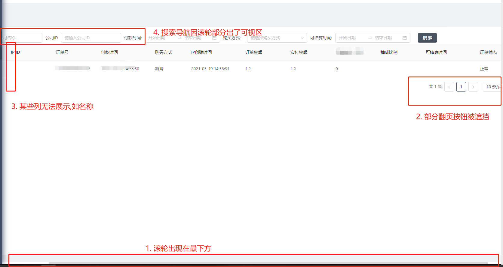
>
>         2. 使用后效果
>
>      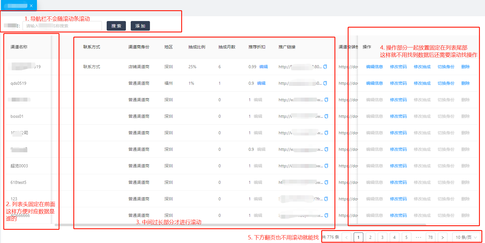
>
>        `ps`:截图中展示的都是开发中的`测试假数据`
>
> 2. 代码示例:只给出必要部分
>
>     1. css样式代码(需要给定`width`,否则无法生效,给定高度,防止超出)
>
>        ```scss
>        .tableWidth{
>          width: 1600px;
>          height: calc(100% - 48px);
>          :global {
>            .ant-table-wrapper,
>            .ant-spin-nested-loading,
>            .ant-spin-container,
>            .ant-table-container {
>              height: 100%;
>            }
>            .ant-table {
>              height: calc(100% - 48px);
>            }
>            .ant-table-pagination.ant-pagination,
>            div.ant-typography,
>            .ant-typography p {
>              margin-bottom: 0;
>            }
>          }
>        }
>        ```
>
>    2. js调用代码示例1
>
>       ```jsx
>        const columns = [
>         {
>             title: '公司ID',  
>             fixed: 'left',  //这就是固定在左边写法
>             dataIndex: 'companyId',
>             width: 150,
>             ellipsis: true,
>           },
>        ]
>       return (
>           <Table
>             className={` ${style.tableWidth}`}
>             columns={columns}
>             scroll={{ x: 600 }}  
>           />
>         );
>       ```
>
>    3. js调用2:(都可实现,效果一样)
>
>       ```jsx
>        const columns = [
>           {
>           title: '名称',
>           dataIndex: 'name',
>           width: 150,
>           fixed: 'left' as const,
>         }, {
>           title: '操作',
>           dataIndex: 'agentId',
>           width: 400,
>           fixed: 'right' as const,
>         }
>        ]
>       return (
>           <div className={style.tableWidth}>
>             <Table
>               scroll={{ x: 600, y: 'calc(100% - 48px)' }}
>               columns={columns}
>             />
>           </div>
>         );
>       ```
>
>3. 注意:需要给定宽度,不然不会生效

### Ⅳ-列表内容超出隐藏且悬停显示全

>这属于`超长连续字段（长数字和长单词）破坏表格布局的问题`（即使你指定了列的宽度也会被挤开），组件之前默认内加过`word-break: break-word;`去纠正此类布局,又会引起[＃13624](https://github.com/ant-design/ant-design/issues/13624)的问题--列高也会被撑开(此处给的例子于其不一样,但原理相似)
>
>1. 需求场景:当我的列表内容过多使得表格撑开,导致整个表格样式与希望效果不符合时,我希望能将其超出隐藏,并能悬停显示全部信息
>
>   
>
>2. 代码实现
>
>   ```jsx
>   import { Tooltip } from 'antd';
>   const columns=[
>     { title: '渠道商账号', dataIndex: 'username',
>     width: 150,
>     onCell: () => {
>       return {
>         style: {
>           maxWidth: 180,
>           overflow: 'hidden',
>           whiteSpace: 'nowrap',
>           textOverflow:'ellipsis',
>           cursor:'pointer'
>         }
>       }
>     },
>      //此处引入用作悬停显示全
>     render: (text) => <Tooltip placement="topLeft" title={text}>{text}</Tooltip>
>   },
>   ]
>   ```
>
>3. 效果实现图
>
>   

### Ⅴ-Table表中使用气泡提示Tooltip

#### ① *AntD的Table表头title加Icon图标和气泡提示Tooltip*

>1. 需求场景:当你的产品要你实现这个效果时
>
>   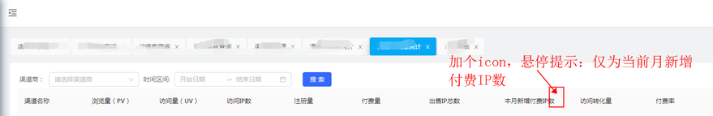
>
>2. 代码实现:直接在title中写即可
>
>   ```tsx
>   import React, { Component } from 'react';
>   import { Table, Button, Modal, Typography } from 'antd';
>   import { QuestionCircleOutlined } from '@ant-design/icons';
>   import { Tooltip } from 'antd';
>   interface IProps {
>     store: Store;
>   }
>   
>   const ManageTable = (props: IProps) => {
>     const { store } = props;
>     const columns = [
>       {
>         dataIndex: 'monthCount',
>         ellipsis: true,
>        //效果实现就在这行
>         title: 
>         <div> 本月新增付费IP数&nbsp;
>             <Tooltip placement='top' title='仅为当前月新增付费IP数'>
>                 <QuestionCircleOutlined />
>             </Tooltip>
>         </div>,
>       },
>   
>     ];
>     return (
>       <Table
>         rowKey={(record, index) => record.id || index}
>         className="table-box"
>         columns={columns}
>       />
>     );
>   };
>   
>   export default observer(ManageTable);
>   ```
>
>3. 效果展示
>
>   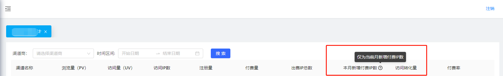

#### ②*列表中正常使用气泡提示Tooltip*

>1. 正常列表中使用气泡提示
>
>2. 代码示例:---在`columns`的render中使用
>
>   ```tsx
>    const columns = [ {
>         title: '列名',
>         dataIndex: '属性名',
>         render: (text, record) => (
>           <Tooltip placement="top" title={text}>
>             <a onClick={() => showModal(true, record.id, text)}>{text}</a>
>           </Tooltip>
>         ),
>       },
>    ]
>   ```
>
>3. 实现效果
>
>   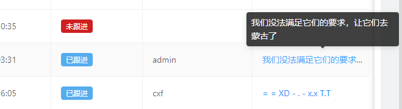 

#### ③ *列表中使用[Tooltip]组件却出现两个提示*的问题解决

>1. 问题场景:当你想为表格中超出隐藏文字部分加气泡提示时却发现出现两个提示
>
>   - 问题代码:
>
>     - ```tsx
>       <Column
>         title="支付宝账户"
>         dataIndex="zfb_account_name"
>         ellipsis
>         width={120}
>          render={text => (
>           <Tooltip  placement="top" title={text}>
>           {/* {text} //此处直接将内容数据返回出去渲染 */}
>            {`这是返回出去列表渲染的:${text}`}
>            </Tooltip>   
>         )}
>       />
>       ```
>
>       
>
>   - 问题截图与分析:
>     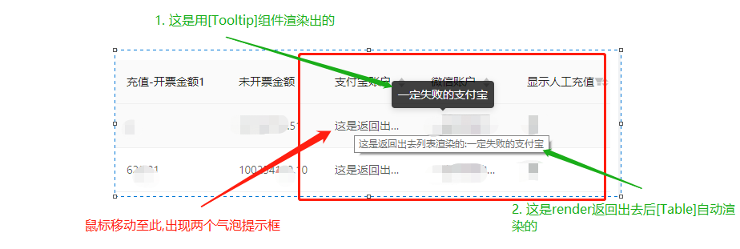 .
>
>2. 问题分析:
>
>   - 在`render()`中返回如果是纯文本,会被[Table]自动渲染成白色气泡提示,但此提示不符合我们自己的需求(无法复制、不够美观)
>
>   - 所以我们返回给`render()`的可以是自己定义的`DOM`.但是此处也会引出一个新的问题,看下方-->
>
>     - 初次改进代码:
>
>       ```jsx
>       -----------------------修改后出现问题的代码------------------------------------;
>       <Column
>         title="支付宝账户"
>         dataIndex="zfb_account_name"
>         ellipsis
>         width={120}
>          render={text => (
>           <Tooltip  placement="top" title={text}>
>           {/* {text} //此处直接将内容数据返回出去渲染 */}
>            <div>{`这是返回出去列表渲染的:${text}`}</div> 
>            </Tooltip>   
>         )}
>       />
>       ```
>
>     - 初次改进效果:
>       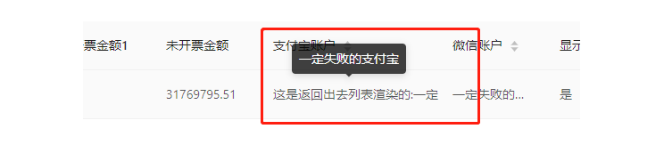.
>
>   - 可以看出虽然解决了`双气泡提示`的问题,但也引出了一个新问题::返回的新的DOM它不受前方`ellipsis`属性影响,虽然气泡提示成功变为只有一个,但是下方文本仍然超出,怎么办?
>
>3. 最正确写法(数组写法也一样,自行转换下即可):
>
>   - 代码
>
>     ```tsx
>     -----------------------  正确写法1:给dom加以下样式 -----------------------------------;
>     //tsx
>     <Column
>       title="支付宝账户"
>       dataIndex="zfb_account_name"
>      // ellipsis 此属性无法影响到render返回出来的dom节点,无用了,去除
>       width={120}
>        render={text => (
>       <Tooltip  placement="top" title={text}>
>         {/* {text} //此处直接将内容数据返回出去渲染 */}
>          <div className={style.text}>{`这是返回出去列表渲染的:${text}`}</div>
>       </Tooltip>   
>       )}
>     />
>     //scss
>       .text {
>         white-space: nowrap;
>         overflow: hidden;
>         text-overflow: ellipsis;
>       }
>     -----------------------  正确写法2:直接将写成内联样式(不推荐) -----------------------------------;
>     
>     <Column
>       title="支付宝账户"
>       dataIndex="zfb_account_name"
>      // ellipsis 此属性无法影响到render返回出来的dom节点,无用了,去除
>       width={120}
>        render={text => (
>       <Tooltip  placement="top" title={text}>
>         <div style={{
>           overflow: 'hidden',
>           whiteSpace: 'nowrap',
>           textOverflow: 'ellipsis',
>         }}>{text}</div>
>      </Tooltip> 
>       )}
>     />
>     ```
>
>   - 效果截图:
>
>     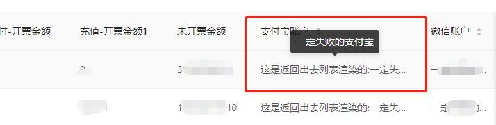 
>
>   
>
>   于此问题完美解决了


### Ⅵ-table排序对比大小相关

>antd列表排序`第一次点击逆序第二次正序第三次是恢复到默认`,依次循环.所以每第三次点击并不是无效,而是本身需要此效果
>
>其实可以直接写,只是如果不抽出,多处使用重复的代码,万一修改就很麻烦

#### ①*`table按时间排序`*

>1. 需求场景分析:当你需要对列表中数据按照时间排序,但是antd默认排序方法无法认出根据你传入对象的何属性进行排序,此时你就需要自己写时间排序
>
>2. 代码实现与截图
>
> ```tsx
>   //此处贴士:antd第一次点击逆序第二次正序第三次是回复到默认,依次循环
> {
>       title: '采集结束时间',
>       dataIndex: 'end_time',
>       key: 'end_time',
>       sorter: (a, b) => new Date(a.end_time).getTime() - new Date(b.end_time).getTime()
>  },
>  -----------------封装与调用--------------------------
> 工具函数抽出:
> /**
>   * 时间列表排序方法
>   * 可以更换a,b顺序,做到初次为逆序还是正序排序
>   * @param a 包含时间属性的对象a
>   * @param b 包含时间属性的对象b
>   * @param type 作为排序依据的时间属性名字
>   * @returns number 利用正负数进行判断
>   */
>  timeSorter = (a:object, b:object):Function => (type):number => new Date(a[type]).getTime() - new Date(b[type]).getTime()
>
> //此处b-a(看自己需求)原因为要符合服务端给定的数据,服务端给的数据默认越以前的时间在前面,防止第一次看上去无效
> 调用: sorter: (a, b) => tool.timeSorter(b, a)('start_time')
> ```
>
>

####  ②*`table通用对比大小`*

>1. 包括时间排序,你都能使用此封装函数
>
>2. 代码实现与截图
>
>  ```tsx
>    -----------------封装与调用--------------------------
>   工具函数抽出:
>    /**
>     * 通用对比法
>     * @param a 包含要对比属性的对象a
>     * @param b 包含要对比属性的对象b
>     *  @param type 作为排序依据的属性名字
>     * @returns boolean
>     */
>    //commonSorter = (a:object, b:object):Function=> (type):boolean  => a[type] > b[type]  -->错误,返回应为1或者-1
>    commonSorter = (a:object, b:object):Function=> (type):number  => a[type] > b[type] ? 1 : -1
>  sorter={(a: object, b: object) => tool.commonSorter(a, b)('url')}
>  ```
>
>  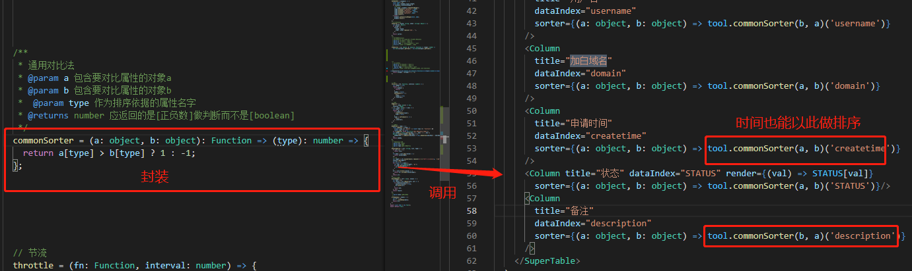
>
>`注意`:排序返回应为`正负数[如1、-1]`而不是`boolean`类型


## 2、Tree 树形控件

> [官方文档部分](https://ant.design/components/tree-cn/)
>
> ps:下方解决代码只给出本效果所需必要代码,其余代码不展示出来-->`必须代码上都有相应注释`

### Ⅰ- 实现点击复选框后的文字也能进行选择的效果

>1. 需求场景:
>
>   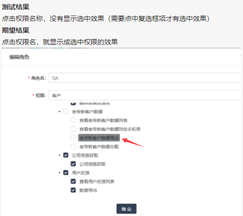 
>
>2. API概述:
>
>   - [`checkedKeys`]API是显示记录表单中选中的节点
>   - [`onCheck`]API是针对前面的复选框点击,点击时传`参数为所有选中的数组`,此处可以直接看官方文档就能实现
>   - [`onSelect`]API是针对后面文字树节点的点击,但是点击时传`参数为当前选中树节点`,且其选中与未选中与[`checkedKeys`]无关联
>
>3. 思路分析:
>
>   - 首先,声明[`checkedKeys`]变量,然后从服务端获取已有选中项,进行初始化
>   - 不论是[onCheck]还是[onSelect],都是对于`checkedKeys`变量进行拼装操作,再写入渲染
>   - 只是说[onSelect]传来的参数需要经过加工,略显复杂,详情请看下方代码
>
>4. 代码:
>
>   ```tsx
>   import { Button, Form, Input, Tree } from 'antd';
>   import { inject, observer, useLocalStore } from 'mobx-react';
>   import React, { useEffect, useMemo, useRef, useState } from 'react';
>   import style from './style.scss';
>   
>   
>   const EditModal = (props) => {
>      //用来存 [checkedKeys]-->已经选中的状态  通常需要从服务端先获取初始化原先已经选中的数据
>     const [checkedKeys, setCheckedKeys] = useState([]);
>     const [form] = Form.useForm();
>       
>    /**
>      * 一 复选框选中函数
>      * @param checked 传入当前勾选上的所有节点key
>      */
>     const handleSearchTreeNode = (checked) => {
>         setCheckedKeys(checked);
>     };
>     /**
>      * 二 树节点选中函数
>      * @param checked 选中时传入当前树节点  --注意:当为未选中状态时传入为空,所以不能用作[权限选中判断]
>      * @param e 点击树节点时传入整个树节点数据信息 --不论是否选中都会传入
>      * @param node
>      * @param event
>      */
>     const handleSelectTreeNode = (checked, e, node, event) => {
>       //将点击的树节点的[key]解构出来
>       const {
>         node: { key },
>       } = e;
>       //声明一个SET数组,将key存入(以防万一同时防止重复赋值)
>       const data = Array.from(new Set([...checkedKeys, key]));
>       //首先判断原有[树数组:checkedKeys]中是否含有当前点击的[key],如果有则筛选掉,
>       if (checkedKeys.includes(key))
>       setCheckedKeys(checkedKeys.filter((value) => value != key));
>       //如果原有[树数组]中不含有,则直接将新增好的[data]写入替代掉[树数组:checkedKeys]
>       else setCheckedKeys(data);
>     };
>   
>     return (
>       <Form onFinish={submit} {...formItemLayout} form={form}>
>         <Form.Item label="权限" required>
>           <Form.Item
>             name="roles"
>             noStyle
>             rules={[
>               () => ({
>                 validator(rule: any, value: any) {
>                   if (checkedKeys && checkedKeys.length === 0)  return Promise.reject('请选择角色对应的权限');
>                   return Promise.resolve();
>                 },
>               }),
>             ]}
>           >
>             <Tree
>               defaultCheckedKeys={[]}
>               checkable
>               expandedKeys={expandedKeys}
>               onExpand={(keys) => {
>                 setExpandedKeys(keys);
>               }}
>               //此处绑定所有Tree数据  
>               treeData={menuTree}
>                //此处绑定选中的key
>               checkedKeys={checkedKeys}
>                 //此处为复选框点击触发API
>               onCheck={handleSearchTreeNode}
>                 //此处为后面的文字树节点点击触发API
>               onSelect={handleSelectTreeNode}
>               height={300}
>             />
>           </Form.Item>
>         </Form.Item>
>         </div>
>       </Form>
>     );
>   };
>   ```
>
>5. 效果展示:
>
>    


