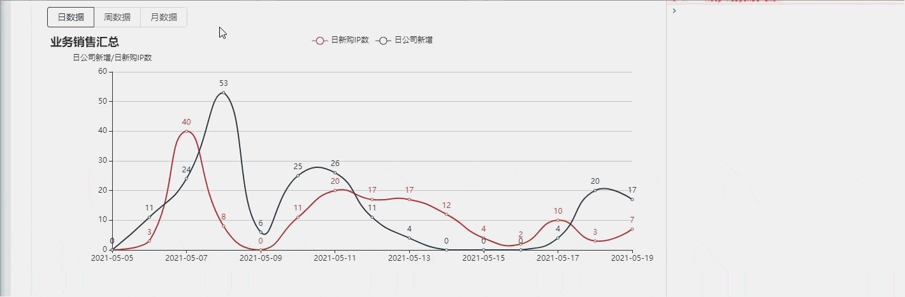

> [官方](http://echarts.apache.org/zh/index.html)
>
> 此笔记预留为日后遇到此库问题记录

## Ⅰ-实现Echart折线图防抖自适应

>1. 当我需要让Echart的折线图根据当前页面大小发生变化,并且进行防抖处理节约性能
>
>2. 分析:
>
>      1. 利用`柯里化`与`高阶函数`的知识点写防抖函数
>      2. 利用`Echart`的 `resize()`刷新函数进行适配
>
>3. 代码示例
>
>    1. 防抖函数代码
>
>  ```jsx
>    /**
>      * 防抖进行echart自适应
>      * @param chartDom  传入 echarts.init(chartDom);生成的对象
>      */
>    debounceEchartResize = () => {
>      let timers 
>      return (chartDom,interval:number) => {
>        if (timers) clearTimeout(timers);
>        timers = setTimeout(() => { // 只执行最后一个定时器的 结果
>          chartDom.resize()
>        }, interval); // 推迟 300 ms 在执行resize 效果 
>        // return timer
>      }
>    }
>  ```
>
>2. js调用 -->本代码在React hooks 中使用
>
>  ```jsx
>  import { tool } from '~/utils/Tool'
>  const SaleSumInfo = (props: IProps) => {
>   //柯里化调用防抖自适应,在此处第一次调用,会生成timer,这样就不会因为在副作用函数中
>    //因为重复渲染而重置
>    const debounceResize = tool.debounceEchartResize()
>
>    //副作用函数,作用是react的生命周期
>    useEffect(() => {
>      const chartDom = document.getElementById('main');
>      const myChart = echarts.init(chartDom);
>       //形成闭包,同时防止监听事件运行两次回调函数
>       const resizeFunc=()=>debounceResize(myChart,300)
>       //创建监听事件
>       window.addEventListener("resize",resizeFunc) 
>        //销毁的生命周期 进行监听卸载
>    	 return ()=>{
>        window.removeEventListener("resize",resizeFunc)
>      }
>
>     	//渲染函数
>      return ()
>    }
>  }
>  ```
>
>4. 效果示例图
>
>  