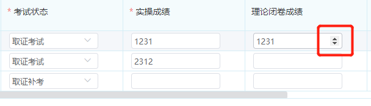

## #说明

>Element-ui使用过程中,一些需求总是要求我们对输入控件的键入内容进行限制,此笔记就将记录这些常用操作

## 1、输入框限制只能输入数字或带小数点的数组

### Ⅰ- 手动加正则限制

>* 输入框中增加 `oninput` 属性就能限制,同理在onchange事件中也能生效
>* 带小数点的纯数字正则校验:`/[^\d^.]+/g`,`/[^0-9.]/g`
>* 纯数字正则校验:`/[^\d.]/g`
>
>```vue
><el-input
>   oninput="value=value.replace(/[^\d^.]+/g,'')"
>   v-model="form.operateExamScore1"
> />
>```

### Ⅱ - 将输入框type设置为number

>```vue
><el-input
>   type="number"
>   v-model="form.operateExamScore1"
> />
>```
>

### Ⅲ - el-input type=number时字数限制不起作用

>ue使用element-ui的el-input 时，不设置type属性，maxlength是可以正常限制字数。
>
>但如果想要下面这样的效果 
>
>需要让type=“number” ，这个时候maxlength就不起作用了。
>解决方法是改成 `oninput` 方法监听：加入` oninput="if(value.length > 最大长度) value = value.slice(0,最大长度)"`
>
>```vue
><el-form-item >
>   <el-input
>     type="number"
>     oninput="if(value.length > 4) value = value.slice(0,4)"
>     v-model="scope.row.operateExamScore2"
>   />
> </el-form-item>
>```
>
>