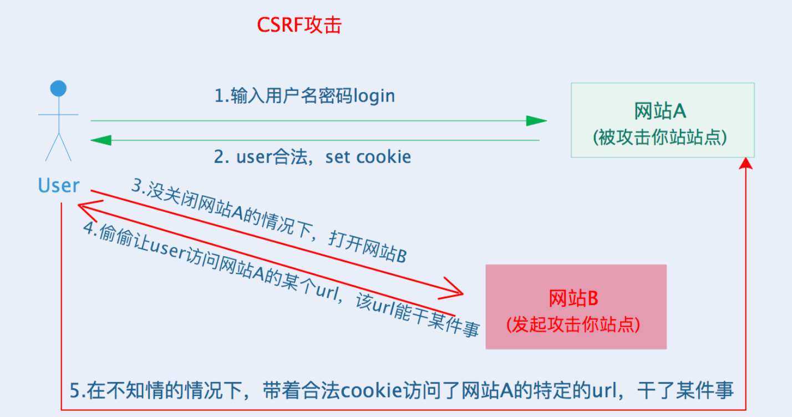

## #说明

> * 随着互联网以及大前端的快速发展,前端安全问题也越来越值得前端开发人员重视学习了; 
> * 相信大家在学习或者工作中也常常会听到一些前端安全相关的名词或者知识点,但基本都是知其名不知其所以
> * 这里我将会学习并梳理几个常见前端安全问题,如果有错误,大家可以私信或者评论指出
>
> 查阅借鉴的资料: 思否的[前端安全编码规范](https://segmentfault.com/a/1190000037657222); 知乎的 [前端安全问题汇总（实战）](https://zhuanlan.zhihu.com/p/83865185); 美团技术团队的 [前端安全部分](https://tech.meituan.com/tags/%E5%89%8D%E7%AB%AF%E5%AE%89%E5%85%A8.html); 掘金的 [常见前端安全问题及解决方案](https://juejin.cn/post/6844903942036389895#heading-0);CSDN的[【安全漏洞】CSRF漏洞攻击：原理、检测、防御、实践](https://blog.csdn.net/kzadmxz/article/details/92076837)
>
> 除此笔记外大家可以看我其他笔记 :**[全栈笔记](https://gitee.com/hongjilin/hongs-study-notes/tree/master)**、**[数据结构与算法](https://gitee.com/hongjilin/hongs-study-notes/tree/master/编程_算法及课程基础学习笔记/数据结构与算法)**、**[编程_前端开发学习笔记](https://gitee.com/hongjilin/hongs-study-notes/tree/master/编程_前端开发学习笔记)**、**[编程_后台服务端学习笔记](https://gitee.com/hongjilin/hongs-study-notes/tree/master/编程_后台服务端学习笔记)** 、**[Java](https://gitee.com/hongjilin/hongs-study-notes/tree/master/编程_后台服务端学习笔记/Java)** 、**[Nodejs](https://gitee.com/hongjilin/hongs-study-notes/tree/master/编程_后台服务端学习笔记/Nodejs)** 、**[JavaScript笔记](https://gitee.com/hongjilin/hongs-study-notes/tree/master/编程_前端开发学习笔记/HTML+CSS+JS基础笔记/JavaScript笔记)**、**[编程工具使用笔记](https://gitee.com/hongjilin/hongs-study-notes/tree/master/编程_前端开发学习笔记/A_前端工具使用笔记)** 、**[ES6及后续版本学习笔记](https://gitee.com/hongjilin/hongs-study-notes/tree/master/编程_前端开发学习笔记/ES6及后续版本学习笔记)** 、**[Vue笔记整合](https://gitee.com/hongjilin/hongs-study-notes/tree/master/编程_前端开发学习笔记/Vue笔记整合)** 、**[React笔记](https://gitee.com/hongjilin/hongs-study-notes/tree/master/编程_前端开发学习笔记/React笔记)**、**[微信小程序学习笔记](https://gitee.com/hongjilin/hongs-study-notes/tree/master/编程_前端开发学习笔记/微信小程序学习笔记)**、**[Chrome开发使用及学习笔记](https://gitee.com/hongjilin/hongs-study-notes/tree/master/编程_前端开发学习笔记/Chrome开发使用及学习笔记)** 以及许多其他笔记就不一一例举了

## 一、常见前端安全问题

>###### 按常见程度排序
>
>1. **XSS(跨站脚本攻击)**
>2. **CSRF(跨站请求伪装)**
>3. **ClickJacking(点击劫持)**
>4. HSTS(HTTP严格传输安全)
>5. CND劫持
>6. iframe
>7. opener

## 二、XSS (跨站脚本攻击)

>###### **XSS全称 ( CRoss Site Scripting ) 跨站脚本攻击**,是前端最常见的安全问题
>
>* XSS 是一种在web应用中的计算机安全漏洞,它允许恶意web用户将代码植入到提供给其他用户使用的页面中
>* 攻击者通过注入非法的 **html标签** 或者 **JavaScrpipt代码**, 从而当用户浏览该网页时,控制用户浏览器
>
>这里推荐一篇文章,是美团技术团队出的 --> [如何防止XSS攻击](https://tech.meituan.com/2018/09/27/fe-security.html)

### Ⅰ -  DOM类型 xss

>###### 利用DOM本身存在的缺陷进行攻击
>
>举个🌰:
>
>```html
>//正常写代码
>
>//xss攻击  -->将其绑定的src弄成错误的,这样就会走到 innerror中的代码
>
>```

#### ① 攻击步骤

>* 攻击者构造出特殊的URL,其中包含恶意代码
>* 用户打开带有恶意代码的URL
>  * 用户浏览器接收到响应后解析执行,前端JS取出URL中的恶意代码并执行
>  * 恶意代码且与用户数据并发送到攻击者的网站,或者冒充用户行为,调用目标网站接口执行攻击者指定的操作
>


### Ⅱ -  反射型xss (非持久性)

>* **反射型xss也被称为`非持久性XSS`**, 是现在最容易出现的一种XSS漏洞
>* XSS代码出现在URL中,通过引诱用户点击一个链接到目标网站的恶意链接来实施攻击(是不是很熟悉)
>
>举个栗子
>
>```js
>//其中 `xxx` 代表恶意代码
>https://gitee.com/hongjilin?data=xxx
>```
>
>* `xxx`是恶意代码,传到服务器的参数data被服务器接收之后
>* 响应的页面包含data这个变量的,会将恶意代码注入到页面上,进行攻击

#### ① 攻击步骤

>* 攻击者构造出特殊的URL,其中包含恶意代码
>* 用户打开带有恶意代码的URL时,网站服务端将恶意代码从URL中取出,拼接在HTML中返回给浏览器
>* 用户浏览器接收到响应后解析执行,同时混在其中的恶意代码也会被执行
>* 恶意代码窃取用户数据并发送到攻击者的网站,或者冒充用户的行为,调用目标网站接口执行攻击者指定的操作

#### ② 特点

>* 反射型XSS漏洞常见于通过URL传递参数的功能,如网站搜索、跳转等
>* 由于需要用户主动打开恶意URL才能生效(像是你发了一段恶意链接给人,通常都不会自动运行的,只有你手动点击触发),攻击者往往会结合多种手段诱导用户点击(只要你触发了就会跳转或者运行恶意代码)
>* POST的内容也可以触发反射型XSS,只不过其触发条件比较苛刻(需要构造表单提交页面,并引导用户点击),所以非常少见


### Ⅲ - 存储型xss  (持久性)

#### ① 特点

>* **存储型XSS又被称为 `持久性XSS` **, 它是最为危险的一种跨站脚本
>* 相比 **反射型XSS** 和 **DOM型** :  它具有更高的隐蔽性,所以危害更大,**它不需要用户手动触发**
>* 当攻击者提交一段XSS代码后被服务端接收并存储,当所有浏览者访问某个页面时都会被XSS
>* 其中最典型的栗子就是 **留言板**

#### ② 攻击步骤

>* 攻击者将恶意代码提交到目标网站的数据库中
>* 用户打开目标网站时,网站服务器将恶意代码从数据库取出: 拼接在HTML中返回给浏览器
>* 用户浏览器接收到响应后解析执行,混在其中的恶意代码也被执行
>*  恶意代码窃取用户数据并发送到攻击者的网站,或者冒充用户的行为,调用目标网站接口执行攻击者指定的操作
>
>这种攻击常见于带有用户保存数据的网站功能: 如 **论坛发帖**、**商品评论**、**用户私信**等

### Ⅳ - 反射型与存储型XSS的区别

>* 反射型XSS(非持久性)的恶意代码存储在URL中
>* 存储型XSS(持久性)的恶意代码存储在数据库中

### Ⅴ - DOM型跟其他两种XSS的区别

>DOM型XSS攻击中
>
>* 取出和执行恶意代码由浏览器端完成,属于前端JavaScript本身的安全漏洞;
>* 其他两种都属于服务端的安全漏洞

### Ⅵ - 解决方案

#### ①  httpOnly

>在cookie中设置**HttpOnly**属性, 使得JS脚本无法读取到cookie信息

#### ② 输入过滤

>对用户的输入进行过滤,通过将 `<>`、`''`、`""`等字符进行转义,移除用户输入的Style节点、Script节点、iframe节点
>
>```js
>const filterXSS(str){
>    let s= '';
>    if(str.length == 0) return "";
>    s = str.replace(/&/g,"&amp;");
>    s = s.replace(/</g,"&lt;");
>    s = s.replace(/>/g,"&gt;");
>    s = s.replace(/ /g,"&nbsp;");
>    s = s.replace(/\'/g,"&#39;");
>    s = s.replace(/\"/g,"&quot;");
>    return s; 
>}
>```

#### ③ 转义HTML

>* 根据输出数据所在的上下文来进行相应的编码
>* 数据放置于HTML元素中,需进行 **HTML编码**
>* 放置于 URL 中,需要进行 **URL编码**
>* 还有 **JavaScript编码**、**CSS编码**、**HTML编码**、**JSON编码**等

#### ④  预防 存储型、反射型XSS攻击

>> ###### 此方法主要预防 存储型和反射型XSS攻击
>
>**纯前端渲染过程**
>
>* 浏览器先加载一个静态HTML,此HTML中不包含任何跟业务相关的数据
>* 然后浏览器执行HTML中的JavaScript
>* JavaScript 通过 Ajax 加载业务数据,调用 `DOM API` 更新到页面上
>
>**在纯前端渲染中,我们会明确告诉浏览器:下面要设置的内容是文本（`.innerText`），还是属性（`.setAttribute`），还是样式（`.style`）等等。浏览器不会被轻易的被欺骗，执行预期外的代码了**
>
>* 但纯前端渲染就需要注意避免DOM型的XSS漏洞
>* 在很多内部、管理系统中,采用纯前端渲染是非常适合的,但对于性能要求高; 
>* 或有SEO需求的页面,我们仍要面对拼接HTML的问题

#### ⑤ 预防DOM型XSS攻击

>DOM型XSS攻击,实际上就是网站前端JavaScript本身不够严谨,把不可信的数据当代码执行了
>
>* 在在使用 `.innerHTML`、`.outerHTML`、`document.write()` 时要特别小心，不要把不可信的数据作为 HTML 插到页面上，而应尽量使用 `.textContent`、`.setAttribute()` 等。
>* 如果用 Vue/React 技术栈，并且不使用 `v-html`/`dangerouslySetInnerHTML` 功能，就在前端 render 阶段避免 `innerHTML`、`outerHTML` 的 XSS 隐患。
>* DOM 中的内联事件监听器，如 `location`、`onclick`、`onerror`、`onload`、`onmouseover` 等，`<a>` 标签的 `href` 属性，JavaScript 的 `eval()`、`setTimeout()`、`setInterval()` 等，都能把字符串作为代码运行。如果不可信的数据拼接到字符串中传递给这些 API，很容易产生安全隐患，请务必避免。
>
>```html
><!-- 内联事件监听器中包含恶意代码 -->
>
>
><!-- 链接内包含恶意代码 -->
><a href="UNTRUSTED">1</a>
>
><script>
>// setTimeout()/setInterval() 中调用恶意代码
>setTimeout("UNTRUSTED")
>setInterval("UNTRUSTED")
>
>// location 调用恶意代码
>location.href = 'UNTRUSTED'
>
>// eval() 中调用恶意代码
>eval("UNTRUSTED")
></script>
>```

### Ⅶ -  通过一些原则减少漏洞产生

>* **利用模板引擎**:开启模板引起自带的HTML转义功能
>* **避免内联事件**: 尽量不要使用 `onLoad="onload('{{data}}')"`、`onClick="go('{{action}}')"` 这种拼接内联事件的写法。在 JavaScript 中通过 `.addEventlistener()` 事件绑定会更安全。
>* **避免拼接HTML**: 前端采用拼接HTML的方法比较危险,如果框架允许，使用 `createElement`、`setAttribute` 之类的方法实现。或者采用比较成熟的渲染框架，如 Vue/React 等。
>* **时刻保持警惕**: 插入位置为 DOM 属性、链接等位置时，要打起精神，严加防范。
>* **增加攻击难度，降低攻击后果** 通过 CSP、输入长度配置、接口安全措施等方法，增加攻击的难度，降低攻击的后果。
>* **主动检测和发现** 可使用 XSS 攻击字符串和自动扫描工具寻找潜在的 XSS 漏洞。

------


## 三、CSRF (跨站请求伪造)

>1. **CSRF全称 ( Cross-Site Request Forgeries )跨站请求伪造**,跟XSS攻击一样,存在巨大的危险性
>   - 攻击者盗用了你的身份,以你的名义发送恶意请求
>   - 对于服务器来说这个请求完全是合法的,但是时却完成攻击者所期望的一个动作: 以你的名义发送邮件、发消息、添加系统管理员、甚至于转账、购买商品等

### Ⅰ- 原理图

>
>
>上图中**网站A**就是存在CSRF漏洞的网站,**网站B**为攻击者构建的恶意网站;**User**为网站A的合法用户
>
>* **用户user**打开浏览器,访问受信任网站A,输入用户名和密码请求登录网站A
>* 在用户信息通过验证后,**网站A**产生Cookie信息并返回给浏览器,此时用户登录**网站A**成功,可以正常发送请求到网站A
>* 用户未退出网站A之前,在同一浏览器中打开一个**tab页**访问网站B
>* **网站B**接收到用户请求后,返回一些攻击性代码,并发出一个请求要求访问第三方站点A
>* 浏览器在接收到这些攻击性代码后,根据网站B的请求,在用户不知情的情况下携带Cookie信息,向网站A发出请求,网站A并不知道该请求其实是由B发起的,所以会**根据用户带的Cookie信息**以他的权限处理该请求,导致来自网站的恶意代码被执行

### Ⅱ - CSRF与XSS的区别

>###### CSRF尽管听起来很像跨站脚本(XSS),但它与XSS非常不同
>
>- XSS利用站点内的信任用户; 而 CSRF 则通过伪装成受信任用户的请求来利用受信任的网站
>- 与XSS攻击相比,CSRF攻击往往不大流行(因此对其进行防范的资源也相当稀少)和难以防范,所以被认为比XSS更具危险性

### Ⅲ - 举个CSRF攻击🌰

>1. **前置条件解释**
>   - 受害者 **努力学习的汪** 在某银行有一笔存款
>   - 而他如果在该银行的网站转账,发起的请求接口为: `http://yinhang.example/withdraw/account=努力学习的汪&money=10000&for=某人`   --> 意思为 努力学习的汪转账10000给某人账号下
>   - 通常情况下: 该请求发送到网站后,服务器会先验证该请求是否来自一个合法的 **session** ,并且确认该**session 用户**已经登录成功,才会真正完成转账
>2. **没用CSRF攻击,尝试直接修改请求参数**
>   - 黑客 **hong** 自己在该银行也有账号,并且知道上文中的 **URL** 可以把钱进行转账操作. 
>   - 所以他尝试自己发一个请求给服务器 :  `http://yinhang.example/withdraw/account=努力学习的汪&money=10000&for=hong`
>   - 但实际上这个请求来自于 **hong** 而不是 **努力学习的汪** . 所以根本不能通过验证
>3. **使用CSRF攻击**
>   - 痛定思痛,黑客hong 突然想到了**CSRF攻击**的方式,于是他写了一个网站来随机挑选幸运儿
>   - 他在自己网站上放入以下代码: `http://yinhang.example/withdraw/account=[用户信息占位符]&money=10000&for=hong`;然后通过某些广告勾引某些人来访问这个网站
>   - 这样当某幸运儿登录该网站时,这个请求就会携带 这个幸运儿 的浏览器中的cookie、从他的浏览器向银行发起请求;这里暂时将这个幸运儿定为 **努力学习的汪**
>   - **大多数情况下,这个请求会失败**: 因为他要求 努力学习的汪 的认证信息
>   - 但如果 努力学习的汪 恰巧刚访问它的银行不久,这时候他浏览器与银行网站之间的 **session** 并未过期,浏览器的**cookie**中还含有他的认证信息,那么,他就悲剧了!!!
>   - 这个URL如果得到正确的认证信息,那么就会得到响应,钱将从 努力学习的汪 的账号转移到 hong 的账号;并且他当时是完全不知情的
>   - 即便他后来发现去银行查询日志,也只能发现确实有一个来自于他的合法请求转移了资金,没用任何被攻击的痕迹,而hong拿着钱逍遥法外

### Ⅳ  -  CSRF漏洞检测

>1. 检测CSRF漏洞是一项比较繁琐的工作,最简单的方法就是抓取一个正常请求的数据包,去掉Referer字段后再重新提交,如果该提交还有效,那么基本上可以确定存在CSRF漏洞
>2. 随着对CSRF漏洞研究的不断深入,不断涌现出一些专门针对CSRF漏洞进行检测的工具:`CSRFTester`、`CSRF Request Builder`等
>3. 以`CSRFTester`为例:
>   - 首先需要抓取我们在浏览器中访问过的所有链接以及所有的表单等信息
>   - 然后通过在`CSRFTester`中修改相应的表单等信息重新提交,这相当于一次伪造客户端请求
>   - 如果修改后的测试请求被网站服务器接收,则说明存在CSRF漏洞,当然此款工具也可以被用来进行CSRF攻击

### Ⅴ - 防御CSRF攻击

>目前防御CSRF攻击主要有三种策略: 
>
>* 验证`HTTP Referer`字段;
>* 在请求地址中添加token并验证
>* 在`HTTP头`中自定义属性并验证
>
>但鉴于种种原因,这三种方法都不是那么完美,各有利弊

#### ① 验证`HTTP Referer`字段

>根据HTTP协议,在HTTP头张有一个字段叫做`Referer`,它记录了该`HTTP`请求的来源地址
>
>* 通常情况下,访问一个安全受限页面的请求来自于同一个网站,如上述说的: `http://yinhang.example/withdraw/account=努力学习的汪&money=10000&for=hong`,用户必须先登录`http://yinhang.example`,然后通过点击页面上的按钮来触发转账事件
>* 这时,该转账请求的`Referer`值就会是转账按钮所在的页面的url,通常就是以`http://yinhang.example`开头的地址
>* 如果黑客要对某银行网站实施 **CSRF** 攻击,他就只能在自己的网站构造请求,当用户通过黑客的网站发送请求到银行是,该请求的**Referer** 是指向黑客自己的网站
>* **所以如果要防御CSRF攻击**: 银行网站只需要对每个转账请求验证其**Referer**值,如果是以`http://yinhang.example`开头的域名,则说明该请求时来自银行网站自己的请求,是合法的; 如果**Referer**是其他网站的话,就可能使黑客的CSRF攻击,拒绝该请求

##### a) 优点

>这种方法简单易行,网站的普通开发人员不需要担心CSRF漏洞,只需要在最后给所有安全敏感的请求统一增加一个拦截器来检查**Referer**值就行.特别是对于当前现有的系统,不需要改变当前系统的任何已有代码和逻辑,没有风险,非常便捷

##### b)缺点

>这种方法并非万无一失的,**Referer**的值由浏览器提供的,虽然HTTP协议上有明确的要求,但是每个浏览器对于Referer的具体实现可能有区别,并不能保证浏览器本身没有安全漏洞
>
>* 使用验证**Referer**值的方法,就是把安全性都依赖给第三方(**即浏览器**)来保障,理论上讲这并不安全
>* 事实上,对于某些浏览器,如**IE6**或者**FF2**,目前已经有一些方法可以篡改**Referer**值,如果该银行网站支持**IE6**浏览器,黑客完全可以修改使用**IE6**的用户的**Referer**值,从而通过验证,从而进行CSRF攻击
>
>而且,即便是使用最新的浏览器,黑客无法篡改**Referer**值,这种方法仍有问题.
>
>* 因为**Referer**值会记录下用户的访问来源,有些用户认为这样会侵犯到他们自己的隐私权
>* 特别使有些组织担心**Referer** 会组织内网中的某些信息泄露到外网中,因此用户可以设置浏览器在其发送请求时不再提供**Referer**
>* 当关闭Referer的用户正常给访问银行网站时,网站会因为请求没有Referer值而认为是**CSRF**攻击,拒接该合法用户的访问

#### ② 在请求地址中添加 token 并验证

>CSRF攻击之所以能够成功,是因为黑客可以完全伪造用户的请求,该请求中所有用户验证信息都在cookie中,因此黑客可以在不知道这些验证信息的情况下利用用户自己的**cookie**来通过安全验证
>
>* **要抵御CSRF,关键在于在请求中放入黑客所不能伪造的信息,并且该信息不能存在于cookie中**
>* 可以在HTTP请求中以参数的形式加入一个随机产生的token,并在服务端建立一个拦截器来验证这个token,如果请求中没有token或者token内容不正确,则认为可能是CSRF攻击而拒绝该请求

##### a) 优点

>这种方法要比Referer要安全一点,token可以在用户登录后产生并放在**session**中,然后在每次请求时把token从session中取出,与请求中的token进行对比

##### b) 缺点

>这个方法的难点在于如何把token以参数的形式加入请求:
>
>* 对于GET请求,token将附在请求地址之后,这样URL就变成`http://url?csrftoken=tokenValue`;
>* 而对于Post请求来说,要在form的最后加上`<input type='hidden' name='csrftoken' value='tokenValue'/>`,这样就能把token以参数的形式加入请求了
>* 但是在一个网站中可以接收请求的地方非常多,要对每个请求都加上token是非常麻烦的,而且容易遗漏
>* 通常使用的方法是在每次页面加载时,使用**JavaScript**遍历整个dom树,对于dom中所有的a和form标签后加入token;这样可以解决大部分请求,但是对于页面加载后动态生成的html代码就没有作用,需要程序员在编码时手动添加token
>
>该方法还有一个明显的缺点是**难以保证token本身的安全**,例如在论坛网站上
>
>* 特别是在一些论坛之类支持用户自己发表内容的网站,黑客可以在上面发布自己个人网站的地址
>* 由于系统也会在这个地址后面加上token,那么黑客就可以在自己网站上得到这个token,并马上可以发动CSRF攻击;
>* 为了避免这一点,系统可以在添加Token的时候增加一个判断: **如果这个连接是连到自己本站的,可以加token,如果不是则不加**
>* 但即便是这个 **csrftoken ** 不以参数的形式附加在请求之中,黑客的网站也同样可以通过Referer来得到这个token值来发起CSRF攻击,这也是一些用户喜欢手动关闭浏览器Referer功能的原因

#### ③ 在HTTP头中自定义属性并验证

>这种方法也是用token进行验证的,和商议中方法不同的是: 
>
>* 这里并不是把token以参数的形式置与HTTP请求中,而是把它放到HTTP头中自定义的属性中
>* 通过`XMLHttpRequest`这个类,可以一次性给所有该类请求加上 **csrftoken **这个HTTP头属性,并把token放入其中
>* 这样解决了上一个方法中添加token不便的问题
>* 同时通过`XMLHttpRequest`请求的地址不会被记录到浏览器的地址栏,也不用担心token会透过Rerfer泄漏到其他网站中去

##### a) 局限性

>* `XMLHttpRequest`请求通常用于Ajax方法中对于页面局部的异步刷新,并非所有的请求都适合用这个类来发起
>* 且通过这个类请求到的页面不能被浏览器记录下来,从而进行前进、后退、刷新、收藏等操作,给用户带来不便
>* 另外,对于没有进行CSRF防护的遗留系统来说,要采用这种方式来进行防护,所有请求都要改`XMLHttpRequest`,这样基本是重写整个网站,这代码无疑是无法接收的


