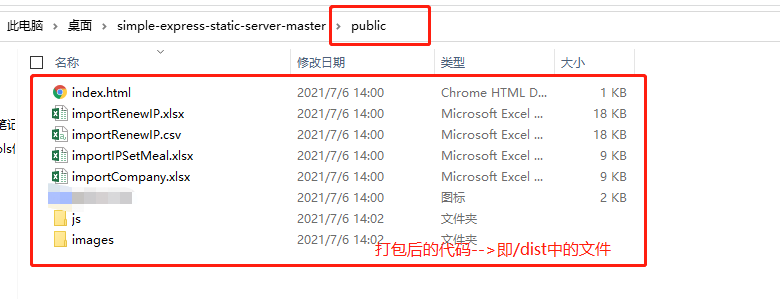
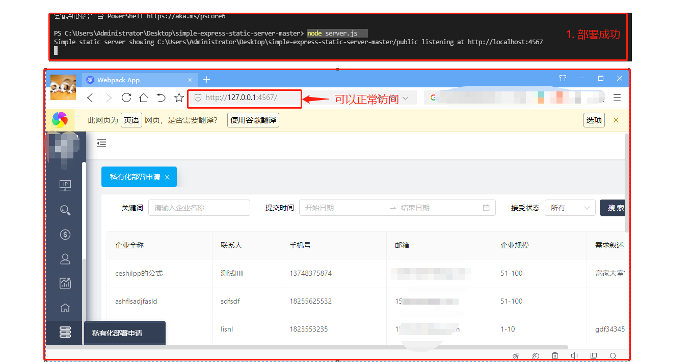

# #说明

>- 当我们发现测试环境(或是其他环境)出现BUG时,但是本地环境又无错误时
>
>- 想去模拟复现但是总不能改完代码马上发布上去-->也许测试正在测试你该环境的代码,你这样改来改去会被杀掉的
>
>- 主要就是使用node将打包好后的前端项目以静态资源的方式暴露部署出来
>
>- 主要就是模拟发布,然后很简单,不常用
>
>  `代码放在此同级目录`


# 一、项目打包

> 此处通常项目都会提前配置好,所以只要运行打包即可

## Ⅰ- 环境配置文件

>首先写好自己的环境配置文件(用作切换方便)
>
>```js
>----------  .greatrc.dev.js  -----------------------------
>const config = {
>  API_HOST: "http://xx.xx.xxx.xx:99",
>  CLOUD_NUMBER_HOST: 'http://xx.xx.xxx.xx:9999',
>  VERSION: '1.0.0',
>  API_ENV: 'dev',
>};
>module.exports = config;
>
>----------  .greatrc.test6.js  -----------------------------
>const config = {
>  API_HOST: "http://xx.xx.xxx.xx:88",
>  CLOUD_NUMBER_HOST: 'http://xx.xx.xxx.xx:8888',
>  VERSION: "1.0.0",
>  API_ENV: 'test',
>};
>module.exports = config;
>```

## Ⅱ-`package.json`配置

>```js
>  "scripts": {
>      //运行的时候yarn dev
>    "dev": "cross-env RUN_ENV=dev node ./scripts/server.js",
>        //打包部署 yarn build:test6  -->就会生成/dist文件目录
>    "build:test6": "npm run clean:dist && cross-env RUN_ENV=test6 node ./scripts/build.js",
>  },
>```

### Ⅲ-打包

>运行代码
>
>```sh
> yarn build:test6  //此处取决于你第二步设置
>```

## Ⅳ-打包成功

>可见目录中生成`/dist`文件目录

# 二、部署

## Ⅰ-将生成文件移出`/dist`

>将生成文件移出`/dist`,然后移入本人提供的代码的`public`目录中
>
> 

## Ⅱ- 模拟发布

>使用命令行当前位置定位到`本人提供的代码项目根目录`,运行下面代码
>
>```sh
>yarn #此代码安装本人代码依赖
>node server.js   
>```

## Ⅲ-发布部署成功

> 
>
>

