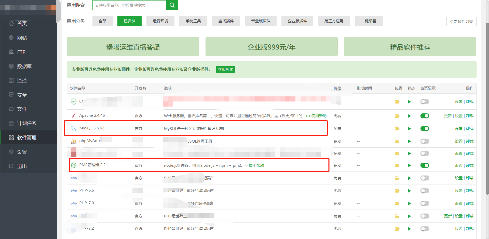
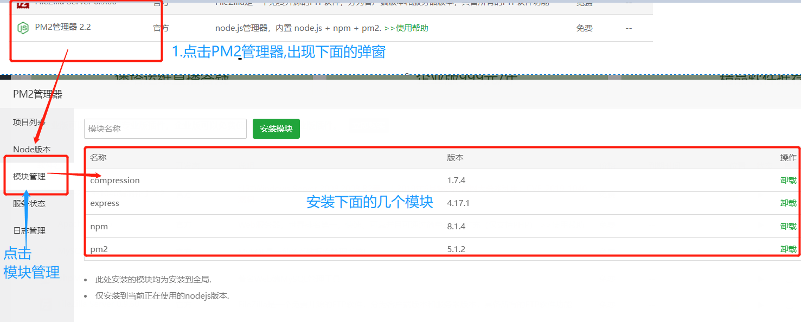
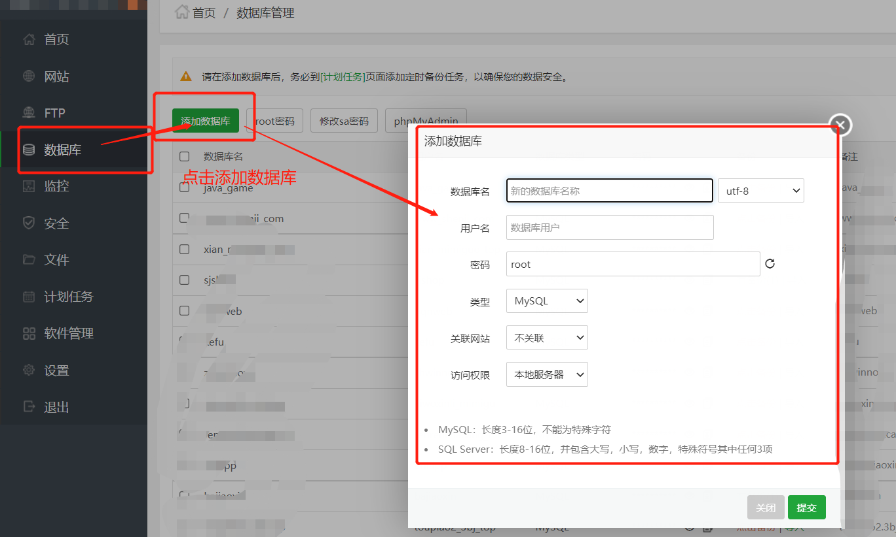
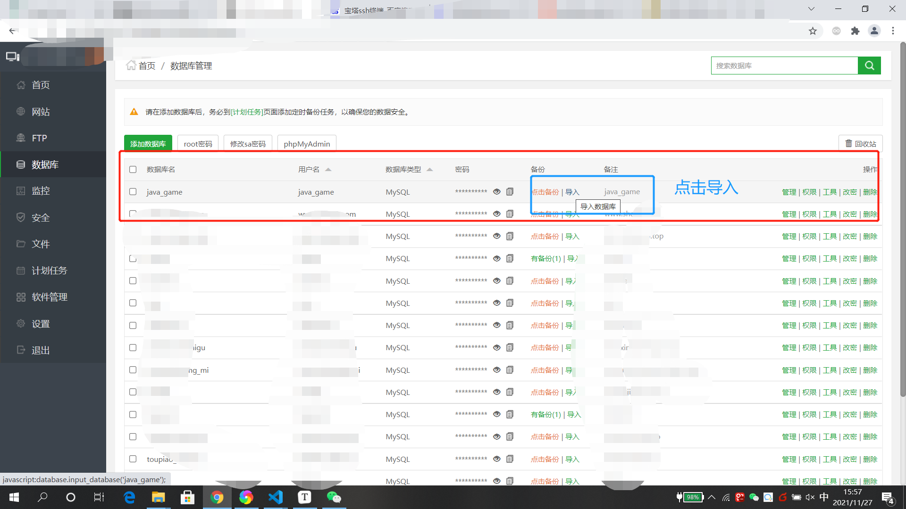
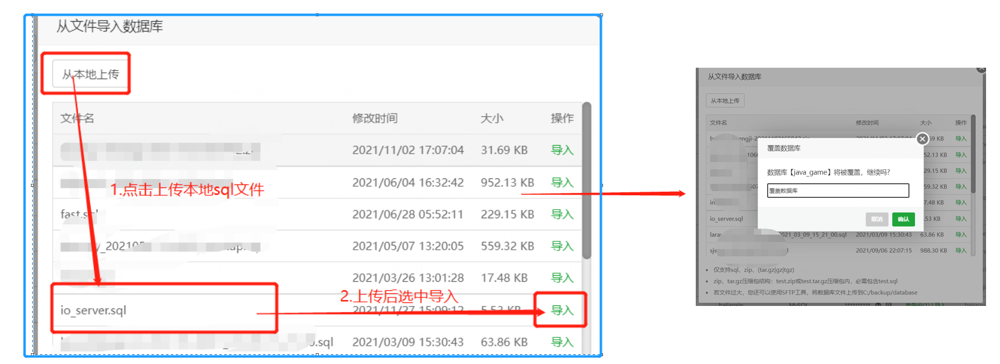
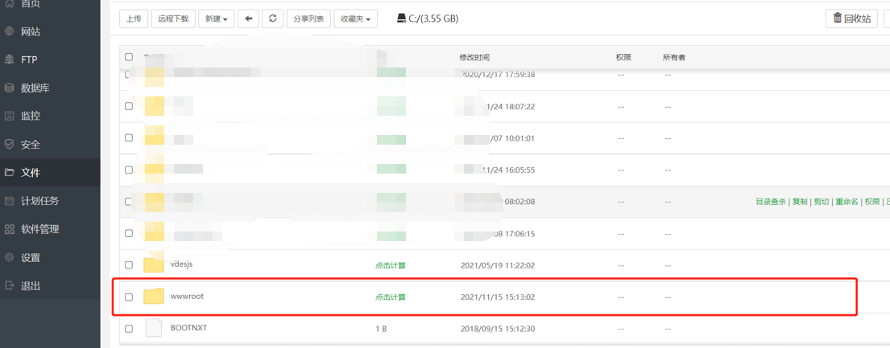
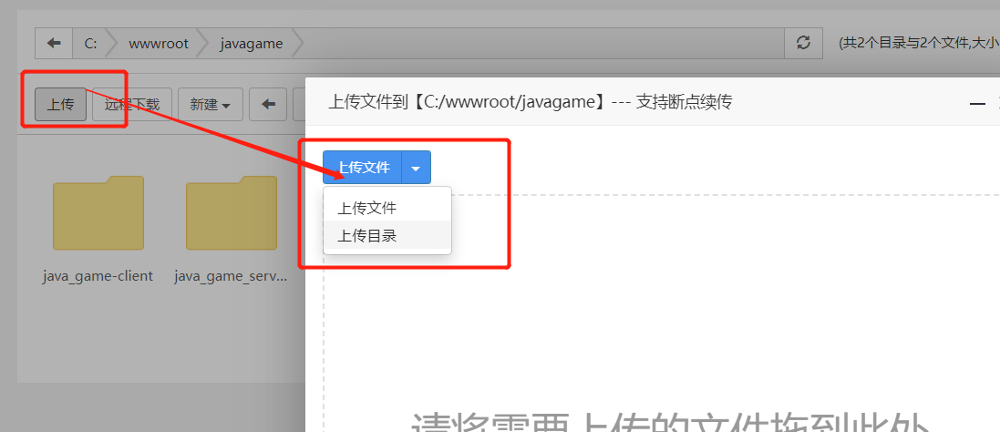
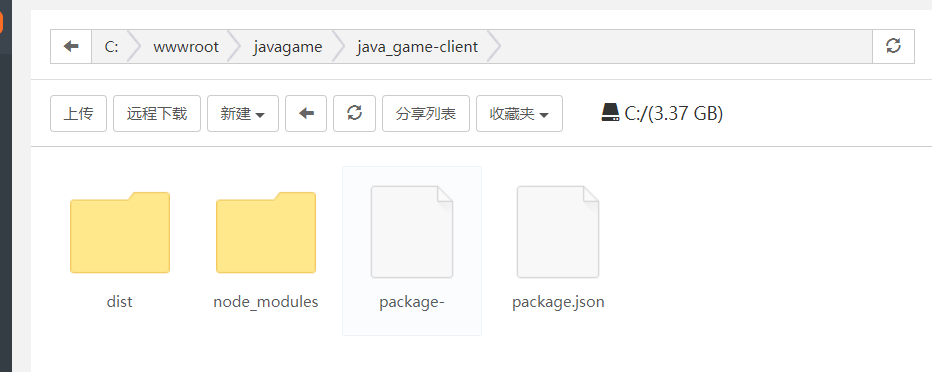

# #说明

>本笔记记录使用宝塔系统部署项目的过程
>
>是根据网上教程尝试自己部署: [参考文章](https://blog.csdn.net/qq_23347131/article/details/109952657)

# 一、前置准备

## Ⅰ - 购买服务器与安装宝塔面板

>这一步没得说,就直接照搬网上教程,可以自行百度
>
>1. 打开腾讯云官网，搜索轻量应用服务器，购买轻量应用服务器，系统镜像选择centos7，服务器配置选择根据你个人喜好选择
>2. 进入已购买的轻量服务器里面，点击远程登录，这时候你的服务器还没有密码，点击重置密码。
>3. 点击防火墙，添加规则，端口号填写8888，这个端口是开放给宝塔面板使用的。
>4. 下面进行宝塔面板的安装
>
>```
>yum install -y wget && wget -O install.sh http://download.bt.cn/install/install_6.0.sh && sh install.sh
>```
>
>安装完成后，会出现宝塔面板的入口地址和登录用户名以及密码，复制地址到浏览器打开登录即可

## Ⅱ - 完善项目运行环境

### 1、进入软件管理

>1. 点击左侧软件管理-->已安装.查看自己安装的软件
>2. 首先要有 `mysql`、`PM2管理器`
>3. 之后按照需求 也可以安装 `Nginx`
>4. 其他的随意了
>
>

### 2、点击 PM2管理器,进行模块的安装

>###### 点击PM2管理器的设置，可以进行模块的安装，在这里我安装了我项目运行所需的express和compression模块
>
>

# 二、数据库导入

## Ⅰ - 点击添加数据库

> 
>
>

## Ⅱ - 点击导入数据库

>1. 在首页面板数据库部分点击导入
>
>
>
>2. 导入数据库文件
>
>
>
>至此数据库已经导入成功了

# 三、上传项目文件

## Ⅰ - 上传介绍

>1. 点击左侧列表中的文件，进入到`/www/wwwroot`,在这个目录里面上传项目文件
>2. 我的后端（nodejs）文件夹名是 `java_game_server`
>3. 建议在自己的电脑打开cmd命令工具，运行npm install命令(总不能在服务器上安装依赖吧,在本机就已经很耗时了,更何况是云服务器呢)
>4. 看到有那个`node_modules`文件夹出现后再上传 `java_game_server` 这个文件夹
>
>

## Ⅱ - 上传服务端代码

>###### 点击左侧列表中的文件，进入到`/www/wwwroot`,在这个目录里面上传后端（nodejs）项目文件夹(前端后面再传)
>
>1. 先`npm i`安装依赖后再上传
>2. 宝塔端口默认`8888`,如果你服务端监听端口也是`8888`,就会报错,记得修改
>
>

## Ⅲ - 上传前端代码

>1. 点击左侧列表中的文件，进入到`/www/wwwroot`,在这个目录里面创建一个 **前端代码目录**
>
>2. 打开你的前端项目,将你获取服务端的接口地址换成你宝塔地址,一般是你`axios`设置的host
>
>   
>
>3. 修改完成后，重新打包你的前端项目，把打包好的dist文件夹上传到第一步中创建的目录中
>
>    

# 四、服务器运行后端项目

