# #说明

>1. 本笔记为观看慕课网[`微信小程序入门与实战-全新版`](https://coding.imooc.com/class/75.html)、[`尚硅谷2021版微信小程序开发（零基础小程序开发入门到精通）`](https://www.bilibili.com/video/BV12K411A7A2?share_source=copy_web)这两个教学视频、并参照 [`官方的微信开放文档`](https://developers.weixin.qq.com/miniprogram/dev/framework/) 记录整理而成
>2. 本人选择的两个教学视频主要就是是`面向初学者`的教学视频,用的原生js进行讲解,门槛很低,所以该笔记会将基础部分也记录的较为详细,但有基础的朋友也可以同时当作梳理基础知识,学习过程肯定也会更清晰、同时也会有自己不一样的理解。对于笔记内容有疑问的欢迎提出讨论,望求同存异共同进步
>3. 需要预备知识点-->[`HTML+CSS+JS基础`](https://gitee.com/hongjilin/hongs-study-notes/tree/master/编程_前端开发学习笔记/HTML+CSS+JS基础笔记)-->**[点我传送](https://gitee.com/hongjilin/hongs-study-notes/tree/master/编程_前端开发学习笔记/HTML+CSS+JS基础笔记)** 
>4. 本笔记应是`小程序详细学习笔记`,主要记录小程序基础知识,后续有补充知识点也将更新至此笔记
>5. 部分知识点在官方文档很详细(如`api部分`),最好还是先看官方文档,本笔记主要就是记录 学习过程中出现的、需要增加的注解、文档中没有的细节、各种知识点的实际用法示例、遇到的问题解决记录等等等........
>
>除此笔记外大家可以看我其他笔记 :**[全栈笔记](https://gitee.com/hongjilin/hongs-study-notes/tree/master)**、**[编程_前端开发学习笔记](https://gitee.com/hongjilin/hongs-study-notes/tree/master/编程_前端开发学习笔记)**、**[Vue笔记整合](https://gitee.com/hongjilin/hongs-study-notes/tree/master/编程_前端开发学习笔记/Vue笔记整合)** 、**[React笔记](https://gitee.com/hongjilin/hongs-study-notes/tree/master/编程_前端开发学习笔记/React笔记)**、 **[ReactHooks笔记](https://gitee.com/hongjilin/hongs-study-notes/tree/master/编程_前端开发学习笔记/ReactHooks笔记)** 、**[微信小程序学习笔记](https://gitee.com/hongjilin/hongs-study-notes/tree/master/编程_前端开发学习笔记/微信小程序学习笔记)**、**[Chrome开发使用及学习笔记](https://gitee.com/hongjilin/hongs-study-notes/tree/master/编程_前端开发学习笔记/Chrome开发使用及学习笔记)** 以及许多其他笔记就不一一例举了
>
>本人课程源码分享:[`源码地址`](https://gitee.com/hongjilin/wechat-applet-demo-source-code)
>
>​										笔记开启时间:2021/4/20

# #目录

>[TOC]

------


# 一、初识微信小程序

## 1、什么是微信小程序

### Ⅰ-小程序历史

>1. 2017 年度百度百科十大热词之一 
>2. 微信小程序，简称小程序，英文名 Mini Program，是一种不需要下载安装即可使用的应用 (`张小龙对其的定义是无需安装,用完即走,实际上是需要安装的,只不过小程序的体积特别小,下载速度很快,用户感觉不到下载的过程` ) 
>3. 小程序刚发布的时候要求压缩包的体积不能大于 1M,，否则无法通过，在2017年4月做了改进，由原来的1M提升到2M；
>4. 2017年1月9日0点，万众瞩目的微信第一批小程序正式低调上线。

### Ⅱ-小程序的优势

>1. 微信有海量⽤⼾，⽽且粘性很⾼，在微信⾥开发产品更容易触达⽤⼾；
>2. 推⼴app 或公众号的成本太⾼。 
>3. 开发适配成本低。
>4. 容易⼩规模试错，然后快速迭代。
>5. 跨平台。

## 2、小程序准备

### Ⅰ-环境准备

>1. [安装微信小程序开发工具](https://developers.weixin.qq.com/miniprogram/dev/devtools/download.html),建议安装稳定版进行开发
>
>2. 注册小程序账号
>
>3. 使用注册的appid进行使用，如果是测试号会限制很多功能
>
>   在官网[登录](https://mp.weixin.qq.com/)成功后可以看到下面的界面，然后复制你的APPID,悄悄的保存起来，`不要给别⼈看到`😄。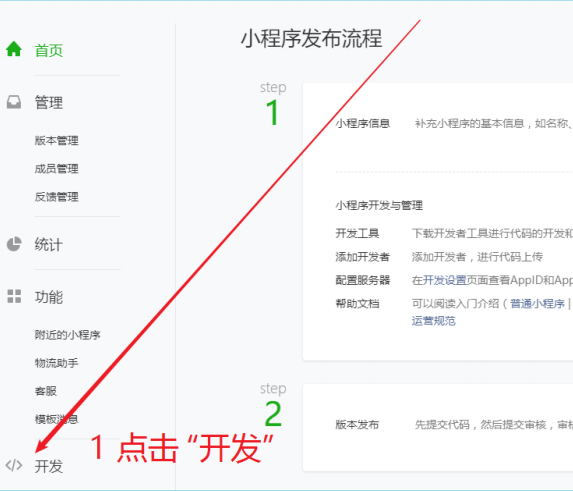

### Ⅱ-新建小程序流程

>1. 打开开发者工具，第一次打开需要扫码登陆
>
>2. 新建小程序项目
>
>   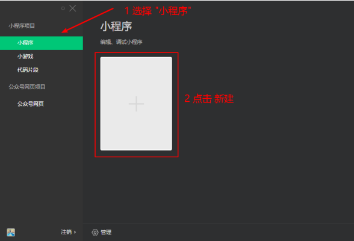
>
>3. 填写项目信息
>
>   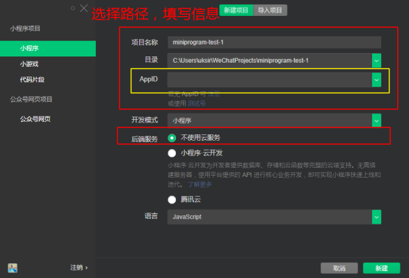
>
>4. 新建成功

### Ⅲ-微信开发者工具介绍

#### 1）开发工具界面图解

>详细的使⽤，可以查看[官⽹](https://developers.weixin.qq.com/miniprogram/dev/devtools/devtools.html):
>
>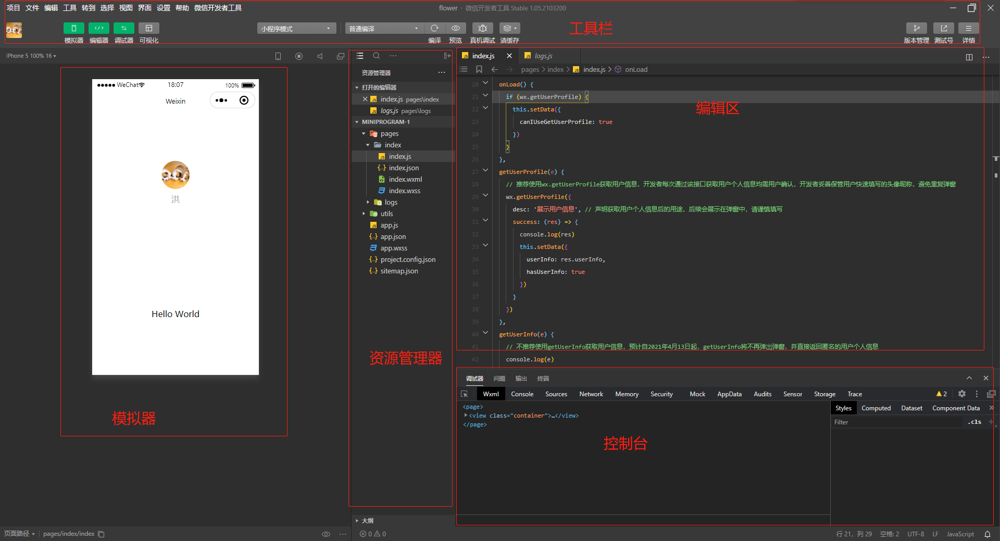

#### 2）开发工具的一些基本配置

>1. 点击`工具栏`-->`详情`-->`本地设置`，除了默认勾选，需要勾选其他的几个如：增强编译、不校验合法域名...
>
>  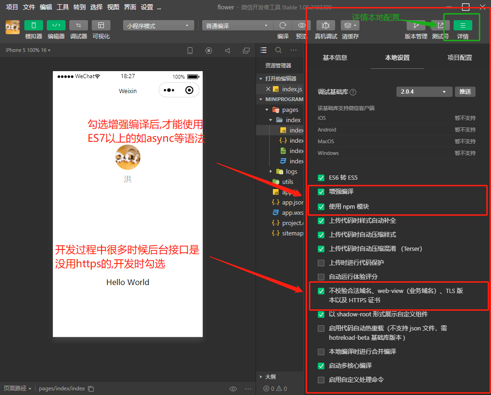
>
>2. 常用快捷键`keyMap修改`设置(本人习惯记录)：
>
>     1. `ctrl+P`：全局搜索
>
>     2. `alt+/`or `shift+j`:代码提示
>
>        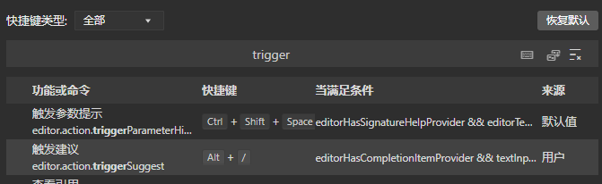

### Ⅳ-微信小程序名称或者原始id该如何找回？

>问题描述：很久没有进行开发了，小程序的名称跟原始id都忘记了，找回需要先填写,如何解决
>
>解决：首先[`查询自己的原始id`](https://developers.weixin.qq.com/community/develop/doc/000ea0f82d4f58b41589642b456809),在这个网站能查询到自己的原始id，再通过这个原始id进行找回


------

# 二、小程序的基本目录结构与文件作用剖析

>[小程序框架](https://developers.weixin.qq.com/miniprogram/dev/framework/MINA.html)的⽬标是通过尽可能简单、⾼效的⽅式让开发者可以在微信中开发具有原⽣APP体验的服务。 
>
>⼩程序框架提供了⾃⼰的视图层描述语⾔ `WXML 和 WXSS` ，以及 JavaScript ，并`在视图层与逻辑层间提供了数据传输和事件系统`，让开发者能够专注于数据与逻辑。

## 1、小程序文件结构和传统web对比

>|                | 传统web    | 微信小程序 |
>| -------------- | ---------- | ---------- |
>| 项目骨架、结构 | HTML       | WXML       |
>| 页面样式       | CSS        | WXSS       |
>| 项目逻辑       | Javascript | Javascript |
>| 配置           | 无         | JSON       |
>
>1. 通过以上对⽐得出传统web是`三层结构`。⽽微信⼩程序是`四层结构`，多了⼀层`配置.json`
>
>2. 当这几个文件在同一级目录下且命名相同(后缀不同),可以互相引用却不用导入

## 2、基本的项目目录

### Ⅰ-项目目录解释

>1. 项目目录图解:
>
>  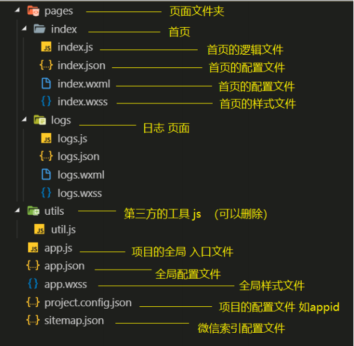
>
>2. 以`app`开头的文件是应用程序级别的文件,更改一处全局生效。而页面`pages`的配置优先级高于全局配置(`就近原则`)
>3. 小程序是允许你修改文件目录名的


## 3、小程序配置文件

> ⼀个⼩程序应⽤程序会包括最基本的两种配置⽂件。⼀种是全局的app.json 和 ⻚⾯⾃⼰的page.json

### Ⅰ-[全局配置app.json](https://developers.weixin.qq.com/miniprogram/dev/framework/config.html)

>1. `app.json` 是当前⼩程序的全局配置，包括了⼩程序的所有⻚⾯路径、界⾯表现、⽹络超时时间、底部tab等。普通快速启动项⽬⾥边的 app.json 配置
>
>2. 代码
>
>  ```json
>  {
>    "pages":[
>      "pages/index/index",
>      "pages/logs/logs"
>   ],
>    "window":{
>      "backgroundTextStyle":"light",
>      "navigationBarBackgroundColor": "#fff",
>      "navigationBarTitleText": "WeChat",
>      "navigationBarTextStyle":"black"
>   }
>  }
>  ```
>
>3. 字段的含义
>
>     1）pages 字段⸺⽤于描述当前⼩程序所有⻚⾯路径，这是为了让微信客⼾端知道当前你的⼩程序⻚⾯定义在哪个⽬录。 
>
>​	`默认显示此字段中的第一项`
>
> ​	2）window 字段⸺定义⼩程序所有⻚⾯的顶部背景颜⾊，⽂字颜⾊定义等。
>
> ​	3）完整的配置信息请参考 app.json配置
>
> ​	4) [tabBar](https://developers.weixin.qq.com/miniprogram/dev/reference/configuration/app.html#tabBar)-底部 `tab` 栏的表现:
>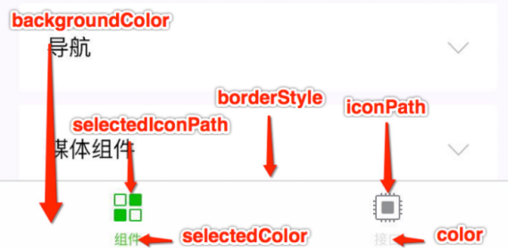
>
>更多配置详细请看[`app配置文档`](https://developers.weixin.qq.com/miniprogram/dev/reference/configuration/app.html)

### Ⅱ-[页面配置page.json](https://developers.weixin.qq.com/miniprogram/dev/reference/configuration/page.html)

>1. 这⾥的 `page.json` 其实⽤来表⽰⻚⾯⽬录下的 page.json 这类和⼩程序⻚⾯相关的配置。 开发者可以独⽴定义每个⻚⾯的⼀些属性，如顶部颜⾊、是否允许下拉刷新等等。 ⻚⾯的配置只能设置 app.json 中部分 window 配置项的内容，⻚⾯中配置项会覆盖 app.json 的 window 中相同的配置项。
>
>2. 常用配置属性列举:
>
> | 属性                         | 类型     | 默认值  | 描述                                                         |
> | ---------------------------- | -------- | ------- | ------------------------------------------------------------ |
> | navigationBarBackgroundColor | HexColor | #000000 | 导航栏背景颜⾊，如 #000000                                   |
> | navigationBarTextStyle       | String   | white   | 导航栏标题颜⾊，仅⽀持 black / white                         |
> | navigationBarTitleText       | String   |         | 导航栏标题⽂字内容                                           |
> | backgroundColor              | HexColor | #ffffff | 窗⼝的背景⾊                                                 |
> | backgroundTextStyle          | String   | dark    | 下拉`loading`的样式，仅⽀持 dark / light                     |
> | enablePullDownRefresh        | Boolean  | false   | 是否全局开启下拉刷新。 详⻅ [Page.onPullDownRefresh](https://developers.weixin.qq.com/miniprogram/dev/framework/app-service/page.html#onpulldownrefresh) |
> | onReachBottomDistance        | Number   | 50      | ⻚⾯上拉触底事件触发时距⻚⾯底部距离，单位为px。 详⻅ [Page.onReachBottom](https://developers.weixin.qq.com/miniprogram/dev/framework/app-service/page.html#onreachbottom) |
> | disableScroll                | Boolean  | false   | 设置为 true 则⻚⾯整体不能上下滚动；只在⻚⾯配置中有效，⽆法在 app.json 中设置该项 |

### Ⅲ-[sitemap 配置](https://developers.weixin.qq.com/miniprogram/dev/reference/configuration/sitemap.html)-了解即可

> ⼩程序根⽬录下的 `sitemap.json` ⽂件⽤于配置⼩程序及其⻚⾯是否允许被微信索引。`主要服务于搜索`

## 4、小程序框架接口

### Ⅰ-App(Object object)

>1. 注册小程序。接受一个 `Object` 参数，其指定小程序的生命周期回调等。
>
>2. **App() 必须在 `app.js` 中调用，必须调用且只能调用一次。不然会出现无法预期的后果**
>
>3. 相应的app()参数在下方的`小程序生命周期中有指出`

#### **AppObject `getApp(Object object)`**

>1. 获取到小程序全局唯一的 `App` 实例。
>
>2. 代码示例
>
>  ```jsx
>  // other.js
>  var appInstance = getApp()
>  console.log(appInstance.globalData) // I am global dat
>  //或者
>  const {GbaseUrl} =getApp()  //GbaseUrl是自己在app.js定义的全局变量
>  ```
>
>3. Object object
>
>| 属性         | 类型    | 默认值 | 必填 | 说明                                                         | 最低版本                                                     |
>| :----------- | :------ | :----- | :--- | :----------------------------------------------------------- | :----------------------------------------------------------- |
>| allowDefault | boolean | false  | 否   | 在 `App` 未定义时返回默认实现。当App被调用时，默认实现中定义的属性会被覆盖合并到App中。一般用于[独立分包](https://developers.weixin.qq.com/miniprogram/dev/framework/subpackages/independent.html) | [2.2.4](https://developers.weixin.qq.com/miniprogram/dev/framework/compatibility.html) |
>
>4. 注意
>  - 不要在定义于 `App()` 内的函数中，或调用 `App` 前调用 `getApp()` 。使用 `this` 就可以拿到 app 实例。
>  - 通过 `getApp()` 获取实例之后，不要私自调用生命周期函数


------

# 三、小程序的基础知识储备

> 整个小程序学习过程中遇到的 所需基础知识 或 补充知识 将整合至此
>
> 相关知识点本人在`一二阶段补缺笔记`中有记录,在此便只举例大概,不详细记录

## 1、Flex 布局

### Ⅰ-基本知识点概念

>1. Flex基本概念
>
>    1) Flex 是 Flexible Box 的缩写，意为”弹性布局”，用来为盒状模型提供最大的灵活性。 
>
>    2) 任何一个容器都可以指定为 Flex 布局。 
>
>    3) display: ‘flex’
>
> ​	
>
>​	4) 这部分是一阶段基础知识,可看[文档](http://www.runoob.com/w3cnote/flex-grammar.html
> )学习
>
>2. 在小程序中,通常使用`<view/>`代替`<div/>`作为容器来做布局-->代码示例在`第一章的第三小节第三点`

### Ⅱ-解决flex布局中 space-between方法的排版问题

> 详见下方`杂记-初学阶段遇到的问题与解决-问题Ⅷ`

## 2、移动端相关知识点

>自行补充学习,相关知识点本人在`一二阶段补缺笔记`中有记录,便不再赘述

### Ⅰ-物理像素

>1) 屏幕的分辨率 
>
>2) 设备能控制显示的最小单元，可以把物理像素看成是对应的像素点

### Ⅱ-设备独立像素 、 css 像素 

>设备独立像素(也叫密度无关像素)，可以认为是计算机坐标系统中的一个点，这个点代表一个可以由程序使用并控制的`虚拟像素`(比如：CSS 像素,只是在 android 机中 CSS 像素就不叫”CSS 像素”了而是叫”设备独立像素”)，然后由相关系统转换为物理像素。 

### Ⅲ-dpr比 、DPI 、PPI 

>1. 概念
>
>      1) dpr: 设备像素比，物理像素/设备独立像素 = dpr， 一般以 Iphon6 的 dpr 为准 dpr = 2
>
>      2) PPI: 一英寸显示屏上的像素点个数 
>
>      3) DPI：最早指的是打印机在单位面积上打印的墨点数，墨点越多越清晰
>
>2. 不同机型对比表
>
>   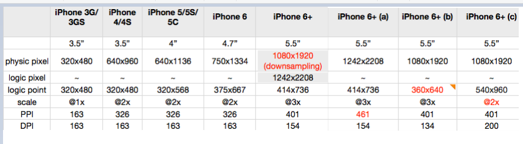
>
>3. 部分机型图示
>
>   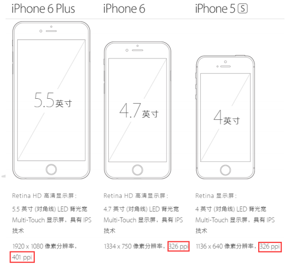

## 3、移动端适配方案

>相关知识点本人在`一二阶段补缺笔记`中有记录,想详细查阅可以去看,这是个`面试考点`

### Ⅰ-viewport 适配

>1. 为什么做 `viewport` 适配 ?
>
>      a) 手机厂商在生产手机的时候大部分手机默认页面宽度为 980px 
>
>      b) 手机实际视口宽度都要小于 980px，如: iphone6 为 750px
>
>      c) 开发需求需要将 980 的页面完全显示在手机屏幕上且没有滚动条 
>
>2. 代码实现
>
>   ```html
>   <meta name="viewport" content="width=device-width,initial-scale=1.0"> 
>   ```

### Ⅱ- rem 适配 

>1. 为什么做 `rem` 适配?
>
>   a) 机型太多,不同的机型屏幕大小不一样 
>
>   b) 需求：一套设计稿的内容在不同的机型上呈现的效果一致,根据屏幕大小不同的变化,页面中的内容也相应变化
>
>2. 原生代码实现:
>
>   ```js
>   function remRefresh() {
>   let clientWidth = document.documentElement.clientWidth; 
>   // 将屏幕等分 10 份
>   let rem = clientWidth / 10;
>   document.documentElement.style.fontSize = rem + 'px';
>   document.body.style.fontSize = '12px';
>   }
>   window.addEventListener('pageshow', () => {
>   remRefresh()
>   })
>   // 函数防抖
>   let timeoutId;
>   window.addEventListener('resize', () => {
>   timeoutId && clearTimeout(timeoutId);
>   timeoutId = setTimeout(() =>{
>   remRefresh()
>   }, 300)
>   })
>   ```
>
>3. 第三方库实现
>
>   > lib-flexible + px2rem-loader


------

# 四、视图层详解

>框架的视图层由 WXML 与 WXSS 编写，由组件来进行展示。
>
>将逻辑层的数据反映成视图，同时将视图层的事件发送给逻辑层。
>
>WXML(WeiXin Markup language) 用于描述页面的结构。
>
>WXS(WeiXin Script) 是小程序的一套脚本语言，结合 `WXML`，可以构建出页面的结构。
>
>WXSS(WeiXin Style Sheet) 用于描述页面的样式。
>
>组件(Component)是视图的基本组成单元。
>
>该部分将`截取官方文档`并加以注解

## 1、[WXSS](https://developers.weixin.qq.com/miniprogram/dev/framework/view/wxss.html)样式文件详解

>1. WXSS (WeiXin Style Sheets)是一套样式语言，用于描述 WXML 的组件样式。
>
>2. WXSS 用来决定 WXML 的组件应该怎么显示。
>
>   为了适应广大的前端开发者，WXSS 具有 CSS 大部分特性。同时为了更适合开发微信小程序，WXSS 对 CSS 进行了扩充以及修改。
>
>3. 与 CSS 相比，WXSS 扩展的特性有：
>      1. 响应式⻓度单位:即尺寸单位 -->`rpx`
>      2. 样式导入
>
>4. 注意:
>
>   当页面文件在同一级目录下且命名相同(后缀不同),`可以互相引用却不用导入`

### Ⅰ-尺寸单位

>1. `rpx（responsive pixel）`: 可以根据屏幕宽度进行自适应。规定屏幕宽为750rpx。如在 `iPhone6` 上，屏幕宽度为375px，共有750个物理像素，则750rpx = 375px = 750物理像素，1rpx = 0.5px = 1物理像素。
>
> | 设备         | rpx换算px (屏幕宽度/750) | px换算rpx (750/屏幕宽度) |
> | :----------- | :----------------------- | :----------------------- |
> | iPhone5      | 1rpx = 0.42px            | 1px = 2.34rpx            |
> | iPhone6      | 1rpx = 0.5px             | 1px = 2rpx               |
> | iPhone6 Plus | 1rpx = 0.552px           | 1px = 1.81rpx            |
>
>2. 建议与注意点:
>
>      1. 开发微信小程序时`推荐设计师可以用iPhone6作为视觉稿的标准`-->即只有在`iPhone6`标准中才可以`一比二换算`,更方便
>      2. 在较小的屏幕上不可避免的会有一些毛刺，请在开发时尽量避免这种情况

### Ⅱ-样式导⼊

>1. 使用`@import`语句可以导入外联样式表,也可以和less中的导⼊混⽤，`@import`后跟需要导入的外联样式表的`相对路径`(只⽀持相对路径)，用`;`表示语句结束。
>
>   ```css
>   /** common.wxss **/
>   .small-p {
>     padding:5px;
>   }
>   /** app.wxss **/
>   @import "common.wxss";
>   .middle-p {
>     padding:15px;
>   }
>   ```

### Ⅲ-内联样式

>框架组件上支持使用 style、class 属性来控制组件的样式。
>
>1. `style`：静态的样式统一写到 class 中。style 接收动态的样式，在运行时会进行解析，请尽量避免将静态的样式写进 style 中，以免影响渲染速度
>
>   ```html
>   <view style="color:{{color}};" />
>   ```
>
>2. `class`：用于指定样式规则，其属性值是样式规则中类选择器名(样式类名)的集合，样式类名不需要带上`.`，样式类名之间用空格分隔
>
>   ```html
>   <view class="normal_view" />
>   ```


## 2、[WXML](https://developers.weixin.qq.com/miniprogram/dev/reference/wxml/)语法详解

>WXML（WeiXin Markup Language）是框架设计的⼀套标签语⾔，结合[基础组件](https://developers.weixin.qq.com/miniprogram/dev/component/)、[事件系统](https://developers.weixin.qq.com/miniprogram/dev/framework/view/wxml/event.html)，可以构建出⻚⾯的结构。
>
>该部分将`截取官方文档`加以自己见解说明,同学们也可以直接去看文档

### Ⅰ-[数据绑定与写法规则](https://developers.weixin.qq.com/miniprogram/dev/reference/wxml/data.html#%E5%86%85%E5%AE%B9)

>1. WXML 中的动态数据均来自对应 Page 的 data。
>
>2. Mustache 语法{{}}视作运算标记,里面的内容表示表达式 

#### 1) 单向简单数据绑定

>1. 此处是单向绑定(数据驱动视图),双向绑定出现的场景如(input等)将在下方`四-3、双向绑定`处记录
>
>2. `简单绑定`:数据绑定使用 Mustache 语法（双大括号）将变量包起来，可以作用于：
>
>   ```jsx
>   //pages.wxml
>   <view> {{ message }} </view>
>   
>   // pages.js
>   Page({
>     data: {
>       message: 'Hello MINA!'
>     }
>   })
>   ```
>
>3. 绑定`boolean`类型(需要在双引号之内)
>
>   `true`：boolean 类型的 true，代表真值。`false`： boolean 类型的 false，代表假值。
>
>   ```jsx
>   <checkbox checked="{{false}}"> </checkbox>
>   ```
>
>   ***特别注意：不要直接写 `checked="false"`，其计算结果是一个字符串，转成 boolean 类型后代表真值***

#### 2) 运算

>可以在 `{{}}` 内进行简单的运算，支持的有如下几种方式：
>
>1. 三元运算
>
>   ```jsx
>   <view hidden="{{flag ? true : false}}"> Hidden </view>
>   ```
>
>2. 算数运算
>
>   ```jsx
>   <view> {{a + b}} + {{c}} + d </view>
>   //view中的内容为 `3 + 3 + d`。
>   //pages.js
>   Page({
>     data: { a: 1, b: 2, c: 3
>     }
>   })
>   ```
>
>3. 逻辑判断
>
>   ```jsx
>   <view wx:if="{{length > 5}}"> </view>
>   ```
>
>4. 字符串运算
>
>   ```jsx
>   <view>{{"hello" + name}}</view>
>   Page({
>     data:{name: 'MINA}
>   })
>   ```
>
>5. 数据路径运算
>
>   ```jsx
>   <view>{{object.key}} {{array[0]}}</view>
>   //view中的内容为 hello  MINA
>   Page({
>     data: {
>       object: {
>         key: 'Hello '
>       },
>       array: ['MINA']
>     }
>   })
>   ```

#### 3) 组合

>也可以在 Mustache 内直接进行组合，构成新的对象或者数组。
>
>1. 数组 --> 最终组合成数组`[0, 1, 2, 3, 4]`。
>
>   ```jsx
>   <view wx:for="{{[zero, 1, 2, 3, 4]}}"> {{item}} </view>
>   Page({
>     data: { zero: 0 }
>   })
>   ```
>
>2. 对象   -->
>
>    1. 最终组合成的对象是 `{for: 1, bar: 2}` 
>
>       ```JSx
>       <template is="objectCombine" data="{{for: a, bar: b}}"></template>
>       Page({
>         data: {a: 1, b: 2}
>       })
>       ```
>
>    2. 也可以用扩展运算符 `...` 来将一个对象展开-->最终组合成的对象是 `{a: 1, b: 2, c: 3, d: 4, e: 5}`。
>
>       ```JSx
>       <template is="objectCombine" data="{{...obj1, ...obj2, e: 5}}"></template>
>       Page({
>         data: {
>           obj1: { a: 1, b: 2 },
>           obj2: { c: 3, d: 4}
>         }
>       })
>       ```
>
>    3. 如果对象的 key 和 value 相同，也可以间接地表达。-->最终组合成的对象是 `{foo: 'my-foo', bar:'my-bar'}`
>
>       ```JSx
>       <template is="objectCombine" data="{{foo, bar}}"></template>
>       Page({
>         data: {
>           foo: 'my-foo',
>           bar: 'my-bar'
>         }
>       })
>       ```
>
>    4. `注意`：上述方式可以随意组合，但是如有存在变量名相同的情况，后边的会覆盖前面 --> 最终组合成的对象是 `{a: 5, b: 3, c: 6}`。
>
>       ```JSx
>       <template is="objectCombine" data="{{...obj1, ...obj2, a, c: 6}}"></template>
>       Page({
>         data: {
>           obj1: { a: 1,  b: 2},
>           obj2: { b: 3, c: 4},
>           a: 5
>         }
>       })
>       ```
>
>    5. `注意`： 花括号和引号之间如果有空格，将最终被解析成为字符串
>
>       ```JSx
>         <view wx:for="{{[1,2,3]}} ">
>           {{item}}
>         </view>
>         等同于
>                         
>         <view wx:for="{{[1,2,3] + ' '}}">
>           {{item}}
>         </view>
>       ```
>
>       

#### 4) 自定义属性`data-*`的命名与使用

>1. 同一容器中可以存在多个`data-*`
>2. 凡是以`data-`开头的数据,都会在`event的currentTarget`中体现,且回缺省`data-`(data-id  -->  id)
>3. `data-*`后面接的单词将自动转换 第一个单词首字母小写,第二个及之后的单词首字母大写 (data-post-my-id --> postMyId)

### Ⅱ-列表渲染

#### 1) wx:for

>1. 在组件上使用 `wx:for` 控制属性绑定一个数组，即可使用数组中各项的数据重复渲染该组件。
>
>2. 默认数组的当前项的下标变量名默认为 `index`，数组当前项的变量名默认为 `item`
>
>3. 使用 `wx:for-item` 可以指定数组当前元素的变量名，使用 `wx:for-index` 可以指定数组当前下标的变量名：
>
>   ```jsx
>   <view wx:for="{{array}}" wx:for-index="idx" wx:for-item="itemName">
>     {{idx}}: {{itemName.message}}
>   </view>
>   ```
>
>4. `wx:for` 也可以嵌套，下边是一个九九乘法表
>
>   ```jsx
>   <view wx:for="{{[1, 2, 3, 4, 5, 6, 7, 8, 9]}}" wx:for-item="i">
>     <view wx:for="{{[1, 2, 3, 4, 5, 6, 7, 8, 9]}}" wx:for-item="j">
>       <view wx:if="{{i <= j}}">
>         {{i}} * {{j}} = {{i * j}}
>       </view>
>     </view>
>   </view>
>   ```

#### 2) block wx:for

>类似 `block wx:if`，也可以将 `wx:for` 用在`<block/>`标签上，以渲染一个包含多节点的结构块。例如：
>
>```jsx
><block wx:for="{{[1, 2, 3]}}">
>  <view> {{index}}: </view>
>  <view> {{item}} </view>
></block>
>```
>
>**注意：** `<block/>` 并不是一个组件，它仅仅是一个包装元素，不会在页面中做任何渲染，只接受控制属性

#### 3) wx:key

>如果列表中项目的位置会动态改变或者有新的项目添加到列表中，并且希望列表中的项目保持自己的特征和状态（如 [input](https://developers.weixin.qq.com/miniprogram/dev/component/input.html) 中的输入内容，[switch](https://developers.weixin.qq.com/miniprogram/dev/component/switch.html) 的选中状态），需要使用 `wx:key` 来指定列表中项目的唯一的标识符。

##### ① `wx:key` 的值以两种形式提供

>1. 字符串，代表在for循环的array中`item的某个property`，该property的值需要是列表中唯一的字符串或数字，且不能动态改变。
>
>2. 保留关键字 `*this` 代表在 for 循环中的 item 本身，这种表示需要 item 本身是一个`唯一的字符串或者数字`。
>
>   ```JSX
>   <block wx:for="{{posts}}"   wx:key="id"></blocK>
>   //id是posts数组中的对象里的一个属性
>   ```

##### ②使用 `wx:key` 的意义

>当数据改变触发渲染层重新渲染的时候，会校正带有 key 的组件`，框架会确保他们被重新排序，而不是重新创建`，以确保使组件保持自身的状态，并且提高列表渲染时的效率。
>
>如不提供 `wx:key`，会报一个 `warning`， 如果明确知道该列表是静态，或者不必关注其顺序，可以选择忽略。

#### 4) 列表渲染注意点

##### ① 当 `wx:for` 的值为字符串时，会将字符串解析成字符串数组

>```jsx
><view wx:for="array">
>  {{item}}
></view>
>等同于
>
><view wx:for="{{['a','r','r','a','y']}}">
>  {{item}}
></view>
>```

##### ② 花括号和引号之间如果有空格，将最终被解析成为字符串

>```jsx
><view wx:for="{{[1,2,3]}} ">
>  {{item}}
></view>
>等同于
>
><view wx:for="{{[1,2,3] + ' '}}" >
>  {{item}}
></view>
>```

### Ⅲ-条件渲染

#### 1) wx:if

>1. 在框架中，使用 `wx:if=""` 来判断是否需要渲染该代码块：
>
>   ```jsx
>   <view wx:if="{{condition}}"> True </view>
>   ```
>
>2. 也可以用 `wx:elif` 和 `wx:else` 来添加一个 else 块:
>
>   ```jsx
>   <view wx:if="{{length > 5}}"> 1 </view>
>   <view wx:elif="{{length > 2}}"> 2 </view>
>   <view wx:else> 3 </view>
>   ```

#### 2) block wx:if

>因为 `wx:if` 是一个控制属性，需要将它添加到一个标签上。如果要一次性判断多个组件标签，可以使用一个 `<block/>` 标签将多个组件包装起来，并在上边使用 `wx:if` 控制属性
>
>```jsx
><block wx:if="{{true}}">
>  <view> view1 </view>
>  <view> view2 </view>
></block>
>```
>
>**注意：** `<block/>` 并不是一个组件，它仅仅是一个包装元素，不会在页面中做任何渲染，只接受控制属性

#### 3) `wx:if` vs `hidden`

>1. 因为 `wx:if` 之中的模板也可能包含数据绑定，所以当 `wx:if` 的条件值切换时，框架有一个局部渲染的过程，因为它会确保条件块在切换时销毁或重新渲染。
>
>2. 同时 `wx:if` 也是**惰性的**，如果在初始渲染条件为 `false`，框架什么也不做，在条件第一次变成真的时候才开始局部渲染。
>
>   相比之下，`hidden` 就简单的多，组件始终会被渲染，只是简单的控制显示与隐藏。
>
>3. 一般来说，`wx:if` 有更高的切换消耗而 `hidden` 有更高的初始渲染消耗。因此，如果需要频繁切换的情景下，用 `hidden` 更好，如果在运行时条件不大可能改变则 `wx:if` 较好。

### Ⅳ-模板

>1. WXML提供模板（template），可以在模板中定义代码片段，然后在不同的地方调用
>
>2. 模板拥有自己的`作用域`，只能使用 `data` 传入的数据以及模板定义文件中定义的 `<wxs />` 模块。

#### 1) 定义模板

>使用 name 属性，作为模板的名字。然后在`<template/>`内定义代码片段，如
>
>```jsx
><!--
>  index: int
>  msg: string
>  time: string
>-->
><template name="msgItem">
>  <view>
>    <text> {{index}}: {{msg}} </text>
>    <text> Time: {{time}} </text>
>  </view>
></template>
>```

#### 2) 使用模板

>1. 使用 is 属性，声明需要的使用的模板，然后将模板所需要的 data 传入，如：
>
>   ```jsx
>   <template is="msgItem" data="{{...item}}"/>
>   Page({
>     data: {
>       item: { index: 0, msg: 'this is a template', time: '2016-09-15'}
>     }
>   })
>   ```
>
>2. is 属性可以使用 Mustache 语法，来动态决定具体需要渲染哪个模板：
>
>   ```jsx
>   <template name="odd">
>     <view> odd </view>
>   </template>
>   <template name="even">
>     <view> even </view>
>   </template>
>   
>   <block wx:for="{{[1, 2, 3, 4, 5]}}">
>     <template is="{{item % 2 == 0 ? 'even' : 'odd'}}"/>
>   </block>
>   ```

### Ⅴ-引用

>WXML 提供两种文件引用方式`import`和`include`

#### 1) import

##### ① 使用示例

>1. 在 item.wxml 中定义了一个叫`item`的`template`：
>
>   ```jsx
>   <!-- item.wxml -->
>   <template name="item">
>     <text>{{text}}</text>
>   </template>
>   ```
>
>2. 在 index.wxml 中引用了 item.wxml，就可以使用`item`模板：
>
>   ```jsx
>   <import src="item.wxml"/>
>   <template is="item" data="{{text: 'forbar'}}"/>
>   ```

##### ② import 的作用域

>import有作用域的概念，即只会 import 目标文件中定义的 template，而不会import目标文件import的template。
>
>**如：C import B，B import A，在C中可以使用B定义的`template`，在B中可以使用A定义的`template`，但是C不能使用A定义的`template`**。
>
>```jsx
><!-- A.wxml -->
><template name="A">
>  <text> A template </text>
></template>
><!-- B.wxml -->
><import src="a.wxml"/>
><template name="B">
>  <text> B template </text>
></template>
><!-- C.wxml -->
><import src="b.wxml"/>
><template is="A"/>  <!-- Error! Can not use tempalte when not import A. -->
><template is="B"/>
>```

#### 2) include

> `include` 可以将目标文件**除了** `<template/>` `<wxs/>` 外的整个代码引入，相当于是拷贝到 `include` 位置，如：
>
> ```jsx
> <!-- index.wxml -->
> <include src="header.wxml"/>
> <view> body </view>
> <include src="footer.wxml"/>
> <!-- header.wxml -->
> <view> header </view>
> <!-- footer.wxml -->
> <view> footer </view>
> ```


## 3、双向绑定

### Ⅰ-双向绑定语法

>

### Ⅱ- [`setData`](https://developers.weixin.qq.com/miniprogram/dev/framework/performance/tips.html)-->数据更新

>1. `setData` 是小程序开发中使用最频繁的接口，也是最容易引发性能问题的接口。
>
>2. 小程序的视图层目前使用 WebView 作为渲染载体，而逻辑层是由独立的 JavascriptCore 作为运行环境。在架构上，WebView 和 JavascriptCore 都是独立的模块，并不具备数据直接共享的通道。当前，视图层和逻辑层的数据传输，实际上通过两边提供的 `evaluateJavascript` 所实现。即用户传输的数据，①`需要将其转换为字符串形式传递`，② `同时把转换后的数据内容拼接成一份 JS 脚本`，③`再通过执行 JS 脚本的形式传递到两边独立环境`。
>3. 而 `evaluateJavascript` 的执行会受很多方面的影响，数据到达视图层并不是实时的

#### 1) 简单使用

>`setData`可以直接将数据加入data中;如果在data中已经有该值,则修改它有着创建+更新功能  但正常是用来更新
>
>```jsx
>Page({
>    data: {posts: [],test: "测试数据",flag: true},
>    //更新
>	this.setData({posts: content})
>})
>```

#### 2) 常见的 setData 操作错误

##### ① **频繁的去 setData**

>在我们分析过的一些案例里，部分小程序会非常频繁（毫秒级）的去`setData`，其导致了两个后果：
>
>- Android 下用户在滑动时会感觉到卡顿，操作反馈延迟严重，因为 JS 线程一直在编译执行渲染，未能及时将用户操作事件传递到逻辑层，逻辑层亦无法及时将操作处理结果及时传递到视图层；
>- 渲染有出现延时，由于 WebView 的 JS 线程一直处于忙碌状态，逻辑层到页面层的通信耗时上升，视图层收到的数据消息时距离发出时间已经过去了几百毫秒，渲染的结果并不实时；

##### ② **每次 setData 都传递大量新数据**

>由`setData`的底层实现可知，我们的数据传输实际是一次 `evaluateJavascript` 脚本过程，当数据量过大时会增加脚本的编译执行时间，占用 WebView JS 线程，

##### ③ **后台态页面进行 setData**

>当页面进入后台态（用户不可见），不应该继续去进行`setData`，后台态页面的渲染用户是无法感受的，另外后台态页面去`setData`也会抢占前台页面的执行

## 4、[事件系统](https://developers.weixin.qq.com/miniprogram/dev/framework/view/wxml/event.html)

### Ⅰ-什么是事件?

>- `事件是视图层到逻辑层的通讯方式`。
>- 事件可以将用户的行为反馈到逻辑层进行处理。
>- 事件可以绑定在组件上，当达到触发事件，就会执行逻辑层中对应的事件处理函数。
>- 事件对象可以携带额外信息，如 id, dataset, touches。

### Ⅱ-事件分类

>事件分为冒泡事件和非冒泡事件：
>
>1. `冒泡事件`：当一个组件上的事件被触发后，该事件会向父节点传递。
>
>2. `非冒泡事件`：当一个组件上的事件被触发后，该事件不会向父节点传递。
>
>3. WXML的冒泡事件列表：
>
> | 类型               | 触发条件                                                     | 最低版本                                                     |
> | :----------------- | :----------------------------------------------------------- | :----------------------------------------------------------- |
> | touchstart         | 手指触摸动作开始                                             |                                                              |
> | touchmove          | 手指触摸后移动                                               |                                                              |
> | touchcancel        | 手指触摸动作被打断，如来电提醒，弹窗                         |                                                              |
> | touchend           | 手指触摸动作结束                                             |                                                              |
> | tap                | 手指触摸后马上离开                                           |                                                              |
> | longpress          | 手指触摸后，超过350ms再离开，如果指定了事件回调函数并触发了这个事件，tap事件将不被触发 | [1.5.0](https://developers.weixin.qq.com/miniprogram/dev/framework/compatibility.html) |
> | longtap            | 手指触摸后，超过350ms再离开（推荐使用longpress事件代替）     |                                                              |
> | transitionend      | 会在 WXSS transition 或 wx.createAnimation 动画结束后触发    |                                                              |
> | animationstart     | 会在一个 WXSS animation 动画开始时触发                       |                                                              |
> | animationiteration | 会在一个 WXSS animation 一次迭代结束时触发                   |                                                              |
> | animationend       | 会在一个 WXSS animation 动画完成时触发                       |                                                              |
> | touchforcechange   | 在支持 3D Touch 的 iPhone 设备，重按时会触发                 | [1.9.90](https://developers.weixin.qq.com/miniprogram/dev/framework/compatibility.html) |
>
>4. `注`：除上表之外的其他组件自定义事件如无特殊声明`都是非冒泡事件`，如 [form](https://developers.weixin.qq.com/miniprogram/dev/component/form.html) 的`submit`事件，[input](https://developers.weixin.qq.com/miniprogram/dev/component/input.html) 的`input`事件，[scroll-view](https://developers.weixin.qq.com/miniprogram/dev/component/scroll-view.html) 的`scroll`事件，(详见各个[组件](https://developers.weixin.qq.com/miniprogram/dev/component/))


### Ⅲ-事件的绑定方式

#### 1) 普通事件绑定-`bind` 绑定

>1. 代码示例
>
>   ```jsx
>   <view bindtap="tapName" class='start_container'>
>   //也可以加冒号分隔
>   	//<view bind:tap="tapName" class='start_container'>
>   <text class='start'>开启小程序之旅</text>
>   </view>
>   Page({
>     tapName: function(event) { console.log(event)}
>   })
>   ```
>
>2. 如果用户点击这个 view ，则页面的 `tapName` 会被调用。
>
>3. 此时，页面的 `this.data.tapName` 必须是一个字符串，指定事件处理函数名；如果它是个空字符串，则这个绑定会失效（可以利用这个特性来暂时禁用一些事件）
>
>4. 自基础库版本 [1.5.0](https://developers.weixin.qq.com/miniprogram/dev/framework/compatibility.html) 起，在大多数组件和自定义组件中， `bind` 后可以紧跟一个冒号，其含义不变，如 `bind:tap` 。基础库版本 [2.8.1](https://developers.weixin.qq.com/miniprogram/dev/framework/compatibility.html) 起，在所有组件中开始提供这个支持。

#### 2) 绑定并阻止事件冒泡-`catch` 绑定: 

>1. 除 `bind` 外，也可以用 `catch` 来绑定事件。与 `bind` 不同， `catch` 会阻止事件向上冒泡。
>
>2. 代码示例:
>
>   ```jsx
>   <view id="outer" bindtap="handleTap1">
>     outer view
>     <view id="middle" catchtap="handleTap2">
>       middle view
>       <view id="inner" bindtap="handleTap3">
>         inner view
>       </view>
>     </view>
>   </view>
>   ```
>
>3. 例如在上边这个例子中，点击 inner view 会先后调用`handleTap3`和`handleTap2`(因为tap事件会冒泡到 middle view，而 middle view 阻止了 tap 事件冒泡，不再向父节点传递)，点击 middle view 会触发`handleTap2`，点击 outer view 会触发`handleTap1`。

#### 3) 互斥事件绑定

>1. 自基础库版本 [2.8.2](https://developers.weixin.qq.com/miniprogram/dev/framework/compatibility.html) 起，除 `bind` 和 `catch` 外，还可以使用 `mut-bind` 来绑定事件。一个 `mut-bind` 触发后，如果事件冒泡到其他节点上，其他节点上的 `mut-bind` 绑定函数不会被触发，但 `bind` 绑定函数和 `catch` 绑定函数依旧会被触发。
>
>2. 换而言之，所有 `mut-bind` 是“互斥”的，只会有其中一个绑定函数被触发。同时，它完全不影响 `bind` 和 `catch` 的绑定效果
>
>3. 例如在下边这个例子中，点击 inner view 会先后调用 `handleTap3` 和 `handleTap2` ，点击 middle view 会调用 `handleTap2` 和 `handleTap1` 
>
>   ```jsx
>   <view id="outer" mut-bind:tap="handleTap1">
>     outer view
>     <view id="middle" bindtap="handleTap2">
>       middle view
>       <view id="inner" mut-bind:tap="handleTap3">
>         inner view
>       </view>
>     </view>
>   </view>
>   ```

### Ⅳ-事件的捕获阶段

>1. 自基础库版本 [1.5.0](https://developers.weixin.qq.com/miniprogram/dev/framework/compatibility.html) 起，触摸类事件支持捕获阶段。捕获阶段位于冒泡阶段之前，且在捕获阶段中，事件到达节点的顺序与冒泡阶段`恰好相反`。需要在捕获阶段监听事件时，可以采用`capture-bind`、`capture-catch`关键字，后者将中断捕获阶段和取消冒泡阶段。
>
>2. 在下面的代码中，点击 inner view 会先后调用`handleTap2`、`handleTap4`、`handleTap3`、`handleTap1`
>
>   ```jsx
>   <view id="outer" bind:touchstart="handleTap1" capture-bind:touchstart="handleTap2">
>     outer view
>     <view id="inner" bind:touchstart="handleTap3" capture-bind:touchstart="handleTap4">
>       inner view
>     </view>
>   </view>
>   ```
>
>   如果将上面代码中的第一个capture-bind改为capture-catch，将`只触发handleTap2`。
>
>   ```jsx
>   <view id="outer" bind:touchstart="handleTap1" capture-catch:touchstart="handleTap2">
>     outer view
>     <view id="inner" bind:touchstart="handleTap3" capture-bind:touchstart="handleTap4">
>       inner view
>     </view>
>   </view>
>   ```

### Ⅴ-事件对象

>如无特殊说明，当组件触发事件时，逻辑层绑定该事件的处理函数会收到一个事件对象。

#### 1) **BaseEvent 基础事件对象属性列表**

>1. 表格:
>
> | 属性                                                         | 类型    | 说明                                                 | 基础库版本                                                   |
> | :----------------------------------------------------------- | :------ | :--------------------------------------------------- | :----------------------------------------------------------- |
> | [type](https://developers.weixin.qq.com/miniprogram/dev/framework/view/wxml/event.html#type) | String  | 代表事件的类型                                       |                                                              |
> | [timeStamp](https://developers.weixin.qq.com/miniprogram/dev/framework/view/wxml/event.html#timeStamp) | Integer | 事件生成时的时间戳--页面打开到触发事件所经过的毫秒数 |                                                              |
> | [target](https://developers.weixin.qq.com/miniprogram/dev/framework/view/wxml/event.html#target) | Object  | 触发事件的组件的一些属性值集合--触发事件的源组件     |                                                              |
> | [currentTarget](https://developers.weixin.qq.com/miniprogram/dev/framework/view/wxml/event.html#currenttarget) | Object  | 当前组件的一些属性值集合--事件绑定的当前组件         |                                                              |
> | [mark](https://developers.weixin.qq.com/miniprogram/dev/framework/view/wxml/event.html#mark) | Object  | 事件标记数据                                         | [2.7.1](https://developers.weixin.qq.com/miniprogram/dev/framework/compatibility.html) |
>
>2. 补充说明
>
>   1. target
>
>      | 属性                                                         | 类型   | 说明                                            |
>      | :----------------------------------------------------------- | :----- | :---------------------------------------------- |
>      | id                                                           | String | 事件源组件的id                                  |
>      | [dataset](https://developers.weixin.qq.com/miniprogram/dev/framework/view/wxml/event.html#dataset) | Object | 事件源组件上由`data-`开头的自定义属性组成的集合 |
>
>   2. currentTarget
>
>      | 属性                                                         | 类型   | 说明                                          |
>      | :----------------------------------------------------------- | :----- | :-------------------------------------------- |
>      | id                                                           | String | 当前组件的id                                  |
>      | [dataset](https://developers.weixin.qq.com/miniprogram/dev/framework/view/wxml/event.html#dataset) | Object | 当前组件上由`data-`开头的自定义属性组成的集合 |
>
>      `说明`： target 和 currentTarget 可以参考上例中，点击 inner view 时，`handleTap3` 收到的事件对象 target 和 currentTarget 都是 inner，而 `handleTap2` 收到的事件对象 target 就是 inner，currentTarget 就是 middle

#### 2) **TouchEvent 触摸事件对象属性列表（继承 BaseEvent）：**

>1. 表格:
>
> | 属性                                                         | 类型  | 说明                                         |
> | :----------------------------------------------------------- | :---- | :------------------------------------------- |
> | [touches](https://developers.weixin.qq.com/miniprogram/dev/framework/view/wxml/event.html#touches) | Array | 触摸事件，当前停留在屏幕中的触摸点信息的数组 |
> | [changedTouches](https://developers.weixin.qq.com/miniprogram/dev/framework/view/wxml/event.html#changedTouches) | Array | 触摸事件，当前变化的触摸点信息的数组         |
>
>2. 补充说明
>
>   1. touches
>
>      touches 是一个数组，每个元素为一个 Touch 对象（canvas 触摸事件中携带的 touches 是 CanvasTouch 数组）。 表示当前停留在屏幕上的触摸点。
>
>      | 属性             | 类型   | 说明                                                         |
>      | :--------------- | :----- | :----------------------------------------------------------- |
>      | identifier       | Number | 触摸点的标识符                                               |
>      | pageX, pageY     | Number | 距离文档左上角的距离，文档的左上角为原点 ，横向为X轴，纵向为Y轴 |
>      | clientX, clientY | Number | 距离页面可显示区域（屏幕除去导航条）左上角距离，横向为X轴，纵向为Y轴 |
>
>   2. changedTouches
>
>      changedTouches 数据格式同 touches。 表示有变化的触摸点，如从无变有（touchstart），位置变化（touchmove），从有变无（touchend、touchcancel）

#### 3) **CustomEvent 自定义事件对象属性列表（继承 BaseEvent）：**

>1. 表格
>
> | 属性                                                         | 类型   | 说明                                                         |
> | :----------------------------------------------------------- | :----- | :----------------------------------------------------------- |
> | [detail](https://developers.weixin.qq.com/miniprogram/dev/framework/view/wxml/event.html#detail) | Object | 额外的信息<br />自定义事件所携带的数据，如表单组件的提交事件会携带用户的输入，媒体的错误事件会携带错误信息，详见[组件](https://developers.weixin.qq.com/miniprogram/dev/component)定义中各个事件的定义。 |


------


# 五、逻辑层详解

>1. 原理:小程序开发框架的逻辑层使用 `JavaScript` 引擎为小程序提供开发者 `JavaScript` 代码的运行环境以及微信小程序的特有功能。
>
>   ​	逻辑层将数据进行处理后发送给视图层，同时接受视图层的事件反馈。
>
>   ​	开发者写的所有代码最终将会打包成一份 `JavaScript` 文件，并在小程序启动的时候运行，直到小程序销毁。这一行为类似[ServiceWorker](https://developer.mozilla.org/en-US/docs/Web/API/Service_Worker_API)，所以逻辑层也称之为 App Service。
>
>2. 在 `JavaScript` 的基础上，我们增加了一些功能，以方便小程序的开发：
>   - 增加 `App` 和 `Page` 方法，进行[程序注册](https://developers.weixin.qq.com/miniprogram/dev/framework/app-service/app.html)和[页面注册](https://developers.weixin.qq.com/miniprogram/dev/framework/app-service/page.html)。
>   - 增加 `getApp` 和 `getCurrentPages` 方法，分别用来获取 `App` 实例和当前页面栈。
>   - 提供丰富的 [API](https://developers.weixin.qq.com/miniprogram/dev/framework/app-service/api.html)，如微信用户数据，扫一扫，支付等微信特有能力。
>   - 提供[模块化](https://developers.weixin.qq.com/miniprogram/dev/framework/app-service/module.html#模块化)能力，每个页面有独立的[作用域](https://developers.weixin.qq.com/miniprogram/dev/framework/app-service/module.html#文件作用域)。
>
>**注意：小程序框架的逻辑层并非运行在浏览器中，因此 `JavaScript` 在 web 中一些能力都无法使用，如 `window`，`document` 等。**
>
>该部分将`截取官方文档`并加以注解

## 1、页面路由

>在小程序中所有页面的路由全部由框架进行管理

### Ⅰ-页面栈与路由方式

>1. 框架以`栈`的形式维护了当前的所有页面。
>2. 对于路由的`触发方式`以及页面`生命周期函数`如下：
>
>| 路由方式   | 页面栈表现                                                   | 触发时机                                                     | 路由前页面 | 路由后页面         |
>| :--------- | ------------------------------------------------------------ | :----------------------------------------------------------- | :--------- | :----------------- |
>| 初始化     | 新页面入栈                                                   | 小程序打开的第一个页面                                       |            | onLoad, onShow     |
>| 打开新页面 | 新页面入栈                                                   | 调用 API [wx.navigateTo](https://developers.weixin.qq.com/miniprogram/dev/api/route/wx.navigateTo.html) <br />使用组件<navigator open-type="navigateTo"/> | onHide     | onLoad, onShow     |
>| 页面重定向 | 当前页面出栈，新页面入栈                                     | 调用 API [wx.redirectTo](https://developers.weixin.qq.com/miniprogram/dev/api/route/wx.redirectTo.html) <br />使用组件<navigator open-type="redirectTo"/> | onUnload   | onLoad, onShow     |
>| 页面返回   | 页面不断出栈，直到目标返回页                                 | 调用 API [wx.navigateBack](https://developers.weixin.qq.com/miniprogram/dev/api/route/wx.navigateBack.html) <br />使用组件<navigator open-type="navigateBack"/> <br />用户按左上角返回按钮 | onUnload   | onShow             |
>| Tab 切换   | 页面全部出栈，只留下新的 Tab 页面<br />如果从没有`tabBar`的页面跳转至有`tabBar`的页面就`一定要用这个`,而不是上面的,否则会报错 | 调用 API [wx.switchTab](https://developers.weixin.qq.com/miniprogram/dev/api/route/wx.switchTab.html) <br />使用组件<navigator open-type="switchTab"/><br />用户切换 Tab |            | 各种情况请参考下表 |
>| 重启动     | 页面全部出栈，只留下新的页面                                 | 调用 API [wx.reLaunch](https://developers.weixin.qq.com/miniprogram/dev/api/route/wx.reLaunch.html) <br />使用组件<navigator open-type="reLaunch"/> | onUnload   | onLoad, onShow     |
>
>2. 代码示例:
>
>   ```jsx
>   wx.navigateTo({ //当前页面被隐藏，缓存在栈中，最多存放10个页面
>   url: "/pages/posts/post" //跳转的页面路径
>   })
>    wx.redirectTo({ //当前页面被销毁
>   url: "/pages/posts/post"
>   })
>   ```
>
>3. Tab 切换对应的生命周期（以 A、B 页面为 Tabbar 页面，C 是从 A 页面打开的页面，D 页面是从 C 页面打开的页面为例）：
>
>| 当前页面        | 路由后页面    | 触发的生命周期（按顺序）                           |
>| :-------------- | :------------ | :------------------------------------------------- |
>| A               | A             | Nothing happend                                    |
>| A               | B             | A.onHide(), B.onLoad(), B.onShow()                 |
>| A               | B（再次打开） | A.onHide(), B.onShow()                             |
>| C               | A             | C.onUnload(), A.onShow()                           |
>| C               | B             | C.onUnload(), B.onLoad(), B.onShow()               |
>| D               | B             | D.onUnload(), C.onUnload(), B.onLoad(), B.onShow() |
>| D（从转发进入） | A             | D.onUnload(), A.onLoad(), A.onShow()               |
>| D（从转发进入） | B             | D.onUnload(), B.onLoad(), B.onShow()               |

### Ⅱ-Tips

>- `navigateTo`, `redirectTo` 只能打开非 tabBar 页面。
>- `switchTab` 只能打开 tabBar 页面。
>- `reLaunch` 可以打开任意页面。
>- 页面底部的 tabBar 由页面决定，即只要是定义为 tabBar 的页面，底部都有 tabBar。
>- 调用页面路由带的参数可以在目标页面的`onLoad`中获取。
>- `注意`:开发者可以使用 `getCurrentPages()` 函数获取当前页面栈
>- 页面栈中最多存在`10`个

## 2、模块化

>可以将一些公共的代码抽离成为一个单独的 js 文件，作为一个模块。模块只有通过 [`module.exports`](https://developers.weixin.qq.com/miniprogram/dev/reference/api/module.html) 或者 `exports` 才能对外暴露接口。


------

# 六、组件与组件库

## 1、官方组件

>重点举例⼩程序中常⽤的布局组件 view,tex 等,现只举例部分,之后遇到觉得需要mark再写入,大部分可以看[官方文档组件部分](https://developers.weixin.qq.com/miniprogram/dev/component/),便不太多赘述

### Ⅰ-[view](https://developers.weixin.qq.com/miniprogram/dev/component/view.html)

>1. 在小程序中,通常使用`<view/>`代替`<div/>`作为容器来做布局
>
>   ```xml
>   <!--pages/welcome/welcome.wxml-->
>   <view class="container">
>     <image class="avatar" src="/images/测试头像图片.jpg"></image>
>     <text>Hello,洪jl</text>
>     <!-- <button>开启小程序之旅</button> -->
>     <view>
>       <text>开启小程序之旅</text>
>     </view>
>   </view>
>   ```

### Ⅱ-[text](https://developers.weixin.qq.com/miniprogram/dev/component/text.html)

>1. ⽂本标签 
>
>2. 只能嵌套text 
>
>3. ⻓按⽂字可以复制（只有该标签有这个功能）-->selectable
>
>4. 可以对如: `空格回车&nbsp;` 进⾏编码  -->decode
>
> | 属性名     | 类型    | 默认值 | 说明         |
> | ---------- | ------- | ------ | ------------ |
> | selectable | Boolean | false  | ⽂本是否可选 |
> | decode     | Boolean | false  | 是否解码     |
>
>   ```jsx
>   <text selectable="{{false}}" decode="{{false}}">
>      普&nbsp;通
>    </text>
>   ```

### Ⅲ-[image](https://developers.weixin.qq.com/miniprogram/dev/component/image.html)

>1. 图⽚标签，image组件`默认`宽度320px、⾼度240px,所以如果不进行宽高设置,不会进行自适应
>
>2. ⽀持懒加载
>
>| 属性名    | 类型    | 默认值        | 说明                 |
>| --------- | ------- | ------------- | -------------------- |
>| src       | String  |               | 图⽚资源地址         |
>| mode      | String  | `scaleToFill` | 图⽚裁剪、缩放的模式 |
>| lazy-load | Boolean | false         | 图⽚懒加载           |
>
>3. `mode`模式列举:
>
>| 模式 | 值                                                         | 说明                                                       |
>| ---- | ---------------------------------------------------------- | ---------------------------------------------------------- |
>| 缩放 | scaleToFill                                                | 不保持纵横⽐缩放图⽚，使图⽚的宽⾼完全拉伸⾄填满image 元素 |
>| 缩放 | aspectFit                                                  | 保持纵横⽐缩放图⽚，使图⽚的⻓边能完全显⽰出来。           |
>| 缩放 | aspectFill                                                 | 保持纵横⽐缩放图⽚，只保证图⽚的短边能完全显⽰出来         |
>| 缩放 | widthFix                                                   | 宽度不变，⾼度⾃动变化，保持原图宽⾼⽐不变                 |
>| 裁剪 | top                                                        | 不缩放图⽚，只显⽰图⽚的顶部区域                           |
>| 裁剪 | bottom                                                     | 不缩放图⽚，只显⽰图⽚的底部区域                           |
>| 裁剪 | center                                                     | 不缩放图⽚，只显⽰图⽚的中间区域                           |
>| 裁剪 | left                                                       | 不缩放图⽚，只显⽰图⽚的左边区域                           |
>| 裁剪 | right                                                      | 不缩放图⽚，只显⽰图⽚的右边区域                           |
>| 裁剪 | `top left`、`top right`<br />`bottom left`、`bottom right` | 不缩放图⽚,只显示值所指向区域                              |
>
>4. 代码示例:
>
>```jsx
>  <image class="avatar"  mode="aspectFit" src="/images/测试头像图片.jpg"></image>
>```
>
>5. 应用场景举例,简单效果对比
>
>    1. 使用默认mode效果 -->会将图片进行拉伸,导致图片变形
>
>         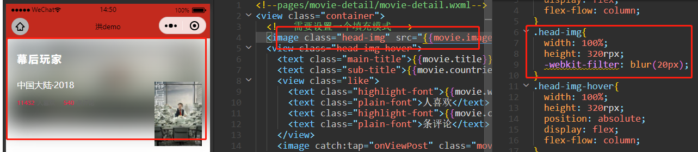
>
>    2. 设置为`aspectFill`效果 -->保持纵横⽐缩放图⽚，只保证图⽚的短边能完全显⽰出来,图片不会变形
>
>       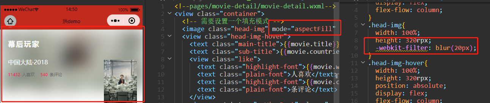
>
>    3. 根据不同的场景选择不同的`mode`才是最正确的,就如同该截图场景中,`aspectFill`明显优于默认


### Ⅳ-[swiper](https://developers.weixin.qq.com/miniprogram/dev/component/swiper.html)

>滑块`视图容器`。其中只可放置[swiper-item](https://developers.weixin.qq.com/miniprogram/dev/component/swiper-item.html)组件，否则会导致未定义的行为。
>
>1. 代码示例
>
>   ```jsx
>   <!--pages/posts/posts.wxml-->
>   <view>
>     <!-- 
>       //1. "false" ==true 普通字符串  
>       //    "{{false}}"==false   {{}}视作运算标记,里面的内容表示表达式 
>       //2. 当你的属性为true时,可以省略value值-- indicator-dots="{{true}}" == indicator-dots
>     -->
>     <swiper indicator-dots="{{true}}" autoplay interval="2000" duration="1000" vertical circular>
>       <swiper-item>
>         <!-- 插槽 -->
>         <image mode="scaleToFill" src="/images/1.jpg"></image>
>       </swiper-item>
>       <swiper-item>
>         <!-- 插槽 -->
>         <image mode="scaleToFill" src="/images/2.jpg"></image>
>       </swiper-item>
>       <swiper-item>
>         <!-- 插槽 -->
>         <image mode="scaleToFill" src="/images/3.jpg"></image>
>       </swiper-item>
>     </swiper>
>   </view>
>   ```
>
>2. 该轮播图代码效果预览: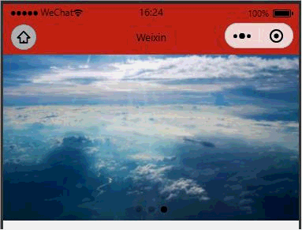

### Ⅴ-[scroll-view](https://developers.weixin.qq.com/miniprogram/dev/component/scroll-view.html)

>可滚动视图区域。使用竖向滚动时，需要给[scroll-view](https://developers.weixin.qq.com/miniprogram/dev/component/scroll-view.html)一个固定高度，通过 WXSS 设置 height。组件属性的长度单位默认为px，[2.4.0](https://developers.weixin.qq.com/miniprogram/dev/framework/compatibility.html)起支持传入单位(rpx/px)。
>
>1. 使用举例图
>
>   


## 2、[LinUi](https://doc.mini.talelin.com/)组件库

### Ⅰ-安装与使用

>1. `Lin UI` 是基于 **微信小程序原生语法** 实现的组件库。遵循简洁，易用的设计规范。
>
>2. 与其他组件库不同的是，除了提供基本的组件外，还会提供 `wxs模块` 、`高级组件` 、 `电商组件模块` 等等。 例如，在电商项目里常用的 `SKU联动选择` ，`城市选择器` 等
>
>3. [`安装`](https://doc.mini.talelin.com/start/)过程可看官方文档:
>
>  1) 打开小程序的项目根目录，执行下面的命令（如果使用了云开发，需要进入miniprogram文件夹下执行下面的命令）
>
>  ```sh
>  npm init
>  /*注意事项
>  1.执行npm init进行初始化，此时会生成一个package.json文件，如果不进行npm init，在构建npm的时候会报一个错误：没有找到 node_modules 目录
>  2.不建议使用cnpm，这样会带来一些未知的错误。如果网络情况不佳，可以使用下面的命令行更换为淘宝源。
>  npm config set registry https://registry.npm.taobao.org */
>  ```
>
>  2)继续执行下面的命令
>
>  ```sh
>  npm install lin-ui
>  ```
>
>4. 安装完成后在小程序需要点击`工具`-->`构建 npm`才可以使用(`所有npm引入的都需要这一步`)
>5. 要使用`自定义组件`的话,需要在`配置.json`文件中(可以在全局的也可以在页面的,作用域不同)注册,具体实现看下面示例

### Ⅱ-[avatar](https://doc.mini.talelin.com/component/view/avatar.html)头像

>1. 要使用`自定义组件`的话,需要在当前page页面.json文件中注册
>
>  ```json
>  //page.json
>  {
>    "usingComponents": {
>      "l-avatar":"/miniprogram_npm/lin-ui/avatar/index",
>       "组件名(可以自取,一般如果是linui,就l-xxx)":"构建后的路径--要具体到那个文件夹下的js"
>    }
>  }
>  ```
>
>2. 使用:
>
>  ```jsx
>  <!--pages/welcome/welcome.wxml-->
>  <view class="container">
>    <!-- <image class="avatar" lazy-load="true" mode="aspectFit" src="/images/测试头像图片.jpg"></image> -->
>   <l-avatar 
>   class="l-avatar"
>   placement="bottom" 
>   open-data="{{['userAvatarUrl','userNickName']}}"
>   size="200"
>   />
>  </view>
>
>  /* pages/welcome/welcome.wxss */
>  //可以自己写样式类,加到组件上
>  .l-avatar{
>    margin-top: 160rpx;
>  }
>  ```

### Ⅲ-icon

>1. 在当前page页面.json文件中注册
>
>   ```json
>   {
>     "usingComponents": {
>       "l-icon":"/miniprogram_npm/lin-ui/icon/index"
>     }
>   }
>   ```
>
>2. 使用
>
>   ```jsx
>    <l-icon size="20" color="#34bfa3" name="cart"></l-icon>
>    <l-icon name="research"></l-icon>
>   ```


------


# 七、小程序[API](https://developers.weixin.qq.com/miniprogram/dev/api/)

## 1、[数据缓存](https://developers.weixin.qq.com/miniprogram/dev/api/storage/wx.setStorageSync.html)

>类似于网页的`localStorage`
>
>官方文档很详细,此处给出具体地址,翻阅文档即可

## 2、[交互](https://developers.weixin.qq.com/miniprogram/dev/api/ui/interaction/wx.showToast.html)

> 一些微信官方给出的组件,具体参数解释看文档,以下给出学习过程中代码示例

### Ⅰ-wx.showToast与wx.showModal

>1. `wx.showToast`代码示例:
>
>   ```js
>     wx.showToast({
>         //此处其实已经被修改完状态,才开始提示,所以要反过来
>         title: this.data.collected ? '收藏成功' : '取消收藏',
>         duration: 1000
>      })
>   ```
>
>2. `wx.showModal`代码示例:
>
>   ```js
>     async onCollect(e) {
>       const result = await wx.showModal({
>         title:  !this.data.collected ? '进行收藏' : '取消收藏',
>       })
>       if (!result.confirm) return; //点击取消退出
>        .......//点击确认后运行的代码
>         wx.showToast({
>         //此处其实已经被修改完状态,才开始提示,所以要反过来
>         title: this.data.collected ? '收藏成功' : '取消收藏',
>         duration: 1000
>       })
>     },
>   ```
>
>3. 运行效果示例(两者并存的效果):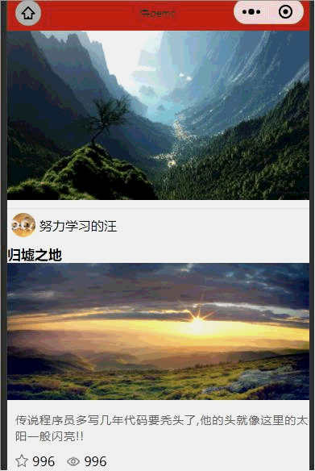
>
>   

## 3、媒体

### Ⅰ-[媒体音乐播放](https://developers.weixin.qq.com/miniprogram/dev/api/media/background-audio/BackgroundAudioManager.html)

>1. wx.getBackgroundAudioManager--播放音乐
>
>2. 代码示例
>
>  ```js
>  const app = getApp() //此处keyi 
>  onLoad: function (options) {
>    const mgr = wx.getBackgroundAudioManager()
>      this.data._mgr = mgr
>      // if(app.gIsPlayMusic) {  此处进入即默认播放
>      //   mgr.src = this.data.postData.music.url
>      //   mgr.title = this.data.postData.music.title
>      // }
>  
>      mgr.onPlay(() => {
>        console.log("监听播放")
>      })
>      mgr.onPause(() => {
>        console.log("监听暂停")
>      })
>      }
>  /**
>     * 音乐播放
>     */
>    onMusic() {
>      const mgr = this.data._mgr
>      if (this.data.isPlaying) {
>        mgr.pause()
>        app.gIsPlayMusicId = -1
>      } //当前播放状态如果为true则终止(stop())、pause()暂停
>      else {
>        mgr.src = this.data.postData.music.url  //此处为播放
>        mgr.title = this.data.postData.music.title
>        app.gIsPlayMusicId = this.data._pid
>      }
>  
>      this.setData({
>        isPlaying: !this.data.isPlaying
>      })
>    },
>  ```

### Ⅱ-[图片](https://developers.weixin.qq.com/miniprogram/dev/api/media/image/wx.saveImageToPhotosAlbum.html)

#### 1) [wx.previewImage(Object object)](https://developers.weixin.qq.com/miniprogram/dev/api/media/image/wx.previewImage.html)

> 在新页面中全屏预览图片。预览的过程中用户可以进行保存图片、发送给朋友等操作
>
> 1. 代码示例
>
>    ```jsx
>    <!--pages/movie-detail/movie-detail.wxml-->
>    <image catch:tap="onViewPost" class="movie-img" src="{{movie.images}}"></image>
>    // pages/movie-detail/movie-detail.js
>    onViewPost(e) { //相册功能(预览)
>        wx.previewImage({
>          urls: [images1,images2],
>        })
>     },
>    ```
>
> 2. 详见开发文档

## 4、界面

### Ⅰ-[Tab Bar](https://developers.weixin.qq.com/miniprogram/dev/reference/configuration/app.html)

>使用时在[app.json](https://developers.weixin.qq.com/miniprogram/dev/framework/config.html)中进行配置即可,相关配置详情看全局配置文档,如果需要进行相应操作看官方文档
>
>```json
>"tabBar": {
>    "selectedColor": "#333333",
>    "color": "#999999",
>    "borderStyle": "black",
>    "position": "top",
>    "list": [
>      {
>        "pagePath": "pages/posts/posts",
>        "text": "阅读",
>        "iconPath": "/images/tabBar/yuedu.png",
>        "selectedIconPath": "/images/tabBar/yuedu_1.png"
>      },
>      {
>        "pagePath": "pages/movies/movies",
>        "text": "电影",
>        "iconPath": "/images/tabBar/dianying_1.png",
>        "selectedIconPath": "/images/tabBar/dianying.png"
>      }
>    ]
>  }
>```


------


# 八、小程序生命周期

>分为`应⽤⽣命周期`和`⻚⾯⽣命周期`
>
>关于小程序前后台的定义和小程序的运行机制，请参考[运行机制](https://developers.weixin.qq.com/miniprogram/dev/framework/runtime/operating-mechanism.html)章节。

## 1、[应用生命周期](https://developers.weixin.qq.com/miniprogram/dev/reference/api/App.html)

>1. 应用生命周期表
>
> | 属性                                                         | 类型     | 必填 | 说明                                                         | 场景                                                         | 最低版本                                                     |
> | :----------------------------------------------------------- | :------- | :--- | :----------------------------------------------------------- | ------------------------------------------------------------ | :----------------------------------------------------------- |
> | [onLaunch](https://developers.weixin.qq.com/miniprogram/dev/reference/api/App.html#onLaunch-Object-object) | function | 否   | 生命周期回调——监听小程序初始化。                             | 小程序初始化完成时触发，全局只触发一次。参数也可以使用 [wx.getLaunchOptionsSync](https://developers.weixin.qq.com/miniprogram/dev/api/base/app/life-cycle/wx.getLaunchOptionsSync.html) 获取。 |                                                              |
> | [onShow](https://developers.weixin.qq.com/miniprogram/dev/reference/api/App.html#onShow-Object-object) | function | 否   | 生命周期回调——监听小程序启动或切前台。                       | 小程序启动，或从后台进入前台显示时触发。也可以使用 [wx.onAppShow](https://developers.weixin.qq.com/miniprogram/dev/api/base/app/app-event/wx.onAppShow.html) 绑定监听 |                                                              |
> | [onHide](https://developers.weixin.qq.com/miniprogram/dev/reference/api/App.html#onHide) | function | 否   | 生命周期回调——监听小程序切后台。                             | 小程序从前台进入后台时触发。也可以使用 [wx.onAppHide](https://developers.weixin.qq.com/miniprogram/dev/api/base/app/app-event/wx.onAppHide.html) 绑定监听 |                                                              |
> | [onError](https://developers.weixin.qq.com/miniprogram/dev/reference/api/App.html#onError-String-error) | function | 否   | 错误监听函数。                                               | 小程序发生脚本错误或 API 调用报错时触发。也可以使用 [wx.onError](https://developers.weixin.qq.com/miniprogram/dev/api/base/app/app-event/wx.onError.html) 绑定监听 |                                                              |
> | [onPageNotFound](https://developers.weixin.qq.com/miniprogram/dev/reference/api/App.html#onPageNotFound-Object-object) | function | 否   | 页面不存在监听函数。                                         | 小程序要打开的页面不存在时触发。也可以使用 [wx.onPageNotFound](https://developers.weixin.qq.com/miniprogram/dev/api/base/app/app-event/wx.onPageNotFound.html) 绑定监听。 | [1.9.90](https://developers.weixin.qq.com/miniprogram/dev/framework/compatibility.html) |
> | [onUnhandledRejection](https://developers.weixin.qq.com/miniprogram/dev/reference/api/App.html#onUnhandledRejection-Object-object) | function | 否   | 未处理的 Promise 拒绝事件监听函数。                          | 小程序有未处理的 Promise 拒绝时触发。也可以使用 [wx.onUnhandledRejection](https://developers.weixin.qq.com/miniprogram/dev/api/base/app/app-event/wx.onUnhandledRejection.html) 绑定监听 | [2.10.0](https://developers.weixin.qq.com/miniprogram/dev/framework/compatibility.html) |
> | [onThemeChange](https://developers.weixin.qq.com/miniprogram/dev/reference/api/App.html#onThemeChange-Object-object) | function | 否   | 监听系统主题变化                                             | 系统切换主题时触发。也可以使用 [wx.onThemeChange](https://developers.weixin.qq.com/miniprogram/dev/api/base/app/app-event/wx.onThemeChange.html) 绑定监听 | [2.11.0](https://developers.weixin.qq.com/miniprogram/dev/framework/compatibility.html) |
> | 其他                                                         | any      | 否   | 开发者可以添加任意的函数或数据变量到 `Object` 参数中，用 `this` 可以访问 |                                                              |                                                              |
>
>2. 代码示例:
>
>   ```jsx
>   App({
>     onLaunch (options) {
>       // Do something initial when launch.
>     },
>     onShow (options) {
>       // Do something when show.
>     },
>     onHide () {
>       // Do something when hide.
>     },
>     onError (msg) {
>       console.log(msg)
>     },
>     globalData: 'I am global data'
>     ,
>     onPageNotFound(res) {
>    	 wx.redirectTo({
>      	 url: 'pages/...'
>    	 }) // 如果是 tabbar 页面，请使用 wx.switchTab
>     }
>       
>   })
>   ```

## 2、[页面生命周期](https://developers.weixin.qq.com/miniprogram/dev/reference/api/Page.html)

>1. 页面生命周期表
>
> | 属性                                                         | 类型     | 说明                                                         |
> | :----------------------------------------------------------- | :------- | :----------------------------------------------------------- |
> | [data](https://developers.weixin.qq.com/miniprogram/dev/reference/api/Page.html#data) | Object   | 页面的初始数据                                               |
> | options                                                      | Object   | 页面的组件选项，同 [`Component` 构造器](https://developers.weixin.qq.com/miniprogram/dev/reference/api/Component.html) 中的 `options` ，需要基础库版本 [2.10.1](https://developers.weixin.qq.com/miniprogram/dev/framework/compatibility.html) |
> | [onLoad](https://developers.weixin.qq.com/miniprogram/dev/reference/api/Page.html#onLoad-Object-query) | function | 生命周期回调—监听页面加载                                    |
> | [onShow](https://developers.weixin.qq.com/miniprogram/dev/reference/api/Page.html#onShow) | function | 生命周期回调—监听页面显示                                    |
> | [onReady](https://developers.weixin.qq.com/miniprogram/dev/reference/api/Page.html#onReady) | function | 生命周期回调—监听页面初次渲染完成                            |
> | [onHide](https://developers.weixin.qq.com/miniprogram/dev/reference/api/Page.html#onHide) | function | 生命周期回调—监听页面隐藏                                    |
> | [onUnload](https://developers.weixin.qq.com/miniprogram/dev/reference/api/Page.html#onUnload) | function | 生命周期回调—监听页面卸载                                    |
> | [onPullDownRefresh](https://developers.weixin.qq.com/miniprogram/dev/reference/api/Page.html#onPullDownRefresh) | function | 监听用户下拉动作                                             |
> | [onReachBottom](https://developers.weixin.qq.com/miniprogram/dev/reference/api/Page.html#onReachBottom) | function | 页面上拉触底事件的处理函数                                   |
> | [onShareAppMessage](https://developers.weixin.qq.com/miniprogram/dev/reference/api/Page.html#onShareAppMessage-Object-object) | function | 用户点击右上角转发                                           |
> | [onShareTimeline](https://developers.weixin.qq.com/miniprogram/dev/reference/api/Page.html#onShareTimeline) | function | 用户点击右上角转发到朋友圈                                   |
> | [onAddToFavorites](https://developers.weixin.qq.com/miniprogram/dev/reference/api/Page.html#onAddToFavorites-Object-object) | function | 用户点击右上角收藏                                           |
> | [onPageScroll](https://developers.weixin.qq.com/miniprogram/dev/reference/api/Page.html#onPageScroll-Object-object) | function | 页面滚动触发事件的处理函数                                   |
> | [onResize](https://developers.weixin.qq.com/miniprogram/dev/reference/api/Page.html#onResize-Object-object) | function | 页面尺寸改变时触发，详见 [响应显示区域变化](https://developers.weixin.qq.com/miniprogram/dev/framework/view/resizable.html#在手机上启用屏幕旋转支持) |
> | [onTabItemTap](https://developers.weixin.qq.com/miniprogram/dev/reference/api/Page.html#onTabItemTap-Object-object) | function | 当前是 tab 页时，点击 tab 时触发                             |
> | 其他                                                         | any      | 开发者可以添加任意的函数或数据到 `Object` 参数中，在页面的函数中用 `this` 可以访 |
>
>2. 官方的小程序页面生命周期图:
>
>   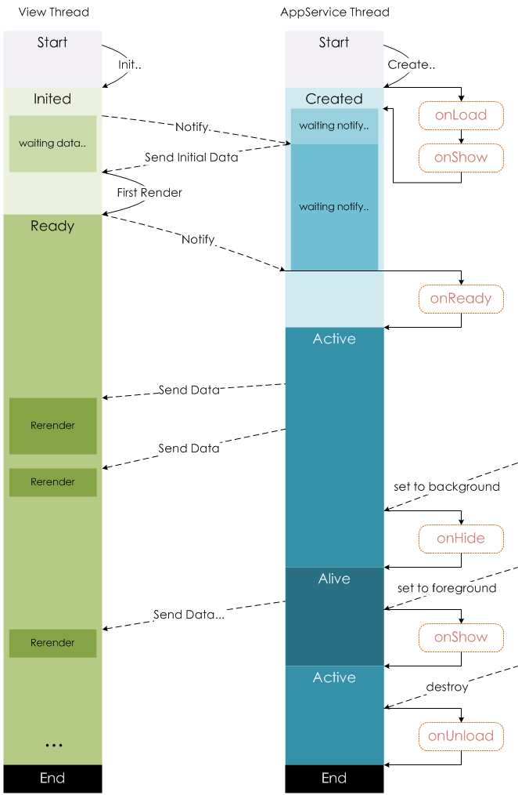

## 3、[组件生命周期](https://developers.weixin.qq.com/miniprogram/dev/framework/custom-component/lifetimes.html)-不算在小程序生命周期中

>组件的生命周期，指的是组件自身的一些函数，这些函数在特殊的时间点或遇到一些特殊的框架事件时被自动触发


------


# 九、[自定义组件](https://developers.weixin.qq.com/miniprogram/dev/framework/custom-component/)

>开发者可以将页面内的功能模块抽象成自定义组件，以便在不同的页面中重复使用；也可以将复杂的页面拆分成多个低耦合的模块，有助于代码维护。自定义组件在使用时与基础组件非常相似
>
>这部分将截取[文档自定义组件部分](https://developers.weixin.qq.com/miniprogram/dev/framework/custom-component/wxml-wxss.html)中常见的部分进行注解

## 1、组件模板和样式

> 类似于页面，自定义组件拥有自己的 `wxml` 模板和 `wxss` 样式。

### Ⅰ-组件样式

>组件对应 `wxss` 文件的样式，只对组件wxml内的节点生效。编写组件样式时，需要注意以下几点：
>
>- 组件和引用组件的页面不能使用id选择器（`#a`）、属性选择器（`[a]`）和标签名选择器，请改用class选择器。
>
>- 组件和引用组件的页面中使用后代选择器（`.a .b`）在一些极端情况下会有非预期的表现，如遇，请避免使用。
>
>- 子元素选择器（`.a>.b`）只能用于 `view` 组件与其子节点之间，用于其他组件可能导致非预期的情况。
>
>- 继承样式，如 `font` 、 `color` ，会从组件外继承到组件内。
>
>- 除继承样式外， `app.wxss` 中的样式、组件所在页面的的样式对自定义组件无效（除非更改组件样式隔离选项）。
>
>  ```css
>  #a { } /* 在组件中不能使用 */
>  [a] { } /* 在组件中不能使用 */
>  button { } /* 在组件中不能使用 */
>  .a > .b { } /* 除非 .a 是 view 组件节点，否则不一定会生效 */
>  ```
>
>除此以外，组件可以指定它所在节点的默认样式，使用 `:host` 选择器（需要包含基础库 [1.7.2](https://developers.weixin.qq.com/miniprogram/dev/framework/compatibility.html) 或更高版本的开发者工具支持）。
>
>注:此处本人出了一个`问题`,详见--->本笔记的`杂记->初学者阶段遇到的问题与解决->Ⅶ`

### Ⅱ-外部样式类

>1. 有时，组件希望接受外部传入的样式类。此时可以在 `Component` 中用 `externalClasses` 定义段定义若干个外部样式类。这个特性可以用于实现类似于 `view` 组件的 `hover-class` 属性：页面可以提供一个样式类，赋予 `view` 的 `hover-class` ，这个样式类本身写在页面中而非 `view` 组件的实现中。
>
>  **注意：在同一个节点上使用普通样式类和外部样式类时，两个类的`优先级是未定义`的，因此最好避免这种情况。**
>
>2. **代码示例：**
>
>     1. 自定义组件部分定义与占位符示例
>
>        ```xaml
>        /* 组件 custom-component.js */
>        Component({
>          externalClasses: ['my-class']
>        })
>                                                                       
>        <!-- 组件 custom-component.wxml 如何引用 -->
>        <custom-component class="my-class">这段文本的颜色由组件外的 class 决定</custom-component>                                 
>        ```
>
>        这样，组件的使用者可以指定这个样式类对应的 class ，就像使用普通属性一样。在 [2.7.1](https://developers.weixin.qq.com/miniprogram/dev/framework/compatibility.html) 之后，可以指定多个对应的 class 。
>
>   2. 外部使用自定义组件并传入样式类
>
>      ```xaml
>      <!-- 页面的 WXML -->
>      <custom-component my-class="red-text" />
>      <custom-component my-class="large-text" />
>      <!-- 以下写法需要基础库版本 2.7.1 以上  注意 这只是一个组件传入两个类名,而不是分别创建两个组件-->
>      <custom-component my-class="red-text large-text" />
>                                                                                                               
>      ------------ 样式类声明 页面.wxss ---------------------------------
>      .red-text {
>        color: red;
>      }
>      .large-text {
>        font-size: 1.5em;
>      }
>      ```
>
>   
>
>3. 主要用途:
>
>     1. 如果子组件都是我们自己开发的,而且无所谓改动自定义组件源码,那可以不使用这个
>
>     2. 如果自定义组件封装已经足够成熟,不想再动其中样式源码,就可以用外部样式类进行对自定义组件样式改变(使用`!important`属性能将样式优先级提高),以此进行对于封装好的组件的样式修改,同理可以运用于第三方库
>
>        ```css
>        .movielist{ //外部样式类
>          margin-bottom: 25rpx;
>          background-color: #fff !important;  //此处就可以将这个样式提升到自定义组件样式优先级之上
>        }
>        ```
>
>   3. 以后如果自己封装自定义组件,就可以向外暴露外部样式类

## 2、组件间通信与事件

### Ⅰ-组件间通信

>组件间的基本通信方式有以下几种。
>
>- WXML 数据绑定：用于父组件向子组件的指定属性设置数据，仅能设置 JSON 兼容数据（自基础库版本 [2.0.9](https://developers.weixin.qq.com/miniprogram/dev/framework/compatibility.html) 开始，还可以在数据中包含函数）。具体在 [组件模板和样式](https://developers.weixin.qq.com/miniprogram/dev/framework/custom-component/wxml-wxss.html) 章节中介绍。
>- 事件：用于子组件向父组件传递数据，可以传递任意数据。
>- 如果以上两种方式不足以满足需要，父组件还可以通过 `this.selectComponent` 方法获取子组件实例对象，这样就可以直接访问组件的任意数据和方法。

### Ⅱ-触发事件

>自定义组件触发事件时，需要使用 `triggerEvent` 方法，指定事件名、detail对象和事件选项
>
>1. 官方代码示例
>
>   ```jsx
>   <!-- 在自定义组件中 -->
>   <button bindtap="onTap">点击这个按钮将触发“myevent”事件</button>
>   //js文件中
>   Component({
>     properties: {},
>     methods: {
>       onTap: function(){
>         var myEventDetail = {} // detail对象，提供给事件监听函数
>         var myEventOption = {} // 触发事件的选项
>         this.triggerEvent('myevent', myEventDetail, myEventOption)
>       }
>     }
>   })
>   ```
>
>2. 本人在[`hello小程序`](https://gitee.com/hongjilin/wechat-applet-demo-source-code)源码中应用
>
>   ```jsx
>   <!--pages/posts/posts.wxml-->
>   <block wx:for="{{posts}}" wx:for-item="item" wx:key="postId" wx:for-index="index">
>       <post bind:posttap="onGoDetail" res="{{item}}" />
>     </block>
>   // components/posts/index.js  这是自定义组件
>   
>    methods: {
>       onTap (e) {  //此处不能用箭头函数,否则`  this.triggerEvent`将会找不到报错
>       const pid = this.data.res.postId
>       // console.log( this.data)
>       // console.log( this.properties)
>         this.triggerEvent('posttap',{
>           pid   //这个参数会在事件调用处获取到
>         })
>       },
>    }
>   
>   // pages/posts/posts.js  这个是在调用自定义组件的页面的js中,即可以使用自己的方法,单纯是调用自定义组件定义的事件
>     onGoDetail: (e) => { //获取组件的自定义属性
>       //先判断,如果e.currentTarget.dataset去得到值,就取有值的 下面这3种写法效果等同
>       //  let pid = (e.currentTarget.dataset.id)?e.currentTarget.dataset.id:e.detail.pid 
>       // let pid = e.detail.pid|e.currentTarget.dataset.id  
>       let pid = e.detail.pid || e.currentTarget.dataset.id
>       wx.navigateTo({
>         url: '/pages/post-detail/post-detail?pid=' + pid,
>     })
>   ```


------

# 杂记

> 体系学习过程笔记外的知识点

## 1、微信开发者工具使用技巧

### Ⅰ-新建页面的技巧与规则:

>1. 本技巧适用于`微信开发者工具`
>2. 当你需要新建一个页面时:新建一个page文件目录-->右键`新建page`-->输入page名字-->一次生成所需四个文件 且自动注册到`app.json`中
>3. ##如果配置文件中出现错误时,自动新建无法成功,更无法自动注册

### Ⅱ-指定初始页面

>当你写多个page时,如果每次通过修改`app.json`的配置项来指定初始页面,十分麻烦
>
>1. 可以在`app.json`用"entryPagePath":"pages/页面文件夹/页面文件名" 配置首页,但仍要修改配置文件,十分麻烦
>
>2. 使用编译器的`工具栏`-->添加`编译模式`进行指定初始化页面(启动页面默认值要先删除才有提示)
>
>   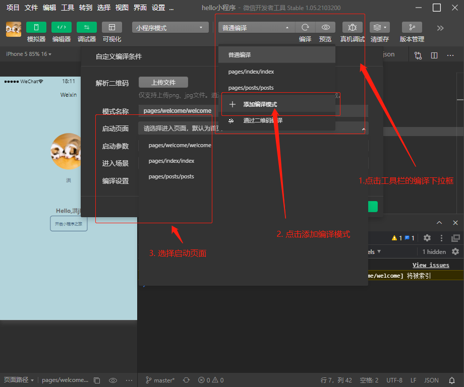
>
>3. 添加后每次调试只要`选择编译模式`,就可以切换初始页面

### Ⅲ-ctrl+滚轮缩放工具界面

>只能调成字体了,`这个BUG被修复了`:dog: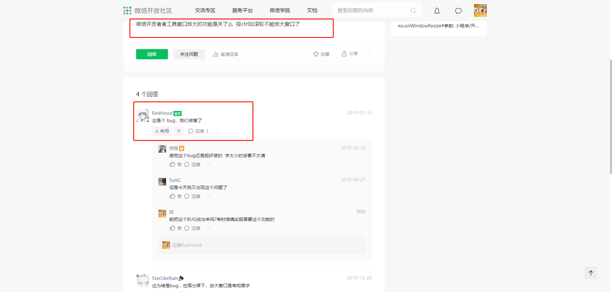


## 2、微信开发常见编程方法与细节

>学习、练习、开发微信小程序过程中遇到的一些基础知识与细节记录

### Ⅰ-相对路径规则:

> 1. `/`代表根目录:如引入根目录下的images/图片 
>
>    ```xml
>    <image src="/images/测试头像图片.jpg"></image>
>    ```
>
> 2. 其余的如:`../`上一级目录、`./`同级目录,都与一般无异

### Ⅱ-npm引入第三方库后需进行构建

>安装第三方库后在小程序需要点击`工具`-->`构建 npm`才可以使用
>
>`所有npm引入的都需要这一步`


## 3、初学阶段遇到的问题与解决

> 这部分将记录本人初学小程序过程遇到的问题,这部分应该大部分是小程序初学者才会遇到的,或者是本人虽然可以直接解决但觉得别人可能会遇到的便记录下来。而后续进阶阶段或者实战开发时遇到的问题,将记录在下面另一章节

### Ⅰ-设置整个page的背景色

> 1. 问题:当我设置页面背景色时,发现添加背景色的page的高度是被内容撑起而不是全屏?如何解决最简单
>    问题截图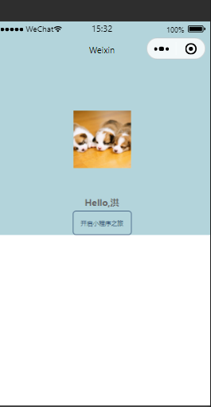解决后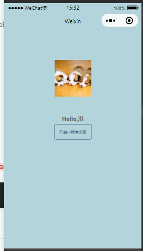
>
>    解决:可以在你需要修改的page的样式文件中,给`<page/>`标签加样式,默认小程序是使用<page/>作为最外层的
>
>    ```css
>    page{
>      background-color: #b3d4db;
>    }
>    ```

### Ⅱ-小程序中使用less

>原⽣⼩程序不⽀持 less ，其他基于⼩程序的框架⼤体都⽀持，如 wepy ， mpvue ， taro 等。 但是仅仅因为⼀个less功能，⽽去引⼊⼀个框架，肯定是不可取的。因此可以⽤以下⽅式来实现
>
>1. 编辑器是`vscode`
>
>2. 安装插件`easy less`
>
>   
>
>3. 在vscode的设置中加⼊如下，配置
>
>   ```json
>     "less.compile": {
>           "outExt": ".wxss"
>      }
>   ```
>
>4. 在要编写样式的地⽅，新建 less ⽂件，如 index.less ,然后正常编辑即可。

### Ⅲ-报错: `TypeError: wx.getMenuButtonBoundingClientRect is not a function`

>控制台报错: `TypeError: wx.getMenuButtonBoundingClientRect is not a function`
>
>问题分析:这个 api是 更高版本版本支持的，你的用户有的客户端基础库版本 小于这个基础库。你在小程序后台设置下 最低基础库2.1.0.那样用户客户端基础库版本低于此就会提示升级
>
>解决: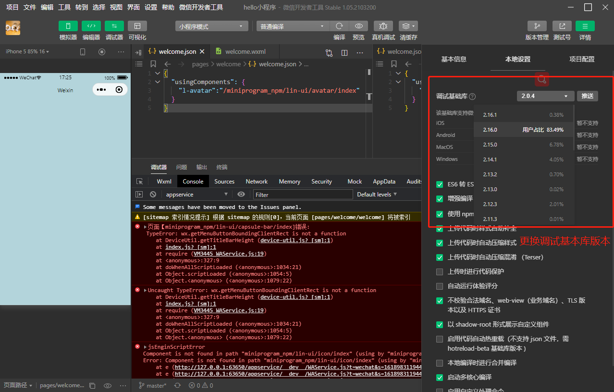

### Ⅳ-警告:`无效的page.json`

>这是初学者才会犯下的错误,但也记录下来
>
>1. 问题:在page.json配置文件中与要修改导航栏颜色,却发生报错
>     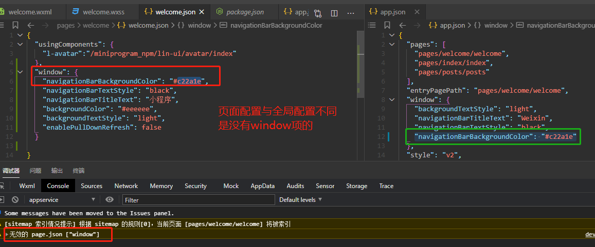
>2. 解决:修改相应报错配置([翻阅文档](https://developers.weixin.qq.com/miniprogram/dev/reference/configuration/page.html)),虽然响应的属性值相同,但一个外层包裹window,另一个没有包裹
>     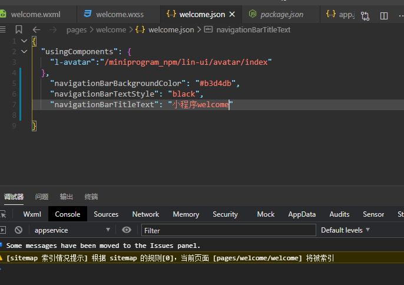

### Ⅴ-报错:`typeError: Cannot read property 'mark' of undefined`

>1. 报错
>
>  ​	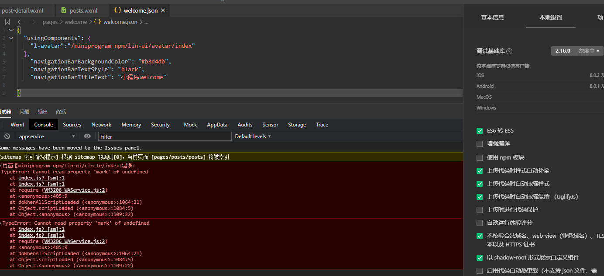
>
>2. 解决:最终发现是小程序工具设置问题
>
>  需要勾选增强编译
>
>  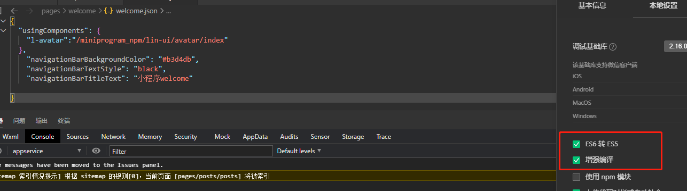

### Ⅵ-微信小程序中使用箭头函数导致this指向错误的问题

>1. 问题代码截图:
>
> 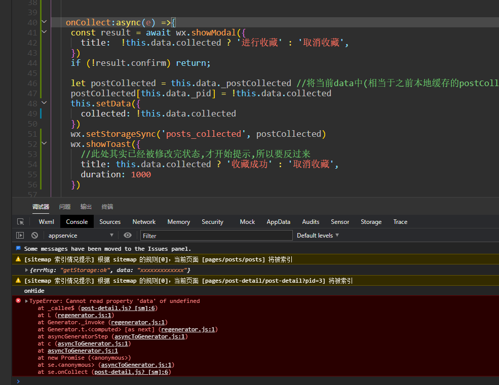
>
>2. 问题分析:
>
> 众所周知,箭头函数`会改变this指向`,当我使用箭头函数后,函数中的this不再指向实例而是指向函数本身,导致data其实是找不到的发生报错
>
>3. 问题解决:
>
>    1. 不使用箭头函数:
>
>       ```jsx
>          async onCollect(e) {
>             const result = await wx.showModal({
>               title:  !this.data.collected ? '进行收藏' : '取消收藏',
>             })
>             if (!result.confirm) return;
>       
>             let postCollected = this.data._postCollected //将当前data中(相当于之前本地缓存的postCollected)拉去下来,防止被覆盖
>             postCollected[this.data._pid] = !this.data.collected
>             this.setData({
>               collected: !this.data.collected
>             })
>             wx.setStorageSync('posts_collected', postCollected)
>             wx.showToast({
>               //此处其实已经被修改完状态,才开始提示,所以要反过来
>               title: this.data.collected ? '收藏成功' : '取消收藏',
>               duration: 1000
>             })
>           },
>       ```
>
>    2. 使用箭头函数,但需要保存this指向
>
>       ```js
>         let con  //用来保存this指向
>                                                                               
>         Page({
>           //1. 生命周期函数中保存this指向
>         onLoad: function (options) {
>             	con=this  //用来保存this指向
>         },
>           //2. 函数体写法
>         onCollect:async (e)=> {  箭头函数写法,需要保存this指向
>            console.log(con)
>           const result = await wx.showModal({
>             title:  !con.data.collected ? '进行收藏' : '取消收藏',
>           })
>           if (!result.confirm) return;
>                                                                               
>           let postCollected = con.data._postCollected //将当前data中(相当于之前本地缓存的postCollected)拉去下来,防止被覆盖
>           postCollected[con.data._pid] = !con.data.collected
>           con.setData({
>             collected: !con.data.collected
>           })
>           wx.setStorageSync('posts_collected', postCollected)
>           wx.showToast({
>             //此处其实已经被修改完状态,才开始提示,所以要反过来
>             title: con.data.collected ? '收藏成功' : '取消收藏',
>             duration: 1000
>           })
>         })
>       ```

### Ⅶ-警告: `Some selectors are not allowed in component wxss, including tag name selectors, ID selectors, and attribute selectors`

>1. 出现场景:在我将之前写好的样式模块抽出成`自定义组件`时,控制台突然出现警告
>
>   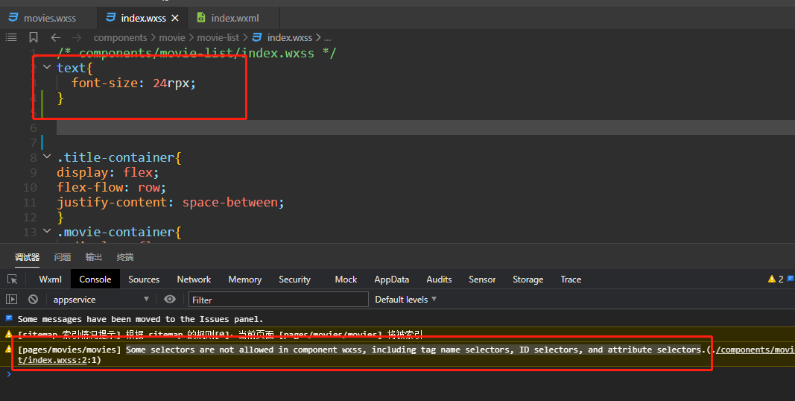
>
>2. 分析:我使用了`属性选择器`,而[官方文档在自定义组件部分](https://developers.weixin.qq.com/miniprogram/dev/framework/custom-component/wxml-wxss.html)有要求不能使用,防止出现样式错误,
>
>   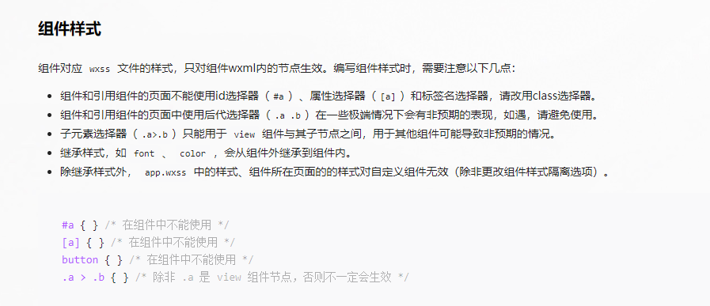
>
>3. 解决:将属性选择器删除即可

### Ⅷ-解决flex布局中 space-between方法的排版问题

>flex布局 justify-content：space-between； 解决最后一排数量不够自动向两端排列问题
>
>1. 问题图示:
>
>   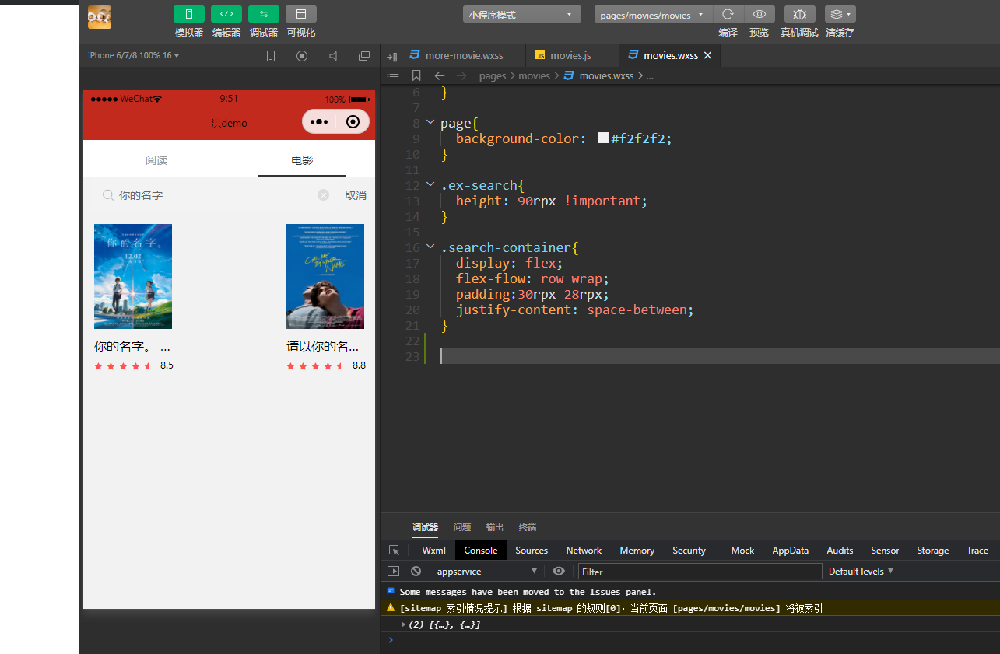
>
>2. 分析:flex 布局两端对齐当最后一排数量不够时，会出现以下布局情况
>
>   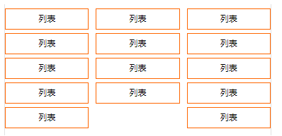
>
>3. 解决方法1:父级添加after伪类法
>
>   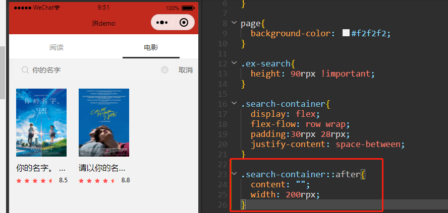
>
>   ps:这种解决方案只适合每列有`3个`的分布情况，如果布局每列有4个，5个,就需要解决方法2
>
>4. 解决方法2:使用grid栅格布局,此处不详解,只将解决方案指出,有需要的直接百度搜索`使用grid栅格布局`即可


